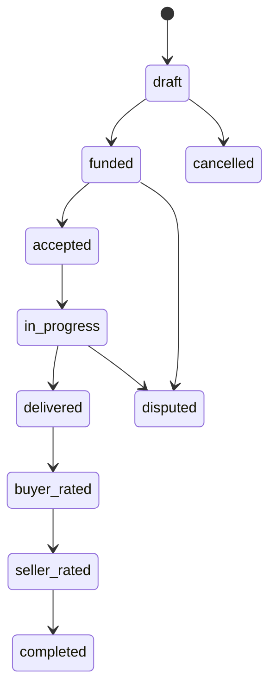

# MusicApp Documentation Governance Standard

| Field | Value |
|---|---|
| Document ID | GOV-000 |
| Status | Approved |
| Owner | Documentation Working Group (interim: repository maintainers) |
| Version | 1.1.0 |
| Last Reviewed | 2026-07-22 |
| Applies To | All documentation under `docs/` in this repository |

## Documentation Map

| Folder | Purpose | Status |
|---------|---------|--------|
| 00-governance | Documentation standards | Active |
| 01-foundation | Product vision and architecture | Planned |
| 02-users-roles-permissions | Authentication & RBAC | Planned |
| 03-identity-profiles-verification | Profiles & verification | Planned |
| 04-marketplace | Marketplace & discovery | Planned |
| 05-projects-milestones | Projects & milestones | Planned |
| 06-payments-escrow | Escrow & payments | Planned |
| 07-messaging-collaboration | Messaging | Planned |
| 08-ratings-reputation | Ratings | Planned |
| 09-moderation-trust-safety | Moderation | Planned |
| 10-notifications | Notifications | Planned |
| 11-admin-operations | Admin | Planned |
| 12-analytics-reporting | Analytics | Planned |
| 13-api | REST API | Planned |
| 14-database | Database specifications | Planned |
| 15-security | Security | Planned |
| 16-infrastructure | Infrastructure | Planned |
| 17-testing | Testing | Planned |
| 18-deployment | Deployment | Planned |
| 99-appendices | References | Planned |

## 1. Purpose and Scope

### 1.1 Purpose

This document is the canonical governance standard for all documentation produced in the MusicApp repository. It defines how documentation is structured, written, identified, versioned, reviewed, and retired. Its goal is to keep documentation trustworthy as the system grows: a reader — engineer, reviewer, or future maintainer — must be able to open any document under `docs/` and know what it is, whether it can be relied upon, and what in the codebase it corresponds to.

### 1.2 Scope

This standard applies to every document under `docs/`, including but not limited to:

- Product and business-rule specifications
- Architecture and system-design documents
- API documentation
- Database schema documentation
- Security documentation
- Testing and QA documentation
- Deployment and operational runbooks
- Architecture Decision Records (ADRs)

It does **not** govern:

- Inline code comments
- Commit messages and pull request descriptions (though PRs that touch documentation are subject to §26)
- Third-party or vendor documentation

### 1.3 Normative Language

This document uses RFC 2119-style keywords. Their meaning is binding for all documentation authored under this standard:

| Keyword | Meaning |
|---|---|
| **MUST** / **MUST NOT** | Absolute requirement or prohibition. Non-compliant documents MUST NOT be merged. |
| **SHOULD** / **SHOULD NOT** | Strong recommendation. Deviation MUST be justified in the document or PR description. |
| **MAY** | Optional; left to author discretion. |

## 2. Documentation Principles

1. **Accuracy over completeness.** A document that correctly says "not yet implemented" is more valuable than one that describes an idealized system.
2. **Verifiability.** Every factual claim about current system behavior MUST be traceable to code, schema, configuration, or a decision record — not to assumption or memory.
3. **Single source of truth.** Each fact MUST have exactly one authoritative document. Other documents reference it; they MUST NOT restate it in a way that can drift out of sync (see §12).
4. **Explicit uncertainty.** Assumptions, proposals, and open questions MUST be labeled as such (see §22). Silence on status is treated as an error, not as an implicit "current."
5. **Documentation is a deliverable.** A feature is not complete until its governing documentation reflects the change. Documentation debt is tracked the same way code debt is.
6. **Write for the reader who wasn't there.** Documents MUST stand alone: a reader with repository access but no conversation history MUST be able to understand context, rationale, and current status without asking the author.

## 3. Documentation Hierarchy

Documentation in this repository is layered. Lower layers MUST NOT contradict higher layers; contradictions are resolved by correcting the lower layer or raising a change request against the higher one.

```
Layer 0  Governance (this document, and any documents in 00-governance/)
Layer 1  Foundation (vision, glossary, architecture principles)
Layer 2  Domain specifications (users, identity, marketplace, projects, payments, etc.)
Layer 3  Cross-cutting specifications (API, database, security, testing, infrastructure, deployment)
Layer 4  Decision records and appendices (ADRs, glossary appendix, historical notes)
```

A domain specification (Layer 2) MAY reference a cross-cutting specification (Layer 3), and vice versa, but neither MAY override Layer 0 or Layer 1 without an accompanying ADR (see §17).

## 4. Directory Structure

The repository's `docs/` tree is fixed at the following top-level structure. New top-level directories MUST NOT be added without updating this section.

| Directory | Domain |
|---|---|
| `00-governance/` | This standard and any governance sub-documents |
| `01-foundation/` | Vision, principles, glossary, high-level architecture |
| `02-users-roles-permissions/` | User accounts, authentication, authorization, roles, permission model |
| `03-identity-profiles-verification/` | Profiles, identity verification, verification documents |
| `04-marketplace/` | Listings, discovery, services |
| `05-projects-milestones/` | Projects, milestones, project lifecycle |
| `06-payments-escrow/` | Escrow, payments, ledger, payouts |
| `07-messaging-collaboration/` | In-project messaging and collaboration tooling |
| `08-ratings-reputation/` | Ratings, reviews, reputation scoring |
| `09-moderation-trust-safety/` | Moderation, trust and safety controls |
| `10-notifications/` | Notification delivery and preferences |
| `11-admin-operations/` | Internal admin tooling and operations |
| `12-analytics-reporting/` | Analytics, metrics, reporting |
| `13-api/` | Cross-cutting API standards and endpoint references |
| `14-database/` | Cross-cutting schema documentation |
| `15-security/` | Cross-cutting security policy and controls |
| `16-infrastructure/` | Infrastructure and environment documentation |
| `17-testing/` | Test strategy, coverage, and QA process |
| `18-deployment/` | Deployment process and release management |
| `99-appendices/` | Glossary, ADR index, historical/reference material |

Within each numbered domain directory, documents SHOULD be further split by concern (e.g., `05-projects-milestones/business-rules.md`, `05-projects-milestones/lifecycle.md`) rather than accumulated into a single file once the directory grows past a few hundred lines.

## 5. Document Types

| Type | Purpose | Typical Location |
|---|---|---|
| **Specification (SPEC)** | Defines intended or current behavior of a domain | Domain directories (02–12) |
| **Standard (STD)** | Defines a cross-cutting convention (API, DB, security, testing) | 13–17 |
| **Decision Record (ADR)** | Records a single architectural or product decision and its rationale | `99-appendices/adr/` |
| **Runbook (RUN)** | Operational procedure for a recurring task (deploy, incident response) | `16-infrastructure/`, `18-deployment/` |
| **Glossary (GLOS)** | Canonical term definitions | `99-appendices/glossary.md` |
| **Reference (REF)** | Supporting material that is not itself normative (diagrams index, external links) | `99-appendices/` |

Every document MUST declare its type in its metadata block (§9).

## 6. File Naming Standards

- File names MUST use `kebab-case.md`.
- File names MUST be descriptive nouns or noun phrases, not verbs: `milestone-lifecycle.md`, not `document-milestones.md`.
- ADRs MUST be named `adr/ADR-NNN-short-title.md`, zero-padded to three digits.
- Files that document a single database table SHOULD be named after the table: `escrow-ledger.md` for the `escrow_ledger` table.
- Files MUST NOT include dates, author initials, or version numbers in the filename. Versioning is metadata (§10), not a filename concern.

## 7. Heading Conventions

- Each document MUST have exactly one H1 (`#`), matching its title.
- Headings MUST use sentence case ("Database migration process", not "Database Migration Process").
- Heading levels MUST NOT be skipped (an H3 MUST NOT appear directly under an H1).
- Section numbering (`## 1. Purpose`) is OPTIONAL but, once used in a document, MUST be applied consistently throughout that document.

## 8. Document Metadata Requirements

Every document MUST open with a metadata table immediately after the H1, containing at minimum:

| Field | Required | Notes |
|---|---|---|
| Document ID | Yes | Per the identifier convention in §11 |
| Status | Yes | One of the values in §10.1 |
| Owner | Yes | A team or role, not necessarily an individual |
| Version | Yes | Semantic version per §10.2 |
| Last Reviewed | Yes | ISO 8601 date |
| Applies To | SHOULD | Scope of the document |
| Supersedes / Superseded By | If applicable | Links to related documents |

## 9. Document Status Lifecycle

Every document MUST declare exactly one status, and MUST update it as the underlying behavior changes:

| Status | Meaning |
|---|---|
| **Draft** | Under active authoring; not yet reviewed. MUST NOT be cited as authoritative. |
| **Proposed** | Complete and reviewable, describing behavior that does not yet exist in the codebase. |
| **Approved** | Reviewed and accepted as the target behavior; may describe future or current behavior, and MUST state which (§22). |
| **Implemented** | Describes behavior that is verifiably present in the current codebase. |
| **Deprecated** | No longer the intended behavior; retained for historical context. MUST link to its replacement if one exists. |
| **Archived** | Moved to `99-appendices/` or otherwise retained for record only; MUST NOT be treated as current. |

Status transitions MUST be recorded in the document's version history (§10.3), not silently overwritten.

## 10. Versioning Rules

### 10.1 Scope

Versioning applies to individual documents, not the `docs/` tree as a whole.

### 10.2 Scheme

Documents MUST use semantic versioning (`MAJOR.MINOR.PATCH`):

- **MAJOR** — a change that invalidates or contradicts prior guidance (e.g., a business rule reversal).
- **MINOR** — new content that is additive and non-breaking (e.g., a new section, a new endpoint documented).
- **PATCH** — corrections that do not change meaning (typos, formatting, broken links).

New documents MUST start at `1.0.0` once they reach **Approved** status. Documents in **Draft** MAY use `0.x.y`.

### 10.3 Version History

Every document MUST end with (or link to) a version history table:

| Version | Date | Change | Author |
|---|---|---|---|
| 1.0.0 | YYYY-MM-DD | Initial approved version | — |

## 11. Requirement Identifiers

Identifiers MUST be stable, globally unique within their prefix, and MUST NOT be reused after deletion (retire the ID; do not recycle it).

| Prefix | Meaning | Format | Example |
|---|---|---|---|
| `REQ-[DOMAIN]-NNN` | Functional or non-functional requirement | 3-digit, zero-padded | `REQ-ESCROW-014` |
| `BR-[DOMAIN]-NNN` | Business rule | 3-digit, zero-padded | `BR-PROJECTS-003` |
| `ADR-NNN` | Architecture decision record | 3-digit, zero-padded, no domain | `ADR-007` |
| `API-[DOMAIN]-NNN` | API endpoint or contract | 3-digit, zero-padded | `API-AUTH-002` |
| `SEC-NNN` | Security control or requirement | 3-digit, zero-padded, no domain | `SEC-011` |
| `GOV-NNN` | Governance document (this family) | 3-digit, zero-padded | `GOV-000` |

`[DOMAIN]` MUST be one of the short domain tokens below, matching the directory it documents:

`AUTH`, `AUTHZ`, `USERS`, `IDENTITY`, `MARKETPLACE`, `PROJECTS`, `ESCROW`, `MESSAGING`, `RATINGS`, `MODERATION`, `NOTIFICATIONS`, `ADMIN`, `ANALYTICS`

`AUTH` and `AUTHZ` are deliberately distinct tokens and MUST NOT be merged:

| Token | Domain | Answers |
|---|---|---|
| `AUTH` | Authentication | "Can this actor prove control of this identity?" |
| `AUTHZ` | Authorization | "May this actor perform this action on this resource now?" |

Authentication proves identity; Authorization evaluates permissions against that proven (or anonymous) identity. Business rules and requirements for the two domains MUST use their own token (`BR-AUTH-*`/`REQ-AUTH-*` vs. `BR-AUTHZ-*`/`REQ-AUTHZ-*`) and MUST NOT be filed under the other domain's token, even though both live under the same directory (`02-users-roles-permissions/`) alongside `USERS`.

Every requirement and business rule ID MUST be introduced exactly once, in the domain document that owns it. Other documents MAY reference the ID but MUST NOT redefine it.

### 11.1 Domain-Scoped Security, Data-Model, Interface, and Audit Identifiers

In addition to the cross-cutting, domain-less `SEC-NNN` family (§18, for the centralized `15-security/` registry), a domain specification document MAY record its own domain-scoped findings using the following identifier families, using the same `[DOMAIN]` tokens as §11:

| Prefix | Meaning | Format | Example |
|---|---|---|---|
| `SEC-[DOMAIN]-NNN` | A security finding specific to one domain's specification, distinct from the centralized `15-security/` `SEC-NNN` registry | 3-digit, zero-padded | `SEC-AUTHZ-004` |
| `DATA-[DOMAIN]-NNN` | A target data-model entity or field set specific to one domain's specification | 3-digit, zero-padded | `DATA-AUTHZ-001` |
| `INT-[DOMAIN]-NNN` | An interface, integration point, or shared utility specific to one domain's specification | 3-digit, zero-padded | `INT-AUTHZ-001` |
| `AUD-[DOMAIN]-NNN` | An audit-event or audit-field requirement specific to one domain's specification | 3-digit, zero-padded | `AUD-AUTHZ-001` |

These four families are subject to the same stability, uniqueness, and single-ownership rules as `REQ-*`/`BR-*` (§11). They MAY be introduced by any domain document for its own `[DOMAIN]` token without requiring a separate governance change per document — the families themselves are governed here, once, for all permitted domain tokens.

## 12. Source-of-Truth Rules

- Each fact (a business rule, a field definition, an endpoint contract) MUST have one and only one document that is its source of truth.
- Documents referencing a fact owned elsewhere MUST link to the owning document rather than duplicating the definition.
- When code and documentation disagree, the discrepancy MUST be resolved by either (a) filing a documentation fix, or (b) filing a change request against the code — it MUST NOT be left unresolved or silently favored one way in later documents.
- Database schema documentation (`14-database/`) MUST be derived from the actual migration files in `backend/db/`, not from design intent. If a proposed schema differs from the applied migrations, it MUST be marked **Proposed**, not **Implemented**.

## 13. Traceability Requirements

- Every API endpoint documented in `13-api/` SHOULD link to the business rules (`BR-*`) and requirements (`REQ-*`) it satisfies.
- Every business rule SHOULD state which database constraint(s), if any, enforce it, and MUST say so explicitly when no such constraint exists (i.e., the rule is enforced only in application code, or not yet enforced at all).
- Every ADR MUST list the requirements or business rules it affects.
- Test documentation (`17-testing/`) SHOULD map test suites back to the requirement or business-rule IDs they verify.

## 14. Decision Records (ADRs)

- ADRs live in `99-appendices/adr/` and are numbered sequentially, never reused.
- An ADR MUST be written whenever a decision changes a previously Approved or Implemented document, introduces a new cross-cutting standard, or reverses a prior decision.
- An ADR MUST contain: context, the decision, alternatives considered, consequences, and status (`Proposed`, `Accepted`, `Superseded`).
- An ADR's status is independent of the documents it affects; an Accepted ADR whose effects are not yet built MUST be reflected as "Approved / not yet Implemented" in the affected domain document (§22).

## 15. Business-Rule Documentation

Business rules govern domain behavior independent of any single API or table. Each business rule entry MUST include:

| Field | Requirement |
|---|---|
| ID | `BR-[DOMAIN]-NNN` |
| Statement | A single, testable sentence using MUST/MUST NOT/SHOULD |
| Rationale | Why the rule exists |
| Enforcement | Where it is enforced today: database constraint, application code, both, or "not yet enforced" |
| Status | Per §9 |

**Example — Projects domain**, grounded in `backend/db/005_create_projects.sql`:

> **BR-PROJECTS-001** — A project MUST NOT have the same user as both buyer and seller.
> Rationale: prevents self-dealing and self-funded fake transaction volume.
> Enforcement: database constraint `projects_no_self_dealing` (`CHECK (buyer_user_id <> seller_user_id)`).
> Status: Implemented.

> **BR-PROJECTS-002** — Once a project's milestones are locked, milestone commercial terms (amount, currency, title, description, due date, milestone number) MUST NOT change; only operational fields (state) may continue to update.
> Rationale: gives both parties a fixed, tamper-evident set of terms once work begins.
> Enforcement: database trigger `protect_locked_milestones` on `project_milestones`, guarded by `projects.milestones_locked_at` (`backend/db/008_add_milestone_locking.sql`).
> Status: Implemented.

## 16. API Documentation Standards

Each endpoint documented under `13-api/` MUST include:

| Field | Requirement |
|---|---|
| ID | `API-[DOMAIN]-NNN` |
| Method and path | e.g., `POST /projects` |
| Auth requirement | e.g., requires an authenticated session |
| Request shape | Fields, types, required/optional |
| Response shape | Success and error shapes |
| Related business rules | `BR-*` IDs enforced by this endpoint |
| Status | Per §9 — MUST distinguish an endpoint that exists in code from one that is planned |

**Example, grounded in `backend/Index.js`:**

> **API-AUTH-001** — `POST /auth/signup`
> Auth requirement: none (public).
> Status: Implemented.
>
> **API-PROJECTS-003** — `POST /projects/:projectId/lock-milestones`
> Auth requirement: requires authentication (`requireAuth`).
> Related business rules: `BR-PROJECTS-002`.
> Status: Implemented.

Endpoints MUST NOT be documented as available unless they are found in the routing code at the time of writing. A proposed-but-unbuilt endpoint MUST be marked **Proposed** and MUST NOT appear in the same table as implemented endpoints without a clearly distinguishing status column.

## 17. Database Documentation Standards

- Schema documentation MUST be written from the applied migration files in `backend/db/`, in migration order, not from an idealized end-state.
- Each documented table MUST list: columns and types, constraints (with constraint names as they appear in the migration), foreign keys, indexes, and the migration file that introduced it.
- Enum types (e.g., `project_state`, `milestone_state`, `escrow_status`) MUST list every value and, where known, what triggers each transition.
- Column-level currency, amount, or unit fields MUST document their unit explicitly (e.g., "`price_amount` is an integer; unit — smallest currency subunit or whole unit — MUST be confirmed against application code before being asserted, not assumed").
- If a business rule is described elsewhere as enforced (e.g., "amounts are always INR"), but no database constraint restricts the column's values, the schema document MUST note that the rule is enforced at the application layer, not the schema layer.

## 18. Security Documentation Standards

- Security documentation lives in `15-security/` and MUST use the `SEC-NNN` identifier.
- Each security control MUST state: the threat or requirement it addresses, its current enforcement point (e.g., password hashing at signup, JWT-based session auth), and its status per §9.
- Security documentation MUST NOT include actual secrets, credentials, API keys, or `.env` contents, including as examples. Reference `.env.example` for shape, never a real `.env` file.
- Any gap between documented and actual security posture (e.g., a control that is planned but not yet implemented) MUST be labeled **Proposed** or **Approved / not yet Implemented**, never presented as current.

## 19. Testing Documentation Standards

- Test documentation lives in `17-testing/` and covers strategy, coverage expectations, and process — not the tests themselves (those live in code).
- Test documentation SHOULD map suites or planned suites to the `REQ-*` and `BR-*` identifiers they verify.
- Test documentation MUST distinguish tests that exist from testing strategy that is planned but not yet implemented.

## 20. Diagrams and Mermaid Standards

- Diagrams SHOULD be authored as Mermaid code blocks (` ```mermaid `) rather than external image files, so they stay diffable in pull requests.
- Every diagram MUST have a one-line caption above or below it explaining what it shows.
- Lifecycle/state diagrams (e.g., project or milestone state machines) MUST use the exact enum values from the schema (§17), not paraphrased state names.
- Diagrams MUST be kept next to the text they illustrate, not centralized in a separate "diagrams" file, unless the diagram spans multiple domains (in which case it belongs in `99-appendices/`).

Example, grounded in `project_state` (`backend/db/005_create_projects.sql`):



## 21. Internal Linking Rules

- Links between documents MUST use relative paths (e.g., `../06-payments-escrow/escrow-ledger.md`), not absolute file-system paths or external URLs to the repository.
- A link to a specific requirement or rule SHOULD link to the section anchor, not just the file.
- Broken internal links are a review blocker (§26) and MUST be fixed before merge.
- Documents MUST NOT link to Draft-status documents as if they were authoritative; if a reference is necessary, it MUST note the target's Draft status inline.

## 22. Terminology and Glossary Rules

- Canonical term definitions live in `99-appendices/glossary.md`. A term MUST be defined there before being used as a defined term (capitalized or backticked) elsewhere.
- Domain documents MUST NOT redefine a term already in the glossary; they MAY link to it.
- Where the codebase and product conversation use different words for the same concept (e.g., a schema column name versus a product-facing term), the glossary entry MUST record both and state which is authoritative in which context.

## 23. Assumptions, Open Questions, and Risks

Every document that is not purely descriptive of already-Implemented behavior MUST distinguish between four categories, using these exact labels as subsection headers or inline tags:

| Label | Meaning |
|---|---|
| **Current (Implemented)** | Verified against code, schema, or configuration at time of writing |
| **Approved (future)** | Accepted via ADR or product decision, not yet built |
| **Proposed** | Suggested, not yet accepted |
| **Assumption** | Something the author believes but has not verified — MUST be listed explicitly and MUST NOT be silently folded into "Current" |

Every Draft or Proposed document SHOULD end with an "Open Questions" and a "Risks" section, even if short, rather than omitting them because none are currently known.

## 24. Change Management

- Any change to an **Implemented**-status document that alters described behavior MUST correspond to a merged code change, or MUST downgrade the document's status until the code catches up.
- Any change to an **Approved**-status document that alters the target behavior MUST be accompanied by an ADR if the change is a reversal (§14).
- Governance documents (`00-governance/`) themselves follow the same versioning and review rules as any other document; changes to this file are MAJOR-version changes if they alter a MUST/MUST NOT requirement.

## 25. Pull Request Review Requirements

A pull request that adds or modifies documentation under `docs/` MUST:

1. Confirm the document has a complete metadata block (§8).
2. Confirm the status (§9) accurately reflects the current codebase — reviewers SHOULD spot-check at least one claim against code, schema, or config.
3. Confirm any new `REQ-*`, `BR-*`, `API-*`, `SEC-*`, or `ADR-*` identifiers are unique and correctly prefixed (§11).
4. Confirm internal links resolve (§21).
5. Confirm assumptions and proposed behavior are labeled, not presented as current (§23).

A documentation PR SHOULD NOT be merged with unresolved "Open Questions" that materially affect the document's central claims; such PRs SHOULD stay in Draft status until resolved.

## 26. Deprecation and Archival Rules

- A document is marked **Deprecated** when the behavior it describes is being phased out but may still be present in the codebase.
- A document is marked **Archived** and moved to `99-appendices/` when it is retained for historical record only and MUST NOT be treated as guidance.
- Deprecated and Archived documents MUST retain their original identifiers; identifiers MUST NOT be reassigned to new documents.
- A Deprecated document MUST link to its replacement, if any, in its metadata block (`Superseded By`).

## 27. Standard Document Template

New specifications MUST start from this template:

```markdown
# <Document Title>

| Field | Value |
|---|---|
| Document ID | <PREFIX-DOMAIN-NNN or PREFIX-NNN> |
| Status | Draft \| Proposed \| Approved \| Implemented \| Deprecated \| Archived |
| Owner | <team/role> |
| Version | <semver> |
| Last Reviewed | <YYYY-MM-DD> |
| Applies To | <scope> |
| Supersedes / Superseded By | <link or "None"> |

## 1. Purpose and Scope

## 2. Current (Implemented) Behavior
<Only what is verified against code/schema/config. Cite file paths.>

## 3. Approved (Future) Behavior
<Only what is backed by an accepted ADR or explicit product decision.>

## 4. Proposed Behavior
<Not yet accepted; open for review.>

## 5. Business Rules
<Table of BR-* entries per §15.>

## 6. Related Requirements
<Table of REQ-* entries.>

## 7. Related API Endpoints
<Links to API-* entries, if applicable.>

## 8. Related Database Objects
<Links to schema documentation, if applicable.>

## 9. Assumptions
<Explicitly labeled per §23.>

## 10. Open Questions

## 11. Risks

## 12. Version History

| Version | Date | Change | Author |
|---|---|---|---|
| 0.1.0 | <date> | Initial draft | <author> |
```

## 28. Worked Examples by Domain

The following illustrate correct identifier usage and status labeling. They are examples of *how to document*, not an exhaustive specification of these domains.

| Domain | Example ID | Statement (abridged) | Status |
|---|---|---|---|
| Authentication | `BR-AUTH-001` | A user MUST have either an email or a phone number on record. | Implemented — `users_email_or_phone_present` constraint, `backend/db/001_create_users.sql` |
| Authentication | `API-AUTH-002` | `POST /auth/login` MUST authenticate against `auth_credentials.password_hash`. | Implemented — `backend/Index.js` |
| Authorization | `BR-AUTHZ-021` | Anonymous access is allowed only for explicitly public resources; private User records are never public. | Not met — current implementation defect, `GET /users` is unauthenticated and returns complete records (`SEC-AUTHZ-003`) |
| Profiles | `BR-USERS-004` | A profile's `handle` MUST be unique, case-insensitively. | Implemented — `profiles.handle CITEXT UNIQUE`, `backend/db/002_create_profiles.sql` |
| Projects | `BR-PROJECTS-001` | A project MUST NOT have the same buyer and seller. | Implemented — see §15 |
| Milestones | `BR-PROJECTS-002` | Locked milestone terms MUST NOT change. | Implemented — see §15 |
| Escrow | `BR-ESCROW-001` | Escrow allocation released + refunded amounts MUST NOT exceed the allocated amount. | Implemented — `escrow_allocations_totals_within_allocated`, `backend/db/006_create_escrow_system.sql` |
| Escrow | `BR-ESCROW-002` | Escrow ledger entries MUST be immutable once written. | Assumption — no UPDATE/DELETE restriction was found on `escrow_ledger` in migrations at time of writing; MUST be verified before this rule is marked Implemented. |
| Ratings | `BR-RATINGS-001` | A project MUST pass through `buyer_rated` and `seller_rated` states before `completed`. | Current (Implemented) for the state enum only — `project_state` includes these values (`backend/db/005_create_projects.sql`). No dedicated ratings/reviews table exists in the migrations at time of writing, so the *content* of ratings (score, review text, reputation aggregation) MUST be documented as Proposed, not Implemented, until such a table exists. |

## 29. Documentation Quality Checklist

Before marking any document **Approved** or **Implemented**, its author and reviewer MUST confirm:

- [ ] Metadata block is present and complete (§8)
- [ ] Status accurately reflects verifiable reality (§9)
- [ ] Version follows semver and version history is updated (§10)
- [ ] All new identifiers are unique, correctly prefixed, and not reused (§11)
- [ ] Every factual claim about current behavior cites a file, migration, or config (§2, §17)
- [ ] Current / Approved / Proposed / Assumption are explicitly and separately labeled (§23)
- [ ] No claim of an existing feature, endpoint, or table that could not be located in the repository at time of writing
- [ ] Internal links resolve and use relative paths (§21)
- [ ] Terms used as defined terms exist in the glossary, or the glossary has been updated in the same PR (§22)
- [ ] Diagrams, if present, are Mermaid, captioned, and use exact schema enum values where applicable (§20)
- [ ] Open Questions and Risks sections are present for any non-Implemented document (§23)
- [ ] No secrets, credentials, or real `.env` values appear anywhere in the document (§18)
- [ ] Heading structure has one H1, no skipped levels, consistent case (§7)
- [ ] File name is kebab-case and matches its content (§6)

## Version History

| Version | Date | Change | Author |
|---|---|---|---|
| 1.0.0 | 2026-07-21 | Initial governance standard established | Documentation Working Group |
| 1.1.0 | 2026-07-22 | Added `AUTHZ` (Authorization) as a permitted domain token, distinct from and not merged with `AUTH` (Authentication) (§11). Formally defined the `SEC-[DOMAIN]-NNN`, `DATA-[DOMAIN]-NNN`, `INT-[DOMAIN]-NNN`, and `AUD-[DOMAIN]-NNN` identifier families for domain-scoped findings, target data models, interfaces, and audit requirements, distinct from the centralized `SEC-NNN` registry (§11.1). Updated the `02-users-roles-permissions/` directory description (§4) and added an Authorization worked example (§28). No existing identifier or requirement was altered or removed. | Documentation Working Group |
