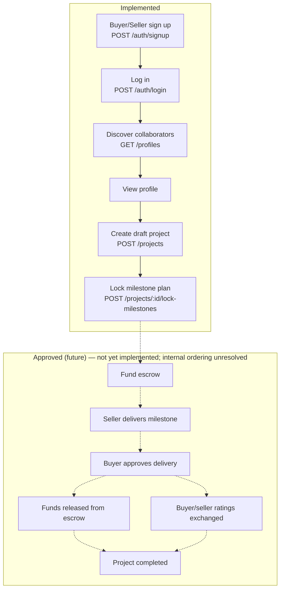
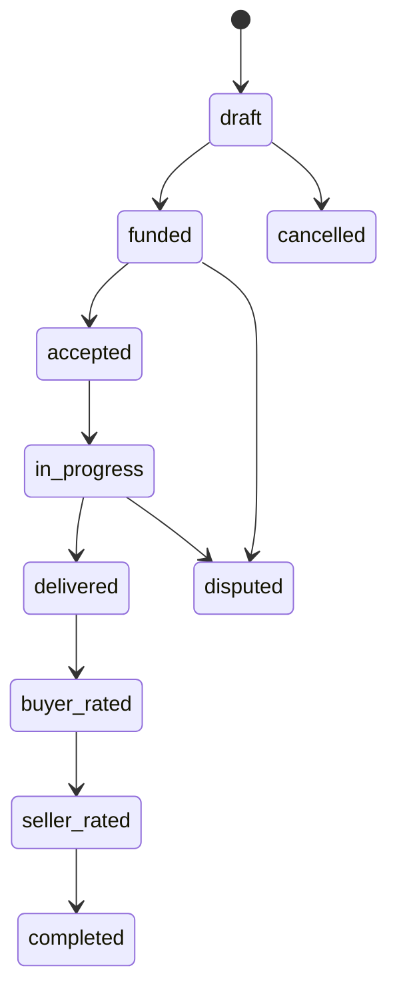
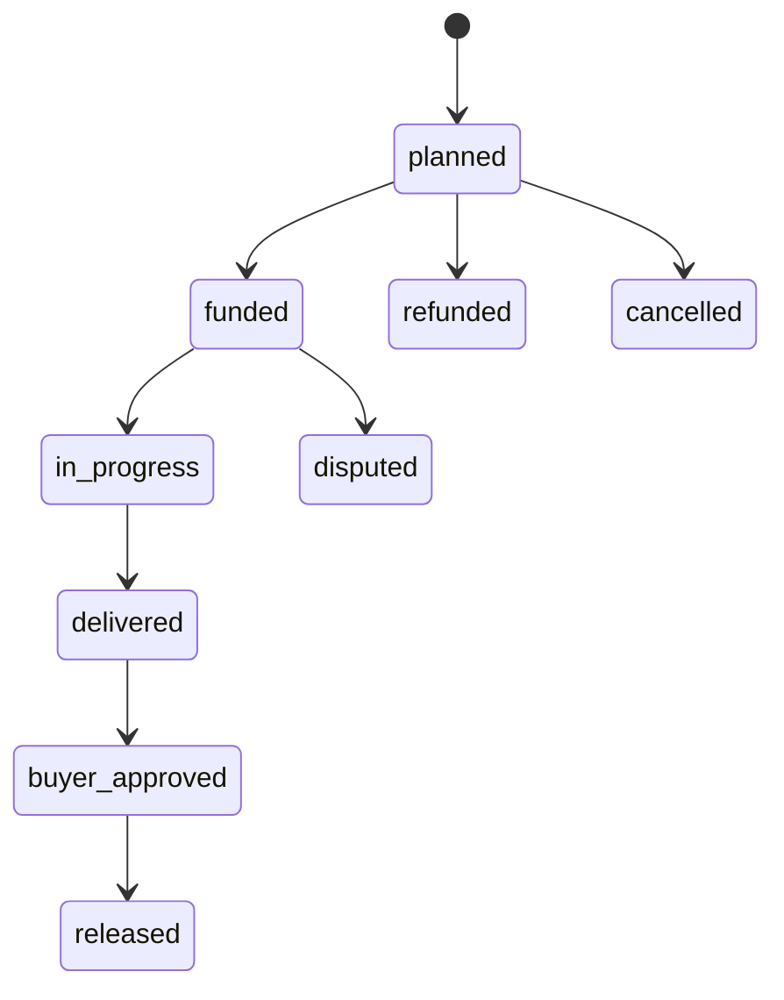

# MusicApp Product Overview

| Field | Value |
|---|---|
| Document ID | REQ-FOUNDATION-000 (provisional — see §2.3) |
| Type | Specification (SPEC) |
| Status | Approved |
| Owner | Product & Engineering (interim: repository maintainers) |
| Version | 1.0.0 |
| Last Reviewed | 2026-07-21 |
| Applies To | All product, engineering, and documentation work in this repository |
| Supersedes / Superseded By | None |

This document follows [`docs/00-governance/README.md`](../00-governance/README.md) (GOV-000). Per GOV-000 §23, every claim below is labeled **Implemented**, **Approved (future)**, **Proposed**, or **Assumption**. Nothing in this document asserts a feature exists unless it was located in the repository at time of writing.

## 1. Executive Summary

MusicApp is a two-sided marketplace connecting music buyers (people who need creative work done) with sellers (producers, mixing/mastering engineers, artists, and vocalists) to run fixed-price, milestone-based projects. The intended commercial model is: a buyer and seller agree on a project, break it into fixed milestones, lock those terms, fund the work through escrow, and release payment milestone-by-milestone as work is approved — with both parties rating each other before the project is considered complete.

At the time of writing, the **Implemented** system covers account creation, authentication, profile discovery, and draft project creation with a client-locked milestone plan. Escrow, payment, messaging, ratings capture, moderation, notifications, and admin tooling are **Approved (future)** or **Proposed** only: their database schema may exist, but no application behavior implements them (see §13, §17).

## 2. Purpose and Scope

### 2.1 Purpose

This document is the canonical product specification for MusicApp. It defines the product vision, the actors and roles in the system, the core transaction model, the project/milestone/escrow/rating lifecycle, current MVP scope, and the business rules governing the platform. It is the Layer 1 (Foundation) document referenced by GOV-000 §3 and is the entry point for all Layer 2 domain specifications.

### 2.2 Scope

This document covers the product as a whole. Domain-specific detail (e.g., the full escrow ledger contract, the full identity-verification flow) belongs in its own Layer 2 document under the relevant `docs/` directory (GOV-000 §4) once written; this document introduces the cross-domain business rules and requirements only where no domain-specific document yet exists (see §2.3 and §11's governance note for identifier ownership).

### 2.3 Identifier Governance Note

GOV-000 §11 defines a fixed list of permitted domain tokens for `REQ-[DOMAIN]-NNN` identifiers: `AUTH`, `USERS`, `IDENTITY`, `MARKETPLACE`, `PROJECTS`, `ESCROW`, `MESSAGING`, `RATINGS`, `MODERATION`, `NOTIFICATIONS`, `ADMIN`, `ANALYTICS`. **`FOUNDATION` is not on that list**, and this document does not modify `docs/00-governance/README.md` to add it.

Per GOV-000 §9 (status lifecycle) and §12 (source-of-truth), every `REQ-FOUNDATION-*` identifier used in this document — including this document's own ID (see metadata table above) and every row in §12 — is therefore treated as belonging to a **Proposed, temporary identifier domain**, not a governed one:

- These identifiers MAY be used for traceability within this document and its future revisions.
- These identifiers MUST NOT be treated as stable, fully governed, cross-document identifiers until GOV-000 §11 is formally updated to add `FOUNDATION` (or these requirements are renumbered under an already-permitted token, if a suitable one is agreed).
- No token in the current GOV-000 §11 list (including `PRODUCT`, which is not present either) is a permitted substitute, so no renumbering has been applied — see §20 for the tracking open question.

By contrast, the `BR-PROJECTS-*`, `BR-ESCROW-*`, and `BR-RATINGS-*` identifiers used in §11 **do** use domain tokens (`PROJECTS`, `ESCROW`, `RATINGS`) that are already permitted under GOV-000 §11; only the `FOUNDATION` token used for `REQ-*` identifiers in this document is provisional.

## 3. Product Vision

**Current (Implemented) vision, as evidenced by the codebase:** MusicApp is being built as a marketplace where a buyer can find a music collaborator, define a scoped project with a fixed price and milestone breakdown, and move that project through a defined lifecycle from draft to completion, with commercial terms locked before funding begins.

**Approved (future):** the full vision, per the enum values and schema already present (`project_state`, `milestone_state`, `escrow_status`, `payment_status` in `backend/db/005_create_projects.sql` and `backend/db/006_create_escrow_system.sql`), extends this to escrow-secured milestone funding, buyer/seller mutual ratings, and a completed transaction record with a full audit ledger.

## 4. Problem Statement

Music collaboration between independent buyers and sellers (artists, producers, engineers) typically lacks: a shared, fixed record of scope and price; a safe way to hold funds until work is delivered; and a structured way to release payment incrementally as milestones are met. MusicApp's **Approved (future)** value proposition is to solve this with locked milestone terms and milestone-based escrow. **Implemented today** is the scope/price/milestone definition and locking step; the escrow/payment step that would fully solve the "safe funds" part of the problem is not yet built (§13).

## 5. Target Users

| Segment | Description | Status |
|---|---|---|
| Buyers | Individuals who want music-related creative work done (a beat, a mix, a master, a feature) and are willing to pay a seller for it | Implemented — buyer is the account creating a project (`buyer_user_id` in `projects`, `backend/db/005_create_projects.sql`) |
| Sellers | Producers, mixing engineers, mastering engineers, artists, and vocalists offering creative services | Implemented — seller is the counterparty account on a project (`seller_user_id`); frontend Discover categories list "Producers," "Mixing Engineers," "Mastering Engineers," "Artists & Vocalists" (`frontend/src/App.tsx`, `DISCOVER_CATEGORIES`) as descriptive UI copy only, not an enforced taxonomy |
| Platform administrators / moderators | Internal staff operating trust & safety and admin tooling | Proposed — `docs/09-moderation-trust-safety/` and `docs/11-admin-operations/` exist as empty scaffold directories; no schema, route, or UI was found |

## 6. Primary Actors and Roles

### 6.1 Actor Matrix

| Actor | Definition | Role Assignment | Status |
|---|---|---|---|
| User | A registered account (`users` table, `backend/db/001_create_users.sql`), identified by email and/or E.164 phone | Account-level identity | Implemented |
| Profile | The public-facing identity attached 1:1 to a user (`profiles` table, `backend/db/002_create_profiles.sql`) — handle, artist name, display name, genres, city, country, bio | One profile per user | Implemented |
| Buyer | The user who initiates a project (`projects.buyer_user_id`) | Contextual, per-project — not a stored account attribute | Implemented |
| Seller | The user invited into a project as counterparty (`projects.seller_user_id`) | Contextual, per-project — not a stored account attribute | Implemented |
| Admin / Moderator | Staff role for platform operations | N/A | Proposed — no role or permission model exists in the schema |

### 6.2 Buyer and Seller Roles

A single user account **MAY** act as a buyer on one project and a seller on another; there is no account-level "I am a buyer" or "I am a seller" flag. This is confirmed by the schema: `projects` stores `buyer_user_id` and `seller_user_id` as independent foreign keys to `users`, with the only role-shaping constraint being `projects_no_self_dealing` (`CHECK (buyer_user_id <> seller_user_id)`, `backend/db/005_create_projects.sql`) — a user cannot be both parties on the same project. **Proposed:** `docs/02-users-roles-permissions/` implies a future formal roles/permissions system; no such system exists today.

## 7. Platform Value Proposition

| Value Proposition | Status |
|---|---|
| Discover collaborators by genre, location, handle, or name | Implemented — client-side filtering over `GET /profiles` results (`frontend/src/App.tsx`, `profileMatchesQuery`) |
| Define a scoped project with a fixed price and explicit milestone breakdown | Implemented — `POST /projects` (`backend/Index.js`) |
| Lock milestone terms before funding so neither party can unilaterally change scope or price | Implemented — `POST /projects/:projectId/lock-milestones` plus the `protect_locked_milestones` trigger (`backend/db/008_add_milestone_locking.sql`) |
| Hold funds in escrow and release them milestone-by-milestone | Approved (future) — schema exists (`backend/db/006_create_escrow_system.sql`); no funding, release, or payment behavior is implemented |
| Require both parties to rate each other before a project counts as complete | Approved (future) — `buyer_rated` / `seller_rated` states exist in the `project_state` enum; no rating-capture behavior or table exists |
| In-project messaging | Proposed — `docs/07-messaging-collaboration/` is an empty scaffold directory; no schema or code found |
| Search across the full catalog of listings/services | Proposed — no `services` or marketplace-listing table exists; `projects.service_id` is a nullable column reserved for a future services table (`backend/db/005_create_projects.sql` comment: "Link to listing (FK added later when services table exists)") |

## 8. Domain Boundaries

| Domain (per GOV-000 §4) | Current Status | Notes |
|---|---|---|
| `02-users-roles-permissions` | Implemented (users only) / Proposed (roles & permissions) | No roles/permissions table exists |
| `03-identity-profiles-verification` | Implemented (profiles) / Schema-only (verification) | `profile_verifications` and `verification_documents` tables exist (`backend/db/003`, `004`) with no backend route exposing them |
| `04-marketplace` | Proposed | No listings/services table or route found |
| `05-projects-milestones` | Implemented | Core of the current MVP; see §13 |
| `06-payments-escrow` | Schema-only | See §13.1, §15 |
| `07-messaging-collaboration` | Proposed | No implementation found |
| `08-ratings-reputation` | Enum-only | `buyer_rated`/`seller_rated` states exist; no rating table or route |
| `09-moderation-trust-safety` | Proposed | No implementation found |
| `10-notifications` | Proposed | No implementation found |
| `11-admin-operations` | Proposed | No implementation found |
| `12-analytics-reporting` | Proposed | No implementation found |

## 9. Core Transaction Model (MVP Definition)

Per the governed MVP scope, the target end-to-end flow is:

> A buyer can create or participate in a project with a seller, use milestone-based escrow, approve delivery, complete required ratings, and release funds according to the governed lifecycle.

**Status of each clause:**

| Clause | Status |
|---|---|
| A buyer can create a project with a seller | Implemented (`POST /projects`) |
| Milestone-based structure | Implemented (draft/locking) — escrow funding of milestones is Approved (future) |
| Escrow | Approved (future) — schema only |
| Approve delivery | Approved (future) — `delivered`/`buyer_approved` states exist in enums; no transition code found |
| Complete required ratings | Approved (future) — `buyer_rated`/`seller_rated` states exist; no rating capture |
| Release funds | Approved (future) — `escrow_ledger`/`payments` schema exists; no release code found |

This clause table is the authoritative summary of "what MVP means today" versus "what MVP is targeting." Any document that describes the transaction model as fully working end-to-end MUST be corrected to match this table, per GOV-000 §12.

## 10. Lifecycle Overview

### 10.1 High-Level User and Transaction Flow

*Solid arrows = Implemented. Dashed arrows = Approved (future); none of the `future` subgraph is implemented. "Funds released from escrow" (J) and "Buyer/seller ratings exchanged" (K) are both drawn branching independently from "Buyer approves delivery" (I) rather than one leading into the other, because no schema constraint, trigger, or decision record in this repository fixes their relative order. See §10.5.*

### 10.2 Project Lifecycle

The `project_state` enum (`backend/db/005_create_projects.sql`) declares its values in this order: `draft`, `funded`, `accepted`, `in_progress`, `delivered`, `buyer_rated`, `seller_rated`, `completed`, `cancelled`, `disputed`. **PostgreSQL enum declaration order does not itself enforce a transition graph** — no trigger, check constraint, or application code was found that restricts which state may follow which. The diagram below is therefore one *plausible* reading of the declared order, not a verified or enforced state machine. In particular, **the relative order of `buyer_rated` and `seller_rated` shown below is inferred from declaration order only and is not fixed by anything in the repository** — see §10.5 for why this matters.

*This diagram reflects the migration's enum declaration order only. It is not evidence of an enforced or decided transition sequence, and MUST NOT be read as a specification of the order in which `buyer_rated` and `seller_rated` occur.*

**Status by state:**

| State | Reachable today? |
|---|---|
| `draft` | Implemented — default state set at `POST /projects` |
| `funded`, `accepted`, `in_progress`, `delivered`, `buyer_rated`, `seller_rated`, `completed`, `cancelled`, `disputed` | Approved (future) — values exist in the enum type; no code path transitions a project into any of these states |

A project created today remains in `draft` (or has `milestones_locked_at` set while still in `state = 'draft'`) indefinitely, since no code advances it further.

### 10.3 Milestone Lifecycle

The `milestone_state` enum (`backend/db/006_create_escrow_system.sql`) declares the values below. As with `project_state` (§10.2), declaration order in a PostgreSQL enum does not enforce a transition graph, and no trigger or application code was found restricting milestone state transitions:

*This diagram reflects the migration's enum declaration order only, not a verified or enforced state machine. `buyer_approved` and `released` here belong to `milestone_state`, a separate enum type from `project_state`'s `buyer_rated`/`seller_rated` — nothing in the schema links the two; see §10.5.*

**Status:** only `planned` is reachable (the default state at milestone creation, `backend/Index.js` `POST /projects`). All other states are Approved (future) — no code transitions a milestone out of `planned`. Milestone locking (`projects.milestones_locked_at`) is a separate, Implemented mechanism that freezes milestone *terms* (BR-PROJECTS-004, §11) and does not itself change `milestone_state`.

### 10.4 Escrow Lifecycle

The `escrow_status` and `payment_status` enums (`backend/db/006_create_escrow_system.sql`) define a full escrow lifecycle (`created` → `funding_pending` → `funded` → `partially_released`/`released`, with `refund_pending`/`refunded`/`disputed`/`cancelled` branches) and a payment lifecycle (`created` → `requires_action` → `processing` → `succeeded`/`failed`/`cancelled`). **Status: Schema-only.** No route creates an `escrows`, `escrow_allocations`, `payments`, or `escrow_ledger` row. No payment-provider integration was found anywhere in the repository.

### 10.5 Ratings and Release Sequence

Values relevant to "ratings" and "release" exist across **three separate enum types**, none of which reference or constrain each other:

| Enum Type | Migration | Relevant Values |
|---|---|---|
| `project_state` | `backend/db/005_create_projects.sql` | `buyer_rated`, `seller_rated` |
| `milestone_state` | `backend/db/006_create_escrow_system.sql` | `buyer_approved`, `released` |
| `escrow_status` | `backend/db/006_create_escrow_system.sql` | `partially_released`, `released` |

No foreign key, trigger, check constraint, or ADR in this repository links these three enum types together or fixes their relative order. Specifically, the repository does **not** establish:

- Whether milestone/escrow release happens before, after, or independently of buyer/seller ratings.
- Whether both `buyer_rated` and `seller_rated` are required before release, or vice versa.
- Whether the `buyer_rated`-then-`seller_rated` order implied by `project_state`'s declaration order (§10.2) is authoritative or incidental.

**This sequencing is not fully enforced or defined by the current implementation and remains an open product and architecture decision** (tracked in §20). No rating-content table (score, review text) exists in any migration, and no code path transitions a project or milestone into any of the states listed above. Any diagram or document that shows a specific, fixed order among these states as decided or implemented MUST be corrected to match this section, per GOV-000 §12.

## 11. Core Business Rules

> **Governance note:** Per GOV-000 §11–§12, each business rule ID should be introduced in the domain document that owns it. At time of writing, no dedicated documents exist yet under `05-projects-milestones/`, `06-payments-escrow/`, or `08-ratings-reputation/`. This Foundation document is provisionally the owner of the IDs below; ownership **MUST** transfer to the appropriate domain document once written (tracked as an open question in §20).

| ID | Statement | Enforcement | Status |
|---|---|---|---|
| BR-PROJECTS-001 | A project MUST NOT have the same user as both buyer and seller. | DB constraint `projects_no_self_dealing` (`backend/db/005_create_projects.sql`) **and** application check in `POST /projects` (`backend/Index.js`) | Implemented |
| BR-PROJECTS-002 | A project's milestone amounts MUST sum exactly to the project's `price_amount` at creation. | Application-layer only (`backend/Index.js`, `POST /projects`) — no DB constraint sums milestone amounts against project price | Implemented (app layer); DB-enforcement gap, see §14 |
| BR-PROJECTS-003 | Every project and milestone created through the API MUST be denominated in INR. | Application-layer constant `PROJECT_CURRENCY = "INR"` (`backend/Index.js`), stamped server-side and not client-suppliable — `currency` columns are plain `TEXT` with no `CHECK` restricting values | Implemented (app layer); DB-enforcement gap, see §14 |
| BR-PROJECTS-004 | Once a project's milestones are locked, milestone commercial terms (title, description, amount, currency, due date, milestone number) MUST NOT change. | DB trigger `protect_locked_milestones` (`backend/db/008_add_milestone_locking.sql`) | Implemented |
| BR-PROJECTS-005 | Milestones MAY be locked only when the project is in `draft` state, has at least one milestone, all milestones are `planned`, all milestones share the project's currency, and milestone amounts sum to the project price. | Application-layer only (`backend/Index.js`, `POST /projects/:projectId/lock-milestones`) — no equivalent DB constraint | Implemented (app layer); DB-enforcement gap, see §14 |
| BR-ESCROW-001 | A project's budget MUST be held in escrow and released only against buyer-approved milestones. | Schema supports this shape (`escrow_allocations_totals_within_allocated` constraint, `backend/db/006_create_escrow_system.sql`), but no route creates, funds, or releases an escrow, allocation, or payment | Schema Implemented / Behavior Approved (future) |
| BR-ESCROW-002 | Escrow ledger entries MUST be immutable once written. | Not found — no `UPDATE`/`DELETE`-blocking trigger or rule on `escrow_ledger` in the migrations | Assumption — inferred from ledger semantics, not verified |
| BR-RATINGS-001 | A project's lifecycle includes `buyer_rated` and `seller_rated` states, implying both ratings are intended before `completed`. The order between them, and their relation to milestone/escrow release, is **not defined or enforced** by anything in the repository (see §10.5). This rule MUST NOT be read as specifying a fixed sequence. | State values exist in `project_state` (`backend/db/005_create_projects.sql`); no code transitions a project into these states, and no rating-content table exists | Enum Implemented / Capture Not Implemented; sequencing Proposed |

## 12. Requirements

> All identifiers below use the provisional `FOUNDATION` domain token described in §2.3, pending a GOV-000 §11 update. They are not yet fully governed identifiers.

| ID | Requirement | Status |
|---|---|---|
| REQ-FOUNDATION-001 | The platform MUST support two contextual, per-project roles: buyer and seller. | Implemented |
| REQ-FOUNDATION-002 | The platform MUST support milestone-based, fixed-price project engagements. | Implemented |
| REQ-FOUNDATION-003 | The platform MUST enforce a single default operating currency (INR) for newly created commercial records. | Implemented (application layer only — see BR-PROJECTS-003, §14) |
| REQ-FOUNDATION-004 | The platform MUST require authentication for profile discovery, project creation, and project management. | Implemented — JWT bearer auth (`requireAuth` middleware, `backend/Index.js`) |
| REQ-FOUNDATION-005 | The platform MUST allow a buyer to lock a project's milestone plan before funding, making commercial terms immutable. | Implemented |
| REQ-FOUNDATION-006 | The platform MUST hold project funds in escrow and release them against approved milestones. | Approved (future) |
| REQ-FOUNDATION-007 | The platform MUST require both buyer and seller ratings before a project is considered complete. | Approved (future) |
| REQ-FOUNDATION-008 | The platform SHOULD support in-project messaging between buyer and seller. | Proposed |
| REQ-FOUNDATION-009 | The platform SHOULD support searchable service listings independent of an active project. | Proposed |

## 13. Current MVP Scope (Implemented)

### 13.1 Current-State Inventory: Database Entities

All entities below are drawn from the applied migration files in `backend/db/`, in migration order.

| Migration | Entities Created | Behavior Exposed via API? |
|---|---|---|
| `001_create_users.sql` | `users` table, `user_status` enum | Yes — `POST /users`, `GET /users`, plus indirectly via `/auth/*` |
| `002_create_profiles.sql` | `profiles` table | Yes — `POST /profiles`, `GET /profiles`, plus indirectly via `/auth/*` |
| `003_create_profile_verifications.sql` | `profile_verifications` table, `verification_status` enum | No route found |
| `004_create_verification_documents.sql` | `verification_documents` table, `document_type`/`document_side`/`document_status` enums | No route found |
| `005_create_projects.sql` | `projects` table, `project_state` enum | Yes — `POST /projects`, `GET /projects`, `POST /projects/:projectId/lock-milestones` |
| `006_create_escrow_system.sql` | `project_milestones`, `escrows`, `escrow_allocations`, `payments`, `escrow_ledger` tables; `milestone_state`, `escrow_status`, `payment_status`, `payment_type`, `ledger_entry_type` enums | `project_milestones`: yes (created via `POST /projects`, read via `POST .../lock-milestones`). `escrows`, `escrow_allocations`, `payments`, `escrow_ledger`: no route found |
| `007_create_auth_credentials.sql` | `auth_credentials` table | Yes — written by `POST /auth/signup`, read by `POST /auth/login` |
| `008_add_milestone_locking.sql` | `projects.milestones_locked_at` column, `protect_locked_milestones` trigger | Yes — set by `POST /projects/:projectId/lock-milestones` |

### 13.2 Current-State Inventory: Backend Routes

All routes below are drawn from `backend/Index.js` at time of writing.

| Method & Path | Auth Required | Purpose | Status |
|---|---|---|---|
| `GET /` | No | Liveness check | Implemented |
| `GET /db-health` | No | Database connectivity check | Implemented |
| `POST /users` | No | Creates a `users` row directly, with no password/credential step | Implemented — **legacy/development risk route, see SEC-001** |
| `GET /users` | No | List users | Implemented |
| `POST /profiles` | No | Creates a `profiles` row directly, independent of any user-creation step | Implemented — **legacy/development risk route, see SEC-001** |
| `POST /auth/signup` | No | Create user + profile + credentials in one transaction — the intended production signup path | Implemented |
| `POST /auth/login` | No | Authenticate by email + password, issue JWT | Implemented |
| `GET /auth/me` | Yes | Return the authenticated user's user + profile record | Implemented |
| `GET /profiles` | Yes | List up to 100 profiles, newest first, for discovery | Implemented |
| `POST /projects` | Yes | Create a draft project with milestones (buyer = requester) | Implemented |
| `GET /projects` | Yes | List projects where the requester is buyer or seller, with counterparty profile summary | Implemented |
| `POST /projects/:projectId/lock-milestones` | Yes | Lock a draft project's milestone plan (buyer-only) | Implemented |

No route for login by phone, password reset, email verification, escrow funding, milestone delivery/approval, payment, ratings, messaging, moderation, notifications, or admin operations was found.

### 13.3 Current-State Inventory: Frontend Behavior

All behavior below is drawn from `frontend/src/App.tsx` and `frontend/src/api/api.js` at time of writing.

| Behavior | Status |
|---|---|
| Sign up (email/phone + password + profile fields) | Implemented |
| Log in, persist JWT in `localStorage`, restore session via `GET /auth/me` | Implemented |
| Log out | Implemented |
| Discover collaborators with client-side search over name/handle/genre/city/country | Implemented |
| View a collaborator's profile detail | Implemented |
| Create a draft project with a title, requirements, budget, delivery days, revision limit, and one or more milestones whose amounts must sum to the budget (client-side pre-validation mirroring server validation) | Implemented |
| Lock a project's milestone plan (buyer-only, with a confirmation step) | Implemented |
| View a list of the user's projects with role ("You are the buyer"/"You are the seller"), state, and lock status | Implemented |
| View a single project's detail, including milestones when available | Implemented |
| Fund a project / pay into escrow | Not implemented — UI explicitly shows "Draft project — Funding will be added in the next project stage" |
| Messaging | Not implemented — "Messages" nav item exists but has no destination (`view: null`) |
| Full profile management/editing | Not implemented — "Profile" nav item exists but has no destination (`view: null`) |
| Ratings / reviews | Not implemented — no UI found |

The frontend API client (`frontend/src/api/api.js`) hardcodes `API_BASE = "http://localhost:4000"` with no environment-based configuration — relevant to §17 (Dependencies) and §19 (Risks).

### 13.4 Identified Risk: Unauthenticated Direct-Creation Routes

| ID | Description | Source | Status |
|---|---|---|---|
| SEC-001 | `POST /users` and `POST /profiles` (`backend/Index.js`) accept unauthenticated requests and create `users`/`profiles` rows directly, without the password hashing, `auth_credentials` row, or transactional coupling that `POST /auth/signup` provides. They MUST NOT be described or treated as part of the intended production signup design (`POST /auth/signup` is the intended path — see §13.2). They are classified here as **legacy/development-convenience routes** and represent a current implementation risk: any client can create user or profile records outside the credentialed signup flow. | `backend/Index.js` (`POST /users`, `POST /profiles`) | Identified — requires product/security triage; this is a risk-tracking status local to this finding, not a GOV-000 §9 document status |

This finding is also carried in §19 (Risks) and referenced from §20 (Open Questions). Resolving SEC-001 (removing, gating, or authenticating these routes) is a product/engineering decision outside the scope of this document, which — per this review task's instructions — does not modify application code.

## 14. Business Intent vs. Database Enforcement Gaps

Per GOV-000 §17, this section records where a business rule is described as platform intent but is enforced only at the application layer, with no corresponding database constraint:

| Business Rule | Application Enforcement | Database Enforcement | Risk |
|---|---|---|---|
| BR-PROJECTS-002 (milestone total = project price) | Yes, at creation and again at lock time | None | A future direct-DB write, a different code path, or a bug could create a project/milestone set that violates this rule with no DB-level safety net |
| BR-PROJECTS-003 (currency is always INR) | Yes, via server-side constant | None — `currency` columns are plain `TEXT` | Same risk as above; also, historical rows may already hold non-INR values (see inline comment in `frontend/src/App.tsx`, `localeForCurrency`, referencing "old development records" in other currencies) |
| BR-PROJECTS-005 (lock preconditions) | Yes, in the lock-milestones route only | None | Any future second code path that sets `milestones_locked_at` would bypass these preconditions entirely |

These gaps are not necessarily defects — MVP-stage systems commonly enforce business rules at the application layer first — but GOV-000 §17 requires them to be documented explicitly rather than silently assumed to be database-enforced.

## 15. Success Criteria

**Implemented, verifiable today:**
- A buyer can sign up, discover a seller, create a scoped draft project with a milestone breakdown, and lock those terms.

**Approved (future), not yet measurable:**
- A buyer can fund a project via escrow, a seller can deliver against a milestone, a buyer can approve and trigger release, and both parties can rate each other before the project is marked complete.

No quantitative success metrics (conversion rate, GMV, time-to-first-project, etc.) were found anywhere in the repository. Defining them is a Proposed activity, not yet undertaken.

## 16. Non-Functional Product Goals

| Goal | Status |
|---|---|
| India-first launch, INR-denominated transactions | Implemented at the application layer (§11, BR-PROJECTS-003); no explicit localization, tax, or regulatory documentation was found |
| Local-first developer experience (Docker Postgres, migration runner, minimal setup) | Implemented — see `README.md`, `backend/db/migrate.js` |
| Production deployment | Not found — no deployment configuration, CI/CD pipeline, or hosting documentation exists in the repository; `docs/18-deployment/` is an empty scaffold |
| Security posture (password hashing, JWT auth) | Partially Implemented — see §17 note; a full security review belongs in `docs/15-security/`, not yet written |

## 17. Dependencies

| Dependency | Nature | Status |
|---|---|---|
| PostgreSQL 16 (via Docker Compose) | Runtime data store | Implemented — `docker-compose.yml`, `backend/db/db.js` |
| `JWT_SECRET` environment variable | Required at backend startup; process exits if missing/blank (`backend/Index.js`) | Implemented |
| `backend/db/migrate.js` | Applies `backend/db/*.sql` in filename order, tracked in `schema_migrations` | Implemented |
| Frontend hardcoded `API_BASE = "http://localhost:4000"` | Frontend → backend connectivity | Implemented for local development only — no environment-based override found (see §19) |
| Payment provider integration | Required for any real escrow funding/release | Not found — `payments.provider` is a free-text column with no integration code |

## 18. Assumptions

The following are explicitly labeled as **Assumption**, per GOV-000 §23 — believed but not verified against code, schema, or an ADR:

- **Assumption:** Escrow ledger entries (`escrow_ledger`) are intended to be immutable once written (BR-ESCROW-002), based on standard ledger design conventions and the table's naming — no enforcing constraint or trigger was found.
- **Assumption:** The intended ordering between fund release and the ratings sequence (§10.5) is ratings-then-release or release-then-ratings — the `project_state` enum ordering (`delivered` → `buyer_rated` → `seller_rated` → `completed`) does not itself specify when in that sequence escrow release occurs, and no ADR was found to resolve this.
- **Assumption — not an implemented fact:** `price_amount` and milestone `amount` are `INTEGER` columns (`backend/db/005_create_projects.sql`, `backend/db/006_create_escrow_system.sql`) with no unit annotation, comment, or check constraint in the migrations themselves. The belief that they represent integer minor currency units (e.g., paise for INR) comes entirely from inline comments in `frontend/src/App.tsx` ("integer minor units in `currency`, e.g. paise for INR, cents for USD") and the frontend's paise-based input-parsing logic (`parseBudgetToMinorUnits`). No backend validation, database constraint, or test was found that enforces or confirms this unit convention. This MUST be treated as an assumption inferred from frontend comments, not a verified or database-enforced fact, and MUST NOT be cited elsewhere as "amounts are stored in paise."
- **Assumption:** The "Producers / Mixing Engineers / Mastering Engineers / Artists & Vocalists" categories shown in the Discover UI (`DISCOVER_CATEGORIES`, `frontend/src/App.tsx`) represent the intended seller-service taxonomy — they are presentational only today and are not backed by any `service_type` or category field on `profiles` or `projects`.

## 19. Risks

- **SEC-001 — Unauthenticated direct-creation routes (§13.2, §13.4).** `POST /users` and `POST /profiles` allow bypassing the credentialed `POST /auth/signup` flow entirely. These are legacy/development-convenience routes, not part of the intended production signup design, and represent a current implementation risk requiring triage.
- **INR-only enforcement lives entirely in application code (§14).** If a second write path to `projects`/`project_milestones` is ever added (an admin tool, a script, a data migration) without going through `POST /projects`, it could silently create non-INR or unbalanced-milestone records with no database-level safety net.
- **Escrow and payment schema exists ahead of any implementation or provider integration.** The presence of `escrows`, `payments`, and `escrow_ledger` tables (§13.1) could be mistaken for a signal that funding is implemented; this document exists in part to prevent that misreading (GOV-000 §2, Accuracy over completeness).
- **No production deployment path currently exists** (§16), so any product or business planning premised on a live, funded transaction is premature relative to current implementation state.
- **Identity verification tables exist with no exposed behavior** (`profile_verifications`, `verification_documents`, §13.1). If verification is a launch requirement, this is a gap between schema readiness and actual capability.
- **Frontend's hardcoded local API base URL (§17)** would need to change before any non-local deployment; this is a known, unaddressed configuration gap rather than a design decision.

## 20. Open Questions

- Which document (`05-projects-milestones/`, `06-payments-escrow/`, `08-ratings-reputation/`) will take ownership of the `BR-PROJECTS-*`, `BR-ESCROW-*`, and `BR-RATINGS-*` identifiers introduced in this document, and when will those domain documents be written? Per GOV-000 §11–§12, ownership should not remain in the Foundation layer long-term.
- Should `GOV-000` §11's domain-token list be updated to formally include `FOUNDATION` (used by `REQ-FOUNDATION-*` in this document) since it is not currently enumerated there?
- What is the intended relative ordering of escrow release and the ratings sequence (§10.5, §18)?
- **Canonical money representation is undecided.** What is the platform's authoritative money representation — unit (major vs. minor currency unit), precision, and storage type — across `price_amount`, milestone `amount`, and any future escrow/payment amount fields? Today this exists only as an unverified assumption inferred from frontend comments (§18); no backend or database contract confirms it. A canonical decision (and, if warranted, an ADR per GOV-000 §14) is required before further escrow/payment work begins, since a wrong assumption here would corrupt every monetary calculation downstream.
- Is the Discover category taxonomy (Producers, Mixing Engineers, etc., §18) intended to become a stored, filterable attribute, or does it remain presentational copy?
- What is the resolution for SEC-001 (§13.4, §19) — should `POST /users` and `POST /profiles` be removed, gated behind authentication/authorization, or formally documented as internal/admin-only tooling? (Note: this is an observation about existing code, not a request to modify it — this document does not change application code.)

## 21. Traceability

| Requirement | Related Business Rules | Related API Endpoints | Related DB Entities |
|---|---|---|---|
| REQ-FOUNDATION-001 | BR-PROJECTS-001 | `POST /projects` | `projects` |
| REQ-FOUNDATION-002 | BR-PROJECTS-002 | `POST /projects` | `projects`, `project_milestones` |
| REQ-FOUNDATION-003 | BR-PROJECTS-003 | `POST /projects` | `projects.currency`, `project_milestones.currency` |
| REQ-FOUNDATION-004 | — | `GET /auth/me`, `GET /profiles`, `POST /projects`, `GET /projects`, `POST /projects/:id/lock-milestones` | `auth_credentials` |
| REQ-FOUNDATION-005 | BR-PROJECTS-004, BR-PROJECTS-005 | `POST /projects/:projectId/lock-milestones` | `projects.milestones_locked_at`, `project_milestones` |
| REQ-FOUNDATION-006 | BR-ESCROW-001, BR-ESCROW-002 | None implemented | `escrows`, `escrow_allocations`, `payments`, `escrow_ledger` |
| REQ-FOUNDATION-007 | BR-RATINGS-001 | None implemented | `projects.state` (`buyer_rated`, `seller_rated` enum values only) |
| REQ-FOUNDATION-008 | — | None implemented | None |
| REQ-FOUNDATION-009 | — | None implemented | `projects.service_id` (reserved, nullable, no referenced table) |

## 22. Version History

| Version | Date | Change | Author |
|---|---|---|---|
| 1.0.0 | 2026-07-21 | Initial approved product overview | Product & Engineering |
