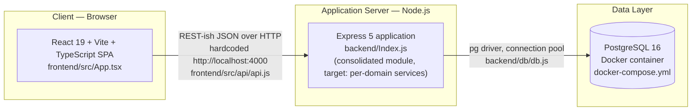
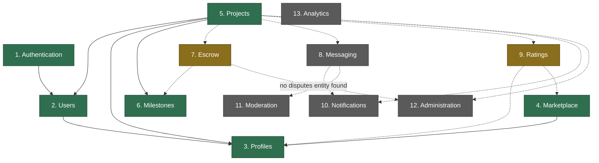
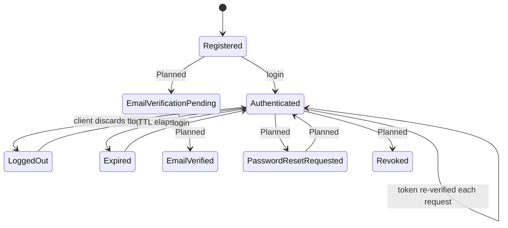
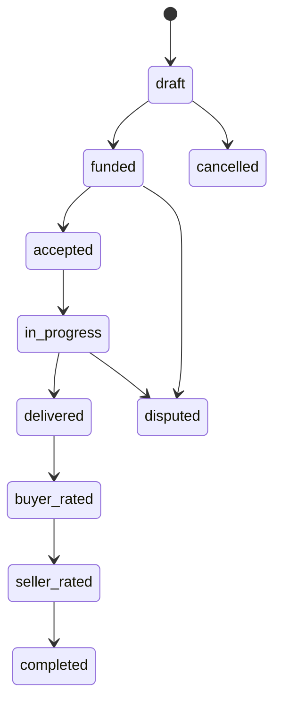
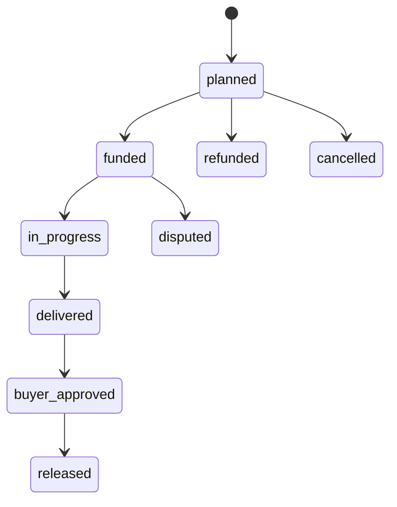
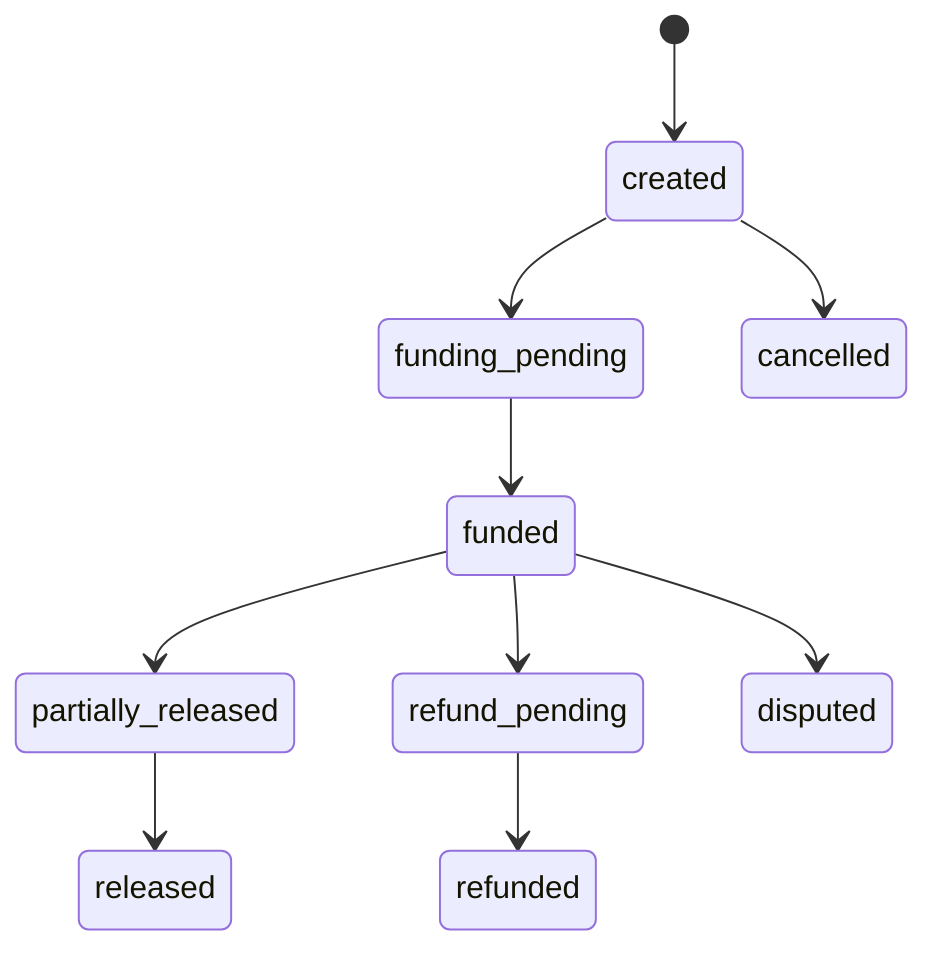
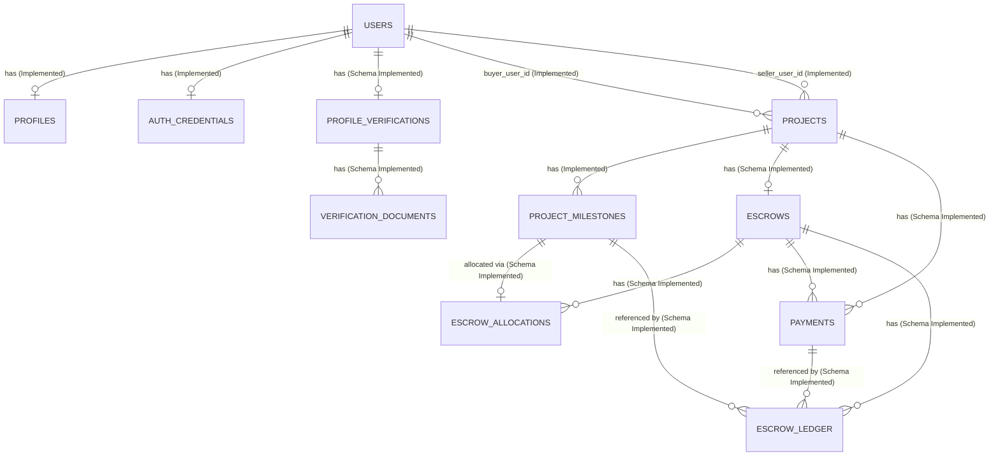

# MusicApp System Architecture

| Field | Value |
|---|---|
| Document ID | ARCH-FOUNDATION-000 (provisional — see §2.4) |
| Type | Specification (SPEC) |
| Status | Approved |
| Owner | Engineering (interim: repository maintainers) |
| Version | 1.2.0 |
| Last Reviewed | 2026-07-21 |
| Applies To | System architecture, domain boundaries, and technology stack for MusicApp |
| Supersedes / Superseded By | None |

This document follows [`docs/00-governance/README.md`](../00-governance/README.md) (GOV-000). It is the architecture handbook for MusicApp: every domain in the approved Product Architecture Specification is expanded into a full architecture specification (purpose, ownership, responsibilities, boundaries, lifecycle, interfaces, security, audit, failure modes, and extensibility), verified against the repository at time of writing.

**This document does not redesign the product.** The architecture supplied is authoritative. Nothing approved is removed for being unimplemented. Every feature is classified using the status taxonomy in §2.3, and every unimplemented but approved element is retained and marked accordingly.

**Ownership boundary:** business rules and requirement identifiers (`REQ-FOUNDATION-*`, `BR-PROJECTS-*`, `BR-ESCROW-*`, `BR-RATINGS-*`) are owned by [`product-overview.md`](product-overview.md) per GOV-000 §12 (single source of truth). This document does not redefine them; it references them where architecturally relevant and focuses on system structure, domain boundaries, data flow, and deployment topology.

## 1. Executive Summary

MusicApp's approved architecture is a modular, domain-oriented marketplace built around **Projects** as the central collaboration object, **Escrow** as the sole financial authority, and an intended audit trail across every significant action. Thirteen domains are defined: Authentication, Users, Profiles, Marketplace, Projects, Milestones, Escrow, Messaging, Ratings, Notifications, Moderation, Administration, and Analytics. Each owns a distinct concern and is bounded by explicit "must never own" rules (§9) so that domains can evolve independently while cooperating through well-defined interactions (§8, §12).

**Verified against the repository:** the current implementation is an early-stage build that fully or partially delivers six of the thirteen domains — Authentication, Users, Profiles, Marketplace, Projects, and Milestones — through registration, login, discovery, and project/milestone creation and locking. Two domains (Escrow, Ratings) have database schema in place with no executable behavior yet. Five domains (Messaging, Notifications, Moderation, Administration, Analytics) have no repository footprint and remain approved future work.

**Architectural framing note:** the current implementation consolidates the logic for all six delivered domains into a single application module on each tier — one Express application file (`backend/Index.js`) and one React application file (`frontend/src/App.tsx`). The target architecture, expressed by the modularity and separation-of-concerns principles (§3), separates these domains into independent services or modules as the platform grows. This is recorded as the present development stage, not a deviation requiring correction (§5).

**One architectural ownership boundary is clarified in this document:** Ratings owns rating data; Projects owns project lifecycle state. Completing a rating produces an event that Projects consumes as an input when deciding whether to advance its own lifecycle — the `buyer_rated`/`seller_rated` values on `project_state` (`backend/db/005_create_projects.sql`) reflect project progress informed by rating completion, not state ownership by the Ratings domain. See §9 and §10.9.

## 2. Purpose and Scope

### 2.1 Purpose

MusicApp's architecture is designed around trust: every paid interaction is intended to happen through Projects and Escrow, every significant action is intended to be auditable, every user has a profile, and every project follows a controlled lifecycle. The architecture is approved to be modular, so that major domains can remain independent while working together through well-defined interactions.

This document specifies that architecture domain by domain (§10), defines ownership and dependency boundaries across all thirteen domains (§7–§9), verifies current implementation status against the repository, and records the technology stack and deployment topology actually in use (§4).

### 2.2 Scope

This document covers system-level architecture: domain purpose, ownership, responsibilities and non-responsibilities, business rules, lifecycle, data flow (inputs/outputs/dependencies/consumers), interfaces, security boundaries, audit requirements, failure scenarios, and extensibility — for all thirteen approved domains. It does not restate:

- Product vision, actor roles, or MVP scope — owned by [`product-overview.md`](product-overview.md).
- Business rules and requirements (`BR-*`, `REQ-FOUNDATION-*`) — owned by `product-overview.md`; referenced here, not redefined.
- Full database column-level documentation — belongs to `docs/14-database/` once written.
- API request/response contracts — belongs to `docs/13-api/` once written.

### 2.3 Status Taxonomy

Every feature and capability in this document is classified using exactly one of the following five statuses:

| Status | Meaning |
|---|---|
| **Implemented** | The capability is present and working end-to-end, verified directly against the repository. |
| **Partially Implemented** | Some capabilities within the feature are Implemented; others in the same feature are Planned or Proposed. Used at the domain level when a domain is a mix. |
| **Schema Implemented** | Database schema (tables, columns, enums, constraints) exists for the capability, but no application code exercises it — there is no reachable behavior. |
| **Planned** | Approved by the Product Architecture Specification but not yet built at any layer (no schema, no behavior). This is the specification's own future intent. |
| **Proposed** | Not present in the authoritative specification; an extension or implementation approach suggested in this document (typically under "Future Extensibility") for consideration, not yet approved. |

This taxonomy is specific to this document's feature-level classification. It maps onto, and does not replace, GOV-000 §9 (document status lifecycle, which governs whole documents) and GOV-000 §23 (Current/Approved (future)/Proposed/Assumption claim labels, which this document's sibling `product-overview.md` uses). Where this document says **Planned**, it corresponds to `product-overview.md`'s **Approved (future)**. Where this document says **Proposed**, it corresponds to a genuinely new suggestion, not a restatement of specification content — the Product Architecture Specification supplied for this document is treated as fully **Approved**, per this task's instructions, so specification content is never labeled Proposed here.

### 2.4 Identifier Governance Note

GOV-000 §11 defines identifier prefixes for requirements, business rules, decision records, API contracts, security controls, and governance documents. It does not define a prefix family for a Specification-type architecture document that is not itself a requirement. This document uses a plain, explicitly non-governed label — `ARCH-FOUNDATION-000` — for internal tracking only. It is **not** a `REQ-*`, `BR-*`, `ADR-*`, `API-*`, `SEC-*`, or `GOV-*` identifier under GOV-000 §11 and MUST NOT be treated as one. Reconciling this gap is tracked as an open question (§18). Where this document cites requirement or business-rule identifiers, they are `product-overview.md`'s existing identifiers, not new ones minted here.

## 3. Architecture Principles

The specification defines seven architecture principles. Each is stated as approved intent, then checked against the repository:

| Principle | Approved Intent | Verified Current Status |
|---|---|---|
| Separation of concerns | Each domain's logic should be isolated from others | **Planned.** All twelve currently implemented routes (Authentication, Users, Profiles, Projects, Milestones) are defined in a single application module, `backend/Index.js`, with no per-domain file, controller, or service boundary yet. |
| Modularity | Domains should be independently buildable/maintainable units | **Partially Implemented.** Each domain's schema is defined in its own migration file (`backend/db/001`–`008`), which delivers modularity at the data layer. The application layer (`backend/Index.js`, `frontend/src/App.tsx`) consolidates all currently-delivered domains into one module per tier; module-level separation is Planned. |
| Auditable financial operations | Every escrow/payment action should leave a durable, reviewable record | **Schema Implemented.** The `escrow_ledger` table (`backend/db/006_create_escrow_system.sql`) is designed for this purpose (append-oriented columns, `ledger_entry_type` enum), but no financial operation yet exists to produce an entry. |
| Secure authentication | Authentication should resist common attacks | **Partially Implemented.** Passwords are hashed (`bcryptjs`, cost 12); sessions are signed, claim-verified JWTs. Password reset, verification, MFA, rate limiting, and server-side revocation are Planned. |
| Reusable services | Common logic should be extracted into shared, reusable modules | **Planned.** Helper logic (e.g., `makeExternalId`, `validateMilestonesInput`) exists as private functions inside `backend/Index.js`, not as exported, independently reusable modules. |
| API-first communication | Frontend and backend should communicate only through a defined API contract | **Implemented.** `frontend/src/api/api.js` is the sole channel between frontend and backend — a `fetch`-based JSON client with no server-side rendering or code sharing between the two applications. |
| Independent business domains | Domains should be able to evolve without tightly coupling to each other's internals | **Partially Implemented.** Foreign keys between domain tables are deliberate and minimal (e.g., `projects.buyer_user_id → users.id`), supporting future independence at the data layer; application-layer independence is Planned pending the module separation noted above. |

## 4. Technology Stack and Deployment Topology

**Verified from `package.json`, `docker-compose.yml`, and source files.**

| Layer | Technology | Evidence |
|---|---|---|
| Frontend | React 19, TypeScript, Vite 7 | `frontend/package.json` |
| Frontend package manager | pnpm | `frontend/pnpm-lock.yaml`, `frontend/pnpm-workspace.yaml` |
| Backend runtime | Node.js, CommonJS | `backend/package.json` (`"type": "commonjs"`) |
| Backend framework | Express 5.2.1 | `backend/package.json` |
| Authentication | `jsonwebtoken` 9.0.3 (JWT), `bcryptjs` 3.0.3 (password hashing) | `backend/package.json`, `backend/Index.js` |
| Database driver | `pg` 8.16.3 | `backend/package.json`, `backend/db/db.js` |
| Database | PostgreSQL 16 | `docker-compose.yml` |
| Cross-origin support | `cors` 2.8.5, invoked with no options (`app.use(cors())`) | `backend/Index.js` — permits cross-origin requests from any origin by default; no allowlist was found |
| Environment config | `dotenv` 17.2.3 | `backend/db/db.js` |

### 4.1 Deployment Topology

**Verified facts about this topology:**
- Only PostgreSQL is containerized (`docker-compose.yml`). The frontend and backend run as local Node processes (`npm start`/`npm run dev`, `pnpm dev`) — Implemented for local development; containerization of the application tier is Planned.
- The frontend's API base URL is a compile-time constant, `API_BASE = "http://localhost:4000"` (`frontend/src/api/api.js`), with no environment-variable override — this topology diagram is accurate only for local development; production deployment configuration is Planned (§14).
- No reverse proxy, load balancer, CDN, or TLS termination layer was found in the repository.
- No CI/CD pipeline configuration (e.g., GitHub Actions, `.gitlab-ci.yml`) was found.

## 5. Current Code Organization vs. the Modularity Principle

The specification approves a modular architecture where major domains remain independent (§3). The current implementation consolidates multiple architectural domains into a single application module per tier. The target architecture separates these domains into independent services or modules as the platform matures. This section records that transition point, without correcting either the current state or the target:

| Layer | Modularity Observed |
|---|---|
| Database schema | **Domain-separated (Implemented).** Each migration file scopes to one or two related domains: `001` (Users), `002` (Profiles), `003`–`004` (Identity Verification), `005` (Projects), `006` (Milestones + Escrow), `007` (Auth Credentials), `008` (Milestone Locking). |
| Documentation | **Domain-separated (Implemented).** `docs/` is organized into 19 numbered domain directories per GOV-000 §4. |
| Backend application code | **Consolidated (Planned: per-domain separation).** `backend/Index.js` (925 lines at time of writing) contains route handlers, validation logic, and SQL for Authentication, Users, Profiles, Projects, and Milestones together, in one application module. |
| Frontend application code | **Consolidated (Planned: per-domain separation).** `frontend/src/App.tsx` (1,817 lines at time of writing) contains the auth screens, discovery/marketplace screen, project-creation screen, and project-detail/milestone-locking screen as functions within one module. |

Whether and when to decompose the backend and frontend application modules into per-domain services or modules is an open question (§18), not a change made by this document.

## 6. System Domain Map

The specification defines 13 domains. The diagram below shows the domains and their approved interactions, colored by verified implementation status.

*Solid arrows = Implemented interaction. Dashed arrows = Planned interaction. Green = Implemented/Partially Implemented, amber = Schema Implemented, gray = Planned with no repository footprint.*

| Domain | Status |
|---|---|
| 1. Authentication | Partially Implemented — §10.1 |
| 2. Users | Implemented — §10.2 |
| 3. Profiles | Partially Implemented — §10.3 |
| 4. Marketplace | Partially Implemented — §10.4 |
| 5. Projects | Partially Implemented — §10.5 |
| 6. Milestones | Partially Implemented — §10.6 |
| 7. Escrow | Schema Implemented — §10.7 |
| 8. Messaging | Planned — §10.8 |
| 9. Ratings | Schema Implemented — §10.9 |
| 10. Notifications | Planned — §10.10 |
| 11. Moderation | Planned — §10.11 |
| 12. Administration | Planned — §10.12 |
| 13. Analytics | Planned — §10.13 |

## 7. Domain Ownership Matrix

| Domain | Owns | Must Never Own | Primary Consumers | Primary Dependencies |
|---|---|---|---|---|
| Authentication | Credentials, sessions, tokens | Profile information, marketplace information, public identity | Users, Profiles, Projects, and every route requiring `requireAuth` | Users |
| Users | Account existence, account state (`active`/`suspended`/`deleted`) | Project content, profile content, credential material | Authentication, Profiles, Projects, Messaging (Planned), Ratings (Planned), Notifications (Planned) | Authentication (functional, not structural) |
| Profiles | Public identity: artist name, display name, bio, genres; Planned: skills, portfolio, links, verification badges, reputation | Credentials, authentication | Marketplace, Projects, Ratings (Planned) | Users |
| Marketplace | Discovery: browsing, search, filtering; Planned: ranking, recommendations | Transactions, payments | Projects (routes users into) | Profiles, Authentication |
| Projects | Collaboration coordination, commercial terms, project lifecycle state | Authentication, direct money movement, reputation calculation | Milestones; Planned: Escrow, Messaging, Ratings, Notifications, Administration | Users, Profiles, Milestones |
| Milestones | Scope, deliverable definition, amount, milestone state, approval, per payable unit | Project-level identity, escrow execution | Planned: Escrow | Projects |
| Escrow | Holding funds, release, refunds, disputes (partial), financial audit trail | Project content, messages, profiles | Planned: Projects, Milestones, Administration | Projects, Milestones |
| Messaging | Conversation history, deliveries, clarifications; Planned: attachments, system events | Project lifecycle state | Planned: Notifications, Moderation | Projects |
| Ratings | Buyer/seller feedback, scores, written reviews; Planned: reputation metrics | Project lifecycle state — Ratings emits a completion event; Projects owns the resulting state transition (see §9) | Planned: Profiles, Marketplace | Projects; Planned: Profiles |
| Notifications | Event distribution across channels (email, in-app; Planned: push, SMS) | Business event creation (only distributes events it is given) | All domains, as recipients | Planned: Authentication, Projects, Messaging, Escrow, Moderation |
| Moderation | Reports, fraud review, verification review, content review, account actions | Financial records | Planned: Administration, Users | Planned: Profiles (verification), Messaging (content) |
| Administration | Cross-domain oversight, configuration, reporting | Direct mutation of domain-owned records outside sanctioned oversight actions | Platform operators | Users, Projects; Planned: Escrow, Profiles, Moderation, Analytics |
| Analytics | Business intelligence, aggregated/derived metrics | Operational data mutation | Administration, platform operators | Users, Projects, Marketplace; Planned: Escrow, Ratings |

## 8. Domain Dependency Matrix

The matrix below shows, for every domain (row), which other domains (columns) it depends on to fulfill its responsibilities. ● = dependency exists today and is Implemented. ◐ = dependency is approved and Planned, not yet exercised in code. A blank cell means no dependency, including the diagonal (a domain does not depend on itself).

| Depends on → | AUTH | USR | PRF | MKT | PRJ | MIL | ESC | MSG | RAT | NOT | MOD | ADM | ANL |
|---|---|---|---|---|---|---|---|---|---|---|---|---|---|
| **AUTH** Authentication |  | ● |  |  |  |  |  |  |  |  |  |  |  |
| **USR** Users |  |  |  |  |  |  |  |  |  |  |  |  |  |
| **PRF** Profiles |  | ● |  |  |  |  |  |  |  |  |  |  |  |
| **MKT** Marketplace | ● |  | ● |  |  |  |  |  |  |  |  |  |  |
| **PRJ** Projects | ● | ● | ● |  |  | ● | ◐ | ◐ | ◐ | ◐ |  | ◐ |  |
| **MIL** Milestones |  |  |  |  | ● |  | ◐ |  |  |  |  |  |  |
| **ESC** Escrow |  |  |  |  | ◐ | ◐ |  |  |  | ◐ |  | ◐ |  |
| **MSG** Messaging |  |  |  |  | ◐ |  |  |  |  | ◐ | ◐ |  |  |
| **RAT** Ratings |  |  | ◐ |  | ◐ |  |  |  |  | ◐ |  |  |  |
| **NOT** Notifications | ◐ |  |  |  | ◐ |  | ◐ | ◐ | ◐ |  | ◐ |  |  |
| **MOD** Moderation |  | ◐ | ◐ |  |  |  |  | ◐ |  |  |  |  |  |
| **ADM** Administration |  | ◐ | ◐ |  | ◐ |  | ◐ |  |  |  | ◐ |  | ◐ |
| **ANL** Analytics |  | ◐ |  | ◐ | ◐ |  | ◐ |  | ◐ |  |  |  |  |

**Reading the matrix:** row = the dependent domain, column = the domain it depends on. For example, the **PRJ** row shows Projects depends on Users (●, implemented via `buyer_user_id`/`seller_user_id`), Profiles (●, implemented via joined discovery data), and Milestones (●, implemented via `project_id`), plus five Planned dependencies (Escrow, Messaging, Ratings, Notifications, Administration). Users (**USR**) has no outgoing dependencies — it is the platform's foundational identity domain.

## 9. Architecture Boundaries

Each boundary below is stated as approved specification intent, then checked against the repository. A boundary that cannot yet be tested (because one or both domains are unimplemented) is retained as approved intent, not weakened.

| Boundary | Verified Status |
|---|---|
| Projects never move money directly (Escrow owns money movement). | Not verifiable in code — Escrow is Schema Implemented only (§10.7); retained as approved intent. |
| Escrow never edits project content. | Not verifiable in code — Escrow is Schema Implemented only; retained as approved intent. |
| Marketplace never owns transactions. | **Implemented and structurally confirmed** — no listings/services table with pricing exists; `projects.service_id` is a nullable, unreferenced placeholder (`backend/db/005_create_projects.sql`). |
| Profiles never authenticate users. | **Implemented and structurally confirmed** — `profiles` holds no credential fields; all credential material lives in `auth_credentials`, a distinct table with its own 1:1 link to `users`. |
| Authentication never exposes public identity. | **Implemented and structurally confirmed** — the JWT payload (`sub`, `external_id`, `profile_id`, `status`) carries only identifiers, never `display_name`, `artist_name`, `bio`, or other profile fields. |
| Ratings never modify project state. | **Clarified, not violated.** Ratings owns rating data only and does not write to `projects.state`. `buyer_rated` and `seller_rated` (`backend/db/005_create_projects.sql`) are Projects' own lifecycle checkpoints — they name a stage of *project* progress, informed by a rating-completion event, not a state written or owned by Ratings. Projects (not Ratings) performs the transition, using the event as input. See §10.9 Notes. **Planned** — no rating-completion event, event consumer, or state-transition handler is implemented, so this boundary has not yet been exercised in code. |
| Moderation never edits financial records. | Not verifiable in code — Moderation is Planned with no repository footprint; retained as approved intent. |
| Notifications never create business events, only distribute them. | Not verifiable in code — Notifications is Planned with no repository footprint; retained as approved intent. |
| Projects never own users (users participate in projects, they are not owned by them). | **Implemented and structurally confirmed** — `projects.buyer_user_id`/`seller_user_id` use `ON DELETE RESTRICT`, meaning a `users` row's lifecycle is independent of, and cannot be forced to end by, any project referencing it. |
| Administration should view every major domain without violating audit history. | Not verifiable in code — Administration is Planned with no repository footprint; the technical enforcement mechanism (e.g., read-only database roles vs. application-layer permission checks) is an open question (§18). |

## 10. Domain Specifications

Each domain below follows the same structure: Purpose, Objectives, Ownership, Responsibilities, Non-Responsibilities, Core Business Rules, Lifecycle Responsibilities, Inputs, Outputs, Dependencies, Consumers, Interfaces, Security Boundaries, Audit Requirements, Failure Scenarios, Future Extensibility, Implementation Status, Repository Verification, and Notes.

### 10.1 Authentication

#### Purpose
Authentication exists to establish and verify identity claims — proving that a request genuinely originates from the account it claims to represent — so every other domain can trust an already-authenticated identity without re-verifying it itself.

#### Objectives
- Provide low-friction registration and login.
- Protect credential material from disclosure at rest and in transit.
- Issue a verifiable, tamper-resistant token that other domains can trust without contacting Authentication directly.
- Support account recovery and verification without weakening credential security.
- Lay groundwork for MFA without blocking core delivery.

#### Ownership
Authentication owns credentials: password hashes, the token-issuing process, and the token-verification process.

#### Responsibilities
Registration, login, logout, password hashing, password changes, password reset, session management, JWT/token management, email verification, future MFA, account recovery.

#### Non-Responsibilities
Authentication never owns profile information (artist name, bio, genres — owned by Profiles, §10.3) and never owns marketplace information (search, discovery — owned by Marketplace, §10.4). Authentication does not decide platform role or permission — no role claim is issued in a token today, and no role model exists anywhere in the repository (see Administration, §10.12).

#### Core Business Rules
- A user must have at least one credential path (an email/phone pair backing `password_hash`) before authenticating. **Implemented** — `users_email_or_phone_present` constraint (`backend/db/001_create_users.sql`) plus `auth_credentials` (`backend/db/007_create_auth_credentials.sql`).
- A session token must carry a verifiable issuer and audience claim. **Implemented** — `requireAuth` checks `issuer: "musicapp-api"` and `audience: "musicapp-web"`.
- Passwords must be hashed, never stored or transmitted in plain form. **Implemented** — `bcrypt.hash(password, 12)`.
- A session token should be revocable before its natural expiry. **Planned** — no revocation list or server-side session store exists.
- An account should not be usable for sensitive actions until its email is verified. **Planned** — no verification-gated logic exists; every active account can call every authenticated route today.

#### Lifecycle Responsibilities
Authentication owns the account's *credential* lifecycle, distinct from the Users domain's *account* lifecycle (§10.2) and a *session's* lifecycle.

*Solid-labeled transitions without "Planned" are Implemented. This diagram is specific to the credential/session lifecycle; it does not depict `user_status` (§10.2) or `project_state` (§10.5).*

#### Inputs
Registration payload (email/phone, password, profile fields, routed together at signup); login credentials (email, password); the `Authorization` header bearer token on every authenticated request.

#### Outputs
An `auth_credentials` row; a signed JWT; `401` responses for invalid, missing, or expired tokens.

#### Dependencies
Users (§10.2) — a credential cannot exist without a `users` row to attach to (`auth_credentials.user_id` foreign key).

#### Consumers
Every domain requiring `requireAuth` — currently Profiles (`GET /profiles`) and Projects (`POST`/`GET /projects`, lock-milestones). Architecturally, any domain performing a user-attributable action is a consumer of Authentication's identity guarantee.

#### Interfaces
`POST /auth/signup`, `POST /auth/login`, `GET /auth/me`, and the `requireAuth` middleware consumed by other routes (all `backend/Index.js`).

#### Security Boundaries
Authentication never exposes public identity — verified: the JWT payload (`sub`, `external_id`, `profile_id`, `status`) carries only identifiers, not `display_name`/`artist_name`/`bio`. Credential material (`password_hash`) is never returned by any route. `POST /users` and `POST /profiles` (§10.2, §10.3) currently allow account/profile creation outside this domain's credentialed flow — carried forward as **SEC-001** (§13).

#### Audit Requirements
**Planned:** every login, failed login, password change, and token issuance should be recorded for security review. **Not implemented** — `backend/Index.js` only logs errors to console, not a structured or persisted audit trail.

#### Failure Scenarios
- Invalid credentials → `401`, generic "Invalid email or password" (does not disclose which field was wrong). **Implemented.**
- Missing, malformed, or expired token → `401` "Unauthorized" from `requireAuth`. **Implemented.**
- Brute-force login attempts — **Planned**, unhandled today; no rate limiting exists (§14).
- Concurrent password-reset requests — **Planned**, not applicable until password reset exists.
- JWT_SECRET missing at boot → the process exits immediately rather than starting in an insecure state. **Implemented.**

#### Future Extensibility
Password reset flow; email verification flow; MFA (e.g., TOTP); refresh tokens; server-side session/token revocation list; account recovery via a secondary channel. **Proposed (this document's suggestion, not specified):** a dedicated `auth_events` audit table separate from `escrow_ledger`-style domain ledgers, to satisfy the Audit Requirements above without overloading Escrow's audit model.

#### Implementation Status
**Partially Implemented.**

#### Repository Verification
| Capability | Status | Evidence |
|---|---|---|
| Registration | Implemented | `POST /auth/signup` — creates `users`, `profiles`, `auth_credentials` in one transaction |
| Login | Implemented | `POST /auth/login` — `bcrypt.compare`, issues JWT |
| Password hashing | Implemented | `bcrypt.hash(password, 12)` |
| Password reset/change | Planned | `auth_credentials.password_changed_at` column exists but nothing writes to it after creation |
| Session management | Implemented (stateless only) | JWT, 7-day default expiry (`JWT_EXPIRES_IN`); logout is client-side only |
| Tokens | Implemented | `jsonwebtoken`, issuer/audience claims |
| Account recovery | Planned | No route, table, or UI found |
| Email verification | Planned | No route found (distinct from identity-document verification, §10.3) |
| Future MFA | Planned | No schema or code found |

#### Notes
`auth_credentials` being a table distinct from `users` matches the specification's trust-through-separation intent, though the specification does not explicitly call out this table split.

### 10.2 Users

#### Purpose
Users represents the platform's foundational identity: the durable account record that every other domain references but does not own.

#### Objectives
Provide a single, stable account identity per person; support account state transitions (active/suspended/deleted); allow unbounded participation across other domains without those domains controlling account lifecycle.

#### Ownership
Users owns account existence and account state.

#### Responsibilities
User accounts, account state, identity, account lifecycle.

#### Non-Responsibilities
Users never owns project content, profile content (public identity), or credential material — those belong to Projects, Profiles, and Authentication respectively.

#### Core Business Rules
- One account, one profile. **Implemented** — `profiles.user_id UUID NOT NULL UNIQUE` (`backend/db/002_create_profiles.sql`).
- A user may participate in many projects. **Implemented** — `projects.buyer_user_id`/`seller_user_id` are unconstrained-in-count foreign keys to `users.id`.
- A user must have an email or a phone number on record. **Implemented** — `users_email_or_phone_present` constraint.
- An account's status transitions (active → suspended/deleted) should be governed by an explicit workflow. **Planned** — the `user_status` enum exists; no route transitions a user between states.

#### Lifecycle Responsibilities
The account lifecycle is `active` → `suspended` / `deleted` (`user_status` enum, `backend/db/001_create_users.sql`). Only `active` is reachable today (the default at creation); `suspended` and `deleted` are Planned transitions with no owning workflow yet (candidates: Moderation for `suspended`, §10.11; the account holder or Administration for `deleted`, §10.12).

#### Inputs
Registration data (via Authentication, §10.1); administrative status-change actions (Planned, via Administration/Moderation).

#### Outputs
A `users` row; a stable `id`/`external_id` referenced by every other domain that needs to attribute an action to a person.

#### Dependencies
None structural. Functionally, an account only becomes usable once Authentication (§10.1) attaches credentials — in the current implementation this happens transactionally within `POST /auth/signup`.

#### Consumers
Authentication, Profiles, Projects (all Implemented); Messaging, Ratings, Notifications, Moderation, Administration, Analytics (all Planned as future consumers of user identity).

#### Interfaces
`POST /users`, `GET /users` (direct routes, see Security Boundaries below); user identity is also created transactionally via `POST /auth/signup` (`backend/Index.js`).

#### Security Boundaries
`POST /users` currently accepts unauthenticated requests and creates a `users` row directly, bypassing the credentialed `POST /auth/signup` path (no `auth_credentials` row is created alongside it). This is carried forward as **SEC-001** (§13) and MUST NOT be read as part of the intended production account-creation design — `POST /auth/signup` is that design.

#### Audit Requirements
**Planned:** account state transitions (suspension, deletion) should be auditable, including who performed the action and why. Not implemented — no audit table or logging beyond console output exists.

#### Failure Scenarios
- Duplicate email/phone on creation → `409` unique-constraint violation. **Implemented.**
- Neither email nor phone supplied → `400`. **Implemented.**
- Attempting to reference a non-existent or non-active user as a project counterparty → `404 "Seller not found"`. **Implemented** (`POST /projects`).
- Suspending or deleting a user with open projects/escrow — **Planned**, unhandled; no workflow exists to define the consequence.

#### Future Extensibility
Role/permission attributes (currently entirely absent — buyer/seller are contextual per-project roles, not stored account attributes, per `product-overview.md` §6); account merging (e.g., linking email and phone identities); self-service deletion with data-retention rules.

#### Implementation Status
**Implemented** (for the scope currently defined: account existence, state enum, uniqueness rules).

#### Repository Verification
The `users` table (`backend/db/001_create_users.sql`): `id`, `external_id`, `email`, `phone_e164`, `status` (`user_status`: `active`/`suspended`/`deleted`), timestamps. `POST /users` and `GET /users` exist as direct routes; the primary account-creation path is `POST /auth/signup`.

#### Notes
"Projects never own users" (§9) is structurally confirmed: `projects.buyer_user_id`/`seller_user_id` use `ON DELETE RESTRICT`, so a user's lifecycle cannot be terminated by deleting a project that references it, and a project cannot silently outlive a deleted user either — the two lifecycles are independently protected.

### 10.3 Profiles

#### Purpose
Profiles exists to present a public-facing identity independent of the credentials that prove it, so that discovery, trust signals, and collaboration context can evolve without touching authentication.

#### Objectives
Let a user be found and evaluated by others (artist name, bio, genres); keep public identity fully decoupled from credential security; grow toward richer trust signals (verification badges, reputation) without re-architecting Authentication.

#### Ownership
Profiles owns public identity.

#### Responsibilities
Artist name, display name, bio, genres, skills, portfolio, links, verification badges, public reputation.

#### Non-Responsibilities
Profiles never authenticates users (§9) and holds no credential material. Profiles does not decide marketplace ranking or search algorithm behavior — that is Marketplace's responsibility (§10.4), even though Marketplace's discovery surface is built by reading Profiles data.

#### Core Business Rules
- Every profile belongs to exactly one user, and every user has at most one profile. **Implemented** — `profiles.user_id UNIQUE`.
- A profile's `handle` must be unique, case-insensitively. **Implemented** — `handle CITEXT UNIQUE`.
- Profiles are separate from authentication. **Implemented and structurally confirmed** — distinct tables, distinct 1:1 foreign keys to `users`.
- A profile should be able to display a verification badge once identity verification is approved. **Schema Implemented** — `profile_verifications`/`verification_documents` exist; no `profiles` column surfaces a badge, and no route connects the two.
- A profile should surface an aggregate reputation signal. **Planned** — no reputation table, score column, or calculation exists anywhere.

#### Lifecycle Responsibilities
A profile is created once, alongside its user, and updated thereafter. No profile-specific lifecycle state (e.g., draft/published) exists or is specified — a profile is either present (Implemented) or, for identity verification specifically, moves through `not_started → submitted → approved/rejected` (`verification_status` enum, `backend/db/003_create_profile_verifications.sql`), which is Schema Implemented with no route exercising the transitions.

#### Inputs
Registration payload (name, bio, genres, city, country, etc., via Authentication's signup flow); Planned: verification document uploads, portfolio items, external links.

#### Outputs
A `profiles` row; a public-safe subset returned by `GET /profiles` (excludes `dob` and any authentication-adjacent field).

#### Dependencies
Users (§10.2) — a profile cannot exist without its owning user.

#### Consumers
Marketplace (discovery, §10.4), Projects (counterparty display, §10.5); Planned: Ratings (reputation feed, §10.9).

#### Interfaces
`POST /profiles` (direct route, see Security Boundaries), `GET /profiles` (requires authentication), and profile creation transactionally via `POST /auth/signup` (all `backend/Index.js`).

#### Security Boundaries
`GET /profiles` returns a narrowed, public-safe projection (no `dob`, no user/auth fields) — verified in `frontend/src/App.tsx`'s `DiscoverProfile` type and the corresponding backend `SELECT` column list. `POST /profiles` currently accepts unauthenticated requests and can create a profile independent of any user-creation step, carried forward as part of **SEC-001** (§13).

#### Audit Requirements
**Planned:** changes to public identity fields (especially verification-badge status) should be auditable, since they carry trust implications for other users. Not implemented.

#### Failure Scenarios
- Duplicate `handle` → `409` unique-constraint violation. **Implemented.**
- Missing required field (`handle`, `first_name`, `artist_name`, `display_name`, `city`, `country`) → `400`. **Implemented.**
- Referencing a non-existent `user_id` → `400` foreign-key violation. **Implemented.**
- Verification document rejected — **Planned**, unhandled; `document_status` includes `rejected` with a `rejection_reason` column, but no route sets it.

#### Future Extensibility
Skills taxonomy; portfolio/media attachments; external links (website, streaming platforms, social); verification badge surfaced on the public profile; reputation score fed by Ratings (§10.9). **Proposed (this document's suggestion):** treating "skills" as a controlled, filterable taxonomy (distinct from the free-text `genres` array) so Marketplace search/filter (§10.4) can offer structured faceting once built.

#### Implementation Status
**Partially Implemented.**

#### Repository Verification
| Field/Capability | Status |
|---|---|
| Artist name, display name, bio, genres | Implemented |
| Skills, portfolio, links | Planned — no column or table found |
| Verification badges | Schema Implemented — tables exist, no surfacing column or route |
| Reputation | Planned — no field found anywhere |

#### Notes
The Discover screen's category copy ("Producers," "Mixing Engineers," "Mastering Engineers," "Artists & Vocalists," `frontend/src/App.tsx`, `DISCOVER_CATEGORIES`) is presentational only — not backed by a stored, filterable field on `profiles`. If a controlled skills/service-type taxonomy (see Future Extensibility) is adopted, this copy is a natural seed for it.

### 10.4 Marketplace

#### Purpose
Marketplace exists to connect buyers with sellers through discovery — browsing, search, and (eventually) ranking and recommendations — without ever taking on transactional responsibility itself.

#### Objectives
Make it easy to find a relevant collaborator; keep discovery logic decoupled from Projects' commercial logic; grow toward ranking and recommendations as usage data accumulates.

#### Ownership
Marketplace owns discovery: browsing, search, filtering, ranking (Planned), and recommendations (Planned).

#### Responsibilities
Browsing creators, searching, filtering, recommendations, profile viewing.

#### Non-Responsibilities
Marketplace never owns transactions and never owns payments (§9) — both belong to Projects and Escrow respectively. Marketplace does not store commercial terms; it only surfaces identity data owned by Profiles.

#### Core Business Rules
- Marketplace never owns transactions; Projects own transactions. **Implemented and structurally confirmed** — no listings/services table with pricing exists.
- Discovery results should be scoped to what is safe to expose publicly. **Implemented** — `GET /profiles` returns the same narrowed projection described in §10.3.
- Marketplace should route a user into a Project once a collaborator is chosen. **Implemented** — the "Start a project" action on a profile detail screen navigates directly into project creation (`frontend/src/App.tsx`).

#### Lifecycle Responsibilities
Marketplace has no entity-level lifecycle of its own; it is a read/query surface over Profiles. Its own "state" is the query/filter state held transiently in the client (`DiscoverScreen`'s `searchQuery`), not persisted.

#### Inputs
The full (up to 100-row) profile listing from `GET /profiles`; a client-side search string (name, handle, genre, city, country).

#### Outputs
A filtered, rendered list of candidate collaborators; navigation into a specific profile detail, and from there into project creation.

#### Dependencies
Profiles (§10.3) — Marketplace has no data of its own; Authentication (§10.1) — `GET /profiles` requires a valid session.

#### Consumers
End users (buyers) browsing for sellers; Projects (§10.5), as the domain a user is routed into after discovery.

#### Interfaces
`GET /profiles` (`backend/Index.js`); `profileMatchesQuery`, `DiscoverScreen`, `ProfileCard`, `ProfileDetailScreen` (`frontend/src/App.tsx`).

#### Security Boundaries
Discovery is gated behind authentication (`requireAuth` on `GET /profiles`) — an unauthenticated visitor cannot browse the marketplace. The 100-row cap and public-safe field projection (§10.3) limit both scale and information exposure per request.

#### Audit Requirements
None specified or implemented. Search/browse activity is not logged — Planned if usage analytics (§10.13) requires it.

#### Failure Scenarios
- `GET /profiles` request failure (network/server error) → the Discover screen shows an inline error with a retry action. **Implemented.**
- Zero matching profiles for a search query → an explicit "No profiles match your search" empty state, distinct from "no profiles exist yet." **Implemented.**

#### Future Extensibility
Server-side search and filtering (today's search is entirely client-side over an already-fetched, capped list, which does not scale past the 100-row cap); ranking by relevance, reputation, or recency; recommendations; pagination. **Proposed (this document's suggestion):** once Ratings (§10.9) produces a reputation signal, Marketplace ranking is a natural, spec-consistent consumer of it (already reflected as a Planned dependency in §8).

#### Implementation Status
**Partially Implemented.**

#### Repository Verification
| Capability | Status | Evidence |
|---|---|---|
| Browsing creators | Implemented | `GET /profiles`, Discover screen |
| Searching/filtering | Implemented, client-side only | `profileMatchesQuery` filters an already-fetched list; no server-side search/filter query exists |
| Recommendations | Planned | No logic found |
| Profile viewing | Implemented | `ProfileDetailScreen` |

#### Notes
Because `GET /profiles` always returns the same newest-first, up-to-100-row set regardless of query, "search" today is a client-side narrowing of a fixed window, not a true search over the full catalog — this becomes a functional gap, not just a performance one, once the platform has more than 100 profiles.

### 10.5 Projects

#### Purpose
Projects is the heart of MusicApp: the object inside which every commercial collaboration happens, coordinating every other domain's involvement in a single piece of work without itself performing their specialized functions.

#### Objectives
Give buyer and seller a single, authoritative record of what was agreed; coordinate — without absorbing — Milestones, Escrow, Messaging, Ratings, and Notifications; enforce a controlled lifecycle so state is never ambiguous.

#### Ownership
Projects owns collaboration: the buyer/seller relationship, commercial terms, and lifecycle state.

#### Responsibilities
Coordinating buyer, seller, milestones, escrow, messaging, deliveries, ratings, notifications; enforcing lifecycle through explicit states.

#### Non-Responsibilities
Projects never owns authentication, never moves money directly, and never calculates reputation (§9) — those belong to Authentication, Escrow, and Ratings respectively.

#### Core Business Rules
(Owned by `product-overview.md` §11; referenced here, not restated in full.)
- A project must not have the same user as both buyer and seller. **Implemented** — `BR-PROJECTS-001`.
- Milestone amounts must sum exactly to the project price at creation. **Implemented (application layer)** — `BR-PROJECTS-002`.
- Every project must be denominated in INR. **Implemented (application layer)** — `BR-PROJECTS-003`.
- Once milestones are locked, commercial terms are immutable. **Implemented (database trigger)** — `BR-PROJECTS-004`.
- Milestones may be locked only under specific preconditions (draft state, all milestones planned, currency-matched, sum-matched). **Implemented (application layer)** — `BR-PROJECTS-005`.

#### Lifecycle Responsibilities
`project_state` (`backend/db/005_create_projects.sql`) declares ten values. Declaration order in a PostgreSQL enum does not itself enforce a transition graph — no trigger or application code was found restricting which state may follow which; the diagram below reflects declared order only, not a verified state machine (consistent with `product-overview.md` §10.2).

*Only `draft` is reachable by any code path today. All other transitions are Planned. The relative order of `buyer_rated`/`seller_rated` is declaration order only, not a fixed or enforced sequence — see §10.9 and `product-overview.md` §10.5.*

#### Inputs
Project-creation payload (seller, title, requirements, price, delivery days, revision limit, milestone breakdown); the lock-milestones action; (Planned) a rating-completion event from Ratings (§10.9), consumed as an input when deciding whether to advance `project_state` — Projects owns this transition, Ratings only supplies the signal that a rating was completed.

#### Outputs
A `projects` row and its associated `project_milestones` rows; a `milestones_locked_at` timestamp once locked; (Planned) escrow funding events, messages, notifications, and administrative visibility.

#### Dependencies
Users (§10.2), Profiles (§10.3, for counterparty display), Milestones (§10.6, created together with the project); Planned: Escrow, Messaging, Ratings (as an event source, not a data dependency), Notifications, Administration.

#### Consumers
Buyers and sellers directly; Planned: Escrow (funding source of truth), Notifications (event source), Administration (oversight). Ratings (§10.9) is not a consumer of Projects in this sense — it is the source of the completion event Projects consumes (see Inputs, above).

#### Interfaces
`POST /projects`, `GET /projects`, `POST /projects/:projectId/lock-milestones` (all `backend/Index.js`).

#### Security Boundaries
All project routes require authentication. `POST /projects/:projectId/lock-milestones` returns an identical `404` for "project doesn't exist" and "project exists but you're not the buyer," preventing sellers or unrelated users from learning a project exists via a different error shape — verified in `backend/Index.js`.

#### Audit Requirements
**Planned:** state transitions beyond `draft`, and the milestone-locking action itself, should be attributable and auditable. Milestone locking currently updates `updated_at` and sets `milestones_locked_at`, which provides a minimal timestamped record but not a full audit log of who/why.

#### Failure Scenarios
- Milestone total ≠ project price → `400`. **Implemented.**
- Attempting to lock milestones on a non-`draft` project, with non-`planned` milestones, mismatched currency, or a zero-milestone project → `400`/`409`. **Implemented.**
- Buyer attempts to create a project with themselves as seller → `400`. **Implemented.**
- Referencing a non-existent or inactive seller → `404`. **Implemented.**
- A project stuck in `draft` indefinitely (no code advances it) — **Planned**, this is the expected current-state ceiling, not an error condition.

#### Future Extensibility
Full lifecycle transition logic (funded → accepted → in_progress → delivered → ...); a dedicated Disputes entity (see §9, §10.7); integration points for Messaging, Ratings, and Notifications as those domains are built.

#### Implementation Status
**Partially Implemented.**

#### Repository Verification
| Coordinated Concern | Status |
|---|---|
| Buyer / Seller | Implemented |
| Milestones | Implemented |
| Escrow | Schema Implemented |
| Messaging | Planned |
| Ratings | Schema Implemented |
| Disputes | Partially Schema Implemented — only `dispute_reason TEXT` and the `disputed` enum value exist; no dedicated entity |
| Explicit lifecycle states | Schema Implemented for reachability — only `draft` is reachable |

#### Notes
"Disputes" is named as a first-class coordinated concern by the specification, but the schema offers only a single free-text column — narrower than what the specification implies. This is not a contradiction (nothing prevents a future disputes table), but it is a gap worth resolving explicitly (§18) rather than assuming the free-text column is sufficient long-term.

### 10.6 Milestones

#### Purpose
Milestones exists to divide a project's total scope and price into individually payable, individually approvable units of work, so that funding and delivery can happen incrementally rather than all-or-nothing.

#### Objectives
Let buyer and seller agree on discrete, fixed deliverables and amounts; keep each milestone's terms immutable once commercially locked; coordinate tightly with Escrow so each milestone maps to a fundable, releasable unit.

#### Ownership
Milestones owns scope, deliverable definition, amount, milestone state, and approval — per payable unit.

#### Responsibilities
Dividing a project into one or more payable deliverables (e.g., beat draft, mix, master, final stems), each with its own lifecycle while remaining part of a project.

#### Non-Responsibilities
Milestones never owns project-level identity (buyer/seller, title) — that belongs to Projects (§10.5) — and never executes escrow operations itself — that belongs to Escrow (§10.7); Milestones only defines what is fundable and approvable.

#### Core Business Rules
(Owned by `product-overview.md` §11.)
- Milestone amounts must sum exactly to the project price at creation. **Implemented** — `BR-PROJECTS-002`.
- Once locked, milestone commercial terms cannot change. **Implemented (database trigger)** — `BR-PROJECTS-004`.
- Milestones may be locked only under specific preconditions. **Implemented (application layer)** — `BR-PROJECTS-005`.
- Each milestone belongs to exactly one project, numbered sequentially and uniquely within it. **Implemented** — `project_milestones_unique_no_per_project` constraint.

#### Lifecycle Responsibilities
`milestone_state` (`backend/db/006_create_escrow_system.sql`) declares nine values, in declaration order (not an enforced transition graph — same caveat as §10.5):

*Only `planned` (the creation default) is reachable by any code path today. All other transitions are Planned. `buyer_approved` and `released` belong to `milestone_state`, a distinct enum type from `project_state`'s `buyer_rated`/`seller_rated` (§10.9) — nothing in the schema links the two.*

#### Inputs
The milestone array supplied at project creation (title, description, amount, due date); the lock-milestones action (applies to all of a project's milestones at once).

#### Outputs
`project_milestones` rows; (Planned) funding/delivery/approval/release events consumed by Escrow.

#### Dependencies
Projects (§10.5) — a milestone cannot exist without its owning project.

#### Consumers
Escrow (Planned, §10.7) — each milestone is the unit Escrow's allocation model is built around (`escrow_allocations.milestone_id`, one allocation per milestone).

#### Interfaces
Created and read as part of `POST /projects` and `POST /projects/:projectId/lock-milestones` (`backend/Index.js`); no standalone milestone routes exist.

#### Security Boundaries
Milestones inherit Projects' authentication and buyer-only locking checks (§10.5); there is no separate milestone-level authorization model.

#### Audit Requirements
**Planned:** milestone approval and release events should be individually auditable, since each represents a discrete financial commitment once Escrow is implemented.

#### Failure Scenarios
- Milestone amount not a positive integer within the supported range → `400`. **Implemented.**
- Milestone title missing/empty → `400`. **Implemented.**
- Attempting to lock a project where any milestone is not `planned`, or currency mismatches the project's → `400`. **Implemented.**
- Attempting to insert, delete, or edit commercial fields on a milestone belonging to a locked project → rejected by the `protect_locked_milestones` trigger. **Implemented.**

#### Future Extensibility
Milestone-level messaging/attachments (delivery proof) once Messaging exists (§10.8); milestone-level dispute handling once a Disputes entity exists (§10.5 Notes, §18); partial/renegotiated milestones (currently, locked terms are strictly immutable with no amendment path).

#### Implementation Status
**Partially Implemented.**

#### Repository Verification
`project_milestones` (`backend/db/006_create_escrow_system.sql`): `milestone_no`, `title`, `description`, `amount`, `currency`, `due_at`, `state` (`milestone_state`). Created via `POST /projects`, read/locked via `POST /projects/:projectId/lock-milestones`.

#### Notes
The specification's examples (beat draft, mix, master, final stems) are illustrative, not a controlled taxonomy — `title`/`description` are free text in the schema, matching the specification's intent rather than contradicting it.

### 10.7 Escrow

#### Purpose
Escrow exists to be the platform's sole financial authority: the only domain permitted to change the financial state of a transaction, so that trust in fund safety does not depend on any other domain's correctness.

#### Objectives
Guarantee that funds are held safely between funding and release; make every financial movement auditable; keep financial logic isolated from project/content logic so a bug elsewhere cannot corrupt money movement.

#### Ownership
Escrow owns holding money, fund release, refunds, disputes (in part — see Notes), and the financial audit trail. Escrow is the only domain permitted to change the financial state of a transaction; financial integrity is this domain's primary responsibility.

#### Responsibilities
Holding funds, release, refunds, disputes, audit trail.

#### Non-Responsibilities
Escrow never edits projects, never edits messages, and never edits profiles (§9) — it observes and acts on financial facts tied to a project/milestone, not the surrounding content.

#### Core Business Rules
(Owned by `product-overview.md` §11.)
- Released + refunded amounts on an allocation must never exceed the allocated amount. **Implemented (database constraint)** — `escrow_allocations_totals_within_allocated`, `BR-ESCROW-001`'s schema support.
- Escrow ledger entries must be immutable once written. **Assumption, unverified** — no trigger or rule enforces this; `BR-ESCROW-002` in `product-overview.md`.
- Every financial operation should be auditable. **Schema Implemented** — `escrow_ledger`'s design supports this; nothing writes to it yet.
- Future architecture should support complete financial history. **Planned** — consistent with the `escrow_ledger` design intent.

#### Lifecycle Responsibilities
`escrow_status` (`backend/db/006_create_escrow_system.sql`) declares nine values, in declaration order (not an enforced transition graph):

*No `escrows` row has ever been created by any code path — this diagram is entirely Planned/Schema Implemented, shown for architectural completeness, not observed behavior.*

#### Inputs
(Planned) a locked project's total price; a payment-provider funding confirmation; a buyer's milestone-approval signal; a dispute filing.

#### Outputs
(Planned) `escrows`, `escrow_allocations`, `payments`, and `escrow_ledger` rows; funds released to a seller or refunded to a buyer via a payment provider.

#### Dependencies
Projects (§10.5, the escrow's owning project), Milestones (§10.6, the unit each allocation maps to).

#### Consumers
(Planned) Projects (state may depend on funding/release events), Administration (§10.12, oversight).

#### Interfaces
None implemented. **Planned, not yet defined in the repository:** funding initiation, release confirmation, refund initiation, and ledger read endpoints. No payment-provider SDK or integration code exists — `payments.provider` is a free-text column with no integration behind it.

#### Security Boundaries
Escrow is the only domain permitted to change the financial state of a transaction — this boundary is architecturally significant but **not verifiable today**, since no code exercises it in either direction. When implemented, this boundary implies Projects, Milestones, and Administration should only ever *request* financial actions of Escrow, never write financial-state columns directly.

#### Audit Requirements
Every financial operation should be auditable via `escrow_ledger` (append-oriented, `entry_type` enum: `funded`, `allocated_to_milestone`, `released_to_seller`, `refunded_to_buyer`, `platform_fee`, `escrow_fee`, `adjustment`, `chargeback`). **Schema Implemented; enforcement of immutability is an unverified Assumption** (`BR-ESCROW-002`).

#### Failure Scenarios
(Planned, none observable today) payment-provider funding failure; partial release exceeding an allocation (guarded at the schema level by `escrow_allocations_totals_within_allocated`); double-release of the same allocation; refund after partial release; provider webhook replay/duplication.

#### Future Extensibility
Payment-provider integration; dispute resolution workflow (see §10.5 Notes on the missing Disputes entity); multi-currency support beyond the current INR-only application-layer stamp (`product-overview.md` §11, `BR-PROJECTS-003`); platform fee calculation (the `platform_fee` ledger entry type and `payment_type` already anticipate this).

#### Implementation Status
**Schema Implemented.**

#### Repository Verification
Four tables (`backend/db/006_create_escrow_system.sql`): `escrows` (one per project), `escrow_allocations` (one per milestone), `payments` (individual attempts), `escrow_ledger` (audit entries). No route in `backend/Index.js` creates, reads, updates, or references any of these four tables.

#### Notes
"Disputes" as an Escrow responsibility inherits the same gap noted for Projects (§10.5): there is no dedicated disputes table anywhere, including within the escrow schema itself — only `projects.dispute_reason` (free text) and `disputed` enum values on `project_state`/`escrow_status`. This is recorded, not resolved (§18).

### 10.8 Messaging

#### Purpose
Messaging exists to carry buyer/seller communication, delivery, and clarification inside the context of a project, so collaboration has a durable, project-scoped record.

#### Objectives
Give buyer and seller a shared communication channel scoped to their project; preserve delivery/clarification/proof as part of the permanent project record; surface system events (e.g., milestone locked, funds released) inline with human conversation once other domains produce them.

#### Ownership
Messaging owns conversation history, deliveries, clarifications; Planned: attachments, system events.

#### Responsibilities
Buyer/seller communication, delivery, clarifications, proof, system events; messages become part of the permanent project record.

#### Non-Responsibilities
Messaging never determines project state (§9) — it supports collaboration but does not drive the `project_state` machine (§10.5) itself; it never performs moderation or content-policy enforcement itself (that is Moderation's role, §10.11, consuming Messaging's content).

#### Core Business Rules
None implemented — Messaging has no repository footprint. **Planned**, per the specification: messages belong to exactly one project; messages are append-only/part of the permanent record (implying no hard deletion of message history, mirroring the audit orientation seen elsewhere, e.g. Escrow's ledger).

#### Lifecycle Responsibilities
No lifecycle diagram is included — the specification does not describe a per-message or per-conversation state machine (unlike Projects, Milestones, or Escrow), and no schema exists to verify one. Messaging's "lifecycle" is expected to be append-only history rather than a state machine.

#### Inputs
(Planned) buyer/seller-authored text and attachments; system-generated events from Projects, Milestones, and Escrow (e.g., "milestone locked," "funds released").

#### Outputs
(Planned) a persisted, project-scoped conversation history; events forwarded to Notifications.

#### Dependencies
Projects (§10.5) — a message belongs to exactly one project.

#### Consumers
(Planned) Notifications (§10.10, to alert the other party of a new message), Moderation (§10.11, for content review).

#### Interfaces
None implemented. **Planned, not yet defined in the repository:** send-message, list-conversation, and (if attachments are adopted) upload endpoints. The frontend's "Messages" navigation item exists but is wired to no destination (`view: null`, `frontend/src/App.tsx`, `NAV_ITEMS`).

#### Security Boundaries
(Planned) messages should only be visible to the project's buyer and seller (and, for moderation purposes, Moderation/Administration under a defined oversight boundary consistent with §9's Administration boundary).

#### Audit Requirements
(Planned) system-event messages in particular should be tamper-evident, since they may be relied upon as delivery/approval evidence adjacent to Escrow's financial record.

#### Failure Scenarios
Not applicable — no implementation exists to fail. **Planned considerations:** message delivery to a project with no active counterparty (e.g., a cancelled project); attachment size/type limits; duplicate system-event messages from retried domain actions.

#### Future Extensibility
Real-time delivery (e.g., WebSocket) versus poll-based; attachments/proof-of-delivery files; read receipts; system-event templating driven by Projects/Milestones/Escrow state changes. **Proposed (this document's suggestion):** routing all system-event messages through Notifications' event-distribution mechanism (§10.10) once both exist, rather than Messaging independently generating them, to keep "event distribution" concentrated in one domain per the specification's Notifications framing ("Notifications distribute system events").

#### Implementation Status
**Planned.**

#### Repository Verification
No `messages`/`project_messages` table, route, or UI component was found. `docs/07-messaging-collaboration/` is an empty scaffold directory.

#### Notes
None beyond the above — this domain has the least repository grounding of the six domains discussed so far in this section.

### 10.9 Ratings

#### Purpose
Ratings exists to conclude successfully completed work with mutual feedback, and to feed that feedback into a reputation signal usable elsewhere on the platform.

#### Objectives
Let buyer and seller each rate the other after a project concludes; keep submitted ratings trustworthy (immutable unless moderated); build toward a reputation metric that Marketplace and Profiles can surface.

#### Ownership
Ratings owns buyer feedback, seller feedback, scores, written reviews; Planned: reputation metrics.

#### Responsibilities
Concluding successful work; contributing to reputation; supporting buyer-rates-seller and seller-rates-buyer; future reputation calculations.

#### Non-Responsibilities
Ratings never modifies project state and never owns project lifecycle (§9, §10.5) — Ratings owns rating data only. Completing a rating produces an event; Projects, not Ratings, consumes that event and performs any resulting lifecycle transition. See Notes below for how this maps onto the `buyer_rated`/`seller_rated` values on `project_state`.

#### Core Business Rules
- A project's lifecycle includes `buyer_rated` and `seller_rated` states, implying both ratings are intended before `completed`. **Schema Implemented (enum values only)** — `BR-RATINGS-001` in `product-overview.md`. The order between them, and their relation to milestone/escrow release, is not defined or enforced by anything in the repository.
- Ratings should become immutable after submission unless moderated. **Planned** — no ratings table exists to enforce immutability against.

#### Lifecycle Responsibilities
No dedicated `rating_state` enum or table exists — Ratings' own lifecycle (submitted → Planned: moderated) has no schema representation yet. `buyer_rated` and `seller_rated` are Projects' lifecycle checkpoints (`project_state`, §10.5), not a Ratings-owned state — see Notes for how a rating-completion event is intended to inform them. No lifecycle diagram is included for Ratings as a standalone entity, since no standalone entity exists; see §10.5's project lifecycle diagram for where `buyer_rated`/`seller_rated` currently live.

#### Inputs
(Planned) a buyer's or seller's score and written review, submitted after a project reaches a delivered/approved state.

#### Outputs
(Planned) a persisted rating record; a contribution to the rated party's reputation aggregate (Profiles, §10.3).

#### Dependencies
Projects (§10.5) — a rating concludes a specific project; Planned: Profiles (§10.3), as the reputation aggregate's home.

#### Consumers
(Planned) Profiles (reputation display), Marketplace (ranking/surfacing, §10.4).

#### Interfaces
None implemented. **Planned, not yet defined in the repository:** submit-rating and read-ratings endpoints.

#### Security Boundaries
(Planned) only the project's buyer may rate its seller, and vice versa; a party should not be able to rate the same project twice.

#### Audit Requirements
(Planned) rating submission and any moderation action taken against a rating (edit/removal) should be auditable, consistent with the "immutable unless moderated" rule above.

#### Failure Scenarios
Not applicable — no implementation exists to fail. **Planned considerations:** rating submitted before a project reaches an eligible state; duplicate rating submission; rating submitted for a cancelled/disputed project.

#### Future Extensibility
Numeric score plus written review; category-based ratings (e.g., communication, quality, timeliness); reputation decay/weighting over time; moderation workflow for disputed ratings (consumed by Moderation, §10.11).

#### Implementation Status
**Schema Implemented** (enum states only; no rating content or behavior).

#### Repository Verification
`project_state` includes `buyer_rated` and `seller_rated` (`backend/db/005_create_projects.sql`). No table stores rating content (score, review text, timestamp, or which party rated whom); no route creates a rating.

#### Notes
**Architectural ownership clarification:** Projects owns project lifecycle; Ratings owns rating data. Completing a rating produces an event, and Projects — not Ratings — consumes that event as an input when deciding whether to transition to its next lifecycle state. `buyer_rated` and `seller_rated` are therefore Projects' own lifecycle checkpoints (`project_state`, `backend/db/005_create_projects.sql`), naming a stage of *project* progress ("both parties' ratings for this project are complete"), not a state owned or written by the Ratings domain. Ratings' responsibility ends at producing the completion signal; the write to `projects.state` remains Projects' own action, performed by Projects' own code, in response to that signal.

**Repository status:** no rating-completion event, event consumer, or state-transition handler is implemented anywhere (**Planned**) — `buyer_rated`/`seller_rated` exist today only as unreachable enum values (`backend/db/005_create_projects.sql`), so this ownership boundary has not yet been exercised, and has not been violated, in code.

### 10.10 Notifications

#### Purpose
Notifications exists to distribute system events generated elsewhere to the people who need to know about them, across whatever channels the platform supports.

#### Objectives
Reliably deliver events from other domains to users across email and in-app channels today, push and SMS in the future; keep event *creation* separate from event *distribution* so other domains stay simple.

#### Ownership
Notifications owns event distribution across channels: email, in-app; Planned: push, SMS.

#### Responsibilities
Email, in-app notifications, future push notifications, system alerts.

#### Non-Responsibilities
Notifications does not create business events (§9) — it consumes events from other domains and distributes them; it never decides *whether* something notable happened, only *how* to tell someone it did.

#### Core Business Rules
None implemented — Notifications has no repository footprint. **Planned**, per the specification: Notifications consumes events from other domains; Notifications does not create business events.

#### Lifecycle Responsibilities
No lifecycle diagram is included — the specification frames Notifications as a distribution mechanism, not a stateful entity with its own lifecycle beyond perhaps sent/delivered/read, none of which is specified in enough detail to diagram without inventing detail.

#### Inputs
(Planned) events from Authentication (e.g., email-verification prompts), Projects (state changes), Messaging (new message), Escrow (funding/release), Moderation (account actions).

#### Outputs
(Planned) an email; an in-app notification record; (future) a push notification or SMS.

#### Dependencies
Planned: Authentication, Projects, Messaging, Escrow, Moderation — as the domains that produce the events it distributes.

#### Consumers
All domains, as recipients of the notifications they trigger; end users, as the ultimate recipients.

#### Interfaces
None implemented. **Planned, not yet defined in the repository.** No email-sending dependency (e.g., no transactional-email SDK) exists in `backend/package.json`.

#### Security Boundaries
(Planned) a notification must only be deliverable to the account it concerns; email delivery must not leak content to the wrong address (a general email-sending correctness concern, not yet applicable since no sending code exists).

#### Audit Requirements
(Planned) delivery success/failure should be tracked, at minimum for debugging purposes; not necessarily a compliance-grade audit trail like Escrow's.

#### Failure Scenarios
Not applicable — no implementation exists to fail. **Planned considerations:** email provider outage; duplicate notification for the same event (idempotency); notification for an event whose subject no longer exists (e.g., a since-cancelled project).

#### Future Extensibility
In-app notification center; user-configurable channel preferences; push notifications; SMS (explicitly conditional in the specification — "future SMS (if adopted)").

#### Implementation Status
**Planned.**

#### Repository Verification
No notification table, route, email-sending dependency, or in-app notification UI was found. `docs/10-notifications/` is an empty scaffold directory.

#### Notes
None beyond the above.

### 10.11 Moderation

#### Purpose
Moderation exists to protect platform trust by handling reports, fraud signals, content review, identity verification review, and the account actions that follow from them.

#### Objectives
Give the platform a mechanism to respond to abuse and fraud; review identity-verification submissions consistently; take account actions (e.g., suspension) through an accountable process rather than ad hoc intervention.

#### Ownership
Moderation owns reports, fraud review, verification review, content review, account actions.

#### Responsibilities
Reports, abuse, fraud, content moderation, verification review, account actions.

#### Non-Responsibilities
Moderation never edits financial records (§9) — Escrow (§10.7) remains the sole financial authority even when a moderation action (e.g., a fraud finding) is the *reason* a financial action is later needed; Moderation would request or trigger that action, not perform it directly.

#### Core Business Rules
None implemented — Moderation has no repository footprint beyond the adjacent identity-verification schema. **Planned**, per the specification: moderation actions (e.g., suspension) should be traceable to a report or review, not applied arbitrarily.

#### Lifecycle Responsibilities
No dedicated moderation-case lifecycle exists. The adjacent `verification_status` enum (`not_started → submitted → approved/rejected`, `backend/db/003_create_profile_verifications.sql`) and `document_status` enum (`uploaded → submitted → approved/rejected`, `backend/db/004_create_verification_documents.sql`) are Schema Implemented and architecturally closest to Moderation's "verification review" responsibility, though no route exercises either.

#### Inputs
(Planned) user-submitted reports; identity-verification document submissions (schema-adjacent, see above); content flagged by Messaging (§10.8) or elsewhere.

#### Outputs
(Planned) a moderation decision; an account-state change (e.g., `user_status → suspended`, §10.2); a verification approval/rejection.

#### Dependencies
Planned: Profiles (§10.3, for verification review), Messaging (§10.8, for content review), Users (§10.2, for account actions).

#### Consumers
Planned: Administration (§10.12, oversight of moderation activity), Users (as the subject of an account action).

#### Interfaces
None implemented. **Planned, not yet defined in the repository.**

#### Security Boundaries
(Planned) moderation actions should be restricted to an authorized operator role — which does not yet exist anywhere in the repository (see Administration, §10.12, and `product-overview.md` §6 confirming no roles/permissions system exists at all today).

#### Audit Requirements
(Planned) every moderation decision and account action should be auditable, including the report/evidence that prompted it — this is a trust-critical audit requirement, arguably as important as Escrow's financial audit trail.

#### Failure Scenarios
Not applicable — no implementation exists to fail. **Planned considerations:** report submitted against a non-existent user/project; verification document rejected but resubmission not handled; conflicting moderation decisions on the same case.

#### Future Extensibility
Report intake and triage workflow; fraud-signal detection (rule-based or automated); verification review UI consuming `profile_verifications`/`verification_documents`; account action workflow tied to `user_status`.

#### Implementation Status
**Planned** (with an adjacent Schema Implemented piece — identity verification — that belongs to this domain's "verification review" responsibility, even though its tables were introduced under the Profiles migration set).

#### Repository Verification
No report/abuse/fraud table, moderation route, or account-action route was found. `user_status` includes `suspended`, but nothing sets it. `docs/09-moderation-trust-safety/` is an empty scaffold directory.

#### Notes
`profile_verifications`/`verification_documents` sit at a genuine domain boundary: they were introduced alongside Profiles (`backend/db/003`–`004`, following `002_create_profiles.sql`) but their *review* responsibility belongs architecturally to Moderation per the specification. This document treats data ownership (Profiles holds the verification records) and process ownership (Moderation reviews them) as separable, consistent with how Escrow and Milestones relate (§10.6, §10.7).

### 10.12 Administration

#### Purpose
Administration exists to give platform operators cross-domain visibility and control, without becoming a backdoor that bypasses each domain's own rules and audit trail.

#### Objectives
Let operators see and act across Users, Projects, Escrow, verification, and Moderation from one place; ensure administrative visibility never comes at the cost of audit integrity; centralize platform configuration and reporting.

#### Ownership
Administration owns cross-domain oversight, configuration, and reporting.

#### Responsibilities
User management, project oversight, escrow oversight, verification, moderation, reporting, configuration.

#### Non-Responsibilities
Administration should be capable of *viewing* every major domain without violating audit history — the specification implies view access, not unrestricted mutation; direct mutation of domain-owned records outside sanctioned oversight actions is not Administration's role (each domain retains its own write path and business rules).

#### Core Business Rules
None implemented — Administration has no repository footprint. **Planned**, per the specification: "Administration should be capable of viewing every major domain without violating audit history" and "administrative actions should be auditable."

#### Lifecycle Responsibilities
Not applicable — Administration coordinates other domains' lifecycles rather than owning one of its own.

#### Inputs
(Planned) operator actions: user-management decisions, project/escrow oversight queries, verification decisions (in coordination with Moderation, §10.11), configuration changes.

#### Outputs
(Planned) an auditable administrative-action record; downstream effects on the domains acted upon (e.g., a user suspension ultimately writes `user_status`, but through an accountable administrative action rather than a direct, untracked write).

#### Dependencies
Users (§10.2), Projects (§10.5); Planned: Escrow (§10.7), Profiles (§10.3, verification), Moderation (§10.11), Analytics (§10.13, reporting).

#### Consumers
Platform operators (external to the domains themselves).

#### Interfaces
None implemented. **Planned, not yet defined in the repository.** There is no admin route, admin role/permission field, or admin UI anywhere in the repository — no account can currently be distinguished as an "operator."

#### Security Boundaries
(Planned) administrative access must be restricted to an authorized operator role. This is currently unenforceable, since no role or permission attribute exists on `users`/`profiles` at all (`product-overview.md` §6). "Viewing without violating audit history" implies Administration's read access should not itself require, or be logged as, a mutation of the domains it inspects — a read-only access pattern (e.g., dedicated read replicas, database roles, or application-layer read-only endpoints) is a natural fit, though no mechanism is chosen here.

#### Audit Requirements
Administrative actions should be auditable — stated directly by the specification. **Planned**; not implemented.

#### Failure Scenarios
Not applicable — no implementation exists to fail. **Planned considerations:** an administrative action that conflicts with a domain's own business rules (e.g., force-completing a project that violates `BR-PROJECTS-*`); unauthorized access attempts once a role model exists.

#### Future Extensibility
User management UI; project/escrow oversight dashboards; configuration management (e.g., feature flags, platform fee rates); reporting surface consuming Analytics (§10.13).

#### Implementation Status
**Planned.**

#### Repository Verification
No admin route, admin role/permission field, or admin UI was found anywhere. `docs/11-admin-operations/` is an empty scaffold directory.

#### Notes
This domain has the widest scope of coordination (six other domains, per §7) but currently zero repository footprint — its eventual introduction is a natural trigger for finally requiring the role/permission model that no domain currently has.

### 10.13 Analytics

#### Purpose
Analytics exists to turn platform activity into business intelligence — growth, revenue, conversion, marketplace performance — without ever becoming a write path for operational data.

#### Objectives
Provide operators and stakeholders with insight into platform health; consume events from other domains rather than instrumenting them ad hoc; stay strictly read/aggregate-only with respect to operational data.

#### Ownership
Analytics owns business intelligence: growth, revenue, conversion, marketplace performance, project statistics.

#### Responsibilities
Growth, revenue, conversion, marketplace performance, project statistics, user activity.

#### Non-Responsibilities
Analytics should not directly modify operational data (per the specification) — it consumes events and computes derived metrics; it never becomes a second write path for any other domain's owned data.

#### Core Business Rules
None implemented — Analytics has no repository footprint. **Planned**, per the specification: Analytics should consume events; Analytics should not directly modify operational data.

#### Lifecycle Responsibilities
Not applicable — Analytics aggregates other domains' activity rather than owning a lifecycle of its own.

#### Inputs
(Planned) events and state from Users, Projects, Marketplace, Escrow (revenue), Ratings (satisfaction/quality signals).

#### Outputs
(Planned) aggregated metrics and dashboards consumed by Administration (§10.12) and platform stakeholders.

#### Dependencies
Users (§10.2), Projects (§10.5), Marketplace (§10.4); Planned: Escrow (§10.7), Ratings (§10.9).

#### Consumers
Administration (§10.12), platform operators.

#### Interfaces
None implemented. **Planned, not yet defined in the repository.** No analytics table, event-tracking code, aggregation route, or dashboard was found.

#### Security Boundaries
(Planned) Analytics' read access to other domains' data should not create a second, less-audited path to sensitive information (e.g., financial detail from Escrow) — access should be at least as controlled as Administration's oversight access (§10.12).

#### Audit Requirements
Lower priority than Escrow's or Moderation's audit requirements, since Analytics does not itself take actions with direct consequences — but if Analytics informs administrative or business decisions, the provenance of its metrics (what events, over what window) should be traceable.

#### Failure Scenarios
Not applicable — no implementation exists to fail. **Planned considerations:** metric drift from missed or duplicated events; reporting on a domain before it is fully Implemented (e.g., "revenue" is meaningless before Escrow exists).

#### Future Extensibility
Event-tracking instrumentation across domains; a metrics/aggregation pipeline; dashboards; growth/revenue/conversion reporting once the underlying domains (Marketplace, Projects, Escrow) have enough real activity to measure.

#### Implementation Status
**Planned.**

#### Repository Verification
No analytics table, event-tracking code, aggregation route, or dashboard was found. `docs/12-analytics-reporting/` is an empty scaffold directory.

#### Notes
Analytics is architecturally the "last" domain to make sense of building in depth, since its primary Planned inputs (Escrow revenue, Ratings quality signals) are themselves not yet Implemented.

## 11. Data Model Overview

The entity-relationship diagram below covers every table found in `backend/db/001`–`008`, grouped by the domain that owns it. Tables with no implemented route are marked accordingly in their relationship labels.

| Domain | Tables | Migration | Status |
|---|---|---|---|
| Users | `users` | `001_create_users.sql` | Implemented |
| Profiles | `profiles` | `002_create_profiles.sql` | Implemented |
| Profiles (verification) | `profile_verifications`, `verification_documents` | `003`, `004` | Schema Implemented |
| Projects | `projects` | `005_create_projects.sql` | Implemented |
| Milestones | `project_milestones` | `006_create_escrow_system.sql` | Implemented |
| Escrow | `escrows`, `escrow_allocations`, `payments`, `escrow_ledger` | `006_create_escrow_system.sql` | Schema Implemented |
| Authentication | `auth_credentials` | `007_create_auth_credentials.sql` | Implemented |
| Projects (locking) | `projects.milestones_locked_at` + `protect_locked_milestones` trigger | `008_add_milestone_locking.sql` | Implemented |

No table exists for Marketplace listings, Messaging, Ratings content, Notifications, Moderation reports, Administration, or Analytics — consistent with §10's per-domain findings.

## 12. Domain Interactions

The specification defines four interaction groups, stated verbatim in intent. Each is verified below; §8 provides the complete cross-domain dependency picture.

### 12.1 "Projects coordinate: Users, Profiles, Escrow, Messaging, Ratings, Notifications, Administration"

| Interaction | Status |
|---|---|
| Projects ↔ Users | Implemented — `buyer_user_id`/`seller_user_id` foreign keys |
| Projects ↔ Profiles | Implemented — `GET /projects` joins `profiles` twice to attach counterparty identity |
| Projects ↔ Escrow | Planned — FK exists, no route exercises it |
| Projects ↔ Messaging | Planned — no messaging entity exists |
| Projects ↔ Ratings | Planned — enum states exist on `projects.state`, no rating entity |
| Projects ↔ Notifications | Planned — no notification entity exists |
| Projects ↔ Administration | Planned — no administration entity or route exists |

### 12.2 "Escrow interacts with: Projects, Milestones, Disputes, Administration"

| Interaction | Status |
|---|---|
| Escrow ↔ Projects | Planned — `escrows.project_id` FK exists at schema level only |
| Escrow ↔ Milestones | Planned — `escrow_allocations.milestone_id` FK exists at schema level only |
| Escrow ↔ Disputes | Planned, and narrower than specified — no dedicated disputes entity exists anywhere |
| Escrow ↔ Administration | Planned — neither side has any implemented behavior |

### 12.3 "Messaging interacts with: Projects, Notifications, Moderation"

All three are Planned — Messaging itself has no repository footprint, so none of these interactions occur in practice today.

### 12.4 "Ratings interact with: Profiles, Projects, Marketplace"

| Interaction | Status |
|---|---|
| Ratings ↔ Projects | Schema Implemented — `buyer_rated`/`seller_rated` exist on `project_state`, but no rating content or transition exists |
| Ratings ↔ Profiles | Planned — no reputation field on `profiles` |
| Ratings ↔ Marketplace | Planned — Marketplace discovery has no rating/reputation signal to surface, sort, or filter by |

## 13. Security Architecture Notes

This section records architecturally relevant security facts found during verification. A full security posture review is out of scope for this document and belongs in `docs/15-security/` once written.

- **Password storage:** `bcryptjs`, cost factor 12 (`backend/Index.js`, `POST /auth/signup`). Implemented.
- **Session model:** stateless JWTs, 7-day default expiry (`JWT_EXPIRES_IN`), `issuer`/`audience` claim checks. No server-side session store, so no mechanism to revoke a token before natural expiry — "logout" is client-side only (§10.1).
- **CORS:** `app.use(cors())` is called with no origin allowlist, which permits cross-origin requests from any origin.
- **SEC-001 (carried from `product-overview.md` §13.4, §19):** `POST /users` and `POST /profiles` accept unauthenticated requests and create records outside the credentialed `POST /auth/signup` flow. Architecturally, this means the "Authentication owns account creation" boundary implied by the domain map (§6) is not fully enforced in code (§10.1, §10.2 Security Boundaries).
- **Environment secrets:** `JWT_SECRET` is required at process startup (the backend exits if unset or blank); `backend/.env.example` documents the expected shape without real values. No secrets were read from or written into this document.

## 14. Non-Functional and Operational Gaps

| Gap | Status |
|---|---|
| Production deployment configuration | Not found — no Dockerfile for the frontend or backend, no hosting config, no environment-specific build |
| CI/CD pipeline | Not found — no `.github/workflows/`, no other CI config found |
| Automated tests | Not found — `backend/package.json`'s `test` script is a placeholder; no test files were found in `backend/` or `frontend/` |
| Structured logging / observability | Not found — only `console.log`/`console.error` calls in `backend/Index.js` |
| Rate limiting / abuse protection | Not found |

## 15. Current Implementation Status Summary

| # | Domain | Status |
|---|---|---|
| 1 | Authentication | Partially Implemented |
| 2 | Users | Implemented |
| 3 | Profiles | Partially Implemented |
| 4 | Marketplace | Partially Implemented |
| 5 | Projects | Partially Implemented |
| 6 | Milestones | Partially Implemented |
| 7 | Escrow | Schema Implemented |
| 8 | Messaging | Planned |
| 9 | Ratings | Schema Implemented |
| 10 | Notifications | Planned |
| 11 | Moderation | Planned |
| 12 | Administration | Planned |
| 13 | Analytics | Planned |

## 16. Assumptions

- **Assumption:** the specification's domain numbering (1–13) is a logical grouping, not a build-priority ordering — the repository shows Authentication, Users, Profiles, Marketplace, Projects, and Milestones (roughly domains 1–6) implemented first, matching the specification's order, but no document confirms this order is prescriptive for future work.
- **Assumption:** "Escrow never edits project content; Projects never directly move money" (§9) is intended to be enforced at the application-code level (e.g., service boundaries) once built, rather than at the database level — no ADR or design note confirms the intended enforcement mechanism.
- **Assumption:** the specific mechanism by which Projects consumes a Ratings-completion event (§10.9 Notes) — a synchronous call, an internal event/message, or a polling check — is not specified anywhere in the repository or the supplied specification; this document assumes an event-based handoff exists conceptually without asserting a specific implementation mechanism.
- **Assumption:** "future push notifications," "future SMS," and "future MFA" (each explicitly marked future by the specification itself) are lower priority than the rest of their respective domains' responsibilities, consistent with the specification's own wording, though no prioritization document exists.

## 17. Risks

- **Architectural boundary violation via SEC-001 (§13).** `POST /users` and `POST /profiles` currently bypass the domain map's implied "Authentication owns account creation" boundary.
- **Consolidated application modules (§5).** As more domains move from Planned to Implemented, adding them to the existing single-module backend and frontend without introducing module boundaries first will compound the separation-of-concerns gap already identified in §3, making eventual decomposition more expensive the longer it is deferred.
- **Ratings-completion event mechanism is undefined (§9, §10.9).** The ownership boundary between Ratings (owns rating data) and Projects (owns the resulting state transition) is architecturally clear, but no event mechanism connecting the two is implemented or specified; building Ratings without first defining that mechanism risks an implementation that reaches for a direct write to `projects.state`, which would blur the boundary this document clarifies.
- **Escrow/payment schema exists ahead of any provider integration or audit-immutability enforcement (§10.7).** Building on top of `escrow_ledger` before deciding and enforcing its immutability guarantee (`BR-ESCROW-002`, an unverified Assumption) risks having to retrofit audit guarantees after data already exists.
- **No test suite (§14).** Every "Implemented" status in this document rests on manual code reading, not automated verification.
- **Open CORS policy (§13) combined with no rate limiting (§14).** Both are individually minor at this stage but compound if any Implemented endpoint is exposed beyond `localhost` before either is addressed.

## 18. Open Questions

- Should GOV-000 be updated to define a document-ID prefix convention for non-requirement Specification documents (§2.4)?
- What is the intended module/service decomposition for the backend and frontend application modules (§5) — is a specific target folder structure or framework pattern already decided anywhere outside this repository?
- What is the intended enforcement mechanism for "Escrow never edits project content; Projects never directly move money" (§9, §10.7) once Escrow moves from Schema Implemented to Implemented?
- **What is the intended event mechanism** by which Projects consumes a rating-completion signal from Ratings (§9, §10.9) — a synchronous call, an internal event/message queue, or another pattern — and is the resulting `projects.state` write always performed by a Projects-owned handler?
- Is there a dedicated Disputes entity planned (§10.5, §10.7, §12.2), given the specification names Disputes as a first-class concern for both Projects and Escrow but the schema currently only offers a single free-text `dispute_reason` column?
- What is the intended technical mechanism for Administration's "view every domain without violating audit history" (§9, §10.12) — read-only database roles, application-layer permission checks, or something else?
- What is the intended long-term CORS and rate-limiting policy before any non-local deployment (§13, §14)?

## 19. Traceability

| Architecture Domain (§10) | Related Product Requirements | Related Business Rules | Primary DB Entities |
|---|---|---|---|
| 10.1 Authentication | `REQ-FOUNDATION-004` | — | `auth_credentials` |
| 10.2 Users | `REQ-FOUNDATION-001` | `BR-PROJECTS-001` | `users` |
| 10.3 Profiles | — | — | `profiles`, `profile_verifications`, `verification_documents` |
| 10.4 Marketplace | `REQ-FOUNDATION-009` | — | `profiles` (via `GET /profiles`) |
| 10.5 Projects | `REQ-FOUNDATION-002`, `REQ-FOUNDATION-005` | `BR-PROJECTS-001`–`005` | `projects` |
| 10.6 Milestones | `REQ-FOUNDATION-002`, `REQ-FOUNDATION-005` | `BR-PROJECTS-002`, `BR-PROJECTS-004`, `BR-PROJECTS-005` | `project_milestones` |
| 10.7 Escrow | `REQ-FOUNDATION-006` | `BR-ESCROW-001`, `BR-ESCROW-002` | `escrows`, `escrow_allocations`, `payments`, `escrow_ledger` |
| 10.8 Messaging | `REQ-FOUNDATION-008` | — | None |
| 10.9 Ratings | `REQ-FOUNDATION-007` | `BR-RATINGS-001` | `projects.state` (enum values only) |
| 10.10 Notifications | — | — | None |
| 10.11 Moderation | — | — | None (adjacent: `profile_verifications`) |
| 10.12 Administration | — | — | None |
| 10.13 Analytics | — | — | None |

All `REQ-FOUNDATION-*` and `BR-*` identifiers above are defined and owned by [`product-overview.md`](product-overview.md); see that document's §2.3 for the identifier-governance caveat on `REQ-FOUNDATION-*`.

## 20. Version History

| Version | Date | Change | Author |
|---|---|---|---|
| 1.0.0 | 2026-07-21 | Initial approved system architecture, converted and verified from the supplied Product Architecture Specification | Engineering |
| 1.1.0 | 2026-07-21 | Expanded into a full architecture handbook: every domain restructured into 19 subsections (Purpose through Notes); added Domain Ownership Matrix (§7), Domain Dependency Matrix (§8), and Architecture Boundaries (§9); added Authentication, Milestone, and Escrow lifecycle diagrams (Project lifecycle diagram retained and expanded in place); introduced the five-value Status Taxonomy (§2.3); recorded the Ratings/`project_state` schema tension (§9, §10.9); reworded consolidated-codebase observations to describe current and target state professionally | Engineering |
| 1.2.0 | 2026-07-21 | Clarified the Ratings/Projects architectural boundary: Ratings owns rating data, Projects owns project lifecycle state, and rating completion is an event Projects consumes as a transition input. Replaced the prior "product/schema inconsistency" framing with this ownership clarification in the Executive Summary, §7 (Domain Ownership Matrix), §9 (Architecture Boundaries), §10.5 (Projects: Inputs, Consumers), §10.9 (Ratings: Non-Responsibilities, Lifecycle Responsibilities, Notes), §16 (Assumptions), §17 (Risks), and §18 (Open Questions). No architecture, schema, or implementation status was changed. | Engineering |
