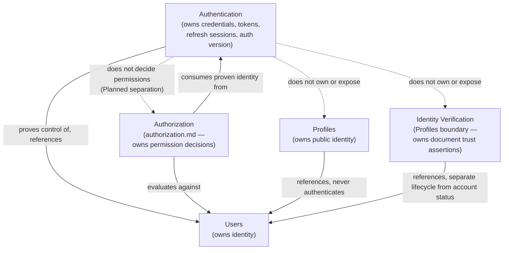
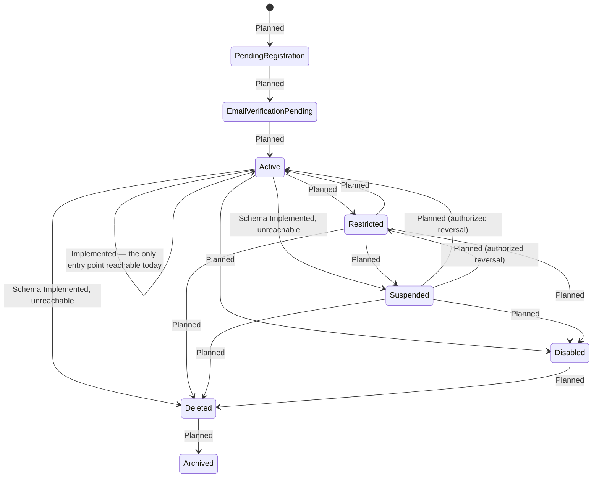
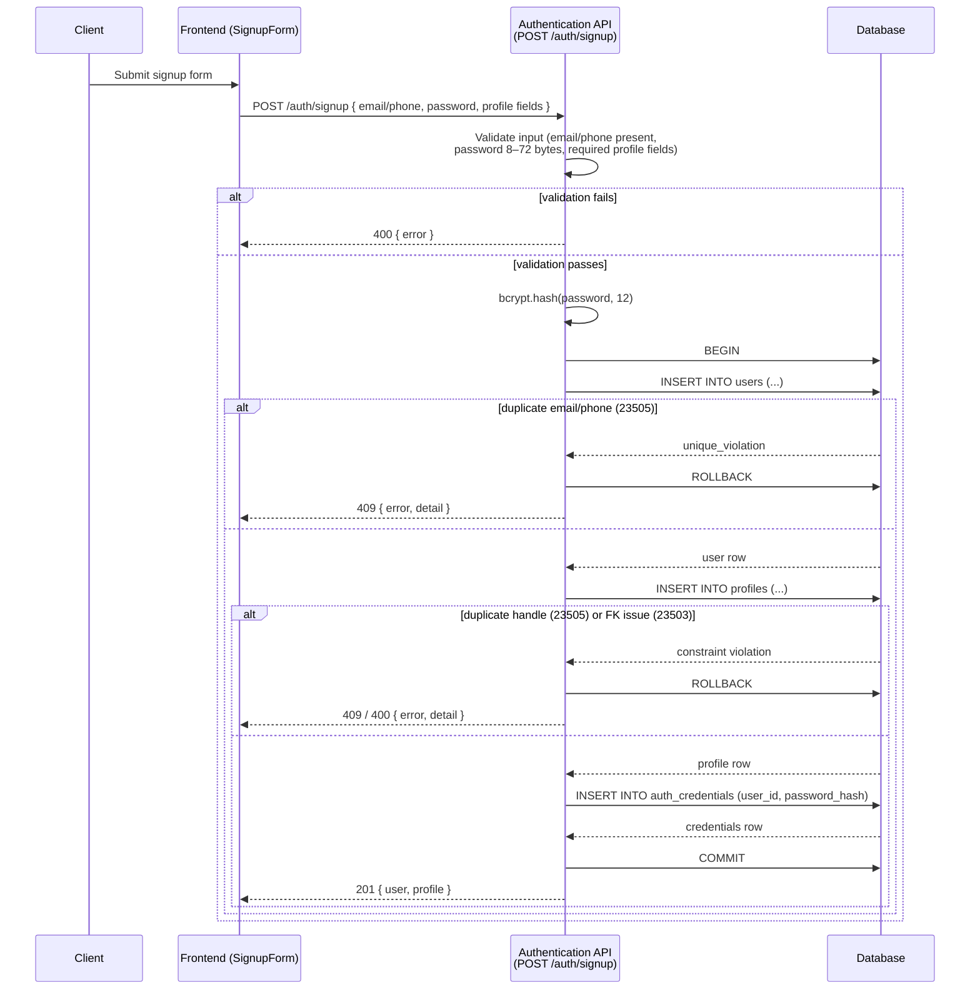
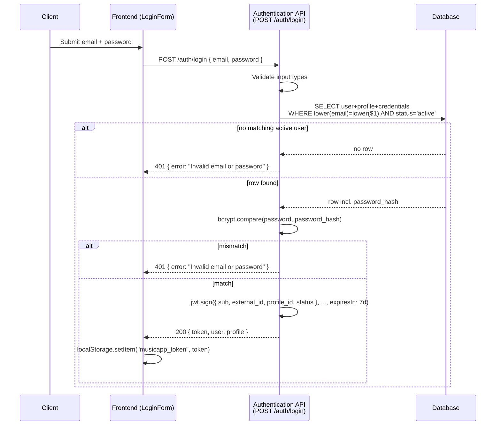
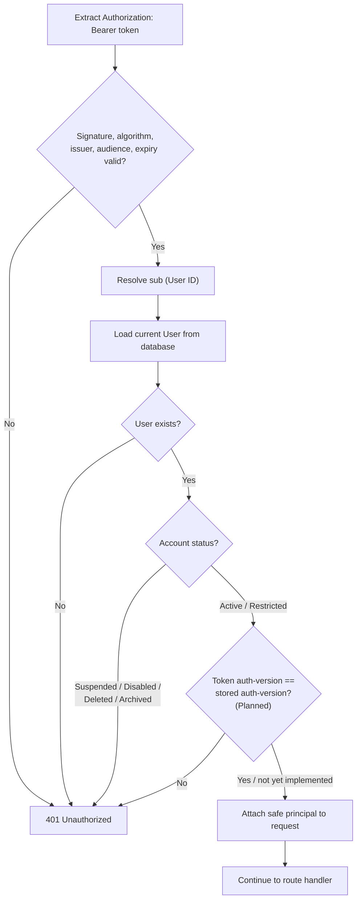
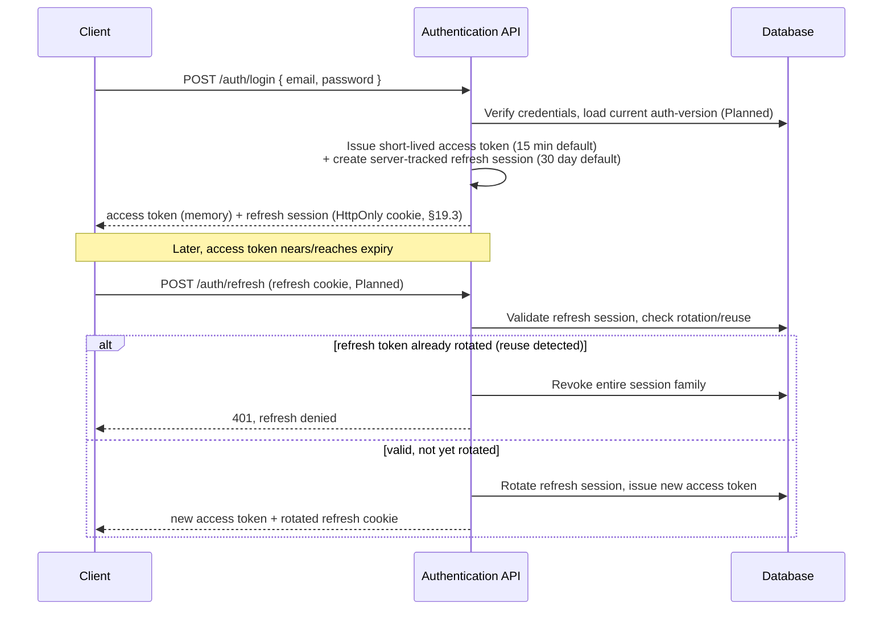
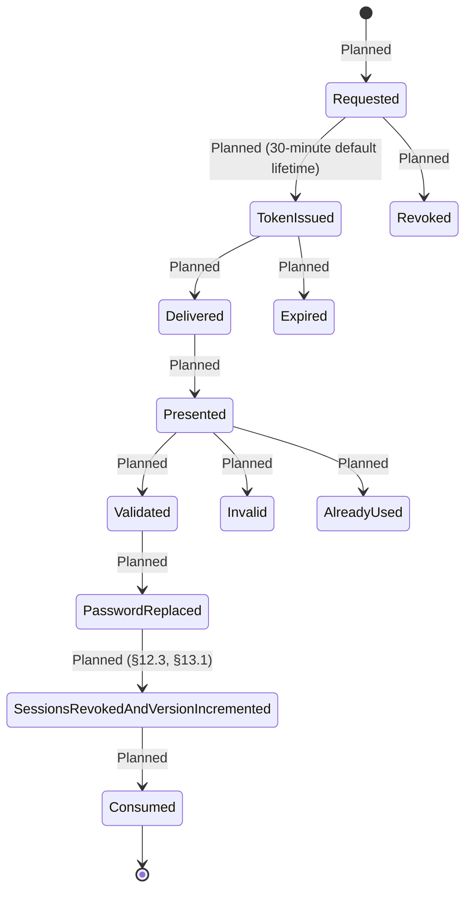
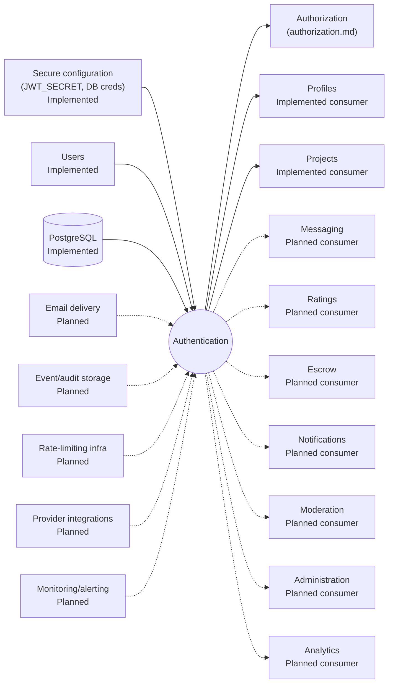

# MusicApp Authentication Domain Specification

| Field | Value |
|---|---|
| Document | Authentication Domain Specification |
| Domain | Authentication (`02-users-roles-permissions/`) |
| Document ID | SPEC-AUTH-000 (provisional — see §4.1) |
| Type | Specification (SPEC) |
| Status | Approved |
| Version | 1.2.0 |
| Owner | Engineering (interim: repository maintainers) |
| Repository branch | `docs/specification-foundation` |
| Last updated | 2026-07-22 |
| Related documents | [`product-overview.md`](../01-foundation/product-overview.md), [`system-architecture.md`](../01-foundation/system-architecture.md), [`users.md`](users.md), [`authorization.md`](authorization.md) |
| Supersedes / Superseded By | None |

This document follows [`docs/00-governance/README.md`](../00-governance/README.md) (GOV-000). It converts the supplied Product Specification Pack for the Authentication domain into governed documentation, verifies every technical claim against the repository at time of writing, and preserves every approved product decision — nothing approved is removed for being unimplemented.

**Status taxonomy:** this document classifies every feature using the same five-value taxonomy established in [`system-architecture.md`](../01-foundation/system-architecture.md) §2.3 and reused in [`users.md`](users.md) — **Implemented**, **Partially Implemented**, **Schema Implemented**, **Planned**, **Proposed** — per GOV-000 §12 (single source of truth), not redefined here.

**How this document separates content**, per its quality requirements: **Canonical Product Decisions** are stated as definitions and rules (§7, §9–§18, §31.1); **Repository Facts** live in §25 and in "Evidence"/"Repository Evidence" columns throughout; **Intentional Future Architecture** lives in §27; **Implementation Gaps** are the distance between a canonical decision and repository fact, labeled explicitly in §26; **Assumptions** live in §29; **Risks** live in §28; **Open Questions** live in §30.

## 1. Executive Summary

Authentication answers one question: *"Can this actor prove control of this identity?"* It owns credentials and authentication mechanisms; it does not decide what an authenticated user may do — that is Authorization's role, documented in full in [`authorization.md`](authorization.md) — does not own public identity (Profiles), and does not own identity-document verification (Verification, currently modeled via `profile_verifications`/`verification_documents`).

**Verified against the repository:** the domain is **Partially Implemented**. Registration and login are Implemented — a transactional signup (`POST /auth/signup`), a login endpoint (`POST /auth/login`) issuing a signed JWT, and a session-restoration endpoint (`GET /auth/me`) all exist and work as coded. Password hashing uses `bcryptjs` at cost factor 12. Logout is Partially Implemented — a client-side token removal exists with no server-side counterpart, because no server-side session or revocation mechanism exists at all. Password reset, authenticated password change, email verification, refresh tokens, MFA, external providers, rate limiting, and structured authentication audit logging are all **Planned** — approved future capabilities with no schema or code trace in the repository.

**This revision (v1.1.0) resolves the account-status enforcement question left open in v1.0.0, and adds ten further canonical decisions.** The canonical target architecture is now: every protected request passes through **shared, status-aware authentication middleware** (§12.3) that verifies the token, loads the current User, checks account status, and (once implemented) compares a stored authentication version against the token's version claim — rejecting `Suspended`/`Disabled`/`Deleted`/`Archived` accounts and allowing `Restricted` ones. **This directly resolves the open question raised in v1.0.0** ("should status enforcement be per-route or shared?") — the answer is shared middleware, not per-route checks. The repository's current mixed behavior — database status checks on `POST /auth/login` and `GET /auth/me`, JWT-only checks on the other four protected routes — is the implementation gap against that target, not an open design question (§8, §25.5).

**Other canonical decisions applied this revision:** target access tokens are short-lived (15-minute default) with revocable, server-tracked, rotating 30-day refresh sessions (§13) — the repository's current single 7-day access token with no refresh or revocation is explicitly **development-stage behavior, not the approved production target** (§1, §12, §13). Immediate invalidation combines the status lookup above with a stored authentication version/security stamp (§12.3, §23). Browser token delivery targets HttpOnly cookies for refresh credentials and in-memory access tokens (§19.3) — the current `localStorage`-based frontend is explicitly current, not target, behavior. HS256 is confirmed acceptable for the current single-backend MVP, with an explicit algorithm allowlist as a still-open **implementation gap**, not a design question (§12, §25.5 `SEC-AUTH-009`). Email-verification and password-reset tokens get canonical, configurable default lifetimes (24 hours and 30 minutes respectively, §15, §16). The canonical password policy is a 12–128 character range with no mandatory complexity formula (§11) — distinct from, and not yet matching, the repository's current 8-character minimum / 72-byte maximum. **`GET /users`'s unauthenticated exposure of every user's email, phone, and status is confirmed as a security defect against the canonical target, not accepted or target behavior** (§10 principle preserved; target restated at §25.5 `SEC-AUTH-008`, `BR-AUTH-028`).

**Where this document needed more information than the Specification Pack, the repository, and the canonical decisions together provided**, the narrower remaining gaps are recorded in §30 — none of them restate a question already answered by a canonical decision.

## 2. Purpose

Authentication exists to prove that a platform actor is entitled to act as a particular MusicApp User — nothing more. It answers *"can this actor prove control of this identity?"*, not *"what may this actor do?"* (Authorization) and not *"who is this person publicly?"* (Profiles).

**Verified:** the repository's current authentication surface (`backend/Index.js`, lines 1–48, 200–468) is scoped exactly this narrowly — it issues and verifies identity tokens and never itself makes a business-permission decision; `POST /projects` and its sibling routes perform their own authorization-adjacent checks (e.g., buyer/seller identity, ownership) independent of `requireAuth`.

## 3. Scope

This document covers the Authentication domain: credentials, login, logout, tokens, sessions, password lifecycle, email verification, MFA, external providers, and the security/audit/data-model concerns specific to authenticating a MusicApp User. It does not cover:

- **User identity and account status** — owned by [`users.md`](users.md); Authentication consumes account status (§8) but does not define it.
- **Public profile data** — owned by Profiles (`system-architecture.md` §10.3).
- **Authorization** (route-level and resource-level permission decisions) — a first-class domain owned by [`authorization.md`](authorization.md); Authentication's relationship to it is defined in §7 (Authentication proves identity, Authorization consumes the authenticated principal and evaluates current access policy — Authentication does not own business permission decisions), but Authorization's own rules are out of scope here and are not restated.
- **Identity/professional verification** (documents, review workflow) — modeled by `profile_verifications`/`verification_documents`, owned at the Profiles/identity-verification boundary per `users.md` §5.2, §8.2. Explicitly distinct from email verification (§15), which this document does own.
- Business rules and requirements already owned by [`product-overview.md`](../01-foundation/product-overview.md) or [`users.md`](users.md) — referenced here, not redefined, per GOV-000 §12.

## 4. Terminology and Domain Boundaries

### 4.1 Identifier Governance Note

`AUTH` is a domain token already permitted under GOV-000 §11, so `REQ-AUTH-*` and `BR-AUTH-*` identifiers in this document (§9, §31) are fully governed. GOV-000 §11 does not define `SEC-[DOMAIN]-NNN`, `AUD-[DOMAIN]-NNN`, `DATA-[DOMAIN]-NNN`, or `INT-[DOMAIN]-NNN` families — only a domain-less `SEC-NNN`. This document uses `SEC-AUTH-*`, `AUD-AUTH-*`, `DATA-AUTH-*`, and `INT-AUTH-*` as document-local, explicitly non-governed identifier families for security findings, audit requirements, data-model entities, and interfaces respectively, consistent with the provisional-identifier approach taken in `system-architecture.md` §2.4 and `users.md` §3.1. `SPEC-AUTH-000` (this document's own ID) is likewise a plain, non-governed tracking label.

### 4.2 Domain Terms

| Term | Owning Domain | One-line Definition |
|---|---|---|
| Identity | Users | The durable record of *who* an account is (`users.id`) — see `users.md` |
| Credentials | **Authentication** | The secret(s) that prove control of an identity (e.g., a password hash) |
| Session / Token | **Authentication** | The artifact that carries a proven identity across requests |
| Authorization | [`authorization.md`](authorization.md) | The decision of whether a proven (or anonymous) identity may perform a specific action on a specific resource now |
| Public Profile | Profiles | The user-facing identity (artist name, bio, genres) — see `system-architecture.md` §10.3 |
| Identity/Professional Verification | Profiles / identity-verification boundary | Document-backed trust assertions distinct from email verification (§15) — see `users.md` §8.2 |
| Account Status | Users | Whether the account itself may access the platform at all — see `users.md` §8.1; Authentication consumes this (§8) |
| Moderation | *Planned domain, no repository footprint* | Reports, account actions — see `system-architecture.md` §10.11 |
| Administration | *Planned domain, no repository footprint* | Cross-domain oversight — see `system-architecture.md` §10.12 |

**Authorization is explicitly out of scope of this document but is a documented, first-class domain — see [`authorization.md`](authorization.md).** No role, permission, or policy-evaluation *code* exists anywhere yet (`system-architecture.md` §10.14, `authorization.md` §30) — the domain is documented and approved, but not implemented. Wherever this document says "Authorization," it means the decision layer defined in full in `authorization.md` §6–§10 — Authentication proves identity and produces an authenticated principal; Authorization consumes that principal, evaluates current access policy (account status, roles, permissions, relationships, resource state), and decides allow or deny. Authentication never makes that decision itself.

## 5. Ownership

### 5.1 Authentication Ownership Matrix

| Concern | Owning Domain | Authentication Responsibility | Authentication Non-Responsibility |
|---|---|---|---|
| Credential records (password hash) | **Authentication** | Owns creation, storage, verification | — |
| Password-change timestamps | **Authentication** | Owns `password_changed_at` | — |
| Login attempts / auth events | **Authentication** | Owns (target: `AUD-AUTH-*`) | — |
| Access-token issuance/validation | **Authentication** | Owns | — |
| Refresh sessions | **Authentication** | Owns (Planned, canonical target per §13) | — |
| Authentication version / security stamp | **Authentication** | Owns (Planned, canonical target per §12.3) | — |
| Password reset / email verification tokens | **Authentication** | Owns (Planned) | — |
| MFA methods | **Authentication** | Owns (Planned) | — |
| Authentication-provider links | **Authentication** | Owns (Planned) | — |
| The User record itself | Users | — | Authentication never owns identity, only proves control of it |
| Public profile data | Profiles | — | Authentication never owns bio/genres/portfolio |
| Identity-verification documents/decisions | Profiles / identity-verification | — | Authentication never owns document review |
| Route/resource permission decisions | Authorization (`authorization.md`) | — | Authentication never decides what an authenticated user may do |
| Organization membership | *Users/Organizations (Planned)* | — | Authentication never owns org structure |
| Administrative roles | *Administration (Planned)* | — | Authentication never owns role assignment |
| Project membership/state | Projects | — | Authentication never owns project data |
| Escrow balances, payout eligibility | Escrow | — | Authentication never owns money or payout decisions |
| Marketplace visibility, public creator discovery | Marketplace / Profiles | — | Authentication never owns discovery/ranking; a User-listing API is never the discovery surface (§25.5 `SEC-AUTH-008`, `BR-AUTH-028`) |
| Moderation decisions, account reputation | Moderation *(Planned)* | — | Authentication never owns moderation outcomes |

**Verified:** this boundary holds structurally in the repository. `users` (`backend/db/001_create_users.sql`) has no password/token column. `auth_credentials` (`backend/db/007_create_auth_credentials.sql`) has no profile-shaped or business-logic column. `profiles` (`backend/db/002_create_profiles.sql`) has no credential column.

## 6. Relationships

### 6.1 Core Domain Relationship

| Relationship | Cardinality | Status | Evidence |
|---|---|---|---|
| User → primary Authentication identity | Exactly one (current individual-user rule) | Implemented | `auth_credentials.user_id UUID NOT NULL UNIQUE` (`backend/db/007_create_auth_credentials.sql`) |
| User → Authentication Provider Links | Many (target architecture) | Planned | No schema or code; local email/password is the only provider today |
| User → Authentication (Refresh) Sessions | Many (canonical target, §13) | Planned | No session table; a JWT is not tracked server-side after issuance |
| User → Authentication Events | Many (target architecture) | Planned | No audit-event table; only `console.error` on exceptions |
| User → password-reset attempts | Many (target architecture) | Planned | No reset-token table or route |
| User → email-verification attempts | Many (target architecture) | Planned | No verification-token table or route |
| User → MFA methods | Many (target architecture) | Planned | No MFA schema or code |

A linked provider (future) is not a separate MusicApp User; linking must not silently create a second `users` row when the provider identity belongs to an existing account (`BR-AUTH-015`). Account linking requires proof of control over both identities, or another securely approved process — this exact mechanism is not yet designed (§30).

### 6.2 Authentication Domain Relationship Diagram


*Solid arrows = an active, defined relationship (whether Implemented or Planned in code). Dashed arrows = an explicit non-responsibility boundary. `Authorization` is a documented, first-class domain (`authorization.md`) — it is drawn here because the distinction from Authentication must be explicit throughout this document, not because its status is uncertain; it has no repository *code* footprint yet (§4, `authorization.md` §30).*

## 7. Authentication Principles

| Principle | Statement | Status |
|---|---|---|
| Proof, not permission | Authentication determines whether credentials are valid, which User the actor represents, and whether the mechanism/token/session is acceptable. It never determines whether an action is permitted — that decision belongs entirely to Authorization. | Canonical — see §4, `authorization.md` §6–§10 |
| No permanent truth in tokens | A token may carry limited claims, but sensitive or changeable permissions (suspension, restriction, admin-role removal, payout eligibility, project participation, verification status) must be re-evaluated against current platform state where necessary, since they may change after a token is issued. | Canonical; enforced today only for `/auth/login` and `/auth/me` — see §25.5 `SEC-AUTH-002` |
| Shared, status-aware middleware | Every protected request must be authenticated through one shared middleware component that verifies the token and evaluates current account status; route handlers must not independently recreate token-verification or status logic. | Canonical target (§12.3); **resolves the v1.0.0 open question of per-route vs. shared enforcement — the answer is shared** |
| Immediate invalidation | Account-security changes (password reset, suspected compromise, `Disabled`, `Deleted`, administrator-triggered global sign-out) must not wait for natural token expiry. | Canonical target, combining a current-status lookup with a stored authentication version (§12.3, §23) |
| Domain separation | Authentication is intentionally separated from Users, Profiles, Authorization, Roles, Permissions, Verification, Moderation, Administration, Projects, Escrow, Messaging, Ratings, and Marketplace. | Canonical; structurally Implemented (§5.1) |
| Account status vs. identity-verification status | These are separate systems (`users.md` §8.3); Authentication consumes account status (§8) and must not conflate it with identity-verification status. | Canonical; structurally Implemented — `users.status` and `profile_verifications.status` are already distinct columns |

## 8. Account-Status Interaction

Authentication consumes the canonical account status defined in [`users.md`](users.md) §8.1. It does not define or own these statuses. **Per the canonical shared-middleware decision (§7, §12.3), status is intended to be evaluated identically on every protected request, not per-route.**

### 8.1 Account-Status Authentication Matrix

| Account Status | Can Authenticate | Existing Sessions | Authentication Behaviour | Authorization Implication |
|---|---|---|---|---|
| Pending Registration | No | N/A | No normal authenticated platform access; registration workflow may continue through a controlled temporary mechanism (Planned — no such mechanism exists today; the repository has no intermediate registration state at all, §9) | N/A |
| Email Verification Pending | Yes, limited | N/A (Planned status, not implemented) | Login permitted; cannot buy or sell or initiate commercial transactions; may continue email-verification flow and required onboarding | Enforced by Authorization (Planned), not Authentication |
| Active | Yes | Valid | Full authentication permitted | Authorization (Planned) determines action-level access |
| Restricted | Yes | Valid | Authentication permitted; **must not** be treated as equivalent to Suspended | Authorization (Planned) applies capability restrictions (`users.md` `BR-USERS-014`) |
| Suspended | No | Must be revoked/made unusable | Normal authentication denied via the shared middleware's status lookup — enforced immediately even if the authentication version is unchanged (§12.3); reversal is an authorized Moderation/Administration action | N/A while suspended |
| Disabled | No | Must be invalidated | Authentication denied; no ordinary reactivation path; exceptional recovery is an audited administrative process | N/A |
| Deleted | No | Must no longer permit access | Authentication denied; the underlying User record remains retained for audit (`users.md` `BR-USERS-009`) | N/A |
| Archived | No | N/A | Authentication denied; historical record only | N/A |

**Verified against the repository:** only `active`, `suspended`, and `deleted` exist in `user_status` (`backend/db/001_create_users.sql`); the other five canonical statuses are a `users.md` §8.1 target-architecture gap, inherited here. **Current authentication enforcement of status is partial and precise, not absent:** `POST /auth/login` (`backend/Index.js:342`) and `GET /auth/me` (`backend/Index.js:424`) both filter `WHERE ... u.status = 'active'::user_status` — so a non-`active` user cannot log in or restore a session via those two routes today. No route ever sets `status` to `suspended` or `deleted`, so this has never been exercised against real data. **The other four protected routes not re-checking status (§25.5 `SEC-AUTH-002`) is the implementation gap against the shared-middleware target (§7, §12.3) — resolved as a target design, not an open question, in this revision.**

### 8.2 Account-Status Authentication State Diagram


*This diagram intentionally contains no identity-verification states — identity-verification status (`Not Submitted`/`Pending`/`Under Review`/etc., `users.md` §8.2) is a separate lifecycle and does not appear here, per `users.md` §8.3 and this document's §4. It is reproduced from `users.md` §8.1 for authentication context; `users.md` remains the source of truth for account-status definitions and transitions (GOV-000 §12).*

## 9. Registration

Registration is the controlled, transactional creation of User identity, Authentication credentials, and — under the current product direction — the primary Profile in the same flow.

### 9.1 Canonical Registration Rules

| ID | Statement | Status |
|---|---|---|
| `BR-AUTH-008` | Signup must be transactional — either all required records (User, Profile, Credentials) are created, or none are. **Signup, not ordinary login, is the domain's mandatory multi-record transaction (§10, `BR-AUTH-010`).** | **Implemented** — `backend/Index.js:203-314`, `BEGIN`/`COMMIT`/`ROLLBACK` around all three inserts |
| — | Email must be normalized before uniqueness comparison. | **Implemented** — `email CITEXT` (`backend/db/001_create_users.sql`) gives case-insensitive storage/comparison at the database level |
| `BR-AUTH-007` | Password must never be stored in plaintext; must be hashed before persistence. | **Implemented** — `bcrypt.hash(password, 12)` (`backend/Index.js:247`), computed before the transaction begins |
| — | Duplicate identity creation must fail safely. | **Implemented** — `users.email`/`phone_e164` are `UNIQUE`; a `23505` violation returns `409` (`backend/Index.js:300-301`) |
| — | Duplicate handles must fail safely. | **Implemented** — `profiles.handle CITEXT UNIQUE`; same `23505` → `409` path |
| — | Database constraint failures must not expose sensitive internals. | **Partially Implemented** — the response includes `err.detail` from PostgreSQL (`backend/Index.js:301`, `304`, `307`), which can echo constraint/column names; it does not echo secret values, but it is more internal detail than a minimal-disclosure error contract would provide — see §22, §28 |
| — | Partial creation must be rolled back. | **Implemented** — `ROLLBACK` in the `catch` block (`backend/Index.js:299`) |
| — | Successful registration must create an attributable audit event. | **Planned** — no audit table exists (§20/`AUD-AUTH-001`) |
| — | Registration response must not expose password hashes or internal credential secrets. | **Implemented** — the response body is `{ user, profile }` (`backend/Index.js:297`); `passwordHash` is a local variable never attached to either object |
| — | Public Profile creation must remain logically separate from credential ownership, even in one transaction. | **Implemented** — `profiles` and `auth_credentials` are separate `INSERT` statements against separate tables, both keyed by `user_id` |

### 9.2 Signup Data — Product-Required vs. Repository-Current vs. Future

| Field | Product-Required (this Specification Pack) | Repository-Current (`POST /auth/signup`) | Future/Optional |
|---|---|---|---|
| Email or phone | Yes (at least one) | `email`, `phone_e164` — `backend/Index.js:207-208`, `225-227` | — |
| Password | Yes | Required string, 8–72 bytes (`backend/Index.js:228-236`) — see §11 for the canonical target policy, which differs | — |
| Profile handle | Yes | Required (`backend/Index.js:237`) | — |
| Artist name | Yes | Required (`backend/Index.js:239`) | — |
| Display name | Yes | Required (`backend/Index.js:240`) | — |
| Genres | Listed as an onboarding field | Optional array, default `[]` (`backend/Index.js:218`) | — |
| Other onboarding fields (first/last name, city, country, bio, DOB, artist-name-is-legal-name) | Not enumerated by the Pack | `first_name`/`city`/`country` required; `last_name`/`bio`/`dob`/`artist_name_is_legal_name` optional (`backend/Index.js:213-222`, `238`, `241-242`) | — |
| MFA enrollment | — | Not present | Planned (§17) |
| Provider selection (Google/Apple/etc.) | — | Not present | Planned (§18) |

### 9.3 Registration Sequence Diagram


*Verified against `backend/Index.js:203-314`. This is a faithful rendering of the current, Implemented flow — not a target-architecture diagram. Signup is the domain's one mandatory multi-record transaction; see §10 for why login is not described the same way.*

## 10. Login

Login proves control of the registered credential and issues a session token.

**Login is not a multi-record transaction the way signup is (`BR-AUTH-010`).** The repository's current `POST /auth/login` performs exactly one read (`backend/Index.js:330-344`) and zero writes — no audit event, no session row, no last-login timestamp, because none of those exist yet. Describing "login" as transactional merely because it authenticates would be imprecise. Where a future login implementation writes security state — authentication events, session/refresh-session creation, failed-attempt counters, token rotation, last-login timestamps — those specific writes should be atomic where partial state would create inconsistency (e.g., issuing a refresh session record and its paired access token together), but that is a narrower claim about specific future writes, not a blanket "login is transactional" statement.

### 10.1 Canonical Login Flow vs. Repository Reality

| Step | Canonical Flow | Repository Status |
|---|---|---|
| 1. Receive identifier + secret | `email`, `password` from request body | Implemented (`backend/Index.js:321`) |
| 2. Normalize identifier | Lowercase comparison | Implemented — `lower(u.email) = lower($1)` (`backend/Index.js:342`) |
| 3. Retrieve credential identity securely | Single query joining `users`/`profiles`/`auth_credentials` | Implemented (`backend/Index.js:330-344`) |
| 4. Compare secret via configured hashing verification | `bcrypt.compare` | Implemented (`backend/Index.js:353`) |
| 5. Evaluate whether the account may authenticate | Account-status check | Implemented, but only via the query's `WHERE ... status = 'active'` filter (`backend/Index.js:342`) — a suspended/deleted user simply produces no row, indistinguishable from a wrong password |
| 6. Record success or failure | Structured audit event | **Planned** — no audit table; only implicit via HTTP response |
| 7. Issue token/session | Signed access token; target also issues a refresh session (§13) | Access token: Implemented (`backend/Index.js:387-400`). Refresh session: **Planned** |
| 8. Return only safe identity/session info | No password hash in response | Implemented — response is `{ token, user, profile }` (`backend/Index.js:402`); `password_hash` is read into `row` internally but never attached to `user`/`profile` |

### 10.2 Security Behaviour

| Requirement | Status | Evidence |
|---|---|---|
| Invalid email and invalid password produce equivalent public errors | **Implemented** | Both "no matching active user" and "password mismatch" return the same `{ error: "Invalid email or password" }` at `401` (`backend/Index.js:347-356`) |
| Do not reveal whether an email address exists | **Implemented** for login itself; **not Implemented** platform-wide | Login's own response doesn't leak existence; however `GET /users` (unauthenticated) lists every user's email — a confirmed security defect, see §25.5 `SEC-AUTH-008`, `BR-AUTH-028` |
| Failed attempts are rate-limited | **Planned** | No rate-limiting package or logic found (`backend/package.json`) |
| Progressive controls on repeated failure | **Planned** | Not implemented |
| Account lockout avoids denial-of-service risk | **Planned** — not applicable, no lockout exists; exact lockout strategy remains open (§30) | — |
| Login response does not expose password hashes | **Implemented** | See §10.1, step 8 |
| Login does not return unrestricted internal DB objects | **Implemented** | Response is hand-built from named fields (`backend/Index.js:358-385`), not a raw row |

### 10.3 Login Sequence Diagram


*Verified against `backend/Index.js:319-407` and `frontend/src/App.tsx` (`handleLoginSuccess`). Account-status evaluation is folded into the single `SELECT`, not a separate step, in the actual implementation. **The `expiresIn: 7d` value shown here is the current repository default — development-stage behavior, not the approved production target (§12, §13, §29).** See §13.3 for the target login-plus-refresh-session flow.*

**Login existence:** verified present — `POST /auth/login` exists and is not inferred from the existence of signup (`backend/Index.js:319`).

## 11. Password Management

### 11.1 Canonical Password Policy (target — distinct from repository-current)

| Parameter | Canonical Target | Repository-Current | Status |
|---|---|---|---|
| Minimum length | 12 characters | 8 characters (`backend/Index.js:231-233`) | Planned — repository does not yet match the canonical minimum |
| Maximum length | 128 characters | 72 bytes (`backend/Index.js:234-236`) | Planned — see reconciliation note below |
| Character-class formula (mandatory upper/lower/number/symbol) | None required | None required | Implemented (both already agree: no mandatory formula) |
| Spaces / passphrases | Allowed | Allowed (no restriction found) | Implemented |
| Silent truncation | Must not occur | Rejected outright above 72 bytes rather than silently truncated (`backend/Index.js:234-236`) | Implemented (current behavior satisfies "no silent truncation" by rejecting instead, though via a narrower limit than the canonical 128) |
| Compare against known-compromised-password data | When integration becomes available | Not implemented | Planned |
| Policy configurable | Yes | No — `8`/`72` are literal constants | Planned |

**Reconciliation note — a genuine, unresolved technical tension, not invented by this document:** the canonical maximum of 128 characters is longer than `bcrypt`'s well-known ~72-byte effective input limit, which the repository's current 72-byte cap is explicitly built around (`backend/Index.js:234-236`). Raising the accepted maximum to 128 characters without changing the hashing approach would require one of: (a) pre-hashing the password with a fixed-length digest (e.g., SHA-256) before passing it to `bcrypt`, (b) migrating to a hashing algorithm without `bcrypt`'s input-length ceiling (e.g., Argon2), or (c) capping the *effective* hashed length at 72 bytes while still accepting and displaying a 128-character policy at the input-validation layer. This document does not choose among these — it is carried forward as an open question (§30).

### 11.2 Other Canonical Requirements vs. Repository Verification

| Requirement | Status | Evidence |
|---|---|---|
| Never store plaintext passwords | **Implemented** | `password_hash TEXT NOT NULL` (`backend/db/007_create_auth_credentials.sql`); only the hash is ever inserted |
| Never log passwords | **Implemented** (verified by absence) | No `console.log`/`console.error` call includes `password` or `req.body` wholesale in `backend/Index.js` |
| Never return password hashes through APIs | **Implemented** | Verified across `/auth/signup`, `/auth/login`, `/auth/me`, `GET /users` — none select or return `password_hash` outside the internal login comparison |
| Modern adaptive hashing algorithm | **Implemented** | `bcryptjs` — package.json pins `^3.0.3` (`backend/package.json`) |
| Suitable work factor | **Implemented** | Cost factor `12`, hardcoded (`backend/Index.js:247`) |
| Work factor/algorithm may evolve | **Planned** | No versioning field on `auth_credentials`; a future cost-factor bump would need a rehash mechanism that does not exist |
| Rehash after login if stored hash doesn't meet current policy | **Planned** | Not implemented — login never rewrites `password_hash` |
| Record `password_changed_at` | **Schema Implemented, not updated after creation** | Column exists (`backend/db/007_create_auth_credentials.sql`, default `now()`); no route ever updates it after insert, because no password-change route exists |
| Invalidate/constrain sessions after sensitive password changes | **Planned** | Canonical target: a global-sign-out password change increments the authentication version (§12.3, `BR-AUTH-021`); no password-change route or session model exists yet |
| Require recent authentication for password changes | **Planned** | No password-change route exists at all |
| Separate recovery process when unauthenticated | **Planned** | No password-reset route exists at all — see §16 for its canonical policy |

### 11.3 Exact Repository Details

- **Package and version:** `bcryptjs` `^3.0.3` (`backend/package.json`).
- **Hashing function:** `bcrypt.hash(password, 12)` at signup (`backend/Index.js:247`).
- **Configured cost:** `12`, a literal constant, not environment-configurable.
- **Where hashing occurs:** `POST /auth/signup`, before the database transaction opens (`backend/Index.js:247`).
- **Where verification occurs:** `POST /auth/login`, via `bcrypt.compare(password, row.password_hash)` (`backend/Index.js:353`).
- **Password complexity enforcement:** none beyond length. No character-class, dictionary, or common-password checks found.
- **Minimum/maximum length (repository-current, not canonical — see §11.1):** minimum 8 characters (`backend/Index.js:231-233`); maximum 72 bytes (`backend/Index.js:234-236`, matching bcrypt's input limit).
- **Password-change route:** does not exist.
- **Password history:** does not exist.
- **Breached-password checks:** do not exist.
- **General-user routes selecting `password_hash`:** none found — verified by grepping every `SELECT` in `backend/Index.js` that touches `auth_credentials`; only `POST /auth/login`'s internal query does, and it is never re-exposed.

## 12. Access Tokens

### 12.1 Canonical Target vs. Repository-Current

| Parameter | Canonical Target | Repository-Current | Status |
|---|---|---|---|
| Lifetime | Short-lived; **default 15 minutes**, configurable via secure configuration | `JWT_EXPIRES_IN`, default `"7d"` (`backend/Index.js:12`, `396`) | **Planned — the current 7-day default is explicitly development-stage behavior, not the approved production value (§1, §29)** |
| Immutability after issuance | Token contents are fixed once signed | Implemented (JWTs are inherently immutable once signed) | Implemented |
| Signing | Signed; HS256 acceptable for the current single-backend MVP (§12.3) | `jsonwebtoken` `jwt.sign`/`jwt.verify`, effectively HS256 | Implemented |
| Claims | Only necessary claims; no credential secrets or sensitive personal data | `{ sub, external_id, profile_id, status }` | Implemented |
| Algorithm verification | Verification must explicitly allowlist the approved algorithm(s) | `jwt.verify` does not pass an `algorithms` option | **Planned — confirmed concrete implementation gap, not merely a defense-in-depth suggestion (§25.5 `SEC-AUTH-009`)** |
| Issuer/audience/expiry checked | Yes | Yes — `{ issuer, audience }` passed to `jwt.verify`; expiry checked implicitly by the library (`backend/Index.js:40-43`) | Implemented |
| Secret from secure configuration | Yes, and production startup must fail when the secret is missing, weak, or an unsafe development default | `JWT_SECRET` required; process exits if unset/blank (`backend/Index.js:11`, `16-19`); **no check for weak or default-looking values** | Partially Implemented — "missing" is covered; "weak/default" is not |
| Stable, immutable subject identifier | Yes, preferably the User ID; must not change if signing algorithm changes in the future | `sub` is `users.id` (UUID) | Implemented |

### 12.2 Exact Token Configuration

- **Library:** `jsonwebtoken` `^9.0.3` (`backend/package.json`).
- **Signing:** `jwt.sign(payload, JWT_SECRET, { expiresIn, issuer, audience })` (`backend/Index.js:387-400`).
- **Claims:** `sub` (user ID), `external_id`, `profile_id`, `status` — set at login time only, not refreshed. Target adds an authentication-version claim (§12.3).
- **Issuer:** `"musicapp-api"` (`backend/Index.js:13`).
- **Audience:** `"musicapp-web"` (`backend/Index.js:14`).
- **Expiry:** `JWT_EXPIRES_IN` env var, default `"7d"` (`backend/Index.js:12`, `backend/.env.example`) — see §12.1 for why this is not the canonical target.
- **Verification middleware:** `requireAuth` (`backend/Index.js:24-48`) — parses `Authorization: Bearer <token>`, calls `jwt.verify` with `{ issuer, audience }`, attaches the decoded payload to `req.auth`, or returns `401 { error: "Unauthorized" }` on any failure. This is the current implementation of what §12.3 defines as the canonical shared middleware — already shared across all protected routes, but not yet status-aware.
- **No role claims exist** — consistent with no authorization/role system existing anywhere (§4).

### 12.3 Canonical Shared Authentication Middleware

**This is the canonical resolution to the account-status enforcement question (§7, §8, §25.5 `SEC-AUTH-002`).** Every protected request must be authenticated through one shared middleware component performing, in order:

1. Extract the presented access token.
2. Verify signature, approved algorithm (allowlisted, §12.1), issuer, audience, and expiry.
3. Resolve the immutable User identifier (`sub`) from the token.
4. Load the current User from the database.
5. Confirm the User still exists.
6. Evaluate the current account status — reject if `Suspended`, `Disabled`, `Deleted`, or `Archived`; allow `Restricted` (leaving capability restriction to Authorization).
7. Compare the token's authentication-version claim with the currently stored version, once that mechanism is implemented (§23 `DATA-AUTH-001`) — reject on mismatch.
8. Attach a safe authenticated-principal object to the request.

Route handlers must not independently recreate token-verification or account-status logic (`BR-AUTH-019`).


*This is the canonical target flow. **Verified current implementation covers only steps 1–3 and 8** — `requireAuth` (`backend/Index.js:24-48`) checks signature/issuer/audience/expiry and attaches `req.auth`, but performs no database lookup at all (steps 4–7 are entirely Planned, shared across every protected route today via `requireAuth`'s single definition, which already satisfies "shared" — the gap is "status-aware," not "shared"). `POST /auth/login` and `GET /auth/me` separately implement an equivalent of step 6 inline in their own SQL, which is exactly the per-route duplication `BR-AUTH-019` says should not continue once shared middleware exists.*

## 13. Sessions and Refresh Tokens

**Status: Planned.** No server-tracked session and no refresh-token mechanism exist in the repository. Authentication today is pure stateless-JWT: a single long-lived (default 7-day) access token, issued once at login, with no renewal, rotation, or revocation path. **This is confirmed as development-stage implementation, not the approved production architecture (§1, §12.1, §29).**

### 13.1 Canonical Target Architecture

| Parameter | Canonical Target | Status |
|---|---|---|
| Access-token lifetime | Short-lived, default 15 minutes, configurable (§12.1) | Planned |
| Refresh-session lifetime | Default **30 days**, configurable via secure configuration | Planned |
| Refresh sessions are revocable | Yes | Planned |
| Refresh sessions are server-tracked | Yes, associated with a User and a specific session | Planned |
| Refresh-token storage | Securely hashed material, not the raw token, where practical | Planned |
| Rotation on use | Refresh tokens are rotated every time they are used | Planned |
| Reuse detection | Reuse of an already-rotated (superseded) refresh token is detected | Planned |
| Reuse response | Detected reuse revokes the entire affected session family, not just the one token | Planned |
| Explicit device logout | Revokes exactly one session (§14) | Planned |
| Sign out all devices | Revokes all sessions for the User (§14) | Planned |
| Revocation triggers | Password reset, password change under global-sign-out policy, suspected compromise, `Disabled`, `Deleted`, administrator-triggered sign-out-all, other high-risk recovery actions | Planned — see §12.3, §23 `DATA-AUTH-001` for the authentication-version mechanism these triggers drive |

**Canonical, cross-document decision:** this document's version/stamp concept is specifically `auth_version` — used for credential and session invalidation (password reset, compromised credentials, account recovery, global authentication revocation). It is deliberately separate from Authorization's own `authz_version` (`authorization.md` §12, used for stale-authorization invalidation — role changes, permission changes, explicit-deny changes, organization-role/membership changes). Neither version replaces the live current-status, restriction, relationship, or resource-state checks described elsewhere in this document and in `authorization.md` — both are additive invalidation signals, not a substitute for re-checking current state. The exact schema location (e.g., a column on `auth_credentials`) remains an implementation choice (§30).

### 13.2 Target Login-Plus-Refresh Sequence Diagram


*Entirely Planned — no refresh endpoint, refresh-session table, or rotation logic exists in the repository. Shown per the canonical target architecture, not as observed behavior. Compare to §10.3, which shows the current, Implemented single-token login flow.*

### 13.3 Session/Token Lifecycle Diagram

```mermaid
stateDiagram-v2
    [*] --> AccessTokenIssued : login (Implemented — 7-day token today;<br/>target: 15-minute token + refresh session, Planned)
    AccessTokenIssued --> AccessTokenActive : Implemented (token accepted by requireAuth until expiry)
    AccessTokenActive --> AccessTokenActive : Implemented (GET /auth/me re-verifies against DB;<br/>other routes only re-verify the JWT itself — §25.5 SEC-AUTH-002)
    AccessTokenActive --> AccessTokenExpired : Implemented (JWT_EXPIRES_IN elapses, jwt.verify rejects)
    AccessTokenActive --> AccessTokenRevoked : Planned (auth-version mismatch, §12.3)
    AccessTokenExpired --> RefreshUsed : Planned — no refresh mechanism exists
    RefreshUsed --> RefreshRotated : Planned (rotation on use)
    RefreshUsed --> ReuseDetected : Planned (presented token already superseded)
    ReuseDetected --> SessionFamilyRevoked : Planned (all sessions in the family revoked)
    RefreshRotated --> AccessTokenIssued : Planned
```
*Only the `AccessTokenIssued → AccessTokenActive → AccessTokenExpired` path is Implemented today, using the current 7-day token. Every refresh/rotation/reuse-detection/revocation transition is Planned target architecture.*

## 14. Logout and Revocation

| Requirement | Status | Evidence |
|---|---|---|
| Local client token removal | **Implemented** | `handleLogout` calls `localStorage.removeItem(TOKEN_KEY)` (`frontend/src/App.tsx`, `handleLogout`) |
| Server-side session/refresh-token revocation | **Planned** — not applicable today, since neither exists | No `/auth/logout` route exists in `backend/Index.js` |
| Access tokens may remain valid until expiry absent revocation | **Implemented (as a consequence, not a design choice yet made explicit)** | Confirmed — a token remains valid to `requireAuth` for its full lifetime regardless of client-side logout |
| "Log out this device" revokes one refresh session | Planned | Canonical target (§13.1) — requires the refresh-session model to exist first |
| "Log out all devices" revokes every session for the User | Planned | Canonical target (§13.1); implemented via incrementing the authentication version (§12.3), which invalidates every outstanding access token immediately, not just future refresh attempts |
| Logout does not alter User/Profile records | **Implemented** (trivially, since logout touches no backend state at all) | `handleLogout` performs no API call |
| Logout creates an audit event | **Planned** | No audit table exists |

**Verified: no logout endpoint exists in the repository.** The product-facing "log out" behavior is entirely a frontend state reset; it has no effect on the token's validity from the server's perspective. Building the target "log out this device"/"log out all devices" distinction depends on the refresh-session model (§13) and the authentication-version mechanism (§12.3) existing first.

## 15. Email Verification

**Status: Planned.** No email-verification token table, sending mechanism, or confirmation route exists anywhere in the repository. This is explicitly distinct from identity/professional verification (`profile_verifications`, `users.md` §8.2), which does have Schema Implemented status — the two must not be conflated (§4).

### 15.1 Canonical Flow (target architecture)

1. User submits/registers an email.
2. System creates a single-use verification token.
3. Token is delivered to the email address.
4. User presents the token.
5. System verifies token validity, intended user/email match, expiry, and unused status.
6. Email is marked verified.
7. Token is consumed.
8. Relevant account-capability restrictions are lifted (e.g., exit `Email Verification Pending`, per `users.md` §8.1).
9. Audit event is recorded.

### 15.2 Canonical Token Policy

| Parameter | Canonical Default (configurable) | Status |
|---|---|---|
| Token lifetime | **24 hours** | Planned |
| Single use | Yes | Planned |
| Randomness | Random and unguessable | Planned |
| Storage | Secure hash of the token, not the raw value | Planned |
| Consumption | Atomic | Planned |
| Resend behavior | A replacement token supersedes previous active verification tokens for that email-change/registration purpose | Planned |
| Resend rate limiting | Yes (§20) | Planned |
| Cross-account conflict | Cannot verify an email already assigned to another account | Planned — though `users.email` is already globally `UNIQUE` (`backend/db/001_create_users.sql`), which would prevent the underlying conflict at the database level once this flow exists |
| Email change | Requires a fresh verification cycle | Planned — there is currently no email-change route at all |
| Audit | Verification success creates an audit event | Planned |

**Current repository fact:** `POST /auth/signup` accepts and stores an email with no verification step of any kind; the account is `active` immediately (`backend/Index.js:253`).

## 16. Password Reset and Recovery

**Status: Planned.** No password-reset route, token table, or email-sending integration exists.

### 16.1 Canonical Flow (target architecture)

1. User submits an email address.
2. Public response does not reveal whether the account exists.
3. If eligible, a single-use reset token is created.
4. Token is sent to the registered email.
5. User submits token + new password.
6. System validates token, expiry, unused status.
7. New password is validated (§11.1) and hashed.
8. Credential is updated.
9. `password_changed_at` is updated.
10. Reset token is consumed.
11. Existing refresh sessions are revoked and the authentication version is incremented (§12.3, §13.1) — immediately invalidating outstanding access tokens, not just future refresh attempts.
12. Security notification is sent.
13. Audit event is recorded.

### 16.2 Canonical Token Policy

| Parameter | Canonical Default (configurable) | Status |
|---|---|---|
| Token lifetime | **30 minutes** | Planned |
| Single use | Yes | Planned |
| Randomness | Random and unguessable | Planned |
| Storage | Secure hash of the token, not the raw value | Planned |
| Consumption | Atomic (prevents replay) | Planned |
| Resend behavior | A replacement reset request supersedes previous active reset tokens | Planned |
| Request rate limiting | Yes (§20) | Planned |
| Post-reset session handling | Revokes relevant sessions and increments the authentication version | Planned (§12.3) |
| Post-reset notification | Security notification sent | Planned |
| Audit | Reset completion creates an audit event | Planned |
| Ownership boundary | Reset must not alter Profile/User ownership | Planned — trivially true today since no reset path exists to violate it |
| Account-status interaction | Recovery must not bypass `Disabled`/`Deleted`/`Archived` restrictions | Planned |

### 16.3 Password-Reset State Diagram


*Every state and transition in this diagram is Planned — none exist in the repository. It is included in full per the approved specification, labeled accordingly rather than omitted. The `SessionsRevokedAndVersionIncremented` state reflects §12.3's immediate-invalidation mechanism, not just a future session table.*

Account recovery for lost email access is explicitly noted by the Specification Pack as a future high-risk process requiring stronger identity proof and administrative controls (§30).

## 17. Multi-Factor Authentication

**Status: Planned.** No MFA schema, enrollment route, or verification logic exists.

| Canonical Principle | Status |
|---|---|
| MFA methods belong to Authentication | Canonical (structural boundary, §5) |
| Identity verification does not replace MFA | Canonical — the two are already distinct systems today (`profile_verifications` vs. any future MFA table) |
| MFA enrollment requires recent authentication | Planned |
| Recovery codes stored securely, single-use | Planned |
| MFA removal requires strong confirmation | Planned |
| Sensitive operations may require step-up authentication | Planned — exact operations remain open (§30) |
| Lost-MFA recovery heavily audited | Planned — exact recovery policy remains open (§30) |

Potential methods (per the Specification Pack, not implemented): TOTP authenticator apps, passkeys, recovery codes, hardware-backed authentication, and email challenge as a lower-assurance fallback only — SMS is explicitly not to be treated as the default high-assurance method.

## 18. External Providers and Passkeys

**Status: Planned.** No provider-link schema, OAuth/OIDC integration, or passkey (WebAuthn) code exists.

| Requirement | Status |
|---|---|
| Verify provider-issued identity assertions | Planned |
| Bind provider identity to the correct existing User | Planned |
| Prevent accidental duplicate-account creation | Planned — directly relevant to `BR-AUTH-015` |
| Support deliberate linking and unlinking | Planned — exact conflict-resolution policy remains open (§30) |
| Preserve at least one viable authentication method unless closure is intended | Planned |
| Record provider-linking audit events | Planned |
| Providers modeled independently from the User table | Canonical target (§6.1, `DATA-AUTH-002`) |
| Provider-specific identifiers unique within that provider | Planned |

Target relationship: `User → Authentication Identity → Authentication Provider` (conceptual, per the Specification Pack — no table names are mandated). Whether passkeys eventually supplement or replace passwords for some/all users remains open (§30).

## 19. Security Architecture

### 19.1 Credential and Token Security Matrix

| Secret/Credential | Creation | Storage | Transmission | Expiry | Revocation | Audit Rule |
|---|---|---|---|---|---|---|
| Password | User-supplied at signup | `bcrypt` hash, `auth_credentials.password_hash` | HTTPS assumed (not enforced in-app); sent once at signup/login | N/A (no forced rotation) | N/A — no password-change/reset route | Planned (`AUD-AUTH-001`) |
| Access token (JWT) | `jwt.sign` at login (`backend/Index.js:387`) | Current: not stored server-side; client stores in `localStorage` (`frontend/src/App.tsx`, `TOKEN_KEY`). **Target: held in application memory only (§19.3)** | `Authorization: Bearer` header (`frontend/src/api/api.js`, `authHeaders`) | Current: `JWT_EXPIRES_IN` (default 7d). **Target: 15-minute default (§12.1)** | Current: **none — not possible** (§25.5 `SEC-AUTH-003`). Target: authentication-version check (§12.3) | Planned |
| Refresh session | Planned — issued alongside the access token at login (§13.2) | Planned — server-tracked; securely hashed material where practical | Planned — **target: Secure, HttpOnly, SameSite cookie (§19.3)** | Planned — 30-day default (§13.1) | Planned — explicit logout, rotation-reuse detection, or authentication-version increment | Planned |
| Authentication version / security stamp | Planned — incremented on high-risk events (§12.3) | Planned — stored alongside the credential record (`DATA-AUTH-001`) | N/A (server-side comparison only) | N/A | N/A (it *is* the revocation mechanism) | Planned |
| `JWT_SECRET` | Operator-provided via environment | `backend/.env` (not committed; `.env.example` documents shape with a blank value) | N/A (server-side only) | N/A | N/A | N/A |
| Email-verification token | — | Planned — secure hash (§15.2) | — | Planned — 24h default | Planned — single-use consumption | Planned |
| Password-reset token | — | Planned — secure hash (§16.2) | — | Planned — 30-minute default | Planned — single-use consumption | Planned |
| MFA secret/recovery code | — | — | — | — | — | Planned — does not exist |

### 19.2 Credential Security Boundary

**Verified:** only `POST /auth/login` reads `auth_credentials.password_hash`, and only for in-memory comparison (`backend/Index.js:338`, `353`) — it is never serialized into a response. No other route in `backend/Index.js` selects from `auth_credentials` at all. General routes (`GET /users`, `GET /profiles`, `POST /projects`, `GET /projects`) do not join or reference `auth_credentials` — the credential security boundary (`BR-AUTH-018`) holds structurally today.

### 19.3 Browser Token Delivery — Target vs. Current

**Canonical target:**

| Requirement | Status |
|---|---|
| Refresh credentials stored in Secure, HttpOnly cookies | Planned |
| `SameSite` selected according to deployment topology | Planned — exact value per deployment remains open (§30) |
| Refresh endpoint includes CSRF protection | Planned |
| Access tokens held in application memory | Planned |
| Access tokens sent via `Authorization: Bearer` | Already true today (§12.2) and remains true in the target |
| Long-lived refresh credentials never in `localStorage` | Planned |
| Raw tokens never appear in URLs or logs | **Implemented today** — verified no route logs a token or accepts one as a query parameter |

**Verified current repository behavior (not the target — explicitly labeled per §1):**

- Token key: `"musicapp_token"` (`frontend/src/App.tsx`).
- Storage: `localStorage` — a persistent, JavaScript-accessible browser store, not an HTTP-only cookie. **This is current, development-stage behavior; the canonical target stores nothing long-lived in `localStorage` (see above).**
- Attached to requests: via `Authorization: Bearer <token>` header, added by `authHeaders()` in `frontend/src/api/api.js`, for every `apiGet`/`apiPost` call that is passed a token. This part already matches the target for the *access* token specifically.
- `localStorage` tokens are readable by any JavaScript running in the page's origin, making them a target for XSS-based token theft — this is precisely the risk the target's in-memory/HttpOnly-cookie split (above) is designed to reduce. No specific XSS mitigation (e.g., a Content-Security-Policy) was found in `frontend/index.html` or `vite.config.ts`.
- No token renewal exists (§13) — the frontend has no code path to refresh a token before expiry; a user is simply logged out (`GET /auth/me` returns `401`, caught by the mount-time effect, which clears the token) once it expires or the account becomes non-`active`.

### 19.4 CORS

`app.use(cors())` (`backend/Index.js:51`) is called with no options — this permits cross-origin requests from any origin by default. This is an Implemented, verified repository fact and a security-relevant configuration choice, not a gap in the sense of "missing feature" — but see §28 for the associated risk. A future cookie-based refresh flow (§19.3) would make a permissive CORS policy considerably more consequential than it is today, since cookies are involved in cross-origin credential handling in a way Bearer tokens are not.

## 20. Rate Limiting and Abuse Protection

**Status: Planned. Verified absent.** No rate-limiting package (`express-rate-limit` or equivalent), no `helmet`, and no custom throttling/lockout logic were found anywhere in `backend/package.json` or `backend/Index.js`.

| Target Protection | Status |
|---|---|
| Login rate limiting | Planned |
| Registration rate limiting | Planned |
| Password-reset rate limiting | Planned — not applicable, no reset route exists |
| Email-verification resend limits | Planned — not applicable, no verification route exists |
| Token-refresh rate limiting | Planned — not applicable, no refresh route exists yet (§13) |
| Provider-linking rate limiting | Planned — not applicable, no provider-linking exists yet (§18) |
| IP/source-level controls | Planned |
| Account/normalized-identifier-level controls | Planned |
| Progressive delay | Planned |
| Distributed storage suitable for multiple backend instances | Planned — the current single-process local deployment (`system-architecture.md` §4.1) does not itself require this yet, but the target architecture must not assume a single process |
| Monitoring/alerting | Planned |
| Generic public error responses | **Implemented for login specifically** (§10.2) — the one protection from this list that already holds |

**Exact numeric thresholds are not specified by this document** — they remain configurable implementation policy, per the canonical decision that rate limits should be tunable rather than hardcoded, and are carried forward as an open question (§30) rather than invented here.

## 21. Audit and Observability

### 21.1 Authentication Events (target architecture — `AUD-AUTH-*`)

| ID | Target Event | Status |
|---|---|---|
| `AUD-AUTH-001` | Structured authentication-event log (registration started/completed/failed, login succeeded/failed, logout, session/all-sessions revoked, password changed, reset requested/completed, provider linked/unlinked, MFA enrolled/removed, recovery-code used, suspicious activity detected, administrative credential recovery, **refresh-token rotation, refresh-token reuse detected, authentication-version incremented**) | Planned — only `console.error(err)` exists on unhandled exceptions (`backend/Index.js`, multiple `catch` blocks); nothing structured, queryable, or persisted |
| `AUD-AUTH-002` | `password_changed_at` reflects real password-change events | Schema Implemented, not exercised — column exists, defaults at creation, never updated since no change route exists |
| `AUD-AUTH-003` | Correlation/request ID present on authentication events | Planned — no request-ID middleware or generation found anywhere |

**Target audit record fields** (per the Specification Pack): event ID, User ID, timestamp, event type, result, reason code, actor, session ID, token ID (never the raw token), source IP (subject to privacy policy), user-agent/device metadata, correlation/request ID, administrative reason, related security case. None of these are currently captured in any structured form. Exact audit-log retention period remains open (§30).

### 21.2 Observability (target architecture)

Registration/login success and failure rates, password-reset request/completion rate, verification completion rate, token-validation failure rate, session-revocation count, refresh-rotation and reuse-detection counts, rate-limit activations, suspicious-login alerts, authentication latency, and dependency-failure rates are all **Planned** — no metrics/observability tooling was found in `backend/package.json` or anywhere in the repository.

## 22. Failure Handling

### 22.1 Error Handling Principles

| Requirement | Status |
|---|---|
| Public errors omit password hashes, raw DB errors, SQL details, token secrets, stack traces | **Partially Implemented** — `err.detail` from PostgreSQL is echoed on `23505`/`23503`/`23514` errors (`backend/Index.js:97-102`, `190-198`, `300-308`), which can include constraint or column names; no stack trace or SQL text is echoed |
| Do not reveal whether a specific email exists (enumeration risk) | **Implemented for login** (§10.2); **confirmed security defect for `GET /users`** (§25.5 `SEC-AUTH-008`, `BR-AUTH-028`) |
| Consistent public error categories | **Partially Implemented** — errors are ad hoc per-route strings, not a defined category enum (e.g., no shared `"INVALID_REQUEST"`/`"RATE_LIMITED"` contract) |
| Internal logging preserves investigation detail without secrets | **Partially Implemented** — `console.error(err)` logs the full error object server-side (not persisted, not shipped anywhere), which is enough for local debugging but not a durable investigation trail |

### 22.2 Failure Scenarios

| Scenario | Target Behaviour | Current Observed/Inferable Behaviour |
|---|---|---|
| Duplicate email registration | `409`, safe error | **Implemented** — `23505` → `409 { error: "Unique constraint violation", detail }` (`backend/Index.js:300-301`) |
| Duplicate profile handle during signup | `409`, safe error, rollback | **Implemented** — same path, transaction rolled back first |
| Invalid password at login | Generic `401` | **Implemented** (§10.2) |
| Unknown email at login | Generic `401`, same message as invalid password | **Implemented** (§10.2) |
| Malformed login input | `400` | **Implemented** — type checks on `email`/`password` (`backend/Index.js:323-328`) |
| Database failure during signup | Rollback, `500` | **Implemented** — generic `catch` → `ROLLBACK` → `500` (`backend/Index.js:298-313`) |
| Credential creation succeeds but profile creation fails | Full rollback (User, Profile, Credentials all undone) | **Implemented** — single transaction covers all three inserts; failure at any step rolls back everything, including any step that already succeeded |
| Expired token | `401 Unauthorized` | **Implemented** — `jwt.verify` throws on expiry, caught by `requireAuth` (`backend/Index.js:39-47`) |
| Invalid token signature | `401 Unauthorized` | **Implemented** — same path |
| Revoked session (via authentication-version increment) | Denied on next request via shared middleware (§12.3) | **Planned** — no revocation mechanism exists to test |
| Password-reset replay | Rejected | **Planned** — no reset flow exists |
| Email-verification replay | Rejected | **Planned** — no verification flow exists |
| Suspended user with a previously issued token | Denied on every route via shared status-aware middleware (§12.3) | **Not fully met today** — denied at `/auth/login`, `/auth/me`; **not denied** at `GET /profiles`, `POST /projects`, `GET /projects`, `POST /projects/:id/lock-milestones` (§25.5 `SEC-AUTH-002`) — this is the target-vs-gap this revision resolves as a design question |
| Disabled user with a previously issued token | Denied on every route | Same gap as above — `disabled` does not even exist in the current enum (`users.md` §8.1), so this is doubly unimplemented |
| Deleted user attempting login | Denied | **Implemented** for login/`/auth/me` specifically (status filter); **not verified** for the other four routes, same gap |
| Missing `JWT_SECRET` | Server refuses to start | **Implemented** — `process.exit(1)` at boot (`backend/Index.js:16-19`) |
| Weak/default production secret | Should be rejected or flagged | **Not Implemented** — any non-empty string satisfies the boot check; no strength validation (§12.1) |
| Concurrent password-reset completion | Second attempt rejected | **Planned** — no reset flow exists |
| Provider identity already linked elsewhere | Rejected, no silent merge | **Planned** — no provider-linking exists |
| Email delivery failure | Should be handled/retried | **Planned** — no email sending exists anywhere in the repository (no mail package in `backend/package.json`) |
| Rate-limit threshold reached | `429` | **Planned** — no rate limiting exists |
| Compromised refresh token | Reuse detected; entire session family revoked (§13.1) | **Planned** — no refresh tokens exist |
| Unavailable authentication database | `500`, no partial state | **Implemented** — `pool.query`/`client.query` failures fall into the generic `catch` → `500` path uniformly |

## 23. Data Model

### 23.1 Target Data Model (conceptual — `DATA-AUTH-*`)

| ID | Entity | Current Repository Equivalent | Status |
|---|---|---|---|
| `DATA-AUTH-001` | Authentication Credential (`id`, `user_id`, `credential_type`, `identifier`, `password_hash`, `password_changed_at`, `credential_status`, **`auth_version`/`security_stamp` — canonical concept, exact name an implementation choice, §12.3**, timestamps) | `auth_credentials` (`backend/db/007_create_auth_credentials.sql`) — has `id`, `user_id`, `password_hash`, `password_changed_at`, `created_at`, `updated_at`; **no `credential_type`, `identifier`, `credential_status`, or version/stamp column** — the current schema hardcodes "one password credential per user" rather than modeling credential type explicitly | Schema Implemented (narrower than target) |
| `DATA-AUTH-002` | Authentication Provider Link (`id`, `user_id`, `provider`, `provider_subject`, `linked_at`, `last_used_at`, `status`) | None | Planned |
| `DATA-AUTH-003` | Authentication Session — refresh session (`id`, `user_id`, `refresh_token_hash`, `created_at`, `last_used_at`, `expires_at` — 30-day default, §13.1, `revoked_at`, `revocation_reason`, **rotation lineage / reuse-detection marker**, device/source metadata) | None | Planned |
| `DATA-AUTH-004` | Email Verification Request (`id`, `user_id`, `email`, `token_hash`, `issued_at`, `expires_at` — 24-hour default, §15.2, `consumed_at`, `superseded_at`) | None | Planned |
| `DATA-AUTH-005` | Password Reset Request (`id`, `user_id`, `token_hash`, `issued_at`, `expires_at` — 30-minute default, §16.2, `consumed_at`, `revoked_at`) | None | Planned |
| `DATA-AUTH-006` | MFA Method (`id`, `user_id`, `method_type`, protected secret material, `status`, `enrolled_at`, `verified_at`, `revoked_at`) | None | Planned |
| `DATA-AUTH-007` | Authentication Event (`id`, `user_id`, `session_id`, `event_type`, `result`, `reason_code`, `actor_user_id`, `occurred_at`, correlation ID, source metadata) | None | Planned |

These are target-architecture concepts, not mandatory table names — a future implementer may normalize differently (e.g., merging `DATA-AUTH-004`/`005` into one generic single-use-token table) without redefining domain ownership. Exact table and column names remain an open implementation question (§30).

### 23.2 Current Schema — Exact Detail

`auth_credentials` (`backend/db/007_create_auth_credentials.sql`):

| Column | Type | Constraint |
|---|---|---|
| `id` | `UUID` | `PRIMARY KEY DEFAULT gen_random_uuid()` |
| `user_id` | `UUID` | `NOT NULL UNIQUE`, `FOREIGN KEY REFERENCES users(id) ON DELETE CASCADE` |
| `password_hash` | `TEXT` | `NOT NULL` |
| `password_changed_at` | `TIMESTAMPTZ` | `NOT NULL DEFAULT now()` |
| `created_at` | `TIMESTAMPTZ` | `NOT NULL DEFAULT now()` |
| `updated_at` | `TIMESTAMPTZ` | `NOT NULL DEFAULT now()` |

`ON DELETE CASCADE` on `user_id` is a repository fact, not a canonical deletion-behavior decision — per `users.md` §9 `BR-USERS-008`, this applies only to the exceptional administrative hard-deletion path; the canonical business behavior is soft deletion, which never triggers it.

## 24. Domain Dependencies and Interfaces

### 24.1 Dependencies

| Dependency | Status | Evidence |
|---|---|---|
| Users (credential attaches to a `users` row) | Implemented | `auth_credentials.user_id` FK |
| Credential persistence (PostgreSQL) | Implemented | `backend/db/db.js`, `pg` driver |
| Secure configuration (`JWT_SECRET`, DB credentials) | Implemented (env-var based) | `backend/.env`/`backend/.env.example`, `dotenv` |
| Email delivery (verification, reset) | Planned | No mail package or SMTP/API integration found; provider not yet chosen (§30) |
| Event/audit storage | Planned | No audit table |
| Rate-limiting infrastructure | Planned | None found |
| Provider integrations | Planned | None found |
| Monitoring/alerting | Planned | None found |
| Compromised-password data source | Planned | None found; provider not yet chosen (§30) |

### 24.2 Consumers

Authorization (`authorization.md`), Profiles, Marketplace, Projects, Escrow, Messaging, Ratings, Notifications, Moderation, Administration, Analytics — per `system-architecture.md` §7–§9, §10.14, only Profiles and Projects currently exist as implemented consumers of an authenticated identity (via `requireAuth`); the rest, including Authorization's own centralized enforcement, are Planned per those documents.

### 24.3 Interfaces (`INT-AUTH-*`)

| ID | Interface | Status |
|---|---|---|
| `INT-AUTH-001` | `POST /auth/signup` | Implemented |
| `INT-AUTH-002` | `POST /auth/login` | Implemented |
| `INT-AUTH-003` | `GET /auth/me` | Implemented |
| `INT-AUTH-004` | `requireAuth` middleware — currently shared but not status-aware; canonical target is the full shared status-aware middleware in §12.3 | Partially Implemented |
| `INT-AUTH-005` | Frontend `authHeaders()`/`apiGet`/`apiPost` (Bearer header injection) | Implemented (`frontend/src/api/api.js`) |
| `INT-AUTH-006` | `POST /auth/logout` (revoke current refresh session) | Planned |
| `INT-AUTH-007` | `POST /auth/refresh` (rotate refresh session, issue new access token) | Planned |
| `INT-AUTH-008` | `POST /auth/logout-all` (sign out all devices — revoke every session, increment auth version) | Planned |
| `INT-AUTH-009` | Administrative User-listing endpoint, authenticated and authorized, safe projection only — the canonical replacement target for today's unauthenticated `GET /users` (§25.5 `SEC-AUTH-008`, `BR-AUTH-028`) | Planned |

### 24.4 Authentication Dependency Diagram


*Solid = Implemented today. Dashed = Planned. Consuming domains receive authenticated identity only, never credential internals (§19.2).*

## 25. Repository Verification

### 25.1 Migrations Inspected

`backend/db/001_create_users.sql`, `002_create_profiles.sql`, `003_create_profile_verifications.sql`, `004_create_verification_documents.sql`, `005_create_projects.sql`, `006_create_escrow_system.sql`, `007_create_auth_credentials.sql`, `008_add_milestone_locking.sql` — all inspected in full. Only `001`, `002`, and `007` are directly relevant to Authentication; `003`/`004` are the identity-verification boundary (§4).

### 25.2 Application Code Inspected

`backend/Index.js` (925 lines, the entire backend application — there is no separate middleware, controller, or service file; `requireAuth` is defined inline, lines 24-48). `backend/db/db.js` (connection pool). `backend/db/migrate.js` (migration runner, not authentication-specific).

### 25.3 Frontend Code Inspected

`frontend/src/App.tsx` (auth screens, token lifecycle state), `frontend/src/api/api.js` (HTTP client, Bearer header injection).

### 25.4 Repository Endpoint Verification Table

| Method | Route | Auth Required | Purpose | Request | Response | Repository Evidence | Security Findings |
|---|---|---|---|---|---|---|---|
| `POST` | `/auth/signup` | No | Transactional registration | `email`/`phone_e164`, `password`, profile fields | `201 { user, profile }` | `backend/Index.js:203-314` | Echoes `err.detail` on constraint failures (§22.1) |
| `POST` | `/auth/login` | No | Authenticate, issue JWT | `email`, `password` | `200 { token, user, profile }` | `backend/Index.js:319-407` | Status re-checked (§8.1); uniform error message (§10.2); not a multi-record transaction (§10) |
| `GET` | `/auth/me` | Yes (`requireAuth`) | Restore session | — | `200 { user, profile }` | `backend/Index.js:412-468` | Status re-checked (§8.1) |
| `GET` | `/profiles` | Yes (`requireAuth`) | List profiles (discovery) | — | `200 { profiles: [...] }` | `backend/Index.js:473-489` | **No status re-check** (`SEC-AUTH-002`) |
| `POST` | `/projects` | Yes (`requireAuth`) | Create project | project + milestone fields | `201 { project, milestones }` | `backend/Index.js:611-771` | **No status re-check on buyer** (`req.auth.sub` used directly, line 704); seller's status *is* checked (line 683) |
| `GET` | `/projects` | Yes (`requireAuth`) | List own projects | — | `200 { projects: [...] }` | `backend/Index.js:773-831` | **No status re-check** (`SEC-AUTH-002`) |
| `POST` | `/projects/:projectId/lock-milestones` | Yes (`requireAuth`) | Lock milestone plan | — | `200 { project, milestones }` | `backend/Index.js:837-920` | **No status re-check** (`SEC-AUTH-002`) |
| `POST` | `/users` | No | Direct user creation | `email`/`phone_e164`, `status` | `201 { ...user }` | `backend/Index.js:78-106` | Unauthenticated direct account creation — **SEC-001**, owned by `product-overview.md` §13.4, referenced not redefined |
| `GET` | `/users` | No | List all users | — | `200 { users: [...] }` | `backend/Index.js:108-120` | Unauthenticated; exposes every user's email/phone/status — **`SEC-AUTH-008`, a confirmed security defect against the canonical target (`BR-AUTH-028`), not accepted or target behavior** |
| `POST` | `/profiles` | No | Direct profile creation | profile fields | `201 { ...profile }` | `backend/Index.js:129-199` | Unauthenticated — part of **SEC-001** |

No `logout`, `password reset`, `password change`, `email verification`, `refresh`, or `session` route exists anywhere. This absence was verified by a full read of `backend/Index.js` and by targeted search for `logout`, `reset`, `refresh`, `verify`, and `session` — none appear as route paths.

### 25.5 Security Findings (`SEC-AUTH-*`)

| ID | Finding | Severity Context | Status |
|---|---|---|---|
| `SEC-AUTH-001` | `POST /users`/`POST /profiles` are unauthenticated (carried from `product-overview.md` `SEC-001`, `system-architecture.md` §13). | Referenced, not redefined | Implemented (as a repository fact — i.e., the gap exists) |
| `SEC-AUTH-002` | Of six authenticated routes, only `POST /auth/login` and `GET /auth/me` re-verify `users.status = 'active'` against the database. `GET /profiles`, `POST /projects`, `GET /projects`, and `POST /projects/:projectId/lock-milestones` rely solely on stateless JWT verification via `requireAuth`, with no DB status check. `POST /projects` additionally never re-checks the *buyer's* (`req.auth.sub`) status even though it does check the seller's. **Resolution: the canonical target is shared, status-aware middleware (§7, §12.3) — this is no longer an open design question; the gap is the implementation, not the design.** | Confirmed finding; design now resolved by canonical decision | Confirmed by direct code reading, `backend/Index.js` (all six route handlers); fix is Planned |
| `SEC-AUTH-003` | No token revocation mechanism exists at any layer. A leaked or stolen JWT remains valid for its full lifetime (default 7 days) with no way to invalidate it early — no logout endpoint, no session table, no revocation list. **Resolution: the canonical target combines a status lookup with an authentication-version comparison (§12.3); target token lifetime also drops to a 15-minute default (§12.1), shrinking the exposure window even before revocation exists.** | Confirmed finding; design now resolved by canonical decision | Confirmed by absence — no such mechanism found anywhere; fix is Planned |
| `SEC-AUTH-004` | `app.use(cors())` (`backend/Index.js:51`) has no origin allowlist — cross-origin requests are permitted from any origin. | Carried from `system-architecture.md` §13 | Confirmed |
| `SEC-AUTH-005` | No rate limiting exists on `/auth/signup` or `/auth/login` — brute-force and credential-stuffing attempts are unmitigated at the application layer. | New finding, this document | Confirmed by absence |
| `SEC-AUTH-006` | `JWT_SECRET` is required and validated for *presence* at process boot — the server refuses to start if it is unset or blank. This is a positive control, but it does not check for a weak or unsafe development-default value (§12.1). | New finding, this document (documenting a partial control) | Confirmed, `backend/Index.js:16-19` |
| `SEC-AUTH-007` | Password policy is length-only (8–72 bytes); no complexity or breached-password checks exist. **The canonical target (12–128 characters, §11.1) differs from both the current minimum and maximum — this is now a defined target, not an open question, though reconciling the 128-character maximum with bcrypt's ~72-byte limit remains open (§30).** | Carried from §11, sharpened this revision | Confirmed |
| `SEC-AUTH-008` | `GET /users` is unauthenticated and returns every user's `email`, `phone_e164`, and `status` — an account-enumeration and PII-exposure surface distinct from `SEC-AUTH-001`'s "creation" concern. **Confirmed as a security defect against the canonical target (`BR-AUTH-028`): there is no public API that lists complete User records in the target architecture; administrative listing requires authentication and explicit administrative authorization with safe projections.** | New finding, this document; target explicitly defined this revision | Confirmed, `backend/Index.js:108-120` |
| `SEC-AUTH-009` | `jwt.verify` does not pass an explicit `algorithms` allowlist option. **Confirmed this revision as a concrete current implementation gap against the canonical target (§12.1, §12.3 step 2), not merely a defense-in-depth suggestion.** | Confirmed finding; target now explicit | Confirmed by reading the call at `backend/Index.js:40-43`; `jsonwebtoken` v9's default behavior still requires a matching algorithm family with the secret type used, which somewhat mitigates classic "alg confusion" risk, but an explicit allowlist is required by the canonical target |

### 25.6 Repository-Wide Verification Checklist

| Item | Verified |
|---|---|
| Signup is transactional | Yes — `BEGIN`/`COMMIT`/`ROLLBACK` (§9.1) |
| Login is a multi-record transaction | **No** — login performs one read and zero writes today; only signup is the domain's mandatory multi-record transaction (§10, `BR-AUTH-010`) |
| Duplicate email is database-enforced | Yes — `users.email UNIQUE` |
| Duplicate handle is database-enforced | Yes — `profiles.handle UNIQUE` |
| Password hashing occurs before insertion | Yes — `backend/Index.js:247` precedes `BEGIN` at line 249 |
| Password hashes can leak through any endpoint | No — verified across every route that touches `auth_credentials` |
| JWT is actually issued | Yes — `backend/Index.js:387` |
| JWT is actually verified | Yes — `backend/Index.js:40` |
| Protected routes exist | Yes — 5 routes use `requireAuth` |
| Login exists | Yes |
| Logout exists | No (server-side) |
| Refresh exists | No |
| Password reset exists | No |
| Password change exists | No |
| Email verification exists | No |
| Rate limiting exists | No |
| Sessions (server-tracked) exist | No |
| Frontend stores authentication data | Yes — `localStorage`, key `musicapp_token` (current, not target — §19.3) |
| Account status is enforced | Partially — 2 of 6 authenticated routes; target is all of them via shared middleware (§12.3) |
| Credential routes use safe field projection | Yes |
| `GET /users` matches the canonical target | **No — confirmed defect, not target behavior** (`BR-AUTH-028`) |
| Test coverage exists | No — `find` for `*.test.*`/`*.spec.*` repository-wide returned nothing; `backend/package.json`'s `test` script is a placeholder that always fails |

## 26. Implementation Status

### 26.1 Authentication Capability Matrix

| Capability | Target Status | Repository Status | Evidence | Gap |
|---|---|---|---|---|
| Signup | Implemented | Implemented | `backend/Index.js:203-314` | None |
| Login | Implemented | Implemented | `backend/Index.js:319-407` | Missing rate limiting, lockout, refresh-session issuance |
| Logout | Implemented | Partially Implemented | `frontend/src/App.tsx` `handleLogout` | No server-side revocation exists to logout *of* |
| Password change | Implemented | Planned | — | No route |
| Password reset | Implemented | Planned | — | No route; canonical policy defined (§16.2) |
| Email verification | Implemented | Planned | — | No route; canonical policy defined (§15.2) |
| Token refresh | Implemented | Planned | — | No refresh-session concept; canonical target defined (§13.1) |
| Session revocation | Implemented | Planned | — | No session model; canonical mechanism defined (§12.3, §13.1) |
| Provider linking | Planned (future) | Planned | — | No schema |
| MFA | Planned (future) | Planned | — | No schema |
| Passkeys | Planned (future) | Planned | — | No schema |
| Sign out all devices | Planned (future) | Planned | — | No session model to enumerate; canonical mechanism defined (§14) |

### 26.2 Implementation Status Matrix

| Capability | Status | Repository Evidence | Target Behaviour | Gap | Next Specification Dependency |
|---|---|---|---|---|---|
| Registration | Implemented | `backend/Index.js:203-314` | §9 | None significant | — |
| Login | Implemented | `backend/Index.js:319-407` | §10 | Rate limiting, audit events, refresh-session issuance | §20, §21, §13 (self) |
| Password hashing | Implemented | `backend/Index.js:247` | §11 | Rehash-on-login policy; 12–128 char target vs. 8/72-byte current | — |
| Access tokens | Implemented | `backend/Index.js:387-400`, `24-48` | §12 | 15-min target lifetime vs. 7-day current; algorithm allowlist; auth-version claim | — |
| Shared status-aware middleware | Partially Implemented (shared exists; status-awareness does not) | `backend/Index.js:24-48` | §12.3 | Steps 4–7 of the canonical flow (DB load, existence, status, version) | — |
| Account-status gating | Partially Implemented | `backend/Index.js:342`, `424` | §8, §12.3 | 4 of 6 routes unchecked (`SEC-AUTH-002`) — resolved by adopting shared middleware | `users.md` (status enum completeness) |
| Logout | Partially Implemented | `frontend/src/App.tsx` | §14 | No server-side counterpart | §13 (Sessions) must exist first |
| Sessions/refresh tokens | Planned | — | §13 | Entire capability; 30-day default now specified | Escrow/Projects unaffected; purely additive |
| Authentication version / security stamp | Planned | — | §12.3, §23 | Entire capability | Depends on §13 refresh-session model existing for full effect |
| Email verification | Planned | — | §15 | Entire capability; 24-hour default now specified | `users.md` `Email Verification Pending` status completion |
| Password reset | Planned | — | §16 | Entire capability; 30-minute default now specified | Email delivery integration |
| MFA | Planned | — | §17 | Entire capability | — |
| External providers/passkeys | Planned | — | §18 | Entire capability | — |
| Rate limiting | Planned | — | §20 | Entire capability; endpoint coverage now specified, thresholds still open | — |
| Structured audit log | Planned | — | §21 | Entire capability | — |
| `GET /users` correction | **Not started — confirmed defect** | `backend/Index.js:108-120` | §25.5 `SEC-AUTH-008`, `BR-AUTH-028` | Entire capability needs replacing with an authenticated, authorized, safely-projected admin endpoint | `INT-AUTH-009` (Planned) |
| Identity-verification gating of payouts | Planned | `users.md` `BR-USERS-011` | `users.md` §8.3 | Depends on Escrow existing at all | Escrow domain specification |

## 27. Future Architecture

The Specification Pack's future-extensibility list (§35) is retained in full: passkeys, Google Sign-In, Sign in with Apple, Microsoft identity, organization-managed SSO, multiple linked providers, MFA, step-up authentication, trusted devices, session-management UI, suspicious-login alerts, service accounts, API credentials, scoped machine identities, delegated organization administration, and risk-based authentication. All are **Planned** with no repository footprint. Service accounts and API identities are explicitly noted as not being ordinary human Users and requiring a later explicit architectural decision (§30) — this document does not make that decision.

Every capability in this list is additive to the current Users/Authentication split (`users.md` §5, this document §5.1) — none require redesigning the User domain, consistent with `BR-AUTH-014`. A future move to asymmetric JWT signing (RS256, EdDSA) for distributed services is likewise additive: it must not alter the immutable User identity represented by the token subject (`BR-AUTH-023`).

## 28. Risks

- **`SEC-AUTH-002` (account-status enforcement gap).** If suspension or disabling were activated today without also adopting the shared status-aware middleware (§12.3) on `GET /profiles`, `POST /projects`, `GET /projects`, and `POST /projects/:projectId/lock-milestones`, a suspended/disabled user's existing token would continue to work on those routes for up to 7 days. The design question is resolved this revision; the implementation risk remains until built.
- **`SEC-AUTH-003` (no revocation).** A stolen or leaked access token cannot be invalidated before its natural expiry under any circumstance today — not by the user, not by an administrator, not automatically. Shrinking the target token lifetime to 15 minutes (§12.1) reduces, but does not eliminate, this exposure until the authentication-version mechanism (§12.3) is built.
- **`SEC-AUTH-005` (no rate limiting) combined with `SEC-AUTH-008` (unauthenticated `GET /users`, confirmed defect).** Together these make both credential-stuffing against `/auth/login` and account enumeration via `/users` easier than intended, at the current stage.
- **`SEC-AUTH-004` (open CORS).** Compounds the above if the API is ever exposed beyond `localhost` before an allowlist is added — and becomes more consequential once refresh cookies exist (§19.4).
- **No test coverage (§25.6).** Every "Implemented" classification in this document rests on manual code reading, not automated verification — a regression in signup, login, or token verification would not be caught automatically.
- **Constraint-error detail leakage (§9.1, §22.1).** `err.detail` from PostgreSQL is echoed in several error responses; while it does not include secret values, it is more internal detail (constraint/column names) than a minimal-disclosure contract would provide, and could aid an attacker's reconnaissance.
- **Canonical password-length policy is not yet reconcilable with the current hashing approach.** The 128-character canonical maximum (§11.1) exceeds bcrypt's ~72-byte effective input limit; adopting the canonical policy without also deciding a reconciliation approach (pre-hashing, algorithm change, or an effective cap) risks either silently weakening the stated policy or requiring a hashing-algorithm migration later than ideal.
- **Weak/default `JWT_SECRET` values are not rejected.** The boot-time check (§12.1, `SEC-AUTH-006`) only rejects a missing or blank secret, not a weak or obviously-default one — a misconfigured deployment could run with a guessable signing secret and the server would start normally.

## 29. Assumptions

- **Assumption:** `JWT_EXPIRES_IN`'s current default value of `"7d"` is confirmed, not assumed, to be development-stage rather than production-target behavior — this revision's canonical decision states the target is 15 minutes (§12.1), directly superseding the v1.0.0 assumption that this was merely *likely* a development default.
- **Assumption:** the constraint-error `detail` field (§9.1, §22.1, §28) is exposed as a side effect of straightforward error handling during MVP development, not a deliberate transparency decision — no document states an intended minimal-disclosure error contract.
- **Assumption:** HTTPS is assumed for all traffic in production, since nothing in the repository enforces or documents transport security (no HSTS header, no redirect-to-HTTPS logic) — this is treated as an infrastructure-layer concern outside this document's scope, consistent with `system-architecture.md` §4 noting no reverse proxy/TLS termination layer exists in the repository at all.

*(The v1.0.0 assumption about whether the `/auth/login`/`/auth/me`-only status check was deliberate or accidental is removed this revision — it is resolved, not assumed: the canonical target is shared middleware across all routes (§7, §12.3), so the prior split is confirmed to be an implementation gap, not a deliberate scoping choice.)*

## 30. Open Questions

**Genuinely unresolved by the Specification Pack, the canonical decisions, the repository, or `users.md`/`system-architecture.md`:**

- What are the exact database table and column names for the target entities in §23 (`DATA-AUTH-001`–`007`) — the concepts are canonical, the naming is not (§23.1)?
- What is the exact `SameSite` cookie setting for the target refresh-credential cookie (§19.3) in each deployment topology (e.g., single-domain vs. cross-subdomain frontend/backend)?
- What session/device metadata should be retained for a refresh session, and for how long (§13.1, `DATA-AUTH-003`)?
- What is the intended authentication-audit-log retention period (§21.1)?
- What is the intended compromised-password data provider/source for the canonical breached-password check (§11.1)?
- What are the intended rate-limit numeric thresholds for login, registration, password reset, email-verification resend, token refresh, and provider-linking (§20)? This document deliberately does not invent numbers.
- What email-delivery provider/service is intended for verification and reset messages (§15, §16, §24.1)?
- If the platform later adopts asymmetric JWT signing for distributed services (§12.1, §27), which specific algorithm (RS256, EdDSA, or another) is intended?
- What is the intended MFA-recovery policy for a user who loses all enrolled factors (§17)?
- How should provider-link conflicts be resolved when a provider identity already belongs to a different existing account (§18)?
- Will passkeys supplement passwords or eventually replace them for some/all users (§18)?
- Will service accounts and API identities use the `users` table at all, or a fully separate identity model (§27)?
- What is the intended account-lockout strategy (if any) after repeated failed logins, beyond the general rate-limiting/progressive-delay combination already canonical (§10.2, §20) — and how would it avoid becoming a denial-of-service vector against a targeted user?
- Which sensitive operations (e.g., password change, MFA removal, payout-related actions) should require step-up (re-)authentication even within an active session (§17)?
- **How should the canonical 128-character maximum password length (§11.1) be reconciled with `bcrypt`'s ~72-byte effective input limit** — pre-hashing with a fixed-length digest, a migration to a different hashing algorithm, or an effective cap enforced below the stated policy maximum? This is a genuine technical gap surfaced by this revision, not resolved by any canonical decision given.

**Resolved this revision (retained here only as a pointer, per §31.1's traceability — full resolutions are in the referenced sections, not repeated):** per-route vs. shared status enforcement (§7, §12.3); production access-token lifetime (§12.1); whether a refresh/session model is needed (§13.1); cookie vs. Authorization-header delivery (§19.3); JWT signing algorithm for the current MVP (§12.1, HS256 acceptable); email-verification default lifetime (§15.2, 24h); password-reset default lifetime (§16.2, 30min); initial password-policy thresholds (§11.1, 12–128 chars); the mechanism for immediate access-token invalidation (§12.3, status lookup + authentication version); whether `GET /users`'s current behavior is acceptable (§25.5 `SEC-AUTH-008`, it is not — confirmed defect).

**Recommendation to the requester:** of the still-open items, the bcrypt/128-character reconciliation and the `GET /users` replacement endpoint (`INT-AUTH-009`, already Planned but its exact authorization model is not yet specified beyond "administrative") are the two most likely to block near-term implementation work, since they affect code that would otherwise be ready to build against this specification today.

## 31. Traceability

### 31.1 Business Rules

| ID | Statement (abridged) | Status |
|---|---|---|
| `BR-AUTH-001` | Users own identity; Authentication owns credentials. | Implemented (structural) |
| `BR-AUTH-002` | Profiles own public identity; Authorization owns permission decisions. | Implemented (structural, for the Profiles half); Authorization half — see `authorization.md`, domain documented, not yet implemented in code |
| `BR-AUTH-003` | Authentication success does not equal authorization. | Canonical; trivially true today since no authorization layer exists to conflate with |
| `BR-AUTH-004` | One individual User has one primary authentication identity; future provider links attach to the same User. | Implemented (current); Planned (provider links) |
| `BR-AUTH-005` | Account status and identity-verification status are separate. | Implemented (structural) — inherited from `users.md` `BR-USERS-013` |
| `BR-AUTH-006` | Restricted users may authenticate; Suspended/Disabled/Deleted/Archived users may not. | Partially Implemented — only `active`/`suspended`/`deleted` exist; login/`/auth/me` enforce `active`-only |
| `BR-AUTH-007` | Passwords are never stored in plaintext or exposed via API. | Implemented |
| `BR-AUTH-008` | Signup must be transactional. | Implemented |
| `BR-AUTH-009` | Email verification and identity verification are different processes. | Implemented (structural) — no schema conflation exists |
| `BR-AUTH-010` | Password reset is distinct from authenticated password change; login is not itself a multi-record transaction. | Canonical; neither reset nor change exists yet; login's non-transactional nature is confirmed by code (§10) |
| `BR-AUTH-011` | Long-term architecture requires revocable authentication. | Planned |
| `BR-AUTH-012` | Sensitive account-state changes must affect outstanding sessions. | **Not yet met** — `SEC-AUTH-002`, `SEC-AUTH-003`; canonical mechanism defined (§12.3) |
| `BR-AUTH-013` | Authentication events require a dedicated audit model. | Planned |
| `BR-AUTH-014` | Future MFA/external providers must not require redesigning the User domain. | Canonical design constraint; satisfied by current schema separation |
| `BR-AUTH-015` | A credential identity cannot silently bind to multiple Users. | Implemented today (only one provider exists, so the risk is dormant); Planned enforcement once providers exist |
| `BR-AUTH-016` | Login/registration errors must not enable account enumeration. | Partially Implemented — true for login; **confirmed defect for `GET /users`** (`SEC-AUTH-008`, `BR-AUTH-028`) |
| `BR-AUTH-017` | Tokens must not contain password hashes or sensitive personal data. | Implemented |
| `BR-AUTH-018` | General domain routes must not read or expose `auth_credentials`. | Implemented |
| `BR-AUTH-019` | Every protected request must be authenticated through shared, status-aware middleware; route handlers must not independently recreate token-verification or account-status logic. | Partially Implemented — sharing exists (`requireAuth`); status-awareness does not (§12.3) |
| `BR-AUTH-020` | Target production access tokens are short-lived (15-minute default, configurable); refresh sessions are longer-lived (30-day default, configurable), revocable, server-tracked, and rotated on use with reuse detection. | Planned — current single 7-day token is development-stage, not target |
| `BR-AUTH-021` | Immediate invalidation combines a current-status lookup on every protected request with a stored authentication version/security stamp compared against the token's version claim; incrementing the version invalidates all previously issued tokens. Suspension is enforced via the status lookup alone, even without a version change. | Planned |
| `BR-AUTH-022` | Browser refresh credentials belong in Secure, HttpOnly, SameSite-appropriate cookies with CSRF protection on the refresh endpoint; access tokens are held in application memory and sent via the Authorization Bearer header; long-lived tokens must not be stored in `localStorage`. | Planned — current frontend stores its only token in `localStorage`, which is development-stage, not target, behavior |
| `BR-AUTH-023` | HS256 is acceptable for the current single-backend MVP; the signing secret must come from secure configuration; production startup must fail on a missing, weak, or unsafe default secret; verification must explicitly allowlist the approved algorithm(s); a future move to asymmetric signing must not alter the immutable User identity in the token subject. | Partially Implemented — secret-presence check and HS256 usage exist; weak/default-secret rejection and algorithm allowlisting do not |
| `BR-AUTH-024` | Email-verification tokens default to a 24-hour lifetime (configurable), are single-use, random, hashed at rest, consumed atomically, and superseded by any replacement token; resend is rate-limited; success creates an audit event. | Planned |
| `BR-AUTH-025` | Password-reset tokens default to a 30-minute lifetime (configurable), are single-use, random, hashed at rest, consumed atomically, and superseded by any replacement request; successful reset revokes relevant sessions, increments the authentication version, and creates an audit event plus a security notification. | Planned |
| `BR-AUTH-026` | Canonical password policy: 12–128 characters, no mandatory character-class formula, spaces/passphrases allowed, no silent truncation, configurable, hashes never exposed, breached-password comparison when available, rehash-on-login when policy changes. | Planned — repository enforces a different policy today (§11.1) |
| `BR-AUTH-027` | Rate limiting must combine IP/source- and account/identifier-level controls, progressive delay, distributed-storage-backed counters, monitoring/alerting, and generic public errors, across login, registration, reset, verification-resend, refresh, and provider-linking endpoints; exact numeric thresholds remain configurable implementation policy. | Planned |
| `BR-AUTH-028` | There is no public API that lists complete User records. Administrative User listing requires both authentication and explicit administrative authorization, uses explicit safe projections, and never selects or exposes credential fields. Public creator discovery occurs through Profile or Marketplace APIs, not User APIs. A non-administrative caller must not receive private identity fields merely because the User exists. | **Not met — current implementation defect.** `GET /users` (`backend/Index.js:108-120`) is unauthenticated and returns every user's `email`, `phone_e164`, and `status` with no authorization check of any kind. |

### 31.2 Requirements

| ID | Statement (abridged) | Related | Status |
|---|---|---|---|
| `REQ-AUTH-001` | The platform MUST issue a signed, time-limited access token upon successful authentication. | `BR-AUTH-017`, `BR-AUTH-020`, §12 | Implemented (current lifetime); target lifetime Planned |
| `REQ-AUTH-002` | The platform MUST hash passwords with a modern adaptive algorithm before persistence, under the canonical password policy. | `BR-AUTH-007`, `BR-AUTH-026`, §11 | Implemented (hashing); Planned (canonical policy thresholds) |
| `REQ-AUTH-003` | The platform MUST perform registration as a single atomic transaction. | `BR-AUTH-008`, `BR-AUTH-010`, §9 | Implemented |
| `REQ-AUTH-004` | The platform MUST authenticate every protected request through shared, status-aware middleware that re-verifies account status and, once implemented, the authentication version. | `BR-AUTH-012`, `BR-AUTH-019`, `BR-AUTH-021`, §8, §12.3, §25.5 | **Partially Implemented — sharing exists; status-awareness is Planned** |
| `REQ-AUTH-005` | The platform MUST support revoking an issued access token or session before its natural expiry via a stored authentication version. | `BR-AUTH-011`, `BR-AUTH-021`, §13, §14 | Planned |
| `REQ-AUTH-006` | The platform MUST support password reset without requiring an authenticated session, per the canonical 30-minute token policy. | `BR-AUTH-025`, §16 | Planned |
| `REQ-AUTH-007` | The platform MUST support authenticated password change, distinct from reset. | `BR-AUTH-010`, §15/§16 boundary | Planned |
| `REQ-AUTH-008` | The platform MUST support email verification, distinct from identity/professional verification, per the canonical 24-hour token policy. | `BR-AUTH-009`, `BR-AUTH-024`, §15 | Planned |
| `REQ-AUTH-009` | The platform SHOULD support multi-factor authentication without redesigning the User domain. | `BR-AUTH-014`, §17 | Planned |
| `REQ-AUTH-010` | The platform SHOULD support external identity providers, bound to existing Users, without silent duplicate-account creation. | `BR-AUTH-015`, §18 | Planned |
| `REQ-AUTH-011` | The platform MUST rate-limit authentication-sensitive endpoints across the full scope defined in `BR-AUTH-027`. | `BR-AUTH-027`, §20 | Planned |
| `REQ-AUTH-012` | The platform MUST maintain a structured, queryable authentication-event audit log. | `BR-AUTH-013`, §21 | Planned |
| `REQ-AUTH-013` | The platform MUST NOT expose a public, unauthenticated API that lists complete User records. | `BR-AUTH-028`, §25.5 `SEC-AUTH-008` | **Not met — current implementation defect** |
| `REQ-AUTH-014` | The platform MUST deliver refresh credentials via Secure, HttpOnly cookies and hold access tokens in memory on supporting clients, once refresh sessions exist. | `BR-AUTH-022`, §19.3 | Planned |

### 31.3 Cross-Document References

`SEC-001` (`product-overview.md` §13.4, `system-architecture.md` §13) is the origin of `SEC-AUTH-001` — referenced, not redefined. `users.md` §8.1 (Account Status) is the source of truth for the eight canonical account statuses reproduced in §8 of this document; `users.md` §8.3 is the source of truth for the account-status/identity-verification separation reproduced in §4 and §7. `users.md` `BR-USERS-009`/`BR-USERS-011` are directly relevant to §14 (logout/session revocation on deletion) and §8 (payout-gating via identity verification, not account status) respectively. `system-architecture.md` §10.1 is the architecture-level counterpart to this entire document.

## 32. Version History

| Version | Date | Change | Author |
|---|---|---|---|
| 1.0.0 | 2026-07-22 | Initial approved Authentication domain specification, converted and verified from the supplied Product Specification Pack. Verified all 12 backend routes, exact JWT/bcrypt configuration, and frontend token handling against the repository. Identified one new, previously undocumented security finding (`SEC-AUTH-002`: account-status is re-checked on only 2 of 6 authenticated routes) and seven other security findings. No architecture, schema, or implementation status was changed. | Engineering |
| 1.1.0 | 2026-07-22 | Applied eleven canonical architecture decisions: (1) shared, status-aware authentication middleware as the canonical resolution to `SEC-AUTH-002`, added §12.3 with a new flow diagram; (2) target access-token (15 min default) and refresh-session (30 day default, rotating, revocable) model, explicitly superseding the current 7-day token as development-stage-only, added §13.1–13.3 with two new diagrams; (3) immediate invalidation via status lookup plus authentication version/security stamp, added to §12.3 and `DATA-AUTH-001`; (4) target browser token delivery (HttpOnly cookies for refresh, in-memory access tokens), current `localStorage` behavior explicitly relabeled as non-target in §19.3; (5) HS256 confirmed acceptable for the current MVP, with the missing algorithm allowlist reclassified from a suggestion to a confirmed gap (`SEC-AUTH-009`); (6)/(7) canonical email-verification (24h) and password-reset (30min) token policies added to §15.2/§16.2; (8) canonical password policy (12–128 characters) added to §11.1, alongside a new, unresolved reconciliation question against bcrypt's 72-byte limit; (9) rate-limiting endpoint coverage expanded to include refresh and provider-linking, with numeric thresholds explicitly left open; (10) `GET /users`'s unauthenticated full-record exposure reclassified from "finding" to "confirmed security defect against canonical target" (`BR-AUTH-028`); (11) login explicitly clarified as not a multi-record transaction, distinct from signup. Added `BR-AUTH-019`–`028` and `REQ-AUTH-013`–`014`. Resolved and removed nine open questions; added one new open question (the bcrypt/128-character reconciliation) and two explicit new retained questions (exact schema naming, exact `SameSite` value). Removed one v1.0.0 assumption that is now resolved by canonical decision rather than merely assumed. Updated Executive Summary, §5, §7, §8, §9–§26, §28–§31, and the metadata version. No repository code was changed; all findings from v1.0.0 were preserved. | Engineering |
| 1.2.0 | 2026-07-22 | Cross-document alignment update: Authorization is now a documented, first-class domain (`authorization.md`, `system-architecture.md` §10.14) — every place in this document that previously described Authorization as an undefined, not-yet-documented, or future-unidentified domain (§1, §3, §4.2, §7, §5.1, §6.2, §24.2, §31.1, and both Mermaid diagram node labels) was updated to reference `authorization.md` directly, while preserving the unchanged fact that Authentication and Authorization remain strictly separate and that no Authorization *code* exists yet. Named this document's invalidation-version concept explicitly as `auth_version`, distinct from Authorization's own `authz_version` (§12.3), and added a cross-reference between the two. Added `authorization.md` to the metadata "Related documents" field. No other wording, finding, status, or architecture was changed. | Engineering |
