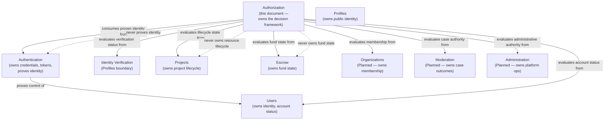
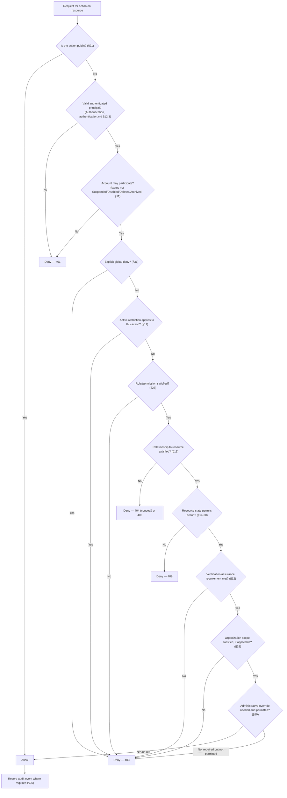
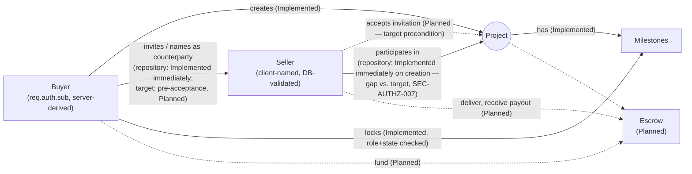
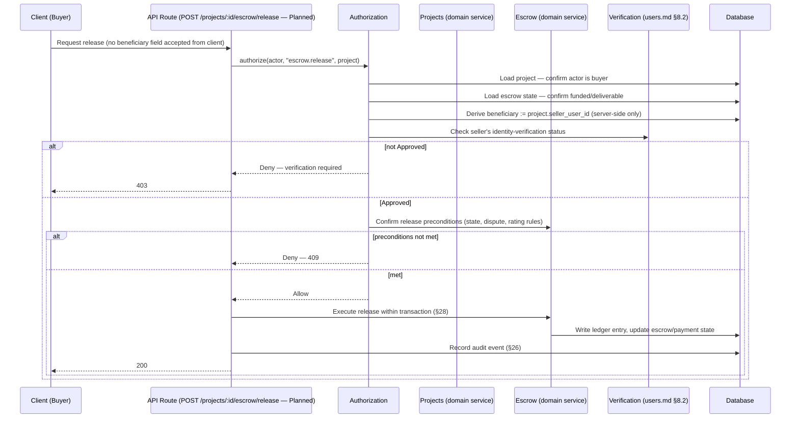
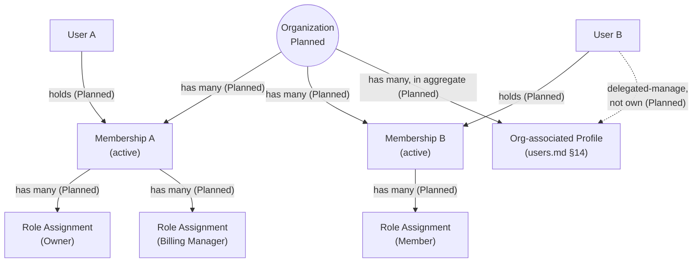
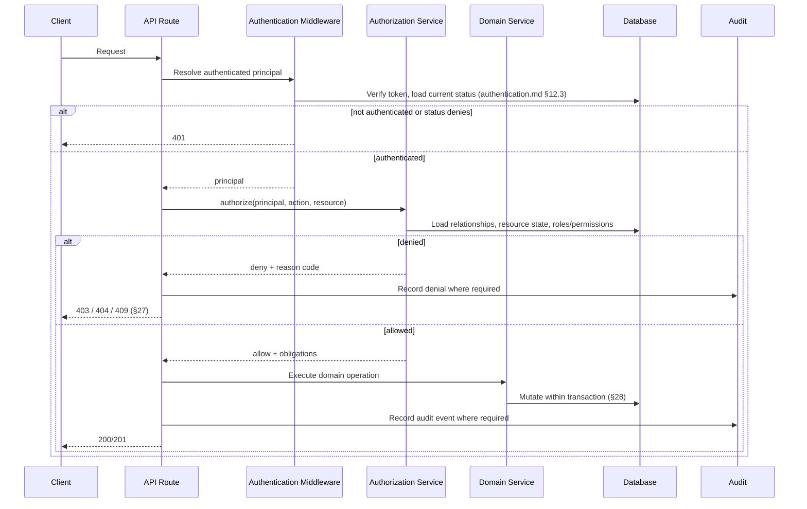
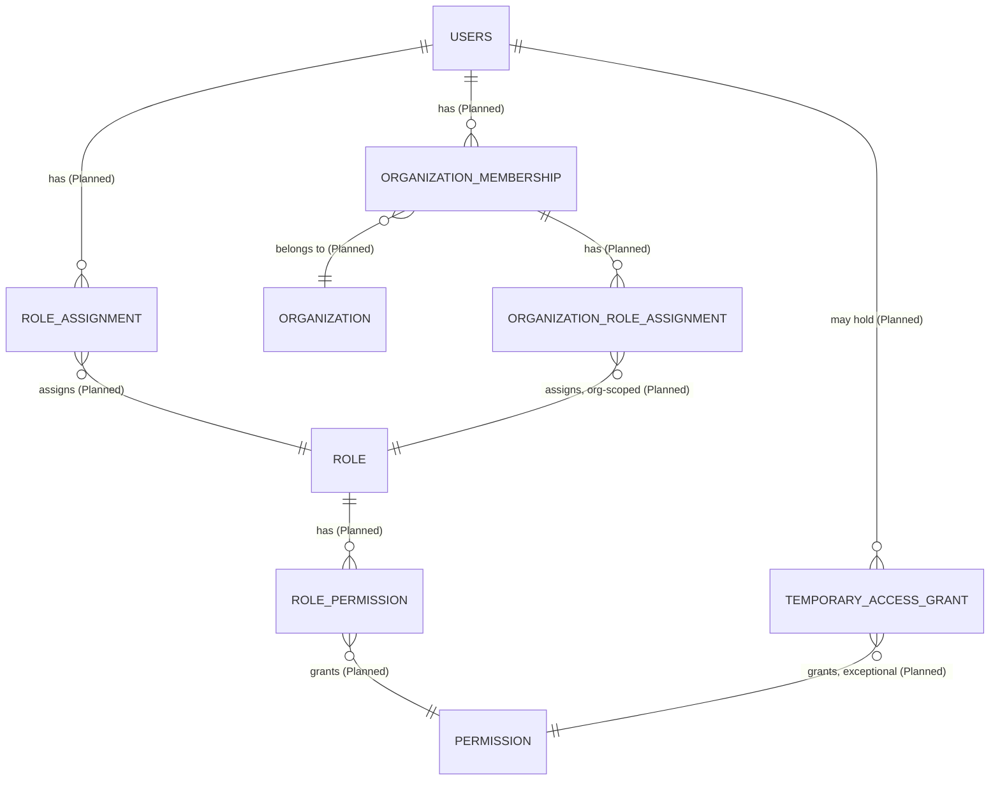
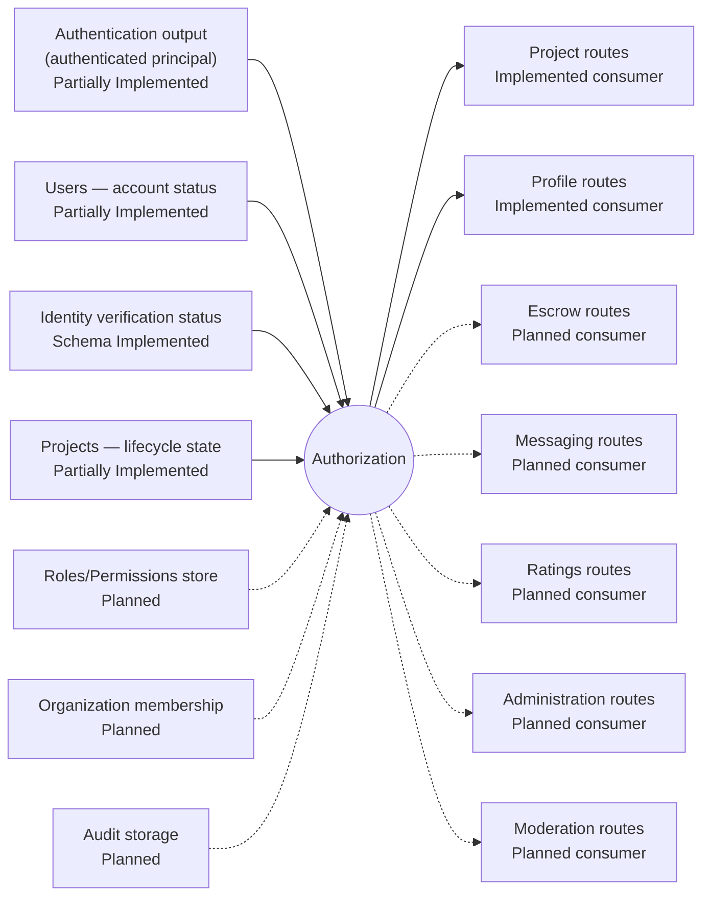

# MusicApp Authorization Domain Specification

| Field | Value |
|---|---|
| Document | Authorization Domain Specification |
| Domain | Authorization (`02-users-roles-permissions/`) |
| Document ID | SPEC-AUTHZ-000 |
| Type | Specification (SPEC) |
| Status | Approved |
| Version | 1.1.0 |
| Owner | Engineering (interim: repository maintainers) |
| Repository branch | `docs/specification-foundation` |
| Last updated | 2026-07-22 |
| Related documents | [`product-overview.md`](../01-foundation/product-overview.md), [`system-architecture.md`](../01-foundation/system-architecture.md), [`users.md`](users.md), [`authentication.md`](authentication.md) |
| Supersedes / Superseded By | None |

This document follows [`docs/00-governance/README.md`](../00-governance/README.md) (GOV-000). It converts the supplied Product Specification Pack for the Authorization domain into governed documentation, verifies every technical claim against the repository at time of writing, and preserves every approved product decision — nothing approved is removed for being unimplemented.

**Status taxonomy:** this document classifies every feature using the same five-value taxonomy established in [`system-architecture.md`](../01-foundation/system-architecture.md) §2.3 and reused in [`users.md`](users.md)/[`authentication.md`](authentication.md) — **Implemented**, **Partially Implemented**, **Schema Implemented**, **Planned**, **Proposed** — per GOV-000 §12 (single source of truth), not redefined here.

**How this document separates content**, per its quality requirements: **Canonical Product Decisions** are stated as definitions and rules (§6–§23, §36.1); **Repository Facts** live in §30 and in "Evidence"/"Repository Evidence" columns throughout; **Intentional Future Architecture** lives in §32; **Implementation Gaps** are the distance between a canonical decision and repository fact, labeled explicitly in §31; **Risks** live in §33; **Assumptions** live in §34; **Open Questions** live in §35.

## 1. Executive Summary

Authorization answers one question: *"May this actor perform this action on this resource now?"* It is deliberately separate from Authentication (which proves *who* an actor is, not what they may do) and consumes, but does not own, the business state of every other domain — account status from Users, credentials/tokens from Authentication, and lifecycle state from Projects, Escrow, Messaging, Ratings, Organizations, and every other resource domain.

**Verified against the repository: Authorization exists only as informal, per-route logic scattered inside `backend/Index.js` — there is no centralized policy module, no role table, no permission table, and no `authorize()` function anywhere.** A repository-wide search for `role`, `permission`, `admin`, `moderat`, and `organization` across every backend file and migration returned **zero matches**. What exists instead are five individual, hand-written relationship checks (`backend/Index.js:425`, `675`, `704`, `791`, `857`) that happen to implement fragments of ReBAC (relationship-based) and ABAC (attribute-based) reasoning without any shared abstraction. This document classifies the domain overall as **Partially Implemented**: real, correct authorization outcomes exist for a handful of cases, achieved entirely through duplicated inline logic rather than the canonical centralized model.

**Two positive findings, verified precisely and worth stating plainly:** `POST /projects` never trusts a client-supplied buyer identity — `buyer_user_id` is always `req.auth.sub` (`backend/Index.js:704`), and `GET /projects` scopes its query at the database level (`WHERE buyer_user_id = $1 OR seller_user_id = $1`, `backend/Index.js:789`) rather than fetching everything and filtering in memory. `POST /projects/:projectId/lock-milestones` correctly returns an identical `404` for "does not exist" and "exists but you are not the buyer" (`backend/Index.js:857-860`), avoiding a resource-existence oracle. These already satisfy several canonical principles (§3) even though no shared enforcement layer exists to guarantee they stay that way as the codebase grows.

**Two confirmed defects, carried and cross-referenced from `authentication.md`, not re-litigated here:** `GET /users` is unauthenticated and returns every user's email, phone, and status (`SEC-AUTH-008`, `BR-AUTH-028` in `authentication.md`) — this document treats it as an authorization defect too, since it is precisely the "no public API lists complete User records" invariant (§37) being violated. `POST /users` and `POST /profiles` are unauthenticated direct-creation routes (`SEC-001`, owned by `product-overview.md`) — this document adds a distinct authorization-specific observation not previously recorded: `POST /profiles` accepts a client-supplied `user_id` (`backend/Index.js:133`, `148`) with no verification that the caller controls that `user_id`, because there is no caller identity to check at all. This is the exact "client must not freely assign owner IDs" violation named in §24, and is newly identified in this document (§30.3, `SEC-AUTHZ-001`).

**The structural, cross-document inconsistency identified in the prior revision is now resolved:** `system-architecture.md` was revised to add Authorization as its fourteenth system domain (§10.14, System Domain Map, Domain Ownership Matrix, and Domain Dependency Matrix of that document, version 1.3.0), and `authentication.md` §4 no longer describes Authorization as an undefined domain — it now cross-references this document throughout (`authentication.md` version 1.2.0). This document's own domain-boundary text is unchanged; only the cross-document alignment was outstanding, and it is now closed.

**The governance-identifier gap identified in the prior revision is now resolved:** GOV-000 §11 was updated to add `AUTHZ` as a formally permitted domain token, distinct from `AUTH` (`docs/00-governance/README.md` §11, version 1.1.0). Every identifier family in this document — `BR-AUTHZ-*`, `REQ-AUTHZ-*`, `SEC-AUTHZ-*`, `DATA-AUTHZ-*`, `INT-AUTHZ-*`, `AUD-AUTHZ-*` — is now a fully governed identifier family, no longer provisional (§4.1).

**This revision (v1.1.0) applies eleven canonical Authorization architecture decisions supplied by the Product Architect, resolving the domain-status, versioning, seller-consent, public-discovery, moderator/administrator, support-operator, organization-role, step-up, policy-storage, HTTP-convention, and audit-scope questions raised in the prior revision (§35.1). Two new confirmed gaps were identified as a direct consequence of applying these decisions against the repository: unconditional seller enrollment without acceptance (`SEC-AUTHZ-007`, §13.2) and authenticated-only Profile discovery where anonymous public discovery is now canonical (`SEC-AUTHZ-008`, §21). Neither reflects a repository code change — both are pre-existing behaviours newly classified against a now-decided target.**

## 2. Purpose

Authorization exists to decide, for a specific actor, action, and resource, under current platform state, whether the request may proceed. It is the layer that turns a proven identity (Authentication's output) into a business-permitted or business-denied outcome. Authorization never proves identity and never owns the business lifecycle of the resources it evaluates — those remain owned by Users, Projects, Escrow, Messaging, Ratings, Organizations, and every other domain, consistent with `system-architecture.md`'s domain-ownership principle (§7, §10.14 of that document), which now names Authorization as the fourteenth domain (§1).

**Verified:** no code in the repository currently plays this role in a general, reusable way. The closest existing analogue is `requireAuth` (`backend/Index.js:24-48`), which is an *Authentication* function — it proves identity, and (per `authentication.md` §12.3) is itself still Planned to become status-aware, let alone permission-aware.

## 3. Scope

This document covers the Authorization domain: the decision model (RBAC/ReBAC/ABAC), decision inputs and outputs, policy evaluation order, and the per-domain authorization rules for Projects, Escrow, Messaging, Ratings, Organizations, Administration, and Moderation, to the extent those rules are about *deciding access*, not about *owning business state*. It does not cover:

- **Identity, credentials, or tokens** — owned by Users (`users.md`) and Authentication (`authentication.md`); this document consumes account status (§11) and authenticated-principal output (§9) but does not redefine either.
- **The exact role catalog or permission catalog** — per this Specification Pack's own instruction (§29), these belong in future `roles.md` and `permissions.md` documents; this document defines *how* roles and permissions would be evaluated, not their final contents.
- **Project, Escrow, Messaging, Ratings, or Organization business lifecycle rules** — those remain owned by their respective domains (`system-architecture.md` §7–§9, `product-overview.md` §11, `users.md` §14); this document states only the authorization-relevant consequences of that state.
- **Final Escrow financial-record structure** — deferred to a future Escrow domain specification, consistent with `authentication.md` §3, §9 `BR-AUTH-018`.

## 4. Terminology and Domain Boundaries

#### 4.1 Identifier Governance Note

GOV-000 §11 permits the domain tokens `AUTH`, `AUTHZ`, `USERS`, `IDENTITY`, `MARKETPLACE`, `PROJECTS`, `ESCROW`, `MESSAGING`, `RATINGS`, `MODERATION`, `NOTIFICATIONS`, `ADMIN`, `ANALYTICS` for `REQ-[DOMAIN]-NNN`/`BR-[DOMAIN]-NNN` identifiers (`docs/00-governance/README.md` §11, version 1.1.0). **`AUTHZ` is a first-class, formally governed domain token, distinct from `AUTH`.** Authentication answers "can this actor prove control of this identity?"; Authorization answers "may this actor perform this action on this resource now?" — GOV-000 §11 is explicit that the two token families must not be merged. As a result, `BR-AUTHZ-*`, `REQ-AUTHZ-*`, `SEC-AUTHZ-*`, `DATA-AUTHZ-*`, `INT-AUTHZ-*`, and `AUD-AUTHZ-*` are all fully governed identifier families under GOV-000 §11/§11.1 — none are provisional. `SPEC-AUTHZ-000` (this document's own ID) is a plain, non-governed tracking label, consistent with every other domain specification's `SPEC-*` ID. **This resolves the identifier-governance gap raised as an open question in the prior revision (§35.1, item 2, resolved).**

#### 4.2 Domain Terms

| Term | Owning Domain | One-line Definition |
|---|---|---|
| Authentication | Authentication | Proves control of an identity — see `authentication.md` |
| Authorization | **This document** — the fourteenth system domain, per `system-architecture.md` §10.14 | Decides whether a proven (or anonymous) actor may perform a specific action on a specific resource now |
| Role | *Undefined — target concept, `roles.md` not yet written* | A named grouping of permissions (§25) |
| Permission | *Undefined — target concept, `permissions.md` not yet written* | A named, evaluable action on a resource type (§8) |
| Actor | Authorization (conceptually) | Whoever or whatever is requesting an action — anonymous, User, administrator, moderator, organization member, or service account (§7) |
| Resource | Owned by the domain that defines it (Projects, Escrow, etc.) | The thing an action is performed on; Authorization evaluates its state, never owns it (§8, §28) |
| Policy | *Undefined — target concept* | A rule or rule-set that maps (actor, action, resource, context) to an allow/deny decision (§10) |
| Organization | *Planned, no repository footprint* | A future grouping of Users with scoped, delegated authority (§18); see `users.md` §14 for its User-cardinality rules |

**Authentication and Authorization remain strictly separate.** `authentication.md` §7 states this from the Authentication side ("Authentication determines whether credentials are valid... It never determines whether an action is permitted"); this document states the converse: Authorization never re-proves identity, re-verifies a password, or issues/validates a token — it consumes an already-authenticated principal (or explicitly handles the anonymous case, §21) as one of its inputs (§9).

## 5. Ownership

### 5.1 Authorization Ownership Matrix

| Concern | Owning Domain | Authorization Responsibility | Non-Responsibility |
|---|---|---|---|
| Decision framework, evaluation pipeline | **Authorization** | Owns (§10, §24) | — |
| Explicit-deny semantics, policy composition | **Authorization** | Owns (§10, §31) | — |
| Permission and relationship evaluation | **Authorization** | Owns (§6, §13) | — |
| Decision-result structure | **Authorization** | Owns (§9) | — |
| Common enforcement utilities (`authorize()`) | **Authorization** | Owns (§24) | — |
| Authorization audit events | **Authorization** | Owns (§26) | — |
| Policy-version tracking, where introduced | **Authorization** | Owns (§32) | — |
| Identity, credentials, tokens | Users, Authentication | — | Authorization never proves identity |
| Account status values and transitions | Users | — | Authorization consumes, never defines (§11) |
| Project lifecycle transitions | Projects | — | Authorization decides *who may request* a transition, never owns the transition itself (§14) |
| Escrow fund states, ledger correctness | Escrow | — | Authorization cannot replace ledger correctness or Escrow state validation (§15) |
| Ratings eligibility content and outcomes | Ratings | — | Authorization consumes rating-eligibility events; Ratings never modifies `projects.state` directly (`users.md` §9, `system-architecture.md` §10.9) — referenced, not redefined |
| Conversation participation | Messaging | — | Authorization decides *who may read/send*, never owns conversation content (§16) |
| Identity/professional verification outcomes | Profiles / identity-verification boundary | — | Authorization consumes verification status at decision time (§12); never owns the verification workflow |
| Organization membership and structure | Users/Organizations *(Planned)* | — | Authorization evaluates membership; never owns it (§18) |
| Moderation case outcomes | Moderation *(Planned)* | — | Authorization evaluates whether a moderation action is permitted; Moderation owns the case lifecycle (§20) |

**Verified:** no table, migration, or code file in the repository currently implements any row in the left-hand "Authorization Responsibility" column above as a shared, reusable component (§30).

### 5.2 Authorization Domain Relationship Diagram

*Solid arrows = Authorization consumes state from that domain to make a decision. Dashed arrows = an explicit non-responsibility boundary. Every domain shown except Users and Authentication is Planned or partially schema-only per `system-architecture.md`; Authorization itself is Partially Implemented as scattered logic, not as a domain component (§1).*

## 6. Authorization Model

### 6.1 Canonical Authorization Principles

**Principle 1 — deny by default — is the foundation every other rule in this document builds on: an action is denied unless an explicit rule allows it; there is no implicit-allow path anywhere in the canonical model.** All twenty canonical principles are listed below, each cross-referenced to where it is elaborated:

| # | Principle | Elaborated In |
|---|---|---|
| 1 | **Deny by default.** | This section; `REQ-AUTHZ-001`; every "Deny (fail closed)" row in §9.3 |
| 2 | Every protected action requires an explicit authorization decision. | §10.1 (evaluation order); `REQ-AUTHZ-001` |
| 3 | Authentication and authorization remain separate. | §4.2, §6 intro |
| 4 | Current database state takes precedence over stale token claims for sensitive rules. | `BR-AUTHZ-002` |
| 5 | Ownership alone does not always grant every action. | §14.1 ("neither participant automatically receives all project permissions") |
| 6 | Platform administrators are still constrained by audit and policy. | §19 |
| 7 | Financial actions require stronger controls than ordinary content actions. | §15 |
| 8 | Resource state may prohibit an action even when the actor has the correct role. | §6.2 table (resource-state rules row) |
| 9 | Public read access must be explicitly defined. | `BR-AUTHZ-021`, §21 |
| 10 | Restricted users may authenticate but have capability restrictions. | §11 |
| 11 | Suspended, Disabled, Deleted, and Archived users cannot pass normal authenticated authorization. | `BR-AUTHZ-005` |
| 12 | Identity verification affects only explicitly defined trust-sensitive capabilities. | §12 |
| 13 | Authorization logic should be centralized and reusable. | `BR-AUTHZ-024`, §24 |
| 14 | Route handlers must not independently recreate policy rules. | `BR-AUTHZ-024` (same rule as #13) |
| 15 | Permission checks must use safe, immutable identifiers. | Same pattern as `authentication.md` §12.1's immutable-subject requirement, applied here to relationship checks (e.g., `users.id`, never a mutable field) |
| 16 | Every denial should return a safe public result and an internal reason code. | §27.1 |
| 17 | High-risk administrative actions require audit records. | §19, §26 |
| 18 | Explicit deny rules override allow rules. | `BR-AUTHZ-003` |
| 19 | Temporary permissions must expire. | §25 (`BR-AUTHZ-027`, Temporary Access Grant target entity, `DATA-AUTHZ-*` §40 reference) |
| 20 | Delegated authority must be scoped. | `BR-AUTHZ-018`, `BR-AUTHZ-020` (organization delegation) |

**Verified:** principle 1 (deny by default) is **not** how the current repository behaves in three specific places — `POST /users`, `GET /users`, and `POST /profiles` are allow-by-default (no authentication gate at all), which is precisely why they are documented as confirmed defects (`SEC-001`, `SEC-AUTHZ-001`, `SEC-AUTHZ-003`) rather than accepted design, per this principle.

### 6.2 Hybrid Model Components

MusicApp's canonical authorization model is a **hybrid of RBAC, ReBAC, ABAC, resource-state rules, and explicit administrative overrides** — no single model is sufficient alone.

| Model | Answers | Example | Status |
|---|---|---|---|
| RBAC (Role-Based) | What general capabilities does this role have? | A future `platform_admin` role can suspend accounts | Planned — no role table exists |
| ReBAC (Relationship-Based) | What relationship does this actor have to this resource? | This User is the *seller* on this project | **Partially Implemented** — `buyer_user_id`/`seller_user_id` relationships exist and are checked in 3 of 5 relevant places (§30) |
| ABAC (Attribute-Based) | Do current attributes permit the action? | Account status is `Active`, not `Suspended` | **Partially Implemented** — checked in 2 of 6 authenticated routes today (`authentication.md` `SEC-AUTH-002`) |
| Resource-state rules | Does the resource's own state permit this? | A project must be `draft` to lock its milestones | **Implemented** for the one case that exists — `POST /projects/:projectId/lock-milestones` checks `project.state !== "draft"` (`backend/Index.js:867`) |
| Explicit administrative override | Is an audited, permitted override in effect? | An administrator manually resolves a dispute | Planned — no administrative concept exists at all |

**Verified:** the repository demonstrates fragments of ReBAC and ABAC-style reasoning (`req.auth.sub` comparisons, a `state !== "draft"` check) but has never been described, tested, or centralized as a model — each check is a local `if` statement co-located with its route handler, not an invocation of a shared decision function. `BR-AUTHZ-001` (below) is the canonical statement that this must change.

`BR-AUTHZ-001`: Authorization MUST NOT rely solely on static role names — RBAC alone is canonically insufficient; every decision must be able to incorporate relationship and attribute facts where relevant. Status: Planned (no role system exists to even test this against yet).

## 7. Actors

### 7.1 Actor Capability Matrix

| Actor Type | Authentication Requirement | Scope | Typical Capabilities | Explicit Limitations | Status |
|---|---|---|---|---|---|
| Anonymous Actor | None | Explicitly public resources only | Read public resources, including public Profile discovery (§21, canonical target) | May not access any private or authenticated-only resource | Planned — no route in the repository currently permits anonymous access to any business resource; `GET /profiles` requires `requireAuth` even though public Profile discovery is now canonical target behaviour, not just a candidate (`SEC-AUTHZ-008`, §21, §30) |
| Authenticated User | Valid access token | Own identity, own relationships, explicitly public resources | Act as buyer/seller on own projects; read/update own profile (once a profile-update route exists, §13.1) | Cannot act on another User's private resources without an explicit relationship or role | Partially Implemented — the relationship checks that exist work correctly (§30); account-status gating is incomplete (`authentication.md` `SEC-AUTH-002`) |
| Platform Administrator | Valid access token + administrative role/permission | Platform-wide, but explicit and audited | Suspend/restrict users, review verification outcomes, investigate disputes (future) | Does not automatically own or impersonate user resources; must not see credentials; does not automatically receive Moderator authority — independent roles (§19, §20) | Planned — no administrator concept exists in schema or code (§30) |
| Moderator | Valid access token + moderation role/permission | Moderation-scoped | Review reported content, apply restrictions, escalate cases (future) | Must not automatically gain financial or platform-administration authority; is not a subset of Administrator and does not automatically inherit Administrator permissions (§19, §20) | Planned — no moderator concept exists |
| Support Operator | Valid access token + support role/permission | Explicitly scoped, time-limited | Inspect/assist with explicitly permitted information (future) | Must not receive broad unrestricted access, credential access, or silent impersonation | **Planned, explicitly post-MVP** — approved future architecture, not near-term; only minimal principles are decided (least privilege, scoped access, masked data where appropriate, no credential access, no unrestricted financial authority, no silent impersonation, reason and audit required, temporary access preferred where practical). Detailed permissions are deferred until operational requirements exist (§35). |
| Organization Member | Valid access token + active organization membership | Organization-scoped | Act within organization role/scope (future) | Organization authority never grants platform-administrator authority; membership removal must terminate access | Planned — no organization concept exists anywhere |
| Service Account | Machine credential (mechanism undecided) | Undecided | Undecided | Must not be treated as an ordinary human User without an explicit architecture decision | Planned — explicitly deferred, per `authentication.md` §27 and this Pack's §4 |

**Verified:** the repository has exactly one actor type with any implementation at all — Authenticated User, via `req.auth` (`backend/Index.js:24-48`). Every other row in the table above is entirely conceptual.

**This resolves the open question in the prior revision asking whether Moderator is a subset of Administrator (§35.1, item 6, resolved — no, fully independent, §19, §20) and whether Support Operator has near-term product intent (§35.1, item 7, resolved — no, it remains approved future architecture, explicitly post-MVP).**

## 8. Resources and Actions

### 8.1 Resource-Action Matrix

| Resource | Action | Typical Allowed Actor | Relationship Required | State Conditions | Verification Conditions | Audit Requirement | Status |
|---|---|---|---|---|---|---|---|
| Profile | read (public) | Any actor, including anonymous (§21, canonical target) | None | None | None | None | **Not met — MVP repository limitation, not target architecture** — `GET /profiles` requires authentication (`backend/Index.js:473`, `SEC-AUTHZ-008`, §21) |
| Profile | update (self) | Owning User | `profiles.user_id == actor.id` | None specified | None | Planned | **Planned — no update route exists at all** (§13.1, §30) |
| User | read (own) | Owning User | `users.id == actor.id` | Active-equivalent | None | None | Implemented — `GET /auth/me` (`backend/Index.js:412-468`) |
| User | list (all, complete records) | **No actor** — canonical target has no such capability | N/A | N/A | N/A | N/A | **Not met — confirmed defect** (`GET /users`, `authentication.md` `SEC-AUTH-008`, `BR-AUTH-028`) |
| Project | create | Active, non-Restricted, non-`Email Verification Pending` User (buyer role) | None (buyer is the creator) | None | None | Planned | Partially Implemented — buyer relationship correct (`req.auth.sub`); **no account-status gate at all** (§14) |
| Project | read (list, own) | Buyer or seller participant | `buyer_user_id \|\| seller_user_id == actor.id` | None | None | None | **Implemented** — `GET /projects` (`backend/Index.js:773-831`), correctly scoped |
| Project | read (single) | Buyer, seller, admin, moderator | Same as above | None | None | Planned | **Planned — no single-project read route exists** (§30) |
| Project | update (lock milestones) | Buyer only | `buyer_user_id == actor.id` | `state == "draft"`, `milestones_locked_at IS NULL` | None | Planned | **Implemented** — `POST /projects/:projectId/lock-milestones` (`backend/Index.js:837-920`) |
| Project | fund / cancel / dispute | Buyer or seller, per action | Yes | Varies | None | Planned | Planned — no route exists |
| Escrow | fund | Buyer | `project.buyer_user_id == actor.id` | Project locked, not yet funded | None | Planned | Planned — no route exists; schema exists (`system-architecture.md` §10.7) |
| Escrow | release | Buyer-initiated, server-validated beneficiary | Buyer requests; seller is the server-derived beneficiary | Delivered/approved | **Seller's identity verification must be `Approved`** | Planned, high-risk | Planned — no route exists (§15) |
| Payment / Payout | receive | Seller (payout beneficiary) | Server-derived via project, never client-supplied | Release approved | **Required** (`BR-AUTHZ-010`) | Planned, high-risk | Planned |
| Message | read | Conversation participant | Participant relationship | None | None | Planned | Planned — no messaging schema exists at all (§16) |
| Message | send | Eligible conversation participant | Participant relationship, not removed/blocked | Conversation active | None | Planned | Planned |
| Rating | submit | Eligible project participant | Buyer rates seller, seller rates buyer, never self | Project in an eligible state (per Ratings' own rules) | None | Planned | Planned — no ratings schema exists (§17) |
| Verification | submit | Owning User | `profile_verifications.user_id == actor.id` | `Not Submitted`/`Rejected`/`Expired` (per `users.md` §8.2) | None | Planned | Schema Implemented, no route (`users.md` §13.3) |
| Verification | review (approve/reject) | Reviewer (future role) | Reviewer role | `Under Review` | None | Planned, high-risk | Planned |
| Organization | manage membership | Organization owner/admin role | Active membership + role | Organization active | None | Planned | Planned |
| Administration | suspend/restrict/disable user | Platform administrator | Administrator role | Target user in an eligible status | None | **Required** | Planned |

**Verified:** every "Implemented" row above cites a specific route already documented in `authentication.md` §25.4; no new routes were found beyond that set (§30).

## 9. Decision Inputs and Outputs

### 9.1 Decision Inputs

| Category | Example Inputs | Source of Truth |
|---|---|---|
| Actor attributes | User ID, account status, platform role, org roles, restrictions, verification status, authentication assurance level | `users.md` (status), `authentication.md` (assurance/tokens), Authorization (roles, once they exist) |
| Action | Requested permission, operation type, sensitivity level | This document (§25, target `permissions.md`) |
| Resource attributes | Resource ID, owner, participants, org, visibility, state, financial status, dispute status | The owning domain (Projects, Escrow, etc.) |
| Relationship attributes | Buyer, seller, participant, author, reviewer, admin, moderator, org member, delegated manager | The owning domain's relationship columns (e.g., `projects.buyer_user_id`) |
| Environmental attributes | Current time, authentication recency, MFA/step-up status, request origin, risk signals, legal/regional constraints | Authentication (recency, step-up — `authentication.md` §17, §30 open question), infrastructure (origin), Planned (risk signals, regional) |

### 9.2 Decision Output

Canonical conceptual output: `allowed` (boolean), reason code, matched policy, actor ID, action, resource type/ID, decision timestamp, obligations (where applicable), audit requirement, step-up requirement, filtered field scope. **Status: Planned — no code produces this structure today.** Every current authorization outcome in the repository is an inline `if`/`return res.status(...)` pair with no structured decision object at all (§30).

### 9.3 Authorization Decision Matrix

| Policy Input | Example | Source of Truth | Cacheability | Failure Behaviour |
|---|---|---|---|---|
| Account status | `Suspended` | `users.status`, live DB read | Must not be cached beyond a very short window, or must be invalidated immediately on change | Deny, safe generic error |
| Relationship (project participant) | `buyer_user_id == actor.id` | `projects` table, live DB read | Effectively per-request (tied to the specific resource fetch already required) | Deny, safe `404` (avoid resource-existence oracle, §27) |
| Static permission definition | `project.create` requires `Active` status | Code/config (once `permissions.md` exists) | Safe to cache — static definitions rarely change | Deny (fail closed) |
| Role-to-permission mapping | `platform_admin → admin.user.suspend` | Future role/permission tables | Cacheable with explicit versioning (§32) | Deny (fail closed) |
| Organization membership | Active member of Org X | Future `organization_memberships` table | Must not be cached beyond a short window | Deny |
| Verification status | `Approved` for payout eligibility | `profile_verifications.status` (target: per-attempt, `users.md` §8.2) | Must not be cached — trust-sensitive (§12) | Deny |
| Public resource visibility metadata | "this profile field is public" | Code/config | Safe to cache — static | Deny (fail closed, treat as private if unknown) |

**Canonical rule (`BR-AUTHZ-002`):** current database state takes precedence over stale token claims for sensitive rules — a token's `status` claim (`authentication.md` §12.2) is a snapshot at issuance, never authoritative for a live decision. Status: Planned to be enforced generally; today only `POST /auth/login` and `GET /auth/me` read live status at all (`authentication.md` `SEC-AUTH-002`).

### 9.4 Version Concepts: `auth_version` and `authz_version`

**Canonical, cross-document decision:** Authentication and Authorization use two separate conceptual version/stamp concepts, not a shared one.

- **`auth_version`** (owned and named by `authentication.md` §12, cross-referenced there) invalidates outstanding credentials and sessions — password reset, compromised-credential response, account recovery, and any global authentication revocation increment it.
- **`authz_version`** (owned and named by this document) invalidates stale authorization state carried in a token or cache — platform-role changes, permission changes, explicit-deny changes, security-sensitive access revocation, and organization-role or membership changes where a claim or cache depends on them all increment it.

A change that affects only one concern increments only its own version — a password reset does not require re-evaluating every role assignment, and a role change does not require invalidating an otherwise-valid session's proof of identity. Both versions are **advisory acceleration mechanisms only**: current database state (account status, relationships, resource state, role/permission assignments) remains authoritative for every decision regardless of either version's value (§10.1, `BR-AUTHZ-002`). Exact schema location, column names, and propagation mechanism (token claim, server-side cache invalidation, or both) remain implementation decisions (§35).

`BR-AUTHZ-030`: authorization-relevant changes (role assignment/removal, permission grant/revocation, explicit-deny change, organization-role/membership change affecting a cached or claimed authorization state) MUST increment `authz_version`, independently of `auth_version`. Status: Planned — neither version concept exists in code or schema today (§30).

**This resolves the open question in the prior revision asking whether Authentication and Authorization should share one version or use separate ones (§35.1, item 3, resolved — separate versions, as stated above).**

### 9.5 Step-Up Authentication Scope

**Canonical, cross-document decision:** step-up authentication (a stronger, more recent proof of identity than ordinary session validity) is required before authorizing these actions:

1. Adding or changing a payout destination.
2. Initiating a payout.
3. Releasing escrow funds.
4. An exceptional or manual refund.
5. Changing a beneficiary or payment details.
6. Disabling an account.
7. Exceptional account recovery.
8. Assigning or removing a high-privilege platform role.
9. Granting a financial administrative permission.
10. Exporting highly sensitive administrative data.

**Ordinary project funding may rely on recent authentication and payment-provider confirmation for the MVP and does not automatically require platform step-up/MFA.** This is a deliberate scope boundary, not an oversight — the list above is exhaustive for the MVP; any action not listed does not require step-up unless a future revision adds it. The exact assurance method (e.g., re-entered password, WebAuthn, one-time code) and recency window remain implementation policy, not decided here (§35).

`BR-AUTHZ-031`: every action listed above MUST require step-up authentication before Authorization returns an allow decision, regardless of session validity. Status: Planned — no step-up mechanism exists in `authentication.md`'s model yet (`authentication.md` §17), and none of the ten listed actions have routes today (§30).

**This resolves the open question in the prior revision asking which initial actions require step-up authentication (§35.1, item 9, resolved — the ten-item list above). The assurance mechanism and recency window remain open (§35.2, item 8).**

## 10. Policy Evaluation

### 10.1 Canonical Evaluation Order

1. Determine whether the action is public (§21).
2. For protected actions, require a valid authenticated principal (Authentication's output, `authentication.md` §12.3).
3. Confirm the current User account may participate (§11).
4. Apply explicit global denies (§31).
5. Evaluate active account restrictions (§11).
6. Evaluate required platform role or permission (§25).
7. Evaluate relationship to the resource (§13).
8. Evaluate resource-state conditions (§14–§20).
9. Evaluate verification or assurance requirements (§12).
10. Evaluate organization scope where applicable (§18).
11. Evaluate explicit administrative override only if allowed (§19).
12. Return allow or deny.
13. Record an audit event where required (§26).

`BR-AUTHZ-003`: explicit deny wins over allow, at every step above. `BR-AUTHZ-004`: administrative override is not a shortcut around immutable financial or legal constraints unless a specific policy permits it.

### 10.2 Policy Evaluation Flowchart

*This is the canonical target flow. **No route in the repository implements more than 2–3 of these steps** — `requireAuth` covers step C only; individual routes ad hoc cover fragments of D, H, and I (§30). No step currently produces a structured, reusable decision.*

## 11. Account-Status Interaction

Authorization consumes the canonical account statuses defined in `users.md` §8.1, reproduced here only as an authorization-consequence table — `users.md` remains the source of truth for the statuses themselves (GOV-000 §12).

### 11.1 Account-Status Authorization Matrix

| Account Status | Can Authenticate (per `authentication.md` §8.1) | Authorization Eligibility | Minimum Denials | Notes | Status |
|---|---|---|---|---|---|
| Pending Registration | No | Explicitly allowed registration-completion actions only | Everything else | No repository concept of this status exists | Planned |
| Email Verification Pending | Yes, limited | Continue verification, permitted onboarding, limited settings | Buy, sell, create commercial projects, fund escrow, receive payouts | Status does not exist in `user_status` enum (`users.md` §8.1) | Planned |
| Active | Yes | Full normal authorization evaluation | None beyond normal policy | Only status reachable today | Implemented (status value); authorization evaluation itself is Partially Implemented |
| Restricted | Yes | Normal evaluation, minus restricted capabilities | Create new commercial projects, initiate new financial transactions, receive payouts, any explicitly restricted action | Historical access may remain available | Planned — status does not exist in enum |
| Suspended | No | N/A — denied at Authentication, before reaching Authorization | Everything | Per `BR-AUTHZ-005` below, this denial belongs to Authentication's shared middleware (`authentication.md` §12.3), not to a separate Authorization check | Schema Implemented, unreachable |
| Disabled | No | N/A | Everything | Same as Suspended | Planned — status does not exist |
| Deleted | No | N/A | Everything | Same as Suspended | Schema Implemented, unreachable |
| Archived | No | N/A | Everything | Historical record only | Planned — status does not exist |

`BR-AUTHZ-005`: Suspended, Disabled, Deleted, and Archived users must be denied through Authentication before ordinary Authorization ever evaluates the request — this is a deliberate layering decision (Authentication's shared middleware, `authentication.md` §12.3, is the single place this is enforced), not a rule Authorization re-implements. Status: Planned (the middleware itself is Planned to become status-aware; see `authentication.md` `REQ-AUTH-004`).

## 12. Verification Interaction

Identity-verification status is a **separate system from account status** (`users.md` §8.3, `authentication.md` §4) and Authorization must not conflate the two.

| Capability | Blocked by pending/incomplete verification? | Status |
|---|---|---|
| Login, browsing, profile editing, messaging, preparing a project | No | Canonical (`users.md` §8.3, `authentication.md` §7) |
| Buying | No, unless a later risk/legal/regional/payment policy requires it | Canonical — explicitly conditional, not absolute |
| Receiving escrow payouts | **Yes** — requires `Approved` verification | Canonical (`users.md` `BR-USERS-011`, `authentication.md` `BR-AUTH-011`-adjacent) |
| Acting as a payout beneficiary | **Yes** | Canonical, same basis |
| Other regulated/high-risk financial actions | Yes, once specifically defined | Planned — no such actions are defined yet, since Escrow has no routes |

`BR-AUTHZ-006`: Authorization must evaluate the *current* verification status at decision time for trust-sensitive actions — token claims must never be treated as permanent verification truth, consistent with `authentication.md` §7's "no permanent truth in tokens" principle applied to verification specifically. Status: Planned — no route checks `profile_verifications.status` for any purpose today (`users.md` §13.3).

## 13. Ownership and Relationship Rules

### 13.1 Profile Ownership

`BR-AUTHZ-007`: a User may update the User's own primary Profile; a User may not update another individual's Profile; future delegated organization management (§18) is separate from personal ownership. **Status: Planned — no profile-update route (`PATCH`/`PUT /profiles/:id` or equivalent) exists in the repository at all.** `POST /profiles` (creation) exists but is unauthenticated and accepts a client-supplied `user_id` with no ownership check whatsoever (`backend/Index.js:129-199`, §30.3 `SEC-AUTHZ-001`) — this is not an example of the canonical rule working narrowly, it is a route that predates any ownership concept.

### 13.2 Project Ownership (Relationship-Based, Not Role-Based)

Project ownership is **relationship-based**, per the canonical model (§6): `buyer_user_id` identifies the buyer, `seller_user_id` identifies the seller, and the two roles have different permissions. Neither participant automatically receives all project permissions.

**Canonical decision — a buyer cannot establish an active commercial seller relationship solely by naming another active User.** Active buyer-seller project participation requires the named seller's explicit acceptance. The canonical flow (detailed further in §14.2) is: (1) the buyer invites a seller, or sends a project proposal; (2) the invitation or proposed project is stored in a pre-acceptance state; (3) the seller accepts or declines; (4) active buyer-seller project participation exists only after acceptance; (5) funding and work commencement are prohibited before acceptance; (6) an invitation may expire or be revoked; (7) acceptance, decline, expiry, and revocation are each attributable and auditable. Future seller-originated offers (a seller proposing terms to a buyer) are permitted conceptually, but both parties must still explicitly accept regardless of who originates the proposal. A client-supplied seller ID must still be validated and must resolve to an eligible User (unchanged from the repository's current validation, below) — validating eligibility and obtaining consent-to-participate are two distinct gates, and this decision adds the second without removing the first. This document does not define the complete Project state machine — the pre-acceptance/active distinction is an authorization-relevant consequence of Projects' own lifecycle, owned by Projects (§3), not restated here beyond what Authorization needs to evaluate it.

**Verified, current repository behaviour:** `backend/Index.js:704` sets `buyer_user_id` to `req.auth.sub` unconditionally — the buyer relationship cannot be spoofed by a client. `seller_user_id` (`backend/Index.js:615`, `705`) is client-supplied (the buyer names their counterparty) and is validated against the database (must exist, must be `active`, `backend/Index.js:679-689`) before being written — but the repository grants **immediate, unconditional active participation** the moment `POST /projects` succeeds, with no pre-acceptance state, no seller decision point, and no expiry/revocation concept at all. This is a **gap against the canonical decision above, not accepted design** — it is recorded as `SEC-AUTHZ-007` (§29.1) and reflected in the Implementation Status Matrix (§31.1), not silently treated as correct.

**This resolves the open question in the prior revision asking whether the current no-invitation, no-acceptance behaviour was intended as permanent product design (§35.1, item 4, resolved — it is not; invitation and acceptance are canonical and required).**

### 13.3 Rating Ownership (Cross-Referenced, Not Redefined)

The rating author owns the submitted rating record for limited draft/correction purposes defined by Ratings; ownership does not permit changing immutable/published rating history outside approved rules. **This document does not redefine the Ratings/Projects boundary** — `users.md` §9 and `system-architecture.md` §10.9 already establish that Ratings owns rating data, Projects owns lifecycle state, and Ratings never directly modifies `projects.state` (it emits an event Projects consumes). Status: Planned — no ratings schema exists (`system-architecture.md` §10.9).

### 13.4 Message Ownership

Conversation participation grants access only to that conversation and permitted messages; ownership must be resolved from repository relationships, never from client-submitted ownership claims. Status: Planned — no messaging schema exists (§16).

## 14. Project Authorization

### 14.1 Canonical Participant Roles

Buyer, Seller, Platform Administrator (Planned), Moderator (Planned, moderation actions only), future Organization Delegate (Planned).

### 14.2 Target Rules vs. Repository Verification

| Action | Target Rule | Repository Status |
|---|---|---|
| Create Project | Active, buyer-capable User; Restricted and Email-Verification-Pending users denied; creation alone does not establish active seller participation (§13.2) | **Partially Implemented** — buyer relationship correct; **no account-status check of any kind** on the requester (`backend/Index.js:611-771`); also grants active seller participation immediately, contrary to the canonical decision (`SEC-AUTHZ-007`) |
| Invite / Propose Seller | Buyer invites a seller, or either party proposes a project; stored in a pre-acceptance state (§13.2) | **Not met** — no pre-acceptance state exists; `POST /projects` both creates the project and establishes active seller participation in one step (`backend/Index.js:611-771`, `SEC-AUTHZ-007`) |
| Accept Seller Invitation | Named seller only; converts pre-acceptance state to active participation | Planned — no route exists |
| Decline Seller Invitation | Named seller only | Planned — no route exists |
| Expire / Revoke Invitation | System (expiry) or inviting buyer (revocation) | Planned — no route or expiry mechanism exists |
| Fund / Commence Work | Must not be permitted before seller acceptance (§13.2) | **Not met** — funding does not exist yet (§15), and the precondition it must respect (acceptance) also does not exist |
| Read Project (list, own) | Buyer, seller, admin, or moderator (admin/moderator Planned) | **Implemented** for buyer/seller — `GET /projects` (`backend/Index.js:789`) |
| Read Project (single) | Same actors | **Planned** — no such route exists |
| Update Project | Depends on role, state, field, and whether commercial terms are affected | **Partially Implemented** — only the milestone-locking transition exists, and it correctly checks role + state (§14.3) |
| Cancel Project | Depends on role, state, escrow state, dispute state, cancellation policy | Planned — no cancel route exists |
| Deliver Work | Seller, valid relationship, project state permits, account status permits | Planned — no delivery route exists |
| Approve Delivery | Buyer, valid relationship, project state permits | Planned — no approval route exists |
| Release Funds | **Must not** be authorized solely because the actor is the buyer — must also satisfy Escrow policy, project state, rating rules, dispute rules, and payout eligibility | Planned — no release route exists; the canonical "not solely buyer-authorized" rule (`BR-AUTHZ-008`) has no code to violate or satisfy yet |

### 14.3 Verified Positive Example — Milestone Locking

`POST /projects/:projectId/lock-milestones` (`backend/Index.js:837-920`) is the one route in the repository that implements a complete, correct authorization chain for a state-changing action:

1. Relationship check: `project.buyer_user_id !== req.auth.sub` → `404` (`backend/Index.js:857`).
2. Resource-state check: `project.milestones_locked_at !== null` → `409` (already locked) (`backend/Index.js:862-865`).
3. Resource-state check: `project.state !== "draft"` → `400` (`backend/Index.js:867-870`).

This is documented positively as a template for what the canonical shared policy function (§24) should generalize, not as evidence the pattern is already centralized — it is one route's inline implementation, duplicated nowhere else because no other write-route with an equivalent shape exists yet.

### 14.4 Project Authorization Relationship Diagram

*Solid = Implemented relationship/action in the repository today. Dashed = Planned/target-only. The repository currently grants the Seller active `PROJ` participation immediately on creation, before any acceptance step exists — this is now a documented gap against the canonical target (`SEC-AUTHZ-007`, §13.2), not accepted design.*

## 15. Escrow and Financial Authorization

**Status: entirely Planned — Escrow has zero routes (`system-architecture.md` §10.7).** Every rule below is canonical target architecture with no code to verify against.

`BR-AUTHZ-009`: a client request must never directly determine the payout beneficiary — the beneficiary must be derived from trusted server-side relationships. This is the same principle already established in `authentication.md` §9 `BR-AUTH-018`, restated here from the Authorization side: it is a *decision input validation* rule (Authorization must reject any beneficiary value it did not itself derive), not merely a data-modeling rule.

`BR-AUTHZ-010`: receiving a payout requires `Approved` identity verification (cross-referenced from §12, `users.md` `BR-USERS-011`).

`BR-AUTHZ-011`: Restricted users cannot initiate new financial actions or receive payouts (cross-referenced from §11, `users.md` `BR-USERS-014`).

`BR-AUTHZ-012`: administrative access does not automatically allow arbitrary fund release; financial overrides require explicit policy, audit, and segregation of duties where later implemented.

`BR-AUTHZ-013`: Authorization cannot replace ledger correctness or Escrow state validation — an "allowed" decision is necessary but not sufficient; the mutation itself must still enforce its own invariants (§28).

### 15.1 Financial Authorization Sequence Diagram (Target)

*Entirely Planned — no escrow route, verification-gating code, or release logic exists in the repository. Shown per canonical target architecture, explicitly labeled as such.*

## 16. Messaging Authorization

**Status: entirely Planned — no `messages`/conversation schema exists (`system-architecture.md` §10.8).**

| Rule | Canonical Statement |
|---|---|
| `BR-AUTHZ-014` | Only conversation participants may read private conversation messages. |
| `BR-AUTHZ-015` | Only eligible participants may send messages; a removed/blocked participant may lose sending rights while historical access may be retained where appropriate. |
| — | Moderators may access messages only under explicit moderation policy; administrators do not receive universal silent access by default. |
| — | Attachments inherit conversation access unless separately classified. |
| — | Public profiles do not make private messages public. |
| — | Client-supplied participant IDs must be validated against server-side relationships (same pattern as `BR-AUTHZ-009` for payouts). |

## 17. Ratings Authorization

**Status: entirely Planned — no ratings-content schema exists (`system-architecture.md` §10.9).** This section states only the authorization-relevant consequences of the Ratings/Projects boundary already defined in `users.md` and `system-architecture.md` — it does not redefine that boundary (GOV-000 §12).

| Rule | Canonical Statement |
|---|---|
| — | Only eligible project participants may submit required ratings; buyer may rate seller, seller may rate buyer, one participant cannot submit the other's rating. |
| — | Rating eligibility depends on project state (owned by Projects, consumed by Authorization). |
| — | Published ratings cannot be arbitrarily edited outside approved rules. |
| — | Moderation actions on ratings require explicit moderation authority (§20). |
| — | Administrators must not fabricate participant ratings. |
| — | System-generated rating events must be distinguishable from human ratings. |

## 18. Organization Authorization

**Status: entirely Planned — no organization schema exists anywhere.** Target shape, per `users.md` §14: `Organization → many Users → many associated professional Profiles`.

`BR-AUTHZ-016`: organization authority is membership-based and scoped; a valid, active membership plus a valid organization role is required for any organization-scoped action. `BR-AUTHZ-017`: organization authority never grants platform-administrator authority. `BR-AUTHZ-018`: organization members do not personally own organization resources merely by managing them (cross-referenced from `users.md` §14's "delegated management... without personally owning those profiles"). `BR-AUTHZ-019`: removal from an organization must terminate future delegated access, though historical actions remain attributable to the original actor. `BR-AUTHZ-020`: client-submitted organization IDs are not sufficient proof of membership — the same server-derivation principle as `BR-AUTHZ-009` and `BR-AUTHZ-015`.

**Canonical decision — multiple simultaneous organization roles per membership.** The canonical model is `Organization Membership → many Organization Role Assignments`: a User may hold multiple simultaneous roles within one organization. Each role assignment is independently revocable and may independently expire; all assignments are scoped to their organization; the actively-held permissions from multiple assignments combine, except that an explicit deny on any assignment overrides an allow from any other; historical actions remain attributed to the acting User regardless of later assignment changes; removing the underlying membership terminates all organization authority immediately, regardless of how many role-assignment rows still exist. A simplified initial UI MAY expose a single "primary" role per membership for usability, but the target schema MUST NOT enforce one role per membership. `BR-AUTHZ-026` (§25) restates this from the roles/permissions integration side. **This resolves the open question in the prior revision asking whether organization membership supports multiple roles (§35.1, item 8, resolved — yes, multiple simultaneous roles per membership, as stated above).**

### 18.1 Organization Authorization Relationship Diagram

*Entirely Planned, reproduced from `users.md` §6, §14 for authorization context — `users.md` remains the source of truth for the User/Profile/Organization cardinality rules. Membership A is shown holding two simultaneous Role Assignments, illustrating the canonical multi-role-per-membership model (§18).*

## 19. Administration

**Status: entirely Planned — no administrator concept, role, or route exists anywhere in the repository.**

**Canonical decision — Administrator and Moderator (§20) are independent platform roles.** Administrator authority does not automatically confer Moderator authority, and neither role automatically receives financial authority. `BR-AUTHZ-034`: Administrator and Moderator MUST be independently assignable roles; a User MAY hold both only through two separate, explicit role assignments; any specific cross-role permission (e.g., an Administrator also being permitted a moderation action) MUST be granted explicitly, never inferred from holding the other role. **This resolves the open question in the prior revision asking whether Moderator is a subset of Administrator (§35.1, item 6, resolved — no, fully independent).**

| Rule | Canonical Statement |
|---|---|
| — | Every administrative capability requires explicit permission — administration is explicit, not implied. |
| — | Administrative actions require attributable actor identity; reason may be mandatory. |
| — | High-risk actions require audit; some require step-up authentication (§9.5's ten-item scope). |
| — | Administrators do not automatically impersonate users. |
| — | Administrators must not see credentials or raw secrets — consistent with `authentication.md` §19.2's credential security boundary, which already holds structurally for all *current* routes. |
| — | Administrative UI visibility is not authorization — backend enforcement is mandatory. |
| — | Exceptional recovery paths (e.g., `authentication.md` §8.1's "audited administrative recovery process" for `Disabled`) must be separate from ordinary account-lifecycle transitions. |
| — | Administrative authority covers explicit administration actions only; it is independent of Moderator authority (§20, `BR-AUTHZ-034`). |

## 20. Moderation

**Status: entirely Planned — no moderator concept, role, or route exists anywhere in the repository.**

Moderation authority is distinct from, and independent of, Administration (§19) — neither role automatically inherits the other (`BR-AUTHZ-034`). Moderator authority covers explicit moderation actions only. Moderators must **not** automatically: change financial records, release escrow, alter credentials, assign platform-administrator permissions, fabricate ratings, or bypass immutable audit history. A User holding the Moderator role does not thereby gain Administrator authority, and vice versa — a User may hold both roles only through two separate, explicit assignments (§19). Every moderation action should be attributable and auditable.

## 21. Public and Anonymous Access

**Canonical decision — public creator discovery is canonical target architecture, not merely a candidate.** Published public Profiles MUST be readable by an anonymous actor. Public search and marketplace discovery MUST use an approved, purpose-built Profile projection — never a raw row. Private fields (email, phone, account status, verification internals, credential information, and any other field of a complete User record) MUST remain private regardless of Profile visibility. Profile visibility MAY be controlled by its owner, subject to platform policy (exact visibility levels beyond public/private are not decided here, §35). Public Profile access MUST NOT expose an actor's private projects or messages — Profile discovery and project/message privacy are independent gates.

`BR-AUTHZ-021`: anonymous access is allowed only for explicitly public resources — canonical examples are public Profiles, public marketplace listings, public rating summaries, and public search results; private User records are never public. `BR-AUTHZ-033`: published public Profiles must be anonymously readable through an approved public projection; private fields must never be exposed through it (§22 governs the projection mechanism itself).

**Verified — the current authenticated-only `GET /profiles` route is an MVP repository limitation, not the target architecture.** The repository currently has **no anonymous-accessible business route at all** except `GET /` and `GET /db-health` (liveness checks); `GET /profiles` requires `requireAuth` (`backend/Index.js:473`). This is now recorded as a **confirmed gap against canonical design** (`SEC-AUTHZ-008`, §29.1), not an open product question — the canonical model above resolves what was previously an open question about whether anonymous discovery was intended (§35.1, item 5, resolved).

**Confirmed, cross-referenced, not redefined:** `GET /users`'s unauthenticated exposure of email/phone/status is **not** an example of canonical public access — it remains a confirmed security defect (`authentication.md` `SEC-AUTH-008`, `BR-AUTH-028`), because it exposes private fields with no purpose-built safe projection. Anonymous public Profile access (this section) and `GET /users`'s defect (§29.1, `SEC-AUTHZ-003`) must not be conflated: the first is now canonical target behaviour awaiting implementation; the second is, and remains, a defect to correct, never a model for the first.

## 22. Field-Level Authorization

`BR-AUTHZ-022`: authorization must apply at field level, not only at route level — public Profile fields may be readable by anyone; private email/phone are not public; credential fields are never returned; financial records may expose different fields to buyer, seller, and administrator; safe response projections are themselves part of authorization enforcement, not a separate concern.

**Verified:** the repository already practices an *informal* version of this for two resources — `GET /profiles` explicitly excludes `dob` and any auth-adjacent field via a named column list (`backend/Index.js:476-479`), and `GET /auth/me`/`POST /auth/login` never select `password_hash` into their response objects (`authentication.md` §19.2). This is real, correct behavior, achieved via hand-written `SELECT` column lists rather than a general field-projection framework — classified as **Partially Implemented by convention**, not by design. `GET /users` is the counter-example: it has no field restriction beyond its own column list, but that list itself (`email`, `phone_e164`, `status`) is the problem (§21), not the technique.

## 23. List and Search Authorization

`BR-AUTHZ-023`: a user authorized to read one resource is not automatically authorized to list all resources. Canonical controls: scope queries at the database level where possible; return only resources visible to the actor; avoid fetching everything and filtering in application memory; apply field projection; paginate; prevent count leakage where sensitive; validate search filters; separate public discovery from private administration; organization lists must be organization-scoped; project lists must be participant-scoped unless explicitly administrative.

**Verified — a genuinely positive finding:** `GET /projects` already satisfies the core of this rule — `WHERE pr.buyer_user_id = $1 OR pr.seller_user_id = $1` is evaluated **in SQL**, not by fetching all projects and filtering in Node (`backend/Index.js:789`). `GET /profiles` and `GET /users` do **not** apply actor-based scoping (`backend/Index.js:473-489`, `108-120`) — for `GET /profiles` this is arguably correct (it is meant to be the same discovery list for every viewer, §21), but for `GET /users` it is part of the confirmed defect (§21). Neither list route paginates beyond a fixed `LIMIT 100` (`GET /profiles`) or no limit at all (`GET /users`) — worth noting as its own minor gap distinct from the authorization defect (§30, §33).

## 24. Policy Enforcement Architecture

### 24.1 Target Request Pipeline

1. Request enters API.
2. Authentication middleware resolves the current authenticated principal (`authentication.md` §12.3).
3. Route identifies action and resource.
4. Authorization service/policy module loads required attributes and relationships.
5. Policy evaluates explicit denies.
6. Policy evaluates permissions and relationships.
7. Policy evaluates resource state and contextual rules.
8. Decision is returned.
9. Route executes the domain operation only when allowed.
10. Sensitive decisions are audited.

`BR-AUTHZ-024`: route handlers must call reusable policy functions (e.g., `authorize(actor, "project.read", project)`) — the exact implementation language may differ, but role-name checks and relationship checks must not be scattered throughout route handlers (`INT-AUTHZ-001`, below). **Status: Planned.** Verified: every current check in `backend/Index.js` is inline; there is no `authorize()` function, no policy module, and no import shared between routes for this purpose.

### 24.2 Protected Request Authorization Sequence (Target)

*Entirely target architecture. `backend/Index.js`'s current routes compress "Authentication Middleware" and "Authorization Service" into the same inline block, with no Audit step at all (§30).*

### 24.3 Interfaces (`INT-AUTHZ-*`)

| ID | Interface | Status |
|---|---|---|
| `INT-AUTHZ-001` | `authorize(actor, action, resource, context)` — the canonical shared policy-evaluation function | Planned |
| `INT-AUTHZ-002` | Field-projection utility for safe response shaping | Planned (informal equivalent exists per-route today, §22) |
| `INT-AUTHZ-003` | Scoped-query helper for list endpoints | Planned (one correct manual example exists, `GET /projects`, §23) |
| `INT-AUTHZ-004` | Authorization audit-event writer | Planned |
| `INT-AUTHZ-005` | Administrative User-listing endpoint (canonical replacement for `GET /users`) | Planned — cross-referenced from `authentication.md` `INT-AUTH-009` |

## 25. Roles and Permissions Integration

**Status: entirely Planned.** No role table, permission table, or role-permission mapping exists anywhere in the repository (verified by repository-wide search, §1, §30). This section defines *how* roles and permissions would integrate with Authorization — the exact catalogs belong in future `roles.md` and `permissions.md` documents (§3), which do not yet exist.

`BR-AUTHZ-025`: roles group permissions; permissions represent actions; Authorization evaluates assigned roles, direct permissions where supported, relationships, and attributes together — never roles alone (§6, `BR-AUTHZ-001`). `BR-AUTHZ-026`: platform and organization roles must remain distinct; a user may hold zero or more platform roles, zero or more organization memberships, and **zero, one, or many organization roles per membership** — multiplicity is resolved (§18): the canonical model is `Organization Membership → many Organization Role Assignments`, each independently revocable and expirable, with explicit deny overriding allow across combined assignments.

`BR-AUTHZ-027`: direct per-user permissions should be exceptional, in this preference order: (1) role permissions, (2) relationship permissions, (3) attribute rules, (4) temporary scoped grant, (5) explicit administrative override. Permanent undocumented exceptions should be avoided.

### 25.1 Role and Permission Conceptual ER Diagram

*Entirely Planned — conceptual target only, per §40 of the Specification Pack. No table names here are mandatory; exact schema belongs to a future implementation decision (§35).*

### 25.2 Policy Storage Model

**Canonical decision — hybrid storage, confirmed.** The stable authorization *evaluation structure* (the decision pipeline, §10.1; the shared `authorize()` function, §24) lives in code. Roles, permissions, role assignments, organization role assignments, temporary access grants, and explicit denies are stored as **data** (§25.1's ER diagram). Permission keys are stable, named identifiers and are versioned as a set (cross-referenced from `authz_version`, §9.4, which tracks *assignment* changes, not permission-key changes themselves). Arbitrary executable policy expressions (e.g., a stored rule language evaluated at runtime) are explicitly **not** stored in the database for the MVP — policy logic beyond simple role/permission/relationship/attribute composition stays in code, reviewed and deployed like any other application logic. `BR-AUTHZ-025` (§25) and `BR-AUTHZ-001` (§6.2) are both consistent with this model. **This resolves the open question in the prior revision asking whether policy lives in code, database, or a hybrid form (§35.1, item 10, resolved — hybrid, as stated above).**

## 26. Audit and Observability

### 26.1 Authorization Audit Events (`AUD-AUTHZ-*`)

**Canonical decision — permanent audit scope.** A permanent audit record is required for: administrative actions; moderation actions; financial authorization decisions; role assignments and removals; permission grants and revocations; explicit-deny changes; temporary access grants; organization-access changes (membership and role-assignment changes, §18); step-up authentication requirements and failures (§9.5); and sensitive override attempts. `BR-AUTHZ-035`: every event in the list above MUST produce a permanent audit record; routine, low-risk read allows are NOT required to produce a permanent per-request authorization audit record — operational metrics or sampled diagnostics MAY still capture aggregate information about them for observability purposes, distinct from the permanent, per-event audit trail required for the listed categories. **This resolves the open question in the prior revision asking whether routine read allows require permanent audit logging (§35.1, item 12, resolved — no, only the listed categories require permanent records).**

| ID | Target Event | Status |
|---|---|---|
| `AUD-AUTHZ-001` | Sensitive allow/deny decisions (per the permanent-audit-scope list above): administrative actions, moderation actions, financial authorization decisions, role/permission assignment and revocation, organization membership/role-assignment changes, temporary access grant/expiry, step-up requirement/failure events, sensitive override attempts, policy changes | Planned — no audit table exists; this is distinct from, but analogous to, `authentication.md` `AUD-AUTH-001` |
| `AUD-AUTHZ-002` | Target audit fields: event ID, actor ID, action, resource type/ID, decision, reason code, matched policy, timestamp, correlation ID, organization ID, administrator reason, policy version, authentication assurance level | Planned |

`BR-AUTHZ-028`: audit records must never contain secrets — consistent with `authentication.md` §21.1's equivalent rule for authentication events. Whether Authorization and Authentication share one audit store or use two separate ones remains an open question (§35) — this document does not decide it, since it depends on infrastructure not yet chosen for either domain.

## 27. Failure Handling

### 27.1 Canonical Error Conventions

| Status Code | Meaning | Canonical Use |
|---|---|---|
| `401` | Authentication missing or invalid | Not an Authorization decision at all — handled before Authorization runs (§10.1, step 2) |
| `403` | Authenticated actor is not permitted | Role/permission/relationship/state denial where resource existence may be safely disclosed |
| `404` | Resource-existence concealment required | Used instead of `403` where confirming existence would itself leak information (verified pattern: `POST /projects/:projectId/lock-milestones`, `backend/Index.js:857-860`) |
| `409` | Action prohibited by resource state, not actor authority | E.g., "milestones already locked" (`backend/Index.js:862-865`) |

**Canonical, confirmed defaults (not merely descriptive of current behaviour):** `401` for missing/invalid authentication, `403` for an authenticated actor lacking permission, `404` where resource existence must be concealed, and `409` where the actor may generally perform the action but current resource state prohibits it. Individual domain API specifications may refine specific cases (e.g., choosing `404` over `403` for a particular resource) while preserving this overall convention — refinement is not a deviation as long as the underlying semantics above are preserved.

### 27.2 Failure Scenarios — Target vs. Current

| Scenario | Target Behaviour | Current Observed/Inferable Behaviour |
|---|---|---|
| Valid token but suspended user | Denied at Authentication before Authorization runs | **Not met for 4 of 6 authenticated routes** (`authentication.md` `SEC-AUTH-002`) |
| Active user accessing another user's private Profile data | Denied — no such access path exists | N/A — no profile-update or private-field-read route exists to test (§13.1) |
| Buyer attempting seller-only action | Denied | N/A — no seller-only action exists yet (delivery, §14.2) |
| Seller attempting buyer-only action | Denied | **Partially verified** — `POST /projects/:projectId/lock-milestones` correctly denies non-buyers (`backend/Index.js:857`) |
| Nonparticipant reading private project | Denied | N/A — no single-project-read route exists (§14.2); `GET /projects` (list) is already correctly scoped |
| Project participant acting in invalid project state | Denied, `409` | **Implemented** for milestone locking (`backend/Index.js:862-870`) |
| Unverified seller attempting payout | Denied | N/A — no payout mechanism exists (§15) |
| Restricted user initiating a new financial action | Denied | N/A — neither `Restricted` status nor financial actions exist yet |
| Anonymous actor listing Users | Should be impossible (no such capability exists in target) | **Currently succeeds** — `GET /users` requires no authentication at all (confirmed defect, §21) |
| Organization member acting outside organization scope | Denied | N/A — no organization concept exists |
| Removed organization member using stale token | Denied via authentication-version invalidation (`authentication.md` §12.3) | N/A |
| Moderator attempting financial action | Denied | N/A — no moderator concept exists |
| Administrator attempting unauthorized fund release | Denied | N/A — no administrator concept or fund release exists |
| Client submitting another user's owner ID | Denied / ignored, server-derived value used instead | **Partially met** — `buyer_user_id` is always server-derived (`backend/Index.js:704`); `POST /profiles`'s `user_id` is client-supplied with no validation (`SEC-AUTHZ-001`, §30.3) |
| Stale role claim in token | Denied via authentication-version check | N/A — no role claims exist in tokens at all (`authentication.md` §12.2) |
| Permission revoked after session creation | Denied via authentication-version/policy-version check | N/A — no permission or revocation concept exists |
| Resource deleted during authorization evaluation | Denied, safe handling, no partial mutation | Untested — no route currently re-validates mid-transaction beyond the `FOR UPDATE` lock in milestone-locking (`backend/Index.js:849`) |
| Concurrent state transition | Handled via locking/optimistic concurrency (§28) | **Partially Implemented** — `SELECT ... FOR UPDATE` in `POST /projects/:projectId/lock-milestones` (`backend/Index.js:849`) is the one example |
| Authorization service unavailable | Fail closed (deny), `5xx` | N/A — no separate service exists; today, a database failure produces a generic `500` uniformly (`authentication.md` §22.2) |
| Audit write failure | Should not silently permit an already-decided action to appear unaudited | N/A — no audit writing exists to fail |
| List endpoint returning out-of-scope rows | Should never happen given DB-level scoping | **Not observed** — `GET /projects` is correctly scoped (§23); `GET /users`/`GET /profiles` return the same set to everyone, which is a defect only for `GET /users` (§21) |
| Buyer funds or seller begins work before seller acceptance | Denied — acceptance is a required precondition (§13.2) | **Not met** — no acceptance concept exists, so nothing currently enforces this precondition; also N/A today since funding/work routes don't exist yet (`SEC-AUTHZ-007`) |
| Seller declines invitation | Buyer-seller relationship never becomes active | Planned — no decline route exists |
| Invitation expires or is revoked before acceptance | Denied for any subsequent acceptance attempt | Planned — no expiry/revocation mechanism exists |

## 28. Concurrency and Transactions

`BR-AUTHZ-029`: for sensitive state transitions, Authorization must (1) authorize against current state, (2) perform the mutation within an appropriate transaction, (3) lock or use optimistic concurrency where required, (4) revalidate critical conditions inside the transaction, (5) enforce database constraints, and (6) record audit and domain events consistently. Authorization approval outside the mutation transaction may be insufficient for high-risk operations — approving, then mutating in a separate, unlocked step, reopens a time-of-check/time-of-use gap.

**Verified positive example:** `POST /projects/:projectId/lock-milestones` acquires `SELECT ... FOR UPDATE` on the project row (`backend/Index.js:849`) before re-checking ownership, lock state, and project state, all inside one transaction (`BEGIN`...`COMMIT`/`ROLLBACK`, `backend/Index.js:846`, `910`/`858`,`864`,`869`,`879`,`887`,`891`,`898`,`914`) — this is exactly the canonical pattern, applied correctly to the one sensitive transition that exists today. Every future sensitive transition (escrow release, project approval, dispute resolution, role assignment, permission revocation, organization-member removal, account restriction) will need the equivalent pattern; none of them exist yet to verify (§15–§20).

## 29. Security Architecture

### 29.1 Security Findings Table (`SEC-AUTHZ-*`)

| ID | Finding | Severity Context | Repository Evidence | Impact | Target Correction |
|---|---|---|---|---|---|
| `SEC-AUTHZ-001` | `POST /profiles` accepts a client-supplied `user_id` with no verification that any caller controls it — the route is entirely unauthenticated, so there is no caller identity to check against at all. This is a distinct, newly-identified authorization-specific angle on `SEC-001` (owned by `product-overview.md`) — the "trust the client-supplied owner ID" violation named in §24 of the Specification Pack. | New finding, this document | `backend/Index.js:129-199`, specifically `133`, `148`, `172` | A caller could create a profile attached to an arbitrary existing `user_id` | Require authentication and enforce `user_id == req.auth.sub`, or derive `user_id` server-side entirely, consistent with how `POST /auth/signup` already does it correctly in one transaction |
| `SEC-AUTHZ-002` | No account-status re-check on 4 of 6 authenticated routes. | Carried, cross-referenced | `authentication.md` `SEC-AUTH-002` | Suspended/disabled accounts retain access via a still-valid token | Adopt `authentication.md` §12.3's shared status-aware middleware |
| `SEC-AUTHZ-003` | `GET /users` unauthenticated, exposes complete User records. | Carried, cross-referenced | `authentication.md` `SEC-AUTH-008`, `BR-AUTH-028` | Account enumeration, PII exposure | Replace with `INT-AUTHZ-005`/`INT-AUTH-009` — authenticated, authorized, safely-projected |
| `SEC-AUTHZ-004` | No centralized authorization function exists — every check is inline and route-specific, so a future new route has no structural pressure to include the checks that existing routes happen to have. | New finding, this document | Repository-wide absence, confirmed by search (§1) | Silent authorization gaps in future routes are the default outcome, not an exception | Build `INT-AUTHZ-001` (`authorize()`) before adding further protected routes (cross-referenced from Specification Pack §41, Implementation Priorities) |
| `SEC-AUTHZ-005` | No authorization decision is logged or audited anywhere — not even the denials that already occur correctly (e.g., the `404` in milestone-locking). | New finding, this document | Repository-wide absence | No forensic trail for access attempts, denied or allowed | Build `INT-AUTHZ-004` (audit-event writer) |
| `SEC-AUTHZ-006` | List endpoints (`GET /profiles`, `GET /users`) have no pagination beyond a fixed `LIMIT 100` (profiles) or none at all (users) — not a pure authorization defect, but adjacent to §23's list-scoping guidance and worth tracking alongside it. | New finding, this document | `backend/Index.js:482` (`LIMIT 100`), `108-120` (no limit) | Unbounded query cost as the user base grows; `GET /users` additionally has unbounded exposure (compounds `SEC-AUTHZ-003`) | Add pagination to both; irrelevant to `GET /users` once it is replaced entirely per `SEC-AUTHZ-003`'s correction |
| `SEC-AUTHZ-007` | A buyer establishes active, unconditional seller participation on project creation, with no invitation, acceptance, decline, or expiry step for the named seller — the canonical model (§13.2) requires seller consent before active participation exists. | New finding, this document (canonical decision applied this revision) | `backend/Index.js:611-771` (`POST /projects`) | A User can be committed as a project's seller counterparty without ever opting in; funding/work-commencement rules built on today's semantics would need revisiting once acceptance exists | Introduce a pre-acceptance invitation/proposal state and an explicit accept/decline step before treating `seller_user_id` as an active participant (§13.2, §14.2) |
| `SEC-AUTHZ-008` | `GET /profiles` requires authentication; canonical target architecture requires anonymous-readable public Profile discovery through an approved projection. Previously recorded as an open MVP-scoping question; now confirmed as a gap against canonical design. | New finding, this document (canonical decision applied this revision) | `backend/Index.js:473` (`requireAuth` on `GET /profiles`) | Public creator discovery — a core marketplace capability — is unavailable to unauthenticated visitors | Add an anonymous-accessible public Profile discovery route using an approved public projection (§22), separate from or alongside the existing authenticated `GET /profiles` |

### 29.2 Cross-Referenced Security Findings (Not Redefined)

`SEC-AUTH-001` (`product-overview.md` `SEC-001`), `SEC-AUTH-004` (open CORS), `SEC-AUTH-005` (no rate limiting), `SEC-AUTH-006` (weak-secret not rejected), `SEC-AUTH-007` (password policy), `SEC-AUTH-009` (no algorithm allowlist) all remain owned by `authentication.md` and are not restated here — they are Authentication-layer findings, not Authorization-layer ones, per the domain boundary in §4.

## 30. Repository Verification

### 30.1 Files Inspected

All files previously inspected for `authentication.md` §25.1–25.3 (all 8 migrations, `backend/Index.js` in full, `backend/db/db.js`, `backend/db/migrate.js`, `frontend/src/App.tsx`, `frontend/src/api/api.js`), re-examined specifically for authorization-relevant patterns this revision, plus a repository-wide case-insensitive search for `role`, `permission`, `admin`, `moderat`, and `organization` across `backend/Index.js` and every file in `backend/db/*.sql` — **zero matches for any of the five terms.**

### 30.2 Repository Route Authorization Table

| Method | Route | Authentication | Ownership Check | Status Check | Role/Permission Check | Field Projection | Repository Evidence | Finding |
|---|---|---|---|---|---|---|---|---|
| `POST` | `/users` | No | N/A | N/A | N/A | Partial (no `password`-shaped field to leak) | `backend/Index.js:78-106` | `SEC-001` (carried) |
| `GET` | `/users` | No | N/A | N/A | N/A | **None** — full row minus password fields | `backend/Index.js:108-120` | `SEC-AUTHZ-003` |
| `POST` | `/profiles` | No | **None** — `user_id` client-supplied, unchecked | N/A | N/A | N/A | `backend/Index.js:129-199` | `SEC-AUTHZ-001` |
| `POST` | `/auth/signup` | No (creates identity) | N/A | N/A | N/A | Yes — excludes `password_hash` | `backend/Index.js:203-314` | None |
| `POST` | `/auth/login` | No (proves identity) | N/A | Yes — `status = 'active'` | N/A | Yes | `backend/Index.js:319-407` | None (carried positive) |
| `GET` | `/auth/me` | Yes | Yes — `WHERE u.id = req.auth.sub` | Yes — `status = 'active'` | N/A | Yes | `backend/Index.js:412-468` | None (carried positive) |
| `GET` | `/profiles` | Yes | N/A (intentionally unscoped, discovery list) | **No** | N/A | Yes — excludes `dob` | `backend/Index.js:473-489` | `SEC-AUTHZ-002` (status only) |
| `POST` | `/projects` | Yes | Yes — buyer is `req.auth.sub`; seller DB-validated | **No** | N/A | Yes | `backend/Index.js:611-771` | `SEC-AUTHZ-002` |
| `GET` | `/projects` | Yes | Yes — `WHERE buyer_user_id = $1 OR seller_user_id = $1` | **No** | N/A | Yes | `backend/Index.js:773-831` | `SEC-AUTHZ-002` (status only — ownership scoping itself is correct) |
| `POST` | `/projects/:projectId/lock-milestones` | Yes | **Yes** — `project.buyer_user_id !== req.auth.sub` → `404` | **No** | N/A | Yes | `backend/Index.js:837-920` | `SEC-AUTHZ-002` (status only — ownership/state checks are correct) |

### 30.3 Newly Identified Findings This Revision

`SEC-AUTHZ-001` and `SEC-AUTHZ-004`–`006` (§29.1) were not previously documented in `authentication.md` or any prior document — they are specific to the authorization lens this document applies (ownership-of-created-resource, centralization, audit, and list-scoping), distinct from the authentication-layer findings already carried forward.

## 31. Implementation Status

### 31.1 Implementation Status Matrix

| Capability | Status | Repository Evidence | Target Behaviour | Gap | Dependency |
|---|---|---|---|---|---|
| Centralized `authorize()` function | Planned | Repository-wide absence | §24 | Entire capability | None — buildable now |
| RBAC (roles/permissions) | Planned | No tables found | §6, §25 | Entire capability | `roles.md`, `permissions.md` |
| ReBAC (relationship checks) | Partially Implemented | `backend/Index.js:704`, `675`, `791`, `857` | §13 | Duplicated inline, not centralized | `INT-AUTHZ-001` |
| ABAC (account-status checks) | Partially Implemented | `backend/Index.js:342`, `424` | §11 | 4 of 6 routes unchecked | `authentication.md` §12.3 |
| Resource-state rules | Partially Implemented (one example) | `backend/Index.js:862-870` | §14.3 | Not generalized beyond milestone locking | `INT-AUTHZ-001` |
| Field-level projection | Partially Implemented by convention | `backend/Index.js:476-479`, `authentication.md` §19.2 | §22 | Not a reusable framework | `INT-AUTHZ-002` |
| List-query scoping | Partially Implemented (one correct example) | `backend/Index.js:789` | §23 | Not generalized; `GET /users` violates it | `INT-AUTHZ-003` |
| Seller invitation/acceptance (pre-acceptance state, accept/decline/expire/revoke) | Planned — confirmed gap against canonical design | No pre-acceptance state; `POST /projects` grants active seller participation immediately (`backend/Index.js:611-771`, `SEC-AUTHZ-007`) | §13.2, §14.2 | Entire capability; current behaviour is a gap, not merely unbuilt | Projects' own state-machine work |
| Public/anonymous access | Planned — confirmed gap against canonical design | No anonymous-accessible business route exists | §21 | Public Profile discovery, a canonical target capability, requires auth today (`SEC-AUTHZ-008`) | None — decision made; implementation only |
| Administrative User-listing replacement | Planned | — | §21, `INT-AUTHZ-005` | Entire capability | `authentication.md` `INT-AUTH-009` |
| Organizations | Planned | No schema | §18 | Entire capability | `users.md` §14 Organization model must land first |
| Moderation | Planned | No schema | §20 | Entire capability | — |
| Administration | Planned | No schema | §19 | Entire capability | — |
| Escrow/financial authorization | Planned | No Escrow routes exist | §15 | Entire capability | Escrow domain specification |
| Messaging authorization | Planned | No schema | §16 | Entire capability | Messaging domain specification |
| Ratings authorization | Planned | No schema | §17 | Entire capability | Ratings domain specification |
| Authorization audit | Planned | No audit table | §26 | Entire capability | `INT-AUTHZ-004` |
| Concurrency-safe mutation (transaction pattern) | Partially Implemented (one example) | `backend/Index.js:846-920` | §28 | Not generalized | — |

## 32. Future Architecture

The Specification Pack's intentional future-architecture list (§43) is retained in full: centralized policy service, role model, permission catalog, organization-scoped authorization, platform-administrator permissions, moderation permissions, support-access model, temporary access grants, explicit denies, policy versioning, field-level authorization, authorization audit, step-up authentication obligations, safe administrative tooling, organization delegation, service-account authorization decision, policy-testing framework. All are **Planned** with no repository footprint. None require redesigning the User or Authentication domains — every target entity in §25.1's ER diagram attaches to `users.id` additively, consistent with `users.md` `BR-USERS-014` and `authentication.md` `BR-AUTH-014`'s equivalent constraints for their own domains.

### 32.1 Authorization Dependency Diagram

*Solid = Implemented/Partially Implemented dependency or consumer today. Dashed = Planned. "Authorization" itself has no single implementation to point to — this diagram shows what the centralized version would depend on and serve, per §24.*

## 33. Risks

- **`SEC-AUTHZ-004` (no centralization) is the highest-leverage risk in this document.** Every new protected route added before `authorize()` exists inherits the current pattern: correct behavior only if the individual author happens to replicate the right inline checks. Two of the five existing write/read-sensitive routes already lack the account-status check that the other two have (`SEC-AUTHZ-002`) — this is exactly the failure mode centralization prevents.
- **`SEC-AUTHZ-001` (client-supplied `user_id` on `POST /profiles`).** Compounds `SEC-001`: even if authentication were added to this route tomorrow without also adding an ownership check, the vulnerability would persist in a different form (an authenticated user creating a profile for someone else's `user_id`).
- **No audit trail for any authorization decision (`SEC-AUTHZ-005`).** Combined with no test suite (`authentication.md` §25.6), there is currently no way — automated or forensic — to detect an authorization regression after the fact.
- **Public/anonymous access is narrower than the canonical model requires, and this is now a confirmed gap, not an open scoping question (§21, `SEC-AUTHZ-008`, §31.1).** Building `INT-AUTHZ-001` around "everything requires authentication" as an implicit assumption would make correcting this gap more expensive later; anonymous public Profile discovery should be designed for now, not deferred as if still undecided.
- **The seller-enrollment-without-consent behaviour (§13.2) is now a confirmed gap against canonical design, not an open question.** Every future project-authorization rule built on today's `seller_user_id` semantics (immediate, unconditional active participation) will need to be revisited once the pre-acceptance invitation/acceptance flow (§13.2, §14.2, `SEC-AUTHZ-007`) is implemented — including `POST /projects`, and any future funding or work-commencement route that assumes today's semantics.
- **Escrow, Messaging, and Ratings authorization are 100% unwritten against 100% unwritten domains.** The rules in §15–§17 are necessarily abstract; building actual enforcement will require the respective domain specifications to exist first, and there is a real risk of drift if this document's rules and those future specifications are not kept in sync (GOV-000 §12 governs this, but only if both sides are actively maintained).

## 34. Assumptions

- **Assumption:** the five inline relationship/state checks found in the repository (§30.2) were each written independently by whoever built that specific route, not derived from any shared design document — no comment, commit message, or prior documentation was found describing a deliberate authorization strategy prior to this document.
- **Former assumption, now a canonical decision (no longer an assumption):** `GET /profiles` being authenticated-only is confirmed as an MVP repository limitation, not the target architecture — public Profile discovery is canonical (§21, `SEC-AUTHZ-008`).
- **Assumption:** the current absence of any `role`/`permission`/`admin`/`moderator`/`organization` string anywhere in the codebase means these concepts have not been prototyped or partially started elsewhere and abandoned — this document treats their absence as "not yet begun," not "tried and removed."
- **Assumption:** `authorize()` (`INT-AUTHZ-001`) is intended to be a synchronous, in-process function callable from route handlers, consistent with the rest of `backend/Index.js`'s architecture (a single Express process, `system-architecture.md` §4.1) — not a separate networked service, despite the Specification Pack's diagram language ("Authorization Service") which this document treats as a logical component name, not a deployment topology decision (§35).

## 35. Open Questions

**This section intentionally contains more items than a typical domain document, consistent with this specification's own convention of a thorough, question-rich open-questions section. Items resolved by canonical decisions applied this revision are recorded in §35.1 only as pointers, per GOV-000 §12 (single source of truth) — the resolution itself lives at the cited location, not here. Only genuinely unresolved questions are listed as open, in §35.2.**

### 35.1 Resolved this revision

The following questions were open in version 1.0.0 of this document and are now resolved by canonical decisions applied in this revision (consistent with the pointer pattern used in `authentication.md` §30):

1. Whether Authorization is a first-class domain — **resolved**: yes, the fourteenth system domain (`system-architecture.md` §10.14; §1, §4.1 of this document).
2. Whether `AUTHZ` is an approved governance token — **resolved**: yes (`docs/00-governance/README.md` §11; §4.1).
3. Whether Authentication and Authorization share one version or use separate ones — **resolved**: separate, `auth_version` and `authz_version` (§9.4).
4. Whether sellers require invitation or acceptance before active participation — **resolved**: yes, both are required (§13.2, §14.2).
5. Whether Profiles should be publicly, anonymously discoverable — **resolved**: yes, canonical target (§21).
6. Whether Moderator is a subset of Administrator — **resolved**: no, fully independent roles (§19, §20).
7. Whether Support Operator has near-term product intent — **resolved**: no, approved future architecture, explicitly post-MVP (§7.1).
8. Whether organization membership supports multiple simultaneous roles — **resolved**: yes (§18, `BR-AUTHZ-026`).
9. Which initial actions require step-up authentication — **resolved**: the ten-item list in §9.5.
10. Whether policy lives in code, database, or a hybrid form — **resolved**: hybrid, as detailed in §25.2.
11. Default HTTP denial conventions — **confirmed as canonical**, not merely descriptive (§27.1).
12. Whether routine read allows require permanent audit logging — **resolved**: no, only the listed high-risk categories require permanent records (§26.1, `BR-AUTHZ-035`).

### 35.2 Genuinely open — product and design questions

1. **Which library, hand-written function set, or rules-engine pattern should implement `authorize()` (`INT-AUTHZ-001`)?** The evaluation structure lives in code (§25.2), but the exact implementation pattern is undecided.
2. **Exact database tables and column names** for every conceptual entity introduced in this document — `authz_version`'s storage location (§9.4), the seller-invitation/proposal entity (§13.2, §14.2), role/permission/role-assignment tables (§25.1), temporary access grants, and the audit event table (§26.1) are all conceptual only; none have a schema.
3. **Complete permission catalog** — deferred to a future `permissions.md`.
4. **Complete role catalogs**, platform and organization — deferred to a future `roles.md`.
5. **Invitation/proposal expiry duration** — §13.2 establishes that invitations may expire; the exact duration (fixed, configurable, or buyer-set) is undecided.
6. **Whether seller invitations are modeled as a Project state or as a separate Invitation entity** — §13.2 deliberately does not define the complete Project state machine; whether "pre-acceptance" is a `project_state` enum value or a distinct entity referencing a not-yet-active project is undecided.
7. **Profile visibility levels beyond public/private** — §21 establishes that visibility may be owner-controlled subject to platform policy, but does not enumerate intermediate levels (e.g., "visible to platform members only").
8. **Step-up assurance mechanism and recency window** — §9.5 fixes *which* actions require step-up; *how* step-up is proven (re-entered password, WebAuthn, one-time code, etc.) and how recent a prior step-up must be to still count remain undecided, consistent with `authentication.md` §17/§30.
9. **Administrative segregation-of-duties rules** — beyond "administration is explicit" (§19), whether any administrative actions require a second approver is undecided.
10. **Temporary-grant maximum lifetime** — §25.1 establishes temporary grants must expire; the maximum permitted duration is undecided.
11. **Authorization-audit retention period** — parallels `authentication.md` §30's audit-retention question; undecided for `AUD-AUTHZ-*` events (§26.1).
12. **Policy-cache implementation and invalidation mechanism** — how (or whether) role/permission lookups are cached, and how `authz_version` (§9.4) propagates to invalidate a cache, is undecided.
13. **Support-access approval process** — §7.1 confirms Support Operator is post-MVP; the approval workflow for granting temporary support access, once built, is undecided.
14. **Exact service-account model** — cross-referenced from `authentication.md` §27, §30; undecided.
15. **Whether any resources support direct per-user grants as a first-class, common pattern, or only as a rare exception** — `BR-AUTHZ-027` sets a preference order that treats direct grants as exceptional; whether any resource type is expected to use them routinely is undecided.
16. **Exact `authz_version`/`auth_version` invalidation mechanism** — §9.4 establishes the two concepts and what triggers each; whether invalidation is enforced via token-claim comparison, server-side session/cache lookup, or both, is undecided.
17. **Whether Authorization and Authentication audit events share one store or use two** — raised in the prior revision (§26.1), still undecided; depends on infrastructure not yet chosen for either domain.
18. **Target timeline for `roles.md` and `permissions.md`** — both are referenced repeatedly throughout this document as the home for the exact catalogs; neither has a committed timeline.

**Recommendation to the requester:** items 1, 2, 6, and 16 above are the highest priority among the remaining questions, since `INT-AUTHZ-001` cannot be built past its structural skeleton, and the seller-invitation gap (`SEC-AUTHZ-007`) cannot be corrected in code, until they are answered.

## 36. Traceability

### 36.1 Business Rules

| ID | Statement (abridged) | Status |
|---|---|---|
| `BR-AUTHZ-001` | Authorization must not rely solely on static role names. | Planned |
| `BR-AUTHZ-002` | Current database state takes precedence over stale token claims for sensitive rules. | Partially Implemented (2 of 6 routes) |
| `BR-AUTHZ-003` | Explicit deny wins over allow at every evaluation step. | Planned |
| `BR-AUTHZ-004` | Administrative override is not a shortcut around immutable financial/legal constraints unless a specific policy permits it. | Planned |
| `BR-AUTHZ-005` | Suspended/Disabled/Deleted/Archived users are denied through Authentication, before Authorization runs. | Planned (Authentication's shared middleware is itself Planned) |
| `BR-AUTHZ-006` | Verification status must be evaluated live at decision time, never from token claims. | Planned |
| `BR-AUTHZ-007` | A User may update only the User's own primary Profile. | Planned — no update route exists |
| `BR-AUTHZ-008` | Fund release must not be authorized solely because the actor is the buyer. | Planned — no release route exists |
| `BR-AUTHZ-009` | The payout beneficiary must be server-derived, never client-supplied. | Planned |
| `BR-AUTHZ-010` | Receiving a payout requires `Approved` identity verification. | Planned |
| `BR-AUTHZ-011` | Restricted users cannot initiate new financial actions or receive payouts. | Planned |
| `BR-AUTHZ-012` | Administrative access does not automatically allow arbitrary fund release. | Planned |
| `BR-AUTHZ-013` | Authorization cannot replace ledger correctness or Escrow state validation. | Planned |
| `BR-AUTHZ-014` | Only conversation participants may read private messages. | Planned |
| `BR-AUTHZ-015` | Only eligible participants may send messages; removal/blocking may revoke sending rights. | Planned |
| `BR-AUTHZ-016` | Organization authority is membership-based and scoped. | Planned |
| `BR-AUTHZ-017` | Organization authority never grants platform-administrator authority. | Planned |
| `BR-AUTHZ-018` | Organization members do not personally own organization resources merely by managing them. | Planned |
| `BR-AUTHZ-019` | Organization removal terminates future delegated access; historical actions remain attributable. | Planned |
| `BR-AUTHZ-020` | Client-submitted organization IDs are not sufficient proof of membership. | Planned |
| `BR-AUTHZ-021` | Anonymous access is allowed only for explicitly public resources. | Planned (narrower than target today — even candidate-public resources require auth) |
| `BR-AUTHZ-022` | Authorization applies at field level; safe projections are part of enforcement. | Partially Implemented by convention |
| `BR-AUTHZ-023` | List authorization is not implied by single-resource read authorization; scope at the query level. | Partially Implemented (one correct example) |
| `BR-AUTHZ-024` | Route handlers must call reusable policy functions, not scatter role-name checks. | Planned |
| `BR-AUTHZ-025` | Roles group permissions; permissions represent actions; evaluation combines roles, relationships, and attributes. | Planned |
| `BR-AUTHZ-026` | Platform and organization roles remain distinct; a membership may hold multiple simultaneous organization role assignments. | Planned |
| `BR-AUTHZ-027` | Direct per-user permissions are exceptional; preference order is role → relationship → attribute → temporary grant → admin override. | Planned |
| `BR-AUTHZ-028` | Audit records must never contain secrets. | Planned |
| `BR-AUTHZ-029` | Sensitive state transitions must authorize against current state, mutate within a transaction, lock/use optimistic concurrency, and revalidate inside the transaction. | Partially Implemented (one example) |
| `BR-AUTHZ-030` | Authorization-relevant changes must increment `authz_version`, independently of `auth_version`. | Planned |
| `BR-AUTHZ-031` | The ten listed high-risk actions must require step-up authentication before an allow decision. | Planned |
| `BR-AUTHZ-032` | Active buyer-seller project participation must not exist until the named seller has explicitly accepted; funding/work commencement prohibited before acceptance. | Planned — repository currently violates this (`SEC-AUTHZ-007`) |
| `BR-AUTHZ-033` | Published public Profiles must be anonymously readable through an approved public projection; private fields must never be exposed through it. | Planned — repository currently violates this (`SEC-AUTHZ-008`) |
| `BR-AUTHZ-034` | Administrator and Moderator are independently assignable roles; neither is automatically inherited by holding the other. | Planned |
| `BR-AUTHZ-035` | Permanent audit records are required for the listed high-risk categories; routine low-risk read allows are not. | Planned |

### 36.2 Requirements

| ID | Statement (abridged) | Related | Status |
|---|---|---|---|
| `REQ-AUTHZ-001` | The platform MUST evaluate every protected action through an explicit, deny-by-default authorization decision. | `BR-AUTHZ-001`–`004`, §10 | Planned |
| `REQ-AUTHZ-002` | The platform MUST derive financially or ownership-sensitive identifiers (beneficiary, owner, buyer) server-side, never from client input. | `BR-AUTHZ-009`, `BR-AUTHZ-020`, `SEC-AUTHZ-001` | Partially Implemented (buyer only) |
| `REQ-AUTHZ-003` | The platform MUST NOT expose a public, unauthenticated API that lists complete User records. | `authentication.md` `BR-AUTH-028`, `SEC-AUTHZ-003` | **Not met — confirmed defect** |
| `REQ-AUTHZ-004` | The platform MUST centralize authorization logic in a shared, reusable component rather than duplicating checks per route. | `BR-AUTHZ-024`, `INT-AUTHZ-001`, `SEC-AUTHZ-004` | Planned |
| `REQ-AUTHZ-005` | The platform MUST scope list/search endpoints at the query level to the actor's visible resource set. | `BR-AUTHZ-023`, §23 | Partially Implemented (one example) |
| `REQ-AUTHZ-006` | The platform MUST record an audit event for sensitive authorization decisions. | `BR-AUTHZ-028`, `AUD-AUTHZ-001` | Planned |
| `REQ-AUTHZ-007` | The platform MUST require `Approved` identity verification before releasing funds to a beneficiary. | `BR-AUTHZ-010`, `users.md` `BR-USERS-011` | Planned |
| `REQ-AUTHZ-008` | The platform MUST perform sensitive state transitions within a locked/versioned transaction that revalidates authorization conditions. | `BR-AUTHZ-029`, §28 | Partially Implemented (one example) |
| `REQ-AUTHZ-009` | The platform SHOULD support organization-scoped authorization without granting organization authority platform-wide administrative power. | `BR-AUTHZ-016`–`020` | Planned |
| `REQ-AUTHZ-010` | The platform SHOULD support temporary, scoped, revocable, and auditable access grants as the preferred alternative to permanent exceptions. | `BR-AUTHZ-027` | Planned |
| `REQ-AUTHZ-011` | The platform MUST require explicit seller acceptance before active buyer-seller project participation exists. | `BR-AUTHZ-032`, §13.2, §14.2 | Planned — confirmed gap (`SEC-AUTHZ-007`) |
| `REQ-AUTHZ-012` | The platform MUST provide anonymous, purpose-projected public Profile discovery. | `BR-AUTHZ-033`, §21 | Planned — confirmed gap (`SEC-AUTHZ-008`) |
| `REQ-AUTHZ-013` | The platform MUST require step-up authentication for the ten listed high-risk actions. | `BR-AUTHZ-031`, §9.5 | Planned |

### 36.3 Cross-Document References

`authentication.md` `SEC-AUTH-002`, `SEC-AUTH-008`, `BR-AUTH-018`, `BR-AUTH-021`, `BR-AUTH-028`, `INT-AUTH-009` are referenced throughout this document, not redefined, per GOV-000 §12. `users.md` §8.1–§8.3, `BR-USERS-011`, `BR-USERS-014`, §14 (Organization model) are likewise referenced, not redefined. `product-overview.md`'s `SEC-001` is the origin of `SEC-AUTHZ-001`'s and `SEC-AUTHZ-003`'s shared root cause (unauthenticated write/read routes) — this document adds the authorization-specific angle on top of that pre-existing authentication-layer finding. `system-architecture.md` now includes Authorization as its fourteenth domain (§10.14 of that document, version 1.3.0); this cross-document alignment is resolved (§35.1).

## 37. Version History

| Version | Date | Change | Author |
|---|---|---|---|
| 1.0.0 | 2026-07-22 | Initial approved Authorization domain specification, converted and verified from the supplied Product Specification Pack. Verified all 10 backend routes for ownership, status, and field-projection behavior; confirmed zero role/permission/admin/moderator/organization code exists anywhere in the repository via targeted search. Identified five new findings not previously documented (`SEC-AUTHZ-001`, `004`–`006`) and cross-referenced four existing findings from `authentication.md`. Flagged a structural inconsistency: `system-architecture.md`'s domain model does not include Authorization, and `AUTHZ` is not a GOV-000 §11 permitted identifier token — both raised as priority open questions rather than silently corrected, since correcting either is out of this document's scope. No repository code was changed. | Engineering |
| 1.1.0 | 2026-07-22 | Applied eleven canonical Authorization architecture decisions supplied by the Product Architect. Removed all "provisional" identifier framing (§4.1) now that GOV-000 §11 permits `AUTHZ` and `system-architecture.md` §10.14 names Authorization as the fourteenth domain. Named this document's own version concept `authz_version`, distinct from `authentication.md`'s `auth_version` (new §9.4). Added an explicit ten-item step-up authentication scope (new §9.5). Established a canonical seller invitation/acceptance flow and flagged the repository's immediate, unconditional seller enrollment as a confirmed gap (`SEC-AUTHZ-007`) rather than an open question (§13.2, §14.2, §27.2, §29.1, §31.1, §33). Made anonymous public Profile discovery canonical target architecture and flagged `GET /profiles`'s authenticated-only behaviour as a confirmed gap (`SEC-AUTHZ-008`) rather than an MVP assumption (§7.1, §8.1, §21, §29.1, §31.1, §33, §34). Confirmed Administrator and Moderator as fully independent roles (§7.1, §19, §20, `BR-AUTHZ-034`). Confirmed Support Operator as approved future architecture, explicitly post-MVP (§7.1). Resolved organization-role multiplicity as multiple simultaneous role assignments per membership (§18, §25, `BR-AUTHZ-026`). Confirmed the hybrid code/database policy storage model (new §25.2). Confirmed the 401/403/404/409 HTTP denial conventions as canonical, not merely descriptive (§27.1). Confirmed the permanent-audit-record scope and its low-risk-read exception (§26.1, `BR-AUTHZ-035`). Added `BR-AUTHZ-030`–`035` and `REQ-AUTHZ-011`–`013` (§36). Restructured §35 into a "Resolved this revision" pointer list and a shorter genuinely-open list, removing twelve questions the canonical decisions now answer while retaining every genuinely unresolved implementation-detail question. No repository code was changed. | Engineering |
