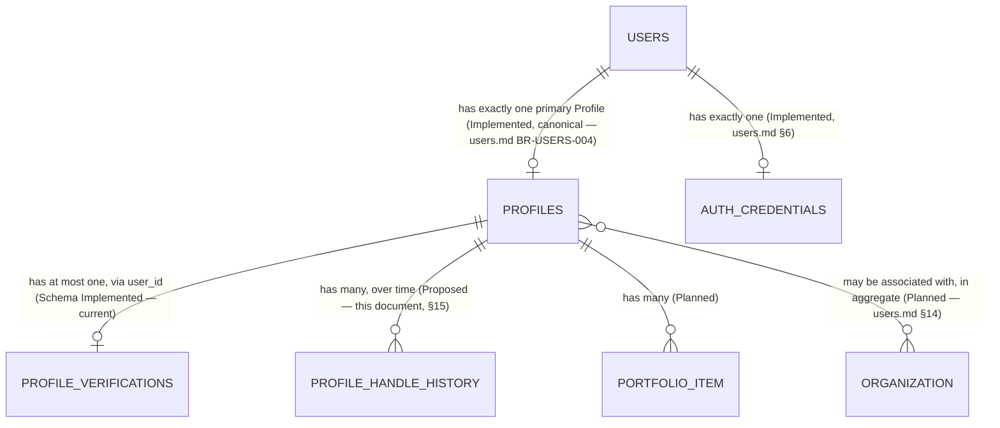
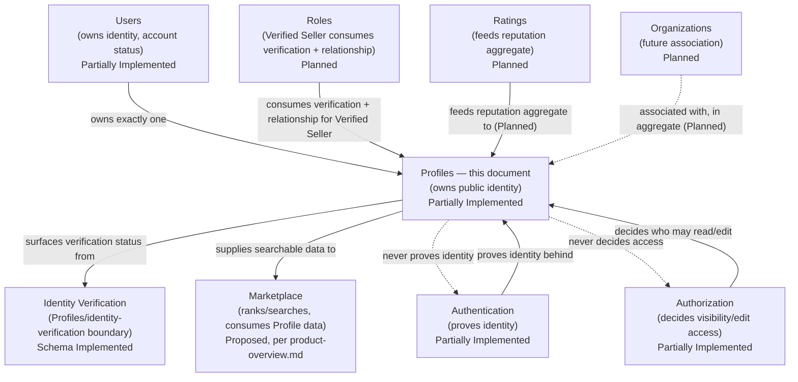
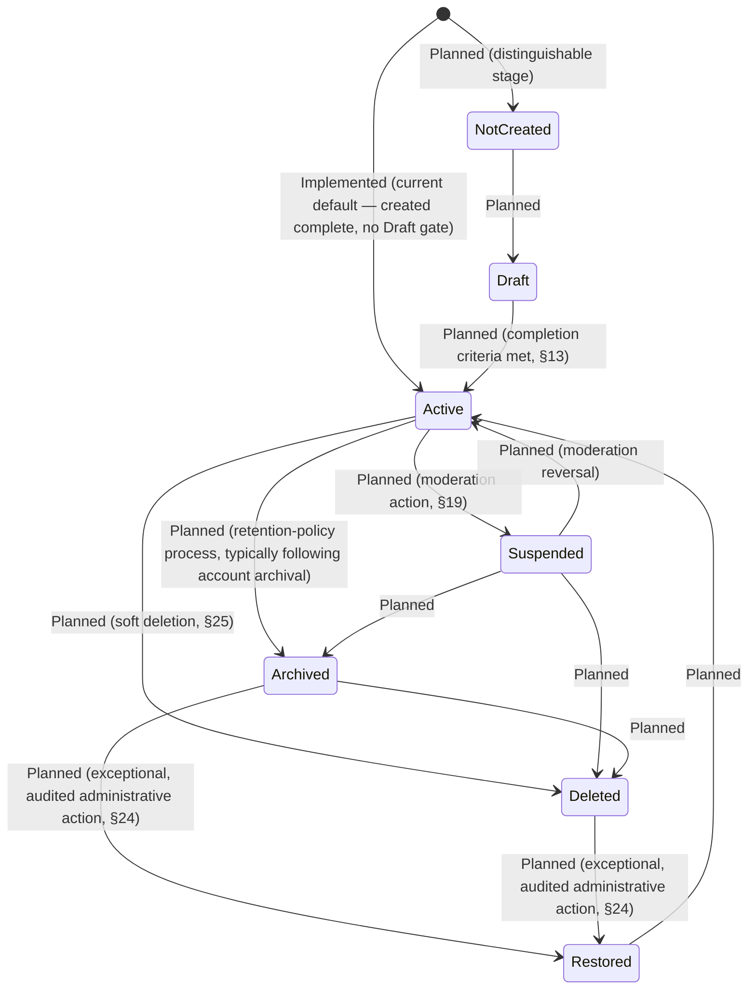
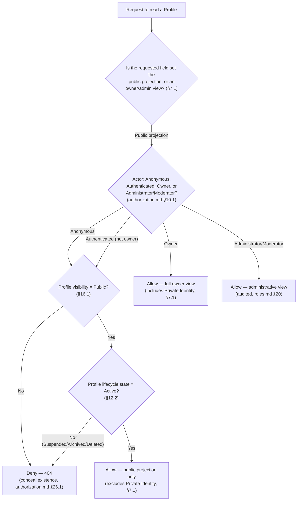
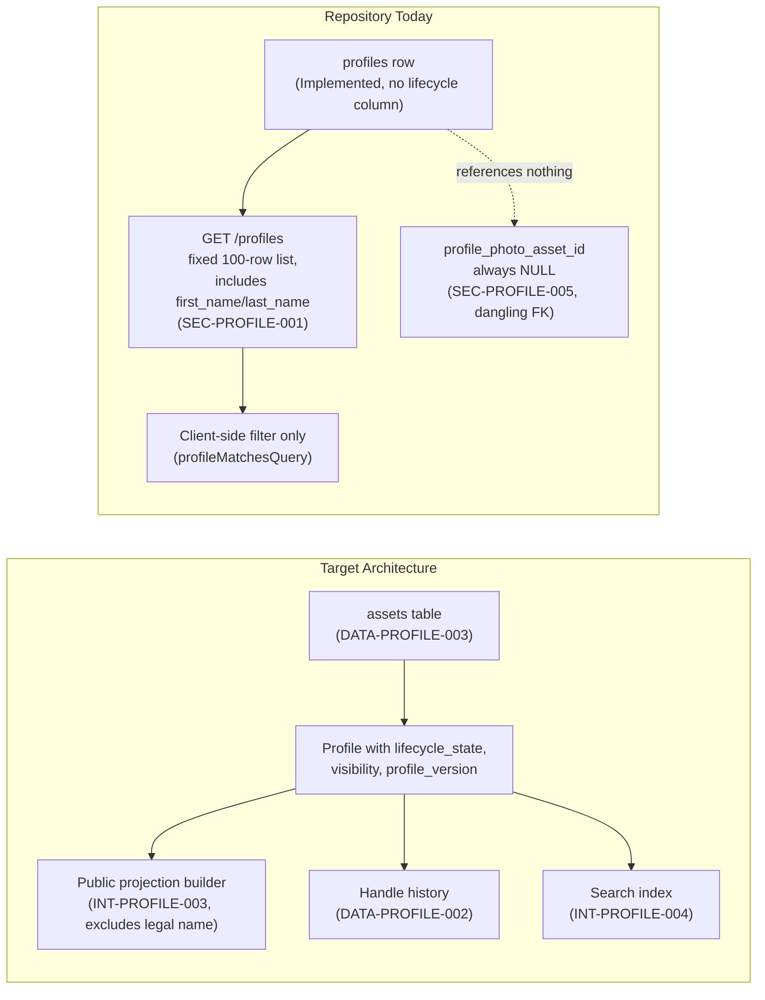
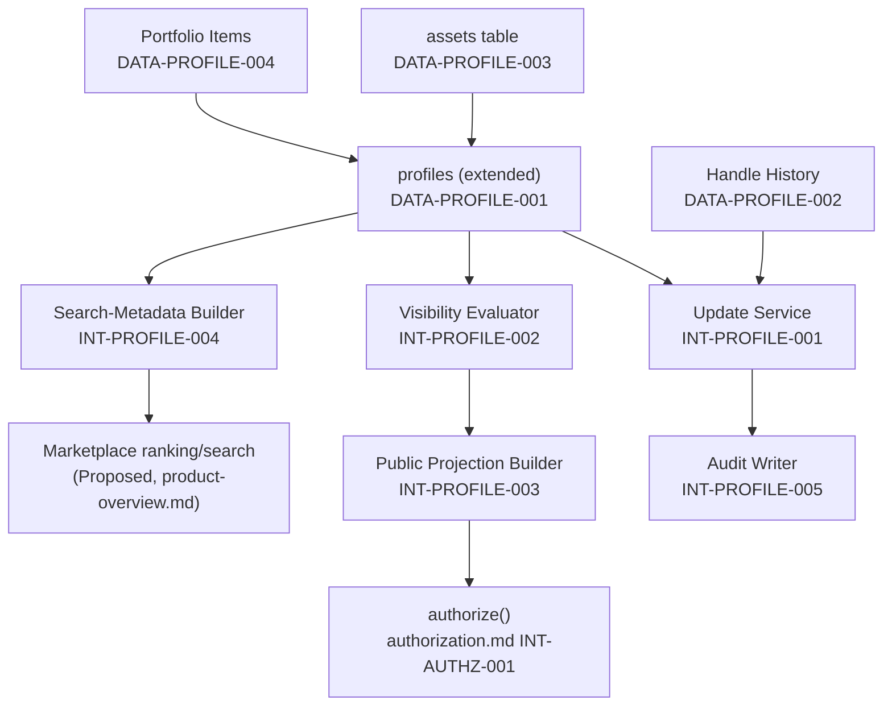

# MusicApp Profiles Domain Specification

| Field | Value |
|---|---|
| Document | Profiles Domain Specification |
| Domain | Profiles (`02-users-roles-permissions/`) |
| Document ID | SPEC-PROFILE-000 (provisional — see §4.1) |
| Type | Specification (SPEC) |
| Status | Approved |
| Version | 1.0.0 |
| Owner | Engineering (interim: repository maintainers) |
| Repository branch | `docs/specification-foundation` |
| Last updated | 2026-07-22 |
| Related documents | [`product-overview.md`](../01-foundation/product-overview.md), [`system-architecture.md`](../01-foundation/system-architecture.md), [`users.md`](users.md), [`authentication.md`](authentication.md), [`authorization.md`](authorization.md), [`roles.md`](roles.md) |
| Supersedes / Superseded By | None |

This document follows [`docs/00-governance/README.md`](../00-governance/README.md) (GOV-000). It is the canonical specification for the Profile domain — public-facing identity, decoupled from the credentials that prove it (`authentication.md`) and from the account existence that owns it (`users.md`). It expands [`system-architecture.md`](../01-foundation/system-architecture.md) §10.3's architecture-level Profiles entry into full domain-specification depth, verifies every technical claim against the repository at time of writing, and does not silently remove or contradict any decision already made in `users.md`, `authentication.md`, `authorization.md`, or `roles.md`.

**A note on scope, stated plainly:** this task's brief lists `permissions.md` among "current completed specification documents." At the time of writing, **no such file, and no commit introducing one, exists in this repository.** This document does not rely on it and does not cite it as authoritative. Wherever a Permission catalog would be relevant, this document treats it exactly as `authorization.md` §3/§25 and `roles.md` §3/§6.2 already do — a future document, not yet written — and is fully consistent with that framing. This discrepancy is raised again in the final report accompanying this document's creation.

**Status taxonomy:** this document classifies every feature using the same five-value taxonomy established in [`system-architecture.md`](../01-foundation/system-architecture.md) §2.3 and reused in [`users.md`](users.md), [`authentication.md`](authentication.md), [`authorization.md`](authorization.md), and [`roles.md`](roles.md) — **Implemented**, **Partially Implemented**, **Schema Implemented**, **Planned**, **Proposed** — per GOV-000 §12 (single source of truth), not redefined here. A capability explicitly named in this task's brief is classified **Planned** (an accepted target, not yet built); a capability this document introduces on its own initiative, beyond the brief, is classified **Proposed** and labeled as this document's own suggestion, consistent with `system-architecture.md` §10.3's own precedent (its Future Extensibility section already marks one item "**Proposed (this document's suggestion)**").

**How this document separates content**, consistent with `authorization.md`'s and `roles.md`'s convention: **Canonical Product Decisions** are stated as definitions and rules (§6–§24, §34.1); **Repository Facts** live in §28 and in "Evidence"/"Repository Status" columns throughout; **Intentional Future Architecture** lives in §30; **Implementation Gaps** are the distance between a canonical decision and repository fact, labeled explicitly in §29; **Risks** live in §31; **Assumptions** live in §32; **Open Questions** live in §33.

## 1. Executive Summary

Profiles answers one question: *"Who is this, to everyone who isn't them?"* It owns public-facing identity — names, handle, biography, genres, and every other field a User chooses to present — deliberately decoupled from Authentication's credentials (`authentication.md`) and from Users' bare account existence and status (`users.md` §5). `system-architecture.md` §10.3 already establishes this domain's Purpose, Ownership, and Non-Responsibilities at the architecture-handbook level; this document is the full specification that entry cross-references and defers to.

**Verified against the repository: Profiles is Partially Implemented, with a wider and more precisely-verified gap than the architecture-level summary previously captured.** A `profiles` table exists (`backend/db/002_create_profiles.sql`) with real, enforced fields — `handle` (globally unique, case-insensitive), `first_name`/`last_name`, `artist_name`, `display_name`, `genres`, `city`/`country`, `bio`, a nullable `profile_photo_asset_id`, and `dob`. Two routes exist: `POST /profiles` (direct creation, unauthenticated) and `GET /profiles` (a fixed, 100-row, newest-first list, authenticated). Profile creation also happens transactionally inside `POST /auth/signup`. **No route updates, versions, suspends, archives, restores, or deletes a Profile — none of these lifecycle actions exist in any form.** No single-profile-by-handle or by-ID route exists; the only way to read a specific Profile today is to fetch the fixed 100-row list and find it client-side, or to be its own owner via `GET /auth/me`.

**One new finding materially changes the "public-safe projection" claim `system-architecture.md` §10.3 and `authorization.md` §22 already recorded.** Both prior documents correctly note that `GET /profiles` excludes `dob` and any authentication-adjacent field. **Neither previously identified that `GET /profiles` includes `first_name` and `last_name` — the legal name — in that same "public-safe" projection**, and that the frontend renders it verbatim under a generic "About" heading (`frontend/src/App.tsx`, `ProfileDetailScreen`, `aboutName`) with no distinguishing label indicating it is a legal, not a stage, name. The `artist_name_is_legal_name` boolean — captured at signup specifically to let the product distinguish these two cases — is written once and never read anywhere in the frontend. This is recorded as `SEC-PROFILE-001` (§25.1), the highest-priority new finding in this document.

**A second new finding:** `profiles.profile_photo_asset_id` and `verification_documents.asset_id` (`backend/db/002_create_profiles.sql`, `backend/db/004_create_verification_documents.sql`) both carry an inline comment — *"FK to `assets(id)` will be added after `assets` table exists"* — and **no `assets` table exists in any of the eight migrations.** Both columns are permanently dangling references to a table that was never created; `profile_photo_asset_id` is `NULL` for every Profile in existence, since nothing in the repository can ever populate it with a value that resolves to anything. This is recorded as `SEC-PROFILE-005` (§25.1).

**Every lifecycle concept this task requires — completion, versioning, visibility, discoverability as a first-class control (as opposed to raw list exposure), verification surfacing, moderation, suspension, archival, restoration, and deletion — has zero repository footprint**, consistent with, and extending, `system-architecture.md` §10.3's own "no profile-specific lifecycle state... exists or is specified" observation. This document defines the canonical target for all of them.

## 2. Purpose

The Profiles domain exists to let a User be found, presented, and evaluated by others, without exposing anything Authentication or Users would consider private, and without requiring Authentication or Users to change when public-identity concerns evolve. It answers `system-architecture.md` §10.3's Purpose verbatim: *"Profiles exists to present a public-facing identity independent of the credentials that prove it, so that discovery, trust signals, and collaboration context can evolve without touching authentication."* This document does not restate that Purpose as a new claim — it is the full specification behind it.

**Verified:** this separation is structurally real. `profiles` (`backend/db/002_create_profiles.sql`) holds no credential, token, or bare account-status data; `users`, `auth_credentials`, `profile_verifications` each remain independent tables, joined only by a 1:1 foreign key.

## 3. Scope

This document covers the Profiles domain: the identity model (§7), every Profile field (§8), uniqueness (§9), URLs (§10), the Authorization boundary Profiles sits behind (§11), the full Profile lifecycle including creation, completion, updates, versioning, visibility, discoverability, verification, moderation, suspension, archival, restoration, and deletion (§12–§25), and future Organization ownership (§25 — wait, see note). It does not cover:

- **The Permission catalog** — deferred to a future `permissions.md`, per `authorization.md` §3/§25 and `roles.md` §3/§6.2 (see the note on the opening page).
- **The Authorization decision framework, evaluation pipeline, or `authorize()` function** — owned by `authorization.md`. This document defines *what a Profile is and what it contains*; `authorization.md` defines *how access to it is decided*.
- **Identity, credentials, tokens, or account status** — owned by Users (`users.md`) and Authentication (`authentication.md`). Profiles consumes account status only to the extent a Suspended/Deleted account's Profile should not remain publicly discoverable (§16, §11).
- **Identity-verification workflow mechanics** (document review, reviewer assignment) — owned at the Profiles/identity-verification boundary per `users.md` §3, §5.2; this document consumes verification *status* (§18) and does not redefine `users.md` §8.2's state machine.
- **The Role and Role Assignment catalog** — owned by `roles.md`. This document's Verified Seller cross-reference (`roles.md` §7.7) consumes, and does not redefine, that Role's derivation.
- **Marketplace ranking or search-algorithm behavior** — per `system-architecture.md` §10.3's Non-Responsibilities, this belongs to Marketplace (§10.4 of that document), even though Marketplace's discovery surface is built by reading Profiles data. §17 of this document defines what is searchable *about* a Profile, not how results are ranked.
- **Ratings computation** — owned by Ratings (`system-architecture.md` §10.9, Planned, zero content schema). This document defines only how a Ratings-owned aggregate would be *displayed* on a Profile (§8.9).

### 3.1 Cross-Document Consistency Statement

This document was written after, and was checked against, `users.md` (v1.2.0), `authentication.md` (v1.2.0), `authorization.md` (v1.1.0), and `roles.md` (v1.0.0) in full, plus `system-architecture.md` §10.3 and `product-overview.md`. No objective contradiction was found that would prevent this document from being internally consistent while leaving those documents unmodified. Two nuances required explicit reconciliation, not a contradiction fix, and are resolved entirely within this document's own text (§6.3, §25.4). Per this task's instruction, no existing specification was modified.

## 4. Terminology and Domain Boundaries

### 4.1 Identifier Governance Note

GOV-000 §11 permits the domain tokens `AUTH`, `AUTHZ`, `USERS`, `IDENTITY`, `MARKETPLACE`, `PROJECTS`, `ESCROW`, `MESSAGING`, `RATINGS`, `MODERATION`, `NOTIFICATIONS`, `ADMIN`, `ANALYTICS`. **`PROFILE` is not on that list.** Per this task's explicit instruction, this document does not modify `docs/00-governance/README.md`. It introduces `BR-PROFILE-*`, `REQ-PROFILE-*`, `SEC-PROFILE-*`, `DATA-PROFILE-*`, `INT-PROFILE-*`, and `AUD-PROFILE-*` as **document-local, explicitly non-governed identifier families**, using the exact precedent `authorization.md` v1.0.0 established for `AUTHZ` and `roles.md` v1.0.0 established for `ROLE`. `SPEC-PROFILE-000` (this document's own ID) is likewise a plain, non-governed tracking label.

**A second, sharper governance observation, worth stating precisely rather than silently working around:** GOV-000 §4 (Directory Structure) already assigns **"Profiles, identity verification, verification documents"** to `03-identity-profiles-verification/` — not to `02-users-roles-permissions/`, where this task places this document. GOV-000 §11 already permits an `IDENTITY` domain token, which would map directly onto that directory. Two consequences follow: (1) had this document been filed under `03-identity-profiles-verification/`, it could have used `IDENTITY` as a **fully governed token today, with no provisional gap at all**; (2) as filed, under `02-users-roles-permissions/`, none of that directory's permitted tokens (`AUTH`, `AUTHZ`, `USERS`) are an accurate fit for "Profiles" either — `users.md` §3 explicitly disclaims Profile ownership ("Profiles (public identity) — owned by the Profiles domain... not by Users"). This is not treated as an objective contradiction preventing this document's own internal consistency — a provisional `PROFILE` token, per this task's explicit instruction, resolves it cleanly within this document. It is raised as a priority open question (§33) with a recommendation that also names the `IDENTITY`-token and file-relocation options, not just a new token.

### 4.2 Domain Terms

| Term | Owning Domain | One-line Definition |
|---|---|---|
| Profile | **This document** | The public-facing identity record for exactly one User (§7) |
| Public Identity | **This document** | The subset of a Profile's fields intended for presentation to other actors, subject to visibility (§16) |
| Private Identity | Users / Profiles boundary | Fields a Profile or its owning User holds that are never exposed publicly regardless of visibility setting (§7.1) |
| Handle | **This document** | A globally unique, case-insensitive, user-chosen identifier for a Profile, distinct from its immutable ID (§8.2, §9) |
| Visibility | **This document**, evaluated by Authorization | Whether, and to whom, a Profile's public identity is shown (§16); consumed as a decision input by `authorization.md` §21 |
| Verification | Profiles / identity-verification boundary (`users.md` §3, §5.2) | The trust-signal outcome of the identity-verification workflow, surfaced on a Profile (§18) |
| Discoverability | **This document** (data), Marketplace (ranking, Planned) | Whether a Profile can be found via search or listing, and what data is exposed to that search (§17) |
| Organization-Associated Profile | Users (`users.md` §14), consumed here | A Profile an Organization is associated with in aggregate, without the Organization owning it directly (§25.4) |
| Authentication | Authentication | Proves control of an identity — see `authentication.md`. Never depends on Profile data (§6.1, `BR-PROFILE-013`) |
| Authorization | Authorization | Decides whether a proven (or anonymous) actor may perform a specific action on a specific resource now, including reading a Profile — see `authorization.md`. Never depends on a display name (§6.1, `BR-PROFILE-014`) |

**Profiles remains strictly separate from Users, Authentication, and Authorization.** `users.md` §3 states this from the Users side; this document states the converse: Profiles never proves identity, never owns account status, and never decides an access outcome — it consumes an already-authenticated (or explicitly anonymous, per `authorization.md` §21) principal and an already-decided visibility outcome as inputs.

## 5. Ownership

### 5.1 Profiles Ownership Matrix

| Concern | Owning Domain | Profiles Responsibility | Non-Responsibility |
|---|---|---|---|
| Public identity fields (names, handle, bio, genres, etc.) | **Profiles** | Owns (§7, §8) | — |
| Handle uniqueness and format | **Profiles** | Owns (§9) | — |
| Profile lifecycle state (creation → completion → active → suspended → archived → deleted) | **Profiles** | Owns (§12) | — |
| Profile field-change history / versioning | **Profiles** | Owns (§15) | — |
| Verification *status surfacing* (badge display) | **Profiles** | Owns the surfacing | Does not own the verification review workflow itself (Profiles/identity-verification boundary, `users.md` §3) |
| Search-relevant data shape | **Profiles** | Owns (§17) | Does not own ranking/search-algorithm behavior — Marketplace (`system-architecture.md` §10.3, §10.4) |
| Ratings-derived aggregate display | **Profiles** | Owns the display | Does not own rating computation — Ratings (`system-architecture.md` §10.9) |
| Identity, credentials, tokens | Users, Authentication | — | Profiles never proves identity |
| Account status values and transitions | Users | — | Profiles consumes, never defines (§11, `users.md` §8.1) |
| Access-decision evaluation (who may see/edit a Profile now) | Authorization | — | Profiles never decides an access outcome itself (`authorization.md` §5.1) |
| Role/Permission catalog | Roles / future Permissions | — | Profiles never defines a Role or Permission (`roles.md` §5.1) |
| Organization structure and membership | Users/Organizations *(Planned)* | — | Profiles evaluates Organization association where relevant; never owns Organization membership (§25.4) |

**Verified:** no table, migration, or code file in the repository currently implements any row in the "Profiles Responsibility" column above beyond the raw field storage itself (§28).

### 5.2 User/Profile Relationship Diagram


*Reproduced and extended from `users.md` §6's ER diagram, not redefined — `users.md` remains the source of truth for the `USERS`-side cardinality rules (GOV-000 §12). `PROFILE_HANDLE_HISTORY` and `PORTFOLIO_ITEM` are new conceptual entities this document introduces (§15, §8.8). Note that `PROFILE_VERIFICATIONS` is drawn keyed through `user_id`, matching the actual schema (`profile_verifications.user_id → users.id`, not `profiles.id`) — a repository fact this document does not treat as a contradiction of "verification belongs to Profiles," consistent with `users.md` §3's own "Profiles/identity-verification boundary" framing (§18).*

## 6. Profile Architecture

### 6.1 Canonical Profile Principles

| # | Principle | Elaborated In |
|---|---|---|
| 1 | Users own identities. | `users.md` §5, §4.2 |
| 2 | Profiles expose public identities. | §1, §2, `system-architecture.md` §10.3 |
| 3 | One User owns one primary Profile for MVP, and canonically for individual accounts. | §7.3, `BR-PROFILE-001`, cross-ref `users.md` `BR-USERS-004` |
| 4 | Organizations may be associated with Profiles in the future — not own them directly. | §25.4 (reconciliation) |
| 5 | Handles are globally unique. | §9, `BR-PROFILE-002` |
| 6 | Profile IDs never change. | §8.2, `BR-PROFILE-003` |
| 7 | Handles may change, subject to policy. | §15, `BR-PROFILE-004` |
| 8 | Display names are mutable. | §8.2, `BR-PROFILE-005` |
| 9 | Artist names are presentation data. | §8.2, `BR-PROFILE-006` |
| 10 | Public Profile URLs are permanent. | §10, `BR-PROFILE-007` |
| 11 | Verification belongs to Profiles. | §18 (surfacing only — see §5.1's precise ownership split) |
| 12 | Authentication never depends on Profile data. | §4.2, `BR-PROFILE-013`, `authentication.md` §7 |
| 13 | Authorization never depends on display names. | §4.2, `BR-PROFILE-014`, `authorization.md` §6.1 Principle 15 |
| 14 | Deny by default underlies every Profile visibility decision, inherited from Authorization. | `authorization.md` §6.1 Principle 1 |
| 15 | Current database state takes precedence over stale token claims for visibility evaluation. | `authorization.md` `BR-AUTHZ-002`, applied here in §16 |

**Verified:** principles 1–2, 5–6, 8–9 already have a real repository trace (§28); principles 3, 11–15 already have a canonical decision elsewhere that this document cross-references rather than restates; principles 4, 7, 10 are stated here for the first time as canonical and have zero repository trace.

### 6.2 Profile Architecture Diagram


*Solid arrows = a real or canonically-decided dependency/consumer. Dashed arrows = an explicit non-responsibility boundary or a Planned-only relationship. "Profiles" itself has a real repository trace (the `profiles` table and its two routes) but no lifecycle, visibility, or versioning component — those are Planned (§29).*

### 6.3 Reconciliation: "Public-Safe" Does Not Yet Mean "Complete Public-Safe"

`system-architecture.md` §10.3 and `authorization.md` §22 both describe `GET /profiles`'s projection as "public-safe" (excluding `dob` and authentication-adjacent fields). This document does not contradict that claim — every field it excludes is, in fact, excluded. **What this document adds, and what neither prior document claimed to have fully audited, is that "public-safe" was verified against authentication-adjacent fields only, not against every field a reasonable Profile owner would consider private** (specifically, legal name — `SEC-PROFILE-001`, §25.1). This is additive precision, consistent with `authorization.md`'s own practice of layering new, narrower findings onto a domain a prior document already partially covered (e.g., `authorization.md` §1's `SEC-AUTHZ-001` on top of `product-overview.md`'s `SEC-001`).

## 7. Identity Model

### 7.1 Public Identity vs. Private Identity

| Category | Definition | Example Fields | Visible To |
|---|---|---|---|
| Public Identity | Fields intended for presentation to other actors, subject to visibility (§16) | Handle, display name, artist name, bio, genres, city/country, avatar, verification badge | Per §16's visibility evaluation — target: any actor including anonymous, for a `Public` Profile |
| Private Identity | Fields a Profile holds internally that are never exposed publicly regardless of visibility setting | Legal name (target — see `SEC-PROFILE-001`), date of birth, `profile_verifications`/`verification_documents` internals | Owner and authorized Administrator/Moderator roles only (`roles.md` §7.9, §7.8) |
| Owner-Only Identity | Fields visible to the Profile's own owner but not to the general public, and not classified as sensitive enough to withhold from the owner's own admin/settings view | Profile preferences (§8.11), search metadata (§8.12) | Owner only |

`BR-PROFILE-008`: legal name fields (`first_name`, `last_name`) MUST be classified as Private Identity and MUST NOT appear in any public-safe projection unless the Profile owner has explicitly elected to present their legal name as public (e.g., via `artist_name_is_legal_name`). Status: **Not met** — the repository currently includes both fields, unconditionally, in `GET /profiles`'s "public-safe" projection (`SEC-PROFILE-001`).

### 7.2 Names

Three distinct name concepts exist, and this document does not conflate them:

| Name Concept | Purpose | Mutability | Public by Default? |
|---|---|---|---|
| Legal name (`first_name`, `last_name`) | Private Identity; primarily relevant to identity verification (`users.md` §8.2) | Mutable, subject to policy (target — no update route exists today) | **No** (target — `BR-PROFILE-008`); **currently yes**, an unaudited repository behavior (`SEC-PROFILE-001`) |
| Artist name (`artist_name`) | Presentation data — the name a creator performs or works under | Mutable (`BR-PROFILE-006`) | Yes |
| Display name (`display_name`) | The name shown most prominently across the platform's UI | Mutable (`BR-PROFILE-005`) | Yes |

`BR-PROFILE-005`: display names are mutable and carry no uniqueness constraint — two Profiles may share a display name; only the handle (§9) disambiguates them. `BR-PROFILE-006`: artist names are presentation data — they carry no identity-verification weight of their own; `artist_name_is_legal_name` (`backend/db/002_create_profiles.sql`) exists precisely to let a Profile assert "my artist name and my legal name are the same string," without implying the converse must be verified. Status: both Implemented as schema, target rules confirmed, not previously stated as canonical rules elsewhere.

## 8. Profile Fields

### 8.1 Profile Field Matrix

| # | Field (Task Component) | Repository Column(s) | Mutability | Default Visibility (Target) | Repository Status |
|---|---|---|---|---|---|
| 1 | Identity (User linkage) | `profiles.user_id` | Immutable | N/A (linkage, not displayed) | Implemented |
| — | Profile ID | `profiles.id`, `profiles.external_id` | Immutable (`BR-PROFILE-003`) | Public (as part of URLs, §10) | Implemented |
| 2 | Names | `first_name`, `last_name`, `artist_name`, `display_name` | Mixed — see §7.2 | Mixed — see §7.1 | Implemented |
| 3 | Handle | `handle` (CITEXT, unique) | Mutable, subject to policy (`BR-PROFILE-004`) | Public | Implemented |
| 4 | Biography | `bio` | Mutable | Public | Implemented |
| 5 | Avatar | `profile_photo_asset_id` | Mutable (target) | Public | **Schema Implemented, non-functional** — column exists, `NULL` for every row; no `assets` table exists to resolve it (`SEC-PROFILE-005`) |
| 6 | Banner | None | — | — | **Planned** — no column, no prior mention in any document except this one |
| 7 | Genres | `genres TEXT[]` | Mutable | Public | Implemented |
| 8 | Skills | None | — | — | **Planned** — `system-architecture.md` §10.3 Future Extensibility already proposes this as a controlled taxonomy distinct from `genres`; this document carries that proposal forward, not inventing it |
| 9 | Languages | None | — | — | Planned — no repository trace |
| 10 | Location | `city`, `country` | Mutable | Public | Implemented |
| 11 | Social links | None | — | — | Planned — no repository trace anywhere (confirmed by search, §28.1) |
| 12 | Verification | `profile_verifications.status` (via `user_id`) | System-managed (review outcome) | Public (badge only — never the underlying documents) | Schema Implemented — no surfacing column on `profiles`, no route |
| 13 | Portfolio | None | — | — | Planned — `system-architecture.md` §10.3 already names this in Responsibilities and Future Extensibility |
| 14 | Statistics | None | — | — | Planned |
| 15 | Ratings summary | None | — | — | Planned — depends on the Ratings domain existing at all (`system-architecture.md` §10.9) |
| 16 | Badges | None | — | — | Planned — verification badge is the first concrete instance (Schema Implemented as an input; Planned as a surfaced badge) |
| 17 | Visibility | None | — | — | Planned — no column exists; `authorization.md` §21 already establishes the canonical target (public/private, owner-controlled) |
| 18 | Search metadata | None | — | — | Planned |
| 19 | Profile preferences | None | — | — | Planned |
| 20 | Future organization ownership | None | — | — | Planned — see §25.4's reconciliation of "ownership" vs. "association" |

**Verified:** every "Implemented" row above is drawn directly from `backend/db/002_create_profiles.sql` and `backend/Index.js`'s `POST /profiles`/`POST /auth/signup`/`GET /profiles` column lists (§28.1). No column beyond those listed as Implemented or Schema Implemented exists anywhere in the repository.

### 8.2 Handle

Covered under §9 (Profile Uniqueness) and §10 (Profile URLs) in full; summarized here for the field catalog. `handle` is a `CITEXT` (case-insensitive text) column with a `UNIQUE` constraint (`backend/db/002_create_profiles.sql:15`) — enforced at the database level, not merely in application code, which this document records as a genuine positive finding (§28, consistent with `authorization.md` §1's practice of calling out real, correct repository behavior explicitly rather than only cataloguing gaps).

### 8.3 Biography

Free-text `bio`, nullable (`backend/db/002_create_profiles.sql:26`). No length limit is enforced at the database level (`TEXT`, unbounded); no length limit was found in application code either (`backend/Index.js`'s `POST /profiles`/`POST /auth/signup` accept `bio` unmodified). This is recorded as a minor, non-security implementation gap (§29), not a defect.

### 8.4 Avatar and Banner

Avatar (`profile_photo_asset_id`) is Schema Implemented but non-functional (§8.1, `SEC-PROFILE-005`) — the frontend already accounts for this by rendering initials (`getInitials`, `frontend/src/App.tsx:951-959`) whenever `profile_photo_asset_id` is falsy, which today is unconditionally, since the column can never hold a resolvable value. Banner has no repository trace at all — this document introduces it as a Planned field, per the task's explicit component list, with no existing schema, route, or UI reference (a CSS class named `project-detail-banner` exists but is an unrelated empty-state UI element for Projects, not a Profile banner, confirmed at `frontend/src/App.tsx:1467`, §28.1).

### 8.5 Genres, Skills, Languages

Genres: `genres TEXT[] NOT NULL DEFAULT '{}'` (`backend/db/002_create_profiles.sql:22`), free-text, unconstrained values. `CONSTRAINT profiles_genres_not_null` guarantees the array itself is never `NULL`, but any string may populate it — there is no controlled vocabulary. Skills: Planned, per `system-architecture.md` §10.3's own proposal that Skills become a controlled, filterable taxonomy distinct from the free-text Genres array — this document adopts that proposal as the target shape rather than proposing a competing one. Languages: Planned, new to this document, with no prior proposal to build on; intended purpose is enabling buyers/sellers to find language-compatible collaborators, consistent with the marketplace's cross-border, India-first framing (`product-overview.md` §16).

### 8.6 Location

`city TEXT NOT NULL`, `country TEXT NOT NULL` (`backend/db/002_create_profiles.sql:23-24`) — both required at Profile creation, free text, no ISO country-code constraint or geocoding. `product-overview.md` §7 confirms this is already used for client-side Discover filtering (`profileMatchesQuery`, `frontend/src/App.tsx:803-814`).

### 8.7 Social Links

Planned. No column, table, route, or UI reference exists anywhere in the repository for external links of any kind (confirmed by a targeted search for `instagram`, `twitter`, `spotify`, `soundcloud`, `youtube`, `website`, `social`, §28.1) — this contradicts nothing; it is a `system-architecture.md` §10.3 Future Extensibility item ("external links (website, streaming platforms, social)") this document formalizes as a field category without inventing new scope.

### 8.8 Portfolio

Planned. No table exists for portfolio items. Target conceptual shape: a `PortfolioItem` entity (§26, `DATA-PROFILE-004`) — title, description, an external link or a reference to the same not-yet-existing `assets` table (§8.4, `SEC-PROFILE-005`) that would also serve Avatar and verification documents, and display order. `system-architecture.md` §10.3 already lists "portfolio" in both Responsibilities and Future Extensibility.

### 8.9 Statistics and Ratings Summary

Planned, and structurally dependent on other Planned/absent domains. "Statistics" (e.g., completed-project count, response time) would be computed from Projects/Escrow data, neither of which has the routes to produce that data yet (`product-overview.md` §13.2). "Ratings summary" would be a Ratings-owned aggregate (§5.1) displayed here — Ratings has zero content schema today (`system-architecture.md` §10.9, `product-overview.md` §10.5), so this field is doubly Planned: the aggregate cannot be computed until Ratings exists, and the surfacing column does not exist on `profiles` either way.

### 8.10 Badges

Planned. The verification badge (§18) is the only badge type with any canonical backing today (`system-architecture.md` §10.3's Core Business Rules: "A profile should be able to display a verification badge once identity verification is approved. **Schema Implemented**"). Other badge types (e.g., a "Top Rated" or "Fast Responder" badge) are not decided anywhere and are not invented here — see §33 (Open Questions).

### 8.11 Profile Preferences

Planned. No preferences column or table exists. Target scope, per the visibility and future-notification cross-references this document anticipates but does not fully specify: visibility preference (§16), preferred contact method, notification preferences (deferred entirely to the Notifications domain, `system-architecture.md` §10.10, Planned).

### 8.12 Search Metadata

Planned. No derived/indexed search representation exists — `GET /profiles`'s client-side filter (`profileMatchesQuery`) operates directly on the raw fields already returned, with no separate search index, normalized text, or ranking signal of any kind (§17, §28.1).

## 9. Profile Uniqueness

`BR-PROFILE-002`: a Profile's `handle` MUST be globally unique, case-insensitively. Status: **Implemented** — `handle CITEXT NOT NULL UNIQUE` (`backend/db/002_create_profiles.sql:15`), enforced at the database level; `POST /profiles` and `POST /auth/signup` both surface the resulting `23505` unique-violation as a `409` (`backend/Index.js`, confirmed at both call sites).

**A note on identifier precision, stated transparently rather than silently worked around:** GOV-000 §28 (Worked Examples by Domain) illustrates this exact rule using the identifier `BR-USERS-004` — *"A profile's `handle` MUST be unique, case-insensitively... Implemented — `profiles.handle CITEXT UNIQUE`."* `users.md` §9, however, assigns `BR-USERS-004` to a **different** rule — *"A user has exactly one primary public profile"* (`profiles.user_id UNIQUE`) — the normative, single-source-of-truth definition for that ID, per GOV-000 §12. GOV-000 §28 states plainly that its own table is illustrative ("examples of *how to document*, not an exhaustive specification"), so this is treated as a non-normative labeling slip in an example table, not a conflict between two normative documents. This document mints its own `BR-PROFILE-002` for handle uniqueness rather than claiming the already-taken `BR-USERS-004`, and raises the GOV-000 §28 slip as a minor open item (§33) rather than editing GOV-000 or `users.md`.

`BR-PROFILE-003`: a Profile's `id` (and `external_id`) MUST be immutable once assigned, matching `users.md` `BR-USERS-002`'s equivalent rule for `users.id` applied here. Status: Implemented by convention — no route or trigger updates either column after creation (no `UPDATE` route exists on `profiles` at all, §28).

## 10. Profile URLs

`BR-PROFILE-007`: a public Profile URL, once issued, MUST remain permanently resolvable — the canonical target is that a URL built from the Profile's *current* handle always works, and a URL built from a *former* handle (§15) either continues to resolve (via handle-history-based redirect) or fails safely, never silently resolving to a different, unrelated Profile.

**Verified: no Profile URL of any kind exists today.** `frontend/package.json` lists no routing library (`react-router-dom` or equivalent is absent); the frontend is a single-page, in-memory `view`-state application (`frontend/src/App.tsx`'s `AuthenticatedView` union type) with no URL-to-Profile mapping, no deep link, and no server-side route that accepts a handle or Profile ID as a path parameter (`backend/Index.js` has no `GET /profiles/:handle` or `GET /profiles/:id` route — confirmed, §28.1). Every Profile view today is reached only by navigating client-side state from the fixed 100-row Discover list. This is recorded as `SEC-PROFILE-007`'s companion functional gap (§29) rather than a security finding on its own, since there is no URL scheme to attack.

The exact target URL shape (e.g., a handle-based path, an ID-based path with the handle as a display-only slug, or both) is not decided here — raised as an open question (§33), consistent with not inventing a canonical decision beyond what this task's brief specifies.

## 11. Profile Ownership and the Authorization Boundary

This document does not redefine who may read or write a Profile — that decision belongs to `authorization.md`, cross-referenced here, not restated:

- **Read (public):** target is any actor, including anonymous, subject to visibility (`authorization.md` §21, `BR-AUTHZ-021`/`BR-AUTHZ-033`; this document's §16). Current: requires authentication (`GET /profiles`, `authorization.md` `SEC-AUTHZ-008`, this document's `SEC-PROFILE-003`).
- **Read (own):** any Authenticated User, via `GET /auth/me` (`authorization.md` §8.1). Implemented.
- **Update (self):** owning User only (`authorization.md` §13.1, `BR-AUTHZ-007`) — Planned, no update route exists at all (`SEC-PROFILE-004`).
- **Update (other):** never permitted for an ordinary User; Administrator/Moderator exceptions require an explicit, audited action (`roles.md` §7.8, §7.9) — Planned.
- **Create:** `POST /profiles` accepts a client-supplied `user_id` with no ownership check, since the route is entirely unauthenticated — `authorization.md` `SEC-AUTHZ-001`, this document's `SEC-PROFILE-002`.

`BR-PROFILE-013`: Authentication MUST NOT depend on any Profile field to prove identity — a Profile's existence or content is never a credential (cross-ref `authentication.md` §7, `authorization.md` §4.2). `BR-PROFILE-014`: Authorization MUST NOT use a display name, artist name, or any other mutable presentation field as an identifier in an access decision — only immutable, safe identifiers (`profiles.id`, `users.id`) may be used, per `authorization.md` §6.1 Principle 15, applied here explicitly for the first time. Status: both Implemented by construction — no code path in the repository uses a name field for either purpose (§28).

## 12. Profile Lifecycle

### 12.1 Profile Lifecycle Matrix

| Stage | Definition | Entry Trigger | Exit Trigger | Repository Status |
|---|---|---|---|---|
| Not Created | No Profile row exists for the User. | Account created without profile fields (target: possible via a future decoupled signup flow) | Profile creation | Planned as a distinguishable stage — today, `POST /auth/signup` creates User + Profile + credentials in one transaction, so this stage is never independently observable, mirroring `users.md` §7's identical finding for the "Registered" stage |
| Draft / Incomplete | A Profile row exists but does not yet satisfy the completion criteria (§13) for public discovery. | Profile created with only required fields | Completion criteria met | **Planned** — the current schema has no partial-completion concept; every `NOT NULL` column is enforced at `INSERT` time, so a Profile is either fully schema-valid or does not exist — there is no in-between row today |
| Active / Complete | The normal, publicly-discoverable state (subject to visibility, §16). | Completion criteria met | Suspension, archival, or deletion | **Implemented, as the only reachable state** — every Profile that exists today is immediately in this state with no gate |
| Suspended | Hidden from public discovery by an explicit moderation action, independent of the owning User's account status. | Moderator/Administrator action (`roles.md` §7.8/§7.9) | Reactivation, or escalation to Archived/Deleted | Planned |
| Archived | Retained as a historical record; not publicly discoverable; not directly returnable to Active through the normal lifecycle. | Retention-policy process, typically following the owning account's own `Archived` transition (`users.md` `BR-USERS-017`) | Exceptional, audited restoration only (§24) | Planned |
| Deleted | Soft-deleted; inaccessible to the public and to normal application flows; retained for audit per the same policy `users.md` `BR-USERS-009` establishes for accounts. | Owning User's account soft-deletion (`users.md` §8.1), or an independent Profile-level deletion (§25) | Exceptional, audited restoration only (§24) | Planned |

**Design principle, explicitly continuing an already-established pattern:** Profile lifecycle status is a separate, independently-governed system from account status (`users.md` §8.1) and from identity-verification status (`users.md` §8.2) — the third instance of this project's now-recurring "separate lifecycles for separate concerns" design (after account-status/verification-status in `users.md` §8.3, and `auth_version`/`authz_version` in `authorization.md` §9.4). A Profile MAY be `Suspended` while its owning User's account remains `Active` — for example, a content-policy violation confined to the bio or handle should not necessarily block the User from messaging or managing existing Projects.

### 12.2 Profile State Matrix

| State | Publicly Visible? | Searchable? | Editable by Owner? | Editable by Administrator/Moderator? | Status |
|---|---|---|---|---|---|
| Not Created | N/A | N/A | N/A | N/A | Planned |
| Draft / Incomplete | No | No | Yes | Yes | Planned |
| Active / Complete | Per visibility (§16) | Per visibility (§16) | Yes | Yes | Partially Implemented (visible today; not yet gated by visibility since visibility doesn't exist) |
| Suspended | No | No | No (target — prevents self-reversal of a moderation action) | Yes | Planned |
| Archived | No | No | No | Exceptional, audited only | Planned |
| Deleted | No | No | No | Exceptional, audited only | Planned |

### 12.3 Profile Lifecycle Diagram


*This diagram intentionally contains no ordinary `Archived → Active` or `Deleted → Active` edge — both are terminal within the normal lifecycle, matching `users.md` §8.1's identical design for account status. `Restored` is drawn as a distinct, exceptional state reached only via an audited administrative action, not as a direct edge back to `Active`, for the same reason. Every transition shown is Planned except the single `[*] --> Active` edge, which reflects today's actual, gate-free creation behavior.*

## 13. Profile Creation

`POST /profiles` and `POST /auth/signup` (`backend/Index.js`) both create a Profile today, requiring `handle`, `first_name`, `artist_name`, `display_name`, `city`, `country` (all `NOT NULL` at the database level); `last_name`, `bio`, `profile_photo_asset_id`, `dob` are optional. `POST /profiles` additionally requires a client-supplied `user_id` with no ownership check (§11, `SEC-PROFILE-002`); `POST /auth/signup` derives the owning User transactionally instead, which this document records as the correct pattern (consistent with `authorization.md` §1's practice of calling out the one route that already does something correctly).

**Target completion criteria (§12.1's Draft → Active transition) are not decided here** — this document does not invent a specific minimum field set beyond what the database already requires, since doing so would be a product decision this task's brief does not supply. Candidates worth naming as Proposed, not decided: a non-empty `bio`, at least one `genre`, and (once it exists) an Avatar, mirroring how `system-architecture.md` §10.3 already gestures toward richer profiles without mandating specific completion gates.

## 14. Profile Completion

Planned, per §12.1/§13. `DATA-PROFILE-005` (§26) — a `completion_status` or equivalent field — does not exist. Whether an incomplete Profile should be permitted to transact (create/receive Projects) while incomplete is not decided here; `product-overview.md` §9's core transaction model does not currently gate project creation on Profile completeness in any way (confirmed — `POST /projects` never reads `profiles` fields, `backend/Index.js:611-771`).

## 15. Profile Updates and Versioning

**Verified: no Profile update mechanism exists at all.** No `PUT`, `PATCH`, or `DELETE` route exists anywhere in `backend/Index.js` — confirmed by a full route-table search (§28.1). `authorization.md` `BR-AUTHZ-007` ("a User may update the User's own primary Profile") accordingly has no code to satisfy or violate.

**Canonical decision, target architecture:** handles may change, subject to policy (`BR-PROFILE-004`); display names, artist names, biography, genres, location, and every other mutable field (§8.1) may change freely, subject only to validation. `BR-PROFILE-009`: every handle change MUST be recorded in a `PROFILE_HANDLE_HISTORY`-shaped record (`DATA-PROFILE-002`, §26), preserving the prior handle, the change timestamp, and the acting actor, both to support permanent-URL resolution (§10) and to prevent a released handle from being immediately re-claimed in a way that could impersonate the prior holder (a specific, named risk — §31).

**Profile versioning**, per this task's explicit requirement, is defined here as a third, independent version concept — `profile_version` — joining `auth_version` (`authentication.md` §12) and `authz_version` (`authorization.md` §9.4) as the third member of this project's now-established "separate version concepts for separate concerns" pattern. Unlike the other two, `profile_version` is **not** a security/session-invalidation mechanism — it exists to support optimistic concurrency on Profile updates and cache-invalidation for public discovery listings. `BR-PROFILE-010`: every mutation to a Profile's fields MUST increment `profile_version`. Status: Planned — no version/timestamp-based concurrency control exists on `profiles` beyond the unenforced `updated_at` column (present but never written to by any route, since no update route exists, §28.1).

## 16. Profile Visibility

### 16.1 Visibility Matrix

| Visibility Level | Who Can View (Target) | Discoverable in Search? | Decided By | Repository Status |
|---|---|---|---|---|
| Public | Any actor, including anonymous | Yes | Canonical (`authorization.md` §21, `BR-AUTHZ-021`/`BR-AUTHZ-033`) | Planned — `SEC-PROFILE-003` (currently authenticated-only, not truly public) |
| Private | Owner only (and authorized Administrator/Moderator) | No | Canonical — owner MAY set this, subject to platform policy (`authorization.md` §21) | Planned — no visibility column exists at all |
| *(Additional levels, e.g. "Unlisted" — viewable via direct link, not searchable)* | Undecided | Undecided | **Not decided anywhere** — `authorization.md` §35.2 already lists "Profile visibility levels beyond public/private" as an open question; this document does not resolve it | Proposed (this document names the possibility; does not decide it) |

`BR-PROFILE-011`: a Profile's visibility MUST default to a safe, conservative value at creation — this document does not decide whether that default is `Public` or `Private` (§33), only that an explicit, deliberate default is required rather than an implicit one. Status: Planned.

### 16.2 Visibility Evaluation Diagram


*This is a zoom-in on `authorization.md` §10.1's canonical evaluation order, applied specifically to Profile reads — it does not redefine that order (GOV-000 §12). Entirely Planned; `backend/Index.js`'s current `GET /profiles` implements none of these branches — it returns the same fixed projection to every authenticated caller regardless of the target Profile's (nonexistent) visibility setting or lifecycle state.*

## 17. Profile Discoverability and Search

Profiles owns the data shape available for search; it does not own ranking or the search algorithm — that is Marketplace's responsibility (`system-architecture.md` §10.3's Non-Responsibilities, §10.4). **Verified: no server-side search exists.** `GET /profiles` returns a fixed, unfiltered, unranked 100-row window (`ORDER BY created_at DESC LIMIT 100`, `backend/Index.js:481-482`); `profileMatchesQuery` (`frontend/src/App.tsx:803-814`) performs a client-side, case-insensitive substring match over `display_name`, `artist_name`, `handle`, `city`, `country`, and `genres` on whatever subset of the 100-row window happens to already be loaded — it does not query the server again per keystroke, and it cannot find a Profile outside that fixed window at all.

`REQ-PROFILE-005` (§34.2): the platform SHOULD support server-side, paginated, filtered Profile search, scoped to `Public`-visibility, `Active`-lifecycle Profiles only. Status: Planned. This is recorded as `SEC-PROFILE-007` (§25.1) from a scaling/correctness angle (no pagination beyond a hard 100-row cutoff means Profiles created after the 100 most recent are permanently unreachable via Discover) as well as a discoverability gap.

## 18. Profile Verification

### 18.1 Verification Matrix

| Verification Aspect | Owned By | Surfaced On Profile? | Repository Status |
|---|---|---|---|
| Verification review workflow (document submission, reviewer decision) | Profiles/identity-verification boundary (`users.md` §3, §5.2, §8.2) | N/A — this document does not redefine the workflow | Schema Implemented — `profile_verifications`, `verification_documents` exist; no route |
| Verification status (`Not Submitted`/`Pending`/.../`Approved`/`Rejected`/`Expired`/`Revoked`) | Users (`users.md` §8.2) — 8 canonical values, 4 in the current enum | Consumed, not redefined | Schema Implemented (partial enum) |
| Verification badge (the public-facing signal that a Profile is `Approved`) | **Profiles** (this document) | Yes — target | Planned — no column on `profiles` surfaces it (`system-architecture.md` §10.3, confirmed) |
| Verified Seller (a Role, not a Profile field) | `roles.md` §7.7 | Indirectly — a Verified Seller badge on a Profile would be one legitimate rendering of that Role's derived state | Planned |

`BR-PROFILE-012`: a Profile's verification badge, once built, MUST reflect the *current* verification status at read time, never a cached or stale value — consistent with `users.md` `BR-USERS-011`'s "no permanent truth in tokens" principle applied here to badge rendering, and directly supporting `roles.md` §7.7's requirement that Verified Seller be continuously re-evaluated, not a one-time grant. Status: Planned.

### 18.2 Verification Flow Diagram

```mermaid
sequenceDiagram
    participant U as User (Profile Owner)
    participant API as API (Planned — no route exists today)
    participant VER as profile_verifications<br/>(Schema Implemented)
    participant DOC as verification_documents<br/>(Schema Implemented)
    participant Rev as Reviewer (role/mechanism undecided)
    participant PRF as profiles<br/>(badge column — Planned)

    U->>API: Submit verification documents
    API->>VER: status: not_started -> submitted
    API->>DOC: Insert document rows (selfie, government_id front/back)
    Rev->>VER: Review submission
    alt Approved
        Rev->>VER: status -> approved
        VER->>PRF: Update badge (Planned — no column exists to update)
    else Rejected
        Rev->>VER: status -> rejected
        Note over PRF: No badge change; Profile remains unverified
    end
```
*Entirely Planned/Schema Implemented — no route in the repository submits a verification document, transitions `profile_verifications.status`, or writes any value derived from it back onto `profiles`. `users.md` §13.3 already confirms this gap at the Users-domain level; this diagram shows the missing Profiles-side consequence specifically (the badge itself).*

## 19. Profile Moderation

Planned, gated behind the Moderator Role (`roles.md` §7.8) once it exists. Moderation actions specific to Profiles: suspend a Profile (§12), redact or clear a specific field found to violate policy (without suspending the whole Profile), and revoke a previously-surfaced verification badge independent of the underlying `profile_verifications.status` (e.g., pending re-review) — this last action is distinct from, and does not redefine, `authorization.md` §20's general Moderation rules ("Moderators must not... fabricate ratings... bypass immutable audit history"), applied here to Profile content specifically. Every Profile moderation action MUST be attributable and audited (§22), consistent with `roles.md` §20.

## 20. Profile Suspension

Covered structurally in §12 (Lifecycle). `BR-PROFILE-015`: Profile suspension MUST be independent of, and MUST NOT itself trigger, the owning User's account-status suspension (`users.md` §8.1) — the two are separate lifecycles (§12.1's design principle). Reversal follows the same "authorized Moderation or Administration action" pattern `users.md` `BR-USERS-015` establishes for account suspension, applied here to a different resource. Status: Planned.

## 21. Profile Archival

Covered structurally in §12. `BR-PROFILE-016`: Profile archival SHOULD normally follow from the owning User account's own `Archived` transition (`users.md` `BR-USERS-017`'s retention-policy process) rather than occurring independently, since an archived account has no ongoing platform presence to justify a separately-live Profile — but this document does not prohibit an independent Profile-level archival path (e.g., a long-inactive but not-yet-account-archived creator), leaving the exact trigger conditions as an open question (§33). Status: Planned.

## 22. Profile Restoration

`BR-PROFILE-017`: restoration from `Archived` or `Deleted` MUST be an exceptional, audited administrative action, never an ordinary self-service transition — matching `users.md` §8.1's identical rule for account recovery from `Disabled`/`Deleted`, applied here to Profiles. A restored Profile returns to `Active`, not directly to any intermediate state, and the restoration event itself MUST be recorded (`AUD-PROFILE-001`, §22 [Auditing, below] — cross-referenced, not duplicated). Status: Planned — no restoration mechanism, and no deletion/archival mechanism for it to reverse, exists today.

## 23. Profile Deletion

`BR-PROFILE-018`: Profile deletion MUST be soft deletion by default, consistent with `users.md` `BR-USERS-009`'s canonical soft-deletion rule for accounts, applied here — a Profile is hidden and excluded from discovery (§12.2), not physically removed, preserving audit history. **Verified, and already documented precisely by `users.md` §13.5 Finding 1, cross-referenced not restated:** `profiles.user_id` carries `ON DELETE CASCADE` back to `users.id` (`backend/db/002_create_profiles.sql:13`) — a **hard** delete of a `users` row removes the Profile permanently, with no soft-deletion step. `users.md` `BR-USERS-008` already classifies this as "a repository fact and an operational risk, not the intended account-deletion workflow"; this document adds no new claim here beyond confirming the identical CASCADE behavior applies to Profiles specifically, and that no independent Profile-only deletion route exists either (§28.1).

## 24. Organization Ownership (Future)

Covered in depth at §25.4, after this document's full identity-model and lifecycle sections have established the vocabulary needed to state it precisely without ambiguity.


## 25. Failure Handling and Security Architecture

### 25.1 Security Findings Table (`SEC-PROFILE-*`)

| ID | Finding | Severity Context | Repository Evidence | Impact | Target Correction |
|---|---|---|---|---|---|
| `SEC-PROFILE-001` | `GET /profiles`'s "public-safe" projection includes `first_name` and `last_name` (legal name) unconditionally; the frontend renders it under a generic "About" heading with no legal-name label. `artist_name_is_legal_name`, captured specifically to distinguish this case, is written at signup and never read anywhere else. | **New finding, this document — highest priority** | `backend/Index.js:476-479` (SELECT list), `frontend/src/App.tsx:971` (`aboutName`), `1029` (render); `artist_name_is_legal_name` read-sites: only `frontend/src/App.tsx:30`, `56`, `399` (all write/type-only) | Every Profile's legal name is exposed to any authenticated Discover viewer today, and would be exposed to any anonymous viewer once `SEC-PROFILE-003`/`SEC-AUTHZ-008` is corrected without also fixing this | Exclude `first_name`/`last_name` from the public projection by default (`BR-PROFILE-008`); if a Profile owner opts to present their legal name publicly, gate it explicitly, not unconditionally |
| `SEC-PROFILE-002` | `POST /profiles` accepts a client-supplied `user_id` with no ownership check — the route is entirely unauthenticated. | Carried, cross-referenced | `authorization.md` `SEC-AUTHZ-001`, `backend/Index.js:129-199` | A caller could create a Profile attached to an arbitrary existing `user_id` | Require authentication and enforce `user_id == req.auth.sub`, per `authorization.md` `SEC-AUTHZ-001`'s existing target correction |
| `SEC-PROFILE-003` | `GET /profiles` requires authentication though public Profile discovery is canonical target architecture. | Carried, cross-referenced | `authorization.md` `SEC-AUTHZ-008`, `backend/Index.js:473` | Public creator discovery — a core marketplace capability — is unavailable to unauthenticated visitors | Add an anonymous-accessible public Profile discovery route using an approved public projection (§16, §25.1 `SEC-PROFILE-001`'s correction must land first or simultaneously) |
| `SEC-PROFILE-004` | No Profile update route exists at all, so `authorization.md` `BR-AUTHZ-007` (owner-only update) has no code to violate or satisfy. | Carried, cross-referenced, Profile-specific angle added | `authorization.md` §13.1, confirmed by full route-table search (§28.1) | Not a live vulnerability today (nothing to exploit); a structural readiness gap for when an update route is added | Build the update route with `authorization.md` `BR-AUTHZ-007` and `INT-PROFILE-001` (§27) enforced from day one, not retrofitted |
| `SEC-PROFILE-005` | `profiles.profile_photo_asset_id` and `verification_documents.asset_id` both reference a non-existent `assets` table — a permanently dangling conceptual FK with no working values possible. | **New finding, this document** | `backend/db/002_create_profiles.sql:27`, `backend/db/004_create_verification_documents.sql:33`; confirmed via repository-wide search — no `assets` table in any of the eight migrations | Avatar (§8.4) and verification-document storage (`users.md` §13.3) cannot function at all today, not merely "unimplemented" but structurally unable to hold a value | Create the `assets` table (or equivalent object-storage reference mechanism) before either dependent feature can be built |
| `SEC-PROFILE-006` | No visibility column or mechanism exists, so there is no way for a Profile owner to mark any field private — every field returned by `GET /profiles` is returned identically to every caller. | New finding, this document | `backend/Index.js:476-482`, confirmed absence of any visibility-related column (§28.1) | Combined with `SEC-PROFILE-001`, there is no owner-facing control to mitigate the legal-name exposure today even manually | Build `DATA-PROFILE-001` (visibility column) and gate the read path on it (§16.2) |
| `SEC-PROFILE-007` | `GET /profiles` has a hard `LIMIT 100` with no pagination and no server-side search; Profiles created after the 100 most recent are permanently unreachable via Discover. | Carried, cross-referenced (`authorization.md` `SEC-AUTHZ-006`), Profile-specific scaling angle added | `backend/Index.js:482` | Discoverability silently degrades as the platform grows, with no error or signal that a Profile has become unreachable | Add pagination and server-side search (§17, `REQ-PROFILE-005`) |
| `SEC-PROFILE-008` | No Profile field-change history or audit trail exists; any future direct-DB correction to a Profile field (or, once built, any update route) would leave no historical record of what changed, when, or by whom. | New finding, this document | Confirmed absence of any history/audit table referencing `profiles` (§28.1); parallels `users.md` §11's identical finding for account-level actions | No forensic trail for a disputed or erroneous Profile change, including a handle change (§15) that could otherwise support impersonation via a released handle | Build `DATA-PROFILE-002` (`PROFILE_HANDLE_HISTORY`) and `AUD-PROFILE-001` (§22) before any update route ships |

### 25.2 Cross-Referenced Security Findings (Not Redefined)

`authorization.md` `SEC-AUTHZ-001`, `002`, `003`, `004`, `005`, `006`, `008` and `authentication.md` `SEC-AUTH-002`, `008` all remain owned by their respective documents and are not restated here beyond the explicit cross-references above (`SEC-PROFILE-002`, `003`, `007`), per the domain boundary in §3.

### 25.3 Failure Scenarios

This document does not redefine `authorization.md` §27.1's canonical HTTP denial conventions (`401`/`403`/`404`/`409`), confirmed there as canonical rather than merely descriptive. Profile-specific application:

| Scenario | Convention | Status |
|---|---|---|
| Anonymous actor reads a `Private`-visibility Profile | `404` (conceal existence, per the same pattern `authorization.md` §27.1 already establishes for milestone-locking) | Planned |
| Authenticated, non-owner actor attempts to update a Profile | `403` | Planned — no route exists to test against |
| Duplicate handle at creation or (future) update | `409` | **Implemented** at creation (`backend/Index.js`, `23505` → `409`) |
| Read of a `Suspended`/`Archived`/`Deleted` Profile by a non-owner, non-Administrator actor | `404` | Planned |
| Handle-history redirect for a former handle | Resolves to the current Profile, or `404` if never claimed — not decided which (§33) | Planned |

### 25.4 Reconciliation: "Organization Ownership" vs. Organization Association

The task brief states "Organizations may own Profiles in future" among its canonical decisions. `users.md` §14 already establishes a more precise target shape: *"Organization → many Users → many associated professional Profiles (in aggregate across those Users, not per-User multiplicity)"* — every Profile in that model still belongs to exactly one User (`profiles.user_id NOT NULL UNIQUE`, unchanged); the Organization is *associated with* many of its Users' Profiles in aggregate, and MAY support delegated (non-owning) management of a Profile by an authorized User who does not personally own it (`users.md` §6, §14). **This document adopts `users.md`'s more precise framing rather than the brief's looser "own" wording, since introducing direct Organization-to-Profile ownership would contradict `users.md`'s already-canonical model and the schema's existing `NOT NULL UNIQUE` constraint on `profiles.user_id`.** This is stated as an explicit reconciliation, not a silent substitution — consistent with how `roles.md` §6.3 handled an analogous wording tension for Buyer/Seller. `BR-PROFILE-019`: an Organization MUST NOT be modeled as the direct owner of a Profile; Organization-Profile association is additive and aggregate-level only. Status: Planned, zero repository trace (no Organization schema exists anywhere, `users.md` §14, `authorization.md` §18).

## 26. Data Model

### 26.1 Target Data Model (Conceptual — `DATA-PROFILE-*`)

| ID | Entity | Key Conceptual Fields | Status |
|---|---|---|---|
| `DATA-PROFILE-001` | `profiles` (extended) | Existing columns (§8.1) plus: `lifecycle_state` (§12), `visibility` (§16), `profile_version` (§15), `completion_status` (§14) | Partially Implemented (existing columns only) |
| `DATA-PROFILE-002` | `PROFILE_HANDLE_HISTORY` | id, profile_id, former_handle, changed_at, changed_by | Planned |
| `DATA-PROFILE-003` | `assets` | id, owner reference, storage location, mime type, status — the table `profile_photo_asset_id` and `verification_documents.asset_id` already reference but that does not exist (`SEC-PROFILE-005`) | Planned |
| `DATA-PROFILE-004` | `PORTFOLIO_ITEM` | id, profile_id, title, description, external_link or asset_id, display_order | Planned |
| `DATA-PROFILE-005` | Profile completion criteria (conceptual, not necessarily a separate table) | Minimum required/optional field set for `Draft → Active` (§13, §14) | Planned, criteria undecided (§33) |
| `DATA-PROFILE-006` | `PROFILE_AUDIT_EVENT` | Per `AUD-PROFILE-002`'s field list (§27) | Planned |

No table above beyond the existing `profiles` columns exists in any migration in `backend/db/` (§28). Exact schema (column names, types, indices) is explicitly deferred as an open question (§33), consistent with `authorization.md` §25.1's and `roles.md` §21.1's identical disclaimer.

## 27. Interfaces and Auditing

### 27.1 Interfaces (`INT-PROFILE-*`)

| ID | Interface | Status |
|---|---|---|
| `INT-PROFILE-001` | Profile update service — enforces `authorization.md` `BR-AUTHZ-007` (owner-only), field-level mutability rules (§7.2, §15), handle-change history (`DATA-PROFILE-002`), and `profile_version` increment (`BR-PROFILE-010`) | Planned |
| `INT-PROFILE-002` | Visibility evaluator — resolves a Profile's effective visibility and lifecycle-gated public projection (§16.2), consumed by `authorization.md` `INT-AUTHZ-001` | Planned |
| `INT-PROFILE-003` | Public Profile projection builder — the field-level allow-list this document's `SEC-PROFILE-001` finding shows is currently missing | Planned |
| `INT-PROFILE-004` | Search-metadata builder — produces the indexed/searchable representation (§17, §8.12) consumed by Marketplace | Planned |
| `INT-PROFILE-005` | Profile audit-event writer — writes `AUD-PROFILE-001` events, consistent with `authorization.md` `INT-AUTHZ-004`'s and `roles.md` `INT-ROLE-004`'s equivalents | Planned |

### 27.2 Auditing (`AUD-PROFILE-*`)

This document does not redefine `authorization.md` §25.1's umbrella permanent-audit-scope policy (`AUD-AUTHZ-001`, `BR-AUTHZ-035`). Profile-specific events fall within that umbrella wherever they represent a moderation action, a role-gated administrative action, or an organization-access change; routine field edits by the owner are not automatically within that permanent-audit list, but this document requires audit for the more sensitive subset regardless.

| ID | Target Event | Status |
|---|---|---|
| `AUD-PROFILE-001` | Handle change, visibility change, lifecycle-state transition (suspend/archive/delete/restore), verification-badge change | Planned |
| `AUD-PROFILE-002` | Target audit fields: event ID, profile ID, owning user ID, acting actor ID (owner, Moderator, Administrator, or System per `roles.md` §7.11), field(s) changed, prior value, new value, reason (mandatory for suspend/archive/restore), timestamp, correlation ID | Planned |

`BR-PROFILE-020`: every lifecycle-state transition and every handle change MUST be attributable and audited. Status: Planned — no audit mechanism exists for any Profile event today (§28).


## 28. Repository Verification

### 28.1 Files Inspected

`backend/db/002_create_profiles.sql`, `003_create_profile_verifications.sql`, `004_create_verification_documents.sql` (full schema, re-verified this revision); `backend/Index.js` in full, specifically `POST /profiles` (lines 129-199), the profile-creation block inside `POST /auth/signup` (lines 203-314), `GET /auth/me`'s profile join (lines 412-468), and `GET /profiles` (lines 473-489); `backend/package.json` (no upload/storage/search dependency found); `frontend/src/App.tsx` in full, specifically the `Profile`/`DiscoverProfile` types (lines 22-73), `DISCOVER_CATEGORIES` (lines 592-597), `profileMatchesQuery` (lines 803-814), `ProfileDetailScreen` (lines 961-1029), and `getInitials` (lines 951-959); `frontend/package.json` (no routing library found). A repository-wide, case-insensitive search for `avatar`, `banner`, `slug`, `username`, `social`, `instagram`, `twitter`, `spotify`, `soundcloud`, `youtube`, `website`, `language`, `skill`, `portfolio`, `statistic`, `badge`, `rating`, `assets`, and `upload` was run across `backend/` (excluding `node_modules`) and `frontend/src/` — findings recorded in §28.3.

### 28.2 Repository Profile Matrix

| Component | Repository Representation | Evidence | Status |
|---|---|---|---|
| Identity (User linkage) | `profiles.user_id` | `backend/db/002_create_profiles.sql:11` | Implemented |
| Names | `first_name`, `last_name`, `artist_name`, `display_name` | `backend/db/002_create_profiles.sql:16-20` | Implemented |
| Handle | `handle CITEXT UNIQUE` | `backend/db/002_create_profiles.sql:15` | Implemented |
| Biography | `bio` | `backend/db/002_create_profiles.sql:26` | Implemented |
| Avatar | `profile_photo_asset_id` | `backend/db/002_create_profiles.sql:27` | Schema Implemented, non-functional (`SEC-PROFILE-005`) |
| Banner | None | — | Planned |
| Genres | `genres TEXT[]` | `backend/db/002_create_profiles.sql:22` | Implemented |
| Skills | None | — | Planned |
| Languages | None | — | Planned |
| Location | `city`, `country` | `backend/db/002_create_profiles.sql:23-24` | Implemented |
| Social links | None | — | Planned |
| Verification | `profile_verifications.status` (via `user_id`) | `backend/db/003_create_profile_verifications.sql` | Schema Implemented |
| Portfolio | None | — | Planned |
| Statistics | None | — | Planned |
| Ratings summary | None | — | Planned |
| Badges | None | — | Planned |
| Visibility | None | — | Planned |
| Search metadata | None | — | Planned |
| Profile preferences | None | — | Planned |
| Organization ownership/association | None | — | Planned |
| Profile update route | None | — | Not Implemented (per this task's status vocabulary; treated as "Planned" in this document's own taxonomy, §4.3-equivalent note below) |
| Profile lifecycle state | None | — | Planned |
| Profile URL scheme | None (no routing library) | `frontend/package.json` | Planned |

**A brief status-taxonomy note, mirroring `roles.md` §4.3:** this task's brief asks for "Implemented, Partially Implemented, Schema Implemented, Planned, Not Implemented." This document uses the same reconciliation `roles.md` §4.3 already established — the first four values match this project's single source of truth (`system-architecture.md` §2.3); "Not Implemented" is treated as "Planned" for canonically-decided-but-absent concepts (nearly everything in this table) and would be "Proposed" for anything not yet a canonical decision at all. No sixth status label is introduced.

### 28.3 Repository Findings

- **Existing profile schema:** `profiles` (`backend/db/002_create_profiles.sql`), with 14 real columns plus timestamps; `profile_verifications` and `verification_documents` exist but key off `users.id`, not `profiles.id` (§5.2's diagram note).
- **Existing profile endpoints:** `POST /profiles`, `GET /profiles`, plus profile creation inside `POST /auth/signup` and profile reads inside `GET /auth/me`. Four touch-points total; zero of them update, version, suspend, archive, restore, or delete.
- **Missing profile lifecycle:** confirmed — no status/state column exists on `profiles` at all (§12).
- **Missing visibility controls:** confirmed — no visibility column, no per-field privacy flag (§16, `SEC-PROFILE-006`).
- **Missing verification integration:** confirmed — `profile_verifications.status` is never read by any route, and no column on `profiles` would have anywhere to surface it if it were (§18).
- **Missing search architecture:** confirmed — `GET /profiles` is a fixed list; all filtering is client-side, post-fetch, over an already-truncated 100-row window (§17).
- **Missing moderation:** confirmed — no Moderator concept exists anywhere in the repository (`roles.md` §25.1's identical zero-match finding, reconfirmed here for Profile-specific terms).
- **Missing profile versioning:** confirmed — `updated_at` exists but is never written to, since no update route exists (§15).
- **Missing profile auditing:** confirmed — no audit table references `profiles` in any way (§27.2, `SEC-PROFILE-008`).
- **New findings beyond the above, specific to this revision:** the legal-name exposure (`SEC-PROFILE-001`) and the dangling `assets` FK (`SEC-PROFILE-005`) were not previously documented in any prior specification.

### 28.4 Repository Comparison Diagram


*Two disconnected subgraphs, deliberately — nothing in `CURRENT` feeds `TARGET` today. `C1` is the repository-real analogue of `T1`, once extended with the columns that do not yet exist.*

## 29. Implementation Status

### 29.1 Implementation Status Matrix

| Capability | Status | Repository Evidence | Target Behaviour | Gap | Dependency |
|---|---|---|---|---|---|
| Core Profile fields (names, handle, bio, genres, location) | Implemented | `backend/db/002_create_profiles.sql` | §8 | None for these specific fields | None |
| Avatar | Schema Implemented, non-functional | `profile_photo_asset_id`, always `NULL` | §8.4 | `assets` table entirely missing | `DATA-PROFILE-003` |
| Handle uniqueness | Implemented | `handle CITEXT UNIQUE` | §9 | None | None |
| Public-safe projection (complete) | **Not met** | `backend/Index.js:476-479` includes legal name | §7.1 | `SEC-PROFILE-001` | `INT-PROFILE-003` |
| Profile update | Planned | No route exists | §15 | Entire capability | `INT-PROFILE-001` |
| Profile versioning | Planned | `updated_at` unused | §15 | Entire capability | `INT-PROFILE-001`, `DATA-PROFILE-001` |
| Profile lifecycle (suspend/archive/delete/restore) | Planned | No status column | §12, §19-§23 | Entire capability | `DATA-PROFILE-001` |
| Visibility | Planned | No column | §16 | Entire capability | `DATA-PROFILE-001`, `INT-PROFILE-002` |
| Public/anonymous discovery | Planned — confirmed gap against canonical design | `GET /profiles` requires auth | §11, `authorization.md` §21 | `SEC-PROFILE-003` | `authorization.md` `INT-AUTHZ-001` |
| Search (server-side) | Planned | Client-side filter only | §17 | Entire capability | `INT-PROFILE-004` |
| Verification badge surfacing | Planned | No column | §18 | Entire capability | `DATA-PROFILE-001` |
| Portfolio | Planned | No table | §8.8 | Entire capability | `DATA-PROFILE-004` |
| Social links | Planned | No column | §8.7 | Entire capability | `DATA-PROFILE-001` |
| Skills, Languages | Planned | No column | §8.5 | Entire capability | `DATA-PROFILE-001` |
| Statistics, Ratings summary | Planned | No column, depends on Ratings domain | §8.9 | Entire capability | Ratings domain (`system-architecture.md` §10.9) |
| Profile auditing | Planned | No audit table | §27.2 | Entire capability | `INT-PROFILE-005` |
| Organization association | Planned | No Organization schema | §25.4 | Entire capability | `users.md` §14 |

## 30. Future Architecture

### 30.1 Future Architecture Diagram


*Entirely Planned. This is the assembled target architecture this document's individual sections describe piecemeal — no component shown here has any repository footprint (§28).*

### 30.2 Implementation Roadmap

This is sequencing guidance, not a committed schedule — no dates are implied.

1. **Correct the public-safe projection first** (`SEC-PROFILE-001`, `INT-PROFILE-003`): the highest-priority item in this document, since it is a live exposure affecting every existing Profile today, independent of every other roadmap item.
2. **`assets` table** (`DATA-PROFILE-003`): unblocks Avatar (§8.4), Portfolio (§8.8), and completes the already-half-built verification-document storage (`users.md` §13.3).
3. **Lifecycle and visibility columns** (`DATA-PROFILE-001`): the foundation every other lifecycle capability (§12, §16, §19–§23) depends on.
4. **Update service and versioning together** (`INT-PROFILE-001`, `BR-PROFILE-010`): building the update route without versioning/history from day one would repeat `users.md` `BR-USERS-008`'s CASCADE lesson — retrofitting audit trails onto an already-live mutation path is harder than building them in from the start.
5. **Public discovery correction** (`authorization.md` `SEC-AUTHZ-008`/this document's `SEC-PROFILE-003`): should land together with step 1, since opening anonymous access without first fixing the legal-name exposure would widen `SEC-PROFILE-001`'s blast radius rather than shrink it.
6. **Search and remaining fields** (Skills, Languages, Social links, Portfolio, Statistics): layered on top of steps 1–4, roughly in the order this document lists them, though none strictly blocks another.

## 31. Risks

- **`SEC-PROFILE-001` (legal-name exposure) is the highest-priority risk in this document.** It is a live, currently-exploitable-by-any-authenticated-user privacy gap, not a Planned-target absence like most of this document's other findings — every other risk below assumes this one is corrected first, per the roadmap (§30.2).
- **`SEC-PROFILE-005` (dangling `assets` FK) blocks two independently-important features (Avatar, verification documents) behind one shared, unbuilt dependency.** Building either feature's route logic before `assets` exists would produce code with no way to ever succeed.
- **Handle changes without history (`SEC-PROFILE-008`) create an impersonation risk once handles become mutable** (`BR-PROFILE-004`): a released handle could be reclaimed by a different Profile, and any existing link, bookmark, or reference using the old handle would then resolve to an unrelated person, with no historical record to detect or explain the change.
- **No test suite exists to regression-test any of this once built** (`authentication.md` §25.6, `roles.md` §28, confirmed still true, §28.1) — combined with no audit trail (`SEC-PROFILE-008`), there would be no automated or forensic way to detect a Profile-domain regression after the fact.
- **The identifier-governance gap (§4.1) compounds the existing `FOUNDATION`/`ROLE` provisional-token situations.** A fourth provisional token family (`PROFILE`) now exists simultaneously with `product-overview.md`'s `FOUNDATION` and `roles.md`'s `ROLE`, each requiring its own eventual governance-update task — and this one has the added complication that an already-governed `IDENTITY` token exists but maps to a different directory than where this document was placed.

## 32. Assumptions

- **Assumption:** the inclusion of `first_name`/`last_name` in `GET /profiles`'s SELECT list (`SEC-PROFILE-001`) was an oversight rather than a deliberate design decision — no comment, commit message, or prior documentation was found describing an intentional choice to expose legal names publicly, and the existence of `artist_name_is_legal_name` (captured but never consulted) suggests the opposite intent was originally in mind.
- **Assumption:** the candidate completion criteria named in §13 (non-empty bio, at least one genre, an avatar) are a reasonable starting proposal, not a decided requirement — explicitly labeled Proposed, not Planned, since no prior document or this task's brief specifies exact completion criteria.
- **Assumption:** `INT-PROFILE-001`–`005` are intended as synchronous, in-process functions/services callable from route handlers, consistent with `authorization.md` §34's and `roles.md` §29's identical assumption about their own interfaces' deployment shape (a single Express process, `system-architecture.md` §4.1) — not separate networked services.
- **Assumption:** the "Unlisted" visibility level named in §16.1 as a possibility is this document's own illustrative example of what "levels beyond public/private" could mean, not a claim that it is the intended design — `authorization.md` §35.2 already leaves the exact levels undecided, and this document does not resolve that question.

## 33. Open Questions

**This section intentionally contains more items than a minimal domain document, consistent with the convention already established in `authorization.md` §35 and `roles.md` §30.**

### 33.1 Open Questions Table

| # | Question | Category | Related |
|---|---|---|---|
| 1 | Should GOV-000 §11's domain-token list be updated to add `PROFILE`, should this document use the already-governed `IDENTITY` token despite its directory placement, should this document be relocated to `03-identity-profiles-verification/` to match GOV-000 §4's own mapping, or should the token remain provisional indefinitely? | Identifier governance | §4.1 — the highest-priority item, since it affects whether every identifier in this document (§34) is stable, and it is a sharper, more specific version of the gap `authorization.md` and `roles.md` each already raised for their own tokens |
| 2 | What are the exact completion criteria for the `Draft → Active` lifecycle transition (§13, §14)? | Product design | §13 names candidates as Proposed only |
| 3 | What is the exact target visibility model beyond `Public`/`Private` — does an "Unlisted" or similar intermediate level exist? | Product design | Carried from `authorization.md` §35.2; this document does not resolve it |
| 4 | What is the exact target URL shape for a Profile (handle-based, ID-based, or both), and how should a former handle's URL behave — redirect, or fail safely? | Implementation detail | §10 |
| 5 | Should Profile-level archival be permitted independently of the owning account's archival, or should it always follow from it? | Product design | §21 |
| 6 | What are the exact database schema details for `PROFILE_HANDLE_HISTORY`, the extended `profiles` columns, `assets`, and `PORTFOLIO_ITEM`? | Implementation detail | §26 |
| 7 | What is the exact Skills taxonomy, and how does it relate to, or replace, the free-text Genres field? | Product design | §8.5, carried from `system-architecture.md` §10.3's own proposal |
| 8 | What badge types beyond the verification badge are intended, if any? | Product design | §8.10 |
| 9 | Should incomplete (Draft-stage) Profiles be permitted to transact (create/receive Projects), or must completion precede any commercial activity? | Product design | §14 |
| 10 | Is the GOV-000 §28 worked-example table's citation of `BR-USERS-004` for handle uniqueness (rather than this document's `BR-PROFILE-002`) worth a future correction to that table, even though it is explicitly illustrative and non-normative? | Documentation quality | §9 |
| 11 | What is the exact `profile_version` propagation/invalidation mechanism — does it drive a cache, an ETag-style concurrency check, or both? | Implementation detail | §15, mirrors `authorization.md` §35.2's identical open question for `authz_version` |
| 12 | Should Profile suspension require step-up authentication to apply or reverse, matching the scope `authorization.md` §9.5 already defines for assigning/removing high-privilege Roles? | Product design | §20 |
| 13 | What is the retention period for `PROFILE_AUDIT_EVENT` records? | Implementation detail | §27.2, mirrors `authorization.md` §35.2's and `roles.md` §30.1's identical open audit-retention questions for their own domains |

**Recommendation to the requester:** item 1 is the highest priority, for the same reason `authorization.md` and `roles.md` each named their own identifier-governance question first — it determines whether this document's `BR-PROFILE-*`/`SEC-PROFILE-*`/etc. identifiers are stable going forward, and it additionally surfaces a genuine directory/token mismatch in GOV-000 §4 that a future governance-update task should resolve deliberately rather than by accident.

## 34. Traceability

### 34.1 Business Rules

| ID | Statement (abridged) | Status |
|---|---|---|
| `BR-PROFILE-001` | One User owns one primary Profile for MVP, and canonically for individual accounts (cross-ref `users.md` `BR-USERS-004`). | Implemented (relationship); canonical |
| `BR-PROFILE-002` | A Profile's handle must be globally unique, case-insensitively. | Implemented |
| `BR-PROFILE-003` | A Profile's ID is immutable once assigned. | Implemented (by convention) |
| `BR-PROFILE-004` | Handles may change, subject to policy. | Planned |
| `BR-PROFILE-005` | Display names are mutable and carry no uniqueness constraint. | Implemented (schema); rule stated canonically here for the first time |
| `BR-PROFILE-006` | Artist names are presentation data, carrying no identity-verification weight of their own. | Implemented (schema); rule stated canonically here for the first time |
| `BR-PROFILE-007` | A public Profile URL, once issued, must remain permanently resolvable. | Planned — no URL scheme exists at all |
| `BR-PROFILE-008` | Legal name fields must be Private Identity by default, never in the public-safe projection unless the owner opts in. | **Not met** — `SEC-PROFILE-001` |
| `BR-PROFILE-009` | Every handle change must be recorded in a handle-history record. | Planned |
| `BR-PROFILE-010` | Every Profile field mutation must increment `profile_version`. | Planned |
| `BR-PROFILE-011` | A Profile's visibility must default to an explicit, deliberate value at creation. | Planned |
| `BR-PROFILE-012` | A verification badge must reflect current verification status at read time, never a stale value. | Planned |
| `BR-PROFILE-013` | Authentication must not depend on any Profile field to prove identity. | Implemented (by construction) |
| `BR-PROFILE-014` | Authorization must not use a display name or other mutable presentation field as an access-decision identifier. | Implemented (by construction) |
| `BR-PROFILE-015` | Profile suspension must be independent of account-status suspension. | Planned |
| `BR-PROFILE-016` | Profile archival should normally follow the owning account's archival. | Planned |
| `BR-PROFILE-017` | Restoration from Archived/Deleted must be an exceptional, audited administrative action. | Planned |
| `BR-PROFILE-018` | Profile deletion must be soft deletion by default. | Planned — repository currently hard-deletes via `CASCADE` on the exceptional administrative path only (`users.md` `BR-USERS-008`) |
| `BR-PROFILE-019` | An Organization must not be modeled as the direct owner of a Profile. | Planned |
| `BR-PROFILE-020` | Every lifecycle-state transition and handle change must be attributable and audited. | Planned |

### 34.2 Requirements

| ID | Statement (abridged) | Related | Status |
|---|---|---|---|
| `REQ-PROFILE-001` | The platform MUST maintain exactly one primary Profile per individual User. | `BR-PROFILE-001`, cross-ref `users.md` `REQ-USERS-001` | Implemented |
| `REQ-PROFILE-002` | The platform MUST enforce globally unique, case-insensitive handles. | `BR-PROFILE-002` | Implemented |
| `REQ-PROFILE-003` | The platform MUST exclude Private Identity fields from every public-safe Profile projection by default. | `BR-PROFILE-008`, `SEC-PROFILE-001` | **Not met** |
| `REQ-PROFILE-004` | The platform MUST support an explicit Profile visibility setting, owner-controlled, subject to platform policy. | `BR-PROFILE-011`, cross-ref `authorization.md` §21 | Planned |
| `REQ-PROFILE-005` | The platform SHOULD support server-side, paginated, filtered Profile search scoped to public, active Profiles. | §17 | Planned |
| `REQ-PROFILE-006` | The platform MUST support a Profile update path enforcing owner-only mutation and recording handle-change history. | `BR-PROFILE-004`, `BR-PROFILE-009`, cross-ref `authorization.md` `BR-AUTHZ-007` | Planned |
| `REQ-PROFILE-007` | The platform MUST support independent Profile lifecycle states (suspend/archive/delete/restore), separate from account status. | §12 | Planned |
| `REQ-PROFILE-008` | The platform MUST audit every Profile lifecycle transition and handle change. | `BR-PROFILE-020` | Planned |
| `REQ-PROFILE-009` | The platform MUST surface a verification badge reflecting current verification status. | `BR-PROFILE-012` | Planned |
| `REQ-PROFILE-010` | The platform MUST NOT model Organization ownership of a Profile as direct ownership. | `BR-PROFILE-019` | Planned |

### 34.3 Cross-Document References

`authorization.md` `BR-AUTHZ-002`, `006`, `007`, `021`, `022`, `033`, `035`, `SEC-AUTHZ-001`, `003`, `006`, `008`, `AUD-AUTHZ-001`, `INT-AUTHZ-001` are referenced throughout this document, not redefined, per GOV-000 §12. `users.md` §3, §5.2, §6, §8.1–§8.3, §14, `BR-USERS-002`, `004`, `008`, `009`, `011`, `017` are likewise referenced, not redefined. `authentication.md` §7, §12 are referenced for the Authentication-independence rule and `auth_version` context. `roles.md` §7.7 (Verified Seller), §7.8/§7.9 (Moderator/Administrator), §9.5-equivalent step-up cross-reference, and §20 (auditing pattern) are referenced for Role-consuming context. `system-architecture.md` §10.3 is the architecture-handbook-level entry this document expands into full specification depth, cross-referenced throughout rather than restated. `product-overview.md` §6, §7, §16 are referenced for the Discover/marketplace and India-first framing context.

## 35. Version History

| Version | Date | Change | Author |
|---|---|---|---|
| 1.0.0 | 2026-07-22 | Initial approved Profiles domain specification. Expanded `system-architecture.md` §10.3's architecture-level entry into full domain-specification depth: identity model (public/private identity, three distinct name concepts), a 20-component Profile Field Matrix, uniqueness, URLs, the Authorization ownership boundary, a four-lifecycle-system design (Profile lifecycle as a third/fourth independent state machine alongside account status, identity-verification status, and the `auth_version`/`authz_version` pattern), visibility, discoverability/search, verification badge surfacing, moderation, suspension, archival, restoration, deletion, and future Organization association. Verified the entire domain against the repository: confirmed the real `profiles` schema and its two routes; confirmed zero update/lifecycle/visibility/search/audit mechanism exists anywhere. Identified two new findings not previously documented anywhere — `SEC-PROFILE-001` (legal name unconditionally exposed in the "public-safe" `GET /profiles` projection, with the field that was apparently meant to prevent this, `artist_name_is_legal_name`, written but never read) and `SEC-PROFILE-005` (a permanently dangling `assets` table reference shared by Avatar and verification-document storage) — plus six more findings cross-referenced from `authorization.md`/`users.md` with Profile-specific angles added. Flagged a sharper identifier-governance gap than `authorization.md`'s or `roles.md`'s own: GOV-000 §4 already maps "Profiles" to `03-identity-profiles-verification/`, where an already-governed `IDENTITY` token would have applied directly, had this document been filed there instead of `02-users-roles-permissions/` per this task's explicit instruction. Reconciled two brief-vs.-prior-document wording tensions explicitly, without contradiction: "one User owns one primary Profile for MVP" against `users.md` §15.1's stronger canonical (not merely MVP-scoped) framing, and "Organizations may own Profiles" against `users.md` §14's more precise "associated with, in aggregate" model. Noted that GOV-000 §28's worked-example table cites `BR-USERS-004` for handle uniqueness, a different rule than `users.md`'s actual `BR-USERS-004`, and minted this document's own `BR-PROFILE-002` rather than reusing that ID. No existing specification was modified; no objective contradiction requiring one was found. No repository code was changed. | Engineering |
