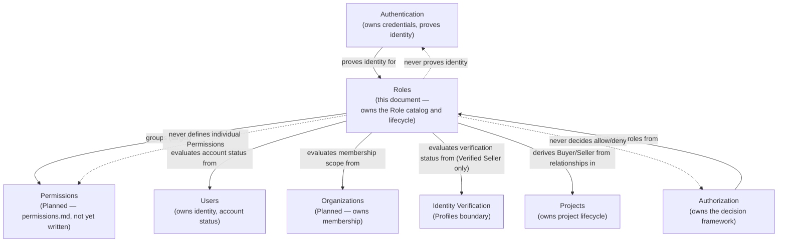
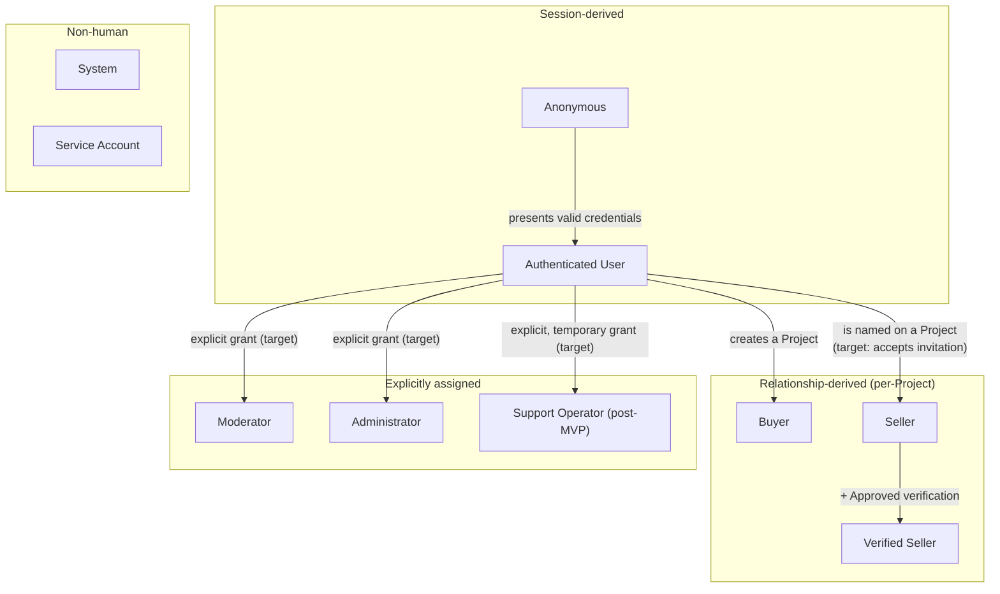
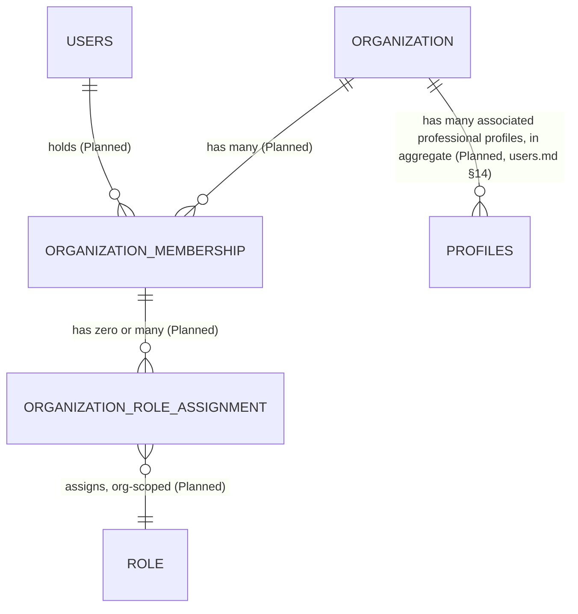
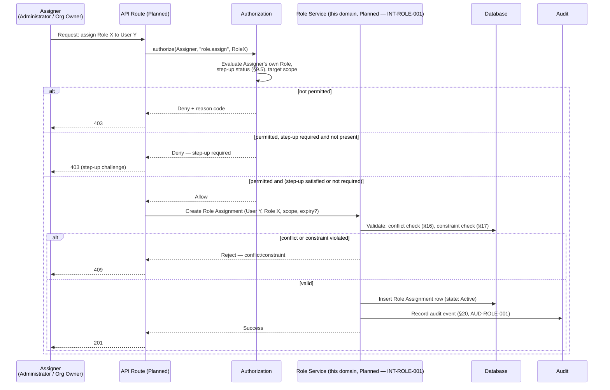
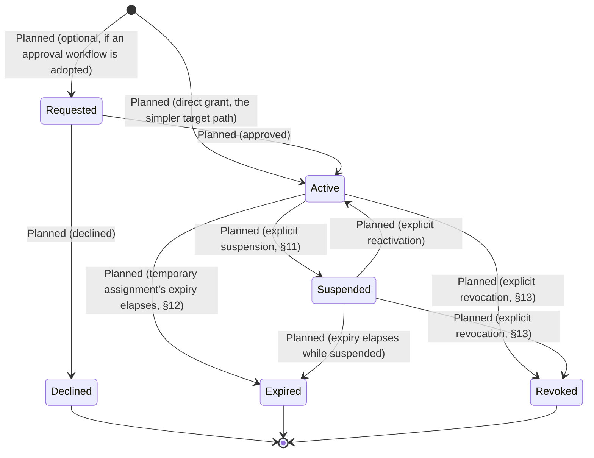
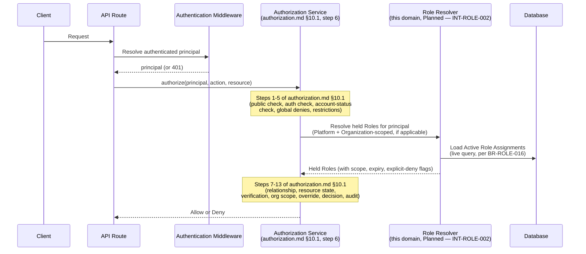
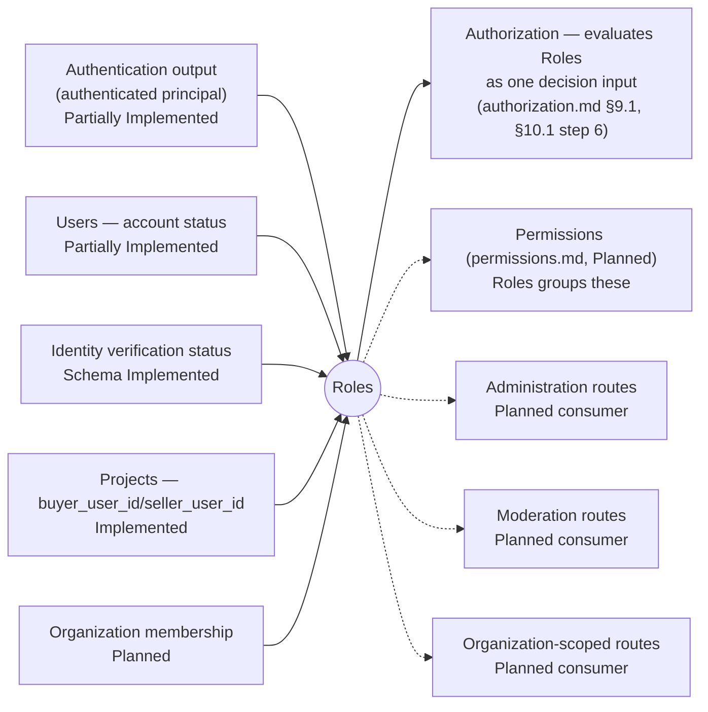
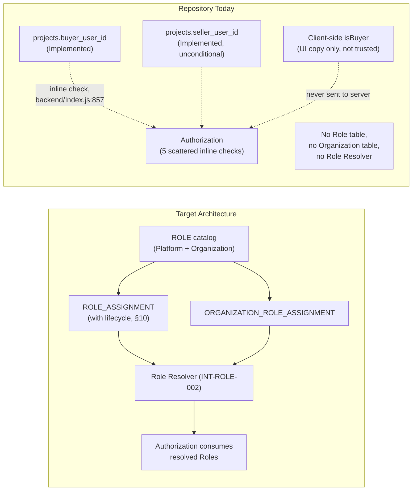
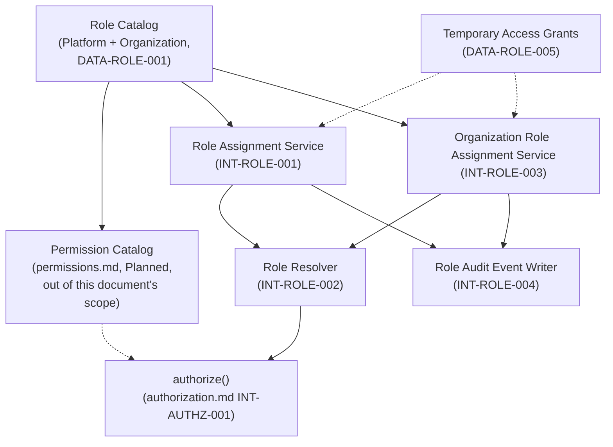

# MusicApp Roles Domain Specification

| Field | Value |
|---|---|
| Document | Roles Domain Specification |
| Domain | Roles (`02-users-roles-permissions/`) |
| Document ID | SPEC-ROLE-000 (provisional — see §4.1) |
| Type | Specification (SPEC) |
| Status | Approved |
| Version | 1.0.0 |
| Owner | Engineering (interim: repository maintainers) |
| Repository branch | `docs/specification-foundation` |
| Last updated | 2026-07-22 |
| Related documents | [`product-overview.md`](../01-foundation/product-overview.md), [`system-architecture.md`](../01-foundation/system-architecture.md), [`users.md`](users.md), [`authentication.md`](authentication.md), [`authorization.md`](authorization.md) |
| Supersedes / Superseded By | None |

This document follows [`docs/00-governance/README.md`](../00-governance/README.md) (GOV-000). It is the canonical specification for every Role in the platform — the catalog of who a User (or non-human actor) can *be*, as distinct from [`authorization.md`](authorization.md), which owns *how* a decision is evaluated once roles, relationships, and attributes are known. It converts the task's canonical role architecture into governed documentation, verifies every technical claim against the repository at time of writing, and does not silently remove or contradict any decision already made in `users.md` or `authorization.md`.

**Status taxonomy:** this document classifies every feature using the same five-value taxonomy established in [`system-architecture.md`](../01-foundation/system-architecture.md) §2.3 and reused in [`users.md`](users.md), [`authentication.md`](authentication.md), and [`authorization.md`](authorization.md) — **Implemented**, **Partially Implemented**, **Schema Implemented**, **Planned**, **Proposed** — per GOV-000 §12 (single source of truth), not redefined here. §4.3 records a deliberate terminology reconciliation regarding this taxonomy.

**How this document separates content**, consistent with `authorization.md`'s convention: **Canonical Product Decisions** are stated as definitions and rules (§6–§21, §31.1); **Repository Facts** live in §25 and in "Evidence"/"Repository Status" columns throughout; **Intentional Future Architecture** lives in §27; **Implementation Gaps** are the distance between a canonical decision and repository fact, labeled explicitly in §26; **Risks** live in §28; **Assumptions** live in §29; **Open Questions** live in §30.

## 1. Executive Summary

Roles answer one question: *"What is this actor, in terms the platform can evaluate?"* A Role is a named, stable label — Buyer, Moderator, Organization Owner — that groups capabilities and is consumed by Authorization (`authorization.md`) as one input among several (relationship, account status, resource state, verification status) when deciding whether a specific action is allowed. Roles do not decide anything themselves; Authorization owns the decision framework (`authorization.md` §5.1, §10). Roles do not define individual allowed actions; a future `permissions.md` owns the Permission catalog (`authorization.md` §3). This document owns the Role catalog, Role lifecycle, Role assignment mechanics, and the Organization Role model — the three things every prior domain document in this directory has explicitly deferred here (`users.md` §3, `authorization.md` §3, §25, §35.2).

**Verified against the repository: no Role concept exists anywhere.** A repository-wide, case-insensitive search for `role`, `permission`, `admin`, `moderat`, `support`, `organization`, and `membership` across `backend/Index.js` and every migration in `backend/db/` returns zero matches for an application-level Role concept (§25.1) — this repeats and reconfirms the identical search already performed for `authorization.md` (§30.1 of that document), now scoped specifically to Role catalog and assignment evidence rather than authorization-decision evidence. JWT claims are `sub`, `external_id`, `profile_id`, `status` (`backend/Index.js:387-400`) — no role claim is ever issued. `requireAuth` (`backend/Index.js:24-48`) is a binary authenticated/not-authenticated gate with no role check of any kind. The frontend computes `isBuyer` and derived display strings (`roleContext`, `roleLabel`, `frontend/src/App.tsx:1452-1453`, `1778-1780`) purely as client-side UI copy from `project.buyer_user_id === currentUserId` — this is an **implicit, informal role signal**, not a role system, and is never sent to or trusted by the server for any authorization purpose (§25.4, `SEC-ROLE-002`).

**This document classifies the domain overall as Planned.** Two roles already have a real, verified repository trace as *relationships* rather than as persisted, assignable Roles: Buyer and Seller (`projects.buyer_user_id`/`seller_user_id`). Every other role in this specification — including Moderator and Administrator, which `authorization.md` already discusses extensively as target architecture — has zero repository footprint.

**A deliberate reconciliation is made explicit in this document (§6.3), not left implicit:** `authorization.md` §13.2 titles its treatment of Buyer/Seller *"Project Ownership (Relationship-Based, Not Role-Based)"*, correctly distinguishing per-project relationship facts from persisted, independently assignable Roles like Moderator or Administrator. This document does not contradict that framing. Instead, it introduces a **Role Category** taxonomy (§6.3) under which Buyer and Seller are documented as *relationship-derived* Roles — real Roles for the purposes of this catalog (they group capabilities and are evaluated by Authorization) but never independently assigned, revoked, or persisted as a standalone row; their "assignment" and "removal" are fully derived from the underlying relationship. This is additive precision, not a redefinition of `authorization.md`'s relationship-based model.

**One additional target-architecture gap already recorded in `authorization.md` is directly relevant here and is carried, not re-litigated:** `SEC-AUTHZ-007` — a buyer establishes active, unconditional Seller participation with no invitation, acceptance, decline, or expiry step. From this document's role-catalog perspective, that gap means "being named Seller" and "actively holding every Seller capability" are currently the same instant, with no distinguishable pre-acceptance candidate state (§7.6).

## 2. Purpose

This document exists to define, for every actor type the platform recognizes — human and non-human, platform-scoped and organization-scoped — what that Role means, what it grants, how it is assigned and removed, how it behaves over time, and how it relates to every other Role. It is the catalog Authorization consumes (`authorization.md` §9.1 "Actor attributes... platform role, org roles... Authorization (roles, once they exist)"; §25 "the exact catalogs belong in future `roles.md` and `permissions.md` documents"). This document does not evaluate access decisions — that remains Authorization's exclusive responsibility (`authorization.md` §5.1) — and it does not define the Permission catalog — that belongs to a future `permissions.md` (`authorization.md` §3).

**Verified:** no code in the repository currently implements a Role catalog, a Role assignment record, or a Role evaluation step in any general, reusable way. The closest existing repository concepts are `projects.buyer_user_id`/`seller_user_id` (relationship columns, not Role rows) and `users.status` (account status, a different concept entirely — `users.md` §8.1).

## 3. Scope

This document covers the Roles domain: the Platform Role catalog (§7), the Organization Role catalog (§8), Role assignment (§9), Role lifecycle including activation/suspension/expiry/temporary Roles (§10–§12), revocation (§13), delegation (§14), multiplicity (§15), precedence and conflict (§16), constraints (§17), evaluation (§18), relationships to other domains (§19), and auditing (§20). It does not cover:

- **The Permission catalog** — individual named, evaluable actions. Deferred to a future `permissions.md` (`authorization.md` §3, §25). This document uses the informal term "Capabilities" in prose per Role, consistent with the task's own per-role vocabulary, and does not mint formal Permission identifiers.
- **The Authorization decision framework, evaluation pipeline, or `authorize()` function** — owned by `authorization.md` (§5.1, §10, §24). This document defines *what a Role is*; `authorization.md` defines *how a Role is used* in a decision.
- **Identity, credentials, or tokens** — owned by Users (`users.md`) and Authentication (`authentication.md`).
- **Account status, identity-verification status** — owned by Users (`users.md` §8.1, §8.2); this document consumes both (§7.7, §11) but does not redefine either.
- **Project, Escrow, Messaging, Ratings, Organization business lifecycle rules** — owned by their respective domains; this document states only the Role-relevant consequences.

### 3.1 Cross-Document Consistency Statement

This document was written after, and was checked against, `users.md` (v1.2.0), `authentication.md` (v1.2.0), and `authorization.md` (v1.1.0) in full. No objective contradiction was found that would prevent this document from being internally consistent while leaving those three documents unmodified. One terminology nuance required an explicit reconciliation, not a contradiction fix (§6.3, Buyer/Seller as relationship-derived Roles vs. `authorization.md` §13.2's "not role-based" framing) — this is resolved entirely within this document's own vocabulary (§6.3) and does not require editing `authorization.md`. Per this task's instruction, no existing specification was modified.

## 4. Terminology and Domain Boundaries

### 4.1 Identifier Governance Note

GOV-000 §11 permits the domain tokens `AUTH`, `AUTHZ`, `USERS`, `IDENTITY`, `MARKETPLACE`, `PROJECTS`, `ESCROW`, `MESSAGING`, `RATINGS`, `MODERATION`, `NOTIFICATIONS`, `ADMIN`, `ANALYTICS` for `REQ-[DOMAIN]-NNN`/`BR-[DOMAIN]-NNN` identifiers. **`ROLE` is not on that list.** This document therefore introduces `BR-ROLE-*`, `REQ-ROLE-*`, `SEC-ROLE-*`, `DATA-ROLE-*`, `INT-ROLE-*`, and `AUD-ROLE-*` as **document-local, explicitly non-governed identifier families**, using the exact precedent `authorization.md` v1.0.0 established for `AUTHZ` before GOV-000 was updated to formally permit it (`authorization.md` §4.1, v1.0.0; resolved in `authorization.md` v1.1.0 after a dedicated governance-update task). `SPEC-ROLE-000` (this document's own ID) is likewise a plain, non-governed tracking label.

**This is a gap, not an objective contradiction preventing this document's internal consistency**, and per this task's explicit instruction, this document does not modify `docs/00-governance/README.md` to resolve it. Three resolutions seem plausible, mirroring the exact options `authorization.md` §35.1 (v1.0.0) once posed for `AUTHZ`:

(a) Add `ROLE` (or `ROLES`) to GOV-000 §11's permitted domain-token list, as a sibling to `AUTH`/`AUTHZ`/`USERS` within the same `02-users-roles-permissions/` directory.
(b) Fold Role-catalog identifiers under the existing `AUTHZ` token, on the reasoning that `authorization.md` §25 already partially claimed this territory ("Roles and Permissions Integration") before deferring the catalog itself to this document.
(c) Leave it provisional indefinitely, consistent with how `product-overview.md`'s `FOUNDATION` token has remained provisional.

This is raised as a priority open question (§30) and recommended for the same kind of dedicated governance-update task that resolved `AUTHZ`.

### 4.2 Domain Terms

| Term | Owning Domain | One-line Definition |
|---|---|---|
| Role | **This document** | A named, stable label grouping Capabilities, assignable to an actor and consumed by Authorization as a decision input (§6) |
| Platform Role | **This document** | A Role whose scope is global — not tied to any single Organization (§7) |
| Organization Role | **This document** | A Role whose scope is exactly one Organization Membership (§8) |
| Role Assignment | **This document** | The record binding one actor to one held Role, with its own lifecycle (§9, §10) |
| Permission | *Undefined — target concept, `permissions.md` not yet written* (`authorization.md` §3) | A named, evaluable action on a resource type — Roles group Permissions, they do not replace them |
| Capability | **This document** (informal, prose-only) | The informal, per-Role description of what a Role's holder can typically do, used in this document in place of formal Permission identifiers, which do not yet exist |
| Actor | Authorization (conceptually), consumed here | Whoever or whatever is requesting an action — the entity a Role is assigned to or derived for (`authorization.md` §7) |
| Membership | Users/Organizations *(Planned)* — consumed by this document | The relationship binding a User to an Organization, distinct from any Role held within it (§8.1) |
| Authentication | Authentication | Proves control of an identity — see `authentication.md` |
| Authorization | Authorization | Decides whether a proven (or anonymous) actor may perform a specific action on a specific resource now — consumes Roles from this document (`authorization.md` §9.1) |

**Roles remain strictly separate from Permissions and from Authorization's decision framework.** A Role is a *label*; a Permission is an *evaluable action*; Authorization is the *decision*. This document defines the first, defers the second, and consumes neither by evaluating anything itself (§2).

### 4.3 Status Taxonomy Note

This task's brief asks Repository Verification to distinguish "Implemented, Partially Implemented, Schema Implemented, Planned, Not Implemented." The first four match the taxonomy already established as this project's single source of truth (`system-architecture.md` §2.3, GOV-000 §12), reused verbatim by every sibling document in this directory. **"Not Implemented," as used in the task brief, is treated in this document as the established taxonomy's existing "Planned" value** (for concepts canonically decided but absent from the repository, which describes nearly everything in this domain) or, where a concept is not yet a canonical decision at all, "Proposed." No sixth, competing status label is introduced. This reconciliation is a labeling choice made transparently within this document only; it does not require, and did not receive, any edit to another specification.

## 5. Ownership

### 5.1 Roles Ownership Matrix

| Concern | Owning Domain | Roles Responsibility | Non-Responsibility |
|---|---|---|---|
| Platform Role catalog | **Roles** | Owns (§7) | — |
| Organization Role catalog | **Roles** | Owns (§8) | — |
| Role assignment mechanics (grant, remove, expire, suspend) | **Roles** | Owns (§9–§13) | — |
| Role lifecycle state model | **Roles** | Owns (§10) | — |
| Role precedence, conflict, and constraint rules | **Roles** | Owns (§16, §17) | — |
| Role-to-Permission grouping semantics | **Roles** | Owns the grouping concept (§6.2) | Does not own the Permission catalog itself (`permissions.md`, future) |
| Authorization decision framework, evaluation pipeline | Authorization | Consumes Roles as one input | Roles never evaluates a request itself (`authorization.md` §5.1, §10) |
| Identity, credentials, tokens | Users, Authentication | — | Roles never proves identity |
| Account status values and transitions | Users | — | Roles consumes, never defines (§11, `users.md` §8.1) |
| Identity-verification status | Profiles / identity-verification boundary | — | Roles consumes for Verified Seller only (§7.7, `users.md` §8.2) |
| Organization membership and structure | Users/Organizations *(Planned)* | — | Roles evaluates membership scope; never owns membership itself (§8.1, `users.md` §14) |
| Permanent audit-record scope (which events require one) | Authorization | Owns the umbrella policy (`authorization.md` §26.1, `BR-AUTHZ-035`) | Roles defines its own event *content* (§20) within that umbrella, not the umbrella itself |

**Verified:** no table, migration, or code file in the repository currently implements any row in the "Roles Responsibility" column above (§25).

### 5.2 Roles Domain Relationship Diagram

*Solid arrows = Roles consumes state from, or feeds state to, that domain. Dashed arrows = an explicit non-responsibility boundary. Every domain shown except Users and Authentication is Planned or partially schema-only per `system-architecture.md`; Roles itself is Planned as a domain component, with two of its target Roles (Buyer, Seller) already real as relationships (§6.3, §7.5, §7.6).*

## 6. Role Model

### 6.1 Canonical Role Principles

| # | Principle | Elaborated In |
|---|---|---|
| 1 | Roles are distinct from Permissions. | §4.2, §6.2, `BR-ROLE-002` |
| 2 | Roles group Permissions; Permissions define Capabilities. | §6.2, `BR-ROLE-001`, `BR-ROLE-002` |
| 3 | Authorization evaluates Permissions (via Roles, relationships, and attributes) — Roles never evaluates anything itself. | §2, `authorization.md` §10 |
| 4 | Authentication establishes identity; Roles never re-proves it. | §4.2 |
| 5 | Users own identities; Roles never owns identity. | §5.1, `users.md` §5 |
| 6 | Profiles expose public identity; Roles never exposes it. | `users.md` §5.2 |
| 7 | Organization Roles are organization-scoped; Platform Roles are global. | §7, §8, `BR-ROLE-003` |
| 8 | A User may hold multiple simultaneous Roles. | §15, `BR-ROLE-004`, `BR-ROLE-005` |
| 9 | Explicit deny overrides allow across every held Role. | §16, `BR-ROLE-006` |
| 10 | Temporary Role assignment is supported. | §12, `BR-ROLE-007` |
| 11 | Support Operator remains post-MVP. | §7.10 |
| 12 | Moderator and Administrator remain independent. | §7.8, §7.9, `BR-ROLE-010` |
| 13 | Anonymous is a first-class actor. | §7.3, `BR-ROLE-011` |
| 14 | System and Service Accounts are non-human actors. | §7.11, §7.12, `BR-ROLE-012` |
| 15 | Role evaluation order must be documented. | §18, `BR-ROLE-021` |
| 16 | Role changes must be auditable. | §20, `BR-ROLE-008` |
| 17 | Current database state takes precedence over stale token claims for Role evaluation. | §18, `BR-ROLE-016` |
| 18 | Deny by default underlies every Role-gated decision, inherited from Authorization. | `authorization.md` §6.1 Principle 1 |

**Verified:** none of the above are contradicted by the repository, since none are exercised by the repository at all — every principle above describes target architecture (§25).

### 6.2 Roles vs. Permissions vs. Authorization

| Question | Owned By | Answered Here? |
|---|---|---|
| "What is this actor?" | **Roles** (this document) | Yes — §7, §8 |
| "What can this Role typically do?" (informal) | **Roles** (this document) | Yes, in prose, per Role — §7, §8 |
| "What is the exact, formally evaluable action set?" | Permissions (`permissions.md`, future) | No — deferred |
| "May this actor perform this specific action on this specific resource now?" | Authorization (`authorization.md`) | No — deferred, `authorization.md` §10 |
| "Does this actor's account status permit anything at all right now?" | Users (`users.md` §8.1) | No — consumed, not redefined |

`BR-ROLE-001`: a Role MUST NOT itself define ad hoc, one-off capabilities outside its (eventual) assigned Permission set; today, absent a Permission catalog, each Role's Capabilities are described in prose (§7, §8) as an interim, non-formal substitute. `BR-ROLE-002`: Roles are distinct from Permissions — Permissions define individual allowed actions, Roles group Permissions for convenient assignment, consistent with `authorization.md` `BR-AUTHZ-025`. Status: both Planned — no Role or Permission table exists (§25).

### 6.3 Role Categories

Not every Role in this catalog is assigned the same way. This document introduces four categories to keep that distinction precise and to reconcile this catalog with `authorization.md` §13.2's correct observation that Project participation is relationship-based, not role-based:

| Category | Definition | Example Roles | How "Assignment" Works |
|---|---|---|---|
| **Session-derived** | Held automatically based on whether a valid authenticated principal exists for the current request. Never persisted. | Anonymous, Authenticated User | Re-derived every request from `requireAuth` (or its absence) |
| **Relationship-derived** | Held automatically based on an existing relationship row owned by another domain. Never independently persisted as a Role Assignment. | Buyer, Seller, Verified Seller | Derived continuously from `projects.buyer_user_id`/`seller_user_id` (plus, for Verified Seller, identity-verification status) |
| **Explicitly assigned** | Held only via a deliberate, persisted Role Assignment record, grantable and revocable independently of any other fact. | Moderator, Administrator, Support Operator, every Organization Role | Created/removed via §9–§13's mechanisms |
| **Non-human** | Held by an automated process or machine credential, never by a human User's own login. | System, Service Account | Not "assigned" to a person at all; is the identity a process or credential runs as |

**This is additive precision, not a contradiction of `authorization.md` §13.2.** That section's claim — Project ownership is relationship-based, not role-based, in the sense of not requiring an independent Role Assignment row — remains entirely correct and is restated, not overridden, by classifying Buyer and Seller as **relationship-derived** Roles in this catalog. A relationship-derived Role is still a Role for the purposes of this document (it groups Capabilities and is a legitimate Authorization input), but it is not an *explicitly assigned* Role, and this document does not require, recommend, or imply that a `role_assignments` row should ever be created for Buyer or Seller.

## 7. Platform Roles

### 7.1 Platform Role Matrix

| Role | Category (§6.3) | Scope | Typical Actor | Assignment Mechanism | Repository Status |
|---|---|---|---|---|---|
| Anonymous | Session-derived | Global | Unauthenticated request | Automatic (absence of a valid token) | Partially Implemented (§25) |
| Authenticated User | Session-derived | Global | Any User with a valid token | Automatic (`requireAuth` success) | Implemented |
| Buyer | Relationship-derived | Per-Project | A User who created a specific Project | Automatic (`POST /projects`, server-derived) | Implemented (relationship) |
| Seller | Relationship-derived | Per-Project | A User named as counterparty on a specific Project | Automatic today (target: consent-gated, §7.6) | Implemented (relationship, unconditional) |
| Verified Seller | Relationship-derived, composite | Per-Project | A Seller with `Approved` identity verification | Fully derived — never independently assigned | Planned |
| Moderator | Explicitly assigned | Global | Platform trust & safety staff | Explicit grant by Administrator (target) | Planned |
| Administrator | Explicitly assigned | Global | Platform operations staff | Explicit grant, bootstrap process TBD (§30) | Planned |
| Support Operator | Explicitly assigned | Global, scoped/temporary | Platform support staff | Explicit, temporary grant (target) | Planned, explicitly post-MVP |
| System | Non-human | Global | The platform itself (scheduled/automated processes) | N/A — not assigned to a person | Planned |
| Service Account | Non-human | Global or scoped (undecided) | A machine credential (internal service, future API consumer) | Explicit creation by Administrator (target) | Planned |

### 7.2 Platform Role Hierarchy Diagram

*This is not a privilege-escalation hierarchy — no arrow implies inheritance of capability. It shows how a User arrives at each Role. `MOD` and `ADMIN` are drawn independently (no arrow between them), consistent with `authorization.md` `BR-AUTHZ-034`: neither is a superset or subset of the other. `SYS` and `SVC` are deliberately disconnected from the human subgraphs — no human Role transitions into a non-human one.*

### 7.3 Anonymous

| Field | Definition |
|---|---|
| Purpose | Represents any request with no authenticated principal — the default actor for public and pre-authentication interactions. |
| Responsibilities | None. |
| Capabilities | **Target:** read explicitly public resources, principally public Profile discovery (`authorization.md` §21, `BR-AUTHZ-021`/`BR-AUTHZ-033`). **Repository-current:** liveness/health checks only (`GET /`, `GET /db-health`); every business route either requires `requireAuth` or is an unauthenticated defect (§25.4), never an intentional Anonymous-role grant. |
| Restrictions | MUST NOT access any authenticated-only or private resource; mutually exclusive with every other Role — an actor is Anonymous or Authenticated User, never both, for a given request. |
| Assignment Rules | Automatic — the default state for any request lacking a valid bearer token. Not "assigned" in a persisted sense; it is the absence of a Role Assignment. |
| Removal Rules | N/A — ceases the instant a valid token is presented for that request (transitions to Authenticated User, §7.4). |
| Lifecycle | Request-scoped only; never persisted; re-evaluated on every single request. |
| Relationships | Precedes Authenticated User in Authorization's canonical evaluation order (`authorization.md` §10.1, steps 1–2); consumes no account state. |
| Security Implications | Deny-by-default applies maximally to this Role. `SEC-AUTHZ-008` (`authorization.md` §29.1 — `GET /profiles` requires authentication though public discovery is canonical target) directly concerns this Role's target Capability. |
| Repository Status | Partially Implemented — health-check routes are genuinely, intentionally anonymous. No business route grants any anonymous Capability by design; the three unauthenticated business routes (`POST /users`, `GET /users`, `POST /profiles`) are confirmed defects (`authorization.md` `SEC-AUTHZ-001`/`003`, carried from `authentication.md` `SEC-AUTH-008`), not intentional Anonymous-role grants — see §25.4 for the distinction. |

### 7.4 Authenticated User

| Field | Definition |
|---|---|
| Purpose | The baseline Role for any actor holding a valid, unexpired access token. |
| Responsibilities | None beyond ordinary platform conduct. |
| Capabilities | Read own record (`GET /auth/me`); discover other Profiles (`GET /profiles`); create and list own Projects; every Capability not gated behind a higher Role. |
| Restrictions | Cannot act on another User's private resources without an explicit relationship (`authorization.md` §4.2); subject to account-status gating, though this is mostly unenforced today (`authorization.md` `SEC-AUTHZ-002`). |
| Assignment Rules | Automatic upon successful authentication (login or signup) — derived entirely from JWT validity, not a persisted Role Assignment row. |
| Removal Rules | Token expiry; logout (Planned, `authentication.md` §14); or `auth_version` invalidation (`authentication.md` §12, `authorization.md` §9.4). |
| Lifecycle | Session-scoped; re-derived per request via `requireAuth`. |
| Relationships | The base Role every other human Platform Role in this catalog is layered on top of (Buyer, Seller, Moderator, Administrator, Support Operator all require this first). |
| Security Implications | `requireAuth` is a JWT-signature/expiry check only, with no live database status re-check on 4 of 6 authenticated routes (`authentication.md` `SEC-AUTH-002`, `authorization.md` `SEC-AUTHZ-002`) — a Suspended or Deleted User's Authenticated User Role is not reliably revoked mid-session today. |
| Repository Status | Implemented — `req.auth`, `backend/Index.js:24-48`. |

### 7.5 Buyer

| Field | Definition |
|---|---|
| Purpose | The platform participant who initiates and funds a commercial Project. |
| Responsibilities | Define Project scope, price, and milestones; (target) fund escrow; (target) approve delivered milestones; (target) rate the Seller. |
| Capabilities | Create a Project as buyer (server-derived identity); lock own Project's milestones; read own Projects; (target) fund escrow, approve delivery. |
| Restrictions | Cannot simultaneously be Seller on the same Project (`projects_no_self_dealing`, `BR-ROLE-020`); cannot access another Buyer's non-participant Projects (`GET /projects` is correctly scoped, `authorization.md` §23). |
| Assignment Rules | Relationship-derived (§6.3) — becomes Buyer on a specific Project the instant `POST /projects` succeeds, with `buyer_user_id` server-derived from `req.auth.sub` and never client-suppliable (`backend/Index.js:704`). No standalone "assign Buyer" action exists or is needed (`BR-ROLE-013`). |
| Removal Rules | Relationship-derived — ends only when the Project itself reaches a terminal state, or (exceptionally) via an administrative reassignment mechanism that does not exist today. No route ever changes `buyer_user_id` after creation. |
| Lifecycle | Bound to the lifecycle of the specific Project (`product-overview.md` §10.2); a User is simultaneously Buyer on zero, one, or many Projects (§15). |
| Relationships | Requires Authenticated User; mutually exclusive with Seller on the same Project; cross-ref `authorization.md` §13.2, §14. |
| Security Implications | Buyer identity cannot be spoofed by a client — a verified positive finding (`backend/Index.js:704`, `authorization.md` §1). No account-status gate exists on Project creation (`authorization.md` `SEC-AUTHZ-002`). |
| Repository Status | Implemented, as a relationship — `projects.buyer_user_id`. Planned, as a formal Role-catalog entry with independently manageable Capabilities beyond the raw relationship. |

### 7.6 Seller

| Field | Definition |
|---|---|
| Purpose | The platform participant invited into a Project as counterparty to perform the work. |
| Responsibilities | Deliver work; (target) explicitly accept or decline the invitation before becoming an active participant. |
| Capabilities | Read own Projects (as seller); (target) deliver milestones; (target, via Verified Seller, §7.7) receive escrow release. |
| Restrictions | Cannot simultaneously be Buyer on the same Project; **today, has no opt-in step before being named** — a confirmed target-architecture gap already recorded as `authorization.md` `SEC-AUTHZ-007`, carried here rather than re-litigated. |
| Assignment Rules | **Target:** relationship-derived AND consent-gated — the Seller Role is held only after the named User explicitly accepts an invitation or proposal (`authorization.md` §13.2, `BR-AUTHZ-032`; this document's `BR-ROLE-014`). **Current repository behaviour:** relationship-derived and unconditional — `seller_user_id` is client-supplied by the buyer, database-validated (must exist, must be `active`, `backend/Index.js:679-689`), and grants full active participation immediately, with no acceptance step of any kind. |
| Removal Rules | **Target:** declining before acceptance ends candidacy with no Role ever having been held; after acceptance, ends with the Project's terminal state. **Current:** no removal path exists at all — a named Seller cannot decline, and remains named for the life of the Project row. |
| Lifecycle | Same Project-bound lifecycle as Buyer, plus, in the target model, a pre-acceptance candidate state before becoming an active Seller (§10.2, §12). |
| Relationships | Requires Authenticated User; mutually exclusive with Buyer on the same Project; composes into Verified Seller (§7.7) when combined with `Approved` identity verification. |
| Security Implications | `SEC-AUTHZ-007` (`authorization.md` §29.1) directly concerns this Role — a User can be committed as Seller with no consent, funding/work-commencement rules built on today's semantics would need revisiting once acceptance exists. |
| Repository Status | Implemented, as an unconditional relationship — `projects.seller_user_id`, `backend/Index.js:679-689`. Planned, as the consent-gated target model. |

### 7.7 Verified Seller

| Field | Definition |
|---|---|
| Purpose | A Seller whose identity has passed verification, making them eligible for trust-sensitive Capabilities — principally, being a valid escrow-release beneficiary. |
| Responsibilities | Maintain valid, non-expired, non-revoked verification (`users.md` §8.2). |
| Capabilities | Everything Seller (§7.6) can do, plus (target): be a valid escrow-release beneficiary (`authorization.md` `BR-AUTHZ-010`). |
| Restrictions | An unverified, or previously-`Approved`-but-now-`Expired`/`Revoked`, Seller immediately loses Verified Seller Capabilities — this is a continuously re-evaluated condition, never a one-time grant (`authorization.md` `BR-AUTHZ-006`). |
| Assignment Rules | Fully derived, never independently assigned (`BR-ROLE-015`) — Verified Seller = Seller (§7.6) **and** identity-verification status `Approved` (`users.md` §8.2). There is no "grant Verified Seller" action separate from the identity-verification review outcome. |
| Removal Rules | Fully derived — ceases the instant either condition breaks: verification `Expires` or is `Revoked` (`users.md` §8.2), or the underlying Seller relationship ends (§7.6). |
| Lifecycle | Continuously re-evaluated, not a persisted state of its own; tracks the union of the Seller relationship lifecycle (§7.6) and the identity-verification lifecycle (`users.md` §8.2 state diagram). |
| Relationships | Composite of Seller (§7.6) and identity-verification status; consumed by Escrow release authorization (`authorization.md` §15). |
| Security Implications | The gate protecting payout eligibility. If evaluated against stale or cached verification status rather than current state, an unverified Seller could receive funds — cross-ref `authorization.md` `BR-AUTHZ-006`, `BR-AUTHZ-010`. |
| Repository Status | Planned — no route checks `profile_verifications.status` for any purpose (`users.md` §13.3); no escrow-release route exists to consume this Role at all. |

### 7.8 Moderator

| Field | Definition |
|---|---|
| Purpose | Enforces platform trust & safety policy through explicit moderation actions. |
| Responsibilities | Review reported content; apply restrictions; escalate cases (all target/future, `authorization.md` §20). |
| Capabilities | Moderation-scoped actions only. Per `authorization.md` §20, MUST NOT automatically: change financial records, release escrow, alter credentials, assign platform-administrator permissions, fabricate ratings, or bypass immutable audit history. |
| Restrictions | Independent of Administrator (§7.9) — does not inherit administrative authority (`authorization.md` `BR-AUTHZ-034`); no financial authority by default. |
| Assignment Rules | Explicitly assigned (§6.3) — target: explicit grant by an authorized Administrator (or the bootstrap process, §30), auditable (§9, §20), via the future Role Assignment mechanism (§9). No self-assignment. |
| Removal Rules | Target: explicit, auditable revocation by an authorized Administrator; effective immediately, no grace period specified. |
| Lifecycle | Persistent platform Role once granted, until explicitly revoked; may be time-limited (§12, Temporary Roles). |
| Relationships | Requires Authenticated User; independent of Administrator; consumes Moderation domain case data (Planned, `system-architecture.md` §10.11). |
| Security Implications | `authorization.md` `BR-AUTHZ-034` (independence from Administrator); assignment/removal falls within Authorization's step-up scope (`authorization.md` §9.5, item 8 — "Assigning or removing a high-privilege platform role") — this document's `BR-ROLE-017`. |
| Repository Status | Planned — zero repository footprint; `moderat` returns zero matches repository-wide (§25.1). |

### 7.9 Administrator

| Field | Definition |
|---|---|
| Purpose | Platform-wide operational authority, explicit and audited. |
| Responsibilities | Suspend/restrict Users; review verification outcomes; investigate disputes; manage Role assignments (all target, `authorization.md` §19). |
| Capabilities | Platform-wide but explicit and audited (`authorization.md` §19) — every administrative Capability requires explicit permission; does not automatically receive financial authority (`authorization.md` `BR-AUTHZ-012`). |
| Restrictions | Independent of Moderator (`authorization.md` `BR-AUTHZ-034`); must not see credentials (`authentication.md` §19.2); administrative UI visibility is not authorization — backend enforcement is mandatory. |
| Assignment Rules | Explicitly assigned. Target: granted by an existing Administrator, or via a bootstrap process for the first Administrator (open question, §30), requiring step-up authentication (`authorization.md` §9.5, item 8), auditable. |
| Removal Rules | Target: explicit, auditable revocation; step-up authentication required. |
| Lifecycle | Persistent until revoked; may be time-limited (§12). |
| Relationships | Requires Authenticated User; independent of Moderator; consumes the Administration domain (Planned, `system-architecture.md` §10.12). |
| Security Implications | The highest-privilege Platform Role in this catalog. Assignment/removal is explicitly within Authorization's step-up scope (`authorization.md` `BR-AUTHZ-031`, item 8). Segregation-of-duties for Administrator grants is a carried open question (`authorization.md` §35.2, item 9; this document's §30). |
| Repository Status | Planned — zero repository footprint; no application-level "admin" concept exists anywhere (§25.1). |

### 7.10 Support Operator (Future)

| Field | Definition |
|---|---|
| Purpose | Explicitly scoped, time-limited operational support access. |
| Responsibilities | Inspect/assist with explicitly permitted information only (future, `authorization.md` §7.1). |
| Capabilities / Restrictions | Per `authorization.md` §7.1's canonical decision (carried, not re-decided here): least privilege, scoped access, masked data where appropriate, no credential access, no unrestricted financial authority, no silent impersonation, reason and audit required, temporary access preferred where practical. |
| Assignment Rules | Explicitly assigned, target: a temporary, scoped grant (§12) with an explicit, mandatory reason. |
| Removal Rules | Automatic expiry preferred (§12); explicit revocation always available. |
| Lifecycle | Inherently temporary by design principle, even before an exact duration is decided (§30). |
| Relationships | Requires Authenticated User; independent of Moderator/Administrator — may overlap in Capability scope with either but is not a subset of them. |
| Security Implications | Detailed permissions remain deferred until operational requirements exist (`authorization.md` §7.1); this document does not invent them. |
| Repository Status | Planned, explicitly post-MVP — this is a canonical decision already resolved in `authorization.md` (§35.1, item 7) and carried here without re-opening it. Zero repository footprint. |

### 7.11 System

| Field | Definition |
|---|---|
| Purpose | Represents the platform itself acting autonomously — scheduled jobs, automated lifecycle transitions, retention-policy enforcement — with no human or external credential behind the action. |
| Responsibilities | Execute only specific, approved automated processes (e.g., `users.md` `BR-USERS-017`'s retention-policy `Deleted → Archived` transition). |
| Capabilities | Whatever specific automated processes are explicitly approved elsewhere; this document does not invent new automated business logic. Every System-initiated action is fully audited (§20). |
| Restrictions | MUST NOT be used as a generic bypass for checks that would otherwise apply to a human actor; every System-initiated action MUST be traceable to a specific, named, approved process. |
| Assignment Rules | N/A — not assigned to a person; it is the identity a scheduled or automated process runs as. |
| Removal Rules | N/A. |
| Lifecycle | Exists for the duration of the platform's operation; not a per-User concept. |
| Relationships | Distinct from Service Account (§7.12) — System represents internal, first-party automation; Service Account represents a credentialed, potentially external, machine identity. |
| Security Implications | A poorly-scoped System actor is a privilege-escalation risk — an attacker able to trigger a System-labeled code path would inherit its authority. Every System action must be logged with the specific triggering process identified (§20). |
| Repository Status | Planned — no scheduled-job runner, cron mechanism, or background-worker process exists anywhere in the repository; `backend/package.json` lists no such dependency (§25.1). |

### 7.12 Service Account (Future)

| Field | Definition |
|---|---|
| Purpose | A non-human, credentialed identity for machine-to-machine access — an internal service, a future public API consumer, or an integration partner. |
| Responsibilities | Operate strictly within its issued credential's scope (mechanism undecided). |
| Capabilities / Restrictions | Per `authorization.md` §7.1 (carried, not re-decided): "must not be treated as an ordinary human User without an explicit architecture decision"; exact scope and mechanism undecided. |
| Assignment Rules | Explicitly assigned, target: explicit creation by an Administrator, with scoped credential issuance (mechanism undecided, `authentication.md` §27). |
| Removal Rules | Target: explicit revocation or credential rotation. |
| Lifecycle | Independent of any human User's lifecycle. |
| Relationships | Distinct from System (§7.11); requires its own authentication mechanism, not yet decided (`authentication.md` §27, §30). |
| Security Implications | Must not inherit human-User assumptions (no email/phone requirement, no password); credential-compromise blast radius must be explicitly scoped. |
| Repository Status | Planned — explicitly deferred (`authentication.md` §27; `users.md` §15.2, "Should service accounts exist?" remains open). `authorization.md` §7.1 already carries this as a conceptual actor row; this document formalizes it as a catalog entry without resolving whether it will exist. |

## 8. Organization Roles

### 8.1 Membership vs. Role Assignment

**Canonical decision, carried directly from `authorization.md` §18 (v1.1.0): Membership and Role Assignment are separate concepts.** The canonical model is `Organization Membership → many Organization Role Assignments`. A User's Membership in an Organization is the fact of belonging; a Role Assignment is a specific, independently revocable grant of authority within that Membership. A User may hold a Membership with zero Role Assignments (e.g., pending role assignment, or a Membership that has been fully de-privileged without being removed). This document does not restate `authorization.md` §18's rules (independent revocability, expiry, org-scoping, combined-permission evaluation with explicit-deny override, historical attribution, membership-removal-terminates-authority) — they are the single source of truth (GOV-000 §12) and are cross-referenced here, not redefined.

`BR-ROLE-003`: Organization Roles are scoped to exactly one Organization Membership and confer no authority outside that Organization (cross-ref `authorization.md` `BR-AUTHZ-016`/`017`). `BR-ROLE-019`: every Organization Role Assignment MUST record which Organization it is scoped to; a Role Assignment with no Organization scope MUST be treated as a Platform Role (§7), never as an implicit organization-wide grant.

### 8.2 Organization Membership Relationship Diagram

*Extends, and does not redefine, `authorization.md` §18.1 and `users.md` §6's Organization diagrams. `ORGANIZATION_MEMBERSHIP` and `ORGANIZATION_ROLE_ASSIGNMENT` are drawn as separate entities specifically to make the Membership/Role-Assignment separation (§8.1) structurally explicit — a Membership can exist with zero Role Assignment rows. `ROLE` is the same conceptual catalog entity referenced by Platform Role Assignments (§21) — this document does not introduce a second, incompatible Role entity for the organization-scoped case.*

### 8.3 Organization Role Matrix

| Role | Purpose Summary | Manages Membership? | Manages Billing? | Manages Projects? | Manages Org Finances? | Repository Status |
|---|---|---|---|---|---|---|
| Organization Owner | Full authority over the Organization | Yes | Yes | Yes | Yes | Planned |
| Organization Administrator | Day-to-day organization operations | Yes | No | Yes | No | Planned |
| Billing Manager | Manages the org's own platform billing/payment methods | No | Yes | No | No | Planned |
| Project Manager | Creates/manages Projects on the org's behalf | No | No | Yes | No | Planned |
| Finance Manager | Manages org-owned Projects' financial actions (funding, release approval) | No | No | No | Yes | Planned |
| Member | Baseline org participant | No | No | Only assigned Projects | No | Planned |
| Viewer | Read-only org-scoped access | No | No | No (read-only) | No | Planned |

**Note on "Administrator" naming collision:** Organization Administrator (this section, org-scoped) and Administrator (§7.9, platform-scoped) are deliberately distinct Roles sharing a similar name for readability. Holding one MUST NOT be inferred to grant the other (`BR-ROLE-023`, cross-ref `authorization.md` `BR-AUTHZ-017`).

### 8.4 Organization Owner

| Field | Definition |
|---|---|
| Purpose | Full authority over the Organization; the Role an Organization cannot exist without. |
| Responsibilities | Ultimate accountability for the Organization's membership, billing, projects, and finances. |
| Capabilities | Everything every other Organization Role can do; assign/remove any Organization Role including other Owners; delete or transfer the Organization (target). |
| Restrictions | Does not gain platform Administrator authority (`BR-ROLE-023`); cannot be removed while being the Organization's last remaining Owner (`BR-ROLE-022`). |
| Assignment Rules | Implicitly held by whoever creates the Organization (target); thereafter, may be granted by an existing Owner. |
| Removal Rules | May be removed only if at least one other Owner remains, or by transferring ownership first (`BR-ROLE-022`). |
| Lifecycle | Persistent; typically long-lived for the Organization's existence. |
| Relationships | Requires an Organization Membership (§8.1); independent of every Platform Role (§7). |
| Security Implications | Highest-privilege Organization Role; assignment/removal of financial authority within this scope intersects with Authorization's step-up scope where it grants financial administrative permission (`authorization.md` §9.5, item 9). |
| Repository Status | Planned — no Organization schema exists anywhere (§25.1). |

### 8.5 Organization Administrator

| Field | Definition |
|---|---|
| Purpose | Day-to-day operational authority within the Organization, short of full Owner authority. |
| Responsibilities | Manage Membership and Role Assignments within the Organization; manage org Projects. |
| Capabilities | Add/remove Members; assign Organization Roles other than Owner; manage org Projects. |
| Restrictions | Cannot remove the last Owner (`BR-ROLE-022`); does not gain platform Administrator authority (`BR-ROLE-023`); does not manage billing or org finances by default (§8.3). |
| Assignment Rules | Explicitly assigned by an Owner or another Organization Administrator. |
| Removal Rules | Explicit, auditable revocation by an Owner or another Organization Administrator. |
| Lifecycle | Persistent until revoked; may be time-limited (§12). |
| Relationships | Requires an Organization Membership; subordinate to Organization Owner within the same Organization. |
| Security Implications | A compromised Organization Administrator could remove Members or reassign Project Manager/Finance Manager roles within the org — blast radius is scoped to one Organization (`BR-ROLE-003`). |
| Repository Status | Planned — no Organization schema exists anywhere (§25.1). |

### 8.6 Billing Manager

| Field | Definition |
|---|---|
| Purpose | Manages the Organization's own platform billing and payment-method details. |
| Responsibilities | Maintain valid payment methods for the org's own platform usage (e.g., subscription, invoicing — distinct from Project-level escrow funding, §8.8). |
| Capabilities | View/update the org's billing details; view invoices/receipts for the org's own platform account. |
| Restrictions | Does not manage Project-level escrow funding or release (that is Finance Manager, §8.8); does not manage Membership. |
| Assignment Rules | Explicitly assigned by an Owner or Organization Administrator. |
| Removal Rules | Explicit, auditable revocation. |
| Lifecycle | Persistent until revoked; may be time-limited (§12). |
| Relationships | Requires an Organization Membership; distinct from, and does not overlap with, Finance Manager (§8.8) by design, though one User may hold both (§15). |
| Security Implications | Grants access to the org's own payment-method data — a target-architecture financial-adjacent role; assignment may intersect with Authorization's step-up scope if it grants a financial administrative permission (`authorization.md` §9.5, item 9). |
| Repository Status | Planned — no Organization or billing schema exists anywhere (§25.1). |

### 8.7 Project Manager

| Field | Definition |
|---|---|
| Purpose | Creates and manages Projects on the Organization's behalf. |
| Responsibilities | Act as Buyer or Seller (§7.5, §7.6) in an org-context Project; manage milestone definitions. |
| Capabilities | Create org-context Projects; lock milestones; the same per-Project Capabilities an individual Buyer/Seller holds, exercised on the org's behalf. |
| Restrictions | Does not manage org billing, finances, or Membership by default. |
| Assignment Rules | Explicitly assigned by an Owner or Organization Administrator. |
| Removal Rules | Explicit, auditable revocation. |
| Lifecycle | Persistent until revoked; may be time-limited (§12). |
| Relationships | Requires an Organization Membership; composes with Buyer/Seller (§7.5, §7.6) when acting on a specific org-context Project. |
| Security Implications | Can commit the Organization to commercial Project terms; scoped to Projects, not org finances directly. |
| Repository Status | Planned — no Organization schema, and no concept of an org-context Project (as opposed to an individual one), exists anywhere (§25.1). |

### 8.8 Finance Manager

| Field | Definition |
|---|---|
| Purpose | Manages the Organization's org-owned Projects' financial actions — funding escrow, approving releases — on the Organization's behalf. |
| Responsibilities | Authorize funding and release decisions for org-owned Projects, subject to the same rules an individual Buyer/Seller would face (`authorization.md` §15). |
| Capabilities | Fund escrow for org Projects (target); approve milestone release for org Projects (target). |
| Restrictions | Does not manage org billing/payment-method details (that is Billing Manager, §8.6); every fund-release action remains subject to Authorization's financial rules regardless of Role (`authorization.md` `BR-AUTHZ-008`, `BR-AUTHZ-012`, `BR-AUTHZ-013`). |
| Assignment Rules | Explicitly assigned by an Owner; likely a step-up-gated grant given its financial nature (`authorization.md` §9.5, item 9). |
| Removal Rules | Explicit, auditable, step-up-gated revocation. |
| Lifecycle | Persistent until revoked; may be time-limited (§12). |
| Relationships | Requires an Organization Membership; distinct from Billing Manager (§8.6); composes with Project Manager (§8.7) when the same User holds both. |
| Security Implications | The highest-financial-risk Organization Role; grant/removal is within Authorization's step-up scope (`authorization.md` `BR-AUTHZ-031`, item 9 — "Granting a financial administrative permission"). |
| Repository Status | Planned — no Organization or org-level financial schema exists anywhere (§25.1). |

### 8.9 Member

| Field | Definition |
|---|---|
| Purpose | Baseline participant within an Organization, with no management authority by default. |
| Responsibilities | Participate in assigned Projects or tasks within the org's scope. |
| Capabilities | Whatever is explicitly granted via additional Role Assignments (§15); by itself, Member grants read access to org-scoped, non-financial, non-membership information. |
| Restrictions | Cannot manage Membership, billing, or org finances by default; cannot create org Projects unless also holding Project Manager (§8.7). |
| Assignment Rules | Explicitly assigned — typically the default Role granted alongside a new Membership. |
| Removal Rules | Explicit revocation, or automatic upon Membership removal (`authorization.md` `BR-AUTHZ-019`, `BR-ROLE-009`). |
| Lifecycle | Persistent for the duration of the Membership, unless separately revoked. |
| Relationships | Requires an Organization Membership; the floor every other Organization Role is layered on top of, by convention (not a strict prerequisite — `authorization.md` §18 does not require Member specifically before another Organization Role can be granted). |
| Security Implications | Lowest-privilege Organization Role; minimal blast radius. |
| Repository Status | Planned — no Organization schema exists anywhere (§25.1). |

### 8.10 Viewer

| Field | Definition |
|---|---|
| Purpose | Read-only, org-scoped access — for stakeholders who need visibility without any mutation authority. |
| Responsibilities | None beyond ordinary read access. |
| Capabilities | Read org-scoped Projects, Membership list (view-only), and non-financial org information. |
| Restrictions | Cannot mutate anything; cannot view billing/financial detail unless also separately granted Billing Manager or Finance Manager. |
| Assignment Rules | Explicitly assigned by an Owner or Organization Administrator. |
| Removal Rules | Explicit revocation, or automatic upon Membership removal. |
| Lifecycle | Persistent until revoked; may be time-limited (§12). |
| Relationships | Requires an Organization Membership; may be combined with any other Organization Role, though doing so is typically redundant (Viewer's Capabilities are a subset of every other Organization Role's). |
| Security Implications | Lowest-risk Organization Role; useful for auditors, investors, or external stakeholders needing visibility without authority. |
| Repository Status | Planned — no Organization schema exists anywhere (§25.1). |

## 9. Role Assignment

### 9.1 Role Assignment Matrix

| Role | Scope | Who Can Assign | Who Can Be Assigned | Step-Up Required? | Repository Status |
|---|---|---|---|---|---|
| Anonymous | Platform | N/A (automatic) | N/A | No | Partially Implemented |
| Authenticated User | Platform | N/A (automatic) | Any User who authenticates | No | Implemented |
| Buyer | Per-Project | N/A (automatic, self, via `POST /projects`) | The requesting Authenticated User | No | Implemented (relationship) |
| Seller | Per-Project | Buyer (target: subject to Seller's own acceptance) | Any eligible, `active` User named by the Buyer | No (today); Planned re-evaluation once step-up scope is finalized for financial-adjacent grants | Implemented (relationship, unconditional) |
| Verified Seller | Per-Project | N/A (fully derived) | N/A (fully derived) | N/A | Planned |
| Moderator | Platform | Administrator | Any Authenticated User | Yes (`authorization.md` §9.5, item 8) | Planned |
| Administrator | Platform | Administrator (or bootstrap process, §30) | Any Authenticated User | Yes | Planned |
| Support Operator | Platform | Administrator | Any Authenticated User | Yes (assigning a high-privilege role) | Planned, post-MVP |
| System | Platform | N/A | N/A | N/A | Planned |
| Service Account | Platform/scoped | Administrator | N/A (machine credential, not a User) | Yes (target) | Planned |
| Organization Owner | Organization | Existing Organization Owner (or implicit at org creation) | Any Authenticated User (target) | Recommended, undecided (§30) | Planned |
| Organization Administrator | Organization | Organization Owner or Administrator | Any org Member | Recommended, undecided | Planned |
| Billing Manager | Organization | Organization Owner or Administrator | Any org Member | Recommended (financial-adjacent) | Planned |
| Project Manager | Organization | Organization Owner or Administrator | Any org Member | No | Planned |
| Finance Manager | Organization | Organization Owner | Any org Member | Yes (`authorization.md` §9.5, item 9) | Planned |
| Member | Organization | Organization Owner or Administrator | Any User with an Organization Membership | No | Planned |
| Viewer | Organization | Organization Owner or Administrator | Any org Member | No | Planned |

`BR-ROLE-017`: assigning or removing a high-privilege Platform Role (Moderator, Administrator) MUST require step-up authentication (cross-ref `authorization.md` `BR-AUTHZ-031`, §9.5). Status: Planned.

### 9.2 Role Assignment Flow Diagram

*Entirely target architecture — no Role Assignment route, service, or table exists in the repository (§25). Shown per canonical target design, explicitly labeled as such, consistent with `authorization.md` §15.1/§24.2's convention for target-only sequence diagrams.*

## 10. Role Lifecycle

### 10.1 Role Lifecycle Matrix

| Stage | Definition | Entry Trigger | Exit Trigger | Repository Status |
|---|---|---|---|---|
| Requested (Proposed) | An assignment has been requested but not yet approved — only relevant if an approval workflow is adopted (§30, open question). | Assigner or self-request submitted | Approved → Active, or Declined → terminal | Proposed — not a canonical decision either way |
| Active | The Role Assignment is in effect and its Capabilities are exercisable. | Direct grant, or Requested → Approved | Suspension, expiry, or revocation | Planned |
| Suspended | The Role Assignment exists but is temporarily non-exercisable, without being revoked. | Explicit suspension action (§11) | Reactivation → Active, or Revocation → Revoked | Planned |
| Expired | A temporary Role Assignment's explicit expiry has passed. | Time-based, automatic (§12) | Terminal — a new assignment must be created; no automatic return to Active | Planned |
| Revoked | The Role Assignment has been explicitly and permanently ended. | Explicit revocation action (§13) | Terminal | Planned |

**Design principle (consistent with `users.md` §8's precedent of never silently reusing one row across independent lifecycles):** Expired and Revoked are both terminal for that specific Role Assignment row. Re-granting the same Role to the same actor creates a new Role Assignment, preserving the full history of the prior one — mirroring the append-only philosophy `users.md` `BR-USERS-012` established for identity-verification attempts.

### 10.2 Role Lifecycle State Diagram

*This diagram intentionally contains no `Expired → Active` or `Revoked → Active` edge — both are terminal by design (§10.1). `Requested` and `Declined` are drawn as Planned-but-optional, since whether an approval workflow precedes direct grants is a genuine open question (§30) not resolved by any canonical decision to date. This state machine governs a Role Assignment record, not the underlying User's account status (`users.md` §8.1) or identity-verification status (`users.md` §8.2), which remain separate, independently-governed systems.*

## 11. Activation, Suspension, and Expiry

`BR-ROLE-016`: Role evaluation MUST consume current database state — an Active Role Assignment row, checked live — never a stale token claim, consistent with `authorization.md` `BR-AUTHZ-002` applied to Roles specifically. Status: Planned — no Role Assignment row exists to evaluate (§25).

Suspension of a Role Assignment is distinct from suspension of the underlying User's account (`users.md` §8.1's `Suspended` account status). A User's account may be fully `Active` while one specific Role Assignment is independently `Suspended` (e.g., a Moderator temporarily stood down pending review, without disabling their platform access entirely) — this is the same "separate, independently-governed lifecycles" principle `users.md` §8.3 established between account status and identity-verification status, applied a third time here.

Expiry (§10.1) applies specifically to Temporary Roles (§12); a Role Assignment with no expiry set is permanent until explicitly suspended or revoked.

## 12. Temporary Roles

**Canonical decision, maintained:** temporary Role assignment is supported. A Role Assignment MAY carry an explicit expiry timestamp; upon reaching it, the assignment transitions to `Expired` (§10.1, §10.2) without requiring a separate revocation action.

`BR-ROLE-007`: a Role Assignment MAY be temporary, carrying an explicit expiry; upon expiry, the assignment MUST cease to grant Capability without requiring an explicit revocation action. Status: Planned.

Support Operator (§7.10) is the Role most likely to default to temporary assignment, per its own canonical principle ("temporary access preferred where practical," `authorization.md` §7.1). Every other Role MAY also be temporary — this is a general mechanism, not one scoped to a single Role. The exact maximum permitted duration for any temporary grant is not decided here — carried as an open question from `authorization.md` §35.2, item 10, and restated in this document's own §30.

## 13. Role Revocation

`BR-ROLE-008` (partial — see §20 for the full audit statement): every Role Assignment revocation MUST be attributable to an acting actor (or System, §7.11) and MUST be audited.

Revocation is immediate and terminal (§10.1, §10.2) — a revoked Role Assignment does not return to `Active`; a new Role Assignment must be created if the Role is granted again, preserving full history. Revocation of a high-privilege Platform Role (Moderator, Administrator) requires step-up authentication (§9.1, `BR-ROLE-017`). Revocation of the last Organization Owner is prohibited (`BR-ROLE-022`, §8.4) unless a successor Owner is assigned first, in the same operation or immediately prior.

Removing an Organization Membership entirely (as opposed to one specific Role Assignment within it) MUST immediately terminate every Organization Role Assignment tied to that Membership, regardless of how many Role Assignment rows remain (`BR-ROLE-009`, cross-ref `authorization.md` `BR-AUTHZ-019`, §18).

## 14. Role Delegation

The platform SHOULD support Role delegation with a bounded, explicit scope (`REQ-ROLE-009`). Delegation is distinct from assignment: an assignment grants a Role directly to an actor; delegation grants a *subset* of a held Role's Capabilities to another actor, for a bounded duration, without transferring the underlying Role Assignment itself. The clearest existing precedent for this pattern is `users.md` §6's "delegated management" of an Organization-associated Profile — an authorized User may manage a Profile without personally owning it. This document extends that same delegation shape to Roles generally: an Organization Owner (§8.4), for example, MAY delegate a bounded subset of Organization Administrator (§8.5) Capabilities to a Member (§8.9) for a fixed period, without granting the full Organization Administrator Role.

Delegation is not yet specified to the level of an exact mechanism (a separate `role_delegations` entity vs. a constrained, expiring Role Assignment with a narrower Capability set) — this exact shape is an open question (§30). What is decided: any delegated authority MUST be scoped and MUST NOT exceed the delegator's own held Capabilities (`BR-AUTHZ-018`, `BR-AUTHZ-020` cross-ref, applied here to Roles generally).

## 15. Multiple Simultaneous Roles

**Canonical decision, maintained: a User may hold multiple simultaneous Roles.** This applies at every level:

- A User may simultaneously be Buyer on one Project and Seller on another (§7.5, §7.6; `product-overview.md` §6.2 — confirmed, no account-level "I am a buyer" flag exists).
- A User may simultaneously hold Moderator and Administrator (independent Roles, §7.8/§7.9), or neither, or one.
- A single Organization Membership may hold multiple simultaneous Organization Role Assignments (`authorization.md` §18, `BR-AUTHZ-026`; this document's §8.1, `BR-ROLE-005`) — for example, one Membership might hold both Project Manager (§8.7) and Finance Manager (§8.8).
- A User may hold Memberships, and therefore Organization Roles, in multiple different Organizations simultaneously, each independently scoped (`BR-ROLE-003`).

`BR-ROLE-004`: a User MAY hold multiple simultaneous Platform Roles, subject to §16 (Role Precedence and Conflict Resolution). `BR-ROLE-005`: a single Organization Membership MAY hold multiple simultaneous Organization Role Assignments. Status: both Planned.

## 16. Role Precedence and Conflict Resolution

### 16.1 Role Conflict Matrix

| Role A | Role B | Conflict Type | Resolution | Status |
|---|---|---|---|---|
| Buyer (on Project P) | Seller (on Project P) | Structural — same actor, same Project | Prohibited at creation time (`projects_no_self_dealing`, `BR-ROLE-020`) | **Implemented** — `backend/db/005_create_projects.sql` `CHECK (buyer_user_id <> seller_user_id)` |
| Buyer (on Project P) | Seller (on Project Q, Q ≠ P) | None — different scope | Both held simultaneously; no conflict | Implemented (relationship) |
| Moderator | Administrator | None — explicitly independent | Both may be held simultaneously via two separate explicit assignments (§7.8, §7.9, `authorization.md` `BR-AUTHZ-034`) | Planned |
| Organization Owner | Organization Administrator (same Membership) | None — redundant, not conflicting | Both may be held; Owner's Capabilities are a superset | Planned |
| Human Role (any, §7.3–§7.10) | System (§7.11) or Service Account (§7.12) | Structural — category mismatch | Prohibited — non-human Roles are never assigned to a human User's own credential (`BR-ROLE-012`) | Planned |
| Any explicitly-assigned Role | Suspended account status (`users.md` §8.1) | Precedence, not structural conflict | Account-status denial at Authentication precedes Role evaluation entirely (`authorization.md` `BR-AUTHZ-005`) — the Role technically remains held but is not exercisable | Planned |
| Explicit deny on any held Role | Allow from any other held Role | Precedence | Explicit deny wins (§16.2 below, `BR-ROLE-006`) | Planned |

`BR-ROLE-020`: a structural Role Conflict MUST be resolved by denying the conflicting combination at assignment/creation time, not by allowing both and resolving at evaluation time. Status: Implemented for the one conflict with a current repository trace (Buyer/Seller self-dealing); Planned for every other row above.

### 16.2 Role Transition Matrix

| From | To | Trigger | Authorized Actor | Constraint |
|---|---|---|---|---|
| (none) | Active | Direct grant | Per §9.1's assignment column | Must pass §16.1 conflict check and §17 constraint check |
| (none) | Requested | Self-request or proposal (if approval workflow adopted) | Requesting actor | Optional path, §30 |
| Requested | Active | Approval | Per §9.1's assignment column | — |
| Requested | Declined | Rejection | Per §9.1's assignment column | — |
| Active | Suspended | Explicit suspension | Same actor class authorized to assign (§9.1) | Must record reason (§20) |
| Suspended | Active | Explicit reactivation | Same actor class authorized to assign (§9.1) | Must record reason (§20) |
| Active | Expired | Time elapses past explicit expiry | System (§7.11) | Only applies to Temporary Roles (§12) |
| Suspended | Expired | Time elapses past explicit expiry | System (§7.11) | Only applies to Temporary Roles (§12) |
| Active | Revoked | Explicit revocation | Same actor class authorized to assign (§9.1) | Step-up required for high-privilege Roles (`BR-ROLE-017`); last-Owner constraint applies (`BR-ROLE-022`) |
| Suspended | Revoked | Explicit revocation | Same actor class authorized to assign (§9.1) | Same as above |

All rows: Planned — no Role Assignment record exists to transition (§25).

## 17. Role Constraints

- `BR-ROLE-022`: at least one Organization Owner MUST exist for any active Organization at all times; the last Organization Owner MUST NOT be removed or downgraded without first assigning a successor. Status: Planned.
- `BR-ROLE-023`: an Organization Role MUST NOT be inferred to confer any Platform Role Capability, and a Platform Role MUST NOT be inferred to confer any Organization Role Capability, except where an explicit rule states otherwise (cross-ref `authorization.md` `BR-AUTHZ-017`). Status: Planned.
- `BR-ROLE-012`: System and Service Account MUST be modeled as non-human actors and MUST NOT be assigned to, or exercised by, a human User's own credential. Status: Planned.
- Segregation-of-duties constraints beyond the above (e.g., whether the same User may both assign and approve their own Administrator grant) are not decided here — carried as an open question (§30), consistent with `authorization.md` §35.2, item 9.

## 18. Role Evaluation

### 18.1 Evaluation Order

Role evaluation is not a separate pipeline from Authorization's own evaluation order — it is step 6 of `authorization.md` §10.1's thirteen-step canonical order ("Evaluate required platform role or permission"), and this document does not redefine that order, per GOV-000 §12. `BR-ROLE-021`: Role evaluation order MUST be documented and MUST match Authorization's canonical evaluation order (`authorization.md` §10.1). This document's contribution is what happens *inside* that one step: resolving which Roles (Platform and Organization) the current actor holds, in `Active` state (§10.1), scoped correctly (§8.1), with conflicts and constraints already enforced at assignment time (§16, §17) rather than re-litigated at evaluation time.

### 18.2 Role Evaluation Sequence Diagram

*This is a zoom-in on `authorization.md` §10.1's step 6 and §24.2's target request pipeline, not a competing evaluation order. Entirely Planned — no Role Resolver, Role Assignment table, or live query of this kind exists in the repository (§25). `backend/Index.js`'s current routes have no step corresponding to `RR` at all.*

## 19. Role Relationships and Dependencies

### 19.1 Role Dependency Diagram

*Solid arrows = a real or canonically-decided dependency/consumer. Dashed arrows = Planned, not yet built. "Roles" itself has no single implementation to point to — Buyer and Seller (§7.5, §7.6) are the only two Roles in this catalog with any repository trace at all, and that trace is a relationship column, not a Role Assignment record.*

## 20. Role Auditing

**Canonical decision, maintained: Role changes must be auditable.** This document does not redefine `authorization.md` §26.1's umbrella permanent-audit-scope policy (`AUD-AUTHZ-001`, `BR-AUTHZ-035`), which already lists "role assignments and removals," "organization membership/role-assignment changes," and "step-up requirement/failure events" among the categories requiring a permanent audit record. This section defines the Role-specific event catalog and field content within that umbrella, consistent with GOV-000 §11.1's allowance for each domain to define its own `AUD-[DOMAIN]-NNN` family.

| ID | Target Event | Status |
|---|---|---|
| `AUD-ROLE-001` | Role Assignment created, suspended, reactivated, expired, or revoked (§10) — every transition in the Role Lifecycle State Diagram (§10.2) | Planned — no audit table exists; falls within `authorization.md` `AUD-AUTHZ-001`'s permanent-audit-scope umbrella |
| `AUD-ROLE-002` | Target audit fields: event ID, actor ID (the Role holder), assigning/revoking actor ID (or `System`, §7.11), Role ID, scope (Platform or Organization ID), prior state, new state, reason (mandatory for suspension/revocation and for any Support Operator grant, §7.10), expiry (if temporary), step-up assurance level at time of action (if required), timestamp, correlation ID | Planned |

`BR-ROLE-008`: every Role Assignment grant, suspension, expiry, and revocation MUST be attributable to an acting actor (or System, §7.11) and MUST be audited. Status: Planned — no audit mechanism exists for any event in this document (§25).

## 21. Data Model

### 21.1 Target Data Model (Conceptual — `DATA-ROLE-*`)

Consistent with, and not contradicting, `authorization.md` §25.1's Role/Permission conceptual ER diagram, this document reuses the same entity shapes rather than introducing a second, incompatible Role model. A single conceptual `ROLE` catalog entity is shared by both Platform Role Assignments and Organization Role Assignments, distinguished by which assignment table references them and a `scope` attribute (platform vs. organization) — not by two separate Role tables.

| ID | Entity | Key Conceptual Fields | Status |
|---|---|---|---|
| `DATA-ROLE-001` | `ROLE` | id, name, scope (`platform`/`organization`), description, is_temporary_only (bool, e.g., true for Support Operator) | Planned |
| `DATA-ROLE-002` | `ROLE_ASSIGNMENT` (Platform-scoped) | id, user_id, role_id, state (§10.1), granted_by, granted_at, expires_at (nullable), suspended_at (nullable), revoked_at (nullable), reason | Planned |
| `DATA-ROLE-003` | `ORGANIZATION_MEMBERSHIP` | id, user_id, organization_id, joined_at, removed_at (nullable) | Planned |
| `DATA-ROLE-004` | `ORGANIZATION_ROLE_ASSIGNMENT` | id, membership_id, role_id, state (§10.1), granted_by, granted_at, expires_at (nullable), suspended_at (nullable), revoked_at (nullable) | Planned |
| `DATA-ROLE-005` | `TEMPORARY_ACCESS_GRANT` | Specialization of `ROLE_ASSIGNMENT`/`ORGANIZATION_ROLE_ASSIGNMENT` with a mandatory `expires_at` — not necessarily a separate table (§30) | Planned |
| `DATA-ROLE-006` | `ROLE_AUDIT_EVENT` | Per `AUD-ROLE-002`'s field list (§20) | Planned |

No table above exists in any migration in `backend/db/` (§25). Exact schema (column names, types, indices) is explicitly deferred as an open question (§30) — this table records conceptual shape only, consistent with `authorization.md` §25.1's own disclaimer ("no table names here are mandatory").

## 22. Interfaces

### 22.1 Interfaces (`INT-ROLE-*`)

| ID | Interface | Status |
|---|---|---|
| `INT-ROLE-001` | Role Assignment service — create/suspend/reactivate/expire/revoke a Role Assignment, enforcing §16/§17's conflict and constraint checks (§9.2) | Planned |
| `INT-ROLE-002` | Role Resolver — given an actor, return the actor's currently `Active` Platform and Organization Roles for Authorization to consume (§18.2) | Planned |
| `INT-ROLE-003` | Organization Role Assignment service — the Organization-scoped counterpart to `INT-ROLE-001`, enforcing the last-Owner constraint (`BR-ROLE-022`) | Planned |
| `INT-ROLE-004` | Role audit-event writer — writes `AUD-ROLE-001` events (§20), consistent with `authorization.md` `INT-AUTHZ-004`'s equivalent for general authorization audit events | Planned |

`authorization.md` `INT-AUTHZ-001` (`authorize(actor, action, resource, context)`) is the consumer of `INT-ROLE-002`'s output — this document does not redefine `INT-AUTHZ-001`, only the interface that would feed it Role data.

## 23. Failure Handling

This document does not redefine `authorization.md` §27.1's canonical HTTP denial conventions (`401`/`403`/`404`/`409`), confirmed there as canonical rather than merely descriptive. Role-specific application of those conventions:

| Scenario | Convention | Status |
|---|---|---|
| No authenticated principal attempts a Role-gated action | `401` | Planned |
| Authenticated actor lacks the required Role | `403` | Planned |
| Actor's Role Assignment exists but is `Suspended` or `Expired` | `403` (treated as "lacks the required Role" — a Suspended/Expired assignment does not grant Capability, §10.1) | Planned |
| Assignment attempt violates a Role Conflict (§16.1) or Constraint (§17) | `409` (the actor may generally perform Role-assignment actions, but this specific combination is prohibited by current state) | Planned |
| Assignment attempt requires step-up authentication not yet satisfied | `403`, per `authorization.md` §9.5's convention | Planned |
| Removing the last Organization Owner | `409` (`BR-ROLE-022`) | Planned |

## 24. Security Architecture

### 24.1 Security Findings Table (`SEC-ROLE-*`)

| ID | Finding | Severity Context | Repository Evidence | Impact | Target Correction |
|---|---|---|---|---|---|
| `SEC-ROLE-001` | No Role table, Permission table, Role Assignment table, or Organization table exists anywhere — the entire data model this document describes has zero repository footprint. | New finding, this document | Repository-wide absence, confirmed by search (§25.1) | Every Role-gated decision described as canonical target architecture has no data to evaluate against today | Build `DATA-ROLE-001`–`004` before any Role-gated route beyond the existing relationship-derived ones (Buyer/Seller) is added |
| `SEC-ROLE-002` | The frontend computes `isBuyer` and derived display strings (`roleContext`, `roleLabel`) purely client-side from `project.buyer_user_id === currentUserId`, used only as UI copy today. If a future feature ever hides or shows a privileged UI action based solely on this client computation without a matching server-side check, it would create a client-side-only trust boundary. | New finding, this document — latent risk, not a currently-exploitable defect | `frontend/src/App.tsx:1452-1453`, `1778-1780` | None today (no privileged action currently gated by this value alone); a future regression risk if unaddressed as more Role-gated UI is added | Ensure every future Role-gated UI element has a matching server-side Role/relationship check — never trust `isBuyer` or an equivalent client computation alone |
| `SEC-ROLE-003` | No route currently checks any Role or Permission before executing a protected action, beyond the five inline relationship/state checks already catalogued in `authorization.md` §30.2. | Carried, cross-referenced | `authorization.md` §30.2, `SEC-AUTHZ-004` | Silent authorization gaps in future routes are the default outcome, not an exception | Build `INT-ROLE-002` (Role Resolver) and `authorization.md` `INT-AUTHZ-001` (`authorize()`) together — neither is independently sufficient |
| `SEC-ROLE-004` | `GET /users` (unauthenticated, exposes complete User records) is exactly the kind of endpoint a Role model would gate behind Administrator (§7.9) once one exists. | Carried, cross-referenced | `authorization.md` `SEC-AUTHZ-003`, `authentication.md` `SEC-AUTH-008` | Account enumeration, PII exposure | Replace with `authorization.md` `INT-AUTHZ-005`/`INT-AUTH-009`, gated behind the Administrator Role once `INT-ROLE-001`/`002` exist |
| `SEC-ROLE-005` | No Organization schema exists, so Organization-scoped Roles (§8) have zero enforcement surface today. Any future org-scoped route built before `ORGANIZATION_ROLE_ASSIGNMENT` (`DATA-ROLE-004`) exists risks silently defaulting to platform-wide (unscoped) authority by omission. | New finding, this document | Repository-wide absence of any `organization` schema element (§25.1) | An org-scoped action implemented without waiting for the Role data model could accidentally grant platform-wide authority | Build `DATA-ROLE-003`/`004` and `INT-ROLE-003` before any Organization-scoped route is added |
| `SEC-ROLE-006` | The Seller Role (§7.6) currently grants active participation with no consent step, carried from `authorization.md` `SEC-AUTHZ-007`. From a Role-catalog perspective, "being named Seller" and "holding every Seller Capability" are indistinguishable today — there is no candidate/pre-acceptance state to gate on. | Carried, cross-referenced, with a Role-catalog-specific angle added | `authorization.md` `SEC-AUTHZ-007`, `backend/Index.js:679-689` | A User can be committed as Seller, and therefore as a Role holder, with no opt-in; every Seller-gated Capability inherits this gap | Implement the pre-acceptance invitation/proposal state described in `authorization.md` §13.2/§14.2 and this document's §7.6 Assignment Rules |

### 24.2 Cross-Referenced Security Findings (Not Redefined)

`authorization.md` `SEC-AUTHZ-001` (unauthenticated `POST /profiles` with client-supplied `user_id`), `SEC-AUTHZ-002` (missing account-status re-check on 4 of 6 routes), `SEC-AUTHZ-005` (no authorization decision is audited), `SEC-AUTHZ-006` (unbounded list endpoints), `SEC-AUTHZ-008` (public Profile discovery gap) all remain owned by `authorization.md` and are not restated here — they are Authorization-layer or Profile-layer findings, not Role-catalog-layer ones, per the domain boundary in §3.

## 25. Repository Verification

### 25.1 Files Inspected

All files previously inspected for `authorization.md` §30.1 (all 8 migrations, `backend/Index.js` in full, `backend/db/db.js`, `backend/db/migrate.js`, `frontend/src/App.tsx`, `frontend/src/api/api.js`, `frontend/src/main.tsx`), re-examined specifically for Role-catalog evidence this revision, plus: `backend/package.json` and `frontend/package.json` (dependency search for a scheduled-job runner or RBAC library — none found), a repository-wide search for test files (none found beyond `node_modules`; `backend/package.json`'s `test` script is a placeholder that always fails), and a repository-wide case-insensitive search for `role`, `permission`, `admin`, `moderat`, `support`, `organization`, and `membership` across `backend/Index.js` and every file in `backend/db/*.sql` — **zero matches for any of the seven terms as an application-level concept.** (The frontend contains unrelated ARIA `role="tab"` accessibility attributes and the client-side-only `isBuyer`/`roleContext`/`roleLabel` UI-copy pattern noted in §1 and `SEC-ROLE-002`; neither is a Role system.)

### 25.2 Repository Role Matrix

| Role | Repository Representation | Evidence | Status |
|---|---|---|---|
| Anonymous | Absence of `req.auth` | `backend/Index.js:24-48` | Partially Implemented |
| Authenticated User | `req.auth` populated by `requireAuth` | `backend/Index.js:24-48` | Implemented |
| Buyer | `projects.buyer_user_id` | `backend/db/005_create_projects.sql`, `backend/Index.js:704` | Implemented (relationship) |
| Seller | `projects.seller_user_id` | `backend/db/005_create_projects.sql`, `backend/Index.js:679-689` | Implemented (relationship, unconditional) |
| Verified Seller | None | — | Planned |
| Moderator | None | — | Planned |
| Administrator | None | — | Planned |
| Support Operator | None | — | Planned |
| System | None | — | Planned |
| Service Account | None | — | Planned |
| Organization Owner | None | — | Planned |
| Organization Administrator | None | — | Planned |
| Billing Manager | None | — | Planned |
| Project Manager | None | — | Planned |
| Finance Manager | None | — | Planned |
| Member | None | — | Planned |
| Viewer | None | — | Planned |

### 25.3 Repository Comparison Diagram

*Two entirely disconnected subgraphs, deliberately — nothing in `CURRENT` feeds `TARGET` today. The only overlap in kind is that `C1`/`C2` are the repository-real analogues of the Buyer/Seller boxes that would eventually live inside `T1`, once formalized as a catalog entry rather than a bare relationship column.*

### 25.4 Repository Findings

- **Existing roles:** none, in the persisted-catalog sense. Buyer/Seller exist only as relationship columns (§7.5, §7.6).
- **Implicit roles:** the frontend's `isBuyer`-derived `roleContext`/`roleLabel` strings (`frontend/src/App.tsx:1452-1453`, `1778-1780`) are an implicit, informal, client-only role signal — never transmitted to or trusted by the server (`SEC-ROLE-002`).
- **Hardcoded role logic:** none found — there is no `if (user.role === 'admin')`-shaped code anywhere, because there is no `role` field anywhere to check. The closest analogue is the five inline relationship/state checks already catalogued in `authorization.md` §30.2 (`backend/Index.js:425`, `675`, `704`, `791`, `857`), none of which reference a Role.
- **Missing role abstractions:** no `ROLE` entity, no `authorize()`-equivalent Role-aware function, no shared Role-checking utility (§25.1).
- **Missing assignment model:** no `ROLE_ASSIGNMENT` table, route, or service exists (`SEC-ROLE-001`).
- **Missing organization support:** no `organizations`, `organization_memberships`, or `organization_role_assignments` table exists anywhere (`SEC-ROLE-005`).
- **Missing temporary roles:** no `expires_at`-shaped column or mechanism exists on any table relevant to this domain.
- **Missing auditing:** no audit table of any kind exists in the repository (confirmed identically by `authorization.md` §29.1, `SEC-AUTHZ-005`); this applies to Role events with no exception.
- **Missing delegation:** no delegation mechanism, table, or route exists.
- **Missing lifecycle:** no Role Assignment status field exists to have a lifecycle at all.
- **Missing role persistence:** every Role concept in this catalog beyond Buyer/Seller is entirely non-persisted.
- **Missing revocation:** no revocation route or mechanism exists (consistent with `users.md` §13.3's finding that no route ever transitions `users.status` either — the entire repository currently has very few state-transition routes of any kind).
- **Missing constraints:** no last-Owner check, no cross-role constraint enforcement, since no Organization or Role Assignment schema exists to constrain.
- **Missing conflict handling:** the one real conflict that exists (Buyer/Seller self-dealing) is correctly handled at the database level (`projects_no_self_dealing`) — a genuine positive finding, carried from `authorization.md` §13.2/§1's "two positive findings" framing. Every other conflict in §16.1 has no enforcement surface to test against.

## 26. Implementation Status

### 26.1 Implementation Status Matrix

| Capability | Status | Repository Evidence | Target Behaviour | Gap | Dependency |
|---|---|---|---|---|---|
| Platform Role catalog (`DATA-ROLE-001`) | Planned | Repository-wide absence | §7 | Entire capability | None — buildable now |
| Organization Role catalog | Planned | Repository-wide absence | §8 | Entire capability | Organization schema (`users.md` §14) must land first |
| Buyer/Seller as relationship-derived Roles | Implemented (relationship only) | `backend/Index.js:704`, `679-689` | §7.5, §7.6 | Not yet framed as catalog entries; Seller lacks consent gate | `authorization.md` §13.2/§14.2 target model |
| Verified Seller | Planned | No verification-status check exists anywhere | §7.7 | Entire capability | Escrow release route, verification-status check |
| Role Assignment (grant/suspend/expire/revoke) | Planned | Repository-wide absence | §9–§13 | Entire capability | `DATA-ROLE-002`, `INT-ROLE-001` |
| Role Resolver (feeds Authorization) | Planned | Repository-wide absence | §18.2 | Entire capability | `INT-ROLE-002`, `authorization.md` `INT-AUTHZ-001` |
| Temporary Roles | Planned | Repository-wide absence | §12 | Entire capability | `DATA-ROLE-002`/`004`'s `expires_at` |
| Role delegation | Planned | Repository-wide absence | §14 | Entire capability | Role Assignment infrastructure first |
| Role auditing | Planned | No audit table exists | §20 | Entire capability | `INT-ROLE-004`, `authorization.md` `INT-AUTHZ-004` |
| Role conflict enforcement | Partially Implemented (one example) | `projects_no_self_dealing` | §16.1 | Only the Buyer/Seller case is enforced; every other conflict has no enforcement surface | `DATA-ROLE-001`–`004` |
| Organization Membership/Role-Assignment separation | Planned | Repository-wide absence | §8.1 | Entire capability | Organization schema |

## 27. Future Architecture

### 27.1 Future Architecture Diagram

*Entirely Planned. This is the assembled target architecture this document's individual sections describe piecemeal — no component shown here has any repository footprint (§25).*

### 27.2 Implementation Roadmap

This roadmap is sequencing guidance, not a committed schedule — no dates are implied.

1. **Data model first** (`DATA-ROLE-001`/`002`): a `roles` table and a `role_assignments` table, since every other capability in this document depends on having something to assign and evaluate.
2. **Role Resolver and `authorize()` together** (`INT-ROLE-002` + `authorization.md` `INT-AUTHZ-001`): building either alone is of limited value — the resolver has nothing to feed, and `authorize()` has no Role input to evaluate.
3. **Platform Roles before Organization Roles**: Moderator and Administrator (§7.8, §7.9) have no Organization dependency and can be built once step 2 lands; Organization Roles (§8) require the Organization schema (`users.md` §14) to exist first.
4. **Seller consent gate** (`authorization.md` §13.2/§14.2, this document's §7.6): closes `SEC-AUTHZ-007`/`SEC-ROLE-006`, independent of the rest of this roadmap and buildable in parallel.
5. **Auditing** (`INT-ROLE-004`): should land no later than step 2, not as an afterthought — per `authorization.md` `SEC-AUTHZ-005`'s finding that no authorization decision is currently logged at all, a Role system built without audit from day one would repeat that gap.
6. **Temporary Roles and delegation** (§12, §14): layered on top of steps 1–2 once the base assignment mechanism is stable.
7. **Organization Role catalog** (§8.4–§8.10): after the Organization schema and steps 1–3.

## 28. Risks

- **`SEC-ROLE-001` (no data model at all) is the highest-leverage risk in this document.** Every canonical decision this document states — multiple simultaneous roles, temporary roles, org-scoped roles, explicit-deny precedence — has zero enforcement surface until `DATA-ROLE-001`/`002` exist. This mirrors, and compounds, `authorization.md` `SEC-AUTHZ-004`'s risk (no centralized `authorize()`): a Role system built without a shared Resolver would repeat the "correct only if each route happens to replicate the right checks" failure mode `authorization.md` already identified.
- **`SEC-ROLE-006`/`SEC-AUTHZ-007` (Seller consent gap) compounds with role-gated financial capability.** If Verified Seller (§7.7) or Finance Manager (§8.8) capabilities are ever built before the Seller consent gate closes, a non-consenting Seller could inherit trust-sensitive Capabilities through no action of their own.
- **Organization Role catalog (§8) is defined ahead of any Organization schema.** `users.md` §14 and `authorization.md` §18 both describe Organizations as Planned with zero repository footprint; this document's 7-role Organization catalog is necessarily abstract until that schema exists, and risks drifting out of sync with the eventual Organization domain specification if not actively maintained (GOV-000 §12).
- **The identifier-governance gap (§4.1) could compound over time.** If a `permissions.md` document is eventually written and also needs a domain token, three separate provisional-token situations (`FOUNDATION`, `ROLE`, and whatever `permissions.md` would need) would exist simultaneously, each requiring its own eventual governance-update task.
- **No test suite exists to regression-test any of this once built** (`authentication.md` §25.6, confirmed still true, §25.1) — combined with no audit trail (`SEC-ROLE-001`), there would be no automated or forensic way to detect a Role-evaluation regression after the fact.

## 29. Assumptions

- **Assumption:** the frontend's `isBuyer`-derived UI copy (§25.4, `SEC-ROLE-002`) was written purely for display purposes, with no intent to ever be treated as a security boundary — no comment or commit message was found stating otherwise, and no server-side code trusts it.
- **Assumption:** the seven Organization Roles in §8 (Owner, Administrator, Billing Manager, Project Manager, Finance Manager, Member, Viewer) are a reasonable starting catalog for a milestone-based commercial marketplace's organization model, informed by common SaaS/marketplace organization-role conventions — this is this document's own proposal, since no prior document in this repository specified an Organization Role catalog at all (`authorization.md` §35.2 explicitly deferred it here). It should be treated as a first draft, not a closed, final list (§30).
- **Assumption:** `INT-ROLE-001`–`004` are intended as synchronous, in-process functions/services callable from route handlers, consistent with `authorization.md`'s own assumption (§34) about `authorize()`'s deployment shape (a single Express process, `system-architecture.md` §4.1) — not separate networked services.
- **Assumption:** "System" (§7.11) is a new concept this document introduces to explain already-implied automated processes (e.g., `users.md` `BR-USERS-017`'s retention-policy transition) — no prior document names an actor for these processes explicitly; this document's naming is a proposal, not a restatement of an existing decision.

## 30. Open Questions

**This section intentionally contains more items than a minimal domain document, consistent with the convention already established in `authorization.md` §35.**

### 30.1 Open Questions Table

| # | Question | Category | Related |
|---|---|---|---|
| 1 | Should GOV-000 §11's domain-token list be updated to add `ROLE`/`ROLES`, should Role identifiers fold under the existing `AUTHZ` token, or should this remain provisional indefinitely? | Identifier governance | §4.1 — mirrors the exact three-option shape `authorization.md` once posed for its own `AUTHZ` gap |
| 2 | Exact database schema for `roles`, `role_assignments`, `organization_memberships`, `organization_role_assignments`, and `temporary_access_grants` — column names, types, and indices. | Implementation detail | §21 |
| 3 | Complete Permission catalog and Role-to-Permission mapping. | Deferred scope | Deferred to a future `permissions.md` (`authorization.md` §3, §25; this document's §6.2) |
| 4 | Exact bootstrap mechanism for the first Administrator, since every Administrator-assignment path in this document assumes an existing Administrator does the assigning. | Implementation detail | §9.1, §7.9 |
| 5 | Whether an approval workflow (`Requested` → `Active`, §10.2) precedes Role activation, or whether every assignment is a direct grant. | Product design | §10.2 — drawn as Planned-but-optional since no canonical decision resolves it either way |
| 6 | Exact segregation-of-duties rules for Administrator role assignment (e.g., whether the same Administrator may both propose and approve a colleague's grant). | Product design | Carried from `authorization.md` §35.2, item 9 |
| 7 | Whether the seven-role Organization catalog (§8) is final and closed, or whether Organizations will be able to define custom roles beyond this list. | Product design | §8.3 |
| 8 | Whether Organization Owner is strictly capped at a specific number, or whether "at least one" (`BR-ROLE-022`) is the only cardinality rule. | Product design | §8.4, §17 — this document establishes a floor, not a ceiling |
| 9 | Exact temporary-Role maximum lifetime. | Implementation detail | Carried from `authorization.md` §35.2, item 10 |
| 10 | Exact audit-retention period for Role Assignment history. | Implementation detail | Carried from `authorization.md` §35.2, item 11 |
| 11 | Whether platform-level Seller *eligibility* (independent of any single Project) should itself be gated, distinct from the already-decided per-Project invitation/acceptance question. | Product design | `authorization.md` §35.1, item 4 (resolved question) vs. this new, narrower question |
| 12 | Whether "System" (§7.11) actions require a registry of approved automated processes, beyond per-event audit logging, so that "traceable to a specific, named, approved process" has a concrete artifact to check against. | Product design | §7.11, §20 |
| 13 | Exact Service Account authentication mechanism. | Implementation detail | Carried from `authentication.md` §27, §30 |
| 14 | Exact shape of Role delegation — a separate `role_delegations` entity, or a constrained, expiring Role Assignment with a narrower Capability set copied from the delegator. | Implementation detail | §14 |

**Recommendation to the requester:** items 1 and 4 are the highest priority — item 1 because it determines whether this document's own identifiers are stable, and item 4 because every other Role-assignment path in this document structurally depends on an Administrator already existing to perform the assignment.

## 31. Traceability

### 31.1 Business Rules

| ID | Statement (abridged) | Status |
|---|---|---|
| `BR-ROLE-001` | A Role must not itself define ad hoc capabilities outside its Permission set. | Planned |
| `BR-ROLE-002` | Roles are distinct from Permissions; Roles group, Permissions define. | Planned |
| `BR-ROLE-003` | Organization Roles are org-scoped; Platform Roles are global. | Planned |
| `BR-ROLE-004` | A User may hold multiple simultaneous Platform Roles. | Planned |
| `BR-ROLE-005` | A single Organization Membership may hold multiple simultaneous Role Assignments. | Planned |
| `BR-ROLE-006` | Explicit deny on any held Role overrides an allow from any other. | Planned |
| `BR-ROLE-007` | A Role Assignment may be temporary with an explicit expiry. | Planned |
| `BR-ROLE-008` | Every Role Assignment lifecycle event must be attributable and audited. | Planned |
| `BR-ROLE-009` | Removing an Organization Membership terminates every Role Assignment tied to it. | Planned |
| `BR-ROLE-010` | Moderator and Administrator remain independent Platform Roles. | Planned |
| `BR-ROLE-011` | Anonymous is evaluated as a first-class actor state. | Partially Implemented |
| `BR-ROLE-012` | System and Service Account are non-human actors, never assigned to a human's credential. | Planned |
| `BR-ROLE-013` | Buyer and Seller are relationship-derived, never a persisted independent Role Assignment. | Implemented (relationship) |
| `BR-ROLE-014` | Active Seller participation requires explicit acceptance before the Role is held. | Planned — repository currently violates this (`SEC-AUTHZ-007`/`SEC-ROLE-006`) |
| `BR-ROLE-015` | Verified Seller is continuously derived, never independently grantable. | Planned |
| `BR-ROLE-016` | Role evaluation must consume current database state, never a stale token claim. | Planned |
| `BR-ROLE-017` | Assigning/removing Moderator or Administrator requires step-up authentication. | Planned |
| `BR-ROLE-018` | Support Operator remains Planned and explicitly post-MVP. | Planned |
| `BR-ROLE-019` | Every Organization Role Assignment must record its Organization scope. | Planned |
| `BR-ROLE-020` | A structural Role Conflict is resolved by denial at assignment time. | Implemented (Buyer/Seller case only); Planned otherwise |
| `BR-ROLE-021` | Role evaluation order must match Authorization's canonical evaluation order. | Planned |
| `BR-ROLE-022` | At least one Organization Owner must exist at all times. | Planned |
| `BR-ROLE-023` | Organization Roles and Platform Roles do not imply one another. | Planned |

### 31.2 Requirements

| ID | Statement (abridged) | Related | Status |
|---|---|---|---|
| `REQ-ROLE-001` | The platform MUST maintain a canonical Platform Role catalog, distinct from the Permission catalog. | §7, `BR-ROLE-001`/`002` | Planned |
| `REQ-ROLE-002` | The platform MUST maintain a canonical Organization Role catalog, scoped independently from Platform Roles. | §8, `BR-ROLE-003` | Planned |
| `REQ-ROLE-003` | The platform MUST support assigning multiple simultaneous Roles to a single User, at both Platform and Organization-membership level. | §15, `BR-ROLE-004`/`005` | Planned |
| `REQ-ROLE-004` | The platform MUST support temporary, expiring Role Assignments. | §12, `BR-ROLE-007` | Planned |
| `REQ-ROLE-005` | The platform MUST audit every Role Assignment lifecycle event. | §20, `BR-ROLE-008` | Planned |
| `REQ-ROLE-006` | The platform MUST evaluate Role membership using current database state. | §18, `BR-ROLE-016` | Planned |
| `REQ-ROLE-007` | The platform MUST require step-up authentication before assigning/removing Moderator or Administrator. | §9, §17, `BR-ROLE-017` | Planned |
| `REQ-ROLE-008` | The platform MUST require explicit Seller acceptance before the Seller Role is considered held. | §7.6, `BR-ROLE-014`, cross-ref `authorization.md` `REQ-AUTHZ-011` | Planned |
| `REQ-ROLE-009` | The platform SHOULD support Role delegation with a bounded, explicit scope. | §14 | Planned |
| `REQ-ROLE-010` | The platform MUST prevent structural Role Conflicts at assignment/creation time. | §16, `BR-ROLE-020` | Partially Implemented (Buyer/Seller case only) |

### 31.3 Cross-Document References

`authorization.md` `BR-AUTHZ-001`, `002`, `003`, `005`, `006`, `010`, `012`, `016`–`020`, `021`, `025`, `026`, `031`, `032`, `034`, `035`, `SEC-AUTHZ-001`, `002`, `003`, `004`, `005`, `007`, `008`, `AUD-AUTHZ-001`, `INT-AUTHZ-001`, `REQ-AUTHZ-011` are referenced throughout this document, not redefined, per GOV-000 §12. `users.md` §8.1–§8.3, §14, `BR-USERS-012`, `BR-USERS-014`, `BR-USERS-017` are likewise referenced, not redefined. `authentication.md` §12, §17, §27, `BR-AUTH-021` are referenced for `auth_version`, step-up, and Service Account context respectively. `product-overview.md` §6.1, §6.2, `REQ-FOUNDATION-001` are the origin of the Buyer/Seller "contextual, per-project roles" framing this document's §6.3/§7.5/§7.6 build on and reconcile with `authorization.md` §13.2.

## 32. Version History

| Version | Date | Change | Author |
|---|---|---|---|
| 1.0.0 | 2026-07-22 | Initial approved Roles domain specification. Defined 10 Platform Roles (Anonymous, Authenticated User, Buyer, Seller, Verified Seller, Moderator, Administrator, Support Operator, System, Service Account) and 7 Organization Roles (Owner, Administrator, Billing Manager, Project Manager, Finance Manager, Member, Viewer), each with Purpose, Responsibilities, Capabilities, Restrictions, Assignment Rules, Removal Rules, Lifecycle, Relationships, Security Implications, and Repository Status. Introduced a four-category Role taxonomy (§6.3: session-derived, relationship-derived, explicitly assigned, non-human) to reconcile this catalog with `authorization.md` §13.2's "relationship-based, not role-based" framing of Buyer/Seller without contradicting it. Defined Role assignment, lifecycle, activation/suspension/expiry, temporary roles, revocation, delegation, multiplicity, precedence/conflict resolution, constraints, evaluation order, auditing, target data model, and interfaces. Verified the entire domain against the repository: confirmed zero Role, Permission, Role Assignment, or Organization schema exists anywhere; confirmed Buyer/Seller exist only as relationship columns; confirmed the frontend's `isBuyer`-derived UI copy is client-side-only and untrusted server-side. Identified six new findings (`SEC-ROLE-001`–`006`) and cross-referenced eight existing findings from `authorization.md`/`authentication.md`. Flagged the missing `ROLE` GOV-000 domain token as a governance gap, mirroring the exact precedent `authorization.md` v1.0.0 once established for `AUTHZ`, and recommended (without performing) a future dedicated governance-update task. No existing specification was modified; no objective contradiction requiring one was found. No repository code was changed. | Engineering |
