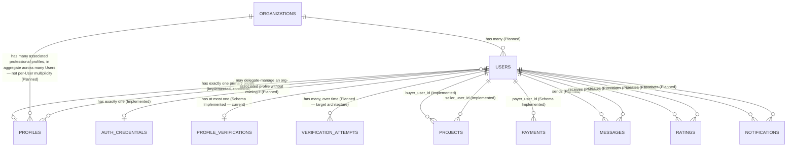
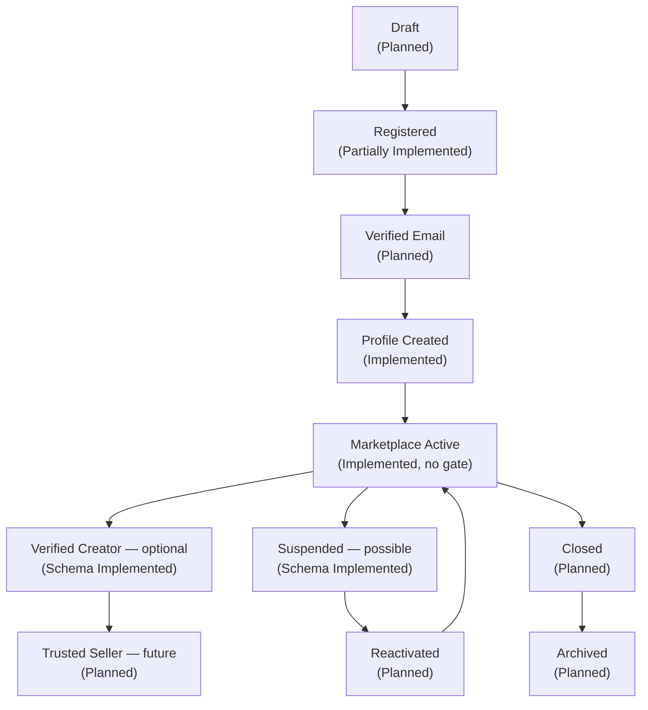
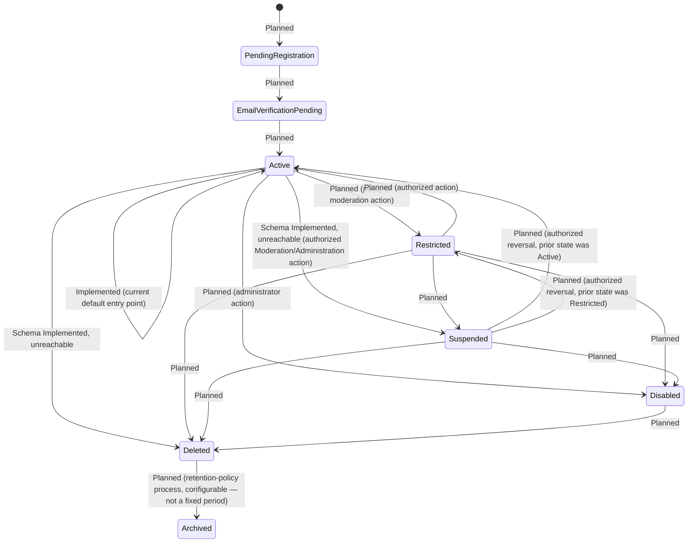
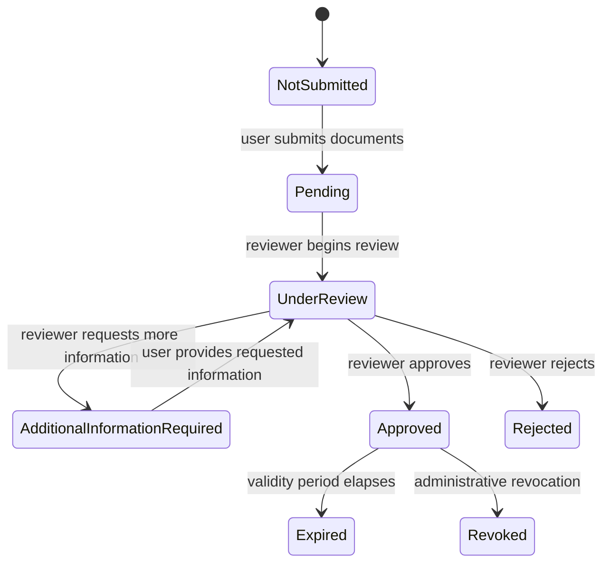
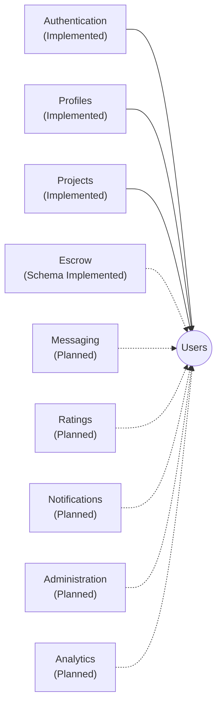

# MusicApp Users Domain Specification

| Field | Value |
|---|---|
| Document ID | SPEC-USERS-000 (provisional — see §3.1) |
| Type | Specification (SPEC) |
| Status | Approved |
| Owner | Engineering (interim: repository maintainers) |
| Version | 1.2.0 |
| Last Reviewed | 2026-07-21 |
| Applies To | The Users domain: identity, ownership, account lifecycle, and account state for MusicApp |
| Supersedes / Superseded By | None |

This document follows [`docs/00-governance/README.md`](../00-governance/README.md) (GOV-000) and is scoped to the domain directory `02-users-roles-permissions/`. It converts the supplied Product Specification Pack for the Users domain into governed documentation, verifies every technical claim against the repository at time of writing, and preserves every approved product decision — nothing approved is removed for being unimplemented.

**Status taxonomy:** this document classifies every feature using the same five-value taxonomy established in [`system-architecture.md`](system-architecture.md) §2.3 — **Implemented**, **Partially Implemented**, **Schema Implemented**, **Planned**, **Proposed** — reused here rather than redefined, per GOV-000 §12 (single source of truth).

**This document does not redesign the product.** Where a genuine gap remains after all canonical decisions are applied, it is recorded explicitly in §15.2 (Still Open) rather than resolved by invention.

**How this document separates five kinds of content**, per this revision's document-quality requirements: **Canonical Product Decisions** are stated as definitions and rules, each traceable to the decision that established them; **Repository Facts** live in §13 (Repository Verification) and in the "Evidence"/"Enforcement" columns of tables throughout; **Intentional Future Architecture** lives in §14 and in items marked **Planned**; **Implementation Gaps** — the distance between a canonical decision and what the repository currently does — live in §16 and are explicitly labeled "target-architecture gap" wherever they occur; **Remaining Open Questions** live in §15.2 and contain only questions genuinely unanswered by any canonical decision.

## 1. Executive Summary

The Users domain answers one question for the entire platform: *"Who performed this action?"* It owns identity, account existence, and account state, and is deliberately separate from Authentication (credentials), Profiles (public identity), and every domain that references a user without owning them.

**Verified against the repository:** the domain is **Partially Implemented**. Globally unique, immutable identifiers exist and are enforced (UUID primary key plus a generated `external_id`); one-user-owns-many-projects is implemented; account state exists only as a 3-value enum (`active`/`suspended`/`deleted`) against the canonical 8-state model defined below, and only `active` is reachable by any code path. No role or authorization system exists anywhere in the repository.

**This revision (v1.2.0) applies seven final canonical product decisions**, superseding and sharpening the five applied in v1.1.0:

1. **Account status and identity-verification status are separate systems**, not peer values of one field. Account status (§8.1) has 8 canonical values; identity-verification status (§8.2) has its own, independent 8-value lifecycle. A user may be `account_status = Active` and `identity_verification_status = Pending` simultaneously without contradiction (§8.3). Verified fact: the repository **already** structures these as two separate columns on two separate tables (`users.status`, `profile_verifications.status`) — the remaining gap is that each enum's value set is incomplete relative to the full canonical model, not that the separation itself is missing. This is classified as a **target-architecture gap**, not an architectural tension (§8.3, §16).
2. **`Restricted`, `Suspended`, and `Disabled` now have precise, distinct definitions and behavioral rules** — including a minimum restriction floor, mandatory suspension metadata (actor, reason, timestamp, review/expiry), and `Disabled`'s permanence (no ordinary return to `Active`) (§8.1, §9).
3. **`Deleted` and `Archived` now have precise definitions.** `Deleted → Archived` is a one-way, retention-policy-controlled transition with a configurable (not fixed) retention period; `Deleted` does not return to `Active` through the normal lifecycle; any exceptional restoration is an audited administrative recovery action outside the standard state machine (§8.1, §9).
4. **Verification history is confirmed as one User → many Verification Attempts**, each independently owning verification type, submitted documents, submission timestamp, reviewer/review mechanism, review timestamps, result, reason, and expiry/revocation information where applicable. The current one-row-per-user schema is documented as an implementation limitation, not an open product question (§6, §9, §13).
5. **One User owns exactly one primary public Profile** — this is both the current implementation and the canonical target for individual accounts. Organizations (future) may have many associated professional Profiles in aggregate across many Users, and may support delegated management of those profiles by an authorized user who does not personally own them — neither changes the one-User-one-primary-profile rule (§6, §14, §15.1).
6. **Payout-beneficiary resolution is corrected**, not left as "impossible."** The current repository already supports resolving a payout beneficiary indirectly (Payment/Escrow Record → Project → `seller_user_id` → Verification Status). This indirect path is usable for application-layer enforcement today; it is documented as potentially insufficient for a *permanent, immutable* financial audit record, for which the target architecture preserves the beneficiary directly on the release/transfer/ledger/disbursement record at the time of the event. The exact schema location for that target reference is deferred to the Escrow domain specification (§9, §13, §15.2).
7. **CASCADE and hard deletion are repository facts and an operational risk, not the intended deletion workflow.** Soft deletion remains the only normal business workflow. Any future hard-delete tooling must first assess audit history, financial retention, disputes, ratings, messages, verification records, regulatory requirements, and dependent records (§9, §13).

**Where this document needed more information than the canonical decisions provided**, the remaining gaps are narrower than in prior revisions and are listed in full in §15.2 — none of them restate a question the canonical decisions already answer.

## 2. Purpose

The User domain represents the identity of every participant in MusicApp. Everything performed within the platform is ultimately attributed to a User. The domain exists to answer *"Who performed this action?"* and nothing more — it is intentionally separate from Authentication, Profiles, Marketplace, Projects, Messaging, and Escrow, all of which consume Users but never own them (§5).

**Verified:** this separation is structurally real in the repository, not just aspirational. `users` (`backend/db/001_create_users.sql`) holds no credential, public-identity, or transactional data; `profiles`, `auth_credentials`, `projects`, and `payments` each hold their own domain's data behind a foreign key back to `users.id`.

## 3. Scope

This document covers the Users domain only: identity, account ownership, account lifecycle, account state, and the relationships, business rules, security boundaries, and audit obligations that follow from owning identity. It does not cover:

- **Roles and permissions** — implied by the parent directory name (`02-users-roles-permissions/`) but explicitly out of scope here. No role system and no authorization exist in the repository; a role/permission model, including the full `Restricted` permission matrix (§8.1, §9), belongs in a sibling document in this same directory.
- **Authentication** (credentials, tokens, sessions) — owned by the Authentication domain; see [`system-architecture.md`](system-architecture.md) §10.1.
- **Profiles** (public identity) — owned by the Profiles domain; see [`system-architecture.md`](system-architecture.md) §10.3. Identity-verification status (§8.2) is also owned at the Profiles/identity-verification boundary, not by Users — Users only references it.
- **Escrow's final financial-record structure** — including where a payout-beneficiary reference ultimately lives (§9 `BR-USERS-018`) — is deferred to the Escrow domain specification.
- Business rules and requirements already owned by [`product-overview.md`](product-overview.md) (e.g., `BR-PROJECTS-001` through `005`) — referenced here, not redefined, per GOV-000 §12.

### 3.1 Identifier Governance Note

`02-users-roles-permissions` is `USERS`, a domain token already permitted under GOV-000 §11 — unlike the `FOUNDATION`/`ARCH` tokens used provisionally in `product-overview.md` and `system-architecture.md`. All `REQ-USERS-*` and `BR-USERS-*` identifiers introduced in this document (§9, §17) are therefore fully governed identifiers, not provisional ones. The document's own top-level ID, `SPEC-USERS-000`, remains a plain, non-governed tracking label — GOV-000 §11 defines identifier families for requirements, business rules, decision records, API contracts, security controls, and governance documents, not for a whole Specification document — consistent with the approach taken in `system-architecture.md` §2.4.

## 4. Responsibilities

The User domain is responsible for:

| Responsibility | Status |
|---|---|
| Identity | Implemented — `users.id` (UUID), `users.external_id` |
| Ownership (of every action, across other domains, via reference) | Partially Implemented — `projects.buyer_user_id`/`seller_user_id` (Implemented); Messaging/Ratings/Escrow ownership references are Planned or Schema Implemented (§6) |
| Relationships (to every other domain) | Partially Implemented (§6) |
| Referential integrity | Implemented — foreign keys enforce that every reference to a user resolves to a real `users` row |
| Audit attribution | Partially Implemented — the reference itself is Implemented (a project always names its buyer/seller); a dedicated audit *log* is Planned (§11) |

## 5. Ownership

### 5.1 What Users Owns

User identifier, account identity, account creation, account lifecycle, account status (§8.1), and the relationships to every other domain (i.e., the foreign-key reference point other domains use to attribute an action to a person).

### 5.2 What Users Does Not Own

Passwords, authentication tokens, sessions (Authentication); profile information — bio, genres, portfolio, social links (Profiles); **identity-verification status and history (Profiles/identity-verification boundary — a separate lifecycle from account status; see §8.2, §8.3)**; ratings (Ratings); escrow, and the final financial-record structure for payout-beneficiary references (Escrow — see §9 `BR-USERS-018`); messages (Messaging); moderation decisions (Moderation).

**Verified:** this boundary holds structurally. `users` (`backend/db/001_create_users.sql`) has no `password`, `token`, or profile-shaped column, and no verification-status column — `profile_verifications.status` lives entirely outside `users`; `password_hash` lives only in `auth_credentials` (`backend/db/007_create_auth_credentials.sql`); `bio`/`genres`/`artist_name` live only in `profiles` (`backend/db/002_create_profiles.sql`).

## 6. Relationships

The specification's Relationships section lists eleven statements; two of them ("owns many Projects" and "participates in many Projects") describe the same pair of foreign keys and are merged into one row below. The table has ten specification-sourced rows, one additional relationship (Payments) discovered in the repository, and three Planned relationships added by this document's canonical decisions (Organization membership, Organization-associated Profiles, and delegated Profile management).

| Relationship | Cardinality | Status | Evidence |
|---|---|---|---|
| User → Profile | **Exactly one primary public Profile** | Implemented, and canonical (current implementation and target architecture agree — see §15.1) | `profiles.user_id UUID NOT NULL UNIQUE` |
| User → Authentication identity | Exactly one | Implemented | `auth_credentials.user_id UUID NOT NULL UNIQUE` |
| User → Projects (owns/participates) | Many | Implemented | `projects.buyer_user_id`, `projects.seller_user_id` — unconstrained-in-count foreign keys |
| User → Messages (sends) | Many | Planned | No `messages` table exists |
| User → Messages (receives) | Many | Planned | No `messages` table exists |
| User → Ratings (creates) | Many | Planned | No ratings-content table exists |
| User → Ratings (receives) | Many | Planned | No ratings-content table exists |
| User → Notifications (creates) | Many | Planned | No `notifications` table exists |
| User → Notifications (receives) | Many | Planned | No `notifications` table exists |
| User → Verification attempts (undergoes over time) | Many, over time (target architecture) | **Target: Planned. Current: Schema Implemented, narrower cardinality — an implementation limitation, not an open product question.** | Target: an approved `verification_attempts`-style history, one row per attempt, each owning verification type, submitted documents, submission timestamp, reviewer/review mechanism, review timestamps, result, reason, and expiry/revocation information (§9 `BR-USERS-012`). Current: `profile_verifications.user_id UUID NOT NULL UNIQUE` constrains the schema to at most one record per user — see §13 |
| User → Payments (pays) | Many | Schema Implemented | `payments.payer_user_id UUID NOT NULL`, `ON DELETE RESTRICT` — not named in the specification's relationship list, but present in the schema and structurally identical in kind (a user paying into escrow) |
| User → Organization (belongs to) | Many-to-one (many Users per Organization) | Planned | No schema or code exists; target architecture: Organization → many Users → many associated professional Profiles, additive to this domain, not a redesign of it (§14) |
| User → Organization-associated Profile (delegated manager of, not owner) | Many-to-many (a user may manage several org profiles; an org profile may have several delegated managers) | Planned | No schema or code exists; does **not** change the one-User-one-primary-profile rule above — managing is not owning (§14) |

*Entities with no implemented table (Messages, Ratings, Notifications, Verification Attempts, Organizations) are shown per the approved specification and canonical product decisions, and are not removed for being unimplemented. `PROFILE_VERIFICATIONS` (current, 1:1) and `VERIFICATION_ATTEMPTS` (target, 1:many) are shown side by side deliberately — the former is not yet replaced by the latter. The `USERS ||--o| PROFILES` relationship is unconditionally one-to-one — no relationship in this diagram gives an individual User more than one primary profile, including the Organization relationships, which operate at the Organization level, not the User level.*

## 7. Lifecycle

The specification's account lifecycle is a broader product journey, distinct from the technical account-status machine (§8.1) and entirely separate from the identity-verification lifecycle (§8.2). It describes the stages a user's relationship with the platform is expected to pass through, not a literal database column.

**Verified status per stage:**

| Stage | Status | Evidence |
|---|---|---|
| Draft | Planned | No pending/incomplete account state exists — `POST /auth/signup` creates a fully-formed, `active` account in one transaction |
| Registered | Partially Implemented | The account is created, but not as a distinguishable stage separate from the next two — see Notes |
| Verified Email | Planned | No email-verification route, column, or gate exists |
| Profile Created | Implemented | Created in the same transaction as the user, via `POST /auth/signup` |
| Marketplace Active | Implemented, with no explicit gate | Any `active` user with a profile automatically appears in `GET /profiles` — there is no separate "activation" step to reach this stage |
| Verified Creator (optional) | Schema Implemented | `profile_verifications`/`verification_documents` exist; no route surfaces an approved verification as a "verified creator" badge. Corresponds to an `Approved` outcome in the **identity-verification** lifecycle (§8.2) — a separate system from account status (§8.1); this lifecycle stage is a product-journey label for that event, not an account-status value. See §8.3 |
| Trusted Seller (future) | Planned | Explicitly future-scoped by the specification itself; no schema or code trace |
| Suspended (possible) | Schema Implemented | `user_status` includes `suspended`; no route ever sets it. Corresponds to the `Suspended` account-status value (§8.1), now precisely defined: temporary, must record actor/reason/timestamp, reversible by authorized Moderation or Administration action |
| Reactivated | Planned | No code path transitions a user out of `suspended`. Corresponds to `Suspended`'s authorized reversal (§8.1) — this is an ordinary, expected transition, unlike recovery from `Disabled` or `Deleted` |
| Closed | Planned | Maps to the canonical `Deleted` account-status value (§8.1) — "soft deleted, preserved for audit," retained indefinitely until a retention-policy process moves it to `Archived` |
| Archived | Planned | Maps to the canonical `Archived` account-status value (§8.1) — "historical state only," reached from `Deleted` via a configurable retention-policy process, not a fixed time period (§9 `BR-USERS-017`) |

**Notes:** in the current implementation, "Registered," "Verified Email" (absent), and "Profile Created" are not sequential, independently observable stages — `POST /auth/signup` inserts `users`, `profiles`, and `auth_credentials` in a single database transaction (`backend/Index.js`). The lifecycle diagram above is retained in full per the approved specification; the table clarifies which arrows represent a real, separately-observable transition today versus an approved future one. "Closed" and "Archived" are this document's product-journey vocabulary for what the account-status machine (§8.1) calls `Deleted` and `Archived`.

## 8. State Machine

Per this revision's canonical decision, **account status and identity-verification status are two separate, independently-governed systems**, not one combined model. §8.1 defines account status. §8.2 defines identity-verification status. §8.3 states precisely how the two relate.

### 8.1 Account Status

Account status describes whether the account itself may access the platform.

**Currently implemented:** `user_status` (`backend/db/001_create_users.sql`) is a 3-value enum: `active`, `suspended`, `deleted`. Only `active` is reachable (the creation default); no route transitions a user to `suspended` or `deleted`.

**Canonical account-status definitions (approved product decision, this revision):**

| Status | Definition | Trigger / Requirements |
|---|---|---|
| Pending Registration | Registration incomplete. | — |
| Email Verification Pending | Registered; may log in; limited platform access; cannot buy or sell. | Registration completed, email not yet verified |
| Active | Full platform access. | Email verified |
| Restricted | The user may authenticate and retain limited access; restrictions are capability-level controls. At minimum, a Restricted user cannot initiate new financial transactions, receive payouts, create new commercial projects, or perform any specifically restricted action; access to historical records may remain available. The full permission matrix belongs in a future authorization/permissions specification (§3). | Policy or moderation action |
| Suspended | The account is temporarily blocked — the user cannot authenticate or use the platform while suspended. The suspending action must record actor, reason, timestamp, and review-or-expiry information where applicable. | Imposed by an authorized Moderation or Administration workflow; reversible by an authorized Moderation or Administration action, returning the user to their prior permitted operational state (`Active` or `Restricted`) |
| Disabled | The account is permanently disabled by an authorized administrator. It cannot return directly to `Active` through ordinary moderation. | Administrator action; any exceptional restoration is an audited administrative recovery process, not a normal state transition |
| Deleted | Soft deleted; inaccessible to the user; retained for audit, legal, fraud, financial, dispute, and historical-reference requirements; not physically removed during normal business operations. | User- or administrator-initiated soft deletion |
| Archived | Retained as a historical record after the operational retention process; inaccessible for normal platform use; not a returnable operational account state. | A configurable retention-policy process, governed by legal, financial, dispute, fraud, and operational requirements — not a fixed number of days |

These definitions are canonical. The specific transition edges below remain this document's inference, grounded in these definitions.

*This diagram intentionally contains no `Disabled → Active` edge and no `Deleted → Active` edge — both are permanent/terminal within the normal lifecycle by canonical definition. `Suspended` returns to whichever of `Active`/`Restricted` was the user's prior permitted operational state, via an authorized action, not unconditionally to `Active`. Exceptional administrative recovery from `Disabled` or `Deleted` is explicitly **not part of this state machine** — per the canonical decision, it is an audited administrative recovery process outside normal transitions, and is deliberately not drawn as an edge here to avoid implying it is an ordinary path.*

**Mapping current enum to canonical account statuses:**

| Canonical Status | Current Enum Equivalent | Status |
|---|---|---|
| Pending Registration | None | Planned — target-architecture gap |
| Email Verification Pending | None | Planned — target-architecture gap |
| Active | `active` | Implemented (only state reachable; entered immediately, not via a transition from Pending Registration) |
| Restricted | None | Planned — target-architecture gap; canonically defined, not yet in the enum |
| Suspended | `suspended` | Schema Implemented, unreachable — canonically defined; triggering authority now specified (§15.1) |
| Disabled | None | Planned — target-architecture gap; canonically defined (permanent, administrator-only) |
| Deleted | `deleted` | Schema Implemented, unreachable — canonically defined (soft deletion, audit-preserving); see §9 `BR-USERS-009` |
| Archived | None | Planned — target-architecture gap; canonically defined (retention-policy-controlled, one-way from `Deleted`) |

### 8.2 Identity Verification Status

Identity verification has its own lifecycle and its own status field, entirely separate from account status (§8.1). It describes the state of a single verification attempt (§6, §9 `BR-USERS-012`) — not a property of the account itself.

**Currently implemented:** `profile_verifications.status` (`backend/db/003_create_profile_verifications.sql`) is a 4-value enum: `not_started`, `submitted`, `approved`, `rejected`. `profile_verifications.user_id` is `UNIQUE`, so only one record — and therefore only one live status — can exist per user at a time (§13).

**Canonical identity-verification status definitions (approved product decision, this revision):**

| Status | Definition |
|---|---|
| Not Submitted | No verification attempt has been submitted (or a prior attempt is closed and no new one is open). |
| Pending | Documents submitted; awaiting a reviewer to begin review. |
| Under Review | A reviewer is actively evaluating the submission. |
| Additional Information Required | The reviewer has requested further information or documentation before a decision can be made. |
| Approved | The verification attempt succeeded. |
| Rejected | The verification attempt failed. |
| Expired | A previously `Approved` verification's validity period has elapsed. |
| Revoked | A previously `Approved` verification was administratively invalidated (e.g., fraud discovered after approval). |

*This diagram describes the lifecycle of a single verification attempt. `Rejected`, `Expired`, and `Revoked` are terminal **for that attempt** — per the many-attempts target architecture (§6, §9 `BR-USERS-012`), a subsequent attempt is a new, independent record beginning again at `Not Submitted`/`Pending`, not a transition drawn from this diagram. This entire diagram is Planned — the current schema has no `Under Review`, `Additional Information Required`, `Expired`, or `Revoked` equivalent (see mapping below), and no route transitions `profile_verifications.status` at all.*

**Mapping current enum to canonical identity-verification statuses:**

| Canonical Status | Current Enum Equivalent | Status |
|---|---|---|
| Not Submitted | `not_started` | Schema Implemented |
| Pending | `submitted` (current schema does not distinguish Pending from Under Review) | Schema Implemented, coarser than target |
| Under Review | None — collapsed into `submitted` | Planned — target-architecture gap |
| Additional Information Required | None | Planned — target-architecture gap |
| Approved | `approved` | Schema Implemented |
| Rejected | `rejected` | Schema Implemented |
| Expired | None | Planned — target-architecture gap |
| Revoked | None | Planned — target-architecture gap |

`verification_documents.status` (`backend/db/004_create_verification_documents.sql`, enum: `uploaded`/`submitted`/`approved`/`rejected`) is a related but distinct, per-document status, not the per-attempt status described above.

### 8.3 Relationship Between Account Status and Identity Verification Status

**Canonical resolution (this revision):** account status (§8.1) and identity-verification status (§8.2) are governed by separate, independent fields. A user may be `account_status = Active` and `identity_verification_status = Pending` (or `Under Review`, `Rejected`, `Expired`, `Revoked`, etc.) simultaneously, without contradiction. This replaces the v1.1.0 framing of `Identity Verification Pending` as a value competing with `Active` in one field, which is superseded by this revision.

**What identity verification does and does not block**, per this canonical decision:

| Not blocked by pending/incomplete verification | Blocked until verification is `Approved` |
|---|---|
| Login | Receiving escrow payouts (a verified payout beneficiary is required — §9 `BR-USERS-011`, `BR-USERS-018`) |
| Browsing | |
| Profile editing | |
| Messaging | |
| Preparing projects | |
| Buying — **unless a later risk policy requires otherwise** | |

**Repository fact, corrected from v1.1.0's framing:** the repository already implements the structural separation described above — `users.status` and `profile_verifications.status` are two distinct columns on two distinct tables today; there is no schema element that treats identity verification as a value of `user_status`. **What the repository lacks is completeness, not separation:** `user_status` has 3 of the 8 canonical account-status values (§8.1), and `profile_verifications.status` has 4 of the 8 canonical identity-verification-status values (§8.2), with no `Under Review`, `Additional Information Required`, `Expired`, or `Revoked` equivalent. This is classified as a **target-architecture gap** (§16) — the enums need to grow to their full canonical value sets — not as an architectural tension, which this revision resolves in full.

## 9. Business Rules

| ID | Statement | Enforcement | Status |
|---|---|---|---|
| BR-USERS-001 | A user must have at least one of email or phone on record. | DB constraint `users_email_or_phone_present` (`backend/db/001_create_users.sql`) | Implemented |
| BR-USERS-002 | A user's `id` and `external_id` are immutable once assigned. | No route or trigger updates either column after creation | Implemented by convention — not enforced by a DB trigger blocking `UPDATE` |
| BR-USERS-003 | Every account has one immutable UUID; UUIDs are never recycled. | `id UUID PRIMARY KEY DEFAULT gen_random_uuid()` — cryptographically random generation; no route ever deletes a `users` row, so recycling has never been exercised | Implemented (generation); untested (recycling, since no deletion path exists) |
| BR-USERS-004 | A user has exactly one primary public profile. | `profiles.user_id UNIQUE` | Implemented, and canonical — this is both the current implementation and the confirmed target architecture for individual users (§6, §15.1) |
| BR-USERS-005 | A user has exactly one authentication-credential record. | `auth_credentials.user_id UNIQUE` | Implemented |
| BR-USERS-006 | A user may participate in unlimited projects, as buyer or seller. | `projects.buyer_user_id`/`seller_user_id`, unconstrained-in-count foreign keys | Implemented |
| BR-USERS-007 | A user cannot be hard-deleted while referenced by a project (as buyer or seller) or a payment (as payer). | `ON DELETE RESTRICT` on `projects.buyer_user_id`/`seller_user_id` and `payments.payer_user_id` | Implemented |
| BR-USERS-008 | Hard deletion of a `users` row cascades to remove the user's profile, authentication credentials, and identity-verification record. **This is a repository fact and an operational risk, not the intended account-deletion workflow.** Ordinary platform workflows must not physically delete Users — soft deletion (`BR-USERS-009`) is the only normal business workflow. Before any future hard-delete tooling is introduced, it must assess: audit history, financial retention, disputes, ratings, messages, verification records, regulatory requirements, and dependent records. | `ON DELETE CASCADE` on `profiles.user_id`, `auth_credentials.user_id`, `profile_verifications.user_id` | Implemented (schema behavior, exceptional-maintenance path only); no hard-delete route or tooling exists |
| BR-USERS-009 | Soft deletion (`status = 'deleted'`) is the canonical and only normal business behavior for user deletion; hard deletion is an administrative maintenance operation only. Soft deletion must never break audit history. | No deletion route (soft or hard) exists at all | Planned — the rule is unambiguous (canonical); a soft-delete route/mechanism is not yet implemented |
| BR-USERS-010 | Every project, financial, moderation, and administrative action must be attributable to a user. | Implemented for Projects (`buyer_user_id`/`seller_user_id` are `NOT NULL`) and Payments (`payer_user_id NOT NULL`); Planned for moderation and administrative actions, since neither domain exists yet (`system-architecture.md` §10.11, §10.12) | Partially Implemented |
| BR-USERS-011 | Identity-verification status must not block normal platform usage (login, browsing, profile editing, messaging, preparing projects, and buying unless a later risk policy requires otherwise). It blocks only capabilities that require a verified payout beneficiary, specifically receiving escrow releases. | Not implemented — no route checks `profile_verifications.status` for any purpose. **Enforcement is possible today, indirectly**, by resolving Payment/Escrow Record → Project → `projects.seller_user_id` → verification status at the application layer once Escrow exists (§9 `BR-USERS-018`, §13) | Planned — canonical business rule; depends on Escrow moving beyond Schema Implemented before it is enforceable |
| BR-USERS-012 | A user may have many verification attempts over time; each attempt independently owns its verification type, submitted documents, submission timestamp, reviewer or review mechanism, review timestamps, result, reason, and expiry/revocation information where applicable. | Not implemented — `profile_verifications.user_id UNIQUE` currently allows at most one record per user | Planned — target architecture; current schema is an implementation limitation, not an open product question |
| BR-USERS-013 | Account status and identity-verification status are governed by separate, independent fields; neither implies nor constrains the other except where a specific rule says so (`BR-USERS-011`). | `users.status` and `profile_verifications.status` are already separate columns on separate tables | Implemented (structural separation); target-architecture gap remains only in each field's value-set completeness (§8.1, §8.2) |
| BR-USERS-014 | A `Restricted` account must not be permitted to initiate new financial transactions, receive payouts, or create new commercial projects, and must not be permitted to perform any capability specifically named as restricted; access to historical records may remain available. | Not implemented — `Restricted` does not exist in `user_status` | Planned — target-architecture gap; full permission matrix deferred to a future roles/permissions specification (§3) |
| BR-USERS-015 | A `Suspended` account must not be able to authenticate or use the platform. The suspending action must record actor, reason, timestamp, and review-or-expiry information where applicable. Reversal must be an authorized Moderation or Administration action, returning the user to their prior permitted operational state. | Not implemented — `Suspended` exists in the enum but no route sets it, and no metadata (actor/reason/timestamp) columns exist to record a suspension | Planned — target-architecture gap |
| BR-USERS-016 | A `Disabled` account must not return to `Active` through ordinary moderation. Any exceptional restoration must be an audited administrative recovery process, not a normal state transition. | Not implemented — `Disabled` does not exist in `user_status` | Planned — target-architecture gap |
| BR-USERS-017 | The `Deleted → Archived` transition must be controlled by a configurable retention-policy process — governed by legal, financial, dispute, fraud, and operational requirements — not a fixed number of days. A `Deleted` account does not return to `Active` through the normal lifecycle. | Not implemented — `Archived` does not exist in `user_status`, and no retention-policy mechanism exists | Planned — target-architecture gap |
| BR-USERS-018 | A financial release's payout beneficiary must be resolvable at the time of enforcement. Today this is possible only indirectly (Payment/Escrow Record → Project → `seller_user_id` → verification status), which may be insufficient for a permanent, immutable financial audit record if project ownership or related data can ever change. The target architecture preserves the payout beneficiary directly on the release/transfer/ledger/disbursement record at the time of the financial event. | Current: `payments.payer_user_id` and `projects.seller_user_id` exist and support indirect resolution (Schema Implemented). No `payee`-style column exists on `payments` today, and this document does not require one specifically on that table. | Current path: Schema Implemented (indirect). Target immutable-reference model: Planned — exact schema location deferred to the Escrow domain specification (§3, §15.2) |

## 10. Security

| Boundary | Status |
|---|---|
| Users never expose credentials. | Implemented and structurally confirmed — `users` holds no credential column; `GET /users` returns `id, external_id, email, phone_e164, status, created_at` only (`backend/Index.js`) |
| Authentication consumes Users. | Implemented — `auth_credentials.user_id` foreign key; login/signup routes read/write `users` |
| Authorization evaluates Users. | Planned — no authorization/role system exists anywhere in the repository |
| Profiles expose Users publicly. | Implemented — `GET /profiles` returns a public-safe profile projection keyed off `user_id`, never credential data |
| Escrow references Users. | Schema Implemented — `payments.payer_user_id`; no route exercises it |
| Projects reference Users. | Implemented — `buyer_user_id`/`seller_user_id` |

**SEC-001 (owned by `product-overview.md` §13.4, §19; carried into `system-architecture.md` §13):** `POST /users` (`backend/Index.js`) accepts unauthenticated requests and creates a `users` row directly, independent of the credentialed `POST /auth/signup` flow. This is the Users domain's own route exhibiting that finding — it is referenced here, not redefined, per GOV-000 §12. `GET /users` is likewise unauthenticated and lists every user's `id`/`external_id`/`email`/`phone_e164`/`status`.

## 11. Audit

Every domain references Users; Users is the platform's root audit entity — every attributable action ultimately traces back to a `users.id`.

| Audit Requirement | Status |
|---|---|
| Historical references should never become invalid. | Partially Implemented — `ON DELETE RESTRICT` on `projects`/`payments` guarantees this for financial/commercial history (a user cannot be hard-deleted out from under a project or payment); for identity history (`profiles`/`auth_credentials`/`profile_verifications`), the canonical business path is soft deletion (`BR-USERS-009`), which preserves every row unchanged — `ON DELETE CASCADE` only fires during the administrative hard-deletion maintenance path (`BR-USERS-008`), which is deliberately not the routine path and must not be introduced without the pre-assessment checklist in `BR-USERS-008`. No soft-delete mechanism is implemented yet to exercise this. |
| Every domain reference to a user should be traceable back to the user. | Implemented — every current foreign key to `users.id` is a real, enforced foreign key, not a loosely-typed identifier |
| A dedicated, queryable audit log of account-level actions (creation, state change, login) should exist. | Planned — no audit table exists; `backend/Index.js` only logs errors to console. Suspension actions in particular (`BR-USERS-015`) require actor/reason/timestamp metadata that this future audit log would need to carry |

## 12. Dependencies

Users has no outgoing dependencies — it is the platform's foundational identity domain, confirmed by `system-architecture.md` §8 (Domain Dependency Matrix), where the Users row is empty.

**Consumed by** (per the specification): Authentication, Profiles, Projects, Messaging, Ratings, Escrow, Notifications, Administration, Analytics.

*Solid arrows = an Implemented dependency on Users today. Dashed arrows = an approved, Planned dependency — the consuming domain does not yet exist or does not yet reference Users in running code.*

**Note on Organizations:** the Planned Organization → many Users relationship (§6) is a containment/grouping relationship, not a "consumes Users" dependency in the same sense as the domains above — an Organization would hold Users, rather than merely referencing them to attribute an action. It is intentionally not added as a node to the diagram above; see §6 and §14 for its Planned shape.

## 13. Repository Verification

### 13.1 Schema

`users` (`backend/db/001_create_users.sql`): `id UUID PRIMARY KEY DEFAULT gen_random_uuid()`, `external_id TEXT NOT NULL UNIQUE`, `email CITEXT UNIQUE`, `phone_e164 TEXT UNIQUE`, `status user_status NOT NULL DEFAULT 'active'`, `created_at`, `updated_at`, `CHECK (email IS NOT NULL OR phone_e164 IS NOT NULL)`.

`profile_verifications` (`backend/db/003_create_profile_verifications.sql`): `id`, `external_id`, `user_id UUID NOT NULL UNIQUE`, `status verification_status NOT NULL DEFAULT 'not_started'` (enum: `not_started`/`submitted`/`approved`/`rejected`), `submitted_at`, `reviewed_at`, `review_notes`, timestamps.

### 13.2 Foreign Key Behavior (verified precisely)

| Referencing Table | Column | On Delete | Cardinality |
|---|---|---|---|
| `profiles` | `user_id` | `CASCADE` | 1:1 (`UNIQUE`) |
| `auth_credentials` | `user_id` | `CASCADE` | 1:1 (`UNIQUE`) |
| `profile_verifications` | `user_id` | `CASCADE` | 1:1 (`UNIQUE`) |
| `projects` | `buyer_user_id` | `RESTRICT` | 1:many |
| `projects` | `seller_user_id` | `RESTRICT` | 1:many |
| `payments` | `payer_user_id` | `RESTRICT` | 1:many |

### 13.3 Routes

| Route | Auth Required | Status |
|---|---|---|
| `POST /users` | No | Implemented — direct creation, see SEC-001 (§10) |
| `GET /users` | No | Implemented — lists all users |
| `POST /auth/signup` | No | Implemented — creates `users` + `profiles` + `auth_credentials` transactionally; the intended production path |

No route reads a single user by ID, updates a user, changes `status`, or deletes a user. No route reads or writes `profile_verifications` at all.

### 13.4 Status Field Completeness

| Field | Canonical Value Count | Current Enum Value Count | Gap |
|---|---|---|---|
| Account status (`users.status`, §8.1) | 8 | 3 (`active`, `suspended`, `deleted`) | 5 values absent: `Pending Registration`, `Email Verification Pending`, `Restricted`, `Disabled`, `Archived` |
| Identity-verification status (`profile_verifications.status`, §8.2) | 8 | 4 (`not_started`, `submitted`, `approved`, `rejected`) | 4 values absent: `Under Review`, `Additional Information Required`, `Expired`, `Revoked` (and `Pending`/`submitted` are coarser than the target split of `Pending` vs. `Under Review`) |

Both gaps are target-architecture gaps in value-set completeness. Neither reflects a missing separation between the two fields — that separation already exists structurally (§8.3, `BR-USERS-013`).

### 13.5 Findings

**Finding 1 — CASCADE and hard deletion (repository fact and operational risk, `BR-USERS-008`):** the `CASCADE` behavior on `profiles`, `auth_credentials`, and `profile_verifications` means a hard `DELETE` of a `users` row would remove a person's profile, credentials, and identity-verification record. This is documented as a repository fact describing the schema's current behavior on the exceptional administrative hard-deletion path — **it is not the intended account-deletion workflow**. The canonical business behavior is soft deletion (`status = 'deleted'`, `BR-USERS-009`), which performs an `UPDATE`, never triggering these `CASCADE` clauses. Neither a soft-delete route nor a hard-delete (administrative) route exists yet.

**Finding 2 — verification multiplicity (implementation limitation, `BR-USERS-012`):** `profile_verifications.user_id UNIQUE` constrains the current schema to at most one verification record per user. The approved target architecture is one User → many Verification Attempts (§6, §8.2). This is not a product ambiguity — the target shape is fully specified — but an implementation gap requiring a new table (e.g., `verification_attempts`, one row per attempt).

**Finding 3 — payout-beneficiary resolution (corrected from v1.1.0, `BR-USERS-018`):** v1.1.0 of this document stated that payout-verification enforcement "cannot be enforced because `payments` has no payee column." **This was imprecise and is corrected here.** The current repository model identifies the payer (`payments.payer_user_id`) directly, and the intended seller/payout beneficiary is derivable through the associated project (`projects.seller_user_id`) — a chain of two existing, enforced foreign keys. Application- or service-layer enforcement of `BR-USERS-011` is therefore possible today once Escrow exists, via `Payment/Escrow Record → Project → seller_user_id → verification status`. What this indirect path does **not** provide is an immutable record of who the beneficiary was *at the time of the financial event* — if project data were ever to change, the historical resolution could change with it. The target financial architecture accordingly preserves the beneficiary directly on the release/transfer/ledger/disbursement record; this document does not prescribe a specific column on `payments`, since the final financial-record structure belongs to the Escrow domain specification (§3).

## 14. Future Architecture

The specification's Future Extensibility list is retained in full as approved direction, not built:

| Item | Status |
|---|---|
| Organizations | Planned — canonical target architecture: Organization → many Users → many associated professional Profiles (in aggregate across those Users, not per-User multiplicity). Explicitly approved as **additive** to the existing User domain — it does not redesign or replace the ownership model in §5 (a User continues to own its own identity and exactly one primary profile; an Organization groups Users and their associated professional profiles, it does not absorb or multiply an individual's own profile) |
| Delegated profile management | Planned — an authorized user may manage an Organization-associated profile without personally owning it (§6). Distinct from the one-User-one-primary-profile rule, which is unaffected |
| Teams | Planned — no schema or code; relationship to Organizations, if any, not specified |
| Studios | Planned — no schema or code; relationship to Organizations, if any, not specified |
| Agencies | Planned — no schema or code. Whether Organizations plus delegated profile management is the mechanism agencies would use to manage creators is plausible but **not fully confirmed** — see §15.1/§15.2 |
| Multi-profile accounts (an individual User owning more than one primary public profile) | **Resolved — not part of the target architecture.** One User → exactly one primary public Profile is canonical for individual accounts (§6, §15.1). This is a different question from Organization-associated profiles, which operate at the Organization level |
| Linked identities | Planned — no schema or code |
| Social login | Planned — no schema or code |
| Multiple authentication providers | Planned — `auth_credentials.user_id UNIQUE` currently assumes exactly one credential record per user |
| API identities | Planned — no schema or code |
| Service accounts | Planned — no schema or code; see §15.2 ("Should service accounts exist?" remains open) |

None of the still-Planned items are contradicted by the current schema in a way that would require rework to adopt — they are additive, except where explicitly noted (multiple auth providers, which currently assumes one record per user).

## 15. Open Questions

### 15.1 Resolved by canonical product decision

| Original Question | Resolution |
|---|---|
| What distinguishes `Restricted`, `Suspended`, and `Disabled`? | `Restricted` = limited permissions, policy/moderation-triggered, with a defined minimum floor (`BR-USERS-014`). `Suspended` = full block, temporary, with mandatory actor/reason/timestamp metadata, reversible to the prior operational state (`BR-USERS-015`). `Disabled` = full block, permanent, administrator-only, no ordinary return path (`BR-USERS-016`). |
| Does identity verification gate platform access? | No — login, browsing, profile editing, messaging, project preparation, and (absent a risk policy) buying remain available regardless of verification status; only receiving escrow payouts is blocked (§8.3, `BR-USERS-011`). |
| Is the `CASCADE` foreign-key behavior on `profiles`/`auth_credentials`/`profile_verifications` intentional? | It is a repository fact scoped to the exceptional administrative hard-deletion path only; it is not, and must not be treated as, the intended account-deletion workflow. Soft deletion is the only normal business workflow (`BR-USERS-008`/`009`). |
| Is a verification history table intended, or is the single record reused? | A history table is the target architecture — one row per attempt, each independently owning verification type, documents, submission timestamp, reviewer/mechanism, review timestamps, result, reason, and expiry/revocation information (`BR-USERS-012`). |
| Should organizations own users? | No — an Organization groups many Users and their associated professional profiles additively; it does not own or redesign the User domain's existing identity ownership (§5, §14). |
| **Can one user own multiple public profiles?** | **No.** One User → exactly one primary public Profile, both currently and canonically. Organizations may have many associated professional Profiles in aggregate across many Users, which is a distinct, Organization-level concept, not multiplicity for an individual User (§6, §14). |
| Can one user switch between creator identities? | Not in the sense of owning multiple personal profiles — resolved no, per the rule above. An authorized user may, in the future, *manage* (not own) an Organization-associated profile via delegated management (§14) — this is acting on behalf of an Organization, not switching between one's own identities. |
| Is `Archived`'s relationship to `Deleted` defined? | Yes — `Deleted → Archived` is a one-way progression controlled by a configurable retention-policy process; there is no fixed retention period by design (`BR-USERS-017`). |
| Can a `Deleted` account be reactivated to `Active`? | Not through the normal lifecycle. Exceptional restoration, if ever permitted, is an audited administrative recovery action outside the standard state machine (`BR-USERS-017`, §8.1). |
| What is the triggering authority for `Suspended`? | An authorized Moderation or Administration workflow (`BR-USERS-015`). |
| Can payout-verification be enforced given `payments` has no payee column? | Yes, indirectly, today — `Payment/Escrow Record → Project → seller_user_id → verification status` (§13 Finding 3, `BR-USERS-018`). The v1.1.0 framing that this "cannot be enforced" was incorrect and is corrected. |

### 15.2 Still open

**Not resolved by any canonical decision to date:**
- Will agencies manage creators? Organizations plus delegated profile management (§14) are a plausible mechanism, but this is not confirmed as the intended design for agencies specifically.
- Should service accounts exist?
- What is the complete `Restricted` permission matrix? `BR-USERS-014` defines a minimum floor (no new financial transactions, no payouts, no new commercial projects); the full matrix is explicitly deferred to a future roles/permissions specification (§3).
- What is the exact schema location for the target immutable payout-beneficiary reference (§13 Finding 3, `BR-USERS-018`) — a new column on `payments`, a field on a future `escrow_ledger`-style entry, or elsewhere? This document does not require it specifically on `payments`; the Escrow domain specification will define the final financial-record structure.
- Is there a timeout or expiry for `Additional Information Required` (§8.2) if a user never responds to a reviewer's request? Not specified.
- The specific transition topology within identity-verification status (§8.2) and the additional account-status edges added in this revision (§8.1) are this document's inference from the canonical definitions, not separately confirmed transition rules — flag any disagreement.

**Recommendation to the requester:** the items above are narrower than any prior revision's open questions. None blocks writing a `user_status`/`verification_status` schema-migration design, since every value, trigger, and terminal/non-terminal property needed for that design is now canonical (§8.1, §8.2, §9). The `Restricted` permission matrix and the Escrow payout-reference location are the two items most likely to require a decision from a different specification (a future roles/permissions document and the Escrow domain specification, respectively) before those specific features can be built.

## 16. Implementation Status

| Area | Status |
|---|---|
| `users` table exists | Implemented |
| UUID primary keys | Implemented |
| `external_id` secondary identifier | Implemented |
| Relationships (Profile, Authentication, Projects) | Implemented |
| Relationships (Messaging, Ratings, Notifications, full Escrow) | Planned |
| Relationships (Identity Verification) | Schema Implemented — current cardinality (1:1) is narrower than the target architecture (1:many); target-architecture gap, not an open question (§13 Finding 2) |
| Account status vs. identity-verification status separation | Implemented (structural — two columns, two tables); target-architecture gap only in value-set completeness (§8.3, §13.4) |
| Advanced lifecycle (§7) | Partially Implemented — 2 of 11 stages fully implemented as distinguishable steps |
| Account status machine (§8.1) | Schema Implemented (partial) — 3 of 8 canonically-defined statuses exist in the enum; only 1 is reachable. Definitions are fully resolved; enum/schema extension is a target-architecture gap |
| Identity-verification status machine (§8.2) | Schema Implemented (partial) — 4 of 8 canonically-defined statuses exist in the enum; none reachable via any route. Definitions are fully resolved; enum/schema extension is a target-architecture gap |
| Verification attempt history (`verification_attempts`-style table) | Planned — target architecture; no table exists |
| Soft-delete route/mechanism | Planned — canonical business behavior confirmed; no route sets `status = 'deleted'` |
| Suspension metadata (actor, reason, timestamp, review/expiry) | Planned — canonical requirement (`BR-USERS-015`); no columns exist to record it |
| Retention-policy process (`Deleted → Archived`) | Planned — canonical requirement (`BR-USERS-017`); no mechanism exists |
| Identity-verification usage gating (escrow-payout block) | Planned — canonical business rule confirmed (`BR-USERS-011`); no route checks verification status for any purpose |
| Payout-beneficiary resolution | Current indirect path: Schema Implemented (`payments.payer_user_id`, `projects.seller_user_id` both exist and are enforced FKs). Target immutable-reference model: Planned, structure deferred to Escrow (`BR-USERS-018`) |
| Organizations | Planned — target shape now specified: Organization → many Users → many associated professional Profiles, plus delegated (non-owning) profile management |
| Role system | Planned |
| Authorization | Planned |

## 17. Traceability

| ID | Statement (abridged) | Related | Status |
|---|---|---|---|
| `REQ-USERS-001` | The platform MUST assign every user a globally unique, immutable identifier. | `BR-USERS-002`, `BR-USERS-003` | Implemented |
| `REQ-USERS-002` | The platform MUST require at least one contact identifier (email or phone) per user. | `BR-USERS-001` | Implemented |
| `REQ-USERS-003` | The platform MUST track account status through an explicit, extensible status field, separate from identity-verification status. | §8.1, §8.3, `BR-USERS-013` | Partially Implemented |
| `REQ-USERS-004` | The platform MUST prevent silent loss of audit history on user deletion. | `BR-USERS-007`, `BR-USERS-008`, `BR-USERS-009`, §13 Finding 1 | Implemented for Projects/Payments (via `RESTRICT`); Planned for identity data (via the not-yet-built soft-delete path) |
| `REQ-USERS-005` | The platform MUST NOT store credential or public-identity data within the Users domain. | §5.2, §10 | Implemented |
| `REQ-USERS-006` | The platform SHOULD support an Organization structure that groups many Users and, in aggregate, many associated professional Profiles, without redesigning the User domain's existing ownership model or its one-User-one-primary-profile rule. | §6, §14 | Planned |
| `REQ-USERS-007` | The platform MUST NOT block normal platform usage (login, browsing, profile editing, messaging, project preparation, buying absent a risk policy) due to identity-verification status; it MUST block only capabilities requiring a verified payout beneficiary. | `BR-USERS-011`, §8.3 | Planned |
| `REQ-USERS-008` | The platform SHOULD retain a complete history of identity-verification attempts per user, each independently recording verification type, documents, submission timestamp, reviewer/mechanism, review timestamps, result, reason, and expiry/revocation information. | `BR-USERS-012` | Planned |
| `REQ-USERS-009` | The platform MUST maintain account status and identity-verification status as separate, independently-governed fields. | `BR-USERS-013`, §8.3 | Implemented (structural separation); Planned (full value-set completeness) |
| `REQ-USERS-010` | The platform MUST implement `Restricted`, `Suspended`, and `Disabled` as distinct account statuses with the specific behavioral rules in `BR-USERS-014`–`016`. | `BR-USERS-014`, `BR-USERS-015`, `BR-USERS-016` | Planned |
| `REQ-USERS-011` | The platform MUST govern the `Deleted → Archived` transition through a configurable retention-policy process, not a fixed period. | `BR-USERS-017` | Planned |
| `REQ-USERS-012` | The platform SHOULD preserve an immutable payout-beneficiary reference on financial release records at the time of the financial event. | `BR-USERS-018` | Planned — final structure deferred to the Escrow domain specification |

**Cross-document references:** `REQ-FOUNDATION-001` (`product-overview.md`) — "two contextual, per-project roles: buyer and seller" — is implemented via this domain's `projects.buyer_user_id`/`seller_user_id` foreign keys (§6, §9 `BR-USERS-006`). `BR-PROJECTS-001` (`product-overview.md`) — no self-dealing — depends on Users' identity guarantee that `buyer_user_id ≠ seller_user_id` refers to two distinct real accounts. `system-architecture.md` §10.2 is the architecture-level counterpart to this document; §9 `BR-USERS-008`/§13 Finding 1 refine that document's Notes on the "Projects never own users" boundary. `SEC-001` (§10) is owned by `product-overview.md` §13.4. This document's `BR-USERS-018` (payout-beneficiary resolution) is a forward reference to be finalized by the future Escrow domain specification (§3).

## 18. Version History

| Version | Date | Change | Author |
|---|---|---|---|
| 1.0.0 | 2026-07-21 | Initial approved Users domain specification, converted and verified from the supplied Product Specification Pack | Engineering |
| 1.1.0 | 2026-07-21 | Applied five canonical product decisions: (1) full account-state definitions, resolving the `Restricted`/`Suspended`/`Disabled` and `Deleted`/`Archived` ambiguities; (2) verification-attempt history as target architecture, reframing the current one-row-per-user schema as an implementation limitation; (3) soft deletion as canonical business behavior, reframing `CASCADE` foreign keys as an implementation detail of the administrative hard-deletion path; (4) identity verification does not gate normal usage, only verified-required capabilities; (5) a Planned, additive Organization structure. Surfaced one architectural observation (`Identity Verification Pending` modeled as a peer account-status value) and several narrower open questions. | Engineering |
| 1.2.0 | 2026-07-21 | Applied seven final canonical product decisions, superseding v1.1.0's framing where corrected: (1) account status and identity-verification status formally separated into two independent state machines (§8.1, §8.2, §8.3) — the v1.1.0 "architectural observation" is resolved, not merely noted, and reclassified as a target-architecture gap in enum completeness, not a structural gap; (2) precise `Restricted`/`Suspended`/`Disabled` behavioral rules, including a minimum restriction floor and mandatory suspension metadata; (3) precise `Deleted`/`Archived` rules — configurable retention-policy transition, no ordinary return to `Active`; (4) verification-attempt field list expanded (verification type, submission timestamp, expiry/revocation info); (5) one-User-one-primary-profile confirmed as canonical, resolving the "multiple public profiles" open question, with Organization-level profile aggregation and non-owning delegated management as distinct future concepts; (6) payout-beneficiary resolution corrected — the v1.1.0 claim that enforcement "cannot be enforced" due to a missing payee column was imprecise and is corrected to describe a working indirect resolution path today, with an immutable target model deferred to the Escrow specification; (7) CASCADE/hard-deletion reframed as a repository fact and operational risk, with a required pre-assessment checklist for any future hard-delete tooling. Updated Executive Summary, §5, §6, §7, §8 (restructured into §8.1–§8.3), §9, §11, §12, §13 (restructured into §13.1–§13.5), §14, §15 (restructured into §15.1–§15.2), §16, §17. Added `BR-USERS-013`–`018` and `REQ-USERS-009`–`012`. No architecture, schema, or implementation status was changed. | Engineering |
