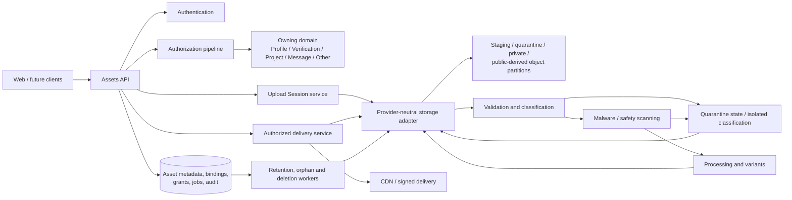
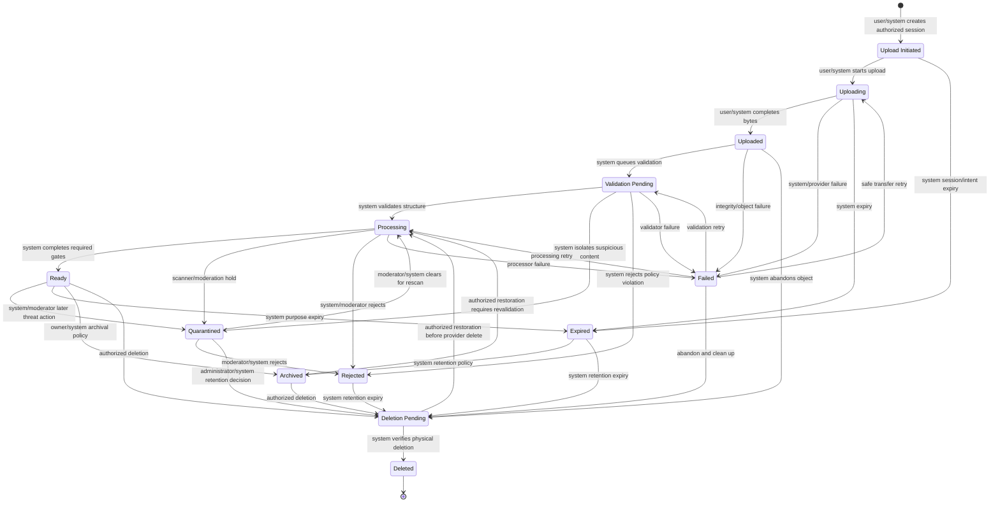
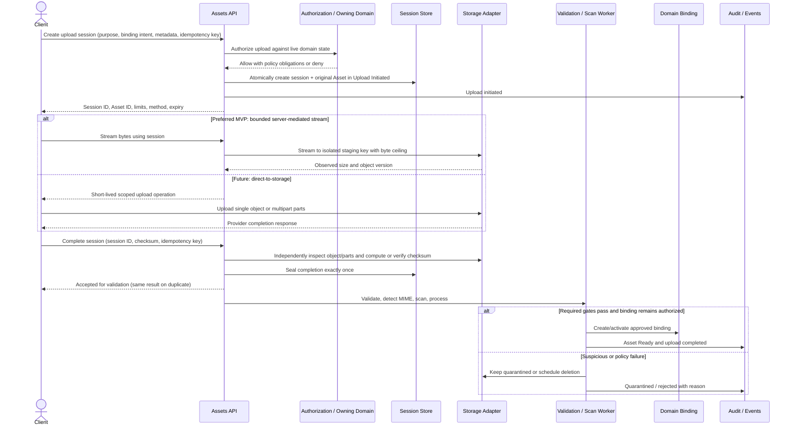
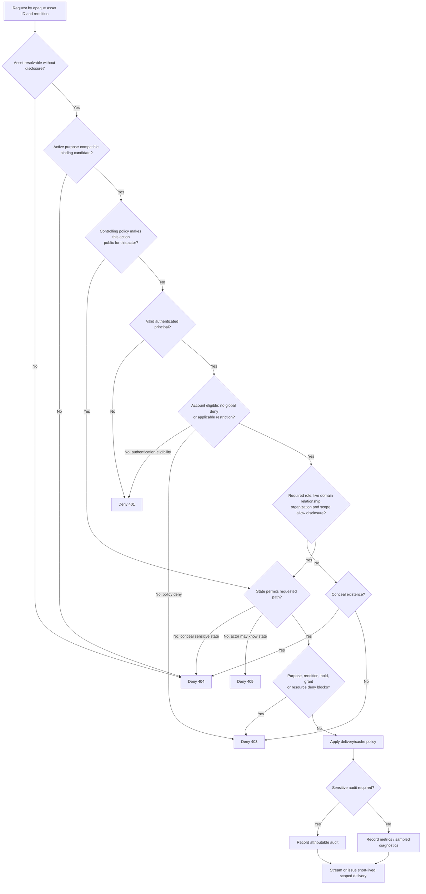
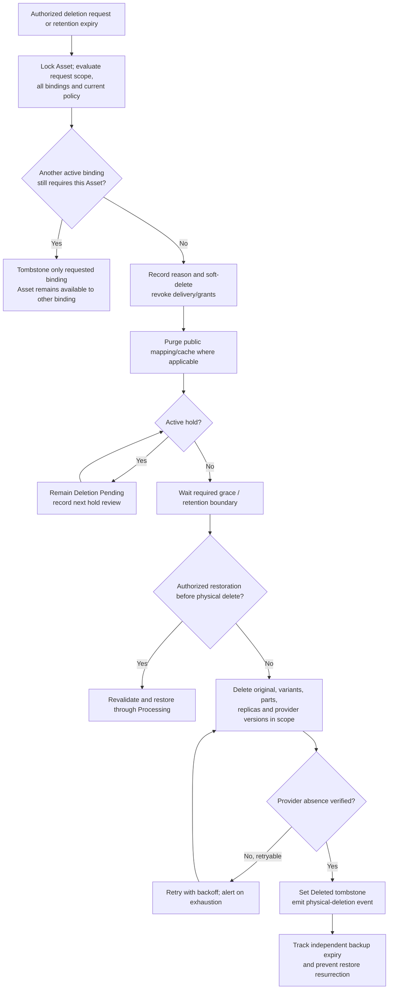
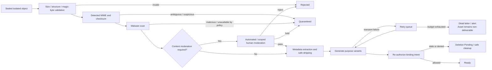
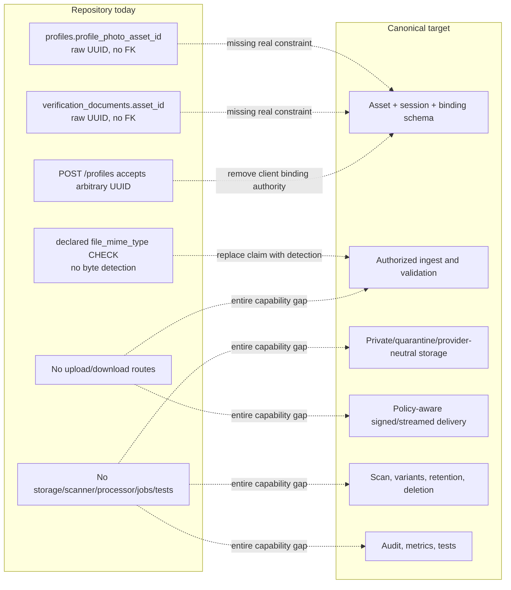
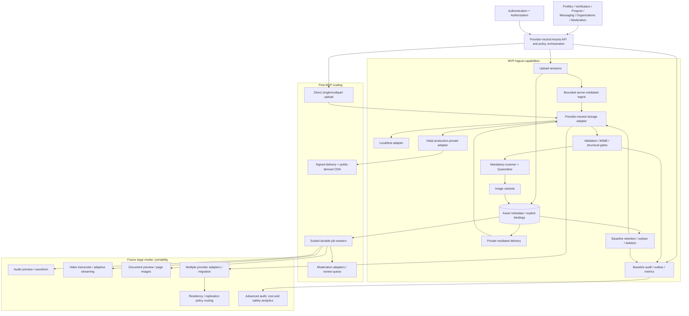

# MusicApp assets and media domain specification

| Field | Value |
|---|---|
| Document | MusicApp assets and media domain specification |
| Domain | Assets and Media (`03-identity-profiles-verification/`) |
| Document ID | SPEC-ASSET-000 (provisional — see §4.1) |
| Type | Specification (SPEC) |
| Status | Approved |
| Version | 1.1.0 |
| Owner | Engineering (interim: repository maintainers) |
| Repository branch | `docs/specification-foundation` |
| Last Reviewed | 2026-07-23 |
| Applies To | All MusicApp platform-managed uploads, stored objects, derived media, bindings, and file delivery |
| Related documents | [`product-overview.md`](../01-foundation/product-overview.md), [`system-architecture.md`](../01-foundation/system-architecture.md), [`users.md`](../02-users-roles-permissions/users.md), [`authentication.md`](../02-users-roles-permissions/authentication.md), [`authorization.md`](../02-users-roles-permissions/authorization.md), [`roles.md`](../02-users-roles-permissions/roles.md), [`profiles.md`](../02-users-roles-permissions/profiles.md), [`verification.md`](verification.md), [`user-settings.md`](user-settings.md) |
| Supersedes / Superseded By | None |

This document follows [`docs/00-governance/README.md`](../00-governance/README.md) (GOV-000). It is the canonical product specification for platform-managed assets, uploads, media files, storage objects, processing, retention, and access-controlled delivery. It replaces no existing document. `DATA-ASSET-001` canonically elaborates and replaces only the minimal Asset-entity placeholder in `profiles.md` `DATA-PROFILE-003` (forwarded by `verification.md` `DATA-IDENTITY-003`); those entries are no longer co-authoritative Asset definitions. Profiles and Identity Verification remain authoritative for their purpose eligibility, bindings, lifecycle facts, and retention decisions.

**Specification availability:** every document linked above exists at the time of writing. No `permissions.md` exists anywhere in the repository, so this specification relies on the permission model in `authorization.md` §25 and does not cite a nonexistent Permission catalog.

**Status taxonomy:** feature classification follows [`system-architecture.md`](../01-foundation/system-architecture.md) §2.3 and claim labeling follows GOV-000 §23. Product status uses **Implemented**, **Partially Implemented**, **Schema Implemented**, **Planned**, and **Proposed**. The task-required **Not Implemented** is an additional repository-absence observation, never a replacement product status and never a reason to remove a Planned capability. “Planned” maps to GOV-000's **Approved (future)** claim label.

**Approval basis and governance debt:** the supplied task explicitly accepts the canonical decisions in this specification, which is the review/acceptance basis for metadata status **Approved**. The missing cross-cutting ADR, architecture-map placement, governed token, and glossary entries remain mandatory governance follow-up; they are disclosed in §4/§30 rather than treated as completed. The inherited discovery/review-ownership conflicts do not change the shared file identity, validation, storage, delivery-control, or deletion architecture defined here.

**Content separation:** canonical product decisions are in §6–§21; repository facts and evidence are in §22; security findings are in §23; implementation comparison is in §24; intentional future architecture is in §25; risks, assumptions, and unresolved decisions are in §28–§30. No repository absence is used to narrow the target architecture.

## 1. Executive summary

An Asset is an immutable, storage-backed domain record for one logical managed-file byte identity: either an original or one derivative. It may have multiple physical provider-object locations or copies for replication and migration, but each derivative remains a separate Asset. It is not a raw URL, not a browser path, and not proof that an actor may read the bytes. The database stores an immutable Asset ID and a restricted internal locator set; the Assets service evaluates the Asset's purpose, live binding, state, and owning-domain authorization before it permits delivery. Public delivery is explicit and limited to policy-approved, `Ready` variants. Restricted originals never become public merely because their identifiers are known.

The target architecture supports small server-mediated uploads for the MVP and provider-neutral direct-to-storage sessions for larger future media. Every path converges on the same untrusted-ingest boundary: declared metadata is checked against stored bytes, content is classified, malware and safety policy run before availability, immutable originals are separated from derived variants, and only then can an Asset become `Ready`. Soft deletion hides and revokes an Asset before asynchronous physical deletion; bindings, variants, holds, backups, and audit history are handled deliberately rather than assuming a deleted database reference removed an object.

**Repository result: the Assets domain is Not Implemented.** There is no `assets` table, upload or download API, multipart parser, storage adapter or configuration, signed-URL support, content detector, malware scanner, processor, cleanup job, asset UI, or automated asset test. Two plain UUID columns anticipate the missing table:

- `profiles.profile_photo_asset_id UUID NULL` (`backend/db/002_create_profiles.sql:27`);
- `verification_documents.asset_id UUID NOT NULL` (`backend/db/004_create_verification_documents.sql:33`).

Neither column has an actual foreign key to `assets`; each has only an inline future-work comment. The migrations do not require an `assets` relation and can structurally execute without one; no live clean-database migration was rerun for this review. They cannot enforce that either UUID resolves. `POST /profiles` is an important nuance: it accepts `profile_photo_asset_id` from an unauthenticated client and writes that arbitrary UUID (`backend/Index.js:129-185`). The repository can therefore persist an unresolved avatar marker, but it cannot persist, validate, locate, or deliver avatar bytes. No route writes `verification_documents`, so identity-document metadata has only a Schema Implemented table and no application path. These independently verified facts refine the shared gap recorded by `profiles.md` §25.1 `SEC-PROFILE-005` and `verification.md` §27.1 `SEC-VERIFY-001`.

## 2. Purpose

The Assets and Media domain gives every platform-managed file one durable identity and one controlled lifecycle, independent of any storage vendor. It exists so Profiles, Verification, Projects, Messaging, Disputes, Reviews, Organizations, Moderation, and system workflows can bind files without inventing separate upload, storage, delivery, and deletion mechanisms.

This domain owns file ingest, byte-level validation, storage location, processing state, variants, delivery mediation, object deletion, and asset audit events. The domain that binds an Asset remains the source of truth for the business relationship that permits access. Assets asks that domain for a decision; it does not infer authorization from `owner_user_id`, a filename, a URL, or possession of an Asset ID.

## 3. Scope

This specification covers:

- Asset identity, ownership metadata, purpose, visibility, states, and lifecycle;
- upload sessions, server-mediated and direct uploads, validation, scanning, quotas, retries, and idempotency;
- provider-neutral object storage, logical partitions, keys, encryption, environments, backups, restore, and migration;
- authenticated and public delivery, signed URLs, caching, CDN use, byte ranges, filenames, and revocation;
- bindings, grants, variants, processing jobs, retention, holds, archival, restoration, and deletion;
- security, audit, observability, repository comparison, migration, and staged implementation.

It does not own:

- Profile field semantics, Avatar/Banner display rules, or Profile lifecycle — [`profiles.md`](../02-users-roles-permissions/profiles.md);
- verification attempts, reviewer assignment, or approval decisions — [`verification.md`](verification.md);
- account status and account-deletion state — [`users.md`](../02-users-roles-permissions/users.md);
- identity proof, sessions, or token delivery — [`authentication.md`](../02-users-roles-permissions/authentication.md);
- the common authorization pipeline, roles, permissions, relationships, or HTTP denial conventions — [`authorization.md`](../02-users-roles-permissions/authorization.md);
- Project, Messaging, Dispute, Review, Organization, or Moderation business lifecycles. Those domains supply bindings and access facts; this document supplies file controls;
- exact commercial storage vendor, CDN vendor, numeric quota, retention duration, or per-purpose byte limit where no owning product/compliance decision exists (§30).

### 3.1 Cross-document consistency and reconciliation

No contradiction prevents completion of this specification or requires editing another document in scope. Two existing Foundation-versus-domain contradictions—public Profile discovery and verification-review ownership—plus one architecture/governance placement gap remain explicitly tracked below and in §30. GOV-000 §3 makes Foundation controlling until each lower-layer conflict is reconciled through the required change/ADR. This document otherwise adopts:

- `authorization.md` §10.1's deny-by-default, live-state evaluation order, §27.1's `401`/`403`/`404`/`409` semantics, and §26.1's permanent-audit scope;
- `users.md` `BR-USERS-008`, `BR-USERS-009`, and `BR-USERS-017`: hard-delete cascades are an exceptional repository behavior, soft deletion is the normal product path, and retention is policy-controlled rather than a fixed universal number;
- `profiles.md` `BR-PROFILE-018`: Profile deletion is soft by default;
- `verification.md` `BR-IDENTITY-014`–`017`: verification files use time-limited least-privilege delivery, restricted access, encryption at rest, and explicitly bounded retention.

One prior repository claim needs a documented refinement, not an edit. `profiles.md` §1 and §8.4 say `profile_photo_asset_id` is `NULL` for every Profile and cannot be populated. Source inspection shows `POST /profiles` accepts and inserts a client-supplied value (`backend/Index.js:144,162-183`), and no asset foreign key rejects it. Database contents were not inspected, so the universal “every row is NULL” claim is not verifiable from source alone. The precise current statement is: **an arbitrary, unresolved UUID marker can be persisted; no working Asset or file can be persisted or delivered.** The shared missing-foundation conclusion and `SEC-PROFILE-005` remain correct.

The task directs this document to define Assets as a shared logical domain/capability, but `system-architecture.md` §10 currently enumerates fourteen system domains and does not name Assets. This document does not silently declare a fifteenth independently deployed/top-level system domain. Architecture must decide whether Assets becomes a named domain or remains a cross-cutting shared capability, update the architecture map, and create the cross-cutting ADR GOV-000 §14 requires. Until then, “Assets domain” in this document names the logical ownership boundary defined here, not an already-registered deployment boundary.

`system-architecture.md` §10.11 says Moderation owns identity-verification review and approval/rejection, while `verification.md` §5.1 assigns submission, review, decision, and reviewer workflow to Identity Verification and limits Moderation to rejected/revoked cases. Assets does not choose a new owner: under GOV-000 §3, the Foundation statement controls pending reconciliation, while file access still consumes the owning User plus an explicitly authorized, Attempt-assigned review decision required by `BR-IDENTITY-015`.

`verification.md` §22 and §34.1 item 2 separately leave the named Reviewer role/permission mapping unresolved. `roles.md` §7.8/§7.9 defines Moderator and Administrator but no Reviewer role. Until that owner resolves the mapping, Assets denies review access by default and requires an explicit principal assignment to the specific Attempt plus the live owning policy; it does not equate Reviewer, Moderator, or Administrator.

## 4. Terminology and identifier governance

### 4.1 Identifier governance note

GOV-000 §11 permits `REQ-[DOMAIN]-*` and `BR-[DOMAIN]-*`, and §11.1 permits `SEC-*`, `DATA-*`, `INT-*`, and `AUD-*`, only for its enumerated domain tokens. `ASSET` and `MEDIA` are not enumerated. GOV-000 also does not define `EVT-*` or `OPS-*` families. Per this task's instruction, Governance is not modified and no unrelated governed token is reused.

Accordingly, `SPEC-ASSET-000`, `BR-ASSET-*`, `REQ-ASSET-*`, `SEC-ASSET-*`, `DATA-ASSET-*`, `INT-ASSET-*`, `AUD-ASSET-*`, `EVT-ASSET-*`, and `OPS-ASSET-*` are **provisional, document-local identifiers**. They are stable and unique within the current specification tree, but they do not become GOV-000-governed until Governance adds `ASSET` (or adopts another explicit mapping). `EVT-ASSET-*` and `OPS-ASSET-*` additionally require Governance either to approve those families or map their requirements into an existing governed family. Resolution is priority 1 in §30.

GOV-000 §14 also requires an ADR for a new cross-cutting standard. No Asset ADR exists and this task does not authorize creating one. The missing ADR and `system-architecture.md` domain-map decision are disclosed governance prerequisites, not silently treated as complete.

### 4.2 Domain terms

GOV-000 §22 requires canonical definitions in `docs/99-appendices/glossary.md`, but that file does not exist and this task permits staging only this specification. The definitions below are therefore document-local and provisional until the governed glossary is created; §30 tracks that dependency. They do not redefine any existing glossary entry because none is present.

| Term | Definition |
|---|---|
| Asset | Immutable domain record for one original or derived logical byte identity; it may have multiple physical provider-object locations/copies |
| Original | First accepted byte sequence for an upload; never overwritten after finalization |
| Variant | Separately stored Asset derived reproducibly from a parent Asset |
| Upload Session | Expiring authorization and state envelope for one intended upload or multipart upload |
| Purpose | Stable policy key describing why an Asset exists and which owning domain may bind it |
| Visibility | Coarse delivery classification; an input to, never a replacement for, Authorization |
| Binding | Auditable association between an Asset and an owning-domain record |
| Owner | User or Organization with product-level stewardship; not automatically every authorized reader |
| Uploader | Authenticated actor or System principal that supplied the bytes |
| Subject | Person, project, message, dispute, review, or organization depicted or documented |
| Storage Custodian | Assets service that controls provider credentials and object operations |
| Grant | Explicit, scoped, expiring access exception where owning-domain relationships are insufficient |
| Quarantine | Non-deliverable isolation for unvalidated, suspicious, or policy-held bytes |
| Soft Deletion | State transition that immediately denies ordinary access without yet removing stored bytes |
| Physical Deletion | Provider-confirmed removal of the original and all variants after retention and hold checks |
| Declared MIME Type | Untrusted client-supplied content type |
| Detected MIME Type | Server-derived classification based on bytes and approved detection logic |

### 4.3 Status interpretation

| Status | Meaning in this specification |
|---|---|
| Implemented | Complete, verifiable end-to-end behavior exists |
| Partially Implemented | Some usable behavior exists, but canonical controls or paths are missing |
| Schema Implemented | A relevant column/table/constraint exists without a functional end-to-end capability |
| Planned | Approved target behavior; implementation may be entirely absent |
| Proposed | Suggested extension not accepted by the supplied product architecture; none of the task-directed core controls are downgraded to this status |
| Not Implemented | Repository fact: no functioning implementation was found |

## 5. Ownership and domain boundaries

### 5.1 Ownership matrix

| Concern | Source of Truth | Assets Responsibility | Boundary |
|---|---|---|---|
| Asset ID, metadata, storage locator, state | Assets | Own and validate | Owning domains store/bind Asset IDs, never provider URLs |
| Upload authorization | Owning domain + Authorization | Enforce issued upload policy | Assets does not invent a Project/Profile/Message relationship |
| Download authorization | Authorization + live owning-domain state | Orchestrate and enforce | Asset ownership alone is insufficient |
| Profile Avatar/Banner meaning | Profiles | Validate, store, process, deliver | Profiles selects which Asset is current |
| Verification document review | **Ownership unresolved:** Foundation §10.11 says Moderation; `verification.md` §5.1 says Identity Verification | Restrict, encrypt, deliver, retain after an authorized decision | Assets consumes Attempt assignment/authorization and does not choose workflow owner |
| Project/Message/Dispute/Review relationships | Respective owning domain | Consume relationship decision | Assets does not define participants |
| Organization membership | Organizations/Authorization (Planned) | Consume scoped decision | No organization access from a raw `organization_id` |
| Malware scan | Assets/security integration | Own ingest gate and result | Distinct from semantic moderation |
| Content moderation | Moderation + owning domain | Hold and execute decisions | Malware-free does not mean policy-safe |
| Provider credentials and object operations | Assets platform adapter | Own custody | Credentials never reach browser or domain tables |
| Account/Profile deletion | Users/Profiles | Apply asset retention/deletion consequences | Does not redefine their lifecycle |
| Audit policy | Assets + Authorization | Record file events | High-risk authorization scope remains owned by Authorization |

### 5.2 Actor separation

Uploader, owner, subject, bound-domain record, viewer, and storage custodian may all differ. A User may upload a Project Deliverable owned by the commercial Project, depicting a third party, read by the buyer and seller, while the platform remains storage custodian. Each role is stored or derived independently. The subject comes from the explicit owning-domain relationship/projection (or a purpose-specific subject join where persistence is required), never by inference from uploader or owner. Changing one role never silently changes the others.

## 6. Canonical Asset architecture

### 6.1 Canonical principles

| # | Principle | Trace |
|---|---|---|
| 1 | Every managed file has an immutable Asset ID; provider URLs are not identities. | `BR-ASSET-001` |
| 2 | Originals are immutable; replacement creates a new Asset and binding revision. | `BR-ASSET-002` |
| 3 | Asset records store provider-neutral metadata and internal object locators, never permanent delivery URLs. | `BR-ASSET-003` |
| 4 | Public delivery is explicit, deny-by-default, state-aware, and purpose-aware. | `BR-ASSET-004` |
| 5 | Visibility is only one input; live owning-domain Authorization decides access. | `BR-ASSET-005` |
| 6 | Upload and download are separate capabilities and decisions. | `BR-ASSET-006` |
| 7 | Verification Documents and Selfies are restricted, encrypted, and never public. | `BR-ASSET-007` |
| 8 | Project Deliverables and Revisions remain participant-restricted until an owning-domain release rule explicitly changes access. | `BR-ASSET-008` |
| 9 | Message Attachments inherit current conversation access. | `BR-ASSET-009` |
| 10 | Client MIME, extension, filename, checksum, and completion claims are untrusted until independently verified. | `BR-ASSET-010` |
| 11 | Malware scanning, technical validation, and content moderation are separate gates with separate results. | `BR-ASSET-011` |
| 12 | Risky bytes remain quarantined or otherwise non-deliverable until required gates succeed. | `BR-ASSET-012` |
| 13 | Derived outputs are separately identifiable Assets linked to an immutable original and processing recipe. | `BR-ASSET-013` |
| 14 | Soft deletion revokes access before asynchronous physical deletion. | `BR-ASSET-014` |
| 15 | Deleting a binding or database row never counts as provider-confirmed physical deletion. | `BR-ASSET-015` |
| 16 | Orphans and abandoned upload objects are detectable and reclaimable after policy grace periods. | `BR-ASSET-016` |
| 17 | Holds and owning-domain retention override ordinary deletion deadlines. | `BR-ASSET-017` |
| 18 | Restricted data uses encryption in transit and at rest; object URLs never bypass policy. | `BR-ASSET-018` |
| 19 | Storage adapters and keys preserve provider portability at the domain-model boundary. | `BR-ASSET-019` |
| 20 | Sensitive access, mutations, bindings, moderation, and deletion are attributable and auditable. | `BR-ASSET-020` |
| 21 | Deduplication must not reveal another actor's content or collapse independent ownership/retention obligations. | `BR-ASSET-021` |
| 22 | Temporary sessions, grants, and delivery URLs expire and cannot be treated as durable authorization. | `BR-ASSET-022` |

### 6.2 Asset domain architecture

*All Asset-specific services, stores, workers, and delivery components are Planned. The existing web client, owning-domain fragments, Authentication, ad hoc Authorization, and PostgreSQL retain their separately documented statuses. The diagram describes target logical relationships, not repository topology.*

## 7. Asset purposes

### 7.1 Size-policy classes

Exact byte values are deployment policy pending §30. The class is nevertheless mandatory and server-enforced:

| Class | Intended envelope | Rule |
|---|---|---|
| `IMG-S` | Avatar, logo, evidence image | Bounded still-image limit plus decoded-pixel ceiling |
| `IMG-L` | Banner, portfolio image | Larger still-image limit plus stricter decoded-pixel ratio controls |
| `DOC-SENSITIVE` | Identity and review evidence | Small document/image limit; no archive or executable content |
| `AUDIO-M` | Portfolio audio | Medium object limit plus decoded-duration ceiling |
| `VIDEO-L` | Portfolio video | Large-object/multipart limit plus duration and codec policy |
| `ATTACH-M` | Project, message, dispute attachment | Medium purpose-specific limit; file-class allowlist required |
| `EXPORT-L` | System-generated export | Server-created limit; short expiry and forced download |
| `DENY` | Unknown/future purpose | No upload until a reviewed policy replaces `DENY` |

### 7.2 Asset purpose matrix

| Purpose | Owner Domain | Uploader | Authorized Readers | Visibility | File Classes / Size Policy | Retention | Processing / Moderation | Deletion Constraints | Repository Status |
|---|---|---|---|---|---|---|---|---|---|
| Profile Avatar | Profiles | Profile owner or scoped delegate | Public after Profile and Asset policy; owner/admin before release | Public (eligible, not default) | Raster image / `IMG-S` | Current plus replacement grace; follows Profile retention | Scan, strip metadata, crop and responsive variants; image safety policy | Unbind current reference first; holds override | Schema Implemented marker only; no file path |
| Profile Banner | Profiles | Profile owner or scoped delegate | Same as public Profile visibility | Public (eligible, not default) | Raster image / `IMG-L` | Current plus replacement grace; follows Profile retention | Scan, strip metadata, banner crops; image safety policy | Same as Avatar | Not Implemented |
| Identity Verification Document | Identity Verification | Owning User through active Attempt | Owning User or explicitly authorized, Attempt-assigned review principal | Relationship Restricted | Approved raster image; PDF disabled pending §30 / `DOC-SENSITIVE` | Explicitly bounded compliance period; exact period open | Technical validation, malware scan, document-quality checks; no public moderation | Verification/legal hold; never public; deletion audited | Schema Implemented metadata/reference only |
| Verification Selfie | Identity Verification | Owning User through active Attempt | Owning User or explicitly authorized, Attempt-assigned review principal | Relationship Restricted | Raster image / `DOC-SENSITIVE` | Same bounded verification policy | Scan, orientation/quality processing; identity-review controls | Same as Verification Document | Schema Implemented metadata/reference only |
| Portfolio Image | Profiles (Portfolio capability) | Profile owner or scoped delegate | Profile visibility and portfolio policy | Public or Authenticated | Raster image / `IMG-L` | While item active plus replacement/deletion grace | Scan, strip metadata, thumbnails; moderation as published content | Unbind portfolio item; holds override | Not Implemented |
| Portfolio Audio | Profiles (Portfolio capability) | Profile owner or scoped delegate | Profile visibility and portfolio policy | Public or Authenticated | Approved audio / `AUDIO-M` | While item active plus policy grace | Scan, metadata extraction, waveform/preview; rights/moderation workflow | Original retained only per portfolio policy; delete all variants | Not Implemented |
| Portfolio Video | Profiles (Portfolio capability) | Profile owner or scoped delegate | Profile visibility and portfolio policy | Public or Authenticated | Approved video / `VIDEO-L` | While item active plus policy grace | Scan, metadata extraction, thumbnail/transcode; moderation | Large-object and variant cleanup must complete | Not Implemented |
| Project Brief Attachment | Projects | Authorized buyer/proposer | Current authorized project participants | Relationship Restricted | Approved attachment classes / `ATTACH-M` | Project/commercial retention policy | Scan, safe preview where supported; no automatic public release | Project, dispute, financial, and legal holds | Not Implemented |
| Project Deliverable | Projects | Authorized seller/participant | Current authorized project participants; others only after explicit release | Relationship Restricted | Approved media/document classes / `ATTACH-M`; larger media disabled until a purpose class is approved | Project/commercial retention policy | Scan; preview/transcode by class; contractual moderation only where required | Financial/dispute/legal holds; immutable submitted original | Not Implemented |
| Project Revision | Projects | Authorized seller/participant | Current authorized project participants | Relationship Restricted | `ATTACH-M`; larger media disabled until approved | Preserve revision history per project retention | Same as Deliverable; link revision without overwriting | Cannot replace prior evidence; holds apply | Not Implemented |
| Message Attachment | Messaging | Authorized conversation participant | Actors with current conversation access | Relationship Restricted | Approved attachment classes / `ATTACH-M` | Inherits message retention and moderation holds | Scan, safe preview, content-policy escalation | Conversation deletion is not automatic object deletion; holds apply | Not Implemented |
| Dispute Evidence | Disputes (resolved 2026-09-25; see [`disputes.md`](../09-moderation-trust-safety/disputes.md#123-preservation-against-deletion-or-tombstoning)), exercised jointly with a future Moderation case | Authorized case party, assigned Moderator, or Administrator | Case parties as owning policy permits; assigned Moderator/Administrator | Relationship Restricted | Approved evidence classes / `ATTACH-M` | Dispute, financial, legal, and regulatory policy | Scan, preserve original hash, limited preview; case moderation | Legal/dispute hold overrides erasure until release | Not Implemented |
| Review Evidence | **Unresolved — Ratings or Moderation** | Authorized case actor or assigned Moderator | Case-scoped actor, assigned Moderator, explicitly authorized Administrator | Relationship Restricted | Approved evidence / `DOC-SENSITIVE` | Review/moderation retention policy | Scan, preserve provenance, moderation | Case/legal hold; no public delivery by default | Not Implemented |
| Organization Logo | Organizations | Scoped organization member | Public after organization policy | Public (eligible, not default) | Raster image / `IMG-S` | Current plus replacement grace; organization retention | Scan, strip metadata, responsive variants; image moderation | Membership loss does not itself delete organization asset | Not Implemented |
| Organization Banner | Organizations | Scoped organization member | Public after organization policy | Public (eligible, not default) | Raster image / `IMG-L` | Current plus replacement grace; organization retention | Scan, strip metadata, banner crops; image moderation | Same as Organization Logo | Not Implemented |
| System-Generated Export | Requesting domain; System is custodian/generator | System for authorized requester | Requester and explicitly granted recipients | Owner Only or System Only | Server-created archive/document / `EXPORT-L` | Short configured expiry unless owning policy requires longer | Generate asynchronously, scan package where applicable, force download | Expiry schedules deletion; no permanent public link | Not Implemented |
| Moderation Evidence | Moderation | Moderator, trusted system, or report flow | Assigned Moderator and explicitly authorized Administrator | Moderator Restricted | Approved evidence classes / `ATTACH-M` | Moderation/legal retention and hold policy | Scan, provenance/hash preservation, restricted preview | Hold and immutable audit requirements | Not Implemented |
| Future Asset Purpose | Unassigned until approved | None by default | None by default | Quarantined | `DENY` | None; reject or expire session | No processing except safe rejection | Cannot bind or deliver until policy review | Not Implemented; deny-by-default extension point |

## 8. Asset visibility

### 8.1 Asset visibility matrix

| Visibility | Candidate Reader | Required Decision | Delivery / Cache Rule | Examples |
|---|---|---|---|---|
| Public | Authenticated while Foundation `REQ-FOUNDATION-004` controls; anonymous only after approved reconciliation | Asset `Ready`; active public binding; purpose allows public variant; owning resource publicly visible; controlling discovery rule satisfied | Sanitized derived variant may use a platform/CDN mapping; anonymous mapping remains disabled pending §30; original remains private unless explicitly permitted | Avatar, Banner, Organization Logo |
| Authenticated | Any valid eligible account | Authentication plus purpose/resource-state policy | Short-lived signed or mediated delivery; private cache | Authenticated-only portfolio |
| Relationship Restricted | Actor with live resource relationship | Authenticate; owning-domain relationship; resource state; explicit denies | Short-lived signed URL or streamed response; no shared cache | Project file, Message Attachment, Verification file, Dispute/Review Evidence |
| Organization Restricted | Actor in current scoped organization role/membership | Authenticate; live membership and permission; explicit denies | Short-lived private delivery; organization-scoped audit as required | Internal organization media |
| Moderator Restricted | Assigned or permitted Moderator | Authenticate, role/permission, case scope, purpose, reason where required | Very short URL; no shared cache; permanent audit | Moderation Evidence or a distinct moderator-only case rendition |
| Administrator Restricted | Explicitly permitted Administrator | Authenticate, permission, purpose, step-up/reason where required | Very short URL; no shared cache; permanent audit | Exceptional compliance access |
| Owner Only | Current owner under owning-domain policy | Authenticate; live ownership; resource state; no overriding hold/restriction | Short-lived private delivery | Unreleased export |
| System Only | Named service/System principal | Workload authentication, least-privilege operation, job scope | No browser URL; service-to-service object access | Processing source, internal export |
| Quarantined | Scanner, processor, assigned Moderator where policy allows | Explicit quarantine capability and purpose; never ordinary user access | Isolated partition; no CDN; permanent audit for human access | Suspicious upload |
| Deleted | Named audit/reconciliation System principal for tombstone metadata only | Ordinary byte access always denied; provider absence already verified; tightly scoped tombstone authorization | No delivery URL and no live object; minimized tombstone metadata only | Provider-confirmed deletion tombstone; pre-delete recovery is `Deletion Pending` |

Visibility is not authorization. Resolution is deterministic and deny-by-default (§17): internal resolution, controlling public/Authentication rule, account and owning-domain relationship/resource checks, lifecycle state, purpose/denies/holds/grants, requested rendition, and audit obligations. Knowing an Asset ID, storage key, prior signed URL, or `owner_user_id` never skips those steps.

## 9. Asset states

Asset lifecycle state is independent of upload-session state, `malware_scan_status`, `moderation_status`, visibility, and processing-job state. A scanner can fail while an Asset remains `Quarantined`; a variant job can run while its already-`Ready` original stays `Ready`.

The canonical persistence point is deterministic: an authorized create-session transaction creates both one `asset_upload_sessions` row and its one original `assets` row in `Upload Initiated`; a denied/failed session request creates neither. The session separately moves through `created`, `active/uploading`, `sealed`, `expired`, or `aborted` authorization/transfer states. First accepted bytes move the Asset to `Uploading`; sealing moves it to `Uploaded`. Session expiry moves its still-ingest Asset to `Expired` and schedules staging cleanup. A time-bounded Ready export can separately become Expired at `assets.expires_at`; the event records which clock caused the transition.

### 9.1 Asset state matrix

| State | Meaning | Object Expectation | Ordinary Delivery | Entry Actor / Trigger | Valid Next States | Required Evidence |
|---|---|---|---|---|---|---|
| Upload Initiated | Authorized intent exists; bytes not yet accepted | None or reserved staging key | No | User/System creates session | Uploading, Expired | session ID, purpose, policy snapshot, expiry |
| Uploading | Bytes are streaming or multipart parts are arriving | Partial staging object may exist | No | User/System begins transfer | Uploaded, Failed, Expired | transfer/provider upload ID, progress metadata |
| Uploaded | Provider reports complete bytes; claims remain untrusted | Complete staging object | No | User/System completes transfer | Validation Pending, Failed, Deletion Pending | observed object size, completion idempotency key |
| Validation Pending | Technical inspection is queued/running | Complete isolated object | No | System accepts completion | Processing, Quarantined, Rejected, Failed | validation job and policy version |
| Processing | Required scan/extraction/variant work is active | Original isolated/private; outputs incomplete | No for this Asset | System worker | Ready, Quarantined, Rejected, Failed | job attempts, scanner/processor versions |
| Quarantined | Suspicious, unscannable, policy-held, or awaiting scoped review | Isolated quarantine object | No; only scoped scanner/reviewer access | System scan or authorized Moderator | Processing, Rejected, Deletion Pending | reason code, hold source, decision audit |
| Ready | Required gates passed; purpose-appropriate rendition may be delivered | Durable original or complete variant | Yes, subject to §17 | System finalization only | Quarantined, Expired, Archived, Deletion Pending | detected metadata, successful gates, `ready_at` |
| Rejected | Permanently unacceptable for this upload/policy | May remain temporarily for evidence/grace | No | System validation or scoped Moderator | Deletion Pending | stable reason code; user-safe message |
| Expired | Time-bounded Asset is no longer deliverable | May remain during retention/grace | No | System session/purpose expiry policy | Archived, Deletion Pending | `expired_at`, `expiry_cause`, originating session `expires_at` or Asset `expires_at`, policy evaluation |
| Archived | Retained but inactive and non-deliverable | Durable archival/private object | No | System policy or authorized owner/admin action | Processing, Deletion Pending | `archived_at`, restoration eligibility |
| Deletion Pending | Soft-deleted; access revoked; physical deletion queued | Object may still exist | No | User/System/Moderator/Administrator under policy | Processing, Deleted | request actor, reason, holds evaluated, retry/restoration state |
| Deleted | Provider deletion verified or absence reconciled; tombstone remains | No live primary/variant object | No | System deletion worker | None | `deleted_at`, provider confirmation, audit tombstone |
| Failed | A non-policy workflow failed and cannot progress without retry/repair | Stage-dependent; always non-deliverable | No | System/provider failure | Uploading, Validation Pending, Processing, Deletion Pending | failed stage, error class, retry count |

Only `Ready` is ordinarily deliverable. Quarantine access is not delivery and requires an explicitly scoped operational/review capability. `Deleted` is terminal; recovery requires a new upload and Asset ID.

### 9.2 Asset state machine

*The state machine separates untrusted ingest, validation/processing, availability, archival/restoration, and provider-confirmed deletion; every restoration returns through Processing.*

All transitions not listed above are invalid. In particular: clients cannot set `Ready`; `Uploading`, `Archived`, and `Deletion Pending` cannot jump directly to `Ready`; `Quarantined` and `Rejected` cannot jump directly to `Ready`; deletion cannot bypass `Deletion Pending`; `Deleted` cannot be restored; and retry/restoration must return through the recorded validation/Processing path rather than guessing.

## 10. Asset lifecycle

### 10.1 Asset lifecycle matrix

| From | To | Trigger / Actor | Preconditions | Transactional Side Effects | Idempotency / Event | Invalid Reverse |
|---|---|---|---|---|---|---|
| None | Upload Initiated | User/System requests session | authenticated/authorized purpose, quota and rate checks | atomically create expiring session and paired original Asset; reserve policy snapshot | idempotency key returns same session/Asset; `EVT-ASSET-001` | N/A |
| Upload Initiated | Uploading | Client starts accepted transfer | session active; method/storage scope match | set first-byte time/provider upload ID | repeated start returns same session | Cannot change purpose/binding |
| Upload Initiated/Uploading | Expired | System session-expiry worker | originating session expiry reached; Asset not sealed | set `expired_at`/session cause, abort provider upload, schedule staging cleanup | expiry event; idempotent abort | Requires a new session/Asset to retry |
| Uploading | Uploaded | Client/provider completion | expected parts present; object within envelope | seal staging object; record observed bytes | duplicate completion returns prior result | Cannot append after sealing |
| Uploading/Uploaded/Validation Pending/Processing | Failed | System/provider stage failure | classified retryable or terminal technical failure; no policy acceptance implied | capture failed stage/error class; keep Asset non-deliverable | failure event; retry budget recorded | Cannot skip the failed stage |
| Uploaded | Validation Pending | System acknowledges complete object | object HEAD/read succeeds | enqueue validation; prevent delivery | `EVT-ASSET-002` | Cannot reopen upload |
| Uploaded | Deletion Pending | System abandons invalid/unrecoverable object | completion cannot safely progress; holds/retention evaluated | revoke intent; enqueue object cleanup | deletion request event | No validation after deletion starts without restoration |
| Validation Pending | Processing | Validator passes structural policy | size/type/name/shape checks pass | persist detected metadata/checksum | validation policy version recorded | Client cannot override results |
| Validation Pending | Quarantined | System finds suspicious/unknown input | reason code present | isolate object; revoke all ordinary access | `EVT-ASSET-003` | User cannot self-release |
| Validation Pending | Rejected | System finds deterministic disallowed input | stable rejection reason | expire binding intent; schedule cleanup | rejection event | Retry requires new upload |
| Processing | Ready | System completes mandatory gates | required scan clean; required derivatives complete; binding still authorized | finalize metadata; set `ready_at`; activate eligible binding | `EVT-ASSET-002` | Original never overwritten |
| Processing | Quarantined | Scanner/moderation gate requires isolation | reason/hold present | isolate and stop delivery | `EVT-ASSET-003` | No direct Ready release |
| Processing/Quarantined | Rejected | System or scoped Moderator rejects under policy | stable reason and attributable authority | keep non-deliverable; expire binding intent; schedule policy cleanup | `EVT-ASSET-003` | New upload required |
| Quarantined | Processing | System or scoped review clears for rescan | release authority and reason recorded; object still exists | retain isolation while enqueuing mandatory validation/scan/processing | release event; idempotent decision | Cannot jump directly to Ready |
| Ready | Quarantined | New threat intelligence or scoped moderation | explicit reason and authority | revoke delivery; purge applicable cache | security/moderation event | Release returns through Processing |
| Ready | Archived | Owner/System policy | no mandatory active binding; holds permit | disable delivery; set `archived_at` | lifecycle event | Restore only while bytes exist |
| Ready | Expired | System clock/purpose policy | `expires_at` reached | revoke delivery and grants | expiry event | No direct Ready without authorized renewal/rebind |
| Expired | Archived | System retention policy | archival is allowed and bytes remain | move/mark archival tier through adapter; retain non-deliverable state | archival event | Restoration returns through Processing |
| Ready/Archived/Expired/Rejected/Quarantined | Deletion Pending | Authorized request or retention worker | all bindings/holds evaluated; reason recorded | soft-delete, revoke URLs/grants, enqueue variants/object cleanup | `EVT-ASSET-004` | Restoration only before provider deletion and if policy permits |
| Archived/Deletion Pending | Processing | Explicitly authorized restoration | bytes still exist; provider deletion has not started; owning-domain policy permits; hold/state rechecked | cancel deletion lease if applicable; increment version; enqueue mandatory revalidation | restoration event; idempotent request | Cannot return directly to Ready |
| Deletion Pending | Deleted | System deletion worker | originals/variants removed or verified absent; binding tombstones retained | confirm provider deletion; set `deleted_at`; schedule backup expiry tracking | `EVT-ASSET-005` | Terminal |
| Failed | Uploading, Validation Pending, or Processing | System/operator retries the recorded failed stage | retryable class and budget; same immutable input; target equals recorded stage | increment attempt; keep non-deliverable | job idempotency key | No silent stage change or skip |
| Failed | Deletion Pending | System/operator abandons failed workflow | retry exhausted or policy abandonment; holds/retention evaluated | revoke intent; enqueue cleanup | deletion request event | No further retry once provider deletion starts |

This matrix is exhaustive for the state transitions in §9. Grouped `From`/`To` cells represent the explicitly listed alternatives, not wildcard transitions. Lifecycle changes use optimistic versioning or row locks. A concurrent unbind, access request, retention hold, and deletion request must resolve against one current Asset version; an earlier Authorization result cannot override a newer hold or deletion state.

## 11. Upload architecture

### 11.1 Upload-session contract

Every upload begins with a transaction that creates an expiring `asset_upload_sessions` record and its original Asset in `Upload Initiated`, even for a server-mediated transfer. The request supplies intended purpose, proposed owning-domain binding, declared filename/type/size, optional checksum, and idempotency key. The server derives uploader identity, allowed file classes, maximum bytes, storage classification, required gates, and expiry; the client cannot choose a public bucket, arbitrary storage key, owner, or final visibility.

Session authorization is narrow: one uploader, one purpose, one intended binding scope, one maximum size, one allowed method, and one expiry. A session authorizes ingest only. It does not authorize binding, public release, download, or a later upload after expiry.

### 11.2 Preferred MVP and future upload paths

| Path | Product Tier | Flow | Advantages | Constraints |
|---|---|---|---|---|
| Server-mediated streaming | **Preferred MVP** for bounded images and documents | Client streams to backend; backend enforces byte ceiling while streaming through provider-neutral adapter into staging/quarantine | Simple policy boundary, works with local adapter, no browser storage credential | Never buffer entire file; reject large media until scalable path exists; backend bandwidth cost |
| Direct-to-storage single object | Post-MVP | Backend issues a narrowly scoped, expiring provider operation; client uploads to staging; backend verifies provider object on completion | Backend avoids byte relay; scalable for medium/large objects | Provider response is untrusted; no delivery before completion validation |
| Direct-to-storage multipart | Future large audio/video | Session creates provider multipart ID; parts upload with bounded scopes; completion lists/validates parts | Resume/retry and large-file scalability | More cleanup, checksum, quota, and duplicate-completion complexity |

“Multipart” at the provider layer is distinct from HTTP `multipart/form-data`. The MVP API may accept a streamed multipart form or raw body, but the adapter contract must not expose provider-specific multipart concepts to owning domains.

A **pre-signed upload** is the direct-to-storage form of that scoped operation: an expiring, single-session credential restricted to the reserved staging key, method, size/content constraints the provider can enforce, and—where supported—checksum. It carries no read/list/delete authority. The completion acknowledgement means only “sealed and accepted for asynchronous validation,” not “safe” or `Ready`.

### 11.3 Upload sequence

*Every allowed create request atomically establishes the expiring session and immutable original Asset identity; completion seals that same Asset for asynchronous validation.*

### 11.4 Completion, integrity, retry, and cleanup

- Completion is idempotent on `(upload_session_id, completion_idempotency_key)`. The same request returns the same Asset/status; a conflicting body returns `409`.
- The service independently observes object size, object version/ETag where useful, parts, and checksum. Provider ETags are not assumed to be content hashes.
- Checksums protect integrity, not safety. The target default algorithm must be cryptographically strong and versioned; exact algorithm selection is §30.
- A transfer retry uses the same unexpired session only when its method permits safe resume. A sealed object never accepts more bytes.
- An expired or abandoned session closes provider multipart state and deletes staging parts after a configurable grace period. Cleanup is idempotent and observable.
- A client that loses the response polls the session/Asset state; it must not create a duplicate merely to discover completion.
- Deduplication, if enabled, is scoped to a compatible owner/security/retention boundary. No API reveals that another account uploaded identical content. Logical Asset identities and independent retention obligations remain distinct even if a provider safely shares physical blocks.
- Rate limits combine actor/account and source controls. Quotas cover concurrent sessions, daily bytes, retained bytes, object count, and purpose-specific limits. Values are centrally configured and never trusted from the client.

## 12. Download and delivery architecture

### 12.1 Delivery modes

| Mode | Eligibility | Authorization | URL / Cache | Content Behavior |
|---|---|---|---|---|
| Public derived delivery | `Ready`, public-eligible purpose, active public owning resource, approved safe variant; Authentication required while Foundation `REQ-FOUNDATION-004` controls | Re-evaluate at publication/binding and whenever issuing a new private-to-public mapping; block anonymous mapping pending §30 | Versioned opaque platform/CDN key; cache policy follows controlling discovery rule; purge on revoke; never raw provider key | Inline only for safe allowlisted image/audio/video types; `nosniff` |
| Authenticated endpoint | Any non-public eligible Asset | `GET /assets/{external_id}/delivery` evaluates current state and owning-domain policy | Response may stream or redirect to short-lived scoped URL; private/no-store metadata response | Disposition chosen by policy; sanitized display filename |
| Restricted signed delivery | Relationship/organization/moderator/admin/owner restricted | Fresh decision before every issuance; recipient/resource/variant scoped | Shortest practical configured expiry; no shared cache; no bearer JWT in URL | Original only when policy permits; otherwise safe preview/variant |
| System-to-system read | `System Only` processing/job scope | Workload identity and job authorization | No browser-accessible link | Stream through adapter; secrets and keys redacted |

The signed delivery credential is not persisted authorization. It is a separate, resource-scoped credential, never the user's access JWT (`authentication.md` §19.3). Exact TTLs are configurable by sensitivity and remain open (§30); Verification Documents use the shortest class and every retrieval is audited per `verification.md` §29.2 `AUD-IDENTITY-003`.

### 12.2 Delivery rules

- Authorize again before issuing each URL or starting each stream. Resolve current Asset state, active binding, live relationship/role, holds/denies, and requested original/variant.
- Already-issued URLs may remain usable until their short expiry. Immediate-revocation use cases require proxy/edge token introspection, cache purge, or a comparably enforceable control; URL expiry alone is not recall.
- Public keys are opaque, versioned, and limited to sanitized derivatives. Removing/public-hiding a binding stops new publication and triggers CDN purge; provider originals remain private.
- Audio/video supports valid `Range` requests after Authorization. Range bounds, aggregate bandwidth, and concurrent-stream limits are enforced; invalid ranges do not expose size to unauthorized actors.
- `Content-Disposition: inline` is limited to safe-render allowlists. Evidence, exports, unknown documents, and office files use `attachment`.
- Display filenames are normalized and escaped. Response headers never reflect raw control characters, path components, or untrusted MIME.
- `X-Content-Type-Options: nosniff` and the detected server MIME are used. User-declared MIME is never returned as authoritative.
- Link sharing is prohibited for restricted Assets unless the owning domain creates an explicit, scoped, expiring access grant. Forwarding an ordinary signed URL grants only its residual short lifetime and is treated as credential leakage.
- Hotlink controls may use signed CDN tokens, origin checks as a signal, rate limits, and versioned public URLs. `Referer` is not an authorization control.

## 13. File validation and content security

### 13.1 File-type policy matrix

| Class / Format | Allowed Purposes | Detection / Extensions | Inline Policy | Structural Limits | Active-Content and Processing Policy | Target Status |
|---|---|---|---|---|---|---|
| Raster images (JPEG, PNG, approved HEIC/HEIF) | Avatar, Banner, verification images, portfolio/evidence/logo | Magic-byte/container detection must match allowlisted MIME and compatible extension | Sanitized derived JPEG/PNG/WebP may be inline; restricted originals by policy | byte, decoded-pixel, width/height, frame-count, compression-ratio limits | Decode in sandboxed library; strip metadata into derivative; reject malformed/polyglot input | Planned |
| SVG | No user-upload purpose for MVP | Detect XML/SVG regardless of extension | Never inline from untrusted upload | N/A while denied | Reject; future enablement requires sanitization/rasterization, external-reference/script removal, and security review | Planned deny |
| PDF | Approved document/evidence purposes only; **verification eligibility remains open** | `%PDF` plus parser validation; `.pdf` consistency | Prefer forced download or sandboxed sanitized preview | bytes, pages, object count, nesting/decompression limits | Reject JavaScript, launches, embedded files, unsafe URLs/forms as policy requires; scan and render preview in isolation | Planned |
| Office documents | Project/message/evidence only if purpose policy later enables | Container and internal signature detection, not extension alone | Forced download; no platform inline rendering for MVP | bytes, expanded size, document-part limits | MVP default deny; future scan, macro/active-content policy, isolated preview conversion | Planned deny for MVP |
| Audio | Portfolio or approved project/message purposes | Container/codec detection with compatible extension | Approved transcoded variant may be inline | bytes, duration, channels, bitrate, sample-rate limits | Metadata extraction, scan, waveform/preview; reject malformed or unapproved codecs | Planned |
| Video | Portfolio or approved project/deliverable purposes | Container/codec detection with compatible extension | Approved transcode/stream only | bytes, duration, dimensions, frame rate, tracks limits | Scan, metadata extraction, thumbnail and transcode in isolated worker | Planned |
| User-supplied archive | None for MVP | Detect ZIP/tar/other signatures regardless of name | Forced download is still insufficient; reject | expanded bytes, entry count, depth, ratio would be mandatory if enabled | Reject by default due traversal, nested archive, bomb, and executable risk | Planned deny |
| Executable or script content | None | Detect executable headers, scripts, HTML, polyglots | Never | N/A | Reject and record reason; quarantine when threat investigation requires | Planned deny |
| System-generated export | Export only | Created by trusted generator, then independently inventory/scan | Forced download | output and entry-count limits | Randomized safe paths, manifest, expiry; no secrets/credentials | Planned |

The current `verification_documents.file_mime_type` CHECK accepts only the strings `image/jpeg`, `image/png`, `image/heic`, and `image/heif` (`backend/db/004_create_verification_documents.sql:49-51`). That is Schema Implemented declared-metadata validation, not byte detection and not a platform-wide allowlist.

### 13.2 Upload validation matrix

| Order | Gate | Trusted Input | Failure Result | Persisted Evidence |
|---|---|---|---|---|
| 1 | Authentication and upload capability | Current principal/session | `401`/`403`/concealed `404` | actor, decision/correlation ID |
| 2 | Owning-domain binding intent | Live domain record and relationship | `403`, `404`, or `409` | purpose, domain reference, policy version |
| 3 | Session, expiry, method, idempotency | Server session record | `409` or expired response | session/version/idempotency result |
| 4 | Rate and quota | Server counters/current retained usage | `429` or quota rejection | limit class, not sensitive raw filenames |
| 5 | Object existence and sealed completion | Provider read/HEAD through adapter | Failed / cleanup | provider object version and observed size |
| 6 | Byte size | Streamed/observed bytes | Rejected; terminate stream early | observed `size_bytes`, limit class |
| 7 | Cryptographic checksum | Server computation or trusted provider checksum | Failed or Rejected on mismatch | algorithm and checksum (restricted visibility) |
| 8 | Magic bytes and detected MIME | File bytes/parser | Rejected or Quarantined | detector/version and `detected_mime_type` |
| 9 | Extension/MIME consistency | Normalized name plus detected type | Rejected/Quarantined by policy | declared, detected, extension, mismatch reason |
| 10 | Structural decode | Sandboxed parser/decoder | Rejected/Quarantined | dimensions, duration, pages, codec/container |
| 11 | Bomb/path/active-content controls | Expanded structure and entries | Rejected/Quarantined | bounded reason, never unsafe extracted paths |
| 12 | Malware scan | Scanner result and signature version | Quarantined/Rejected | status, engine/signature version, timestamp |
| 13 | Metadata handling | Parsed metadata | Strip from derivative; Quarantine if unsafe | approved extracted fields only |
| 14 | Content moderation | Moderation service/human outcome where required | Quarantined/Rejected/restricted | policy/version, decision, actor if human |
| 15 | Binding re-authorization | Current owning-domain state | `409`/Deletion Pending if intent stale | live decision and binding event |
| 16 | Finalization | All mandatory results | Ready or Failed | immutable metadata, `ready_at`, events |

### 13.3 Distinct security gates

**Technical validation** asks whether bytes match an allowed, bounded, structurally safe file class. **Malware scanning** asks whether content contains known or suspicious malicious behavior. **Content moderation** asks whether otherwise valid and malware-free content violates product, safety, rights, or case policy. Passing any one gate says nothing about the other two. A checksum proves byte integrity, not legitimacy or safety.

Mandatory gates are purpose-specific, but any class capable of carrying active or malicious content remains unavailable until its scan policy completes. If scanning infrastructure is unavailable, sensitive or risky uploads fail closed in `Quarantined`; they do not become `Ready`.

### 13.4 Filename, path, metadata, and parser controls

- Preserve `original_filename` only as restricted audit/support metadata. Create `normalized_filename` using Unicode normalization (NFKC or a reviewed equivalent), length bounds, control/bidirectional-control removal or escaping, and safe display rules.
- Storage keys are generated opaque values. They never concatenate a user filename, path separator, `..`, drive prefix, URL, shell metacharacter, or tenant-supplied directory; path-traversal input therefore cannot influence a filesystem or object-store path.
- Extension is advisory and must be compatible with detected type. Multiple extensions and invisible/confusable characters are normalized or rejected according to policy.
- Archive extraction, document parsing, image decoding, and media probing run with time, memory, CPU, output-byte, nesting, and process isolation limits. No parser has provider credentials.
- Original bytes remain immutable. EXIF/GPS, camera/device identifiers, document author fields, embedded thumbnails, and similar metadata are stripped from public derivatives; approved evidence metadata remains restricted and access-controlled.
- No untrusted HTML, script, SVG, office macro, PDF active content, or executable is served inline. Detection of polyglot or ambiguous content defaults to Quarantine or Rejected.
- Validation errors use stable reason codes and safe user messages; logs do not include document contents, unrestricted checksums, raw storage keys, or sensitive filenames.

## 14. Storage architecture

### 14.1 Provider-neutral storage interface

Owning domains call Assets interfaces, never a vendor SDK. The internal adapter contract supports: reserve an opaque staging locator; stream/write with byte limits; create/complete/abort multipart upload; inspect object version/size/checksum; read a bounded range; copy/promote within policy; delete idempotently; verify absence; and create scoped expiring provider operations where the selected provider supports them. Adapter capability differences are surfaced explicitly; the domain model never embeds a vendor URL, SDK type, ETag interpretation, or credential.

Canonical object keys are opaque and generated, for example:

`<environment>/<classification>/<asset-id>/<object-generation>/<random-object-token>`

This is a shape, not a real bucket or environment value. Filenames, email addresses, handles, document types, project titles, and other user/domain data never appear in keys. The unique storage identity is `(storage_provider, storage_bucket, storage_key, object_generation)`, and only the Assets service can resolve it.

### 14.2 Storage classification matrix

| Classification | Content | Access Path | Encryption / Credentials | Cache | Lifecycle / Backup |
|---|---|---|---|---|---|
| Temporary Staging | Incomplete or newly completed untrusted upload | Session-scoped writer; validator read | Private, encrypted transport/at rest; write scope limited to reserved key | None | Short expiry; abort multipart and delete abandoned bytes; backup normally excluded |
| Quarantine | Suspicious, unscannable, or held untrusted bytes | Scanner and explicitly scoped review only | Separate logical/physical partition, restricted credentials, encrypted | None | Retain only per investigation/grace policy; never provider-public |
| Private Original | Immutable accepted originals not classed as high-sensitive evidence | Assets service, processor, authorized original delivery | Private, encrypted; least-privilege service credentials | No shared cache | Durable per owning-domain retention; versioning/backup by policy |
| Restricted Sensitive | Verification, dispute, review, moderation, or legally sensitive originals/derivatives | Purpose- and case-scoped service access | Strongest available encryption controls; optional managed-key reference; tightly scoped credentials | None | Explicit retention and hold; restore/access audited |
| Public Derived | Sanitized, approved derivative of a public-eligible Asset | Versioned CDN/origin mapping | Origin write private; public read only through approved distribution path | Public cache permitted with versioning/purge | Remove/purge when binding or policy ceases; reproducible where possible |
| Private Derived | Preview, thumbnail, transcode, waveform, or page image for restricted content | Same policy as parent or stricter | Private and encrypted | Private/no-store or bounded private cache | Deleted with parent unless independent policy requires retention |
| Archive | Inactive retained originals/variants | Restoration/deletion workers; exceptional authorized access | Private, encrypted, lower-cost tier allowed if retrieval controls persist | None | Retention clock/hold controlled; retrieval latency observable |
| Tombstone Metadata | Asset identity and deletion proof; no object bytes | Database/audit access only | Database controls | N/A | Preserved per audit/privacy policy; sensitive values minimized |

Public/private separation should use distinct buckets, accounts, or equivalently strong logical partitions and policies in production. A provider's “public bucket” setting is not required: public delivery may originate from a private bucket through an approved CDN. Quarantine and restricted evidence must not share a policy that permits anonymous reads.

### 14.3 Environments, credentials, and local/test storage

- **Local development:** a provider-neutral filesystem or emulator adapter stores randomized objects under an application-configured root outside source-controlled and web-served directories. It enforces the same state, path, size, and access contracts; local convenience never changes domain behavior.
- **Automated tests:** each run receives an isolated temporary namespace, deterministic fake adapter, or disposable emulator. Tests assert cleanup and never share production credentials or buckets.
- **Production:** approved durable object storage with private origins, encryption, auditable identity-based access, lifecycle support, and monitored deletion. Application instances receive minimum necessary workload credentials through a secret manager or deployment platform.
- Environments never share buckets, encryption contexts, signing keys, CDN distributions, or provider credentials. No credential, real bucket, secret, or actual environment value belongs in this specification or source control.
- Browser clients receive only one narrowly scoped upload or delivery operation after policy evaluation. They never receive provider account credentials, listing capability, wildcard prefix access, or encryption keys.

### 14.4 Durability, restore, lifecycle, and portability

| Concern | Canonical Requirement |
|---|---|
| Encryption | TLS for every transfer; provider encryption at rest for all objects; restricted classes use the strongest approved key/access policy and store only an opaque encryption-metadata reference |
| Backup | Metadata database backup is mandatory; object backup/versioning is classification- and retention-aware. Temporary/quarantine data is not copied indefinitely |
| Restore | Restore drills reconcile database records, object generations, variants, and deletion tombstones. A restore must not resurrect a soft/physically deleted Asset into deliverability |
| Object versioning | May protect operational recovery, but never permits a deleted old version to bypass lifecycle deletion; version IDs remain internal |
| Replication | Chosen by durability/residency policy, not assumed globally; replicated copies participate in deletion verification |
| Provider lifecycle | May transition/archive/delete only under policy generated from authoritative Asset state; provider rules do not independently decide business retention |
| Retention lock | Used only where a documented legal/evidence policy requires it; lock expiry and authority are auditable. It must not become blanket indefinite retention |
| Residency | Region and cross-border replication are policy inputs for restricted data; exact residency obligations require legal/compliance decision (§30) |
| Portability | Export manifests map Asset ID, checksum, object generation, classification, and target locator; dual-read/dual-write migration is controlled and reversible |
| Provider outage | Metadata remains authoritative; uploads/delivery fail safely or retry; no fallback silently weakens visibility, encryption, or residency |

## 15. Target data model

The models in this section are Planned. They describe logical contracts; exact PostgreSQL types, lookup-table versus enum choices, partitioning, and physical normalization are implementation decisions constrained by these rules.

### 15.1 `assets` (`DATA-ASSET-001`)

| Field | Logical Type | Canonical Rule |
|---|---|---|
| `id` | UUID | Immutable primary key; never recycled |
| `external_id` | text | Immutable, globally unique public/API identifier, consistent with platform conventions |
| `owner_user_id` | UUID nullable | FK to `users.id` where a User owns the Asset; not upload/read authorization by itself |
| `organization_id` | UUID nullable | FK when Organization schema exists; scope does not imply membership |
| `purpose` | stable policy key | Required; registered purpose only; Future Purpose remains denied |
| `visibility` | stable policy key | Required coarse class; evaluated with binding policy |
| `state` | stable state key | Required lifecycle state from §9 |
| `original_filename` | restricted text | Untrusted source name, bounded and never used as path |
| `normalized_filename` | text | Safe normalized display/download name |
| `declared_mime_type` | text nullable | Untrusted client claim |
| `detected_mime_type` | text nullable | Server detector result; required before Ready |
| `file_extension` | text nullable | Normalized extension; never authoritative alone |
| `size_bytes` | nonnegative integer nullable | Server-observed complete size; required after upload |
| `checksum_algorithm` | stable key nullable | Versioned approved algorithm |
| `checksum` | binary/text nullable | Server-verified content digest; restricted metadata |
| `storage_provider` | adapter key nullable logical projection | Current primary locator's provider; physically authoritative in `asset_storage_objects` (§15.4) |
| `storage_bucket` | restricted text nullable logical projection | Current primary locator's logical/physical partition; not independently writable |
| `storage_key` | restricted text nullable logical projection | Current primary opaque key; never a URL/filename; not independently writable |
| `object_generation` | restricted text nullable logical projection | Current primary immutable provider generation; authoritative in the object relation |
| `encryption_metadata_reference` | restricted text nullable logical projection | Current primary opaque encryption reference; never raw key material |
| `uploaded_by_user_id` | UUID nullable | FK to `users.id`; null only for a named System actor recorded separately |
| `uploaded_by_system_actor` | text nullable | Named scoped System principal; mutually constrained with uploader policy |
| `upload_session_id` | UUID nullable | FK to the originating upload session; unique for original user uploads |
| `parent_asset_id` | UUID nullable logical projection | Parent of a derived Asset; physically authoritative in `asset_variants` (§15.3), not duplicated independently |
| `variant_type` | stable key nullable logical projection | Required for derived Asset; physically authoritative in `asset_variants` |
| `width` | nonnegative integer nullable | Server-detected pixel width |
| `height` | nonnegative integer nullable | Server-detected pixel height |
| `duration_ms` | nonnegative integer nullable | Server-detected audio/video duration |
| `page_count` | nonnegative integer nullable | Server-detected document pages |
| `moderation_status` | stable key | Separate from lifecycle and malware state; default not-required/pending by purpose |
| `malware_scan_status` | stable key | Separate from lifecycle; includes pending/clean/suspicious/failed/version |
| `quarantine_reason` | reason code nullable | Required while Quarantined; safe structured code, sensitive detail elsewhere |
| `retention_policy_key` / `retention_policy_version` | stable keys | Versioned link selected by the owning decision; any re-evaluation is explicit and preserves the prior version in audit/history |
| `retention_eligible_at` | timestamp nullable | Earliest ordinary physical-deletion eligibility after owning policy; holds can defer it |
| `ready_at` | timestamp nullable | Set once when this Asset first becomes Ready |
| `expires_at` | timestamp nullable | Purpose expiration, not upload-session expiry |
| `expired_at` / `expiry_cause` | timestamp and reason code nullable | Records the actual Expired transition and whether the originating session, purpose clock, or another approved policy caused it |
| `archived_at` | timestamp nullable | Latest archive transition |
| `deletion_requested_at` | timestamp nullable | Soft-deletion request time |
| `deleted_at` | timestamp nullable | Provider-confirmed deletion time; terminal |
| `created_at` | timestamp | Immutable creation time |
| `updated_at` | timestamp | Last metadata/state update |
| `row_version` | nonnegative integer | Optimistic-concurrency token |

An Asset row is a durable identity/tombstone and is not hard-deleted in ordinary workflows. Sensitive internal fields are excluded from public and ordinary domain projections.

### 15.2 `asset_upload_sessions` (`DATA-ASSET-002`)

| Field Group | Required Logical Fields / Rules |
|---|---|
| Identity | `id`, unique `external_id`, immutable `created_at`, `updated_at`, `row_version` |
| Actor/scope | `uploader_user_id` or named System actor, `purpose`, intended owning-domain binding type/reference, requested organization scope |
| Declared envelope | original/normalized filename, declared MIME, declared bytes, client checksum/algorithm |
| Enforced policy | allowed file classes/extensions, `max_size_bytes`, storage classification, required gates, policy version |
| Transfer | method (`server_stream`, `direct_single`, `direct_multipart`), adapter key, opaque staging locator, provider upload ID, parts summary |
| State/timing | session state distinct from Asset state, `expires_at`, first-byte time, completed/aborted time |
| Idempotency | create idempotency key scoped to actor; completion idempotency key; immutable paired original Asset ID created with the session and returned unchanged before/after sealing |
| Observation | provider object generation, observed size/checksum, completion error/reason, cleanup status |

Session rows expire, but their minimal audit/idempotency history remains long enough to make retries safe. Provider upload credentials/tokens are never stored in plaintext audit fields.

### 15.3 `asset_variants` (`DATA-ASSET-003`)

`asset_variants` is the authoritative physical relationship for derived Assets:

| Field | Rule |
|---|---|
| `derived_asset_id` | PK and FK to `assets.id`; each derived Asset has at most one direct parent |
| `parent_asset_id` | FK to `assets.id`; cannot equal derived ID |
| `variant_type` | Stable purpose-compatible key (`avatar_256`, `banner_wide`, `thumbnail`, `audio_preview`, etc.) |
| `recipe_name` / `recipe_version` | Reproducible processor and policy version |
| `parameters_hash` | Hash of normalized transformation parameters, not arbitrary executable input |
| `created_at` | Immutable relationship creation time |

The logical `assets.parent_asset_id` and `assets.variant_type` fields are projections of this one authoritative relation. They must not become a second independently writable source. Unique `(parent_asset_id, variant_type, recipe_version, parameters_hash)` prevents duplicate current outputs where policy requires; a new recipe creates a new Asset rather than overwriting.

### 15.4 Bindings, grants, jobs, audit, storage-object, hold, and policy models

| ID / Model | Minimum Fields | Canonical Constraints |
|---|---|---|
| `DATA-ASSET-004` / logical `asset_bindings` | immutable binding ID, Asset ID, binding type/role, explicit domain FK through the physical join table, created/removed actor and timestamps, active flag/version | Logical union/read model over explicit domain join tables (§16); never the sole polymorphic integrity mechanism |
| `DATA-ASSET-005` / `asset_access_grants` | ID, Asset ID, grantee User/Organization/relationship scope, allowed action/variant, issuer, reason, starts/expires/revoked timestamps | Expiring, revocable, narrow; cannot override global deny, state, verification rules, legal hold, or owning-domain constraints |
| `DATA-ASSET-006` / `asset_processing_jobs` | ID, Asset ID, job type, recipe/policy version, state, priority, attempt, maximum attempts, available/started/finished times, lease owner/expiry, idempotency key, safe error code, dead-letter time | Unique idempotency key; leased/atomic claiming; no raw content in errors |
| `DATA-ASSET-007` / `asset_audit_events` | immutable event ID, type, Asset/session/binding ID, actor type/ID, action/result/reason, timestamp, correlation/request ID, owning-domain context, policy/version, safe metadata | Append-only/tamper-evident controls; no bytes, secrets, signed tokens, unrestricted keys, or unnecessary sensitive filename |
| `DATA-ASSET-008` / `asset_storage_objects` | ID, Asset ID, object role, provider/bucket/key/generation, classification, object state, size/checksum, encryption reference, primary/replica/migration role, copied/verified/deleted timestamps | Authoritative locator set; supports replicas, versions, source/target coexistence, and deletion verification; exactly one current primary per Asset/classification |
| `DATA-ASSET-009` / `asset_retention_holds` | ID, Asset ID, optional binding/domain scope, hold type, authority actor/reference, safe reason code, starts/review/expiry timestamps, state, released time/actor/reason, created/updated timestamps | Active hold blocks physical deletion; release is additive/audited; sensitive authority detail uses restricted projection |
| `DATA-ASSET-010` / `asset_retention_policies` | stable policy key/version, purpose/classification and owning-domain scope, active/replacement/orphan/backup rules, deletion eligibility expression, decision owner/reference, effective/retired timestamps | Immutable versioned policy registry; an Asset evaluation records the exact key/version and computed eligibility; no universal code constant or silent retroactive rewrite |

### 15.5 Constraints, indexes, and foreign keys

| Concern | Target Rule |
|---|---|
| Identity | PK on every `id`; unique immutable `external_id`; IDs never reused |
| Storage | `asset_storage_objects` uniquely constrains `(storage_provider, storage_bucket, storage_key, object_generation)`; locator fields projected on Asset are not independently writable |
| Upload result | Exactly one original Asset is created atomically with each authorized session; duplicate create/completion returns the same Asset |
| Required metadata | Ready requires storage locator, observed size, detected MIME, checksum where policy requires, completed mandatory gates, and `ready_at` |
| State timestamps | State/timestamp consistency checks (`Deleted` requires `deleted_at`, Quarantined requires reason, etc.) |
| Numeric safety | Sizes/dimensions/duration/pages nonnegative and inside server policy |
| Ownership | Purpose-specific check requires appropriate owner/binding; a System-only Asset may have no User/Organization owner |
| Variant graph | Parent and child differ; parent exists; service prevents cycles; derived state never mutates original state |
| Binding | Explicit FK-backed joins for core/sensitive domains; unique active slot constraints (one current Profile Avatar, one verification slot as owning domain defines) |
| Grants | `expires_at > starts_at`; revoked grants unusable; action/variant scope required |
| Jobs | Index claimable `(state, available_at, priority)`; unique idempotency key; lease expiry supports recovery |
| Retention | FK or validated stable reference to an immutable retention-policy key/version; index `state`, `retention_eligible_at`, `expires_at`, `deletion_requested_at`, active hold review/expiry, storage-object state, and orphan candidates for workers |
| Search/scoping | Index owner/purpose/state and organization/purpose/state; no public lookup by checksum/storage key |
| Audit | Index Asset/time, actor/time, correlation ID, event type; audit rows never cascade-delete with Asset |

The foundational migration must add real constraints only after existing values are audited:

- during compatibility migration, `profiles.profile_photo_asset_id → assets.id` is nullable with `ON DELETE SET NULL` and becomes a read-only/current-slot compatibility projection of the authoritative `profile_asset_bindings` history; after all readers migrate, the compatibility column is deprecated and removed rather than remaining a second source of truth;
- `verification_documents.asset_id → assets.id`, required and normally `ON DELETE RESTRICT`, because soft deletion/tombstones—not row deletion—own ordinary lifecycle.

The final Profile authority is the explicit binding/history join, while a Verification Document's direct required Asset FK is its explicit one-to-one file binding. `verification_documents.file_mime_type` remains historical declared metadata during migration; `assets.detected_mime_type` becomes the authoritative byte-derived type.

## 16. Ownership and domain bindings

### 16.1 Binding rules

| Bound Domain / Record | Binding Authority | Access Facts Supplied By | Replacement / Rebinding Rule | Integrity Rule |
|---|---|---|---|---|
| User | User-owned purpose policy or scoped Administrator | Users + Authorization | New binding event; account deletion starts retention evaluation | Explicit User FK |
| Profile | Profile owner/delegate under Profiles policy | Profile lifecycle/visibility + Authorization | Avatar/Banner replacement creates new Asset/current-slot binding; old binding retained as history then removed | Explicit Profile binding/FK; one active slot per role |
| Verification Attempt/Document | Verification submission/reviewer workflow | Owning User, Attempt assignment/status, and Authorization | Never rebound to another User/Attempt; resubmission creates a new Asset/document history | Explicit Verification FK; Asset purpose must match |
| Project | Authorized participant in valid Project state | buyer/seller relationship and Project state | Cross-project rebind denied; authorized copy creates a new binding/Asset policy decision | Explicit Project FK |
| Milestone | Authorized participant under Milestone state | Project relationship + Milestone state | Submitted original immutable; revision is new Asset/binding | Explicit Milestone FK |
| Deliverable/Revision | Owning Project workflow | Project participant/release/hold facts | Revision never overwrites predecessor; release policy owned by Projects | Explicit deliverable/revision FK when schema exists |
| Message | Authorized conversation participant | Current conversation access (`authorization.md` §16; `BR-AUTHZ-014` supplies the participant-read basis) | No unrelated-conversation rebind; append-only binding history | Explicit Message FK; removal tombstone preserves history |
| Dispute | Case participant or scoped Moderator/Admin | Case assignment, party visibility, hold | Never reusable outside case without new authorized evidence operation | Explicit Dispute FK |
| Review | Review/evidence workflow | Review parties and moderation scope | Case-bound; no public reuse by default | Explicit Review FK |
| Organization | Scoped organization member/delegate | Current membership/role + organization state | Member departure does not re-own Asset; replacement is organization-scoped event | Explicit Organization FK once schema exists |
| System | Named workload/job | Job purpose and service policy | Cannot be rebound to a User resource without explicit domain operation | Named System principal and job FK |

### 16.2 Explicit joins versus polymorphic bindings

Security-critical and lifecycle-owning bindings use explicit FK-backed domain columns or join tables. A generic `(domain_type, domain_record_id)` pair cannot enforce that a referenced Profile, Verification Attempt, Project, or Message exists, and therefore cannot be the sole authority for access or orphan detection.

`asset_bindings` is a **logical union/read model** over those explicit joins, useful for audit, cleanup, and cross-domain inventory. A physical registry may give every binding a common immutable ID, but the corresponding explicit join must still enforce the domain FK. A temporary polymorphic binding is acceptable only for an approved non-sensitive extension where the Assets service performs transactional existence checks and an implementation plan replaces it; it is never acceptable for Verification, Dispute, Moderation, or financial/project evidence.

Subject identity is supplied by those owning-domain relationships. Where subject lookup must be durable, the purpose-specific join stores it with a real FK and produces a restricted Asset projection; a generic `subject_user_id` on every Asset is neither required nor inferred from uploader/owner.

An existing binding's domain type, domain record, or purpose is immutable. “Rebinding” is remove/tombstone plus create, with fresh authorization and audit. Multiple active bindings to one Asset are allowed only when that purpose explicitly permits them and all bindings share compatible visibility, retention, encryption, and deletion policy. Otherwise, create a new Asset identity even if bytes are identical.

### 16.3 Asset binding model

```mermaid
erDiagram
    ASSET_UPLOAD_SESSIONS o|--|| ASSETS : "one session creates one original; Asset session optional"
    ASSETS ||--o{ ASSET_VARIANTS : "is parent"
    ASSET_VARIANTS o|--|| ASSETS : "identifies derived Asset"
    ASSETS ||--o{ ASSET_STORAGE_OBJECTS : "has locators / replicas"
    ASSETS ||--o{ ASSET_RETENTION_HOLDS : "may be held"
    ASSET_RETENTION_POLICIES ||--o{ ASSETS : "governs evaluated retention"
    ASSETS ||--o{ ASSET_PROCESSING_JOBS : "processed by"
    ASSETS ||--o{ ASSET_ACCESS_GRANTS : "may have"
    ASSETS ||--o{ ASSET_AUDIT_EVENTS : "produces"
    ASSETS ||--o{ PROFILE_ASSET_BINDINGS : "explicit FK join"
    ASSETS ||--o{ VERIFICATION_DOCUMENTS : "explicit FK target"
    ASSETS ||--o{ PROJECT_ASSET_BINDINGS : "explicit FK join"
    ASSETS ||--o{ MESSAGE_ASSET_BINDINGS : "explicit FK join"
    ASSETS ||--o{ DISPUTE_ASSET_BINDINGS : "explicit FK join"
    ASSETS ||--o{ ORGANIZATION_ASSET_BINDINGS : "explicit FK join"
    PROFILES ||--o{ PROFILE_ASSET_BINDINGS : "owns slot"
    PROFILE_VERIFICATIONS ||--o{ VERIFICATION_DOCUMENTS : "owns evidence"
    PROJECTS ||--o{ PROJECT_ASSET_BINDINGS : "owns context"
    MESSAGES ||--o{ MESSAGE_ASSET_BINDINGS : "owns context"
    DISPUTES ||--o{ DISPUTE_ASSET_BINDINGS : "owns context"
    ORGANIZATIONS ||--o{ ORGANIZATION_ASSET_BINDINGS : "owns context"
```

*`MESSAGES`, `DISPUTES`, `ORGANIZATIONS`, and their join tables are target concepts with no current schema. The diagram deliberately uses explicit joins rather than implying that a polymorphic identifier has database referential integrity.*

## 17. Asset access policy

### 17.1 Asset access matrix

| Action | Candidate Actor | Required Live Checks | Result / Delivery | Audit Expectation |
|---|---|---|---|---|
| Create upload session | Authenticated User or named System actor | account eligibility, owning-domain action, purpose, quota/rate, intended binding | scoped expiring session | Initiation event; denials per sensitivity |
| Upload bytes | Session holder | session actor/method/key/expiry/byte ceiling | staging only | Operational transfer record |
| Complete upload | Session holder | same actor, sealed object, idempotency, observed integrity | accepted for validation, never immediate unrestricted delivery | Completion attempt/result |
| Read public metadata | Authenticated under current Foundation rule; anonymous only after approved reconciliation | explicit public owning resource, controlling discovery rule, and approved projection | sanitized fields only | Metrics; no permanent per-read audit required |
| Read restricted metadata | Authorized related actor | current relationship/role/resource state; field projection | sanitized restricted projection | Permanent when high-sensitive/admin/reviewer |
| Download public variant | Authenticated under current Foundation rule; anonymous only after approved reconciliation | `Ready`, public-eligible purpose, active public binding, safe variant, controlling discovery rule | versioned platform/CDN stream or mapping | Aggregate metrics, abuse logging |
| Download private variant | Related/organization/owner actor | Authentication, live relationship, state, variant policy | short-lived private delivery | Restricted download event |
| Download original | Purpose-authorized actor only | All private checks plus original-specific entitlement | forced/inline per detected class | Permanent for verification/evidence/admin; policy-based otherwise |
| Create binding | Owning-domain-authorized actor/System workflow | Asset purpose/state/owner compatibility; domain record; no conflicting binding | immutable binding record | Permanent binding event |
| Remove binding | Owning-domain-authorized actor/System workflow | current binding, lifecycle/hold/other binding checks | tombstone; may start orphan grace | Permanent binding event |
| Replace/rebind | Owning-domain-authorized actor | separate remove/create decisions; target compatibility | new immutable binding; never silent update | Both events and reason |
| Archive | Owner/System/explicit Administrator | owning lifecycle and holds | revoke delivery; retain bytes | Permanent lifecycle event |
| Request deletion | Owner/System/Moderator/Admin as purpose permits | purpose retention, all bindings, holds, actor scope | immediate soft deletion or scheduled eligibility | Permanent request/reason |
| Restore | Explicitly authorized actor before physical deletion | Archived/pre-delete state, bytes exist, no prohibition, owning-domain restoration | revalidate before Ready | Permanent restoration event |
| Quarantine/moderate | Scanner or assigned Moderator | scan/policy/case scope; independent Moderator role | revoke delivery; isolate | Permanent reason/result |
| Physical delete | Named System worker | Deletion Pending, no active hold, grace complete, object generations known | delete/verify all copies and variants | Permanent completion/failure |

Owner, uploader, and subject do not receive blanket access. A legal subject may be allowed privacy rights without being allowed to download another party's evidence; an uploader may lose conversation/Project access; an Organization member may lose role scope. Current owning-domain facts win.

### 17.2 Deterministic access resolution

For every metadata or byte request:

1. Resolve the opaque Asset ID, active binding candidate, and requested original/variant internally without exposing existence; never accept a provider key from the caller.
2. Determine whether the action is currently public for this actor under the controlling Foundation/owning-domain policy and an approved projection. If it is not, require Authentication.
3. For an authenticated path, apply current account eligibility, global denies, restrictions, and required role/permission in `authorization.md` §10.1 order (`authentication.md` §12.3 supplies the target status-aware gate).
4. Ask the owning domain for live relationship, organization scope, verification, release, and other resource facts. Deny/conceal before revealing Asset state when the actor lacks a disclosure-authorizing relationship.
5. Gate lifecycle/resource state only after the public or protected disclosure path is authorized: ordinary delivery requires `Ready`; Deleted/Deletion Pending/Rejected/Expired/Archived deny; Quarantine uses a separate scoped path.
6. Apply purpose invariants, requested rendition, visibility, grants, holds, and remaining explicit resource denies. Explicit deny wins. Grants can narrow/extend only where the purpose permits and cannot override Verification restrictions, state, legal holds, or global deny.
7. Select delivery mode, disposition, cache policy, URL TTL class, and safe filename from detected metadata.
8. Record the required audit event before or consistently with sensitive access, then stream or issue a scoped credential.

### 17.3 Access evaluation flow

*The flow authorizes disclosure before exposing lifecycle state, then applies purpose/rendition policy and attributable audit before any byte delivery.*

HTTP meanings follow `authorization.md` §27.1. An Asset endpoint refines `404` versus `403` to avoid revealing a sensitive resource; `409` represents a known resource state conflict, never missing authentication.

### 17.4 Verification-document security

Verification rules are stricter than general restricted delivery and always win:

- Documents and Selfies are never public, including previews and variants (`verification.md` §6.1).
- Only the owning User and a principal explicitly authorized and assigned to that specific Attempt may retrieve bytes (`BR-IDENTITY-015`). `verification.md` §22/§34.1 item 2 leaves Reviewer role/permission mapping open; until resolved, being any Moderator, unassigned “Reviewer,” or Administrator is insufficient, and those roles are not treated as synonyms (`roles.md` §7.8/§7.9; `authorization.md` `BR-AUTHZ-034`).
- Retrieval uses signed, time-limited least-privilege delivery or an equivalent mediated path, never a permanent public object (`BR-IDENTITY-014`).
- Objects and derivatives are encrypted at rest (`BR-IDENTITY-016`) and in transit (`BR-ASSET-018`).
- **Every underlying document retrieval is audited** (`verification.md` §29.2 `AUD-IDENTITY-003`), including owning User, Reviewer, and Administrator access.
- Retention is explicitly bounded, not indefinite; its exact period remains owned/open in Verification (`BR-IDENTITY-017`).
- No share-link or ordinary access grant may broaden access. A variant never weakens its parent's classification.

The current schema's four allowlisted image MIME strings remain repository fact, not proof of bytes and not approval of PDF. Verification PDF eligibility is an explicit open question (§30).

### 17.5 Public-eligible Profile and Organization media

Avatar, Banner, Logo, and Organization Banner are **public-eligible**, not intrinsically or anonymously public. `product-overview.md` `REQ-FOUNDATION-004` requires authenticated discovery and, under GOV-000 §3, controls over conflicting `authorization.md` `BR-AUTHZ-033` until Foundation is amended through the required change/ADR. Therefore authentication is the temporary delivery rule and anonymous Asset mappings MUST remain disabled. After approved reconciliation, any anonymous request would still require a `Ready` sanitized derivative, active binding, eligible owning lifecycle, effective public visibility, and approved projection. Originals remain private, and `profiles.md` §16 still leaves default Profile visibility unresolved (§30).

## 18. Retention, archival, restoration, and deletion

### 18.1 Retention matrix

| Purpose / Class | Active Retention | Replacement / Domain Deletion | Account Deletion Impact | Holds / Minimum Constraint | Physical / Backup Disposition | Policy Owner |
|---|---|---|---|---|---|---|
| Profile Avatar/Banner | While actively bound | Hide/unbind immediately; retain replacement grace; Profile soft deletion revokes public access | Evaluate under User/Profile soft-delete policy; no immediate object assumption | Moderation/legal hold | Delete after grace/holds; purge CDN; backups expire by policy | Profiles + Assets |
| Portfolio Image/Audio/Video | While portfolio item active | Unbind/hide item, preserve needed history, then grace | Evaluate all bindings and commercial/moderation context | Rights/moderation/legal hold | Delete original and all variants after eligibility | Profiles/Portfolio |
| Verification Document/Selfie | Verification-owned bounded period | Attempt history retained as Verification requires | Account deletion does not override regulatory/fraud/legal need; privacy evaluation required | Verification, fraud, legal/regulatory hold | Restricted delete verification plus bounded backup expiry | Identity Verification/compliance |
| Project Brief Attachment | Project/commercial policy | Project deletion/closure does not imply immediate byte deletion | Preserve contractual/financial history where required | Dispute/financial/legal hold | Delete after project policy and all holds | Projects/compliance |
| Project Deliverable/Revision | Project/commercial policy; immutable submission history | Never overwrite revision; domain closure starts retention evaluation | Same as Project record | Dispute/financial/legal hold | All variants/copies included; proof tombstone remains | Projects/compliance |
| Message Attachment | Message/conversation retention | Removing UI/reference does not alter append-only history automatically | Preferences cannot change access/retention (`user-settings.md` §17.4); account deletion follows `users.md` `BR-USERS-009`/`017` plus future Messaging policy | Moderation/dispute/legal hold | Object erasure separate from binding/audit retention | Messaging/compliance |
| Dispute/Review Evidence | Case retention | Case closure begins policy clock, not immediate deletion | Subject rights balanced against case/legal obligations | Strong case/legal/moderation hold | Verified delete after hold release; audit preserved | Owning case domain/compliance |
| Organization Logo/Banner | While organization/binding active | Replacement grace; organization archival/deletion starts evaluation | Individual member departure has no delete effect | Organization/legal hold | Purge public cache; delete after grace/holds | Organizations |
| System-Generated Export | Short configured expiry | Request cancellation/expiry revokes delivery | Account deletion may accelerate unless a required record | Legal hold only if export itself is evidence | Prompt object deletion; bounded backup behavior | Requesting domain/Assets |
| Moderation Evidence | Moderation retention | Case closure follows moderation policy | Account deletion cannot silently erase required evidence | Moderation/legal hold | Restricted verified deletion after hold | Moderation/compliance |
| Future Asset Purpose | No retention; uploads denied | N/A | N/A | N/A | Reject/cleanup staging | Assets governance |
| Orphan / abandoned staging | Configured short grace | No active binding/session | No ownership-based extension without policy | Investigation/legal hold if explicitly placed | Idempotent cleanup; no ordinary backup | Assets operations |
| Audit tombstone | Audit/privacy policy | Never coupled to object deletion by cascade | Pseudonymize/minimize where lawful; preserve required attribution | Audit/legal hold | No content bytes; separate backup lifecycle | Assets/security/compliance |

Exact durations remain configurable/open because existing specifications intentionally avoid one universal period. Retention policy records must be versioned and identify the owning product/compliance decision; code must not embed one blanket number.

### 18.2 Account, domain, and privacy deletion

`users.md` `BR-USERS-008`/`009` makes User soft deletion the normal workflow; existing hard-delete `CASCADE` behavior is exceptional risk. A User transition to Deleted therefore:

1. revokes ordinary access and public eligibility through owning-domain lifecycle decisions;
2. inventories Assets where the User is owner, uploader, subject, or bound participant—these are different relationships;
3. evaluates each purpose, remaining binding, legal/financial/dispute/moderation hold, and privacy obligation;
4. schedules eligible Assets for delayed physical deletion, while retaining required evidence and minimized audit;
5. does not treat `owner_user_id` nulling or a cascaded domain row as object deletion.

Profile deletion follows `profiles.md` `BR-PROFILE-018`: public bindings disappear under soft deletion, but Asset bytes follow their retention policy. Privacy erasure may redact filenames/extracted metadata or delete eligible bytes while retaining a non-content tombstone and legally required audit. It never falsifies a deletion completion event.

### 18.3 Holds, soft deletion, and deletion failure

- A legal, dispute, financial, fraud, verification, or moderation hold pauses physical deletion and records authority, reason, scope, start, review/expiry, and release. Ordinary users cannot see sensitive hold detail.
- A deletion request first locks/re-reads the Asset and inventories all active bindings. If the requester is removing only one binding and another compatible authorized binding remains, the operation tombstones only the requested binding; it does not soft-delete or revoke the shared Asset for other consumers.
- Asset-wide soft deletion is permitted only after no active binding still requires availability. It atomically transitions to `Deletion Pending`, disables new delivery/grants, invalidates binding eligibility, and requests relevant cache purge before asynchronous storage work.
- The worker deletes every known original generation, derivative, multipart remainder, replicated copy under adapter control, and public mapping; then verifies absence. A database reference deletion alone is never success.
- Deletion is idempotent. “Already absent” can satisfy provider deletion only after the expected locator/generation is reconciled and recorded.
- Transient failure remains `Deletion Pending`, increments a job attempt, backs off, and alerts after budget exhaustion. It does not falsely set `Deleted`.
- Restoration is exceptional and audited, allowed only from Archived or a pre-physical-deletion soft state when bytes still exist and owning-domain policy permits it. Restored bytes re-enter validation/processing before `Ready`. `Deleted` is never restored.
- Backup expiration is tracked separately from primary deletion. Restore tooling consumes deletion tombstones so old backups cannot republish erased objects.

### 18.4 Orphan detection

An orphan candidate is a storage object with no live upload session/Asset locator, an Asset with no active binding after its purpose grace, a variant whose parent is missing/tombstoned, or a binding whose explicit domain FK is invalid. Detection reconciles both directions:

- database-to-provider: verify every expected object generation exists and matches immutable metadata;
- provider-to-database: inventory managed prefixes/manifests and identify untracked objects;
- Asset-to-domain: use explicit joins to find inactive/unbound records;
- session-to-provider: abort expired multipart uploads and staging objects.

Candidates are quarantined from delivery, labeled with first-seen time and reconciliation evidence, and deleted only after grace/hold checks. Metrics distinguish abandoned uploads, broken references, missing provider objects, and retention-eligible unbound Assets.

### 18.5 Deletion lifecycle

*The loop on holds is policy review, not a fixed retention promise. Restoration ends once provider deletion starts or policy forbids it.*

## 19. Processing, variants, and moderation

### 19.1 Processing capability matrix

| Capability | MVP | Post-MVP | Future | Rules |
|---|---|---|---|---|
| Basic image decode/dimensions/orientation | Required | Harden/expand formats | Hardware acceleration if justified | Sandboxed/bounded; detected metadata |
| Avatar crops and responsive image sizes | Required for Avatar release | User crop controls | Smart-crop assistance | Original immutable; each output separate variant |
| Banner crops | Bounded initial sizes | Responsive/art-direction set | Advanced composition | Same public-derivative gate |
| Generic thumbnails | Images initially | PDF/audio/video thumbnails | Broader documents | Parent classification inherited |
| EXIF/sensitive metadata stripping | Required for public image derivative | Broader document/media metadata | Policy automation | Original not rewritten |
| Malware scanning | Required release gate for enabled risky purposes | Multiple engines/risk routing | Threat-intelligence rescans | Failure closed to Quarantine |
| Audio metadata/duration | Defer unless audio enabled | Required with waveform/preview | Loudness/advanced processing | Approved codecs only |
| Audio waveform/preview | Not required for initial image MVP | Planned | Multi-bitrate streaming | Separate variants |
| Video metadata/thumbnail | Defer unless video enabled | Planned | Required with large media | Isolated worker |
| Video transcode | Not MVP | Limited approved profiles | Adaptive streaming ladder | Provider-neutral job/variant metadata |
| Document metadata/pages | Basic for enabled PDF | Sanitized preview/page images | Broader document formats | Active-content controls |
| PDF page images | Not MVP | Planned | OCR/accessibility derivatives | Restricted parent remains restricted |
| Content moderation | Purpose-specific manual/system gate | Service integration and queues | Multimodal assistance with human appeals | Distinct from malware result |
| Retry/dead-letter operations | Basic bounded retry required | Dedicated queue/worker controls | Distributed scheduling | Idempotent recipes, no silent loss |

If the staged rollout binds a Profile or Verification record before its mandatory scan gate is operational, the new Asset remains non-deliverable/Quarantined. Integration order never authorizes unsafe release.

### 19.2 Variant rules

- A variant has its own Asset ID, storage locator, checksum, detected MIME, dimensions/duration/pages, state, and audit history.
- Parent bytes and metadata are read-only. Reprocessing with a new recipe creates a new variant and changes the active rendition mapping transactionally; old variants follow retention.
- Variants inherit or strengthen parent visibility, sensitivity, holds, and deletion. They cannot become public when the parent purpose/binding is not public-eligible.
- Starting or failing a variant job does not regress a `Ready` original to Processing/Failed. The derived Asset/job carries its own state.
- Access policy resolves both parent purpose and requested variant. A thumbnail is not a bypass to restricted original content.
- Recipe inputs are normalized data, not arbitrary command strings. Workers have read access only to needed source objects and write access only to reserved variant keys.

### 19.3 Jobs, retries, and dead letters

Jobs are claimed atomically with a lease, idempotency key, bounded attempts, timeout, and safe error class. Retrying the same recipe must return/reuse the same intended derived identity or safely supersede it; it must not create unbounded duplicates. Poison inputs go to a dead-letter state and leave the Asset non-deliverable or continue serving the last known-good variant where policy permits. Dead-letter age, retry exhaustion, scanner unavailability, and queue lag alert operators. Human release from Quarantine returns through Processing and all mandatory gates.

### 19.4 Processing pipeline

*Validation, malware scanning, and moderation remain separate gates; no branch from Quarantine reaches Ready without returning through Processing.*

## 20. Audit and observability

### 20.1 Audit event matrix

| Event | Actor / Trigger | Permanent Per-Event Record? | Minimum Safe Context |
|---|---|---|---|
| Upload initiated | User/System | Yes for session history | actor, purpose, intended domain, policy, correlation ID |
| Upload completed/sealed | User/System/provider observation | Yes | session/Asset, observed size/checksum reference, result |
| Validation failed | System | Yes | Asset, stage, safe reason, detector/policy version |
| Malware result | Scanner/System | Yes | Asset, result, engine/signature version, time; no content |
| Moderation result | Moderator/System | Yes | Asset/case, decision, actor, policy, reason code |
| Asset viewed (public) | Authenticated User; anonymous only after §30 reconciliation | Aggregate metric or sampled diagnostic normally | purpose/variant/status class; avoid identity unless needed for abuse |
| Restricted Asset downloaded | Authorized User/System | Yes where sensitive; always for verification/evidence | actor, Asset, binding, rendition, result, correlation ID |
| Access denied | Authorization | Permanent for sensitive/admin/moderation or suspicious patterns; otherwise metric | actor if known, action, concealed reason class, policy |
| Metadata changed | System/authorized actor | Yes for security/lifecycle fields | changed field names, old/new safe values, actor |
| Binding created | Domain workflow | Yes | Asset, explicit domain record, role, actor/reason |
| Binding removed | Domain workflow | Yes | same plus remaining-binding count/class |
| Asset archived | Owner/System/Admin | Yes | actor, reason, policy, timestamp |
| Deletion requested | User/System/Moderator/Admin | Yes | authority, purpose, reason, holds outcome |
| Physical deletion completed/failed | System worker/provider result | Yes | locators represented by restricted references, generations count, result |
| Restoration | Explicitly authorized actor | Yes | source state, reason, revalidation result |
| Administrator access | Explicit Administrator | Always | actor, scope, reason, Asset/case, result |
| Verification evidence access | Owning User or explicitly authorized Attempt-assigned principal | Always | attempt/document/Asset, actor, assignment, action/result |

`authorization.md` §26.1 `BR-AUTHZ-035` requires permanent records for its enumerated administrative, moderation, financial, assignment/grant, step-up, and override categories while allowing routine low-risk read permits to avoid a permanent row. This document's `AUD-ASSET-*` rules additionally require the Asset-specific restricted delivery and lifecycle records listed above. Verification's every-retrieval rule is stricter and wins.

### 20.2 Domain event catalog

| Provisional ID | Event(s) | Consumers / Contract |
|---|---|---|
| `EVT-ASSET-001` | `AssetUploadInitiated`, `AssetUploadExpired` | UI/session cleanup, quota metrics; contains no upload credential |
| `EVT-ASSET-002` | `AssetUploaded`, `AssetReady` | Owning-domain binding workflow, notifications, processing metrics |
| `EVT-ASSET-003` | `AssetQuarantined`, `AssetRejected` | Security/moderation queue, safe user notification |
| `EVT-ASSET-004` | `AssetDeletionRequested`, `AssetArchived`, `AssetRestored` | Owning domain, cache invalidation, retention scheduler |
| `EVT-ASSET-005` | `AssetPhysicallyDeleted`, `AssetDeletionFailed` | Audit, compliance, orphan reconciliation, alerts |

Events are emitted from an outbox or equivalent transactionally consistent mechanism after authoritative state changes. Consumers are idempotent by event ID. Events contain Asset/domain identifiers and safe reason codes, never object bytes, signed URLs, credentials, unrestricted storage keys, or sensitive filenames.

### 20.3 Audit fields and privacy

`AUD-ASSET-001` requires upload/validation/processing lifecycle attribution; `AUD-ASSET-002` requires sensitive delivery and denial attribution; `AUD-ASSET-003` requires binding, moderation, archive, restore, hold, and deletion attribution; `AUD-ASSET-004` requires safe common fields: immutable event ID, timestamp, actor type/ID, action/result/reason, Asset/session/binding/domain reference, correlation/request ID, applicable organization/case, policy and processor/scanner version, and source security context only where lawful.

Audit and logs exclude bytes, extracted identity-document values, access/bearer tokens, signed query strings, credentials, encryption material, full storage keys, and unnecessary raw filenames/checksums. Public analytics use aggregation/pseudonymization. Audit retention remains a compliance decision (§30) and is not coupled to object deletion.

### 20.4 Metrics, logs, and alerts

| Signal Type | Required Examples | Alert / Privacy Rule |
|---|---|---|
| Metrics | session creation/expiry, upload bytes/duration/failures, validation outcomes, scan latency/result, processing queue lag/retries, Ready latency, delivery bytes/ranges/errors, CDN hit ratio, storage by purpose/class, orphan count/age, deletion backlog/failure, signed-URL issuance | Break down by purpose/class/environment, not sensitive filename or document contents |
| Structured logs | correlation ID, operation, safe Asset/session reference, adapter, stage, duration, result/reason, retry count | Central redaction; signed URLs and provider errors scrubbed before logging |
| Security alerts | malware positive spike, repeated MIME mismatch, quarantine access, credential/listing denial, suspicious downloads, admin/reviewer anomaly | Route to scoped responders; every investigation access audited |
| Reliability alerts | provider outage/error budget, scanner unavailable, queue/dead-letter age, missing object, deletion retry exhaustion, orphan growth, backup/restore reconciliation failure | Failure closed for restricted ingest/delivery |
| Cost alerts | retained bytes/object count by purpose, egress, abandoned multipart bytes, derivative amplification, archive retrieval | No cross-tenant content disclosure |

Operational targets such as latency percentiles, availability, backlog age, recovery point/time objectives, and cost thresholds are `OPS-ASSET-*` requirements in §31 and require numeric SLO decisions in §30.

## 21. Interfaces, failure handling, and concurrency

### 21.1 Interface catalog

The paths below are target logical API shapes, not existing routes. Exact versioning/envelope conventions should align with the future API standards document.

| Provisional ID | Interface | Canonical Contract | Status |
|---|---|---|---|
| `INT-ASSET-001` | Upload-session API (`POST /asset-upload-sessions`, status/cancel read) | Authenticate, authorize intended purpose/binding, enforce quota, return scoped method/expiry; idempotent create | Planned |
| `INT-ASSET-002` | Upload byte/completion API (`PUT/POST .../content`, `POST .../complete`) | Stream or acknowledge direct object, independently verify, seal once, expose asynchronous state | Planned |
| `INT-ASSET-003` | Asset metadata/lifecycle API | Safe projections; state/version preconditions; archive/delete/restore under owning-domain policy | Planned |
| `INT-ASSET-004` | Delivery API (`GET /assets/{external_id}/delivery`) | Fresh Authorization; original/variant selection; stream or scoped short-lived delivery; safe headers | Planned |
| `INT-ASSET-005` | Domain binding integration | Explicit FK-backed create/remove/replace; transactional state and outbox event | Planned |
| `INT-ASSET-006` | Provider-neutral storage adapter | Streaming, multipart, inspect, range read, promote, delete/verify, scoped operation; no vendor types above adapter | Planned |
| `INT-ASSET-007` | Validator/scanner/processor adapter | Versioned request/result, isolated bytes, timeout/retry, safe reason codes, no direct release authority | Planned |
| `INT-ASSET-008` | Retention, orphan, audit, and observability integration | Scheduled policy evaluation, reconciliation, deletion verification, immutable audit/events/metrics | Planned |

No formal permission keys are minted here because `permissions.md` does not exist and `authorization.md` §25 owns the future Permission catalog. These interfaces name actions/capabilities only.

### 21.2 Failure and recovery matrix

| Failure | Canonical Response | Client/Operator Recovery | Security Property |
|---|---|---|---|
| Session expired before/during transfer | Stop accepting bytes; abort/delete staging after grace | Create a newly authorized session | Expiry cannot be extended by client clock |
| Duplicate create/complete | Return original response for matching idempotency scope; `409` on conflicting payload | Poll returned session/Asset | No duplicate Asset or double quota charge |
| Partial/missing multipart part | Do not seal; keep Uploading/Failed until retry/expiry | Resume allowed parts or abort | No incomplete object reaches validation |
| Observed size/checksum mismatch | Terminate/reject or mark Failed; isolate if suspicious | New upload unless safe resumable correction | Client/provider claim is not trusted |
| MIME/structure ambiguity | Quarantine or reject | Safe user feedback; scoped investigation | Fail closed |
| Scanner unavailable/timeout | Keep Quarantined; retry with bounded budget | Operator restores scanner; dead-letter review | Unscanned risky content never Ready |
| Processor/variant failure | Original state remains independent; required rendition non-deliverable | Idempotent retry/dead letter | No partially generated public output |
| Binding becomes unauthorized during processing | Do not activate; tombstone intent and clean up by policy | User starts a new valid flow | Time-of-check cannot grant stale access |
| Provider write/read outage | Fail/queue according to operation; never switch to weaker classification | Retry/backoff, operator failover | No public/private or residency downgrade |
| Access changes after URL issuance | Deny new issuance; purge/introspect for immediate-revoke class; wait bounded TTL otherwise | Reauthorize after state change | Signed URL is bounded credential, not durable policy |
| Concurrent delivery and deletion | Re-check version before issuance; deletion revokes first; in-flight behavior follows defined adapter guarantee | Retry yields denial | New access cannot start after soft delete |
| Physical deletion fails | Remain Deletion Pending; retry and alert | Operator reconciles provider/version/hold | No false deletion claim |
| Required audit write fails | Sensitive/admin/moderation mutation or access fails closed or uses a transactional durable outbox | Retry after audit path recovers | Required action never becomes silently unaudited |
| Event consumer fails | Durable outbox/queue retries; dead-letter alert | Replay idempotently by event ID | State remains authoritative; no duplicate effect |

### 21.3 HTTP and safe error semantics

Use `400` for malformed envelopes, `401` for missing/invalid Authentication, `403` for authenticated but disallowed actions where existence may be disclosed, `404` to conceal a sensitive Asset/binding, `409` for state/version/idempotency conflicts, `413` for byte-size rejection, `415` for detected unsupported media type, `422` for safe semantic/validation rejection where revealing it is appropriate, `429` for rate/quota controls, and `503` for a temporarily unavailable required dependency. These refine, and do not replace, `authorization.md` §27.1.

Errors expose stable safe codes and correlation IDs. They never echo raw provider messages, object keys, signed operations, full filenames, malware signatures, verification details, or whether another actor owns matching content.

### 21.4 Transaction and concurrency rules

- Session creation, completion sealing, quota accounting, Asset creation, and outbox records use one database transaction or a recoverable saga with a unique idempotency boundary.
- Asset mutations require `row_version` or a row lock. State transitions use compare-and-set from an allowed source state.
- Authorization is revalidated inside the binding/lifecycle mutation transaction for sensitive changes, following `authorization.md` `BR-AUTHZ-029`.
- Storage operations cannot share the database transaction. The intended operation is recorded durably first; workers reconcile provider success/failure and never infer success from a lost response.
- A hold created concurrently with deletion wins before physical delete. Workers lock/re-read current hold and binding state immediately before provider deletion.
- Public rendition activation changes a versioned mapping only after the complete derivative is Ready. Clients never observe a partially overwritten object.
- Audit/event outbox rows commit with the state they describe. Consumers treat Asset state/version as authoritative and process event IDs idempotently.

## 22. Repository verification

### 22.1 Review method and files inspected

The repository was independently inspected on 2026-07-23. Docker and PostgreSQL client/server tooling (`docker`, `psql`, `initdb`, and `postgres`) were unavailable in the environment, so migration compatibility below is a static/source-structural conclusion rather than a live clean-database run. Review covered:

- all eight migrations: `backend/db/001_create_users.sql` through `008_add_milestone_locking.sql`;
- `backend/db/migrate.js`, `backend/db/db.js`, `backend/Index.js` and the complete 12-route inventory;
- backend and frontend `package.json`/lockfiles;
- `frontend/src/App.tsx`, `frontend/src/App.css`, `frontend/src/api/api.js`, `frontend/public/`, `frontend/src/assets/`, `frontend/index.html`, and build configuration;
- `docker-compose.yml`, `backend/.env.example`, root/frontend `.gitignore`, and repository directories;
- the governance, foundation, Users, Authentication, Authorization, Roles, Profiles, Verification, and User Settings specifications.

Repository-wide searches covered every term required by this task, including `asset`, `media`, `file`, `upload`, `attachment`, `avatar`, `banner`, `image`, `document`, `storage`, `bucket`, `object`, `blob`, `stream`, `download`, signed/presigned URLs, multipart/parsers, MIME/content type, checksums/hashes, malware/virus, thumbnails/metadata, S3/GCS/Azure, filesystem/CDN, cleanup/orphans, and related dependencies. Build output, installed dependencies, and static template SVGs were distinguished from application-managed assets.

No standalone application `middleware/`, `routes/`, `services/`, `users/`, `profiles/`, `verification/`, `projects/`, `escrow/`, `messages/`, `shared/`, or `tests/` directory exists; business/API route behavior is consolidated in `backend/Index.js`, while database setup is under `backend/db/`. Empty specification scaffold directories are not application implementations.

### 22.2 Repository Asset matrix

| Capability | Repository Evidence | Repository Status | Precise Finding |
|---|---|---|---|
| `assets` table | No `CREATE`/`ALTER`/`REFERENCES assets` across all eight migrations | Not Implemented | No Asset-owned table/schema exists |
| Profile Asset ID slot | `backend/db/002_create_profiles.sql:27` | Schema Implemented | Nullable UUID plus future-FK comment; no constraint |
| Profile Asset ID write | `backend/Index.js:129-185` | Partially Implemented, unsafe marker pass-through | Unauthenticated route accepts client UUID and inserts it unchanged; no Asset resolves |
| Verification Asset ID slot | `backend/db/004_create_verification_documents.sql:20-60` | Schema Implemented | Required UUID plus future-FK comment; no Asset constraint or route |
| Verification declared MIME | `backend/db/004_create_verification_documents.sql:34,49-51` | Schema Implemented | CHECKs a supplied string against four image MIME values; does not inspect bytes |
| Asset foreign keys | Actual FKs at `backend/db/004_create_verification_documents.sql:43-47` target Users/Verification only | Not Implemented | Both asset UUID columns are conceptual placeholders, not foreign keys |
| Migration compatibility | `backend/db/migrate.js:18-35`; SQL contains no Asset FK statement | Source-verified compatible | 002/004 can structurally execute without `assets`; live clean migration was not rerun |
| Upload routes | Complete route inventory `backend/Index.js:57-920` | Not Implemented | No asset/file/verification-document upload endpoint |
| Multipart/byte parser | `backend/Index.js:50-52` uses `express.json()` | Not Implemented | No multipart/raw upload parser |
| Download/stream/range routes | Complete route and source search | Not Implemented | No delivery, `sendFile`, stream, range, signed/presigned URL |
| Storage provider dependency | `backend/package.json:16-22` | Not Implemented | No object-storage SDK/adapter; Express transitive MIME packages are not implementation |
| Local persistence | Source search; `backend/db/migrate.js:32` only reads SQL | Not Implemented | No managed-file writes, upload directory, application-managed media origin, or storage ignore rule |
| Storage environment/config | `backend/.env.example:1-7`; `docker-compose.yml:2-16` | Not Implemented | DB/JWT and PostgreSQL only; no storage/CDN/scanner service |
| Asset metadata/checksum | No Asset schema; declared verification MIME only | Not Implemented | No observed size, detected MIME, checksum, object locator, lifecycle metadata |
| Asset Authorization | Generic `requireAuth` at `backend/Index.js:24-48`; no Asset route | Not Implemented | No Asset-specific policy; no centralized Authorization service |
| Signed delivery/CDN | Dependency/config/source search | Not Implemented | No current persistent or signed provider URL |
| Malware/quarantine/moderation | Dependencies/source/config search | Not Implemented | No scanner, state, partition, or moderation integration |
| Image/audio/video/document processing | Backend dependencies/source search | Not Implemented | No Sharp/Jimp/FFmpeg/prober/preview/job support |
| Cleanup/orphan/retention job | Dependencies/source/migrations search | Not Implemented | No scheduler, queue, Asset lifecycle/retention column, object deletion, or reconciliation |
| Frontend upload | `frontend/src/App.tsx`; `frontend/src/api/api.js:22-30` sends JSON | Not Implemented | No file input, `FormData`, upload control, or attachment UI |
| Frontend avatar delivery | `frontend/src/App.tsx:951-982` | Not Implemented; defective placeholder logic | Initials work only for a falsy UUID; a truthy UUID suppresses initials but renders no image |
| Static scaffold images | `frontend/public/vite.svg`, `frontend/src/assets/react.svg`; `frontend/index.html:5` | Not an Asset implementation | Static scaffold files (referenced Vite favicon; unused React logo), not managed Assets |
| Automated Asset tests | backend test stub `backend/package.json:10`; no frontend test script/files | Not Implemented | Backend test intentionally exits 1; no Asset coverage |

### 22.3 Schema and dangling-reference findings

`profiles.profile_photo_asset_id` and `verification_documents.asset_id` are **unconstrained UUID columns**, not dangling foreign keys. Their comments promise future constraints, but PostgreSQL does not evaluate comments. As a result:

- both migrations are source-structurally valid without an `assets` table;
- the database cannot reject an unknown Asset UUID;
- direct Profile creation can store an arbitrary syntactically valid UUID;
- direct database insertion could do the same for a Verification Document, although no application route performs it;
- a Verification row can claim status `uploaded` and an allowlisted `file_mime_type` without proving any object exists;
- no current path stores actual avatar or document bytes, provider metadata, or delivery location.

The application reads/returns `profile_photo_asset_id` during login/current-user/Profile listing (`backend/Index.js:330-385,414-463,473-484`). The frontend has no resolver: a truthy value removes initials and leaves an empty avatar (`frontend/src/App.tsx:951-982`). This is a concrete metadata/UI defect, distinct from the absent byte pipeline.

### 22.4 Repository comparison

*Dotted edges are gaps, not functioning connections. PostgreSQL and generic JWT parsing exist, but no current Asset capability connects them to stored objects.*

## 23. Security architecture

### 23.1 Security findings table

| ID | Finding | Current or Latent? | Repository Evidence | Impact | Target Correction |
|---|---|---|---|---|---|
| `SEC-ASSET-001` | The shared `assets` table and both promised referential constraints are absent; Profile and Verification columns accept unresolved UUIDs. | Current structural defect | `backend/db/002_create_profiles.sql:27`, `backend/db/004_create_verification_documents.sql:33`; no `assets` relation in eight migrations | Broken integrity, future FK migration risk, false “uploaded” metadata | Build `DATA-ASSET-001`; reconcile values; add real explicit FKs/bindings |
| `SEC-ASSET-002` | Unauthenticated `POST /profiles` accepts and writes an arbitrary client-supplied `profile_photo_asset_id`. | Current exploitable metadata/binding defect; no platform-managed avatar/document bytes exist | `backend/Index.js:129-185`; no Asset FK | Another actor can create a Profile with an arbitrary dangling marker; frontend may show blank avatar | Authenticate, derive actor/owner, and permit only server-authorized binding to a Ready compatible Asset |
| `SEC-ASSET-003` | No upload authorization, session scope, quota, rate limit, byte ceiling, or completion protocol exists. | Latent file-upload risk; there is no current upload surface | No file route/parser/dependency | A naive future route could become unrestricted upload/resource exhaustion | Require §11 session architecture before any upload endpoint ships |
| `SEC-ASSET-004` | Private/Verification delivery access, encryption, and case-scoped retrieval are absent. | Latent exposure; no current object/delivery surface | No storage/download route; `verification.md` `SEC-VERIFY-007` | Building storage before policy could expose identity documents | Ship restricted storage and §17.4 controls in the same release as Verification ingest |
| `SEC-ASSET-005` | `verification_documents.file_mime_type` validates a supplied database-row string, not bytes; `asset_id` need not resolve. | Current schema integrity gap; no app upload | `backend/db/004_create_verification_documents.sql:33-51` | Unverified type claims and records claiming upload without an object; future client spoofing if naively exposed | Detect magic/container bytes, store declared and detected separately, require compatible policy |
| `SEC-ASSET-006` | Technical validation, malicious-file controls, malware scanning, and Quarantine are all absent. | Latent until bytes can be uploaded; control wholly missing | No detector/scanner/processor/queue dependency or state | Malware, active content, parser exploitation, unsafe public/restricted delivery | Implement fail-closed §13/§19 pipeline and isolated Quarantine before release |
| `SEC-ASSET-007` | No persistent public provider URL exists now, and no repository implementation/schema guard prevents one from being stored or returned by a future naive route. | Latent design risk | No storage/signed URL/CDN code | Private files could become indefinitely shareable or provider-coupled | Store internal locators only; public derived mappings and short-lived restricted delivery |
| `SEC-ASSET-008` | No centralized Asset authorization or live owning-domain policy evaluation exists. | Latent for managed bytes; current unauthenticated Profile marker write | Generic `requireAuth` only; `authorization.md` `SEC-AUTHZ-004` | ID/ownership inference, cross-project/conversation/case access | Enforce §17 through Authorization and explicit bindings; deny by default |
| `SEC-ASSET-009` | No abandoned-upload cleanup, orphan detection, retention scheduler, or storage reconciliation exists. | Current dangling-reference risk; object-cost risk latent | No jobs/schema/storage | Unbounded cost, broken references, retained private bytes | Build bidirectional §18.4 reconciliation with grace/holds/metrics |
| `SEC-ASSET-010` | No soft/physical object deletion protocol or verification exists. | Latent object risk | No Asset lifecycle/delete route/provider | Database deletion could leave bytes; retries/backups could be misreported | Use Deletion Pending, idempotent delete/verify, tombstones, backup expiry |
| `SEC-ASSET-011` | No storage-provider credential configuration/key or consuming adapter exists in the repository; a least-privilege secret boundary is therefore also unimplemented. | Latent credential-exposure risk | Repository environment examples have DB/JWT keys only; no storage adapter | Browser/source/log credential leakage or overly broad storage access | Workload secret management, adapter isolation, scoped operations, redaction |
| `SEC-ASSET-012` | No filename normalization, path isolation, content-disposition, or Unicode policy exists. | Latent until upload/download | No file path or response implementation | Traversal, header injection, overwrite, spoofed filenames, unsafe extraction | Opaque keys and §13.4 normalization/parser controls |
| `SEC-ASSET-013` | Internal Asset metadata lacks projection/redaction implementation; opaque Profile Asset UUIDs are already returned to clients. | Current opaque identifier exposure—not byte/provider metadata exposure; sensitive metadata risk latent | `backend/Index.js:330-385,414-463,473-484`; no Asset metadata model | Storage keys/checksums/filenames/document metadata could leak in naive APIs/logs | Explicit public/restricted projections; never return locators/credentials/sensitive metadata |
| `SEC-ASSET-014` | Administrator, Moderator, and Reviewer file access has no implementation or attributable audit. | Latent access risk; workflow absent | No roles/file routes/audit; `authorization.md` `SEC-AUTHZ-005` | Silent privileged access and weak forensic accountability | Independent scoped roles, case reason, every verification/admin/moderation access audited |
| `SEC-ASSET-015` | No Asset upload, binding, access-denial, lifecycle, or deletion audit history exists. | Current for arbitrary UUID writes; broader risk latent | No audit table/writer | Cannot reconstruct who attached an ID or prove deletion/access | `DATA-ASSET-007`, durable outbox, `AUD-ASSET-001`–`004` |
| `SEC-ASSET-016` | Revocation and cache behavior for future signed/public delivery are not implemented. | Latent | No signed URL/CDN code | Stale URLs or cached variants could outlive relationship/visibility changes | Sensitivity TTL classes, fresh issuance decision, purge/introspection, versioned keys |
| `SEC-ASSET-017` | No decompression, decoded-dimension/duration, multipart, concurrency, or egress controls exist. | Latent resource-exhaustion risk | No file/media stack or rate/quota controls | Memory/CPU/disk/egress exhaustion and cost abuse | Stream ceilings, sandbox budgets, quotas/rate limits, range/concurrency controls |

“Latent” means the repository has no platform-managed upload/storage/delivery byte surface and therefore the described managed-file exploit is not presently reachable; it does not make the missing control optional. Every control must land with, not after, the surface it protects.

### 23.2 Cross-referenced findings

- `profiles.md` §25.1 `SEC-PROFILE-005` and `verification.md` §27.1 `SEC-VERIFY-001` own the earlier missing-shared-table findings. This document independently verifies and corrects the terminology: the columns are UUID placeholders, not enforced foreign keys.
- `product-overview.md` §13.4 `SEC-001` owns the root unauthenticated `POST /profiles` defect. `authentication.md` §25.5 `SEC-AUTH-001` references it; `profiles.md` `SEC-PROFILE-002` and `authorization.md` `SEC-AUTHZ-001` own narrower domain angles. `SEC-ASSET-002` adds only its Asset-binding consequence.
- `verification.md` `SEC-VERIFY-006` owns the missing fraud/hash/duplicate signals; `SEC-VERIFY-007` owns missing document access control. Its §23 prose accidentally calls the fraud finding `007`; the §27.1 table correctly defines fraud as `006`.
- `authorization.md` `SEC-AUTHZ-004`/`005` own missing centralized Authorization and authorization audit. Assets consumes their corrections rather than defining a parallel policy engine.
- `authentication.md` `SEC-AUTH-002` (most protected routes do not re-check live account status) and `SEC-AUTH-003` (no token-revocation mechanism) directly affect restricted Asset delivery. The target consumes status-aware Authentication before each issuance, current owning-domain state, and bounded delivery credentials; short TTL limits but does not replace revocation/status enforcement.
- `authentication.md` `SEC-AUTH-004` (open CORS) and `SEC-AUTH-005` (missing Authentication rate limiting) remain Authentication findings. Asset upload/delivery adds its own purpose-specific origin, CSRF where cookie authentication applies, rate, and quota controls; CORS is never upload authorization.

## 24. Implementation status

### 24.1 Implementation status matrix

| Capability | Product Status | Repository Status | Evidence / Current Slice | Remaining Gap |
|---|---|---|---|---|
| Canonical Asset record | Planned | Not Implemented | No `assets` table | Entire `DATA-ASSET-001` |
| Profile reference | Planned integration | Schema Implemented + unsafe pass-through | UUID column; unauthenticated API writes it | Reconcile, FK/binding, upload, resolver, UI |
| Verification reference | Planned integration | Schema Implemented | UUID/MIME columns; no route | Reconcile, FK, restricted ingest/delivery |
| Upload sessions | Planned | Not Implemented | No schema/API | Entire capability |
| Server-mediated bounded upload | Planned MVP | Not Implemented | JSON parser only | Streaming parser/adapter/limits |
| Direct/multipart storage upload | Planned post-MVP/future | Not Implemented | No provider | Entire capability |
| Byte/MIME/extension/size/checksum validation | Planned | Not Implemented | Declared MIME string CHECK only | Entire trusted inspection pipeline |
| Provider-neutral adapter | Planned | Not Implemented | No dependency/config | Local/test/production adapters |
| Local development storage | Planned | Not Implemented | PostgreSQL-only Compose | Isolated non-web filesystem/emulator |
| Production object storage | Planned | Not Implemented | No provider/service/env keys | Private partitions, encryption, credentials |
| Private delivery Authorization | Planned | Not Implemented | Generic JWT only | Live domain policy, signed/streamed delivery |
| Public derived delivery/CDN | Planned | Not Implemented | No media resolver/CDN | Safe variants, mapping, cache/purge |
| Malware scan and Quarantine | Planned release gate | Not Implemented | No scanner/state | Entire capability |
| Image variants | Planned MVP for Avatar | Not Implemented | Initials placeholder only | Processor/jobs/variant schema |
| Audio/video/document processing | Planned post-MVP/future | Not Implemented | No dependencies | Metadata, previews, transcodes |
| Explicit domain bindings | Planned | Not Implemented | Two unconstrained UUID slots | FK-backed joins, immutable history |
| Access grants | Planned where required | Not Implemented | No schema | Scoped/expiring/revocable grants |
| Retention/holds/orphan cleanup | Planned | Not Implemented | No lifecycle/jobs | Policy engine, workers, reconciliation |
| Soft/physical deletion | Planned | Not Implemented | No Asset/object path | State, delete/verify, tombstone, backup handling |
| Asset audit/events/observability | Planned | Not Implemented | No audit/queue/metrics | Entire capability |
| Frontend upload/media controls | Planned | Not Implemented | JSON-only API; blank truthy avatar | Upload UX, progress/retry, delivery render |
| Automated tests | Planned | Not Implemented | Backend failing stub; frontend no tests | Unit/integration/security/failure/migration tests |

### 24.2 Product versus repository

The product has a complete canonical target in this document. The repository has only two UUID placeholders, one declared-MIME CHECK, and one unsafe UUID pass-through. Those fragments do not make Assets “Partially Implemented” as a domain: no managed file can complete identity, storage, validation, access, delivery, or deletion. Conversely, “Not Implemented” does not defer the product controls—particularly Authorization, restricted storage, validation, and scanning—from the first release that accepts bytes.

## 25. Future architecture

### 25.1 Future architecture diagram

*These are logical capability boundaries, not a mandate for microservices. MVP components may run in the existing backend process while preserving interfaces that allow workers/providers to separate later.*

### 25.2 Scaling and provider portability

Scale begins with immutable IDs, streaming boundaries, asynchronous state, explicit adapter contracts, and idempotent jobs—not with choosing a specific vendor. Large audio/video is disabled until direct multipart ingest, range delivery, cost quotas, and asynchronous processing exist. Provider migration uses checksum-verified copy, shadow reads, dual-location metadata during a bounded transition, cutover by Asset cohort, and delayed source deletion after verification. Public URLs remain platform/CDN identities so provider cutover does not rewrite domain records.

## 26. Staged implementation plan

| Stage | Deliverable | Release Gate / Dependencies | Status |
|---|---|---|---|
| 1 | Foundational Asset, session, storage-object, hold, explicit binding, variant, job, audit/outbox schema and policy registries | Preflight existing UUIDs; migrations/constraints/tests; baseline audit is mandatory from the first later write | Planned |
| 2 | Local development/test storage adapter | Opaque keys, streaming limits, isolated roots, cleanup/absence verification | Planned |
| 3 | Upload-session API | Authentication/Authorization, idempotency, expiry, quotas/rate limits, abandoned-session cleanup | Planned |
| 4 | Validation and MIME detection | Observed bytes/size/checksum, magic/container detection, filename/shape/bomb controls, fail-closed states | Planned |
| 5 | First production-private storage adapter and private delivery Authorization | Explicit bindings, encryption/credentials, current-state evaluation, safe headers, short-lived or mediated delivery, access audit | Planned |
| 6 | Profile Avatar integration | Remove client-supplied binding authority; image variants/UI; public eligibility follows Profile policy | Planned; integration stays non-deliverable until the stages 1–11 production gate |
| 7 | Verification Document integration | Attempt-scoped upload/retrieval, encryption, every-access audit, strict image policy | Planned; integration stays non-deliverable until the stages 1–11 production gate |
| 8 | Malware scanning and operational Quarantine | Scanner version/results, isolation, retry/unavailability behavior, scoped review | Planned; necessary for stages 6/7, but insufficient without retention/deletion and the remaining production gate |
| 9 | Asynchronous variants and processing | Durable jobs/outbox, image recipes first, retry/dead letter; audio/video/document later | Planned |
| 10 | Retention, holds, orphan reconciliation, soft/physical deletion | Owning-domain policies, cache purge, provider deletion verification, backup tombstones | Planned |
| 11 | Audit and observability hardening | Verify baseline events from stages 1–10; add permanent sensitive audit assurance, metrics/log redaction, alerts, dashboards, and restore/delete evidence | Planned |
| 12 | Provider migration readiness | Exercise a second/fake adapter or portable export/import target, manifests, checksum copy, shadow/dual reads, rollback, and portability drill | Planned |

The numbered stages are construction order, not independent production releases. No Profile/Verification managed-file production release occurs until stages 1–11 supply the required production adapter, scanning, retention/deletion, baseline audit, observability, and tests; stages 6/7 remain non-deliverable integration work until stage 8. Every stage adds its own baseline audit/events and unit, integration, authorization, malformed-file, concurrency, failure-injection, cleanup, and migration tests proportional to its surface. No stage changes application code or migrations as part of this documentation task.

## 27. Migration and cross-document reconciliation

### 27.1 Schema and data migration

1. Inventory live database values before assuming either UUID column is null. Record counts and references without logging sensitive data.
2. Reject new client-supplied `profile_photo_asset_id` writes and deploy server-derived binding behavior before or with constraints.
3. Create Asset support tables, policy registries, states, and audit/outbox foundation without immediately validating old references.
4. For every existing non-null Profile UUID, locate verifiable source bytes/metadata if any. Never fabricate a `Ready` Asset merely to satisfy a foreign key. Unresolvable markers enter an explicit reconciliation report and are safely cleared/tombstoned or block validation according to an approved migration decision.
5. For every Verification Document row, treat unresolved `asset_id` as sensitive evidence inconsistency. Do not silently clear a required field or invent bytes; quarantine the record for authorized compliance resolution.
6. Import legitimate objects through the same validation/checksum/scanning path, create Asset/binding history, and preserve original timestamps/provenance where trustworthy.
7. Add constraints as `NOT VALID` or an equivalent staged mechanism, validate after reconciliation, then make them mandatory. Profile deletion must not cascade-delete Asset bytes; Verification references normally restrict Asset-row deletion.
8. Change reads to resolve approved Asset projections/delivery, never raw provider locations. Update the frontend so a missing/failed Asset uses initials rather than a blank box.
9. Monitor broken-binding/orphan metrics and retain a rollback-compatible mapping until confidence criteria pass.

### 27.2 Provider migration

For a storage-provider change: freeze locator mutations per cohort; export a manifest; copy object generations using restricted credentials; independently verify size/checksum; write a secondary locator/migration state; shadow-read; cut over the adapter mapping; monitor; and delete the source only after rollback window, retention, replica, and hold checks. Domain tables and public Asset IDs do not change. A failed copy leaves the old location authoritative.

### 27.3 Reconciliations and corrections

| Prior Statement / Tension | Verified Reconciliation in This Document |
|---|---|
| `profiles.md` `DATA-PROFILE-003` and forwarding `verification.md` `DATA-IDENTITY-003` reserve a minimal shared `assets` concept | Their Asset-entity definition is canonically elaborated/replaced by `DATA-ASSET-001`; `DATA-ASSET-002`–`010` are new supporting models. Profiles/Verification keep purpose/binding ownership |
| Prior specs call the UUIDs “dangling FKs” | They are dangling/unvalidated conceptual references, not PostgreSQL foreign keys (§22.3) |
| `profiles.md` says Avatar UUID is always null/unpopulatable | Source permits arbitrary UUID pass-through; actual bytes remain impossible. No row-count claim is made (§3.1) |
| Verification §23 cites fraud as `SEC-VERIFY-007` | The authoritative §27.1 table defines fraud as `SEC-VERIFY-006`; `007` is missing access control |
| Verification currently allows four image MIME strings; general documents may include PDF | The current CHECK is declared-string Schema implementation only; Verification PDF eligibility remains open and no target expansion is silently assumed |
| Profiles labels Avatar public, but Profile visibility default is unresolved | Avatar/Banner are public-eligible only after effective Profile policy and use sanitized variants |
| `product-overview.md` `REQ-FOUNDATION-004` requires authenticated discovery; `authorization.md` `BR-AUTHZ-033` requires anonymous published Profiles | GOV-000 §3 makes the Foundation authentication rule controlling until an approved Foundation change/ADR reconciles the conflict; anonymous Asset delivery remains blocked (§17.5/§30) |
| `system-architecture.md` §10.11 assigns verification review to Moderation; `verification.md` §5.1 assigns its reviewer workflow to Identity Verification | GOV-000 §3 leaves Foundation controlling pending reconciliation; Assets remains neutral and enforces explicit Attempt-scoped authorization |
| `verification.md` §22/§34.1 item 2 names Reviewer mapping as unresolved, while `roles.md` §7.8/§7.9 defines Moderator/Administrator but no Reviewer | Deny by default; require an explicit principal assignment to the Attempt; never equate Reviewer, Moderator, and Administrator |
| `frontend/src/assets/react.svg`, Vite favicon, Express transitive MIME packages | Build/dependency artifacts, not platform-managed Asset capability |

No existing specification is modified in this task. A future documentation reconciliation should update the placeholder ownership/correction notes after this specification is adopted, but this document is internally complete without doing so.

## 28. Risks

| Risk | Consequence | Primary Controls / Residual Decision |
|---|---|---|
| Missing shared Assets foundation blocks Profiles and Verification | Avatar/Banner/Portfolio and identity-document storage remain nonfunctional; parallel teams may invent incompatible mechanisms | Implement stages 1–5 once; explicit ownership boundaries. Delivery sequence/funding remains planning |
| Sensitive identity documents exposed | Severe privacy, fraud, safety, and regulatory harm | Restricted partition, attempt-scoped access, encryption, shortest delivery class, every-access audit. Retention/residency law remains open |
| Storage-provider lock-in | Domain records and clients depend on vendor URLs/semantics; migration becomes disruptive | Adapter, opaque platform IDs, manifests, checksum migration, no vendor URL in domain tables |
| Unbounded storage/egress cost | Abandoned parts, variants, large media, and hotlinking produce uncontrolled spend | Quotas, rate/size limits, derivative budgets, cleanup, cost alerts. Exact limits/SLOs open |
| Orphan accumulation | Private bytes outlive references and costs/privacy obligations | Explicit joins, two-way reconciliation, grace, deletion verification, orphan metrics |
| Malicious upload/parser exploit | Malware delivery, infrastructure compromise, moderation harm | Fail-closed validation/scanning, sandbox limits, deny active formats, quarantine. Scanner/provider choice open |
| Incomplete physical deletion | Database says deleted while originals, versions, replicas, CDN, or backups remain | Deletion Pending, generation inventory, verify absence, purge, tombstone, independent backup expiry |
| Stale signed URL or public cache | Revoked relationship/visibility still permits temporary delivery | Fresh issuance decision, short TTL class, versioned mapping, purge/introspection for high sensitivity. Exact TTLs open |
| Project Deliverable access leakage | Commercial work reaches nonparticipants or becomes public prematurely | Explicit Project binding, live participant/state policy, no release without Projects rule. Release semantics open |
| Retention conflicts | Privacy erasure conflicts with disputes, finance, messages, verification, or legal duties | Per-purpose policy and holds; content/tombstone separation; compliance owner. Durations open |
| Large-media scalability failure | Backend bandwidth/CPU, range abuse, transcode backlog, and user failure | Disable large media until direct multipart, async jobs, ranges, quotas, and cost controls exist |
| Content-moderation liability | Public or evidence content is technically safe but unlawful/harmful | Separate moderation status/queue, scoped human decisions, provenance, appeals owned by Moderation |
| Deduplication privacy/coupling | Cross-account existence oracle or one erasure affects another owner | Scope dedup; distinct logical Assets/retention; never expose hash match. Physical dedup design open |
| Migration of arbitrary UUIDs | FK rollout fails or fabricated placeholders create false proof of bytes | Live preflight, no fake Ready rows, reconciliation/quarantine report, staged constraint validation |
| Public-discovery specification conflict | Avatar/public media policy differs across consumers | Enforce Foundation-authenticated discovery now; reconcile Foundation vs Authorization before any anonymous release |
| Audit/metadata overcollection | Security telemetry itself exposes filenames, identity documents, keys, or behavior | Data minimization, redaction, projections, retention, access controls; audit retention open |
| Unregistered cross-cutting architecture | Assets becomes an implicit fifteenth domain/standard without architecture ownership or ADR review | Treat as a logical capability pending `system-architecture.md` decision, GOV token update, and required ADR |

## 29. Assumptions

1. PostgreSQL remains the authoritative metadata database for the near-term architecture; object bytes do not belong in PostgreSQL.
2. Storage implementation will offer streaming reads/writes, private objects, encryption, deletion, and an inspectable object version; adapter fallbacks must preserve equivalent controls.
3. `users.id` remains the root human-attribution identity (`users.md` `BR-USERS-010`), while System actors are separately named and scoped.
4. Existing Profile/Verification UUID comments express an intended shared Asset identity, not a requirement for two storage systems.
5. Database contents were not inspected. Source proves arbitrary Profile UUID persistence is possible but does not prove any non-null row exists.
6. Static Vite/React SVGs remain build assets outside this managed domain.
7. Profile Avatar/Banner and Organization public media expose sanitized variants; keeping originals private is compatible with all current product specifications.
8. Exact Project, Message, Dispute, Review, Organization, and Moderation schemas will be defined by their owning domains; this specification uses explicit target bindings without inventing those business lifecycles.
9. A managed scanner can return versioned clean/suspicious/failed results, but no provider or engine is selected here.
10. Numeric size, quota, retention, expiry, SLO, RPO/RTO, and rate-limit values are configuration/product/compliance decisions, not safe defaults to invent in this document.
11. Legal/privacy requirements may vary by residency and Asset purpose; the strictest applicable policy can override ordinary user deletion.
12. Provider-side physical block deduplication, if used, is invisible to the domain and does not combine logical identities or deletion obligations.
13. Public CDN delivery can use a platform-controlled opaque/versioned identity rather than revealing a storage key.
14. Assets remains a logical domain/capability; this document does not assume a separately deployed microservice.

## 30. Open questions

### 30.1 Prioritized open questions table

| Priority | Question | Decision Owner | Why It Matters / Temporary Rule |
|---|---|---|---|
| 1 | Will GOV-000 add `ASSET` as a domain token and govern `EVT-*`/`OPS-*` (or map them)? Will `system-architecture.md` register Assets as a fifteenth domain or a shared capability, and which ADR records the cross-cutting standard required by GOV-000 §14? | Governance / Architecture | Every ID here is provisional; retain current IDs without reuse. “Assets domain” remains a logical boundary, not an implied deployment/domain-registry change |
| 1 | Will Foundation be amended through the required change/ADR to allow `authorization.md` `BR-AUTHZ-033` anonymous published-Profile discovery, or will Authorization be corrected to match `product-overview.md` `REQ-FOUNDATION-004`? | Product / Profiles / Authorization / Architecture | GOV-000 §3 makes authenticated discovery controlling; do not launch anonymous media while the conflict persists |
| 1 | Which domain owns verification review after reconciling `system-architecture.md` §10.11 with `verification.md` §5.1, and how will Verification's unresolved Reviewer permission/role in §22/§34.1 item 2 map without conflating Moderator or Administrator? | Foundation / Identity Verification / Moderation / Roles / Authorization | Foundation ownership controls for now; review access remains deny-by-default and requires an explicit Attempt assignment |
| 1 | When will Governance create `docs/99-appendices/glossary.md` and adopt the provisional Asset terms in §4.2? | Governance / Architecture | Definitions remain document-local and must not be treated as governed cross-repository terms until adopted |
| 1 | What exact retention and backup-expiry periods apply to Verification Documents/Selfies, disputes, moderation, Projects, Messages, public Profile media, and audit? | Product / Legal / Compliance / owning domains | Use versioned policy with no universal number; Verification must be explicitly bounded |
| 1 | What is the authoritative disposition of any existing non-null unresolved Profile/Verification UUID during migration? | Data owner / Security / Compliance | Inventory first; never fabricate Ready Assets; block or quarantine sensitive inconsistency |
| 1 | Which file types may Verification accept in target architecture—only current JPEG/PNG/HEIC/HEIF images, or reviewed PDF support? | Identity Verification / Security / Compliance | Images only under current schema; PDF remains disabled for Verification |
| 2 | What per-purpose byte, decoded-pixel, page, duration, quota, concurrency, and rate limits are approved? | Product / Security / Operations | Enforce centrally configured conservative limits; large media disabled until decided |
| 2 | Which production storage, CDN, scanner, and secret-management capabilities meet encryption, deletion, audit, residency, and portability requirements? | Infrastructure / Security / Compliance | Domain remains provider-neutral; no production launch without capability review |
| 2 | Which regions, residency boundaries, and replication rules apply to Verification and other restricted evidence? | Legal / Compliance / Infrastructure | Do not deploy restricted storage until an approved residency and replication policy exists; the repository has no current storage deployment |
| 2 | What exact signed-delivery TTL classes, public cache TTLs, purge guarantees, and immediate-revocation cases apply? | Security / Infrastructure / owning domains | Use shortest practical restricted TTL; no shared cache for private content |
| 2 | Should Authorization's exhaustive step-up scope be revised to include any Asset operation, such as high-risk deletion or privileged document access? | Authorization / Security | This document does not silently add step-up; apply only where current Authorization policy requires it |
| 2 | What are the Project Deliverable/Revision release, ownership, contractual retention, and post-completion access rules? | Projects / Product / Legal | Relationship Restricted; no public release until owned rule exists |
| 2 | What are Message Attachment retention, participant-removal, message-deletion, export, and moderation-evidence rules? | Messaging / Product / Legal | Inherit live conversation access; preferences cannot alter required retention |
| 2 | Who owns Dispute Evidence and Review Evidence, which parties may see each item, and what appeal/hold rules apply? | Disputes / Ratings / Moderation / Authorization | Relationship Restricted and case-scoped with explicit moderator/admin override; deny by default |
| 2 | What Organization media roles, delegation, visibility, and organization-deletion behavior apply once Organization schema exists? | Organizations / Authorization | No upload/binding until explicit membership/role policy exists |
| 3 | What exact API envelopes, permission keys, idempotency windows, pagination, and error-detail policy apply? | API / Authorization | Use conceptual `INT-ASSET-*`; do not mint permission keys before catalog |
| 3 | Which checksum algorithm(s), encryption-key model, and deduplication scope are approved? | Security / Infrastructure / Privacy | Strong versioned digest; no cross-boundary dedup/existence disclosure |
| 3 | When does direct-to-storage replace/augment server-mediated upload, and which purpose/size threshold triggers multipart? | Architecture / Operations | Bounded images/documents only through MVP server path; large media disabled |
| 3 | Which processor recipes, codecs, rendition sizes, preview formats, and accessibility derivatives are required? | Product / Design / Media Engineering | Minimal Avatar/image variants first; version every recipe |
| 3 | What audit store/retention and tamper-evidence mechanism is shared with Authentication/Authorization? | Security / Compliance / Architecture | Durable append-only logical contract; sensitive actions fail closed if audit unavailable |
| 3 | What numeric SLOs, RPO/RTO, deletion completion target, orphan grace, queue-lag threshold, and cost budgets apply? | Operations / Product / Compliance | Instrument from first implementation; alert thresholds set before production |

## 31. Traceability

All identifiers in this section are provisional per §4.1. A repository-wide check found no pre-existing `ASSET` or `MEDIA` identifier; these ranges are unique in the current specification tree.

### 31.1 Business rules

| ID | Normative rule | Rationale | Enforcement | Status |
|---|---|---|---|---|
| `BR-ASSET-001` | Every managed file MUST have one immutable Asset ID; a provider URL MUST NOT be its identity. | Keeps references stable across delivery/provider changes. | Not yet enforced; no Asset-owned schema exists. | Approved (future); repository Not Implemented |
| `BR-ASSET-002` | Original bytes MUST be immutable; replacement MUST create a new Asset and binding revision. | Preserves provenance, evidence, and reproducible variants. | Not yet enforced; no stored managed bytes exist. | Approved (future); repository Not Implemented |
| `BR-ASSET-003` | Consuming domains MUST store Asset IDs only; restricted Asset records MAY store internal locators; consuming-domain and Asset records MUST NOT store permanent provider delivery URLs. | Prevents provider coupling and URL-based access bypass. | Not yet enforced; no Asset records or provider URLs exist. | Approved (future); repository Not Implemented |
| `BR-ASSET-004` | Public delivery MUST be explicit, deny-by-default, and aware of Asset state, purpose, binding, and owning-resource state. | Prevents accidental publication from a storage setting or stale record. | Not yet enforced; no Asset delivery exists. | Approved (future); repository Not Implemented |
| `BR-ASSET-005` | Visibility MUST NOT substitute for Authorization; live owning-domain policy MUST decide access. | Asset metadata cannot prove a current relationship or permission. | Not yet enforced; no Asset access evaluator exists. | Approved (future); repository Not Implemented |
| `BR-ASSET-006` | Upload and download MUST be separately authorized capabilities. | Permission to submit bytes does not imply permission to retrieve them. | Not yet enforced; neither capability exists. | Approved (future); repository Not Implemented |
| `BR-ASSET-007` | Assets MUST enforce `verification.md` `BR-IDENTITY-014`–`017` and `AUD-IDENTITY-003` for every Verification original and variant. | Identity evidence is high-sensitivity data and Verification is the single source for its stricter rules. | Not yet enforced; UUID/MIME schema fragments have no file path. | Approved (future); repository Schema Implemented fragments only |
| `BR-ASSET-008` | Project Deliverables and Revisions MUST remain participant-restricted unless an owning-domain release rule explicitly permits broader access. | Protects commercial work and prevents Assets inventing release semantics. | Not yet enforced; no Project Asset binding/delivery exists. | Approved (future); repository Not Implemented |
| `BR-ASSET-009` | Assets MUST enforce `authorization.md` §16 current-conversation inheritance for Message Attachments unless a stricter Asset classification applies. | Attachment bytes must not bypass Message privacy or duplicate its owning rule. | Not yet enforced; Messaging/attachments are absent. | Approved (future); repository Not Implemented |
| `BR-ASSET-010` | Client filenames, MIME, extensions, sizes, checksums, and completion claims MUST be treated as untrusted until independently verified. | Client-controlled metadata cannot establish byte identity or safety. | Not yet enforced; the declared-MIME CHECK validates only a string. | Approved (future); repository Schema Implemented fragment only |
| `BR-ASSET-011` | Technical validation, malware scanning, and content moderation MUST remain separate gates and results. | Passing one control does not satisfy the others. | Not yet enforced; no detector/scanner/moderation path exists. | Approved (future); repository Not Implemented |
| `BR-ASSET-012` | Risky or unvalidated bytes MUST remain non-deliverable in Quarantine or an equivalent fail-closed state until mandatory gates pass. | Prevents unsafe content becoming available during failure or delay. | Not yet enforced; no Quarantine/state model exists. | Approved (future); repository Not Implemented |
| `BR-ASSET-013` | Every derived output MUST be a separate Asset linked to its immutable parent and versioned recipe. | Supports provenance, reprocessing, independent integrity, and safe cache keys. | Not yet enforced; no variants/processors exist. | Approved (future); repository Not Implemented |
| `BR-ASSET-014` | Soft deletion MUST revoke ordinary access before asynchronous physical deletion begins. | Access must stop even when provider deletion is delayed. | Not yet enforced; no Asset lifecycle/delete path exists. | Approved (future); repository Not Implemented |
| `BR-ASSET-015` | Deleting a binding, reference, or database row MUST NOT count as provider-confirmed object deletion. | Database and object-store state fail independently. | Not yet enforced; no managed object deletion exists. | Approved (future); repository Not Implemented |
| `BR-ASSET-016` | The platform MUST detect and reclaim abandoned uploads, invalid bindings, orphaned Assets, and untracked objects after applicable grace/hold checks. | Prevents broken integrity, indefinite private-data retention, and cost growth. | Not yet enforced; no cleanup/reconciliation job exists. | Approved (future); repository Not Implemented |
| `BR-ASSET-017` | Active legal, financial, dispute, fraud, verification, moderation, or owning-domain holds MUST override ordinary deletion deadlines. | Required evidence/obligations can outlive ordinary user lifecycle requests. | Not yet enforced; no hold/retention model exists. | Approved (future); repository Not Implemented |
| `BR-ASSET-018` | Restricted content MUST use encryption in transit and at rest, and a delivery URL MUST NOT bypass policy. | Protects sensitive bytes at rest, in transit, and after link issuance. | Not yet enforced; no storage/delivery implementation exists. | Approved (future); repository Not Implemented |
| `BR-ASSET-019` | The domain model and storage interface MUST remain provider-neutral and MUST support controlled provider migration. | Avoids vendor lock-in and domain-record rewrites. | Not yet enforced; no storage adapter exists. | Approved (future); repository Not Implemented |
| `BR-ASSET-020` | Sensitive access and every security, binding, moderation, hold, archive, restoration, and deletion action MUST be attributable and auditable. | Enables incident investigation, compliance evidence, and accountability. | Not yet enforced; no Asset audit writer/store exists. | Approved (future); repository Not Implemented |
| `BR-ASSET-021` | Deduplication MUST NOT expose another actor's content or merge independent ownership, encryption, hold, retention, or erasure duties. | Hash matching can become an existence oracle and lifecycle coupling. | Not yet enforced; no checksum/dedup implementation exists. | Approved (future); repository Not Implemented |
| `BR-ASSET-022` | Upload sessions, access grants, and restricted delivery credentials MUST be narrowly scoped, revocable where applicable, and expiring. | Limits replay, sharing, and stale-authority exposure. | Not yet enforced; no sessions/grants/signed delivery exists. | Approved (future); repository Not Implemented |

### 31.2 Requirements

| ID | Requirement | Trace | Product / Repository Status |
|---|---|---|---|
| `REQ-ASSET-001` | The platform MUST represent every managed object with immutable Asset metadata and internal provider-neutral locator. | `BR-ASSET-001`–`003`, `DATA-ASSET-001` | Planned / Not Implemented |
| `REQ-ASSET-002` | The platform MUST authorize every upload through an expiring, scoped, idempotent session. | `BR-ASSET-006`, `022`, `DATA-ASSET-002`, `INT-ASSET-001`/`002` | Planned / Not Implemented |
| `REQ-ASSET-003` | The platform MUST enforce purpose file classes, observed size, detected MIME/magic, extension consistency, structural limits, and integrity. | `BR-ASSET-010`, §13 | Planned / Not Implemented |
| `REQ-ASSET-004` | The platform MUST scan risky content and fail closed to Quarantine until required validation/scanning/moderation gates pass. | `BR-ASSET-011`/`012`, `SEC-ASSET-006`, `INT-ASSET-007` | Planned / Not Implemented |
| `REQ-ASSET-005` | The platform MUST evaluate live Asset state, binding, owning-domain policy, relationship, and explicit denies before protected delivery. | `BR-ASSET-004`–`009`, `INT-ASSET-004`/`005` | Planned / Not Implemented |
| `REQ-ASSET-006` | The platform MUST deliver restricted content through mediated or short-lived scoped credentials and safe response headers. | `BR-ASSET-018`/`022`, §12, `SEC-ASSET-007`/`016` | Planned / Not Implemented |
| `REQ-ASSET-007` | The platform MUST isolate storage classifications, encrypt transport/objects, and protect provider credentials. | `BR-ASSET-018`/`019`, §14 | Planned / Not Implemented |
| `REQ-ASSET-008` | The platform MUST model derived variants independently without mutating or weakening the original. | `BR-ASSET-002`/`013`, `DATA-ASSET-003` | Planned / Not Implemented |
| `REQ-ASSET-009` | The platform MUST use auditable, purpose-compatible, referentially sound domain bindings. | `BR-ASSET-005`/`020`, `DATA-ASSET-004`, `INT-ASSET-005` | Planned / two unconstrained UUIDs only |
| `REQ-ASSET-010` | The platform MUST soft-delete first, honor versioned retention and holds, physically delete asynchronously, verify absence, and track backup expiry. | `BR-ASSET-014`–`017`, `DATA-ASSET-009`/`010`, §18 | Planned / Not Implemented |
| `REQ-ASSET-011` | The platform MUST detect/reconcile abandoned sessions, unbound Assets, invalid bindings, missing objects, and untracked objects. | `BR-ASSET-016`, `INT-ASSET-008`, `OPS-ASSET-004` | Planned / Not Implemented |
| `REQ-ASSET-012` | The platform MUST produce privacy-safe audit/events/metrics for sensitive access and lifecycle operations. | `BR-ASSET-020`, `AUD-ASSET-001`–`004`, `EVT-ASSET-001`–`005` | Planned / Not Implemented |
| `REQ-ASSET-013` | The platform MUST apply Verification's never-public, attempt-scoped, encrypted, bounded-retention, every-access-audited rules. | `BR-ASSET-007`, §17.4 | Planned / Schema references only |
| `REQ-ASSET-014` | The platform MUST preserve Project/Message/evidence relationship authorization and purpose retention rather than infer access from an Asset. | `BR-ASSET-008`/`009`/`017`, §7/§16–§18 | Planned / Not Implemented |
| `REQ-ASSET-015` | The platform MUST support storage-provider migration without changing Asset/domain IDs or weakening policy. | `BR-ASSET-003`/`019`, `DATA-ASSET-008`, §25/§27.2 | Planned / Not Implemented |
| `REQ-ASSET-016` | The platform MUST make completion, state transitions, jobs, binding changes, and deletion retry-safe and concurrency-safe. | §10/§11/§19/§21, `DATA-ASSET-006` | Planned / Not Implemented |
| `REQ-ASSET-017` | The platform MUST expose only approved projections/derivatives and preserve a safe fallback when media is unavailable. | `BR-ASSET-004`/`013`, `SEC-ASSET-013`, §17.5 | Planned / blank-avatar defect exists |
| `REQ-ASSET-018` | The platform MUST test authorization, malformed content, scanning failure, lifecycle, concurrency, cleanup, provider failure, and migration. | §26, `OPS-ASSET-001`–`008` | Planned / no automated tests |

### 31.3 Data and interfaces

| ID | Entity / Interface | Status |
|---|---|---|
| `DATA-ASSET-001` | Asset record and immutable metadata (§15.1) | Planned |
| `DATA-ASSET-002` | Upload Session (§15.2) | Planned |
| `DATA-ASSET-003` | Authoritative Variant relation (§15.3) | Planned |
| `DATA-ASSET-004` | Logical binding registry over explicit domain joins (§15.4, §16) | Planned |
| `DATA-ASSET-005` | Scoped Asset Access Grant (§15.4) | Planned |
| `DATA-ASSET-006` | Processing/retention job (§15.4) | Planned |
| `DATA-ASSET-007` | Asset Audit Event (§15.4) | Planned |
| `DATA-ASSET-008` | Authoritative storage-object locator/copy set (§15.4) | Planned |
| `DATA-ASSET-009` | Asset retention hold (§15.4) | Planned |
| `DATA-ASSET-010` | Versioned Asset retention policy registry (§15.4) | Planned |
| `INT-ASSET-001` | Upload-session API (§21.1) | Planned |
| `INT-ASSET-002` | Upload bytes/completion API (§21.1) | Planned |
| `INT-ASSET-003` | Metadata/lifecycle API (§21.1) | Planned |
| `INT-ASSET-004` | Authorized delivery API (§21.1) | Planned |
| `INT-ASSET-005` | Explicit domain-binding integration (§21.1) | Planned |
| `INT-ASSET-006` | Provider-neutral storage adapter (§21.1) | Planned |
| `INT-ASSET-007` | Validator/scanner/processor adapter (§21.1) | Planned |
| `INT-ASSET-008` | Retention/orphan/audit/observability integration (§21.1) | Planned |

### 31.4 Audit and events

| ID | Requirement / Events | Status |
|---|---|---|
| `AUD-ASSET-001` | Upload, validation, scan, processing, and Ready lifecycle attribution | Planned |
| `AUD-ASSET-002` | Sensitive download/access-denial attribution; every Verification retrieval | Planned |
| `AUD-ASSET-003` | Binding, moderation, hold, archive, restoration, deletion attribution | Planned |
| `AUD-ASSET-004` | Privacy-safe common fields and redaction (§20.3) | Planned |
| `EVT-ASSET-001` | Upload initiated/expired | Planned |
| `EVT-ASSET-002` | Uploaded/Ready | Planned |
| `EVT-ASSET-003` | Quarantined/Rejected | Planned |
| `EVT-ASSET-004` | Deletion requested/Archived/Restored | Planned |
| `EVT-ASSET-005` | Physical deletion completed/failed | Planned |

### 31.5 Operational requirements

| ID | Operational Requirement | Status / Open Value |
|---|---|---|
| `OPS-ASSET-001` | Define and monitor ingest/delivery availability and dependency error budgets; required security gates fail closed. | Planned; numeric SLO open |
| `OPS-ASSET-002` | Measure upload-to-Ready, delivery, scan, and processing latency by purpose/class. | Planned; percentiles/targets open |
| `OPS-ASSET-003` | Enforce and alert on byte/object/variant/egress/concurrency quotas and cost budgets. | Planned; limits open |
| `OPS-ASSET-004` | Bound and alert on expired sessions, orphan age/count, deletion backlog/failure, and backup-expiry evidence. | Planned; grace/target open |
| `OPS-ASSET-005` | Monitor scanner/queue availability, retry exhaustion, dead-letter age, and threat-result anomalies. | Planned; thresholds open |
| `OPS-ASSET-006` | Define metadata/object RPO/RTO and perform restore drills that honor deletion tombstones. | Planned; RPO/RTO open |
| `OPS-ASSET-007` | Perform checksum-verified provider portability and rollback drills without changing Asset IDs. | Planned; cadence open |
| `OPS-ASSET-008` | Define incident response/alert routing for malware, privileged access, credential, deletion, and private-delivery anomalies. | Planned; response targets open |

### 31.6 Cross-document references

- GOV-000 §11/§11.1/§12 governs identifiers and single-source rules; §4.1 records the missing ASSET/family coverage.
- `system-architecture.md` §10.3 (Profile/portfolio), §10.6 (Milestone deliverables/proof), §10.8 (Message attachments/permanent record), §10.11 (Moderation), and §10.14 (Authorization) define consuming-domain context.
- `users.md` `BR-USERS-008`–`010` and `017` govern normal soft deletion, attribution identity, and retention-controlled archival.
- `authentication.md` §12.3 supplies target status-aware Authentication; §19.3 prohibits raw bearer credentials in URLs/logs; `SEC-AUTH-002`/`003` record missing live status checks and revocation.
- `authorization.md` §10.1, §16, §21–§27, `BR-AUTHZ-029`, `034`, and `035` govern live decisions, Message inheritance, public access, projections, audit/error/concurrency scope, and role separation.
- `roles.md` §7.8, §7.9, and §7.11 constrain Moderator, Administrator, and named System actors.
- `profiles.md` §8.4/§8.8/§12/§16/§23/§25.1/§26.1 owns Avatar/Banner/Portfolio binding and Profile lifecycle/visibility; its `DATA-PROFILE-003` is the earlier shared placeholder.
- `verification.md` §6.1/§20/§21/§22/§27.1/§29.2/§34.1 item 2 owns never-public documents, signed access, encryption, bounded retention, findings, every-access audit, and its unresolved Reviewer mapping; `DATA-IDENTITY-003` is its forwarding placeholder.
- `user-settings.md` §17.4 prevents preferences from granting conversation access or changing required Message/moderation retention.
- `product-overview.md` `REQ-FOUNDATION-004` and `authorization.md` `BR-AUTHZ-033` conflict on authenticated versus anonymous Profile discovery; GOV-000 §3 makes Foundation authentication controlling pending §30 reconciliation.

## 32. Validation record

Validation completed on 2026-07-23: one H1; sections 1–33 in sequence; 112 headings without hierarchy skips; 43 well-formed substantive tables including all 13 required matrices; nine balanced, captioned, structurally reviewed Mermaid diagrams; 16 resolving relative links; all 18 required purposes, ten visibility classes, 13 states, and required conceptual fields; contiguous provisional ranges `BR` 001–022, `REQ` 001–018, `SEC` 001–017, `DATA` 001–010, `INT` 001–008, `AUD` 001–004, `EVT` 001–005, and `OPS` 001–008; no pre-existing ASSET identifier outside this file; no placeholder token or trailing whitespace. The lifecycle matrix and state diagram contain the same 35 transitions. Cross-document citations and repository evidence were independently rechecked; migration compatibility remains source-structural because live database tooling was unavailable. Repository isolation and staged Git checks are reported in the commit handoff.

## 33. Version history

| Version | Date | Change | Author |
|---|---|---|---|
| 1.0.0 | 2026-07-23 | Initial approved Assets and Media specification: canonical provider-neutral identity, ingest, validation, storage, delivery, bindings, variants, retention/deletion, audit, migration, repository comparison, security findings, and traceability | Engineering |
| 1.1.0 | 2026-09-25 | §7.2: resolved the "Dispute Evidence" purpose's Owner Domain from "Unresolved — case domain or Moderation" to Disputes, now that [`disputes.md`](../09-moderation-trust-safety/disputes.md) exists as the governed case domain; exercised jointly with a future Moderation case, consistent with how Ratings' analogous "Review Evidence" ownership was resolved. No other Asset purpose, binding rule, or retention rule was changed. | Product and Architecture |
