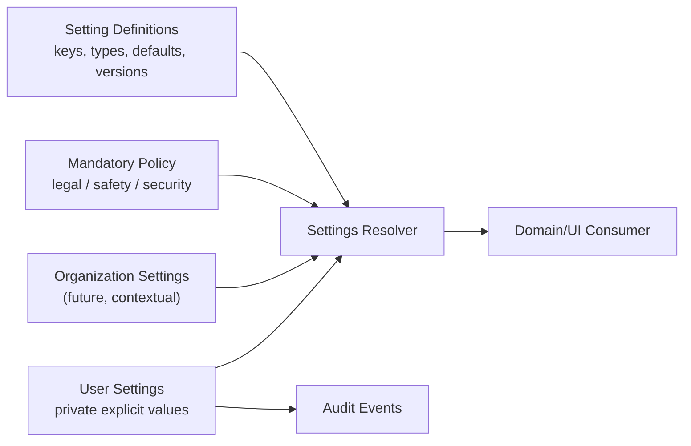
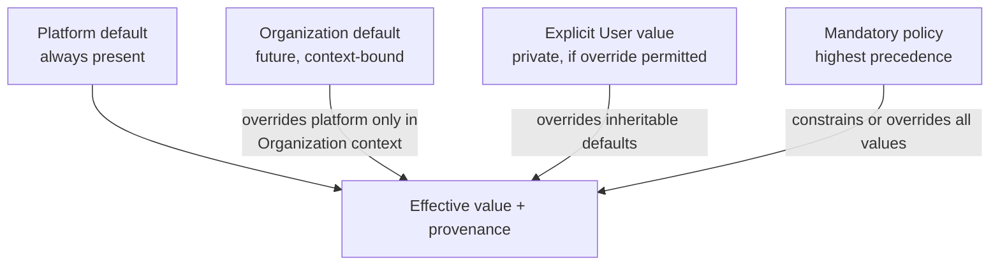
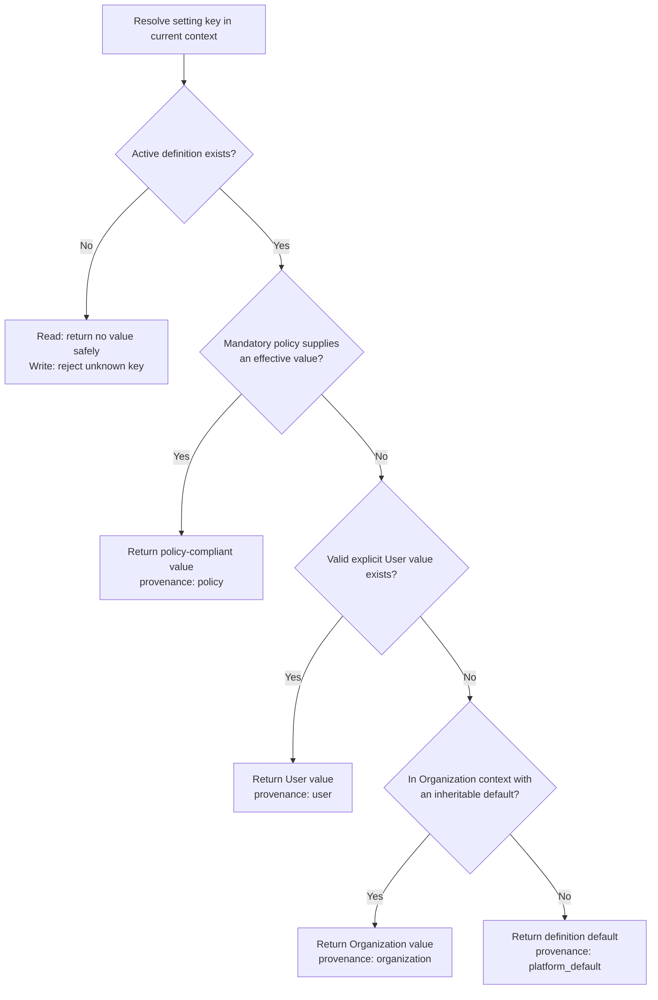
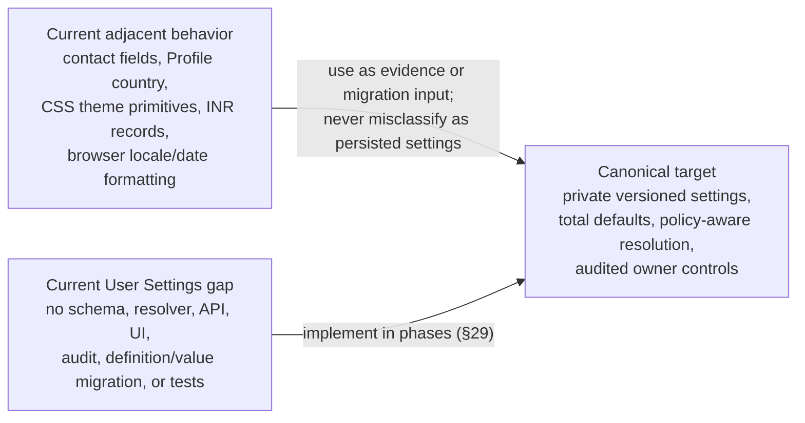
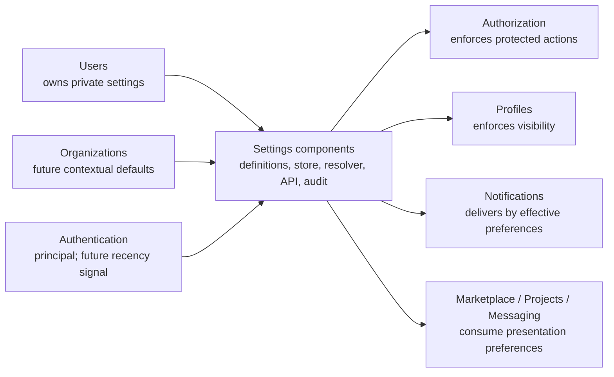

# MusicApp user settings specification

| Field | Value |
|---|---|
| Document | User Settings Specification |
| Domain | Users / Identity (`03-identity-profiles-verification/`) |
| Document ID | SPEC-USERS-001 (provisional — see §3) |
| Type | Specification (SPEC) |
| Status | Approved |
| Version | 1.0.0 |
| Owner | Engineering (interim: repository maintainers) |
| Repository branch | `docs/specification-foundation` |
| Last Reviewed | 2026-07-23 |
| Applies To | User-configurable settings, preferences, and account personalization |
| Related documents | [`product-overview.md`](../01-foundation/product-overview.md), [`system-architecture.md`](../01-foundation/system-architecture.md), [`users.md`](../02-users-roles-permissions/users.md), [`authentication.md`](../02-users-roles-permissions/authentication.md), [`authorization.md`](../02-users-roles-permissions/authorization.md), [`roles.md`](../02-users-roles-permissions/roles.md), [`profiles.md`](../02-users-roles-permissions/profiles.md), [`verification.md`](verification.md) |
| Supersedes / Superseded By | None |

This document follows [`docs/00-governance/README.md`](../00-governance/README.md) (GOV-000). It is the canonical product specification for settings owned and controlled by an individual User. The specification defines the future platform; repository findings describe only the implementation at the time of review and do not constrain the target architecture.

**Status taxonomy:** product status uses the five-value taxonomy established by [`system-architecture.md`](../01-foundation/system-architecture.md) §2.3: **Implemented**, **Partially Implemented**, **Schema Implemented**, **Planned**, and **Proposed**. **Not Implemented** is used only as a repository-support observation in the comparison matrices: a canonically required absent capability has product status **Planned**, while an undecided absent capability has product status **Proposed**. No competing document-status value is introduced.

**Verified summary:** User Settings is **Planned**. No settings/preferences table, settings migration, settings endpoint or backend module/service, frontend settings screen, settings-specific audit record, or settings test exists. Adjacent implementation exists for account contact fields, Profile country, OS-responsive unauthenticated styling, a deliberately fixed dark authenticated shell, hard-coded INR project creation, and browser-local date rendering. None is a persisted User setting (§27).

## 1. Purpose

User Settings gives each User a private, durable, versioned place to personalize how MusicApp behaves for them without changing who they are, how they authenticate, or what they are allowed to do.

The domain answers:

- which preferences a User may control;
- which defaults apply when no explicit value exists;
- how platform, organization, and User values resolve;
- how settings are validated, versioned, migrated, audited, and reset;
- which settings affect presentation, communications, privacy, security UX, and product-specific experiences.

It does not turn preferences into authorization policy. A User may request fewer notifications or less public exposure, but cannot use a setting to grant themselves a capability, weaken a mandatory security control, or make protected data public contrary to policy.

## 2. Scope

This document covers:

- settings architecture, ownership, hierarchy, defaults, inheritance, and versioning;
- General, Appearance, Accessibility, Privacy, Notifications, Marketplace, Projects, Messaging, Localization, Security, Account, Experimental Features, and future Developer Settings;
- communication, regional, time-zone, currency, Profile, and future Organization preferences;
- validation, audit, privacy, migration, repository comparison, and implementation sequencing.

This document does not own:

- immutable User identity or account-state lifecycles — [`users.md`](../02-users-roles-permissions/users.md);
- credentials, session policy, MFA enforcement, recovery, or token mechanics — [`authentication.md`](../02-users-roles-permissions/authentication.md);
- access decisions — [`authorization.md`](../02-users-roles-permissions/authorization.md);
- public identity fields or Profile lifecycle — [`profiles.md`](../02-users-roles-permissions/profiles.md);
- verification workflow or evidence — [`verification.md`](verification.md);
- notification event generation and delivery infrastructure — Notifications, Planned in [`system-architecture.md`](../01-foundation/system-architecture.md) §10.10;
- Organization structure and membership — future Organizations domain.

### 2.1 Cross-document consistency statement

All existing specifications listed in the metadata block were checked. No objective contradiction prevents this specification from being internally consistent under the ownership splits below, and no existing document was modified.

Two boundaries require precision:

1. `profiles.country` is public-identity/location data, not automatically a regional setting. Because the Profile value is unconstrained free text while `localization.country` requires an ISO 3166-1 alpha-2 code, it may only seed a suggestion after validated mapping/normalization and explicit User confirmation; raw copying and silent inheritance are prohibited.
2. `users.email` and `users.phone_e164` are account contact identifiers. Notification destinations may reference verified contact channels, but a preference never changes credentials or contact identifiers.
3. **A source-of-truth wording tension is disclosed:** [`system-architecture.md`](../01-foundation/system-architecture.md) §10.10 and [`profiles.md`](../02-users-roles-permissions/profiles.md) §8.11 assign notification channel-preference behavior to Notifications, while this task canonically states that Settings belong to Users. This document reconciles those statements narrowly: the User owns private values, and Settings owns generic persistence and value resolution; Notifications owns the exact definitions, topic/event catalog, channel semantics, eligibility, enforcement, and delivery. The notification keys, defaults, matrix, and precedence proposed in §§9–11 are therefore **Proposed integration requirements pending a Notifications specification**, not a final Notifications catalog. If “deferred entirely” in `profiles.md` was intended to include physical ownership of preference values, that wording requires future clarification; it is not silently changed here.

## 3. Terminology and identifier governance

Settings canonically belong to Users, so `USERS` is the semantically correct existing domain token; [`users.md`](../02-users-roles-permissions/users.md) currently ends at `BR-USERS-018` and `REQ-USERS-012`, and this document begins at `BR-USERS-019` and `REQ-USERS-013`. [`GOV-000`](../00-governance/README.md) §11 permits `USERS`, and §11.1 permits the corresponding `SEC-`, `DATA-`, `INT-`, and `AUD-` families.

**Governance gap, disclosed rather than silently resolved:** [GOV-000](../00-governance/README.md) §11 also says the token must match the directory it documents, while this task explicitly places User Settings under `03-identity-profiles-verification/`, whose governed token is `IDENTITY`. Using `IDENTITY` would incorrectly imply that identity verification owns User preferences; using a new `SETTINGS` token would be semantically clear but `SETTINGS` is not governed. This document therefore uses the existing `USERS` family to preserve canonical ownership, but treats `SPEC-USERS-001` and every identifier introduced here as **provisional, document-local identifiers** until governance either permits User-owned documents in this directory, relocates this file, or adds a governed Settings arrangement. No `SETTINGS` identifier is silently introduced, and no governance file is modified.

| Term | Definition |
|---|---|
| Setting Definition | Version-controlled metadata describing a setting key, type, allowed values, default, sensitivity, category, and availability |
| Explicit Value | A value a User has deliberately stored |
| Effective Value | The resolved value after policy, User value, organization value, and platform default are evaluated |
| Platform Default | A valid fallback shipped by MusicApp for every setting |
| Organization Default | A future organization-owned default applicable to its context, where User override is permitted |
| Policy Override | A mandatory legal, safety, security, or administrative value that a User cannot weaken |
| Settings Version | A monotonic concurrency token for a User’s settings aggregate |
| Definition Version | The version of the setting catalog/schema against which values were validated |
| Reset | Removal of an explicit value so resolution returns to the next applicable default |

## 4. Canonical settings principles

| # | Principle | Rule |
|---|---|---|
| 1 | User ownership | Settings belong to Users; each User owns one settings aggregate. |
| 2 | Profile separation | Profiles expose public identity; Settings remain private. |
| 3 | Authentication separation | Settings never prove identity and never alter authentication truth. |
| 4 | Authorization separation | Settings never define Roles, Permissions, or access grants. |
| 5 | Total defaults | Every active setting definition has a valid default. |
| 6 | Safe absence | Missing, corrupt, unknown, or newly introduced values fall back safely and never break core functionality. |
| 7 | Versionability | Definitions and User values are versionable and migratable. |
| 8 | Auditability | Material setting changes are attributable and auditable. |
| 9 | User control | Users may view, change, export, and reset their settings subject to policy. |
| 10 | Organization separation | Organizations will own organization settings; Users do not own or rewrite them. |
| 11 | Data minimization | Settings store only data required to personalize behavior. |
| 12 | Server authority | Security, privacy, and communication enforcement occurs server-side; UI state alone is never authoritative. |

The normative rules implementing these principles are `BR-USERS-019`–`BR-USERS-022` in §33.1.

## 5. Ownership and boundaries

| Concern | Owner | Settings Responsibility | Boundary |
|---|---|---|---|
| Individual preferences | Users / this document | Store and resolve | Private to User and authorized support/admin workflows |
| Public Profile data | Profiles | Settings may control permitted visibility choices | Settings do not store authoritative Profile content |
| Contact identifiers | Users / Authentication | Reference eligible verified destinations | Preferences cannot edit or verify email/phone |
| Authentication controls | Authentication | Expose User choices where policy permits | MFA requirement, token lifetime, and password policy are not settings |
| Authorization | Authorization | Consume privacy choice as a resource attribute where specified | Preference is an input, never the decision engine |
| Notification preferences and event delivery | Notifications (definitions/behavior); User (private values) | Store and generically resolve User-owned channel/topic values from Notifications-owned definitions | Exact keys/defaults remain Proposed here; Notifications owns topic/channel semantics, eligibility, event routing, retries, and provider delivery |
| Organization defaults | Organizations (future) | Resolve in organization context | Organization owns values; User owns allowed override |
| Product defaults | Product/Engineering | Define catalog defaults | Defaults are version-controlled, not ad hoc client constants |

## 6. Settings architecture

*The diagram is target architecture. Every component is Planned.*

### 6.1 Logical components

1. **Definition Registry** — code- or data-backed, version controlled, containing key metadata and defaults.
2. **User Settings Store** — durable private values keyed to `users.id`.
3. **Resolver** — returns typed effective values plus provenance.
4. **Validation and Mutation Service** — validates batches, enforces policy, applies optimistic concurrency, and emits audit/domain events.
5. **Settings API** — authenticated read, patch, reset, and export interfaces.
6. **Consumer SDK/helper** — prevents domains from reimplementing fallback logic.
7. **Migration Runner** — upgrades stored values between definition versions.

`INT-USERS-001`: all consumers MUST use the shared resolver rather than querying raw values or embedding independent defaults.

## 7. Preference hierarchy and inheritance

### 7.1 Resolution order

Highest precedence wins:

1. mandatory policy override;
2. explicit User value, if permitted in the current context;
3. future Organization default, only while acting in that Organization and only for inheritable keys;
4. platform default from the active Setting Definition.

Device-local ephemeral state may influence presentation before authentication, but it is not a durable platform setting and MUST NOT override a stored User value after settings load.

### 7.2 Inheritance rules

- Individual contexts do not inherit Organization values.
- Organization defaults never overwrite stored User values.
- Organization policy may constrain an allowed range only for organization-scoped behavior.
- A User override marked `inherit` removes the explicit override; it is not stored as a duplicate of the inherited value.
- Security and legal policy always fail closed.
- Unknown keys are ignored for reads, rejected for writes, and preserved only during a controlled forward-compatible migration when explicitly supported.

The effective-value/provenance obligation is formalized by `BR-USERS-023` in §33.1.

### 7.3 Settings inheritance

*This is the canonical inheritance model. Organization inheritance and every persisted value are Planned.*

### 7.4 Settings resolution flow

*Resolution is deterministic and total for every active definition. The resolver is Planned; no equivalent component exists in the repository.*

## 8. Settings category matrix

| Category | Purpose | Representative Settings | Scope | Status |
|---|---|---|---|---|
| General | Common product behavior | start page, compact density, onboarding hints | User | Planned |
| Appearance | Visual presentation | theme, high contrast | User/device preview | Planned |
| Accessibility | Accessible interaction | reduced motion, text scale, captions | User | Planned |
| Privacy | Visibility and discoverability choices | profile visibility, search discoverability, activity visibility | User; enforced by owning domain | Planned |
| Notifications | Topic/channel delivery | email, push, SMS, in-app, digest, quiet hours | User | Planned |
| Marketplace | Discovery personalization | genre interests, location radius | User | Planned |
| Projects | Project workflow preferences | default project view, deadline reminders | User | Planned |
| Messaging | Communication experience | read receipts, message preview, sound | User | Planned |
| Localization | Language and regional presentation | language, locale, time zone, currency, country | User | Planned |
| Security | User-selectable security UX | login alerts, alert channels | User within mandatory policy | Planned |
| Account | Account-adjacent personalization | product-update and research consent | User | Planned |
| Experimental Features | Controlled feature participation | beta enrollment, per-feature opt-in | User/eligibility policy | Planned |
| Developer Settings | Future integration experience | API diagnostics | User, future eligible developers | Proposed |

## 9. Settings field matrix

The following is the target settings catalog. Rows marked **Planned** are canonical target keys; rows marked **Proposed** are candidate API/storage keys pending the owning domain’s specification. Names are not necessarily UI labels.

| Key | Category | Type / Allowed Values | User Override | Sensitivity | Status |
|---|---|---|---|---|---|
| `general.start_page` | General | `home`, `discover`, `projects` | Yes | Low | Planned |
| `general.density` | General | `comfortable`, `compact` | Yes | Low | Planned |
| `general.onboarding_hints` | General | boolean | Yes | Low | Planned |
| `appearance.theme` | Appearance | `system`, `light`, `dark` | Yes | Low | Planned |
| `appearance.high_contrast` | Appearance | boolean | Yes | Low | Planned |
| `accessibility.reduced_motion` | Accessibility | `system`, `reduce`, `no_preference` | Yes | Sensitive by inference | Planned |
| `accessibility.text_scale` | Accessibility | decimal `0.8`–`2.0` | Yes | Sensitive by inference | Planned |
| `accessibility.captions_default` | Accessibility | boolean | Yes | Sensitive by inference | Planned |
| `privacy.profile_visibility` | Privacy | `public`, `private`; additional levels remain Proposed in [`profiles.md`](../02-users-roles-permissions/profiles.md) §16 | Yes, policy constrained | Sensitive | Planned |
| `privacy.search_discoverable` | Privacy | boolean | Yes | Sensitive | Planned |
| `privacy.activity_visibility` | Privacy | `public`, `connections`, `private` | Yes | Sensitive | Planned |
| `privacy.read_receipts` | Privacy/Messaging | boolean | Yes | Sensitive | Planned |
| `privacy.personalized_marketplace` | Privacy/Marketplace | boolean | Yes | Sensitive profiling | Planned |
| `notifications.email_enabled` | Notifications | boolean | Yes, except mandatory transactional/security notices | Sensitive | Proposed pending Notifications specification |
| `notifications.push_enabled` | Notifications | boolean | Yes | Sensitive | Proposed pending Notifications specification |
| `notifications.sms_enabled` | Notifications | boolean | Yes, verified phone required | Sensitive | Proposed pending Notifications specification |
| `notifications.in_app_enabled` | Notifications | boolean | Yes, mandatory inbox items may remain | Low | Proposed pending Notifications specification |
| `notifications.digest` | Notifications | `off`, `daily`, `weekly` | Yes | Low | Proposed pending Notifications specification |
| `notifications.quiet_hours` | Notifications | nullable local-time range | Yes | Sensitive | Proposed pending Notifications specification |
| `notifications.topic_overrides` | Notifications | map of allowlisted topic keys to channel preferences | Yes, subject to mandatory-delivery rules | Sensitive | Proposed pending Notifications specification |
| `marketplace.genre_interests` | Marketplace | controlled string array | Yes | Sensitive profiling | Planned |
| `marketplace.location_radius_km` | Marketplace | integer `0`–`500` or null | Yes | Sensitive location inference | Planned |
| `projects.default_view` | Projects | `list`, `board` | Yes | Low | Planned |
| `projects.deadline_reminders` | Projects | boolean | Yes | Low | Planned |
| `messaging.message_preview` | Messaging | boolean | Yes | Sensitive | Planned |
| `messaging.sound_enabled` | Messaging | boolean | Yes | Low | Planned |
| `localization.language` | Localization | supported BCP 47 language tag | Yes | Low | Planned |
| `localization.locale` | Localization | supported BCP 47 locale tag | Yes | Low | Planned |
| `localization.time_zone` | Localization | supported IANA time-zone ID | Yes | Sensitive location inference | Planned |
| `localization.currency` | Localization | supported ISO 4217 code | Yes, display only unless domain permits | Financial preference | Planned |
| `localization.region` | Localization | supported CLDR territory code | Yes | Sensitive location inference | Planned |
| `localization.country` | Localization | ISO 3166-1 alpha-2 code | Yes | Sensitive location inference | Planned |
| `security.login_alerts` | Security | boolean | May enable; policy may prohibit disabling | Sensitive | Planned |
| `security.alert_channels` | Security | set of `email`, `push`, `sms`, `in_app` | Yes, eligible channels only | Sensitive | Planned |
| `account.product_updates` | Account | boolean consent | Yes | Sensitive consent | Planned |
| `account.research_participation` | Account | boolean consent | Yes | Sensitive consent | Planned |
| `experimental.enrolled` | Experimental Features | boolean | Yes, eligibility constrained | Low | Planned |
| `experimental.features` | Experimental Features | allowlisted key set | Yes, eligibility constrained | Low | Planned |
| `developer.diagnostics` | Developer Settings | boolean | Future eligible Users only | Sensitive | Proposed |

## 10. Default values matrix

| Key | Platform Default | Rationale / Fallback |
|---|---|---|
| `general.start_page` | `home` | Stable entry point |
| `general.density` | `comfortable` | Readability-first |
| `general.onboarding_hints` | `true` | Supports new Users |
| `appearance.theme` | `system` | Respects device preference before explicit choice |
| `appearance.high_contrast` | `false` | Explicit opt-in, while OS/browser aids still apply |
| `accessibility.reduced_motion` | `system` | Respects device accessibility preference |
| `accessibility.text_scale` | `1.0` | Neutral scale |
| `accessibility.captions_default` | `false` | No media behavior is assumed |
| `privacy.profile_visibility` | **Unresolved: `public` or `private`** | [`profiles.md`](../02-users-roles-permissions/profiles.md) §16 requires an explicit safe default but deliberately leaves the choice open; this Planned definition MUST NOT activate until Profiles owns and resolves it |
| `privacy.search_discoverable` | `true` | Matches public marketplace discovery; private visibility overrides to false |
| `privacy.activity_visibility` | `private` | Data-minimizing default |
| `privacy.read_receipts` | `true` | Conventional messaging behavior, reversible |
| `privacy.personalized_marketplace` | `false` | No behavioral profiling by default |
| `notifications.email_enabled` | `true` | Verified email channel when available |
| `notifications.push_enabled` | `false` | Requires explicit device permission |
| `notifications.sms_enabled` | `false` | Costly/sensitive channel requires opt-in |
| `notifications.in_app_enabled` | `true` | Primary durable channel |
| `notifications.digest` | `off` | Avoid unsolicited summaries |
| `notifications.quiet_hours` | `null` | No inferred schedule |
| `notifications.topic_overrides` | `{}` | Topic defaults remain those in §11.1 until the User records an override |
| `marketplace.genre_interests` | `[]` | No inferred taste profile |
| `marketplace.location_radius_km` | `null` | No location filtering |
| `projects.default_view` | `list` | Basic broadly usable view |
| `projects.deadline_reminders` | `true` | Supports project completion |
| `messaging.message_preview` | `false` | Privacy-preserving lock-screen default |
| `messaging.sound_enabled` | `true` | Reversible conventional behavior |
| `localization.language` | `en` | Initial supported product language |
| `localization.locale` | `en-IN` | India-first product default |
| `localization.time_zone` | `Asia/Kolkata` | India-first default; User can correct |
| `localization.currency` | `INR` | Display default only; never rewrites contractual currency |
| `localization.region` | `IN` | India-first regional default |
| `localization.country` | `IN` | Never silently copied from public Profile country |
| `security.login_alerts` | `true` | Security-preserving default |
| `security.alert_channels` | `["in_app", "email"]` | Email becomes effective only when verified; policy retains at least one durable channel |
| `account.product_updates` | `false` | Consent required |
| `account.research_participation` | `false` | Consent required |
| `experimental.enrolled` | `false` | Stable product by default |
| `experimental.features` | `[]` | No implicit beta activation |
| `developer.diagnostics` | `false` | Future and opt-in |

The `notifications.*` rows are **Proposed candidate defaults** for the future Notifications specification, not active or independently canonical Setting Definitions. Notifications may adopt or revise them while preserving this document’s User-ownership, privacy, safe-fallback, and total-default requirements.

The single-source default obligation is formalized by `BR-USERS-024` in §33.1.

The unresolved `privacy.profile_visibility` row does not create an exception to `BR-USERS-019` or `BR-USERS-024`: the definition is Planned and MUST remain inactive until the Profiles domain chooses `public` or `private`. Once active, it MUST have exactly one concrete default like every other setting.

## 11. Notification preferences

This section is a **Proposed cross-domain integration contract** for the future Notifications specification. It establishes the minimum user-control shape this Settings architecture must be able to store and resolve, but Notifications remains the source of truth for final topic identifiers, defaults, mandatory-delivery classification, channel eligibility, and delivery behavior.

### 11.1 Notification matrix

| Topic | In-App | Email | Push | SMS | User May Disable? | Default |
|---|---|---|---|---|---|---|
| Security-critical account event | Required | If verified | If enabled | If enabled/verified | Not all channels simultaneously | In-app + verified email |
| Authentication informational alert | Yes | If verified | If enabled | Optional | Policy constrained | In-app + verified email |
| Project invitation/status | Yes | Optional | Optional | No | Yes, except actionable in-app record | In-app |
| Milestone deadline/status | Yes | Optional | Optional | No | Yes | In-app |
| Escrow/payment transactional | Required | If verified | Optional | Optional | Delivery may be reduced, durable record cannot be removed | In-app + verified email |
| New message | Yes | Optional | Optional | No | Yes | In-app |
| Verification decision/action required | Required | If verified | Optional | Optional | Durable in-app record cannot be removed | In-app + verified email |
| Marketplace recommendation | Optional | Optional | Optional | No | Yes | Off |
| Product update/marketing | Optional | Optional | Optional | Optional with separate consent | Yes | Off |
| Moderation/safety action | Required | If verified | Optional | Optional | Durable in-app record cannot be removed | In-app + verified email |

### 11.2 Rules

- Every rule in this subsection is Proposed pending adoption or revision by the Notifications specification.
- Topic preference and channel preference are evaluated together.
- Within Notifications, precedence is: mandatory topic policy; the constrained `security.login_alerts`/`security.alert_channels` projection for security topics; a permitted `notifications.topic_overrides` entry; global channel toggles and digest/quiet-hours controls; then the Notification Matrix default. Channel verification/device eligibility is applied before delivery. A more restrictive User value wins except where mandatory delivery policy applies.
- A channel is eligible only when the destination is verified and provider/device permission exists.
- Quiet hours defer non-urgent delivery using the User’s effective time zone; they do not suppress security, safety, or time-critical transactional events.
- Consent evidence for marketing channels is stored and audited separately from ordinary convenience preferences.
- Disabling notification delivery never disables the underlying business event or required in-app record.
- In-app, email, push, and SMS delivery are all Planned; [`system-architecture.md`](../01-foundation/system-architecture.md) §10.10 confirms Notifications has no repository footprint.

## 12. Privacy preferences

### 12.1 Privacy matrix

| Preference | Allowed Values | Enforcement Owner | Interaction | Default |
|---|---|---|---|---|
| Profile visibility | `public`, `private`; any additional level remains Proposed | Profiles + Authorization | `private` excludes public discovery | Unresolved by [`profiles.md`](../02-users-roles-permissions/profiles.md) §16; definition remains inactive until decided |
| Search discoverability | boolean | Marketplace/Profiles + Authorization | Forced false when Profile is private | `true` |
| Activity visibility | `public`, `connections`, `private` | Owning activity domain + Authorization | Must never expose private Projects/Messages | `private` |
| Read receipts | boolean | Messaging | Applies prospectively; does not erase delivery history | `true` |
| Message preview | boolean | Notifications/Messaging client | Controls preview content, not message access | `false` |
| Personalized marketplace | boolean | Marketplace | False disables behavioral personalization, not basic discovery | `false` |
| Research participation | boolean consent | Account/Analytics | Separate affirmative consent | `false` |

The backend-enforcement and most-restrictive-value obligations are formalized by `BR-USERS-025` and `BR-USERS-026` in §33.1. For example, `profile_visibility = private` makes `search_discoverable` effectively false even if its explicit value remains true.

This document consumes the visibility vocabulary and eventual default from Profiles; it does not own either decision. In particular, it does not promote the Proposed intermediate level in [`profiles.md`](../02-users-roles-permissions/profiles.md) §16 into canonical settings architecture.

## 13. Appearance and accessibility

- Theme supports `system`, `light`, and `dark`; `system` tracks the device preference.
- Accessibility settings override purely aesthetic choices where required for usability.
- Reduced motion applies to non-essential animation; it cannot suppress progress, error, or state-change information.
- Text scaling must preserve layout through supported zoom ranges and must not truncate critical actions.
- Color cannot be the sole carrier of meaning.
- Accessibility preferences are private and treated as potentially sensitive inferred health/disability information.

**Repository comparison:** `frontend/src/index.css` reacts to `prefers-color-scheme`, while `frontend/src/App.css:187` sets the authenticated shell to dark and the comment at `frontend/src/App.css:1023-1024` says it intentionally ignores the OS scheme. This is static UI behavior, not a stored setting, and is **Partially Implemented only as presentation capability**, not as User Settings.

## 14. Language, localization, and regional settings

### 14.1 Language and locale

- `language` controls translated product copy and uses supported BCP 47 language tags.
- `locale` controls number, date, and collation presentation and uses supported BCP 47 locale tags.
- Unsupported values are rejected on write and safely fall back on read.
- User-generated content is never silently translated unless a separate feature and consent model is specified.

### 14.2 Time zone

- Time zone uses canonical IANA identifiers such as `Asia/Kolkata`.
- Stored domain timestamps remain absolute instants (UTC-capable `TIMESTAMPTZ`); the setting controls display and local scheduling.
- Quiet-hour and digest calculations use the effective time zone and correctly handle daylight-saving transitions.

### 14.3 Currency

- Currency uses ISO 4217 codes.
- The User setting controls preferred display and marketplace filtering only.
- It MUST NOT rewrite a Project, Milestone, Escrow, ledger, or payout currency.
- Conversion, if introduced, must show source amount, contractual currency, rate source, rate time, and rounding policy.

**Repository comparison:** `backend/Index.js:522` and `frontend/src/App.tsx:1046` hard-code `PROJECT_CURRENCY = "INR"` for project creation. `frontend/src/App.tsx:1419-1426` derives `en-IN` for INR and `en-US` otherwise; date rendering uses the browser locale (`toLocaleDateString`/`toLocaleString`). These are implementation constants/ambient-browser behavior, not settings. The canonical currency preference does not override the current India-first contractual INR rule ([`product-overview.md`](../01-foundation/product-overview.md) `BR-PROJECTS-003`).

### 14.4 Region and country

- `region` controls regional presentation and availability where legally permitted.
- `country` is an explicit private preference and may inform defaults.
- Neither value is authoritative proof of residence, tax jurisdiction, payout eligibility, identity, or verification.
- `profiles.country` remains public Profile location. No silent bidirectional synchronization is allowed.

## 15. Communication preferences

The following composition is Proposed pending the Notifications specification; Settings must be capable of storing and resolving the resulting User-owned values. Communication preferences combine:

- channel eligibility (verified email/phone, registered push device);
- topic subscription;
- consent where legally required;
- quiet hours and digest cadence;
- mandatory transactional/safety exceptions.

Changing a notification preference never edits `users.email` or `users.phone_e164`. Changing those account identifiers follows the User/Authentication workflows and causes channel eligibility to be re-evaluated.

## 16. Security preferences

Permitted preferences include login-alert delivery and optional convenience controls. They do not include:

- password policy;
- access/refresh-token lifetime;
- account-status enforcement;
- role/permission assignment;
- verification requirements;
- mandatory MFA or step-up policy;
- session revocation rules;
- audit retention.

The mandatory-security floor is formalized by `BR-USERS-027` in §33.1.

The MVP requires an authenticated owner but no additional recency or step-up gate for settings changes. Applying recent-authentication or step-up requirements to privacy broadening, security-alert reduction, communication-consent change, or developer integration activation is **Proposed future behavior**, not part of the exhaustive MVP step-up list in [`authorization.md`](../02-users-roles-permissions/authorization.md) §9.5; it cannot become canonical here without an owning-domain revision.

## 17. Profile, Marketplace, Project, and Messaging preferences

### 17.1 Profile preferences

Settings may hold a User’s requested visibility/discoverability behavior, but Profiles owns the public projection, authoritative Profile fields, visibility vocabulary, and visibility default ([`profiles.md`](../02-users-roles-permissions/profiles.md) §16). Profile visibility changes are settings changes and Profile/Authorization policy inputs; they are never implemented solely by hiding frontend elements.

### 17.2 Marketplace preferences

Marketplace preferences personalize ordering and filters. They do not change eligibility, verification, price, contractual currency, or authorization. Behavioral profiling requires transparent controls and data minimization.

### 17.3 Project preferences

Project preferences cover default views and reminders. They cannot modify Project commercial terms, lifecycle, milestone locking, or participant relationships.

### 17.4 Messaging preferences

Messaging preferences cover read receipts, previews, sounds, and notification delivery. They cannot grant conversation access, delete required moderation evidence, or change message retention.

## 18. Account and experimental preferences

- Marketing/product updates and research participation are explicit, revocable consent values.
- Withdrawal applies prospectively and preserves the minimum evidence required to demonstrate consent history.
- Experimental enrollment is off by default, eligibility-gated, reversible, and never used to bypass authorization or safety review.
- A remotely assigned feature flag is platform configuration, not automatically a User preference. User opt-in and platform eligibility are separate inputs.

## 19. Future Organization preferences

Organizations will own their own settings aggregate. Resolution occurs only in an explicit organization context.

| Setting Class | Organization May Default | User May Override | Organization May Mandate |
|---|---:|---:|---:|
| Appearance/accessibility | Yes | Yes | Accessibility may not be weakened |
| Locale/time zone | Yes | Yes | Sometimes for organization reports only |
| Notification convenience | Yes | Yes | Required compliance notices remain |
| Security posture | Yes | Only stronger | Yes |
| Privacy/public exposure | Yes | Only more restrictive | May mandate a more restrictive value; MUST NOT mandate broader exposure unless Open Question 8 is resolved by the owning Profiles/Authorization specifications |
| Project workflow display | Yes | Yes | No effect on domain state |

Organization membership must not copy organization settings permanently into the User’s individual settings. Leaving an Organization removes that context without destroying User values.

## 20. Developer Settings (future)

Developer Settings is **Proposed** because no developer-account or public API domain is specified. If adopted, it may include diagnostics, webhook test-event preferences, and API change notices. Secrets, API keys, webhook signing secrets, and access grants are credentials—not settings—and must use dedicated protected storage and workflows.

## 21. Data model

### 21.1 Target logical model

`DATA-USERS-001`:

| Entity | Required Fields | Purpose |
|---|---|---|
| `setting_definitions` | `key`, category, type, constraints, default, sensitivity, definition version, lifecycle status | Catalog and defaults |
| `user_settings` | `user_id` unique, document/typed values, settings version, definition version, timestamps | One User-owned aggregate |
| `user_setting_changes` | event ID, user ID, actor ID/type, key paths, protected before/after, source, reason, correlation ID, timestamp | Append-only audit |
| `organization_settings` | organization ID unique, values, versions, timestamps | Future organization-owned aggregate |

The physical representation (typed columns, normalized key/value rows, JSONB, or hybrid) remains an implementation decision. Regardless of representation:

- foreign keys must bind ownership to `users.id`;
- keys and values must be validated against definitions;
- write concurrency must be explicit;
- sensitive values must not leak into logs or broad projections;
- audit history must not be mutable through normal application paths;
- indexes must support one aggregate read per User and targeted administrative investigation.

### 21.2 API shape

`INT-USERS-002` target interfaces:

| Method / Path | Purpose | Rules |
|---|---|---|
| `GET /me/settings` | Return definitions relevant to client plus explicit/effective values and provenance | Authenticated owner; private projection |
| `PATCH /me/settings` | Atomically update one or more keys | Validate entire batch; optimistic concurrency; audit |
| `DELETE /me/settings/:key` | Reset one explicit value | Returns effective fallback |
| `POST /me/settings/reset` | Reset a category or all permitted settings | Authenticated owner; audit; any recent-authentication/step-up gate remains Proposed pending an Authorization revision |
| `GET /me/settings/export` | Export User settings | Authenticated owner; excludes internal policy metadata |

Writes MUST accept an expected settings version (for example, `If-Match`) and return `409 Conflict` on stale mutation. A batch either succeeds completely or changes nothing.

## 22. Validation

Validation occurs server-side and may be mirrored client-side for UX:

- key exists and is active;
- type is exact;
- enum/tag/code is supported;
- numeric/string/array bounds are enforced;
- dependencies are coherent;
- actor owns the aggregate or has explicit administrative authority;
- policy allows the override;
- expected version matches;
- channel destination is eligible;
- any authentication-recency requirement defined by a future owning Authentication/Authorization revision is satisfied; no such settings-specific requirement exists for the MVP.

Cross-field examples:

- private Profile visibility makes search discoverability effectively false;
- SMS cannot become effective without a verified phone;
- quiet hours require a valid time zone and non-identical start/end;
- experimental feature keys must be allowlisted and eligible;
- alert channels must retain at least one policy-required durable route.

## 23. Versioning, audit, and events

### 23.1 Versioning

- Every successful mutation increments `settings_version`.
- Definition changes increment `definition_version`.
- Renamed or transformed values require explicit migrations.
- Reads upgrade safely or fall back; they never fail the whole application because a preference is missing.
- Unknown future fields must not be reflected into an older client’s write accidentally.

### 23.2 Audit

`AUD-USERS-001`: create, change, reset, migration, policy-override, consent, and administrative support actions MUST emit immutable audit events.

Sensitive values may be redacted, hashed, or represented as “changed” rather than stored in plaintext audit payloads. Consent values require enough before/after evidence to prove the User’s choice and timing.

### 23.3 Domain events

Settings changes may emit events such as `user.settings.changed`, but event payloads must include only keys and minimally necessary metadata. Consumers re-read authoritative effective settings when correctness matters; events are not a permanent value store.

### 23.4 Settings lifecycle

```mermaid
stateDiagram-v2
    [*] --> DefaultsOnly: User exists; no explicit values required
    DefaultsOnly --> ExplicitValues: Valid first mutation
    ExplicitValues --> ExplicitValues: Atomic update
    ExplicitValues --> DefaultsOnly: Reset all permitted values
    DefaultsOnly --> MigrationRequired: Definition version changes
    ExplicitValues --> MigrationRequired: Definition version changes
    MigrationRequired --> DefaultsOnly: Defaults-only resolution upgraded
    MigrationRequired --> ExplicitValues: Explicit values migrated
    DefaultsOnly --> Retained: User enters retention lifecycle
    ExplicitValues --> Retained: User enters retention lifecycle
    Retained --> [*]: Authorized retention-policy disposal
```

*This aggregate lifecycle is Planned. “Retained” follows the User domain’s soft-deletion and retention rules; it does not introduce a competing account lifecycle.*

Setting Definitions have a separate catalog lifecycle:

| Definition status | Reads | Writes | Allowed next status |
|---|---|---|---|
| Proposed | Not returned as active | Rejected | Active or Retired |
| Active | Resolved with a concrete valid default | Accepted subject to validation/policy | Deprecated |
| Deprecated | Resolved for compatibility with migration guidance | Rejected for new adoption; existing values may be migrated | Retired |
| Retired | Ignored safely after migration | Rejected | Terminal |

Activation is prohibited until type, constraints, concrete default, sensitivity, ownership, and migration behavior are defined. Retirement never silently converts an explicit consent value into a different consent.

## 24. Migration strategy

### 24.1 Initial introduction

1. Introduce the definition registry with all defaults.
2. Deploy resolver reads before creating rows; every existing User immediately receives effective defaults.
3. Add the settings store, audit store, and authenticated API.
4. Backfill only when an existing explicit User choice can be proven. Do not infer consent.
5. Migrate clients from constants/ambient behavior to the resolver.
6. Add notification and owning-domain enforcement as those domains exist.

No blanket row per User is required merely to represent defaults. Lazy creation prevents a large, meaningless backfill.

### 24.2 Existing adjacent data

| Existing Value | Migration Rule |
|---|---|
| `profiles.country` | Do not copy raw free text; offer a suggestion only after validated ISO mapping/normalization and require explicit User confirmation |
| `verification_documents.country` | Never seed or copy into Localization; it is verification evidence, not a preference |
| Browser/OS color scheme | Use only as the `system` theme input; do not persist as an explicit choice |
| Hard-coded INR | Becomes localization display default, not contractual currency migration |
| Browser locale/time zone | May seed a suggested value with User confirmation; never infer legal region |
| Existing email/phone | Presence alone does not establish channel eligibility because no email/phone verification state exists; require future verified-channel state and never infer marketing consent |

### 24.3 Definition evolution

- Additive key: ship a default; no User-row backfill required.
- Default change: affects only Users without explicit/inherited higher-precedence values; release notes and impact review required.
- Enum removal/rename: migrate explicit values transactionally and retain audit provenance.
- Key deletion: deprecate, stop writes, migrate consumers, then remove after compatibility window.
- Semantic reversal: requires an ADR per [GOV-000](../00-governance/README.md) §14 and explicit consent review where applicable.

## 25. Security and privacy

### 25.1 Security findings table

| ID | Finding | Evidence | Risk | Required Resolution |
|---|---|---|---|---|
| `SEC-USERS-001` | No private settings store or API exists | No settings migration; no matching route in `backend/Index.js` | Preferences cannot be persisted or enforced | Implement `DATA-USERS-001` and `INT-USERS-002` |
| `SEC-USERS-002` | Appearance behavior is split between OS-driven CSS and a forced dark authenticated shell | `frontend/src/index.css:6,57`; `frontend/src/App.css:187,1023-1024` | User choice cannot override inconsistent behavior | Centralize effective theme and accessible fallback |
| `SEC-USERS-003` | Locale, date, and currency presentation use constants/browser ambient state | `backend/Index.js:522`; `frontend/src/App.tsx:1046,1419-1426,1451,1592` | Inconsistent or misleading regional presentation | Resolve stored localization settings; preserve contractual currency |
| `SEC-USERS-004` | No settings audit mechanism exists | Eight migrations contain no settings or settings-change/audit table; `backend/Index.js` has no settings mutation | Consent, privacy, and security preference changes would be unattributable | Add append-only change events before mutation APIs |
| `SEC-USERS-005` | Current JWT is stored in `localStorage` | `frontend/src/App.tsx:182,189,202,213,224`; [`authentication.md`](../02-users-roles-permissions/authentication.md) §19.3, `BR-AUTH-022` | Any successful cross-site scripting attack could read the bearer token and access a future settings API; this is impact amplification, not evidence that an XSS vulnerability currently exists | Resolve under Authentication’s target token-delivery architecture; do not duplicate auth logic in Settings |
| `SEC-USERS-006` | No automated settings tests exist; backend test script intentionally fails | `backend/package.json` test script; no test source directory or test files; frontend has no test script | Defaults, policy precedence, and privacy regressions would be undetected | Add resolver, API, migration, authorization, and UI tests |

`SEC-USERS-005` is the new User-Settings impact record for current token storage; [`authentication.md`](../02-users-roles-permissions/authentication.md) §19.3 and `BR-AUTH-022` remain the source of truth for browser token delivery and its remediation.

### 25.2 Sensitive data rules

- Accessibility, location, communication, security, consent, and marketplace-interest values are private.
- Settings are excluded from public Profile, public Marketplace, and ordinary administrative list responses.
- Support access requires explicit authorization and audit.
- Logs must not serialize the complete settings document.
- Export/deletion/retention behavior follows applicable privacy policy and the canonical User soft-deletion lifecycle.

## 26. Repository review method

Review performed on branch `docs/specification-foundation` on 2026-07-23:

- enumerated all repository files and directories;
- reviewed all eight SQL migrations and the migration runner;
- reviewed `backend/Index.js`, `backend/db/db.js`, backend dependencies/scripts, frontend API wrapper, React application, CSS, TypeScript/Vite/ESLint configuration, and package scripts;
- reviewed all present Users, Profiles, Authentication, Authorization, Roles, and Verification specifications;
- searched repository-wide, excluding dependencies/build output where appropriate, for `settings`, `preferences`, `preference`, `config`, `configuration`, `language`, `locale`, `theme`, `dark`, `light`, `notification`, `timezone`, `privacy`, `visibility`, `email`, `push`, `sms`, `currency`, `region`, `country`, `accessibility`, and `experimental`.

Standalone `middleware/`, `routes/`, `database/`, `users/`, `profiles/`, `authentication/`, `verification/`, `shared/`, `constants/`, and `tests/` source directories do not exist. Relevant behavior is consolidated in `backend/Index.js`, `backend/db/`, and `frontend/src/`. Dependency lockfile occurrences such as pnpm’s own `settings:` metadata are tool configuration, not product settings.

## 27. Repository settings matrix

| Search area / concept | Repository finding | Repository classification | Product status | Evidence |
|---|---|---|---|---|
| Settings/preferences schema | No settings table or column | Not Implemented | Planned | All eight SQL files in `backend/db/`, from `001_create_users.sql` through `008_add_milestone_locking.sql` |
| Settings API/routes | No read, update, reset, or export route | Not Implemented | Planned | All 12 routes in `backend/Index.js` |
| Settings middleware/service/shared/constants | No settings module and no standalone source directories with those names | Not Implemented | Planned | Repository file/directory enumeration |
| Settings frontend | No settings navigation, form, or persisted settings state | Not Implemented | Planned | `frontend/src/App.tsx` |
| General | Authenticated entry view is hard-coded to `home`; no User override | Partially Implemented | Planned | `frontend/src/App.tsx:600` |
| User language | UI copy and document language are hard-coded English; no User field, translation catalog, or selection UI exists | Partially Implemented | Planned | `frontend/index.html:2`; all eight `backend/db/*.sql` migrations; `frontend/src/App.tsx`; `frontend/src/` file enumeration |
| Locale | Currency formatter derives locale from record currency; dates use browser locale | Partially Implemented | Planned | `frontend/src/App.tsx:1419-1426,1451,1592` |
| Theme | Base/auth UI responds to OS scheme; authenticated app is forced dark | Partially Implemented | Planned | `frontend/src/index.css:6,57`; `frontend/src/App.css:187,1023-1024` |
| Accessibility | Browser focus-visible outline exists; no stored accessibility preference | Partially Implemented | Planned | `frontend/src/index.css:52-55`; no matching field or state in `frontend/src/App.tsx` |
| Notifications/in-app/email/push/SMS | Contact identifiers exist as adjacent User data, but no notification delivery or preferences exist | Not Implemented | Planned | `backend/db/001_create_users.sql`; [`system-architecture.md`](../01-foundation/system-architecture.md) §10.10 |
| Time zone | Browser ambient zone is used for rendering; no User field or override exists | Partially Implemented | Planned | All eight `backend/db/*.sql` migrations; `frontend/src/App.tsx:1451,1521,1592,1781` |
| Privacy/visibility | No setting or visibility predicate; backend returns the latest 100 Profiles, then frontend excludes the current User and applies client-side search | Not Implemented | Planned | `backend/Index.js:473-484`; `frontend/src/App.tsx:803-857`; [`profiles.md`](../02-users-roles-permissions/profiles.md) §16 |
| Currency | Project/Milestone INR stamping is Implemented in application code; Escrow/payment/ledger currency is Schema Implemented; no database `CHECK` enforces INR and no User display-currency preference exists | Partially Implemented | Planned | `backend/Index.js:519-522,709,735`; `backend/db/005_create_projects.sql:41-42`; `backend/db/006_create_escrow_system.sql:87-88,125-126,170-171,210-211,304-305` |
| Region/country | Required Profile country is implemented; required verification-document country is Schema Implemented; neither is a private regional preference | Partially Implemented | Planned | `backend/db/002_create_profiles.sql:24`; `backend/db/004_create_verification_documents.sql:30`; `backend/Index.js:142-181,220-283` |
| Account email/phone | Stored User identifiers exist; no communication preference | Partially Implemented | Planned | `backend/db/001_create_users.sql:19-20` |
| Experimental features | No eligibility, flag, enrollment, or preference implementation | Not Implemented | Planned | Repository-wide `flag`, `feature`, `beta`, `experiment`, `experimental`, `enrollment`, and `eligibility` searches across `backend/`, `frontend/src/`, and all migrations; no product implementation matches |
| Settings audit/versioning/migration | General SQL migration tracking exists, but no settings version, definition version, settings-value migration, or settings audit | Not Implemented | Planned | `backend/db/migrate.js:7-36`; all eight `backend/db/*.sql` migrations |
| Tests | No test source directory or test files; backend test script intentionally fails; frontend has no test script | Not Implemented | Planned | `backend/package.json:6-10`; `frontend/package.json:6-10`; repository file enumeration |

### 27.1 Repository comparison

*The left side is repository fact; the right side is Planned product architecture. No arrow claims that the target exists today.*

## 28. Implementation status matrix

| Capability | Product status | Repository status | Gap |
|---|---|---|---|
| Settings architecture and ownership | Planned | Not Implemented | No component or storage |
| Defaults and safe fallback | Planned | Partially Implemented | Constants, CSS, and browser defaults are not centralized |
| User settings storage | Planned | Not Implemented | No schema |
| Preference hierarchy/inheritance | Planned | Not Implemented | No resolver |
| General/Appearance/Accessibility | Planned | Partially Implemented | Hard-coded start view and presentation/accessibility primitives exist; no User persistence |
| Privacy | Planned | Not Implemented | No values or backend enforcement |
| Notifications/communications | Planned | Not Implemented | Contact identifiers are adjacent User data; Notifications domain is absent |
| Localization/time zone/currency | Planned | Partially Implemented | No User values; INR contractual behavior remains separate |
| Security preferences | Planned | Not Implemented | No settings; Authentication/Authorization policy remains separate |
| Profile/Marketplace/Projects/Messaging preferences | Planned | Not Implemented | Adjacent domains do not consume preferences |
| Account consent | Planned | Not Implemented | No consent evidence |
| Experimental features | Planned | Not Implemented | No flag/eligibility system |
| Organization preferences | Planned | Not Implemented | Organization domain absent |
| Developer settings | Proposed | Not Implemented | Developer domain unspecified |
| Settings versioning/migration/audit | Planned | Not Implemented | General SQL migrations exist; settings-specific versions, value migrations, and audit do not |
| Settings API/UI/testing | Planned | Not Implemented | No endpoint, screen, or automated settings test |

## 29. Implementation plan

1. Build the definition registry and pure resolver with exhaustive unit tests.
2. Add settings and audit migrations, optimistic concurrency, and migration tooling.
3. Add authenticated owner-only read/patch/reset/export APIs using shared Authentication and Authorization.
4. Add General, Appearance, Accessibility, and Localization UI; replace divergent frontend constants carefully.
5. Implement Privacy together with Profiles/Authorization backend enforcement.
6. Implement Notifications preferences only with the Notifications domain’s event/delivery model.
7. Add Marketplace, Projects, and Messaging consumers without transferring domain ownership to Settings.
8. Add Organization inheritance only after the Organization domain exists.
9. Keep Developer Settings Proposed until developer accounts/integrations are specified.

Each phase must include definition/default tests, resolution-precedence tests, unauthorized-access tests, audit assertions, concurrency tests, migration tests, and missing/corrupt-value fallback tests.

### 29.1 Future architecture

*This is the intended future integration architecture. Settings remains a User-owned logical component, not a separate identity, authentication, or authorization authority.*

## 30. Risks

| Risk | Impact | Mitigation |
|---|---|---|
| Clients embed their own defaults | Different devices behave differently | Single definition registry and resolver |
| Privacy choice enforced only in UI | Data disclosure | Backend owning-domain enforcement |
| Currency preference changes contract values | Financial inconsistency | Display-only rule; preserve stored currency |
| Profile country treated as legal region | Incorrect compliance decisions | Explicit separation; never proof |
| Notification opt-out suppresses mandatory notices | Safety/financial harm | Topic/channel matrix and durable in-app exceptions |
| Settings document becomes a sensitive profile | Privacy harm | Minimize, classify, restrict, redact, audit |
| Concurrent device updates overwrite choices | Silent data loss | Aggregate version / conditional writes |
| Defaults change without review | Unexpected behavior or consent issues | Versioned definitions and impact review |
| Organization policy leaks into personal context | Incorrect restrictions | Context-bound inheritance |
| Accessibility values leak | Sensitive inference | Private classification and minimal telemetry |

## 31. Assumptions

- **Assumption:** a single aggregate read is preferable for the current small settings catalog; the physical schema remains undecided.
- **Assumption:** `en` is the initial supported language because all current UI copy is English; this is not a claim that internationalization infrastructure exists.
- **Assumption:** `Asia/Kolkata`, `en-IN`, `IN`, and `INR` are appropriate initial platform defaults because the product is India-first ([`product-overview.md`](../01-foundation/product-overview.md) §16); Users may override presentation values.
- **Assumption:** connection-scoped privacy values require a future relationship model and therefore cannot become effective before that model exists.

## 32. Open questions table

| # | Question | Recommendation | Owner |
|---|---|---|---|
| 1 | Should storage use typed columns, JSONB, normalized rows, or a hybrid? | Decide from query, validation, and migration prototypes; preserve the logical model | Engineering |
| 2 | Which languages/locales launch after English/India? | Product-supported allowlist; never accept arbitrary untested UI language | Product |
| 3 | Must `privacy.profile_visibility` default to `public` or `private`? | Resolve in Profiles, which owns the vocabulary/default; keep the setting inactive until one concrete safe default is approved, then review jurisdictional implications | Profiles/Product/Legal |
| 4 | What exact events are mandatory and non-disableable? | Notifications specification should enumerate event IDs and legal basis | Notifications/Legal |
| 5 | What constitutes “connections” for privacy? | Defer until a relationship/following model is canonical | Product |
| 6 | Should a future Authorization revision add recent-authentication or step-up gates for sensitive settings changes, and if so at what threshold? | Authentication/Authorization must own the decision; no settings-specific gate applies in the MVP | Security/Authorization |
| 7 | How long are settings audit and consent records retained? | Align with User retention and legal requirements before implementation | Security/Legal |
| 8 | May Organization policy make a Profile more public? | Default no; allow only with explicit role, disclosure, and legal approval | Authorization/Product |
| 9 | Will currency conversion be offered? | Keep preference display-only until a financial-domain specification defines rates/rounding | Payments |
| 10 | Should experimental enrollment be account-wide or device-specific? | Account-wide eligibility plus device-local rollout telemetry, with clear separation | Product |
| 11 | Does Developer Settings warrant a distinct future domain? | Decide when public API/developer accounts are specified | Architecture |
| 12 | Should defaults be code-backed, database-backed, or hybrid? | Version-controlled code definitions initially; data-backed administrative overrides only with audit | Architecture |

## 33. Traceability

### 33.1 Business rules

| ID | Statement | Rationale | Enforcement | Status |
|---|---|---|---|---|
| `BR-USERS-019` | Every User MUST have an effective value for every active setting even when no settings row exists. | Missing preferences must never break functionality. | Not yet enforced; no definition registry or resolver exists. | Planned |
| `BR-USERS-020` | Settings MUST remain private and MUST NOT appear in public Profile or Marketplace projections. | Personalization data may be sensitive and is not public identity. | Not yet enforced; no settings data exists to project. | Planned |
| `BR-USERS-021` | A preference MUST NOT grant authorization, bypass authentication, override account status, lower mandatory security controls, or alter verification status. | Preferences cannot become a privilege-escalation or security-bypass path. | Not yet enforced; target resolver and owning domains enforce the boundary. | Planned |
| `BR-USERS-022` | Material settings changes MUST be attributable and auditable with the fields defined in §21.1 and §23.2. | Privacy, consent, and security choices require accountable history. | Not yet enforced; no settings audit store exists. | Planned |
| `BR-USERS-023` | Resolution MUST return the effective value and, where explanation is needed, its policy/User/Organization/platform provenance. | Deterministic provenance makes inheritance and policy understandable. | Not yet enforced; no resolver exists. | Planned |
| `BR-USERS-024` | Defaults MUST be declared once in the Setting Definition registry and shared by backend and frontend. | A single source prevents device/client divergence. | Not yet enforced; current defaults are ad hoc constants, CSS, or browser behavior. | Planned |
| `BR-USERS-025` | Privacy values MUST be enforced by the owning backend domain at read or delivery time. | Frontend-only hiding does not protect data. | Not yet enforced; no privacy setting or visibility predicate exists. | Planned |
| `BR-USERS-026` | The more restrictive controlling privacy value MUST win. | Conflicting preferences must fail toward less exposure. | Not yet enforced; no cross-setting resolver exists. | Planned |
| `BR-USERS-027` | A User MAY strengthen supported security posture but MUST NOT weaken a mandatory platform, Organization, risk, or legal control. | User choice must not defeat mandatory security. | Not yet enforced; Authentication/Authorization and Settings integration is absent. | Planned |

### 33.2 Requirements

| Requirement | Statement | Rules / Sections | Status |
|---|---|---|---|
| `REQ-USERS-013` | The platform MUST provide every User a private settings aggregate with effective defaults even when no explicit values exist. | `BR-USERS-019`, §6–§10 | Planned |
| `REQ-USERS-014` | Settings MUST remain separate from Profiles, Authentication, Authorization, and Verification. | `BR-USERS-020`, `BR-USERS-021`, §5 | Planned |
| `REQ-USERS-015` | The platform MUST resolve policy, User, Organization, and platform values deterministically with provenance. | `BR-USERS-023`, §7 | Planned |
| `REQ-USERS-016` | The platform MUST support the settings categories and canonical fields in §8–§9. | §8–§20 | Planned |
| `REQ-USERS-017` | Every setting MUST have a typed definition, valid default, and safe fallback. | `BR-USERS-019`, `BR-USERS-024`, §9–§10 | Planned |
| `REQ-USERS-018` | Privacy settings MUST be enforced server-side by the owning domain. | `BR-USERS-025`, `BR-USERS-026`, §12 | Planned |
| `REQ-USERS-019` | Notification preferences SHOULD distinguish topic, channel, consent, eligibility, and mandatory delivery, subject to the owning Notifications specification. | §11, §15 | Proposed |
| `REQ-USERS-020` | Localization MUST separate language, locale, time zone, region, country, and display currency from contractual/legal truth. | §14 | Planned |
| `REQ-USERS-021` | Security preferences MUST NOT weaken mandatory controls. | `BR-USERS-021`, `BR-USERS-027`, §16 | Planned |
| `REQ-USERS-022` | Settings mutations MUST be atomic, concurrency-safe, versioned, validated, and auditable. | `BR-USERS-022`, `AUD-USERS-001`, §21–§24 | Planned |
| `REQ-USERS-023` | Existing Users MUST receive defaults without destructive or consent-inventing backfill. | §24 | Planned |
| `REQ-USERS-024` | Organizations MUST own Organization settings separately and apply them only in context. | §19 | Planned |
| `REQ-USERS-025` | The platform MUST provide authenticated owner APIs to read, update, reset, and export settings. | `INT-USERS-002`, §21.2 | Planned |

### 33.3 Supporting identifiers

| ID | Kind | Canonical location | Status |
|---|---|---|---|
| `DATA-USERS-001` | Target logical data model | §21.1 | Planned |
| `INT-USERS-001` | Shared resolver interface | §6.1 | Planned |
| `INT-USERS-002` | Owner Settings API | §21.2 | Planned |
| `AUD-USERS-001` | Settings-change audit requirement | §23.2 | Planned |
| `SEC-USERS-001`–`SEC-USERS-006` | Repository/security findings | §25.1 | Confirmed findings; remediations Planned |

## 34. Validation checklist

- [x] Required file path and kebab-case name used.
- [x] Metadata block complete.
- [x] Existing specifications checked; none modified.
- [x] Product target separated from repository facts.
- [x] Required categories included.
- [x] Settings Category, Field, Default, Notification, Privacy, Repository, Implementation Status, Security Findings, and Open Questions tables included.
- [x] Backend, frontend, migrations, routes, configuration, shared/constants, and tests reviewed or absence recorded.
- [x] Required search vocabulary reviewed.
- [x] Every repository claim cites a file or explicit repository enumeration.
- [x] Defaults, inheritance, versioning, audit, migration, privacy, accessibility, localization, security, and Organization future covered.
- [x] Internal links use relative paths.
- [x] All six required Mermaid diagrams use balanced, supported flowchart/state-diagram syntax.
- [x] New identifiers begin after existing Users identifiers, are unique at time of writing, and their provisional governance status is disclosed in §3.
- [x] No secret or real environment value included.

## 35. Version history

| Version | Date | Change | Author |
|---|---|---|---|
| 1.0.0 | 2026-07-23 | Initial approved User Settings specification. Established User ownership, private settings architecture, hierarchy/defaults/inheritance, thirteen required categories, typed field/default catalogs, privacy matrix, a Proposed notification-preference integration contract pending the owning Notifications specification, localization and currency boundaries, versioning/audit/migration model, future Organization settings, six required architecture/inheritance/resolution/lifecycle/comparison/future diagrams, and implementation plan. Verified that the repository has no settings storage, API, UI, module/service, settings-value migration, audit, or tests; classified adjacent country/contact/theme/accessibility/currency/locale behavior without treating it as a settings system. Disclosed the provisional identifier/directory governance gap and notification source-of-truth tension, and preserved Profiles ownership of the unresolved visibility default. No existing specification or implementation file was modified. | Engineering |
