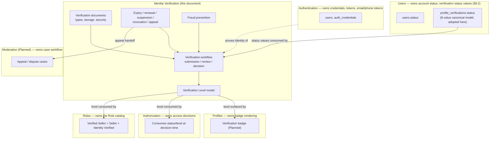
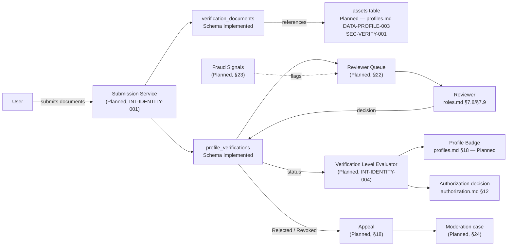
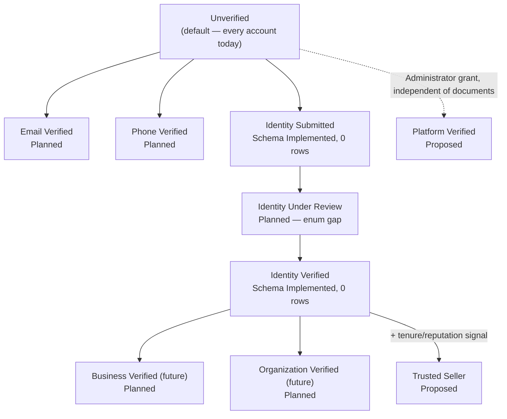
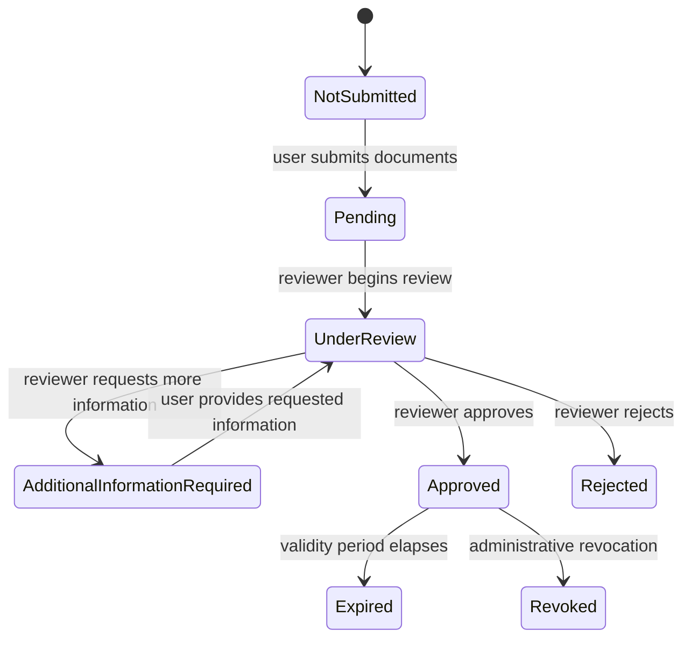
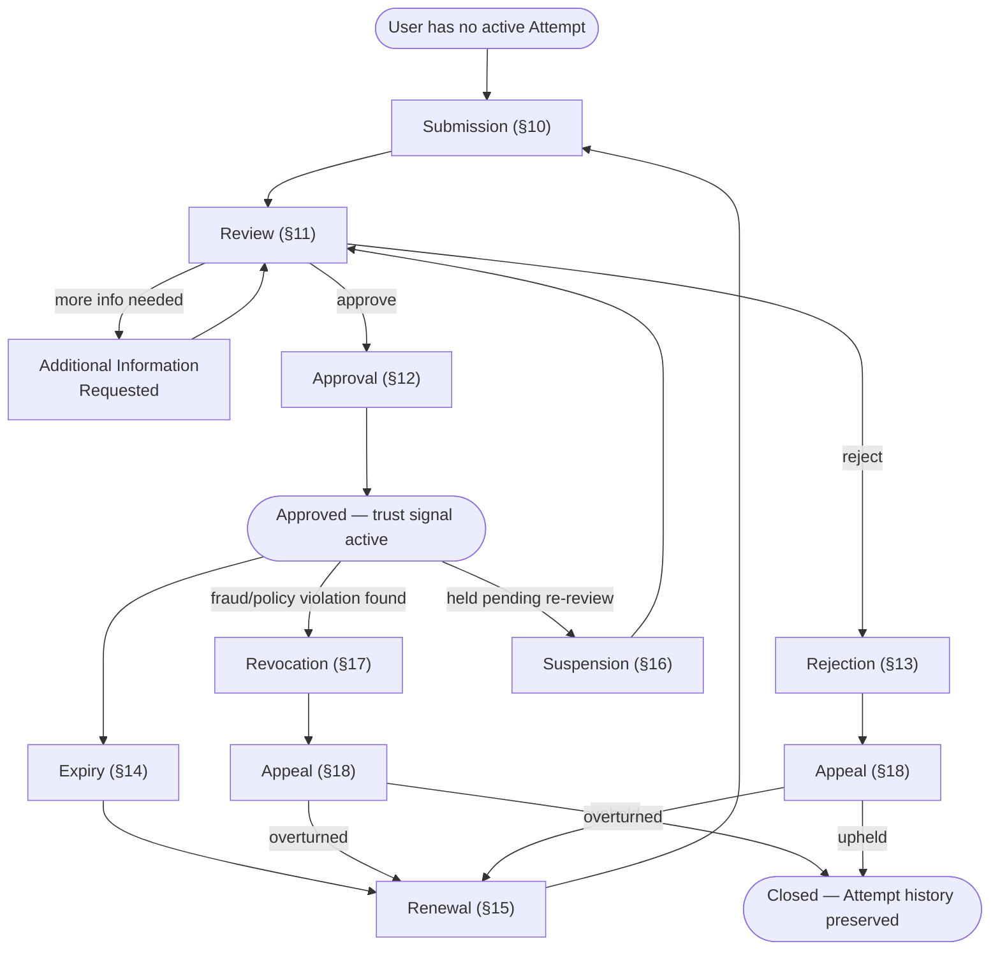
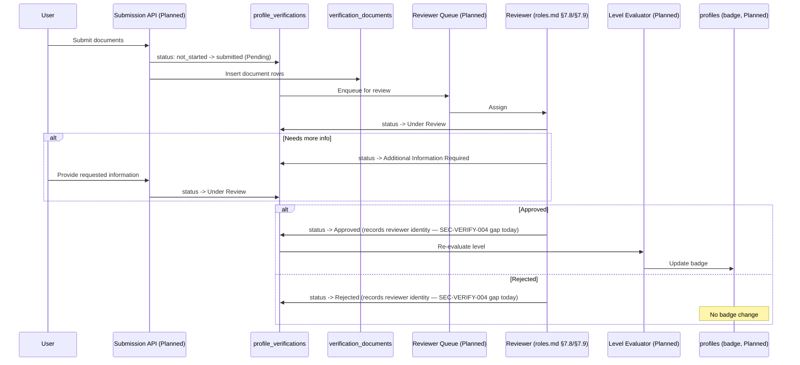
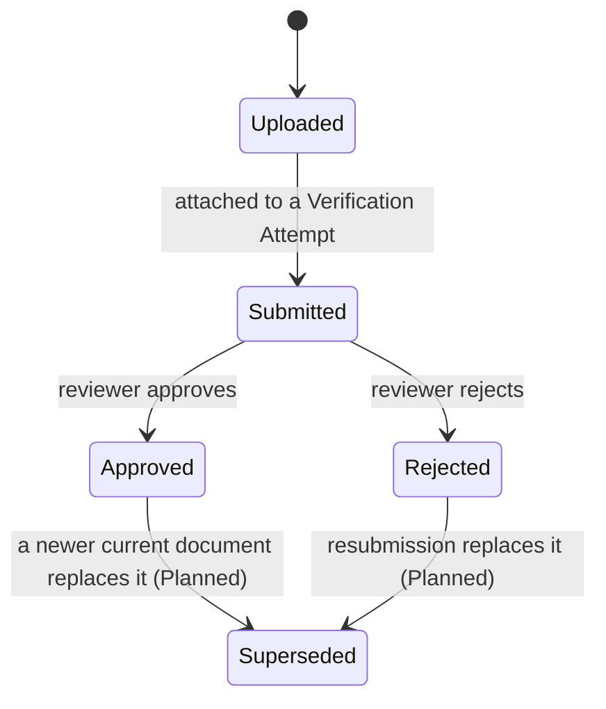
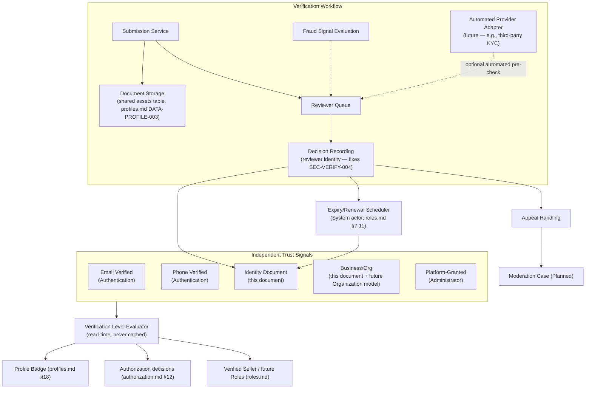
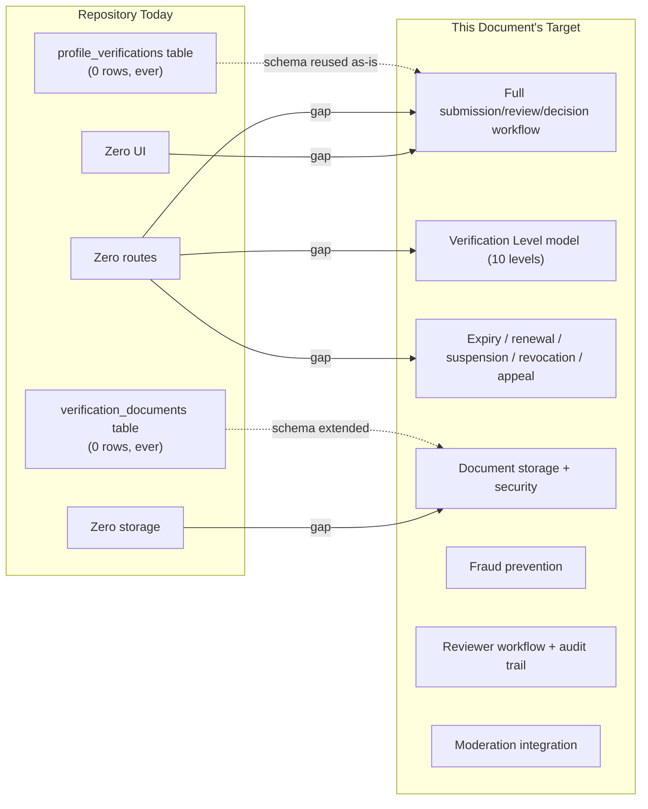

# MusicApp Identity Verification Domain Specification

| Field | Value |
|---|---|
| Document | Identity Verification Domain Specification |
| Domain | Identity Verification (`03-identity-profiles-verification/`) |
| Document ID | SPEC-IDENTITY-000 |
| Type | Specification (SPEC) |
| Status | Approved |
| Version | 1.0.0 |
| Owner | Engineering (interim: repository maintainers) |
| Repository branch | `docs/specification-foundation` |
| Last updated | 2026-07-22 |
| Related documents | [`product-overview.md`](../01-foundation/product-overview.md), [`system-architecture.md`](../01-foundation/system-architecture.md), [`users.md`](../02-users-roles-permissions/users.md), [`authentication.md`](../02-users-roles-permissions/authentication.md), [`authorization.md`](../02-users-roles-permissions/authorization.md), [`roles.md`](../02-users-roles-permissions/roles.md), [`profiles.md`](../02-users-roles-permissions/profiles.md) |
| Supersedes / Superseded By | None |

This document follows [`docs/00-governance/README.md`](../00-governance/README.md) (GOV-000). It is the canonical specification for the Identity Verification domain — the workflow, documents, review process, and trust-tier model that produce and maintain the *identity-verification status* `users.md` §8.2 already defines, and the *verification badge* `profiles.md` §18 already reserves a surface for but explicitly declines to own the workflow behind. It converts this task's canonical verification architecture into governed documentation, verifies every technical claim against the repository at time of writing, and does not silently remove or contradict any decision already made in `users.md`, `authentication.md`, `authorization.md`, `roles.md`, or `profiles.md`.

**A note on scope, stated plainly, repeating the same check every prior document in this series has made:** this task's brief lists `docs/02-users-roles-permissions/permissions.md` among "current completed specification documents." At the time of writing, **no such file, and no commit introducing one, exists in this repository** (`git log --oneline --all | grep -i permission` and `ls docs/02-users-roles-permissions/` both confirm this). This document does not rely on it and does not cite it as authoritative. Wherever a Permission catalog would be relevant, this document treats it exactly as `authorization.md` §3/§25, `roles.md` §3/§6.2, and `profiles.md` §3 already do — a future document, not yet written. This discrepancy is raised again in the final report accompanying this document's creation.

**Status taxonomy:** this document classifies every feature using the same five-value taxonomy established in [`system-architecture.md`](../01-foundation/system-architecture.md) §2.3 and reused in [`users.md`](../02-users-roles-permissions/users.md), [`authentication.md`](../02-users-roles-permissions/authentication.md), [`authorization.md`](../02-users-roles-permissions/authorization.md), [`roles.md`](../02-users-roles-permissions/roles.md), and [`profiles.md`](../02-users-roles-permissions/profiles.md) — **Implemented**, **Partially Implemented**, **Schema Implemented**, **Planned**, **Proposed** — per GOV-000 §12 (single source of truth), not redefined here. This task's brief additionally asks for a "Not Implemented" classification; per the identical reconciliation `roles.md` §4.3 already made for the same brief-vs-taxonomy mismatch, "Not Implemented" is treated here as the established taxonomy's existing **Planned** value (a canonically decided concept absent from the repository) or, where a concept is not yet a canonical decision anywhere, **Proposed**. No sixth, competing status label is introduced.

**How this document separates content**, consistent with `profiles.md`'s and `roles.md`'s convention: **Canonical Product Decisions** are stated as definitions and rules (§6–§25, §35.1); **Repository Facts** live in §30 and in "Evidence"/"Repository Status" columns throughout; **Intentional Future Architecture** lives in §26; **Implementation Gaps** are the distance between a canonical decision and repository fact, labeled explicitly in §31; **Risks** live in §32; **Assumptions** live in §33; **Open Questions** live in §34.

## 1. Executive Summary

Identity Verification answers one question: *"How much should the platform, and everyone on it, trust that this actor is who they claim to be?"* It owns the workflow that produces trust signals — document submission, reviewer decision, expiry, renewal, revocation, appeal — and the trust-tier model (§7) that other domains consume to unlock trust-sensitive capabilities. It does not own credentials (`authentication.md`), does not own public-identity presentation (`profiles.md`), and does not own the authorization decision framework (`authorization.md`). `users.md` §8.2 already defines the canonical, 8-value *identity-verification status* enum and its state machine as a per-attempt lifecycle; this document adopts that definition verbatim (§8) and is the specification for everything around it that `users.md` explicitly deferred: submission mechanics, reviewer workflow, document handling, storage, security, fraud prevention, expiry, renewal, appeals, and the broader multi-method Verification Level model this task requires.

**Verified against the repository: Identity Verification is Schema Implemented with zero executable behavior.** Two tables exist — `profile_verifications` (`backend/db/003_create_profile_verifications.sql`) and `verification_documents` (`backend/db/004_create_verification_documents.sql`) — both created on 2025-12-25, both fully formed with enums, foreign keys, and check constraints. **A repository-wide, case-insensitive search of `backend/Index.js` for `profile_verifications` and `verification_documents` returns zero matches.** No route creates, reads, updates, or transitions either table. `POST /auth/signup` (`backend/Index.js:203-314`), the repository's one multi-record transactional write, inserts into `users`, `profiles`, and `auth_credentials` — never `profile_verifications` — so **no verification row of any kind, not even the schema's own `not_started` default, has ever been created by any code path in this repository.** No `uploads/`, `middleware/`, or `routes/` directory exists; `backend/package.json` lists no file-upload, object-storage, or background-job dependency (`bcryptjs`, `cors`, `dotenv`, `express`, `jsonwebtoken`, `pg` only). The frontend (`frontend/src/App.tsx`, `frontend/src/api/api.js`) contains no verification UI, no document-upload UI, and no reviewer/admin screen of any kind.

**One finding carries forward and compounds a defect `profiles.md` `SEC-PROFILE-005` already recorded, on a second table.** `verification_documents.asset_id` (`backend/db/004_create_verification_documents.sql:33`) is `UUID NOT NULL` with an inline comment — *"FK to `assets(id)` will be added after `assets` table exists"* — and no `assets` table exists anywhere in the repository's eight migrations. Every document row this table could ever hold is structurally unable to resolve `asset_id` to anything. This is recorded as `SEC-VERIFY-001` (§27.1), explicitly cross-referenced against `SEC-PROFILE-005` rather than re-litigated.

**A second, new finding, not previously recorded by any prior document:** `profile_verifications` has `reviewed_at TIMESTAMPTZ` and `review_notes TEXT`, but **no column records who performed a review.** Even a hand-written, direct-database review today would leave no attributable reviewer identity — only a timestamp and free-text notes. This directly contradicts this task's canonical decision that "review decisions are auditable," recorded as `SEC-VERIFY-004` (§27.1), the sharpest new gap this document identifies.

**Every workflow concept this task requires — submission, review, approval, rejection, expiry, renewal, suspension, revocation, appeal, reviewer assignment, fraud prevention, and moderation integration — has zero repository footprint beyond the two static tables described above.** This document defines the canonical target for all of them, while adopting `users.md` §8.2's already-canonical status model rather than re-deriving it.

## 2. Purpose

The Identity Verification domain exists to let the platform assert, with an auditable and time-bound basis, that a specific User controls a specific real-world identity or business — and to let that assertion unlock trust-sensitive capabilities (principally, receiving escrow payouts, `users.md` `BR-USERS-011`) without ever becoming a substitute for authentication or authorization. `system-architecture.md` §10.3 already notes, at the architecture-handbook level, that a Profile "should be able to display a verification badge once identity verification is approved" and classifies the underlying tables as Schema Implemented with no route connecting them to anything; `users.md` §8.2 already defines the canonical status values a verification attempt passes through. This document is the full specification for what produces that status, and for everything downstream of "Approved" that no prior document has yet defined.

**Verified:** the separation between identity verification and every adjacent domain is structurally real today. `profile_verifications` and `verification_documents` (`backend/db/003`, `004`) hold no credential, token, or public-identity data; `users`, `auth_credentials`, and `profiles` each remain independent tables, joined to the verification tables only by `user_id` foreign keys.

## 3. Scope

This document covers the Identity Verification domain: the trust model and Verification Levels (§7), the verification-status lifecycle as adopted from `users.md` §8.2 (§8), the full workflow — submission, review, approval, rejection, expiry, renewal, suspension, revocation, appeal (§9–§18) — identity documents, their types, storage, and security (§19–§21), reviewer workflow (§22), fraud prevention (§23), moderation integration (§24), and how Verification Levels unlock capabilities elsewhere in the platform (§25). It does not cover:

- **The Permission catalog** — deferred to a future `permissions.md`, per `authorization.md` §3/§25, `roles.md` §3/§6.2, and `profiles.md` §3 (see the note on the opening page).
- **The Authorization decision framework, evaluation pipeline, or `authorize()` function** — owned by `authorization.md`. This document defines *what evidence produces a trust signal and how that signal changes over time*; `authorization.md` defines *how a specific access decision consumes that signal* (`authorization.md` §12).
- **Public-facing identity presentation, the verification badge's rendering, or any other Profile field** — owned by `profiles.md`. This document produces the verification *status* and *level*; `profiles.md` §18 owns the badge's display and freshness (`BR-PROFILE-012`).
- **Credentials, tokens, sessions, or email/phone-verification token mechanics** — owned by `authentication.md`. This document's Verification Level model (§7) consumes Email Verified and Phone Verified as *signals*, without redefining how Authentication issues or validates the underlying tokens (`authentication.md` §15).
- **The Role and Role Assignment catalog** — owned by `roles.md`. This document's Reviewer references (§22) consume, and do not redefine, `roles.md` §7.8 (Moderator) and §7.9 (Administrator); `roles.md` §7.7's Verified Seller Role consumes, and this document does not redefine, this document's Identity Verified level (§25).
- **Account status and its lifecycle** — owned by `users.md` §8.1. This document consumes account status only to note that a `Suspended`/`Deleted` account's verification record should not itself grant capabilities (§25).
- **Content moderation generally, or dispute investigation** — owned by Moderation (`system-architecture.md` §10.11, Planned, zero repository footprint). §24 defines only the handoff between a rejected/revoked verification and a moderation case, not moderation's own workflow.

### 3.1 Cross-Document Consistency Statement

This document was written after, and was checked against, `users.md` (v1.2.0), `authentication.md` (v1.2.0), `authorization.md` (v1.1.0), `roles.md` (v1.0.0), and `profiles.md` (v1.0.0) in full, plus `system-architecture.md` §10.3 and `product-overview.md`. No objective contradiction was found that would prevent this document from being internally consistent while leaving those documents unmodified. `users.md` §8.2's 8-value canonical status model and its state diagram are adopted verbatim (§8) rather than redefined, exactly as `profiles.md` §18.1 already did in summary form; this document is the detailed expansion `profiles.md` §18.1 explicitly declined to provide. Per this task's instruction, no existing specification was modified.

## 4. Terminology and Identifier Governance

### 4.1 Identifier Governance Note

GOV-000 §11 permits the domain tokens `AUTH`, `AUTHZ`, `USERS`, `IDENTITY`, `MARKETPLACE`, `PROJECTS`, `ESCROW`, `MESSAGING`, `RATINGS`, `MODERATION`, `NOTIFICATIONS`, `ADMIN`, `ANALYTICS`. **Unlike `roles.md`'s `ROLE` token and `profiles.md`'s `PROFILE` token, `IDENTITY` is already on this list — and GOV-000 §4 (Directory Structure) already maps "Profiles, identity verification, verification documents" to `03-identity-profiles-verification/`, exactly the directory this document is filed under.** This resolves, for this document specifically, the directory/token mismatch `profiles.md` §4.1 raised as its top open question (`profiles.md` §33.1, item 1) — had `profiles.md` been filed here instead, it could have used `IDENTITY` without a provisional gap; this document, filed correctly, does exactly that. This document therefore introduces `BR-IDENTITY-*`, `REQ-IDENTITY-*`, `DATA-IDENTITY-*`, `INT-IDENTITY-*`, and `AUD-IDENTITY-*` as **fully governed identifier families under GOV-000 §11/§11.1** — no provisional gap, no governance modification needed.

**One narrower gap remains, worth stating precisely rather than silently resolving either direction.** This task's brief explicitly directs Security Findings to use the identifiers `SEC-VERIFY-001`, `SEC-VERIFY-002`, and so on — `VERIFY`, not `IDENTITY`. `VERIFY` is not a token GOV-000 §11 permits. Per this task's explicit instruction, this document does not modify `docs/00-governance/README.md`; it uses `SEC-VERIFY-*` exactly as directed, as a **document-local, explicitly non-governed identifier family**, using the same precedent `authorization.md` v1.0.0 established for `AUTHZ` and `roles.md`/`profiles.md` reused for `ROLE`/`PROFILE` — with the narrower nuance that here, only the `SEC-*` family is provisional; every other family in this document (`BR-`, `REQ-`, `DATA-`, `INT-`, `AUD-IDENTITY-*`) is already fully governed. This split — one governed token for most families, one task-directed but ungoverned token for Security Findings specifically — is raised as an open question with a recommendation (§34.1, item 1).

### 4.2 Domain Terms

| Term | Owning Domain | One-line Definition |
|---|---|---|
| Verification Attempt | **This document** | One User's single pass through the identity-document verification workflow; status values owned by `users.md` §8.2, workflow mechanics owned here (§8, §9) |
| Verification Status | `users.md` §8.2, consumed here | The 8-value canonical state of a single Verification Attempt (`Not Submitted` … `Revoked`); adopted, not redefined (§8.1) |
| Verification Level | **This document** | A broader, multi-method trust tier (email, phone, identity document, business, platform-granted) summarizing an actor's overall verification standing (§7) |
| Verification Document | **This document** | A single uploaded artifact (a passport photo, a selfie, a business registration certificate) submitted as evidence for a Verification Attempt (§19) |
| Reviewer | Roles (`roles.md` §7.8, §7.9), consumed here | The actor who evaluates a submitted Verification Attempt and records a decision (§11, §22) |
| Document Storage | **This document**, dependent on `profiles.md` `DATA-PROFILE-003` | Where and how a Verification Document's underlying file is held; consumes the same `assets` table concept `profiles.md` already reserves for Avatar storage (§20) |
| Fraud Signal | **This document** | Any evidence (duplicate document, submission velocity, mismatched metadata) used to flag a Verification Attempt for heightened scrutiny (§23) |
| Verification Badge | `profiles.md` §18, consumed as an input here | The public-facing rendering of an `Identity Verified` (or higher) Verification Level on a Profile; this document produces the level, `profiles.md` owns the rendering |
| Authentication | Authentication | Proves control of an identity — see `authentication.md`. Verification never substitutes for it (§6.1, `BR-IDENTITY-002`) |
| Authorization | Authorization | Decides whether a proven (or anonymous) actor may perform a specific action now, consuming Verification Level/Status as one input among several — see `authorization.md` §12. Verification never decides an access outcome itself (§6.1, `BR-IDENTITY-003`) |

**Identity Verification remains strictly separate from Authentication and Authorization.** `authentication.md` §4 already states, from the Authentication side, that identity/professional verification is "distinct from email verification" and owned at the Profiles/identity-verification boundary; this document is that boundary's dedicated specification. Authorization consumes verification status and level as decision inputs (`authorization.md` §12) but never owns the workflow that produces them.

## 5. Ownership

### 5.1 Ownership Matrix

| Concern | Owning Domain | This Document's Responsibility | Non-Responsibility |
|---|---|---|---|
| Verification-status values and per-attempt state machine | Users (`users.md` §8.2) | Adopts and cites, does not redefine (§8) | Does not alter `users.md`'s 8-value model or its transitions |
| Verification workflow mechanics (submission, review, decision) | **This document** | Owns (§9–§13) | — |
| Verification document schema, types, storage, security | **This document** | Owns (§19–§21) | Does not own the underlying object-storage table itself — `profiles.md` `DATA-PROFILE-003` already reserves `assets` (§20) |
| Expiry, renewal, suspension, revocation, appeal | **This document** | Owns (§14–§18) | — |
| Reviewer workflow mechanics (queueing, decision recording) | **This document** | Owns the mechanics (§22) | Does not own *who* may review — the Reviewer Role itself is `roles.md`'s catalog (§7.8, §7.9) |
| Fraud prevention signals and evaluation | **This document** | Owns (§23) | — |
| Verification Level model and derivation | **This document** | Owns (§7, §25) | Does not own the Verified Seller Role that consumes it — `roles.md` §7.7 |
| Verification badge rendering on a Profile | `profiles.md` §18 | Supplies the level/status this renders | Does not render or own Profile presentation |
| Moderation case handling for rejected/revoked verifications | Moderation (Planned, `system-architecture.md` §10.11) | Defines the handoff point only (§24) | Does not own moderation's own workflow |
| Access-decision evaluation (who may see/act on a Verification Attempt now) | Authorization | Supplies status/level as a decision input (`authorization.md` §12) | Never decides an access outcome itself |
| Identity, credentials, tokens | Users, Authentication | — | Verification never proves identity |

**Verified:** no table, migration, or code file in the repository currently implements any row in the "This Document's Responsibility" column above beyond the raw schema of `profile_verifications`/`verification_documents` themselves (§30).

### 5.2 Ownership Boundary Diagram

*No box in this diagram beyond the two static tables (`profile_verifications`, `verification_documents`) has any repository trace today (§30). The diagram shows target ownership boundaries, not implemented data flow.*

### 5.3 Reconciliation: "Verification Belongs to Profiles"

This task's canonical decisions state "Verification belongs to Profiles." `profiles.md` §5.1 already resolves this precisely: Profiles owns *surfacing* (the badge) and explicitly does not own "the verification review workflow itself," which it names the "Profiles/identity-verification boundary" and defers. This document is that deferred workflow's specification. **"Verification belongs to Profiles" remains true at the outcome level — the trust signal this document produces is surfaced on a Profile, and no other domain re-implements that surfacing** — while the operational ownership of the workflow that produces the signal is this document's, exactly as `profiles.md` §18.1 already anticipated. This is not a contradiction; it is the boundary `profiles.md` drew, filled in from the other side. `BR-IDENTITY-001`: the verification *workflow* (submission, review, decision, document handling) is owned by the Identity Verification domain; the verification *badge* is owned by Profiles; neither domain redefines the other's half. Status: canonical, stated here for the first time in this precise form.

## 6. Verification Architecture

### 6.1 Canonical Principles

| # | Principle | Source |
|---|---|---|
| 1 | Verification belongs to Profiles (surfacing) and Identity Verification (workflow) — §5.3. | This task's brief; reconciled §5.3 |
| 2 | Users authenticate independently of verification — an unverified User can still log in, browse, and message (`users.md` §8.3's blocked/not-blocked table). | This task's brief; `users.md` §8.3 |
| 3 | Verification never replaces authentication — a verified identity still requires a valid, current session to act (`authentication.md` §7). | This task's brief |
| 4 | Verification never replaces authorization — a verified identity is one input to an access decision, never a decision itself (`authorization.md` §12, `BR-AUTHZ-006`). | This task's brief; `authorization.md` `BR-AUTHZ-006` |
| 5 | Verification increases trust, and may unlock capabilities — principally escrow payout eligibility (`users.md` `BR-USERS-011`, `authorization.md` `BR-AUTHZ-010`). | This task's brief |
| 6 | Verification status and Verification Level are always evaluated fresh, never cached as a permanent token claim — the same "no permanent truth in tokens" principle `authentication.md` §7 and `roles.md` §7.7 already apply to status and Role state. | `authentication.md` §7; `roles.md` `BR-ROLE`-equivalent (§7.7) |
| 7 | Verification status is auditable; review decisions are auditable. | This task's brief; target only — `SEC-VERIFY-004` |
| 8 | Verification history is immutable — a closed attempt is never overwritten; a new attempt is a new record (`users.md` `BR-USERS-012`). | This task's brief; `users.md` `BR-USERS-012` |
| 9 | Documents are never public — accessible only to the owning User and an authorized Reviewer/Administrator. | This task's brief |
| 10 | Verification may expire and may require renewal. | This task's brief |
| 11 | Multiple verification methods are supported — email, phone, identity document, and (future) business/organization are independent tracks, not one flow (§7). | This task's brief |
| 12 | Future automated verification providers are supported — the review step is an interface, not necessarily a human reviewer forever (§26). | This task's brief |

**Verified:** none of the twelve principles above are contradicted by the repository, since none are exercised by the repository at all — every principle describes target architecture (§30).

### 6.2 Architecture Diagram

*Every node except `verification_documents` and `profile_verifications` is Planned. This is the target architecture this document specifies, not a description of current behavior (§30).*

## 7. Verification Trust Model

### 7.1 Trust Model Philosophy

Verification is not one flow but a set of independent trust *signals*, each raising confidence in a different claim: an email address is reachable (Email Verified), a phone number is reachable (Phone Verified), a real-world identity document matches the claimed person (Identity Verified), a business entity exists and is controlled by the claimant (Business Verified, future), and — orthogonally — the platform itself vouches for an actor beyond what any document can prove (Platform Verified). **Design principle, stated as canonical for the first time in this document:** a `Verification Level` is always a *derived, read-time-evaluated* summary of these independent signals, never an independently stored, potentially stale value on its own — mirroring the "no permanent truth in tokens" principle `authentication.md` §7 already establishes and `roles.md` §7.7 already applies to Verified Seller. `BR-IDENTITY-002`: no component may cache a Verification Level beyond the lifetime of a single decision without an explicit invalidation mechanism. Status: Proposed (this document's own architectural stance; no canonical decision elsewhere required it, but none contradicts it).

### 7.2 Verification Level Matrix

| Level | Definition | Prerequisite(s) | Derivation | Repository Status |
|---|---|---|---|---|
| Unverified | No verification signal of any kind has been established. | None — the default. | Implicit (absence of every other level). | The de facto status of every account today — not because it was built, but because nothing above it exists. No `verification_level` column exists anywhere (§30). |
| Email Verified | The account's email address has been confirmed reachable. | A completed email-verification token exchange. | Owned by Authentication (`authentication.md` §15), consumed here. | Planned — `authentication.md` §1 confirms email verification has "no schema or code trace in the repository." |
| Phone Verified | The account's phone number has been confirmed reachable. | A completed phone-verification exchange (mechanism undecided). | Owned by Authentication (analogous to email verification), consumed here. | Planned — `users.md`'s `phone_e164` column exists (`backend/db/001_create_users.sql`); no verification flow of any kind references it. |
| Identity Submitted | A Verification Attempt has entered the workflow with documents attached. | At least one Verification Document uploaded and a Verification Attempt in `Pending` or later (`users.md` §8.2). | Derived from `profile_verifications.status` (via `submitted`). | Schema Implemented (enum value exists); zero rows ever created (§1). |
| Identity Under Review | A Reviewer has begun evaluating the submission. | Verification Attempt status = `Under Review` (`users.md` §8.2). | Derived from `profile_verifications.status`. | Planned — target-architecture gap; no `Under Review` equivalent in the current 4-value enum (`users.md` §8.2's mapping table). |
| Identity Verified | The identity document review succeeded. | Verification Attempt status = `Approved` (`users.md` §8.2). | Derived from `profile_verifications.status` (via `approved`). | Schema Implemented (enum value exists); zero rows ever created; no badge surfaces it (`profiles.md` `SEC-PROFILE-*` confirms no badge column). |
| Business Verified (future) | A business entity associated with the account has been verified (registration + tax documents). | A future Organization/Business entity exists and its own document review succeeds. | Depends entirely on the not-yet-existing Organization model (`users.md` §14, `authorization.md` §18). | Planned — explicitly named "future" by this task; zero repository trace, no Organization schema exists anywhere. |
| Organization Verified (future) | An Organization itself (not an individual member) has passed a distinct organizational verification. | Same as Business Verified, plus Organization-level review criteria (undecided). | Same dependency as Business Verified. | Planned — explicitly named "future"; zero repository trace. |
| Trusted Seller | A sustained, higher trust tier beyond one-time identity verification — Identity Verified plus a tenure and/or reputation threshold. | Identity Verified **and** a Ratings/tenure signal (Ratings domain is Planned, zero content schema, `system-architecture.md` §10.9). | **Proposed** (this document's own suggestion) — distinct from `roles.md` §7.7's Verified Seller *Role*, which requires only Identity Verified + an active Seller relationship, with no tenure/reputation bar (§7.3 note below). | Proposed — no canonical decision elsewhere defines this level; not built anywhere. |
| Platform Verified | The platform itself manually grants a recognition mark, independent of any document (analogous to an editorial or "official" verification), at Administrator discretion. | An explicit Administrator grant, auditable (`roles.md` §7.9). | **Proposed** (this document's own suggestion) — orthogonal to every document-based level above. | Proposed — no canonical decision elsewhere; flagged for product confirmation (§34.1). |

**Verified Seller (a Role, `roles.md` §7.7) vs. Trusted Seller (a Verification Level, this document) — stated precisely to avoid collision:** `roles.md` §7.7 defines Verified Seller as fully derived from Seller (a relationship, `roles.md` §7.6) **and** `Approved` identity-verification status — exactly this document's `Identity Verified` level, nothing more. Trusted Seller is a strictly higher, newly introduced bar this document proposes, requiring a sustained signal `roles.md` never required for Verified Seller. The two are not the same concept under different names; `roles.md` §7.7 is not redefined by this table.

### 7.3 Verification Level Progression Diagram

*Email Verified, Phone Verified, and the Identity-document track are independent, parallel signals — not a single linear ladder. Business Verified and Organization Verified depend on identity verification plus a not-yet-existing Organization entity. Trusted Seller and Platform Verified are this document's own proposed extensions (§7.2), not required by any prior canonical decision.*

## 8. Verification Status

### 8.1 Canonical Status Values (Adopted from `users.md` §8.2)

**This document adopts `users.md` §8.2's 8-value canonical identity-verification status model verbatim and does not redefine it**, consistent with GOV-000 §12's single-source-of-truth rule and with `profiles.md` §18.1's identical practice. It is reproduced here, with attribution, because every section that follows (§9–§18) depends on it:

| Status | Definition | Source |
|---|---|---|
| Not Submitted | No verification attempt has been submitted (or a prior attempt is closed and no new one is open). | `users.md` §8.2 |
| Pending | Documents submitted; awaiting a reviewer to begin review. | `users.md` §8.2 |
| Under Review | A reviewer is actively evaluating the submission. | `users.md` §8.2 |
| Additional Information Required | The reviewer has requested further information or documentation before a decision can be made. | `users.md` §8.2 |
| Approved | The verification attempt succeeded. | `users.md` §8.2 |
| Rejected | The verification attempt failed. | `users.md` §8.2 |
| Expired | A previously `Approved` verification's validity period has elapsed. | `users.md` §8.2 |
| Revoked | A previously `Approved` verification was administratively invalidated (e.g., fraud discovered after approval). | `users.md` §8.2 |

`users.md` §8.2 additionally establishes, and this document does not restate independently but relies on throughout: identity-verification status is entirely separate from account status (§8.3); a subsequent attempt after a terminal status is a new, independent record, not a transition within the same one (`users.md` `BR-USERS-012`); and `verification_documents.status` is a related but distinct, per-document status.

### 8.2 Current Schema Mapping

Reproduced from `users.md` §8.2 for this document's own context, not redefined:

| Canonical Status | Current Enum Equivalent (`profile_verifications.status`) | Status |
|---|---|---|
| Not Submitted | `not_started` | Schema Implemented |
| Pending | `submitted` (does not distinguish Pending from Under Review) | Schema Implemented, coarser than target |
| Under Review | None — collapsed into `submitted` | Planned — target-architecture gap |
| Additional Information Required | None | Planned — target-architecture gap |
| Approved | `approved` | Schema Implemented |
| Rejected | `rejected` | Schema Implemented |
| Expired | None | Planned — target-architecture gap |
| Revoked | None | Planned — target-architecture gap |

**This document's addition to `users.md` §8.2's own finding:** the enum-completeness gap above is only half the repository gap. The other half — confirmed by this document's own repository review (§30) — is that **even the four enum values that do exist are never written by any route.** `users.md` §13.3 already noted "Schema Implemented, no route"; this document confirms precisely that zero rows of any status exist in `profile_verifications` today, because no code path (including `POST /auth/signup`, the repository's only multi-table transactional insert) ever creates one (§1).

### 8.3 Verification State Machine Diagram

Reproduced from `users.md` §8.2 for this document's own context (single source of truth remains `users.md`, per GOV-000 §12):

*Identical to `users.md` §8.2's diagram. `Rejected`, `Expired`, and `Revoked` are terminal **for that attempt**; a subsequent attempt is a new record beginning again at `Not Submitted` (`users.md` `BR-USERS-012`, §8's addition below). This entire diagram is Planned — the current schema has no `Under Review`, `Additional Information Required`, `Expired`, or `Revoked` equivalent, and no route transitions `profile_verifications.status` at all.*

**This document's addition:** `profile_verifications.user_id` is `UNIQUE` (`backend/db/003_create_profile_verifications.sql:21`), which structurally caps the table at one row per user, ever. `users.md` `BR-USERS-012`'s "new attempt is a new record" target requires a schema where the unique constraint is scoped to *current* attempts only (e.g., an `is_current` flag mirroring `verification_documents`'s own pattern, `backend/db/004_create_verification_documents.sql:63-65`), not the bare user ID. This is recorded as `SEC-VERIFY-002` (§27.1).

## 9. Verification Lifecycle

### 9.1 Lifecycle Matrix

| Stage | Description | Preconditions | Resulting Status | Repository Status |
|---|---|---|---|---|
| Submission | User uploads one or more Verification Documents and starts a Verification Attempt (§10). | `Not Submitted`, or a prior attempt closed | `Pending` | Planned |
| Queueing | The Attempt enters a Reviewer's work queue (§22). | `Pending` | `Pending` (unchanged; queue position is metadata) | Planned |
| Review begins | A Reviewer opens the Attempt for evaluation (§11). | `Pending` | `Under Review` | Planned |
| Information requested | The Reviewer determines the submission is incomplete or ambiguous. | `Under Review` | `Additional Information Required` | Planned |
| Information provided | The User supplies the requested material. | `Additional Information Required` | `Under Review` | Planned |
| Decision: Approve | The Reviewer confirms the identity claim (§12). | `Under Review` | `Approved` | Planned |
| Decision: Reject | The Reviewer rejects the claim (§13). | `Under Review` | `Rejected` | Planned |
| Expiry | The Attempt's validity period elapses (§14). | `Approved` | `Expired` | Planned |
| Renewal | The User initiates a new Attempt ahead of, or after, expiry (§15). | `Approved`/`Expired`, or `Not Submitted` after closure | New Attempt at `Not Submitted`/`Pending` | Planned |
| Suspension | An Attempt or its resulting trust signal is temporarily held without a terminal decision (§16). | `Under Review` or `Approved` | `Suspended` (new state — see note below) | Planned |
| Revocation | An `Approved` Attempt is administratively invalidated (§17). | `Approved` | `Revoked` | Planned |
| Appeal | The User contests a `Rejected` or `Revoked` outcome (§18). | `Rejected` or `Revoked` | Unchanged pending appeal decision, or a new Attempt if the appeal succeeds | Planned |

**Note on Suspension as a lifecycle stage:** `users.md` §8.2's 8-value canonical model does not include a `Suspended` status. This document does not add an unrecognized value to that model; instead, Verification Suspension (§16) is defined here as an *operational hold* on the review process — equivalent to pausing at `Under Review` or provisionally withholding trust from an `Approved` attempt pending re-review — represented in this document's own workflow tracking, not as a ninth value competing with `users.md` §8.2's status enum. This is stated explicitly to avoid appearing to silently extend a model owned by another document.

### 9.2 Lifecycle Diagram

*Entirely Planned. No route, table trigger, or scheduled job in the repository implements any transition shown here (§30).*

## 10. Verification Submission

A User initiates a Verification Attempt by uploading one or more Verification Documents (§19) appropriate to the Verification Level they are pursuing (§7). `BR-IDENTITY-004`: submission MUST require the User to be authenticated and acting as themselves — `verification_documents.user_id` and `profile_verifications.user_id` MUST always equal the authenticated actor's ID, never a client-supplied value, applying the same "no client-assigned owner IDs" principle `authorization.md` §24 and `profiles.md` `SEC-PROFILE-002` already establish for Profile creation. `BR-IDENTITY-005`: submission MUST create a new Attempt only when no attempt is currently open (`Pending`/`Under Review`/`Additional Information Required`) — a User with an open Attempt resubmits into that Attempt, not a second parallel one. Status: Planned — no submission route exists; `POST /profiles` (`backend/Index.js:129-199`) and `POST /auth/signup` (`backend/Index.js:203-314`) are the repository's only unauthenticated/self-supplied-identity creation routes, and neither touches `profile_verifications` or `verification_documents` (§1, §30).

## 11. Verification Review

### 11.1 Reviewer Decision Matrix

| Decision | Precondition | Resulting Status Transition | Who May Decide | Audit Requirement | Repository Status |
|---|---|---|---|---|---|
| Begin Review | Attempt is `Pending` | `Pending` → `Under Review` | Reviewer (`roles.md` §7.8/§7.9, §22) | Reviewer identity + timestamp (`SEC-VERIFY-004`) | Planned |
| Approve | Attempt is `Under Review`; all required documents present and consistent | `Under Review` → `Approved` | Reviewer | Reviewer identity, decision reason, timestamp | Planned |
| Reject | Attempt is `Under Review`; documents fail verification criteria | `Under Review` → `Rejected` | Reviewer | Reviewer identity, rejection reason (`verification_documents.rejection_reason` already schema-exists per document, `backend/db/004`), timestamp | Schema Implemented at the per-document level only; no per-attempt equivalent |
| Request Additional Information | Attempt is `Under Review`; submission incomplete/ambiguous | `Under Review` → `Additional Information Required` | Reviewer | Reviewer identity, requested items, timestamp | Planned |
| Escalate | Reviewer determines the case exceeds their authority (e.g., suspected fraud, `SEC-VERIFY-006`) | Unchanged; case reassigned to a higher-privilege Reviewer | Reviewer (target), Administrator receives (`roles.md` §7.9) | Escalation reason, both reviewer identities, timestamp | Planned |
| Revoke | Attempt is `Approved`; new adverse evidence found | `Approved` → `Revoked` | Administrator only (`roles.md` §7.9's "highest-privilege Platform Role") | Administrator identity, revocation reason, timestamp (§17) | Planned |

`BR-IDENTITY-006`: every Reviewer Decision MUST record the deciding actor's identity, not only a timestamp and free-text note — the current schema's `reviewed_at`/`review_notes` columns (`backend/db/003_create_profile_verifications.sql`) satisfy neither "who" nor a structured reason, and this gap is recorded as `SEC-VERIFY-004` (§27.1). Status: Not met.

### 11.2 Verification Review Flow Diagram

*Entirely Planned — no route in the repository submits a document, transitions `profile_verifications.status`, or records a reviewer identity. `profiles.md` §18.2 already showed the Profile-side consequence of this same gap; this diagram shows the full workflow behind it.*

## 12. Verification Approval

Approval transitions a Verification Attempt to `Approved` (§8.1) and, per this document's Verification Level model (§7), immediately grants the `Identity Verified` level — evaluated fresh at every read, never cached (`BR-IDENTITY-002`). `BR-IDENTITY-007`: an Approval MUST record a validity period (expiry date, §14) at the moment of decision — approval without an expiry contradicts this task's canonical "verification may expire" decision. Status: Planned; no `expires_at`-equivalent column exists on `profile_verifications` today (`SEC-VERIFY-003`).

## 13. Verification Rejection

Rejection transitions a Verification Attempt to `Rejected` (§8.1) and MUST NOT grant any Verification Level beyond what the User already held before submission (`BR-IDENTITY-008`). A Rejected Attempt is terminal for itself; the User MAY submit a new Attempt (Renewal, §15, though more precisely a fresh attempt after rejection rather than a true renewal of an approval) or file an Appeal (§18). `verification_documents.status` (`uploaded`/`submitted`/`approved`/`rejected`) already supports a per-document `rejected` value and a `rejection_reason` column (`backend/db/004_create_verification_documents.sql`) — Schema Implemented at the document level, with no per-attempt route to exercise it (§30).

## 14. Verification Expiry

`Approved` verifications MUST carry a validity period after which they transition to `Expired` (`users.md` §8.2) without any adverse finding — a routine, time-based transition, not a punitive one. `BR-IDENTITY-009`: expiry MUST be evaluated at read time against a stored expiry timestamp, consistent with `BR-IDENTITY-002`'s "no cached trust" principle, and — per this task's "future automated verification providers" requirement (§26) — SHOULD be executable by a System actor (`roles.md` §7.11) as a scheduled process, not only implicitly on next read. Status: Planned. `roles.md` §7.11 already confirms "no scheduled-job runner, cron mechanism, or background-worker process exists anywhere in the repository," which this document's own review of `backend/package.json` reconfirms (§30) — even an implicit, read-time expiry check has no `expires_at` column to check against (`SEC-VERIFY-003`).

## 15. Verification Renewal

A User whose verification has `Expired`, or who wishes to re-verify ahead of expiry, MAY start a new Verification Attempt (Renewal). `BR-IDENTITY-010`: a Renewal MUST create a new Attempt record, preserving the prior (`Expired`) record's full history — never overwriting it — consistent with `users.md` `BR-USERS-012`'s append-only philosophy and this document's §8.3 addition regarding `profile_verifications.user_id`'s current `UNIQUE` constraint (`SEC-VERIFY-002`). Status: Planned; the schema as it exists today cannot satisfy this rule without a schema change (§28).

## 16. Verification Suspension

A Verification Attempt's resulting trust signal MAY be operationally suspended — temporarily withheld — without a terminal `Rejected`/`Revoked` decision, for example while a Reviewer re-examines an `Approved` Attempt following a fraud signal (§23). `BR-IDENTITY-011`: Suspension MUST NOT be modeled as a value competing with `users.md` §8.2's 8-value status enum (§9.1's note); it is this document's own workflow-state concept, tracked independently, and MUST resolve back to exactly one of `users.md` §8.2's values (typically `Under Review`, pending re-decision) within a bounded time. Status: Proposed (this document's own suggestion; no canonical decision elsewhere requires or forbids it). This mirrors the same "independently-governed lifecycle held alongside, not inside, the canonical status" pattern `roles.md` §11 already applied to Role Assignment suspension relative to account status.

## 17. Verification Revocation

Revocation transitions an `Approved` Attempt to `Revoked` (`users.md` §8.2) following the discovery of fraud or a policy violation after approval. `BR-IDENTITY-012`: Revocation MUST be an Administrator-only action (`roles.md` §7.9, per §11.1's Reviewer Decision Matrix), MUST be reason-mandatory, and MUST immediately downgrade the affected User's Verification Level on next evaluation (`BR-IDENTITY-002`) — including immediately re-evaluating any downstream state that depended on it, such as `roles.md` §7.7's Verified Seller Role, which `roles.md` `SEC-ROLE-006`/§7.7 already flags as a continuously-re-evaluated, never-cached condition. Status: Planned; `SEC-VERIFY-003` (no `revoked_at`/`revoked_by` column) blocks this today.

## 18. Verification Appeals

A User whose Attempt is `Rejected` or `Revoked` MAY appeal the decision. `BR-IDENTITY-013`: an Appeal MUST be reviewed by a Reviewer other than the one who made the original decision where practical (segregation of duties, echoing the same open segregation-of-duties concern `roles.md` §30 already raised for Administrator grants), and MUST result in either the original decision being upheld (Attempt remains closed) or overturned (a new Attempt is opened per §15's Renewal rule, or the Revocation is reversed). Status: Planned — zero repository trace; no appeal mechanism, table, or route exists anywhere. An Appeal that remains unresolved past a defined SLA SHOULD escalate to a Moderation case (§24). `REQ-IDENTITY-009` (§35.2) requires this formally.

## 19. Identity Documents

### 19.1 Document Type Matrix

| Document Type | `doc_type` Enum Value | `doc_side` Value(s) | `id_type` Free-Text Convention | Repository Status |
|---|---|---|---|---|
| Passport | `government_id` | `front`, `back` | `id_type = 'passport'` (unconstrained text) | Schema Implemented (generic bucket only) |
| Driver License | `government_id` | `front`, `back` | `id_type = 'drivers_license'` (unconstrained text) | Schema Implemented (generic bucket only) |
| National ID | `government_id` | `front`, `back` | `id_type = 'national_id'` (unconstrained text) | Schema Implemented (generic bucket only) |
| Residence Permit | `government_id` | `front`, `back` | `id_type = 'residence_permit'` (unconstrained text) | Schema Implemented (generic bucket only) |
| Business Registration | Not in enum | Not in enum | N/A | Planned — requires a new `doc_type` enum value; `verification_documents_type_side_consistent` CHECK (`backend/db/004:54-59`) would need extension |
| Tax Certificate | Not in enum | Not in enum | N/A | Planned — same enum extension needed |
| Utility Bill | Not in enum | Not in enum | N/A | Planned — same enum extension needed |
| Selfie | `selfie` | `selfie` | N/A | Schema Implemented (fully modeled at enum level) |
| Supporting Evidence | Not in enum | Not in enum | N/A | Planned — no generic "other evidence" slot exists |
| Future document types | N/A | N/A | N/A | Proposed extensibility point — every addition requires a migration altering both enums and the CHECK constraint (§26) |

**Verified:** `document_type` (`backend/db/004_create_verification_documents.sql:6-8`) has exactly two values — `selfie`, `government_id`. `id_type TEXT NULL` (`backend/db/004:31`) is unconstrained free text with no CHECK, no enum, and no normalization — today's schema can technically hold any string in `id_type`, but nothing validates, indexes, or deduplicates it (§23's fraud-prevention gap).

### 19.2 Document Lifecycle Diagram

*`Uploaded`/`Submitted`/`Approved`/`Rejected` are the current `document_status` enum (`backend/db/004_create_verification_documents.sql:14-16`) — Schema Implemented. `Superseded` does not exist in the enum; the schema instead uses a boolean `is_current` flag with a partial unique index (`verification_documents_one_current_per_slot`, `backend/db/004:63-65`) enforcing at most one current document per `(user_id, doc_type, doc_side)` — a different mechanism than an explicit state, achieving a similar practical effect. No route ever writes to this table (§1, §30).*

## 20. Document Storage

**Verified: no document storage mechanism exists.** `verification_documents.asset_id` is `UUID NOT NULL` (`backend/db/004_create_verification_documents.sql:33`) with an inline comment identical in spirit to `profiles.profile_photo_asset_id`'s — *"FK to `assets(id)` will be added after `assets` table exists"* — and no `assets` table exists in any of the eight migrations. `profiles.md` `DATA-PROFILE-003` already reserves the target `assets` entity (id, owner reference, storage location, mime type, status) as a shared prerequisite for Avatar storage; this document does not redefine that entity, and explicitly notes that **verification documents would depend on the exact same table**, not a parallel one — meaning Avatar storage and identity-document storage are blocked on one shared piece of future work, not two independent ones. `BR-IDENTITY-014`: document storage MUST use signed, time-limited access URLs or equivalent least-privilege retrieval — never a permanently public object path — consistent with this task's "documents are never public" decision (§6.1, principle 9). Status: Planned, blocked on `profiles.md` `DATA-PROFILE-003`; recorded as `SEC-VERIFY-001` (§27.1).

## 21. Document Security

Beyond storage location (§20), document security covers access control, retention, and encryption. `BR-IDENTITY-015`: only the owning User and an authorized Reviewer/Administrator acting on that specific Attempt MAY retrieve a Verification Document's underlying file; no other actor, including other Reviewers not assigned to the case, MAY access it by default. `BR-IDENTITY-016`: Verification Documents MUST be encrypted at rest, consistent with their status as high-sensitivity PII (government ID numbers, dates of birth, photographs) — a stricter bar than ordinary Profile data (`profiles.md` §7.1's Private Identity classification, which itself excludes verification internals from public exposure). `BR-IDENTITY-017`: retention period for rejected/expired/revoked documents MUST be explicitly bounded, not indefinite, per applicable data-protection requirements — the exact period is an open question (§34.1). Status: Planned across all three rules; the file-mime-type CHECK constraint (`backend/db/004:50-51`, restricting to `image/jpeg`/`png`/`heic`/`heif`) is the only document-security-adjacent control that currently exists in the schema, and it constrains format, not access or retention.

## 22. Reviewer Workflow

A Reviewer is not a Role this document defines — `roles.md` §7.8 (Moderator) and §7.9 (Administrator) own the Role catalog, and both are Planned with zero repository footprint. `roles.md` §7.9 explicitly names "review verification outcomes" among Administrator's Responsibilities; `roles.md` §7.8 names Moderator's responsibilities as "review reported content; apply restrictions; escalate cases" without naming identity-document review specifically. **This document does not resolve which Role(s) may perform identity-document review** — Administrator is the better-evidenced fit today, but whether a narrower, dedicated reviewer scope should exist under either Role (or as a distinct future Role, similar to `roles.md` §7.10's Support Operator) is raised as an open question (§34.1) rather than decided here, since minting or reassigning a Role is `roles.md`'s exclusive responsibility (§5.1).

What this document does own is the workflow mechanics a Reviewer, whoever they are, would use: a queue of `Pending` Attempts (§9.1), the Decision Matrix (§11.1), assignment (manual or automated), workload visibility, and escalation. `BR-IDENTITY-018`: Reviewer assignment MUST be recorded and auditable — which Reviewer was assigned, when, and by whom (or by what automated rule) — feeding directly into `SEC-VERIFY-004`'s broader "no reviewer identity is ever recorded" finding. Status: Planned in full; zero repository trace.

## 23. Fraud Prevention

**Verified: no fraud-prevention signal of any kind exists in the schema.** Neither `profile_verifications` nor `verification_documents` records a device fingerprint, IP address, submission velocity, geolocation, or document-hash/duplicate-detection value. `id_type` (§19.1) is unconstrained free text, so even the most basic fraud check — flagging the same government ID number submitted under two different `user_id`s — has no normalized field to check against, since no document-number field exists at all (only an image reference via `asset_id`, itself unresolvable per `SEC-VERIFY-001`). `BR-IDENTITY-019`: the platform SHOULD evaluate, at minimum, submission velocity (multiple Attempts from one actor in a short window), duplicate-document detection (a perceptual or cryptographic hash of the uploaded image, not merely the free-text `id_type`), and cross-account correlation (the same document reused across different `user_id`s) before or during Reviewer evaluation. Status: Proposed (this document's own suggestion, consistent with this task's explicit "fraud prevention" objective); recorded as `SEC-VERIFY-007` (§27.1).

## 24. Moderation Integration

Moderation (`system-architecture.md` §10.11) is Planned with zero repository footprint — confirmed by the same repository-wide search `authorization.md` §1 and `roles.md` §1 already performed for `moderat`, returning zero matches. This document defines only the handoff: `BR-IDENTITY-020`: an unresolved Appeal (§18) past its SLA, or a Revocation triggered by a fraud finding (§17, §23), SHOULD open a Moderation case, carrying the Verification Attempt ID, the underlying Fraud Signal(s) if any, and the acting Reviewer/Administrator's identity. This document does not define the Moderation case's own lifecycle, queue, or resolution mechanics — that remains Moderation's, once it exists. Status: Planned; recorded as `SEC-VERIFY-008` (§27.1) as the concrete consequence of Moderation's absence specifically for verification appeals.

## 25. Verification Levels and Capability Unlocking

| Capability | Minimum Verification Level Required | Owning Decision | Repository Status |
|---|---|---|---|
| Login, browsing, messaging, Profile editing | Unverified (none required) | `users.md` §8.3's "not blocked" table | Implemented (no gate exists at all — everything is currently unrestricted for any authenticated User) |
| Creating a Project as Buyer | Unverified (none required), subject to future risk policy | `authorization.md` §14.2 | Partially Implemented — buyer relationship correct, no verification gate exists or is required |
| Receiving escrow payouts as Seller | Identity Verified | `users.md` `BR-USERS-011`, `authorization.md` `BR-AUTHZ-010`, `roles.md` §7.7 (Verified Seller) | Planned — Escrow has zero routes (`system-architecture.md` §10.7); nothing to gate yet |
| Verified Seller Role eligibility | Identity Verified + active Seller relationship | `roles.md` §7.7 | Planned — fully derived, never independently assigned |
| Trusted Seller level (§7.2) benefits (undecided — e.g., reduced escrow friction, priority discovery placement) | Trusted Seller | **Proposed** — this document's own suggestion; benefit set undecided | Proposed |
| Business/Organization-scoped capabilities (future) | Business Verified / Organization Verified | This document (§7.2), pending `users.md` §14's Organization model | Planned — future |

`BR-IDENTITY-021`: any component gating a capability on Verification Level MUST re-evaluate that level at decision time, never trusting a cached value or a token claim (`BR-IDENTITY-002`, `authentication.md` §7's "no permanent truth in tokens" applied here). Status: Planned in full — no capability in the repository today is gated by verification status or level of any kind (§30).

## 26. Future Architecture

### 26.1 Future Architecture Diagram

*Target end-state architecture. No component shown here has a repository trace beyond the two static tables (`profile_verifications`, `verification_documents`) described throughout this document (§30).*

### 26.2 Implementation Roadmap

| Phase | Scope | Depends On |
|---|---|---|
| 1 | Fix schema gaps: reviewer identity column (`SEC-VERIFY-004`), expiry/revocation columns (`SEC-VERIFY-003`), scope the `user_id` uniqueness to current attempts only (`SEC-VERIFY-002`) | None — pure schema work |
| 2 | Build the `assets` table (shared with `profiles.md` `DATA-PROFILE-003`) and resolve the dangling `asset_id` FK (`SEC-VERIFY-001`) | Coordinated with Profiles domain (Avatar storage shares this dependency) |
| 3 | Build submission, review, and decision routes (§10–§13); wire `POST /auth/signup` or a dedicated flow to at least create a `Not Submitted` baseline record | Phase 1 |
| 4 | Build the Verification Level evaluator (§7, §25) and wire it into `authorization.md`'s decision pipeline and `profiles.md`'s badge rendering | Phase 3 |
| 5 | Build expiry/renewal scheduling (System actor, `roles.md` §7.11) and reviewer workflow/queueing (§22) | Phase 3, `roles.md`'s System actor (Planned) |
| 6 | Build fraud-prevention signals (§23), appeals (§18), and Moderation integration (§24) | Phases 3–5, Moderation domain (Planned) |
| 7 (Proposed) | Automated verification provider adapter (§6.1, principle 12); Trusted Seller and Platform Verified levels (§7.2) | Phases 4–6; product confirmation of Trusted Seller/Platform Verified's exact criteria (§34.1) |

## 27. Failure Handling and Security Architecture

### 27.1 Security Findings Table (`SEC-VERIFY-*`)

| ID | Finding | Severity Context | Repository Evidence | Impact | Target Correction |
|---|---|---|---|---|---|
| `SEC-VERIFY-001` | `verification_documents.asset_id` references a non-existent `assets` table — a second table affected by the same defect `profiles.md` `SEC-PROFILE-005` already recorded for `profiles.profile_photo_asset_id`. | Carried, cross-referenced, second-table angle added | `backend/db/004_create_verification_documents.sql:33`; confirmed via repository-wide search — no `assets` table in any of the eight migrations | Identity-document storage cannot function at all, structurally, not merely "unimplemented" | Build the shared `assets` table (`profiles.md` `DATA-PROFILE-003`) before either dependent feature ships |
| `SEC-VERIFY-002` | `profile_verifications.user_id` is `UNIQUE`, capping the table at one row per user forever — contradicting `users.md` `BR-USERS-012`'s canonical "many attempts, append-only history" decision. | Carried, cross-referenced; new operational consequence identified | `backend/db/003_create_profile_verifications.sql:21`; `users.md` §8.2, §9 `BR-USERS-012` | A rejected or expired User has no schema-valid path to a second Attempt without either violating the unique constraint or losing history | Scope uniqueness to current attempts only (e.g., an `is_current` flag, mirroring `verification_documents`'s existing pattern at `backend/db/004:63-65`) |
| `SEC-VERIFY-003` | No `expires_at`, `revoked_at`, or `revoked_by` column exists on `profile_verifications` — an `Approved` verification can never expire or be revoked in the current schema, regardless of route logic built on top of it. | **New finding, this document** | `backend/db/003_create_profile_verifications.sql` — full column list confirmed; no such columns present | This task's canonical "verification may expire"/"may require renewal" decisions have zero schema support today | Add expiry and revocation columns before building §14/§17's routes |
| `SEC-VERIFY-004` | `profile_verifications` has `reviewed_at`/`review_notes` but **no column recording who performed a review** — no `reviewed_by`/`reviewer_id` field exists anywhere. | **New finding, this document — highest priority** | `backend/db/003_create_profile_verifications.sql` — full column list confirmed | Directly contradicts this task's "review decisions are auditable" canonical decision; even a manual, direct-database review today would be unattributable | Add a `reviewed_by` foreign key to the acting Reviewer before any review route ships |
| `SEC-VERIFY-005` | `verification_documents.status` (per-document) and `profile_verifications.status` (per-attempt) are two independent enums with no constraint, trigger, or documented rule tying them together. | **New finding, this document** | `backend/db/003_create_profile_verifications.sql`, `backend/db/004_create_verification_documents.sql` — no cross-table constraint found | A future implementation could approve individual documents while the parent Attempt remains unresolved, or the reverse, with nothing in the schema to prevent it | Define and enforce a documented consistency rule (e.g., an Attempt cannot reach `Approved` while any required document is not `approved`) before building the review route |
| `SEC-VERIFY-006` | No fraud-prevention signal (device fingerprint, submission velocity, document-hash, cross-account duplicate detection) exists anywhere in either table; `id_type` is unconstrained free text with no document-number field at all. | **New finding, this document** | `backend/db/004_create_verification_documents.sql` — full column list confirmed; `id_type TEXT NULL`, no CHECK, no index | Even the most basic fraud check (same government ID reused across accounts) is structurally impossible today | Build fraud-signal capture (§23) before or alongside the review workflow, not after |
| `SEC-VERIFY-007` | No document storage/retrieval access-control mechanism exists — "documents are never public" (canonical decision) currently holds only because nothing can be stored or served at all, not because any enforcement mechanism exists. | Carried context, new framing | `backend/package.json` — no file-upload or object-storage dependency; no `uploads/` directory anywhere in the repository | The canonical privacy guarantee has no code to violate today, but also none to rely on once storage is built | Build least-privilege, signed-URL-based retrieval (`BR-IDENTITY-014`) as part of the same change that builds storage, not retrofitted afterward |
| `SEC-VERIFY-008` | No Moderation integration exists for rejected/revoked verification appeals — an appealing User has no defined path beyond this document's own, currently unimplemented, appeal concept. | Carried, cross-referenced | `system-architecture.md` §10.11 (Moderation, Planned, zero footprint); confirmed by this document's own repository-wide `moderat` search returning zero matches | A contested verification decision has no independent review path once built, undermining the fairness this task's "verification may be appealed" decision assumes | Build the Moderation handoff (§24) concurrently with, not after, the appeal route itself |

### 27.2 Cross-Referenced Security Findings (Not Redefined)

`profiles.md` `SEC-PROFILE-005` (dangling `assets` reference, shared root cause with `SEC-VERIFY-001`), `profiles.md` `SEC-PROFILE-002` (unauthenticated, client-supplied `user_id`, the same pattern this document's `BR-IDENTITY-004` guards against), `authorization.md` `BR-AUTHZ-006`/`BR-AUTHZ-010` (verification status must be evaluated fresh, never cached, at decision time — this document's `BR-IDENTITY-002`/`021` apply the identical principle to Verification Level), and `roles.md` `SEC-ROLE-006` (Verified Seller inheriting trust-sensitive capability through a compounding gap) all remain owned by their respective documents and are not restated here beyond these explicit cross-references.

### 27.3 Failure Scenarios

This document does not redefine `authorization.md` §27.1's canonical HTTP denial conventions (`401`/`403`/`404`/`409`), confirmed there as canonical rather than merely descriptive, and reused verbatim by `profiles.md` §25.3. Identity-Verification-specific application:

| Scenario | Convention | Status |
|---|---|---|
| Non-owner actor attempts to view another User's Verification Documents | `404` (conceal existence, consistent with `profiles.md` §25.3's identical pattern for a Private Profile) | Planned |
| Non-Reviewer actor attempts to record a Reviewer Decision | `403` | Planned — no route exists to test against |
| A second Verification Attempt is submitted while one is already open | `409` | Planned |
| Submission of a document with a disallowed MIME type | `400`/`422` (validation failure; `authorization.md` §27.1 does not name a specific code for this class, left as an implementation detail) | **Implemented at the schema level only** — the `verification_documents_mime_allowed` CHECK constraint (`backend/db/004:50-51`) would reject the row at the database layer if any insert route existed; no route exists to trigger it today |
| An appeal is filed against a decision with no underlying Rejected/Revoked Attempt | `409` or `404` (not decided which) | Planned — see Open Questions (§34.1) |

## 28. Data Model

### 28.1 Target Data Model (Conceptual — `DATA-IDENTITY-*`)

| ID | Entity | Key Conceptual Fields | Status |
|---|---|---|---|
| `DATA-IDENTITY-001` | `profile_verifications` (extended) | Existing columns (§8.2) plus: `reviewed_by` (`SEC-VERIFY-004`), `expires_at`, `revoked_at`, `revoked_by` (`SEC-VERIFY-003`); `is_current` to scope uniqueness (`SEC-VERIFY-002`) | Partially Implemented (existing columns only) |
| `DATA-IDENTITY-002` | `verification_documents` (extended) | Existing columns (§19.1) plus: `document_number_hash` and `duplicate_check_hash` for fraud detection (§23, `SEC-VERIFY-006`) | Partially Implemented (existing columns only) |
| `DATA-IDENTITY-003` | `assets` | Not redefined here — see `profiles.md` `DATA-PROFILE-003`; `verification_documents.asset_id` depends on the same entity | Planned (owned by `profiles.md`) |
| `DATA-IDENTITY-004` | `VERIFICATION_APPEAL` | id, verification_attempt_id, filed_by, filed_at, original_decision, reviewing_actor_id, outcome, resolved_at | Planned |
| `DATA-IDENTITY-005` | `VERIFICATION_REVIEWER_ASSIGNMENT` | id, verification_attempt_id, reviewer_id, assigned_at, assigned_by (actor or automated rule), completed_at | Proposed |
| `DATA-IDENTITY-006` | `VERIFICATION_FRAUD_SIGNAL` | id, verification_attempt_id or verification_document_id, signal_type, signal_value, detected_at, resolution | Proposed |
| `DATA-IDENTITY-007` | Verification Level (conceptual, not a stored table) | Always derived at read time from `profile_verifications`, email/phone-verification flags (Authentication), and Administrator grants (§7) — deliberately not an independently persisted table, per `BR-IDENTITY-002` | Planned/Proposed by design — no storage is the design, not a gap |

No table above beyond the existing `profile_verifications`/`verification_documents` columns exists in any migration in `backend/db/` (§30). Exact schema (column names, types, indices) is explicitly deferred as an open question (§34.1), consistent with `authorization.md` §25.1's, `roles.md` §21.1's, and `profiles.md` §26.1's identical disclaimer.

## 29. Interfaces and Auditing

### 29.1 Interfaces (`INT-IDENTITY-*`)

| ID | Interface | Status |
|---|---|---|
| `INT-IDENTITY-001` | Submission service — enforces `BR-IDENTITY-004`/`005` (owner-only, single-open-attempt), creates/updates `profile_verifications` and `verification_documents` | Planned |
| `INT-IDENTITY-002` | Review/decision service — implements the Reviewer Decision Matrix (§11.1), enforces `BR-IDENTITY-006`'s reviewer-identity requirement | Planned |
| `INT-IDENTITY-003` | Expiry/renewal scheduler — a System-actor process (`roles.md` §7.11) evaluating `expires_at` and transitioning `Approved` → `Expired` | Planned |
| `INT-IDENTITY-004` | Verification Level evaluator — resolves the current Level (§7) at read time from underlying signals, consumed by `profiles.md` `INT-PROFILE-003`'s public projection builder and `authorization.md` `INT-AUTHZ-001` | Planned |
| `INT-IDENTITY-005` | Document storage/retrieval service — signed-URL issuance against the shared `assets` table (`profiles.md` `DATA-PROFILE-003`), enforcing `BR-IDENTITY-014`/`015` | Planned |
| `INT-IDENTITY-006` | Fraud-signal evaluator — computes duplicate/velocity/cross-account signals at submission time (§23) | Proposed |
| `INT-IDENTITY-007` | Automated verification provider adapter (future third-party KYC integration, §6.1 principle 12, §26) | Proposed |

### 29.2 Auditing (`AUD-IDENTITY-*`)

This document does not redefine `authorization.md` §26.1's umbrella permanent-audit-scope policy (`AUD-AUTHZ-001`, `BR-AUTHZ-035`); every Reviewer Decision and every lifecycle transition below falls within that umbrella as a trust-and-safety-sensitive administrative action.

| ID | Target Event | Status |
|---|---|---|
| `AUD-IDENTITY-001` | Every status transition (§9.1), every Reviewer Decision (§11.1), every expiry/renewal/suspension/revocation/appeal outcome | Planned |
| `AUD-IDENTITY-002` | Target audit fields: event ID, verification attempt ID, owning user ID, acting actor ID (owner, Reviewer, Administrator, or System per `roles.md` §7.11), prior status, new status, reason (mandatory for rejection/revocation), timestamp, correlation ID | Planned |
| `AUD-IDENTITY-003` | Document access events (every retrieval of a Verification Document's underlying file, by whom, when) — the minimum audit trail `BR-IDENTITY-015`'s access restriction requires to be verifiable after the fact | Planned |

`BR-IDENTITY-022`: every Reviewer Decision and every document access MUST be attributable and audited — directly closing `SEC-VERIFY-004`'s gap once implemented. Status: Planned — no audit mechanism exists for any Verification event today (§30).

## 30. Repository Verification

### 30.1 Files Inspected

`backend/Index.js` (full route inventory, lines 1–924); `backend/db/003_create_profile_verifications.sql`; `backend/db/004_create_verification_documents.sql`; `backend/db/002_create_profiles.sql` (for the shared `asset_id` cross-reference); `backend/db/001_create_users.sql`; `backend/db/migrate.js`; `backend/package.json`; `frontend/src/App.tsx`; `frontend/src/api/api.js`; `frontend/package.json`; confirmed absence of `middleware/`, `routes/`, `uploads/`, `shared/`, and `tests/` directories anywhere in the repository.

### 30.2 Repository Verification Matrix

| Capability | Repository Evidence | Status |
|---|---|---|
| `profile_verifications` schema | `backend/db/003_create_profile_verifications.sql` | Schema Implemented |
| `verification_documents` schema | `backend/db/004_create_verification_documents.sql` | Schema Implemented |
| Verification submission route | Zero matches for `profile_verifications`/`verification_documents` in `backend/Index.js` | Not Implemented (Planned) |
| Verification review/decision route | Same zero-match search | Not Implemented (Planned) |
| Reviewer identity/role concept | `roles.md` §25.1 already confirms zero repository footprint for `role`/`admin`/`moderat` | Not Implemented (Planned) |
| Document storage mechanism | No `assets` table; no upload dependency in `backend/package.json`; no `uploads/` directory | Not Implemented (Planned) — blocked (`SEC-VERIFY-001`) |
| Expiry mechanism | No `expires_at`-equivalent column | Not Implemented (Planned) — blocked (`SEC-VERIFY-003`) |
| Renewal mechanism | No route; `user_id UNIQUE` structurally blocks multi-attempt history | Not Implemented (Planned) — blocked (`SEC-VERIFY-002`) |
| Reviewer audit trail | `reviewed_at`/`review_notes` exist; no `reviewed_by` | Schema Implemented (partial) — gap is `SEC-VERIFY-004` |
| Notifications on decision | `system-architecture.md` confirms Notifications is Planned, zero repository footprint | Not Implemented (Planned) |
| Background jobs / scheduler | No cron/queue dependency in `backend/package.json`; `roles.md` §7.11 confirms no System-actor mechanism exists | Not Implemented (Planned) |
| Fraud-prevention signals | No relevant column in either table | Not Implemented (Proposed) |
| Frontend verification UI | Zero matches for `verif`/`kyc`/`document`/`selfie` in `frontend/src/App.tsx` beyond ARIA `role="tab"` (unrelated) and `profile_photo_asset_id` (Profile Avatar, not verification) | Not Implemented (Planned) |

### 30.3 Repository Findings

**Existing verification schema:** `profile_verifications` — `id`, `external_id`, `user_id` (`UNIQUE`, FK `users.id` `ON DELETE CASCADE`), `status` (4-value enum), `submitted_at`, `reviewed_at`, `review_notes`, `created_at`, `updated_at`. **Existing verification document schema:** `verification_documents` — `id`, `external_id`, `user_id` (FK, not unique), `verification_id` (FK `profile_verifications.id` `ON DELETE CASCADE`), `doc_type`/`doc_side` (2- and 3-value enums), `country`, `id_type` (unconstrained text), `asset_id` (dangling), `file_mime_type` (CHECK-constrained), `is_current`, `status` (4-value enum), `rejection_reason`, timestamps, a type/side consistency CHECK, and a partial unique index enforcing one current document per `(user_id, doc_type, doc_side)`. **Missing API:** confirmed zero routes across all 12 routes in `backend/Index.js` (§30.2). **Missing reviewer workflow:** confirmed — no Role, no reviewer queue, no assignment mechanism. **Missing moderation:** confirmed — Moderation domain has zero repository footprint (`system-architecture.md` §10.11). **Missing asset storage:** confirmed — no `assets` table, no upload dependency, no `uploads/` directory. **Missing expiry:** confirmed — no `expires_at`-equivalent column. **Missing renewal:** confirmed — no route; structurally blocked by `user_id UNIQUE`. **Missing auditing:** confirmed — no `reviewed_by` column, no audit-event table. **Missing notifications:** confirmed — Notifications domain has zero repository footprint. **Missing background jobs:** confirmed — no scheduler dependency anywhere in `backend/package.json`.

### 30.4 Repository Comparison Diagram

*Every target box beyond the direct schema reuse of the two existing tables represents net-new work (§26.2).*

## 31. Implementation Status

### 31.1 Implementation Status Matrix

| Capability | Status | Notes |
|---|---|---|
| `profile_verifications` schema | Schema Implemented | 4 of 8 canonical status values (`users.md` §8.2) |
| `verification_documents` schema | Schema Implemented | 2 of 10+ document types natively distinguished (§19.1) |
| Verification submission | Planned | Zero repository trace |
| Verification review | Planned | Zero repository trace |
| Verification approval/rejection | Schema Implemented (enum values only) | No route exercises either transition |
| Verification expiry | Planned | No supporting column |
| Verification renewal | Planned | Blocked by `user_id UNIQUE` |
| Verification suspension | Proposed | Not part of `users.md` §8.2's model; this document's own workflow concept |
| Verification revocation | Planned | No supporting column |
| Verification appeals | Planned | Zero repository trace |
| Identity documents (types) | Schema Implemented (partial) | 4 of 10 required types map to the generic `government_id` bucket; 3 have no enum slot at all |
| Document storage | Planned | Blocked on `assets` table (`profiles.md` `DATA-PROFILE-003`) |
| Document security | Planned | Only the MIME-type CHECK exists today |
| Reviewer workflow | Planned | No Reviewer Role is implemented (`roles.md` §25.1) |
| Fraud prevention | Proposed | Zero repository trace, zero prior canonical decision |
| Moderation integration | Planned | Moderation domain itself is Planned |
| Verification Levels (all 10) | Planned/Proposed (mixed, §7.2) | Two levels (Identity Submitted, Identity Verified) have enum support; the rest do not |
| Verification badge (Profile-side) | Planned | Owned by `profiles.md` §18; no column exists |

## 32. Risks

1. **The `assets`-table dependency blocks two features at once.** Avatar storage (`profiles.md`) and identity-document storage (this document) share one unbuilt prerequisite (`SEC-VERIFY-001`, `profiles.md` `SEC-PROFILE-005`) — delaying it delays both, and building it inconsistently across two uncoordinated efforts would fragment the storage model.
2. **No reviewer-identity column means no accountable trail is possible even for a stopgap manual review process**, should one be attempted before the full workflow is built — a direct-database "review" today would be genuinely anonymous (`SEC-VERIFY-004`).
3. **The `user_id UNIQUE` constraint on `profile_verifications` is a structural, not merely a routing, gap** — any renewal or resubmission feature built without first addressing `SEC-VERIFY-002` will either violate the constraint or silently discard verification history, contradicting `users.md` `BR-USERS-012`.
4. **Zero fraud-prevention signal capacity today** means the very first production submission flow, if shipped without §23's controls, would have no defense against trivial abuse (e.g., one stolen document reused across many accounts) from day one.
5. **Verification Level's derived, never-cached design (`BR-IDENTITY-002`) is a specific architectural commitment that must be honored consistently across Profiles, Authorization, and Roles** — any one of those domains caching a stale level (e.g., in a JWT claim, contradicting `authentication.md` §7's own principle) would silently reintroduce the exact risk `roles.md` `SEC-ROLE-006` already flags for Verified Seller.

## 33. Assumptions

1. **This document assumes "Verification belongs to Profiles" (this task's canonical decision) was intended at the outcome/surfacing level, not as a literal instruction that Profiles should own the workflow** — resolved via §5.3's reconciliation, consistent with `profiles.md` §18.1's own prior framing.
2. **This document assumes the Reviewer role for identity-document review is best mapped to Administrator (`roles.md` §7.9) today**, based on that Role's explicit "review verification outcomes" responsibility, while acknowledging `roles.md` does not pin this down definitively and leaving it open (§34.1).
3. **This document assumes Trusted Seller and Platform Verified (§7.2) are genuinely new product concepts, not already-decided elsewhere under different names** — a full search of `users.md`, `authentication.md`, `authorization.md`, `roles.md`, and `profiles.md` found no prior definition of either.
4. **This document assumes the shared `assets` table (`profiles.md` `DATA-PROFILE-003`) is the correct, single object-storage abstraction for both Avatars and verification documents**, rather than two separate storage mechanisms — inferred from the fact that both existing dangling FK comments in the schema reference the identical table name (`backend/db/002:27`, `backend/db/004:33`).
5. **This document assumes the `id_type` free-text column (`backend/db/004`) was intended as the extensibility point for document subtypes** (passport vs. driver license vs. national ID), based on its nullable, unconstrained design alongside the coarser `doc_type` enum — not confirmed by any comment or prior document.

## 34. Open Questions

**This section intentionally contains more items than a minimal domain document, consistent with the convention already established in `authorization.md` §35, `roles.md` §30, and `profiles.md` §33.**

### 34.1 Open Questions Table

| # | Question | Category | Related |
|---|---|---|---|
| 1 | Should the `SEC-VERIFY-*` family (task-directed, provisional) be renamed to `SEC-IDENTITY-*` for full alignment with the rest of this document's fully-governed families, should GOV-000 §11 add `VERIFY` as a recognized alias, or should the split remain permanent? | Identifier governance | §4.1 — narrower than `roles.md`'s/`profiles.md`'s equivalent top item, since only one family (not the whole document) is provisional here |
| 2 | Which Role(s) — Administrator (`roles.md` §7.9), Moderator (`roles.md` §7.8), or a new dedicated Role — may perform identity-document review? | Product design | §22; `roles.md` §7.8/§7.9 do not resolve this precisely |
| 3 | What is the exact validity period for an `Approved` verification before it `Expires` (§14)? | Product design | §14, no canonical duration decided anywhere |
| 4 | What are the exact criteria for Trusted Seller (§7.2) — which tenure/reputation thresholds, and against what Ratings-domain data (itself Planned, zero content schema)? | Product design | §7.2, this document's own proposed concept |
| 5 | Is Platform Verified (§7.2) a real, intended product concept, or should it be removed as this document's own invention rather than genuinely requested? | Product design | §7.2, explicitly proposed by this document, not confirmed elsewhere |
| 6 | What is the retention period for rejected/expired/revoked Verification Documents (§21, `BR-IDENTITY-017`)? | Implementation detail / compliance | §21, mirrors `authorization.md` §35.2's and `profiles.md` §33.1's identical open audit/retention questions for their own domains |
| 7 | Should Business Registration, Tax Certificate, and Utility Bill require a new `doc_type` enum value each, or a single generic "business document" bucket analogous to today's `government_id` bucket? | Implementation detail | §19.1 |
| 8 | What HTTP status code should an appeal filed against a non-existent decision return — `404` or `409` (§27.3)? | Implementation detail | §27.3, not resolved by `authorization.md` §27.1's existing convention table |
| 9 | Should a rejected Verification Attempt's resubmission be modeled as a "Renewal" (this document's current framing, §15) or as a distinct "Resubmission" concept, since Renewal more naturally describes a post-approval, pre/post-expiry event? | Terminology / product design | §13, §15 |
| 10 | What is the exact automated-provider integration contract (§26, `INT-IDENTITY-007`) — is a specific third-party KYC vendor already selected, or is this purely an extensibility point today? | Implementation detail | §6.1 principle 12, §26 |
| 11 | Should Verification Suspension (§16, this document's own proposed workflow-state concept) be formalized as part of a future `users.md` revision to its canonical 8-value status model, or remain permanently outside it as this document currently frames it? | Product design / cross-document governance | §9.1's note, §16 — this document deliberately did not modify `users.md` to add a 9th value |

**Recommendation to the requester:** item 1 is the natural first item to resolve, for consistency with every prior document's practice of surfacing its identifier-governance question first — though it is narrower in consequence here than in `roles.md`/`profiles.md`, since it affects only the `SEC-*` family, not this document's `BR-`/`REQ-`/`DATA-`/`INT-`/`AUD-` identifiers, all of which are already fully governed under the existing `IDENTITY` token. Item 2 is the next highest priority, since it blocks a concrete design decision (§22) that several other sections (§11.1, §24) depend on.

## 35. Traceability

### 35.1 Business Rules

| ID | Statement (abridged) | Status |
|---|---|---|
| `BR-IDENTITY-001` | The verification workflow is owned by Identity Verification; the verification badge is owned by Profiles; neither redefines the other. | Canonical, stated here for the first time |
| `BR-IDENTITY-002` | No component may cache a Verification Level beyond the lifetime of a single decision without explicit invalidation. | Proposed |
| `BR-IDENTITY-003` | Verification never decides an access outcome itself. | Canonical (by construction) |
| `BR-IDENTITY-004` | Submission must use the authenticated actor's own ID, never a client-supplied one. | Planned — no route exists to test against |
| `BR-IDENTITY-005` | A new Attempt is created only when no Attempt is currently open. | Planned |
| `BR-IDENTITY-006` | Every Reviewer Decision must record the deciding actor's identity. | **Not met** — `SEC-VERIFY-004` |
| `BR-IDENTITY-007` | Approval must record a validity period at the moment of decision. | Planned — no supporting column |
| `BR-IDENTITY-008` | Rejection must not grant any Verification Level beyond what the User already held. | Planned (by design) |
| `BR-IDENTITY-009` | Expiry must be evaluated at read time against a stored expiry timestamp. | Planned — no supporting column |
| `BR-IDENTITY-010` | Renewal must create a new Attempt record, preserving prior history. | Planned — blocked by current schema |
| `BR-IDENTITY-011` | Suspension is a workflow-state concept, not a 9th value in `users.md` §8.2's model. | Proposed |
| `BR-IDENTITY-012` | Revocation must be Administrator-only, reason-mandatory, and trigger immediate re-evaluation of dependent state. | Planned |
| `BR-IDENTITY-013` | Appeals should be reviewed by a different Reviewer than the original decision, where practical. | Planned |
| `BR-IDENTITY-014` | Document retrieval must use signed, time-limited access, never a permanently public path. | Planned |
| `BR-IDENTITY-015` | Only the owning User and an authorized Reviewer/Administrator on that specific Attempt may retrieve a document. | Planned |
| `BR-IDENTITY-016` | Verification Documents must be encrypted at rest. | Planned |
| `BR-IDENTITY-017` | Document retention must be explicitly bounded, not indefinite. | Planned — period undecided (§34.1) |
| `BR-IDENTITY-018` | Reviewer assignment must be recorded and auditable. | Planned |
| `BR-IDENTITY-019` | The platform should evaluate submission velocity, duplicate documents, and cross-account correlation before/during review. | Proposed |
| `BR-IDENTITY-020` | An unresolved Appeal past SLA, or a fraud-triggered Revocation, should open a Moderation case. | Planned |
| `BR-IDENTITY-021` | Any capability gated on Verification Level must re-evaluate it at decision time. | Planned |
| `BR-IDENTITY-022` | Every Reviewer Decision and document access must be attributable and audited. | Planned — closes `SEC-VERIFY-004` once implemented |

### 35.2 Requirements

| ID | Statement (abridged) | Related | Status |
|---|---|---|---|
| `REQ-IDENTITY-001` | The platform MUST adopt `users.md` §8.2's 8-value verification-status model without redefinition. | §8 | Implemented (as a documentation decision); Schema Implemented (partial, 4/8 values) in the repository |
| `REQ-IDENTITY-002` | The platform MUST support a submission workflow enforcing owner-only document upload. | `BR-IDENTITY-004`, `005` | Planned |
| `REQ-IDENTITY-003` | The platform MUST record the deciding actor's identity on every Reviewer Decision. | `BR-IDENTITY-006`, `022`, `SEC-VERIFY-004` | **Not met** |
| `REQ-IDENTITY-004` | The platform MUST support expiry and revocation with supporting timestamps and actor references. | `BR-IDENTITY-007`, `009`, `012`, `SEC-VERIFY-003` | Planned |
| `REQ-IDENTITY-005` | The platform MUST support multi-attempt verification history without overwriting prior attempts. | `BR-IDENTITY-010`, `users.md` `BR-USERS-012`, `SEC-VERIFY-002` | Planned |
| `REQ-IDENTITY-006` | The platform MUST provide least-privilege, signed-URL-based document retrieval. | `BR-IDENTITY-014`, `015` | Planned |
| `REQ-IDENTITY-007` | The platform SHOULD evaluate fraud-prevention signals at or before submission. | `BR-IDENTITY-019`, `SEC-VERIFY-006` | Proposed |
| `REQ-IDENTITY-008` | The platform MUST derive Verification Level at read time from underlying signals, never from a stored, independently cached value. | `BR-IDENTITY-002`, `021` | Planned/Proposed by design |
| `REQ-IDENTITY-009` | The platform MUST provide an appeal path for `Rejected`/`Revoked` outcomes, escalating to Moderation past a defined SLA. | `BR-IDENTITY-013`, `020` | Planned |
| `REQ-IDENTITY-010` | The platform MUST audit every verification lifecycle transition and document access. | `BR-IDENTITY-022`, `AUD-IDENTITY-001`–`003` | Planned |

### 35.3 Cross-Document References

`users.md` §8.2 (adopted verbatim, §8), `BR-USERS-011`, `BR-USERS-012` are referenced throughout, not redefined. `profiles.md` §18 (badge ownership), `DATA-PROFILE-003` (`assets` table), `SEC-PROFILE-002`, `SEC-PROFILE-005` are referenced, not redefined. `roles.md` §7.7 (Verified Seller), §7.8/§7.9 (Moderator/Administrator), §7.11 (System actor), `SEC-ROLE-006` are referenced for Role-consuming context. `authorization.md` §12 (verification interaction), `BR-AUTHZ-006`, `BR-AUTHZ-010`, §24 (no client-assigned owner IDs), §26.1 (audit-scope umbrella), §27.1 (HTTP denial conventions) are referenced throughout, not redefined. `authentication.md` §7 ("no permanent truth in tokens"), §15 (email verification) are referenced for the trust-signal and no-caching principles this document applies to Verification Level. `system-architecture.md` §10.3 (Profiles entry, verification badge mention), §10.11 (Moderation) are referenced for architecture-handbook-level context. `product-overview.md` is referenced for India-first framing context, though it makes no verification-specific claim this document depends on.

## 36. Version History

| Version | Date | Change |
|---|---|---|
| 1.0.0 | 2026-07-22 | Initial canonical specification for the Identity Verification domain. Adopts `users.md` §8.2's verification-status model verbatim; defines the Verification Level trust-tier model, full workflow (submission through appeal), document types/storage/security, reviewer workflow, fraud prevention, and moderation integration as canonical target architecture. Records `SEC-VERIFY-001` through `SEC-VERIFY-008`, four of which are new findings not previously identified by any prior document. Uses the fully governed `IDENTITY` domain token for all identifier families except the task-directed, provisional `SEC-VERIFY-*` family. |
