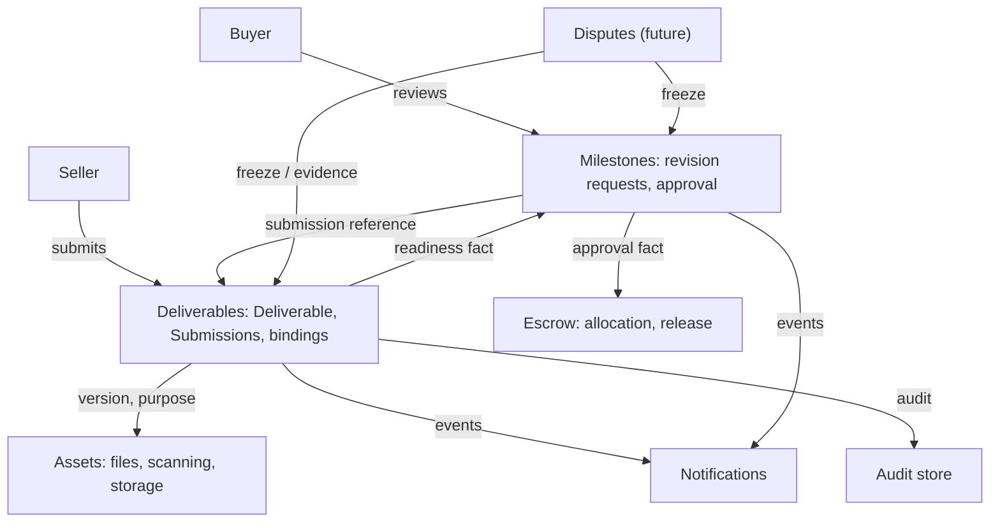
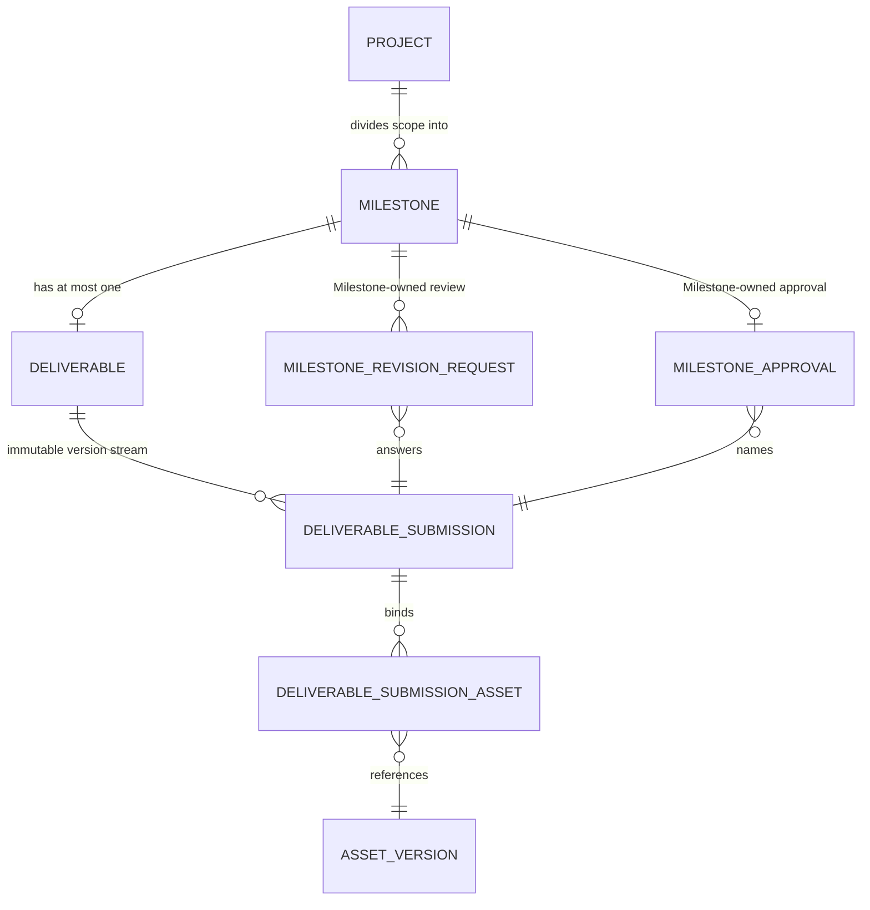
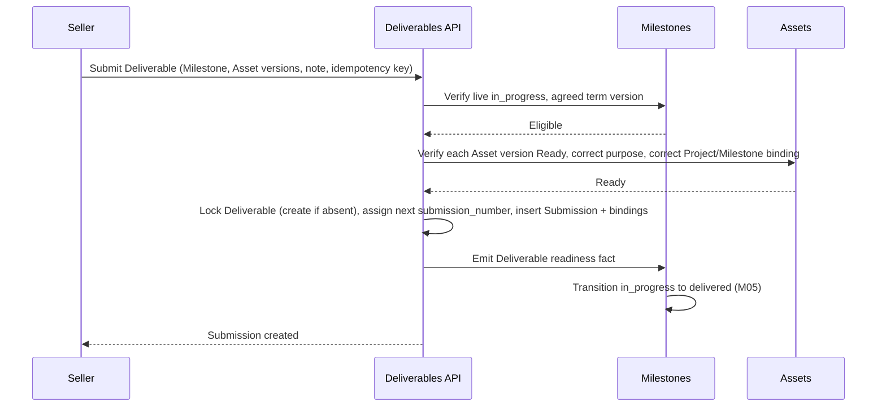
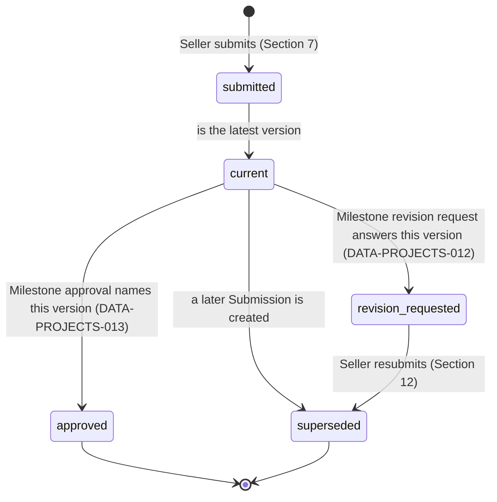
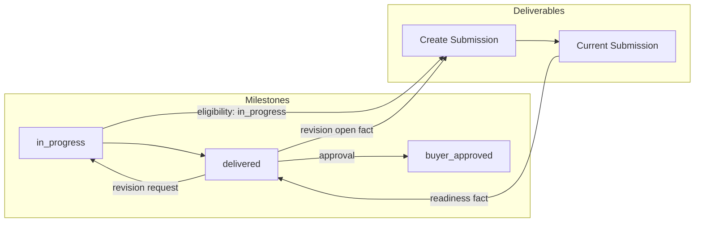
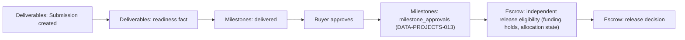
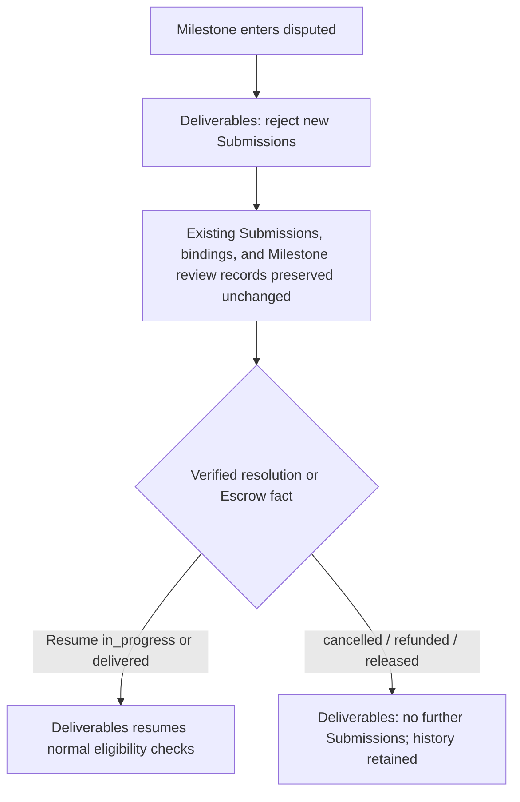
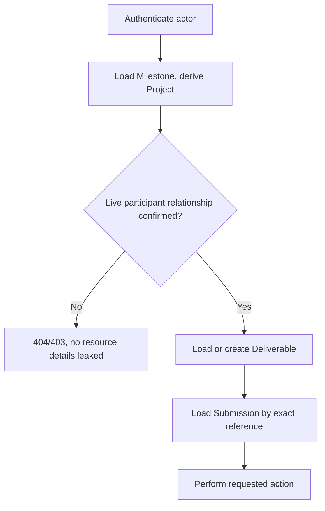
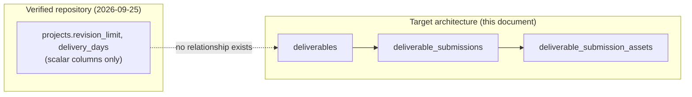
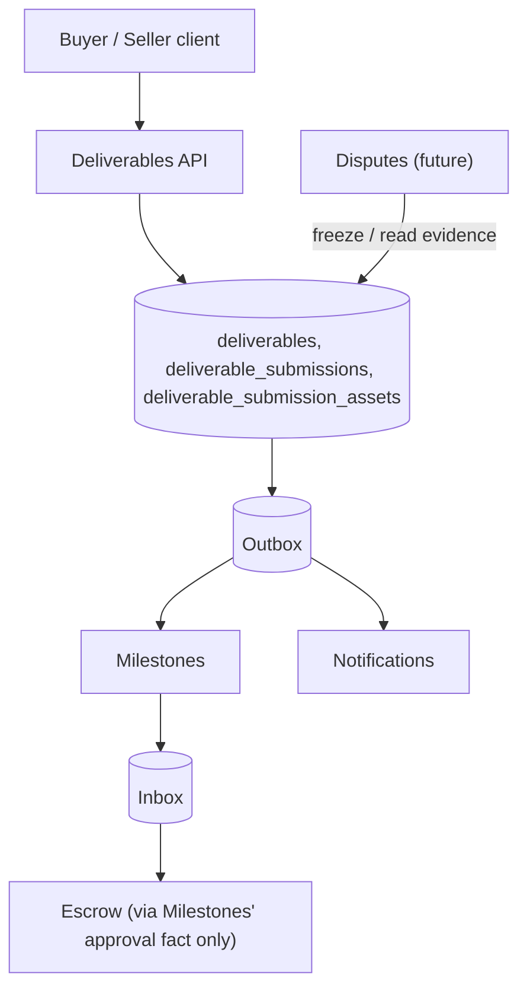

# Deliverables domain specification

| Metadata | Value |
| --- | --- |
| Document ID | `SPEC-PROJECTS-002` (provisional; see Section 3) |
| Type | Specification (SPEC) |
| Domain | Deliverables (governed under the `PROJECTS` token) |
| Status | Proposed |
| Version | 0.2.0 |
| Owner | Product and Architecture |
| Last Reviewed | 2026-09-25 |
| Applies To | Target Deliverables product architecture and verified current repository comparison |
| Governed token | `PROJECTS` |
| Canonical path | `docs/05-projects-milestones/deliverables.md` |
| Product horizon | Target product architecture with verified repository comparison |
| Supersedes / Superseded By | None; resolves [Milestones Question Q7](milestones.md#361-open-questions-table) and completes the "future Deliverables specification" anticipated by [Projects Section 19](projects.md#19-deliverable-relationship) and [Milestones Section 16](milestones.md#16-deliverable-relationship) |

## 1. Executive summary

Deliverables is the work-submission and Buyer-review aggregate for MusicApp's Milestones. It answers a single question that Milestones and Projects both deliberately left open: what exactly is the file evidence a Seller submits against a Milestone, and how is it versioned, bound to Assets, and made available for Buyer review, without duplicating Milestone's execution state or Assets' file custody.

Four decisions drive this specification. First, ownership: Deliverables is a separate document under the same governed `05-projects-milestones/` directory and `PROJECTS` token that already covers Projects and Milestones — no Foundation or Governance change is required, and this resolves Milestones' Question Q7 by direct precedent (Milestones itself was created the same way). Second, the aggregate model: one Deliverable per Milestone (1:1, created lazily on first submission), holding an ordered stream of immutable Submission versions — this matches the cardinality Milestones already assumed in its own Section 16.1 ("zero or more Deliverable submissions over time, each an immutable version with lineage") and is confirmed by no contrary schema evidence. Third, a boundary this document must not blur: Milestones already canonically owns the Buyer-review facts — the revision-request record (`DATA-PROJECTS-012` `milestone_revision_requests`) and the approval record (`DATA-PROJECTS-013` `milestone_approvals`) — both of which reference a Deliverable "submission reference" that today has no concrete definition. This specification supplies that definition; it does not create a second, competing review or approval table. Fourth, scope discipline: this document does not invent revision limits, review timeouts, or automatic-acceptance policy, all of which Milestones already left open as Question Q2 and Question Q10, and it does not decide Escrow's release rules, which remain Escrow's own.

The repository contains no Deliverable structure of any kind. No table, enum, route, frontend form, or test named or shaped like a Deliverable, submission, or review exists anywhere in `backend/` or `frontend/`. The two columns that sound adjacent — `projects.revision_limit` and `projects.delivery_days` — are scalar Project-level fields with no relationship to any Deliverable row, and this document does not treat them as Deliverable schema.

## 2. Purpose and scope

This document is canonical for:

- Deliverable identity, its 1:1 relationship to a Milestone, and the immutable Submission version stream it holds;
- what constitutes a valid Submission, who may create one, and what it binds;
- the Deliverable-to-Asset relationship, including readiness, quarantine, deletion, and replacement behavior;
- the smallest deterministic Deliverable and Submission state model, distinguishing stored from derived state;
- the contract between Deliverables and the Milestone-owned revision-request and approval records, without duplicating either;
- the historical, non-destructive Submission and Asset-binding record that Buyer review, Escrow, and a future Disputes specification consume as evidence;
- Deliverables' contracts with Milestones, Escrow, Disputes, Assets, Authorization, Notifications, and auditing;
- Deliverables authorization, concurrency, idempotency, target logical data, interfaces, events, operations, security findings, and migration guidance.

This document deliberately does not define Project or Milestone identity ([Projects](projects.md), [Milestones](milestones.md)), the revision-request or approval record itself (Milestones owns both), Escrow or Payment accounting ([escrow.md](../06-payments-escrow/escrow.md), [payments.md](../06-payments-escrow/payments.md)), Asset storage, scanning, or retention mechanics ([assets-and-media.md](../03-identity-profiles-verification/assets-and-media.md)), Dispute adjudication, Messaging content, Notification delivery, or Rating and Review policy. Those concerns belong to their owners. Where this document needs a fact from one of them, it cites the section or identifier and adds only the Deliverables-level consequence.

## 3. Governance, structure, status, and authority

### 3.1 Ownership analysis

This analysis was completed before any file was created, per the mandatory ownership-resolution step.

1. **Does Governance define Deliverables as a domain?** No. [Governance Section 4](../00-governance/README.md#4-directory-structure) lists thirteen numbered directories; `05-projects-milestones/` is described as "Projects, milestones, project lifecycle." No `10-deliverables/` or equivalent directory exists or is implied.
2. **Does Governance define a `DELIVERABLES` token?** No. [Governance Section 11](../00-governance/README.md#11-requirement-identifiers) lists exactly `AUTH`, `AUTHZ`, `USERS`, `IDENTITY`, `MARKETPLACE`, `PROJECTS`, `ESCROW`, `MESSAGING`, `RATINGS`, `MODERATION`, `NOTIFICATIONS`, `ADMIN`, `ANALYTICS`. There is no separate token for Milestones either — Governance's directory-level grouping is coarser than its per-concept granularity, and `PROJECTS` already covers Projects and Milestones as two documents sharing one token. `ESCROW` covers Escrow and Payments the same way. This is the direct precedent this document follows.
3. **Does Foundation define Deliverables as a domain?** No. Neither [Product Overview](../01-foundation/product-overview.md) nor [System Architecture](../01-foundation/system-architecture.md) lists a Deliverables domain in its domain map or ownership matrix. Milestones' own reconciliation item R6 already recorded this gap: "Foundation has no Deliverables, Payments, Disputes, or Reviews domain" ([Milestones Section 3.2](milestones.md#32-reconciliation-items)). Escrow and Payments closed the Payments half of that gap by using the existing `ESCROW` token under the existing `06-payments-escrow/` directory, without a Foundation change. This document closes the Deliverables half the same way, using the existing `PROJECTS` token under the existing `05-projects-milestones/` directory.
4. **Which existing specification currently claims ownership?** Two, with a labeling conflict already on record. [Assets Section 7.2](../03-identity-profiles-verification/assets-and-media.md#72-asset-purpose-matrix) lists the owner domain of the "Project Deliverable" and "Project Revision" Asset purposes as "Projects." [Projects Section 19](projects.md#19-deliverable-relationship) states plainly: "Deliverables belong to Milestones by default because acceptance, revisions, and release are payable-unit concerns," and names a "future Deliverables specification" three more times (Sections 27, 28, and its Open Questions table). [Milestones Section 16](milestones.md#16-deliverable-relationship) repeats this: "A Milestone is the payable unit to which Deliverables belong, consistent with Projects Section 19... The Deliverables specification, when it exists, owns submission mechanics, file lifecycle, and review deadlines." This conflict is already recorded as Milestones reconciliation item R4 and is resolved in Section 3.3 below.
5. **Does Assets treat Deliverable/Revision as records owned by Projects?** Yes, at the label level only — [Assets Section 7.2](../03-identity-profiles-verification/assets-and-media.md#72-asset-purpose-matrix) writes "Projects" in its Owner Domain column for both purposes. Assets does not itself model a Deliverable or Revision entity; it only classifies the Asset purpose and access rule. Assets Section 22.1's binding-rules table separately requires an explicit Milestone foreign key for the Milestone purpose row, which is consistent with Milestone-scoped, not bare-Project-scoped, ownership in practice.
6. **Does Projects delegate Deliverables to Milestones?** Yes, explicitly and repeatedly, as quoted in point 4. Projects' own domain-dependency table ([Projects Section 27](projects.md#27-domain-dependencies-interfaces-and-failures)) lists "Deliverables | Project/Milestone eligibility and readers | Submission/version/readiness/acceptance facts | Separate future specification."
7. **Does Milestones define Deliverables as a separate aggregate/entity while remaining under `PROJECTS`?** Yes. Milestones' Figure 1 domain architecture diagram draws "Deliverables: submissions and versions" as a distinct box consuming and producing facts with Milestones, not as an internal Milestone concept, while never assigning it a separate governed token. This is the exact shape this document formalizes.
8. **Does Escrow consume Deliverable approval only as a trusted fact?** Yes, verified directly in [escrow.md Section 14.1](../06-payments-escrow/escrow.md#141-release-eligibility): "Milestone approved | Milestones | Approval record `DATA-PROJECTS-013` | The Buyer accepted the exact submission; the allocation becomes eligible for release." Escrow reads the Milestone-owned approval record; it has no dependency on this document's tables directly, and this document does not change that.
9. **Does any current repository schema already contain Deliverable structures?** No, verified directly (Section 22 documents the full search). No table, enum, route, frontend form, or test exists anywhere in the repository.

**Ownership decision:** Deliverables belongs to the Projects/Milestones bounded context that Governance maps to `docs/05-projects-milestones/` under the governed `PROJECTS` token. This document is created at `docs/05-projects-milestones/deliverables.md` using `PROJECTS` identifier families, continuing the ranges already used by `projects.md` and `milestones.md`. No Governance or Foundation change was required or made.

### 3.2 Identifier ranges and continuation

The complete current specification tree was searched before assigning identifiers. The highest existing numbers under the `PROJECTS` token, defined across `projects.md` and `milestones.md`, were `REQ-PROJECTS-042`, `BR-PROJECTS-056`, `SEC-PROJECTS-032`, `DATA-PROJECTS-013`, `INT-PROJECTS-026`, `AUD-PROJECTS-012`, `EVT-PROJECTS-013`, `OPS-PROJECTS-012`, and document labels `SPEC-PROJECTS-000` and `SPEC-PROJECTS-001`. This document continues each family without reuse:

| Family | Range defined here | Governed |
| --- | --- | --- |
| `REQ-PROJECTS-*` | 043–059, 062 | Yes, Governance Section 11 |
| `BR-PROJECTS-*` | 057–075, 079–080 | Yes, Governance Section 11 |
| `SEC-PROJECTS-*` | 033–045 | Yes, Governance Section 11.1 |
| `DATA-PROJECTS-*` | 014–016 | Yes, Governance Section 11.1 |
| `INT-PROJECTS-*` | 027–034 | Yes, Governance Section 11.1 |
| `AUD-PROJECTS-*` | 013–014 | Yes, Governance Section 11.1 |
| `EVT-PROJECTS-*` | 014–018 | No; provisional |
| `OPS-PROJECTS-*` | 013–015 | No; provisional |
| `SPEC-PROJECTS-002` | Document ID | No; provisional |

`REQ-PROJECTS-062`, `BR-PROJECTS-079`, and `BR-PROJECTS-080` were added on 2026-09-25, after `milestones.md` was revised to 1.1.0 and itself claimed `REQ-PROJECTS-060`–`061`, `BR-PROJECTS-076`–`078`, `SEC-PROJECTS-046`–`047`, `DATA-PROJECTS-017`, `INT-PROJECTS-035`, `AUD-PROJECTS-015`, `EVT-PROJECTS-019`–`021`, and `OPS-PROJECTS-016`. Those Milestones-owned identifiers are cited here, not redefined, and this document's new numbers continue after them without reuse or collision.

This document does not use, redefine, or renumber `BR-PROJECTS-002`, whose Layer 0/Layer 1 collision was already recorded and resolved in favor of Governance's meaning by [Milestones Section 3.1](milestones.md#31-identifier-ranges-and-the-inherited-collision) and [Projects Section 3.1](projects.md#31-existing-project-identifier-collision). That question remains Milestones Question Q1 and is not reopened here.

### 3.3 Reconciliation items

The following findings were made while authoring. No existing document was modified.

| Item | Documents and sections | Finding | Treatment here |
| --- | --- | --- | --- |
| DR1 | Assets Section 7.2 versus Projects Section 19 (Milestones reconciliation item R4) | Assets labels the owner domain of Project Deliverable/Revision as "Projects"; Projects itself assigns Deliverables to Milestones and names a future Deliverables specification | Both labels describe the same governed bounded context (`05-projects-milestones/`, `PROJECTS` token). This document is that future specification and is the authoritative statement of Deliverable mechanics within it; Assets' directory-level label and Projects' delegation are both correct at their own level of granularity and are not in conflict once a concrete owner document exists. No change to Assets or Projects text is proposed; a wording update in Assets from "Projects" to "Projects (Deliverables specification)" is recorded as documentation debt, not a blocker. |
| DR2 | Milestones Section 16.1, Section 17.1, Section 18; `DATA-PROJECTS-012`, `DATA-PROJECTS-013` | Milestones already canonically owns the revision-request record and the approval record, each of which references a Deliverable "submission reference" left undefined until this document exists | This document defines the Submission aggregate and its identifier, which becomes the concrete target of Milestones' "submission reference" columns. This document does not create a second revision-request or approval table, and does not duplicate `DATA-PROJECTS-012` or `DATA-PROJECTS-013`. See Sections 10, 11, and 17. |
| DR3 | Milestones Question Q7 | "Is Deliverables a separate capability with its own owner, or an internal part of Milestones?" | Resolved by this document's existence: Deliverables is a separate capability with its own document, governed under the same `PROJECTS` token as Milestones, exactly as Milestones itself is a separate document from Projects under that token. No Foundation change or ADR was required. |
| DR4 | Milestones reconciliation item R6; Foundation domain map | Foundation has no Deliverables domain entry | Unchanged by this document; the `PROJECTS`-token precedent (point 2 of Section 3.1) makes a Foundation change unnecessary for Deliverables specifically, but the underlying Foundation domain-map gap for Deliverables, Payments, Disputes, and Reviews generally remains open governance debt, tracked once in Milestones R6 and not duplicated here. |
| DR5 | Assets Section 16.1 binding rules; Milestones Section 22 | Assets requires an explicit Milestone foreign key for the Milestone-subject purpose, and Milestones binds Project Asset bindings (`DATA-PROJECTS-007`) with a Milestone subject rather than creating its own binding table | Deliverables follows the same pattern for its own concern: Submission-to-Asset binding is a Deliverables-owned join keyed to the Submission, referencing Asset versions by identity, never duplicating Asset storage. See Section 8. |
| DR6 | Three product decisions confirmed 2026-09-25; Section 27.3 Questions EQ1, EQ2, EQ3; [Milestones Sections 9.2, 18.2](milestones.md#92-commercial-terms-matrix) | This document's EQ1 (minimum Asset count), EQ2 (Buyer non-response), and EQ3 (revision-limit scope) were all P0 open questions blocking a complete Submission and revision contract | All three are now resolved by product decision and are reflected in Sections 7.1, 10.1, 11.1, and 12.1: submission requirements are declared per Milestone in `deliverable_definition.submission_requirements`; Buyer non-response resolves through Milestones' Section 18.2 platform intervention, never automatic approval; revision allowance is `milestones.md`'s per-Milestone `revision_allowance`. EQ1–EQ3 are marked Resolved in Section 27.3, not deleted. |

The implementation labels in this document mean:

| Label | Meaning |
| --- | --- |
| Implemented | End-to-end behavior exists and was verified in the current repository. |
| Partially Implemented | Some executable path exists but one or more target guarantees are absent. |
| Schema Implemented | Database structure exists without the required executable domain behavior. |
| Planned | A repository artifact or existing specification declares intent but no complete behavior exists. |
| Not Implemented | No verified implementation was found. |

Every repository claim below was checked directly against the files named in Section 22; no behavior is inferred from a filename or comment alone.

## 4. Terminology and domain boundaries

| Term | Local definition |
| --- | --- |
| Deliverable | The single, per-Milestone aggregate identity that groups an ordered stream of Submission versions. Created lazily on the first Submission. |
| Submission | One immutable, versioned unit of Seller-provided work evidence bound to a Deliverable: a set of ready Asset versions plus a textual note, submitted at one point in time. |
| Submission version | The strictly increasing per-Deliverable ordinal identifying a Submission; never reused or reassigned. |
| Deliverable Asset binding | The Deliverables-owned join record linking one Submission to one or more Asset versions, in display order, with no byte storage of its own. |
| Buyer review | The Milestone-owned act of a Buyer inspecting the current Submission and issuing an approval or a revision request against it, defined operationally in [Milestones Sections 17–18](milestones.md#17-revision-cycles). |
| Revision cycle | A Milestone-owned record (`DATA-PROJECTS-012`) opened by a Buyer revision request and closed by a Seller resubmission; Deliverables supplies the Submission it answers, not the record itself. |
| Approval | A Milestone-owned record (`DATA-PROJECTS-013`) naming the exact Submission version the Buyer accepted; Deliverables supplies the Submission it names, not the record itself. |
| Deliverable state | Deliverables' own aggregate-level projection, entirely derived from Milestone state and the latest Submission; never independently stored. |
| Submission state | The small stored-plus-derived model defined in Section 9, distinct from Milestone state and Deliverable state. |
| Escrow allocation revision | An unrelated concept from [escrow.md Section 11](../06-payments-escrow/escrow.md#11-escrow-allocations): a new allocation row created when a Milestone's agreed amount changes through a Projects amendment. This document uses "Submission" and "resubmission," never "revision," for its own versioning to avoid conflating the two concepts, except where quoting Milestones' own "revision cycle" and "revision request" vocabulary. |

## 5. Canonical principles and architecture

1. Deliverables owns submitted work and its version lineage. Milestones owns the payable-unit lifecycle. Assets owns file identity and storage. Escrow owns money. A future Disputes specification owns adjudication. None of these owners is duplicated by another.
2. A Deliverable is not a file. It never stores bytes; it stores Submission records that reference Asset versions by identity.
3. A Submission, once created, is immutable. Revision creates a new Submission; nothing overwrites, edits, or deletes a prior one.
4. Deliverables does not own Buyer review or approval records. Milestones' `milestone_revision_requests` (`DATA-PROJECTS-012`) and `milestone_approvals` (`DATA-PROJECTS-013`) remain the sole owners of those facts; Deliverables supplies the Submission identity they reference.
5. Buyer approval is not proof that money moved. Approval is a Milestone-owned fact that makes an Escrow allocation eligible for release; Escrow decides release independently ([escrow.md Section 14](../06-payments-escrow/escrow.md#14-release)).
6. Ratings never gate Submission, review, or approval, consistent with [Foundation `REQ-FOUNDATION-007`](../01-foundation/product-overview.md#12-requirements) and [Projects `BR-PROJECTS-021`](projects.md#372-business-rule-traceability).
7. A dispute freezes Submission and review mutation without rewriting any prior Submission, review, or approval record.
8. Cancellation is not a Deliverables-owned financial outcome. Deliverables preserves work and history; Escrow and Milestones own the financial and lifecycle consequence.
9. Deliverable, Submission, Milestone, Escrow, allocation, Payment, and Dispute state are independent state machines, changed only by their own owner.
10. Authorization is relationship-based and re-evaluated on every read; a Submission or Asset binding is never reachable by identifier guessing alone.
11. Every Submission and Asset-binding mutation is idempotent under a caller-supplied key or a natural uniqueness constraint.
12. Deliverables does not invent revision limits, review timeouts, or automatic-acceptance policy that no existing specification has established.
13. Deliverables does not invent an Asset purpose, binding rule, or retention rule that Assets has not already defined; it consumes Assets' existing "Project Deliverable" and "Project Revision" purposes as-is.



*Figure 1 — Deliverables Domain Architecture. Deliverables owns Submission creation and Asset binding; Milestones owns the review and approval facts; Escrow and Disputes consume Milestone-owned facts, never Deliverables' tables directly.*

`REQ-PROJECTS-043`: Deliverables MUST NOT create a second review, revision-request, or approval table alongside Milestones' `DATA-PROJECTS-012` and `DATA-PROJECTS-013`, and MUST supply the Submission identity those records reference.

## 6. Deliverable identity and aggregate model

### 6.1 Cardinality decision

One Milestone has at most one Deliverable, created lazily on the Milestone's first Submission (not eagerly at Milestone creation, since an empty Deliverable carries no information Milestones does not already express through its own `in_progress` state). One Deliverable has zero or more immutable Submissions, ordered by a strictly increasing version number. This is the smallest model consistent with Milestones' own cardinality statement ("zero or more Deliverable submissions over time, each an immutable version with lineage," [Milestones Section 16.1](milestones.md#161-deliverable-relationship-matrix)) and preserves complete, non-destructive history without a second table per revision cycle.

The alternative — multiple independently tracked Deliverable records per Milestone, for example one per required work item — is not adopted for MVP. No existing specification or schema evidence establishes that a Milestone has more than one payable work item; introducing it now would be an invented product decision. It is recorded as Open Question EQ8 (Section 27.3) for future architecture.

### 6.2 Deliverable field matrix

| Field | Definition | Storage class | Mutability | Repository status |
| --- | --- | --- | --- | --- |
| `id` | Internal UUID primary key | Stored | Immutable | Not Implemented |
| `external_id` | Opaque, unique, externally addressable identifier | Stored | Immutable | Not Implemented |
| `milestone_id` | Owning Milestone; unique (enforces 1:1) | Stored | Immutable | Not Implemented |
| `project_id` | Derived from the Milestone's Project at creation for query convenience; not independently authoritative | Stored, Milestone-derived | Immutable | Not Implemented |
| `created_by_user_id` | The Seller (or explicitly scoped collaborator) who created the first Submission | Stored | Immutable | Not Implemented |
| `latest_submission_id` | Pointer to the current (highest-version) Submission | Stored projection | Updated only by a new Submission | Not Implemented |
| `submission_count` | Count of Submissions | Derived | Recomputed, never client-supplied | Not Implemented |
| `version` | Optimistic concurrency token for the projection fields above | Stored | Incremented on every Submission | Not Implemented |
| `created_at` / `updated_at` | Timestamps | Stored | `updated_at` changes only with a new Submission | Not Implemented |

Storage classes: **Stored** is directly stored and authoritative on the Deliverable; **Stored projection** is a cached pointer maintained transactionally alongside Submission creation, never independently writable; **Derived** is computed at read time. The Deliverable stores no Milestone status, Escrow status, or Dispute status, matching [Milestones `REQ-PROJECTS-030`](milestones.md#16-deliverable-relationship) in reverse: neither owner copies the other's state.

`REQ-PROJECTS-044`: A Deliverable MUST be unique per Milestone, MUST be created no earlier than the first valid Submission, and MUST NOT store an Escrow, Payment, or Dispute status field.

### 6.3 Aggregate relationship



*Figure 2 — Project to Milestone to Deliverable to Submission to Asset Relationship. Milestone-owned review and approval records reference a Submission by identity; Deliverables never stores a review or approval fact itself.*

## 7. Submission model

### 7.1 Submission eligibility matrix

| Condition | Rule | Repository status |
| --- | --- | --- |
| Actor | The accepted Seller of the Project, or an explicitly scoped collaborator once such a role exists in Authorization | Not Implemented |
| Milestone state | `in_progress` only, verified live at commit time, not from a client-supplied value | Not Implemented |
| Term version | The Submission is bound to the Milestone's current agreed term version | Not Implemented |
| Required Assets | Exactly the minimum Asset-version count and required Asset classes declared in the Milestone's agreed `deliverable_definition.submission_requirements` ([Milestones Section 9.2](milestones.md#92-commercial-terms-matrix), Decision 2026-09-25). Submission requirements are service/Milestone-dependent, not a platform-wide rule: zero Assets is valid when the agreed declaration marks the Milestone text-only-sufficient; most creative-service Milestones are expected to require at least one Asset, but Deliverables enforces the agreed declaration, never an assumed default. Once commercial terms are locked, this declaration cannot be unilaterally changed (Section 12.1) | Not Implemented |
| Asset readiness | Every bound Asset version MUST be in Assets' `Ready` state; a `Quarantined`, `Processing`, `Failed`, `Rejected`, or `Deleted` Asset MUST NOT be bound | Not Implemented |
| Asset ownership | Every bound Asset version MUST already carry the "Project Deliverable" (initial) or "Project Revision" (resubmission) purpose from [Assets Section 7.2](../03-identity-profiles-verification/assets-and-media.md#72-asset-purpose-matrix), scoped to this Project and Milestone | Not Implemented |
| Textual note | Optional, bounded length, restricted from raw inclusion in events and logs, consistent with Milestones' treatment of revision reason text | Not Implemented |
| Timestamp | Server-assigned `submitted_at`; never client-supplied | Not Implemented |
| Immutable snapshot | Once created, a Submission's Asset bindings, note, and timestamp never change | Not Implemented |
| Duplicate submission | An `Idempotency-Key` bound to actor, Deliverable, and a canonical request hash; a retried identical request returns the original Submission, never a duplicate version | Not Implemented |
| Late submission | A Submission after `due_at` has passed is accepted; lateness is a display fact only (Milestones' Overdue derivation), never a rejection reason, since no lateness policy is established (Milestones Question Q8) | Not Implemented |
| Cancellation race | A Submission attempted after the Milestone has left `in_progress` (cancelled, suspended, disputed) MUST be rejected with a stale-state conflict, not silently accepted | Not Implemented |
| Dispute race | A Submission attempted while the Milestone is `disputed` MUST be rejected; see Section 15 | Not Implemented |

### 7.2 Submission field matrix

| Field | Definition | Storage class | Mutability | Repository status |
| --- | --- | --- | --- | --- |
| `id` | Internal UUID primary key | Stored | Immutable | Not Implemented |
| `external_id` | Opaque, unique, externally addressable identifier; this is the "submission reference" that Milestones' `DATA-PROJECTS-012` and `DATA-PROJECTS-013` name | Stored | Immutable | Not Implemented |
| `deliverable_id` | Owning Deliverable | Stored | Immutable | Not Implemented |
| `submission_number` | Strictly increasing per Deliverable, starting at 1 | Stored | Immutable | Not Implemented |
| `submitted_by_user_id` | The Seller or scoped collaborator who submitted | Stored | Immutable | Not Implemented |
| `term_version` | The Milestone agreed term version at submission time | Stored | Immutable | Not Implemented |
| `note` | Bounded, restricted text | Stored | Immutable | Not Implemented |
| `submitted_at` | Server timestamp | Stored | Immutable | Not Implemented |
| `idempotency_key` | Caller-supplied key bound to actor, Deliverable, and request hash | Stored, unique | Immutable | Not Implemented |
| `asset_count` | Count of bound Assets | Derived | Not applicable | Not Implemented |

`REQ-PROJECTS-045`: Every Submission MUST be created as a single atomic transaction covering the Submission row and all of its Asset bindings, MUST NOT be created against a Milestone that is not live `in_progress`, and MUST be idempotent under a caller-supplied key.

`REQ-PROJECTS-062`: Deliverables MUST evaluate Submission validity against the agreed Milestone's own `submission_requirements` declaration and MUST NOT apply a platform-wide minimum-Asset rule, a default required-Asset count, or any requirement the agreed Milestone terms do not themselves declare.

### 7.3 Initial submission sequence



*Figure 3 — Initial Submission Sequence. Deliverables verifies Milestone and Asset eligibility before writing, then emits a trusted fact; Milestones owns the resulting state transition.*

## 8. Asset relationship

### 8.1 Asset binding matrix

| Concern | Rule | Repository status |
| --- | --- | --- |
| Deliverable to Asset binding | A join row per (Submission, Asset version), never a Deliverable-to-Asset direct link, since bindings are versioned with the Submission that used them | Not Implemented |
| Purpose | "Project Deliverable" for a Submission's first version per Milestone context, "Project Revision" for any resubmission, per [Assets Section 7.2](../03-identity-profiles-verification/assets-and-media.md#72-asset-purpose-matrix); Deliverables does not invent a new purpose | Not Implemented |
| Attachment ordering | An explicit `display_order` integer per binding, unique within a Submission | Not Implemented |
| Filename/display metadata | Owned by Assets; Deliverables stores no filename copy, only the Asset version identity | Not Implemented |
| Asset readiness requirement | Only `Ready` Assets may be bound at submission time (Section 7.1); readiness is Assets' own state, never cached on the binding | Not Implemented |
| Quarantined/unsafe Asset behavior | A quarantined Asset cannot be submitted; if an already-bound Asset is later quarantined by a policy re-scan, the Submission remains historically valid but the binding is flagged non-deliverable for new access, per Assets' own access rule, not a Deliverables-invented one | Not Implemented |
| Deleted Asset behavior | Assets' deletion never removes the binding row; the binding becomes a tombstone reference consistent with [Assets `BR-ASSET-002`](../03-identity-profiles-verification/assets-and-media.md#31-traceability) (originals immutable, replacement is a new Asset) | Not Implemented |
| Replacement behavior | Replacing a submitted Asset is not possible; a Seller who needs to change file content creates a new Submission (Section 12), never edits a binding | Not Implemented |
| Retention | Aligned with Project/commercial retention and any financial, dispute, or legal hold, per [Assets Section 18](../03-identity-profiles-verification/assets-and-media.md#18-retention-archival-restoration-and-deletion) | Not Implemented |
| Evidence preservation | Every Submission's bindings are retained for the life of the Project plus any hold, regardless of later Milestone or Project state | Not Implemented |
| Access authorization | Every read re-verifies live Project/Milestone participant relationship before returning an Asset URL or descriptor; see Section 18 | Not Implemented |

`REQ-PROJECTS-046`: Deliverables MUST NOT store file bytes, MUST NOT duplicate Asset metadata beyond the identity needed to bind, and MUST bind only `Ready` Asset versions carrying an approved Project Deliverable or Project Revision purpose scoped to the same Project and Milestone.

## 9. Deliverable and submission states

### 9.1 Why Deliverable has no independently stored state

A Deliverable's aggregate-level status is entirely a projection of Milestone state plus the existence and count of Submissions: "open" while the Milestone is `in_progress` or `delivered` (accepting or awaiting review of a Submission) and "closed" once the Milestone leaves that pair permanently (`buyer_approved`, `released`, `refunded`, `cancelled`) or temporarily (`disputed`, `suspended`, during which no new Submission is accepted). Storing this separately would duplicate Milestone's own state machine, which [Milestones Section 11.3](milestones.md#113-derived-and-separate-status) already forbids ("No Milestone field stores an Escrow, Deliverable, or Dispute status" applies symmetrically in reverse for this document). Deliverable state is therefore fully derived and never stored.

### 9.2 Submission state matrix

A Submission's only stored fact is that it exists, immutably, at a given version number. Everything else about its position in the review lifecycle is derived by joining Milestone-owned facts, so that Deliverables never duplicates a Milestone-owned decision.

| State | Meaning | Stored or derived | Derivation source |
| --- | --- | --- | --- |
| `submitted` | The Submission row exists; this is the only stored value | Stored (implicit; a row's existence is the state) | Not applicable |
| Current | This is the Deliverable's highest `submission_number` | Derived | Deliverable's `latest_submission_id` |
| Superseded | A later Submission exists for the same Deliverable | Derived | Comparison against Current |
| Under review | Current, and no revision request or approval record yet answers or names it | Derived | `DATA-PROJECTS-012`, `DATA-PROJECTS-013` |
| Revision requested against | An open `milestone_revision_requests` row names this Submission as the one answered | Derived | `DATA-PROJECTS-012` |
| Approved | `milestone_approvals` names this exact Submission | Derived | `DATA-PROJECTS-013` |

This is the smallest deterministic stored model: a single append-only fact (the Submission row) with every review-lifecycle qualifier derived from the Milestone-owned records that already exist for exactly this purpose. No `draft`, `under_review`, `revision_requested`, or `approved` value is added as a stored column, avoiding both an invented state machine and any duplication of `DATA-PROJECTS-012` or `DATA-PROJECTS-013`.



*Figure 4 — Deliverable and Submission State Machine. Only `submitted` is stored; every other value is derived from the Milestone-owned revision-request and approval records.*

`REQ-PROJECTS-047`: A Submission's review-lifecycle qualifiers (current, superseded, under review, revision requested against, approved) MUST be derived at read time from Milestones' own records and MUST NOT be cached as an independently mutable Deliverables-owned status column.

## 10. Review flow

Buyer review, revision requests, and approval are Milestone-owned commands (`delivery.request_revision` and `project.delivery.approve`, per [Milestones Section 11.4](milestones.md#114-milestone-lifecycle-matrix) and Section 18) that consume Deliverables-owned Submissions. This section defines Deliverables' side of that contract only; it does not redefine the commands themselves.

### 10.1 Review/approval contract matrix

| Concern | Deliverables-side contract | Milestone-owned counterpart |
| --- | --- | --- |
| Who may review | Deliverables exposes the current Submission and its full history to the Project Buyer and accepted Seller (and case actors during a dispute) | Milestones enforces that only the Buyer may issue `delivery.request_revision` or `project.delivery.approve` |
| Review eligibility | Deliverables reports whether a Submission exists and is Current | Milestones checks Milestone state is `delivered` before accepting either command |
| Stale review protection | A review command MUST name the exact Submission `external_id` it targets; Deliverables rejects (via Milestones' guard) any command naming a non-Current Submission with a stale-version conflict | Milestones enforces this at its M06/M07 transition guards |
| Duplicate review | A repeated command with the same idempotency key against the same Submission returns the original outcome | Milestones owns idempotency on `milestone_revision_requests` and `milestone_approvals` |
| Concurrent review | Deliverables' own lock ordering (Section 19) ensures a Submission cannot be superseded mid-command; Milestones' Project-then-Milestone lock (Milestones Section 18.3) then resolves the race between an approval and a revision request | Shared |
| Approval after new submission | Not reachable: a new Submission can only be created while the Milestone is `in_progress`, and Milestones only accepts approval from `delivered`; the two states are mutually exclusive by Milestone's own machine | Milestones |
| Revision request after approval | Rejected: once `milestone_approvals` names a Submission, the Milestone has left `delivered` for `buyer_approved` and no further revision request is possible against that Milestone | Milestones |
| Review after cancellation | Rejected: Deliverables' own eligibility check (Section 7.1) and Milestones' state guard both reject once the Milestone is no longer `in_progress` or `delivered` | Shared |
| Review during dispute | Rejected: see Section 15 | Shared |
| Buyer non-response / platform authorization | Deliverables' contract is identical to ordinary approval: it supplies the exact Current Submission `external_id`. Deliverables does not track review-period elapsed time, does not initiate or participate in platform intervention, and does not decide the authorization | Milestones' Section 18.2 process: review timeout, auditable intervention, and (if exhausted) a `milestone_platform_release_authorizations` record naming the same Submission reference, kept separate from `milestone_approvals` |

`REQ-PROJECTS-048`: Deliverables MUST expose the Current Submission and its immutable history to Milestones' review and approval commands by exact, unambiguous version reference, and MUST NOT accept a Milestone-owned command's outcome as a Deliverables-owned status write.

## 11. Buyer approval

Approval itself — actor, timestamp, idempotency key, correlation ID — is recorded in Milestones' `milestone_approvals` (`DATA-PROJECTS-013`), not in a Deliverables table (Section 3.3, item DR2). Deliverables' contract is limited to what it supplies and what it must never claim.

### 11.1 Approval contract

| Concern | Rule |
| --- | --- |
| Target submission/version | Deliverables supplies the exact Current Submission `external_id`; the approval command must name it exactly, or Milestones rejects with a stale-version conflict |
| Resulting Deliverable fact | None is written to a Deliverables table; the Deliverable's derived "approved" qualifier (Section 9.2) reads Milestones' record |
| Resulting Milestone fact | `buyer_approved`, per Milestones transition M07 |
| Resulting Escrow eligibility fact | The Milestone's approval record makes the corresponding Escrow allocation eligible for release consideration; Escrow independently verifies funding, holds, and settlement state before actually releasing ([escrow.md Section 14.1](../06-payments-escrow/escrow.md#141-release-eligibility)) |
| What approval does NOT mean | Approval MUST NOT be read, by any domain, as proof that money has moved. Buyer approval, Escrow release, and Seller payout remain three separate facts owned by three different records (Milestones' approval record, Escrow's ledger, and Payments' payout record respectively) |
| Non-response authorization is not approval | A platform non-response release authorization ([Milestones Section 18.2](milestones.md#182-buyer-non-response-and-platform-intervention)) names the same Current Submission reference contract as ordinary approval but is recorded in a separate Milestones-owned table (`milestone_platform_release_authorizations`, distinct from `milestone_approvals`). Deliverables MUST NOT conflate the two in any read, report, or event |

```mermaid
sequenceDiagram
    participant Buyer
    participant Milestones
    participant Deliverables
    participant Escrow
    Buyer->>Milestones: Approve (Milestone, expected Submission version, idempotency key)
    Milestones->>Deliverables: Confirm named version is Current
    Deliverables-->>Milestones: Confirmed (or stale-version conflict)
    Milestones->>Milestones: Write milestone_approvals (DATA-PROJECTS-013); enter buyer_approved
    Milestones->>Escrow: Approval fact (Milestone, term version)
    Escrow->>Escrow: Evaluate release eligibility independently
```

*Figure 5 — Buyer Approval Sequence. Deliverables only confirms Submission identity; Milestones writes the approval fact; Escrow decides release on its own authority.*

`REQ-PROJECTS-049`: Deliverables MUST NOT emit, cache, or expose any signal that could be mistaken for an Escrow release or Seller payout fact; only Escrow's own records are authoritative for money movement.

`BR-PROJECTS-079`: Deliverables MUST NOT present a platform non-response release authorization as, or conflate it with, an ordinary Buyer approval; both name a Submission through the identical reference contract but originate from separate Milestones-owned records.

## 12. Revision model and history

### 12.1 Revision matrix

| Concern | Rule | Owner |
| --- | --- | --- |
| Buyer revision request | Names the exact Current Submission and a reason code with bounded restricted detail | Milestones (`DATA-PROJECTS-012`) |
| Seller resubmission | A new Submission (Section 7), with `submission_number` one greater than the prior, using the Project Revision Asset purpose | Deliverables |
| Immutable previous submission | Never edited, replaced, or deleted; remains addressable by its own `external_id` indefinitely, subject only to retention/hold policy | Deliverables |
| Current submission | The highest `submission_number`; the Deliverable's `latest_submission_id` projection updates transactionally with the new Submission | Deliverables |
| Revision reason | Required code plus bounded, restricted text | Milestones |
| Assets per submission | Each Submission has its own independent set of Asset bindings; a resubmission is not required to reuse or reference the prior Submission's Assets | Deliverables |
| Revision limit / count | Milestones derives `revision_count` from its own revision-request records and compares it against this Milestone's own agreed `revision_allowance` ([Milestones Section 17.1](milestones.md#171-revision-matrix), Decision 2026-09-25). Deliverables' Submission count is a distinct, larger number (it also counts the original Submission) and MUST NOT be conflated with Milestones' revision-cycle count or allowance in any report or event | Shared, not duplicated |
| Revision timeout / automatic acceptance | Buyer silence is never automatic acceptance. Resolved by product decision: a configurable review timeout followed by auditable platform intervention, ending (if exhausted) in a platform non-response release authorization distinct from Buyer approval ([Milestones Section 18.2](milestones.md#182-buyer-non-response-and-platform-intervention)). Exact durations remain configuration (Milestones Question Q18) | Resolved; product behavior decided, operational timing remains open |
| Revision limit scope (per Milestone vs. per Project) | Resolved: per Milestone. `revision_allowance` is negotiated and agreed independently for each Milestone as a commercial term ([Milestones Section 9.2](milestones.md#92-commercial-terms-matrix)); the schema-level `projects.revision_limit` column is Project-scoped legacy data that the target architecture supersedes | Resolved |

`REQ-PROJECTS-050`: A Seller resubmission MUST create a new Submission with a strictly greater `submission_number` than any prior Submission for the same Deliverable, MUST NOT be accepted unless a Milestone revision request is currently open, and MUST NOT reuse or mutate a prior Submission's Asset bindings.

`BR-PROJECTS-080`: Deliverables' own Submission and resubmission count MUST remain a distinct value from Milestones' `revision_count` and `revision_allowance`, and Deliverables MUST NOT enforce, cache, or duplicate the per-Milestone revision allowance, which remains Milestones-owned.

### 12.2 Revision and resubmission sequence

```mermaid
sequenceDiagram
    participant Buyer
    participant Seller
    participant Milestones
    participant Deliverables
    Buyer->>Milestones: Request revision (Submission version, reason)
    Milestones->>Deliverables: Confirm named version is Current
    Deliverables-->>Milestones: Confirmed
    Milestones->>Milestones: Write open milestone_revision_requests row; return to in_progress (M06)
    Seller->>Deliverables: Submit new Submission (Project Revision purpose)
    Deliverables->>Deliverables: Assign next submission_number, insert atomically
    Deliverables->>Milestones: Emit readiness fact
    Milestones->>Milestones: Answer open revision request; transition in_progress to delivered (M05)
```

*Figure 6 — Revision/Resubmission Sequence. The revision-request record stays with Milestones throughout; Deliverables only ever creates a new, independent Submission.*

### 12.3 Historical preservation

Deliverables' target logical model provides immutable Submission history, immutable Asset-binding history per Submission, and a current projection (`latest_submission_id`), without a dedicated review table, since Buyer review history already lives durably in Milestones' `milestone_revision_requests` and `milestone_approvals`. This satisfies the historical-preservation requirement with the smallest normalized model: two Deliverables-owned tables plus one join table (Section 21), rather than four.

`BR-PROJECTS-057`: A Submission MUST NOT be edited or deleted after creation; a correction MUST take the form of a new Submission.

## 13. Milestone integration

### 13.1 Milestone integration matrix

| Direction | Fact | Trigger | Consumer action |
| --- | --- | --- | --- |
| Milestones → Deliverables | Work may start / Submission permitted | Milestone entered `in_progress` | Deliverables allows Submission creation |
| Milestones → Deliverables | Revision open | Buyer revision request recorded | Deliverables allows a new Submission against the Deliverable |
| Milestones → Deliverables | Cancellation / suspension / dispute | Milestone left `in_progress` or `delivered` for a terminal or interrupted state | Deliverables rejects new Submissions (Sections 15, 16) |
| Deliverables → Milestones | Submitted | First or subsequent ready Submission created | Milestones transitions `in_progress` to `delivered` (M05) |
| Deliverables → Milestones | Submission identity | Every Submission's `external_id` | Milestones records it in `milestone_revision_requests` or `milestone_approvals` when answered or approved |

Deliverables never stores or infers a Milestone state value; it only reads the live Milestone state at the moment of a Submission attempt and reacts to the trusted facts above, consistent with [Milestones Section 16.1](milestones.md#161-deliverable-relationship-matrix)'s existing statement that Milestones supplies "an eligibility answer" and Deliverables does not duplicate Milestone's own machine.



*Figure 7 — Milestone Integration Flow. Eligibility flows from Milestones to Deliverables; readiness facts flow back; neither machine is duplicated in the other.*

`REQ-PROJECTS-051`: Deliverables MUST verify live Milestone state at the moment of every Submission attempt and MUST NOT cache a Milestone state value beyond the duration of that single transaction.

## 14. Escrow integration

Deliverables has no direct relationship with Escrow. The only path from a Submission to money is: Submission (Deliverables) → readiness fact (to Milestones) → approval record `DATA-PROJECTS-013` (Milestones) → release eligibility evaluation (Escrow), exactly as [escrow.md Section 14.1](../06-payments-escrow/escrow.md#141-release-eligibility) already states. Deliverables never calls Escrow, never reads an allocation, and never emits a fact Escrow consumes directly.

### 14.1 Escrow integration matrix

| Concern | Deliverables' role |
| --- | --- |
| Funding | None; Deliverables does not gate Submission on funding state, since Milestone `in_progress` already implies `funded` occurred earlier (Milestones state machine, Section 11.2) |
| Allocation | None; Deliverables never reads `escrow_allocations` |
| Dispute hold | Indirect only, through Milestone state (Section 15); Deliverables never reads Escrow's or a future Disputes' hold records directly |
| Financial eligibility | None; entirely Escrow's own decision per [escrow.md Section 20](../06-payments-escrow/escrow.md#20-verification-and-financial-eligibility) |
| Idempotency | Deliverables' own idempotency (Section 19) is independent of Escrow's; a duplicate Submission attempt never reaches Escrow |
| Settlement state | None; Deliverables never reads Payment or payout state |



*Figure 8 — Escrow Eligibility Flow. Deliverables' contribution ends at the readiness fact; every step from approval onward belongs to Milestones and then Escrow.*

`REQ-PROJECTS-052`: Deliverables MUST NOT read, write, or expose any Escrow, allocation, Payment, or payout record, and MUST NOT emit any fact that a caller could mistake for an Escrow-authorized release.

## 15. Dispute relationship

Deliverables does not adjudicate disputes. This section defines only its contract with a future Disputes specification, consistent with [Milestones Section 21](milestones.md#21-dispute-relationship), which this document does not redefine.

### 15.1 Dispute integration matrix

| Concern | Deliverables-level contract |
| --- | --- |
| What becomes evidence | Every Submission, its Asset bindings, and (by reference) every Milestone revision-request and approval record naming a Submission |
| Asset preservation | Unchanged; Assets' own retention and hold rules govern (Section 8.1) |
| Review history preservation | Unchanged; Milestones' `milestone_revision_requests` and `milestone_approvals` are untouched by a dispute opening |
| Dispute-open behavior | Deliverables rejects new Submission creation the moment the Milestone enters `disputed`, mirroring [Milestones `REQ-PROJECTS-035`](milestones.md#21-dispute-relationship) ("Milestones MUST reject state-advancing commands... MUST emit no release signal") |
| Does review freeze | Yes; Milestones itself accepts no revision-request or approval command while `disputed`, so Deliverables' Submissions have no reachable reviewer action during that window |
| Are new submissions allowed | No, while `disputed` |
| Resolution facts consumed | None directly; Deliverables consumes only the Milestone's resumed state (`in_progress` or `delivered`) after a verified resolution, and behaves exactly as it would from a normal transition into that state |
| Audit trail | Every rejected Submission attempt during a dispute is audited (Section 20) |



*Figure 9 — Dispute Evidence Flow. Deliverables freezes on the Milestone's own dispute signal and never rewrites historical Submissions to reach a resolution.*

`REQ-PROJECTS-053`: Deliverables MUST reject Submission creation while the owning Milestone is `disputed` or `suspended`, MUST preserve every existing Submission and binding unchanged through the dispute, and MUST NOT rewrite historical Submissions to implement a dispute resolution.

## 16. Cancellation behavior

Financial consequences of cancellation remain entirely Escrow-owned ([escrow.md Section 16](../06-payments-escrow/escrow.md#16-cancellation-financial-outcomes)); this section defines only what happens to Deliverable/Submission data.

### 16.1 Cancellation matrix

| Scenario | Deliverables behavior | Repository status |
| --- | --- | --- |
| Project cancelled before work / Milestone never left `planned` | No Deliverable exists (created lazily); nothing to preserve or reject | Not Implemented |
| Milestone cancelled before any Submission | No Deliverable exists; cancellation proceeds entirely within Milestones/Projects | Not Implemented |
| Cancellation after Submission, before revision request or approval | Deliverable and all Submissions/bindings preserved unchanged; no further Submissions accepted once the Milestone leaves `in_progress`/`delivered` | Not Implemented |
| Cancellation after a revision request is open | Same preservation; the open Milestone revision-request record is left exactly as Milestones' own cancellation matrix directs ([Milestones Section 20.1](milestones.md#201-cancellation-matrix)) | Not Implemented |
| Cancellation after approval | Same preservation; the approval record and its named Submission remain the historical record Escrow's outcome is based on | Not Implemented |
| Cancellation while disputed | Governed entirely by Section 15; Deliverables adds no separate cancellation-specific behavior beyond the dispute freeze already in force | Not Implemented |

`REQ-PROJECTS-054`: Cancellation, at any point in a Deliverable's life, MUST preserve every existing Submission and Asset binding unchanged and MUST NOT trigger deletion of any Deliverables-owned row; only future Submission creation is blocked.

## 17. Domain dependencies and interfaces

### 17.1 Domain dependency matrix

| Domain | Deliverables depends on | Deliverables provides |
| --- | --- | --- |
| Projects | Project identity, participant relationship (via Milestone) | Nothing directly; Projects reads only through Milestones |
| Milestones | Live Milestone state, term version, eligibility answer, revision-request and approval records | Submission readiness facts, Submission identity for Milestone's own records |
| Assets | Asset version identity, readiness state, purpose, binding rules | Purpose-scoped binding requests (Project Deliverable / Project Revision) |
| Escrow | Nothing directly | Nothing directly; Escrow reads only Milestones' approval record |
| Disputes (future) | Nothing directly (Deliverables reacts to Milestone's dispute state only) | Submission and binding history as evidence, by reference |
| Authorization | Relationship/role decisions for every Deliverables operation | Nothing; Authorization owns the decision framework only |
| Notifications | Nothing directly | Submission-created and revision-related events, consumed for delivery only |
| Ratings | Nothing; Ratings MUST NOT gate any Deliverables operation | Nothing |

### 17.2 Interface identifiers

| Interface | Direction | Description | Repository status |
| --- | --- | --- | --- |
| `INT-PROJECTS-027` | Deliverables → Milestones | Submission readiness fact (Deliverable, Milestone, Submission `external_id`, term version) | Not Implemented |
| `INT-PROJECTS-028` | Milestones → Deliverables | Eligibility answer (actor, Milestone state, agreed term version) | Not Implemented |
| `INT-PROJECTS-029` | Deliverables → Assets | Purpose-scoped binding request (Asset version, purpose, Project, Milestone) | Not Implemented |
| `INT-PROJECTS-030` | Assets → Deliverables | Asset readiness/state answer | Not Implemented |
| `INT-PROJECTS-031` | Milestones → Deliverables | Submission `external_id` lookup for `milestone_revision_requests` / `milestone_approvals` writes | Not Implemented |
| `INT-PROJECTS-032` | Deliverables → Authorization | Relationship/role check for every read and write | Not Implemented |
| `INT-PROJECTS-033` | Deliverables → Notifications | Submission-created, resubmission-created events | Not Implemented |
| `INT-PROJECTS-034` | Deliverables → Audit | Every mutation, per Section 20 | Not Implemented |

### 17.3 Failure rules

If Milestones cannot confirm live eligibility, Deliverables MUST reject the Submission with a `409` conflict rather than proceeding on a cached or assumed state. If Assets cannot confirm readiness for every bound Asset version, Deliverables MUST reject the entire Submission atomically; a partially bound Submission MUST NOT exist.

## 18. Authorization

### 18.1 Authorization matrix

| Action | Who | Additional condition |
| --- | --- | --- |
| Create Deliverable draft context / attach Asset before submission | Accepted Seller, or explicitly scoped collaborator | Live Milestone `in_progress` |
| Submit | Accepted Seller, or explicitly scoped collaborator | Live Milestone `in_progress`; all bound Assets `Ready` |
| Resubmit | Accepted Seller, or explicitly scoped collaborator | Open Milestone revision request |
| View current/historical Submissions | Project Buyer, accepted Seller | Live participant relationship |
| Review (issue approval or revision request) | Project Buyer only | Enforced by Milestones, not Deliverables, but Deliverables' read APIs used to decide must apply the same check |
| Request revision | Project Buyer only | Delegated to Milestones' command |
| Approve | Project Buyer only | Delegated to Milestones' command |
| View review notes / revision reasons | Project Buyer, accepted Seller | Read from Milestones' records, subject to Milestones' own authorization, not re-decided here |
| Dispute-related evidence access | Authorized case actors only, for the duration of the case | Verified against the Dispute record's participant list, not by identifier alone |
| Administrative/moderation access | Scoped Administrator or Moderator role only | Logged distinctly from ordinary participant access |
| View history (all Submissions, not just current) | Project Buyer, accepted Seller, authorized case actors | Live relationship check on every read, not a cached authorization result |

### 18.2 Resource-loading order

Every Deliverables operation resolves in this order: authenticate the actor, load the Milestone (and through it the Project) and confirm live participant relationship, then load or create the Deliverable, then act on the Submission. A Deliverable or Submission identifier is never resolved before its owning Milestone's relationship is confirmed, preventing IDOR: a random authenticated user supplying another Project's Submission `external_id` fails at the Milestone-relationship check before the Submission is ever loaded.



*Figure 10 — Deliverable/Submission Access Evaluation. Relationship confirmation happens before any Deliverable-scoped identifier is resolved.*

`REQ-PROJECTS-055`: Every Deliverables read or write MUST re-verify live Project/Milestone participant relationship before resolving any Deliverable- or Submission-scoped identifier, and MUST NOT authorize by identifier possession alone.

## 19. Concurrency and idempotency

### 19.1 Idempotency matrix

| Operation | Protection |
| --- | --- |
| Duplicate submission | `Idempotency-Key` bound to actor, Deliverable, and canonical request hash; replay returns the original Submission |
| Duplicate Asset-binding request within a Submission | Unique `(submission_id, asset_version_id)`; a repeat is a no-op |
| Retried client request after a network failure | Same idempotency key returns the same result rather than creating a second Submission |
| Resubmission during approval | Rejected: Milestones' Project-then-Milestone lock (Milestones Section 18.3) ensures approval and a new Submission cannot commit against the same Milestone concurrently; whichever transaction commits first invalidates the other's precondition |
| Cancellation during submission | The Submission transaction re-checks live Milestone state immediately before commit, inside the same lock scope, so a concurrent cancellation aborts the Submission with a conflict rather than allowing both to succeed |
| Dispute during submission | Same mechanism as cancellation |

### 19.2 Concurrency rules

Deliverables locks in the order Project, then Milestone, then Deliverable, matching the lock ordering already established in [escrow.md Section 22.2](../06-payments-escrow/escrow.md#222-concurrency-rules) and [Milestones Section 18.3](milestones.md#18-buyer-approval), so that a Submission, a revision request, and an approval attempted concurrently against the same Milestone can never deadlock and always resolve with exactly one winner. Every write includes an `expected_version` (Deliverable's `version` field) or an equivalent optimistic check, so a stale read never silently overwrites a newer Deliverable projection.

`REQ-PROJECTS-056`: Every Submission-creating transaction MUST acquire its locks in Project, then Milestone, then Deliverable order, MUST re-verify live Milestone state inside that lock scope immediately before commit, and MUST be idempotent under a caller-supplied key.

## 20. Audit, events, and notifications

### 20.1 Audit requirements

| ID | Requirement |
| --- | --- |
| `AUD-PROJECTS-013` | Record Deliverable creation (implicit, on first Submission), every Submission creation, every Asset attachment and any pre-submission detachment, and every rejected Submission attempt (stale state, dispute freeze, cancellation race), each with actor, Project, Milestone, Deliverable, Submission reference where applicable, timestamp, and correlation/idempotency reference. |
| `AUD-PROJECTS-014` | Record every administrative or moderation action taken against a Deliverable or Submission, distinctly from ordinary participant actions, with actor, reason, and timestamp. |

Audit entries never duplicate Milestones' own audit of revision requests and approvals (`AUD-PROJECTS-010`); they record only Deliverables-owned actions.

### 20.2 Provisional events and operations

Governance defines no `EVT-*` or `OPS-*` family; the following are provisional pending a Governance amendment, following the precedent already disclosed in [Milestones Section 3.1](milestones.md#31-identifier-ranges-and-the-inherited-collision) and [Projects Section 3.1](projects.md#31-existing-project-identifier-collision).

| Provisional ID | Event/operation | Consumers |
| --- | --- | --- |
| `EVT-PROJECTS-014` | `DeliverableSubmissionCreated` | Notifications, Milestones (readiness fact) |
| `EVT-PROJECTS-015` | `DeliverableResubmissionCreated` | Notifications, Milestones |
| `EVT-PROJECTS-016` | `DeliverableSubmissionRejected` (stale state, dispute freeze, cancellation race) | Audit only |
| `EVT-PROJECTS-017` | `DeliverableAssetAttached` | Audit, Notifications (optional) |
| `EVT-PROJECTS-018` | `DeliverableAssetDetached` (pre-submission only) | Audit |
| `OPS-PROJECTS-013` | Orphaned pre-submission Asset-binding cleanup job | Operations |
| `OPS-PROJECTS-014` | Stale idempotency-key expiry job | Operations |
| `OPS-PROJECTS-015` | Deliverable/Submission reconciliation report against Milestones' revision-request and approval counts | Operations, Audit |

Notifications consumes these events but does not own Deliverable or Submission state; delivery mechanics are Notifications' own concern and are not defined here.

`REQ-PROJECTS-057`: Every Deliverables state-changing action MUST produce an audit entry before the operation is considered complete, and MUST NOT rely on a best-effort or asynchronous-only audit write for a financially or contractually significant action.

## 21. Target data model

### 21.1 Data model matrix

| Table | Purpose | Primary key / external ID | Foreign keys | Unique constraints | Repository status |
| --- | --- | --- | --- | --- | --- |
| `DATA-PROJECTS-014` `deliverables` | One row per Milestone that has received at least one Submission; holds the current-Submission projection | `id` PK; unique `external_id` | `milestone_id` → Milestones `RESTRICT`; `project_id` → Projects `RESTRICT` (derived, not independently authoritative) | Unique `milestone_id` (enforces 1:1) | Not Implemented |
| `DATA-PROJECTS-015` `deliverable_submissions` | Immutable, versioned Submission records | `id` PK; unique `external_id` | `deliverable_id` → `deliverables` `RESTRICT`; `submitted_by_user_id` → Users `RESTRICT` | Unique `(deliverable_id, submission_number)`; unique `idempotency_key` | Not Implemented |
| `DATA-PROJECTS-016` `deliverable_submission_assets` | Ordered binding of a Submission to one or more Asset versions | `id` PK | `submission_id` → `deliverable_submissions` `RESTRICT`; `asset_version_id` → Assets `RESTRICT` | Unique `(submission_id, asset_version_id)`; unique `(submission_id, display_order)` | Not Implemented |

Three tables are sufficient: immutable historical rows (`deliverable_submissions`, `deliverable_submission_assets`) plus one explicit current-state projection (`deliverables`). No separate review or approval table is created, per Section 3.3 item DR2.

### 21.2 Migration implications

| Change | Reason |
| --- | --- |
| New tables only; no existing table altered | Milestones' `DATA-PROJECTS-012`/`013` already have a "submission reference" column intended for exactly this purpose; a future migration adds the formal foreign key from those columns to `deliverable_submissions.external_id`, but that FK addition belongs to a Milestones-owned migration, not this specification, since it alters a Milestones-owned table |
| Deletion policy | Never hard-deleted; all rows are append-only history subject to Project-level retention and any financial, dispute, or legal hold |

`REQ-PROJECTS-058`: The target Deliverables schema MUST consist of the smallest normalized set of tables that preserves immutable Submission and binding history plus one current-state projection, and MUST NOT require altering any Milestones- or Assets-owned table to add a Deliverables-owned column.

## 22. Verified repository comparison

### 22.1 Review method

The following were searched directly, not inferred from names: `backend/db/*.sql` (all eight migrations), `backend/Index.js` (the entire application, all routes), `frontend/src/App.tsx`, `backend/package.json`, `frontend/package.json`, and the repository for any `tests`/`test` directory or file.

### 22.2 Schema findings

No migration defines a `deliverable`, `deliverables`, `deliverable_submissions`, `deliverable_submission_assets`, `submission`, or `review` table, nor an enum containing values resembling a Deliverable or Submission state. The only columns matching the search vocabulary are `projects.delivery_days` (`INTEGER NOT NULL`, positive CHECK) and `projects.revision_limit` (`INTEGER NOT NULL DEFAULT 0`, nonnegative CHECK), both defined in `backend/db/005_create_projects.sql`. Both are scalar fields on the `projects` table itself; neither references, nor is referenced by, any other table, and neither has any relationship to a Deliverable or Submission row, since none exists.

### 22.3 Executable interfaces

`backend/Index.js` contains exactly twelve routes (health, user creation/listing, profile creation/listing, signup, login, `/auth/me`, project creation/listing, and the lock-milestones action). None references `deliverable`, `revision`, `submission`, `review`, or `approval` in a route path, handler name, or SQL statement beyond the two scalar columns above. No route creates, reads, updates, or deletes anything resembling a Deliverable.

### 22.4 Frontend and tests

`frontend/src/App.tsx` uses `revision_limit` only as a Project-creation form field and a display value ("N revisions"); there is no Deliverable, Submission, or file-upload UI of any kind. No dependency for file upload, review workflows, or similar exists in either `package.json`. No test file or test directory exists anywhere in the repository outside `docs/17-testing` (a documentation directory, not executable tests); the backend `package.json` defines no `test` script that runs anything.

### 22.5 Repository financial and functional matrix

| Capability | Verified artifact or behavior | Gap against target | Status |
| --- | --- | --- | --- |
| Deliverable table | None | Full schema of Section 21 | Not Implemented |
| Submission table | None | Full schema of Section 21 | Not Implemented |
| Asset binding table | None | Full schema of Section 21 | Not Implemented |
| Review/approval table | None (Milestones' `DATA-PROJECTS-012`/`013` are Not Implemented per Milestones' own review) | Milestones-owned; not this document's gap to close | Not Implemented |
| Deliverable/Submission enum | None | Section 9 (mostly derived, not enum-based by design) | Not Implemented |
| API routes | None | Full route set implied by Sections 7, 10–12 | Not Implemented |
| Frontend forms | None | Submission upload/review UI | Not Implemented |
| Upload binding | None (no Asset upload of any kind is wired to a Project/Milestone context) | Full binding of Section 8 | Not Implemented |
| Authorization | None (no route exists to authorize) | Section 18 | Not Implemented |
| Tests | None | Full suite of Section 26 | Not Implemented |
| Database constraints | The two adjacent scalar columns' own CHECKs only | Section 21 constraints | Not Implemented |
| Triggers | None | None required by this document's model | Not Implemented |
| Audit history | None | Section 20 | Not Implemented |



*Figure 11 — Repository vs. Target Architecture. The two existing scalar columns carry no structural relationship to the target Deliverable/Submission model; the entire target schema is new.*

## 23. Security findings

### 23.1 Security findings table

| Finding | Severity | Verified condition or target threat | Impact | Required treatment | Disposition |
| --- | --- | --- | --- | --- | --- |
| `SEC-PROJECTS-033` No Deliverable/Submission authorization surface exists | Critical | No route exists; a bare identifier is the only key design available once built | A future route could authorize by identifier alone, enabling IDOR across Projects | Relationship-based resolution order of Section 18.2 | Open |
| `SEC-PROJECTS-034` No idempotency mechanism exists | High | No Submission table or key column exists | A retried Submission request could create duplicate versions once built without this control | Idempotency key of Section 19.1 | Open |
| `SEC-PROJECTS-035` No Asset-readiness gate exists at submission | Critical | No Submission logic exists to check Asset state | An unsafe or unscanned Asset could be treated as delivered work | Mandatory `Ready`-state check of Section 7.1 | Open |
| `SEC-PROJECTS-036` No cross-Project/Milestone Asset binding check exists | High | No binding logic exists | An Asset from an unrelated Project could be attached to a Submission if a naive implementation trusts a client-supplied Asset ID | Purpose- and Project/Milestone-scoped verification of Section 8.1 | Open |
| `SEC-PROJECTS-037` No stale-version protection exists for review/approval | High | No Submission versioning exists | A Buyer could approve or a Seller could resubmit against an outdated Submission reference if a naive implementation skips the exact-version check | Exact-version match requirement of Section 10.1 | Open |
| `SEC-PROJECTS-038` No concurrency control exists between submission, cancellation, and dispute | High | No transaction/lock design exists yet | A Submission could be accepted after a Milestone was cancelled or disputed if commit ordering is not enforced | Lock ordering and in-transaction re-verification of Section 19.2 | Open |
| `SEC-PROJECTS-039` No audit trail exists for Deliverable/Submission actions | High | No audit table or event exists | Unauthorized approval, submission tampering, or evidence loss would be undetectable | `AUD-PROJECTS-013`/`014` of Section 20.1 | Open |
| `SEC-PROJECTS-040` No history-mutation protection exists | Critical | No storage exists yet; the risk is latent in any naive "current submission" design that overwrites rather than versions | Loss of dispute-relevant evidence and provenance | Append-only Submission model of Section 6/21 | Open |
| `SEC-PROJECTS-041` No deleted/quarantined-Asset handling exists for already-bound evidence | Medium | No binding table exists yet | A later Asset-side deletion or quarantine could silently break evidence availability if not explicitly handled | Tombstone-reference behavior of Section 8.1 | Open |
| `SEC-PROJECTS-042` No duplicate-request protection at the API boundary | Medium | No route exists yet | A client retry could otherwise be misinterpreted as a new resubmission, consuming a revision cycle unfairly | Idempotency-Key requirement of Section 7.1/19.1 | Open |
| `SEC-PROJECTS-043` No rate limiting on any future Deliverables route | Medium | No route exists; consistent with the repository-wide absence of rate limiting noted in `SEC-AUTH-005` | Abuse of a Submission or Asset-attachment endpoint once built | Rate limits on every Deliverables route | Open |
| `SEC-PROJECTS-044` No automated Deliverables test coverage | High | No test file or directory exists | Authorization, idempotency, and state-machine regressions would reach production undetected | Layered test suite of Section 26 | Open |
| `SEC-PROJECTS-045` No sensitive-content bound for the Submission note field | Low | No field exists yet | Unbounded or unrestricted text could leak into logs/events | Bounded, restricted text requirement of Section 7.1 | Open |

"Open" is a finding disposition (target-architecture risk given the current empty repository state), not an implementation-status label.

### 23.2 Threat coverage

| Assessed threat | Covered by |
| --- | --- |
| IDOR | `SEC-PROJECTS-033` |
| Unauthorized submission or approval | `SEC-PROJECTS-033`, `SEC-PROJECTS-037` |
| Stale approval / stale revision request | `SEC-PROJECTS-037` |
| Submission overwrite | `SEC-PROJECTS-040` |
| History mutation | `SEC-PROJECTS-040` |
| Asset substitution after submission | `SEC-PROJECTS-036`, `SEC-PROJECTS-040` |
| Unsafe Asset exposure | `SEC-PROJECTS-035` |
| Deleted Asset evidence loss | `SEC-PROJECTS-041` |
| Cross-Project Asset attachment | `SEC-PROJECTS-036` |
| Cross-Milestone submission | `SEC-PROJECTS-036` |
| Client-controlled state | `SEC-PROJECTS-037` |
| Duplicate request | `SEC-PROJECTS-034`, `SEC-PROJECTS-042` |
| Concurrency race | `SEC-PROJECTS-038` |
| Cancellation race | `SEC-PROJECTS-038` |
| Dispute race | `SEC-PROJECTS-038` |
| Missing rate limits | `SEC-PROJECTS-043` |
| Unbounded input | `SEC-PROJECTS-045` |
| Missing audit | `SEC-PROJECTS-039` |
| Missing tests | `SEC-PROJECTS-044` |

Cross-domain findings that also apply: Authentication `SEC-AUTH-002`, `SEC-AUTH-004`, `SEC-AUTH-005`; every Milestones `SEC-PROJECTS-021`–`032` finding that governs the Milestone side of the review/approval contract this document depends on; and every Assets finding governing Asset storage and access that this document's bindings rely on.

## 24. Implementation status

### 24.1 Implementation status matrix

| Target area | Status | Evidence | Next contract boundary |
| --- | --- | --- | --- |
| Deliverable identity | Not Implemented | No table | Section 6 |
| Submission model | Not Implemented | No table | Section 7 |
| Asset binding | Not Implemented | No table | Section 8 |
| State model | Not Implemented | No table; mostly derived by design | Section 9 |
| Review/approval contract | Not Implemented | Depends on Milestones' `DATA-PROJECTS-012`/`013`, themselves Not Implemented | Sections 10–11 |
| Milestone integration | Not Implemented | No route or event | Section 13 |
| Escrow integration | Not Implemented (indirect only) | No route | Section 14 |
| Dispute contract | Not Implemented | No Disputes specification yet | Section 15 |
| Authorization | Not Implemented | No route | Section 18 |
| Concurrency/idempotency | Not Implemented | No transaction design | Section 19 |
| Audit/events | Not Implemented | No audit table | Section 20 |
| Frontend | Not Implemented | Static copy only | Full submission/review UI |
| Automated tests | Not Implemented | None | Layered suite of Section 26 |

## 25. Future architecture

Deliverables' future architecture is a modular submission-and-review capability that exchanges facts with Milestones through the same outbox/inbox pattern already described for Escrow and Payments ([escrow.md Section 29](../06-payments-escrow/escrow.md#29-future-architecture)), deployable inside the same application or as a separate service without changing the contract in Sections 10–14. Future work includes: a governed multi-Deliverable-per-Milestone model if Product ever requires independently approvable work items within one payable unit (Open Question EQ8); structured, typed `deliverable_definition` acceptance criteria beyond bounded free text, once Product defines that structure (Milestones Question Q15); and a formal foreign key from Milestones' `DATA-PROJECTS-012`/`013` "submission reference" columns to `deliverable_submissions.external_id`, added in a Milestones-owned migration once both schemas exist.



*Figure 12 — Future Architecture. Deliverables remains a satellite of Milestones' state machine, never a parallel financial or adjudication authority.*

`REQ-PROJECTS-059`: Any future modular or service-separated Deliverables implementation MUST preserve the fact-based contract of Sections 10–14 regardless of deployment topology, and MUST NOT introduce a direct Deliverables-to-Escrow dependency.

## 26. Staged implementation plan

Documentation only; this stage does not modify application code or migrations.

1. Deliverable schema (`deliverables` table).
2. Submission/version history schema (`deliverable_submissions`).
3. Asset binding schema (`deliverable_submission_assets`).
4. Milestones-owned migration adding the formal FK from `DATA-PROJECTS-012`/`013` to `deliverable_submissions.external_id` (tracked here, executed under Milestones' ownership).
5. Authorization: relationship-based resolution order of Section 18.2.
6. Submission workflow (creation, Asset-readiness verification, atomic transaction).
7. Revision workflow (resubmission against an open Milestone revision request).
8. Approval-contract workflow (Submission-identity confirmation consumed by Milestones' approve command).
9. Milestone integration (readiness fact emission, eligibility consumption).
10. Escrow eligibility integration (indirect; verify the Milestone-approval-to-Escrow path remains intact).
11. Dispute evidence integration (freeze behavior, evidence exposure contract).
12. Cancellation handling (preservation-only behavior).
13. Concurrency/idempotency (lock ordering, idempotency keys).
14. Audit/events (`AUD-PROJECTS-013`/`014`, provisional `EVT-PROJECTS-014`–`018`).
15. Notifications integration (event consumption only).
16. Automated tests: authorization/IDOR, idempotency, Asset-readiness gating, state-machine and stale-version rejection, concurrency/race, dispute-freeze, and cancellation-preservation suites.

## 27. Risks, assumptions, and open questions

### 27.1 Risks

| Risk | Description |
| --- | --- |
| Lost submission history | A naive "current file" implementation could overwrite rather than version, destroying dispute evidence |
| Stale approval | Approving a non-Current Submission without an exact-version guard could release funds for withdrawn or superseded work |
| Unauthorized approval | Without Milestones' own Buyer-only enforcement (unchanged by this document), a non-Buyer actor could approve |
| Asset mutation/substitution | A naive binding design that stores a mutable pointer rather than a versioned Asset reference could allow silent substitution after submission |
| Evidence deletion | Cascading deletes on Milestone or Project removal could destroy Submission history if foreign keys are not `RESTRICT` |
| Cross-Project access | Missing relationship checks at read time could expose one Project's Submissions to an unrelated user |
| Review deadlock | Without a timeout/waiver policy (Milestones Question Q2), a Submission can remain `delivered` indefinitely if the Buyer never responds |
| Unlimited revision loop | Without a resolved revision-limit scope (Milestones Question Q10), a Seller could face unbounded resubmission demands |
| Seller abandonment | No stored fact currently captures a Seller who stops responding after a revision request; this compounds the review-deadlock risk from the other side |
| Buyer/approval race | Concurrent approval and revision-request commands against the same Submission must resolve to exactly one outcome (Section 19.2) |
| Cancellation/submission race | A Submission committed concurrently with a cancellation must not leave the Deliverable in an inconsistent state (Section 19.1) |
| Missing tests | No automated coverage exists to catch regressions in any of the above once implementation begins |

### 27.2 Assumptions

- The Project Buyer and accepted Seller roles, and their live-relationship verification mechanism, are exactly as defined in Projects and Authorization; this document invents no new role.
- Assets' "Project Deliverable" and "Project Revision" purposes, as already defined in Assets Section 7.2, are sufficient for MVP Deliverables use without a new purpose.
- Milestones' `DATA-PROJECTS-012` and `DATA-PROJECTS-013` will, when implemented, store the Submission reference as this document's `deliverable_submissions.external_id`; no other reference shape is assumed.
- INR-only currency and minor-unit handling are not directly relevant to Deliverables, which handles no money; this is noted only because [memory: MusicApp is locked to INR for launch] does not otherwise interact with this domain.

### 27.3 Prioritized open questions

| ID | Priority | Question | Why it blocks or risks | Decision owner and resolving specification | Affected contract |
| --- | --- | --- | --- | --- | --- |
| EQ1 | Resolved (2026-09-25) | ~~How many Asset versions, at minimum, must a Submission bind?~~ Service/Milestone-dependent: declared per Milestone in `deliverable_definition.submission_requirements`, not a platform-wide rule; zero is valid for a declared text-only Milestone | Resolved the minimum-count blocker; the abuse-prevention bound remains EQ4 | Product decision, 2026-09-25; [Milestones Section 9.2](milestones.md#92-commercial-terms-matrix) | Section 7 |
| EQ2 | Resolved (2026-09-25) | ~~What happens when the Buyer neither approves nor requests revision?~~ Product behavior decided: configurable review timeout, auditable platform intervention, and (if exhausted) a platform non-response release authorization distinct from Buyer approval. Buyer silence is never automatic acceptance. Restates Milestones Question Q2 | Resolved the stall blocker; exact durations remain configuration (Milestones Question Q18) | Product decision, 2026-09-25; [Milestones Section 18.2](milestones.md#182-buyer-non-response-and-platform-intervention) | Sections 10, 12 |
| EQ3 | Resolved (2026-09-25) | ~~Does the agreed revision allowance apply per Milestone or across the whole Project?~~ Per Milestone: `revision_allowance` is negotiated independently per Milestone. Restates Milestones Question Q10 | Resolved the enforcement-scope blocker | Product decision, 2026-09-25; [Milestones Section 9.2](milestones.md#92-commercial-terms-matrix) | Section 12 |
| EQ4 | P1 | Is a minimum or maximum number of Asset versions per Submission needed for abuse prevention, beyond the agreed `submission_requirements` declaration? | Unbounded attachment counts could be used to exhaust storage or review time even within a declared requirement | Product | Section 7 |
| EQ5 | P1 | What happens if a Seller never resubmits after a revision request (Seller abandonment)? | No existing specification defines a Seller-side timeout or escalation | Product, Milestones | Section 12 |
| EQ6 | P1 | Should a Buyer be able to approve while an unrelated later Submission exists (for example, approving an earlier version by exception)? | The current model only allows approving the Current Submission; an exception path is undefined | Product | Section 10 |
| EQ7 | P2 | What structure should `deliverable_definition` take beyond its now-decided `submission_requirements` declaration and MVP bounded free text? Restates Milestones Question Q15. | Affects acceptance clarity and future Dispute evidence; the submission-requirements portion is resolved | Product; Milestones | Section 7.1 |
| EQ8 | P2 | Should a Milestone ever support more than one independently approved Deliverable/work item? | Premature multiplicity increases migration cost without a proven product need | Product, Architecture | Section 6.1 |
| EQ9 | P2 | Which governed families should replace the provisional `EVT-PROJECTS-*` and `OPS-PROJECTS-*` identifiers used here? | Governance defines no such families yet; also open in Milestones (Question Q16) | Governance | Section 20.2 |
| EQ10 | P2 | Is a lightweight, self-serve change/add-on mechanism needed for MVP for voluntary work beyond a locked `revision_allowance`? Restates Milestones Question Q19. | Without it, exhausted-allowance disagreement has only "approve" or "open a Dispute" as exits | Product | Section 12 |

## 28. Traceability

### 28.1 Requirement traceability

| Requirement | Summary | Sections | Test focus |
| --- | --- | --- | --- |
| `REQ-PROJECTS-043` | No duplicate review/approval table | 5 | Schema review |
| `REQ-PROJECTS-044` | Deliverable uniqueness and no cached status | 6 | Uniqueness, projection tests |
| `REQ-PROJECTS-045` | Atomic Submission creation, live-state check, idempotency | 7 | Transaction, idempotency tests |
| `REQ-PROJECTS-046` | No byte storage, readiness/purpose gating | 8 | Binding validation tests |
| `REQ-PROJECTS-047` | Derived review-lifecycle qualifiers only | 9 | State-derivation tests |
| `REQ-PROJECTS-048` | Exact Submission reference contract with Milestones | 10 | Stale-version rejection tests |
| `REQ-PROJECTS-049` | No money-movement signal from Deliverables | 11 | Contract/negative tests |
| `REQ-PROJECTS-050` | Strictly increasing, independent resubmission | 12 | Versioning tests |
| `REQ-PROJECTS-051` | Live Milestone state verification, no caching | 13 | Integration tests |
| `REQ-PROJECTS-052` | No direct Escrow access | 14 | Negative/contract tests |
| `REQ-PROJECTS-053` | Dispute freeze, no historical rewrite | 15 | Dispute-freeze tests |
| `REQ-PROJECTS-054` | Cancellation preservation-only | 16 | Preservation tests |
| `REQ-PROJECTS-055` | Relationship-based authorization order | 18 | IDOR tests |
| `REQ-PROJECTS-056` | Lock ordering, in-transaction re-verification, idempotency | 19 | Concurrency/race tests |
| `REQ-PROJECTS-057` | Synchronous audit before completion | 20 | Audit tests |
| `REQ-PROJECTS-058` | Smallest normalized schema, no owner-table alteration | 21 | Migration review |
| `REQ-PROJECTS-059` | Contract preserved across deployment topology | 25 | Architecture review |
| `REQ-PROJECTS-062` | Submission validity evaluated against agreed Milestone declaration only | 7 | Requirement-declaration tests |

### 28.2 Business rule traceability

| Rule | Statement | Rationale | Repository status | Sections | Test focus |
| --- | --- | --- | --- | --- | --- |
| `BR-PROJECTS-057` | A Submission MUST NOT be edited or deleted after creation. | Preserves provenance and dispute evidence. | Not Implemented | 12 | Immutability tests |
| `BR-PROJECTS-058` | A Deliverable MUST be unique per Milestone. | One payable unit, one Submission stream. | Not Implemented | 6 | Uniqueness tests |
| `BR-PROJECTS-059` | A Submission MUST bind only `Ready` Asset versions. | Prevents unsafe or unscanned content from being treated as delivered work. | Not Implemented | 7, 8 | Readiness-gate tests |
| `BR-PROJECTS-060` | A Submission's Asset bindings MUST carry the correct Project Deliverable or Project Revision purpose. | Prevents purpose confusion and cross-context leakage. | Not Implemented | 8 | Purpose-validation tests |
| `BR-PROJECTS-061` | Deliverables MUST NOT create or duplicate a review, revision-request, or approval record. | Preserves Milestones' sole ownership of those facts. | Not Implemented | 3.3, 5 | Schema review |
| `BR-PROJECTS-062` | A resubmission MUST have a strictly greater `submission_number` than any prior Submission for the same Deliverable. | Guarantees an unambiguous Current Submission. | Not Implemented | 12 | Ordering tests |
| `BR-PROJECTS-063` | An approval or revision-request command MUST name the exact Current Submission or be rejected as stale. | Prevents acting on withdrawn or superseded work. | Not Implemented | 10, 11 | Stale-version tests |
| `BR-PROJECTS-064` | Submission creation MUST be rejected unless the owning Milestone is live `in_progress`. | Prevents work outside its funded, active window. | Not Implemented | 7 | State-guard tests |
| `BR-PROJECTS-065` | Submission creation MUST be rejected while the owning Milestone is `disputed` or `suspended`. | Preserves dispute integrity. | Not Implemented | 15 | Dispute-freeze tests |
| `BR-PROJECTS-066` | Cancellation MUST NOT delete any Deliverables-owned row. | Preserves historical and financial evidence. | Not Implemented | 16 | Preservation tests |
| `BR-PROJECTS-067` | Every Deliverables mutation MUST be idempotent under a caller-supplied key or natural uniqueness constraint. | Prevents duplicate Submissions from client retries. | Not Implemented | 7, 19 | Idempotency tests |
| `BR-PROJECTS-068` | Every Deliverables operation MUST re-verify live Project/Milestone relationship before resolving any scoped identifier. | Prevents IDOR. | Not Implemented | 18 | Authorization tests |
| `BR-PROJECTS-069` | Deliverables MUST NOT store an Escrow, Payment, or Dispute status field. | Preserves state-machine independence. | Not Implemented | 6, 9 | Schema review |
| `BR-PROJECTS-070` | Deliverables MUST NOT emit a fact that could be mistaken for an Escrow release or Seller payout signal. | Preserves the approval-is-not-money-movement principle. | Not Implemented | 11, 14 | Contract tests |
| `BR-PROJECTS-071` | Deliverable/Submission review-lifecycle qualifiers MUST be derived at read time, never cached as an independent status column. | Prevents drift from Milestones' authoritative records. | Not Implemented | 9 | Derivation tests |
| `BR-PROJECTS-072` | Every Deliverables state-changing action MUST be audited synchronously. | Ensures a complete, trustworthy history. | Not Implemented | 20 | Audit tests |
| `BR-PROJECTS-073` | A Submission's Asset bindings MUST NOT be reused or mutated by a later resubmission. | Each Submission's evidence is independently complete. | Not Implemented | 8, 12 | Binding-independence tests |
| `BR-PROJECTS-074` | Deliverables MUST NOT invent a revision limit, review timeout, or automatic-acceptance rule. | Preserves genuine Product/Legal decisions as Open Questions. | Not Implemented | 12, 27.3 | Documentation review |
| `BR-PROJECTS-075` | Deliverables locks MUST follow Project, then Milestone, then Deliverable order. | Prevents deadlock with Milestones' and Escrow's own lock ordering. | Not Implemented | 19 | Concurrency tests |
| `BR-PROJECTS-079` | Deliverables MUST NOT present a platform non-response release authorization as, or conflate it with, an ordinary Buyer approval. | Preserves an accurate, non-misleading acceptance history across two Milestones-owned record types. | Not Implemented | 11 | Contract/negative tests |
| `BR-PROJECTS-080` | Deliverables' Submission/resubmission count MUST remain distinct from, and MUST NOT enforce or duplicate, Milestones' `revision_count` or `revision_allowance`. | Preserves Milestones' sole ownership of the revision allowance. | Not Implemented | 12 | Boundary tests |

### 28.3 Family range summary

| Family | Range in this document |
| --- | --- |
| `REQ-PROJECTS-*` | 043–059, 062 |
| `BR-PROJECTS-*` | 057–075, 079–080 |
| `SEC-PROJECTS-*` | 033–045 |
| `DATA-PROJECTS-*` | 014–016 |
| `INT-PROJECTS-*` | 027–034 |
| `AUD-PROJECTS-*` | 013–014 |
| `EVT-PROJECTS-*` (provisional) | 014–018 |
| `OPS-PROJECTS-*` (provisional) | 013–015 |

## 29. Validation record

This document was validated against Governance's structural requirements before commit: exactly one H1; sequential, non-skipping H2/H3 numbering; Status Proposed and Version 0.2.0 stated once in the metadata table and not contradicted elsewhere; no placeholder or "TBD" content; all required tables (Deliverable Field Matrix, Submission Field Matrix, Asset Binding Matrix, Review Field Matrix, Deliverable State Matrix, Transition/derivation matrix, Submission Eligibility Matrix, Review/Approval Matrix, Revision Matrix, Cancellation Matrix, Milestone Integration Matrix, Escrow Integration Matrix, Dispute Integration Matrix, Authorization Matrix, Domain Dependency Matrix, Repository Comparison Matrix, Implementation Status Matrix, Security Findings Table, Open Questions Table) present and substantive; all twelve required Mermaid diagram categories present (Domain Architecture, Aggregate Relationship, State Machine, Initial Submission Sequence, Revision/Resubmission Sequence, Buyer Approval Sequence, Milestone Integration Flow, Escrow Eligibility Flow, Dispute Evidence Flow, Authorization Evaluation Flow, Future Architecture, Repository vs. Target) with balanced fences; relative links resolve to sections that exist in their target documents; identifiers verified unique across the complete specification tree with zero collisions (Section 3.2, updated for this revision against `milestones.md` 1.1.0); repository claims are evidence-based per Section 22; target behavior is never mislabeled as implemented; Project, Milestone, Deliverable, Asset, Escrow, and Dispute state remain separated throughout (Sections 5, 9, 13–16); Buyer approval is never equated with money movement (Sections 5, 11, 14); Submission history is non-destructive throughout (Sections 6, 12, 16); EQ1, EQ2, and EQ3 are reclassified Resolved with a pointer to the deciding decision and section, not silently deleted (Section 27.3); no trailing whitespace or tabs were introduced.

`git diff --check`, `git status --short`, and `wc -l` on this file were run as part of the commit sequence in Section 30's companion report, and a repository-wide duplicate-identifier check confirmed no collision with any identifier defined in `projects.md`, `milestones.md`, `escrow.md`, `payments.md`, or any other existing specification.

## 30. Version history

| Version | Date | Change | Author |
| --- | --- | --- | --- |
| 0.1.0 | 2026-09-25 | Initial canonical Deliverables domain specification: ownership resolved to the `PROJECTS` token under `docs/05-projects-milestones/`; one-Deliverable-per-Milestone aggregate model; Submission versioning; Asset binding contract; review/approval contract preserving Milestones' sole ownership of `DATA-PROJECTS-012`/`013`; Escrow and Dispute contracts; authorization, concurrency, audit, target data model, security findings, and staged implementation plan. | Product and Architecture |
| 0.2.0 | 2026-09-25 | Reconciled three confirmed product decisions against [Milestones 1.1.0](milestones.md): submission requirements are service/Milestone-dependent per `deliverable_definition.submission_requirements` (Section 7.1); Buyer non-response resolves through Milestones' Section 18.2 platform intervention, never automatic approval (Sections 10.1, 11.1); revision allowance is Milestones' per-Milestone `revision_allowance` (Section 12.1). Reclassified Questions EQ1, EQ2, and EQ3 as Resolved; added Question EQ10. Added `REQ-PROJECTS-062`, `BR-PROJECTS-079`–`080`. No existing identifier, section number, or unrelated content changed. | Product and Architecture |
