# Milestones domain specification

| Metadata | Value |
| --- | --- |
| Document ID | `SPEC-PROJECTS-001` (provisional; see Section 3) |
| Type | Specification (SPEC) |
| Domain | Milestones (governed under the `PROJECTS` token) |
| Status | Proposed |
| Version | 1.1.0 |
| Owner | Product and Architecture |
| Last Reviewed | 2026-09-25 |
| Applies To | Target Milestone product architecture and verified current repository comparison |
| Governed token | `PROJECTS` |
| Canonical path | `docs/05-projects-milestones/milestones.md` |
| Product horizon | Target product architecture with verified repository comparison |
| Supersedes / Superseded By | None; extends [Projects Section 18](projects.md#18-milestone-relationship), which defers the canonical Milestone contract to this document |

## 1. Executive summary

A Milestone is MusicApp's payable unit of work. It divides one Project's agreed scope and price into ordered, individually fundable, individually deliverable, and individually approvable parts. It records the unit's identity, position, scope, deliverable definition, amount, currency, deadline, commercial-term versions, and execution state. It does not own the Project relationship, custody of money, file bytes, Deliverable submissions, disputes, messages, notifications, or reputation.

The target model separates two things that the current repository conflates. The first is the Milestone's **commercial terms**, which move through three tiers: an editable working copy, an immutable proposal snapshot frozen when the Buyer offers the Project, and an immutable agreed snapshot created when the Seller accepts. After agreement, terms change only through the Projects amendment mechanism. The second is the Milestone's **operational state**, which advances through server-validated commands and verified facts from Escrow, Deliverables, and Disputes and never through client-supplied values.

The repository contains a real but narrow slice. A `project_milestones` table exists with a nine-value `milestone_state` enum, positive-amount and positive-number checks, and a per-Project unique number. Milestones are created only as a side effect of `POST /projects`, always in `planned`, always in `INR`. One Buyer-only route locks the whole plan, and a database trigger then blocks insert, delete, and edits to seven columns. There is no Milestone read, update, delete, transition, revision, approval, or cancellation route; no Deliverable model; no operational Escrow behavior; no audit history; and no tracked automated test. This specification defines the future product independently of those limits and labels every repository observation with one of the required implementation statuses.

## 2. Purpose and scope

This document is canonical for:

- Milestone identity, ownership, Project relationship, numbering, and ordering;
- Milestone scope, title, description, deliverable definition, amount, currency, and deadline;
- Milestone creation, editing, term versions, freezing, agreement, locking, and amendment application;
- the Milestone state model, transition rules, activation order, work commencement, delivery, revision cycles, Buyer approval, completion, cancellation, and interruption;
- the Milestone-level contracts with Escrow, Deliverables, Disputes, Assets, Notifications, and auditing;
- Milestone authorization, concurrency, idempotency, target logical data, interfaces, events, operations, security findings, and migration guidance.

This document deliberately does not define Project identity, invitation, or participant rules ([Projects](projects.md)), Escrow or Payment accounting, Deliverable submission and file lifecycle, Dispute adjudication, Messaging content, Notification delivery, or Rating and Review policy. Those concerns belong to their owners. Until their specifications exist, this document defines only the facts Milestones produces or consumes and does not silently choose their internal policy.

## 3. Governance, status, and authority

[Governance](../00-governance/README.md) maps Projects and Milestones to `docs/05-projects-milestones/` (Governance Section 4) and lists no separate `MILESTONES` token in its permitted domain tokens (Governance Section 11). Milestones therefore uses the governed `PROJECTS` token. This file uses `REQ-PROJECTS-*`, `BR-PROJECTS-*`, `SEC-PROJECTS-*`, `DATA-PROJECTS-*`, `INT-PROJECTS-*`, and `AUD-PROJECTS-*` under Governance Section 11.1, and it never uses a `MILESTONES` token or a singular `PROJECT` token.

The [Projects specification](projects.md) is authoritative for Project-owned behavior. This document does not redefine, reinterpret, or duplicate Project-owned rules. Where it needs one, it cites the Projects section or identifier and adds only the Milestone-level consequence.

`SPEC-PROJECTS-001` is a document tracking label, not a Governance-defined identifier family, following the precedent of `SPEC-PROJECTS-000` in Projects and `SPEC-USERS-001` in User Settings. Governance defines no `EVT-*` or `OPS-*` family, so the event and operations identifiers in Section 25 are provisional pending a Governance amendment. The required glossary at `docs/99-appendices/glossary.md` does not exist, so the local definitions in Section 4 are provisional pending that glossary.

The implementation labels in this document mean:

| Label | Meaning |
| --- | --- |
| Implemented | End-to-end behavior exists and was verified in the current repository. |
| Partially Implemented | Some executable path exists but one or more target guarantees are absent. |
| Schema Implemented | Database structure exists without the required executable domain behavior. |
| Planned | A repository artifact or existing specification declares intent but no complete behavior exists. |
| Not Implemented | No verified implementation was found. |

`Not Implemented` is a task-required repository-observation label, not an addition to the Foundation product-status taxonomy. Target rules are normative even when their repository status is Planned or Not Implemented. Repository claims below were checked against the files named in Section 28. Where a claim comes from reading SQL rather than executing it (no PostgreSQL client was available in the review environment), the text says so.

### 3.1 Identifier ranges and the inherited collision

The complete current specification tree was searched before assigning identifiers. The highest existing numbers under the `PROJECTS` token, all defined in Projects, were `REQ-PROJECTS-022`, `BR-PROJECTS-030`, `SEC-PROJECTS-020`, `DATA-PROJECTS-007`, `INT-PROJECTS-015`, `AUD-PROJECTS-006`, `EVT-PROJECTS-007`, `OPS-PROJECTS-006`, and Governance's example `API-PROJECTS-003`. This document continues each family without reuse:

| Family | Range defined here | Governed |
| --- | --- | --- |
| `REQ-PROJECTS-*` | 023–042 | Yes, Governance Section 11 |
| `BR-PROJECTS-*` | 031–056 | Yes, Governance Section 11 |
| `SEC-PROJECTS-*` | 021–032 | Yes, Governance Section 11.1 |
| `DATA-PROJECTS-*` | 008–013 | Yes, Governance Section 11.1 |
| `INT-PROJECTS-*` | 016–026 | Yes, Governance Section 11.1 |
| `AUD-PROJECTS-*` | 007–012 | Yes, Governance Section 11.1 |
| `EVT-PROJECTS-*` | 008–013 | No; provisional |
| `OPS-PROJECTS-*` | 007–012 | No; provisional |
| `SPEC-PROJECTS-001` | Document ID | No; provisional |

The pre-existing `BR-PROJECTS-002` collision is a Layer 0 and Layer 1 defect that this document neither creates nor fixes. [Governance Sections 15 and 28](../00-governance/README.md#15-business-rule-documentation) assign `BR-PROJECTS-002` to immutability of locked Milestone commercial terms. [Product Overview Section 11](../01-foundation/product-overview.md#11-core-business-rules) assigns the same identifier to Milestone-total equality with Project price and assigns lock immutability to `BR-PROJECTS-004`; [System Architecture Section 10.6](../01-foundation/system-architecture.md#106-milestones) repeats the Foundation mapping. [Projects Section 3.1](projects.md#31-existing-project-identifier-collision) already records the collision and this document adopts its resolution. Governance controls, so `BR-PROJECTS-002` below means locked-term immutability. The Foundation total-equality rule keeps its historical citation, and this document expresses total equality under the new `BR-PROJECTS-035`. `BR-PROJECTS-003` (INR) and `BR-PROJECTS-005` (lock preconditions) are cited as inherited and not redefined.

### 3.2 Reconciliation items

The following contradictions and gaps between existing documents were found while authoring. No existing document was modified. Each item follows Governance precedence, and unresolved items appear in Section 36.

| Item | Documents and sections | Finding | Treatment here |
| --- | --- | --- | --- |
| R1 | Governance Section 15/28; Product Overview Section 11; System Architecture Section 10.6 | `BR-PROJECTS-002` is defined with two meanings | Governance meaning controls; total equality is `BR-PROJECTS-035`; see Section 3.1 |
| R2 | Foundation `REQ-FOUNDATION-005` and `BR-PROJECTS-004` versus Projects Sections 14–15 | Foundation says a locked plan is immutable; Projects allows new proposal versions before acceptance | Reconciled in Section 10: no frozen or agreed row is ever mutated; a new proposal version is a new snapshot; the agreed lock is the acceptance lock |
| R3 | Product Overview Section 10.3 diagram and System Architecture Section 10.6 diagram | Both are declared non-normative enum-declaration-order sketches, and both show `planned` to `refunded`, which this specification rejects | Target state machine in Section 11 replaces them for target behavior; repository status stays as they describe |
| R4 | Assets Section 7.2 versus Projects Section 19 | Assets lists the owner domain of Project Deliverable and Revision as Projects; Projects places Deliverables under Milestones with a future Deliverables specification | Milestones consumes Deliverable facts and binds by Milestone subject; see Section 16 and Question Q7 |
| R5 | Projects Section 23 versus Assets Section 7.2 | Projects lists a Reference purpose that Assets does not define | Milestone scope references use Assets' Project Brief Attachment purpose with a Milestone subject until Assets approves a Reference purpose; see Section 22 |
| R6 | System Architecture Section 9 and Section 10.6 versus Foundation domain map | Foundation has no Deliverables, Payments, Disputes, or Reviews domain; disputes belong to Escrow in part | Section 27 marks separate owners as Planned and requires a Foundation change or ADR for any split |
| R7 | Frontend `App.tsx` comment on `ProjectMilestone.amount` | Comment says "cents for USD", but the API stamps `INR` | Repository note only; Section 28 |
| R8 | Projects Section 15 versus Projects Sections 10.1 and 11.3 | Section 15 lets the Buyer change a proposal before acceptance by creating a new numbered snapshot, but the Section 11.3 matrix has no edge from Proposed, Awaiting Seller, Seller Invited, or Seller Declined back to an editable Draft and no Proposed-to-Proposed re-proposal edge, and states that unlisted edges are invalid | Milestones defines only its side of reopen (Section 10) and makes it depend on a Projects new-proposal-version operation; Question Q5 asks Projects to define the edge |

## 4. Terminology and domain boundaries

| Term | Local definition |
| --- | --- |
| Milestone | One payable, approvable unit of work belonging to exactly one Project; the aggregate defined by this document. |
| Milestone plan | The ordered set of active Milestones of a Project at a given term version. |
| Working terms | The mutable, Buyer-editable commercial fields of a Milestone before a plan is frozen. |
| Proposal snapshot | Immutable copy of a Milestone's commercial terms captured when Projects freezes a numbered proposal version. |
| Agreed snapshot | Immutable copy captured when Projects records Seller acceptance of a proposal version; changed only by an accepted amendment. |
| Commercial terms | The Milestone fields defined in Section 9.1. Everything else is operational. |
| Operational state | Milestone lifecycle position and its lifecycle timestamps, interruption data, and version. |
| Fact-derived state | A Milestone state entered only by consuming a verified fact from another owner (`funded`, `released`, `refunded`). |
| Interruption | A Milestone-level hold (`disputed` or `suspended`) that stores an exact validated resume state. |
| Active Milestone | A Milestone not superseded by a later term version of the Project plan. |
| Terminal outcome | `released`, `refunded`, or `cancelled`. |
| Work-accepted | A Milestone in `buyer_approved` or `released`. |
| Submission requirements | The agreed, service/Milestone-dependent declaration of what a valid Deliverable Submission must contain (minimum Asset count, optional required Asset classes, and whether a text-only Submission is sufficient), carried inside `deliverable_definition` as a commercial term (Section 9). Not a platform-wide rule; Deliverables (`deliverables.md` Section 7.1) enforces exactly the agreed declaration. |
| Revision allowance | The agreed, per-Milestone integer count of Buyer-initiated revision requests, locked at agreement as a commercial term (Section 9); distinct from the repository's Project-level `revision_limit` column, which this specification treats as superseded target-architecture debt (Section 33). |
| Review period | The configurable operational duration, starting when a Milestone enters `delivered`, within which the Buyer is expected to approve or request revision before the Submission is Review Overdue (Section 11.3, Section 18.2). |
| Platform intervention | The auditable, role-restricted process by which the platform attempts to contact a non-responsive Buyer once a Submission is Review Overdue, defined in Section 18.2. It is distinct from, and never a substitute for, Buyer approval. |
| Platform non-response release authorization | A System- or Administrator-issued record (`DATA-PROJECTS-017`) that makes an allocation eligible for release after a documented, exhausted intervention process, without being, implying, or recording a Buyer approval (Section 18.2). |

The ownership map in [System Architecture Sections 9 and 10.6](../01-foundation/system-architecture.md#106-milestones) controls:

- Milestones owns scope, deliverable definition, amount, Milestone state, and approval per payable unit. It never owns Project-level identity and never executes Escrow operations.
- [Projects](projects.md) owns the Project relationship, participants, agreed Project-level terms, amendments, and Project lifecycle. It coordinates Milestones without absorbing them.
- Escrow is the sole financial authority (`Escrow` owns funding, allocation, release, refund, ledger, and, under the current Foundation map, payments and disputes in part). Milestones consumes its facts and never writes funded, released, or refunded amounts.
- [Assets Sections 5 and 16](../03-identity-profiles-verification/assets-and-media.md#16-ownership-and-domain-bindings) own Asset records, processing, storage, retention execution, and deletion.
- Deliverables, as a submission-and-version capability, has no Foundation domain-map entry; see reconciliation item R4 and Question Q7.
- Ratings owns scores and reviews. Messaging owns message content. Notifications distributes business events but does not create them.
- Authorization decides whether an actor may request an action. Milestones validates and executes its own lifecycle invariants.

## 5. Canonical principles and architecture

The following rules apply throughout this specification:

1. A Milestone belongs to exactly one Project for its entire life.
2. Buyer and Seller are Project-derived relationships. A Milestone stores no Buyer or Seller identifier and adds no global role.
3. Milestones are ordered by a unique positive number within the Project.
4. A Milestone amount is a positive integer in the Project's currency minor units. Floating-point money is prohibited.
5. Active Milestone amounts reconcile exactly with the applicable proposed or agreed Project total.
6. Commercial terms move draft to frozen to agreed and are never mutated once frozen. Changes create new versions.
7. Post-agreement commercial change requires the Projects amendment mechanism. No party, Moderator, or Administrator can silently rewrite locked history.
8. Commercial locking does not freeze operational state. State advances after agreement through validated transitions.
9. Milestone state is independent of Project, Escrow, Deliverable, and Dispute state.
10. Clients never supply an authoritative Milestone state. Every transition is a named server command or a verified fact.
11. Milestone authorization is resource-scoped through Project participation. Possessing a Milestone identifier is never authorization.
12. Every mutation is versioned, idempotent, and audited in one atomic boundary.
13. Financial release, refund, and remedy authority stays with Escrow. Buyer approval is a fact Milestones records and emits, not a settlement.
14. Deliverable files and versions stay with the Deliverables and Assets architecture. A Milestone consumes trusted facts and stores references, not files.
15. MVP activation is strictly sequential. Parallel and dependency-based Milestones are future architecture and are not silently introduced.
16. Ratings never substitute for work acceptance or payment release.

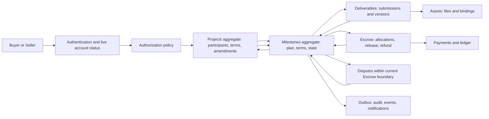

*Figure 1 — Milestone Domain Architecture. Milestones coordinates trusted facts and owns only its plan, terms, state, revision, and approval records.*

## 6. Milestone identity and ownership

### 6.1 Identity rules

| Attribute | Target rule | Repository status |
| --- | --- | --- |
| Internal ID | UUID primary key, internal only, never used as authorization. | Partially Implemented: `id UUID` exists and is returned to clients by the routes, which also accept the internal Project UUID |
| External/public ID | Opaque, unique, immutable `external_id` (current format `mls_` plus 20 hex characters); the only identifier public interfaces accept. | Partially Implemented: generated and returned, never used for lookup |
| Project foreign key | Immutable `project_id`; retained-commercial relationship uses `ON DELETE RESTRICT`. | Partially Implemented: FK exists with `ON DELETE CASCADE`, which is destructive |
| Milestone number | Unique positive integer per Project; physical column stays `milestone_no`. | Implemented: `project_milestones_no_positive`, `project_milestones_unique_no_per_project` |
| Creator | `created_by_user_id`, immutable provenance. | Not Implemented |
| Buyer and Seller | Derived from Project participants; never stored on the Milestone. | Implemented by omission: no party column exists |
| Creation and update timestamps | `created_at` immutable; `updated_at` maintained on every change. | Partially Implemented: `updated_at` exists with a default but no trigger maintains it |
| Version | Monotonic bigint incremented on every aggregate mutation. | Not Implemented |

### 6.2 Ownership and party semantics

The Buyer and Seller of a Milestone are the Buyer and accepted Seller participant of its Project, evaluated live through the Projects participant model ([Projects Section 6](projects.md#6-project-participants)). The Milestone never duplicates them, for four reasons. Duplicated party columns can drift from the participant record. They would imply a Milestone-scoped Seller, which is a future multi-seller concept ([Projects Section 31](projects.md#31-future-architecture)). They would create a second authorization source. And they conflict with Projects' rule that Buyer and Seller are relationship-derived. If multi-seller Projects arrive, a Milestone gains an explicit `assigned_participant_id` referencing a Project participant, not a `seller_user_id`. That extension is Planned and must not be implied by the MVP schema.

`id`, `external_id`, `project_id`, `created_at`, and `created_by_user_id` are immutable identity. Ownership is necessary but never sufficient: every action evaluates current account status, live Project relationship, Project and Milestone state, and permission (Section 23).

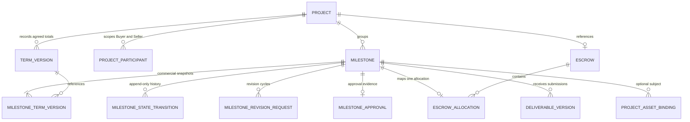

*Figure 2 — Project-to-Milestone Aggregate Relationship. Party relationships stay on the Project; Escrow, Deliverable, and Asset records stay with their owners.*

## 7. Milestone creation

### 7.1 Deterministic target model

Only the Project's Buyer creates and edits Milestones, and only while the plan is unagreed. The Seller cannot author or edit Milestones. Before acceptance the Seller's only contractual actions are to accept or decline a frozen proposal snapshot; a wish to change scope is a Messaging conversation followed by a new Buyer-authored proposal version, consistent with [Projects Section 15](projects.md#15-scope-changes-and-amendments). Seller acceptance of the Project accepts the exact frozen Milestone snapshot referenced by the accepted proposal version, no more and no less. Adding, removing, renumbering, or changing any Milestone after acceptance happens only through an accepted bilateral Project amendment. Whether a Seller may formally propose Milestone edits before acceptance is a product decision recorded as Question Q6; until decided, the rule above stands.

A Project may hold zero or more Milestones while Draft ([Projects Section 18](projects.md#18-milestone-relationship)). A proposal offered to a Seller requires at least one valid Milestone (`BR-PROJECTS-008` in Projects; Milestone-level readiness is `BR-PROJECTS-054` below).

### 7.2 Creation matrix

| Concern | Target rule | Repository status |
| --- | --- | --- |
| Who may create | Project Buyer, evaluated through the live participant relationship; permission `project.milestone.create` from [Projects Section 13.1](projects.md#131-project-access-matrix). Seller, Collaborator, Observer, Moderator, and Administrator cannot create. | Partially Implemented: created only inside Buyer-authenticated `POST /projects` |
| Allowed Project states | Draft. Any later pre-acceptance state only through the Projects new-proposal-version operation (reconciliation item R8). Never after acceptance except by amendment. | Partially Implemented: only at Project creation |
| Minimum fields | `title`, `amount`; numbering assigned by the server. | Implemented: route requires non-empty `title` and integer `amount` |
| Optional in Draft | `description`, `deliverable_definition`, `due_at`, references. | Implemented for `description`, `due_at`; `deliverable_definition` Not Implemented |
| Required for proposal readiness | Non-blank `title`, positive `amount`, non-blank `deliverable_definition`, Project currency, unique number, valid ordering (Section 13), and reconciliation (Section 9). | Partially Implemented: title, amount, and sum are checked; the rest are Not Implemented |
| Numbering | Server-assigned, dense from 1 at creation, unique per Project. Clients never choose it. | Implemented: `i + 1` assigned in creation loop |
| Title and description | Trimmed; bounded length; no markup execution. | Partially Implemented: trimmed; no upper bound; no markup policy |
| Amount | Positive integer minor units within the 64-bit target bound, currency-aware parsing. | Partially Implemented: integer 1 to 2,147,483,647 |
| Currency | Server-stamped from the Project; the client cannot supply it. | Implemented: `PROJECT_CURRENCY = "INR"` stamped server-side |
| Due date | Optional timestamp; if present must be a valid future instant at proposal readiness. | Partially Implemented: parsed as valid date; not required to be in the future and stored as supplied |
| Dependencies | None in MVP; sequential order only (Section 13). | Not Implemented, correctly absent |
| Attachments and references | Bound through Project Asset bindings with a Milestone subject (Section 22). | Not Implemented |
| Duplicate submission | `Idempotency-Key` bound to actor, operation, Project, and canonical request hash; replay returns the original result. | Not Implemented |
| Rate limiting | Per-user and per-Project limits on creation and edit; a governed maximum Milestone count per Project (value open, Question Q9). | Not Implemented |
| Audit and notification | `AUD-PROJECTS-007`; edits before any proposal do not notify; edits that supersede an outstanding proposal notify the invitee through Projects. | Not Implemented |

`REQ-PROJECTS-023`: The system MUST derive a Milestone's Buyer and Seller from live Project participation, MUST keep Milestone identity immutable, and MUST reject any client-supplied identity, number, currency, state, or party field.

`REQ-PROJECTS-024`: The system MUST create Milestones only through an authorized Buyer command that assigns the number and currency server-side, validates positive integer amounts, and is idempotent.

## 8. Milestone field matrix

### 8.1 Target field matrix

Storage classes: **Stored** is directly stored and authoritative; **Snapshot** is an immutable copy per term version; **Project-derived**, **Escrow-derived**, **Deliverable-derived**, **Dispute-derived**, and **Event-derived** are not authoritative on the Milestone and are read or projected from their owner.

| Field | Target representation | Class and authority | Mutability | Repository status |
| --- | --- | --- | --- | --- |
| `id` | UUID PK | Stored; Milestones | Immutable | Implemented |
| `external_id` | Opaque unique text | Stored; Milestones | Immutable (target trigger; current trigger does not protect it) | Partially Implemented |
| `project_id` | UUID FK to Projects, RESTRICT | Stored; Milestones | Immutable always, locked or not | Partially Implemented: trigger protects it only after lock and only by comparing the old Project's lock |
| `milestone_no` (target name `milestone_number`) | Positive integer, unique per Project among active rows | Stored; term snapshot | Draft-editable through reorder; immutable once frozen | Implemented |
| `title` | Bounded non-blank text | Stored; term snapshot | Draft-editable; frozen and agreed immutable | Partially Implemented: no bound or blank check at the database |
| `description` | Bounded text, nullable | Stored; term snapshot | Same as `title` | Implemented (nullable text) |
| `scope` | Not a separate field; folded into `description` and `deliverable_definition` | Not adopted | Not applicable | Not Implemented |
| `deliverable_definition` | Bounded text of expected output and acceptance criteria, embedding the declarative `submission_requirements` substructure (minimum Asset count, optional required Asset classes, text-only-sufficient flag) that Deliverables enforces at Submission time (`deliverables.md` Section 7.1); not a full service-template language | Stored; term snapshot | Same as `title` | Not Implemented |
| `revision_allowance` | Nonnegative integer; the agreed per-Milestone count of Buyer-initiated revision requests (Section 17) | Stored; term snapshot | Same as `title`; immutable after agreement except through an accepted amendment | Not Implemented; supersedes reliance on `projects.revision_limit` (Section 33) |
| `amount` | Signed 64-bit integer minor units, positive | Stored; term snapshot | Same as `title` | Partially Implemented: `INT`, 32-bit, positive check |
| `currency` | ISO 4217 code equal to Project currency | Stored; Project-derived value validated at write | Immutable from freeze | Partially Implemented: unconstrained `TEXT` |
| `currency_exponent` | Small integer snapshot from the currency registry | Snapshot | Immutable with term version | Not Implemented |
| `due_at` | Nullable timestamptz | Stored; term snapshot | Same as `title` | Implemented |
| `starts_at` | Not adopted; start is derived from predecessor approval, funding, and the explicit start command | Not adopted | Not applicable | Not Implemented |
| `state` | Governed enum (Section 11) | Stored; Milestones | Transition service only | Partially Implemented: enum exists; no service |
| `terms_status` | `draft`, `frozen`, `agreed` | Stored; Milestones | Forward only, except frozen to draft before acceptance | Not Implemented |
| `current_term_version` | Positive integer reference to the latest term snapshot | Stored; Milestones | Changes only with a new term version | Not Implemented |
| `introduced_in_term_version`, `superseded_in_term_version` | Project term-version references; latter nullable | Stored; Milestones | Superseded set once by an accepted amendment | Not Implemented |
| `activated_at` | Not adopted; activation eligibility is derived, and `started_at` records the actual start | Not adopted | Not applicable | Not Implemented |
| `funded_at` | Nullable timestamptz | Escrow-derived, projected on consuming the fact | Set from a verified Escrow event | Not Implemented |
| `started_at` | Nullable timestamptz | Stored; Milestones | Set once on the start command | Not Implemented |
| `submitted_at` | Not stored; the Deliverables submission time | Deliverable-derived | Not applicable | Not Implemented |
| `delivered_at` | Nullable timestamptz of the latest ready submission | Event-derived, projected from Deliverable facts; history in transitions | Updated on each ready resubmission | Not Implemented |
| `approved_at` | Nullable timestamptz | Stored; the approval record is authoritative | Set once | Not Implemented |
| `completed_at` | Nullable timestamptz set when state becomes `released` | Event-derived from the Escrow release-settled fact | Set once | Not Implemented |
| `cancelled_at` | Nullable timestamptz | Stored; Milestones | Set once | Not Implemented |
| `disputed_at` | Not stored separately; `interrupted_at` with reason `DISPUTE` | Dispute-derived | See interruption fields | Not Implemented |
| `refunded_at` | Not stored on Milestone; derived from the Escrow refund fact recorded in transitions | Escrow-derived | Not applicable | Not Implemented |
| `resume_state`, `interruption_reason`, `interrupted_at` | Nullable exact prior state, reason code (`DISPUTE`, `ADMIN_RISK`, `MODERATION`, `CANCELLATION_PENDING`), and time | Stored; Milestones | Set on interruption, cleared on resume | Not Implemented |
| `funded_amount`, `released_amount`, `refunded_amount` | Never stored on Milestones; read from Escrow allocation | Escrow-derived | Not applicable | Not Implemented, correctly absent |
| `revision_count` | Count of revision request records, compared against this Milestone's own `revision_allowance` (never the Project-level `revision_limit`) | Derived from Section 17 records | Not applicable | Not Implemented |
| `version` | Monotonic bigint | Stored; Milestones | Incremented on every mutation | Not Implemented |
| `created_by_user_id` | UUID FK to Users | Stored; Milestones | Immutable | Not Implemented |
| `created_at`, `updated_at` | Timestamptz | Stored; database | `created_at` immutable; `updated_at` trigger-maintained | Implemented and Partially Implemented respectively |

The Milestone does not copy a party identifier, an Escrow total, an Asset locator, or a Deliverable file. A cached financial projection, if ever added for read performance, MUST be labeled derived and rebuildable from Escrow.

## 9. Milestone commercial terms

### 9.1 Which fields are commercial terms

Commercial terms are: `milestone_no`, `title`, `description`, `deliverable_definition` (including its embedded `submission_requirements` declaration), `revision_allowance`, `amount`, `currency` with `currency_exponent`, `due_at`, and the Milestone's membership in the plan (its existence, ordering position, and removal). The immutable identity fields (`id`, `external_id`, `project_id`, `created_at`, `created_by_user_id`) are protected always. State, lifecycle timestamps, interruption fields, term-status markers, `version`, and `updated_at` are operational.

The repository trigger protects a subset: after lock it blocks insert, delete, and changes to exactly `project_id`, `milestone_no`, `title`, `description`, `amount`, `currency`, and `due_at`. It does not cover `deliverable_definition` (absent), `currency_exponent` (absent), `id`, `external_id`, `created_at`, or `state`. This matches the field list in [Governance Section 15's `BR-PROJECTS-002`](../00-governance/README.md#15-business-rule-documentation) plus `project_id`, and is broader in identity and narrower than the target.

### 9.2 Commercial terms matrix

| Concern | Canonical rule and owner | Lock and change rule | Reconciliation | Repository status |
| --- | --- | --- | --- | --- |
| Amount | Positive integer minor units; Milestones owns each line item | Draft-editable; frozen and agreed immutable; amendment supersedes | Sum equals proposed or agreed Project total | Partially Implemented |
| Currency | Equals Project currency and exponent snapshot; MVP `INR` per `BR-PROJECTS-003` | Immutable from freeze; currency change is a Project amendment before funding and prohibited after | Must match Project, Escrow, allocation, and payment currency | Partially Implemented: checked at creation and lock in route code only |
| Scope and title | `title`, `description`, `deliverable_definition` define what is being bought | Same lifecycle as `amount` | Agreed snapshot is the dispute reference | Partially Implemented |
| Submission requirements | The `submission_requirements` declaration embedded in `deliverable_definition` (minimum Asset count, optional required Asset classes, text-only-sufficient flag) is negotiated and agreed per Milestone at the same time as scope; MusicApp does not impose a platform-wide minimum-Asset rule (Decision, 2026-09-25) | Same lifecycle as `deliverable_definition`; immutable once agreed except through an accepted amendment | Deliverables (`deliverables.md` Section 7.1) evaluates every Submission against exactly this declaration | Not Implemented |
| Revision allowance | `revision_allowance` is a nonnegative integer negotiated and agreed per Milestone, independently of every other Milestone in the Project (Decision, 2026-09-25); it is not derived from or defaulted from the Project-level `revision_limit` column | Same lifecycle as `amount`; immutable once agreed except through an accepted amendment; unused revisions never transfer between Milestones | Milestones' own `revision_count` (Section 17) is compared only against this field | Not Implemented; the legacy `projects.revision_limit` column is superseded target-architecture debt (Section 33) |
| Deadline | `due_at` is an absolute deadline; not derived from `delivery_days` | Same lifecycle as `amount`; monotonic with number (Section 13) | Last Milestone due date not after Project `due_at` when both exist | Partially Implemented: stored; no ordering or Project consistency check |
| Sequencing | `milestone_no` gives order; activation follows it | Renumbering only while `terms_status` is `draft` | Unique among active rows; dense at proposal readiness | Partially Implemented: unique and positive; density unenforced |
| Agreed snapshot | Immutable `milestone_term_versions` row referenced by the Project agreed term version | Created at acceptance; superseded only by accepted amendment | Every active Milestone has exactly one agreed row | Not Implemented |
| Commercial lock | `terms_status` reaches `agreed` at acceptance (Section 10) | No unilateral change; no silent administrator rewrite (`BR-PROJECTS-017`) | Lock requires reconciliation to pass first | Partially Implemented: `milestones_locked_at` and trigger |
| Project total reconciliation | Sum of active Milestone amounts equals `proposed_total` at freeze and `agreed_total` at agreement and after each amendment | Checked in the mutating transaction and by a deferred database constraint | Continuous, not only at creation | Partially Implemented: exact sum checked at create and at lock in route code; no DB check |
| Rounding | No per-line rounding; amounts are entered as explicit minor units. Any future ratio-based split allocates the residual deterministically to the highest-numbered active Milestone | Residual rule is versioned with the term snapshot | Sum must still equal the total exactly | Not Implemented |
| Integer minor units | Signed 64-bit target; stored integer is already the minor-unit count | Never a decimal or floating type | Parsing is currency-aware at the boundary | Partially Implemented: 32-bit `INT` |
| Zero-decimal currencies | Exponent `0`; the stored integer is the whole-unit count | Exponent snapshot immutable with the term version | No display-side scaling assumption | Not Implemented |
| Amendment behavior | Accepted amendment writes new snapshot rows and marks replaced rows superseded; never edits history | Cannot reduce a Milestone below funded, released, disputed, or retained amounts | Re-reconcile totals atomically | Not Implemented |
| Funding implications | Milestone becomes fundable only from an agreed snapshot; funded amount must equal its agreed amount | Amount frozen against funded value | Escrow allocation equals agreed amount and currency | Schema Implemented: allocations exist; no equality constraint |
| Cancellation implications | Cancelling preserves the row and snapshot; money outcome is Escrow's | Governed resolution only after agreement | Totals re-reconciled by amendment or resolution | Schema Implemented: `cancelled` value only |
| Refund implications | Refund amount is an Escrow fact; Milestone records the outcome state | Cannot exceed allocation | Milestone `refunded` only when Escrow settles fully with nothing released | Schema Implemented |

`REQ-PROJECTS-025`: The system MUST version Milestone commercial terms as draft, frozen, and agreed snapshots, MUST never mutate a frozen or agreed snapshot, and MUST apply post-agreement change only through accepted amendments.

`REQ-PROJECTS-037`: The system MUST reconcile the active Milestone plan against the Project's proposed or agreed total and currency continuously, in the mutating transaction and by an independent database-level check, not only at creation.

`REQ-PROJECTS-060`: The system MUST treat Deliverable submission requirements and the Buyer-initiated revision allowance as per-Milestone commercial terms, agreed and locked with the same lifecycle as `amount`, and MUST NOT apply a platform-wide minimum-Asset rule or a Project-wide revision count in their place.

## 10. Milestone locking

### 10.1 Target locking model

Locking has two committed points and one navigable escape hatch. Each is a `terms_status` transition on every active Milestone of the Project, applied atomically with the Project transition that causes it.

- **Freeze** happens when the Buyer offers the proposal, that is Projects' Draft to Proposed step ([Projects Section 11.3](projects.md#113-project-transition-matrix)). The system validates each Milestone and the plan sum, captures a proposal snapshot per Milestone, and sets `terms_status = frozen`. A frozen row and its snapshot are immutable. This is the closest target analogue of today's Buyer lock (`POST /projects/:projectId/lock-milestones`).
- **Reopen** is allowed only from frozen and only while no Seller has accepted. It depends on a Projects operation that creates a new proposal version and supersedes any pending invitation; that operation is described in Projects Section 15 but has no state-machine edge yet (reconciliation item R8). The frozen snapshot stays as history, the working copy returns to `draft`, and the audit trail records who reopened and why. No frozen snapshot is ever edited, so the immutability rule still holds (reconciliation item R2).
- **Agree** happens when Projects records Seller acceptance of a specific proposal version. The Milestone agreed snapshot is that version's proposal snapshot, `terms_status = agreed`, and the term is now bilateral. There is no unlock. The only change path is an accepted amendment, which creates a new snapshot and supersedes the old row rather than editing it.

The Foundation "lock" that makes terms immutable ([Foundation `REQ-FOUNDATION-005`](../01-foundation/product-overview.md#12-requirements) and `BR-PROJECTS-004`) is satisfied because no frozen or agreed value is ever changed in place. The repository's stricter behavior (a Buyer lock that is irreversible and has no reopen) is a subset; whether reopen should exist in MVP is Question Q5.

### 10.2 Locking matrix

| Concern | Freeze (proposal) | Agree (acceptance) | Amendment |
| --- | --- | --- | --- |
| Initiator | Buyer, through Projects Draft to Proposed | Invitee Seller, through Projects acceptance | Active Buyer or Seller proposes; counterparty accepts |
| Required Project state | Draft; after a reopen, whatever state the Projects new-proposal-version operation defines (R8) | Seller Invited with matching proposal version | Accepted or later, with no blocking dispute or hold |
| Required Milestone validity | At least one Milestone; each passes Section 7.2 readiness; numbers unique and dense; due dates monotonic | Every active Milestone frozen at the accepted proposal version | Typed change validated against funded, released, disputed, and retained amounts |
| Reconciliation | Sum equals `proposed_total`; every currency equals Project currency | Agreed total equals sum of agreed snapshots | New sum equals new agreed total; currency unchanged after funding starts |
| Seller consent | Not yet; snapshot is an offer | Explicit, identity-, version-, and expiry-bound acceptance | Exact-hash counterparty acceptance |
| Lock timestamp and version | `frozen_at` recorded by the transition record; `current_term_version` incremented | Agreed term version referenced; `terms_agreed_at` in the transition record | New term version; old rows `superseded_in_term_version` set |
| Fields protected | All commercial terms and identity | All commercial terms and identity | Historical snapshots; only the new version is written |
| Fields still mutable | State, timestamps, interruption, `version` | Same | Same |
| Escape hatch | Reopen while unaccepted | Amendment only | New amendment |
| Unlock policy | Reopen only, pre-acceptance | None | None; historical rows never unlocked |
| Administrative restriction | Administrator and Moderator cannot alter frozen or agreed terms (`BR-PROJECTS-017`); they may suspend but not rewrite | Same | Financial overrides need explicit policy and audit (`BR-AUTHZ-012`) |
| Concurrency | Lock Project, then Milestones by number; expected version; serialize against edits and acceptance | Lock invitation, Project, Milestones in stable order | Lock amendment, Project, Milestones; re-read base version |
| Audit and notification | `AUD-PROJECTS-008`; proposal notice through Projects | `AUD-PROJECTS-008`; mandatory to both parties | `AUD-PROJECTS-008`; mandatory to counterparty and dependents |
| Repository status | Partially Implemented: Buyer route locks Draft plan; no snapshot or version | Not Implemented | Not Implemented |

### 10.3 Enforcement target

Database enforcement in the target combines a row-level trigger and a deferred constraint. The trigger rejects any change to a commercial column when `terms_status <> 'draft'`, rejects any change to `id`, `external_id`, `project_id`, `created_at`, and `created_by_user_id` regardless of status, rejects deletion of any row that is frozen, agreed, bound, or referenced by Escrow, and rejects inserting or moving a Milestone into a Project whose plan is frozen or agreed. A deferred constraint trigger checks the sum and currency invariants at commit. Application services still validate first and return domain-specific errors. The lock flag belongs to the Milestone row itself so it cannot be bypassed by reading a mutable Project column.

`BR-PROJECTS-002` in Governance's meaning is implemented today only for the seven columns and only through the trigger described in Section 28.4. The Governance meaning ("only operational fields (state) may continue to update") is not met for `external_id`, because the trigger does not protect it.

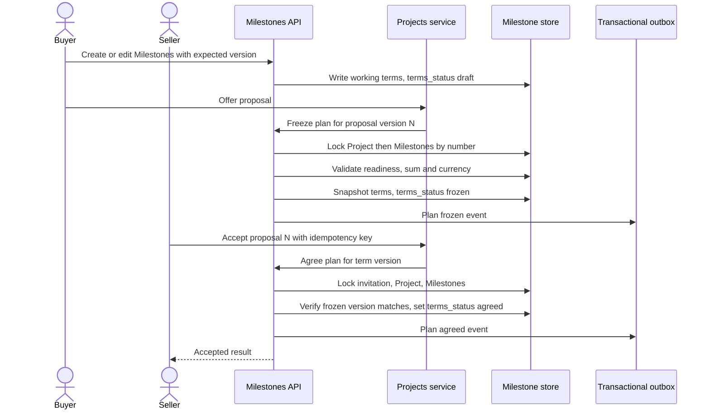

*Figure 3 — Milestone Creation and Locking Sequence. Freezing captures an immutable offer; acceptance turns that exact snapshot into agreed terms.*

`REQ-PROJECTS-026`: A frozen or agreed Milestone term row MUST be immutable in place at the database level, and the lock indicator MUST live on the Milestone row so it cannot be bypassed by changing a Project column or by moving a row between Projects.

## 11. Milestone states

### 11.1 Current repository states

`milestone_state` is a PostgreSQL enum created in [`backend/db/006_create_escrow_system.sql`](../../backend/db/006_create_escrow_system.sql) with exactly nine values in this declaration order: `planned`, `funded`, `in_progress`, `delivered`, `buyer_approved`, `released`, `refunded`, `disputed`, `cancelled`. The column `project_milestones.state` is `NOT NULL DEFAULT 'planned'`. States use a true enum type, not a CHECK or unconstrained text, so membership is enforced but enum order is not a transition graph. Only `planned` is reachable: the `POST /projects` insert omits `state`, and no route, trigger, or function updates it. The frontend type `MilestoneState` in [`frontend/src/App.tsx`](../../frontend/src/App.tsx) mirrors the same nine values.

### 11.2 Target state matrix

Reconciliation against Foundation, Projects, the schema, and the candidate list in the task produced one addition and several deliberate non-additions. Governance Section 20 requires diagrams to use exact enum values, so target names keep the schema's snake_case identifiers.

| Stored state | Meaning | Entered by | Permitted exits | Terminal | Repository status |
| --- | --- | --- | --- | --- | --- |
| `planned` | Defined in the plan and not funded. Whether its terms are draft, frozen, or agreed is the separate `terms_status`. | Creation; funding reversal before start | `funded`, `cancelled`, `suspended` | No | Partially Implemented: reachable |
| `funded` | Escrow confirms this Milestone's allocation fully funded; work not started | Verified Escrow fact | `in_progress`, `planned` (reversal), `disputed`, `suspended`, `refunded` | No | Schema Implemented |
| `in_progress` | Seller has started; includes any open revision cycle | Explicit Seller start; Buyer revision request | `delivered`, `disputed`, `suspended`, `refunded` | No | Schema Implemented |
| `delivered` | A ready, safe, immutable submission awaits Buyer review; includes resubmissions | Verified Deliverables readiness fact | `buyer_approved`, `in_progress` (revision), `disputed`, `suspended` | No | Schema Implemented |
| `buyer_approved` | Buyer approved the exact submission; release requested; not settled | Buyer approval command | `released`, `disputed`, `suspended` | No | Schema Implemented |
| `released` | Escrow confirms the allocation settled with the Seller receiving funds; the Milestone is complete | Verified Escrow settlement fact | None | Yes | Schema Implemented |
| `refunded` | Escrow confirms the allocation settled with nothing released to the Seller | Verified Escrow refund fact | None | Yes | Schema Implemented |
| `disputed` | Interrupted by a verified Dispute; stores `resume_state` | Verified Dispute fact | Stored resume state, `released`, `refunded`, `cancelled` | No | Schema Implemented |
| `suspended` | Administrative, moderation, or cancellation-pending hold; stores `resume_state` | Authorized suspension or governed cancellation | Stored resume state, `refunded`, `cancelled` | No | Not Implemented: target addition to the enum |
| `cancelled` | Milestone ended without accepted work and with no money returned through this outcome | Governed amendment or resolution | `refunded` (only when Escrow later confirms a refund) | Yes | Schema Implemented |

Why these are not additional stored states:

- **Draft** and **Proposed** are `terms_status` values on a `planned` Milestone plus the Project's own state, not Milestone lifecycle states.
- **Awaiting Funding** is derived: a `planned` Milestone with `terms_status = agreed` while its Project is Awaiting Funding.
- **Ready** is derived: a `funded` Milestone that passes the activation predicate of Section 13.
- **Submitted** and **Resubmitted** collapse into `delivered`. Submission processing (upload, malware scan, readiness) is a Deliverables and Assets concern; the Milestone leaves `in_progress` only on the trusted readiness fact. A resubmission is `delivered` with a revision cycle number greater than zero, derived from Section 17 records.
- **Revision Requested** is `in_progress` with an open revision request record. This matches Projects, whose transition returns to In Progress ([Projects Section 11.3](projects.md#113-project-transition-matrix)).
- **Release Pending** is derived: `buyer_approved` while Escrow has not reported settlement.
- **Completed** is a predicate, not a state (Section 19).

`suspended` is added because a Moderator or Administrator action or a pending cancellation on one Milestone must be able to hold that unit without interrupting the whole Project, mirroring the Projects `Suspended` state and its resume rule. `BR-PROJECTS-020` in Projects already forbids inferring a Milestone transition from Project enum order or client state.

### 11.3 Derived and separate status

| Value | Derivation | Owner of authority |
| --- | --- | --- |
| Awaiting Funding | `planned` and `terms_status = agreed` and Project Awaiting Funding | Projects and Milestones |
| Ready to start | `funded` and activation predicate true and no interruption | Milestones |
| Revision open | `in_progress` and an unanswered revision request record exists | Milestones |
| Release Pending | `buyer_approved` and no Escrow settlement fact | Escrow reports; Milestones displays |
| Overdue | `due_at` passed and state in {`funded`, `in_progress`} | Derived from the clock; no state change |
| Review Overdue | `delivered` and the configured review period has elapsed since `delivered_at` with no revision request or approval yet answering the Current Submission. Distinct from Overdue, which concerns the Milestone's own `due_at`, not Buyer review of a Submission already delivered | Derived from the clock and Section 18.2; no state change by itself |
| Escrow allocation status | Read from the Escrow allocation | Escrow |
| Deliverable and submission status | Read from Deliverables | Deliverables |
| Dispute status | Read from the case | Escrow or Disputes owner |

No Milestone field stores an Escrow, Deliverable, or Dispute status. The Milestone stores its own state and only the reference and interruption data needed to enforce hold and resume.

### 11.4 Milestone lifecycle matrix

| Phase | Authoritative input | Milestone responsibility | External dependency | Failure posture |
| --- | --- | --- | --- | --- |
| Definition | Buyer commands | Working terms, numbering, validation | Projects, Assets | Reject with no partial write |
| Freeze | Projects offer transition | Snapshot and validate plan | Projects, Assets | Plan stays `draft`; Project stays Draft |
| Agreement | Projects acceptance | Set agreed snapshot | Projects | Safe `409`; no partial acceptance |
| Funding | Escrow fact | Enter `funded` on matching fact | Escrow | Remain `planned`; quarantine mismatched facts |
| Activation and start | Seller command | Check predecessors, funding, holds | Escrow, Projects | Reject; state unchanged |
| Delivery | Deliverables fact | Enter `delivered` on ready submission | Deliverables, Assets | Stay `in_progress` |
| Review and revision | Buyer command | Record revision request or approval | Deliverables | Stay `delivered`; conflict on stale version |
| Approval | Buyer command | Record evidence and emit release request | Escrow | Stay `buyer_approved` until settlement |
| Settlement | Escrow fact | Enter `released` or `refunded` | Escrow | Stay `buyer_approved`; alert on age |
| Interruption | Dispute, admin, cancellation fact | Store resume state, freeze mutation | Disputes, Administration | Hold until resolution |
| Retention | Terminal state | Keep snapshots, transitions, approvals | Assets, audit, legal | Never cascade-delete |

### 11.5 State machine

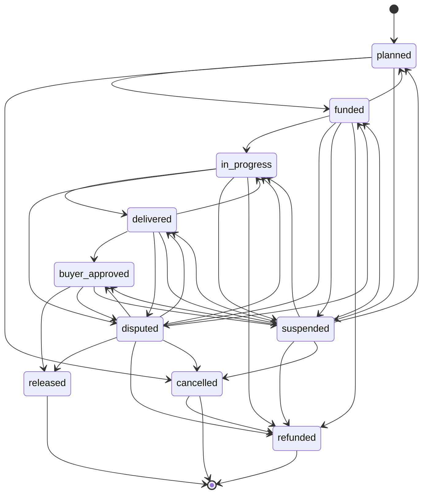

*Figure 4 — Milestone State Machine. All values are `milestone_state` enum values except `suspended`, which is a target addition; `disputed` and `suspended` resume only to a stored, revalidated state. Project, Escrow, Deliverable, and Dispute states are separate machines.*

`REQ-PROJECTS-027`: Milestones MUST expose a server-owned deterministic state machine and MUST reject every transition not explicitly allowed from the locked current state, and no interface may accept a client-chosen target state.

## 12. Milestone transitions

### 12.1 Transition matrix

Rows sharing an identifier share one contract only where actor, preconditions, side effects, audit, notification, and idempotency are identical. There are no wildcard transitions. Each command carries `expected_version` and an `Idempotency-Key`; each fact carries an immutable event or case identifier deduplicated by an inbox record (Section 24).

| ID | From → to | Initiator and domain | Permission and relationship | Preconditions | External facts required | Side effects | Audit and notification | Idempotency and concurrency | Repository status |
| --- | --- | --- | --- | --- | --- | --- | --- | --- | --- |
| M01 | New → `planned` | Project Buyer, Milestones | `project.milestone.create`; Buyer participant | Project pre-acceptance; valid fields; plan unfrozen | None | Insert row, assign number, working terms, transition record | `AUD-PROJECTS-007`; none | Idempotency key; Project locked | Partially Implemented: inside `POST /projects` only |
| M02 | `planned` → `funded` | Escrow event consumer | Trusted event capability | `terms_status = agreed`; no interruption; Project, Milestone, term version, currency, and amount all match | Escrow: allocation for this Milestone funded in full | Set `funded_at`; record transition; outbox | `AUD-PROJECTS-009`; mandatory financial to both | Unique event ID; lock Project then Milestone | Schema Implemented |
| M03 | `funded` → `planned` | Escrow event consumer | Trusted event capability | Work not started | Escrow: verified funding reversal | Clear `funded_at`; hold successors | `AUD-PROJECTS-009`; mandatory | Unique event ID | Not Implemented |
| M04 | `funded` → `in_progress` | Accepted Seller, Milestones | `milestone.start`; live accepted Seller | Agreed; funded; predecessors resolved; no interruption; Project in a startable state | None beyond the stored funded fact | Set `started_at`; request Project projection | `AUD-PROJECTS-010`; mandatory to Buyer | Expected version; repeat returns result | Not Implemented |
| M05 | `in_progress` → `delivered` | Deliverables fact consumer | Trusted event capability; Seller submission authorized upstream by `project.delivery.submit` | Submission bound to this Milestone and current agreed term version | Deliverables: immutable version ready and safe | Set `delivered_at`; link cycle; outbox | `AUD-PROJECTS-010`; mandatory to Buyer | Unique submission or event key | Not Implemented |
| M06 | `delivered` → `in_progress` | Project Buyer, Milestones | `delivery.request_revision` as in [Projects Section 11.3](projects.md#113-project-transition-matrix); Buyer | Revision allowance not exhausted; reason code; expected submission ref is latest | None | Record revision request; reopen work | `AUD-PROJECTS-010`; mandatory to Seller | Command key; one open request per cycle | Not Implemented |
| M07 | `delivered` → `buyer_approved` | Project Buyer, Milestones | `project.delivery.approve`; Buyer | Exact submission ref equals latest ready; term version matches; no interruption; no prior approval | None | Write approval record; set `approved_at`; emit release request | `AUD-PROJECTS-010`; mandatory to Seller and Escrow | Approval unique per Milestone; expected version | Not Implemented |
| M18 | `delivered` → `buyer_approved` | System or Administrator, Milestones | `milestone.authorize_non_response_release`; explicit governed capability, never the Buyer or Seller | Milestone Review Overdue (Section 11.3); documented intervention process exhausted (Section 18.2); no interruption; no prior approval or non-response authorization; exact submission ref equals latest ready | Verified intervention-exhausted fact (Section 18.2) | Write `milestone_platform_release_authorizations` (`DATA-PROJECTS-017`) record, distinct from `milestone_approvals`; emit the same release-eligibility fact type as M07 | `AUD-PROJECTS-015`; mandatory to Buyer and Seller | Authorization unique per Milestone; expected version; idempotency key | Not Implemented |
| M08 | `buyer_approved` → `released` | Escrow event consumer | Trusted event capability | Approval or platform non-response authorization record exists (M07 or M18) | Escrow: allocation settled with funds released to the Seller | Set `completed_at`; notify Projects | `AUD-PROJECTS-011`; mandatory financial | Unique event ID | Not Implemented |
| M09 | `funded`, `in_progress`, `delivered`, `buyer_approved` → `disputed` | Dispute fact consumer | Trusted event capability; opened upstream under `project.dispute.open` | Verified case bound to this Project and Milestone; eligible source state | Case opened | Store `resume_state`, `interruption_reason = DISPUTE`; block mutation and release | `AUD-PROJECTS-011`; mandatory safety and legal | Unique case ID | Not Implemented |
| M10 | `disputed` → stored resume state | Dispute resolution consumer | Resolution capability | Signed resolution names the stored state; all live facts revalidate | Resolution | Clear interruption; restore exact state | `AUD-PROJECTS-011`; mandatory | Unique resolution ID | Not Implemented |
| M11 | `disputed` → `released`, `refunded`, `cancelled` | Escrow or Dispute resolution consumer | Resolution capability | Resolution directs outcome; Escrow fact confirms it | Settlement fact | Record outcome and clear interruption | `AUD-PROJECTS-011`; mandatory | Unique resolution or event ID | Not Implemented |
| M12 | `planned`, `funded`, `in_progress`, `delivered`, `buyer_approved` → `suspended` | Administrator or System | `project.suspend` or `milestone.suspend`; explicit capability | Case, reason, purpose, allowed source; or governed cancellation start | Case or cancellation agreement | Store `resume_state` and reason; block mutation | `AUD-PROJECTS-012`; as policy allows | Case or action key | Not Implemented |
| M13 | `suspended` → stored resume state | Administrator or System | `milestone.restore_from_suspension` | Authorized restore; live facts revalidate | None | Clear interruption | `AUD-PROJECTS-012`; affected parties | Case or action key | Not Implemented |
| M14 | `suspended` → `refunded` or `cancelled` | Escrow consumer or resolution | Trusted event capability | Cancellation resolved; refund or no-funds outcome verified | Escrow settlement or no-funds fact | Record outcome; clear interruption | `AUD-PROJECTS-011`; mandatory | Unique event ID | Not Implemented |
| M15 | `planned` → `cancelled` | Projects amendment or Project cancellation | Amendment acceptance or governed Project cancellation | Unfunded; agreed amendment removes it, or Project cancelled | Escrow: no funds held | Set `cancelled_at`; mark superseded when by amendment | `AUD-PROJECTS-011`; mandatory to both | Amendment or cancellation ID unique | Not Implemented |
| M16 | `funded`, `in_progress` → `refunded` | Escrow event consumer | Trusted event capability | Full refund verified for matching Project, Milestone, and currency | Escrow refund confirmed, nothing released | Record outcome; notify Projects | `AUD-PROJECTS-011`; mandatory | Unique event ID | Not Implemented |
| M17 | `cancelled` → `refunded` | Escrow event consumer | Trusted event capability | Cancelled with money later confirmed returned | Escrow refund confirmed | Record outcome | `AUD-PROJECTS-011`; mandatory | Unique event ID | Not Implemented |

### 12.2 Invalid transitions

Any edge not in Section 12.1 is invalid and returns a safe `409` with no side effect. The following are explicitly forbidden:

| Invalid edge or request | Reason |
| --- | --- |
| Any request supplying a target state, or `PATCH` of `state` | Clients never choose authoritative state (`BR-PROJECTS-037`) |
| `planned` → `in_progress`, `delivered`, `buyer_approved`, or `released` | Skips funding, start, delivery, approval, and settlement |
| `planned` → `refunded` | Nothing funded to refund; the Foundation sketch showing this edge is non-normative (reconciliation item R3) |
| `funded` → `delivered` or `buyer_approved` | Skips start and delivery |
| `in_progress` → `buyer_approved` | Approval requires a delivered submission |
| `delivered` → `released` | Skips Buyer approval |
| `buyer_approved` → `delivered` or `in_progress` | Approval is final for work acceptance; disagreement goes through a Dispute (`BR-PROJECTS-044`) |
| `released`, `refunded` → anything | Terminal; corrections are Escrow-governed external processes |
| `cancelled` → anything except `refunded` | Terminal aside from confirmed money return |
| `delivered`, `buyer_approved` → `cancelled` directly | Requires dispute or suspension resolution first ([Projects Section 16](projects.md#16-project-cancellation)) |
| Any transition while the Project or Milestone is interrupted, other than resume or resolution edges | Interruption holds mutation |
| Approval, revision, or start by the Seller, or start by the Buyer | Wrong relationship |
| Any state write by an Administrator or Moderator outside a named command | No silent state rewrite (`BR-PROJECTS-017`) |

## 13. Milestone activation and order

### 13.1 MVP execution model

Existing product documentation establishes the ordered model: Foundation says each Milestone is "numbered sequentially and uniquely" ([System Architecture Section 10.6](../01-foundation/system-architecture.md#106-milestones)), and Projects states "activation is sequential in MVP, but the future model may express an acyclic dependency graph" ([Projects Section 18](projects.md#18-milestone-relationship)). This specification therefore fixes the MVP model as **strictly sequential activation over an ordered plan**, with funding independent of activation.

| Model | MVP decision | Reason |
| --- | --- | --- |
| Strictly sequential | Adopted | Matches existing Foundation and Projects text and needs no dependency data |
| Several funded, sequentially active | Adopted as a funding allowance | Escrow may fund a whole Project at once, so several Milestones may be `funded`, but only one may be `in_progress` or `delivered` |
| Parallel Milestones | Not in MVP | Not established by existing documents; needs roll-up, dispute, and deadline rules |
| Dependency graph | Not in MVP | Future architecture (Section 31); needs an ADR and amendment semantics |

Whether the Seller may start the next Milestone while the previous one awaits Buyer review (pipelining) is a product decision and is recorded as Question Q4. Until it is decided the stricter rule applies.

### 13.2 Activation matrix

| Concern | Rule | Repository status |
| --- | --- | --- |
| Activation criteria | A Milestone may start when it is `funded`, `terms_status = agreed`, not interrupted, its Project is not interrupted, and every predecessor is resolved | Not Implemented |
| Predecessor completion | A predecessor is resolved when its state is `buyer_approved`, `released`, `refunded`, or `cancelled`. `planned`, `funded`, `in_progress`, `delivered`, `disputed`, and `suspended` predecessors block | Not Implemented |
| Funding requirement | Each Milestone must itself be `funded` (its own allocation confirmed) before it starts | Schema Implemented |
| At-most-one active | At most one active Milestone per Project may be in `in_progress` or `delivered`; the target enforces it with a partial unique index over active rows | Not Implemented |
| Due-date interaction | `due_at` values must be non-decreasing by number at proposal readiness and no later than the Project due date when both exist. A passed `due_at` makes the Milestone Overdue, which is derived and changes no state. Consequences of lateness are unresolved (Question Q8) | Partially Implemented: dates stored only |
| Skipped or cancelled predecessor | A `cancelled` or `refunded` predecessor is resolved and does not block successors. Numbers keep gaps; they are not renumbered after agreement | Not Implemented |
| Dispute interaction | A `disputed` or `suspended` predecessor blocks successors. A dispute on Milestone n never changes the state of another Milestone unless the Escrow dispute policy raises a Project-wide interruption ([Projects Section 18](projects.md#18-milestone-relationship)) | Not Implemented |
| Project cancellation | Project cancellation applies Section 20 to every non-terminal Milestone in number order | Not Implemented |
| Future dependency architecture | An acyclic `milestone_dependencies` relation versioned with the term snapshot, replacing numeric order for eligibility; parallel Milestones allowed only where no path exists | Planned |

`REQ-PROJECTS-028`: The system MUST allow a Milestone to start only from `funded` under an explicit authorized Seller command that satisfies the sequential activation predicate, and MUST NOT infer work commencement from client navigation or state.

## 14. Funding relationship

Escrow remains the financial authority. A Milestone consumes trusted Escrow facts and never manufactures funded, released, or refunded values.

### 14.1 Funding matrix

| Concern | Milestone responsibility | Escrow responsibility | Failure and idempotency rule | Repository status |
| --- | --- | --- | --- | --- |
| Fundable | A Milestone is fundable only when `terms_status = agreed` and its Project is Awaiting Funding with no hold | Decides whether and how to accept a funding intent | Milestone never marks itself funded | Schema Implemented |
| Granularity | Supports Project-wide funding that allocates to Milestones and per-Milestone funding; enters `funded` per allocation | Owns whether funding is up front or staged | Open Question Q3 | Schema Implemented: one Escrow per Project, one allocation per Milestone |
| Allocation binding | Exposes agreed `amount`, `currency`, `term_version`, and identifier for the allocation | Creates one allocation per active Milestone with equal amount and currency | Mismatch is quarantined and alerted | Schema Implemented: `escrow_allocations.milestone_id` UNIQUE; no amount equality constraint |
| Funded amount | Stores none; reads the allocation | Authoritative | Rebuildable from ledger | Schema Implemented |
| Currency | Must equal Milestone currency and exponent | Rejects mismatch | Unique event ID | Schema Implemented: no cross-table currency constraint |
| Funding confirmation | Enters `funded` on a verified fact naming Project, Milestone, term version, currency, and full amount | Emits the fact after provider or ledger confirmation | Duplicate returns the original result | Not Implemented |
| Partial funding | A partially funded allocation does not change Milestone state | Owns partial policy | Record informational fact only | Not Implemented |
| Overfunding | Rejects facts exceeding the agreed amount | Prohibits overfunding | Quarantine and alert | Not Implemented |
| Duplicate funding | One funding transition per allocation; later duplicates acknowledged | Owns provider idempotency | Unique event and allocation keys | Not Implemented |
| Funding reversal | Before start, `funded` returns to `planned`; after start, a reversal fact places the Milestone in `suspended` (`ADMIN_RISK`) pending Escrow and Dispute resolution | Owns chargeback and reversal handling | Unique event ID | Not Implemented |
| Cancellation | Follows Section 20; requests Escrow outcome and waits for its fact | Owns refund and release | Pending until fact arrives | Not Implemented |
| Refund | Enters `refunded` only on the Escrow refund fact | Authoritative | Unique event ID | Schema Implemented |
| Dispute hold | `disputed` blocks release request and mutation | Freezes allocation | Held until resolution fact | Not Implemented |
| Reconciliation | Scheduled comparison of agreed amount, currency, and state to Escrow facts; alert, never auto-rewrite | Owns ledger truth | `OPS-PROJECTS-009` | Not Implemented |

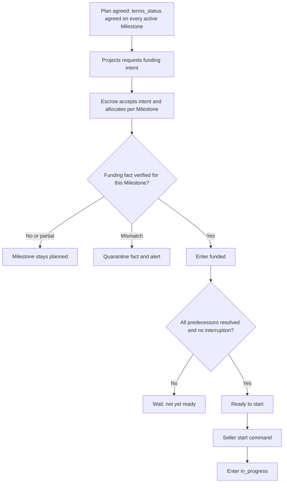

*Figure 5 — Funding and Activation Flow. Funding is a verified Escrow fact; activation is an explicit Seller command gated by order, funding, and holds.*

`REQ-PROJECTS-029`: Milestones MUST enter `funded`, `released`, and `refunded` only by consuming authenticated, idempotent Escrow facts that match Project, Milestone, term version, currency, and amount, and MUST NOT store or compute financial totals.

## 15. Work commencement

Work commencement is an explicit Seller command, not an inference. Funding alone does not start work, and neither frontend navigation nor any client-held state can start it.

| Concern | Rule | Repository status |
| --- | --- | --- |
| When the Seller may begin | Only the live accepted Seller, only for a `funded` Milestone that satisfies the activation predicate of Section 13.2 | Not Implemented |
| Required Project state | Funded or In Progress under [Projects Section 10.1](projects.md#101-project-state-matrix); the Project is not Disputed or Suspended | Not Implemented |
| Required Milestone state | `funded` with `terms_status = agreed` and no interruption | Not Implemented |
| Funding requirement | This Milestone's own allocation confirmed funded by Escrow | Schema Implemented |
| Activation requirement | All predecessors resolved; no other Milestone in `in_progress` or `delivered` | Not Implemented |
| Seller authorization | `milestone.start`; live Seller participant, live account status, Project not interrupted; Buyer and every other actor denied | Not Implemented |
| Commencement timestamp | `started_at`, set once by the command, taken from the database clock | Not Implemented |
| Automatic versus explicit | Explicit. An automatic start on funding would change deadline and capacity expectations and is a product decision outside this specification | Not Implemented |
| Deadline impact | `due_at` is an absolute deadline and is not recomputed at start. Any change to it is a Project amendment | Partially Implemented: `due_at` stored only |
| Project effect | The first start of a Project's first Milestone gives Projects the fact it needs for its own Funded to In Progress transition, which Projects owns | Not Implemented |
| Audit | `AUD-PROJECTS-010`: actor, Milestone, term version, predecessor set, outcome | Not Implemented |
| Notification | Mandatory workflow notice to the Buyer | Not Implemented |

## 16. Deliverable relationship

A Milestone is the payable unit to which Deliverables belong, consistent with [Projects Section 19](projects.md#19-deliverable-relationship). This section defines only the Milestone-level contract. The Deliverables specification, when it exists, owns submission mechanics, file lifecycle, and review deadlines. The Milestone consumes Deliverable-domain facts and stores no file state, so a Milestone never owns a mutable pointer to a current accepted Deliverable. The exact accepted submission is recorded once, inside the immutable approval record of Section 18.

### 16.1 Deliverable relationship matrix

| Concern | Milestone-level contract | Owner of the detail | Repository status |
| --- | --- | --- | --- |
| Cardinality | One Milestone has zero or more Deliverable submissions over time, each an immutable version with lineage | Deliverables | Not Implemented |
| Seller submission | Seller uploads through Assets, binds the version to the Milestone, and submits. Milestones supplies an eligibility answer: Seller, `in_progress`, agreed terms, not interrupted | Deliverables; Milestones for eligibility | Not Implemented |
| Asset bindings | Bound through a Project Asset binding whose subject is the Milestone (`DATA-PROJECTS-007`), by Asset version, never by locator | Assets and Projects binding | Not Implemented |
| Versioning and replacement | A revision is a new version with lineage. Nothing overwrites a prior submission | Deliverables and Assets | Not Implemented |
| Processing readiness | The Milestone enters `delivered` only after Assets reports the version ready | Assets | Not Implemented |
| Malware and safety readiness | Fail closed: scanning, validation, and quarantine gates must pass before the readiness fact exists | Assets ([Assets Section 13](../03-identity-profiles-verification/assets-and-media.md#13-file-validation-and-content-security)) | Not Implemented |
| Recipient access | Live Project relationship, Milestone purpose, and Asset policy on every read; an Observer gets none by default | Authorization, Assets | Not Implemented |
| Submission timestamp | Deliverable-owned; the Milestone projects the latest as `delivered_at` | Deliverables | Not Implemented |
| Revision cycle | Milestone-owned records (Section 17) reference the submission version they answered | Milestones | Not Implemented |
| Buyer review | Buyer sees the latest ready submission through the review projection | Milestones and Deliverables | Not Implemented |
| Acceptance or approval | Milestone-owned approval fact naming the exact submission version (Section 18) | Milestones | Not Implemented |
| Rejection or requested revision | Milestone-owned revision request record; a rejection is not a state, only a revision request or a dispute | Milestones | Not Implemented |
| Immutable evidence | Submissions, approval record, and revision requests are never edited or deleted | Milestones, Deliverables, Assets | Not Implemented |
| Retention | Follows [Assets Section 18](../03-identity-profiles-verification/assets-and-media.md#18-retention-archival-restoration-and-deletion): financial, dispute, and legal holds override deletion | Assets and compliance | Not Implemented |
| Current accepted pointer | Not stored on the Milestone; derived from the approval record | Milestones | Not Implemented |

`REQ-PROJECTS-030`: Every Deliverable used for a Milestone MUST bind an immutable, ready, safe Asset version to that Milestone, and the Milestone MUST consume the Deliverable readiness fact rather than store or mutate file state.

## 17. Revision cycles

A revision cycle begins when the Buyer asks for changes to a delivered submission and ends when the Seller resubmits or a dispute or cancellation intervenes. This section defines what Milestones records. It does not invent revision counts or timeouts, which existing product documentation has not established.

### 17.1 Revision matrix

| Concern | Rule | Open policy | Repository status |
| --- | --- | --- | --- |
| Buyer revision request | Buyer only, from `delivered`, naming the exact submission version and a reason code with bounded restricted detail | None | Not Implemented |
| Seller resubmission | Seller submits a new version through Deliverables; on the readiness fact the Milestone returns to `delivered` | None | Not Implemented |
| Revision reason | Required code plus bounded text; text is restricted and excluded from events and logs | Code list is a product decision | Not Implemented |
| Revision count | Number of revision request records for the Milestone; derived, never client-supplied | None | Not Implemented |
| Revision limit policy | Enforced from this Milestone's own agreed `revision_allowance` commercial term (Section 9.2), negotiated independently per Milestone and locked at agreement (Decision, 2026-09-25; resolves Question Q10). The allowance is per Milestone, never Project-wide, and unused revisions never transfer between Milestones. The repository's `projects.revision_limit INTEGER NOT NULL DEFAULT 0` is Project-level legacy data that the target architecture supersedes (Section 33) | None; scope is resolved | Schema Implemented: legacy Project-level column only, unused by target enforcement; target `revision_allowance` Not Implemented |
| Allowance mutability | Immutable once agreed, exactly like `amount`; changeable only through an accepted Project amendment before the next lock. A Buyer cannot demand revisions beyond the agreed allowance as an entitlement, and a Seller cannot unilaterally reduce it after lock | Voluntary additional work beyond the locked allowance requires a future governed change/add-on mechanism, not built here (restated as Question Q19) | Not Implemented |
| Exhausted allowance | Once `revision_count` equals `revision_allowance`, a further Buyer revision request is rejected as exhausted, not silently granted or auto-converted to approval. The Buyer may still approve the Current Submission or open a Dispute; Milestones does not itself decide a third path | Whether a lightweight self-serve change-order path is needed for MVP remains open (Question Q19) | Not Implemented |
| Deadline impact | Undefined. A revision cycle must not silently move `due_at`; an extension is a Project amendment | Question Q8 | Not Implemented |
| Asset versioning | Every resubmission is a new Asset version with lineage | Assets | Not Implemented |
| Old Deliverable retention | All earlier submissions retained under Assets retention and holds | Assets | Not Implemented |
| Abuse prevention | One open request per Milestone; rate limits; reason required; allowance check; audited | None | Not Implemented |
| Dispute escalation | Either party may open a Dispute in `in_progress` or `delivered` under the Dispute owner's eligibility rules | Dispute owner | Not Implemented |
| Buyer non-response | Buyer silence is never treated as approval. A `delivered` Milestone that receives neither approval nor a revision request within the configured review period becomes Review Overdue and enters the platform intervention process of Section 18.2, which may end in a platform non-response release authorization distinct from Buyer approval (Decision, 2026-09-25; resolves the product-behavior half of Question Q2) | Exact review-period and intervention durations remain configuration (restated as Question Q18) | Not Implemented |
| Audit | `AUD-PROJECTS-010`: request, resubmission, count, allowance state | None | Not Implemented |
| Notification | Mandatory workflow notices to the Seller on request and to the Buyer on resubmission | None | Not Implemented |

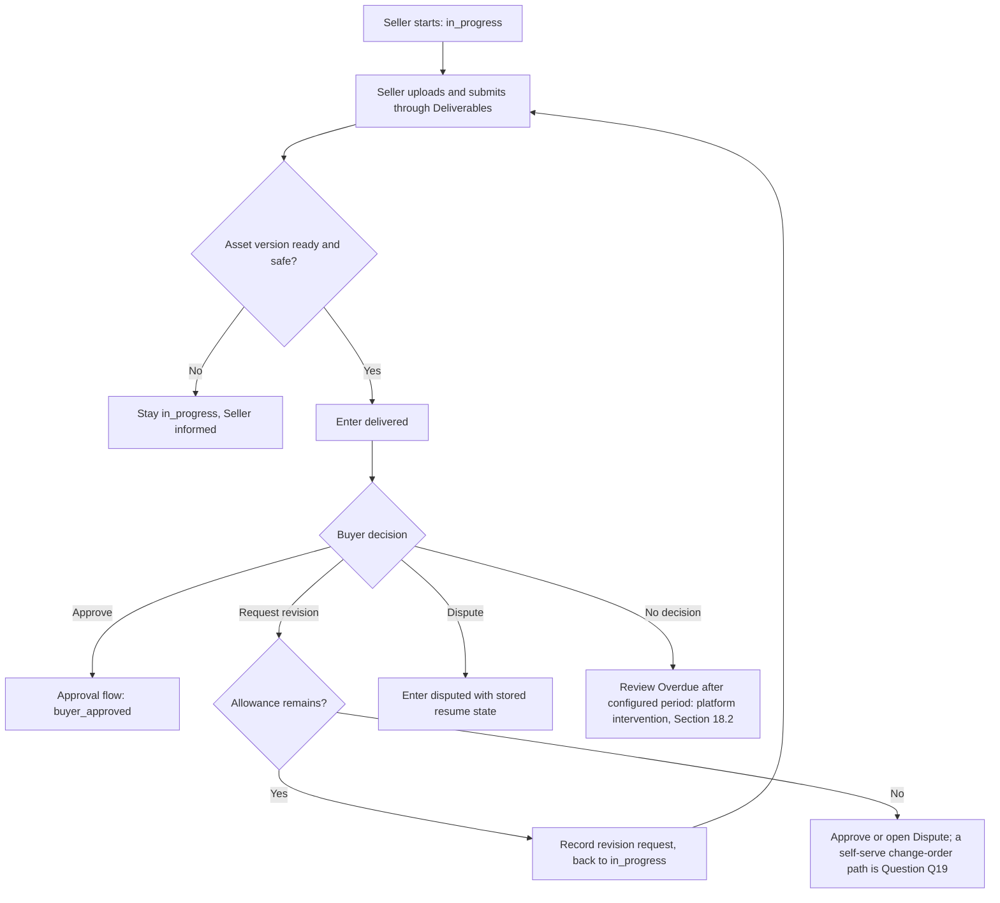

*Figure 6 — Deliverable and Revision Flow. Resubmission is a new immutable version; the allowance is this Milestone's own agreed `revision_allowance`, and Buyer silence leads to platform intervention (Section 18.2), never automatic approval.*

`REQ-PROJECTS-031`: Milestones MUST record every revision request as an immutable record bound to the exact submission version it answers, MUST enforce this Milestone's own agreed `revision_allowance`, and MUST NOT invent a revision limit, review timeout duration, or automatic-acceptance rule that product or operational policy has not set.

## 18. Buyer approval

### 18.1 Approval matrix

| Concern | Rule | Repository status |
| --- | --- | --- |
| Who may approve | Only the live Buyer participant of the Project. The Seller, a Collaborator, an Observer, a Moderator, and an Administrator cannot approve | Not Implemented |
| Eligibility | Milestone `delivered`; no interruption; no existing approval; Project not interrupted | Not Implemented |
| Required Deliverable state | The command names the submission version it approves, which must equal the latest ready version at commit. A stale version yields `409` so the Buyer never approves an older file | Not Implemented |
| Approval evidence | Immutable `milestone_approvals` record: Milestone, term version, submission reference, Buyer, timestamp, idempotency key, correlation ID | Not Implemented |
| Approval timestamp | `approved_at` from the database clock | Not Implemented |
| Finality | Approval is final for work acceptance. A later disagreement is a Dispute; the state is never reverted by command | Not Implemented |
| Accidental duplicate approval | One approval per Milestone by uniqueness; a repeat with the same key returns the original result; a different key returns `409` | Not Implemented |
| Concurrency | Lock Project then Milestone; approval races a revision request or a dispute on the same version and exactly one wins | Not Implemented |
| Post-approval disputes | Allowed while `buyer_approved` and before release settles, under Dispute-owner eligibility; the dispute holds release | Not Implemented |
| Escrow release signal | On commit, an outbox message states that this Milestone's allocation is approved for release. Escrow decides whether, when, and how much to release under its own payout, verification, and dispute rules | Not Implemented |
| Project aggregate impact | Projects derives its own Buyer Approved state from Milestone facts ([Projects Section 11.3](projects.md#113-project-transition-matrix)) | Not Implemented |
| Audit | `AUD-PROJECTS-010` | Not Implemented |
| Notification | Mandatory workflow notice to the Seller; Escrow receives the release signal as an event, not a notice | Not Implemented |

Approval never records or implies settlement. The Milestone stays in `buyer_approved` until Escrow reports settlement, which is the only path to `released`. Buyer approval alone must not authorize fund release: a release must also satisfy Escrow policy, dispute rules, and payout eligibility (`BR-AUTHZ-008`, see [Authorization Section 14.2](../02-users-roles-permissions/authorization.md#142-target-rules-vs-repository-verification), Release Funds).

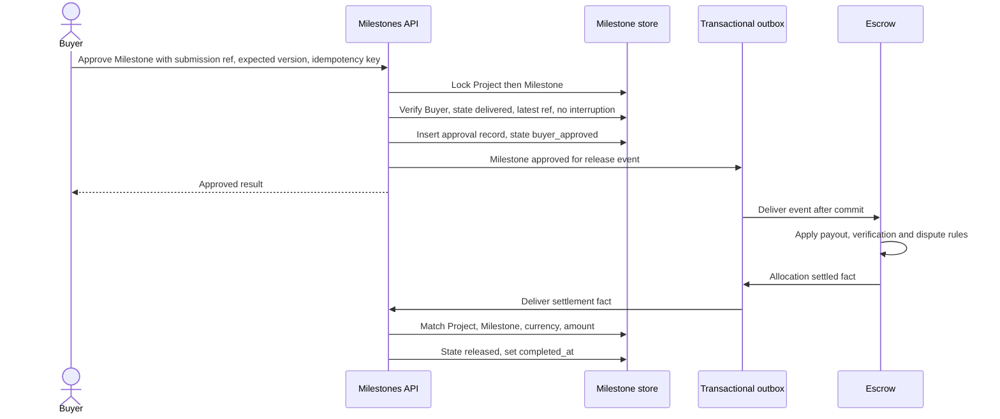

*Figure 7 — Approval and Release Flow. Approval emits a signal; only the verified Escrow settlement fact completes the Milestone.*

`REQ-PROJECTS-032`: Milestones MUST record Buyer approval as an immutable, version-bound, idempotent fact that emits a release signal to Escrow and MUST NOT settle, release, or claim payment.

### 18.2 Buyer non-response and platform intervention

A Buyer MUST NOT be able to block a Seller indefinitely by refusing to respond to a valid Deliverable Submission (Decision, 2026-09-25). Buyer silence is never modeled as Buyer approval. The canonical target flow is: the Seller submits a valid Submission; a review period begins; the Buyer approves or requests revision; if the Buyer does neither within the configured review period, the Milestone becomes Review Overdue (Section 11.3) and platform intervention begins; the platform attempts to contact the Buyer and obtain an explicit response; if the Buyer responds, normal Section 17/18.1 workflow resumes; if the Buyer remains non-responsive through the intervention process, the platform MAY authorize release of the Milestone's earned funds to the Seller. This authorization is never automatic approval, is never itself an Escrow release, and is never itself a Seller payout; those remain three further, separately owned facts (Section 19.1; [escrow.md Section 14](../06-payments-escrow/escrow.md#14-release); [payments.md Section 11](../06-payments-escrow/payments.md#11-payouts)).

#### 18.2.1 Non-response intervention matrix

| Concern | Rule | Repository status |
| --- | --- | --- |
| Review period start | `delivered_at` of the Current Submission (Section 16.1) | Not Implemented |
| Review period duration | Configurable operational policy, not a value this specification hard-codes (Question Q18) | Not Implemented |
| Review Overdue | Derived (Section 11.3): `delivered` and the review period has elapsed with no revision request or approval answering the Current Submission | Not Implemented |
| Intervention trigger | Automatic on the Review Overdue derivation; no participant action required | Not Implemented |
| Intervention actions | Configurable number of contact attempts, through configurable channels (Section 25.4 and [Notifications](../10-notifications/), once that specification exists); exact counts and channels are operational policy, not invented here (Question Q18) | Not Implemented |
| Buyer responds during intervention | Ordinary Section 17/18.1 workflow resumes; the intervention record closes as resolved; no non-response authorization is possible afterward for this Submission | Not Implemented |
| Non-response authorization eligibility | Milestone Review Overdue; every configured contact attempt exhausted; no interruption (`disputed` or `suspended`); no existing approval or non-response authorization for this Milestone; exact Current Submission reference named | Not Implemented |
| Non-response authorization actor | An explicit, governed System or Administrator capability (`milestone.authorize_non_response_release`), never the Buyer, the Seller, an ordinary Moderator action, or an unattended default; distinct from `project.delivery.approve` | Not Implemented |
| Non-response authorization evidence | Immutable `milestone_platform_release_authorizations` record (`DATA-PROJECTS-017`): Milestone, term version, submission reference, intervention case reference, contact-attempt count, authorizing actor, timestamp, idempotency key, correlation ID | Not Implemented |
| Relationship to Buyer approval | Never conflated. `milestone_approvals` (M07) and `milestone_platform_release_authorizations` (M18) are separate immutable records; both name the same Current Submission reference contract and both make the Milestone eligible for release, but only the former is a Buyer act | Not Implemented |
| Relationship to Escrow release | The non-response authorization MUST produce the identical release-eligibility fact type Escrow already consumes from an ordinary approval ([escrow.md Section 14.1](../06-payments-escrow/escrow.md#141-release-eligibility)); Escrow evaluates its own eligibility (funding, holds, payout gate) independently either way and never receives or infers Buyer intent | Not Implemented |
| Relationship to Seller payout | Unaffected; payout remains a separate, later Payments operation with its own gate ([payments.md Section 11](../06-payments-escrow/payments.md#11-payouts)) | Not Implemented |
| Relationship to Disputes | A verified Dispute opened before the non-response authorization is issued blocks it: Section 21's interruption rule applies, and `disputed`/`suspended` Milestones MUST reject the authorization command exactly as they reject M07 (`REQ-PROJECTS-035`) | Not Implemented |
| Idempotency | One non-response authorization per Milestone by uniqueness; a repeat with the same key returns the original result; a different key against an already-authorized Milestone is rejected | Not Implemented |
| Auditability | Every review-overdue transition, every contact attempt, and the final authorization outcome are recorded, distinctly from ordinary Buyer-approval audit entries | `AUD-PROJECTS-015` |
| Notification | Mandatory workflow notices to both parties at review-overdue, at each contact attempt, and at the authorization outcome | Not Implemented |

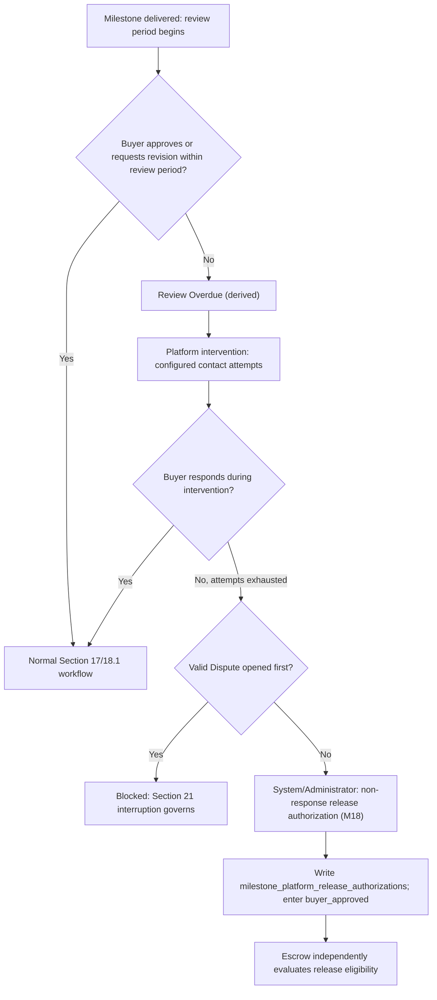

*Figure 7a — Buyer Non-Response and Platform Intervention Flow. Silence never becomes approval; only a distinct, audited platform authorization — blocked by an open Dispute — makes the Milestone eligible for Escrow's own independent release evaluation.*

`REQ-PROJECTS-061`: Milestones MUST NOT treat Buyer silence as approval; a `delivered` Milestone whose configured review period elapses without a Buyer decision MUST become Review Overdue and enter an auditable platform intervention process, and any resulting non-response release authorization MUST be recorded separately from Buyer approval, MUST be idempotent, MUST be restricted to an explicit governed System or Administrator capability, and MUST be rejected while the Milestone is `disputed` or `suspended`.

## 19. Milestone completion

### 19.1 Completion semantics

Approved, Released, and Completed are distinct. Approved is a Milestone-owned fact. Released is an Escrow-owned fact projected into the Milestone. Completed is a predicate over them.

| Term | Nature | Definition |
| --- | --- | --- |
| Milestone Approved | Milestone-owned state `buyer_approved` | Buyer accepted the exact submission (M07), or the platform issued a non-response release authorization after exhausted intervention (M18, Section 18.2); release requested either way |
| Milestone Released | Fact-derived state `released` | Escrow reports the allocation settled with funds released to the Seller |
| Milestone Completed | Predicate | True exactly when state is `released` |
| Work-accepted | Predicate | True when state is `buyer_approved` or `released` |
| Terminal outcome | Predicate | True when state is `released`, `refunded`, or `cancelled` |

Completion requires: Buyer approval, the Escrow settlement fact, and no active dispute or suspension. It does not require Ratings. It does not require Buyer approval alone, because release can lag approval for payout, verification, or dispute reasons that Escrow owns, and the Milestone must not claim payment that has not occurred. Ratings never substitute for work acceptance or release ([Projects Section 21](projects.md#21-ratings-and-reviews)).

A settlement that releases part of an allocation and refunds part (for example a Dispute split) is mapped by the fact: `released` if the allocation is fully settled and any amount was released to the Seller, `refunded` if fully settled with nothing released. This mapping is a default pending the Escrow and Disputes specifications (Question Q11); Milestones never computes the split.

### 19.2 Contribution to Project completion

Projects derives completion from converging facts ([Projects Section 11.1](projects.md#111-completion-rule)). Milestones contributes one input: every required Milestone in the active plan has a terminal outcome and, for Milestones with a non-zero allocation, that outcome is `released` or `refunded` rather than merely `buyer_approved`. Projects combines that with Escrow settlement, the absence of holds and pending amendments, and the Rating outcome. Milestones never sets Project state.

`REQ-PROJECTS-033`: Milestone completion MUST be the Escrow-verified `released` outcome following Buyer approval, MUST NOT depend on Ratings, and MUST be exposed to Projects as a fact rather than as a Project state write.

## 20. Milestone cancellation

Cancellation ends a Milestone under a scenario policy. It is distinct from deletion (removing an unfrozen draft row), amendment (changing terms), refund (an Escrow outcome), dispute resolution (a Dispute outcome), rejection (which is not a Milestone concept, only a revision request), and revision (continuing work).

### 20.1 Cancellation matrix

| Scenario | Actor and consent | Project amendment dependency | Financial and refund dependency | State outcome | Evidence and Asset retention | Audit and notification | Repository status |
| --- | --- | --- | --- | --- | --- | --- | --- |
| Draft Milestone (`terms_status = draft`) | Buyer removes it; no consent | None | None | Row deleted if unreferenced; otherwise superseded in a new working version | Audit retained; unbound Assets released to Assets policy | `AUD-PROJECTS-007`; none | Not Implemented |
| Planned or unfunded, agreed | Bilateral amendment | Required | None held | `cancelled`, superseded by the amendment | Snapshots retained | `AUD-PROJECTS-011`; mandatory to both | Not Implemented |
| Funded, not started | Mutual amendment or Dispute or administrative resolution | Required unless resolution directs | Escrow decides refund | `suspended` (`CANCELLATION_PENDING`), then `refunded` on the Escrow fact | Financial and legal retention | `AUD-PROJECTS-011`; mandatory; Escrow events audited | Not Implemented |
| Active (`in_progress`) | Mutual or Dispute resolution | Required unless resolution directs | Escrow decides release, refund, split | `suspended`, then `refunded` or `released` per Escrow fact | Work, messages, submissions, evidence preserved | `AUD-PROJECTS-011`; mandatory | Not Implemented |
| Submitted (`delivered`) | Approval, amendment, or Dispute; no unilateral cancel | Per outcome | Escrow freeze then outcome | Interruption, then outcome fact | Delivery and evidence hold | `AUD-PROJECTS-011`; mandatory and case-audited | Not Implemented |
| Revision open (`in_progress` with open request) | Same as Active | Same | Same | Same | Prior versions retained | Same | Not Implemented |
| Approved (`buyer_approved`) | No cancellation; only a Dispute | None | Escrow releases or holds | Stays until settlement or dispute outcome | Approval record retained | `AUD-PROJECTS-011` | Not Implemented |
| Released or completed | No cancellation | None | No reversal through Milestones | Unchanged | Full financial and audit retention | None | Not Implemented |
| Disputed | Dispute or Escrow resolver | Per resolution | Resolution directs Escrow | `cancelled`, `refunded`, `released`, or resume | Dispute hold dominates deletion | `AUD-PROJECTS-011`; mandatory | Not Implemented |

Cancellation commands carry `expected_version` and an idempotency key. If a financial outcome is required, the Milestone records a pending fact and holds in `suspended` until a verified Escrow result arrives. It never claims a refund from a client response ([Projects Section 16](projects.md#16-project-cancellation)).

`REQ-PROJECTS-034`: Milestone cancellation after agreement MUST occur only through an accepted Project amendment or a governed resolution, MUST preserve the row and evidence, and MUST wait for authoritative Escrow outcomes before recording refund or release.

## 21. Dispute relationship

A Dispute is owned by the Escrow and Disputes boundary described in Projects Section 4 and Section 27. This section states only what a Milestone requires from it.

### 21.1 Dispute matrix

| Concern | Milestone-level contract | Repository status |
| --- | --- | --- |
| Who may open | An active Buyer or accepted Seller through the Dispute owner's interface under `project.dispute.open`; Milestones never opens one | Not Implemented |
| Eligible lifecycle points | `funded`, `in_progress`, `delivered`, and `buyer_approved`. `planned` has no funds; terminal states are corrected only through Escrow processes | Not Implemented |
| Disputed amount and scope | The case names the Milestone and the allocation; the Milestone freezes only its own scope unless the Escrow policy raises a Project-wide interruption | Not Implemented |
| State interruption | Enter `disputed` and store the exact `resume_state` | Not Implemented |
| Work hold | While `disputed`, no start, submission-readiness, revision, or approval mutation is accepted | Not Implemented |
| Release hold | Milestones emits no release signal while disputed and rejects an outstanding approval race | Not Implemented |
| Evidence binding | Evidence is bound to the case through Assets' Dispute Evidence purpose whose owner is unresolved in Assets; Milestones supplies the Milestone reference and term version only | Not Implemented |
| Resume state | Restored only from the signed resolution naming a stored state, after all live facts are revalidated | Not Implemented |
| Resolution outcomes | `cancelled`, `refunded`, `released`, or resume, each entered only from the verified resolution or Escrow fact. Milestones does not decide remedies | Not Implemented |
| Audit | `AUD-PROJECTS-011` for open and resolve | Not Implemented |
| Notification | Mandatory safety and legal notices to both parties | Not Implemented |

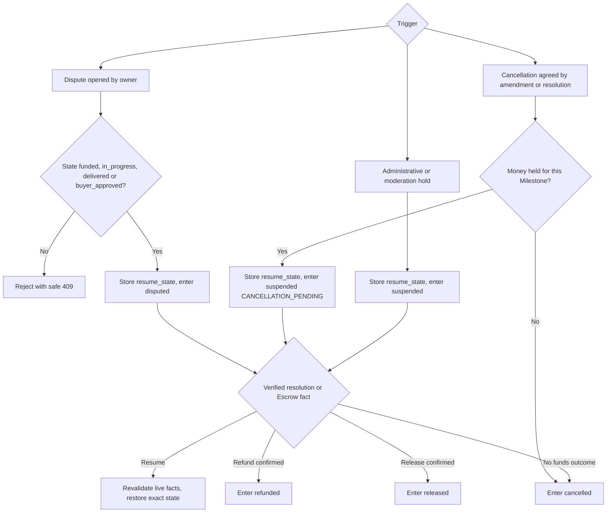

*Figure 8 — Cancellation and Dispute Flow. Every interruption stores a resume state and every exit requires a verified owner fact.*

`REQ-PROJECTS-035`: While a Milestone is `disputed` or `suspended`, Milestones MUST reject state-advancing commands, MUST emit no release signal, and MUST restore only a stored, revalidated state on a verified resolution.

## 22. Asset bindings

Milestones applies the canonical [Assets and Media specification](../03-identity-profiles-verification/assets-and-media.md). It creates no Milestone-owned binding table. It uses the Project Asset binding record `DATA-PROJECTS-007`, whose optional subject is a Milestone, which satisfies the explicit Milestone foreign-key requirement of [Assets Section 16.1](../03-identity-profiles-verification/assets-and-media.md#161-binding-rules). Bindings reference Asset versions, never permanent provider URLs, and removing a binding or Milestone never deletes bytes (`BR-ASSET-014` and `BR-ASSET-015`).

### 22.1 Milestone Asset binding matrix

| Purpose | Uploader and owner | Subject | Authorized readers | Version binding | Readiness | Retention and deletion | Revocation | Repository status |
| --- | --- | --- | --- | --- | --- | --- | --- | --- |
| Scope or reference attachment | Buyer; Assets owns the object | Milestone and term version | Buyer and Project participants as projection permits | Bound to a term version, immutable once frozen | Scan and processing complete | Uses Assets' Project Brief Attachment purpose; retained with accepted terms (reconciliation item R5) | Ends when the relationship ends; history retained | Not Implemented |
| Working file (in-progress, not submitted) | Seller | Milestone | Seller only until submitted | Not bound | Not applicable | No approved Assets purpose exists; falls under the deny-by-default Future Asset Purpose until Assets approves one (Question Q12) | Not applicable | Not Implemented |
| Deliverable | Accepted Seller; Assets owns the object | Milestone and submission version | Authorized participants and case actors | Immutable original; each version bound once | Malware, validation, and processing ready before `delivered` | Project Deliverable purpose; immutable; financial and dispute holds | Live relationship check on each read | Not Implemented |
| Revision | Accepted Seller | Prior submission lineage | Authorized participants and case actors | New version, never an overwrite | Same as Deliverable | Project Revision purpose; earlier versions retained | Same | Not Implemented |
| Dispute evidence | Authorized party or case actor | Dispute and Milestone | Dispute-policy audience only | Case-bound; not reusable outside the case | Scan, hash preserved | Assets' Dispute Evidence purpose; owner unresolved in Assets; legal and dispute hold dominates | Per case policy | Not Implemented |
| Approval evidence | System; no Asset of its own | Approval record | Buyer, Seller, case actors | The record stores the submission version reference | Not applicable | Retained with the approval record | Not applicable | Not Implemented |
| Exported Milestone record | System for the requesting party | Export request | Requester with current permission | Time-limited snapshot | Generated asynchronously and scanned | System-Generated Export purpose; short expiry unless evidence | Expires; no permanent link | Not Implemented |

`REQ-PROJECTS-036`: Milestone media MUST use purpose-bound Asset-version bindings through the Project binding record with a Milestone subject, MUST never store or expose permanent raw provider URLs, and MUST re-evaluate live authorization on every access.

## 23. Authorization model

Permission keys are proposed, traceable policy inputs, not claims that a Permissions specification or implementation exists. Keys already proposed by [Projects Section 13.1](projects.md#131-project-access-matrix) are reused; new keys use the `milestone.` prefix. Buyer and Seller are always the Project-derived relationships of Section 6.2.

### 23.1 Milestone authorization matrix

| Action | Proposed permission | Required relationship and state | Additional checks | Repository status |
| --- | --- | --- | --- | --- |
| Create Milestone | `project.milestone.create` | Buyer; plan unfrozen and Project pre-acceptance | Expected version, idempotency, rate limit, count cap | Partially Implemented: Buyer-authenticated `POST /projects` only |
| View Milestone | `milestone.read` | Buyer or accepted Seller; exact pending invitee sees only the frozen snapshot inside the invitation projection; case actors by purpose | Field projection per role; no existence oracle | Not Implemented: no Milestone read route |
| Edit proposed Milestone | `milestone.update_draft` | Buyer; `terms_status = draft` | Field allowlist, expected version | Not Implemented |
| Delete Draft Milestone | `milestone.delete_draft` | Buyer; `terms_status = draft`, unreferenced | Rejects bound, frozen, or Escrow-referenced rows | Not Implemented |
| Reorder Milestones | `milestone.reorder` | Buyer; `terms_status = draft` | Atomic renumber of the whole plan | Not Implemented |
| Lock (freeze) Milestones | `milestone.freeze` through the Projects offer | Buyer; Project Draft | Readiness and reconciliation | Partially Implemented: `POST /projects/:projectId/lock-milestones` is Buyer-only |
| Reopen frozen plan | `milestone.reopen` | Buyer; no accepted Seller | Depends on the Projects new-proposal-version operation (R8) | Not Implemented |
| Propose amendment | `project.propose_amendment` | Active Buyer or Seller | Milestone-level validation of Section 9.2 | Not Implemented |
| Accept amendment | `project.propose_amendment` decision by the counterparty | Counterparty only; exact hash | No funded, released, or disputed reduction | Not Implemented |
| Start work | `milestone.start` | Accepted Seller; Milestone `funded` | Activation predicate, no interruption | Not Implemented |
| Submit Deliverable | `project.delivery.submit` | Accepted Seller (or scoped collaborator); `in_progress` | Asset readiness; Milestone eligibility | Not Implemented |
| Request revision | `delivery.request_revision` | Buyer; `delivered` | Allowance, exact submission version | Not Implemented |
| Resubmit | `project.delivery.submit` | Accepted Seller; open revision | Asset readiness | Not Implemented |
| Approve | `project.delivery.approve` | Buyer; `delivered` | Exact submission version, no interruption | Not Implemented |
| Authorize non-response release | `milestone.authorize_non_response_release` | Explicit governed System or Administrator capability; never Buyer or Seller; `delivered` | Review Overdue; intervention exhausted; no interruption; no prior approval or authorization; exact submission version (Section 18.2) | Not Implemented |
| Cancel | `milestone.cancel` | Scenario actor of Section 20 | Amendment or resolution; Escrow fact | Not Implemented |
| Dispute | `project.dispute.open` | Active Buyer or Seller; eligible state | Dispute owner's eligibility | Not Implemented |
| View Assets | `project.asset.read` | Live Project relationship and purpose | Asset state and stricter purpose | Not Implemented |
| Moderate | `project.moderate` | Case-scoped Moderator | Purpose, minimum projection, access audit | Not Implemented |
| Administratively suspend | `project.suspend` or `milestone.suspend` | Explicit Administrator or System capability | Case, reason, audit; cannot alter terms or state otherwise | Not Implemented |
| Consume domain fact | Service capability | Trusted producer identity | Signed channel, event ID, version dedupe | Not Implemented |

Moderator and Administrator remain independent roles ([Authorization `BR-AUTHZ-034`](../02-users-roles-permissions/authorization.md#19-administration)). Neither may create, edit, approve, or cancel a Milestone as a party, and neither receives financial authority automatically.

### 23.2 Resource-loading order

Every Milestone interface applies this order, extending [Projects Section 13.2](projects.md#132-resource-loading-order):

1. Authenticate the credential and re-check live user or service status.
2. Resolve the Project's opaque external identifier in a query already scoped to the actor's relationship or case, without returning existence.
3. Resolve the Milestone's opaque external identifier only inside that Project scope. A bare Milestone identifier never authorizes anything and is never looked up without the Project join.
4. Validate Project interruption, Milestone state, `terms_status`, and action purpose.
5. Evaluate the proposed permission and the field projection for the actor's relationship.
6. Record sensitive access intent where required.
7. Lock the Project row, then the Milestone rows in ascending number, re-read versions and dependencies, and execute.
8. Return safe `401`, `403`, `404`, or `409` semantics with the same shape and timing class for absent and out-of-scope resources.

This follows [Authorization Sections 10.1, 22–23, 27.1, and 28](../02-users-roles-permissions/authorization.md#101-canonical-evaluation-order). It preserves the positive pattern of the one existing route, which returns an identical `404` for a missing Project and a non-Buyer ([Authorization Section 14.3](../02-users-roles-permissions/authorization.md#143-verified-positive-example--milestone-locking)).

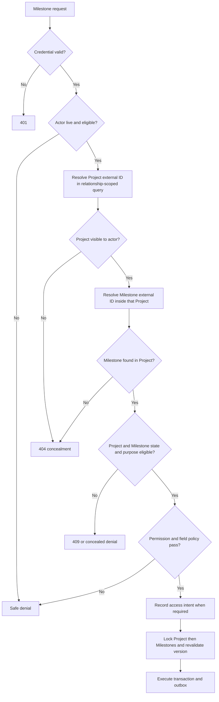

*Figure 9 — Milestone Access Evaluation. The Project scope is resolved before the Milestone, so a Milestone identifier alone never grants access.*

`REQ-PROJECTS-038`: Milestone interfaces MUST resolve Milestones only through relationship-scoped Project access with opaque identifiers, live authorization, and non-enumerating failures, and MUST NOT treat possession of a Milestone identifier as authorization.

## 24. Concurrency and idempotency

Every Milestone mutation includes `expected_version` (or `If-Match`) and runs against locked rows. A successful mutation increments the Milestone `version` exactly once. A stale request returns `409` with no side effect. The aggregate lock order is fixed to prevent deadlock: Project, then Milestones in ascending `milestone_no`, then the idempotency record, then the inbox record. This follows [Projects Section 24](projects.md#24-concurrency-and-idempotency).

| Concern | Rule |
| --- | --- |
| Version column | Monotonic bigint `version` on `project_milestones`; returned as the ETag |
| Optimistic concurrency | Compare `expected_version` under the row lock; reject on mismatch |
| Stale update rejection | `409` with the safe current version and state only if the actor may read them |
| Transaction boundary | One transaction covers validation, mutation, transition record, audit record, idempotency result, and outbox message. Network delivery follows commit |
| Idempotency keys | Scoped to actor or service, operation, Project, and Milestone; store a canonical request hash, status, and response reference. Same key and hash returns the original result; same key with a different hash is rejected |
| Duplicate submission | A duplicate Deliverable readiness fact for the same submission is acknowledged and changes nothing |
| Duplicate approval | One approval per Milestone by uniqueness; a repeat returns the original approval |
| Duplicate cancellation | Cancellation or resolution ID unique; a repeat returns the original outcome |
| Duplicate revision request | One open request per Milestone; a repeat with the same key returns it |
| Duplicate external facts | An inbox record with a unique `(consumer, event_id)`; duplicates are acknowledged, reordered facts are held until the source version arrives |
| Row locking | Financially sensitive commands (approval, funding fact, settlement fact, freeze, agree) lock the Project and Milestones in stable order before re-reading facts |
| Approval versus release, dispute, or revision | Serialized under the Milestone lock so exactly one wins; the loser receives `409` |
| Freeze versus edit or accept | Serialized under the Project lock; the deferred database sum check is the final guard |
| Retry-safe side effects | All external effects leave through the outbox; consumers deduplicate by event ID |
| Outbox and inbox | Future shared infrastructure; ownership and constraints are specified before implementation ([Projects Section 26](projects.md#26-target-data-model)) |

The repository lock route takes `SELECT ... FOR UPDATE` on the Project row inside a transaction, so concurrent locks are serialized and the second gets `409` "already locked" (`backend/Index.js:837-920`). That is a real, positive control. It does not cover Milestone-side operations or the trigger's own read of the lock column (Section 28.4).

`REQ-PROJECTS-039`: Every Milestone mutation MUST use optimistic version validation, operation idempotency, a stable lock order, and one atomic boundary for state, history, audit, and outbox records, and every external fact MUST be deduplicated by immutable event identifier.

## 25. Audit, events, and notifications

Audit records are append-only evidence, separate from mutable logs. Payload principles follow [Projects Section 25](projects.md#25-audit-events-and-operations). Each record identifies the event ID, type and version, Project and Milestone external references, actor type and opaque ID, effective relationship and capability, action, outcome and reason code, source and target state and version, term version, correlation, request, and idempotency IDs, UTC timestamp, and a redacted change-set hash. Records contain no revision text, scope text, legal names, tokens, raw Asset URLs, or payment credentials. Sensitive-data minimization applies to operational logs too.

### 25.1 Audit requirements

| Identifier | Requirement |
| --- | --- |
| `AUD-PROJECTS-007` | Record Milestone creation, update, reorder, and draft deletion, with field-level change hashes and the acting Buyer |
| `AUD-PROJECTS-008` | Record freeze, reopen, agreement, and amendment application, with term version, plan sum, currency, and snapshot hashes |
| `AUD-PROJECTS-009` | Record every consumed funding, funding-reversal, and allocation fact, including quarantined mismatches |
| `AUD-PROJECTS-010` | Record work start, Deliverable submission fact, revision request, resubmission fact, and Buyer approval, each with the exact submission reference |
| `AUD-PROJECTS-011` | Record Dispute open and resolve, release and refund facts, cancellation, and completion |
| `AUD-PROJECTS-012` | Record every Moderator access and every Administrator or System suspension or restoration with case, purpose, capability, and outcome |
| `AUD-PROJECTS-015` | Record every Review Overdue transition, every platform intervention contact attempt, and every non-response release authorization outcome, distinctly from ordinary Buyer-approval audit entries, with Milestone, submission reference, actor (System or Administrator), and timestamp |

### 25.2 Auditable event catalog

| Event | Producer and source | Audit identifier | Notification class | Repository status |
| --- | --- | --- | --- | --- |
| Milestone created | Buyer command | `AUD-PROJECTS-007` | None | Not Implemented |
| Milestone updated | Buyer command | `AUD-PROJECTS-007` | None while unfrozen | Not Implemented |
| Milestone reordered | Buyer command | `AUD-PROJECTS-007` | None while unfrozen | Not Implemented |
| Milestone locked (frozen or agreed) | Projects transition | `AUD-PROJECTS-008` | Mandatory to invitee or both parties | Partially Implemented: lock sets a timestamp only |
| Amendment applied | Projects amendment | `AUD-PROJECTS-008` | Mandatory contractual | Not Implemented |
| Milestone funded fact received | Escrow event | `AUD-PROJECTS-009` | Mandatory financial | Not Implemented |
| Work started | Seller command | `AUD-PROJECTS-010` | Mandatory workflow to Buyer | Not Implemented |
| Deliverable submitted | Deliverables fact | `AUD-PROJECTS-010` | Mandatory workflow to Buyer | Not Implemented |
| Revision requested | Buyer command | `AUD-PROJECTS-010` | Mandatory workflow to Seller | Not Implemented |
| Deliverable resubmitted | Deliverables fact | `AUD-PROJECTS-010` | Mandatory workflow to Buyer | Not Implemented |
| Buyer approved | Buyer command | `AUD-PROJECTS-010` | Mandatory workflow to Seller | Not Implemented |
| Milestone Review Overdue | Derived (clock) | `AUD-PROJECTS-015` | Mandatory workflow to both parties | Not Implemented |
| Platform intervention contact attempt | System | `AUD-PROJECTS-015` | Mandatory workflow to Buyer | Not Implemented |
| Platform non-response release authorized | System or Administrator command | `AUD-PROJECTS-015` | Mandatory workflow to both parties | Not Implemented |
| Dispute opened | Dispute fact | `AUD-PROJECTS-011` | Mandatory safety and legal | Not Implemented |
| Dispute resolved | Dispute fact | `AUD-PROJECTS-011` | Mandatory safety and legal | Not Implemented |
| Release fact received | Escrow event | `AUD-PROJECTS-011` | Mandatory financial | Not Implemented |
| Refund fact received | Escrow event | `AUD-PROJECTS-011` | Mandatory financial | Not Implemented |
| Milestone cancelled | Amendment or resolution | `AUD-PROJECTS-011` | Mandatory contractual | Not Implemented |
| Milestone completed | Derived from release fact | `AUD-PROJECTS-011` | Transactional receipt | Not Implemented |
| Moderator accessed | Moderator access | `AUD-PROJECTS-012` | None to parties by default | Not Implemented |
| Administrator suspended | Administrator or System | `AUD-PROJECTS-012` | As policy allows | Not Implemented |

### 25.3 Provisional events and operations

Governance defines no `EVT-*` or `OPS-*` family, so the following identifiers are provisional pending a Governance amendment.

| Provisional identifier | Event or requirement |
| --- | --- |
| `EVT-PROJECTS-008` | `MilestonePlanChanged`: Project and plan external IDs, transition (frozen, reopened, agreed), term version, plan-sum hash, aggregate versions |
| `EVT-PROJECTS-009` | `MilestoneStateChanged`: Project and Milestone IDs, source and target state, trigger and source fact ID, version |
| `EVT-PROJECTS-010` | `MilestoneApprovedForRelease`: Project and Milestone IDs, term version, submission reference, agreed amount, currency, approval ID. Escrow consumes it as a request, not a settlement |
| `EVT-PROJECTS-011` | `MilestoneRevisionChanged`: Milestone ID, cycle number, outcome, actor type |
| `EVT-PROJECTS-012` | `MilestoneTermsAmended`: amendment ID, old and new term versions, superseded and introduced Milestone IDs |
| `EVT-PROJECTS-013` | `MilestoneInterruptionChanged`: Milestone ID, reason, resume state reference, opened or cleared |
| `EVT-PROJECTS-019` | `MilestoneReviewOverdue`: Milestone ID, submission reference, `delivered_at`, configured review period |
| `EVT-PROJECTS-020` | `MilestonePlatformInterventionStarted`: Milestone ID, intervention case reference, configured contact-attempt plan |
| `EVT-PROJECTS-021` | `MilestonePlatformReleaseAuthorized`: Milestone ID, submission reference, intervention case reference, authorizing actor, authorization ID. Escrow consumes it exactly as `EVT-PROJECTS-010`, as a request, not a settlement |
| `OPS-PROJECTS-007` | Measure freeze, agree, and transition latency, success, safe conflicts, and denials by non-sensitive reason |
| `OPS-PROJECTS-008` | Alert on Milestones stalled in `funded` without start, `delivered` awaiting review, or `buyer_approved` awaiting settlement beyond configured ages |
| `OPS-PROJECTS-009` | Reconcile plan sums, currency, and agreed amounts against Project totals and Escrow allocations on schedule; alert without rewriting history |
| `OPS-PROJECTS-010` | Alert on quarantined facts, inbox gaps, dead letters, and version gaps |
| `OPS-PROJECTS-011` | Monitor overdue Milestones, revision counts, and interruption age |
| `OPS-PROJECTS-012` | Alert on repeated IDOR-like misses, approval or start rejection spikes, and privileged-access anomalies; test restore of Milestone history and audit |
| `OPS-PROJECTS-016` | Scheduled sweep that derives Review Overdue from `delivered_at` and the configured review period, and drives the platform intervention contact-attempt schedule |

### 25.4 Notification behavior

Notifications are durable requests created from the outbox and never part of the transactional outcome. Delivery failure never rolls back a committed transition. The mandatory versus configurable split follows [Projects Section 22](projects.md#22-messaging-and-notifications) and the Proposed [User Settings contract](../03-identity-profiles-verification/user-settings.md#11-notification-preferences).

| Notice | Class | Preference behavior |
| --- | --- | --- |
| Plan frozen, agreed, or amended | Mandatory contractual | Channel may vary; record cannot be disabled |
| Funded, refunded, released | Mandatory financial | Cannot suppress |
| Work started, submitted, revision requested, resubmitted, approved | Mandatory workflow | Channel may vary; action record cannot be suppressed |
| Review Overdue, intervention contact attempt, non-response release authorized | Mandatory workflow | Channel may vary; action record cannot be suppressed |
| Dispute opened or resolved; suspension | Mandatory safety and legal | Cannot suppress |
| Milestone due soon or overdue | Configurable reminder | Optional channel may be disabled |
| Milestone completed | Transactional receipt | Channel may vary |

`REQ-PROJECTS-040`: Every material Milestone action, fact, and privileged access MUST produce redacted immutable audit evidence and a retry-safe event, and every material outcome MUST create a durable notification request without making delivery part of the transaction.

## 26. Target data model

All primary keys are internal UUIDs. Every externally addressable record has a unique, opaque, immutable external identifier. Foreign keys to retained commercial relationships use `RESTRICT`. Milestones owns only records that are genuinely Milestone-owned; it creates no table for Escrow, Deliverable files, Disputes, Assets, or Notifications. Asset relationships use `DATA-PROJECTS-007`.

### 26.1 Target model matrix

| Identifier and model | Purpose and principal fields | Keys, uniqueness, and indexes | Checks and state | Versioning, lifecycle, and deletion | Repository status |
| --- | --- | --- | --- | --- | --- |
| `DATA-PROJECTS-008` `project_milestones` | Aggregate: `id`, `external_id`, `project_id`, `milestone_no`, `title`, `description`, `deliverable_definition`, `amount` BIGINT, `currency`, `currency_exponent`, `due_at`, `state`, `terms_status`, `current_term_version`, `introduced_in_term_version`, `superseded_in_term_version`, lifecycle timestamps, interruption fields, `created_by_user_id`, `version`, timestamps | PK `id`; unique `external_id`; FK `project_id` to Projects `RESTRICT`; unique `(project_id, milestone_no)` among active rows; partial unique index allowing at most one active row in `in_progress` or `delivered` per Project; indexes `(project_id, milestone_no)`, `(project_id, state)`, state and time | Positive amount; positive number; supported currency; `title` non-blank and bounded; `state` and `terms_status` enums; `resume_state` non-null exactly when `state` is `disputed` or `suspended`; terms-status trigger; deferred plan-sum and currency constraint | Monotonic `version`; frozen and agreed rows immutable in commercial columns; never hard-deleted after freeze; Draft rows deletable only when unreferenced | Partially Implemented |
| `DATA-PROJECTS-009` `milestone_term_versions` | Immutable commercial snapshot per Milestone per Project term version: Milestone, term version, kind (`proposal`, `agreed`, `amendment`), title, description, deliverable definition (including its embedded `submission_requirements` declaration), `revision_allowance`, amount, currency, exponent, due date, number, plan-sum hash, created time and actor | PK; unique `(milestone_id, term_version, kind)`; FK Milestone `RESTRICT`; index by Project term version | Append-only; positive amount; nonnegative `revision_allowance`; currency equals Project snapshot | No update or delete; retention aligned with the Project | Not Implemented |
| `DATA-PROJECTS-010` `milestone_state_transitions` | Append-only history: Milestone, source and target state, trigger type, actor or source fact ID, precondition version, outcome, reason code, term version, time | PK and unique event ID; FK `RESTRICT`; unique successful source fact; indexes `(milestone_id, time)`, target and time | Source and target are enum values; outcome enumerated | Append-only; retention aligned with financial and audit policy | Not Implemented |
| `DATA-PROJECTS-011` `milestone_audit_events` | Redacted immutable audit envelope for Milestone actions and privileged reads, per Section 25 | PK and unique external event ID; Milestone and Project references; indexes by Milestone and time, actor and time, correlation | Append-only database control | No ordinary update or delete. It may be a Milestone-scoped view of the shared audit store of `DATA-PROJECTS-006`; the physical layout is Question Q13 | Not Implemented |
| `DATA-PROJECTS-012` `milestone_revision_requests` | Revision cycle records: Milestone, cycle number, requesting Buyer, submission reference answered, reason code, restricted detail, status (`open`, `answered`, `withdrawn_by_dispute`), answering submission reference, times | PK and external ID; unique `(milestone_id, cycle_number)`; at most one `open` per Milestone by partial unique index; FK `RESTRICT` | Cycle number positive and sequential; status enum | Append-retained; detail text restricted | Not Implemented |
| `DATA-PROJECTS-013` `milestone_approvals` | Immutable approval evidence: Milestone, term version, approved submission reference, Buyer, time, idempotency key, correlation ID | PK and external ID; unique `milestone_id`; FK `RESTRICT` | Buyer must equal the Project Buyer participant at write | No update or delete | Not Implemented |
| `DATA-PROJECTS-017` `milestone_platform_release_authorizations` | Immutable non-response release authorization evidence, separate from `milestone_approvals`: Milestone, term version, authorized submission reference, intervention case reference, contact-attempt count, authorizing actor (System or Administrator), time, idempotency key, correlation ID (Section 18.2) | PK and external ID; unique `milestone_id`; FK `RESTRICT` | Authorizing actor MUST hold the explicit `milestone.authorize_non_response_release` capability, never Buyer or Seller, at write | No update or delete | Not Implemented |

The optional rebuildable financial projection, idempotency records, and inbox and outbox tables are shared infrastructure ([Projects Section 26](projects.md#26-target-data-model)) and are not Milestone-specific models.

### 26.2 Existing schema and migration implications

| Current object | Target treatment | Migration requirement |
| --- | --- | --- |
| `project_milestones.amount INT` | Widen to `BIGINT` | Confirm every stored value is INR minor units before asserting the unit; migrate in place with a range check |
| `project_milestones.currency TEXT` | Add supported-currency check and `currency_exponent` | Audit for any non-INR rows created before the INR stamp (historical rows may exist and are left as they are per the route comment); classify before enforcement |
| `project_milestones.state` enum | Add `suspended`; add transition service and history | `ALTER TYPE ... ADD VALUE`; backfill a first transition record per row |
| `project_milestones_project_fk ... ON DELETE CASCADE` | Change to `RESTRICT` | Replace before any Project or Milestone deletion capability ships |
| `escrow_allocations_milestone_fk ... ON DELETE CASCADE`; `payments.milestone_id` and `escrow_ledger.milestone_id ... ON DELETE SET NULL` | Restrictive behavior so financial lineage cannot be erased or detached | Coordinate with the Escrow specification |
| No `version`, `created_by_user_id`, `deliverable_definition`, `revision_allowance`, `terms_status`, timestamps | Add columns with backfill | Backfill `terms_status` from `projects.milestones_locked_at` (locked plans map to `frozen`, never to `agreed`, without consent evidence). Do not backfill `revision_allowance` by copying `projects.revision_limit` automatically; require explicit Buyer/Seller reconfirmation per Milestone at the next freeze (Section 33) |
| `projects.milestones_locked_at` and `protect_locked_milestones` | Keep during dual-run; move the guard to row-level `terms_status`; cover `project_id` always and `external_id` | Replace the trigger; retain the column as a compatibility projection until all readers change |
| No `updated_at` maintenance | Add a maintenance trigger | Backfill not required |

Existing locked plans must not be reinterpreted as agreed terms. A legacy lock recorded a Buyer's own freeze, and no Seller consent evidence exists ([Projects Section 33.2](projects.md#332-current-state-migration)).

`REQ-PROJECTS-041`: The target schema MUST represent Milestone identity, term snapshots, transition history, audit, revision cycles, and approval evidence — including non-response release authorization evidence, kept separate from ordinary Buyer-approval evidence — as separate append-retained records while preserving the Project aggregate relationship and restricting destructive deletion.

## 27. Domain dependencies, interfaces, and failures

### 27.1 Domain dependency matrix

| Domain | Milestones produces | Milestones consumes | Ownership boundary | Failure behavior | Repository status |
| --- | --- | --- | --- | --- | --- |
| Projects | Plan facts (frozen, agreed, terminal outcomes, approvals) and Milestone-derived aggregate inputs | Project state, participants, term versions, currency, interruption, amendment decisions | Projects owns Project state and relationships; Milestones owns line items ([Projects Section 18](projects.md#18-milestone-relationship)) | Reject commands when Project state is unreadable; never advance Project state | Partially Implemented: creation and lock inside Project routes |
| Authentication | Protected requests | Verified subject and live credential decision | Shared live-status middleware; gap in `SEC-AUTH-002` and `SEC-AUTH-003` | `401`; no resource existence | Partially Implemented: JWT verified; no live-status check on Project routes |
| Authorization | Resource and action context | Allow or deny, field projection, purpose policy | Authorization decides request; Milestones enforces lifecycle | Deny closed | Partially Implemented: one inline Buyer check |
| Users | Buyer and Seller references via Projects | Live account status, restriction and deletion | Users owns status | Deny on ineligible status | Partially Implemented |
| Verification | Payout context | Live payout eligibility fact | Payout gate is Verification-owned and Escrow-enforced ([Verification Section 25](../03-identity-profiles-verification/verification.md#25-verification-levels-and-capability-unlocking)) | Milestone stays `buyer_approved` while Escrow withholds | Not Implemented |
| Assets | Binding intent and Milestone subject | Version readiness, safety, retention result | Assets owns bytes and lifecycle | Fail closed; never mark `delivered` | Not Implemented |
| Deliverables | Eligibility answer; term version; readers | Submission, version, readiness facts | Separate capability; ownership unsettled (R4, Question Q7) | Stay `in_progress` | Not Implemented |
| Escrow | Release signal (from ordinary approval or platform non-response authorization, Section 18.2, as one shared release-eligibility fact type); agreed amount, currency, term version | Funding, allocation, release, refund, reversal facts | Sole financial authority; Escrow does not evaluate Buyer responsiveness itself | Never invent a positive fact; hold and alert | Schema Implemented |
| Payments | None directly | Only through Escrow facts | Under the current Foundation map payments sit inside Escrow; a split needs a Foundation change or ADR | Same as Escrow | Schema Implemented |
| Disputes | Milestone reference; term version; evidence references | Open, freeze, resolution facts | Foundation assigns disputes in part to Escrow; a split needs a Foundation change or ADR | Hold until resolution | Not Implemented |
| Messaging | Milestone system events | None for state | Messaging owns content | Never blocks state | Not Implemented |
| Notifications | Durable notification requests | Delivery outcome for operations only | Delivery never creates or rolls back Milestone truth | Outbox retry and alert | Not Implemented |
| Ratings | Terminal-outcome facts as Projects input | None for Milestone state | Ratings never gates approval or release | No coupling | Not Implemented |

### 27.2 Interface requirements

All interfaces use opaque external IDs, authenticated subjects, explicit request schemas, expected versions for mutation, idempotency where noted, UTC timestamps, integer money, least-data responses, correlation IDs, and safe failures. This catalog describes logical contracts, not implemented endpoints; a future API specification should map them to HTTP or event transport without colliding with Governance's existing `API-PROJECTS-003` example, which the current lock route resembles.

| Identifier | Logical interface | Core contract | Target failure semantics | Repository status |
| --- | --- | --- | --- | --- |
| `INT-PROJECTS-016` | Create or update Draft Milestone | Buyer, field allowlist, expected version, idempotency | `409` stale or state; `422` invalid; `429` rate | Partially Implemented: creation inside `POST /projects` |
| `INT-PROJECTS-017` | Read or list Milestones | Relationship-scoped through Project; role-specific projection; cursor pagination | Concealed `404` | Not Implemented |
| `INT-PROJECTS-018` | Reorder or delete Draft Milestone | Buyer, `terms_status = draft`, atomic plan renumber | `409` if frozen, bound, or referenced | Not Implemented |
| `INT-PROJECTS-019` | Freeze, reopen, and agree plan | Invoked by the Projects offer, reopen, and acceptance operations; readiness report; expected versions | `409` stale; `422` readiness | Partially Implemented: Buyer lock route |
| `INT-PROJECTS-020` | Start Milestone | Accepted Seller; activation predicate | `409` invalid transition or predecessor | Not Implemented |
| `INT-PROJECTS-021` | Request revision or approve | Buyer; exact submission reference; expected version | `409` stale reference; repeat returns result | Not Implemented |
| `INT-PROJECTS-022` | Consume Escrow, Deliverables, and Dispute facts | Trusted producer; signed channel; event and version dedupe | Acknowledge duplicate; quarantine mismatch | Not Implemented |
| `INT-PROJECTS-023` | Validate Milestone amendment | Projects calls with a typed change; returns pass or reasons | `409` funded or disputed reduction; `422` invalid | Not Implemented |
| `INT-PROJECTS-024` | Cancel or resolve Milestone | Amendment or resolution reference; expected version | `409` state; pending until Escrow fact | Not Implemented |
| `INT-PROJECTS-025` | Milestone eligibility facts | Read-only answer to Deliverables and Escrow: state, terms status, term version, amount, currency, interruption | Never leaks other relationships | Not Implemented |
| `INT-PROJECTS-026` | Moderator or Administrator access and action | Case, purpose, permission, minimum projection | Deny without purpose; audit outcome | Not Implemented |
| `INT-PROJECTS-035` | Platform non-response release authorization | Explicit System or Administrator capability; Review Overdue and exhausted intervention precondition; expected version, idempotency | `409` if not Review Overdue, already authorized, or interrupted | Not Implemented |

### 27.3 Failure and consistency rules

Failure semantics follow [Projects Section 27.3](projects.md#273-failure-and-consistency-rules). Two Milestone-specific rules apply. A dependency that is unavailable yields `503` or an accepted pending status and never an invented funded, delivered, or released fact. A fact that fails identity, Project, Milestone, term-version, currency, or amount matching is quarantined and alerted and never partially applied.

`REQ-PROJECTS-042`: Milestones MUST expose transport-neutral contracts with safe failures, explicit projections, cursor pagination, and no client authority over identity, state, or financial outcome.

## 28. Verified repository comparison

The comparison below was verified against the repository on 2026-09-20. It separates executable behavior from schema presence and from target product rules.

### 28.1 Review method

The tracked repository contains `backend/` (one application module `Index.js`, `package.json`, `.env.example`, and `db/` with eight SQL migrations plus `db.js` and `migrate.js`), `frontend/` (React and Vite with `src/App.tsx` and `src/api/api.js`), `docker-compose.yml`, `README.md`, and `docs/`. The directories named in the task as `middleware/`, `routes/`, `services/`, `projects/`, `milestones/`, `escrow/`, `users/`, `profiles/`, `authentication/`, `authorization/`, `assets/`, `shared/`, and `tests/` do not exist. Searching all tracked non-documentation files for the task's terms found Milestone content only in migrations `006` and `008`, in `backend/Index.js`, and in `frontend/src/App.tsx` and `App.css`. `backend/Index.js` has exactly two SQL statements against `project_milestones`: an `INSERT` in the `POST /projects` creation loop and one `SELECT` in the lock route. No `UPDATE` or `DELETE` of `project_milestones` exists in application code. The words deliverable, dispute, approval, release, refund, and allocation appear in `Index.js` only as a `client.release()` connection call and a comment saying locking "does not touch escrow". Docker Compose runs PostgreSQL 16 only.

### 28.2 Current schema

[`backend/db/006_create_escrow_system.sql`](../../backend/db/006_create_escrow_system.sql) creates `project_milestones` with these columns:

| Column | Current definition | Current constraint or default |
| --- | --- | --- |
| `id` | UUID | PK, `gen_random_uuid()` |
| `external_id` | TEXT | NOT NULL, UNIQUE |
| `project_id` | UUID | NOT NULL; FK `project_milestones_project_fk` to `projects(id)` `ON DELETE CASCADE` |
| `milestone_no` | INT | NOT NULL; CHECK `project_milestones_no_positive` (`milestone_no > 0`) |
| `title` | TEXT | NOT NULL; no blank or length check |
| `description` | TEXT | Nullable |
| `amount` | INT | NOT NULL; CHECK `project_milestones_amount_positive` (`amount > 0`) |
| `currency` | TEXT | NOT NULL; no value restriction |
| `due_at` | TIMESTAMPTZ | Nullable |
| `state` | `milestone_state` | NOT NULL, default `planned`; enum membership |
| `created_at` | TIMESTAMPTZ | NOT NULL, default `now()` |
| `updated_at` | TIMESTAMPTZ | NOT NULL, default `now()`; no maintenance trigger |

The migration also defines UNIQUE `project_milestones_unique_no_per_project` on `(project_id, milestone_no)` and two indexes, `project_milestones_project_no_idx` on `(project_id, milestone_no)` and `project_milestones_project_state_idx` on `(project_id, state)`. There is no `milestone_number` column; the physical name is `milestone_no`. There are no `scope`, `starts_at`, `activated_at`, `funded_at`, `started_at`, `submitted_at`, `delivered_at`, `approved_at`, `completed_at`, `cancelled_at`, `disputed_at`, `refunded_at`, `version`, or `created_by_user_id` columns.

Money is a 32-bit `INT` in `amount`, with the currency in a separate unrestricted `TEXT` column. The migration carries no unit annotation. The frontend type comment describes the value as "integer minor units in `currency`, e.g. paise for INR, cents for USD" (`App.tsx`), and the API stamps `INR` (reconciliation item R7). No backend validation, constraint, or test confirms the unit, which [Product Overview Section 18](../01-foundation/product-overview.md#18-assumptions) treats as an assumption. This specification resolves the target unit as integer minor units with an exponent snapshot (Section 9).

Related tables in the same migration reference Milestones: `escrow_allocations.milestone_id UUID NOT NULL UNIQUE` with `ON DELETE CASCADE`, `payments.milestone_id` and `escrow_ledger.milestone_id` with `ON DELETE SET NULL`. `escrow_allocations` holds `allocated_amount`, `released_amount`, `refunded_amount`, and `currency`, and a CHECK `escrow_allocations_totals_within_allocated` requires released plus refunded not to exceed allocated. Nothing ties `allocated_amount` or `currency` to the Milestone's `amount` or `currency`.

### 28.3 Current state model

Section 11.1 lists the enum. States are a PostgreSQL enum, not a CHECK and not unconstrained text. Nothing in the migrations or the application restricts transitions, and no trigger fires on `state`. Only `planned` is written. The `escrow_status`, `payment_status`, `payment_type`, and `ledger_entry_type` enums are separate types with no link to `milestone_state`.

### 28.4 Locking implementation

[`backend/db/008_add_milestone_locking.sql`](../../backend/db/008_add_milestone_locking.sql) adds nullable `projects.milestones_locked_at` with CHECK `projects_milestones_locked_at_after_created`, defines function `protect_locked_milestones()`, and creates trigger `project_milestones_lock_protection` as `BEFORE INSERT OR UPDATE OR DELETE ... FOR EACH ROW` on `project_milestones`. Reading the SQL, the trigger does the following.

- **Insert and delete:** looks up the Project's `milestones_locked_at` (by `NEW.project_id` or `OLD.project_id`) and raises "Project milestones are locked and cannot be changed" if it is not null.
- **Update:** looks up the lock through `OLD.project_id` and, when locked, raises if any of `project_id`, `milestone_no`, `title`, `description`, `amount`, `currency`, or `due_at` is `IS DISTINCT FROM` its old value.
- **Not protected:** `id`, `external_id`, `created_at`, `updated_at`, and `state`. The migration comment states the intent that `state` and `updated_at` stay updatable so the lifecycle can progress.
- **Guard source:** the lock lives in a nullable Project column. Nothing prevents setting it to null (no trigger on `projects`), and nothing enforces the readiness checks when it is set directly in SQL. The route is the only place those checks exist.

Three consequences follow from reading the trigger. These are analysis and were not executed because no PostgreSQL client was available.

- An `UPDATE` that changes `project_id` from an unlocked Project to a locked one is evaluated only against the old Project, so it is allowed (already noted in `SEC-PROJECTS-007`).
- A Project deletion cascades to `project_milestones`. Because the cascade runs after the parent row is removed, the trigger's lookup would likely find no Project row and return null, so the lock check may not fire. This must be verified by test before being relied on (`SEC-PROJECTS-023`).
- `external_id` can change on a locked Milestone because it is not in the compared list (`SEC-PROJECTS-022`).

So `BR-PROJECTS-002` in Governance's meaning is Partially Implemented: enforced by the trigger for seven columns and insert and delete while the Project lock is set, and not enforced for the other columns, for reversal of the lock, or for cascade deletion. The `milestones_locked_at` column is set only by the lock route.

### 28.5 Executable interfaces

All Milestone-touching routes are in [`backend/Index.js`](../../backend/Index.js). Milestones has no route of its own.

- **Creation:** `POST /projects` (lines 611–771) is `requireAuth`. `validateMilestonesInput` (lines 527–594) requires a non-empty array of objects with a non-empty string `title`, an optional string `description`, an integer `amount` from 1 to 2,147,483,647, and an optional parseable `due_at`. It computes the sum and rejects a mismatch with `price_amount`. In one transaction it inserts the Project and then each Milestone with `milestone_no = i + 1`, currency `INR`, a generated `mls_` external ID, and the default `planned` state. The body parser is `express.json()` with no explicit options, no array-length cap, and no rate limiting.
- **Update and delete:** none.
- **Lock:** `POST /projects/:projectId/lock-milestones` (lines 837–920) is `requireAuth` and takes the internal Project UUID. In a transaction it locks the Project row with `FOR UPDATE`, returns an identical `404` for a missing Project and for a non-Buyer, then rejects an already locked Project (`409`), a non-Draft Project, zero Milestones, any Milestone not `planned`, any currency different from the Project's, and a sum different from `price_amount` (all `400`). It then sets `milestones_locked_at = now()` and `updated_at = now()` on the Project. It returns the Project and the Milestones it read before the update.
- **Read:** there is no Milestone read route. `GET /projects` returns Projects only. The lock response is the only response that returns Milestones after creation.
- **State transitions:** none.
- **Authentication and authorization:** JWT verification via `requireAuth` on both routes; the Buyer check exists only in the lock route. There is no Milestone-level permission model. Live account status is not re-checked (`SEC-PROJECTS-002`).

### 28.6 Frontend and tests

[`frontend/src/App.tsx`](../../frontend/src/App.tsx) declares `MilestoneState` (nine values) and `ProjectMilestone`, builds Milestone rows in the create-project form with paise-based amount parsing and a remaining-amount indicator, renders the Milestone list (number, title, state badge, description, amount, due date) in the Milestones section of the Project detail screen when Milestones are present, and renders a Buyer-only lock section with a confirmation step that calls the lock route. A Project chosen from `GET /projects` has its Milestones forced to `null`, so its detail shows "Milestone details will load in the next project stage" and cannot be locked from the list (already noted in [Projects Section 28.4](projects.md#284-current-frontend-and-tests)). The locked panel says the terms "are fixed and ready for escrow funding", although no funding route exists. There is no Milestone edit, reorder, delete, start, submit, revision, approval, cancel, or dispute workflow. `frontend/src/api/api.js` provides bearer `GET` and `POST` only.

No tracked automated test file exists. The backend `test` script deliberately exits with an error and the frontend has no test script. Nothing tests the trigger, the lock route, or the Milestone validation.

### 28.7 Repository Milestone matrix

| Capability | Verified artifact or behavior | Gap against target | Status |
| --- | --- | --- | --- |
| Milestone table exists | `project_milestones`, migration 006 | Missing target columns and records | Partially Implemented |
| Columns | Twelve columns listed in Section 28.2 | Lacks deliverable definition, version, creator, lifecycle timestamps, terms status | Partially Implemented |
| States | Enum of nine values | No `suspended`; no transition graph or service | Schema Implemented |
| State representation | `milestone_state` enum, not CHECK or text | Membership enforced only | Schema Implemented |
| Number column | `milestone_no INT` with positive CHECK | Name differs from `milestone_number`; density unenforced | Implemented |
| Numbering unique per Project | `project_milestones_unique_no_per_project` | Not scoped to active rows; no reorder mechanism | Implemented |
| Amount positive | `project_milestones_amount_positive` | None for positivity | Implemented |
| Money representation | 32-bit `INT`; unit not confirmed by any backend evidence | Target 64-bit minor units with exponent | Partially Implemented |
| Currency on Milestone | `currency TEXT`, unrestricted | No registry, exponent, or CHECK | Partially Implemented |
| Currency equals Project | Route stamps `INR` at creation and compares at lock | No database constraint | Partially Implemented |
| Sum equals Project total | Checked at creation and at lock in the route | No database constraint; Project price unprotected after lock | Partially Implemented |
| When Milestones are created | Only inside `POST /projects` | No standalone create | Partially Implemented |
| Editing | No route; database permits edits while Project unlocked | No versioned edit service | Not Implemented |
| Deletion | No route; database permits delete while unlocked, and Project delete cascades | Destructive cascade | Not Implemented |
| Immutability after lock | Trigger on seven columns plus insert and delete | Gaps in Section 28.4 | Partially Implemented |
| `milestones_locked_at` | Nullable Project column set by the lock route | Clearable; row-level flag absent | Partially Implemented |
| `protect_locked_milestones` | Row trigger as analyzed | Excludes `external_id`, `state`, moves into a locked Project, cascade | Partially Implemented |
| Operational fields after lock | `state` and `updated_at` unrestricted | No transition guard | Schema Implemented |
| Seller consent to Milestone terms | None; Seller is a required Project FK with no consent | Consent model is Projects-owned and absent | Not Implemented |
| Amendments | None; locked terms strictly immutable | No amendment path | Not Implemented |
| Deliverables | None | No model, route, or Asset binding | Not Implemented |
| Revisions | Only `projects.revision_limit`, never read | No cycle records | Schema Implemented |
| Escrow allocation binding | `escrow_allocations.milestone_id UNIQUE` | No amount or currency equality; no route | Schema Implemented |
| Release and refund values | On `escrow_allocations` only | Not on Milestone (correct); no behavior | Schema Implemented |
| Milestone disputes | `disputed` enum value only | No dispute model | Schema Implemented |
| Transitions server-controlled | Only `planned` is ever written by the server | No service; database allows arbitrary writes | Not Implemented |
| Transition authorization | Buyer check on lock route only | No Milestone permission model | Partially Implemented |
| Automated tests | None | All | Not Implemented |
| Frontend | Create rows, list, and Buyer lock UI | No lifecycle UI; list-selected Project cannot load Milestones | Partially Implemented |

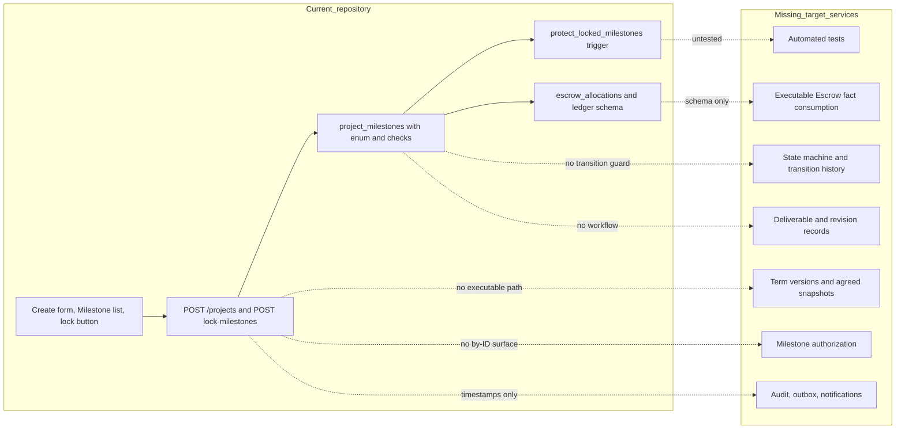

*Figure 10 — Repository Comparison. The current slice creates and locks Draft Milestones, while terms versions, lifecycle, authorization, integrations, audit, and tests are absent.*

## 29. Security findings

### 29.1 Security findings table

Findings continue the `SEC-PROJECTS-*` family from `SEC-PROJECTS-021`. Existing Projects findings are cross-referenced and not redefined.

| Finding | Severity | Verified condition or target threat | Impact | Required treatment | Disposition |
| --- | --- | --- | --- | --- | --- |
| `SEC-PROJECTS-021` Unconstrained Milestone state writes | High | The database allows any writer to set `state` to any enum value at any time, including on locked Milestones, and no trigger or constraint checks transitions (Section 28.3) | A future route or script could mark work `released` without funding, delivery, or approval | State-transition trigger or service, history, and rejection of client-chosen state | Open |
| `SEC-PROJECTS-022` Locked-Milestone identity and move gaps | High | The trigger omits `external_id`, `id`, and `created_at`, and evaluates a `project_id` change only against the old Project (Section 28.4). Extends `SEC-PROJECTS-007` | A locked Milestone's public identifier can change; a row can be moved into a locked plan | Row-level immutable identity columns; lock indicator on the Milestone row | Open |
| `SEC-PROJECTS-023` Cascade delete may bypass lock protection | High | Analysis of SQL semantics, not executed: after a Project delete the cascaded row delete sees no Project row and the lock check may pass. Extends `SEC-PROJECTS-006` | Locked, possibly financially referenced Milestones and allocations destroyed | `RESTRICT` foreign keys, archive instead of delete, and a test that proves or disproves the behavior | Open |
| `SEC-PROJECTS-024` Milestone and Escrow allocation inconsistency | Critical | Nothing requires `allocated_amount` or `currency` to equal the Milestone's, and Milestone deletion cascades to allocations while Payments and ledger references become null. Extends `SEC-PROJECTS-003` and `SEC-PROJECTS-009` | Funds allocated in a different amount or currency than agreed; lost lineage | Allocation equals agreed snapshot; `RESTRICT`; reconciliation | Open |
| `SEC-PROJECTS-025` No database reconciliation of plan total | High | Sum equality with `projects.price_amount` is checked only in route code at creation and lock, and Project price is not protected after lock | Total drift through another path | Deferred constraint on plan sum and currency; term-version snapshots | Open |
| `SEC-PROJECTS-026` Narrow amount range | Medium | `amount` and Project price are 32-bit, capping a Project at 2,147,483,647 minor units, and the frontend rejects larger values | Legitimate large contracts fail; overflow handling becomes a business limit; unit unconfirmed | 64-bit minor units with exponent; confirmed unit | Open |
| `SEC-PROJECTS-027` No Milestone authorization surface | High | Milestones has no route or permission model; existing routes accept internal UUIDs. This is a latent target threat, not a present bypass | Future Milestone routes may authorize by identifier or omit relationship scoping. Complements `SEC-PROJECTS-020` | Project-scoped resolution, opaque IDs, live relationship checks (Section 23) | Open |
| `SEC-PROJECTS-028` No version or maintained `updated_at` | Medium | No `version` column; `updated_at` is never maintained by a trigger or by any Milestone write | Lost updates and unreliable change ordering | Version column, expected-version writes, maintenance trigger | Open |
| `SEC-PROJECTS-029` No Milestone history or audit | High | The lock records only a Project timestamp; no transition or audit record exists. Extends `SEC-PROJECTS-014` | No evidence of who froze, changed, approved, or cancelled | Append-only transition and audit records | Open |
| `SEC-PROJECTS-030` Approval, release, and dispute races | High | Latent target threat: no approval, release, or dispute exists yet, and the schema has no guard against approving a stale submission or releasing during a dispute. Extends `SEC-PROJECTS-009` | Double approval, release during a dispute, approval of a replaced file | Exact submission reference, unique approval, serialized locks, interruption hold | Open |
| `SEC-PROJECTS-031` Unbounded Milestone input and no rate limits | Medium | `milestones` has no length cap beyond the framework's default body-size limit and there is no rate limiting on `POST /projects` | Abuse and write amplification within the request transaction | Count cap, size limit, per-user and per-Project rate limits | Open |
| `SEC-PROJECTS-032` No automated Milestone coverage | High | No test covers the trigger, lock route, or validation. Extends `SEC-PROJECTS-019` | Regressions in immutability, reconciliation, and state rules go unseen | Trigger, migration, property, concurrency, and end-to-end suites | Open |
| `SEC-PROJECTS-046` No capability separation between Buyer approval and platform non-response authorization | Critical | Latent target threat: no route or capability model exists yet, and a naive implementation could let an ordinary Administrator or Moderator action, or an unattended default, silently mark a Milestone `buyer_approved` | An unauthorized or accidental actor could authorize release without a genuine exhausted-intervention fact, or without ever distinguishing it from a real Buyer approval in audit history | Explicit governed `milestone.authorize_non_response_release` capability, distinct record (`DATA-PROJECTS-017`), and distinct audit trail (`AUD-PROJECTS-015`) of Section 18.2 | Open |
| `SEC-PROJECTS-047` No per-Milestone revision-allowance enforcement | High | Latent target threat: no route enforces any revision allowance today, and the only stored value (`projects.revision_limit`) is Project-level and unread by any route | A Buyer could demand unbounded revisions absent enforcement, or a migration could silently apply the wrong (Project-level) allowance to every Milestone | Per-Milestone `revision_allowance` term (Section 9.2), enforced at Section 17's revision-request command | Open |

"Open" in this table is a finding disposition, not an implementation-status label. Positive controls that exist are the row lock and concealed `404` in the lock route, the positive-amount and positive-number checks, the per-Project number uniqueness, the server-side `INR` stamp, and the trigger's protection of seven commercial columns.

### 29.2 Threat coverage

| Assessed threat | Covered by |
| --- | --- |
| Unauthorized Milestone access and IDOR | `SEC-PROJECTS-027`; `SEC-PROJECTS-020` |
| Buyer and Seller relationship bypass | `SEC-PROJECTS-027`; `SEC-PROJECTS-001`; `SEC-PROJECTS-016` |
| Client-controlled state | `SEC-PROJECTS-021`; `SEC-PROJECTS-018` |
| Unauthorized commercial edits and locked-term mutation | `SEC-PROJECTS-022`; `SEC-PROJECTS-004`; `SEC-PROJECTS-007` |
| Race conditions during locking | `SEC-PROJECTS-007`; `SEC-PROJECTS-022` |
| Amount tampering and Project or Milestone total drift | `SEC-PROJECTS-025`; `SEC-PROJECTS-024` |
| Currency mismatch | `SEC-PROJECTS-024`; `SEC-PROJECTS-003` |
| Unauthorized Deliverable access and confidential attachment exposure | `SEC-PROJECTS-008`; `SEC-PROJECTS-012` |
| Duplicate approval or cancellation | `SEC-PROJECTS-030`; `SEC-PROJECTS-005` |
| Stale updates | `SEC-PROJECTS-028`; `SEC-PROJECTS-013` |
| Dispute and release race | `SEC-PROJECTS-030` |
| Deletion of retained financial evidence | `SEC-PROJECTS-023`; `SEC-PROJECTS-006` |
| Missing rate limits | `SEC-PROJECTS-031` |
| Missing audit | `SEC-PROJECTS-029`; `SEC-PROJECTS-014` |
| Missing tests | `SEC-PROJECTS-032`; `SEC-PROJECTS-019` |
| Buyer-silence exploitation / indefinite fund lock | `SEC-PROJECTS-046` |
| Privilege confusion between Buyer approval and platform authorization | `SEC-PROJECTS-046` |
| Unbounded or misapplied revision demands | `SEC-PROJECTS-047` |

Cross-domain findings that also apply are Authentication `SEC-AUTH-002` and `SEC-AUTH-003`, Authorization `SEC-AUTHZ-004`, `SEC-AUTHZ-005`, and `SEC-AUTHZ-007`, and Assets `SEC-ASSET-003`, `SEC-ASSET-006`, `SEC-ASSET-008`, `SEC-ASSET-014`, and `SEC-ASSET-015`. They are referenced, not redefined.

## 30. Implementation status

### 30.1 Implementation status matrix

| Target area | Status | Evidence | Next contract boundary |
| --- | --- | --- | --- |
| Milestone identity and Project foreign key | Partially Implemented | UUID and external ID; FK with cascade | `RESTRICT`; opaque-ID lookup |
| Numbering | Implemented | Positive CHECK and per-Project UNIQUE | Active-row scope; reorder |
| Milestone creation | Partially Implemented | Inside `POST /projects`, `planned` | Standalone Buyer commands; zero-plus Draft |
| Milestone read | Not Implemented | No route | Project-scoped read and projection |
| Milestone edit and delete | Not Implemented | No route; unlocked rows editable in SQL | Versioned edit; restricted delete |
| Commercial term versions | Not Implemented | Flat mutable columns | Snapshot records |
| Locking | Partially Implemented | Buyer route and trigger | Row-level lock; agree at acceptance |
| Amount and currency validation | Partially Implemented | Route validation; positive CHECK | 64-bit, exponent, registry |
| Plan reconciliation | Partially Implemented | Route checks only | Deferred database check |
| State model | Schema Implemented | Enum | Add `suspended`; transition service |
| Transition service | Not Implemented | None | Named commands and history |
| Activation order | Not Implemented | None | Predicate and partial unique index |
| Work commencement | Not Implemented | None | Explicit Seller start |
| Deliverable relationship | Not Implemented | None | Facts and bindings |
| Revision cycles | Schema Implemented | `projects.revision_limit` only | Cycle records |
| Buyer approval | Not Implemented | None | Approval record and release signal |
| Escrow relationship | Schema Implemented | Allocations, ledger tables | Fact consumption and equality checks |
| Cancellation and disputes | Schema Implemented | Enum values only | Resolution and interruption logic |
| Asset bindings | Not Implemented | None | Milestone-subject bindings |
| Authorization | Partially Implemented | One inline Buyer check | Milestone permissions and scope |
| Concurrency and idempotency | Partially Implemented | Project row lock on lock route only | Versions, keys, stable order |
| Audit, events, notifications | Not Implemented | Timestamps only | Audit, outbox, notices |
| Frontend | Partially Implemented | Create, list, lock UI | Lifecycle and consent |
| Automated tests | Not Implemented | None | Layered suite |
| Parallel and dependency Milestones | Planned | Future architecture only | ADR and dependency model |

## 31. Future architecture

The target separates a stable Milestone core from independently versioned term, transition, revision, approval, and audit records. A modular monolith can implement these boundaries first; services and asynchronous consumers are deployment choices, not reasons to weaken ownership. Milestones exchanges verified idempotent facts with Escrow, Deliverables, and Disputes through an outbox and inbox.

Future parallel and dependency-based Milestones add an acyclic `milestone_dependencies` relation versioned with the term snapshot, replacing numeric predecessor order. They require rules for concurrent activation, funding allocation, deadline semantics, Project roll-up, amendments that add or remove edges, and per-Milestone disputes that do not stall independent work. Those rules require an ADR and Product decision, and no MVP table or interface may imply them ([Projects Section 31](projects.md#31-future-architecture)). Future multi-seller Projects would add an assigned participant reference to a Milestone without changing global roles.

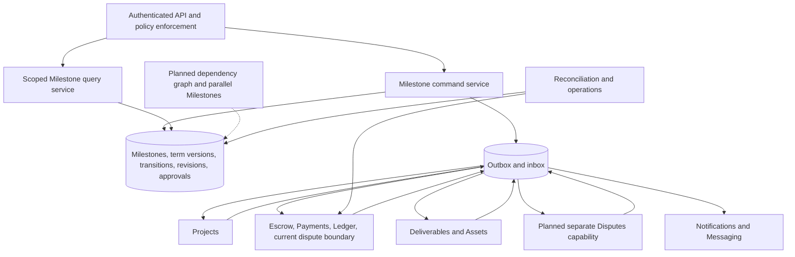

*Figure 11 — Future Architecture. A modular Milestone core commits history and outbox records while owner domains exchange verified idempotent facts; the dependency graph and separate Disputes capability remain Planned.*

`REQ-PROJECTS-039` applies unchanged whether the architecture is deployed as one application or several services: ownership and event idempotency are preserved either way.

## 32. Staged implementation plan

This task changes documentation only. Application and migration work proceeds in reviewable stages. Stage order respects dependencies: schema and state model first, then authorization and locking, then integrations.

1. **Reconcile existing Milestone schema and constraints.** Inventory rows, audit currency and amount units, widen to 64-bit minor units, add the currency check and exponent, replace destructive cascades, add the missing columns, and record a migration ADR.
2. **Establish the target Milestone state machine.** Add `suspended`, the transition registry, `milestone_state_transitions`, and a database guard that rejects unnamed transitions.
3. **Add resource-level authorization.** Implement Project-scoped Milestone resolution, opaque identifiers, permission keys, field projections, and safe errors, and stop accepting internal UUIDs.
4. **Add commercial locking guarantees.** Add `terms_status`, term-version snapshots, the row-level trigger covering identity and commercial columns, and the acceptance-time agree step.
5. **Add Project-total and currency reconciliation.** Add the deferred plan-sum and currency constraint and the scheduled reconciliation.
6. **Add optimistic concurrency and idempotency.** Add `version`, expected-version writes, idempotency records, stable lock order, and the `updated_at` trigger.
7. **Add Milestone create, read, and update interfaces.** Add Buyer create, edit, reorder, delete-draft, freeze, reopen, and Project-scoped read with cursor pagination.
8. **Add deterministic activation and order behavior.** Add the predecessor predicate, the at-most-one-active index, the explicit Seller start command, and overdue derivation.
9. **Integrate Deliverable bindings.** Add Milestone-subject Asset bindings, the eligibility interface, and consumption of readiness facts to enter `delivered`.
10. **Integrate Escrow allocation facts.** Consume funding, reversal, release, and refund facts with matching checks, quarantine, and allocation-equality constraints.
11. **Add revision and approval behavior.** Add revision cycle records, allowance enforcement (once Question Q2 and Q10 are decided), approval evidence, and the release signal.
12. **Add cancellation and dispute integration.** Add amendment-driven and resolution-driven cancellation, interruption with resume, and the pending-fact hold.
13. **Add audit events and notifications.** Add append-only audit, the outbox and inbox, event schemas, mandatory and configurable notices, metrics, and alerts.
14. **Add automated tests.** Cover trigger and constraint behavior (including the cascade question of `SEC-PROJECTS-023`), state and property rules, money, concurrency and idempotency, authorization and IDOR, event contracts, and end-to-end flows.
15. **Prepare the future dependency and parallel-Milestone architecture.** Validate the dependency schema, write the ADR, and keep the MVP sequential uniqueness constraint until the ADR lands.

## 33. Migration and reconciliation

### 33.1 Existing business-rule identifiers

This table records, and does not redefine, inherited identifiers as they touch Milestones:

| Existing identifier | Governance-controlled or existing meaning | Reconciliation here |
| --- | --- | --- |
| `BR-PROJECTS-002` | Governance: locked Milestone commercial terms cannot change. Product Overview and System Architecture Section 10.6: Milestone total equals Project price | Collision unresolved (Section 3.1). Governance meaning is used; total equality is `BR-PROJECTS-035` |
| `BR-PROJECTS-003` | API-created Projects and Milestones use `INR` | Preserved for MVP; target adds validated currency and exponent |
| `BR-PROJECTS-004` | Product Overview: locked Milestone terms cannot change | Semantic duplicate of Governance's `BR-PROJECTS-002`; historical citations retained |
| `BR-PROJECTS-005` | Lock requires Draft, unlocked, non-empty, all `planned`, same currency, exact sum | Preserved as the current lock precondition; the target freeze is broader (`BR-PROJECTS-054`) |
| `BR-PROJECTS-017`, `BR-PROJECTS-020`, `BR-PROJECTS-021`, `BR-PROJECTS-022` | Projects-owned rules on administrator rewrite, cross-state independence, Deliverable derivation, and Escrow authority | Cited, not redefined |

### 33.2 Current-state migration

| Current value or data | Target interpretation | Migration requirement |
| --- | --- | --- |
| `state = 'planned'` | `planned` | Preserve; record an initial transition |
| Any other `state` value | Unverified; no code path writes it | Treat as suspect; hold for review; never infer funding, delivery, approval, or release from the enum value |
| Milestones of a Project with `milestones_locked_at` set | `frozen` Buyer plan, not `agreed` | Backfill `terms_status = frozen`; never `agreed` without Seller consent evidence |
| Milestones of an unlocked Project | `draft` | Backfill `terms_status = draft` |
| `amount INT` | INR minor units only after an audit | Verify the unit and every stored value before widening |
| `currency` other than `INR` | Historical rows created before the INR stamp | Classify per Project; do not silently rewrite; reconcile with Project and Escrow |
| Milestone `description` | May contain scope | Do not copy into `deliverable_definition` automatically; require Buyer completion at the next freeze |
| Gaps or duplicates in `milestone_no` | Ordering unclear | Preserve numbers; require density at the next freeze |
| Escrow allocations existing for a Milestone | None expected | If found, treat as an unexplained financial artifact and reconcile before enabling facts |
| `projects.revision_limit INTEGER NOT NULL DEFAULT 0` | Superseded, Project-level legacy field | Target enforcement reads only each Milestone's own `revision_allowance` (Section 9.2, Decision 2026-09-25). MUST NOT be copied automatically into every Milestone's `revision_allowance`; each Milestone's allowance requires explicit Buyer/Seller agreement at the next freeze. The column is retained on `projects` as historical/compatibility data, not as a target source of truth, until a future migration removes or repurposes it |

Migration runs in observe, backfill, dual-read and validate, enforce, and clean-up phases, resumable in batches, with counts and totals compared before and after. It never sends a consent or financial notification because a backfill inferred a state. Destructive clean-up waits for rollback evidence and owner approval.

### 33.3 Product and repository corrections

This specification makes these explicit reconciliations:

- the locked plan of the current repository is a Buyer freeze, not Seller-agreed terms;
- the Foundation lifecycle sketch that shows `planned` to `refunded` is non-normative and is replaced for target behavior by Section 11;
- `buyer_approved` is approval, not payment, and `released` is an Escrow-verified outcome, reachable either through ordinary Buyer approval or through a platform non-response release authorization (Section 18.2);
- `milestone_no` remains the physical column name for the logical `milestone_number`;
- Milestone revisions return to `in_progress` and are not a separate state, matching Projects;
- Foundation's "no amendment path" for locked terms is superseded for target behavior by the Projects amendment mechanism, which this document applies;
- the Project-level `revision_limit` column is superseded target-architecture debt; the operative agreed revision allowance is per Milestone (Section 9.2).

## 34. Risks

| Risk | Consequence | Primary controls | Residual and owner |
| --- | --- | --- | --- |
| Unauthorized Milestone mutation | Terms or state changed by a wrong actor | Project-scoped authorization, named commands, row-level triggers | Authorization and Milestones |
| Locked commercial-term drift | Parties disagree on what was agreed | Immutable snapshots, row-level lock, amendment only | Milestones |
| Project and Milestone total drift | Under or over funding | Deferred sum constraint, reconciliation | Projects and Milestones |
| Currency inconsistency | Wrong accounting or payout | Currency and exponent snapshot, allocation equality | Milestones and Escrow |
| Invalid state transitions | Work or money out of order | State machine, guard, history | Milestones |
| Funding and state drift | False `funded` or `released` display | Verified facts, inbox, reconciliation | Milestones and Escrow |
| Duplicate operations | Duplicate approval, cancellation, or facts | Idempotency and event keys | Shared platform |
| Lost updates | Silent overwrite | Version and expected version | Milestones |
| Deliverable and version ambiguity | Approving the wrong file | Exact submission reference | Milestones and Deliverables |
| Revision abuse | Endless revision or coercion | Allowance, one open request, audit; policy Question Q2 | Product and Milestones |
| Approval and release race | Approve during dispute or after replacement | Serialized locks, interruption hold | Milestones and Escrow |
| Dispute and release race | Release while disputed | Milestone hold and Escrow freeze | Escrow and Disputes |
| Financial evidence deletion | Lost lineage and regulatory breach | `RESTRICT`, archive, holds | Data and finance |
| Confidential Asset exposure | Deliverable or brief disclosure | Purpose binding, live authorization | Assets and Projects |
| Notification failure | Missed contractual or financial notice | Outbox, retry, mandatory class, alerts | Notifications and Operations |
| Missing automated coverage | Regressions in immutability and money rules | Layered tests and CI gates before activation | Engineering |
| Future parallel-Milestone migration complexity | Ambiguous order, deadline, and roll-up | Sequential MVP with unique-active index, ADR, dependency schema | Product and Architecture |
| Buyer silence and review deadlock | Funds held indefinitely if unmitigated | Configurable review-timeout and auditable platform intervention (Section 18.2); exact durations remain configuration (Question Q18) | Product, Escrow, and Milestones |
| Unbounded revision demands after allowance exhaustion | Seller coerced into unpaid extra work | Per-Milestone `revision_allowance` (Section 9.2), rejection of requests beyond it; a self-serve change-order path remains open (Question Q19) | Product and Milestones |

Additional risks include stale verification facts, cross-service event reordering, legal variation, and migration inference errors. The controls in Sections 24, 25, and 29 reduce but do not eliminate them.

## 35. Assumptions

1. PostgreSQL remains the transactional source for the initial modular implementation.
2. Projects supplies participant, term-version, currency, and interruption facts as specified in Projects, including a future new-proposal-version operation (reconciliation item R8).
3. MVP has one Buyer and at most one accepted Seller per Project, so every Milestone has one Seller-side counterparty.
4. `INR` is the MVP currency with exponent 2; the target still carries a validated currency and exponent.
5. Existing integer Milestone amounts were intended as INR minor units because the frontend parses and displays them that way. Migration verifies rather than assumes each row.
6. Escrow can supply per-allocation funded, released, and refunded facts keyed by Milestone and term version.
7. Deliverables can supply immutable, ready, safe submission references, whether it becomes a separate domain or stays inside Milestones.
8. Assets can bind a version to a Milestone subject and report readiness without storing provider URLs.
9. The agreed revision allowance is a per-Milestone commercial term (`revision_allowance`, Section 9.2), confirmed by product decision on 2026-09-25; the legacy Project-level `projects.revision_limit` column is superseded target-architecture debt (Section 33).
10. Notification delivery is asynchronous and cannot be atomic with the Milestone transaction.
11. Retention periods, fee rules, and dispute remedies will be supplied by their owners.
12. No production data is altered by this documentation task.
13. The behaviors of the trigger reported in Section 28.4 as analysis are as read from the SQL and require a test to confirm.

## 36. Prioritized open questions

### 36.1 Open questions table

Questions are ordered by priority. A P0 question materially blocks the Milestones product definition; the owning later specification is named. Questions owned by future domains remain open here and are not silently resolved.

| ID | Priority | Question | Why it blocks or risks | Decision owner and resolving specification | Affected contract |
| --- | --- | --- | --- | --- | --- |
| Q1 | P0 | Which identifier replaces the Foundation's conflicting use of `BR-PROJECTS-002`, and when do Product Overview and System Architecture citations move to it? | The same rule ID has two meanings at Layer 0 and Layer 1; `BR-PROJECTS-035` avoids reuse but the collision remains (also open in [Projects Section 36.1](projects.md#361-open-questions-table)) | Governance and Architecture; a Governance change | Identifier ownership |
| Q2 | Resolved (2026-09-25) | ~~What happens when the Buyer neither approves nor requests revision~~: product behavior is now decided — review timeout, auditable platform intervention, and a platform non-response release authorization distinct from Buyer approval (Section 18.2). Buyer silence is never automatic acceptance. Exact durations and contact-attempt numbers remain configuration, restated as Q18 | Resolved the product-behavior blocker; Section 17's revision-matrix exit for exhausted allowance is restated as Q19 | Product decision, 2026-09-25; Milestones Section 18.2 | Sections 17 and 18 |
| Q3 | P0 | Is funding taken Project-wide up front or per Milestone, and is partial funding permitted? | Determines when Milestones become `funded` and can start | Escrow owner; the Escrow specification | Section 14 |
| Q11 | P0 | Which Milestone states may be disputed, who decides resume or cancel or refund or release outcomes, and how are split (part released, part refunded) settlements mapped to `released` versus `refunded`? | Interruption and terminal outcomes cannot be finalized without it; Section 19.1 gives only a default | Escrow and Disputes owner; the Escrow and Disputes specifications | Sections 19 and 21 |
| Q4 | P1 | May the Seller start the next Milestone while the previous awaits Buyer review? | Affects Seller experience and Buyer leverage; the strict rule applies until decided | Product | Section 13 |
| Q5 | P1 | Should the Buyer be able to reopen a frozen plan before acceptance in MVP, and which Projects state edge implements the new proposal version (reconciliation item R8)? | The Milestone freeze and reopen contract depends on it | Projects and Product; a Projects revision | Section 10 |
| Q6 | P1 | May the Seller formally propose Milestone edits before acceptance? | Changes the consent and amendment model before agreement | Product and Projects | Section 7 |
| Q7 | P1 | Is Deliverables a separate capability with its own owner, or an internal part of Milestones? | The Foundation domain map has no entry; the contract here works either way | Architecture; a Foundation change or ADR | Section 16 |
| Q8 | P1 | What are the consequences of a passed `due_at`, and does a revision cycle or Buyer review time extend a deadline? | Lateness rules are product policy; none is invented here | Product and Escrow | Sections 13 and 17 |
| Q9 | P1 | What are the maximum Milestone count per Project and any minimum Milestone amount? | Abuse and usability limits need governed numbers | Product | Sections 7 and 29 |
| Q10 | Resolved (2026-09-25) | ~~Does `revision_limit` apply per Milestone or across the whole Project?~~ Per Milestone: `revision_allowance` is an independently negotiated commercial term of each Milestone (Section 9.2) | Resolved the enforcement-scope blocker | Product decision, 2026-09-25; Milestones Section 9.2 | Section 17 |
| Q14 | P1 | How are historical Milestone rows with non-INR currency or unverified amount units classified? | Enforcing the currency check or widening amounts could misstate money | Data, Finance, Product | Section 33 |
| Q18 | P1 | What exact review-period duration, intervention contact-attempt count, contact channels, and operational SLA govern Buyer non-response (Section 18.2)? | Section 18.2 fixes the product behavior but deliberately sets no duration or count; without configuration values the intervention process cannot run | Product and Operations | Section 18.2 |
| Q12 | P2 | Is an Asset purpose for Seller working files needed, and who owns it? | Assets denies undefined purposes by default | Assets and Product | Section 22 |
| Q13 | P2 | Is `milestone_audit_events` physically part of the shared audit store of `DATA-PROJECTS-006`? | Avoids two audit stores | Architecture and Security | Section 26 |
| Q15 | P2 | What structure should `deliverable_definition` take beyond its now-decided `submission_requirements` declaration (Section 9.2): free text, checklist, or typed acceptance criteria? | Affects acceptance clarity and Dispute evidence; the submission-requirements portion is resolved, the broader acceptance-criteria structure is not | Product and Deliverables owner | Section 8 |
| Q16 | P2 | Which governed families should replace the provisional `SPEC`, `EVT`, and `OPS` identifiers, and when will the glossary exist? | Governance lacks these families and the glossary is absent (also open in Projects) | Governance | Section 3 |
| Q17 | P2 | What roadmap and product need drive parallel or dependency-based Milestones? | Premature schema raises migration cost | Product and Architecture | Section 31 |
| Q19 | P2 | Is a lightweight, self-serve change/add-on mechanism needed for MVP so a Buyer and Seller can voluntarily agree to work beyond a Milestone's locked `revision_allowance`, without mutating the locked term? | Without it, exhausted-allowance disagreement has only "approve" or "open a Dispute" as exits, which may be too coarse for MVP | Product | Sections 9, 17 |

### 36.2 Questions resolved by confirmed product decisions (2026-09-25)

Three product decisions were confirmed on 2026-09-25 and are reflected throughout this document rather than left as open questions: (1) Deliverable submission requirements are service/Milestone-dependent, declared in `deliverable_definition.submission_requirements` (Sections 9.2, 17; closes [Deliverables Question EQ1](deliverables.md#273-prioritized-open-questions)); (2) Buyer non-response cannot block a Seller indefinitely, and is resolved by a configurable review timeout and an auditable platform intervention ending in a non-response release authorization distinct from Buyer approval, never automatic approval (Section 18.2; closes the product-behavior half of Q2 and [Deliverables Question EQ2](deliverables.md#273-prioritized-open-questions)); (3) the Buyer-initiated revision allowance is negotiated and locked per Milestone, not Project-wide, and is immutable after agreement except through an accepted amendment (Section 9.2; closes Q10 and [Deliverables Question EQ3](deliverables.md#273-prioritized-open-questions)). Exact operational timing (Q18) and a future voluntary change-order mechanism (Q19) remain open, narrower questions.

## 37. Traceability

### 37.1 Requirement traceability

| Requirement | Product outcome | Primary sections | Verification intent |
| --- | --- | --- | --- |
| `REQ-PROJECTS-023` | Party derivation and immutable identity | 6, 7 | Party-column absence and identity immutability tests |
| `REQ-PROJECTS-024` | Authorized idempotent Buyer creation | 7, 24 | Auth, numbering, duplicate-request tests |
| `REQ-PROJECTS-025` | Versioned draft, frozen, agreed terms | 9, 10 | Snapshot immutability and amendment tests |
| `REQ-PROJECTS-026` | Row-level lock immutability | 10, 26 | Trigger, move, and delete tests |
| `REQ-PROJECTS-027` | Deterministic server state machine | 11, 12 | Allowed and invalid edge tests |
| `REQ-PROJECTS-028` | Sequential activation and explicit start | 13, 15 | Predecessor, funding, and interruption tests |
| `REQ-PROJECTS-029` | Escrow facts only for financial states | 14, 24 | Forged, duplicate, mismatched fact tests |
| `REQ-PROJECTS-030` | Immutable ready Deliverable binding | 16, 22 | Readiness, version, and access tests |
| `REQ-PROJECTS-031` | Recorded, bounded revision cycles | 17 | Cycle uniqueness and allowance tests |
| `REQ-PROJECTS-032` | Version-bound idempotent approval and release signal | 18 | Duplicate, stale-reference, race tests |
| `REQ-PROJECTS-033` | Completion equals verified release | 19 | Ratings-independence and fact-permutation tests |
| `REQ-PROJECTS-034` | Scenario-safe cancellation | 20 | Scenario and pending-fact tests |
| `REQ-PROJECTS-035` | Interruption with validated resume | 21 | Hold and resume tests |
| `REQ-PROJECTS-036` | Purpose-bound Milestone Asset bindings | 22 | Purpose, live authorization, no-raw-URL tests |
| `REQ-PROJECTS-037` | Continuous plan reconciliation | 9, 31 | Sum and currency property tests |
| `REQ-PROJECTS-038` | IDOR-resistant Milestone interfaces | 23, 29 | Scoped-resolution and shape tests |
| `REQ-PROJECTS-039` | Versioned idempotent mutation | 24 | Lost-update and replay tests |
| `REQ-PROJECTS-040` | Redacted audit, events, notices | 25 | Append-only, redaction, outbox tests |
| `REQ-PROJECTS-041` | Separate target records | 26, 33 | Migration and constraint tests |
| `REQ-PROJECTS-042` | Safe transport-neutral contracts | 27 | Schema, pagination, failure tests |
| `REQ-PROJECTS-060` | Per-Milestone submission requirements and revision allowance as commercial terms | 9 | Term-snapshot and enforcement-scope tests |
| `REQ-PROJECTS-061` | Buyer non-response leads to platform intervention, never automatic approval | 18.2 | Review-overdue, intervention, and authorization-distinctness tests |

### 37.2 Business-rule traceability

| ID | Normative statement | Rationale | Enforcement | Status | Sections | Verification |
| --- | --- | --- | --- | --- | --- | --- |
| `BR-PROJECTS-031` | A Milestone MUST belong to exactly one Project for its life, and `id`, `external_id`, `project_id`, `created_at`, and `created_by_user_id` MUST be immutable. | Stable identity anchors financial and audit references. | FK to Projects exists (with `CASCADE`); the trigger protects `project_id` only after lock; no other identity immutability. | Partially Implemented | 6, 10 | Identity mutation tests |
| `BR-PROJECTS-032` | Milestone Buyer and Seller MUST be derived from live Project participation, and Milestones MUST NOT store party identifiers or create global roles. | Prevents a second authorization source and drift. | No party column exists; the participant model itself is absent. | Partially Implemented | 6 | Schema and authorization tests |
| `BR-PROJECTS-033` | Milestone numbers MUST be positive integers, unique among active Milestones of a Project, server-assigned, and renumbered only while terms are draft. | Deterministic order and stable references. | CHECK `project_milestones_no_positive` and UNIQUE `project_milestones_unique_no_per_project`; server assigns `i + 1`; draft-only renumbering and density are not enforced. | Partially Implemented | 7, 13 | Uniqueness and reorder tests |
| `BR-PROJECTS-034` | A Milestone amount MUST be a positive integer of minor units, and its currency and exponent MUST equal the Project's. | Exact money and single-currency accounting. | Positive CHECK and `INT`; server stamps `INR` and compares at lock; no database currency constraint. | Partially Implemented | 8, 9 | Bounds, exponent, mismatch tests |
| `BR-PROJECTS-035` | The active Milestone amounts MUST sum exactly to the proposed Project total at freeze and to the agreed total at agreement and after every amendment. | Prevents under or over funding. This is the total-equality rule kept under a non-colliding identifier (Section 3.1). | Route checks at creation and lock; no database constraint. | Partially Implemented | 9, 10 | Sum property tests |
| `BR-PROJECTS-036` | Milestone commercial terms MUST NOT change once frozen or agreed, except that agreed terms MAY change through an accepted amendment that writes a new version. | Tamper-evident contract terms; complements Governance `BR-PROJECTS-002` and Projects `BR-PROJECTS-017`. | Trigger on seven columns after the Project lock; no snapshots or versions. | Partially Implemented | 9, 10 | Immutability and amendment tests |
| `BR-PROJECTS-037` | Milestone state MUST change only through named server commands or verified facts, MUST NOT be set by clients, and MUST remain independent of Project, Escrow, Deliverable, and Dispute state. | Separate machines prevent coupling and forgery. | Only `planned` is ever written by the server; no transition guard. | Partially Implemented | 11, 12 | Client-state and cross-state tests |
| `BR-PROJECTS-038` | `funded`, `released`, and `refunded` MUST be entered only from verified Escrow facts matching Project, Milestone, term version, currency, and amount, and Milestones MUST NOT store or compute financial totals. | Escrow is the sole financial authority. | Not yet enforced; schema only. | Schema Implemented | 14, 19 | Forged and mismatched fact tests |
| `BR-PROJECTS-039` | A Milestone MUST start only when every predecessor is resolved and no other active Milestone is `in_progress` or `delivered`. | Sequential MVP execution. | Not yet enforced. | Not Implemented | 13 | Predecessor and uniqueness tests |
| `BR-PROJECTS-040` | Work MUST begin only by an explicit Seller command on a `funded`, agreed, uninterrupted Milestone and MUST NOT be inferred from client state. | Prevents unsourced commencement. | Not yet enforced. | Not Implemented | 15 | Start command tests |
| `BR-PROJECTS-041` | A Milestone MUST enter `delivered` only from a verified ready-and-safe Deliverables fact and MUST NOT own file state. | File evidence has a separate owner. | Not yet enforced; no Deliverable exists. | Not Implemented | 16 | Readiness and ownership tests |
| `BR-PROJECTS-042` | A revision MUST be requested only by the Buyer from `delivered`, within this Milestone's own agreed `revision_allowance`, and recorded immutably against the exact submission. | Bounded, attributable revision. | Not yet enforced; `revision_allowance` does not exist yet, and the legacy `projects.revision_limit` is unused and Project-level. | Not Implemented | 17 | Cycle and allowance tests |
| `BR-PROJECTS-043` | Approval MUST be by the Project Buyer only, from `delivered`, on the exact latest submission, once, idempotently, and MUST emit a release signal without settling. | Approval is evidence, not payment. | Not yet enforced. | Not Implemented | 18 | Duplicate, stale, and race tests |
| `BR-PROJECTS-044` | Approval MUST be final for work acceptance; later disagreement MUST use a Dispute and MUST NOT revert `buyer_approved` by command. | Prevents retroactive rewriting of acceptance. | Not yet enforced. | Not Implemented | 18, 21 | Reversion-rejection tests |
| `BR-PROJECTS-045` | A Milestone is completed exactly when it is `released`; terminal outcomes are `released`, `refunded`, and `cancelled`; Ratings MUST NOT gate approval or release. | Deterministic completion independent of reputation. | Not yet enforced. | Not Implemented | 19 | Completion predicate tests |
| `BR-PROJECTS-046` | After agreement a Milestone MUST be cancelled only through an accepted amendment or governed resolution, MUST NOT be deleted, and refund or release MUST come only from Escrow facts. | Cancellation is not deletion or refund. | Not yet enforced; `cancelled` is enum only. | Not Implemented | 20 | Scenario tests |
| `BR-PROJECTS-047` | `disputed` and `suspended` MUST store an exact validated resume state, MUST revalidate live facts on resume, and MUST suppress release signals while active. | Blind resume can bypass changed holds. | Not yet enforced. | Not Implemented | 21 | Interruption tests |
| `BR-PROJECTS-048` | Only Draft, unreferenced, unbound Milestones MAY be hard-deleted before freeze; otherwise they MUST be superseded and retained, and retained financial references MUST NOT cascade-delete. | Preserves financial and audit evidence. | Current FK cascade and unlocked-row deletion contradict it. | Not Implemented | 20, 26 | FK graph and deletion tests |
| `BR-PROJECTS-049` | Every Milestone mutation MUST carry an expected version and idempotency key, use a stable lock order, and deduplicate external facts by event ID. | Retries and races cannot duplicate effects. | Project row lock on the lock route only. | Partially Implemented | 24 | Replay and concurrency tests |
| `BR-PROJECTS-050` | Milestone media MUST use Asset-version bindings through the Project binding record with a Milestone subject, MUST NOT store permanent provider URLs, and deleting a Milestone or binding MUST NOT delete bytes. | Provider URLs leak and lifecycle differs. | Not yet enforced. | Not Implemented | 22 | No-raw-URL and binding tests |
| `BR-PROJECTS-051` | An amendment MUST NOT mutate historical Milestone rows, MUST create superseding snapshots, and MUST NOT reduce a Milestone below funded, released, disputed, or retained amounts. | Preserves financial history. | Not yet enforced; no amendment path. | Not Implemented | 9, 20 | Amendment tests |
| `BR-PROJECTS-052` | Every Milestone transition, consumed fact, approval, revision, and privileged access MUST be recorded in append-only redacted audit and transition history. | Evidence and repudiation resistance. | Not yet enforced; timestamps only. | Not Implemented | 25, 26 | Coverage and redaction tests |
| `BR-PROJECTS-053` | Milestones MUST NOT decide financial remedies, release, or refund; it MUST record the owning domain's fact. | Separation of authority. | Not yet enforced. | Not Implemented | 14, 21 | Boundary tests |
| `BR-PROJECTS-054` | A ready proposal's Milestones MUST each have a non-blank title, non-blank deliverable definition, positive amount, Project currency, unique dense numbers, non-decreasing due dates, and a reconciling sum. | Informed consent needs complete, coherent terms. | Route checks title, amount, and sum; the rest not enforced. | Partially Implemented | 7, 13 | Readiness tests |
| `BR-PROJECTS-055` | The lock indicator MUST live on the Milestone row, identity columns MUST be immutable regardless of lock, and a frozen or agreed plan MUST NOT gain, lose, or receive a moved row. | Removes reliance on a clearable Project column. | Trigger partial: guarded by `projects.milestones_locked_at`, protects insert, delete, and seven columns; move and identity gaps. | Partially Implemented | 10, 28 | Trigger bypass tests |
| `BR-PROJECTS-056` | Preferences MAY suppress optional Milestone reminders but MUST NOT suppress mandatory contractual, financial, workflow, or safety notices, and delivery failure MUST NOT roll back a transition. | User convenience cannot erase business truth. | Not yet enforced. | Not Implemented | 25 | Preference and failure tests |
| `BR-PROJECTS-076` | `revision_allowance` MUST be negotiated and agreed independently per Milestone, MUST be immutable once agreed except through an accepted amendment, and unused revisions MUST NOT transfer between Milestones. | Preserves the negotiated commercial bargain per payable unit. | Not yet enforced; column does not exist. | Not Implemented | 9, 17 | Allowance-scope and immutability tests |
| `BR-PROJECTS-077` | A platform non-response release authorization MUST be recorded in a table separate from `milestone_approvals`, MUST be restricted to an explicit governed System or Administrator capability, and MUST NOT be presented to any domain as Buyer approval. | Prevents privilege confusion and preserves an accurate acceptance history. | Not yet enforced; table does not exist. | Not Implemented | 18.2 | Record-separation and capability tests |
| `BR-PROJECTS-078` | A platform non-response release authorization MUST be rejected while the Milestone is `disputed` or `suspended`, and MUST require every configured intervention contact attempt to be exhausted first. | A live dispute or hold must take precedence over a non-response fallback. | Not yet enforced. | Not Implemented | 18.2, 21 | Interruption-precedence tests |

Inherited `BR-PROJECTS-001` through `BR-PROJECTS-030` are reconciled in Section 33.1 and are not newly defined here.

### 37.3 Security, data, interface, audit, event, and operations traceability

| Family | Complete range in this specification | Definition location | Verification and ownership |
| --- | --- | --- | --- |
| Security | `SEC-PROJECTS-021`–`032`, `046`–`047` | Sections 29.1 | Security review with negative, concurrency, money, retention, and test-gate evidence |
| Data | `DATA-PROJECTS-008`–`013`, `017` | Section 26.1 | Migration and schema review, constraints, indexes, retention tests |
| Interface | `INT-PROJECTS-016`–`026`, `035` | Section 27.2 | Contract and failure tests |
| Audit | `AUD-PROJECTS-007`–`012`, `015` | Section 25.1 | Required-action coverage and append and redaction tests |
| Events, provisional | `EVT-PROJECTS-008`–`013`, `019`–`021` | Section 25.3 | Governance decision, schema registry, producer and consumer tests |
| Operations, provisional | `OPS-PROJECTS-007`–`012`, `016` | Section 25.3 | Governance decision, dashboards, alerts, reconciliation exercises |

Every governed identifier newly defined by this document has one definition and a trace entry. The event and operations ranges remain provisional to make the Governance gap visible.

## 38. Validation record

The authoring validation for version 1.1.0 covers version 1.0.0's checks plus this revision's reconciliation of three confirmed product decisions (service/Milestone-dependent submission requirements, Buyer non-response and platform intervention, and per-Milestone revision allowance):

| Check | Result |
| --- | --- |
| Exactly one H1; sequential numbered H2 headings 1 through 39; numbered H3 headings sequential under each H2; no skipped levels; new Section 18.2 and Section 36.2 added without renumbering any existing heading | Passed |
| No empty required section and no placeholder content | Passed |
| All 16 task-required tables present and substantive; supporting tables included | Passed |
| All 11 required Mermaid diagrams present, captioned, and fences balanced | Passed |
| Relative links resolve to existing files and anchors, checked by script against GitHub-style heading slugs | Passed |
| Cross-document section and identifier citations reviewed against current files; every cited external identifier exists elsewhere in the specification tree | Passed |
| Governed identifier definitions unique in this document and absent from every other specification | Passed; the pre-existing `BR-PROJECTS-002` collision is disclosed in Section 3.1 |
| Provisional identifier families disclosed (`SPEC`, `EVT`, `OPS`) | Passed |
| Repository claims tied to inspected migrations, routes, frontend, packages, Compose, and tests | Passed; trigger behaviors that were reasoned from SQL rather than executed are labeled as analysis |
| Target architecture never labeled as current implementation | Passed |
| Project, Milestone, Escrow, Deliverable, and Dispute states kept separate | Passed |
| Buyer and Seller remain Project-derived relationships | Passed |
| Commercial locking explicit; money uses integer minor units with no floating point | Passed |
| No trailing whitespace; `git diff --check` clean | Passed |
| Only this new specification is staged for commit; `.vscode/` excluded | Passed |
| New identifiers (`REQ-PROJECTS-060`–`061`, `BR-PROJECTS-076`–`078`, `SEC-PROJECTS-046`–`047`, `DATA-PROJECTS-017`, `INT-PROJECTS-035`, `AUD-PROJECTS-015`, `EVT-PROJECTS-019`–`021`, `OPS-PROJECTS-016`) verified unique against the complete specification tree, continuing without reuse from this document's and `deliverables.md`'s prior ceilings | Passed |
| Q2 and Q10 reclassified Resolved with a pointer to the deciding section, rather than silently deleted; Q18 and Q19 added for the narrower questions each leaves open | Passed |

Validation scripts and Git checks are execution evidence for the repository change. This table records the specification review criteria and the known governed-identifier exception.

## 39. Version history

| Version | Date | Change | Author |
| --- | --- | --- | --- |
| 1.0.0 | 2026-09-20 | Initial approved Milestones aggregate: identity, term versions and locking, state machine, transitions, activation, funding, delivery, revision, approval, completion, cancellation, disputes, Asset bindings, authorization, target data model, verified repository comparison, security findings, traceability, and staged plan. | Product and Architecture |
| 1.1.0 | 2026-09-25 | Reconciled three confirmed product decisions: (1) Deliverable submission requirements are service/Milestone-dependent, declared in `deliverable_definition.submission_requirements`; (2) Buyer non-response is resolved by a configurable review timeout and auditable platform intervention (new Section 18.2, transition M18, `DATA-PROJECTS-017`), never automatic approval; (3) the Buyer-initiated revision allowance (`revision_allowance`) is negotiated and locked per Milestone, superseding reliance on the Project-level `revision_limit`. Reclassified Questions Q2 and Q10 as Resolved; added Questions Q18 and Q19. Added `REQ-PROJECTS-060`–`061`, `BR-PROJECTS-076`–`078`, `SEC-PROJECTS-046`–`047`, `DATA-PROJECTS-017`, `INT-PROJECTS-035`, `AUD-PROJECTS-015`, `EVT-PROJECTS-019`–`021`, `OPS-PROJECTS-016`. No existing identifier, section number, or unrelated content changed. | Product and Architecture |
