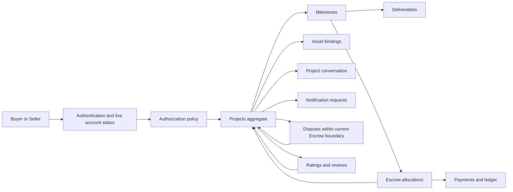
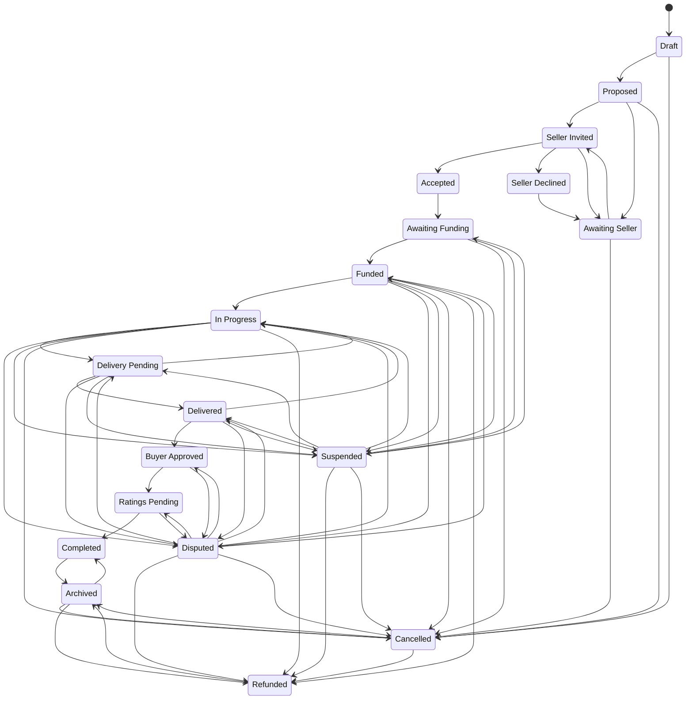
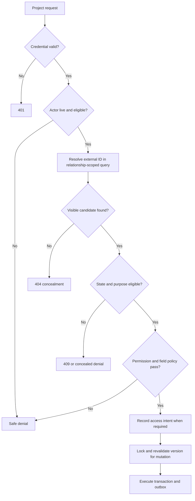
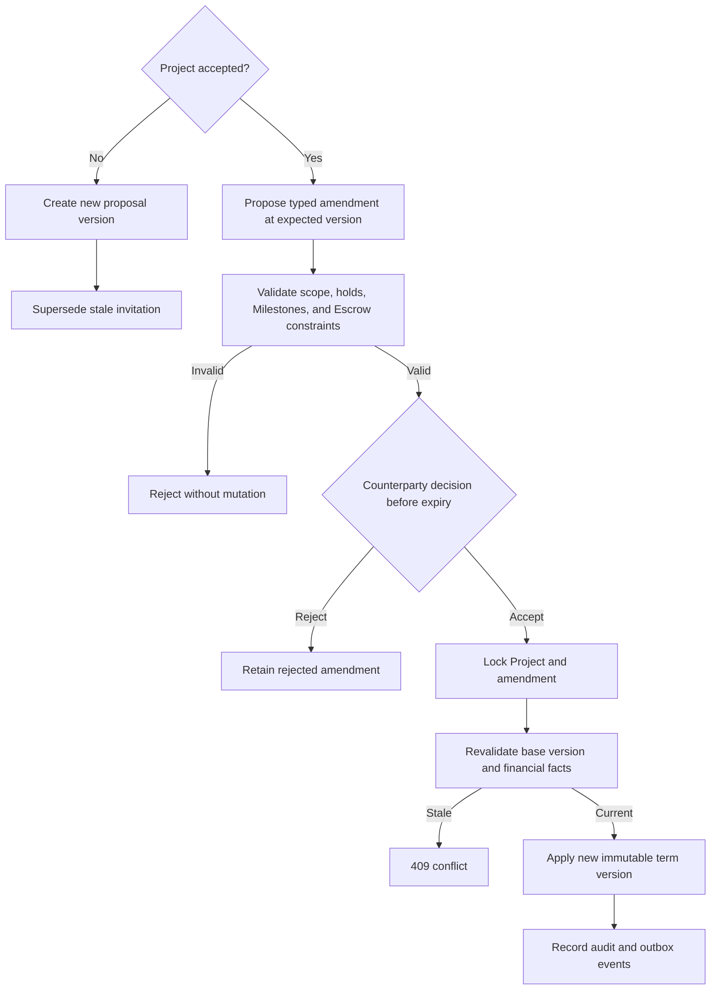
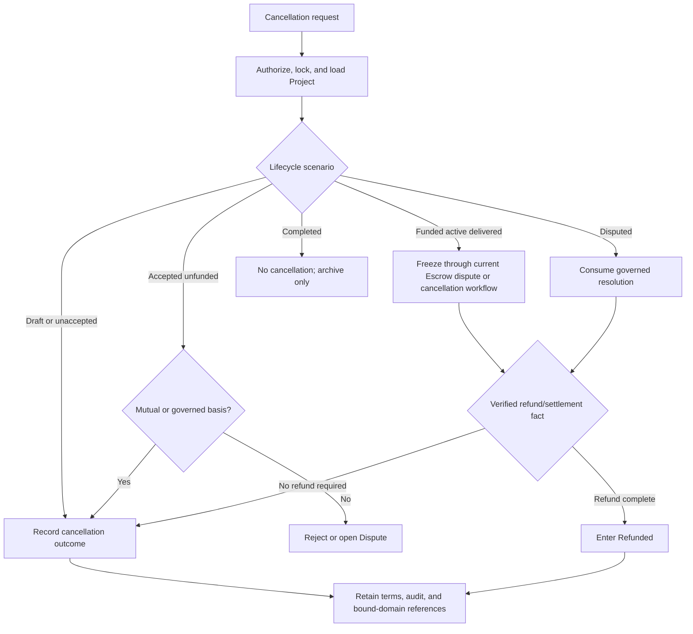
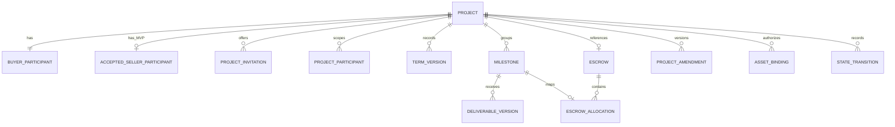
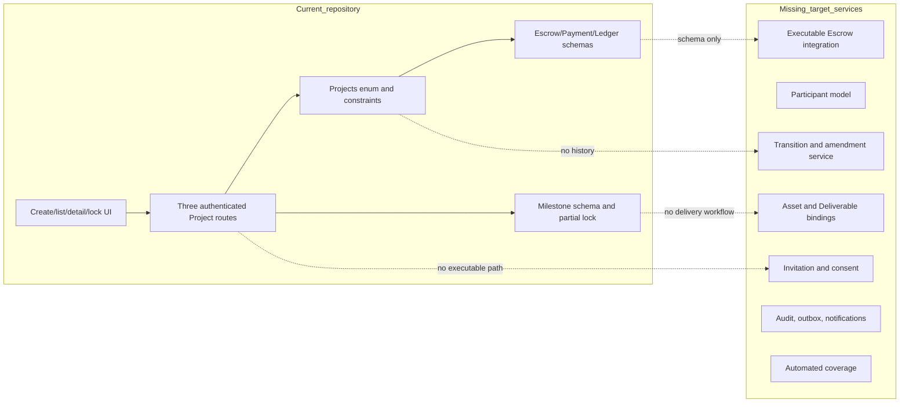
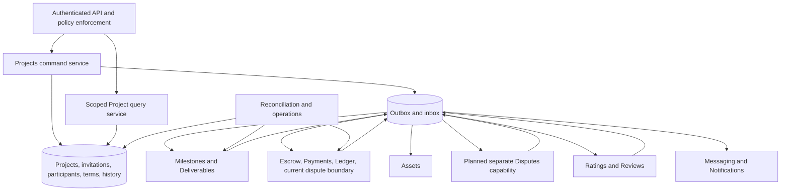

# Projects domain specification

| Metadata | Value |
| --- | --- |
| Document ID | `SPEC-PROJECTS-000` (provisional; see Section 3) |
| Type | Specification (SPEC) |
| Domain | Projects |
| Status | Approved |
| Version | 1.0.1 |
| Owner | Product and Architecture |
| Last Reviewed | 2026-09-25 |
| Applies To | Target Projects product architecture and verified current repository comparison |
| Governed token | `PROJECTS` |
| Canonical path | `docs/05-projects-milestones/projects.md` |
| Product horizon | Target product architecture with verified repository comparison |

## 1. Executive summary

A Project is MusicApp's primary commercial collaboration aggregate. It records the stable identity of an engagement, its Buyer, accepted Seller relationship, proposal and agreed commercial snapshots, lifecycle, visibility, and links to supporting domains. It does not own authentication, permission policy, money movement, file bytes, milestone execution, disputes, messages, notifications, or reputation records.

The target model is consent-first. An authenticated Buyer creates a private Draft, prepares a proposal, and invites a Seller. Naming a user never makes that user a Seller. Only an unexpired, version-matched, explicitly accepted invitation creates the active Seller participant. MVP permits one Buyer and one accepted Seller; the data model keeps participant records separate so later multi-seller work does not require redefining Buyer or Seller as global roles.

The repository contains a useful but incomplete vertical slice: a constrained `projects` table, authenticated create/list/lock routes, a create/list/detail/lock frontend, Milestone and Escrow schemas, and a database trigger that protects some locked Milestone terms. It has no invitation, explicit Seller consent, participant model, deterministic transition service, general Draft/commercial update API, cancel/archive API, Project audit trail, notification integration, or automated tests. This specification defines the future product independently of those limitations and labels every repository observation with one of the required implementation statuses.

## 2. Purpose and scope

This document is canonical for:

- Project identity, Buyer ownership, Seller invitation and acceptance, scoped participation, and visibility;
- Project creation, proposal, commercial snapshots, lifecycle, state transitions, amendments, cancellation, archival, and completion;
- Project-level relationships with Milestones, Deliverables, Escrow, Payments, Disputes, Ratings, Reviews, Assets, Messaging, Notifications, and auditing;
- server authorization, concurrency, idempotency, target logical data, interfaces, events, operations, security findings, and migration guidance.

This document deliberately does not fully specify Milestone execution, Deliverable review, Escrow or Payment accounting, Dispute adjudication, Messaging content, Notification delivery, Rating calculation, or Review publication. Those concerns require future owner-domain specifications. Until then, Projects defines only the contract facts it produces or consumes and does not silently decide their domain-owned policy.

## 3. Governance, status, and authority

[Governance](../00-governance/README.md) maps Projects and Milestones to `docs/05-projects-milestones/` and governs the plural `PROJECTS` token. Therefore this file uses `REQ-PROJECTS-*`, `BR-PROJECTS-*`, `SEC-PROJECTS-*`, `DATA-PROJECTS-*`, `INT-PROJECTS-*`, and `AUD-PROJECTS-*`. The task-suggested singular `SEC-PROJECT-*` family is not used.

`SPEC-PROJECTS-000` is a document tracking label, not a Governance-defined identifier family. Governance does not define `EVT-*` or `OPS-*`; event and operational identifiers in this document are explicitly provisional pending a Governance amendment. The required glossary at `docs/99-appendices/glossary.md` is absent, so Section 4's local definitions are provisional pending that glossary.

The implementation labels in this document mean:

| Label | Meaning |
| --- | --- |
| Implemented | End-to-end behavior exists and was verified in the current repository. |
| Partially Implemented | Some executable path exists but one or more target guarantees are absent. |
| Schema Implemented | Database structure exists without the required executable domain behavior. |
| Planned | A repository artifact or existing specification declares intent but no complete behavior exists. |
| Not Implemented | No verified implementation was found. |

`Not Implemented` is a task-required repository-observation label, not an addition to the Foundation product-status taxonomy. Target rules are normative even when their repository status is Planned or Not Implemented.

### 3.1 Existing Project identifier collision

Governance Section 15/28 assigns `BR-PROJECTS-002` to immutability of locked Milestone commercial terms. [Product Overview Section 11](../01-foundation/product-overview.md#11-core-business-rules) instead assigns that same identifier to reconciliation of Milestone totals with Project price and assigns lock immutability to `BR-PROJECTS-004`; System Architecture Sections 10.5–10.6 repeat the Foundation mapping. This is a pre-existing Layer 0/Layer 1 collision.

Governance controls pending correction. This document does not redefine `BR-PROJECTS-001` through `BR-PROJECTS-005`; it records their inherited meanings and collision in Section 33 and begins new canonical rules at `BR-PROJECTS-006`. Ownership transfer from Product Overview is consequently partial until the collision is resolved.

## 4. Terminology and domain boundaries

| Term | Local definition |
| --- | --- |
| Project | Stable commercial collaboration aggregate joining proposal, accepted parties, lifecycle, and cross-domain facts. |
| Buyer | User who creates and owns the buying side of one Project relationship. |
| Invited Seller | User named by a pending Project invitation; not yet an active Seller participant. |
| Accepted Seller | User who explicitly accepted the current invitation and became the active Seller participant. |
| Participant | Scoped Project relationship with a category, lifecycle, and visibility; never a global platform role. |
| Proposal | Versioned, pre-acceptance scope and commercial snapshot presented for Seller consent. |
| Agreed terms | Immutable accepted snapshot, changed only by an accepted bilateral amendment. |
| Project state | Projects-owned lifecycle position; distinct from invitation, Milestone, Escrow, Payment, Deliverable, Dispute, and Rating state. |
| Public portfolio reference | Sanitized, explicitly released summary or derivative; never the Project record itself. |
| Terminal commercial state | Completed, Cancelled, or Refunded. Archived is a record-visibility wrapper over a terminal state. |
| System Actor | Authenticated non-human service identity acting under an explicit capability and auditable purpose. |

[System Architecture Sections 7, 9, and 10](../01-foundation/system-architecture.md#10-domain-specifications) control the current Foundation ownership map:

- Projects owns the collaboration relationship, agreed Project-level terms, and Project lifecycle.
- Milestones owns each payable unit's scope, amount, execution state, Deliverable definition, and approval fact.
- Escrow is the sole financial authority and, under the current Foundation map, owns payment outputs/provider activity and disputes in part. Separate Payments or Disputes ownership is Planned future architecture that requires a Foundation change or ADR.
- Ratings owns scores and written reviews and emits eligibility/completion facts; only Projects mutates Project state. A separate Reviews owner would require a Foundation change or ADR.
- [Assets Section 5](../03-identity-profiles-verification/assets-and-media.md#5-ownership-and-domain-boundaries) and [Section 16](../03-identity-profiles-verification/assets-and-media.md#16-ownership-and-domain-bindings) assign Asset records, processing, storage keys, retention execution, and deletion to the Assets logical capability while explicitly tracking its missing Foundation domain-map/ADR reconciliation.
- Messaging owns message content; Notifications distributes business events but does not create them.
- Authorization decides whether an actor may request an action. Projects validates and executes its lifecycle invariants.

## 5. Canonical principles and architecture

The following rules apply throughout this specification:

1. A Project has one Buyer and may begin without an accepted Seller.
2. Seller participation requires a discrete invitation and explicit acceptance.
3. Buyer and Seller are relationship-derived categories, not permanent platform roles.
4. Project IDs are immutable. Public interfaces use opaque `external_id` values and never rely on enumerable internal keys.
5. Project ownership is necessary but never sufficient; every action evaluates current account, relationship, state, purpose, and permission.
6. State transitions are explicit, server-validated, deterministic, concurrency-safe, idempotent, and audited.
7. Project, invitation, Milestone, Escrow, Deliverable, Dispute, and Rating states remain independent.
8. Accepted commercial terms cannot be changed unilaterally.
9. Currency is immutable from the first funding transition; amounts use integer minor units and never binary floating point.
10. Project totals reconcile with Milestones, while funded, released, and refunded totals remain Escrow-owned facts.
11. Cancellation, refund, archival, and deletion are different operations.
12. Financially active or retained Projects are never hard-deleted.
13. Project Assets inherit live Project authorization unless a stricter purpose rule applies.
14. Ratings do not authorize acceptance, approval, release, or refund.
15. MVP supports one accepted Seller. Multi-seller Projects are future architecture.



*Figure 1 — Project Domain Architecture. Projects coordinates domain facts without taking ownership of money, files, disputes, messages, or ratings.*

## 6. Project participants

### 6.1 Participant rules

The Buyer is derived from the authenticated creator and is inserted as an active Project participant in the same transaction as Project creation. An invitation identifies a prospective Seller but conveys no active Seller capability. Acceptance atomically adds the active Seller participant. Collaborator and Observer are proposed scoped Project relationships, not additions to the global Roles taxonomy.

Moderators and Administrators retain their independent global assignments described in [Roles Sections 7.8–7.9](../02-users-roles-permissions/roles.md#78-moderator) and [Authorization Section 19 `BR-AUTHZ-034`](../02-users-roles-permissions/authorization.md#19-administration). Neither assignment implies the other, and both require action-specific policy and purpose logging. System Actor is non-human as established by Roles Section 7.11.

### 6.2 Project participant matrix

| Category | Relationship source and assignment | Acceptance | Capabilities | Restrictions | Lifecycle/removal | Visibility | Audit | Repository status |
| --- | --- | --- | --- | --- | --- | --- | --- | --- |
| Buyer | Authenticated creator; active participant inserted with Project | Implicit for creator's own Buyer relationship | Draft, propose, invite, fund request, review Delivery, amend, cancel where allowed, archive | Cannot self-deal, impersonate Seller, bypass state or Escrow | Permanent commercial party; anonymize only under retention policy | Full Project subject to field policy | Creation and every privileged action | Partially Implemented |
| Invited Seller | Current `project_invitations.invitee_user_id` | Required and not yet given | View invitation-safe proposal; accept or decline | No work, funding, full Project, or participant capability | Pending to accepted, declined, withdrawn, expired, or superseded | Invitation projection only | Creation, delivery, view, outcome | Not Implemented |
| Accepted Seller | Accepted invitation creates participant atomically | Explicit, current identity, version, and expiry checks | View Project, work, deliver, propose amendments, dispute, rate | Cannot alter Buyer-owned draft or commercial terms alone | Active through retained record; removal only via governed cancellation/dispute outcome | Participant projection | Acceptance and all material actions | Not Implemented |
| Declined Seller | Declined invitation record | Explicit decline | View retained minimal receipt where required | No Project capability | Terminal invitation; re-invite uses a new invitation | Minimal invitation history | Decline reason category and time | Not Implemented |
| Withdrawn Seller | Buyer/System withdraws pending invitation | None | No continuing Project capability | Cannot accept stale token | Terminal invitation | Minimal receipt | Actor, reason, time | Not Implemented |
| Project Collaborator | Proposed scoped grant from an active party under policy | Explicit acceptance if personal data/work access is granted | Only enumerated non-commercial collaboration actions | Never fund, accept terms, approve, cancel, rate, or become Seller implicitly | Time-bound/revocable; removal preserves history | Least-privilege field projection | Grant, accept, use, revoke | Not Implemented |
| Observer | Proposed read-only scoped grant | Explicit if invitation-based | Read approved non-sensitive projection | No mutation; no financial, dispute, or private Asset data by default | Time-bound/revocable | Explicit projection | Grant, access where sensitive, revoke | Not Implemented |
| Moderator | Independent global role plus case/purpose scope | Role assignment outside Projects | Case-bound review, hold, moderate under policy | No commercial-party powers; no routine browsing | Access expires with case/purpose | Minimum case projection | Every access and action | Not Implemented |
| Administrator | Independent global role plus action permission | Role assignment outside Projects | Suspend/restore or support action explicitly granted | Cannot silently rewrite commercial history or act as party | Grant/revoke outside Projects | Minimum operational projection | Every access and action | Not Implemented |
| System Actor | Service identity and explicit capability | Service authorization | Expiry, reminders, projection updates, verified event handling | No ambient access or unsourced transition | Rotated/revoked credential; deterministic retry | Minimum event fields | Correlation, capability, result | Not Implemented |

## 7. Project creation

### 7.1 Deterministic target model

MVP creates a private Draft before invitation, a Proposed Project when readiness checks pass, and an active commercial relationship only after Seller acceptance. The phases are:

1. authenticate and re-check the creator's live account status;
2. derive `buyer_user_id` and `created_by_user_id` from the authenticated subject, never the payload;
3. idempotently create a private Draft and Buyer participant;
4. allow incomplete scope and zero Milestones while Draft;
5. validate proposal readiness;
6. freeze a numbered proposal snapshot;
7. create a Seller invitation and enter Seller Invited;
8. create the accepted Seller participant only on valid acceptance.

### 7.2 Creation input and validation

| Input | Draft rule | Proposal-readiness rule | Source/validation |
| --- | --- | --- | --- |
| Buyer | Required | Required | Derived from live authenticated subject |
| Title | Optional | Required, trimmed, bounded, nonblank | Server |
| Description/brief | Optional | Required safe summary; confidential detail may be an Asset | Server and Assets |
| Proposed total | Optional or zero | Positive integer minor units | Server money parser |
| Currency | Optional | Supported uppercase ISO 4217 code; MVP `INR` | Server registry |
| Due date | Optional | Required, future, consistent with Milestones | Server clock |
| Genre/skills | Optional structured references | Valid catalog identifiers when supplied | Catalog policy; future owner |
| Seller | Absent from Draft participant set | One eligible invitee may be selected | Invitation only |
| Milestones | Zero or more | At least one; positive amounts; sum equals proposal | Milestones contract |
| Attachments | Optional bindings | Every required binding ready and safe | Assets contract |

Proposal readiness does not require identity verification approval merely to create or accept, but active account eligibility is mandatory. Payout remains gated by live Verification as described by [Users `BR-USERS-011`](../02-users-roles-permissions/users.md#9-business-rules) and [Verification Section 25](../03-identity-profiles-verification/verification.md#25-verification-levels-and-capability-unlocking).

Draft creation requires an `Idempotency-Key` bound to authenticated actor, operation, and canonical request hash. A completed replay returns the original result; an in-flight mismatch returns `409`; reusing a key for different input returns `422` or `409` under the common interface policy. Per-user and per-origin rate limits apply to creation and invitation. Draft expiry is a configurable soft-expiry/archive job; it never hard-deletes retained financial or audit data.

`REQ-PROJECTS-001`: The system MUST let an eligible authenticated user create an idempotent private Project Draft whose Buyer is derived from that user.

`REQ-PROJECTS-002`: The system MUST validate proposal readiness before invitation and MUST keep the Project non-active until explicit Seller acceptance.

```mermaid
sequenceDiagram
    actor Buyer
    participant API as Projects API
    participant Auth as Authentication/Authorization
    participant DB as Projects store
    participant Assets as Assets
    participant Outbox as Transactional outbox
    Buyer->>API: Create Draft + Idempotency-Key
    API->>Auth: Authenticate, live status, create permission
    Auth-->>API: Eligible Buyer subject
    API->>DB: Insert Project and Buyer participant
    DB-->>API: Draft external_id and version
    API-->>Buyer: Private Draft
    Buyer->>API: Prepare proposal
    API->>Assets: Check required bindings ready/safe
    Assets-->>API: Purpose readiness facts
    API->>DB: Validate total, Milestones, due date; freeze snapshot
    API->>Outbox: Record proposal event in transaction
    API-->>Buyer: Proposed version
```

*Figure 2 — Project Creation Sequence. A private Draft precedes proposal readiness and Seller invitation.*

## 8. Seller invitation and consent

### 8.1 Consent contract

Seller discovery returns an authorized, minimal Profile projection; it never grants Project access. Creating an invitation stores the invitee, inviter, proposal version/hash, expiry, status, and opaque external identifier. Delivery uses an outbox notification and does not determine whether the invitation exists.

Acceptance MUST run in one transaction that locks the invitation and Project, verifies the authenticated invitee, live active status, expiry, pending status, proposal version, absence of an accepted Seller, and any applicable eligibility gate, then marks the invitation accepted, inserts the Seller participant, snapshots accepted terms, and advances the Project. Duplicate acceptance by the same actor and same idempotency key returns the original result. A competing or stale acceptance returns a safe `409`.

Seller identity verification approval is not required merely to review or accept the relationship. Before funding can become releasable or payout-capable, the Verification-owned live payout gate MUST pass. Whether a higher-risk category requires verification before acceptance is an open policy question.

### 8.2 Seller invitation matrix

| Invitation state | Entered by | Invitee capability | Exit | Concurrency/idempotency | Notification | Repository status |
| --- | --- | --- | --- | --- | --- | --- |
| Pending | Eligible Buyer/System after ready proposal | View safe proposal, accept, decline | Accepted, Declined, Withdrawn, Expired, Superseded | One active pending invitation per MVP Project; unique active predicate | Mandatory invitation | Not Implemented |
| Accepted | Invitee only | Becomes accepted Seller participant | Terminal invitation record | Lock invitation and Project; identical replay returns acceptance | Mandatory to both parties | Not Implemented |
| Declined | Invitee only | No Project capability | Terminal; re-invite is new record | Repeated decline returns prior outcome | Mandatory to Buyer | Not Implemented |
| Withdrawn | Buyer or authorized System before acceptance | No Project capability | Terminal | Acceptance racing withdrawal has one serialized winner | Mandatory to invitee | Not Implemented |
| Expired | System clock/job or read-time transition | No Project capability | Terminal | Compare database clock; job retry safe | Configurable reminder, mandatory expiry receipt where required | Not Implemented |
| Superseded | Buyer/System replaces proposal/invitation | No capability under old version | Terminal; replacement is new record | New proposal version invalidates old acceptance | Mandatory replacement notice | Not Implemented |

Suspension blocks review and acceptance while preserving the invitation. Deletion/restriction outcomes follow Users policy. Re-invitation always creates a new ID and audit chain; the service never reopens a terminal record. Duplicate pending invitations for the same Project are rejected or return the existing identical invitation.

The verified controlling finding is [Authorization Section 29.1 `SEC-AUTHZ-007`](../02-users-roles-permissions/authorization.md#291-security-findings-table-sec-authz-): the repository can assign Seller participation without consent. Supporting target rules are Authorization Sections 13.2 and 14.2, `BR-AUTHZ-032`, `REQ-AUTHZ-011`, [Roles Section 31.1 `BR-ROLE-014`](../02-users-roles-permissions/roles.md#311-business-rules), and [Roles Section 24.1 `SEC-ROLE-006`](../02-users-roles-permissions/roles.md#241-security-findings-table-sec-role-).

`REQ-PROJECTS-003`: The system MUST provide expiring, withdrawable, version-bound Seller invitations with explicit accept and decline actions.

```mermaid
sequenceDiagram
    actor Buyer
    actor Seller
    participant API as Projects API
    participant DB as Project and invitation store
    participant Outbox as Transactional outbox
    Buyer->>API: Invite Seller for proposal v3
    API->>DB: Lock Project; insert Pending invitation
    API->>Outbox: SellerInvited
    API-->>Buyer: Invitation receipt
    Seller->>API: Review invitation projection
    API-->>Seller: Safe proposal v3
    Seller->>API: Accept + expected proposal v3 + idempotency key
    API->>DB: Lock invitation and Project
    API->>DB: Validate identity/status/expiry/version/no accepted Seller
    API->>DB: Accept, add participant, snapshot terms, transition
    API->>Outbox: SellerAccepted
    API-->>Seller: Accepted result
```

*Figure 3 — Seller Invitation and Acceptance Sequence. Acceptance is identity-bound, version-bound, atomic, and consent-creating.*

## 9. Project fields

### 9.1 Project field matrix

| Field | Target representation | Authority | Mutability/derivation | Visibility | Repository status |
| --- | --- | --- | --- | --- | --- |
| `id` | UUID primary key; currently exposed by interfaces | Projects | Immutable; target internal only | Service/internal | Partially Implemented |
| `external_id` | Opaque unique text/UUID; currently generated but not used for lookup | Projects | Immutable | Authorized interfaces | Partially Implemented |
| `buyer_user_id` | UUID FK to Users | Projects relationship | Immutable after create; target participant linkage incomplete | Participant/admin projection | Partially Implemented |
| `seller_user_id` | Nullable compatibility projection | Accepted participant | Derived only after acceptance; not authoritative | Restricted | Partially Implemented |
| `created_by_user_id` | UUID FK to Users | Projects | Immutable actor provenance | Audit/admin | Not Implemented |
| `title` | Bounded nonblank text; current text is unbounded | Projects | Draft-editable; accepted snapshot amended bilaterally | Invitation/participant projection | Partially Implemented |
| `description` | Bounded safe text | Projects | Draft-editable; versioned after proposal | Purpose projection | Not Implemented |
| `brief` | Bounded summary plus Asset bindings | Projects/Assets; current `requirements` text | Versioned; accepted changes by amendment | Relationship restricted | Partially Implemented |
| `requirements` | Legacy text mapped into the target brief/term migration | Current Projects schema | Required at create today; no general update or versioning | Participant projection | Partially Implemented |
| `service_id` | Nullable Marketplace listing reference | Projects references future Marketplace | Draft-selectable; retained with accepted snapshot | Participant/invitation projection | Schema Implemented |
| `service_snapshot` | Immutable structured listing snapshot | Projects contractual evidence | Versioned with proposal/agreed terms; current object is always empty through API | Participant projection | Schema Implemented |
| `genre_ids` | Ordered set of governed catalog references in term snapshot | Future catalog owner/Projects reference | Draft-editable; accepted changes by amendment | Invitation/participant projection | Not Implemented |
| `skill_ids` | Ordered set of governed catalog references in term snapshot | Future catalog owner/Projects reference | Draft-editable; accepted changes by amendment | Invitation/participant projection | Not Implemented |
| `proposal_version` | Monotonic positive integer | Projects | Increments for every offered proposal snapshot | Invitee/participants/audit | Not Implemented |
| `agreed_term_version` | Nullable positive integer reference | Projects | Set at acceptance; changes only through accepted amendment | Participants/financial services | Not Implemented |
| `state` | Governed target Project state | Projects | Transition service only | Projection-specific | Partially Implemented |
| `visibility` | Governed visibility class | Projects | Policy-constrained | Drives projection, never authorization alone | Not Implemented |
| `currency` | ISO 4217 code | Agreed Project terms | Immutable at funding; bilateral before funding | Participants; sanitized portfolio may omit | Partially Implemented |
| `currency_exponent` | Small integer snapshot | Currency registry | Immutable with term version | Restricted/financial | Not Implemented |
| `proposed_total` | Signed 64-bit integer minor units; current `price_amount` is `INTEGER` | Proposal snapshot | Versioned before acceptance | Invitee/participants | Partially Implemented |
| `agreed_total` | Signed 64-bit integer minor units | Accepted terms | Immutable except accepted amendment | Participants/financial services | Not Implemented |
| `funded_total` | Integer minor-unit projection | Escrow | Derived; optional rebuildable cache; no Project field | Participants/financial services | Not Implemented |
| `released_total` | Integer minor-unit projection | Escrow | Derived; optional rebuildable cache; no Project field | Participants/financial services | Not Implemented |
| `refunded_total` | Integer minor-unit projection | Escrow | Derived; optional rebuildable cache; no Project field | Participants/financial services | Not Implemented |
| `start_at` | Nullable timestamptz | Agreed terms | Proposed/amended before start | Participants | Not Implemented |
| `due_at` | Nullable timestamptz | Agreed terms/Milestone roll-up | Versioned; bilateral amendment | Participants | Not Implemented |
| `delivery_days` | Legacy positive integer mapped to an accepted due-date calculation | Current Projects schema | Fixed at create today; target superseded by versioned dates | Participant projection | Schema Implemented |
| `revision_limit` | Nonnegative agreed allowance or policy reference | Projects terms/Deliverables | Draft-set today; accepted change requires amendment | Participants | Schema Implemented |
| `milestones_locked_at` | Legacy lock timestamp; target funding-readiness barrier projection | Projects/Milestones | Currently nullable and clearable; target irreversible for a term version | Participants/financial services | Partially Implemented |
| `accepted_at` | Nullable timestamptz | Projects transition | Set once on acceptance | Participants/audit | Schema Implemented |
| `funded_at` | Nullable timestamptz | Escrow fact projection | Set from verified Escrow event | Participants/audit | Not Implemented |
| `started_at` | Nullable timestamptz | Projects transition | Set once on commencement | Participants | Not Implemented |
| `delivered_at` | Nullable timestamptz | Deliverable/Milestone aggregate | Derived latest aggregate fact; currently unwritten | Participants | Schema Implemented |
| `completed_at` | Nullable timestamptz | Projects transition | Set once on completion convergence; currently unwritten | Participants/audit | Schema Implemented |
| `cancelled_at` | Nullable timestamptz | Projects transition | Set on cancellation | Participants/audit | Not Implemented |
| `archived_at` | Nullable timestamptz | Projects record lifecycle | Set/cleared by authorized archive/restore | Owner/admin | Not Implemented |
| `cancellation_reason` | Code plus restricted detail; current `cancel_reason` is nullable text | Projects and current Foundation-owned dispute policy | Append-only outcome evidence | Purpose restricted | Schema Implemented |
| `dispute_reason` | Legacy nullable text migrated to current Foundation Escrow dispute evidence | Current schema/current Escrow dispute boundary | Never authoritative in target Projects; retain for migration | Case-purpose restricted | Schema Implemented |
| `resume_state` | Nullable Project state | Projects | Captured on dispute/suspension | Internal/participants where useful | Not Implemented |
| `deleted_at` | Nullable soft-deletion timestamp for eligible Draft records | Projects retention | Never sufficient to destroy dependent records | Owner/admin/retention | Not Implemented |
| `retention_status` | Retain, eligible, held, or anonymized projection with policy version | Retention/legal owners and Projects | Derived/updated only by governed retention decisions | Purpose restricted | Not Implemented |
| `version` | Monotonic bigint | Projects | Increment every aggregate mutation | Returned as ETag/version | Not Implemented |
| `created_at` | Timestamptz | Database | Immutable | Projection-specific | Implemented |
| `updated_at` | Timestamptz | Database/service | Column/default exists; lock updates it manually, but no trigger or general maintenance exists | Projection-specific | Partially Implemented |

Project does not copy each Milestone line item. It stores proposed and accepted Project-level snapshots for contractual traceability; Milestones own their line items. Escrow owns custody totals. Cached financial projections MUST be labeled derived and rebuildable.

## 10. Project states

Invitation states remain in `project_invitations`; Milestone and Escrow states remain in their own aggregates. Labels such as Funded or Delivered are Projects-owned projections reached only from verified domain facts.

### 10.1 Project state matrix

| Target state | Meaning | Entry fact | Permitted broad exits | Terminal | Repository status |
| --- | --- | --- | --- | --- | --- |
| Draft | Private incomplete Buyer workspace | Creation | Proposed, Cancelled | No | Partially Implemented |
| Proposed | Ready versioned proposal, not yet offered or opened for selection | Readiness validation | Seller Invited, Awaiting Seller, Cancelled | No | Not Implemented |
| Seller Invited | One current pending invitation | Invitation created | Accepted, Seller Declined, Awaiting Seller | No | Not Implemented |
| Seller Declined | Decline receipt checkpoint | Invitation declined | Awaiting Seller | No | Not Implemented |
| Awaiting Seller | Ready proposal without pending/accepted Seller | Withdrawal, expiry, decline normalization | Seller Invited, Cancelled | No | Not Implemented |
| Accepted | Consent and agreed terms recorded | Invitation accepted | Awaiting Funding | No | Schema Implemented |
| Awaiting Funding | Accepted and fundable checks pending | Acceptance normalization | Funded, Cancelled, Suspended | No | Not Implemented |
| Funded | Escrow confirms required funding | Verified Escrow fact | In Progress, Disputed, Suspended, Cancelled after verified no-refund settlement, Refunded after verified refund | No | Schema Implemented |
| In Progress | Work commenced | Authorized start/funding policy | Delivery Pending, Disputed, Suspended, Cancelled after verified no-refund settlement, Refunded after verified refund | No | Schema Implemented |
| Delivery Pending | Submission processing or aggregate readiness pending | Delivery submitted | Delivered, In Progress, Disputed, Suspended | No | Not Implemented |
| Delivered | Required Deliverable versions ready for Buyer review | Verified Milestone/Asset facts | Buyer Approved, In Progress, Disputed, Suspended | No | Schema Implemented |
| Buyer Approved | Buyer approved required Milestones | Verified approval facts | Ratings Pending, Disputed | No | Not Implemented |
| Ratings Pending | Commercial work settled; required rating outcome pending | Approval and financial settlement convergence | Completed, Disputed | No | Not Implemented |
| Completed | Completion rule satisfied | Ratings/timeout plus settlement facts | Archived | Yes | Schema Implemented |
| Disputed | Foundation's current Escrow-owned dispute policy interrupts Project work | Verified Dispute opened | Validated stored state: Funded, In Progress, Delivery Pending, Delivered, Buyer Approved, or Ratings Pending; otherwise Cancelled or Refunded | No | Schema Implemented |
| Suspended | Administrative/risk interruption | Authorized suspension | Validated stored state: Awaiting Funding, Funded, In Progress, Delivery Pending, or Delivered; otherwise Cancelled or Refunded | No | Not Implemented |
| Cancelled | Commercial engagement ended without completed performance | Governed cancellation outcome | Refunded when money remains, Archived | Yes | Schema Implemented |
| Refunded | Escrow confirms required refund outcome | Verified Escrow refund fact | Archived | Yes | Not Implemented |
| Archived | Record hidden from active views over a terminal state | Archive action/retention job | Restore record visibility to prior terminal state | Record-terminal | Not Implemented |

The current database enum is exactly `draft`, `funded`, `accepted`, `in_progress`, `delivered`, `buyer_rated`, `seller_rated`, `completed`, `cancelled`, and `disputed`. Enum membership is enforced, but enum order is not a transition graph. Only `draft` is currently reachable through verified routes. Target `Ratings Pending` replaces sequential `buyer_rated`/`seller_rated` Project states; Ratings continues to own each party's record.

`REQ-PROJECTS-004`: Projects MUST expose a server-owned deterministic state machine and reject every transition not explicitly allowed from the locked current state.



*Figure 4 — Project State Machine. Interrupt states preserve a validated resume target; invitation, Milestone, and Escrow state machines are separate.*

## 11. Project lifecycle and transitions

### 11.1 Completion rule

Completion is never directly assigned by a client. Projects enters Completed only when all of the following facts converge:

- an accepted Seller relationship exists;
- every required Milestone has reached its domain-defined terminal approval/outcome;
- Escrow reports every financial obligation settled by release or applicable refund;
- no active Dispute, suspension, hold, or pending accepted amendment remains;
- both required Ratings exist, or a future Ratings policy supplies an approved timeout/waiver outcome.

Ratings MUST NOT gate Escrow release and cannot substitute for Delivery approval. This preserves [Foundation `REQ-FOUNDATION-007`](../01-foundation/product-overview.md#12-requirements) while avoiding unsafe coupling between reputation submission and money movement. The timeout/waiver policy remains an open question because the current Foundation rule otherwise permits permanent Ratings Pending deadlock.

### 11.2 Project lifecycle matrix

| Phase | Authoritative input | Project responsibility | External dependency | Failure posture |
| --- | --- | --- | --- | --- |
| Draft | Buyer input | Private versioned workspace | Users, Assets | Remain Draft |
| Proposal | Validated snapshot | Freeze proposal version | Milestones, Assets | Reject readiness |
| Invitation | Seller choice | Track consent lifecycle | Profiles, Notifications | Awaiting Seller |
| Acceptance | Seller consent | Create participant and agreed snapshot | Users, Verification policy | Safe conflict; no partial acceptance |
| Funding readiness | Accepted terms | Request/check fundability | Milestones, Escrow, Verification | Awaiting Funding |
| Execution | Funding fact and start action | Track aggregate lifecycle | Milestones, Messaging | Interrupt on dispute/suspension |
| Delivery | Milestone/Deliverable facts | Derive review checkpoint | Deliverables, Assets | Return to work/revision |
| Approval | Buyer/Milestone approval facts | Derive Project approval | Milestones | Dispute or remain Delivered |
| Settlement/rating | Escrow and Ratings facts | Converge completion | Escrow, Ratings | Ratings Pending |
| Retention | Terminal state | Archive/restore record view | Assets, audit, legal policy | Preserve evidence |

### 11.3 Project transition matrix

Rows with multiple explicitly named source states share one contract only when actor, preconditions, side effects, audit, notification, idempotency, and repository status are identical. They do not create wildcard transitions.

| From → to | Initiator | Proposed permission/relationship | Preconditions | Atomic side effects | Audit / notification | Idempotency | Repository status |
| --- | --- | --- | --- | --- | --- | --- | --- |
| New → Draft | Eligible user | `project.create` | Live active account, valid key | Project + Buyer participant + outbox | Created / receipt | Return original Draft | Partially Implemented |
| Draft → Proposed | Buyer | `project.propose` | Proposal readiness and expected version | Freeze proposal version | Proposed / optional receipt | Same version returns result | Not Implemented |
| Proposed → Awaiting Seller | Buyer | `project.seek_seller` | Ready proposal; no pending/accepted Seller | Open proposal for Seller selection | Awaiting Seller / optional receipt | Expected version/result | Not Implemented |
| Proposed/Awaiting Seller → Seller Invited | Buyer | `project.invite_seller` | Eligible invitee, no pending/accepted Seller | Pending invitation + state + outbox | Seller invited / mandatory | Duplicate identical returns invite | Not Implemented |
| Seller Invited → Accepted | Invitee | Invitation acceptance capability | Identity, active, unexpired, matching proposal/version | Accept invite + Seller participant + agreed snapshot | Accepted / mandatory both | Same acceptance returns result | Not Implemented |
| Seller Invited → Seller Declined | Invitee | Invitation decline capability | Pending current invitation | Decline invite + state | Declined / Buyer | Repeat returns result | Not Implemented |
| Seller Invited → Awaiting Seller | Buyer/System | Withdraw/expiry capability | Pending invitation | Terminal invitation + state | Withdrawn/expired / affected parties | Repeat returns result | Not Implemented |
| Seller Declined → Awaiting Seller | System | Transition capability | Decline recorded | Normalize state | State changed / none | Event-key dedupe | Not Implemented |
| Accepted → Awaiting Funding | System | Transition capability | Agreed snapshot and participant committed | Fundability projection | State changed / both | Event-key dedupe | Not Implemented |
| Awaiting Funding → Funded | Escrow event consumer | Trusted event capability | Matching Project/currency/amount, verified event | Consume event + funded timestamp/state | Funded / mandatory | Event ID unique | Not Implemented |
| Funded → In Progress | Accepted party/System policy | `project.start` | Funding and start preconditions | Start timestamp/state | Work started / both | Expected version/result | Not Implemented |
| In Progress → Delivery Pending | Seller/Milestone fact | `delivery.submit` | Required binding uploaded and processing | Record fact/projection | Submitted / Buyer | Submission/event key | Not Implemented |
| Delivery Pending → Delivered | System | Trusted Asset/Milestone facts | Required files ready/safe | Aggregate delivered timestamp/state | Delivered / Buyer | Event ID unique | Not Implemented |
| Delivery Pending/Delivered → In Progress | Buyer/Milestone fact | `delivery.request_revision` | Revision allowance/policy | Milestone fact + aggregate state | Revision requested / Seller | Command key | Not Implemented |
| Delivered → Buyer Approved | Buyer/Milestone facts | `delivery.approve` | Authorized Buyer, all required approvals | Aggregate approval | Approved / Seller and Escrow | Approval fact unique | Not Implemented |
| Buyer Approved → Ratings Pending | System | Transition capability | Settlement rule reached, no hold | State + rating eligibility request | Rating eligible / both | Fact-set hash | Not Implemented |
| Ratings Pending → Completed | System | Transition capability | Completion convergence | Completed timestamp/state | Completed / both | Fact-set hash | Not Implemented |
| Funded/In Progress/Delivery Pending/Delivered/Buyer Approved/Ratings Pending → Disputed | Participant plus Foundation-current Escrow dispute policy | `dispute.open` | Source-specific dispute eligibility and verified case | Save exact resume state; consume dispute fact | Dispute opened / mandatory | Dispute ID unique | Not Implemented |
| Awaiting Funding/Funded/In Progress/Delivery Pending/Delivered → Suspended | Administrator/System risk | `project.suspend` | Justified case, policy, purpose, and allowed source | Save exact resume state and hold mutation | Suspended / affected parties as allowed | Case/action key | Not Implemented |
| Disputed → stored Funded/In Progress/Delivery Pending/Delivered/Buyer Approved/Ratings Pending | Foundation-current Escrow dispute resolution/System | Resolution capability | Signed resolution selects stored state; all current facts revalidate | Clear dispute interruption and restore one exact state | Dispute resolved / parties | Resolution ID unique | Not Implemented |
| Suspended → stored Awaiting Funding/Funded/In Progress/Delivery Pending/Delivered | Administrator/System risk | `project.restore_from_suspension` | Authorized restoration selects stored state; all current facts revalidate | Clear suspension and restore one exact state | Suspension restored / affected parties | Case/action key | Not Implemented |
| Draft/Proposed/Awaiting Seller → Cancelled | Buyer | `project.cancel` | No accepted Seller or financial activity; expected version | Cancellation outcome + retention + outbox | Cancelled / mandatory receipt and pending invite outcome where applicable | Cancellation key | Not Implemented |
| Awaiting Funding → Cancelled | Buyer and Seller or governed policy | `project.cancel` | Acceptance retained; no funding/payment attempt; consent/policy basis | Cancellation outcome + retention + outbox | Cancelled / mandatory both | Cancellation key | Not Implemented |
| Funded/In Progress → Cancelled | Authorized resolution/System | Cancellation-resolution capability | Authoritative settlement confirms no refund remains due and no dispute/hold | Record final cancellation outcome | Cancelled / mandatory both | Resolution/fact ID unique | Not Implemented |
| Funded/In Progress → Refunded | Escrow event consumer | Trusted event capability | Authoritative full required refund and matching currency/Project | Consume refund fact and record projection/state | Refunded / mandatory both | Event ID unique | Not Implemented |
| Disputed/Suspended → Cancelled | Foundation-current Escrow dispute resolver or Administrator/System | Resolution capability | Signed resolution permits cancellation and confirms no refund remains due | Clear interruption and record cancellation | Resolved/cancelled / parties | Resolution ID unique | Not Implemented |
| Cancelled/Disputed/Suspended → Refunded | Escrow event consumer | Trusted event capability | Required refund confirmed for matching Project/currency | Consume refund fact and record projection/state | Refunded / mandatory | Event ID unique | Not Implemented |
| Completed/Cancelled/Refunded → Archived | Buyer/System retention | `project.archive` | Exact source is terminal; no blocking hold; expected version | Save exact terminal state; set archive timestamp | Archived / receipt | Repeat returns archive | Not Implemented |
| Archived → stored Completed/Cancelled/Refunded | Buyer/Administrator | `project.restore` | Retention permits; stored state is one exact terminal state; expected version | Clear archive wrapper and restore record visibility only | Restored / receipt | Repeat returns visible record | Not Implemented |

Any edge not represented by one of these explicitly named source/target combinations is invalid and returns a safe `409` without side effects. Restoration never restarts commerce.

`REQ-PROJECTS-005`: Project completion MUST be derived from accepted participation, terminal Milestone outcomes, financial settlement, absence of holds, and the governed Rating outcome.

## 12. Project visibility and discovery

### 12.1 Project visibility matrix

| Class | Authorized audience | Included information | Exclusions/conditions | Repository status |
| --- | --- | --- | --- | --- |
| Private | Buyer and explicitly authorized support | Draft fields and ready Assets | Default; no invitee/anonymous access | Partially Implemented |
| Invitation Visible | Exact pending invitee | Safe proposal version needed for informed choice | No internal notes, payment data, unrelated Assets, or full participant data | Not Implemented |
| Participant Visible | Active Buyer/Seller and scoped collaborators | Purpose-appropriate Project projection | Field and Asset purpose rules still apply | Partially Implemented |
| Organization Visible | Future tenant members with explicit scope | Sanitized organization projection | No implied access from organization membership | Planned |
| Moderator Visible | Case-assigned Moderator | Minimum case evidence | Purpose, expiry, and audit required | Not Implemented |
| Administrator Visible | Explicitly authorized Administrator | Minimum operational projection | No ambient browsing; purpose and audit required | Not Implemented |
| Public Portfolio Reference | Authenticated discovery audience pending Foundation reconciliation | Explicitly released summary/derivative | Never commercial values, private brief, Project record, or raw Asset URL | Not Implemented |
| Archived | Retained parties and justified operations | Terminal record projection | Hidden from active lists; authorization remains live | Not Implemented |
| Restricted | Legal, dispute, moderation, or safety policy audience | Minimum allowed fields | Overrides broader visibility | Not Implemented |

Projects are private by default. Public Profile discovery does not imply Project access. [Foundation `REQ-FOUNDATION-004`](../01-foundation/product-overview.md#12-requirements) currently requires authentication for Profile discovery and Project management, while Authorization `BR-AUTHZ-033` requires anonymous published-Profile discovery as its Planned canonical target. Foundation controls pending an approved change. Therefore any portfolio reference remains authenticated and explicitly released for now.

[Assets Section 7.2](../03-identity-profiles-verification/assets-and-media.md#72-asset-purpose-matrix) classifies Project brief attachments, Deliverables, and Revisions as Relationship Restricted; [Assets Sections 16–18](../03-identity-profiles-verification/assets-and-media.md#16-ownership-and-domain-bindings) defines their binding, access, and retention contract. Visibility never replaces live owning-domain authorization (`BR-ASSET-005`), and released portfolio media must use a sanitized Asset derivative rather than the source Project or permanent provider URL.

`REQ-PROJECTS-006`: Every Project read MUST select an explicit visibility/field projection after live relationship and authorization evaluation.

## 13. Authorization model

Permission keys below are proposed traceable policy inputs, not claims that a Permissions specification or implementation exists.

### 13.1 Project access matrix

| Action | Proposed permission | Required relationship/state | Additional checks | Repository status |
| --- | --- | --- | --- | --- |
| Create Project | `project.create` | Eligible authenticated user becomes Buyer | Live active status, rate and idempotency | Partially Implemented |
| View Project | `project.read` | Authorized party/invite/case relationship | Projection, purpose, no concealment leak | Partially Implemented |
| Update Draft | `project.update_draft` | Buyer, Draft | Expected version, field allowlist | Not Implemented |
| Invite Seller | `project.invite_seller` | Buyer, ready proposal | Invitee eligibility, no active Seller | Not Implemented |
| Withdraw invitation | `project.withdraw_invitation` | Buyer, pending invitation | Serialized with acceptance | Not Implemented |
| Accept invitation | `project.accept_invitation` | Exact invitee | Live status, expiry, proposal/version | Not Implemented |
| Decline invitation | `project.decline_invitation` | Exact invitee | Pending current invitation | Not Implemented |
| Change scope/terms | `project.propose_amendment` | Active Buyer/Seller | Counterparty acceptance; funding policy | Not Implemented |
| Upload brief Assets | `project.asset.attach_brief` | Buyer or scoped collaborator | Asset purpose/subject/readiness | Not Implemented |
| Access Project Assets | `project.asset.read` | Live purpose relationship | Asset state and stricter purpose policy | Not Implemented |
| Create Milestones | `project.milestone.create` | Buyer Draft/proposal; bilateral later | Milestone-domain checks | Partially Implemented |
| Fund Project | `project.fund` | Buyer, Awaiting Funding | Verification, terms lock, Escrow policy | Not Implemented |
| Submit Deliverable | `project.delivery.submit` | Accepted Seller, In Progress | Milestone and Asset readiness | Not Implemented |
| Approve Delivery | `project.delivery.approve` | Buyer, Delivered | Milestone approval policy | Not Implemented |
| Open Dispute | `project.dispute.open` | Active party, eligible state | Current Foundation Escrow dispute policy and evidence access | Not Implemented |
| Cancel Project | `project.cancel` | Scenario-authorized actor(s) | Escrow/refund/dispute dependency | Not Implemented |
| Archive Project | `project.archive` | Buyer or retention System, terminal | Hold/retention policy | Not Implemented |
| Moderate Project | `project.moderate` | Case-scoped Moderator | Purpose, minimum projection, audit | Not Implemented |
| Suspend Project | `project.suspend` | Explicit Administrator/System capability | Reason, case, notification policy, audit | Not Implemented |

### 13.2 Resource-loading order

Every interface applies this order:

1. authenticate the credential and re-check live user/service status;
2. resolve the opaque external identifier internally without returning existence;
3. issue a query already scoped to the actor's relationship or case;
4. validate Project, invitation, and interruption state plus action purpose;
5. evaluate the proposed action permission and field projection;
6. record sensitive access intent where required;
7. lock the aggregate for mutation, re-read version and dependencies, then execute;
8. return safe `401`, `403`, `404`, or `409` semantics without an enumeration oracle.

This follows [Authorization Sections 10.1, 22–23, 27.1, and 28](../02-users-roles-permissions/authorization.md#101-canonical-evaluation-order). Authentication's missing live-status and revocation enforcement (`SEC-AUTH-002`, `SEC-AUTH-003`) must be resolved for Project routes. Relationship query scoping is required even when an application-level check follows.



*Figure 5 — Project Access Evaluation. Existence resolution is relationship-scoped before state, permission, and mutation checks.*

`REQ-PROJECTS-007`: Project interfaces MUST prevent IDOR through opaque public IDs, query-level relationship scope, live authorization, and safe non-enumerating failures.

## 14. Commercial terms and currency

Project terms have three layers:

- a mutable Draft working value;
- an immutable numbered proposal snapshot presented to an invitee;
- an immutable agreed snapshot created at acceptance and superseded only by an accepted bilateral amendment.

### 14.1 Commercial terms matrix

| Concern | Canonical representation and owner | Lock/change rule | Reconciliation | Repository status |
| --- | --- | --- | --- | --- |
| Proposed amount | Project proposal `BIGINT` minor units; current field is `price_amount INTEGER` | Buyer may version before acceptance | Equals proposed Milestone sum when proposal-ready | Partially Implemented |
| Agreed amount | Accepted Project term snapshot | Bilateral amendment only | Equals active agreed Milestone sum | Not Implemented |
| Currency | Uppercase ISO 4217 code plus exponent snapshot; current API hard-codes `INR` | Immutable once funding begins; before funding, bilateral after acceptance | Must match every active Milestone, Escrow, allocation, and Payment | Partially Implemented |
| Milestone totals | Milestones-owned line items | Locked/versioned by Milestone policy; current creation/lock routes check totals | Exact sum equals agreed Project total | Partially Implemented |
| Funded total | Escrow-owned integer fact | Escrow transition only; no Project field exists | Must not exceed governed obligation without an accepted amendment | Schema Implemented |
| Released total | Escrow/ledger-owned integer fact | Release policy only; no Project field exists | Derived, never client supplied | Schema Implemented |
| Refunded total | Escrow/ledger-owned integer fact | Refund policy only; no Project field exists | Derived, never client supplied | Schema Implemented |
| Platform fee | Future fee/pricing owner | Snapshot before authorization/funding | Separate from creator earnings and gross obligation | Not Implemented |
| Rounding | Currency exponent and governed fee algorithm | Deterministic; residual allocation explicit | No per-line floating rounding drift | Not Implemented |
| Amendment delta | Versioned amendment snapshot | Both parties accept; financial domain validates | New total/currency consistency transactionally | Not Implemented |

All money MUST use integer minor units or an equally precise governed representation. Binary floating-point money is prohibited. The target storage baseline is signed 64-bit integers with positive domain bounds, an ISO currency code, and the currency exponent version used for display/conversion. Zero-decimal currencies use exponent `0`; the stored integer is already the major-unit count. APIs accept decimal strings only through a currency-aware parser and return integers plus currency/exponent, never ambiguous floating numbers.

MVP remains `INR`, preserving current behavior and [Foundation `BR-PROJECTS-003`](../01-foundation/product-overview.md#11-core-business-rules), but the API and schema MUST validate rather than silently stamp a payload-dependent currency. Currency freezes no later than the first funding attempt. An accepted but unfunded currency change requires bilateral amendment and complete revalidation. A funded currency change is prohibited; it requires cancellation/refund and a new Project unless a future financial specification explicitly defines safe migration.

`REQ-PROJECTS-008`: The system MUST store and exchange Project money as currency-bound integer minor units and MUST reconcile active Milestones and Escrow facts without floating-point arithmetic.

## 15. Scope changes and amendments

Draft fields are Buyer-editable through an allowlist and expected version. Before acceptance, a changed proposal creates a new numbered snapshot and supersedes any pending invitation tied to the old version. After acceptance, any change to scope, total, currency, dates, revision limit, Milestone plan, Deliverable definition, or other material obligation requires an amendment.

An amendment records proposer, base Project version, base term version, typed changes, old/new snapshots or hashes, expiry, status, and acceptance/rejection actors. The counterparty may accept or reject; silence is never consent. Accepted changes apply atomically with a new Project and term version. One active amendment per overlapping scope is allowed in MVP. Non-overlapping concurrency remains deferred until conflict semantics are specified.

For funded Projects, Projects first obtains an Escrow/Milestones validation decision. An amendment MUST NOT reduce protected obligations below already funded, released, disputed, or retained amounts; MUST NOT mutate historical line items; and MUST NOT apply while a relevant dispute or hold blocks it. Financial adjustment behavior remains owned by future Milestone/Escrow/Payment specifications.

| Amendment state | Actor/action | Project effect | Expiry/concurrency | Notification | Repository status |
| --- | --- | --- | --- | --- | --- |
| Proposed | Active Buyer or Seller proposes against expected version | None until accepted | One pending overlapping scope; fixed expiry | Mandatory to counterparty | Not Implemented |
| Accepted | Counterparty explicitly accepts exact hash | Atomically apply new term version | Lock amendment and Project; stale base conflicts | Mandatory to both and dependent domains | Not Implemented |
| Rejected | Counterparty rejects | No term change | Terminal | Mandatory to proposer | Not Implemented |
| Withdrawn | Proposer withdraws before decision | No term change | Terminal; serialized with acceptance | Mandatory to counterparty | Not Implemented |
| Expired | Database clock/System | No term change | Terminal and retry-safe | Configurable expiry notice | Not Implemented |
| Superseded | Resolution/new accepted amendment invalidates it | No term change | Terminal | Mandatory if material | Not Implemented |



*Figure 6 — Project Amendment Flow. Accepted terms change only after exact counterparty consent and locked revalidation.*

`REQ-PROJECTS-009`: The system MUST represent post-acceptance material changes as expiring, versioned, bilateral amendments with immutable history.

## 16. Project cancellation

Cancellation ends an engagement under a scenario policy. It is not invitation decline, Buyer withdrawal of a pending invitation, Escrow refund, dispute resolution, archival, or deletion.

### 16.1 Cancellation matrix

| Scenario | Authorized actor/consent | Financial/refund dependency | Result and evidence | Asset/record handling | Audit/notification | Repository status |
| --- | --- | --- | --- | --- | --- | --- |
| Draft | Buyer | None if no financial record | Cancelled or soft-delete request under retention; Draft reason | Release eligible unneeded bindings through Assets policy; preserve audit | Buyer action/receipt | Not Implemented |
| Unaccepted proposal/pending invite | Buyer withdraws invitation; Buyer may cancel Project | None | Invitation Withdrawn plus Project Cancelled; never call it Seller rejection | Preserve proposal and invitation receipt for policy period | Both parties receive mandatory outcome | Not Implemented |
| Accepted, unfunded | Mutual consent by default; unilateral only under explicit expiry/breach policy | Confirm no funds/payment attempt | Cancelled with both decisions or policy basis | Retain accepted terms and consent | Mandatory to both | Not Implemented |
| Funded, not started | Mutual or Dispute/administrative resolution | Escrow determines refund and fees | Remain interrupted/cancelling until refund fact, then Refunded | Financial/legal retention and holds | Mandatory; Escrow events audited | Not Implemented |
| Active/In Progress | Mutual or Dispute resolution | Escrow allocation/release/refund outcome | Disputed or cancellation-pending projection, then Cancelled/Refunded | Preserve work, messages, Deliverables, evidence | Mandatory to parties/case actors | Not Implemented |
| Delivered | Buyer/Seller through approval, amendment, or Dispute policy | Escrow freeze/release/refund decision | No simple unilateral cancellation | Delivery/evidence hold | Mandatory and case-audited | Not Implemented |
| Disputed | Foundation-current Escrow dispute resolver under policy | Resolution directs Escrow outcome | Disputed to resume/Cancelled/Refunded/Buyer Approved | Dispute hold dominates deletion | Resolution event/mandatory | Not Implemented |
| Completed | No cancellation | No reversal through Projects | May Archive; correction/refund only governed external process | Full financial/audit retention | Archive receipt | Not Implemented |

Cancellation commands require expected version and idempotency key. Duplicate identical requests return the existing outcome; changed requests conflict. If an external financial outcome is required, Projects records a pending orchestration fact and remains non-terminal/interrupted until a verified Escrow result is consumed. It never claims refund success from a client response.



*Figure 7 — Project Cancellation Flow. Financially involved cancellation waits for authoritative Escrow financial and current Foundation-owned dispute outcomes.*

`REQ-PROJECTS-010`: The system MUST apply lifecycle-specific cancellation policy, preserve evidence, and wait for authoritative financial outcomes before claiming refund completion.

## 17. Project deletion and retention

A user-facing “delete” on a financially inactive Draft is a soft deletion or cancellation request, not unconditional row destruction. Hard deletion is permitted only by a future retention service when there has never been an invitation acceptance, payment attempt, financial record, dispute, moderation/legal hold, bound retained Asset, message retention obligation, or audit obligation, and when all referenced-domain deletion contracts approve.

Completed, Cancelled, Refunded, disputed, financially attempted, or legally retained Projects are archived and preserved. Privacy erasure removes or pseudonymizes eligible personal display fields while retaining minimum contractual, fraud, tax, accounting, dispute, security, and audit evidence under applicable policy. Legal, dispute, safety, and moderation holds override scheduled deletion.

Deleting or archiving a Project MUST NOT cascade-delete Milestones, Escrow, payment/ledger entries, Messages, Audit events, Foundation-current Escrow dispute evidence, Ratings-owned reviews, or Asset bytes. Each current or future approved owner receives a lifecycle request and enforces its own retention. Removing `project_asset_bindings` only removes the relationship; [Assets `BR-ASSET-014`–`020`](../03-identity-profiles-verification/assets-and-media.md#18-retention-archival-restoration-and-deletion) controls byte deletion, holds, provider confirmation, encryption, and audit.

`REQ-PROJECTS-011`: The system MUST use retention-aware soft deletion and archival and MUST preserve every financial, dispute, moderation, and audit obligation.

## 18. Milestone relationship

One Project has zero or more Milestones while Draft and at least one before invitation/funding readiness. A Milestone has a unique positive sequence number per Project, positive integer amount, the Project currency/exponent, scope, Deliverable definition, due date, and its own state. Milestones own payable-unit execution and approval; Projects owns only the aggregate proposal/agreed snapshot and lifecycle projection.

For a ready proposal and every accepted term version:

- active Milestone amounts sum exactly to the Project proposed/agreed total;
- every active Milestone uses the same Project currency and exponent;
- numbering is unique and stable; historical/superseded versions remain traceable;
- activation is sequential in MVP, but the future model may express an acyclic dependency graph;
- post-acceptance additions, removals, reorderings, scope, amount, currency, or due-date changes require an accepted amendment;
- a Milestone dispute freezes only the governed scope unless the current Foundation Escrow dispute policy raises Project-wide interruption;
- cancellation preserves historical Milestones and delegates payable/refund outcomes to Escrow.

The current schema contains Milestones with states `planned`, `funded`, `in_progress`, `delivered`, `buyer_approved`, `released`, `refunded`, `disputed`, and `cancelled`; only `planned` is currently reachable during Project creation. Milestones require their own canonical specification.



*Figure 8 — Project Aggregate Relationship. Project identity coordinates separate participant, Milestone, Escrow, Deliverable, and Asset-owned records.*

`REQ-PROJECTS-012`: Projects and Milestones MUST transactionally enforce positive same-currency Milestones whose active total equals the accepted Project total at funding readiness.

## 19. Deliverable relationship

Deliverables belong to Milestones by default because acceptance, revisions, and release are payable-unit concerns. A Project-level delivery view is a derived aggregation. A future exception for a non-payable Project-level artifact requires an explicit purpose and owner; it does not justify duplicating file state on Projects.

The accepted Seller or an explicitly scoped collaborator uploads through Assets, binds the resulting Asset version to the Project and Milestone, and submits only after malware scanning and required processing report ready. Original versions are immutable. Replacement or revision creates a new Asset/Deliverable version with lineage; it does not overwrite evidence. Buyer approval/rejection acts through Milestone/Deliverable policy, not raw Asset metadata. Authorization is re-evaluated on every read, and participant-restricted delivery remains private until an explicit release policy permits a portfolio derivative.

Submission, revision allowances, review deadlines, acceptance, rejection, replacement, retention, and release require a future Deliverables specification. No Deliverable table or route was found in the repository.

`REQ-PROJECTS-013`: Every Deliverable submitted for a Project MUST bind an immutable ready Asset version to an authorized Milestone and retain revision lineage.

## 20. Escrow and payment relationship

A Project becomes fundable only after Seller acceptance, an agreed term version, at least one locked/reconciled Milestone, live Buyer eligibility, required Seller payout verification policy, supported currency, no active hold/dispute, and an idempotent funding intent. The Project references at most one active Escrow aggregate in MVP; Escrow allocations map obligations to Milestones.

Escrow remains a separate state machine. Projects requests funding orchestration and consumes authenticated, idempotent facts such as funding confirmed, allocation released, refund confirmed, or dispute freeze. It never accepts a client-declared funded/released/refunded state. Payment attempts, provider identities, ledger entries, fees, reconciliation, chargebacks, and custody are outside Projects.

The repository has one-per-Project Escrow schema, Milestone allocations, Payments, and ledger tables, but no routes or provider integration. Cross-table Project/currency/amount consistency is incomplete, and ledger immutability is a comment rather than an enforced trigger. Project state never advances from these schemas.

| Financial fact | Owner | Project response | Failure/retry rule |
| --- | --- | --- | --- |
| Funding intent accepted | Escrow under the current Foundation payment boundary | Remain Awaiting Funding | Idempotent intent; do not claim Funded |
| Required funds confirmed | Escrow | Enter Funded when event and totals validate | Unique event ID; lock and re-check |
| Allocation released | Escrow/ledger | Update derived settlement projection | Rebuild from ledger; no client total |
| Refund pending | Escrow | Remain interrupted/cancelling | Notify status, no Refunded claim |
| Refund confirmed | Escrow/ledger | Enter Refunded when required total reconciles | Unique event and exact currency |
| Dispute freeze | Escrow under the current Foundation dispute boundary | Enter/retain Disputed | Preserve resume state and hold |

`REQ-PROJECTS-014`: Projects MUST consume authenticated idempotent Escrow facts and MUST NOT merge Escrow or Payment state into the Project state machine.

## 21. Ratings and reviews

After Buyer approval and financial settlement, Projects asks Ratings to establish eligibility for one Buyer-to-Seller Rating and one Seller-to-Buyer Rating. Under the current Foundation map, Ratings owns identity, uniqueness, scores, written reviews, edit windows, moderation, visibility, and aggregate reputation. A future separate Reviews split is Planned and requires a Foundation change or ADR. Project participants and target direction form the eligibility key.

Projects consumes facts indicating each required Rating exists or a governed timeout/waiver outcome applies. It does not inspect scores to decide completion. Rating submission cannot authorize Delivery approval, Escrow release, refund, or dispute resolution. A Rating edit/moderation action does not reopen a Completed Project unless a future Ratings policy emits an explicit integrity outcome.

The current Project enum's `buyer_rated` and `seller_rated` values encode sequential submissions in aggregate state but no Rating table/routes exist. The target uses Ratings Pending plus Ratings-owned records. Migration MUST NOT fabricate Ratings merely from legacy enum state.

`REQ-PROJECTS-015`: Projects MUST derive Rating eligibility from the accepted relationship and commercial outcome and MUST consume unique Ratings-owned completion facts without coupling money release to Rating submission.

## 22. Messaging and notifications

An accepted Project creates or activates one Project conversation owned by Messaging. Pending invitees receive invitation-safe messages only through the invitation channel; they do not gain the participant conversation. Conversation reads re-check the live Project relationship, interruption/retention policy, and attachment purpose. Removing a relationship stops new access but preserves messages under Messaging/legal retention.

| Trigger | Recipient | Delivery class | Preference behavior | Source event |
| --- | --- | --- | --- | --- |
| Invitation created/replaced | Invitee | Mandatory transactional | Channel may vary; underlying record cannot be disabled | Seller invited |
| Accepted/declined/withdrawn/expired | Affected Buyer/Seller | Mandatory transactional | Cannot suppress outcome record | Invitation outcome |
| Funding confirmed/failed | Participants | Mandatory financial | Cannot suppress critical receipt | Escrow fact consumed |
| Deadline reminder | Relevant participants | Configurable reminder | May disable noncritical channel | Due-date schedule |
| Delivery submitted/ready | Buyer | Mandatory workflow | Channel preference may vary | Deliverable/Milestone fact |
| Delivery approved/revision | Seller | Mandatory workflow | Cannot suppress action record | Approval/revision fact |
| Amendment proposed/outcome | Counterparty/participants | Mandatory contractual | Cannot suppress | Amendment event |
| Cancellation/refund | Participants | Mandatory contractual/financial | Cannot suppress | Outcome fact |
| Dispute opened/resolved | Participants/case actors | Mandatory safety/legal | Cannot suppress | Dispute fact |
| Completed/archived | Participants | Transactional receipt | Channel preference may vary | Project event |

[User Settings Sections 11 and 17.3–17.4](../03-identity-profiles-verification/user-settings.md#11-notification-preferences) provide only a Proposed Notifications contract: preferences can select optional channels/reminders but cannot change Project state, terms, access, records, or mandatory transactional facts. Notification delivery failure never rolls back a committed transition; outbox retry and operational alerting apply.

`REQ-PROJECTS-016`: Every material Project or invitation outcome MUST create a durable notification request without making delivery success part of the Project transaction.

## 23. Asset bindings

Projects stores explicit bindings, not raw upload URLs or provider delivery URLs. Assets owns the Asset and version; Projects owns why that version is associated with this Project and who currently has relationship access.

| Purpose | Uploader/owner | Subject | Authorized readers | Retention/deletion constraint | Repository status |
| --- | --- | --- | --- | --- | --- |
| Project cover/display media | Buyer; Assets owner | Project | Participants; portfolio audience only after explicit release | Purpose is disabled until Assets/public policy approves sanitized derivative | Not Implemented |
| Brief attachment | Buyer/scoped collaborator | Project/proposal version | Buyer and exact invitee/participants as projection permits | Relationship Restricted; retain accepted proposal evidence | Not Implemented |
| Reference | Buyer or accepted Seller | Project/Milestone | Active participants | Scan/processing ready; retain with term version as required | Not Implemented |
| Deliverable | Accepted Seller/scoped collaborator | Milestone and Deliverable version | Authorized participants/case actors | Immutable original; hold through review/dispute/retention | Not Implemented |
| Revision | Accepted Seller/scoped collaborator | Prior Deliverable lineage | Authorized participants/case actors | New version, never overwrite | Not Implemented |
| Dispute evidence | Authorized party/case actor | Dispute and Project | Dispute-policy audience only | Legal/dispute hold dominates deletion | Not Implemented |
| Review evidence | Eligible participant | Rating/Review and Project reference | Ratings/Review moderation policy | Not automatically public | Not Implemented |
| Exported Project record | System | Export request/Project | Requester with current export permission | Time-limited access; export retention policy | Not Implemented |

A binding records purpose, Asset/version identity, Project, optional Milestone/Deliverable/Dispute subject, uploader, proposal/term version where relevant, lifecycle status, timestamps, and retention/hold hints. Assets still performs definitive readiness, authorization inputs, retention, encryption, and provider deletion. Project/binding deletion does not delete bytes.

`REQ-PROJECTS-017`: Project media MUST use explicit purpose-bound Asset-version bindings and live Project authorization, with stricter Deliverable, dispute, and release policies where applicable.

## 24. Concurrency and idempotency

Every aggregate mutation includes `expected_version` (or `If-Match`) and runs against a locked Project row. A successful mutation increments the monotonic Project version exactly once. Stale updates return `409` with no partial side effects. Funding-sensitive operations additionally lock or obtain a serializable decision over the relevant invitation, Milestone plan, Escrow intent, amendment, and Project rows in a stable order.

Idempotency records are scoped to actor/service, operation, Project, and key; they store a canonical request hash, status, response reference, and expiry appropriate to financial retention. The same key/hash returns the original result. The same key/different hash is rejected. Invitation acceptance, cancellation, transitions, funding intents, external event consumption, and outbox publication all have unique natural/event keys.

Transaction boundaries include aggregate validation, domain mutation, state-transition record, audit record, idempotency result, and outbox message. Network delivery occurs after commit. Consumers deduplicate by immutable event ID and tolerate reordering through source version checks. Retry-safe side effects use the outbox/inbox pattern; no email, provider, or message broker call is assumed atomic with the database.

`REQ-PROJECTS-018`: Every Project mutation MUST use optimistic version validation, operation idempotency, and one atomic boundary for state, history, audit, and outbox records.

## 25. Audit, events, and operations

Audit records are append-only evidence, separate from mutable operational logs. They identify event ID, event type/version, Project external reference, actor type and opaque ID, effective relationship/capability, action, outcome, reason code, source/target state and version, correlation/request/idempotency IDs, timestamp, and a redacted change-set hash. They do not copy briefs, messages, legal names, tokens, raw Asset URLs, payment credentials, or unnecessary commercial detail.

### 25.1 Audit requirements

| Identifier | Requirement |
| --- | --- |
| `AUD-PROJECTS-001` | Record Project creation, Draft update, proposal/version creation, and visibility change. |
| `AUD-PROJECTS-002` | Record invitation creation, view where sensitive, withdrawal, acceptance, decline, expiry, replacement, and failed stale/competing acceptance. |
| `AUD-PROJECTS-003` | Record every requested and completed Project transition, including actor, source/target, preconditions, outcome, and source fact. |
| `AUD-PROJECTS-004` | Record amendment proposal, acceptance, rejection, withdrawal, expiry, old/new snapshot hashes, and affected fields. |
| `AUD-PROJECTS-005` | Record funding facts, work start, Delivery submission/approval, cancellation, Dispute facts, completion, archival, restoration, and retention holds without duplicating sensitive payloads. |
| `AUD-PROJECTS-006` | Record every Moderator access and every Administrator/System suspension or restoration with case, purpose, capability, and outcome. |

### 25.2 Provisional domain events

Governance lacks an `EVT-*` family, so these identifiers are provisional:

| Provisional identifier | Event and minimum payload |
| --- | --- |
| `EVT-PROJECTS-001` | `ProjectCreated`: event/version, Project external ID, Buyer opaque ID, state, aggregate version, timestamp |
| `EVT-PROJECTS-002` | `SellerInvitationChanged`: invitation external ID, Project ID, outcome, proposal version, actor type, expiry/time |
| `EVT-PROJECTS-003` | `SellerAccepted`: Project/invitation IDs, participant reference, agreed term version, aggregate version |
| `EVT-PROJECTS-004` | `ProjectTermsChanged`: amendment ID, old/new term versions and hashes, affected field codes |
| `EVT-PROJECTS-005` | `ProjectStateChanged`: Project ID, source/target, trigger/source fact ID, aggregate version |
| `EVT-PROJECTS-006` | `ProjectAccessChanged`: participant/grant reference, relationship outcome, effective/expiry times |
| `EVT-PROJECTS-007` | `ProjectArchivedOrRestored`: Project ID, action, retained terminal state, reason code, version |

Events use opaque references, versioned schemas, least data, correlation/causation IDs, UTC timestamps, and explicit classification. Consumers MUST call their own owner or projection store for additional authorized data.

### 25.3 Provisional operational requirements

Governance also lacks an `OPS-*` family, so these identifiers are provisional:

| Provisional identifier | Requirement/measure |
| --- | --- |
| `OPS-PROJECTS-001` | Measure create/invite/accept/transition latency, success, safe conflicts, and denial counts by non-sensitive reason. |
| `OPS-PROJECTS-002` | Alert on outbox age, dead letters, notification backlog, and event-consumer version gaps. |
| `OPS-PROJECTS-003` | Reconcile Project agreed totals with active Milestones and Escrow currency/totals on schedule; alert without auto-rewriting history. |
| `OPS-PROJECTS-004` | Monitor stale pending invitations, Draft expiry backlog, Ratings Pending age, and interruption age. |
| `OPS-PROJECTS-005` | Alert on repeated IDOR-like misses, invitation guessing, rate-limit breaches, privileged access anomalies, and state-transition rejection spikes. |
| `OPS-PROJECTS-006` | Back up and test restore of Projects, histories, audit, idempotency, inbox/outbox, and retention/hold metadata. |

`REQ-PROJECTS-019`: Every material Project action and privileged read MUST produce redacted immutable audit evidence and retry-safe domain events suitable for notification and projection consumers.

## 26. Target data model

All primary keys are internal UUIDs. Every externally addressable record has a unique, opaque, immutable external identifier. Foreign keys use restrictive deletion for retained commercial relationships; owner-domain lifecycle services coordinate anonymization and retention.

### 26.1 Target model matrix

| Identifier / model | Purpose and principal fields | Keys, constraints, and indexes | Lifecycle/deletion | Repository status |
| --- | --- | --- | --- | --- |
| `DATA-PROJECTS-001` `projects` | Aggregate root: IDs, Buyer/creator, state, resume/terminal state, visibility, current proposal/agreed term versions, currency/exponent, totals, lifecycle times, version, retention | PK `id`; unique `external_id`; FKs Buyer/creator RESTRICT; Buyer ≠ accepted Seller; bounded text; positive ready/agreed totals; supported currency; version > 0; indexes Buyer/time, state/time, archive/time | Draft soft-delete eligibility; otherwise archive/pseudonymize; no financial cascade | Partially Implemented |
| `DATA-PROJECTS-002` `project_invitations` | Invitee/inviter, Project, proposal version/hash, status, expiry, decided/withdrawn times, reason code, version | PK/unique external ID; FKs RESTRICT; one active pending invite per MVP Project; invitee ≠ Buyer; expiry > creation; indexes invitee/status/expiry and Project/status | Append-retained terminal outcomes; never reopen | Not Implemented |
| `DATA-PROJECTS-003` `project_participants` | Project, user, category, status, source invitation/grant, accepted/effective/ended times, visibility scope | PK/unique external ID; unique active category/user; exactly one Buyer and at most one Seller enforced transactionally/partial indexes; Project/user RESTRICT | End capability without deleting history; pseudonymize by owner policy | Not Implemented |
| `DATA-PROJECTS-004` `project_amendments` | Project, proposer/counterparty, base/current term versions, typed patch, snapshot hashes, status, expiry/decision, version | PK/unique external ID; expected base version; one active overlapping scope; immutable decision; indexes Project/status and counterparty/status | Append-retained; terminal records immutable | Not Implemented |
| `DATA-PROJECTS-005` `project_state_transitions` | Project, source/target state, trigger/actor/source fact, precondition version, outcome, reason, time | PK/event unique; Project FK RESTRICT; target/source enum/check; unique successful source fact; indexes Project/time and target/time | Append-only, retention-aligned | Not Implemented |
| `DATA-PROJECTS-006` `project_audit_events` | Redacted immutable audit envelope, actor/capability, action/outcome, correlation, hashes, classification | PK/unique external event ID; Project reference; append-only database control; indexes Project/time, actor/time, correlation | No ordinary update/delete; legal retention and partition policy | Not Implemented |
| `DATA-PROJECTS-007` `project_asset_bindings` | Purpose-bound link to Assets version and Project/optional subject, uploader, term version, status, hold hints | PK/unique external ID; explicit Asset/version reference; unique active purpose/subject/version where applicable; indexes Project/purpose and Asset version | Unbind without deleting Asset; retain evidence/hold references | Not Implemented |

Additional target supporting records include immutable Project term versions, idempotency/inbox/outbox records, and optional rebuildable financial projections. They may be shared infrastructure models, but their ownership and constraints MUST be explicit before implementation.

The target recommendation is to make `project_participants` authoritative. Retain `projects.buyer_user_id` as the immutable aggregate owner/reference and compatibility projection. Make `projects.seller_user_id` nullable during migration, populate it only after acceptance, validate it against the active Seller participant, then consider removing it after all queries use participants. Existing nonconsensual Seller assignments require migration classification; they MUST NOT be automatically converted into consent.

`REQ-PROJECTS-020`: The target schema MUST represent invitation, participation, amendments, transitions, audit, and Asset bindings separately while preserving a stable Project aggregate identity.

## 27. Domain dependencies, interfaces, and failures

### 27.1 Domain dependency matrix

| Domain | Projects produces/requests | Projects consumes | Boundary and verified specification |
| --- | --- | --- | --- |
| Users | Buyer/Seller relationship references | Live account status, restriction/deletion facts | Restricted cannot create commerce; Suspended cannot use platform: [Users `BR-USERS-014`–`017`](../02-users-roles-permissions/users.md#9-business-rules) |
| Authentication | Protected interface requests | Authenticated user/service subject and current credential decision | Shared live-status middleware and revocation gap: [Authentication Section 12.3 and `SEC-AUTH-002`–`003`](../02-users-roles-permissions/authentication.md#123-canonical-shared-authentication-middleware) |
| Authorization | Resource/action context | Allow/deny, field projection, case/purpose policy | Projects still enforces lifecycle: [Authorization Sections 10, 22–23, 28](../02-users-roles-permissions/authorization.md#101-canonical-evaluation-order) |
| Roles | Scoped Project relationship facts where needed | Moderator/Administrator assignment and System Actor class | Buyer/Seller relationship-derived; no global conversion: [Roles Sections 6.3 and 7.5–7.11](../02-users-roles-permissions/roles.md#63-role-categories) |
| Profiles | Minimal discovery selection/reference | Authorized display projection | Legal-name/search findings remain: [Profiles `SEC-PROFILE-001`, `SEC-PROFILE-007`](../02-users-roles-permissions/profiles.md#25-failure-handling-and-security-architecture) |
| Verification | Project/payout context | Live payout eligibility/expiry/revocation fact | Creation/acceptance versus payout gates remain distinct: [Verification Section 25](../03-identity-profiles-verification/verification.md#25-verification-levels-and-capability-unlocking) |
| User Settings | Notification category/context | Optional channel/reminder preference | Preferences never change Project truth: [User Settings Sections 11 and 17.3](../03-identity-profiles-verification/user-settings.md#11-notification-preferences) |
| Assets | Project purpose, subject, participants, release/hold facts | Asset version readiness, safety, retention result | Explicit bindings and no raw URLs: [Assets Sections 16–18](../03-identity-profiles-verification/assets-and-media.md#16-ownership-and-domain-bindings) |
| Milestones | Project/term identity, currency, lifecycle context | Plan totals, execution/approval facts | Separate aggregate and future canonical specification |
| Deliverables | Project/Milestone eligibility and readers | Submission/version/readiness/acceptance facts | Separate future specification |
| Escrow, including current payment ownership | Fund/refund/release intent and agreed obligations | Custody, settlement, refund, provider/ledger facts | Sole financial authority; a separate Payments split requires Foundation change/ADR |
| Escrow dispute responsibility | Relationship, state, term/evidence references | Open/freeze/resolution facts | Foundation assigns disputes in part to Escrow; a separate Disputes split requires Foundation change/ADR |
| Ratings, including written reviews | Eligible parties and completion context | Required Rating/waiver and moderation facts | Ratings owns scores/reviews; a separate Reviews split requires Foundation change/ADR |
| Messaging | Conversation membership lifecycle | Message/attachment references where authorized | Messaging owns content; future canonical specification |
| Notifications | Durable event/request | Delivery outcome for operations only | Delivery never creates/rolls back Project truth; future specification |

### 27.2 Interface requirements

All interfaces use opaque external IDs, authenticated subjects, explicit request schemas, expected versions for mutation, idempotency where noted, UTC timestamps, integer money, least-data responses, correlation IDs, and safe failures. The catalog describes logical contracts, not implemented endpoints.

| Identifier | Logical interface | Core contract | Target failure semantics | Repository status |
| --- | --- | --- | --- | --- |
| `INT-PROJECTS-001` | Create Draft | Actor-derived Buyer, optional Draft fields, idempotency | `401/403`, `409` in-flight, validation `422`, rate `429` | Partially Implemented |
| `INT-PROJECTS-002` | Read/list Projects | Relationship-scoped query, cursor pagination, field projection | Concealed `404`; no enumeration differences | Partially Implemented |
| `INT-PROJECTS-003` | Update Draft/propose | Field allowlist, expected version, readiness report | `409` stale/state; `422` invalid readiness | Not Implemented |
| `INT-PROJECTS-004` | Create/withdraw invitation | Exact invitee, proposal version, expiry, idempotency | `404` concealment; `409` existing/race | Not Implemented |
| `INT-PROJECTS-005` | Review invitation | Exact invitee and safe proposal projection | `404` for wrong/stale identity | Not Implemented |
| `INT-PROJECTS-006` | Accept/decline invitation | Authenticated invitee, expected versions, idempotency | `409` stale/competing; repeat returns outcome | Not Implemented |
| `INT-PROJECTS-007` | Read Project detail | Explicit projection and optional related summaries | Concealed `404`; partial dependency marked | Not Implemented |
| `INT-PROJECTS-008` | Propose/decide amendment | Typed changes, base versions/hash, expiry | `409` overlap/stale/hold; `422` policy invalid | Not Implemented |
| `INT-PROJECTS-009` | Request start/delivery/approval transition | Relationship permission and source facts | `409` invalid transition; no client state field | Not Implemented |
| `INT-PROJECTS-010` | Request funding/cancellation | Idempotent orchestration intent, no claimed financial result | `409` precondition; accepted/pending result | Not Implemented |
| `INT-PROJECTS-011` | Archive/restore | Terminal wrapper, expected version | `409` hold/state; no commercial restart | Not Implemented |
| `INT-PROJECTS-012` | Bind/unbind Asset version | Purpose/subject/version and Assets readiness | `409` state/hold; `422` purpose invalid | Not Implemented |
| `INT-PROJECTS-013` | Consume domain fact | Trusted producer, signed/channel identity, event/version dedupe | Acknowledge duplicate; quarantine invalid/mismatch | Not Implemented |
| `INT-PROJECTS-014` | Moderator/Admin access/action | Case, purpose, permission, minimum projection | Deny without purpose; audit success/failure | Not Implemented |
| `INT-PROJECTS-015` | Export retained Project | Current permission, purpose, asynchronous safe Asset | `202` accepted; no permanent raw URL | Not Implemented |

The current lock route resembles Governance's existing `API-PROJECTS-003` example, so this document does not redefine that identifier. A future API specification should map logical `INT-PROJECTS-*` contracts to HTTP or event transport without identifier collision.

### 27.3 Failure and consistency rules

| Condition | Response/handling | Information rule | Retry rule |
| --- | --- | --- | --- |
| Missing/invalid credential | `401` | No resource existence | Re-authenticate |
| Authenticated but globally ineligible | `403` or policy-safe denial | No sensitive resource detail | Retry only after status change |
| Resource outside actor scope | `404` | Same shape/timing class as absent resource | Do not reveal |
| Expected version or state mismatch | `409` | Return safe current version/state only if actor can read it | Reload and make a new decision |
| Semantic input invalid | `422` | Field-safe validation codes, no internals | Correct request |
| Duplicate identical idempotent operation | Original success/pending result | Same authorized projection | Safe retry |
| Reused key with different input | `409`/`422` | No original sensitive response to unauthorized actor | New key after correction |
| Dependency unavailable | `503` or accepted asynchronous status | Never invent positive financial/safety fact | Backoff/outbox retry |
| Rate exceeded | `429` | No account/resource enumeration | Retry after governed interval |

`REQ-PROJECTS-021`: Projects MUST expose transport-neutral contracts with safe failures, explicit projections, cursor pagination, and no client authority over identities, state, or financial outcomes.

## 28. Verified repository comparison

The comparison below was independently verified against the current repository on 2026-07-23. It distinguishes executable behavior from schema presence and target product rules.

### 28.1 Current Projects schema

[`backend/db/005_create_projects.sql`](../../backend/db/005_create_projects.sql) creates PostgreSQL enum `project_state` with exactly:

`draft`, `funded`, `accepted`, `in_progress`, `delivered`, `buyer_rated`, `seller_rated`, `completed`, `cancelled`, `disputed`.

It creates the following columns:

| Column | Current definition | Current constraint/default |
| --- | --- | --- |
| `id` | UUID | PK, `gen_random_uuid()` |
| `external_id` | TEXT | NOT NULL, UNIQUE |
| `buyer_user_id` | UUID | NOT NULL, Users FK, `ON DELETE RESTRICT` |
| `seller_user_id` | UUID | NOT NULL, Users FK, `ON DELETE RESTRICT` |
| `service_id` | UUID | Nullable; no FK, future comment |
| `service_snapshot` | JSONB | NOT NULL, default object; object-type CHECK |
| `title` | TEXT | NOT NULL |
| `requirements` | TEXT | NOT NULL |
| `price_amount` | INTEGER | NOT NULL; positive CHECK |
| `currency` | TEXT | NOT NULL |
| `delivery_days` | INTEGER | NOT NULL; positive CHECK |
| `revision_limit` | INTEGER | NOT NULL default `0`; nonnegative CHECK |
| `state` | `project_state` | NOT NULL default `draft`; enum membership |
| `accepted_at` | TIMESTAMPTZ | Nullable |
| `delivered_at` | TIMESTAMPTZ | Nullable |
| `completed_at` | TIMESTAMPTZ | Nullable |
| `cancel_reason` | TEXT | Nullable |
| `dispute_reason` | TEXT | Nullable |
| `created_at` | TIMESTAMPTZ | NOT NULL default `now()` |
| `updated_at` | TIMESTAMPTZ | NOT NULL default `now()`; no update trigger |
| `milestones_locked_at` | TIMESTAMPTZ | Added by migration 008; nullable; null or not before `created_at` |

Named checks are `projects_no_self_dealing`, `projects_price_positive`, `projects_delivery_days_positive`, `projects_revision_limit_nonnegative`, `projects_service_snapshot_is_object`, and migration 008's `projects_milestones_locked_at_after_created`. Named foreign keys `projects_buyer_fk` and `projects_seller_fk` exist and restrict deletion. The primary key and `external_id` uniqueness are enforced, with their implicit indexes. Explicit non-constraint indexes are exactly `projects_buyer_created_at_idx`, `projects_seller_created_at_idx`, `projects_state_idx`, and `projects_service_id_idx`.

[`backend/db/008_add_milestone_locking.sql`](../../backend/db/008_add_milestone_locking.sql) adds nullable `milestones_locked_at`, a CHECK that it is null or not before `created_at`, and a trigger blocking Milestone insert/delete or changes to selected commercial fields after lock. It does not prohibit clearing the Project lock, protect Project-side price/currency/scope/deadline/revision fields, or prevent direct SQL from setting the lock without route readiness checks. Its update path checks only the old Project association, so moving a Milestone from an unlocked to a locked Project is a latent bypass; aggregate read/check/write serialization is also incomplete.

The database does not enforce nonblank Project text, a currency whitelist, currency exponent/unit, lifecycle transition edges, timestamp/state or reason/state coherence, Project/Milestone/Escrow currency equality, Project/Milestone sum continuously, `updated_at` maintenance, invitation consent, optimistic version, visibility, soft deletion, or immutable transition/audit history.

### 28.2 Current executable interfaces

[`backend/Index.js`](../../backend/Index.js) contains only three Project routes:

- authenticated `POST /projects` (lines 611–771) derives Buyer from the JWT subject, selects any different active user with a Profile as Seller, hard-codes `INR`, validates integer input, requires nonempty Milestones whose amounts equal Project price, and creates Project/Milestones atomically in Draft;
- authenticated `GET /projects` (lines 773–831) query-scopes rows where the subject is Buyer or Seller, joins Profiles, and returns no Milestones or pagination;
- authenticated Buyer-only `POST /projects/:projectId/lock-milestones` (lines 837–920) uses the internal UUID, locks the Project row, requires Draft/unlocked/nonempty `planned` matching-currency Milestones with exact total, and sets the lock timestamp.

The JWT middleware (lines 24–48) verifies signature, expiry, issuer, and audience but trusts token claims without a live user-status, session, revocation, role, or centralized permission check. Login checks active status when issuing a token, and `/auth/me` performs its own active-status check; Project routes do not re-check the authenticated actor's status. The default token duration is seven days. Existing Project reads have positive query-level party scoping, and the lock route checks Buyer ownership with concealed not-found behavior, but the nonconsensual Seller relationship taints that read entitlement. The list's inner joins to both Profiles can also suppress an otherwise authorized Project if either Profile is absent. Project creation checks Seller status/Profile before its transaction and without locking the Seller row, leaving an eligibility race.

No route exists for Project by-ID read, general Draft/commercial-field update, delete, invitation/accept/decline, cancellation, archive, amendment, funding, Delivery, dispute, rating, participant management, Project Asset bindings, Project messaging, notifications, lifecycle audit, webhooks, jobs, or domain-event consumption. `SAFE_PROJECT_FIELDS` omits `service_id`, `service_snapshot`, `cancel_reason`, and `dispute_reason` from Project responses, and no route writes them. Current validation/state failures are mostly `400` rather than the target `422`/`409`; inactive/missing Sellers return `404`, and unauthorized/nonexistent locks share a concealed `404`.

### 28.3 Related current schemas

[`backend/db/006_create_escrow_system.sql`](../../backend/db/006_create_escrow_system.sql) creates positive-amount, positive-sequence, per-Project unique Milestones using `ON DELETE CASCADE` and enum states `planned`, `funded`, `in_progress`, `delivered`, `buyer_approved`, `released`, `refunded`, `disputed`, `cancelled`. Only `planned` is reached by Project creation.

The same migration creates a one-per-Project Escrow, per-Milestone allocations, Payments, and ledger entries. It constrains several individual positive/nonnegative amounts, but does not fully enforce cross-table ownership, currency, and aggregate totals. The ledger is described as immutable but lacks an enforcement trigger. No Escrow/Payment route or provider integration exists.

### 28.4 Current frontend and tests

[`frontend/src/App.tsx`](../../frontend/src/App.tsx) provides authenticated navigation, seller discovery, Project creation with integer minor-unit parsing, immediate created-Project detail, Milestone lock, Project list/cards, and basic detail display. It directly sends `seller_user_id`, has no invitation/consent view, does not fetch Milestones for list-selected detail, labels detail as Draft regardless of stored state, labels `created_at` as “Started” despite having no start behavior, and claims a locked plan is ready for Escrow funding despite no funding route. A list-selected unlocked Project cannot be locked because its Milestones are forced to `null` and no Milestone-read route exists; the Home active-Projects panel is static and its start buttons are inert. No update/cancel/archive/amendment/funding/delivery/dispute/rating/message/notification/Asset workflow exists.

[`frontend/src/api/api.js`](../../frontend/src/api/api.js) supports bearer JSON GET/POST only, with no expected version, idempotency, retry, multipart, PATCH, or DELETE abstraction. Backend production dependencies are `express`, `pg`, `jsonwebtoken`, `bcryptjs`, `cors`, and `dotenv`; frontend production dependencies are `react` and `react-dom`. No frontend routing or query-cache dependency, and no upload, payment-provider, queue, WebSocket, or notification dependency exists. Backend business logic is monolithic in `Index.js`; no middleware, routes, services, projects, escrow, assets, shared, or test module directories exist outside `db`. The backend test script deliberately exits unsuccessfully; the frontend has no test script. No tracked automated test files were found. Docker Compose provides PostgreSQL only.

### 28.5 Repository project matrix

| Capability | Verified artifact/behavior | Gap against target | Status |
| --- | --- | --- | --- |
| Project identity | Migration 005 creates UUID PK/external ID and routes generate/return both | Public interfaces expose/use internal ID and never resolve by external ID | Partially Implemented |
| Buyer/Seller FKs | Required Users FKs, RESTRICT, self-dealing CHECK | Seller cannot be absent/pending; consent unrepresentable | Schema Implemented |
| Project enum | Ten constrained enum values | No transition graph/service; only Draft reachable | Schema Implemented |
| Project creation | Authenticated atomic Project+Milestone POST | Arbitrary eligible Profile can be named Seller; no idempotency/rate/version | Partially Implemented |
| Project reads | Authenticated party-scoped list with fixed response allowlist | No consent, by-ID detail, pagination, role/purpose-specific projection, live status | Partially Implemented |
| Milestone creation/lock | Nonempty creation, exact total, INR, Buyer lock | No CRUD/execution; trigger bypass/race/lock-clear risks | Partially Implemented |
| Invitations/consent | No artifact | Entire consent lifecycle absent | Not Implemented |
| Participants | Direct Buyer/Seller columns | No scoped participant model | Not Implemented |
| Updates/amendments | Lock route updates lock/timestamp only | No general Draft/commercial update or bilateral term version | Not Implemented |
| Cancellation | `cancelled` enum value and `cancel_reason` column | No policy, API, retention, transition, or audit | Schema Implemented |
| Archival/deletion | No field, policy, or route | No archive/restore, soft deletion, retention, or hold behavior | Not Implemented |
| Deliverables | Milestone enum includes delivered | No Deliverable model/Asset version binding/workflow | Not Implemented |
| Asset bindings | None | No purpose/readiness/authorization integration | Not Implemented |
| Escrow relation | Escrow Project FK and related schemas | No behavior/provider; incomplete cross-domain constraints | Schema Implemented |
| Ratings/reviews | Project enum labels imply intent only | No Rating/Review schema, records, or behavior | Not Implemented |
| Messaging/notifications | Frontend labels/navigation only | No Project integration, events, or outbox | Not Implemented |
| Audit/events | Ordinary timestamps only | No transition/audit/outbox records | Not Implemented |
| Automated tests | Package scripts/no tracked tests | No lifecycle, security, schema, or UI coverage | Not Implemented |
| Frontend Project UI | Create/list/immediate detail/lock flow | No consent or later lifecycle | Partially Implemented |



*Figure 9 — Repository Comparison. The current vertical slice creates Draft data, while consent, lifecycle, integrations, audit, and tests remain absent.*

## 29. Security findings

### 29.1 Security findings table

| Finding | Severity | Verified condition or target threat | Impact | Required treatment | Disposition |
| --- | --- | --- | --- | --- | --- |
| `SEC-PROJECTS-001` Seller access without consent | Critical | Buyer can name any different active profiled user; list treats that user as party | Confidential brief exposure and false commercial relationship | Invitation plus atomic explicit acceptance; migrate without fabricating consent | Open |
| `SEC-PROJECTS-002` Stale credential authorization | High | Project routes trust valid JWT without live status/revocation | Suspended/deleted user retains access for token life | Shared live-status/session/revocation middleware | Open |
| `SEC-PROJECTS-003` Currency inconsistency | Critical | No cross-table Project/Milestone/Escrow/Payment currency constraint | Incorrect funding/release/refund accounting | Currency/exponent snapshot and transactional/domain reconciliation | Open |
| `SEC-PROJECTS-004` Unauthorized commercial mutation | Critical | No bilateral amendment model; generic updates would lack immutable terms | Contract tampering and dispute | Field allowlist, term versions, counterparty acceptance | Open |
| `SEC-PROJECTS-005` Cancellation abuse | Critical | No lifecycle-specific cancellation/financial orchestration | Unilateral loss, double outcomes, false refund | Scenario policy, locks, idempotency, Escrow/Dispute facts | Open |
| `SEC-PROJECTS-006` Unsafe deletion cascade | Critical | If no restricting Payment reference exists, Project deletion cascades to Milestones, Escrow, allocations, and ledger; if a Payment restricts it, PostgreSQL rejects the whole deletion atomically | Financial/evidence destruction on otherwise unblocked deletion | Restrictive FKs, archive, retention coordinator and holds | Open |
| `SEC-PROJECTS-007` Milestone-lock race/bypass | High | Lock can be cleared; update checks only the old Project; direct SQL can set lock without route reconciliation; Project-side commercial fields remain unprotected; serialization is incomplete | Locked terms can drift | Immutable lock/funding barrier covering Project and Milestone terms plus serialized invariant checks | Open |
| `SEC-PROJECTS-008` Unsafe Deliverable acceptance | High | No Deliverable/Asset readiness path | Malware, overwritten evidence, false delivery | Immutable ready Asset versions and Milestone-owned acceptance | Open |
| `SEC-PROJECTS-009` Financial-state race/drift | Critical | Schema-only Escrow, incomplete cross-aggregate/ledger invariants | Misstated custody, release, refund | Escrow authority, inbox/outbox, reconciliation and ledger immutability | Open |
| `SEC-PROJECTS-010` Mandatory-rating deadlock | High | Both Ratings required but timeout/waiver undefined | Project never completes; support pressure may affect funds | Decide Ratings policy; never gate earned release | Open |
| `SEC-PROJECTS-011` Lost/duplicate notification | Medium | No transactional outbox | Parties miss contractual/financial events | Durable outbox, dedupe, alerting | Open |
| `SEC-PROJECTS-012` Confidential Asset exposure | Critical | No Project binding or purpose authorization | Brief/Deliverable/dispute evidence disclosure | Purpose-bound version bindings and live relationship checks | Open |
| `SEC-PROJECTS-013` Lost update/duplicate operation | High | No Project version/idempotency on create/lock | Duplicate Projects and inconsistent decisions | Expected version, idempotency store, row locks | Open |
| `SEC-PROJECTS-014` Missing audit trail | High | No immutable Project audit/transition history | Weak repudiation, incident, and dispute evidence | Append-only redacted audit and transition records | Open |
| `SEC-PROJECTS-015` Privileged access without audit | High | No case/purpose-bound Moderator/Admin Project path | Unaccountable sensitive browsing or suspension | Explicit capability, minimum projection, access audit | Open |
| `SEC-PROJECTS-016` Consent-collapsing schema | Critical | `seller_user_id NOT NULL` models invitation as active Seller | Cannot represent “not accepted” accurately | Nullable compatibility projection plus invitation/participant tables | Open |
| `SEC-PROJECTS-017` Enumeration and rate-limit gap | High | No Project rate limits; anonymous Users exposes identifiers; authenticated Profiles returns the newest 100 without live user-status filtering, creating stale choices and a creation-time status oracle | Targeting, spam, invitation abuse, account-status inference | Safe status-aware discovery, opaque IDs, uniform errors, rate limits | Open |
| `SEC-PROJECTS-018` Client/state/display integrity risk | High | Current client labels every detail Draft, labels `created_at` as Started, and claims lock means funding-ready despite no transition/funding API | Misleading commercial truth now and future client-controlled state bypass | Render authoritative projections and never accept state; named server commands only | Open |
| `SEC-PROJECTS-019` Missing automated security coverage | High | No tracked tests; backend test script exits failure | Consent/IDOR/state/money regressions undetected | Unit, integration, migration, property, concurrency, and E2E gates | Open |
| `SEC-PROJECTS-020` Incomplete resource authorization framework | High | Existing list/lock checks are local; no centralized authorize/field audit | New routes can omit relationship/purpose checks | Shared policy enforcement plus domain invariants and query scope | Open |

“Open” in this security table is a finding disposition, not an implementation-status label. Existing list query scoping and Buyer-only lock checking are positive controls; this document does not misstate them as absent. The gap is incomplete, decentralized coverage plus a relationship whose Seller side lacks consent.

Cross-domain findings that also apply are Authentication `SEC-AUTH-002`, `SEC-AUTH-003`, `SEC-AUTH-004`; Authorization `SEC-AUTHZ-004`, `SEC-AUTHZ-005`, `SEC-AUTHZ-007`; Roles `SEC-ROLE-002`, `SEC-ROLE-006`; Profiles `SEC-PROFILE-001`, `SEC-PROFILE-007`; Verification `SEC-VERIFY-003`; and Assets `SEC-ASSET-003`, `SEC-ASSET-006`, `SEC-ASSET-008`, `SEC-ASSET-010`, `SEC-ASSET-012`, `SEC-ASSET-014`–`017`. Those identifiers are referenced, not redefined.

## 30. Implementation status

### 30.1 Implementation status matrix

| Target area | Status | Evidence | Next contract boundary |
| --- | --- | --- | --- |
| Stable Project identity | Partially Implemented | UUID/external ID generated and returned | Stop exposing/using internal ID; resolve opaque ID |
| Authenticated Project creation | Partially Implemented | JWT-protected POST and actor-derived Buyer | Live eligibility, idempotency, Draft flexibility |
| Buyer relationship | Partially Implemented | Direct FK and read/lock checks | Participant authority/audit |
| Seller consent/invitation | Not Implemented | Direct required Seller FK | Invitation/participant migration |
| Proposal/term versions | Not Implemented | Flat mutable fields only | Immutable snapshots |
| Project state membership | Schema Implemented | PostgreSQL enum | Target enum/state table migration |
| Deterministic transitions | Not Implemented | No transition service | Command handlers/history |
| Project list/read | Partially Implemented | Authenticated party list | Detail, pagination, projections, live status |
| Draft update | Not Implemented | No route | Allowlist plus expected version |
| Amendments | Not Implemented | No model/route | Bilateral workflow |
| Cancellation | Schema Implemented | Reason column and enum only | Scenario service, transition, and retention |
| Archival/deletion | Not Implemented | No schema or route | Archive/restore, soft deletion, holds |
| Milestone plan creation | Partially Implemented | Atomic nonempty planned rows | Draft zero+, versioning, execution |
| Locked term enforcement | Partially Implemented | Lock route and trigger | Close bypass/race, financial barrier |
| Deliverables | Not Implemented | No model/route | Milestone and Asset contract |
| Escrow, payment, and ledger behavior | Schema Implemented | Tables and FKs under current Escrow boundary | Executable authoritative workflow |
| Ratings and written reviews | Not Implemented | Project enum labels only; no Ratings domain schema | Records, eligibility, timeout policy |
| Assets | Not Implemented | No Project binding | Purpose/version contract |
| Messaging/Notifications | Not Implemented | No Project integration | Conversation lifecycle/outbox |
| Authorization framework | Partially Implemented | JWT and local party checks | Live status, shared policy, projections/audit |
| Concurrency/idempotency | Partially Implemented | Project row lock on lock route only | Version and operation/event keys |
| Audit/events | Not Implemented | Ordinary timestamps only | Append-only audit/history/outbox |
| Frontend Project flow | Partially Implemented | Create/list/detail/lock | Consent and full lifecycle |
| Automated tests | Not Implemented | No tracked tests; deliberately failing test script | Layered test suite |
| Multi-seller architecture | Planned | Participant-oriented target in this specification | Future product decision and ADR |

## 31. Future architecture

The target architecture separates a stable Project core from independently versioned relationship, commercial, execution, financial, evidence, and communication records. A modular monolith can implement these boundaries first; services and asynchronous consumers are deployment choices, not reasons to weaken ownership.

Future multi-seller support adds multiple accepted Seller workstreams and Milestone ownership without changing global Roles. It requires allocation, invitation competition, per-seller acceptance/termination, conversation, dispute, rating, tax/payout, visibility, and completion policies. No MVP table or API may imply that every participant is a Seller or that one `seller_user_id` remains authoritative.



*Figure 10 — Future Architecture. A modular Projects core commits history and outbox records while owner domains exchange verified idempotent facts; the separate Disputes capability remains Planned pending a Foundation change or ADR.*

`REQ-PROJECTS-022`: The architecture MUST preserve domain ownership and event idempotency whether deployed as one application or multiple services.

## 32. Staged implementation plan

This task changes documentation only. Application and migration work proceeds in reviewable stages:

1. **Reconcile current Projects schema.** Inventory live data, fix the governed business-rule identifier collision through documentation governance, add a migration ADR, define target enums/term versions, and close destructive cascade and money-unit gaps.
2. **Introduce Project invitation and Seller consent.** Add invitations, nullable Seller compatibility projection, participants, consent-safe migrations, expiry/withdraw/decline/accept transactions, and mandatory notices.
3. **Harden authenticated Project creation.** Add shared live-status enforcement, private incomplete Draft creation, actor-derived Buyer, safe validation, rate limits, and idempotency.
4. **Add resource-level authorization.** Implement shared policy inputs, query-level relationship scope, field projections, public-ID resolution, safe errors, and privileged-purpose audit.
5. **Add deterministic Project state machine.** Introduce named transition commands, allowed-edge/precondition registry, state history, interruption resume validation, and client-state rejection.
6. **Add optimistic concurrency and idempotency.** Add Project/invitation/amendment versions, expected-version APIs, operation/inbox keys, stable lock ordering, and duplicate-result tests.
7. **Add Project read/update interfaces.** Implement cursor list, detail projections, Draft allowlist update, proposal readiness/versioning, archive/restore, and frontend state-aware views.
8. **Integrate Asset bindings.** Implement purpose/subject bindings, readiness checks, live access decisions, immutable versions, holds, and safe download/export hand-offs.
9. **Integrate Milestones.** Permit zero Milestones in Draft, enforce ready/funding reconciliation, version plans, implement execution facts, and replace the vulnerable lock boundary.
10. **Integrate Escrow.** Implement funding intents, authoritative events, currency/total reconciliation, refund/release projections, immutable ledger controls, and failure recovery.
11. **Add amendments and cancellation.** Implement bilateral terms, funded restrictions, scenario cancellation, current Escrow dispute coordination, retention, and no-hard-delete controls.
12. **Add audit events and notifications.** Implement append-only audit/history, outbox/inbox, event schemas, mandatory/configurable notifications, metrics, alerts, and reconciliation.
13. **Add automated tests.** Cover unit/state/property rules, migrations, consent/IDOR/field projection, money, retention, concurrency/idempotency, event contracts, frontend E2E, and failure injection.
14. **Prepare future multi-participant architecture.** Validate participant/allocation schema, document multi-seller ADRs, retain MVP constraints, and avoid premature user-facing capability.

## 33. Migration and reconciliation

### 33.1 Existing business-rule identifiers

This table records, but does not redefine, inherited identifiers:

| Existing identifier | Governance-controlled or existing meaning | Reconciliation |
| --- | --- | --- |
| `BR-PROJECTS-001` | No Buyer/Seller self-dealing | Meaning is consistent across Governance and Product Overview; transfer can occur after formal ownership update. |
| `BR-PROJECTS-002` | Governance: locked Milestone commercial terms cannot change. Product Overview: Milestone totals equal Project price; System Architecture Sections 10.5–10.6 repeat that Foundation mapping. | Collision is unresolved. Governance meaning controls. Do not reuse the Foundation meaning under this ID. |
| `BR-PROJECTS-003` | API-created Projects and Milestones use `INR` | Preserved as MVP behavior; target representation becomes validated currency-bound minor units. |
| `BR-PROJECTS-004` | Product Overview and System Architecture: locked Milestone terms cannot change | Semantically duplicates Governance's `BR-PROJECTS-002`; retain historical citations pending identifier correction. |
| `BR-PROJECTS-005` | Project lock requires Draft, unlocked, nonempty, same-currency, exact-total Milestones | Preserved as current lock precondition; target funding-readiness/term-version rules are broader. |

New rules start at `BR-PROJECTS-006`. A Governance correction should choose a non-colliding identifier for Project/Milestone total reconciliation, update Product Overview and System Architecture references atomically, and explicitly transfer Product Overview's provisional ownership. This specification does not modify Governance or existing documents.

### 33.2 Current-state migration

| Current value/data | Target interpretation | Migration requirement |
| --- | --- | --- |
| `draft` | Draft | Preserve; create Buyer participant; classify named Seller as unaccepted legacy candidate, not accepted Seller |
| `accepted` | Accepted only with affirmative consent evidence | If no evidence, quarantine/Suspend for reconciliation; never fabricate invitation acceptance |
| `funded` | Funded only with authoritative Escrow/ledger proof | Reconcile currency/amount and consent; otherwise Awaiting Funding or held reconciliation state |
| `in_progress` | In Progress only after consent and funding/start facts | Rebuild evidence or hold for review |
| `delivered` | Delivered only with Milestone/Deliverable/Asset facts | Preserve legacy evidence and flag missing binding |
| `buyer_rated` | Ratings Pending candidate | Verify actual Rating record; enum alone is not a Rating |
| `seller_rated` | Ratings Pending candidate | Verify both directions independently; do not infer missing record |
| `completed` | Completed only after completion convergence | Preserve legacy label plus reconciliation status; never trigger release solely from migration |
| `cancelled` | Cancelled or Refunded depending authoritative financial facts | Preserve reason/evidence; reconcile Escrow |
| `disputed` | Disputed with explicit case/resume state | Create/link case only from real evidence; hold if source absent |
| Required `seller_user_id` | Legacy named user | Make nullable; create accepted participant only with consent evidence |
| `INTEGER` amounts | Ambiguous current integer, frontend treats as minor units | Declare/migrate as INR minor units only after data audit; move safely to `BIGINT` |
| Project/Milestone/Escrow cascades | Destructive current dependency | Replace with restrictive/retention-aware behavior before enabling deletion |

Migration runs in observe, backfill, dual-read/validate, enforcement, and cleanup phases. It records a reconciliation disposition per legacy Project, compares counts/totals before and after, supports resumable batches, and never sends a consent or financial notification merely because a backfill inferred a state. Destructive cleanup waits for rollback evidence and owner approval.

### 33.3 Product/repository corrections

This specification makes the following explicit reconciliations:

- acceptance precedes funding in the target even though the current enum declaration lists `funded` before `accepted`;
- a current Seller FK is not evidence of consent;
- `buyer_rated` and `seller_rated` are not target Project states or evidence that Rating records exist;
- locked Milestone terms use Governance's `BR-PROJECTS-002` meaning pending collision correction;
- INR remains MVP, while the previously undecided money unit is resolved here as integer minor units with exponent;
- Project completion may wait for governed Rating outcomes, but Escrow release cannot wait for a Rating;
- Foundation-authenticated discovery controls over a conflicting anonymous Profile proposal until an approved Foundation change;
- Assets remain relationship-restricted and no public portfolio Asset is implied by Project visibility;
- “Not Implemented” is used only as the task-required repository observation label.

## 34. Risks

| Risk | Consequence | Primary controls | Residual/owner |
| --- | --- | --- | --- |
| Seller-consent failure | False Seller relationship, private brief exposure, unwanted work obligation | Invitation/participant separation, explicit atomic acceptance | Migration/product support |
| Unauthorized Project access | IDOR or stale/overbroad party access | Live auth, scoped query, opaque IDs, projections, safe errors | Authentication/Authorization |
| Invalid lifecycle transition | Work/funds/ratings occur out of order | Named server commands, state table, locked preconditions, history | Projects |
| Project/Escrow state drift | False Funded/Refunded/Completed display | Authoritative events, inbox/outbox, reconciliation, alerts | Projects/Escrow |
| Project/Milestone total drift | Under/over-funding and contract disagreement | Immutable term versions, exact sums, serialized funding readiness | Projects/Milestones |
| Currency inconsistency | Incorrect accounting or payout | Currency/exponent snapshot, cross-domain validation | Financial domains |
| Amendment disputes | One party believes different terms apply | Exact hashes, bilateral decision, immutable history | Projects and current Escrow dispute owner |
| Cancellation abuse | Unilateral loss, double refund/release | Scenario matrix, consent, Escrow dispute/financial outcomes, idempotency | Projects and Escrow |
| Lost updates | Accepted terms or state silently overwritten | Monotonic version, expected version, locks | Projects |
| Duplicate operations | Duplicate Project/invite/payment/notice | Idempotency and event keys, deduplicating consumers | Shared platform |
| Confidential Asset exposure | Brief, Deliverable, or evidence disclosure | Purpose binding, live authorization, safe derivatives | Projects/Assets |
| Financial-record deletion | Lost ledger/evidence and regulatory breach | Restrictive deletion, archive, holds, retention coordinator | Data/finance/legal |
| Mandatory-rating deadlock | Project never completes; unsafe support workaround | Ratings Pending, explicit timeout/waiver decision, release independence | Product/Ratings |
| Notification failure | Parties miss time-sensitive outcomes | Durable outbox, retry, mandatory class, alerting | Notifications/Operations |
| Future multi-seller migration complexity | Ambiguous allocation, consent, disputes, ratings | Participant model now, explicit MVP uniqueness, future ADR | Product/Architecture |
| Missing automated coverage | Security/money/state regressions reach production | Layered tests and CI gates before feature activation | Engineering |

Additional risks include privileged-access misuse, invitation spam/enumeration, stale verification facts, cross-service event reordering, legal-policy variation, and migration inference errors. The security and operational controls in Sections 24, 25, and 29 reduce but do not eliminate them.

## 35. Assumptions

1. PostgreSQL remains the transactional source for the initial modular implementation.
2. Authentication supplies a stable user subject, and Users can supply a live account-eligibility decision.
3. MVP has exactly one Buyer and at most one accepted Seller per Project.
4. `INR` is the MVP currency; target interfaces still carry validated currency and exponent.
5. Existing integer Project/Milestone amounts were intended as INR minor units because the frontend parses/display-converts them that way, but migration will verify rather than assume every stored row.
6. Project identifiers exposed externally can be migrated to opaque `external_id` values without breaking a published third-party contract.
7. Milestones, Escrow payment/dispute capabilities, Deliverables, Ratings, Messaging, and Notifications will receive canonical specifications; any separate Payment, Dispute, or Review ownership requires an approved Foundation change or ADR.
8. Notification delivery is asynchronous and cannot be made atomic with the Projects transaction.
9. Asset versions and readiness facts can be referenced without storing provider URLs.
10. Legal retention periods, fee rules, tax behavior, and dispute remedies will be supplied by appropriate policy owners.
11. An archive operation changes record presentation, not the historical commercial outcome.
12. No production data is altered by this documentation task.

## 36. Prioritized open questions

### 36.1 Open questions table

| Priority | Question | Why it blocks/risks | Decision owner | Affected contract |
| --- | --- | --- | --- | --- |
| P0 | Which new identifier replaces the Product Overview's conflicting total-reconciliation use of `BR-PROJECTS-002`, and when will ownership transfer be updated? | Current Layer 0/1 collision prevents unique canonical ownership | Governance/Architecture | Governance, Product Overview, System Architecture, Projects |
| P0 | How are existing rows with a named Seller classified when no affirmative consent evidence exists? | Auto-accept fabricates consent; blanket cancellation may harm real engagements | Product, Legal, Support, Data | Migration, invitations, participants |
| P0 | What Escrow/ledger facts and reconciliation procedure authorize migration of current `funded`, `cancelled`, or `completed` rows? | Incorrect inference can cause financial loss | Current Escrow/payment owner, Finance, Data | State migration |
| Resolved (2026-09-25) | ~~What timeout, waiver, incapacity, or account-deletion rule satisfies mandatory bilateral Ratings without blocking completion forever?~~ [Ratings Section 11](../08-ratings-reputation/ratings.md#11-ratings-pending-and-project-completion) supplies the "future Ratings policy" named above: each rating direction resolves to `SUBMITTED` or a recorded `WAIVED_TIMEOUT` within a configured collection window, and this convergence fact never delays Escrow release or Milestone settlement, which already proceed independently (`BR-PROJECTS-023`, [Milestones `REQ-PROJECTS-033`](../05-projects-milestones/milestones.md#19-milestone-completion)) | Resolved the deadlock at the product-behavior level; the exact collection-window duration remains configuration (Ratings Question EQ2) | Product decision, 2026-09-25; `ratings.md` Section 11 | Completion and Rating dependency |
| P0 | Which verification level is required at Seller acceptance versus before funding/payout, and how are revocation/expiry represented? | Too early harms access; too late risks payout/contract failures | Verification, Risk, Legal | Invitation/funding |
| P0 | What exact cancellation, release, partial-work, fee, chargeback, and refund outcomes apply in each funded scenario? | Projects cannot safely define Escrow-owned financial/dispute remedies | Current Escrow payment/dispute owner and Product | Cancellation |
| P1 | What are the canonical Milestone transition, dependency, revision, partial approval, and Project roll-up rules? | Funding readiness and completion depend on them | Milestones/Product | Milestone contract |
| P1 | Does invitation expiry use a fixed duration, Buyer-selected bounded duration, or risk-based duration? | Affects stale consent and user experience | Product/Security | Invitations |
| P1 | Are Collaborator and Observer needed in MVP, and who may grant/revoke each scope? | Premature grants enlarge sensitive access | Product/Authorization | Participants/access |
| P1 | May any public portfolio reference be anonymous given Foundation's authenticated discovery rule? | Current cross-document policy conflict | Foundation/Product/Authorization | Visibility/Assets |
| P1 | Which Project cover/display purpose and media release workflow will Assets approve? | Publishing without it risks source disclosure | Assets/Profiles/Product | Asset bindings |
| P1 | Who owns platform fee calculation, fee snapshots, tax, and rounding residual allocation? | Agreed/funded totals cannot remain ambiguous | Pricing, current Escrow payment owner, Finance | Commercial terms |
| P1 | What retention periods and privacy-anonymization fields apply by jurisdiction and Project outcome? | Hard-delete and erasure behavior cannot be completed safely | Legal/Privacy/Data | Retention |
| P2 | What Draft expiry duration, warning schedule, and restoration window apply? | Affects storage, UX, and abandoned-data handling | Product/Operations | Draft lifecycle |
| P2 | Is Organization Visible needed, and what tenant/member relationship is authoritative? | No organization domain currently exists | Product/Architecture/Authorization | Visibility |
| P2 | Which API identifiers map the logical `INT-PROJECTS-*` contracts without colliding with Governance's existing `API-PROJECTS-003` example? | API traceability needs a governed mapping | Governance/API owners | Interface specification |
| P2 | What multi-seller allocation, acceptance, rating, conversation, cancellation, and completion model is desired? | Premature assumptions increase migration cost | Product/Architecture and future domains | Future architecture |
| P2 | What governed Document ID family should replace or formalize provisional `SPEC-PROJECTS-000`? | Governance requires a Document ID but defines no `SPEC-*` family | Governance | Metadata and specification ownership |
| P2 | Which event and operations identifier families should Governance formally add? | `EVT-*` and `OPS-*` are currently provisional | Governance | Traceability |
| P2 | When will the required `docs/99-appendices/glossary.md` be created, and which local Project terms should it adopt? | Local definitions cannot become cross-domain canonical until the governed glossary exists | Governance/Product | Terminology |

Questions owned by future domains remain open here; Projects specifies boundary safety but does not silently choose their internal policy.

## 37. Traceability

### 37.1 Requirement traceability

| Requirement | Product outcome | Primary sections | Verification intent |
| --- | --- | --- | --- |
| `REQ-PROJECTS-001` | Eligible actor creates private idempotent Draft | 7, 13, 24 | Auth/live-status, actor derivation, duplicate-request integration tests |
| `REQ-PROJECTS-002` | Readiness before invitation; activation after consent | 7–8, 10–11 | Readiness property tests and no-participant-before-acceptance test |
| `REQ-PROJECTS-003` | Full Seller invitation lifecycle | 8, 26–27 | Expiry/withdraw/decline/race tests |
| `REQ-PROJECTS-004` | Deterministic server state machine | 10–11, 24 | Allowed/invalid edge table and concurrency tests |
| `REQ-PROJECTS-005` | Derived completion convergence | 11, 18–21 | Fact permutation, hold, rating, and settlement tests |
| `REQ-PROJECTS-006` | Explicit visibility/field projection | 12–13 | Actor/state/purpose projection and negative-access tests |
| `REQ-PROJECTS-007` | IDOR-resistant interfaces | 13, 27, 29 | Opaque-ID, query-scope, timing/shape, stale-token tests |
| `REQ-PROJECTS-008` | Exact currency-bound money | 14, 18, 20 | Bounds, exponent, zero-decimal, mismatch, sum property tests |
| `REQ-PROJECTS-009` | Bilateral immutable amendments | 15, 24, 26 | Base-version, exact-hash, overlap, funding-hold tests |
| `REQ-PROJECTS-010` | Scenario-safe cancellation | 16–17, 20 | State/actor/finance matrix and duplicate tests |
| `REQ-PROJECTS-011` | Retention-aware deletion/archive | 17, 23, 26 | FK, hold, erasure, archive/restore tests |
| `REQ-PROJECTS-012` | Milestone/Project reconciliation | 14, 18, 24 | Transactional amount/currency/concurrency properties |
| `REQ-PROJECTS-013` | Immutable ready Deliverable binding | 19, 23 | Malware/readiness/version/access tests |
| `REQ-PROJECTS-014` | Escrow authority remains separate | 20, 24, 27 | Forged/reordered/duplicate fact and reconciliation tests |
| `REQ-PROJECTS-015` | Ratings-owned eligible outcomes | 11, 21 | Direction uniqueness, no-release-gate, timeout-policy tests |
| `REQ-PROJECTS-016` | Durable mandatory notifications | 22, 24–25 | Commit/crash/outbox/dedupe/preference tests |
| `REQ-PROJECTS-017` | Purpose-bound Asset versions | 12, 19, 23 | Binding purpose, live auth, retention, no-raw-URL tests |
| `REQ-PROJECTS-018` | Versioned idempotent mutation | 24, 26–27 | Lost-update, racing command, replay/hash tests |
| `REQ-PROJECTS-019` | Redacted audit and domain events | 25, 29 | Append-only, required-event, redaction, privileged-access tests |
| `REQ-PROJECTS-020` | Separate target logical records | 26, 33 | Migration/constraint/index/retention tests |
| `REQ-PROJECTS-021` | Safe transport-neutral contracts | 27 | Schema, pagination, failure, projection contract tests |
| `REQ-PROJECTS-022` | Ownership preserved across deployment | 4–5, 27, 31 | Architecture and event contract review |

### 37.2 Business-rule traceability

| ID | Normative statement | Rationale | Enforcement | Status | Sections | Verification |
| --- | --- | --- | --- | --- | --- | --- |
| `BR-PROJECTS-006` | Buyer and Seller are scoped relationships; a pending invitation MUST NOT create an active Seller participant or capability. | Naming a user is not consent. | Not yet enforced; target invitation/participant separation and authorization query scope. | Not Implemented | 6, 8, 26 | No-capability-before-acceptance tests |
| `BR-PROJECTS-007` | A Project MUST contain exactly one active Buyer and, for MVP, at most one active accepted Seller. | Preserves MVP cardinality without global roles. | Current direct columns require one Buyer/Seller but lack participant consent; target participant constraints and atomic acceptance. | Partially Implemented | 6, 26 | Cardinality and competing-acceptance tests |
| `BR-PROJECTS-008` | A ready proposal MUST contain a safe brief, supported currency, positive total, future deadline, and at least one reconciling proposed Milestone. | Prevents uninformed consent and inconsistent funding terms. | Current create checks positive terms and exact Milestone sum; target readiness also requires safe Assets, deadline, and proposal version. | Partially Implemented | 7, 14, 18 | Boundary, readiness, and exact-sum properties |
| `BR-PROJECTS-009` | Only the authenticated invitee MAY accept, and acceptance MUST atomically create the Seller participant and agreed snapshot. | Consent must be attributable and indivisible. | Not yet enforced; target locked invitation/Project transaction and idempotency record. | Not Implemented | 8, 24, 26 | Identity, stale-version, and acceptance-race tests |
| `BR-PROJECTS-010` | Rejection, withdrawal, expiry, and supersession MUST remain distinct terminal invitation outcomes and MUST NOT create Seller capability. | Each outcome has different actor, evidence, and notice semantics. | Not yet enforced; target invitation constraints and named commands. | Not Implemented | 8, 25–26 | Outcome transition and negative-capability tests |
| `BR-PROJECTS-011` | If temporarily retained, `seller_user_id` MUST be nullable and populated only from the single active accepted Seller participant. | A direct required Seller field collapses invitation and consent. | Not yet enforced; current field is required; target compatibility check and participant-authoritative writes. | Not Implemented | 9, 26, 33 | Backfill and projection-consistency tests |
| `BR-PROJECTS-012` | Disputed and Suspended MUST preserve an exact validated resume/destination state; resume MUST re-evaluate live facts. | Blind resume can bypass changed holds or financial state. | Not yet enforced; target transition registry, stored state, row lock, and dependency revalidation. | Not Implemented | 10–11, 24 | Every interruption/resume edge and stale-fact test |
| `BR-PROJECTS-013` | A domain fact MUST advance Project state at most once and MUST do so only after producer, event, Project, currency, version, and preconditions are verified. | External facts can be forged, duplicated, reordered, or misbound. | Not yet enforced; target trusted channel, inbox uniqueness, aggregate lock, and source-version checks. | Not Implemented | 11, 20, 24 | Forged, duplicate, reordered, and wrong-Project event tests |
| `BR-PROJECTS-014` | A public portfolio reference MUST be separately released and sanitized and MUST NOT expose the Project, brief, terms, or source Asset URL. | Profile discovery does not grant Project access. | Not yet enforced; target release binding, safe derivative, and public projection policy. | Not Implemented | 12, 23 | Publication projection and source-denial tests |
| `BR-PROJECTS-015` | Proposed and agreed totals are immutable contractual snapshots; funded, released, and refunded totals are Escrow-derived and any cache MUST be rebuildable. | Contract evidence and custody truth have different authorities. | Current create/lock checks one price/Milestone sum and Escrow schema stores totals; term versions, projections, and reconciliation are not enforced. | Partially Implemented | 14, 18, 20 | Snapshot immutability and ledger-rebuild tests |
| `BR-PROJECTS-016` | Project currency MUST be immutable from funding initiation and every bound financial record MUST use the same currency and exponent snapshot. | Currency drift causes financial loss. | Current API stamps/checks `INR` on create/lock; database and cross-domain exponent/currency constraints are not enforced. | Partially Implemented | 14, 18, 20 | Mismatch, exponent, and funding-lock tests |
| `BR-PROJECTS-017` | Every actor, including an Administrator, MUST NOT silently rewrite accepted terms; correction MUST use an accepted amendment or governed resolution. | Administrative power is not counterparty consent. | Current trigger partially protects locked Milestone fields only; no bilateral amendment or Project-term protection exists. | Not Implemented | 15, 25–26 | Actor matrix and immutable-history tests |
| `BR-PROJECTS-018` | A Completed Project MUST NOT be cancelled, and a financially involved Project MUST NOT be hard-deleted or shown Refunded before Escrow confirms it. | Prevents retrospective contract/financial falsification. | Not yet enforced; no cancellation/delete/refund behavior exists; target transition, restrictive deletion, and verified Escrow facts. | Not Implemented | 16–17, 20 | Scenario, forged-refund, and deletion tests |
| `BR-PROJECTS-019` | A retained financial or evidence foreign key MUST NOT cascade destructive deletion from Projects. | Aggregate deletion must not erase regulated evidence. | Not yet enforced; current Milestone/Escrow paths cascade; target restrictive FKs, archive/hold workflow, and retention coordinator. | Not Implemented | 17, 26, 33 | FK graph and retention-hold tests |
| `BR-PROJECTS-020` | Project completion MAY consume Milestone facts but MUST NOT infer a Milestone transition from Project enum order or client state. | Milestones is an independent state machine. | Current separate enums and server-created Draft/Planned values are partial; no owner-domain transition/event service exists. | Partially Implemented | 10–11, 18 | Cross-state and client-state negative tests |
| `BR-PROJECTS-021` | Projects derives Delivery Pending/Delivered from trusted Milestone and Deliverable facts and MUST NOT own or mutate Deliverable file state. | File evidence and aggregate lifecycle have separate owners. | Not yet enforced; no Deliverable or Asset binding exists; target owner-domain facts and read-only Project projection. | Not Implemented | 19, 23 | Readiness, version, and ownership contract tests |
| `BR-PROJECTS-022` | Funded, released, and refunded totals MUST be established only by Escrow/ledger facts; Project commands MUST NOT manufacture them. | Escrow is the sole financial authority. | Schema only: Escrow/ledger totals exist, but no trusted consumer, reconciliation, or Project transition behavior exists. | Schema Implemented | 20, 24, 27 | Forged-result and reconciliation tests |
| `BR-PROJECTS-023` | Missing Ratings may hold Ratings Pending only under the Foundation completion rule; they MUST NOT hold earned Escrow release. | Reputation action must not coerce or block earned money. | Not yet enforced; no Rating or release behavior exists; target separate settlement and Rating fact gates. | Not Implemented | 11, 21 | Release-independence and missing-Rating tests |
| `BR-PROJECTS-024` | Preferences MAY suppress optional reminders or channels but MUST NOT suppress mandatory contractual, financial, dispute, safety, or access-change records. | User convenience cannot erase business truth. | Not yet enforced; target event classification, settings resolution, and durable Notification request. | Not Implemented | 22, 25 | Preference/category and delivery-failure tests |
| `BR-PROJECTS-025` | Projects MUST NOT store permanent raw provider URLs or treat Asset visibility metadata as current relationship authorization. | Provider URLs leak and visibility can become stale. | Not yet enforced because no Project Asset path exists; target Asset-version binding and live owning-domain decision. | Not Implemented | 12, 23 | Raw-URL scan and revoked-relationship tests |
| `BR-PROJECTS-026` | Duplicate acceptance, cancellation, transition, or fact processing with identical identity/input MUST return the established result without repeated effects. | Networks retry and actors double-submit. | Not yet enforced; target request hash, inbox uniqueness, and stored response. | Not Implemented | 8, 16, 24 | Replay, mismatch, crash, and concurrency tests |
| `BR-PROJECTS-027` | Events MUST publish after commit from a durable outbox and consumers MUST deduplicate immutable event IDs. | Direct publication loses or duplicates outcomes around failure. | Not yet enforced; target transactional outbox/inbox, retry, and dead-letter monitoring. | Not Implemented | 24–25 | Commit/crash/reorder/duplicate tests |
| `BR-PROJECTS-028` | Operational logs and metrics MUST NOT contain briefs, credentials, raw URLs, messages, or unnecessary personal/payment data. | Observability must not become a secondary data leak. | Not yet enforced by a structured logging policy; target allowlist logging, redaction, and review. | Not Implemented | 25, 29 | Log-capture and sensitive-token scans |
| `BR-PROJECTS-029` | Migration MUST NOT fabricate consent or Rating facts from current `seller_user_id` or Project enum values. | Existing fields cannot prove human decisions. | Not yet enforced; planned evidence-based reconciliation disposition and held exceptions. | Planned | 26, 33 | Legacy fixtures, counts, and human-review sampling |
| `BR-PROJECTS-030` | Future multi-seller support MUST extend participants/work allocations and MUST NOT create a global Seller role or reinterpret MVP consent. | Preserves relationship semantics and migration safety. | Not yet enforced; planned ADR/schema review while MVP uniqueness remains active. | Planned | 6, 31 | Architecture review and migration compatibility tests |

Inherited `BR-PROJECTS-001`–`005` are reconciled in Section 33.1 and are not newly defined here.

### 37.3 Security, data, interface, audit, event, and operations traceability

| Family | Complete range in this specification | Definition location | Verification/ownership |
| --- | --- | --- | --- |
| Security | `SEC-PROJECTS-001`–`020` | Section 29.1 | Security review plus negative, concurrency, money, retention, and test-gate evidence |
| Data | `DATA-PROJECTS-001`–`007` | Section 26.1 | Migration/schema review, constraints, indexes, retention tests |
| Interface | `INT-PROJECTS-001`–`015` | Section 27.2 | API/event contract and failure tests |
| Audit | `AUD-PROJECTS-001`–`006` | Section 25.1 | Required-action coverage and append/redaction tests |
| Events, provisional | `EVT-PROJECTS-001`–`007` | Section 25.2 | Governance decision, schema registry, producer/consumer tests |
| Operations, provisional | `OPS-PROJECTS-001`–`006` | Section 25.3 | Governance decision, dashboards, alerts, restore/reconciliation exercises |

Every governed identifier newly defined by this document has one definition and a trace entry. Event and operations ranges remain provisional and are included to make the Governance gap visible rather than silently inventing governed families.

## 38. Validation record

The authoring validation for version 1.0.0 covers:

| Check | Result |
| --- | --- |
| Exactly one H1; sequential numbered H2 headings; valid hierarchy | Passed |
| No empty required section or placeholder content | Passed |
| All 15 task-required tables substantive | Passed; additional supporting tables included |
| All 10 required Mermaid diagrams present, captioned, and fences balanced | Passed |
| Relative links resolve to files that exist | Passed |
| Cross-document section/identifier citations reviewed against current files | Passed |
| Governed identifier definitions unique in this document and checked across current specs | Passed with pre-existing `BR-PROJECTS-002` collision disclosed |
| Provisional identifier families disclosed | Passed for `SPEC`, `EVT`, and `OPS` |
| Repository claims tied to inspected migrations, routes, frontend, packages, Compose, and tests | Passed |
| Target architecture never labeled as current implementation | Passed |
| Project, invitation, Milestone, Escrow, Deliverable, Dispute, and Rating states separated | Passed |
| Buyer and Seller remain relationship-derived; explicit Seller consent required | Passed |
| Money uses integer minor units and Project/Milestone/Escrow authority is explicit | Passed |
| No trailing whitespace; Git diff check clean | Passed |
| Only this new specification selected for commit; `.vscode/` excluded | Passed |
| PATCH-level correction (1.0.1): one Open Questions row reclassified Resolved with a pointer to `ratings.md`, once written; no described target behavior altered; no ADR required (Governance Section 24) | Passed |

Validation scripts and Git checks are execution evidence for the repository change; this table records the specification review criteria and known governed-ID exception.

## 39. Version history

| Version | Date | Change | Author |
| --- | --- | --- | --- |
| 1.0.0 | 2026-07-23 | Initial approved consent-first Projects aggregate, lifecycle, boundaries, target data/interfaces, repository comparison, security findings, traceability, and staged plan. | Product and Architecture |
| 1.0.1 | 2026-09-25 | PATCH correction: reclassified the Open Questions row on the Ratings timeout/waiver policy as Resolved, pointing to the newly canonical [`ratings.md` Section 11](../08-ratings-reputation/ratings.md#11-ratings-pending-and-project-completion), which supplies exactly the "future Ratings policy" this document's Section 11.1 already named. No described target behavior, business rule, or identifier changed. | Product and Architecture |
