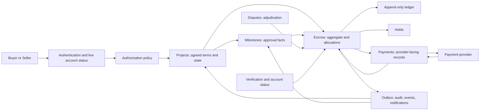
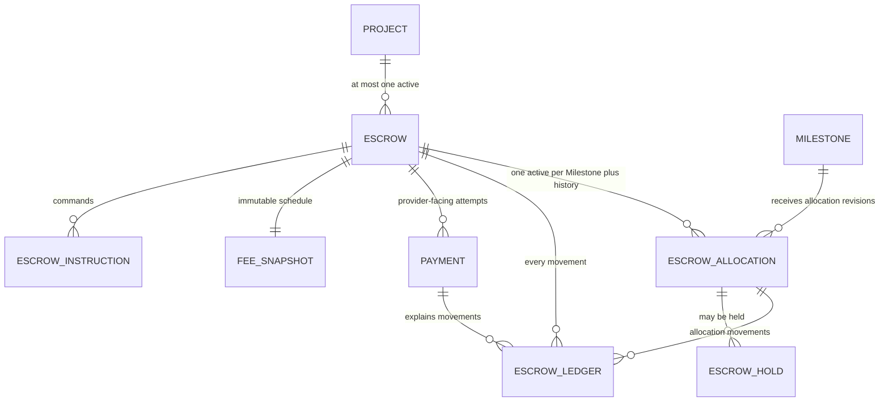
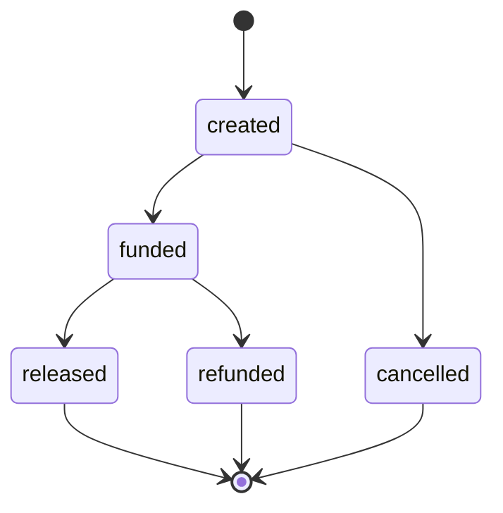
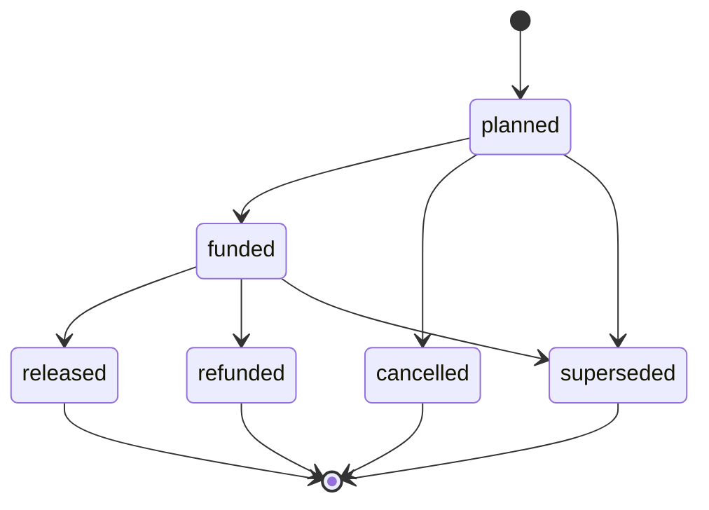
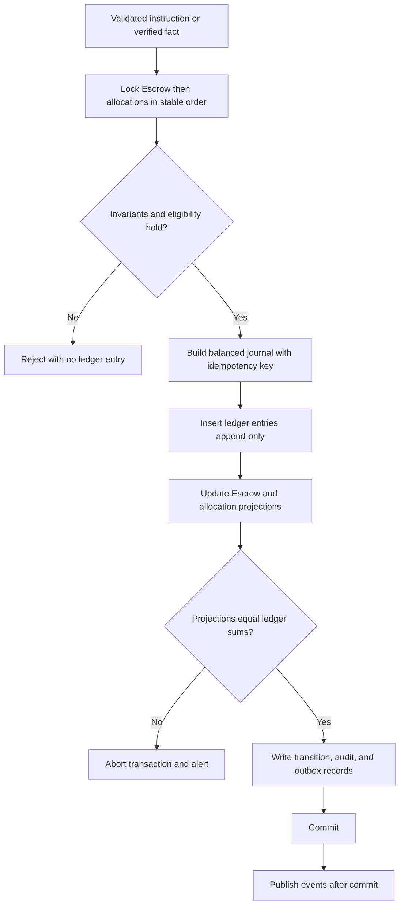
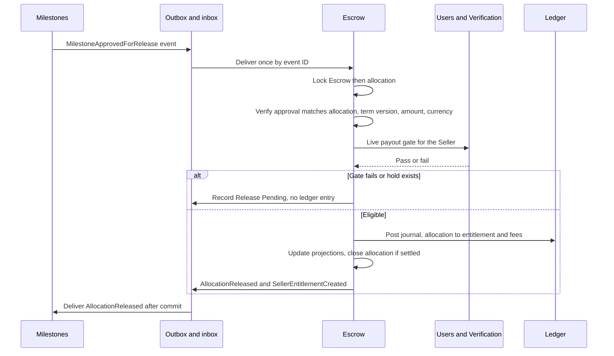
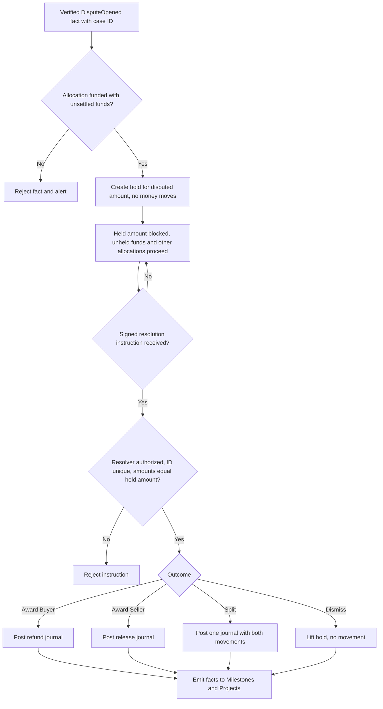
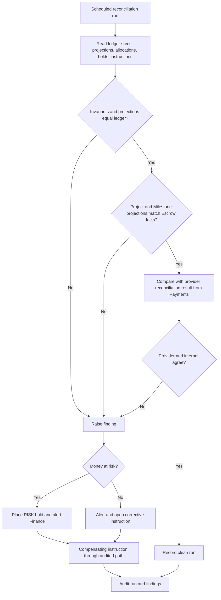
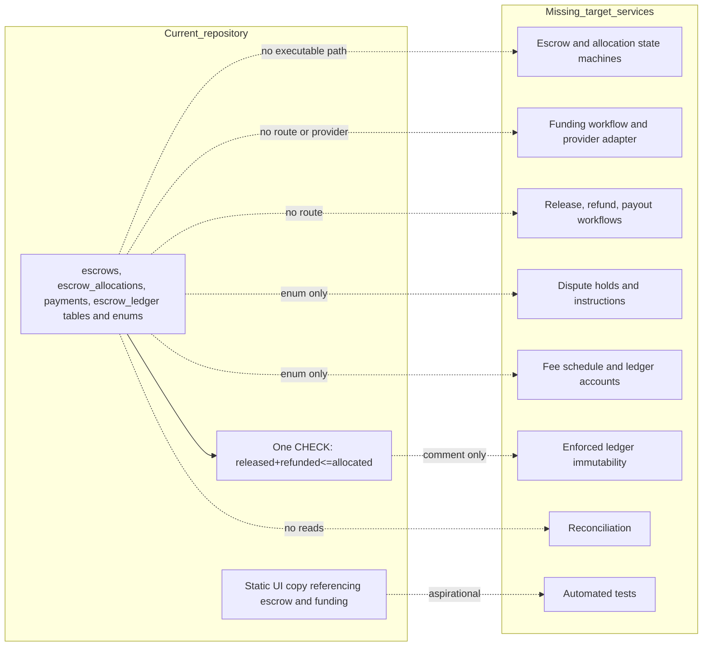
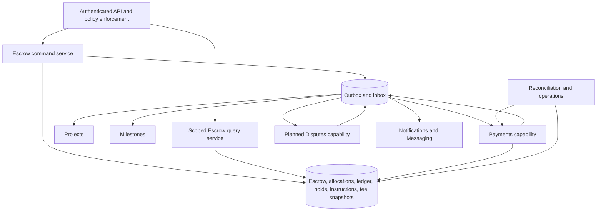

# Escrow domain specification

| Metadata | Value |
| --- | --- |
| Document ID | `SPEC-ESCROW-000` (provisional; see Section 3) |
| Type | Specification (SPEC) |
| Domain | Escrow, allocations, ledger, release, refund, and financial outcomes (governed `ESCROW` token) |
| Status | Proposed |
| Version | 0.2.0 |
| Owner | Product and Architecture |
| Last Reviewed | 2026-09-25 |
| Applies To | Target Escrow product architecture and verified current repository comparison |
| Governed token | `ESCROW` |
| Canonical path | `docs/06-payments-escrow/escrow.md` |
| Product horizon | Target product architecture with verified repository comparison |
| Supersedes / Superseded By | None; companion to [payments.md](payments.md), which owns provider-facing Payment mechanics |

## 1. Executive summary

Escrow is MusicApp's financial authority for protected Project funds. It holds a Buyer's money between funding and release, divides that money into per-Milestone allocations, releases earned amounts to the Seller, refunds unearned amounts to the Buyer, freezes disputed amounts, and keeps a complete, append-only record of every movement. It is the only domain permitted to change the financial state of a transaction ([System Architecture Section 10.7](../01-foundation/system-architecture.md#107-escrow)). Projects, Milestones, Disputes, Administration, and every client only request financial actions or supply facts. None of them writes money.

This specification makes the following principal decisions. Each is labeled as target architecture and none describes current behavior.

- **One authority for money.** An append-only, balanced ledger is the single source of truth for every movement. Escrow and allocation totals are transactional projections that must always agree with it, and a database check and scheduled reconciliation prove that they do.
- **MVP funding is Project-wide and up front.** The Buyer funds the entire agreed obligation in one funding. The Escrow becomes funded only when confirmed protected funds equal the expected amount exactly, and all allocations become funded together. Per-Milestone and staged funding are future architecture. This resolves [Milestones Question Q3](../05-projects-milestones/milestones.md#361-open-questions-table).
- **Release is not payout.** Buyer approval is a Milestone fact that makes an allocation eligible for release. Release is an Escrow ledger movement to a Seller entitlement. Payout is a separate provider-facing transfer of that entitlement to the Seller's payout account, executed under [payments.md](payments.md). Approval, release, and payout are three facts with three records.
- **Holds, not state copying, express disputes.** A dispute freezes only the disputed amount of the affected allocation through an Escrow hold. The Dispute domain decides who is right. Escrow applies a signed, idempotent instruction to the held amount and never adjudicates.
- **Fees are architecture, not percentages.** No specification or code establishes any fee kind or rate. This document defines how fees are snapshotted, computed in integer minor units, ledgered, and disclosed, and leaves every rate, payer, and tax rule as configuration or policy Open Questions.

The repository contains a partial financial schema and nothing more. Migration 006 creates `escrows`, `escrow_allocations`, `payments`, and `escrow_ledger` tables and five enums, with 32-bit integer amounts and unrestricted currency text. The database enforces `released_amount + refunded_amount <= allocated_amount` on allocations, but the ledger is not immutable, no total is tied to the ledger, no table has idempotency, versioning, or a payee, and no route, service, provider integration, webhook, frontend screen, or automated test touches any of it. This specification defines the future product independently of those limits and labels every repository observation with one of the required implementation statuses.

## 2. Purpose and scope

This document is canonical for:

- the Escrow aggregate, its states, transitions, and totals;
- Escrow allocations to Milestones, their states, and their invariants;
- the append-only ledger, its accounts, entry types, journals, and correction rules;
- the funding model and fundability, and the Escrow side of funding confirmation;
- release eligibility and execution, refund decisions, cancellation financial outcomes, and dispute holds and instructions;
- Escrow's treatment of chargebacks and provider reversals;
- fee snapshot, calculation, ledger representation, rounding, and disclosure architecture;
- currency and money representation across the financial domain;
- financial eligibility as it depends on account status and Verification;
- Escrow authorization, idempotency, concurrency, audit, internal reconciliation, target data, dependencies, security findings, and migration guidance.

This document deliberately does not define Payment records, provider adapters, webhook processing, payout execution, or provider reconciliation, which [payments.md](payments.md) owns. It does not define adjudication, evidence rules, or Dispute states, which a future Disputes specification owns. It does not define Project lifecycle ([Projects](../05-projects-milestones/projects.md)), Milestone lifecycle ([Milestones](../05-projects-milestones/milestones.md)), identity verification workflow ([Verification](../03-identity-profiles-verification/verification.md)), or Notification delivery.

## 3. Governance, structure, status, and authority

### 3.1 Governed path, token, and document structure

[Governance Section 4](../00-governance/README.md#4-directory-structure) maps `06-payments-escrow/` to "Escrow, payments, ledger, payouts". [Governance Section 11](../00-governance/README.md#11-requirement-identifiers) lists `ESCROW` among the permitted domain tokens and lists no `PAYMENTS` token. Both documents in this directory therefore use the single governed `ESCROW` token, and no `PAYMENTS` token is used.

The domain is documented as two specifications in the same governed directory:

| Document | Concern | Why it is separate |
| --- | --- | --- |
| [escrow.md](escrow.md) (this document) | Custody, allocations, ledger, funding obligation, release and refund decisions, cancellation and dispute financial outcomes, fees, currency, eligibility | Owns the financial truth and the Escrow and allocation state machines |
| [payments.md](payments.md) | Payment records, Payment state machine, provider adapter, funding payment mechanics, webhooks, payouts, refund execution, chargeback intake, provider reconciliation | Owns provider interaction, its own state machine, its own untrusted-input security surface, and its own data |

The split follows [Governance Section 4](../00-governance/README.md#4-directory-structure), which asks that domain directories be split by concern rather than accumulated into one file, and [Governance Section 6](../00-governance/README.md#6-file-naming-standards), which asks for descriptive noun file names. It is not cosmetic. The two halves have independent state machines (Escrow and allocation versus Payment), independent responsibilities (deciding what money is owed versus moving it through a provider), independent provider interaction, independent data models, and independent security concerns (ledger integrity versus webhook forgery). The split is a documentation split only. [System Architecture Sections 9 and 10.7](../01-foundation/system-architecture.md#107-escrow) and [Projects Section 4](../05-projects-milestones/projects.md#4-terminology-and-domain-boundaries) place payment ownership inside the Escrow domain, and separating Payments into its own domain would require a Foundation change or ADR that this document does not make.

The paths were checked before creation: `docs/06-payments-escrow/` exists and is empty, and no other Escrow or Payments specification exists.

### 3.2 Status and authority

This document has status **Proposed**. It has not undergone product review and is not Approved, which Governance defines as reviewed and accepted ([Governance Section 9](../00-governance/README.md#9-document-status-lifecycle)). Its version is `0.1.0`. `SPEC-ESCROW-000` is a document tracking label, not a Governance-defined identifier family, following the precedent of `SPEC-PROJECTS-000` in Projects. Governance defines no `EVT-*` or `OPS-*` family, so those identifiers here are provisional pending a Governance amendment. The required glossary at `docs/99-appendices/glossary.md` does not exist, so the definitions in Section 4 are provisional.

Existing governed specifications take precedence under [Governance Section 3](../00-governance/README.md#3-documentation-hierarchy). This document does not modify or reinterpret Projects, Milestones, Authentication, Authorization, Verification, Users, Assets, Foundation, or Governance. Where it needs one of their rules it cites the section or identifier and adds only the financial consequence.

The implementation labels used are:

| Label | Meaning |
| --- | --- |
| Implemented | End-to-end behavior exists and was verified in the current repository. |
| Partially Implemented | Some executable path exists but one or more target guarantees are absent. |
| Schema Implemented | Database structure exists without the required executable domain behavior. |
| Planned | A repository artifact or existing specification declares intent but no complete behavior exists. |
| Not Implemented | No verified implementation was found. |

`Not Implemented` is a task-required repository-observation label, not an addition to the Foundation status taxonomy. Target rules are normative even when their repository status is Planned or Not Implemented. Where a repository claim comes from reading SQL rather than executing it (no PostgreSQL client was available), the text says so.

### 3.3 Identifier ranges and inherited collision

The complete current specification tree was searched before assigning identifiers. Under the `ESCROW` token the only existing identifiers are `BR-ESCROW-001` and `BR-ESCROW-002` (in Governance Section 28, [Product Overview Section 11](../01-foundation/product-overview.md#11-core-business-rules), and System Architecture Section 10.7) and Governance's illustrative `REQ-ESCROW-014`. `REQ-ESCROW-014` appears only as a format example in the Governance identifier table, but it is treated as reserved and skipped to avoid any ambiguity. Ranges are shared with the companion document without overlap:

| Family | This document | [payments.md](payments.md) | Governed |
| --- | --- | --- | --- |
| `REQ-ESCROW-*` | 001–013, 015–022, 036 | 023–035 | Yes, Governance Section 11 |
| `BR-ESCROW-*` | 003–033, 049 | 034–048 | Yes, Governance Section 11 |
| `SEC-ESCROW-*` | 001–014 | 015–028 | Yes, Governance Section 11.1 |
| `DATA-ESCROW-*` | 001–006 | 007–011 | Yes, Governance Section 11.1 |
| `INT-ESCROW-*` | 001–010 | 011–020 | Yes, Governance Section 11.1 |
| `AUD-ESCROW-*` | 001–006 | 007–010 | Yes, Governance Section 11.1 |
| `EVT-ESCROW-*` | 001–008 | 009–014 | No; provisional |
| `OPS-ESCROW-*` | 001–006 | 007–011 | No; provisional |
| `SPEC-ESCROW-*` | `000` | `001` | No; provisional |

`REQ-ESCROW-036` and `BR-ESCROW-049` were added on 2026-09-25, continuing after both documents' prior ceilings (`REQ-ESCROW-035`, `BR-ESCROW-048`), to reconcile the Buyer non-response product decision described in [Milestones Section 18.2](../05-projects-milestones/milestones.md#182-buyer-non-response-and-platform-intervention).

The inherited collision is a pre-existing Layer 0 and Layer 1 defect that this document neither creates nor repairs. Governance Section 28 and System Architecture Section 10.7 use `BR-ESCROW-001` for the allocation invariant `released + refunded <= allocated`. Product Overview Section 11 uses the same identifier for "a project's budget MUST be held in escrow and released only against buyer-approved milestones". `BR-ESCROW-002` (ledger immutability) has the same meaning everywhere and is unaffected. Governance controls, so `BR-ESCROW-001` below means the allocation totals invariant. The Product Overview meaning keeps its historical citation and is expressed here under new `BR-ESCROW-013` and `BR-ESCROW-014`. This document does not redefine `BR-ESCROW-001` or `BR-ESCROW-002`. It extends the first as `BR-ESCROW-011` and specifies enforcement of the second as `BR-ESCROW-009`.

### 3.4 Reconciliation items

The following contradictions and gaps between existing documents were found while authoring. No existing document was modified. Unresolved items appear in Section 34.

| Item | Documents and sections | Finding | Treatment here |
| --- | --- | --- | --- |
| ER1 | Governance Sections 15 and 28; Product Overview Section 11; System Architecture Section 10.7 | `BR-ESCROW-001` has two meanings | Governance meaning controls; see Section 3.3 |
| ER2 | [Users `BR-USERS-011`](../02-users-roles-permissions/users.md#9-business-rules) ("receiving escrow releases"); [Authorization `BR-AUTHZ-010`](../02-users-roles-permissions/authorization.md#15-escrow-and-financial-authorization) and [Verification Section 25](../03-identity-profiles-verification/verification.md#25-verification-levels-and-capability-unlocking) ("receiving escrow payouts") | The documents use "release" and "payout" interchangeably | Release and payout are separate operations here, and Identity Verified is evaluated live at both (Section 20) |
| ER3 | Governance Section 4 ("Escrow, payments, ledger, payouts") versus System Architecture Section 9 (Escrow owns payments) | One directory and one token for what is described as several concerns | Two documents, one domain and token; no ownership split |
| ER4 | Migration 006 enums versus target model | `payment_type` values `milestone_release` and `milestone_refund` treat an Escrow decision as a provider payment; `escrow_status` includes `disputed`, which duplicates Dispute state; `escrow_status` includes `funding_pending` and `refund_pending`, which duplicate Payment state | Target maps them (Section 31); legacy values are retained in the enum during migration and never written |
| ER5 | [Projects Section 20](../05-projects-milestones/projects.md#20-escrow-and-payment-relationship) fundability includes "required Seller payout verification policy"; Users `BR-USERS-011` says verification blocks only receiving releases | Whether Seller verification must precede funding is unresolved | This document defers to policy: a configurable pre-funding check, default non-blocking; Question EQ4 |
| ER6 | [Milestones Section 19.1](../05-projects-milestones/milestones.md#191-completion-semantics) default split mapping versus this document | Milestones gave a default mapping pending this specification | Confirmed and extended in Section 12; consistent, no contradiction |
| ER7 | User brief lists Seller activation fee, Buyer protection fee, and commission | No specification or code establishes any of them | Not adopted as canonical; fee kinds are configuration (Section 19); Question EQ1 |
| ER8 | Product decision, 2026-09-25; [Milestones Section 18.2](../05-projects-milestones/milestones.md#182-buyer-non-response-and-platform-intervention) | Milestones' `delivered` → `buyer_approved` transition may now be entered through an ordinary Buyer approval (M07) or a platform non-response release authorization (M18); both are distinct Milestones-owned records | Escrow's release-eligibility fact (Section 14.1) treats both sources identically and evaluates neither Buyer intent nor non-response policy itself, which remain entirely Milestones-owned; see `BR-ESCROW-049` |

## 4. Terminology and domain boundaries

| Term | Local definition |
| --- | --- |
| Escrow | The aggregate that holds protected funds for one Project agreement and is the financial authority over them. |
| Protected funds | Buyer money confirmed received and held by the platform pending release or refund. |
| Allocation | Immutable-amount division of Escrow funds assigned to one active Milestone. |
| Hold | A recorded restriction on a specific amount of an allocation that blocks its release or refund. |
| Journal | A group of ledger entries posted atomically whose debits equal credits per currency. |
| Ledger entry | One append-only movement of a positive amount from a source account to a destination account. |
| Release | An Escrow ledger movement from protected funds to a Seller entitlement. |
| Seller entitlement | Released funds the platform owes the Seller and has not yet paid out. |
| Payout | A provider-facing transfer of entitlement to the Seller's payout account (see [payments.md](payments.md)). |
| Refund | A decision and ledger movement returning protected funds to the Buyer, executed through the original funding Payment. |
| Compensating entry | A new ledger entry that reverses the effect of an earlier one without altering it. |
| Projection | A stored total or state maintained in the same transaction as ledger posting and verifiable against the ledger. |
| Payout gate | The live Verification and account-status check required to receive release or payout. |
| Instruction | A validated command to Escrow (release, refund, hold, resolve) with a unique key. |

The ownership map in [System Architecture Sections 9 and 10.7](../01-foundation/system-architecture.md#107-escrow) controls:

- Escrow owns holding money, release, refunds, disputes in part, and the financial audit trail. It never edits Projects, Milestones, messages, or Profiles.
- Projects owns Project state and the agreed term snapshot from which Escrow is created ([Projects Section 14](../05-projects-milestones/projects.md#14-commercial-terms-and-currency)).
- Milestones owns line items and the approval fact ([Milestones Section 18](../05-projects-milestones/milestones.md#18-buyer-approval)) and consumes Escrow facts ([Milestones Section 14](../05-projects-milestones/milestones.md#14-funding-relationship)).
- Payments is a capability inside this domain, specified in [payments.md](payments.md).
- Disputes is owned by Escrow in part under the Foundation map. This document defines only the financial contract; adjudication remains for a Disputes specification. A separate Disputes owner requires a Foundation change or ADR.
- Verification owns identity level and status. Users owns account status. Authorization decides whether an actor may request an action.
- Assets owns file evidence. Financial exports use Assets' System-Generated Export purpose.

## 5. Canonical principles and architecture

The following rules apply throughout this specification and [payments.md](payments.md):

1. Escrow is the financial authority for protected Project funds. Nothing else writes financial state.
2. Project, Milestone, Escrow, allocation, Payment, Deliverable, and Dispute states are independent state machines.
3. A Project has at most one active canonical Escrow for its commercial agreement. Milestones receive financial allocations through Escrow.
4. Money is integer minor units, 64-bit in the target. Floating-point money is prohibited. Currency is one value across Project, Milestone, Escrow, allocation, Payment, and ledger.
5. The append-only ledger is the sole authority for money movement. Totals are projections that must equal it.
6. Ledger and financial records are never updated destructively or hard-deleted. Corrections are compensating entries.
7. Funding, allocation, release, refund, payout, hold resolution, and provider events are idempotent, and provider retries never duplicate movement.
8. Client-supplied payment or escrow state is never authoritative. Provider callbacks are untrusted until authenticated and validated.
9. Buyer approval is a release-eligibility fact, not proof that money moved. Release is not payout.
10. Ratings never authorize, delay, or block release. A missing Rating never holds earned release ([Projects Section 21](../05-projects-milestones/projects.md#21-ratings-and-reviews) and `BR-PROJECTS-023`).
11. Cancellation is not refund and refund is not cancellation. A dispute freezes eligible funds without rewriting history.
12. Administrative power is not a shortcut around ledger invariants (`BR-AUTHZ-004`, `BR-AUTHZ-012`).
13. Every financial mutation is authorized, audited, versioned, and atomic with its ledger, projection, and outbox writes.

*Figure 1 — Financial Domain Architecture. Escrow decides and records money movement, Payments executes provider interaction, and every other domain supplies facts or consumes outcomes.*

## 6. State separation and aggregate relationships

### 6.1 Separate state machines

No state in one machine is a copy of a state in another. Each machine's state changes only through its own owner.

| Machine | Owner | Representative values | Escrow's relationship |
| --- | --- | --- | --- |
| Project | Projects | Awaiting Funding, Funded, In Progress, Cancelled, Refunded | Projects derives Funded and Refunded from Escrow facts and never writes Escrow ([Projects Section 20](../05-projects-milestones/projects.md#20-escrow-and-payment-relationship), `BR-PROJECTS-022`) |
| Milestone | Milestones | `planned`, `funded`, `buyer_approved`, `released`, `refunded` | Milestones enters `funded`, `released`, `refunded` only from Escrow facts (`BR-PROJECTS-038`); allocation state never equals Milestone state |
| Escrow | Escrow | `created`, `funded`, `released`, `refunded`, `cancelled` | This document |
| Allocation | Escrow | `planned`, `funded`, `released`, `refunded`, `cancelled`, `superseded` | This document |
| Payment | Escrow (Payments) | `created`, `processing`, `succeeded`, `failed`, `reversed` | [payments.md Section 7](payments.md#7-payment-states); Escrow reads it and does not copy it |
| Dispute | Disputes owner | Owned outside this document | Escrow consumes open and resolve facts and holds funds |
| Provider chargeback | Payments | `notified`, `evidence_submitted`, `won`, `lost` | Distinct from Dispute state ([payments.md Section 13](payments.md#13-chargebacks-and-provider-reversals)) |

### 6.2 Relationship model

The relationship is Project to Escrow to allocation to Milestone. A Project has at most one active Escrow. An Escrow has one active allocation per active Milestone, and superseded revisions are retained as history. Every Payment and ledger entry references an Escrow, and where relevant an allocation and a Milestone.

*Figure 2 — Project to Escrow to Allocation to Milestone Relationship. An allocation binds one Milestone revision to the Escrow, and ledger, Payments, holds, and instructions hang from the Escrow.*

## 7. Currency and money representation

### 7.1 Established currency direction

INR as the MVP currency is established in three places that were verified: [Product Overview Section 11 `BR-PROJECTS-003`](../01-foundation/product-overview.md#11-core-business-rules) (every API-created Project and Milestone is INR), the application constant `PROJECT_CURRENCY = "INR"` in [`backend/Index.js`](../../backend/Index.js), and [Projects Section 14](../05-projects-milestones/projects.md#14-commercial-terms-and-currency), which keeps `INR` for MVP and requires a validated currency and exponent. It is not inferred from frontend comments. The database does not enforce it: every `currency` column in migration 006 is unrestricted `TEXT`, so the rule lives only in application code, and historical rows may hold other currencies ([Milestones Section 26.2](../05-projects-milestones/milestones.md#262-existing-schema-and-migration-implications)).

### 7.2 Currency matrix

| Concern | Target rule | Repository status |
| --- | --- | --- |
| MVP supported currency | `INR`, exponent 2, from a governed supported-currency registry | Partially Implemented: constant in the Project route only |
| Project currency | Agreed currency snapshot from the agreed term version; immutable from first funding attempt ([Projects Section 14](../05-projects-milestones/projects.md#14-commercial-terms-and-currency)) | Partially Implemented: `projects.currency` unrestricted `TEXT` |
| Milestone currency | Equals Project currency and exponent ([Milestones Section 9](../05-projects-milestones/milestones.md#9-milestone-commercial-terms)) | Partially Implemented |
| Escrow currency | Copied from the agreed snapshot at creation; immutable | Schema Implemented: `escrows.currency TEXT`, no constraint |
| Allocation currency | Equals Escrow currency, checked by constraint | Schema Implemented: `escrow_allocations.currency TEXT`, no constraint |
| Payment currency | Equals Escrow currency for funding, refund, and payout | Schema Implemented: `payments.currency TEXT`, no constraint |
| Ledger currency | Equals the Escrow currency on every entry; a journal is single-currency | Schema Implemented: `escrow_ledger.currency TEXT`, no constraint |
| Payout and refund currency | Equal to Escrow currency; provider must settle in it | Not Implemented |
| Mismatch handling | Any mismatch is rejected before effect. A provider event whose currency differs is quarantined and alerted, never applied | Not Implemented |
| Storage type | Signed 64-bit integer minor units with a currency exponent snapshot; never a decimal or floating type | Partially Implemented: 32-bit `INTEGER`, unit unconfirmed by backend evidence |
| Zero-decimal currencies | Exponent `0`; the stored integer is the whole-unit count; parsing and display are currency-aware | Not Implemented |
| Rounding | No rounding of principal amounts. Fee rounding follows Section 19.3 | Not Implemented |
| Future multi-currency | One currency per Escrow. Cross-currency funding or payout needs an FX specification, conversion ledger accounts, and an ADR; none is in MVP | Planned |

`REQ-ESCROW-003`: The system MUST represent every financial amount as a currency-bound signed 64-bit integer of minor units with an exponent snapshot, MUST prohibit floating-point money, and MUST enforce one currency across Project, Milestone, Escrow, allocation, Payment, and ledger by database constraint and by domain validation.

## 8. Funding model

### 8.1 Model evaluation

The Milestones question this section resolves is Q3: "Is funding taken Project-wide up front or per Milestone, and is partial funding permitted?" ([Milestones Section 36.1](../05-projects-milestones/milestones.md#361-open-questions-table)). Existing product principles are sufficient to resolve it, because the Foundation states the commercial model as "fund the work through escrow, and release payment milestone-by-milestone" ([Product Overview Section 1](../01-foundation/product-overview.md#1-executive-summary)) and Projects models a single Project-level funding fact with per-Milestone allocations ([Projects Section 20](../05-projects-milestones/projects.md#20-escrow-and-payment-relationship)).

| Criterion | A. Entire Project up front | B. Each Milestone independently | C. Hybrid staged funding |
| --- | --- | --- | --- |
| Buyer protection | Funds are protected from the first day; capital is committed early | Least capital at risk; larger dependence on later funding | Balanced |
| Seller protection | Strongest: work starts only against funds already held | Weakest: a Milestone can start unfunded or the next Milestone can stall | Good for funded stages |
| Implementation safety | One funding, one confirmation, one reconciliation | Many fundings and more race conditions | Most complex |
| Fit with Project and Milestone architecture | Matches the single Project `Funded` fact and Milestones' sequential activation | Would require per-Milestone Project-level facts that Projects does not define | Needs staging rules and amendments |
| Escrow allocation model | One Escrow, one funding, atomic allocation | One Escrow with several partial fundings | Several partial fundings |
| Cancellation | Refund of unreleased allocations is one operation | Fewer refunds, but unfunded Milestones need renegotiation | Mixed |
| Dispute behavior | Holds apply to funds that already exist | Disputes over unfunded work are undefined | Mixed |
| Existing schema | Fits: `payments_no_milestone_for_escrow_fund` forces funding at Escrow level | Contradicts that CHECK | Partly contradicts |
| Existing product requirements | Matches | Not established | Not established |

**Decision (target MVP model): A.** The Buyer funds the entire agreed obligation in one funding. Per-Milestone and staged funding (B and C) are future architecture. The ledger and allocation model deliberately support them without change, because `funded_amount` and allocation funded status are recorded per allocation, so a later specification can add staged rounds without redefining Escrow. The current implementation has no funding at all.

### 8.2 Funding matrix

| Concern | Target rule | Repository status |
| --- | --- | --- |
| Fundability | A Project is fundable only when Seller acceptance and an agreed term version exist, every active Milestone is `agreed` and reconciles to the agreed total, the Buyer is eligible (Section 20), the currency is supported, no dispute, hold, or suspension applies, and an idempotent funding intent is supplied ([Projects Section 20](../05-projects-milestones/projects.md#20-escrow-and-payment-relationship)) | Not Implemented |
| Escrow creation | Created from the agreed term version at first funding intent; never from client input. An unfunded Escrow is cancelled and replaced when agreed terms change | Not Implemented |
| Funding amount | The expected amount is the sum of active allocation amounts. The charge may exceed it only by disclosed Buyer-side fee lines from the fee snapshot (Section 19). Protected funds equal the expected amount | Not Implemented |
| Funding currency | Escrow currency; single value | Not Implemented |
| Allocation at funding | On confirmation the system allocates the whole amount to active Milestones in one journal, and every allocation becomes `funded` atomically | Not Implemented |
| Partial funding | Not permitted in MVP. A payment that confirms less than the expected amount does not advance the Escrow. Whether the residual is refunded or completed is a Payments matter ([payments.md Section 9](payments.md#9-funding-payments)) | Not Implemented |
| Underfunding | The Escrow stays `created`; no allocation is funded; the Project stays Awaiting Funding | Not Implemented |
| Overfunding | Prohibited. Confirmed amount above expected plus disclosed fees is quarantined and the excess refunded through the funding Payment | Not Implemented |
| Duplicate funding | One funding per Escrow. Further confirmed payments are duplicates: recorded, alerted, and refunded, never applied | Not Implemented |
| Funding deadline and expiry | A funding intent has a configurable expiry. Durations are not established and are an Open Question (EQ2). The mechanism is fixed: expired intents move their Payment to `cancelled` and leave the Escrow `created` | Not Implemented |
| Failed funding | Payment `failed`; Escrow unchanged; Project unchanged; the Buyer may retry with a new Payment | Not Implemented |
| Abandoned funding | An Escrow that is never funded and whose Project is cancelled moves to `cancelled` with no ledger movement | Not Implemented |
| Provider authorization and capture | Only captured funds count. An authorization that is not captured moves no money and records no ledger entry ([payments.md Section 9](payments.md#9-funding-payments)) | Not Implemented |
| Confirmation | The Escrow acts only on a verified Payment `succeeded` whose provider amount, currency, and owning intent match exactly | Not Implemented |
| Reconciliation | Provider, Payment, ledger, Escrow, and allocation totals are reconciled on a schedule (Section 23) | Not Implemented |
| Facts emitted | `EscrowFunded` and a per-Milestone `AllocationFunded` naming Project, Milestone, term version, currency, and amount ([Milestones Section 14.1](../05-projects-milestones/milestones.md#141-funding-matrix)) | Not Implemented |

`REQ-ESCROW-004`: The system MUST fund the entire agreed obligation in one up-front funding for the MVP, MUST advance the Escrow to `funded` only when confirmed protected funds equal the expected amount exactly, and MUST fund all active allocations atomically.

## 9. Escrow aggregate

### 9.1 Authority of totals

Financial truth has one authority: the ledger (Section 13). Every total on the Escrow and on each allocation is a **projection** written only by the ledger-posting function in the same transaction as the journal it summarizes, and verified by a deferred database check and by scheduled reconciliation. Some values are **derived** at read time and never stored. A value is **stored** only when it is identity, a snapshot, or a state.

| Total | Definition | Class |
| --- | --- | --- |
| `funded_amount` | Sum of `funded` entries minus `funding_reversed` entries for the Escrow | Projection |
| `allocated_amount` | Sum of active allocation amounts | Projection |
| `released_amount` | Sum of gross amounts leaving allocations toward Seller entitlement and fees | Projection |
| `refunded_amount` | Sum of gross amounts leaving allocations toward the Buyer | Projection |
| `held_amount` | Sum of open hold amounts | Derived from holds |
| `available_amount` | `funded_amount - released_amount - refunded_amount - held_amount` | Derived |
| `unallocated_amount` | `funded_amount - allocated funded amounts` | Derived |
| `funding_gap` | `expected_amount - funded_amount` | Derived |

### 9.2 Escrow field matrix

| Field | Target representation | Class and authority | Mutability | Repository status |
| --- | --- | --- | --- | --- |
| `id` | UUID PK | Stored; Escrow | Immutable | Implemented |
| `external_id` | Opaque unique text | Stored; Escrow | Immutable | Partially Implemented: column exists; nothing generates it |
| `project_id` | UUID FK to Projects, `RESTRICT` | Stored; Escrow | Immutable | Partially Implemented: FK with `ON DELETE CASCADE`, UNIQUE |
| `agreed_term_version` | Reference to the Project agreed term version | Snapshot | Immutable | Not Implemented |
| `buyer_user_id` | UUID FK to Users, `RESTRICT` | Snapshot of the Project Buyer at creation, kept as immutable financial evidence; never an authorization source | Immutable | Not Implemented: no Buyer column; payer appears only on `payments` |
| `seller_user_id` | UUID FK to Users, `RESTRICT` | Snapshot of the accepted Seller at creation, kept as immutable beneficiary evidence per `BR-USERS-018`; never an authorization source | Immutable | Not Implemented |
| `currency`, `currency_exponent` | Supported ISO 4217 code and exponent snapshot | Snapshot | Immutable | Partially Implemented: unrestricted `TEXT`, no exponent |
| `expected_amount` | Signed 64-bit minor units, positive; equals the sum of active allocations at creation | Snapshot, changed only by an accepted amendment through supplemental funding (Section 11.3) | Immutable after creation except by amendment | Partially Implemented: `amount INT`, positive CHECK |
| `funded_amount` | Minor units | Projection | Ledger-posting function only | Partially Implemented: stored mutable `INT`, nonnegative CHECK, not tied to any ledger |
| `allocated_amount` | Minor units | Projection | Ledger-posting function only | Not Implemented |
| `released_amount` | Minor units | Projection | Ledger-posting function only | Partially Implemented: stored mutable `INT`, nonnegative CHECK |
| `refunded_amount` | Minor units | Projection | Ledger-posting function only | Partially Implemented: stored mutable `INT`, nonnegative CHECK |
| `held_amount` | Minor units | Derived from open holds | Not stored | Not Implemented |
| `available_amount`, `unallocated_amount`, `funding_gap` | Minor units | Derived | Not stored | Not Implemented |
| `status` | Governed enum (Section 10) | Stored; Escrow | Transition service only | Partially Implemented: enum with default `created`, no service |
| `fee_snapshot_id` | FK to the immutable fee schedule snapshot | Snapshot | Immutable | Not Implemented |
| `funded_at` | Timestamptz | Stored, set on the funding journal | Set once | Not Implemented |
| `closed_at`, `cancelled_at` | Timestamptz | Stored | Set once | Not Implemented |
| `version` | Monotonic bigint | Stored | Every mutation | Not Implemented |
| `retention_status` | Retain, eligible, held, or anonymized projection | Derived from governed retention decisions | Not stored authoritative | Not Implemented |
| `created_at`, `updated_at` | Timestamptz | Stored; database | `updated_at` trigger-maintained | Implemented and Partially Implemented respectively (no maintenance trigger) |
| Provider relationship | None on Escrow; provider identity lives on Payments | Not applicable | Not applicable | Not applicable |

The Escrow has no Buyer or Seller column in the current schema. The Buyer and Seller snapshots recorded here are financial evidence so that history remains attributable after Project data or participants change. They differ from the Milestone rule against party columns ([Milestones Section 6.2](../05-projects-milestones/milestones.md#62-ownership-and-party-semantics)) because an immutable financial record must not depend on mutable relationships. Authorization always resolves the live Project relationship.

`REQ-ESCROW-005`: Every Escrow and allocation total MUST be a projection maintained only by ledger posting in the same transaction and MUST equal the ledger, and the Escrow MUST NOT accept a client-, service-, Moderator-, or Administrator-written total or state.

## 10. Escrow states and transitions

### 10.1 Escrow state matrix

The current `escrow_status` enum has nine values. Distinctions that duplicate Payment or Dispute state, or that are functions of the totals, are derived instead of stored, giving the smallest deterministic model that preserves the meaningful financial distinctions.

| Stored state | Meaning | Entered by | Exits | Terminal | Repository status |
| --- | --- | --- | --- | --- | --- |
| `created` | Escrow exists for an agreed term version and holds no confirmed funds | Escrow creation | `funded`, `cancelled` | No | Schema Implemented: enum default; no row is ever created |
| `funded` | Required protected funds confirmed and held; includes partial settlement progress and holds | Verified funding | `released`, `refunded` | No | Schema Implemented |
| `released` | Closed: all protected funds settled and at least one amount was released to the Seller | Final settlement | None | Yes | Schema Implemented |
| `refunded` | Closed: all protected funds settled and nothing was released to the Seller | Final settlement | None | Yes | Schema Implemented |
| `cancelled` | Closed without ever holding funds | Abandonment or Project cancellation before funding | None | Yes | Schema Implemented |

| Derived qualifier | Derivation | Legacy enum value it replaces |
| --- | --- | --- |
| Funding pending | `created` with a non-terminal funding Payment | `funding_pending` |
| Partially released | `funded` with `0 < released_amount` and funds remaining | `partially_released` |
| Refund pending | A refund Payment is non-terminal | `refund_pending` |
| Held | At least one open hold | `disputed` |
| Supplement pending | `funded` with `funding_gap > 0` after an amendment | none |

The legacy values `funding_pending`, `partially_released`, `refund_pending`, and `disputed` remain in the PostgreSQL enum because values cannot be safely removed, but the target never writes them. The Foundation state sketch that goes `funded` to `disputed` is non-normative ([Product Overview Section 10.4](../01-foundation/product-overview.md#104-escrow-lifecycle) and System Architecture Section 10.7). A dispute is a hold on funds, not an Escrow state, so Escrow state never duplicates Dispute state.

### 10.2 Escrow transition matrix

| ID | From → to | Initiator | Permission | Preconditions | External facts | Side effects | Audit and events | Idempotency and concurrency | Repository status |
| --- | --- | --- | --- | --- | --- | --- | --- | --- | --- |
| E01 | New → `created` | Escrow service on a Projects funding intent | `escrow.create` service capability | Fundable (Section 8.2); no active Escrow for the Project; fee snapshot fixed | Projects agreed term version | Insert Escrow and fee snapshot; no ledger entry | `AUD-ESCROW-001`; `EVT-ESCROW-001` | Intent key; Project locked | Schema Implemented |
| E02 | `created` → `funded` | Escrow service on a verified funding fact | Trusted event capability | Payment `succeeded`; confirmed amount, currency, and owning intent match; no hold; no stale Project version | Payments: verified funding | Post funding journal, allocate all Milestones, set `funded_at` | `AUD-ESCROW-002`; `EVT-ESCROW-002`, `EVT-ESCROW-003` | Unique funding event; lock Escrow then allocations | Schema Implemented |
| E03 | `created` → `cancelled` | Escrow service on Project cancellation, superseded terms, or abandonment | `escrow.cancel` service capability | No non-terminal funding Payment; no funds | Projects cancellation or supersession fact | Set `cancelled_at`; no ledger entry | `AUD-ESCROW-001`; `EVT-ESCROW-001` | Cancellation or fact ID unique | Schema Implemented |
| E04 | `funded` → `released` | Escrow service | Internal | Every allocation terminal (`released`, `refunded`, `cancelled`, `superseded`); no open hold; `released_amount > 0` | None beyond the settled ledger | Set `closed_at` | `AUD-ESCROW-002`; `EVT-ESCROW-004` | Derived and re-checked under lock | Schema Implemented |
| E05 | `funded` → `refunded` | Escrow service | Internal | Same as E04 with `released_amount = 0` and `refunded_amount > 0` | None beyond the settled ledger | Set `closed_at` | `AUD-ESCROW-002`; `EVT-ESCROW-004` | Derived and re-checked under lock | Schema Implemented |

### 10.3 Invalid transitions

| Invalid edge or request | Reason |
| --- | --- |
| Any client, Project, Milestone, Moderator, or Administrator write of `status` | Only the transition service acts (`BR-ESCROW-030`) |
| `created` → `released` or `refunded` | No funds were ever protected |
| `funded` → `cancelled` | Protected funds must be refunded or released, not cancelled away |
| `funded` → `created` | Funding is not reversible by state; a verified reversal is a compensating ledger entry and a hold |
| `released`, `refunded`, `cancelled` → anything | Terminal. Post-close exposures such as chargebacks are ledger corrections, not reopenings (Section 18) |
| `created` → `funded` on partial, excess, duplicate, wrong-currency, or unverified confirmation | Funding requires exact verified amounts (`BR-ESCROW-006`) |

*Figure 3 — Escrow State Machine. All values are `escrow_status` enum values. Funding progress, holds, and pending refunds are derived qualifiers, not stored states.*

`REQ-ESCROW-001`: Escrow MUST be the sole financial authority for protected Project funds, MUST expose a server-owned deterministic state machine, and MUST keep its state independent of Project, Milestone, Payment, and Dispute state.

`REQ-ESCROW-002`: A Project MUST have at most one active Escrow for its commercial agreement, and every active Milestone MUST have exactly one active allocation in it.

## 11. Escrow allocations

### 11.1 Allocation field matrix

| Field | Target representation | Class and authority | Mutability | Repository status |
| --- | --- | --- | --- | --- |
| `id` | UUID PK | Stored | Immutable | Implemented |
| `external_id` | Opaque unique text | Stored | Immutable | Partially Implemented: column exists; nothing generates it |
| `escrow_id` | UUID FK, `RESTRICT` | Stored | Immutable | Partially Implemented: FK with `ON DELETE CASCADE` |
| `milestone_id` | UUID FK, `RESTRICT` | Stored | Immutable | Partially Implemented: FK with `ON DELETE CASCADE`, UNIQUE |
| `revision_number` | Positive integer, unique per Milestone | Stored | Immutable | Not Implemented |
| `term_version` | Reference to the agreed term version | Snapshot | Immutable | Not Implemented |
| `allocated_amount` | Signed 64-bit minor units, positive; equals the Milestone agreed amount | Snapshot | Immutable per revision | Partially Implemented: `INT`, positive CHECK; not tied to the Milestone amount |
| `currency` | Equals Escrow currency | Snapshot | Immutable | Partially Implemented: unrestricted `TEXT` |
| `allocation_status` | Governed enum (Section 12) | Stored | Transition service only | Not Implemented: no status column |
| `funded_amount` | Minor units; equals `allocated_amount` once funded | Projection | Ledger posting only | Not Implemented |
| `released_amount` | Minor units, gross | Projection | Ledger posting only | Partially Implemented: stored mutable `INT` |
| `refunded_amount` | Minor units, gross | Projection | Ledger posting only | Partially Implemented: stored mutable `INT` |
| `held_amount` | Minor units | Derived from open holds | Not stored | Not Implemented |
| `releasable_amount` | `funded - released - refunded - held` when a valid approval fact exists, else `0` | Derived | Not stored | Not Implemented |
| `supersedes_allocation_id` | Nullable self-reference | Stored | Immutable | Not Implemented |
| `version` | Monotonic bigint | Stored | Every mutation | Not Implemented |
| `created_at`, `updated_at` | Timestamptz | Stored | `updated_at` trigger-maintained | Implemented and Partially Implemented respectively |

### 11.2 Invariants

The following invariants are enforced by database constraints and re-checked under lock by the posting function:

| Invariant | Enforcement target | Repository status |
| --- | --- | --- |
| `released_amount + refunded_amount <= allocated_amount` (Governance `BR-ESCROW-001`) | CHECK | Implemented: `escrow_allocations_totals_within_allocated` |
| `released_amount + refunded_amount + held_amount <= funded_amount` | Deferred constraint over the allocation and its open holds | Not Implemented |
| `funded_amount <= allocated_amount` and `funded_amount` is `0` or `allocated_amount` in MVP | CHECK | Not Implemented |
| Escrow `released + refunded <= funded` and `funded <= expected + disclosed fees` | CHECK on the Escrow | Not Implemented |
| Allocation amount equals the Milestone agreed amount and currency equals the Escrow's | Constraint with lookup at insert | Not Implemented |
| Allocation projections equal ledger sums | Deferred constraint at commit and scheduled reconciliation | Not Implemented |
| At most one active allocation per Milestone | Partial unique index over non-superseded, non-cancelled rows | Partially Implemented: `milestone_id` UNIQUE forbids any second row, including revisions |

Whether held amounts need an additional invariant is answered by the second row. A hold reduces what can be released or refunded but is not itself a movement, so it is compared against `funded` rather than folded into `released + refunded`. This keeps the existing invariant exact and adds one for holds.

### 11.3 Lifecycle behavior

| Concern | Rule | Repository status |
| --- | --- | --- |
| Identity and uniqueness | One active allocation per active Milestone. A Milestone can have several revisions over time, each an immutable row. History is retained | Partially Implemented: exactly one row per Milestone ever |
| Creation timing | Allocations are created with the Escrow at E01 in `planned` and become `funded` at E02 | Not Implemented |
| Amendment before funding | The unfunded Escrow is cancelled and replaced (E03, E01), so no allocation amount is edited | Not Implemented |
| Amendment after funding | Amount and scope changes come only through an accepted Projects amendment. Removal of an unstarted Milestone supersedes its allocation and returns funds to the pool for refund. An increase creates a new allocation revision and a supplemental funding for the delta (`funding_gap`). Reduction below released, refunded, held, or retained amounts is prohibited. Whether MVP supports supplemental funding is Question EQ10 | Not Implemented |
| Cancellation | An unfunded allocation becomes `cancelled`. A funded allocation follows the refund or settlement path (Section 16) | Not Implemented |
| Dispute | Holds attach to the allocation (Section 17); the allocation status does not change | Not Implemented |
| Completion | Settled when `released + refunded = funded`; state `released` if `released > 0`, else `refunded` | Not Implemented |

`REQ-ESCROW-006`: Allocation invariants, including `released + refunded + held <= funded <= allocated`, MUST be enforced by database constraints and re-verified under lock at every posting.

## 12. Allocation states

The current schema has no allocation status, so allocation state is entirely new. Stored states are limited to distinctions that are terminal or identity-changing. Progress and restrictions are derived.

### 12.1 Allocation state matrix

| Stored state | Meaning | Entered by | Exits | Terminal | Repository status |
| --- | --- | --- | --- | --- | --- |
| `planned` | Allocation exists for an agreed Milestone amount and Escrow funds do not yet cover it | Escrow creation | `funded`, `cancelled`, `superseded` | No | Not Implemented |
| `funded` | Escrow funds cover the allocation in full; includes untouched, held, releasable, and partially settled | Verified funding | `released`, `refunded`, `superseded` | No | Not Implemented |
| `released` | Fully settled and some amount was released to the Seller | Final settlement | None | Yes | Not Implemented |
| `refunded` | Fully settled and nothing was released | Final settlement | None | Yes | Not Implemented |
| `cancelled` | Removed before funding | Governed cancellation | None | Yes | Not Implemented |
| `superseded` | Replaced by a later revision; retained as history | Accepted amendment | None | Yes | Not Implemented |

| Derived value | Derivation |
| --- | --- |
| Held | An open hold exists on the allocation |
| Releasable | `funded`, a valid approval-for-release fact for this allocation and term version, no open hold, and `funded - released - refunded - held > 0` |
| Partially released | `funded` with `0 < released < funded` |
| Partially refunded | `funded` with `0 < refunded < funded` |
| Remaining | `funded - released - refunded` |

This mapping matches [Milestones Section 19.1](../05-projects-milestones/milestones.md#191-completion-semantics), where a fully settled allocation is `released` if any amount reached the Seller and `refunded` if none did. That resolves the mapping half of Milestones Q11 for the financial side. Milestone state remains independent: an allocation is `released` when Escrow says so, and the Milestone consumes that fact.

*Figure 4 — Allocation Lifecycle. Stored allocation states only; holds, releasability, and partial progress are derived from holds and totals.*

`REQ-ESCROW-007`: Allocation state MUST be stored only for `planned`, `funded`, `released`, `refunded`, `cancelled`, and `superseded`, and MUST be independent of Milestone and Escrow state.

## 13. Ledger architecture

### 13.1 Model

The ledger is a set of append-only, balanced postings. Each **ledger entry** moves a positive amount of one currency from a source account to a destination account. Entries that belong together (for example a release that pays the Seller and a fee) form a **journal** and are inserted in one transaction. This replaces the current single signed-amount row, whose `amount <> 0` CHECK admits negative values with no defined meaning, with unambiguous double-entry semantics: source is credited, destination is debited, and a journal balances by construction.

Logical accounts, scoped to an Escrow where indicated:

| Account | Meaning |
| --- | --- |
| `EXTERNAL_BUYER` | The Buyer's outside funds: source of funding, destination of refund payouts |
| `ESCROW_UNALLOCATED` | Protected funds received but not yet allocated |
| `ESCROW_ALLOCATION` | Protected funds assigned to one allocation |
| `SELLER_ENTITLEMENT` | Released funds owed to the Seller and not yet paid out |
| `PAYOUT_IN_TRANSIT` | Entitlement reserved for an initiated payout |
| `REFUND_IN_TRANSIT` | Protected funds reserved for an initiated refund |
| `EXTERNAL_SELLER` | Destination of completed payouts |
| `PLATFORM_REVENUE` | Fees earned by the platform |
| `TAX_PAYABLE` | Tax and withholding hook account (policy open, Question EQ9) |
| `PROVIDER_FEE_EXPENSE` | Provider processing fees borne by the platform |
| `CHARGEBACK_EXPOSURE` | Platform exposure created by a provider reversal |

### 13.2 Target entry types

Legacy `ledger_entry_type` values are retained and extended. Entry types name business events. Debit and credit direction is the account pair.

| Entry type | Status of name | Source → destination | Trigger and payload |
| --- | --- | --- | --- |
| `funded` | Legacy | `EXTERNAL_BUYER` → `ESCROW_UNALLOCATED` | Verified funding Payment success |
| `allocated_to_milestone` | Legacy | `ESCROW_UNALLOCATED` → `ESCROW_ALLOCATION` | Allocation at funding; requires Milestone and allocation reference |
| `allocation_returned` | New | `ESCROW_ALLOCATION` → `ESCROW_UNALLOCATED` | Allocation superseded by an accepted amendment |
| `released_to_seller` | Legacy | `ESCROW_ALLOCATION` → `SELLER_ENTITLEMENT` | Release of net proceeds; beneficiary recorded |
| `platform_fee` | Legacy | `ESCROW_ALLOCATION` or `EXTERNAL_BUYER` → `PLATFORM_REVENUE` | Fee line from the snapshot |
| `escrow_fee` | Legacy | Same as `platform_fee` | Fee line from the snapshot |
| `refunded_to_buyer` | Legacy | `ESCROW_ALLOCATION` or `ESCROW_UNALLOCATED` → `REFUND_IN_TRANSIT` | Refund decision |
| `refund_paid` | New | `REFUND_IN_TRANSIT` → `EXTERNAL_BUYER` | Verified refund Payment success |
| `payout_initiated` | New | `SELLER_ENTITLEMENT` → `PAYOUT_IN_TRANSIT` | Payout Payment created |
| `payout_paid` | New | `PAYOUT_IN_TRANSIT` → `EXTERNAL_SELLER` | Verified payout success |
| `funding_reversed` | New | `ESCROW_UNALLOCATED` or `ESCROW_ALLOCATION` → `EXTERNAL_BUYER` | Provider reversal before any release |
| `chargeback` | Legacy | Reversed funds → `CHARGEBACK_EXPOSURE` per exposure rule (Section 18) | Verified provider chargeback |
| `adjustment` | Legacy | Any valid pair | Compensating entry; carries `reverses_entry_id` and a reason |

Entries never carry a negative amount. A failed or returned payout or refund is corrected by a compensating `adjustment` from the in-transit account back to its source. Nothing is edited.

### 13.3 Ledger entry matrix

| Field | Target | Notes | Repository status |
| --- | --- | --- | --- |
| `id` | UUID PK | Internal | Implemented |
| `external_id` | Opaque unique text | Public and audit reference | Partially Implemented: column exists; nothing generates it |
| `journal_id` | UUID | Groups entries that commit together and balance | Not Implemented |
| `sequence` | Per-Escrow monotonic integer | Deterministic ordering; unique `(escrow_id, sequence)` | Not Implemented |
| `escrow_id` | UUID FK, `RESTRICT` | | Partially Implemented: `CASCADE` |
| `project_id` | UUID FK, `RESTRICT` | Denormalized for lineage | Partially Implemented: `CASCADE` |
| `allocation_id`, `milestone_id` | Nullable UUID FKs, `RESTRICT` | Required for allocation movements | Partially Implemented: `SET NULL`, which detaches lineage |
| `payment_id` | Nullable UUID FK, `RESTRICT` | The explaining Payment | Partially Implemented: `related_payment_id`, `SET NULL` |
| `entry_type` | Governed enum | Section 13.2 | Schema Implemented: eight legacy values |
| `amount` | Positive signed 64-bit minor units | Never negative or zero | Partially Implemented: `INT`, `amount <> 0` allows negatives |
| `currency` | Equals Escrow currency | Constraint | Partially Implemented: unrestricted `TEXT` |
| `source_account`, `destination_account` | Governed enum, distinct | Debit and credit semantics | Not Implemented |
| `beneficiary_user_id` | Nullable UUID FK | Recorded on release and payout entries (`BR-USERS-018`) | Not Implemented |
| `provider_reference` | Nullable text | Provider object reference for provider-linked entries | Not Implemented |
| `idempotency_key` | Text, unique per Escrow and journal step | Duplicate posting returns the original journal | Not Implemented |
| `correlation_id`, `actor_type`, `actor_id`, `source` | Text and UUID | Audit linkage; opaque actor | Not Implemented |
| `reverses_entry_id` | Nullable self-reference | Compensating entries | Not Implemented |
| `reason_code`, `metadata` | Bounded code and structured redacted JSON | No secrets, tokens, or raw provider payloads | Partially Implemented: free `note TEXT` |
| `created_at` | Timestamptz | Immutable | Implemented |
| `updated_at` | Not present | The absence is intentional | Implemented by omission only |

### 13.4 Append-only enforcement

The current repository does not enforce immutability, and the ledger table must not be labeled immutable because of its name or a migration comment. The verified evidence is that migration 006 heads the table "ESCROW LEDGER (immutable)" in a comment only, no `updated_at` column exists, and no trigger, rule, privilege statement, or policy exists in any migration (the only trigger and function in the repository is `protect_locked_milestones` in migration 008, on `project_milestones`). `UPDATE` and `DELETE` on `escrow_ledger` are therefore technically permitted. Moreover, the foreign keys make rows changeable and deletable indirectly: `escrow_ledger_escrow_fk` and `escrow_ledger_project_fk` use `ON DELETE CASCADE`, so deleting an Escrow or Project deletes its ledger, and the milestone, allocation, and payment foreign keys use `ON DELETE SET NULL`, which rewrites the ledger row to detach lineage.

Target enforcement has four independent layers:

| Layer | Requirement | Repository status |
| --- | --- | --- |
| Trigger | `BEFORE UPDATE OR DELETE` and `BEFORE TRUNCATE` triggers on `escrow_ledger` raise unconditionally | Not Implemented |
| Privileges | The application role has `INSERT` and `SELECT` only; ledger writes go through a single posting function | Not Implemented |
| Foreign keys | Every ledger foreign key is `RESTRICT`; no cascade or set-null | Not Implemented |
| Tamper evidence | Optional per-Escrow hash chain over entries for independent verification (Planned; Question EQ14) | Planned |

### 13.5 Posting rules

| Rule | Requirement |
| --- | --- |
| Correction | A wrong or reversed movement is corrected by a new entry with `reverses_entry_id`, never by editing or deleting |
| Transaction boundary | One database transaction covers the journal, the projection updates, the state-transition record, the audit record, the idempotency result, and the outbox message. External delivery follows commit |
| Balance | Within a journal, total debits equal total credits per currency and every entry has distinct source and destination accounts |
| Uniqueness | `(escrow_id, sequence)` unique; `(escrow_id, idempotency_key)` unique; at most one `funded` entry per funding Payment; one `released_to_seller` entry per release instruction |
| Ordering | Sequence is assigned under the Escrow row lock |
| Reconciliation | Ledger sums are compared with Escrow and allocation projections, Payments, and provider records (Section 23) |
| Auditability | Every entry links to an actor or system source, a correlation ID, and the instruction or Payment that caused it |
| Retention | Entries are never deleted. Retention only governs anonymization of personal data outside the financial minimum (Section 24) |

*Figure 5 — Ledger Flow. Every financial change is one locked, balanced, append-only journal committed atomically with its projections, audit record, and outbox message.*

`REQ-ESCROW-008`: The ledger MUST be append-only and balanced, MUST use positive single-currency entries with distinct source and destination accounts, MUST be corrected only by compensating entries, and MUST be protected by trigger, privilege, and restrictive foreign-key controls.

## 14. Release

Release is the Escrow ledger movement that turns protected funds into a Seller entitlement. It is neither the Buyer's approval (a Milestone fact) nor the Seller being paid (a Payments operation). Three facts, three records:

| Fact | Owner | Record | Meaning |
| --- | --- | --- | --- |
| Milestone approved | Milestones | Approval record `DATA-PROJECTS-013` | The Buyer accepted the exact submission; the allocation becomes eligible for release ([Milestones Section 18](../05-projects-milestones/milestones.md#18-buyer-approval)) |
| Platform non-response release authorized | Milestones | Authorization record `DATA-PROJECTS-017`, distinct from `DATA-PROJECTS-013` | After a documented, exhausted Buyer-contact intervention, the platform — never the Buyer — authorizes the same release-eligibility fact; this is never Buyer approval and never itself a release ([Milestones Section 18.2](../05-projects-milestones/milestones.md#182-buyer-non-response-and-platform-intervention)) |
| Escrow released | Escrow | Journal with `released_to_seller` | Protected funds moved to a Seller entitlement; the allocation is settled or reduced |
| Seller paid out | Payments | Payout Payment and `payout_paid` entry | The provider confirmed a transfer to the Seller's payout account ([payments.md Section 11](payments.md#11-payouts)) |

### 14.1 Release eligibility

Release requires all of the following trusted facts, each verified at commit under lock. None is taken from a client.

| Required fact | Source | Verification |
| --- | --- | --- |
| A valid approval-for-release for this allocation and term version, sourced from either an ordinary Buyer approval or a platform non-response release authorization | Milestones (`EVT-PROJECTS-010`, emitted identically for M07 or M18; see `EVT-PROJECTS-021` in [milestones.md Section 25.3](../05-projects-milestones/milestones.md#253-provisional-events-and-operations)) | Event ID unique; Project, Milestone, term version, currency, and amount match the allocation. Escrow does not distinguish the two sources and never itself evaluates Buyer responsiveness |
| The allocation is `funded` with a positive remaining amount | Escrow | Recomputed from the ledger |
| No open hold on the allocation, and no Escrow-wide hold | Escrow holds | Checked under lock |
| The Escrow is not closed | Escrow | State check |
| The Seller payout gate passes: account `Active`, not Restricted or Suspended, and `Identity Verified` at decision time | Users, Verification | Evaluated live and never from a token or cache (`BR-IDENTITY-021`) |
| No Escrow-level risk or legal hold | Administration, Moderation | Hold records |

Ratings are not a release fact. A missing or unwritten Rating never delays release ([Projects Section 21](../05-projects-milestones/projects.md#21-ratings-and-reviews), `BR-PROJECTS-023`). A Buyer's client request is not a release fact either: there is no Buyer "release" action, and Buyer authority alone never authorizes release (`BR-AUTHZ-008`).

### 14.2 Release matrix

| Concern | Target rule | Repository status |
| --- | --- | --- |
| Trigger | The Escrow service releases automatically when the approval event arrives and every eligibility fact holds, and again when a blocking gate clears (event-driven plus a periodic sweep). No human action is required | Not Implemented |
| Full release | The remaining amount of the allocation is released in one journal: net proceeds to `SELLER_ENTITLEMENT` and any Seller-side fee lines to `PLATFORM_REVENUE`. Both entries leave `ESCROW_ALLOCATION` | Not Implemented |
| Partial release | Only from a governed settlement (a dispute resolution split or an agreed cancellation settlement), with an explicit amount validated against the remaining amount. Never from a client amount and never from a Buyer partial approval in MVP | Not Implemented |
| Duplicate release | One `released_to_seller` per approval and instruction. A repeat with the same key returns the original journal. A different key for an already-settled allocation is rejected | Not Implemented |
| Release after cancellation | A Milestone approved before cancellation is still released: approval is an eligibility fact and cancellation cannot claw it back. A Milestone cancelled without approval is released only by a resolution or settlement instruction | Not Implemented |
| Release while disputed | Blocked for the held amount. Unheld remaining amounts of the same allocation may still release. Unaffected allocations proceed | Not Implemented |
| Release after dispute resolution | Executed only from the signed resolution instruction (Section 17) | Not Implemented |
| Blocked by payout gate | Release stays pending, derived as Release Pending. Funds remain protected. How long an approved amount may wait for an unverified Seller before an alternative applies is Question EQ7 | Not Implemented |
| Provider failure | Release involves no provider call, so it cannot fail at the provider. Failures at payout are handled in [payments.md Section 11](payments.md#11-payouts) and leave the entitlement intact | Not Implemented |
| Retry | Idempotent by instruction key; a crashed release re-runs to the same journal or is rejected as already posted | Not Implemented |
| Ledger | `released_to_seller`, `platform_fee` or `escrow_fee`, journal balanced; beneficiary recorded on the entry (`BR-USERS-018`) | Not Implemented |
| Payout relationship | A committed release creates a payout-eligible entitlement and emits an event. Payout is a separate operation with its own gate and its own idempotency | Not Implemented |
| Audit | `AUD-ESCROW-003` with the approval ID, allocation, amounts, gate result, and actor as System | Not Implemented |
| Notifications | Mandatory financial notice to Seller on release; mandatory notice to Buyer that release occurred | Not Implemented |
| Facts emitted | `AllocationReleased` for Milestones (`released` state), and `SellerEntitlementCreated` for Payments | Not Implemented |

*Figure 6 — Release Sequence. Approval is an input, the payout gate is evaluated live, and release commits only as one balanced journal.*

`REQ-ESCROW-009`: Escrow MUST release only from a verified approval-for-release fact that matches the allocation, with the live payout gate passing, no hold, and remaining funds, MUST NOT release on a client request or on Rating state, and MUST keep release, approval, and payout as separate records.

`REQ-ESCROW-036`: Escrow MUST treat a verified platform non-response release authorization exactly as it treats an ordinary Buyer approval for release-eligibility purposes, and MUST NOT itself evaluate Buyer responsiveness, contact attempts, or non-response policy, which remain entirely Milestones-owned (Decision, 2026-09-25; [Milestones Section 18.2](../05-projects-milestones/milestones.md#182-buyer-non-response-and-platform-intervention)).

`BR-ESCROW-049`: Escrow's release-eligibility fact MUST be sourced from either `milestone_approvals` or `milestone_platform_release_authorizations` without distinction at the Escrow layer, and Escrow MUST NOT require, infer, or record Buyer intent as a precondition of release.

## 15. Refunds

Escrow decides whether and how much protected money returns to the Buyer. [payments.md Section 10](payments.md#10-refund-execution) executes the provider refund. A refund is never a client action alone: it is executed only from an authorized instruction.

### 15.1 Refund matrix

| Concern | Target rule | Repository status |
| --- | --- | --- |
| Authorized sources | An Escrow refund instruction from (1) a Projects cancellation resolution, (2) a Dispute award, (3) a verified duplicate, excess, or reversed funding, or (4) an Administrator action under explicit policy with audit and dual control where available. A Buyer request is a request to those workflows, not an instruction | Not Implemented |
| Full refund | All remaining protected funds of the Escrow, as a set of allocation-level refunds, when the Escrow closes as `refunded` | Not Implemented |
| Partial refund | An amount of an allocation that is at most its refundable amount, from a settlement or an award, for example the residual in a split | Not Implemented |
| Allocation-level refund | The unit of accounting. Every refund names an allocation, or the unallocated pool | Not Implemented |
| Project-level refund | A set of allocation-level refunds committed in one journal by one instruction | Not Implemented |
| Refundable amount | `funded - released - refunded - held` for the allocation (before considering an award that converts a hold) | Not Implemented |
| Eligibility | Funds must be protected, unreleased, and unheld. A hold can be converted by a dispute award to the Buyer | Not Implemented |
| Destination | The original funding instrument through a refund against the original funding Payment. An alternative destination is not permitted in MVP; when the instrument cannot receive a refund the case moves to a manual, audited resolution (Question EQ8) | Not Implemented |
| Refund after release | If the amount is still Seller entitlement (not initiated for payout), it can be reversed only by a Dispute award or Administrator policy, using a compensating journal from `SELLER_ENTITLEMENT` back to the allocation and then a refund. If a payout has been initiated or completed the funds have left Escrow, and recovery is a Seller-side exposure matter, not an Escrow refund (Section 18, Question EQ5) | Not Implemented |
| Refund before release | The normal path: protected funds in an allocation return to the Buyer | Not Implemented |
| Cancellation relationship | A cancellation does not itself refund (`BR-ESCROW-019`). Refund follows the financial outcome matrix of Section 16 | Not Implemented |
| Dispute relationship | A refund of held funds occurs only from the resolution instruction | Not Implemented |
| Provider failure | The `REFUND_IN_TRANSIT` reservation is reversed by a compensating entry, the instruction stays open, and the case escalates for manual resolution. Funds are never marked refunded on failure | Not Implemented |
| Retry | Provider retries reuse the refund Payment's idempotency key. A new attempt is a new Payment referencing the same instruction | Not Implemented |
| Duplicate refund | One journal per instruction key. Cumulative refunds against a funding Payment never exceed its captured amount | Not Implemented |
| Fee refundability | Whether Buyer-side and Seller-side fees are refundable is policy. The mechanism is fixed: a refund journal includes fee lines only when the fee snapshot marks them refundable. Question EQ8 | Not Implemented |
| Invariant | Never `released + refunded > allocated` and never `released + refunded + held > funded` | Implemented for `released + refunded <= allocated`; Not Implemented for holds |
| Ledger | `refunded_to_buyer` on decision, then `refund_paid` on confirmed provider success | Not Implemented |
| Audit | `AUD-ESCROW-004` with instruction, source, amount, allocation, and outcome | Not Implemented |
| Notifications | Mandatory financial notices to both parties on decision and on completion | Not Implemented |
| Facts emitted | `AllocationRefunded`, `EscrowClosed` | Not Implemented |

`REQ-ESCROW-010`: Escrow MUST refund only unreleased, unheld protected funds from an authorized instruction, MUST refund to the original funding instrument through the original funding Payment, MUST never allow `released + refunded` to exceed the allocation or cumulative refunds to exceed the captured funding, and MUST treat cancellation and refund as separate decisions.

## 16. Cancellation financial outcomes

The financial side of cancellation resolves what [Projects Section 16.1](../05-projects-milestones/projects.md#161-cancellation-matrix) and [Milestones Section 20.1](../05-projects-milestones/milestones.md#201-cancellation-matrix) delegate to this domain. Where an exact commercial outcome needs Product, Legal, or Risk decision it is stated as an Open Question and no outcome is invented. Financial defaults below are the money-safe result of principles that already exist: protected money is either earned by an approved Milestone or returns to the Buyer, and unresolved disagreement becomes a hold.

### 16.1 Cancellation financial outcome matrix

| Scenario | Funds held | Releasable | Refundable | Consent required | Dispute dependency | Fee treatment | Ledger action | Fact emitted | Repository status |
| --- | --- | --- | --- | --- | --- | --- | --- | --- | --- |
| Draft or unfunded | None | None | None | Buyer alone before acceptance ([Projects Section 16.1](../05-projects-milestones/projects.md#161-cancellation-matrix)) | None | None charged | None; Escrow, if any, `cancelled` | `EscrowCancelled` | Not Implemented |
| Accepted, unfunded | None | None | None | Mutual, or a governed basis | None | None charged | None; Escrow `created` to `cancelled` | `EscrowCancelled` | Not Implemented |
| Funded, not started | Full amount | None | Full amount by default | Mutual or Dispute or administrative resolution | Required if the parties disagree | Refundability by policy (EQ8) | `refunded_to_buyer` per allocation, then `refund_paid` | `AllocationRefunded`, `EscrowClosed` | Not Implemented |
| Active, no delivery | Full amount | None | Full amount by default. Compensation to the Seller for partial performance is a Product decision (EQ3) | Mutual or resolution | Required if the parties disagree | By policy | Refund per allocation, or a settlement split | As above | Not Implemented |
| Delivered, not approved | Full amount | None until approval or resolution | Only by resolution | No unilateral cancel ([Projects Section 16.1](../05-projects-milestones/projects.md#161-cancellation-matrix)) | Required | By policy | Hold if disputed; otherwise none | `HoldPlaced` if held | Not Implemented |
| Approved, not released | Full amount | Full remaining (approval fact) | None unless disputed | None: approval cannot be undone by cancellation | Only if a dispute is raised | Seller-side fee lines apply at release | Release journal as normal | `AllocationReleased` | Not Implemented |
| Partially released | Unsettled allocations only | Per allocation | Per allocation | Per allocation | Per allocation | Per allocation | Each allocation follows its own row; released amounts are unaffected | Per allocation | Not Implemented |
| Fully released | None protected | None | None through Escrow | Not cancellable ([Projects Section 16.1](../05-projects-milestones/projects.md#161-cancellation-matrix)) | None | Not applicable | None; post-release recovery is Section 18 | None | Not Implemented |
| Disputed | Held amount | Only per resolution | Only per resolution | Not applicable | The resolution decides | Per resolution and policy | Hold conversion per Section 17 | Per resolution | Not Implemented |
| Completed | None | None | None | Not applicable | None | Not applicable | None; exposures and corrections only | None | Not Implemented |

The matrix resolves cancellation mechanics but not commercial policy. The open decisions are recorded as prioritized questions: compensation for partially performed work on a funded cancellation (EQ3, P0), fee refundability (EQ8), and the full set of cancellation, release, partial-work, fee, chargeback, and refund outcomes that Projects marked P0 ([Projects Section 36.1](../05-projects-milestones/projects.md#361-open-questions-table), P0 row on "exact cancellation, release, partial-work, fee, chargeback, and refund outcomes").

`REQ-ESCROW-011`: Escrow MUST apply the cancellation financial outcome rules of Section 16, MUST treat an approved Milestone's release as unaffected by later cancellation, and MUST convert unresolved disagreement into a hold rather than a unilateral outcome.

## 17. Dispute financial relationship

This section defines only Escrow's contract with the Disputes capability. Adjudication, evidence rules, and Dispute states are owned by a future Disputes specification. Escrow neither decides who is right nor stores Dispute state.

### 17.1 Hold model

A hold is an append-only record `escrow_holds` that restricts an amount of one allocation, or the whole Escrow, and names its cause (`DISPUTE`, `CHARGEBACK`, `RISK`, `LEGAL`). Placing and lifting a hold moves no money and writes no ledger entry, but both are audited. Only the unheld remainder of an allocation can be released or refunded.

| Concern | Contract |
| --- | --- |
| Dispute-open fact | A verified `DisputeOpened` fact with a unique case ID, naming Project, Milestone, allocation, term version, and disputed amount |
| Amount under dispute | Between one minor unit and the allocation's remaining unsettled amount. A dispute over less than the remaining amount is a partial dispute |
| Allocation under dispute | The named allocation only, unless the Dispute owner asserts a Project-wide interruption, in which case a hold covers every unsettled allocation ([Projects Section 18](../05-projects-milestones/projects.md#18-milestone-relationship)) |
| Hold | Created in one transaction with the case ID as the natural key; duplicate facts return the existing hold |
| Unaffected funds | The remainder of the allocation and every other allocation continue normally |
| Resolution instruction | A signed instruction from an authorized resolver carrying the case ID, a unique resolution ID, and an outcome of `AWARD_BUYER`, `AWARD_SELLER`, `SPLIT`, or `DISMISS` |
| Immutable evidence | The instruction, the resolver identity, and the case reference are stored immutably. Evidence files stay with Disputes and Assets |
| Duplicate resolution | Idempotent by resolution ID. A second different resolution for a closed hold is rejected |
| Reopening | A resolved hold is never reopened. A new dispute creates a new hold |

### 17.2 Dispute financial outcome matrix

| Outcome | Hold effect | Ledger action | Milestone and Escrow effect | Fee impact | Repository status |
| --- | --- | --- | --- | --- | --- |
| Buyer award | Held amount becomes refundable | `refunded_to_buyer` for the held amount, then `refund_paid` | Allocation `refunded`, or reduced if part unheld | Refundability by policy; Question EQ8 | Not Implemented |
| Seller award | Held amount becomes releasable | `released_to_seller` for the held amount with fee lines; payout gate still applies | Allocation `released` | Seller-side lines by snapshot | Not Implemented |
| Split award | The instruction states `release_amount` and `refund_amount`; they must sum to exactly the held amount | One journal with both movements | Allocation `released` if `release_amount > 0`, else `refunded` | Fee on the released part only unless policy states otherwise (Question EQ8) | Not Implemented |
| Dismissal or withdrawal | Hold lifted with no movement | None | Allocation returns to its prior derived state | None | Not Implemented |
| Partial dispute resolved | Only the held part moves; the unheld part is unaffected | As above | As above | As above | Not Implemented |
| Timeout without a resolver decision | Undefined. No timeout outcome is invented; the hold stays until a resolution instruction | None | Held | None | Not Implemented |
| Duplicate resolution | Rejected or returns the original journal | None | Unchanged | None | Not Implemented |
| Resolution while a chargeback hold exists | Both holds must clear independently | Per hold | Held until both clear | None | Not Implemented |
| Resolution that would exceed held funds | Rejected with no ledger effect | None | Unchanged | None | Not Implemented |

This section resolves Milestones Q11 to the extent Escrow owns it. Escrow owns the mapping of split settlements, which is `released` if any amount reached the Seller and `refunded` otherwise (Section 12), and it owns the rule that a hold is permitted on any allocation with unsettled protected funds. That is consistent with the Milestone states in which a dispute is eligible (`funded`, `in_progress`, `delivered`, `buyer_approved`; [Milestones Section 21.1](../05-projects-milestones/milestones.md#211-dispute-matrix)). Who decides the outcome, on what evidence, and after what timeout are Disputes decisions and remain open (Question EQ6). Escrow accepts an instruction only from an authorized resolver identity and never from a Milestone, a Project, or a client.

*Figure 7 — Dispute Hold and Resolution Flow. A hold freezes an amount without moving money, and only a valid signed instruction for exactly that amount releases it into a movement.*

`REQ-ESCROW-012`: Escrow MUST freeze only the disputed amount of the affected allocation by an audited hold, MUST resolve holds only from a signed, idempotent instruction from an authorized resolver for exactly the held amount, and MUST NOT adjudicate or store Dispute state.

## 18. Chargebacks and provider reversals

The platform cannot technically prevent a Buyer's bank or the provider from reversing a payment. A chargeback can arrive after the money has been released or paid out. This section records exposure and recovery behavior, and does not pretend prevention. Provider notification intake and the chargeback record itself belong to [payments.md Section 13](payments.md#13-chargebacks-and-provider-reversals). Liability, fees, and recovery rights are business and legal decisions and are not invented here (Question EQ5, P0).

| Situation | Escrow behavior | Ledger | Milestone and Project facts | Account and evidence | Repository status |
| --- | --- | --- | --- | --- | --- |
| Reversal notice while funds remain unreleased | Place a `CHARGEBACK` hold on unreleased funds up to the reversed amount; block release of those funds | Hold only, then `chargeback` or `funding_reversed` on outcome | `HoldPlaced`, `ChargebackOpened` for Projects to interpret | Evidence bound to the chargeback record | Not Implemented |
| Reversal on funds already released to entitlement | Block payout of the related entitlement | Compensating journal from `SELLER_ENTITLEMENT` if the reversal is lost | `ChargebackOpened` | Alert | Not Implemented |
| Reversal on funds already paid out | Funds have left; record platform exposure | `chargeback`: source per reversed amount, destination `CHARGEBACK_EXPOSURE` | Fact to Projects; no state rewrite | Exposure alert; recovery path is policy (EQ5) | Not Implemented |
| Negative platform exposure | Tracked as an exposure balance, never as a negative amount in a normal account | `CHARGEBACK_EXPOSURE` balance | None | Finance alert | Not Implemented |
| Seller payout already completed and later reversal | Same as above; offsetting against future payouts is a recovery option whose lawfulness and consent are Legal decisions | As above | None | Seller notified per policy | Not Implemented |
| Chargeback won by the platform | Lift hold; reverse the exposure by compensating entry | `adjustment` referencing the `chargeback` entry | `ChargebackClosed` | Audit | Not Implemented |
| Project state implications | Escrow emits facts and never sets Project state. Projects decides whether to suspend or restrict the Project ([Projects Section 20](../05-projects-milestones/projects.md#20-escrow-and-payment-relationship)) | None | Projects-owned | Moderation, Users | Not Implemented |
| Account restrictions | A chargeback is a risk signal to Moderation and Users. Restriction is their decision and their audit | None | None | Users and Moderation own status | Not Implemented |
| Ledger correction and reconciliation | Never edit history. Exposure and outcome are new entries; reconciliation compares provider chargeback records to ledger exposure | As above | None | Alert on unmatched | Not Implemented |

`REQ-ESCROW-013`: Escrow MUST record chargebacks and provider reversals only through holds and compensating ledger entries, MUST represent platform exposure explicitly, and MUST NOT rewrite closed financial history or assert that reversals can be prevented.

## 19. Fees, commission, tax, and rounding

### 19.1 What is established

The task brief lists an escrow activation fee (Seller), a platform protection fee (Buyer), and a commission (Seller or project proceeds). These were searched for across every specification and all application code and are **not established anywhere**. The only fee-related evidence found is: ledger entry types `platform_fee` and `escrow_fee`, payment types `platform_fee` and `escrow_fee` (migration 006), a note in [System Architecture Section 10.7](../01-foundation/system-architecture.md#107-escrow) that platform fee calculation is a future extension, an Administration mention of "platform fee rates" as configuration ([System Architecture Section 10.12](../01-foundation/system-architecture.md#1012-administration)), and Projects' requirement that a platform fee be "separate from creator earnings and gross obligation" and snapshotted "before authorization/funding" ([Projects Section 14.1](../05-projects-milestones/projects.md#141-commercial-terms-matrix)), with the fee owner an open Projects question. No percentage, payer, or tax rule exists. This document therefore does not adopt those three fee kinds as canonical, invents no rate, and defines only the architecture. Every fee kind is configuration in a versioned schedule.

### 19.2 Fee ownership matrix

Attribute columns state what is fixed by architecture. Cells that depend on a Product, Finance, or Legal decision say so and point to a question.

| Fee kind (configurable) | Payer | Beneficiary | Basis | Timing | In agreed total or on top | Deducted from Seller proceeds | Refundability | Tax interaction | Ledger representation | Disclosure | Status |
| --- | --- | --- | --- | --- | --- | --- | --- | --- | --- | --- | --- |
| Buyer-side platform or protection fee (candidate) | Buyer, if the schedule defines one | Platform | Policy: percentage in basis points, fixed, or both (EQ1) | Charged with funding; snapshot fixed before funding | On top of the agreed total, never inside a Milestone amount ([Projects Section 14.1](../05-projects-milestones/projects.md#141-commercial-terms-matrix)) | No | Policy (EQ8) | Policy (EQ9) | `platform_fee` from `EXTERNAL_BUYER` to `PLATFORM_REVENUE` | Shown before authorization and funding | Policy Open Question; architecture Not Implemented |
| Seller-side commission or fee (candidate) | Seller, if the schedule defines one | Platform | Policy (EQ1) | Taken at release | Inside the allocation; the Seller nets proceeds | Yes | Policy (EQ8) | Policy (EQ9) | `platform_fee` or `escrow_fee` from `ESCROW_ALLOCATION` to `PLATFORM_REVENUE` inside the release journal | Shown to the Seller before acceptance | Policy Open Question; architecture Not Implemented |
| Escrow service or activation fee (candidate) | Policy (EQ1) | Platform | Policy | Policy | Policy | Policy | Policy | Policy | `escrow_fee` | Before funding | Policy Open Question |
| Taxes on fees | Fee payer | Tax authority | Jurisdiction rules; not defined here | With the fee | On top of the fee | Per rule | Per rule | Hook only: `TAX_PAYABLE` account and a tax line on the fee snapshot | `TAX_PAYABLE` entries in the same journal | Itemized | Hook Planned; policy open (EQ9) |
| Withholding on Seller payouts | Seller | Tax authority | Jurisdiction rules; not defined here | At release or payout per rule | Inside proceeds | Yes | Per rule | Hook only | `TAX_PAYABLE` from `SELLER_ENTITLEMENT` or allocation | Itemized | Hook Planned; policy open (EQ9) |
| Provider processing fees | Platform, unless the schedule passes them on | Provider | Provider statement | On provider settlement | Outside protected funds unless disclosed | No unless disclosed | Provider rules | Provider invoices | `PROVIDER_FEE_EXPENSE` | Internal | Not Implemented |
| Refund fees | Policy | Policy | Policy | At refund | Policy | Policy | Not applicable | Policy | `escrow_fee` in the refund journal | Before funding | Policy Open Question (EQ8) |
| Chargeback fees | Provider bills the platform; pass-through is policy | Provider | Provider statement | On notification | Outside protected funds | Policy | Not applicable | Provider invoices | `PROVIDER_FEE_EXPENSE` or `CHARGEBACK_EXPOSURE` | Internal | Policy Open Question (EQ5) |

### 19.3 Calculation, snapshot, and rounding

| Concern | Rule |
| --- | --- |
| Fee schedule snapshot | An immutable versioned schedule is snapshotted against the Escrow (`fee_snapshot_id`) before the first funding attempt. A schedule change never alters an existing snapshot |
| Representation | Rates are integer basis points and fixed amounts are integer minor units. No fractional or floating rate |
| Formula | `fee = (basis_amount * rate_bps + 5000) div 10000` using integer arithmetic (round half up), computed per fee line on the basis stated in the snapshot |
| Determinism | The same snapshot and inputs always yield the same fee. Rounding mode is a schedule attribute with this default; Finance confirmation is Question EQ1 |
| Sum invariants | For every journal, `gross = net to Seller + fee lines` and entries balance. A fee line never changes an allocation's `allocated_amount` |
| Residual | No residual is silently allocated. If a policy requires splitting a fee across lines, the residual goes to a named line in the schedule |
| Zero-decimal currencies | Basis and results are in the currency's own minor unit; exponent-aware, so a whole-unit currency rounds to whole units |
| Percentages | None are defined here |

### 19.4 Disclosure

The fee snapshot, its payer, timing, and refundability are disclosed to the Buyer before authorization and to the Seller before acceptance, and are retained with the Escrow as contractual evidence. A fee that was not in the snapshot cannot be charged.

`REQ-ESCROW-015`: Fees MUST come from an immutable versioned schedule snapshot fixed before funding, MUST be computed in integer minor units by a deterministic rounding rule, MUST be represented as ledger entries and never as silent amount changes, and MUST be disclosed before funding.

## 20. Verification and financial eligibility

Account status and identity verification are independent fields ([Users `BR-USERS-013`](../02-users-roles-permissions/users.md#9-business-rules)). Financial eligibility combines them with the operation being attempted, and every gate is evaluated live at decision time, never from a token or cache ([Verification `BR-IDENTITY-021`](../03-identity-profiles-verification/verification.md#25-verification-levels-and-capability-unlocking), [Authentication Section 12.3](../02-users-roles-permissions/authentication.md#123-canonical-shared-authentication-middleware)).

The governing rules are: verification blocks only capabilities that require a verified payout beneficiary, and does not block browsing, preparing Projects, or buying unless a later risk policy requires it (`BR-USERS-011`); a `Restricted` account cannot initiate new financial transactions or receive payouts (`BR-USERS-014`); a `Suspended` account cannot authenticate (`BR-USERS-015`); and an account in `Email Verification Pending` cannot buy or sell ([Users Section 8.1](../02-users-roles-permissions/users.md#81-account-status)).

### 20.1 Verification and financial eligibility matrix

Capabilities: **Browse** is create or browse and prepare Projects; **Fund** is create a funding attempt; **Work** is perform Milestone work; **Release** is receive a release into entitlement; **Payout** is receive a payout to the payout account.

| Party and condition | Browse | Fund | Work | Release | Payout | Basis and notes |
| --- | --- | --- | --- | --- | --- | --- |
| Buyer, Active, unverified | Yes | Yes | Not applicable | Not applicable | Not applicable | `BR-USERS-011`: verification does not block buying unless a later risk policy does |
| Buyer, Email Verification Pending | Limited | No | Not applicable | Not applicable | Not applicable | Cannot buy ([Users Section 8.1](../02-users-roles-permissions/users.md#81-account-status)) |
| Buyer, Restricted | Yes | No new funding | Not applicable | Not applicable | Not applicable | `BR-USERS-014`; existing Escrow protection continues |
| Buyer, Suspended or Disabled | No | No | Not applicable | Not applicable | Not applicable | `BR-USERS-015`, `BR-USERS-016`; open holds and history continue |
| Seller, Active, Unverified | Yes | Funding permitted by default | Yes | No | No | `BR-USERS-011`; whether funding must wait for verification is configurable policy (Question EQ4) |
| Seller, verification Pending, Under Review, or Additional Information Required | Yes | As above | Yes | No | No | Not yet Approved ([Verification Section 8.1](../03-identity-profiles-verification/verification.md#81-canonical-status-values-adopted-from-usersmd-82)) |
| Seller, verification Rejected | Yes | As above | Yes | No | No | Terminal for that attempt; a new attempt is a new record |
| Seller, Identity Verified (Approved) | Yes | Yes | Yes | Yes | Yes | Required level for payouts ([Verification Section 25](../03-identity-profiles-verification/verification.md#25-verification-levels-and-capability-unlocking)) |
| Seller, verification Expired | Yes | As above | Yes | No new release | No | Expiry is time-based and evaluated at read time (`BR-IDENTITY-009`); an existing entitlement is retained and payout waits for renewal |
| Seller, verification Revoked | Yes | As above | Policy | No | No | Revocation follows fraud or a violation (`BR-IDENTITY-012`); a `RISK` hold is placed on related funds |
| Seller, verification workflow suspension | Yes | As above | Yes | No | No | Suspension resolves to exactly one status (`BR-IDENTITY-011`); treated as not verified until it does |
| Seller, Restricted | Yes | As above | Policy | No | No | `BR-USERS-014` names payouts; release is blocked with them to keep entitlement and payout eligibility coherent |
| Seller, Suspended or Disabled | No | As above | No | No | No | Cannot authenticate; funds stay protected and held pending Moderation and Administration outcome |

The matrix distinguishes exactly the five capabilities the task named. It does not silently resolve a conflict with Projects: [Projects Section 20](../05-projects-milestones/projects.md#20-escrow-and-payment-relationship) lists "required Seller payout verification policy" as a fundability condition while `BR-USERS-011` leaves buying unblocked. Reconciliation item ER5 records this. The mechanism here is a configurable pre-funding Seller payout-readiness check with a default of non-blocking plus disclosure to the Buyer. Whether it must be blocking, and at what level, is the P0 question Projects already carries, restated as Question EQ4. A related question, how long approved funds may wait for a Seller who never verifies, is Question EQ7.

`REQ-ESCROW-016`: Escrow MUST evaluate account status and Identity Verified status live at each financial decision, MUST gate release and payout on the payout gate, MUST gate funding on Buyer account eligibility, and MUST NOT let verification change earned or protected amounts.

## 21. Authorization

Permission keys are proposed, traceable policy inputs, not claims that a Permissions specification or implementation exists. No route in the repository touches Escrow, so every action is Not Implemented. Financial records are reached only through Project scope. A bare Escrow, allocation, Payment, or ledger identifier never authorizes anything, and the loading order extends [Projects Section 13.2](../05-projects-milestones/projects.md#132-resource-loading-order) and [Milestones Section 23.2](../05-projects-milestones/milestones.md#232-resource-loading-order): authenticate and re-check live status, resolve the Project by opaque external identifier in a relationship-scoped query, resolve the Escrow through that Project, evaluate state and purpose, evaluate permission and field projection, record sensitive access, then lock and execute. Failures are safe `401`, `403`, `404`, or `409` with the same shape for absent and out-of-scope records.

### 21.1 Escrow authorization matrix

| Action | Proposed permission | Actor and relationship | Additional checks | Repository status |
| --- | --- | --- | --- | --- |
| Create Escrow | `escrow.create` | Service capability on a Projects funding intent; the Buyer supplies intent only through Projects | Fundability, idempotency key | Not Implemented |
| View Escrow summary | `escrow.read` | Live Buyer or accepted Seller of the Project | Party-specific projection; no existence oracle | Not Implemented |
| View financial history | `escrow.history.read` | Buyer or Seller, each sees only their own perspective: Buyer sees funding, fees charged, refunds, holds; Seller sees allocation amounts, entitlement, fees on their side, payouts | Field projection; no provider references, no platform revenue detail | Not Implemented |
| View ledger detail | `escrow.ledger.read` | Case-scoped Administrator or Finance capability | Purpose, audit | Not Implemented |
| Request refund | `escrow.refund.request` | Buyer as a request into Projects cancellation or a Dispute, never a direct instruction | Workflow validates; Escrow executes only an instruction | Not Implemented |
| Release | None for clients | System only, from the approval fact (`BR-AUTHZ-008`) | Gate, holds, eligibility | Not Implemented |
| Dispute financial hold | Service capability | Verified Disputes fact | Case ID unique; eligibility | Not Implemented |
| Resolve hold | `escrow.hold.resolve` | Authorized resolver identity issuing a signed instruction | Amounts equal held amount; idempotent | Not Implemented |
| Administrative financial action | `escrow.admin.override` | Explicit Administrator capability | Reason, case, purpose, dual control where available, audit; cannot bypass ledger invariants ([Authorization `BR-AUTHZ-004`, `BR-AUTHZ-012`](../02-users-roles-permissions/authorization.md#15-escrow-and-financial-authorization)) | Not Implemented |
| Moderator financial access | `escrow.moderate.read` | Case-scoped Moderator, minimum projection | Purpose, expiry, access audit; no financial mutation ([Authorization Section 20](../02-users-roles-permissions/authorization.md#20-moderation)) | Not Implemented |
| Reconciliation access | `escrow.reconcile` | Explicit capability granted to an Administrator or a future Finance role | Read-only by default; corrections only by compensating instruction; audit | Not Implemented |
| Export financial records | `escrow.export` | Requesting party for their own perspective, or an authorized operator | Asynchronous safe Assets export; no permanent raw URL | Not Implemented |

No Finance role exists in the Roles specification. Reconciliation and ledger access are therefore granted as explicit capabilities on the independent Administrator role, and whether a dedicated Finance or Support Operator role is needed is Question EQ12. Moderator and Administrator remain independent and neither receives financial authority automatically ([Authorization `BR-AUTHZ-034`](../02-users-roles-permissions/authorization.md#19-administration)).

`REQ-ESCROW-017`: Escrow interfaces MUST resolve financial records only through relationship-scoped Project access using opaque identifiers, MUST project fields by the actor's perspective, MUST never treat possession of an identifier as authorization, and MUST require purpose and audit for Moderator and Administrator financial access.

## 22. Idempotency and concurrency

Financial side effects are retry-safe. A repeated command or event has the same result as its first application and never repeats money movement. The general framework follows [Projects Section 24](../05-projects-milestones/projects.md#24-concurrency-and-idempotency) and [Milestones Section 24](../05-projects-milestones/milestones.md#24-concurrency-and-idempotency). Provider-facing idempotency is in [payments.md Section 14](payments.md#14-idempotency-and-concurrency).

### 22.1 Idempotency matrix

| Operation | Idempotency key and natural uniqueness | Duplicate behavior | Locking |
| --- | --- | --- | --- |
| Create Escrow | Intent key; unique active Escrow per Project | Return the existing Escrow | Project row |
| Funding confirmation | Funding Payment ID and provider event ID; at most one `funded` entry per funding Payment | Acknowledge and change nothing | Escrow then allocations |
| Allocation | Deterministic per Escrow, Milestone, and revision; part of the funding journal | Returns the existing allocation | Escrow then allocations by Milestone number |
| Release | Approval ID plus allocation; one `released_to_seller` per instruction | Return the original journal; a different key for a settled allocation is rejected | Escrow, allocation, holds |
| Refund | Instruction key; cumulative refunds bounded | Return the original journal | Escrow, allocation, holds |
| Hold placement | Case ID and cause | Return the existing hold | Escrow, allocation |
| Hold resolution | Resolution ID | Return the original journal | Escrow, allocation, hold |
| Chargeback fact | Provider notification ID (Payments) | Return the existing exposure | Escrow |
| Fee posting | Journal idempotency key | No second fee | Escrow |

### 22.2 Concurrency rules

| Concern | Rule |
| --- | --- |
| Lock order | Project, Escrow, allocations in ascending Milestone number, holds, then the instruction record, so no two commands can deadlock |
| Row locking | Every financially sensitive command locks the Escrow and affected allocations before re-reading facts and totals |
| Optimistic concurrency | Escrow and allocation `version`, with expected version on commands that originate from a client-visible read |
| Stale state | A command that carries a stale Project, term, or approval version is rejected with `409` and no side effect |
| Transaction boundary | Ledger journal, projections, transition record, audit record, instruction result, idempotency result, and outbox message commit together |
| Partial failure | The whole transaction rolls back. A crash after commit but before publication is repaired by the outbox |
| After-commit publication | Events publish from a durable outbox and consumers deduplicate by event ID |
| Race handling | Release versus refund, release versus dispute, approval versus dispute, and funding versus cancellation are serialized under the Escrow lock so exactly one wins and the loser sees a current state |
| Outbox and inbox | Future shared infrastructure ([Projects Section 26](../05-projects-milestones/projects.md#26-target-data-model)); ownership and constraints are specified before implementation |

`REQ-ESCROW-018`: Every Escrow financial operation MUST be idempotent by a natural key and an idempotency key, MUST lock affected rows in a fixed order, and MUST commit its ledger, projections, audit, idempotency, and outbox records atomically.

## 23. Audit, events, and reconciliation

### 23.1 Audit requirements

Audit records are append-only evidence separate from mutable logs. They identify the event ID, type and version, Project, Escrow, allocation, Payment, and Milestone references, actor type and opaque ID, effective capability, action, outcome and reason code, amount and currency, source and target state and version, before and after projection hashes where appropriate, correlation, request, and idempotency IDs, the provider reference where relevant, and a UTC timestamp. They contain no secrets, tokens, raw provider payloads, payout account details, or unnecessary personal data.

| Identifier | Requirement |
| --- | --- |
| `AUD-ESCROW-001` | Record Escrow creation, cancellation, and fee snapshot creation and disclosure |
| `AUD-ESCROW-002` | Record funding confirmation, allocation, and Escrow closure |
| `AUD-ESCROW-003` | Record every release, including the approval reference, gate result, amounts, and beneficiary |
| `AUD-ESCROW-004` | Record every refund decision, its source instruction, amounts, and outcome |
| `AUD-ESCROW-005` | Record every hold placement and resolution, every instruction, and every administrative override with reason, case, and capability |
| `AUD-ESCROW-006` | Record every privileged read, every reconciliation run and finding, and every Moderator or Administrator financial access |

### 23.2 Provisional events and operations

Governance defines no `EVT-*` or `OPS-*` family, so these identifiers are provisional pending a Governance amendment.

| Provisional identifier | Event or requirement |
| --- | --- |
| `EVT-ESCROW-001` | `EscrowStateChanged`: Escrow and Project external IDs, source and target state (`created`, `cancelled`), trigger fact ID, version |
| `EVT-ESCROW-002` | `EscrowFunded`: Escrow and Project IDs, term version, currency, amount, funding Payment reference. Projects consumes it for its Funded state |
| `EVT-ESCROW-003` | `AllocationFunded`: allocation, Milestone, term version, currency, amount. Milestones consumes it ([Milestones Section 14.1](../05-projects-milestones/milestones.md#141-funding-matrix)) |
| `EVT-ESCROW-004` | `EscrowClosed`: Escrow ID, closing state (`released` or `refunded`), released and refunded totals |
| `EVT-ESCROW-005` | `AllocationReleased`: allocation, Milestone, term version, currency, gross, net, fee amounts, beneficiary reference. Also creates the Seller entitlement for Payments |
| `EVT-ESCROW-006` | `AllocationRefunded`: allocation, Milestone, term version, currency, amount, instruction reference |
| `EVT-ESCROW-007` | `HoldChanged`: hold ID, allocation, cause, amount, opened or resolved, case reference |
| `EVT-ESCROW-008` | `FinancialExposureChanged`: Escrow ID, exposure account balance change, chargeback reference |
| `OPS-ESCROW-001` | Measure funding, release, refund, and hold latency, success, safe conflicts, and rejections by non-sensitive reason |
| `OPS-ESCROW-002` | Alert on outbox age, dead letters, inbox gaps, and consumer version gaps |
| `OPS-ESCROW-003` | Run internal reconciliation on a schedule and alert on any invariant or projection mismatch without rewriting history |
| `OPS-ESCROW-004` | Alert on Release Pending age, hold age, refund-in-transit age, and open exposure |
| `OPS-ESCROW-005` | Alert on any rejected over-release or over-refund attempt, any journal imbalance, and any blocked ledger `UPDATE` or `DELETE` |
| `OPS-ESCROW-006` | Back up and restore-test the ledger, projections, holds, instructions, and audit, and monitor retention holds |

### 23.3 Internal reconciliation

Reconciliation compares layers and reports differences. It never edits history: a discrepancy produces an alert, a hold where money is at risk, and a compensating instruction that goes through the normal audited path. The provider-side comparison is [payments.md Section 16](payments.md#16-audit-and-provider-reconciliation).

| Detection | Compared layers | Failure signal | Response |
| --- | --- | --- | --- |
| Over-release | Ledger sums per allocation versus allocated and funded | `released > funded` or `released + refunded + held > funded` | Alert, hold the Escrow, investigate |
| Over-refund | Same, plus cumulative refunds versus the funding Payment | Refunds exceed captured funding | Alert, block further refunds |
| Allocation mismatch | Allocation projection versus ledger; allocation amount versus Milestone agreed amount and currency | Any difference | Alert, hold, correct by compensating entry |
| Projection drift | Escrow totals versus sum of allocations versus ledger | Any difference | Alert; deferred constraint aborts a transaction that would create it |
| Orphan ledger entry | Ledger entry whose Payment, allocation, or instruction cannot be found | Missing reference | Alert |
| Journal imbalance | Debits versus credits per journal and currency | Nonzero | Alert; posting function rejects |
| Ledger versus Project and Milestone projection | Escrow facts versus Project `Funded`, `Refunded` and Milestone `funded`, `released`, `refunded` | State claims without a matching fact | Alert to the owning domain; Escrow does not edit them |
| Held amount versus open holds | Derived versus recorded | Mismatch | Alert |
| Instruction versus journal | Applied instruction has exactly one journal | Zero or many | Alert |

*Figure 8 — Reconciliation Flow. Reconciliation detects and escalates, and corrections are new audited instructions, never edits.*

`REQ-ESCROW-019`: Every material Escrow action and privileged financial read MUST produce redacted immutable audit evidence and a retry-safe event, and financial history MUST never be destructively rewritten.

`REQ-ESCROW-020`: The system MUST reconcile ledger, projections, allocations, holds, instructions, and Project and Milestone projections on a schedule, MUST detect over-release, over-refund, allocation mismatch, orphan entries, and provider drift, and MUST respond by alert, hold, and compensating instruction only.

## 24. Target data model

All primary keys are internal UUIDs, every externally addressable record has a unique opaque immutable external identifier, and every financial foreign key is `RESTRICT`. Financially significant records are never hard-deleted. Amounts are signed 64-bit integer minor units, and every record with an amount carries a currency equal to its Escrow's, enforced by constraint. Payment-related tables are defined in [payments.md Section 17](payments.md#17-target-data-model).

### 24.1 Target model matrix

| Identifier and model | Purpose and principal fields | Keys, uniqueness, and indexes | Checks and state | Versioning, lifecycle, and deletion | Repository status |
| --- | --- | --- | --- | --- | --- |
| `DATA-ESCROW-001` `escrows` | Aggregate root: IDs, `project_id`, `agreed_term_version`, Buyer and Seller snapshots, currency and exponent, `expected_amount`, projections, `status`, `fee_snapshot_id`, lifecycle times, `version` | PK; unique `external_id`; FK Project `RESTRICT`; partial unique index on `project_id` where status not `cancelled`; indexes `(status)`, `(project_id)` | Positive expected amount; nonnegative projections; `released + refunded <= funded`; `funded <= expected + disclosed fees`; supported currency; `status` enum | Monotonic `version`; never deleted; closed states terminal | Partially Implemented |
| `DATA-ESCROW-002` `escrow_allocations` | Per-Milestone allocation revisions: IDs, Escrow, Milestone, revision, term version, `allocated_amount`, currency, `allocation_status`, projections, `supersedes_allocation_id`, `version` | PK; unique `external_id`; FKs `RESTRICT`; unique `(milestone_id, revision_number)`; partial unique index one active per Milestone; index `(escrow_id)` | Positive `allocated_amount`; `released + refunded <= allocated`; `released + refunded + held <= funded <= allocated`; currency equals Escrow; amount equals Milestone agreed amount | Amount immutable per revision; never deleted | Partially Implemented |
| `DATA-ESCROW-003` `escrow_ledger` | Append-only postings per Section 13.3 | PK; unique `external_id`; unique `(escrow_id, sequence)`; unique `(escrow_id, idempotency_key)`; FKs `RESTRICT`; indexes by Escrow and sequence, journal, allocation, Payment | Positive amount; source differs from destination; currency equals Escrow; `entry_type` enum; balanced journal; alloc entries require refs | Insert only. Update, delete, and truncate are blocked by trigger and privilege. Retained for the financial retention period | Partially Implemented |
| `DATA-ESCROW-004` `escrow_holds` | Hold records: Escrow, optional allocation, amount, cause, case reference, status, resolution instruction, times, `version` | PK; unique `external_id`; unique open hold per `(cause, case_reference)`; FKs `RESTRICT`; index by allocation and status | Positive amount; hold plus settled amounts within funded; status `open`, `resolved`, `lifted` | Status advances only; never deleted | Not Implemented |
| `DATA-ESCROW-005` `escrow_instructions` | Auditable command log: Escrow, allocation, type (`RELEASE`, `REFUND`, `HOLD_RESOLUTION`, `CANCELLATION_SETTLEMENT`, `ADMIN_OVERRIDE`), source domain and reference, amounts, request hash, `idempotency_key`, status (`received`, `applied`, `rejected`), reason, journal reference, actor | PK; unique `external_id`; unique `(escrow_id, idempotency_key)`; unique `(type, source, source_reference)` | Amount positive; status enum; applied instruction has exactly one journal | Append-retained; terminal statuses immutable | Not Implemented |
| `DATA-ESCROW-006` `escrow_fee_snapshots` | Immutable fee schedule snapshot: schedule version, fee lines (kind, payer, beneficiary, basis, rate in basis points or fixed amount, timing, refundable flag, tax hook, rounding mode), disclosure and Buyer and Seller acknowledgment times | PK; unique `external_id`; one per Escrow; FK `RESTRICT` | Nonnegative rates and amounts; supported currency | Immutable; never deleted | Not Implemented |

Shared infrastructure for idempotency, inbox, and outbox is defined once ([Projects Section 26](../05-projects-milestones/projects.md#26-target-data-model)) and is not an Escrow-specific table. Retention periods for financial records are a Legal decision and are recorded as Question EQ11. The design records nothing that can be deleted before that decision.

### 24.2 Migration implications

| Current object | Target treatment | Migration requirement |
| --- | --- | --- |
| Amount columns `INTEGER` on all four tables | Widen to `BIGINT` | Confirm the unit before widening; no financial rows are expected to exist |
| `currency TEXT` on all four tables | Supported-currency check and exponent snapshot | Add with the same constraint on every table |
| `escrows.project_id UNIQUE` and cascade | Partial unique index and `RESTRICT` | Replace the constraint |
| `escrow_allocations.milestone_id UNIQUE` and cascade | Revision-aware unique and `RESTRICT` | Replace |
| `escrows.status` enum | Add no values; retire `funding_pending`, `partially_released`, `refund_pending`, `disputed` as write targets | Application never writes them; keep for compatibility |
| `escrow_ledger` signed amount, cascade, and set-null | Positive amount, accounts, journal, sequence, and `RESTRICT` | Because no route writes it, expect an empty table: verify emptiness, then migrate in place or replace |
| `escrow_ledger` mutability | Triggers and privileges | Add with the first ledger write path |
| Missing `version`, Buyer and Seller snapshots, `agreed_term_version`, fee snapshot | Add columns | Backfill not required if tables are empty |
| `escrow_status` includes `disputed` | Held qualifier | No data migration |

Because no code path creates any financial row, migration of existing `funded`, `cancelled`, or `completed` Project rows cannot be authorized by Escrow or ledger evidence: none exists. This resolves the Projects P0 question about which Escrow and ledger facts authorize migration of those rows ([Projects Section 36.1](../05-projects-milestones/projects.md#361-open-questions-table)) as follows. No Project or Milestone row may be migrated into a funded, released, refunded, or completed state on the strength of its own enum value. Such a state requires a corresponding, reconciled ledger journal, and where none exists the row is held for review. The check for pre-existing financial rows before any migration is part of stage 1 of Section 30.

`REQ-ESCROW-021`: The target schema MUST represent Escrow, allocations, ledger, holds, instructions, and fee snapshots as separate append-retained records with restrictive foreign keys, currency equality, and integer minor units, and Escrow interfaces MUST be transport-neutral with safe failures, explicit projections, and no client authority over identity, state, or financial outcome.

## 25. Domain dependencies and interfaces

### 25.1 Domain dependency matrix

| Domain | Financial fact Escrow consumes | Financial fact Escrow produces | Owning domain | Failure behavior | Repository status |
| --- | --- | --- | --- | --- | --- |
| Projects | Agreed term version, currency and exponent, cancellation and supersession facts, Project interruption | `EscrowFunded`, `EscrowClosed`, `EscrowStateChanged` | Projects owns Project state | Reject financial commands when the Project is unreadable; never write Project state | Schema Implemented: FK only |
| Milestones | Approval-for-release (`EVT-PROJECTS-010`), agreed amounts, interruption | `AllocationFunded`, `AllocationReleased`, `AllocationRefunded` | Milestones owns Milestone state | Release stays pending; Milestone consumes only verified facts | Schema Implemented: `escrow_allocations.milestone_id` FK |
| Users | Live account status, restriction, and deletion | None | Users | Deny financial decisions on ineligible status; hold on risk | Not Implemented |
| Authentication | Verified subject and live credential decision | None | Authentication | `401`; no existence signal | Partially Implemented: JWT verified, no live status ([Authentication Section 12.3](../02-users-roles-permissions/authentication.md#123-canonical-shared-authentication-middleware)) |
| Authorization | Allow or deny, field projection, purpose policy | Financial authorization decision context | Authorization | Deny closed | Partially Implemented: one inline check elsewhere |
| Verification | Live payout gate (Identity Verified) and expiry or revocation | None | Verification | Release and payout blocked; funds stay protected | Not Implemented |
| Assets | Export and evidence binding | Export requests and financial evidence references | Assets | Fail closed; no permanent raw URL | Not Implemented |
| Deliverables | None directly; approval reaches Escrow through Milestones | None | Deliverables owner (unsettled, [Milestones Question Q7](../05-projects-milestones/milestones.md#361-open-questions-table)) | None | Not Implemented |
| Disputes | Dispute-open fact, resolution instruction, case reference | `HoldChanged` and settlement facts | Disputes owner; Foundation assigns disputes to Escrow in part | Hold persists until a valid instruction; never invent an outcome | Not Implemented |
| Ratings | None. Ratings never gate release | None | Ratings | No coupling | Not Implemented |
| Messaging | None for money | Financial system events for the conversation | Messaging owns content | Never blocks money | Not Implemented |
| Notifications | None | Durable notification requests through the outbox | Notifications | Delivery never creates or rolls back financial truth | Not Implemented |
| Moderation | Risk and case signals, hold requests | Case-bound financial reads | Moderation | Hold requests are instructions with audit | Not Implemented |
| Payments | Provider-verified funding, refund, payout, and chargeback facts | Funding intent, refund and payout instructions, entitlement | Payments capability within this domain | Never mark funded, refunded, or paid on an unverified event | Schema Implemented |

### 25.2 Interface requirements

All interfaces use opaque external IDs, authenticated subjects or service identities, explicit request schemas, idempotency where noted, UTC timestamps, integer money with currency, least-data responses, correlation IDs, and safe failures. The catalog describes logical contracts, not implemented endpoints, and a future API specification should map them to transport without colliding with any existing `API-*` identifier.

| Identifier | Logical interface | Core contract | Failure semantics | Repository status |
| --- | --- | --- | --- | --- |
| `INT-ESCROW-001` | Create Escrow from a funding intent | Internal; Project, term version, idempotency key | `409` if not fundable or active Escrow exists | Not Implemented |
| `INT-ESCROW-002` | Read Escrow summary | Project-scoped; party projection | Concealed `404` | Not Implemented |
| `INT-ESCROW-003` | Read financial history | Project-scoped; party perspective; cursor pagination | Concealed `404` | Not Implemented |
| `INT-ESCROW-004` | Consume funding and provider facts | Trusted producer; event and version dedupe | Acknowledge duplicate; quarantine mismatch | Not Implemented |
| `INT-ESCROW-005` | Consume approval-for-release | Trusted Milestones producer; event dedupe | Acknowledge duplicate; quarantine mismatch | Not Implemented |
| `INT-ESCROW-006` | Cancellation settlement instruction | Projects resolution reference; amounts; idempotency | `409` stale; `422` invalid | Not Implemented |
| `INT-ESCROW-007` | Consume dispute open and resolution | Signed resolver identity; case and resolution IDs | Reject unsigned or amount mismatch | Not Implemented |
| `INT-ESCROW-008` | Refund instruction | Authorized source, allocation, amount, idempotency | `409` over-refund or held funds | Not Implemented |
| `INT-ESCROW-009` | Administrative financial action | Reason, case, purpose, dual control; cannot bypass invariants | Deny without purpose; audit outcome | Not Implemented |
| `INT-ESCROW-010` | Reconciliation read and export | `escrow.reconcile`; asynchronous safe export | `202` accepted; no permanent raw URL | Not Implemented |

### 25.3 Failure and consistency rules

| Condition | Response |
| --- | --- |
| Missing or invalid credential | `401`; no existence signal |
| Outside actor scope | `404` with the same shape and timing as absent |
| Stale version or invalid state | `409`; no side effect |
| Invalid amount or currency | `422`; field-safe code |
| Duplicate identical idempotent request | Original result |
| Same key with different input | `409` or `422`; original response is not revealed |
| Dependency unavailable | `503` or an accepted pending status; never invent a funded, released, or refunded fact |
| Invariant would break | Reject with no ledger effect and alert |

## 26. Verified repository comparison

The comparison below was verified against the repository on 2026-09-25. It separates executable behavior from schema presence and from target product rules. No PostgreSQL client was available in the review environment, so behavior that would require executing SQL (trigger firing order, cascade timing) is reported as analysis of the SQL text, not as an observed result.

### 26.1 Review method

The tracked repository contains `backend/` (`Index.js`, `package.json`, `.env.example`, `db/` with eight migrations, `db.js`, `migrate.js`), `frontend/` (`src/App.tsx`, `src/api/api.js`), `docker-compose.yml`, `README.md`, and `docs/`. None of `middleware/`, `routes/`, `services/`, `projects/`, `milestones/`, `escrow/`, `payments/`, `users/`, `profiles/`, `authentication/`, `authorization/`, `assets/`, `shared/`, or `tests/` exists as a directory. A repository-wide search for every term in the task list (`escrow`, `payment`, `payment_intent`, `transaction`, `ledger`, `allocation`, `fund`, `capture`, `authorize`, `charge`, `chargeback`, `refund`, `release`, `payout`, `withdrawal`, `settlement`, `provider`, `gateway`, `razorpay`, `stripe`, `cashfree`, `webhook`, `signature`, `idempotency`, `fee`, `commission`) across `backend/`, `frontend/`, and configuration files found matches only in [`backend/db/006_create_escrow_system.sql`](../../backend/db/006_create_escrow_system.sql), and in [`backend/Index.js`](../../backend/Index.js) and [`frontend/src/App.tsx`](../../frontend/src/App.tsx) only as the word "escrow" or "funding" in comments and static copy. No provider name (`razorpay`, `stripe`, `cashfree`, or any other) appears anywhere in the tracked repository. `docker-compose.yml` runs PostgreSQL 16 only.

### 26.2 Current schema

[`backend/db/006_create_escrow_system.sql`](../../backend/db/006_create_escrow_system.sql), 349 lines, defines five enums and four tables in one migration.

**Enums:** `milestone_state` (documented in [Milestones Section 28.3](../05-projects-milestones/milestones.md#283-current-state-model)), `escrow_status` (`created`, `funding_pending`, `funded`, `partially_released`, `released`, `refund_pending`, `refunded`, `disputed`, `cancelled`), `payment_status` (`created`, `requires_action`, `processing`, `succeeded`, `failed`, `cancelled`), `payment_type` (`escrow_fund`, `milestone_release`, `milestone_refund`, `platform_fee`, `escrow_fee`), `ledger_entry_type` (`funded`, `allocated_to_milestone`, `released_to_seller`, `refunded_to_buyer`, `platform_fee`, `escrow_fee`, `adjustment`, `chargeback`). All five are true PostgreSQL enums with membership enforcement; none has an enforced transition graph.

**`escrows`:** `id` UUID PK, `external_id TEXT UNIQUE NOT NULL`, `project_id UUID UNIQUE NOT NULL` (FK `escrows_project_fk`, `ON DELETE CASCADE`), `amount INT NOT NULL` with CHECK `escrows_amount_positive`, `currency TEXT NOT NULL`, `status escrow_status NOT NULL DEFAULT 'created'`, `funded_amount INT NOT NULL DEFAULT 0` with CHECK `escrows_funded_nonnegative`, `released_amount INT NOT NULL DEFAULT 0` with CHECK `escrows_released_nonnegative`, `refunded_amount INT NOT NULL DEFAULT 0` with CHECK `escrows_refunded_nonnegative`, `created_at`, `updated_at` with defaults and no maintenance trigger. Index `escrows_status_idx`. No Buyer, Seller, fee, or version column.

**`escrow_allocations`:** `id` UUID PK, `external_id TEXT UNIQUE NOT NULL`, `escrow_id UUID NOT NULL` (FK `escrow_allocations_escrow_fk`, `ON DELETE CASCADE`), `milestone_id UUID NOT NULL UNIQUE` (FK `escrow_allocations_milestone_fk`, `ON DELETE CASCADE`), `allocated_amount INT NOT NULL` with CHECK `escrow_allocations_allocated_positive`, `released_amount INT NOT NULL DEFAULT 0` with CHECK `escrow_allocations_released_nonnegative`, `refunded_amount INT NOT NULL DEFAULT 0` with CHECK `escrow_allocations_refunded_nonnegative`, `currency TEXT NOT NULL`, `created_at`, `updated_at`. CHECK `escrow_allocations_totals_within_allocated`: `released_amount + refunded_amount <= allocated_amount`. Index `escrow_allocations_escrow_id_idx`. No status column, no `funded_amount`, and the `milestone_id UNIQUE` constraint permits at most one allocation ever for a Milestone, not one active allocation.

**`payments`:** `id` UUID PK, `external_id TEXT UNIQUE NOT NULL`, `project_id UUID NOT NULL` (FK `payments_project_fk`, `ON DELETE RESTRICT`), `escrow_id UUID NOT NULL` (FK `payments_escrow_fk`, `ON DELETE RESTRICT`), `payer_user_id UUID NOT NULL` (FK `payments_payer_fk`, `ON DELETE RESTRICT`), `amount INT NOT NULL` with CHECK `payments_amount_positive`, `currency TEXT NOT NULL`, `provider TEXT NOT NULL` (free text, no registry), `provider_payment_id TEXT NULL`, `status payment_status NOT NULL DEFAULT 'created'`, `milestone_id UUID NULL` (FK `payments_milestone_fk`, `ON DELETE SET NULL`), `allocation_id UUID NULL` (FK `payments_allocation_fk`, `ON DELETE SET NULL`), `type payment_type NOT NULL`, `created_at`, `updated_at`. CHECKs: `payments_milestone_required_for_milestone_types` (a `milestone_release` or `milestone_refund` payment requires `milestone_id`), `payments_no_milestone_for_escrow_fund` (an `escrow_fund` payment forbids `milestone_id`), `payments_allocation_requires_milestone` (an `allocation_id` requires `milestone_id`). Indexes on `(project_id, created_at)`, `(escrow_id, created_at)`, `(milestone_id, created_at)`, `(payer_user_id, created_at)`, `(status)`, `(provider, provider_payment_id)`. No `payee_user_id`, no idempotency key, and no unique constraint on `(provider, provider_payment_id)`, so the same provider reference can be stored on more than one row.

**`escrow_ledger`:** `id` UUID PK, `external_id TEXT UNIQUE NOT NULL`, `escrow_id UUID NOT NULL` (FK `escrow_ledger_escrow_fk`, `ON DELETE CASCADE`), `project_id UUID NOT NULL` (FK `escrow_ledger_project_fk`, `ON DELETE CASCADE`), `milestone_id UUID NULL` (FK `escrow_ledger_milestone_fk`, `ON DELETE SET NULL`), `allocation_id UUID NULL` (FK `escrow_ledger_allocation_fk`, `ON DELETE SET NULL`), `related_payment_id UUID NULL` (FK `escrow_ledger_related_payment_fk`, `ON DELETE SET NULL`), `entry_type ledger_entry_type NOT NULL`, `amount INT NOT NULL` with CHECK `escrow_ledger_amount_nonzero` (`amount <> 0`, which admits negative values), `currency TEXT NOT NULL`, `note TEXT NULL`, `created_at TIMESTAMPTZ NOT NULL DEFAULT now()`. No `updated_at` column. CHECK `escrow_ledger_alloc_requires_refs`: an `allocated_to_milestone` entry requires both `milestone_id` and `allocation_id`. Indexes on `(escrow_id, created_at)`, `(project_id, created_at)`, `(milestone_id, created_at)`, `(related_payment_id)`. No `sequence`, no `journal_id`, no `source_account`/`destination_account`, no `idempotency_key`, no `beneficiary_user_id`, no `reverses_entry_id`.

The migration comment above `escrow_ledger`'s section header reads "ESCROW LEDGER (immutable)". That is a comment, not a constraint. No `UPDATE`/`DELETE`/`TRUNCATE`-blocking trigger, rule, or reduced database privilege exists anywhere in the repository. The only trigger and function in the entire migration set is `protect_locked_milestones` in [`backend/db/008_add_milestone_locking.sql`](../../backend/db/008_add_milestone_locking.sql), and it applies to `project_milestones`, not to any financial table. `UPDATE` and `DELETE` on `escrow_ledger`, `escrows`, `escrow_allocations`, and `payments` are therefore all technically permitted by the database today. This confirms [Product Overview Section 18](../01-foundation/product-overview.md#18-assumptions) and Governance Section 28's own labeling of `BR-ESCROW-002` as an unverified Assumption, and this document does not upgrade that label: ledger immutability is Not Implemented.

### 26.3 Executable interfaces

Zero routes touch any of the four financial tables. A search of every `app.get`, `app.post`, `app.put`, `app.patch`, and `app.delete` call in [`backend/Index.js`](../../backend/Index.js) found exactly twelve routes total (health, users, profiles, auth signup and login, `/auth/me`, `GET /profiles`, `POST /projects`, `GET /projects`, `POST /projects/:projectId/lock-milestones`), none of which selects, inserts, updates, or deletes any row in `escrows`, `escrow_allocations`, `payments`, or `escrow_ledger`. There is no funding, release, refund, payout, webhook, or reconciliation endpoint. There is no provider adapter module, no SDK dependency (`backend/package.json` lists only `bcryptjs`, `cors`, `dotenv`, `express`, `jsonwebtoken`, and `pg`), and no webhook route or raw-body handling; `app.use(express.json())` parses every request body as JSON with no exception for a route that would need the raw bytes for signature verification. `backend/.env.example` has no provider secret, publishable key, or webhook signing secret variable. Authentication is `requireAuth` (JWT verification only, no live status re-check, consistent with [Authentication Section 12.3](../02-users-roles-permissions/authentication.md#123-canonical-shared-authentication-middleware) and `SEC-AUTH-002`) and is not used on any financial route because none exists.

### 26.4 Frontend and tests

[`frontend/src/App.tsx`](../../frontend/src/App.tsx) contains no payment, escrow, ledger, payout, refund, checkout, or wallet UI. The Project detail screen shows a static banner reading "Funding will be added in the next project stage," and the locked-Milestone panel says the terms "are fixed and ready for escrow funding," which is aspirational copy, not a working feature (already noted in [Milestones Section 28.6](../05-projects-milestones/milestones.md#286-frontend-and-tests)). [`frontend/src/api/api.js`](../../frontend/src/api/api.js) provides bearer `GET` and `POST` only, with no multipart, PATCH, DELETE, or webhook-adjacent capability. `frontend/package.json` lists only `react` and `react-dom` as production dependencies; no payment SDK is present. No tracked automated test file exists anywhere in the repository; the backend `test` script deliberately exits with an error and the frontend has no test script.

### 26.5 Repository financial matrix

| Capability | Verified artifact or behavior | Gap against target | Status |
| --- | --- | --- | --- |
| Escrow account exists | `escrows` table, one row per Project by UNIQUE | No row ever created; no Buyer, Seller, fee, or version columns | Schema Implemented |
| Escrow allocations exist | `escrow_allocations`, one row per Milestone by UNIQUE | No status, funded amount, or revision history; no route | Schema Implemented |
| Allocation totals constrained | `escrow_allocations_totals_within_allocated` | No held-amount invariant; no funded-amount ceiling | Implemented (for the one constraint that exists) |
| Amounts use integer minor units | `INT` columns throughout | 32-bit, not 64-bit; unit never confirmed by backend evidence | Partially Implemented |
| Currency representation | `currency TEXT` on every financial table | No registry, exponent, or cross-table equality constraint | Partially Implemented |
| Ledger immutable | Comment only | No trigger, rule, privilege restriction, or test | Not Implemented |
| Payments separate from ledger | Both tables exist independently | No route creates either; no relationship enforced beyond FKs | Schema Implemented |
| Provider IDs exist | `payments.provider_payment_id TEXT`, not unique | No registry, no uniqueness, no adapter | Schema Implemented |
| Idempotency exists | None | No idempotency key on any financial table | Not Implemented |
| Webhooks exist | None | No route, no raw-body handling, no signature verification | Not Implemented |
| Funding, release, refund, payout APIs exist | None | No route of any kind | Not Implemented |
| Dispute holds exist | `escrow_status` includes `disputed`; no hold table | No hold model, no amount-level freeze | Schema Implemented (enum value only) |
| Chargeback handling exists | `payment_type`/`ledger_entry_type` include a placeholder value | No intake, no exposure tracking | Schema Implemented |
| Fees exist | `platform_fee`/`escrow_fee` enum values | No schedule, no rate, no calculation | Schema Implemented |
| Frontend payment functionality | Static copy only | No working screen | Not Implemented |
| Automated tests | None | All | Not Implemented |

*Figure 9 — Repository Comparison. The schema anticipates the domain's shape but no executable financial behavior, provider integration, or test exists.*

## 27. Security findings

Findings continue the `ESCROW` token from `SEC-ESCROW-001`. No existing security finding under any token was found for this domain, so nothing is redefined.

### 27.1 Security findings table

| Finding | Severity | Verified condition or target threat | Impact | Required treatment | Disposition |
| --- | --- | --- | --- | --- | --- |
| `SEC-ESCROW-001` No enforced ledger immutability | Critical | No trigger, rule, or privilege restriction blocks `UPDATE`/`DELETE` on `escrow_ledger`; verified by reading every migration (Section 26.2) | A single compromised credential or bug can rewrite financial history with no trace | Trigger, restricted privilege, restrictive foreign keys (`REQ-ESCROW-008`) | Open |
| `SEC-ESCROW-002` Destructive cascades on financial tables | Critical | `escrows` and `escrow_allocations` cascade from Project and Escrow deletion; `payments` and `escrow_ledger` set foreign keys to null on Milestone, allocation, or Payment deletion | Deleting a Project or Milestone destroys or detaches financial history | `RESTRICT` on every financial foreign key | Open |
| `SEC-ESCROW-003` No idempotency on any financial table | High | No idempotency key column exists anywhere in migration 006 | A retried request or duplicated event, once routes exist, would duplicate money movement | Idempotency keys and unique natural keys (Section 22) | Open |
| `SEC-ESCROW-004` Signed ledger amount admits negative values | High | CHECK `escrow_ledger_amount_nonzero` is `amount <> 0`, which permits negative amounts with undefined meaning | A negative entry could silently reverse a balance without a compensating-entry record | Positive-only amounts with explicit source and destination accounts | Open |
| `SEC-ESCROW-005` No currency consistency constraint | Critical | `currency` is unrestricted `TEXT` on all four tables with no cross-table equality check | A Payment or ledger entry in a different currency than its Escrow would corrupt accounting undetected | Supported-currency registry and cross-table equality constraints (Section 7) | Open |
| `SEC-ESCROW-006` No allocation-funded or held invariant | High | Only `released + refunded <= allocated` exists; nothing bounds `funded`, and no hold concept exists | An allocation could be released or refunded beyond what was actually funded | Add `released + refunded + held <= funded <= allocated` (Section 11.2) | Open |
| `SEC-ESCROW-007` No Escrow, Milestone, or Payment amount and currency equality | Critical | Nothing ties `escrow_allocations.allocated_amount`/`currency` to the Milestone's agreed amount and currency, or `payments.amount`/`currency` to the Escrow's | Funds allocated or moved in the wrong amount or currency | Constraint or trigger enforcing equality at write time | Open |
| `SEC-ESCROW-008` No provider reference uniqueness | High | `payments.provider_payment_id` has no UNIQUE constraint, and the composite index `(provider, provider_payment_id)` is not unique | A duplicated provider event, once a webhook exists, could be recorded as two Payments | Unique `(provider, provider_payment_id)` and event-ID deduplication | Open |
| `SEC-ESCROW-009` No provider adapter, webhook, or signature verification | Critical | Latent target threat: no route or provider integration exists at all | When built, an unverified webhook accepts forged financial events | Signed, replay-protected webhook processing owned by `payments.md` | Open |
| `SEC-ESCROW-010` No financial authorization surface | High | No route exists; a bare Escrow, allocation, or Payment identifier is the only key design in the schema | A future route could authorize by identifier alone | Project-scoped resolution, opaque IDs, live relationship checks (Section 21) | Open |
| `SEC-ESCROW-011` No version or maintained `updated_at` on any financial table | Medium | No `version` column anywhere; `updated_at` is never maintained by trigger or application write | Lost updates and unreliable ordering once writes exist | Version columns, expected-version writes, maintenance trigger | Open |
| `SEC-ESCROW-012` No financial audit or event history | High | Only ordinary timestamps exist; no transition, audit, or outbox table | No evidence of who funded, released, refunded, or overrode | Append-only audit and transition records (Section 23) | Open |
| `SEC-ESCROW-013` No reconciliation of any kind | High | No route reads any financial table, so no internal-versus-provider comparison is possible | Drift between provider, ledger, and projections would go undetected indefinitely | Scheduled reconciliation (Section 23.3) | Open |
| `SEC-ESCROW-014` No automated financial test coverage | High | No tracked test exists; the backend test script exits with an error | Invariant, currency, and immutability regressions would reach production undetected | Constraint, migration, property, concurrency, and end-to-end test suites | Open |

"Open" is a finding disposition, not an implementation-status label. The one positive control that exists today is the `escrow_allocations_totals_within_allocated` CHECK.

### 27.2 Threat coverage

| Assessed threat | Covered by |
| --- | --- |
| Client-controlled financial state | `SEC-ESCROW-010`; enforced target rule `BR-ESCROW-030` |
| Amount tampering | `SEC-ESCROW-004`, `SEC-ESCROW-006`, `SEC-ESCROW-007` |
| Currency tampering | `SEC-ESCROW-005`, `SEC-ESCROW-007` |
| IDOR | `SEC-ESCROW-010` |
| Unauthorized funding, refund, release, payout | `SEC-ESCROW-010`; see also `payments.md SEC-ESCROW-015`–`020` |
| Duplicate funding, release, refund, payout | `SEC-ESCROW-003`, `SEC-ESCROW-008` |
| Webhook forgery and replay | `SEC-ESCROW-009`; owned in full by `payments.md` |
| Financial race conditions | `SEC-ESCROW-003`, `SEC-ESCROW-006` |
| Ledger mutation | `SEC-ESCROW-001` |
| Financial record deletion | `SEC-ESCROW-002` |
| Allocation mismatch | `SEC-ESCROW-006`, `SEC-ESCROW-007` |
| Project and Milestone total drift | `SEC-ESCROW-007`; reconciliation `SEC-ESCROW-013` |
| Provider and internal drift | `SEC-ESCROW-013`; provider side in `payments.md` |
| Secret exposure | No secret exists yet; provider secret handling is owned by `payments.md Section 15` |
| Sensitive log exposure | Addressed structurally in Section 23.1's redaction requirement |
| Missing rate limits | Owned by `payments.md` for provider-facing endpoints |
| Missing reconciliation | `SEC-ESCROW-013` |
| Missing audit | `SEC-ESCROW-012` |
| Missing tests | `SEC-ESCROW-014` |

Cross-domain findings that also apply are Authentication `SEC-AUTH-002` and `SEC-AUTH-003`, Authorization `SEC-AUTHZ-004`, `SEC-AUTHZ-005`, and `SEC-AUTHZ-007`, Projects `SEC-PROJECTS-003`, `SEC-PROJECTS-009`, and `SEC-PROJECTS-024` (in Milestones), and Milestones `SEC-PROJECTS-024` through `SEC-PROJECTS-026` and `SEC-PROJECTS-030`. They are referenced, not redefined.

## 28. Implementation status

### 28.1 Implementation status matrix

| Target area | Status | Evidence | Next contract boundary |
| --- | --- | --- | --- |
| Escrow identity and Project relationship | Partially Implemented | UUID, external ID column, unique Project FK | `RESTRICT`; Buyer and Seller snapshots; version |
| Escrow totals | Partially Implemented | Stored mutable columns with nonnegative CHECKs | Convert to ledger-derived projections |
| Escrow state model | Schema Implemented | Nine-value enum | Reduce to five stored states; add transition service |
| Allocation identity | Partially Implemented | UUID, one row per Milestone | Revision history; restrictive FKs |
| Allocation invariants | Partially Implemented | `released + refunded <= allocated` | Add funded and held bounds |
| Allocation state | Not Implemented | No column | Add stored enum and derived qualifiers |
| Ledger model | Schema Implemented | Signed-amount table with typed entries | Accounts, journal, sequence, positive amounts |
| Ledger immutability | Not Implemented | Comment only; no trigger, rule, or privilege | Enforcement layers of Section 13.4 |
| Funding workflow | Not Implemented | No route | Full workflow of Section 8 |
| Allocation at funding | Not Implemented | No route | Atomic journal per Section 8.2 |
| Release workflow | Not Implemented | No route | Full workflow of Section 14 |
| Refund workflow | Not Implemented | No route | Full workflow of Section 15 |
| Payout | Not Implemented | No route; see `payments.md` | Full workflow in `payments.md Section 11` |
| Cancellation financial outcomes | Not Implemented | Matrix only | Instruction-driven execution of Section 16 |
| Dispute holds | Not Implemented | `disputed` enum value only | Hold model of Section 17 |
| Chargeback handling | Not Implemented | Placeholder enum values | Intake and exposure model of Section 18 |
| Fees | Not Implemented | Placeholder enum values | Fee schedule of Section 19 |
| Currency enforcement | Partially Implemented | Application-layer INR stamp on Projects only | Registry, exponent, cross-table constraints |
| Verification and eligibility gating | Not Implemented | None | Live gate of Section 20 |
| Provider integration | Not Implemented | None | Adapter in `payments.md` |
| Webhook processing | Not Implemented | None | `payments.md Section 15` |
| Authorization | Not Implemented | No route | Project-scoped model of Section 21 |
| Concurrency and idempotency | Not Implemented | None | Version, keys, stable lock order |
| Audit, events, reconciliation | Not Implemented | Ordinary timestamps only | Section 23 |
| Frontend | Not Implemented | Static copy only | Full funding, release, refund, payout UI |
| Automated tests | Not Implemented | None | Layered suite |

## 29. Future architecture

The target separates a stable Escrow core (custody, allocation, ledger, holds, instructions) from the Payments capability (provider adapters, Payment records, webhooks, payouts), exchanging verified idempotent facts through an outbox and inbox. A modular monolith can implement both inside one deployable; provider adapters and asynchronous consumers are deployment choices, not reasons to weaken ownership. Future work includes per-Milestone and staged funding (Section 8.1, deferred by design), multi-currency Escrow with an explicit conversion ledger, a dedicated Finance or Support Operator role for reconciliation access, and an optional tamper-evident hash chain over ledger entries.

*Figure 10 — Future Architecture. A modular Escrow core commits ledger and outbox records while the Payments capability exchanges verified provider facts; multi-currency and staged funding remain Planned.*

`REQ-ESCROW-022`: The architecture MUST preserve Escrow's sole financial authority and event idempotency whether deployed as one application or multiple services, and provider adapters, disputes, and staged funding MUST be added without redefining the ledger, allocation invariants, or state machines.

## 30. Staged implementation plan

This task is documentation only. Application and migration work proceeds in reviewable stages, coordinated with `payments.md Section 20`.

1. **Reconcile existing financial schema.** Before any migration, verify by direct query that `escrows`, `escrow_allocations`, `payments`, and `escrow_ledger` are empty in every environment (no route has ever written to them); if any row exists, classify it before proceeding rather than assuming it is safe to alter.
2. **Harden monetary types and currency constraints.** Widen amounts to `BIGINT`, add a supported-currency registry and exponent, and add cross-table currency equality constraints.
3. **Establish Escrow and allocation invariants.** Add the `funded`/held ceiling, allocation-status column, Buyer and Seller snapshots, version columns, and restrictive foreign keys.
4. **Enforce append-only ledger.** Add accounts, journal and sequence columns, positive-only amounts, the immutability trigger, and reduced application-role privileges.
5. **Implement the Payment abstraction.** Per `payments.md Section 20`, add idempotency keys and unique provider references.
6. **Add a provider adapter.** Per `payments.md Section 20`.
7. **Add secure webhook processing.** Per `payments.md Section 20`.
8. **Add the funding workflow.** Escrow creation, allocation at funding, and the Project-wide MVP funding model of Section 8.
9. **Add allocation reconciliation.** Deferred constraints and the scheduled comparison of Section 23.3.
10. **Add the release workflow.** Eligibility, journal posting, and entitlement creation of Section 14.
11. **Add the refund workflow.** Instruction-driven execution of Section 15.
12. **Add the payout workflow.** Per `payments.md Section 20`.
13. **Add dispute holds and resolution integration.** The hold model and instruction contract of Section 17.
14. **Add chargeback and reversal handling.** Section 18, coordinated with `payments.md`'s intake.
15. **Add fee and commission hooks.** The fee schedule snapshot of Section 19, with rates supplied only after Product and Finance decide them.
16. **Add authorization.** Project-scoped resolution and the permission model of Section 21.
17. **Add idempotency and concurrency controls.** Section 22.
18. **Add audit and reconciliation.** Section 23.
19. **Add notifications and events.** The provisional event catalog of Section 23.2, formalized once Governance adds the families.
20. **Add automated financial tests.** Constraint, invariant, currency, concurrency, idempotency, webhook, and end-to-end coverage across both documents.

## 31. Risks, assumptions, and open questions

### 31.1 Risks

| Risk | Consequence | Primary controls | Residual and owner |
| --- | --- | --- | --- |
| Financial loss from an unenforced ledger | Undetected tampering or bugs move or erase money | Immutability trigger, restricted privileges, restrictive FKs | Escrow |
| Duplicate money movement | Provider retry or event replay double-funds, double-releases, or double-refunds | Idempotency keys, unique natural keys, event dedupe | Escrow and Payments |
| Provider and internal drift | Ledger says one thing, the provider says another | Scheduled reconciliation, alerting | Escrow and Payments |
| Over-release or over-refund | Allocation invariant breached | Database CHECK, deferred constraint, posting-function re-check | Escrow |
| Incorrect allocation | Allocation amount or currency diverges from the agreed Milestone | Equality constraint at write time | Escrow and Milestones |
| Currency mismatch | Wrong-currency funds recorded against an Escrow | Registry and cross-table constraints | Escrow |
| Stale state | A command acts on an out-of-date Project, term, or approval version | Expected-version checks, lock order | Escrow |
| Chargebacks after payout | Platform exposure with no automatic recovery | Exposure account, alerting; recovery is a policy decision | Finance and Legal (Question EQ5) |
| Seller payout failure | Entitlement stuck; Seller unpaid | Payout retry and reconciliation in `payments.md` | Payments |
| Verification changes after approval | A Seller loses eligibility between approval and release | Live gate at every decision point | Escrow and Verification |
| Dispute and release race | Release proceeds on funds a dispute is about to freeze | Serialized locks, hold check before every release | Escrow |
| Refund and release race | Both act on the same allocation concurrently | Serialized locks under the allocation | Escrow |
| Ledger mutation by a privileged actor | Administrator or a bug rewrites history | Trigger applies to every role except a break-glass path with its own audit | Escrow |
| Missing reconciliation | Drift goes unnoticed for a long period | Scheduled runs with alerting | Escrow and Operations |
| Provider outage | Funding, release, or payout cannot complete | Accepted pending status, retry, no invented success | Payments |
| Webhook attack | Forged or replayed provider events | Signature verification, replay protection, event dedupe | Payments |
| Secret leakage | Provider keys or signing secrets exposed | Secret handling and redaction rules in `payments.md Section 15` | Payments and Security |
| Missing automated coverage | Regressions in invariants and money rules reach production | Layered tests and CI gates before activation | Engineering |

### 31.2 Assumptions

1. PostgreSQL remains the transactional source for the initial modular implementation.
2. Projects and Milestones supply agreed term versions, currency, amounts, and approval facts as specified in [projects.md](../05-projects-milestones/projects.md) and [milestones.md](../05-projects-milestones/milestones.md).
3. `INR` is the MVP currency with exponent 2; the target still carries a validated currency and exponent for future currencies.
4. MVP has one Buyer and at most one accepted Seller per Project, so every Escrow has one counterparty on each side.
5. No financial row (`escrows`, `escrow_allocations`, `payments`, `escrow_ledger`) currently exists in any environment, because no code path writes one; this must be confirmed by direct query before any migration proceeds (Section 30, stage 1).
6. A payment provider capable of India-first payment methods, webhooks, and payouts will be selected; this document does not select one.
7. Notification delivery is asynchronous and cannot be atomic with the Escrow transaction.
8. Retention periods, fee rates, tax rules, and dispute remedies will be supplied by their owners (Finance, Legal, Product, and a future Disputes specification).
9. No production data is altered by this documentation task.
10. Behaviors reported in Section 26 as read from SQL rather than executed (trigger absence, cascade behavior) are as read from the migration text and would benefit from a database-level test to confirm.

### 31.3 Prioritized open questions

Questions owned by future domains (Disputes adjudication, tax and legal policy, provider selection) remain open here and are not silently resolved.

| ID | Priority | Question | Why it blocks or risks | Decision owner | Affected contract |
| --- | --- | --- | --- | --- | --- |
| EQ1 | P0 | What fee kinds exist (Buyer-side, Seller-side, activation), at what rate, and who is the payer and beneficiary of each? | No architecture can charge a fee without a rate; nothing here invents one | Product, Finance, Pricing | Section 19 |
| EQ2 | P0 | What is the funding-intent expiry duration, and what happens to a Project whose funding never completes? | Determines when an unfunded Escrow is abandoned | Product | Section 8.2 |
| EQ3 | P0 | What compensation, if any, is owed to a Seller for partial performance on a funded-but-cancelled Project? | Cancellation cannot safely default to full refund if partial work was done and product policy disagrees | Product, Legal | Section 16 |
| EQ4 | P0 | Must Seller Identity Verification complete before a Project can be funded, or only before release and payout? (Restates the Projects P0 question on payout-related verification and the reconciliation in ER5) | Determines a fundability gate; Projects and Users state the rule differently | Verification, Risk, Legal | Sections 8.2, 20 |
| EQ5 | P0 | Who bears financial liability for a chargeback on funds already paid out, and what recovery rights, if any, exist against the Seller? | Escrow cannot invent a liability or offset rule | Legal, Finance, Product | Section 18 |
| EQ6 | P0 | Who adjudicates a Milestone dispute, on what evidence and timeline, and what is the timeout behavior if no resolution arrives? | Escrow can execute a resolution but cannot decide one; unresolved holds could persist indefinitely | Product, a future Disputes specification | Section 17 |
| EQ7 | P1 | How long may an approved allocation wait in Release Pending for an unverified or de-verified Seller before an alternative applies? | Affects Buyer experience and platform exposure to held funds | Product, Risk | Section 14.2 |
| EQ8 | P1 | Are Buyer-side and Seller-side fees refundable, in full or pro-rated, on a refund or a dispute award? | The refund and split-award journals cannot include or exclude fee lines without this decision | Product, Finance | Sections 15, 17.2, 19.2 |
| EQ9 | P1 | What withholding, tax, and invoicing rules apply to fees and Seller proceeds, and in which jurisdictions? | The `TAX_PAYABLE` hook has no content without it | Legal, Finance, Tax | Section 19 |
| EQ10 | P1 | Does MVP support a supplemental funding round for an amendment that increases the agreed total, or does an increase require a new Project? | Determines whether Section 11.3's "supplemental funding" path is built for MVP | Product, Architecture | Sections 8.1, 11.3 |
| EQ11 | P1 | What retention period applies to ledger entries, Payments, holds, and instructions, and under what conditions may personal data within them be anonymized? | Determines the deletion policy boundary the schema must respect | Legal, Privacy, Data | Section 24 |
| EQ12 | P2 | Is a dedicated Finance or Support Operator role needed for reconciliation and ledger access, or does an Administrator capability suffice? | Affects the authorization model and Roles specification | Product, Authorization | Section 21 |
| EQ13 | P2 | Which payment provider or providers will MusicApp integrate first, and what methods (cards, UPI, netbanking) must the adapter support? | `payments.md`'s provider adapter cannot be finalized without it | Product, Engineering | `payments.md` |
| EQ14 | P2 | Is a tamper-evident hash chain over ledger entries required, or does the append-only trigger and audit trail suffice? | Affects the ledger's target data model | Architecture, Security | Section 13.4 |
| EQ15 | P2 | Which Milestones and Projects P0 questions remain blocking after this document, specifically the exact cancellation, partial-work, and chargeback liability outcomes Projects flagged? | Confirms the scope handed back to Product and Legal | Product, Legal | Section 16; [Projects Section 36.1](../05-projects-milestones/projects.md#361-open-questions-table) |

## 32. Traceability

### 32.1 Requirement traceability

| Requirement | Product outcome | Primary sections | Verification intent |
| --- | --- | --- | --- |
| `REQ-ESCROW-001` | Sole financial authority, independent state machine | 5, 6, 10 | Cross-state independence and unauthorized-write tests |
| `REQ-ESCROW-002` | One active Escrow, one active allocation per Milestone | 6, 9, 11 | Uniqueness constraint tests |
| `REQ-ESCROW-003` | Currency-bound integer minor units everywhere | 7 | Bounds, exponent, mismatch tests |
| `REQ-ESCROW-004` | Project-wide up-front MVP funding | 8 | Exact-amount, partial-rejection, atomic-allocation tests |
| `REQ-ESCROW-005` | Projections equal the ledger | 9, 13 | Reconciliation and forged-total tests |
| `REQ-ESCROW-006` | Allocation invariants enforced and re-checked | 11 | Boundary and concurrent-write tests |
| `REQ-ESCROW-007` | Stored allocation states limited and independent | 12 | State and cross-domain independence tests |
| `REQ-ESCROW-008` | Append-only, balanced, protected ledger | 13 | Trigger-bypass and imbalance tests |
| `REQ-ESCROW-009` | Release only from verified facts, gate, and no hold | 14 | Eligibility, duplicate, and race tests |
| `REQ-ESCROW-010` | Refund only unreleased, unheld funds from an instruction | 15 | Over-refund and destination tests |
| `REQ-ESCROW-011` | Cancellation outcomes and hold conversion | 16 | Scenario matrix tests |
| `REQ-ESCROW-012` | Dispute holds and signed resolution instructions | 17 | Hold and instruction-validation tests |
| `REQ-ESCROW-013` | Chargeback exposure without history rewrite | 18 | Exposure and compensating-entry tests |
| `REQ-ESCROW-015` | Fee schedule snapshot and integer computation | 19 | Snapshot immutability and rounding tests |
| `REQ-ESCROW-016` | Live account and Verification gating | 20 | Gate re-evaluation tests |
| `REQ-ESCROW-017` | Project-scoped, purpose-audited authorization | 21 | IDOR and privileged-access tests |
| `REQ-ESCROW-018` | Idempotent, locked, atomic mutation | 22 | Replay and concurrency tests |
| `REQ-ESCROW-019` | Redacted audit and retry-safe events | 23 | Coverage and redaction tests |
| `REQ-ESCROW-020` | Scheduled reconciliation and safe response | 23 | Drift-detection tests |
| `REQ-ESCROW-021` | Separate target records, restrictive FKs | 24 | Migration and constraint tests |
| `REQ-ESCROW-022` | Ownership preserved across deployment | 29 | Architecture and event-contract review |
| `REQ-ESCROW-036` | Non-response authorization treated identically to Buyer approval at release eligibility | 14 | Source-agnostic eligibility tests |

### 32.2 Business-rule traceability

| ID | Normative statement | Rationale | Enforcement | Status | Sections | Verification |
| --- | --- | --- | --- | --- | --- | --- |
| `BR-ESCROW-003` | Escrow MUST be the only domain that writes financial state; Projects, Milestones, Disputes, and Administration MUST only request actions or supply facts. | Isolates financial correctness from unrelated domain bugs ([System Architecture Section 10.7](../01-foundation/system-architecture.md#107-escrow)). | Not yet enforced; no route exists on either side. | Not Implemented | 5, 21 | Cross-domain write-rejection tests |
| `BR-ESCROW-004` | Escrow, allocation, Payment, and Dispute state MUST be independent; no state duplicates another domain's state. | Prevents coupled corruption across machines. | `escrow_status` includes `disputed`, duplicating a Dispute concept; target replaces it with a hold. | Partially Implemented | 6, 10, 12 | Independence and mapping tests |
| `BR-ESCROW-005` | A Project MUST have at most one active Escrow, and every active Milestone MUST have exactly one active allocation within it. | Preserves one financial truth per agreement. | `escrows.project_id UNIQUE` (too strict: forbids replacement after cancellation) and `escrow_allocations.milestone_id UNIQUE` (forbids revisions). | Partially Implemented | 9, 11 | Uniqueness and revision tests |
| `BR-ESCROW-006` | Escrow MUST enter `funded` only when confirmed protected funds equal the expected amount exactly; partial, excess, duplicate, or wrong-currency confirmation MUST NOT advance it. | Prevents under- or over-funded starts. | Not yet enforced; no funding path exists. | Not Implemented | 8 | Exact-match and rejection tests |
| `BR-ESCROW-007` | Amounts MUST be positive, currency-bound, signed 64-bit integers with an exponent snapshot; floating-point money is prohibited. | Prevents rounding and precision defects. | Current columns are 32-bit `INTEGER`; unit not confirmed by backend evidence. | Partially Implemented | 7 | Bounds and type tests |
| `BR-ESCROW-008` | The ledger MUST be append-only; a correction MUST be a new compensating entry, never an edit or deletion. | Preserves an unforgeable financial history. | Not yet enforced; verified absent (Section 26.2). | Not Implemented | 13 | Trigger and privilege tests |
| `BR-ESCROW-009` | Ledger entries MUST use positive amounts with distinct source and destination accounts, and a journal MUST balance per currency. | Removes ambiguous signed amounts. Enforces the inherited `BR-ESCROW-002` (Governance) intent. | Not yet enforced; current CHECK allows negative, unaccounted amounts. | Not Implemented | 13 | Balance and sign tests |
| `BR-ESCROW-010` | Every financial total on Escrow and allocation records MUST be a projection maintained only by ledger posting and MUST equal the ledger. | Removes a second, driftable source of truth. | Current totals are stored, mutable, and unconnected to any ledger. | Not Implemented | 9, 13 | Projection-equals-ledger tests |
| `BR-ESCROW-011` | Released and refunded amounts on an allocation MUST NOT exceed the allocated amount, and released, refunded, and held amounts together MUST NOT exceed the funded amount. | Extends Governance's `BR-ESCROW-001` with the funded and held ceiling the current constraint omits. | First half implemented (`escrow_allocations_totals_within_allocated`); second half not enforced. | Partially Implemented | 11 | Boundary and concurrent-write tests |
| `BR-ESCROW-012` | Allocation `allocated_amount` and `currency` MUST equal the referenced Milestone's agreed amount and the Escrow's currency at write time. | Prevents allocation drift from the commercial agreement. | Not yet enforced. | Not Implemented | 11 | Equality-constraint tests |
| `BR-ESCROW-013` | A Project's expected obligation MUST be held in Escrow before any release, and release MUST occur only against a Buyer-approved Milestone. | Preserves the inherited Product Overview meaning of `BR-ESCROW-001`, expressed here under a non-colliding identifier (Section 3.3). | Schema exists; no funding or release route exists. | Schema Implemented | 8, 14 | Funding-before-release tests |
| `BR-ESCROW-014` | Release MUST NOT occur without both a verified approval fact and a passing live payout gate, and MUST NOT occur merely because a Buyer requested it. | Separates eligibility, decision, and beneficiary readiness. | Not yet enforced. | Not Implemented | 14, 20 | Gate and no-client-trigger tests |
| `BR-ESCROW-015` | Ratings MUST NOT authorize, delay, or block release, and a missing Rating MUST NOT hold earned release. | Preserves Projects' `BR-PROJECTS-023` at the financial boundary. | Not yet enforced; no Rating or release path exists. | Not Implemented | 14 | No-coupling tests |
| `BR-ESCROW-016` | Buyer approval, Escrow release, and Seller payout MUST remain three separate records and MUST NOT be inferred from one another. | Prevents conflating acceptance, custody movement, and provider transfer. | Not yet enforced. | Not Implemented | 14 | Record-separation tests |
| `BR-ESCROW-017` | Refund MUST return funds only to the original funding instrument through the original funding Payment, and cumulative refunds against one funding Payment MUST NOT exceed its captured amount. | Prevents refund-destination substitution and over-refund by a different path. | Not yet enforced. | Not Implemented | 15 | Destination and cumulative-bound tests |
| `BR-ESCROW-018` | Cancellation MUST NOT itself constitute a refund, and a refund MUST NOT itself constitute a cancellation; each requires its own authorized instruction. | Keeps two distinct decisions distinct. | Not yet enforced. | Not Implemented | 15, 16 | Independent-instruction tests |
| `BR-ESCROW-019` | A cancellation financial outcome MUST follow the matrix of Section 16, and any outcome that matrix marks as a Product or Legal decision MUST NOT be invented by the implementation. | Prevents silently deciding compensation or fee policy. | Not yet enforced. | Not Implemented | 16 | Scenario-matrix conformance tests |
| `BR-ESCROW-020` | A Dispute hold MUST freeze only the disputed amount of the affected allocation unless a Project-wide interruption is asserted by the Dispute owner, and MUST move no money by itself. | Limits blast radius of an open dispute. | Not yet enforced. | Not Implemented | 17 | Scope and no-movement tests |
| `BR-ESCROW-021` | A hold MUST resolve only from a signed, idempotent instruction from an authorized resolver whose amounts sum exactly to the held amount. | Prevents Escrow from adjudicating or accepting a forged resolution. | Not yet enforced. | Not Implemented | 17 | Signature, sum, and idempotency tests |
| `BR-ESCROW-022` | Escrow MUST NOT decide dispute adjudication outcomes; it MUST only execute a valid resolution instruction. | Preserves the Disputes-owner boundary. | Not yet enforced. | Not Implemented | 17 | Boundary tests |
| `BR-ESCROW-023` | A provider chargeback or reversal MUST be recorded as a hold and, on outcome, a compensating ledger entry against an explicit exposure account, and MUST NOT edit or delete prior entries. | Represents unpreventable provider actions without corrupting history. | Not yet enforced. | Not Implemented | 18 | Exposure-accounting tests |
| `BR-ESCROW-024` | Escrow MUST NOT assert that a chargeback or reversal can be technically prevented, and MUST NOT silently absorb the resulting exposure without an audited record. | Keeps documentation honest about provider-side risk. | Not yet enforced. | Not Implemented | 18 | Disclosure and audit tests |
| `BR-ESCROW-025` | A fee MUST be charged only from an immutable, disclosed fee-schedule snapshot fixed before funding, computed in integer minor units with a deterministic rounding rule. | Prevents undisclosed or drifting charges. | Not yet enforced; no schedule exists. | Not Implemented | 19 | Snapshot and disclosure tests |
| `BR-ESCROW-026` | No fee percentage, tax rule, or refundability rule MUST be assumed by the implementation absent an explicit configured policy. | Prevents inventing business terms. | Not applicable; this document defines no rate. | Not Implemented | 19 | Configuration-absence tests |
| `BR-ESCROW-027` | Every financial mutation MUST carry an idempotency key, lock affected rows in a fixed order, and commit its ledger, projection, audit, and outbox writes atomically. | Prevents duplicated or partially applied money movement. | Not yet enforced. | Not Implemented | 22 | Replay and atomicity tests |
| `BR-ESCROW-028` | A provider event or instruction MUST be verified for identity, amount, currency, and target reference before it is applied, and a mismatch MUST be quarantined, never applied partially. | Prevents forged or malformed facts from moving money. | Not yet enforced. | Not Implemented | 8, 25 | Forged-fact and quarantine tests |
| `BR-ESCROW-029` | Financially significant records MUST NOT be hard-deleted; foreign keys from Escrow, allocations, ledger, holds, and instructions to retained commercial data MUST use `RESTRICT`. | Preserves evidence against destructive cascades. | Current schema cascades or nulls foreign keys; not yet enforced. | Not Implemented | 24 | FK-graph and deletion tests |
| `BR-ESCROW-030` | No client request MAY set Escrow, allocation, or Payment state, amount, or currency directly; every value MUST be derived, computed, or verified server-side. | Removes client authority over financial truth. | Not yet enforced; no route exists to violate or satisfy it. | Not Implemented | 5, 10, 21 | Client-authority-rejection tests |
| `BR-ESCROW-031` | Every material Escrow action and privileged financial read MUST produce redacted, immutable audit evidence and a retry-safe event. | Provides forensic and dispute evidence. | Not yet enforced. | Not Implemented | 23 | Coverage and redaction tests |
| `BR-ESCROW-032` | Internal reconciliation between the ledger, projections, allocations, holds, instructions, and Project and Milestone projections MUST run on a schedule and MUST respond to a mismatch by alert and hold, never by silent correction. | Detects drift before it compounds. | Not yet enforced. | Not Implemented | 23.3 | Drift-detection and no-silent-fix tests |
| `BR-ESCROW-033` | A Project or Milestone row MUST NOT be migrated into a funded, released, refunded, or completed state on the strength of its own enum value alone; it MUST correspond to a reconciled ledger journal, or be held for review. | Prevents fabricating financial history during migration. | Not yet enforced; resolves part of the Projects P0 migration question (Section 24.2). | Not Implemented | 24.2 | Migration-evidence tests |

| `BR-ESCROW-049` | Escrow's release-eligibility fact MUST be sourced from either `milestone_approvals` or `milestone_platform_release_authorizations` without distinction, and MUST NOT require or infer Buyer intent. | Preserves the distinction between Buyer approval, platform authorization, Escrow release, and Seller payout while keeping Escrow's own eligibility contract source-agnostic. | Not yet enforced; no release path exists. | Not Implemented | 14 | Source-agnostic eligibility tests |

Inherited `BR-ESCROW-001` and `BR-ESCROW-002` are reconciled in Section 3.3 and are not newly defined here.

### 32.3 Security, data, interface, audit, event, and operations traceability

| Family | Complete range in this document | Definition location | Verification and ownership |
| --- | --- | --- | --- |
| Security | `SEC-ESCROW-001`–`014` | Section 27.1 | Security review with concurrency, money, retention, and test-gate evidence |
| Data | `DATA-ESCROW-001`–`006` | Section 24.1 | Migration and schema review, constraints, indexes, retention tests |
| Interface | `INT-ESCROW-001`–`010` | Section 25.2 | Contract and failure tests |
| Audit | `AUD-ESCROW-001`–`006` | Section 23.1 | Required-action coverage and append and redaction tests |
| Events, provisional | `EVT-ESCROW-001`–`008` | Section 23.2 | Governance decision, schema registry, producer and consumer tests |
| Operations, provisional | `OPS-ESCROW-001`–`006` | Section 23.2 | Governance decision, dashboards, alerts, reconciliation exercises |

Every governed identifier newly defined by this document has one definition and a trace entry. The event and operations ranges remain provisional to make the Governance gap visible.

## 33. Validation record

The authoring validation for version 0.2.0 covers version 0.1.0's checks plus this revision's reconciliation of the Buyer non-response product decision:

| Check | Result |
| --- | --- |
| Exactly one H1; sequential numbered H2 headings; valid heading hierarchy | Passed |
| Status is Proposed | Passed |
| No empty required section and no placeholder content | Passed |
| All 23 task-required tables present and substantive, distributed with `payments.md` per Section 3.1 | Passed |
| Required Mermaid diagrams present, captioned, and fences balanced (10 in this document; the remaining 5 are in `payments.md`) | Passed |
| Relative links resolve to existing files and anchors | Passed |
| Cross-document section and identifier citations reviewed against current files | Passed |
| Governed identifier definitions unique in this document and absent from every other specification, including `payments.md` | Passed; the pre-existing `BR-ESCROW-001` collision is disclosed in Section 3.3 |
| Provisional identifier families disclosed (`SPEC`, `EVT`, `OPS`) | Passed |
| Repository claims tied to inspected migrations, routes, frontend, packages, Compose, and tests | Passed; ledger-immutability and cascade behavior are labeled as read from SQL, not executed |
| Target architecture never labeled as current implementation | Passed |
| Project, Milestone, Escrow, allocation, Payment, and Dispute state kept separate | Passed |
| Ratings do not control release | Passed |
| Money uses integer minor units; no floating point | Passed |
| Financial history is non-destructive; corrections are compensating entries | Passed |
| No trailing whitespace; `git diff --check` clean | Passed |
| Only the new Escrow and Payments specification files changed | Passed |
| New identifiers (`REQ-ESCROW-036`, `BR-ESCROW-049`) verified unique against the complete specification tree, continuing without reuse from this document's and `payments.md`'s prior ceiling (035/048) | Passed |

## 34. Version history

| Version | Date | Change | Author |
| --- | --- | --- | --- |
| 0.1.0 | 2026-09-25 | Initial Proposed Escrow aggregate, allocations, ledger, funding model, release, refund, cancellation and dispute financial outcomes, chargebacks, fees, currency, eligibility, authorization, concurrency, audit, reconciliation, target data model, verified repository comparison, security findings, and traceability, companion to `payments.md`. | Product and Architecture |
| 0.2.0 | 2026-09-25 | Reconciled the Buyer non-response product decision ([Milestones Section 18.2](../05-projects-milestones/milestones.md#182-buyer-non-response-and-platform-intervention)): Section 14's release-eligibility fact now explicitly covers a platform non-response release authorization alongside ordinary Buyer approval, treated identically at the Escrow layer without Escrow itself evaluating Buyer responsiveness. Added `REQ-ESCROW-036`, `BR-ESCROW-049`, and reconciliation item ER8. No existing identifier, section number, or unrelated content changed. | Product and Architecture |
