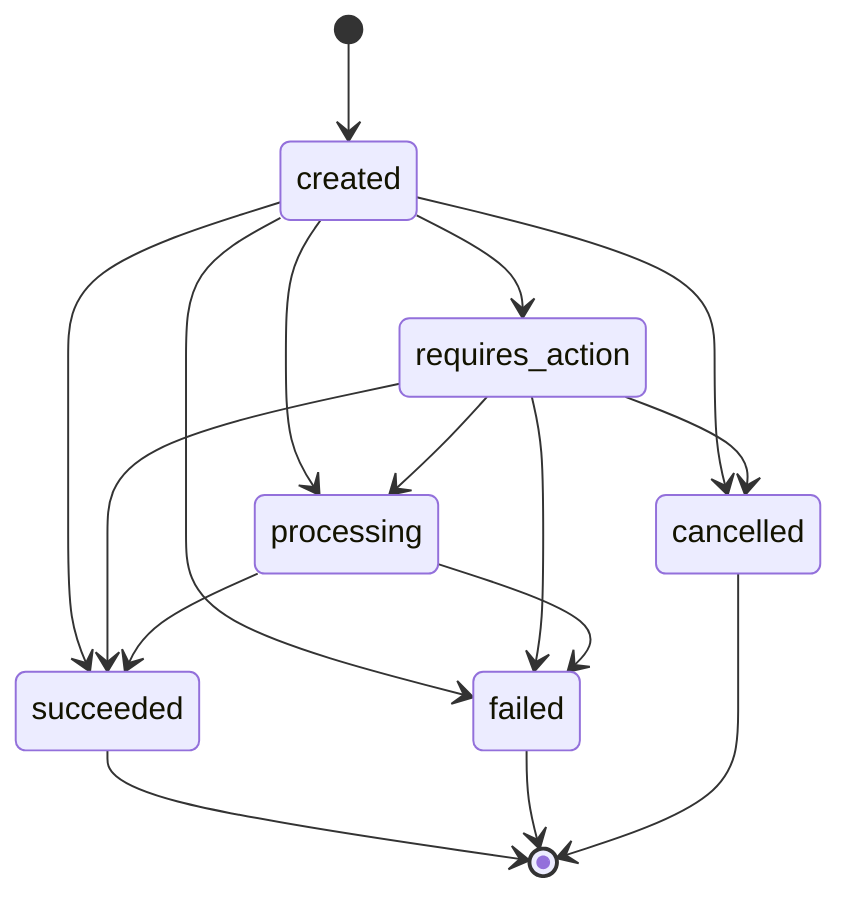
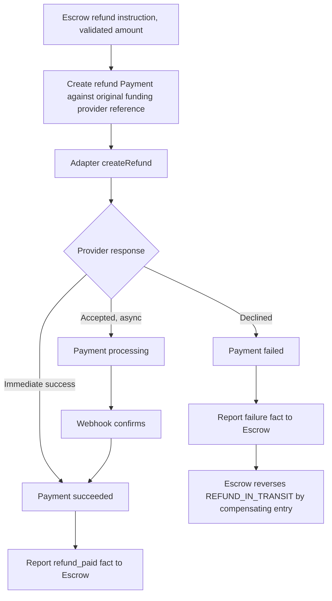
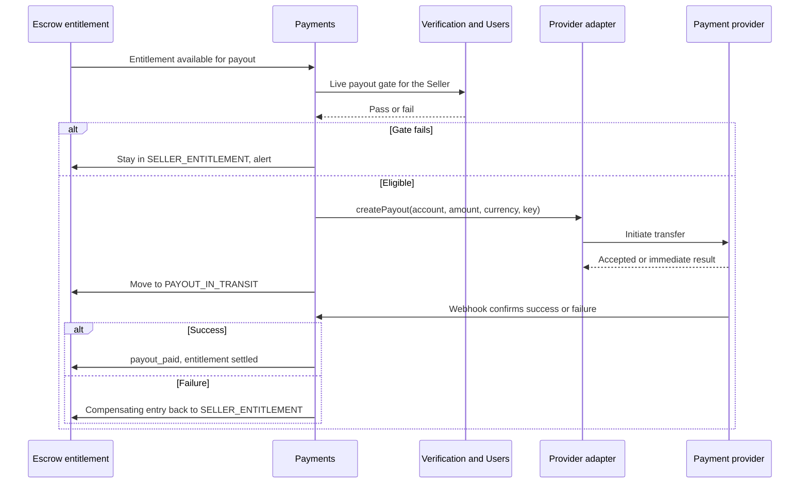
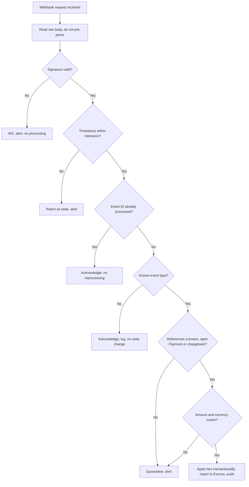
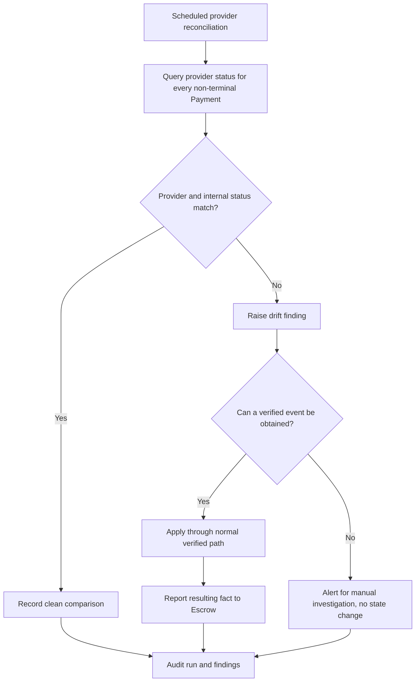
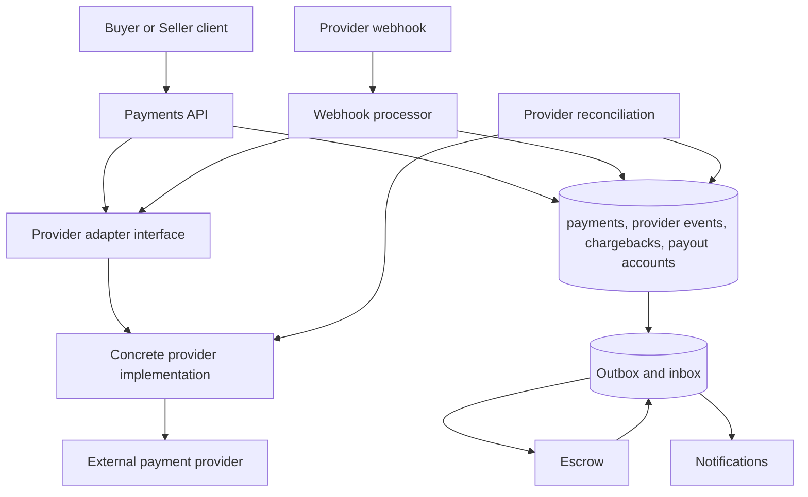

# Payments domain specification

| Metadata | Value |
| --- | --- |
| Document ID | `SPEC-ESCROW-001` (provisional; see [escrow.md Section 3.2](escrow.md#32-status-and-authority)) |
| Type | Specification (SPEC) |
| Domain | Payments: provider adapter, Payment records, webhooks, payouts, refund execution, chargeback intake (governed `ESCROW` token) |
| Status | Proposed |
| Version | 0.1.0 |
| Owner | Product and Architecture |
| Last Reviewed | 2026-09-25 |
| Applies To | Target Payments product architecture and verified current repository comparison |
| Governed token | `ESCROW` |
| Canonical path | `docs/06-payments-escrow/payments.md` |
| Product horizon | Target product architecture with verified repository comparison |
| Supersedes / Superseded By | None; companion to [escrow.md](escrow.md), which owns custody, allocations, and the ledger |

## 1. Executive summary

Payments is the provider-facing half of MusicApp's financial domain. It creates and tracks Payment records for funding, refunds, and payouts, talks to a payment provider through a provider-neutral adapter, verifies and processes provider webhooks, and reports verified facts to [escrow.md](escrow.md), which is the sole financial authority. Payments never decides how much money is owed or to whom; it only moves money that Escrow has already decided to move, and it never treats a client-supplied or unauthenticated provider message as true.

This specification is governed by the same `ESCROW` token as [escrow.md](escrow.md), splits the domain by concern rather than by file convenience (Section 3, cross-referencing [escrow.md Section 3.1](escrow.md#31-governed-path-token-and-document-structure)), and continues that document's identifier ranges without collision.

The repository contains a `payments` table with a free-text `provider` column, a `payment_status` enum, a `payment_type` enum, and no route, adapter, webhook handler, SDK dependency, or provider secret of any kind. No provider name appears anywhere in the tracked repository. This specification defines the future product independently of that gap and labels every observation with one of the required implementation statuses.

## 2. Purpose and scope

This document is canonical for:

- the Payment aggregate, its fields, and its independent state machine;
- funding payment mechanics (authorization, capture, confirmation) as distinct from Escrow's funding decision;
- the provider adapter contract and provider-neutral integration architecture;
- webhook intake, signature verification, replay protection, and event processing;
- payout execution to the Seller's payout account;
- refund execution against the original funding Payment;
- chargeback and provider-reversal intake and the Payment-side record of them;
- Payments' own idempotency, concurrency, secret handling, and provider reconciliation;
- Payments' target data model, dependencies, interfaces, security findings, and migration guidance.

This document does not decide whether, how much, or to whom money is owed. Those are [escrow.md](escrow.md)'s decisions, and Payments only executes an instruction Escrow has issued or reports a fact it verified from the provider. This document does not select a specific provider, define adjudication or evidence rules for Disputes, or define Project or Milestone lifecycle.

## 3. Governance, status, and authority

This document is governed exactly as [escrow.md Sections 3.1 through 3.3](escrow.md#31-governed-path-token-and-document-structure) establish: the governed path is `docs/06-payments-escrow/`, the governed token is `ESCROW`, and the two documents share one set of non-overlapping identifier ranges. This document does not restate that reasoning; it applies it.

Status is **Proposed**, version `0.1.0`, for the same reason as [escrow.md Section 3.2](escrow.md#32-status-and-authority): the domain has not undergone product review. `SPEC-ESCROW-001` is a provisional document tracking label, not a Governance-defined family. The implementation labels (`Implemented`, `Partially Implemented`, `Schema Implemented`, `Planned`, `Not Implemented`) are defined identically to [escrow.md Section 3.2](escrow.md#32-status-and-authority) and are not redefined here.

### 3.1 Identifier ranges

Ranges continue [escrow.md Section 3.3](escrow.md#33-identifier-ranges-and-inherited-collision) without overlap:

| Family | This document | [escrow.md](escrow.md) |
| --- | --- | --- |
| `REQ-ESCROW-*` | 023–035 | 001–013, 015–022 |
| `BR-ESCROW-*` | 034–048 | 003–033 |
| `SEC-ESCROW-*` | 015–028 | 001–014 |
| `DATA-ESCROW-*` | 007–011 | 001–006 |
| `INT-ESCROW-*` | 011–020 | 001–010 |
| `AUD-ESCROW-*` | 007–010 | 001–006 |
| `EVT-ESCROW-*` | 009–014 | 001–008 |
| `OPS-ESCROW-*` | 007–011 | 001–006 |

This document defines no `BR-ESCROW-001` or `BR-ESCROW-002`; the inherited collision recorded in [escrow.md Section 3.3](escrow.md#33-identifier-ranges-and-inherited-collision) applies to both documents identically and is not repeated here.

### 3.2 Reconciliation items

| Item | Documents and sections | Finding | Treatment here |
| --- | --- | --- | --- |
| PR1 | Migration 006 `payments.provider TEXT` versus target adapter | No provider registry or enum exists; any string is accepted | Target: a governed provider registry (Section 8); current column retained as free text pending migration |
| PR2 | Migration 006 `payment_type` includes `milestone_release` and `milestone_refund` | These name an Escrow decision as if it were a Payment type | Target Payment types are provider-facing only (`funding`, `refund`, `payout`); release itself is never a Payment (Section 6) |
| PR3 | [escrow.md Section 6.1](escrow.md#61-separate-state-machines) lists a provider chargeback state machine separate from Payment state | Confirmed here; not a contradiction | Section 13 defines it explicitly |

## 4. Terminology

| Term | Local definition |
| --- | --- |
| Payment | A provider-facing attempt to move money in one direction for one purpose (funding, refund, or payout). |
| Provider | An external payment service (a gateway or payment processor) that authorizes, captures, transfers, and reports money movement. |
| Provider adapter | The provider-neutral internal interface Payments code calls; provider-specific logic lives only behind it. |
| Webhook | An inbound, asynchronous provider notification about a Payment or a chargeback. |
| Funding payment | A Payment that moves Buyer funds into Escrow's protected custody. |
| Payout | A Payment that moves Seller entitlement to the Seller's payout account. |
| Refund payment | A Payment that returns protected funds to the Buyer through the original funding Payment. |
| Idempotency key | A caller-supplied key that makes a repeated request produce the same result exactly once. |
| Provider reference | The provider's own identifier for a Payment, distinct from MusicApp's internal and external identifiers. |
| Chargeback | A provider- or issuer-initiated reversal of a completed funding payment, reported to Payments by webhook. |

## 5. Canonical principles

Payments follows every principle in [escrow.md Section 5](escrow.md#5-canonical-principles-and-architecture) and adds:

1. Payments never decides an amount, a beneficiary, or a state transition for Escrow; it executes instructions and reports verified facts.
2. A provider callback is untrusted input until its signature, timestamp, and event identity are verified.
3. A Payment's internal state is independent of Escrow, allocation, Milestone, and Project state; Escrow reads Payment facts and never writes them.
4. No specific provider is named as canonical by this document. The adapter contract, not a vendor SDK, is the governed interface.
5. A duplicate webhook, a duplicate Payment, or a retried request never causes a second money movement.
6. Secrets (API keys, webhook signing secrets) are never logged, embedded in audit records, or returned in any response.

## 6. Payment model

A Payment is a single provider-facing attempt in one direction, for one purpose, referencing at most one Escrow, and where relevant one allocation. It is not the decision to move money (that is [escrow.md](escrow.md)'s instruction or fact) and it is not the ledger movement itself (that is an `escrow_ledger` entry created after a Payment succeeds).

### 6.1 Payment types

The current `payment_type` enum names five values, two of which (`milestone_release`, `milestone_refund`) describe an Escrow decision rather than a provider-facing attempt (reconciliation item PR2). The target model uses three purely provider-facing types:

| Target type | Direction | Purpose | Legacy enum mapping |
| --- | --- | --- | --- |
| `funding` | Buyer → platform | Move Buyer funds into Escrow's protected custody | `escrow_fund` |
| `refund` | Platform → Buyer | Return protected funds to the Buyer through the original funding Payment | `milestone_refund` is retired as a Payment type; a refund is always Escrow-instructed and Milestone-agnostic at the Payment layer |
| `payout` | Platform → Seller | Transfer Seller entitlement to the Seller's payout account | `milestone_release` is retired as a Payment type; release is an Escrow ledger movement, never a Payment (Section 14 of [escrow.md](escrow.md)) |

`platform_fee` and `escrow_fee` are not Payment types; they are `escrow_ledger` entry types ([escrow.md Section 13.2](escrow.md#132-target-entry-types)) representing money that never leaves protected custody as a separate provider transaction unless the provider settles fees separately, which is provider-specific and out of MVP scope.

### 6.2 Payment field matrix

| Field | Target representation | Authority | Mutability | Repository status |
| --- | --- | --- | --- | --- |
| `id` | UUID PK | Payments | Immutable | Implemented |
| `external_id` | Opaque unique text | Payments | Immutable | Partially Implemented: column exists; nothing generates it |
| `type` | `funding`, `refund`, `payout` | Payments | Immutable | Partially Implemented: five-value legacy enum |
| `direction` | `inbound` (Buyer to platform) or `outbound` (platform to Buyer or Seller) | Derived from `type` | Immutable | Not Implemented |
| `payer_reference` | For `funding`: the Buyer. For `refund`: the platform. For `payout`: the platform | Snapshot | Immutable | Partially Implemented: `payer_user_id`, funding-only |
| `payee_reference` | For `funding`: the platform. For `refund`: the Buyer. For `payout`: the Seller | Snapshot | Immutable | Not Implemented: no payee column exists on any Payment type |
| `amount` | Signed 64-bit minor units, positive | Snapshot from the Escrow instruction | Immutable | Partially Implemented: 32-bit `INT`, positive CHECK |
| `currency` | Equals the Escrow's currency | Snapshot | Immutable | Partially Implemented: unrestricted `TEXT` |
| `provider` | Governed provider registry value | Configuration | Immutable | Partially Implemented: free `TEXT` |
| `provider_reference` | The provider's own identifier | Set once the provider assigns it | Immutable once set | Partially Implemented: `provider_payment_id TEXT`, nullable, not unique |
| `provider_status` | Raw provider status string, kept for audit | Provider, mirrored | Append-only history preferred over overwrite | Not Implemented |
| `status` | Governed internal enum (Section 7) | Payments transition service | Transition service only | Partially Implemented: enum exists; no service |
| `idempotency_key` | Caller-supplied key, unique per operation | Payments | Immutable | Not Implemented |
| `escrow_id` | UUID FK, `RESTRICT` | Payments | Immutable | Partially Implemented: `RESTRICT`, correct |
| `allocation_id` | Nullable UUID FK, `RESTRICT`; required for `payout` and Milestone-scoped `refund` | Payments | Immutable | Partially Implemented: `SET NULL` |
| `project_id` | UUID FK, `RESTRICT`, denormalized for lineage | Payments | Immutable | Implemented: `RESTRICT` |
| `instruction_id` | FK to the Escrow instruction that authorized this Payment (see [escrow.md Section 24.1](escrow.md#241-target-model-matrix) `escrow_instructions`) | Payments | Immutable | Not Implemented |
| `failure_reason` | Bounded code plus redacted detail | Set on failure | Append-only | Not Implemented |
| `metadata` | Structured, redacted JSON; no secrets or raw provider payloads | Payments | Append-only | Not Implemented |
| `version` | Monotonic bigint | Payments | Every mutation | Not Implemented |
| `created_at`, `updated_at` | Timestamptz | Database | `updated_at` trigger-maintained | Implemented and Partially Implemented respectively |

`REQ-ESCROW-023`: A Payment MUST represent exactly one provider-facing attempt in one direction for one purpose, MUST reference the authorizing Escrow instruction, and MUST NOT itself decide an amount, beneficiary, or Escrow state transition.

## 7. Payment states

### 7.1 Target state model

The current `payment_status` enum has six values and is retained. Provider-specific states are mapped into it rather than adding new governed states for every provider.

| Stored state | Meaning | Entered by | Exits | Terminal | Repository status |
| --- | --- | --- | --- | --- | --- |
| `created` | A Payment record exists; no provider call has completed yet | Payments service on an Escrow instruction | `requires_action`, `processing`, `succeeded`, `failed`, `cancelled` | No | Schema Implemented: enum default |
| `requires_action` | The provider requires additional customer action (for example a redirect or an authentication step) | Provider response | `processing`, `succeeded`, `failed`, `cancelled` | No | Schema Implemented |
| `processing` | The provider has accepted the request and is completing it asynchronously | Provider response or webhook | `succeeded`, `failed` | No | Schema Implemented |
| `succeeded` | The provider confirms the money movement completed | Verified webhook or synchronous confirmation | None (see `reversed`, a fact recorded separately, Section 13) | Yes | Schema Implemented |
| `failed` | The provider confirms the attempt did not complete | Verified webhook or synchronous response | None | Yes | Schema Implemented |
| `cancelled` | The attempt was withdrawn before completion (for example an expired funding intent) | Timeout or explicit cancellation | None | Yes | Schema Implemented |

A `succeeded` Payment that is later reversed by a chargeback does not change state to a new enum value; the reversal is recorded as a separate fact and ledger correction in Escrow (Section 13; [escrow.md Section 18](escrow.md#18-chargebacks-and-provider-reversals)), because the Payment did, in historical fact, succeed at the time.

### 7.2 Provider-state mapping

| Category of provider state | Maps to |
| --- | --- |
| Intent created, not yet attempted | `created` |
| Requires 3-D Secure, OTP, redirect, or similar step | `requires_action` |
| Authorized but not yet captured (Section 9.4) | `processing` |
| Captured, settled, or transfer completed | `succeeded` |
| Declined, insufficient funds, provider error | `failed` |
| Expired, voided, or withdrawn | `cancelled` |
| Disputed or charged back | Not a Payment state; recorded as a chargeback record (Section 13) against the `succeeded` Payment |

Clients cannot set Payment state. Only the provider adapter (from a synchronous response) or the webhook processor (from a verified event) writes `status`.



*Figure 1 — Payment State Machine. All values are `payment_status` enum values; a post-success chargeback is a separate fact, not a state transition.*

`REQ-ESCROW-024`: Payment state MUST be a deterministic mapping of provider-reported status into the governed enum, MUST be writable only by the provider adapter or the verified webhook processor, and MUST remain independent of Escrow, allocation, and Milestone state.

## 8. Provider adapter architecture

### 8.1 Provider-neutral contract

No payment provider is selected by this document (Question EQ13 in [escrow.md Section 31.3](escrow.md#313-prioritized-open-questions)). The architecture is a single internal adapter interface that every provider-specific implementation satisfies, so that Payments, Escrow, and every caller depend only on the interface.

| Adapter operation | Contract | Repository status |
| --- | --- | --- |
| `createFundingIntent(escrow, amount, currency, idempotencyKey)` | Returns a provider reference and any client-facing continuation data (for example a redirect URL or a client secret) needed to complete the payment | Not Implemented |
| `capturePayment(providerReference)` | Where the provider separates authorization from capture, captures the authorized amount | Not Implemented |
| `createRefund(fundingProviderReference, amount, idempotencyKey)` | Requests a refund against a specific prior successful funding payment | Not Implemented |
| `createPayout(sellerPayoutAccountReference, amount, currency, idempotencyKey)` | Requests a transfer to a Seller's registered payout account | Not Implemented |
| `verifyWebhookSignature(rawBody, headers)` | Verifies authenticity and returns a parsed, typed event or rejects | Not Implemented |
| `getPaymentStatus(providerReference)` | Synchronous status query for reconciliation | Not Implemented |

### 8.2 Provider registry and configuration

| Concern | Rule |
| --- | --- |
| Provider registry | A governed enum or lookup table of supported providers; the `payments.provider` column is validated against it |
| Provider secrets | API keys and webhook signing secrets are configuration, never committed, never logged, and rotated without a schema change (Section 15) |
| Provider capability declaration | Each provider adapter declares which operations it supports (some providers may not support authorization separate from capture, for example), and Escrow's funding model (Section 8 of [escrow.md](escrow.md)) does not assume capabilities a provider lacks |
| Multiple providers | The registry supports more than one active provider (for example by payment method or by region) without a schema change; MVP may activate exactly one |

### 8.3 Provider/webhook matrix

| Concern | Target rule | Repository status |
| --- | --- | --- |
| Adapter exists | A provider-neutral interface as in Section 8.1, with at least one concrete implementation | Not Implemented |
| Payment creation | `createFundingIntent`, `createRefund`, `createPayout` each require an authorizing Escrow instruction and an idempotency key | Not Implemented |
| Provider reference | Stored once assigned; unique per provider (Section 17) | Partially Implemented: column exists, not unique |
| Redirect or client-secret flows | Supported where the provider requires them, surfaced to the client as opaque continuation data only, never as raw provider credentials | Not Implemented |
| Webhook endpoint | A dedicated route that reads the raw request body (not pre-parsed JSON) for signature verification | Not Implemented |
| Signature verification | Every webhook is verified against the provider's signing secret before any processing (Section 9) | Not Implemented |
| Replay protection | Event timestamp checked against a tolerance where the provider supports it, and event ID deduplicated regardless | Not Implemented |
| Event deduplication | A unique `(provider, provider_event_id)` inbox record processed exactly once | Not Implemented |
| Ordering | Events are processed by their own timestamp and reconciled against internal state; a delayed or out-of-order event does not revert forward progress | Not Implemented |
| Delayed events | Accepted and processed on arrival; the Payment stays in its last known state until then | Not Implemented |
| Retries | Provider retries of the same event are deduplicated by event ID; provider retries of the same Payment creation are deduplicated by idempotency key | Not Implemented |
| Provider outage | Payments returns an accepted-pending status to the caller rather than inventing success or failure | Not Implemented |
| Reconciliation | Scheduled comparison of provider status against internal status for every non-terminal Payment (Section 16) | Not Implemented |
| Provider metadata | Redacted, minimal; no raw provider payload stored in audit or logs | Not Implemented |
| Secret handling | Section 15 | Not Implemented |
| Logs | No secret, token, card, or bank-account fragment in any log line | Not Implemented |

`REQ-ESCROW-025`: The system MUST integrate payment providers only through a provider-neutral adapter interface, MUST NOT hard-code a specific provider's behavior outside its adapter implementation, and MUST declare provider capabilities explicitly rather than assuming them.

## 9. Funding payments

### 9.1 Relationship to Escrow's funding model

[escrow.md Section 8](escrow.md#8-funding-model) decides that MVP funds the entire agreed Project obligation in one funding, up front. This section defines only how Payments executes that one funding attempt against a provider. Payments never decides the amount; it receives the expected amount and currency from the Escrow funding intent (`INT-ESCROW-001`) and creates exactly one funding Payment per intent.

### 9.2 Funding payment matrix

| Concern | Target rule | Repository status |
| --- | --- | --- |
| Creation | One `funding` Payment per Escrow funding intent, carrying the intent's idempotency key, amount, and currency | Not Implemented |
| Provider call | `createFundingIntent` through the adapter; the response's continuation data (redirect or client secret) is returned to the client, never a raw provider credential | Not Implemented |
| Duplicate intent | A repeated funding request with the same idempotency key returns the existing Payment and its continuation data unchanged | Not Implemented |
| Confirmation | On a verified `succeeded` webhook or synchronous confirmation, Payments reports the fact to Escrow (`EVT-ESCROW-002` consumption path); Escrow, not Payments, decides whether this advances the Escrow to `funded` | Not Implemented |
| Amount and currency verification | The provider-reported amount and currency must exactly equal the Payment's recorded amount and currency before the fact is reported; a mismatch is quarantined and never forwarded as a funding fact | Not Implemented |
| Partial confirmation | Not applicable in MVP: the funding Payment's amount is fixed at creation to the full expected amount; a provider that reports a lesser captured amount is treated as a mismatch, not a partial success | Not Implemented |
| Expiry | A funding Payment not confirmed within its configured deadline is moved to `cancelled` by a scheduled job; the Escrow stays `created` (duration is Question EQ2 in [escrow.md](escrow.md)) | Not Implemented |
| Failure | A provider `failed` response or webhook sets the Payment to `failed`; the Buyer may retry with a new Payment against the same Escrow and idempotency scope | Not Implemented |
| Retry | A new attempt after failure creates a new Payment; it does not reuse the failed Payment's provider reference | Not Implemented |

### 9.3 Failed and abandoned funding

| Situation | Payment behavior | Escrow behavior |
| --- | --- | --- |
| Buyer abandons the funding flow before any provider response | Payment stays `created`, then expires to `cancelled` | Stays `created`; no fact reported |
| Provider declines | Payment `failed` | Stays `created`; no fact reported |
| Provider times out | Payment stays `processing`; reconciliation (Section 16) resolves it eventually | Stays `created` |
| Project cancelled while funding is in flight | Payment continues to its own natural conclusion; if it later succeeds, Escrow reports a mismatch (no active fundable Escrow) and the amount is refunded | Escrow, per its own cancellation rule, does not accept a stale funding fact against a cancelled or superseded Escrow |

### 9.4 Provider authorization and capture

Where a provider separates authorization (a hold on funds) from capture (the actual transfer), only a captured amount is reported to Escrow as a funding fact. An authorization that is never captured, or that expires, produces no ledger entry and is recorded as a `failed` or `cancelled` Payment. This keeps Escrow's `funded_amount` meaning exactly "confirmed protected funds," consistent with [escrow.md Section 9.1](escrow.md#91-authority-of-totals).

```mermaid
sequenceDiagram
    actor Buyer
    participant API as Payments API
    participant Adapter as Provider adapter
    participant Provider as Payment provider
    participant Webhook as Webhook processor
    participant Escrow as Escrow
    Buyer->>API: Fund Project (Escrow funding intent, idempotency key)
    API->>Adapter: createFundingIntent(amount, currency, key)
    Adapter->>Provider: Create payment
    Provider-->>Adapter: Provider reference, continuation data
    Adapter-->>API: Payment created (processing or requires_action)
    API-->>Buyer: Continuation data
    Buyer->>Provider: Complete payment (redirect, OTP, etc.)
    Provider->>Webhook: Payment succeeded event
    Webhook->>Webhook: Verify signature, dedupe by event ID
    Webhook->>API: Update Payment succeeded, amount and currency verified
    API->>Escrow: Report verified funding fact
    Escrow->>Escrow: Match Project, term version, currency, amount; advance if eligible
```

*Figure 2 — Funding Sequence. Payments executes the provider interaction; Escrow alone decides whether a verified fact advances its own state.*

`REQ-ESCROW-026`: Payments MUST create exactly one funding Payment per Escrow funding intent, MUST report a funding fact to Escrow only after verifying the provider's amount and currency exactly match the recorded Payment, and MUST NOT report a captured amount other than the full expected amount as a funding fact in MVP.

## 10. Refund execution

### 10.1 Relationship to Escrow's refund decision

[escrow.md Section 15](escrow.md#15-refunds) decides whether, how much, and from what authorized source a refund occurs. This section defines only how Payments executes a refund instruction against the provider, always through the original funding Payment.

### 10.2 Refund execution matrix

| Concern | Target rule | Repository status |
| --- | --- | --- |
| Trigger | A refund Payment is created only from a validated Escrow refund instruction (`INT-ESCROW-008`), never from a direct client request | Not Implemented |
| Destination | `createRefund` is called against the original funding Payment's provider reference; MVP supports no alternative destination | Not Implemented |
| Amount | Equals the instructed amount, which Escrow has already verified does not exceed the refundable amount and does not exceed the funding Payment's captured amount cumulatively across all its refunds | Not Implemented |
| Idempotency | The refund instruction's key is the refund Payment's idempotency key; a repeated instruction with the same key returns the existing refund Payment | Not Implemented |
| Confirmation | On verified `succeeded`, Payments reports the fact to Escrow, which records `refund_paid` ([escrow.md Section 13.2](escrow.md#132-target-entry-types)) | Not Implemented |
| Failure | Provider `failed` is reported to Escrow, which reverses its `REFUND_IN_TRANSIT` reservation by a compensating entry and leaves the instruction open for retry or manual resolution | Not Implemented |
| Instrument cannot receive a refund | Reported to Escrow as a failure fact; the case moves to manual, audited resolution outside Payments (Question EQ8 in [escrow.md](escrow.md)) | Not Implemented |
| Duplicate refund | A second refund instruction for an amount that would exceed the funding Payment's captured amount is rejected before any provider call | Not Implemented |
| Provider fee on refund | Recorded as `PROVIDER_FEE_EXPENSE` by Escrow from the provider's fee report, not invented by Payments | Not Implemented |



*Figure 3 — Refund Sequence. Payments only executes an already-validated instruction against the original funding Payment.*

`REQ-ESCROW-027`: Payments MUST execute a refund only against the original funding Payment's provider reference, only from a validated Escrow instruction, and MUST report failure as a fact rather than silently retrying or inventing success.

## 11. Payouts

### 11.1 Payout as a separate operation

Release (an Escrow ledger movement into Seller entitlement, [escrow.md Section 14](escrow.md#14-release)) and payout (a provider transfer of that entitlement to the Seller) are separate operations with separate gates, consistent with [escrow.md Section 4](escrow.md#4-terminology-and-domain-boundaries)'s "Payout" definition. A released amount is not paid until a payout Payment succeeds.

### 11.2 Payout matrix

| Concern | Target rule | Repository status |
| --- | --- | --- |
| Eligibility | A payout Payment is created only for an amount currently in `SELLER_ENTITLEMENT`; the live payout gate ([escrow.md Section 20](escrow.md#20-verification-and-financial-eligibility)) is re-checked immediately before the provider call, not only at release time | Not Implemented |
| Seller verification requirement | `Identity Verified` at decision time (`BR-IDENTITY-021`); a Seller who loses eligibility between release and payout blocks the payout, not the earlier release | Not Implemented |
| Payout account readiness | The Seller's registered payout account reference must exist and pass the provider's own account-verification checks; the account reference itself is provider-facing data (`payout_account_reference`) and is never the Escrow's business | Not Implemented |
| Payout amount | Equal to the requested entitlement amount, net of any provider processing fee the provider itself deducts (recorded separately as `PROVIDER_FEE_EXPENSE`) | Not Implemented |
| Fees and commission | Already deducted at release time by the fee schedule ([escrow.md Section 19](escrow.md#19-fees-commission-tax-and-rounding)); a payout moves the net entitlement, not the gross allocation | Not Implemented |
| Withholding and tax hooks | The `TAX_PAYABLE` account and the fee snapshot's tax hook (Question EQ9 in [escrow.md](escrow.md)) apply before the payout amount is computed; Payments does not compute tax | Not Implemented |
| Initiation | `createPayout` through the adapter with an idempotency key derived from the entitlement and instruction | Not Implemented |
| Confirmation | On verified `succeeded`, the entitlement moves from `PAYOUT_IN_TRANSIT` to paid (`payout_paid`, [escrow.md Section 13.2](escrow.md#132-target-entry-types)) | Not Implemented |
| Failure | Reported to Escrow, which reverses `PAYOUT_IN_TRANSIT` back to `SELLER_ENTITLEMENT` by a compensating entry; the entitlement remains payable | Not Implemented |
| Retry | A new payout attempt is a new Payment; the entitlement is not double-paid because it only leaves `SELLER_ENTITLEMENT` once, at initiation | Not Implemented |
| Reversal | If a provider reverses a completed payout, it is handled as a chargeback-class event (Section 13) | Not Implemented |
| Suspended Seller | No new payout is initiated; an in-flight payout already accepted by the provider is not something the platform can recall, and its outcome is recorded when the provider reports it | Not Implemented |
| Verification expiry or revocation | Blocks initiation of a new payout; does not reverse a payout the provider has already confirmed | Not Implemented |



*Figure 4 — Payout Sequence. The payout gate is re-checked at initiation, and a failed payout returns the entitlement rather than losing it.*

`REQ-ESCROW-028`: Payments MUST re-verify the live payout gate immediately before every payout initiation, MUST treat payout as an operation distinct from release, and MUST return a failed payout's entitlement to `SELLER_ENTITLEMENT` by a compensating entry rather than losing or duplicating it.

## 12. Refund and payout authorization boundary

This section restates, for the provider-facing side, the invariant [escrow.md Section 15](escrow.md#15-refunds) and Section 21 of this document own: Payments never receives a client-supplied amount, destination, or beneficiary for a refund or payout. Every refund and payout Payment traces to exactly one Escrow instruction (`escrow_instructions`, [escrow.md Section 24.1](escrow.md#241-target-model-matrix)), and Payments rejects any request that does not carry a valid, unconsumed instruction reference.

`REQ-ESCROW-029`: Every refund and payout Payment MUST trace to exactly one validated Escrow instruction, and Payments MUST reject any refund or payout request that does not carry a valid, unconsumed instruction reference.

## 13. Chargebacks and provider reversals

### 13.1 Chargeback record

A chargeback is a distinct state machine from Payment state ([escrow.md Section 6.1](escrow.md#61-separate-state-machines)), because a chargeback is not something that happens to a `created` Payment; it happens to a Payment that has already reached `succeeded`. It is intake and evidence tracking; the financial exposure and ledger correction are owned by [escrow.md Section 18](escrow.md#18-chargebacks-and-provider-reversals).

| Stored state | Meaning | Entered by | Exits |
| --- | --- | --- | --- |
| `notified` | The provider has reported a chargeback or reversal against a `succeeded` Payment | Verified webhook | `evidence_submitted`, `won`, `lost` |
| `evidence_submitted` | The platform has submitted a response to the provider's dispute process, where the provider supports one | Operator or automated submission | `won`, `lost` |
| `won` | The provider or issuer ruled in the platform's favor; the reversal does not proceed | Verified webhook or provider response | None |
| `lost` | The reversal proceeds; funds are or will be pulled back by the provider | Verified webhook or provider response | None |

### 13.2 Chargeback matrix

| Concern | Target rule | Repository status |
| --- | --- | --- |
| Notification intake | A dedicated webhook event type creates a `notified` chargeback record referencing the `succeeded` Payment it targets; unknown or unmatched references are quarantined and alerted | Not Implemented |
| Evidence | Bounded structured fields and references to Assets-backed evidence documents where the provider requires a submission; no raw provider payload stored beyond what the record needs | Not Implemented |
| Amount | The disputed amount as reported by the provider; may be less than the original Payment's amount | Not Implemented |
| Reporting to Escrow | Every state entry (`notified`, `won`, `lost`) is reported to Escrow as a fact; Escrow decides the hold and exposure consequences ([escrow.md Section 18](escrow.md#18-chargebacks-and-provider-reversals)) | Not Implemented |
| Deduplication | Unique `(provider, provider_chargeback_id)`; a duplicate notification updates nothing beyond acknowledging | Not Implemented |
| Fees | Provider chargeback fees are reported to Escrow as `PROVIDER_FEE_EXPENSE` or folded into `CHARGEBACK_EXPOSURE` per [escrow.md Section 18](escrow.md#18-chargebacks-and-provider-reversals) | Not Implemented |
| Outcome finality | `won` and `lost` are terminal for that chargeback; a further provider action on the same Payment creates a new chargeback record | Not Implemented |

`REQ-ESCROW-030`: Payments MUST record every chargeback notification and outcome as an immutable, deduplicated fact referencing the affected Payment, and MUST report every state entry to Escrow without deciding the financial consequence itself.

## 14. Idempotency and concurrency

Payments follows the general framework of [escrow.md Section 22](escrow.md#22-idempotency-and-concurrency) and adds the provider-specific rules a webhook-driven, external-API-calling component needs.

### 14.1 Idempotency matrix

| Operation | Idempotency key and natural uniqueness | Duplicate behavior |
| --- | --- | --- |
| Create funding, refund, or payout Payment | Caller-supplied key, unique per `(escrow_id, type, key)` | Returns the existing Payment and its continuation data unchanged |
| Provider adapter call | The same idempotency key is passed to the provider where the provider supports idempotent requests; where it does not, Payments deduplicates before calling out | No second provider-side attempt |
| Webhook processing | Unique `(provider, provider_event_id)` inbox record | Event acknowledged; no reprocessing |
| Chargeback notification | Unique `(provider, provider_chargeback_id)` | Notification acknowledged; no duplicate record |
| Reconciliation correction | Correction instruction key, scoped to the specific Payment and drift finding | Returns the original correction outcome |

### 14.2 Concurrency rules

| Concern | Rule |
| --- | --- |
| Lock order | Payment row, then the Escrow instruction it references, in that order, to avoid deadlocking against Escrow's own Escrow-then-allocation order |
| Webhook concurrency | Two webhooks for the same Payment are processed serially per Payment, using a per-Payment advisory lock or row lock |
| Out-of-order events | An event with a lower provider timestamp than the last processed event is applied only if it does not retract a later, already-applied fact; otherwise it is recorded for audit and does not change state |
| Transaction boundary | Payment state update, chargeback record, audit record, idempotency and inbox result, and outbox message commit together |
| Retry-safe provider calls | Every outbound provider call carries an idempotency key the provider is expected to honor; where a provider does not support one, Payments checks for an existing matching attempt before calling out |

`REQ-ESCROW-031`: Every Payments operation and webhook MUST be idempotent by a natural or caller-supplied key, MUST process concurrent events for one Payment serially, and MUST commit its state, audit, inbox, and outbox writes atomically.

## 15. Secret handling and webhook security

### 15.1 Secret handling

| Concern | Rule |
| --- | --- |
| Storage | Provider API keys and webhook signing secrets are environment or secret-manager configuration, never committed to the repository and never present in `.env.example` beyond a placeholder name |
| Rotation | Secrets are rotatable without a schema or code deployment; the adapter reads the active secret at call time |
| Logging | No log line, audit record, or error message contains a secret, API key, signing secret, full card number, or bank account number |
| Response bodies | No API response returns a provider secret, even to an Administrator |

### 15.2 Webhook security matrix

| Concern | Target rule | Repository status |
| --- | --- | --- |
| Raw-body requirement | The webhook route reads the exact raw request bytes for signature verification before any JSON parsing; a shared `express.json()` body parser applied ahead of the route breaks this and MUST NOT be used on the webhook path | Not Implemented; the current single `app.use(express.json())` would break raw-body verification if a webhook route were added naively |
| Signature verification | Every webhook is verified against the provider's signing secret using the provider's documented scheme before any state change | Not Implemented |
| Timestamp tolerance | Where the provider includes a timestamp, a bounded tolerance window rejects stale or clock-skewed events | Not Implemented |
| Replay prevention | Event ID deduplication (Section 14.1) prevents a replayed, validly-signed event from reprocessing | Not Implemented |
| Expected event types | Only explicitly handled event types are processed; every other type is acknowledged and ignored, not silently dropped without a record | Not Implemented |
| Unknown event handling | Logged and acknowledged with a `200`-class response so the provider does not retry indefinitely, without triggering any state change | Not Implemented |
| Amount and currency verification | The event's reported amount and currency are compared against the Payment's recorded values before any fact is applied; a mismatch is quarantined | Not Implemented |
| Object ownership verification | The event's referenced Payment or provider reference must belong to this platform's own record; an event referencing an unknown or already-closed Payment is quarantined and alerted | Not Implemented |
| Transactional processing | Webhook processing (state update, fact reporting to Escrow, audit) happens in one transaction; a partial failure never leaves Payment state and Escrow's view inconsistent | Not Implemented |
| Audit | Every webhook receipt, whether processed, ignored, or quarantined, is audited (`AUD-ESCROW-008`) | Not Implemented |
| Alerting | A quarantined event, a signature failure, or an unexpected object reference triggers an operational alert | Not Implemented |
| Rate limits | The webhook route and every client-facing Payments route apply rate limits appropriate to a financial endpoint | Not Implemented |



*Figure 5 — Provider Webhook Processing. Every event is verified, deduplicated, and matched to a known object before it can change any state.*

`REQ-ESCROW-032`: Every provider webhook MUST be verified by raw-body signature check, deduplicated by event ID, matched against a known owned object with matching amount and currency, and processed transactionally, and secrets MUST NOT appear in logs, audit records, or API responses.

## 16. Audit and provider reconciliation

### 16.1 Audit requirements

Audit records follow the same envelope as [escrow.md Section 23.1](escrow.md#231-audit-requirements): append-only, redacted, with event ID, type, Project, Escrow, Payment, and allocation references, actor type, action, outcome, amount and currency, correlation and idempotency IDs, provider reference (never a secret), and a UTC timestamp.

| Identifier | Requirement |
| --- | --- |
| `AUD-ESCROW-007` | Record every Payment creation, provider call, and status transition |
| `AUD-ESCROW-008` | Record every webhook receipt, whether applied, ignored, or quarantined, and every signature failure |
| `AUD-ESCROW-009` | Record every chargeback notification, evidence submission, and outcome |
| `AUD-ESCROW-010` | Record every reconciliation run and finding between provider, Payment, and Escrow state |

### 16.2 Provisional events and operations

Governance defines no `EVT-*` or `OPS-*` family, so these are provisional, continuing [escrow.md Section 23.2](escrow.md#232-provisional-events-and-operations).

| Provisional identifier | Event or requirement |
| --- | --- |
| `EVT-ESCROW-009` | `PaymentCreated`: Payment external ID, type, Escrow, amount, currency, provider |
| `EVT-ESCROW-010` | `PaymentStatusChanged`: Payment ID, source and target status, provider reference, trigger (adapter response or webhook) |
| `EVT-ESCROW-011` | `FundingPaymentVerified`: Payment and Escrow IDs, verified amount and currency, consumed by Escrow |
| `EVT-ESCROW-012` | `PayoutPaymentVerified`: Payment ID, entitlement reference, verified amount, consumed by Escrow |
| `EVT-ESCROW-013` | `RefundPaymentVerified`: Payment ID, instruction reference, verified amount, consumed by Escrow |
| `EVT-ESCROW-014` | `ChargebackStateChanged`: chargeback ID, Payment reference, source and target state, amount |
| `OPS-ESCROW-007` | Measure Payment creation, webhook processing, and provider call latency and failure rate |
| `OPS-ESCROW-008` | Alert on webhook signature failures, quarantined events, and unmatched object references |
| `OPS-ESCROW-009` | Run scheduled provider reconciliation and alert on any drift |
| `OPS-ESCROW-010` | Alert on Payments stuck in `processing` or `requires_action` beyond configured ages |
| `OPS-ESCROW-011` | Back up and restore-test Payment, chargeback, and webhook inbox records |

### 16.3 Provider reconciliation

Provider reconciliation is the Payments-side half of [escrow.md Section 23.3](escrow.md#233-internal-reconciliation)'s internal reconciliation. It compares Payments' own records against the provider's own reporting.

| Detection | Compared layers | Failure signal | Response |
| --- | --- | --- | --- |
| Missing provider event | Provider's own transaction list (via `getPaymentStatus` or a provider statement) versus internal Payment records | A provider-reported success or failure with no corresponding internal event | Alert; pull the missing status and apply it through the normal verified path |
| Duplicate event | Two inbox records for what the provider intended as one event | Same provider event content under two IDs | Alert; investigate provider event ID stability |
| Amount mismatch | Provider-reported amount versus recorded Payment amount | Any difference | Quarantine already applied at intake (Section 15.2); reconciliation confirms no drift slipped through |
| Currency mismatch | Same, for currency | Any difference | Same as above |
| Orphan Payment | An internal Payment with no matching provider record after a reasonable window | Missing provider acknowledgment | Alert; mark for manual investigation, never assume success |
| Provider and internal status drift | Provider's current status for a Payment versus internal `status` | Any difference | Alert; internal status is corrected only from a verified subsequent event, never guessed |



*Figure 6 — Reconciliation Flow (Provider Side). Drift is detected and escalated; only a verified event, never a guess, changes Payment state.*

`REQ-ESCROW-033`: Every material Payment action, webhook receipt, and chargeback fact MUST produce redacted immutable audit evidence, and Payments MUST reconcile its records against the provider on a schedule and respond to drift only by alert and verified correction.

## 17. Target data model

All primary keys are internal UUIDs, external identifiers are opaque and immutable, and financial foreign keys are `RESTRICT`. Amounts are signed 64-bit minor units. Escrow-owned tables are defined in [escrow.md Section 24](escrow.md#24-target-data-model); this section defines only Payments-owned tables.

### 17.1 Target model matrix

| Identifier and model | Purpose and principal fields | Keys, uniqueness, and indexes | Checks and state | Versioning, lifecycle, and deletion | Repository status |
| --- | --- | --- | --- | --- | --- |
| `DATA-ESCROW-007` `payments` | Provider-facing attempt: IDs, `type` (`funding`, `refund`, `payout`), `escrow_id`, `allocation_id`, `project_id`, `instruction_id`, payer and payee references, `amount`, `currency`, `provider`, `provider_reference`, `provider_status`, `status`, `idempotency_key`, `failure_reason`, `metadata`, `version` | PK; unique `external_id`; unique `(escrow_id, type, idempotency_key)`; unique `(provider, provider_reference)` where not null; FKs `RESTRICT`; indexes `(escrow_id, created_at)`, `(status)`, `(provider, provider_reference)` | Positive amount; currency equals Escrow's; `type`/`status` enums; `payout`/`refund` require `instruction_id` | Monotonic `version`; never deleted; terminal statuses immutable | Partially Implemented |
| `DATA-ESCROW-008` `payment_provider_events` | Inbox: `provider`, `provider_event_id`, event type, raw verified payload (redacted), processing result, times | PK; unique `(provider, provider_event_id)`; FK to `payments` `RESTRICT` where applicable | Result enum (`applied`, `ignored`, `quarantined`) | Append-only; retained for the audit and dispute window | Not Implemented |
| `DATA-ESCROW-009` `payment_chargebacks` | Chargeback record: `payment_id`, `provider`, `provider_chargeback_id`, amount, currency, state (Section 13.1), evidence references, times | PK; unique `external_id`; unique `(provider, provider_chargeback_id)`; FK `payments` `RESTRICT` | Positive amount; state enum | Append-retained; state advances only | Not Implemented |
| `DATA-ESCROW-010` `payout_accounts` | Seller payout destination reference: `user_id`, provider, `provider_account_reference`, verification status snapshot, times | PK; unique `external_id`; unique `(provider, provider_account_reference)`; FK Users `RESTRICT` | Status enum | Retained; a Seller's payout account reference is never silently overwritten, only superseded with history | Not Implemented |
| `DATA-ESCROW-011` `provider_secrets_reference` | Not a data table; a pointer to the active configuration or secret-manager entry per provider, never the secret value itself | Configuration, not application data | Not applicable | Rotatable without schema change | Not Implemented |

### 17.2 Migration implications

| Current object | Target treatment | Migration requirement |
| --- | --- | --- |
| `payments.amount INTEGER` | Widen to `BIGINT` | Confirm unit before widening; expect the table empty |
| `payments.currency TEXT` | Supported-currency check and equality with Escrow | Add constraint |
| `payments.provider TEXT` | Governed registry validation | Add constraint or lookup FK |
| `payments.provider_payment_id`, no uniqueness | Rename conceptually to `provider_reference`; add unique `(provider, provider_reference)` | Add constraint |
| `payment_type` enum values `milestone_release`, `milestone_refund` | Retire as write targets; application writes only `escrow_fund` (`funding`), `milestone_refund` is superseded by `refund`, and a new `payout` value is added | Add `payout` to the enum; never write the two retired values |
| No idempotency key | Add column and unique constraint | Add with the first write path |
| `payments.milestone_id`, `allocation_id` `ON DELETE SET NULL` | Change to `RESTRICT` | Replace before any write path exists |
| No `instruction_id`, `payee_reference`, `version` | Add columns | Backfill not required if empty |

Because no code path writes any `payments` row today, the same migration caution from [escrow.md Section 24.2](escrow.md#242-migration-implications) applies: verify emptiness before altering.

`REQ-ESCROW-034`: The target schema MUST represent Payments, provider events, chargebacks, and payout account references as separate records with restrictive foreign keys, provider-reference uniqueness, and integer minor units.

## 18. Domain dependencies and interfaces

### 18.1 Domain dependency matrix

| Domain | Fact Payments consumes | Fact Payments produces | Owning domain | Failure behavior | Repository status |
| --- | --- | --- | --- | --- | --- |
| Escrow | Funding intents, refund and payout instructions, entitlement availability | Verified funding, refund, and payout facts; chargeback facts | [escrow.md](escrow.md) is the sole financial authority | Never mark funded, refunded, or paid on an unverified event | Schema Implemented |
| Users | Live account status | None | Users | Deny new payout initiation on ineligible status | Not Implemented |
| Authentication | Verified subject and live credential decision | None | Authentication | `401`; no existence signal | Partially Implemented |
| Authorization | Allow or deny, field projection | Financial authorization context | Authorization | Deny closed | Not Implemented |
| Verification | Live payout gate, expiry, revocation | None | Verification | Payout blocked; funds stay in entitlement | Not Implemented |
| Assets | Chargeback evidence storage | Evidence bindings | Assets | Fail closed | Not Implemented |
| Notifications | None | Durable notification requests for Payment outcomes | Notifications | Delivery never creates or rolls back financial truth | Not Implemented |
| Moderation | Risk signals | Case-bound Payment reads | Moderation | Read-only, audited | Not Implemented |

### 18.2 Interface requirements

| Identifier | Logical interface | Core contract | Failure semantics | Repository status |
| --- | --- | --- | --- | --- |
| `INT-ESCROW-011` | Create funding Payment | Escrow funding intent reference, idempotency key | `409` duplicate intent with different input | Not Implemented |
| `INT-ESCROW-012` | Read Payment status | Project-scoped; party projection | Concealed `404` | Not Implemented |
| `INT-ESCROW-013` | Provider webhook intake | Raw body, provider signature header | `200`-class acknowledgment on valid processing or ignore; `401` on invalid signature | Not Implemented |
| `INT-ESCROW-014` | Execute refund instruction | Escrow instruction reference, idempotency key | `409` over-refund or unknown instruction | Not Implemented |
| `INT-ESCROW-015` | Execute payout instruction | Entitlement reference, idempotency key | `409` gate failure or unknown entitlement | Not Implemented |
| `INT-ESCROW-016` | Register or update payout account | Seller-authenticated; provider account reference | `422` invalid account; re-verification required on change | Not Implemented |
| `INT-ESCROW-017` | Chargeback intake | Provider webhook or manual operator entry with case reference | Quarantine on unmatched Payment | Not Implemented |
| `INT-ESCROW-018` | Provider status query for reconciliation | Internal; provider reference | `503` on provider outage; retry with backoff | Not Implemented |
| `INT-ESCROW-019` | Administrative Payment action | Reason, case, purpose; cannot fabricate a provider result | Deny without purpose; audit outcome | Not Implemented |
| `INT-ESCROW-020` | Export Payment history | Requesting party's own perspective or authorized operator | `202` accepted; no permanent raw URL | Not Implemented |

## 19. Authorization

Payments authorization follows [escrow.md Section 21](escrow.md#21-authorization) exactly: Project-scoped resolution, opaque identifiers, live relationship checks, and no authorization from a bare Payment identifier.

### 19.1 Payments authorization matrix

| Action | Proposed permission | Actor and relationship | Additional checks | Repository status |
| --- | --- | --- | --- | --- |
| Create funding attempt | `payment.fund.create` | Live Buyer of the Project | Fundability already checked by Escrow; idempotency key | Not Implemented |
| View Payment status | `payment.read` | Buyer sees their funding and refund Payments; Seller sees their payout Payments | Field projection; no provider secret ever returned | Not Implemented |
| View financial history | `escrow.history.read` (shared with [escrow.md](escrow.md)) | Same as above | Same | Not Implemented |
| Register payout account | `payment.payout_account.register` | Live accepted Seller, self only | Re-verification on change; provider account validation | Not Implemented |
| Webhook intake | No user permission; service-to-service via signature | Provider only, authenticated by signature, not by a bearer token | Signature verification is the authorization mechanism | Not Implemented |
| Administrative Payment action | `escrow.admin.override` (shared with [escrow.md](escrow.md)) | Explicit Administrator capability | Reason, case, purpose, audit | Not Implemented |
| Reconciliation access | `escrow.reconcile` (shared with [escrow.md](escrow.md)) | Explicit capability | Read-only by default | Not Implemented |

`REQ-ESCROW-035`: Payments interfaces MUST resolve records only through relationship-scoped Project and Escrow access, MUST authenticate webhook intake by provider signature rather than a bearer token, and MUST NOT return a provider secret in any response.

## 20. Verified repository comparison

This section reports only Payments-specific findings. The full repository review method, the complete `payments` schema listing, and the finding that no financial route or provider integration exists anywhere are documented once, in [escrow.md Section 26](escrow.md#26-verified-repository-comparison), and are not repeated here in full.

### 20.1 Payments-specific schema findings

The `payments` table (verified in [`backend/db/006_create_escrow_system.sql`](../../backend/db/006_create_escrow_system.sql), documented column-by-column in [escrow.md Section 26.2](escrow.md#262-current-schema)) has a free-text `provider` column with no registry or enum, a nullable `provider_payment_id` with no uniqueness constraint (so the same provider reference could be stored on two rows), and no idempotency key of any kind. `payment_type` includes `milestone_release` and `milestone_refund`, which name an Escrow decision as a Payment type (reconciliation item PR2, Section 3.2); the target retires both as write targets and adds `payout`. No `payee_user_id`, `instruction_id`, `failure_reason`, or `metadata` column exists.

### 20.2 Provider integration and webhook findings

A repository-wide search (Section 26.1 of [escrow.md](escrow.md)) confirms zero matches for any provider name, no SDK dependency in either `package.json`, no webhook route, no raw-body handling exception to `app.use(express.json())`, and no signing-secret variable in `backend/.env.example`. There is therefore no provider adapter, no signature verification, no replay protection, and no event deduplication of any kind. This is a complete absence, not a partial implementation.

### 20.3 Repository financial matrix (Payments-specific rows)

| Capability | Verified artifact or behavior | Gap against target | Status |
| --- | --- | --- | --- |
| Payments separate from Escrow decision | `payments` table exists independently of `escrows` | `payment_type` conflates release and refund decisions with provider attempts | Schema Implemented |
| Provider registry | None; free `TEXT` | No validation, no adapter | Not Implemented |
| Provider reference uniqueness | `provider_payment_id`, not unique | Duplicate risk once writes exist | Schema Implemented (column only) |
| Idempotency | None | No key column anywhere | Not Implemented |
| Webhook processing | None | No route, no raw body, no signature check | Not Implemented |
| Payout account model | None | No `payout_accounts` table or equivalent | Not Implemented |
| Chargeback record | Placeholder enum values only | No chargeback table | Not Implemented |
| Frontend payment functionality | Static copy only (documented in [escrow.md Section 26.4](escrow.md#264-frontend-and-tests)) | No working screen | Not Implemented |
| Automated tests | None | All | Not Implemented |

## 21. Security findings

Findings continue the `ESCROW` token from `SEC-ESCROW-015`, following [escrow.md Section 27](escrow.md#27-security-findings)'s numbering. No existing finding under any token addresses provider integration, so nothing is redefined.

### 21.1 Security findings table

| Finding | Severity | Verified condition or target threat | Impact | Required treatment | Disposition |
| --- | --- | --- | --- | --- | --- |
| `SEC-ESCROW-015` No provider adapter or integration exists | Critical | Latent target threat: zero provider code exists anywhere in the repository (Section 20.2) | When built without a governed adapter, provider-specific logic could leak business decisions into request handlers, bypassing Escrow's authority | Provider-neutral adapter interface (Section 8) | Open |
| `SEC-ESCROW-016` No webhook signature verification | Critical | No webhook route exists; when one is added without this control, any POST could be accepted as a genuine provider event | Forged funding, refund, or payout confirmation | Raw-body signature verification before any processing (Section 15.2) | Open |
| `SEC-ESCROW-017` No webhook replay protection | High | Same absence | A captured, validly-signed event replayed later could reapply a fact twice if not for separate idempotency controls | Timestamp tolerance and event-ID deduplication (Section 15.2) | Open |
| `SEC-ESCROW-018` No event deduplication or inbox | High | No inbox table or unique provider-event constraint exists | A provider's at-least-once delivery guarantee would duplicate money movement | Unique `(provider, provider_event_id)` inbox (Section 17.1) | Open |
| `SEC-ESCROW-019` No provider-reference uniqueness | High | `provider_payment_id` has no UNIQUE constraint | Two Payments could claim the same provider transaction | Unique `(provider, provider_reference)` (Section 17.2) | Open |
| `SEC-ESCROW-020` No idempotency on any Payment operation | High | No idempotency key column exists | A retried funding, refund, or payout request would create a duplicate Payment and duplicate provider call | Idempotency keys on every operation (Section 14) | Open |
| `SEC-ESCROW-021` Payment types conflate Escrow decisions with provider attempts | Medium | `milestone_release` and `milestone_refund` in `payment_type` (reconciliation item PR2) | A future implementation could mistakenly treat an Escrow-internal decision as requiring a separate provider call, or vice versa | Retire the two types; three provider-facing types only (Section 6.1) | Open |
| `SEC-ESCROW-022` No secret-handling policy enforced by any control | High | Latent: `backend/.env.example` has no provider secret placeholder and no code references one; when added without policy, secrets could be logged or exposed | Provider key or webhook secret leakage | Explicit secret handling rules (Section 15.1) | Open |
| `SEC-ESCROW-023` No payout account model or re-verification on change | High | No `payout_accounts` table exists | A changed or attacker-supplied payout destination could redirect Seller funds | Dedicated payout-account table with re-verification on change (Section 17.1, `DATA-ESCROW-010`) | Open |
| `SEC-ESCROW-024` No object-ownership verification for provider events | Critical | Latent target threat: no webhook processing exists to verify against | An event referencing an unrelated or already-closed Payment could be misapplied | Object-ownership and amount and currency verification before applying any fact (Section 15.2) | Open |
| `SEC-ESCROW-025` No chargeback intake or exposure tracking | High | Placeholder enum values only; no chargeback table | A chargeback would have no recorded evidence, exposure, or audit trail | Chargeback record and reporting to Escrow (Section 13) | Open |
| `SEC-ESCROW-026` No rate limiting on any financial route | High | No route exists at all, so no rate limiting exists; the current `requireAuth`-protected routes elsewhere in the repository also have no rate limiting (consistent with `SEC-AUTH-005`) | Abuse of a funding, refund, or payout endpoint once built | Rate limits on every Payments route including the webhook intake | Open |
| `SEC-ESCROW-027` No Payments-specific authorization surface | High | No route exists; a bare Payment identifier is the only key design in the schema | A future route could authorize by identifier alone | Project- and Escrow-scoped resolution (Section 19) | Open |
| `SEC-ESCROW-028` No automated Payments test coverage | High | No tracked test exists; the backend test script exits with an error | Webhook forgery, idempotency, and provider-mapping regressions would reach production undetected | Signature-verification, idempotency, state-machine, and reconciliation test suites | Open |

"Open" is a finding disposition, not an implementation-status label.

### 21.2 Threat coverage

| Assessed threat | Covered by |
| --- | --- |
| Webhook forgery | `SEC-ESCROW-016` |
| Webhook replay | `SEC-ESCROW-017` |
| Missing signature verification | `SEC-ESCROW-016` |
| Duplicate funding, release, refund, payout | `SEC-ESCROW-018`, `SEC-ESCROW-020` |
| Unauthorized refund, release, payout | `SEC-ESCROW-027`; decision authority is [escrow.md `SEC-ESCROW-010`](escrow.md#271-security-findings-table) |
| Secret exposure | `SEC-ESCROW-022` |
| Missing rate limits | `SEC-ESCROW-026` |
| Missing reconciliation | `SEC-ESCROW-025`; internal side is [escrow.md `SEC-ESCROW-013`](escrow.md#271-security-findings-table) |
| Missing tests | `SEC-ESCROW-028` |
| IDOR | `SEC-ESCROW-027` |
| Provider and internal drift | Section 16.3; [escrow.md `SEC-ESCROW-013`](escrow.md#271-security-findings-table) |

Cross-domain findings that also apply are Authentication `SEC-AUTH-002`, `SEC-AUTH-004` (open CORS), and `SEC-AUTH-005` (no rate limiting), and every `SEC-ESCROW-001`–`014` finding in [escrow.md Section 27.1](escrow.md#271-security-findings-table), which governs the custody side that Payments' facts feed into.

## 22. Implementation status

### 22.1 Implementation status matrix

| Target area | Status | Evidence | Next contract boundary |
| --- | --- | --- | --- |
| Payment identity and type | Partially Implemented | UUID, external ID column, five-value legacy enum | Retire two Escrow-decision types; add `payout` |
| Payment state model | Schema Implemented | Six-value enum | Add transition service and provider-state mapping |
| Provider adapter | Not Implemented | No code | Full interface of Section 8.1 |
| Provider registry | Not Implemented | Free-text column | Governed registry |
| Funding payment execution | Not Implemented | No route | Full workflow of Section 9 |
| Refund execution | Not Implemented | No route | Full workflow of Section 10 |
| Payout execution | Not Implemented | No route | Full workflow of Section 11 |
| Chargeback intake | Not Implemented | Placeholder enum values | Full model of Section 13 |
| Webhook processing | Not Implemented | No route | Full pipeline of Section 15.2 |
| Idempotency | Not Implemented | No key column | Section 14 |
| Secret handling | Not Implemented | No secret exists yet | Section 15.1 policy applied on first integration |
| Provider reconciliation | Not Implemented | No route reads any table | Section 16.3 |
| Authorization | Not Implemented | No route | Section 19 |
| Frontend | Not Implemented | Static copy only | Full funding, refund status, and payout-account UI |
| Automated tests | Not Implemented | None | Layered suite including signature-forgery tests |

## 23. Future architecture

Payments' future architecture mirrors [escrow.md Section 29](escrow.md#29-future-architecture): a modular Payments capability behind the provider adapter, exchanging verified facts with Escrow through an outbox and inbox, deployable inside the same application or as a separate service without changing the contract. Future work includes multiple concurrently active providers routed by payment method or region, a dedicated payout-account verification workflow integrated with Verification, and provider-side dispute-evidence automation once a Disputes specification exists.



*Figure 7 — Future Architecture. The provider adapter isolates vendor-specific logic; Escrow remains the sole consumer of verified financial facts.*

`REQ-ESCROW-035` (Section 19) and the shared `REQ-ESCROW-022` from [escrow.md Section 29](escrow.md#29-future-architecture) govern this architecture regardless of deployment topology.

## 24. Staged implementation plan

This task is documentation only. Payments' implementation is coordinated with [escrow.md Section 30](escrow.md#30-staged-implementation-plan), whose twenty stages already sequence both documents together; this section states only the Payments-specific detail within that sequence.

1. **Reconcile existing schema** (escrow.md stage 1): verify `payments` is empty in every environment before altering it.
2. **Harden monetary types and currency constraints** (stage 2): widen `payments.amount`, add currency equality to Escrow.
3. **Establish Escrow and allocation invariants** (stage 3): add `instruction_id` to `payments` so every Payment traces to one instruction.
4. **Enforce append-only ledger** (stage 4): not Payments-owned; Payments only reports facts that cause ledger entries.
5. **Implement the Payment abstraction** (stage 5, Payments-owned): retire the two Escrow-decision `payment_type` values, add `payout`, add idempotency key and provider-reference uniqueness.
6. **Add a provider adapter** (stage 6, Payments-owned): implement the interface of Section 8.1 behind a chosen provider (Question EQ13 in [escrow.md](escrow.md)).
7. **Add secure webhook processing** (stage 7, Payments-owned): raw-body route, signature verification, replay protection, event deduplication (Section 15.2).
8. **Add the funding workflow** (stage 8): Payments executes; Escrow decides (Section 9).
9. **Add allocation reconciliation** (stage 9): not Payments-owned.
10. **Add the release workflow** (stage 10): not Payments-owned; Payments has no role in release.
11. **Add the refund workflow** (stage 11): Payments executes against the original funding Payment (Section 10).
12. **Add the payout workflow** (stage 12, Payments-owned): payout-account model, live gate re-check, provider transfer (Section 11).
13. **Add dispute holds and resolution integration** (stage 13): not Payments-owned.
14. **Add chargeback and reversal handling** (stage 14, Payments-owned intake; Escrow-owned exposure): chargeback record and reporting (Section 13).
15. **Add fees and commission hooks** (stage 15): not Payments-owned; Payments reports provider fees only (`PROVIDER_FEE_EXPENSE`).
16. **Add authorization** (stage 16, Payments-owned): Section 19.
17. **Add idempotency and concurrency controls** (stage 17, Payments-owned): Section 14.
18. **Add audit and reconciliation** (stage 18, Payments-owned): Section 16.
19. **Add notifications and events** (stage 19): the provisional catalog of Section 16.2.
20. **Add automated financial tests** (stage 20, Payments-owned): signature-forgery, idempotency, webhook-replay, and provider-mapping test suites, alongside the shared coverage in [escrow.md](escrow.md).

## 25. Risks, assumptions, and open questions

### 25.1 Risks

Payments shares every risk listed in [escrow.md Section 31.1](escrow.md#311-risks) that involves money movement, and adds the following provider-specific risks:

| Risk | Consequence | Primary controls | Residual and owner |
| --- | --- | --- | --- |
| Webhook forgery | A forged event falsely confirms funding, refund, or payout | Signature verification, object-ownership checks | Payments |
| Webhook replay | A captured event reapplied later duplicates a fact | Timestamp tolerance, event-ID deduplication | Payments |
| Provider secret leakage | Compromised API access or forged signatures | Secret handling policy, rotation, redacted logging | Payments and Security |
| Provider outage during funding, refund, or payout | Money movement cannot complete | Accepted-pending status, retry, reconciliation | Payments |
| Payout to a stale or compromised account | Funds misdirected to the wrong Seller destination | Re-verification on payout-account change | Payments and Verification |
| Provider API or webhook contract changes | Silent breakage of mapping or signature verification | Provider adapter isolation, contract tests | Payments |
| Missing automated coverage | Signature, idempotency, and mapping regressions reach production | Layered tests before activation | Engineering |

### 25.2 Assumptions

1. A payment provider capable of India-first payment methods, webhooks, and payouts will be selected; this document does not select one (Question EQ13).
2. Every assumption in [escrow.md Section 31.2](escrow.md#312-assumptions) applies equally here, including that no financial row currently exists in any environment.
3. The chosen provider supports webhook signature verification and idempotent request creation; if a chosen provider lacks one of these, the corresponding control in Section 15.2 or Section 14 needs a provider-specific compensating design, not a relaxed requirement.
4. Payout to Indian bank accounts or UPI handles is the MVP payout method; other methods are future work.

### 25.3 Prioritized open questions

| ID | Priority | Question | Why it blocks or risks | Decision owner | Affected contract |
| --- | --- | --- | --- | --- | --- |
| PQ1 | P0 | Which payment provider or providers will MusicApp integrate first, and what methods (cards, UPI, netbanking) and payout rails must the adapter support? | The concrete adapter implementation, webhook contract, and payout-account model cannot be finalized without it | Product, Engineering | Sections 8, 11 |
| PQ2 | P1 | What is the provider's own dispute or chargeback evidence submission process, and what deadline applies? | Determines the `evidence_submitted` workflow and Assets binding for evidence | Product, Legal, chosen provider | Section 13 |
| PQ3 | P1 | What payout schedule applies (immediate on release, batched daily, on request)? | Affects the payout-initiation trigger and Seller expectations | Product, Finance | Section 11 |
| PQ4 | P2 | Does the platform need to support more than one active provider simultaneously in MVP, or is a single-provider MVP acceptable with the registry reserved for the future? | Affects whether Section 8.2's multi-provider registry is built for MVP or deferred | Product, Engineering | Section 8.2 |

Every question in [escrow.md Section 31.3](escrow.md#313-prioritized-open-questions) that touches provider mechanics (notably EQ13) is cross-referenced, not duplicated.

## 26. Traceability

### 26.1 Requirement traceability

| Requirement | Product outcome | Primary sections | Verification intent |
| --- | --- | --- | --- |
| `REQ-ESCROW-023` | Payment is a provider-facing attempt only, never a decision | 6 | Type-boundary and no-decision tests |
| `REQ-ESCROW-024` | Deterministic provider-to-internal state mapping | 7 | Mapping and no-client-write tests |
| `REQ-ESCROW-025` | Provider-neutral adapter, no vendor lock-in | 8 | Adapter-substitution tests |
| `REQ-ESCROW-026` | Funding executes correctly, verified before reporting | 9 | Amount and currency verification tests |
| `REQ-ESCROW-027` | Refund executes only against the original funding Payment | 10 | Destination-integrity tests |
| `REQ-ESCROW-028` | Payout re-checks the live gate and reverses cleanly on failure | 11 | Gate re-check and reversal tests |
| `REQ-ESCROW-029` | Every refund and payout traces to one instruction | 12 | Instruction-linkage tests |
| `REQ-ESCROW-030` | Chargebacks recorded as immutable, deduplicated facts | 13 | Dedup and fact-reporting tests |
| `REQ-ESCROW-031` | Idempotent, serialized, atomic operations | 14 | Replay and concurrency tests |
| `REQ-ESCROW-032` | Verified, deduplicated, matched webhook processing | 15 | Forgery, replay, mismatch tests |
| `REQ-ESCROW-033` | Redacted audit and scheduled provider reconciliation | 16 | Coverage and drift-detection tests |
| `REQ-ESCROW-034` | Separate, restrictive target data model | 17 | Migration and constraint tests |
| `REQ-ESCROW-035` | Project- and Escrow-scoped authorization, no secret exposure | 19 | IDOR and secret-redaction tests |

### 26.2 Business-rule traceability

| ID | Normative statement | Rationale | Enforcement | Status | Sections | Verification |
| --- | --- | --- | --- | --- | --- | --- |
| `BR-ESCROW-034` | A Payment MUST represent exactly one provider-facing attempt in one direction for one purpose and MUST NOT itself decide an amount, beneficiary, or Escrow state. | Keeps decision authority in Escrow. | Current `payment_type` conflates decision and execution (PR2). | Partially Implemented | 6 | Boundary and type tests |
| `BR-ESCROW-035` | Every refund and payout Payment MUST trace to exactly one validated Escrow instruction. | Prevents Payments from acting without authorization. | Not yet enforced; no `instruction_id` exists. | Not Implemented | 12 | Instruction-linkage tests |
| `BR-ESCROW-036` | Payment state MUST be written only by the provider adapter's synchronous response or the verified webhook processor, never by a client. | Removes client authority over payment truth. | Not yet enforced; no route exists. | Not Implemented | 7 | Client-write-rejection tests |
| `BR-ESCROW-037` | A refund MUST execute only against the original funding Payment's provider reference. | Prevents refund-destination substitution. | Not yet enforced. | Not Implemented | 10 | Destination tests |
| `BR-ESCROW-038` | A payout MUST re-verify the live payout gate immediately before provider initiation, not only at the time of release. | A Seller's eligibility can change between release and payout. | Not yet enforced. | Not Implemented | 11 | Gate re-check timing tests |
| `BR-ESCROW-039` | A failed refund or payout MUST return its reserved amount to its prior account by a compensating entry and MUST NOT be silently retried without a new idempotency key. | Prevents lost or duplicated in-transit funds. | Not yet enforced. | Not Implemented | 10, 11 | Reversal and retry tests |
| `BR-ESCROW-040` | Every webhook MUST be verified by raw-body signature check before any state change, and an unverified or malformed webhook MUST NOT be processed. | Provider callbacks are untrusted input. | Not yet enforced; no route exists. | Not Implemented | 15.2 | Signature-forgery tests |
| `BR-ESCROW-041` | A webhook event MUST be deduplicated by `(provider, provider_event_id)` and MUST be applied at most once. | Providers redeliver events at least once. | Not yet enforced. | Not Implemented | 14, 15.2 | Replay tests |
| `BR-ESCROW-042` | A webhook's reported amount, currency, and referenced object MUST be verified against the platform's own record before any fact is applied. | Prevents forged or misattributed events from moving money. | Not yet enforced. | Not Implemented | 15.2 | Mismatch and ownership tests |
| `BR-ESCROW-043` | A chargeback MUST be recorded as an immutable, deduplicated fact and reported to Escrow, and Payments MUST NOT itself decide the financial exposure or remedy. | Keeps financial consequence decisions with Escrow. | Not yet enforced. | Not Implemented | 13 | Fact-reporting boundary tests |
| `BR-ESCROW-044` | Provider secrets MUST NOT appear in logs, audit records, or API responses, and MUST be rotatable without a schema or code change. | Prevents credential leakage. | Not applicable; no secret exists yet. | Not Implemented | 15.1 | Secret-redaction tests |
| `BR-ESCROW-045` | The system MUST integrate providers only through a provider-neutral adapter, and no provider-specific behavior MAY appear outside that adapter's implementation. | Prevents vendor lock-in and hidden business logic. | Not yet enforced. | Not Implemented | 8 | Adapter-boundary tests |
| `BR-ESCROW-046` | A Payment's provider reference, once set, MUST be unique per provider and MUST NOT be reassigned to a different Payment. | Prevents duplicate or misattributed provider transactions. | Not yet enforced; current column is not unique. | Not Implemented | 17.1 | Uniqueness tests |
| `BR-ESCROW-047` | Payments MUST reconcile its records against the provider on a schedule and MUST respond to drift only by alert and verified correction, never by silent overwrite. | Detects drift before it compounds. | Not yet enforced; no route reads any table. | Not Implemented | 16.3 | Drift-detection tests |
| `BR-ESCROW-048` | A Seller's payout account reference MUST be re-verified whenever it changes before it is used for a subsequent payout. | Prevents redirected payouts after account takeover or error. | Not yet enforced; no payout-account model exists. | Not Implemented | 11, 17.1 | Re-verification tests |

### 26.3 Security, data, interface, audit, event, and operations traceability

| Family | Complete range in this document | Definition location | Verification and ownership |
| --- | --- | --- | --- |
| Security | `SEC-ESCROW-015`–`028` | Section 21.1 | Security review with signature-forgery, replay, and secret-handling evidence |
| Data | `DATA-ESCROW-007`–`011` | Section 17.1 | Migration and schema review |
| Interface | `INT-ESCROW-011`–`020` | Section 18.2 | Contract and failure tests |
| Audit | `AUD-ESCROW-007`–`010` | Section 16.1 | Required-action coverage tests |
| Events, provisional | `EVT-ESCROW-009`–`014` | Section 16.2 | Governance decision, schema registry, producer and consumer tests |
| Operations, provisional | `OPS-ESCROW-007`–`011` | Section 16.2 | Governance decision, dashboards, alerts |

## 27. Validation record

| Check | Result |
| --- | --- |
| Exactly one H1; sequential numbered H2 headings; valid heading hierarchy | Passed |
| Status is Proposed | Passed |
| No empty required section and no placeholder content | Passed |
| Required tables present and substantive, distributed with `escrow.md` per its Section 3.1 | Passed |
| Required Mermaid diagrams present, captioned, and fences balanced (7 in this document; the remaining are in `escrow.md`) | Passed |
| Relative links resolve to existing files and anchors | Passed |
| Governed identifier definitions unique in this document and absent from `escrow.md` and every other specification | Passed |
| Provisional identifier families disclosed (`SPEC`, `EVT`, `OPS`) | Passed |
| Repository claims tied to inspected migrations, routes, packages, and Compose | Passed |
| Target architecture never labeled as current implementation | Passed |
| Payment state kept independent of Escrow, allocation, Milestone, and Dispute state | Passed |
| Money uses integer minor units; no floating point | Passed |
| No trailing whitespace; `git diff --check` clean | Passed |
| Only the new Escrow and Payments specification files changed | Passed |

## 28. Version history

| Version | Date | Change | Author |
| --- | --- | --- | --- |
| 0.1.0 | 2026-09-25 | Initial Proposed Payments capability: Payment model and state machine, provider adapter architecture, funding execution, refunds, payouts, chargeback intake, webhook security, idempotency, secret handling, target data model, verified repository comparison, security findings, and traceability, companion to `escrow.md`. | Product and Architecture |
