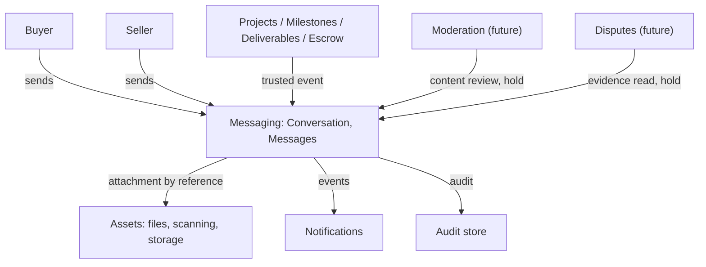
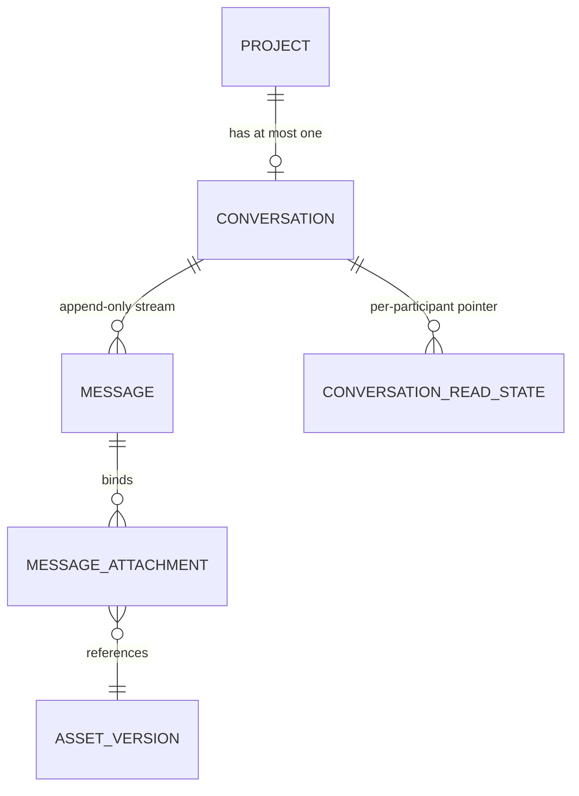
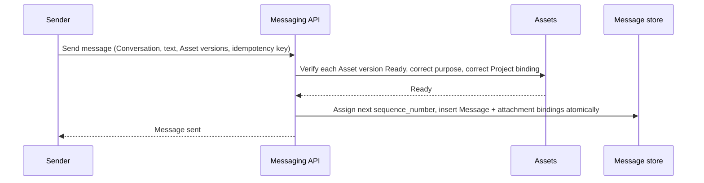
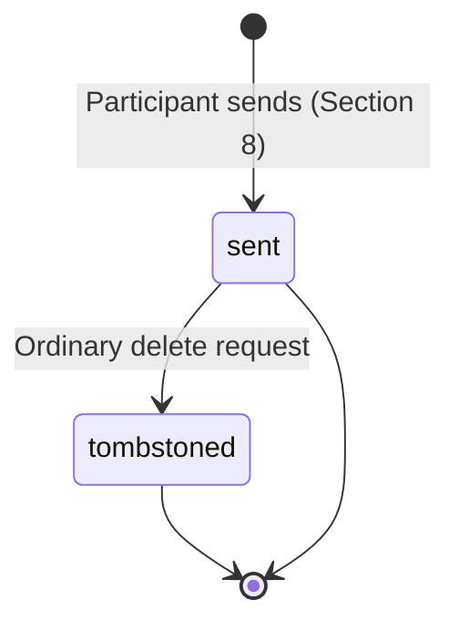
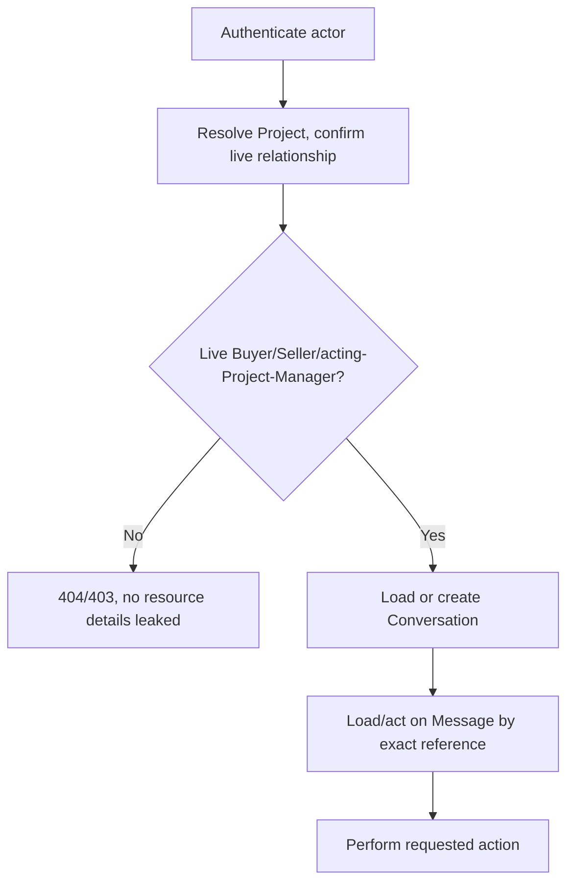
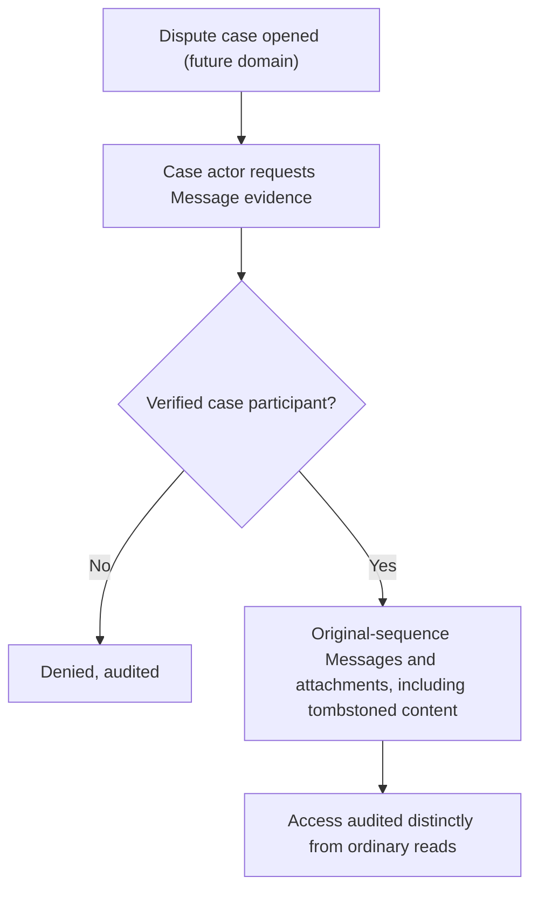
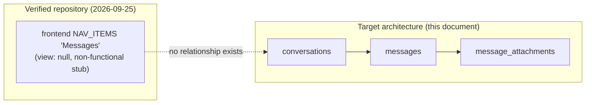

# Messaging and collaboration domain specification

| Metadata | Value |
| --- | --- |
| Document ID | `SPEC-MESSAGING-000` (provisional; see Section 3) |
| Type | Specification (SPEC) |
| Domain | Messaging and Collaboration (governed `MESSAGING` token) |
| Status | Proposed |
| Version | 0.1.0 |
| Owner | Product and Architecture |
| Last Reviewed | 2026-09-25 |
| Applies To | Target Messaging product architecture and verified current repository comparison |
| Governed token | `MESSAGING` |
| Canonical path | `docs/07-messaging-collaboration/messaging.md` |
| Product horizon | Target product architecture with verified repository comparison |
| Supersedes / Superseded By | None; formalizes [System Architecture Section 10.8](../01-foundation/system-architecture.md#108-messaging) and [User Settings Section 17.4](../03-identity-profiles-verification/user-settings.md#174-messaging-preferences), neither of which previously had an owning domain document |

## 1. Executive summary

Messaging and Collaboration gives each Project's Buyer and Seller one durable, Project-scoped conversation for delivery, clarification, and proof, and lets other domains post system-generated timeline events into it, without ever becoming a general social-chat product. It answers what Foundation already named — "a project's own communication channel" — but never defined: conversation identity, message identity, attachment binding, read state, deletion policy, and the evidence-preservation contract a future Disputes specification will need.

Three decisions drive this specification. First, ownership: Governance already maps `07-messaging-collaboration/` to the `MESSAGING` token (Governance Section 4, Section 11); this document is the first to occupy either, and no identifier collision exists to reconcile. Second, the aggregate model: one Conversation per Project (1:1, created lazily on the first message, exactly the pattern already established for Deliverables' lazy Submission-stream creation), holding an ordered, append-only Message stream — immutable once sent, never truly deleted, only tombstoned, so that dispute evidence is never destroyed by an ordinary deletion request. Third, scope discipline: this document deliberately excludes voice/video calls, public direct messages, group social chat, reactions, and typing indicators, none of which any existing product document requires, and it keeps attachments, system events, and read state to the minimum MVP needs, consistent with [System Architecture Section 10.8](../01-foundation/system-architecture.md#108-messaging)'s framing of Messaging as project-scoped collaboration, not a general messenger.

The repository contains no Messaging structure of any kind. No table, route, frontend view, or dependency for messages, conversations, or attachments exists anywhere in `backend/` or `frontend/`; the frontend's "Messages" navigation item is wired to no destination.

## 2. Purpose and scope

This document is canonical for:

- Conversation identity, its 1:1 relationship to a Project, and the immutable Message stream it holds;
- Message identity, sender, content, attachment-by-reference, and system-message contract;
- authorized participation, including an acting Organization Project Manager where the Organization model applies;
- read state, edit policy, deletion (tombstone) policy, and moderation hooks;
- the dispute-evidence-preservation contract a future Disputes specification consumes;
- Messaging's authorization, concurrency, idempotency, target logical data, interfaces, events, operations, security findings, and migration guidance.

This document deliberately does not define Project, Milestone, or Deliverable identity ([Projects](../05-projects-milestones/projects.md), [Milestones](../05-projects-milestones/milestones.md), [Deliverables](../05-projects-milestones/deliverables.md)), Asset storage, scanning, or retention mechanics ([assets-and-media.md](../03-identity-profiles-verification/assets-and-media.md)), Dispute adjudication, Notification delivery, Rating content, or the general Moderation domain (`09-moderation-trust-safety/`). Where it needs a fact from one of them, it cites the section or identifier and adds only the Messaging-level consequence.

## 3. Governance, structure, status, and authority

### 3.1 Ownership analysis

1. **Does Governance define a Messaging domain and directory?** Yes. [Governance Section 4](../00-governance/README.md#4-directory-structure) maps `07-messaging-collaboration/` to "In-project messaging and collaboration tooling," and [Governance Section 11](../00-governance/README.md#11-requirement-identifiers) lists `MESSAGING` as a permitted domain token. The directory was verified empty before this document was written.
2. **Does an identifier already exist under this token?** No, verified directly: a repository-wide search found zero `REQ-MESSAGING-*`, `BR-MESSAGING-*`, or any other `MESSAGING`-token identifier anywhere in `docs/`. This document starts each family at `001` with no inherited collision to reconcile.
3. **Does Foundation already describe this domain?** Yes, at the architecture level, not the specification level. [System Architecture Section 10.8](../01-foundation/system-architecture.md#108-messaging) states Messaging's purpose, ownership, and non-responsibilities in prose but defines no field, table, or identifier. This document is the first to do so, consistent with the same pattern Deliverables followed for its own Foundation-described-but-undefined domain ([Deliverables Section 3.1](../05-projects-milestones/deliverables.md#31-ownership-analysis)).
4. **Does User Settings already anticipate this domain?** Yes. [User Settings Section 17.4](../03-identity-profiles-verification/user-settings.md#174-messaging-preferences) already states the boundary this document must respect: "Messaging preferences cover read receipts, previews, sounds, and notification delivery. They cannot grant conversation access, delete required moderation evidence, or change message retention." This document treats that sentence as binding and does not reopen it.
5. **Does Assets already define a Messaging-owned Asset purpose?** Yes. [Assets Section 7.2](../03-identity-profiles-verification/assets-and-media.md#72-asset-purpose-matrix) already defines "Message Attachment" with owner domain "Messaging," Relationship Restricted visibility, and "inherits message retention and moderation holds." This document consumes that purpose as-is (Section 9) and does not invent a new one.

**Ownership decision:** Messaging and Collaboration is created at `docs/07-messaging-collaboration/messaging.md` under the governed `MESSAGING` token. No Governance or Foundation change was required. The required glossary at `docs/99-appendices/glossary.md` does not exist (the directory itself is empty), so the local definitions in Section 4 are provisional pending that glossary, following the identical precedent [Milestones Section 3](../05-projects-milestones/milestones.md#3-governance-status-and-authority) already discloses.

### 3.2 Identifier ranges

No prior `MESSAGING`-token identifier exists anywhere in the specification tree (point 2 above). This document defines:

| Family | Range defined here | Governed |
| --- | --- | --- |
| `REQ-MESSAGING-*` | 001–011 | Yes, Governance Section 11 |
| `BR-MESSAGING-*` | 001–004 | Yes, Governance Section 11 |
| `SEC-MESSAGING-*` | 001–011 | Yes, Governance Section 11.1 |
| `DATA-MESSAGING-*` | 001–004 | Yes, Governance Section 11.1 |
| `INT-MESSAGING-*` | 001–006 | Yes, Governance Section 11.1 |
| `AUD-MESSAGING-*` | 001–002 | Yes, Governance Section 11.1 |
| `EVT-MESSAGING-*` | 001–004 | No; provisional |
| `OPS-MESSAGING-*` | 001–003 | No; provisional |
| `SPEC-MESSAGING-000` | Document ID | No; provisional |

### 3.3 Reconciliation items

| Item | Documents and sections | Finding | Treatment here |
| --- | --- | --- | --- |
| MR1 | System Architecture Section 10.8 | Messaging's ownership, non-responsibilities, and "no state machine" framing are described in prose only | Adopted exactly (Section 5); Messaging never drives Project state and defines no per-message state machine, only an append-only stream (Section 8). |
| MR2 | User Settings Section 17.4 | Messaging preferences cannot grant access, delete required moderation evidence, or change retention | Adopted exactly; Section 10 (deletion) and Section 12 (evidence) never let a preference override these. |
| MR3 | Assets Section 7.2, "Message Attachment" purpose | Owner domain already named as Messaging | Consumed as-is (Section 9); this document does not redefine the purpose or its binding rules, only its own attachment-join table. |
| MR4 | Roles Section 8.7, "Project Manager" (Organization Role, Planned) | An Organization Role exists for acting on a Project on the org's behalf, but no document states whether it may participate in a Project's conversation | Resolved here: where the Organization model applies, an acting Project Manager participates exactly as the Buyer or Seller they represent would, subject to the same live-relationship check (Section 11). No new role is invented. |

The implementation labels in this document mean:

| Label | Meaning |
| --- | --- |
| Implemented | End-to-end behavior exists and was verified in the current repository. |
| Partially Implemented | Some executable path exists but one or more target guarantees are absent. |
| Schema Implemented | Database structure exists without the required executable domain behavior. |
| Planned | A repository artifact or existing specification declares intent but no complete behavior exists. |
| Not Implemented | No verified implementation was found. |

## 4. Terminology and domain boundaries

| Term | Local definition |
| --- | --- |
| Conversation | The single, per-Project aggregate identity that groups an ordered, append-only Message stream. Created lazily on the first Message. |
| Message | One immutable unit of conversation content: a User Message (sender, text, optional Asset attachments) or a System Message (a trusted domain event rendered inline). |
| Tombstone | The non-destructive deletion mechanism: a Message's display content is redacted from ordinary participant view, but the row, its hash, and its attachments remain retained for evidence and audit. |
| Conversation participant | The Project's live Buyer, live accepted Seller, or an acting Organization Project Manager standing in for either (Section 3.3, item MR4). |
| Read state | A per-participant, private pointer to the last Message that participant has seen; never a receipt broadcast to the counterparty in MVP. |
| System Message | A Message created by Messaging on a trusted event from another domain (for example, "Milestone locked," "Funds released"); Messaging never invents the underlying fact. |

Ownership boundary, consistent with [System Architecture Section 10.8](../01-foundation/system-architecture.md#108-messaging): Messaging owns conversation and message content only. It never owns Project, Milestone, Deliverable, Escrow, Payment, Dispute, or Rating state, and it never decides whether a system event occurred — it only renders a trusted fact it receives.

## 5. Canonical principles and architecture

1. Messaging is Project-bound communication between authorized participants, not a general social-chat product.
2. A Conversation is not a file store. It never stores bytes; a Message references Asset versions by identity through the existing Message Attachment purpose.
3. A Message, once sent, is immutable. A correction is a new Message; nothing overwrites, edits, or truly deletes a prior one — deletion is a tombstone (Section 10), never row removal, while any evidence, moderation, or legal hold is active.
4. Messaging never drives Project, Milestone, Escrow, Deliverable, or Dispute state; it consumes trusted facts to render System Messages and never emits a fact another domain would treat as authoritative business state.
5. Only current, live Conversation participants may read or send; an Observer, if the Project grants one, receives no message content by default, consistent with Projects' own restriction on Observer access to private data.
6. A Message relevant to a Dispute remains preservable as evidence; ordinary deletion (tombstoning) never erases what a future Disputes specification would need (Section 12).
7. Authorization is relationship-based and re-evaluated on every read; a Conversation or Message is never reachable by identifier guessing alone.
8. Every Message-creating and tombstone mutation is idempotent under a caller-supplied key or a natural uniqueness constraint.

*Figure 1 — Messaging Domain Architecture. Messaging renders trusted facts from other domains and never becomes a second authority for Project, Milestone, or Dispute state.*

`REQ-MESSAGING-001`: Messaging MUST NOT write or infer Project, Milestone, Deliverable, Escrow, Payment, Dispute, or Rating state, and MUST render a System Message only from a verified fact supplied by that fact's owning domain.

## 6. Conversation identity and aggregate model

### 6.1 Cardinality decision

One Project has at most one Conversation, created lazily on the first Message — an empty Conversation carries no information the Project does not already express through its own accepted-Seller relationship. One Conversation has zero or more immutable Messages, ordered by a strictly increasing sequence number. This is the smallest model consistent with a single Project-scoped channel and mirrors the lazy-creation pattern already used for Deliverables' Submission stream ([Deliverables Section 6.1](../05-projects-milestones/deliverables.md#61-cardinality-decision)).

### 6.2 Conversation field matrix

| Field | Definition | Storage class | Mutability | Repository status |
| --- | --- | --- | --- | --- |
| `id` | Internal UUID primary key | Stored | Immutable | Not Implemented |
| `external_id` | Opaque, unique, externally addressable identifier | Stored | Immutable | Not Implemented |
| `project_id` | Owning Project; unique (enforces 1:1) | Stored | Immutable | Not Implemented |
| `latest_message_id` | Pointer to the current (highest-sequence) Message | Stored projection | Updated only by a new Message | Not Implemented |
| `message_count` | Count of Messages | Derived | Recomputed, never client-supplied | Not Implemented |
| `version` | Optimistic concurrency token | Stored | Incremented on every Message | Not Implemented |
| `created_at` / `updated_at` | Timestamps | Stored | `updated_at` changes only with a new Message | Not Implemented |

`REQ-MESSAGING-002`: A Conversation MUST be unique per Project, MUST be created no earlier than the first Message, and MUST NOT store an Escrow, Milestone, Deliverable, or Dispute status field.

### 6.3 Aggregate relationship

*Figure 2 — Project to Conversation to Message to Asset Relationship. Attachments reference Asset versions by identity; Messaging never stores bytes.*

## 7. Authorized participants

### 7.1 Participant matrix

| Participant | Access | Condition | Repository status |
| --- | --- | --- | --- |
| Project Buyer | Read, send | Live Project relationship | Not Implemented |
| Accepted Seller | Read, send | Live Project relationship | Not Implemented |
| Acting Organization Project Manager (Section 3.3, item MR4) | Read, send, standing in for the Buyer or Seller they represent | Live Organization Membership and Project Manager role assignment ([Roles Section 8.7](../02-users-roles-permissions/roles.md#87-project-manager)), Planned | Not Implemented |
| Observer (if the Project grants one) | None by default | Projects' own Observer restriction already denies "private Asset data by default"; Messaging content is treated the same way | Not Implemented |
| Moderator | Case-scoped read only | Assigned case, purpose, minimum projection, distinctly audited | Not Implemented |
| Administrator | Case-scoped read only | Same as Moderator | Not Implemented |
| Dispute case actor (future) | Case-scoped read of evidence-relevant Messages | Verified case participant list, not identifier alone | Not Implemented |
| Any other authenticated user | None | No relationship | Not Implemented |

`REQ-MESSAGING-003`: Messaging MUST restrict Conversation read and send access to the Project's live Buyer, live accepted Seller, and any acting Organization Project Manager standing in for either, and MUST deny an Observer, an unrelated user, or a stale participant by default.

## 8. Message model

### 8.1 Message field matrix

| Field | Definition | Storage class | Mutability | Repository status |
| --- | --- | --- | --- | --- |
| `id` | Internal UUID primary key | Stored | Immutable | Not Implemented |
| `external_id` | Opaque, unique, externally addressable identifier | Stored | Immutable | Not Implemented |
| `conversation_id` | Owning Conversation | Stored | Immutable | Not Implemented |
| `sequence_number` | Strictly increasing per Conversation, starting at 1 | Stored | Immutable | Not Implemented |
| `message_type` | `USER` or `SYSTEM` | Stored | Immutable | Not Implemented |
| `sender_user_id` | The authoring participant; `NULL` only for `SYSTEM` messages | Stored | Immutable | Not Implemented |
| `system_event_reference` | For `SYSTEM` messages, the source domain's event ID (Section 13.2); `NULL` for `USER` messages | Stored | Immutable | Not Implemented |
| `body` | Bounded, restricted text | Stored | Immutable (Section 8.2) | Not Implemented |
| `sent_at` | Server-assigned timestamp; never client-supplied | Stored | Immutable | Not Implemented |
| `idempotency_key` | Caller-supplied key bound to sender, Conversation, and request hash | Stored, unique | Immutable | Not Implemented |
| `tombstoned_at` / `tombstoned_by_user_id` | Nullable; set only by a tombstone action (Section 10) | Stored | Set once | Not Implemented |
| `attachment_count` | Count of bound Assets | Derived | Not applicable | Not Implemented |

### 8.2 Edit policy

Messages are not editable in MVP. No existing product document establishes an edit window, and inventing one would create an unreviewed evidence-integrity question for a future Disputes specification. A sender who needs to correct content sends a new Message. This is recorded as Open Question EQ4 (Section 24.3) for a possible future short edit window, should Product decide one is needed.

`BR-MESSAGING-001`: A Message's `body`, `sender_user_id`, `message_type`, and attachments MUST NOT be edited after creation; a correction MUST take the form of a new Message.

## 9. Asset attachments

### 9.1 Attachment relationship matrix

| Concern | Rule | Repository status |
| --- | --- | --- |
| Binding | A join row per (Message, Asset version), never a Conversation-to-Asset direct link | Not Implemented |
| Purpose | "Message Attachment" per [Assets Section 7.2](../03-identity-profiles-verification/assets-and-media.md#72-asset-purpose-matrix); Messaging does not invent a new purpose | Not Implemented |
| Attachment ordering | An explicit `display_order` integer per binding, unique within a Message | Not Implemented |
| Readiness requirement | Only `Ready` Asset versions may be bound at send time; Messaging never sends a Message referencing a `Quarantined`, `Processing`, `Failed`, or `Deleted` Asset | Not Implemented |
| Access authorization | Every read re-verifies live Conversation participant relationship before returning an Asset URL or descriptor (Section 11) | Not Implemented |
| Retention | Inherits message retention and moderation holds, per Assets' own definition of the Message Attachment purpose | Not Implemented |
| Deletion | Assets' deletion never removes the binding row; the binding becomes a tombstone reference, consistent with the Message's own tombstone model (Section 10) | Not Implemented |

`REQ-MESSAGING-004`: Messaging MUST NOT store file bytes, MUST bind only `Ready` Asset versions carrying the Message Attachment purpose scoped to the same Project, and MUST re-verify live authorization before exposing any attachment reference.

### 9.2 Attachment sequence

*Figure 3 — Message Send with Attachment. Messaging verifies Asset readiness and purpose before writing; a partially bound Message never exists.*

## 10. Deletion (tombstone) policy

### 10.1 Lifecycle matrix

| Scenario | Behavior | Repository status |
| --- | --- | --- |
| Ordinary participant "delete" request | Tombstones the Message: display content is redacted from ordinary participant view; the row, hash, and attachment bindings remain retained | Not Implemented |
| Tombstone while a hold is active (dispute, moderation, financial, legal) | Tombstone still applies to ordinary display, but the underlying content remains fully accessible to authorized case actors until the hold releases, per [Assets Section 18](../03-identity-profiles-verification/assets-and-media.md#18-retention-archival-restoration-and-deletion) | Not Implemented |
| Attempted hard deletion | Never available through any ordinary route; only a governed retention/erasure process, outside this document's scope, may eventually purge a tombstoned row after every hold clears | Not Implemented |
| Conversation-level deletion | Not a concept in this document; a Conversation is never deleted while its Project exists. Removing the Project relationship does not delete Message history | Not Implemented |
| Preference-driven suppression | A Messaging preference (previews, sounds, notification delivery) never deletes, hides from evidence access, or changes retention of any Message, per [User Settings Section 17.4](../03-identity-profiles-verification/user-settings.md#174-messaging-preferences) | Not Implemented |

*Figure 4 — Message Lifecycle. Only two states exist; a tombstone redacts display without destroying the underlying evidence record.*

`REQ-MESSAGING-005`: A Message tombstone MUST redact ordinary display content only, MUST NOT remove the underlying row, hash, or attachment bindings, and MUST NOT be reachable through any route that performs an unconditional hard delete.

`BR-MESSAGING-002`: Messaging MUST NOT permit a user preference to delete a Message, alter its retention, or change access to Message content beyond the participant's own display and notification convenience.

## 11. Authorization

### 11.1 Authorization matrix

| Action | Who | Additional condition | Repository status |
| --- | --- | --- | --- |
| Create Conversation (implicit, on first Message) | Live Project Buyer or accepted Seller | Live Project relationship | Not Implemented |
| Send Message | Live Project Buyer, accepted Seller, or acting Project Manager (Section 7.1) | Live Project relationship; Asset readiness for any attachment | Not Implemented |
| Read Conversation / Messages | Same as send | Live Project relationship; tombstoned content redacted for ordinary participants | Not Implemented |
| Tombstone own Message | The original sender only | Live Project relationship; no active hold overriding display (Section 10) | Not Implemented |
| System Message creation | Trusted producer identity (owning domain) | Signed channel, event ID, version dedupe | Not Implemented |
| Case-scoped evidence access | Authorized case actor (future Disputes), assigned Moderator, or Administrator | Verified case participant list, never identifier alone; distinctly audited | Not Implemented |
| Read attachment | Same as read Conversation | Live relationship re-verified on every access; Asset policy applies | Not Implemented |

### 11.2 Resource-loading order

Every Messaging operation resolves in this order, extending the identical pattern already established in [Deliverables Section 18.2](../05-projects-milestones/deliverables.md#182-resource-loading-order) and [Ratings Section 15.2](../08-ratings-reputation/ratings.md#152-resource-loading-order): authenticate the actor; resolve the Project's opaque external identifier scoped to the actor's live relationship; confirm live Buyer/Seller/acting-Project-Manager relationship before resolving any Conversation-scoped identifier; only then load or create the Conversation and act on a Message. A bare Conversation or Message identifier is never resolved before the owning Project relationship is confirmed, preventing cross-Project leakage.

*Figure 5 — Messaging Access Evaluation. Project-relationship confirmation happens before any Conversation- or Message-scoped identifier is resolved, preventing IDOR and cross-Project leakage.*

`REQ-MESSAGING-006`: Every Messaging read or write MUST re-verify live Project participant relationship before resolving any Conversation- or Message-scoped identifier, and MUST NOT authorize by identifier possession alone.

## 12. Dispute-evidence preservation

Messaging does not adjudicate disputes. This section defines only its contract with a future Disputes specification, consistent with the same non-destructive pattern [Deliverables Section 15](../05-projects-milestones/deliverables.md#15-dispute-relationship) already establishes for Submissions.

### 12.1 Dispute-evidence matrix

| Concern | Messaging-level contract | Repository status |
| --- | --- | --- |
| What becomes evidence | Every Message (including tombstoned ones) and its Asset attachments, in exact original sequence | Not Implemented |
| Tombstone effect on evidence | None; a tombstone redacts ordinary display only and never removes evidence-relevant content | Not Implemented |
| Evidence access | Authorized case actors only, for the duration of the case, verified against the Dispute record's participant list | Not Implemented |
| Evidence integrity | Every Message's hash is preserved unchanged; no retroactive edit is possible (Section 8.2) | Not Implemented |
| New Messages during a dispute | Not blocked by Messaging itself; Messaging has no dispute-state awareness and continues to accept Messages unless a future Disputes specification asserts a case-specific hold | Not Implemented |
| Audit trail | Every case-scoped evidence access is audited distinctly from ordinary participant reads | Not Implemented |

*Figure 6 — Dispute Evidence Flow. Tombstoning never narrows what a verified case actor can see; only ordinary participant display is redacted.*

`REQ-MESSAGING-007`: Messaging MUST preserve every Message, including tombstoned ones, and every attachment binding as potential Dispute evidence, MUST NOT allow retroactive content mutation, and MUST audit every case-scoped evidence access distinctly from ordinary participant reads.

## 13. System messages

### 13.1 Principles

A System Message renders a trusted fact Messaging receives from that fact's owning domain; Messaging never decides whether something notable happened, mirroring the identical principle [System Architecture Section 10.10](../01-foundation/system-architecture.md#1010-notifications) already establishes for Notifications. A duplicate event delivery produces no duplicate System Message.

### 13.2 System event source matrix

| Source domain | Example event | Repository status |
| --- | --- | --- |
| Milestones | Plan frozen/agreed, Milestone funded, delivered, revision requested, approved, released, refunded, cancelled | Not Implemented |
| Deliverables | Submission created, resubmission created | Not Implemented |
| Escrow | Funding confirmed, allocation released, refund confirmed | Not Implemented |
| Disputes (future) | Dispute opened, dispute resolved | Not Implemented |
| Projects | Invitation accepted, Project locked | Not Implemented |

`REQ-MESSAGING-008`: A System Message MUST be created only from a verified, uniquely identified event supplied by that event's owning domain, and a duplicate delivery of the same event MUST NOT create a second System Message.

## 14. Read state

| Field | Definition | Repository status |
| --- | --- | --- |
| `conversation_id` | The Conversation | Not Implemented |
| `user_id` | The participant | Not Implemented |
| `last_read_message_id` | Pointer to the highest Message this participant has seen | Not Implemented |
| `updated_at` | Timestamp of the last read-state update | Not Implemented |

Read state is a private, per-participant convenience projection; it is never broadcast to the counterparty as a "seen by" receipt in MVP (Open Question EQ2, Section 24.3), and it never gates any other domain's behavior.

`BR-MESSAGING-003`: Read state MUST remain private to the participant it belongs to and MUST NOT be exposed to the counterparty, a Moderator, or an Administrator as a receipt without a separate, explicit product decision.

## 15. Moderation

### 15.1 Moderation matrix

Messaging defines only its contract with a future Moderation specification (`09-moderation-trust-safety/`); it does not define Moderation's own case or review workflow.

| Concern | Messaging-side contract | Repository status |
| --- | --- | --- |
| Abuse, spam, harassment | Reported by a participant or detected by Moderation; results in a Moderation-owned hold or a Messaging-executed tombstone-equivalent restriction, never a text edit | Not Implemented |
| Impersonation / spoofing | Prevented structurally: `sender_user_id` is always the authenticated actor, never client-supplied (Section 16) | Not Implemented |
| Content-policy escalation | Messaging exposes Message content to an assigned Moderator under case scope; it does not itself classify content | Not Implemented |
| Evidence preservation during moderation | Identical to Section 12: a moderation hold never permits destructive deletion | Not Implemented |

`REQ-MESSAGING-009`: A Moderator or Administrator's access to Message content MUST be case-scoped, purpose-bound, and distinctly audited from ordinary participant access, and no moderation action MUST alter a Message's original content.

## 16. Security

### 16.1 Security principles

Sender identity is always the authenticated actor's own identifier; no route accepts a client-supplied sender. Cross-Project leakage is prevented by the resource-loading order of Section 11.2. Attachment authorization is re-evaluated on every access, never cached past a single request (Section 9.1).

## 17. Concurrency and idempotency

| Operation | Protection |
| --- | --- |
| Duplicate send | `Idempotency-Key` bound to sender, Conversation, and canonical request hash; replay returns the original Message |
| Duplicate attachment binding within a Message | Unique `(message_id, asset_version_id)`; a repeat is a no-op |
| Concurrent sends from both participants | Serialized by Conversation lock; sequence numbers assigned under that lock, never client-supplied |
| Duplicate System Message | Deduplicated by `(conversation_id, system_event_reference)` |
| Duplicate tombstone | Idempotent; a repeat returns the original tombstoned state |

`REQ-MESSAGING-010`: Every Message-creating and tombstone transaction MUST be idempotent under a caller-supplied key or natural uniqueness constraint, and sequence-number assignment MUST occur under the Conversation's own lock.

## 18. Audit, events, and notifications

### 18.1 Audit requirements

| Identifier | Requirement |
| --- | --- |
| `AUD-MESSAGING-001` | Record Conversation creation (implicit, on first Message), every Message creation (User and System), and every tombstone action, with actor, Project, Conversation, Message reference, and timestamp. |
| `AUD-MESSAGING-002` | Record every case-scoped Moderator, Administrator, or Dispute-actor access to Message content distinctly from ordinary participant reads. |

### 18.2 Provisional events and operations

Governance defines no `EVT-*` or `OPS-*` family; the following are provisional pending a Governance amendment, following the precedent already disclosed in [Milestones Section 3](../05-projects-milestones/milestones.md#3-governance-status-and-authority) and [Ratings Section 17.2](../08-ratings-reputation/ratings.md#172-provisional-events-and-operations).

| Provisional ID | Event/operation | Consumers |
| --- | --- | --- |
| `EVT-MESSAGING-001` | `MessageSent` | Notifications, read-state projection |
| `EVT-MESSAGING-002` | `SystemMessageRendered` | Notifications (optional), audit |
| `EVT-MESSAGING-003` | `MessageTombstoned` | Audit |
| `EVT-MESSAGING-004` | `ConversationCreated` (implicit, on first Message) | Notifications (optional), audit |
| `OPS-MESSAGING-001` | Orphaned pre-send attachment-binding cleanup job | Operations |
| `OPS-MESSAGING-002` | Stale idempotency-key expiry job | Operations |
| `OPS-MESSAGING-003` | Duplicate System Message reconciliation report against source-domain event counts | Operations, Audit |

### 18.3 Notification behavior

| Notice | Class | Preference behavior |
| --- | --- | --- |
| New message | Configurable | May be disabled per [User Settings Section 11](../03-identity-profiles-verification/user-settings.md#11-notification-preferences); the underlying Message is unaffected either way |
| System Message rendered | Follows the source event's own mandatory/configurable classification (for example, a Milestone-funded system message is mandatory financial per Milestones Section 25.4) | As the source event dictates |

`REQ-MESSAGING-011`: Every Messaging mutation MUST produce redacted, immutable audit evidence before the operation is considered complete, and notification delivery failure MUST NOT roll back or block a committed Message.

## 19. Target data model

### 19.1 Target model matrix

| Identifier and model | Purpose and principal fields | Keys, uniqueness | Repository status |
| --- | --- | --- | --- |
| `DATA-MESSAGING-001` `conversations` | One row per Project with at least one Message; current-Message projection | PK `id`; unique `external_id`; unique `project_id` (enforces 1:1); FK `project_id` `RESTRICT` | Not Implemented |
| `DATA-MESSAGING-002` `messages` | Immutable, sequenced Message records per Section 8 | PK; unique `external_id`; unique `(conversation_id, sequence_number)`; unique `idempotency_key`; FK `conversation_id` `RESTRICT`; FK `sender_user_id` `RESTRICT` nullable | Not Implemented |
| `DATA-MESSAGING-003` `message_attachments` | Ordered binding of a Message to Asset versions | PK; unique `(message_id, asset_version_id)`; unique `(message_id, display_order)`; FK `RESTRICT` | Not Implemented |
| `DATA-MESSAGING-004` `conversation_read_states` | Private per-participant read pointer (Section 14) | PK `(conversation_id, user_id)`; FK `RESTRICT` | Not Implemented |

Four tables are sufficient: one current-state projection, one immutable historical stream, one attachment join, and one private read-state table.

`REQ-MESSAGING-012`: The target Messaging schema MUST consist of the smallest normalized set of tables that preserves immutable Message history and attachment bindings plus one current-state projection, and MUST NOT require altering any Projects-, Milestones-, or Assets-owned table.

`BR-MESSAGING-004`: `messages` and `message_attachments` MUST be append-only; no row MUST be hard-deleted by an ordinary participant or preference action.

## 20. Domain dependencies and interfaces

### 20.1 Domain dependency matrix

| Domain | Messaging depends on | Messaging provides | Failure behavior |
| --- | --- | --- | --- |
| Projects | Project identity, participant relationship | Nothing directly; Projects never reads Message content | Reject with no partial write |
| Milestones, Deliverables, Escrow, Projects | Trusted domain events for System Messages | Nothing; Messaging never emits a fact these domains treat as authoritative | Never invent a fact from a missing event |
| Assets | Asset version identity, readiness state, Message Attachment purpose and binding rules | Purpose-scoped binding requests | Fail closed |
| Disputes (future) | Nothing directly | Message and attachment history as evidence, by reference (Section 12) | Deny by default without a valid case |
| Authorization | Relationship/role decisions for every operation | Nothing; Authorization owns the decision framework only | Deny closed |
| Notifications | Nothing directly | Message-sent and system-event notification triggers, consumed for delivery only | Delivery failure never blocks a Message |
| Moderation (future) | Case assignment and hold decisions | Message content for case-scoped review | Deny by default without a valid case |

### 20.2 Interface identifiers

| Interface | Direction | Description | Repository status |
| --- | --- | --- | --- |
| `INT-MESSAGING-001` | Client → Messaging | Send Message (Conversation, text, Asset versions, idempotency key) | Not Implemented |
| `INT-MESSAGING-002` | Messaging → Assets | Purpose-scoped binding request (Asset version, Message Attachment purpose, Project) | Not Implemented |
| `INT-MESSAGING-003` | Assets → Messaging | Asset readiness/state answer | Not Implemented |
| `INT-MESSAGING-004` | Owning domain → Messaging | Trusted event for System Message rendering | Not Implemented |
| `INT-MESSAGING-005` | Messaging → Authorization | Relationship/role check for every read and write | Not Implemented |
| `INT-MESSAGING-006` | Messaging → Notifications | Message-sent, system-event notification triggers | Not Implemented |

## 21. Verified repository comparison

### 21.1 Review method

`backend/db/*.sql` (all eight migrations), `backend/Index.js` (all twelve routes), `frontend/src/App.tsx`, both `package.json` files, and the repository for any `tests` directory were searched directly, following the same method as [Deliverables Section 22.1](../05-projects-milestones/deliverables.md#221-review-method).

### 21.2 Findings

No migration defines a `messages`, `conversations`, `message_attachments`, or `conversation_read_states` table, nor any enum resembling a Message or Conversation state. `backend/Index.js`'s twelve routes contain no `message`, `conversation`, or `chat` path, handler, or SQL statement. `frontend/src/App.tsx`'s `NAV_ITEMS` includes a "Messages" entry wired to `view: null` — a visible but non-functional navigation stub. No dependency for real-time delivery (for example, a WebSocket library) exists in either `package.json`.

### 21.3 Repository comparison matrix

| Capability | Verified artifact | Gap against target | Status |
| --- | --- | --- | --- |
| Conversation table | None | Full schema of Section 19 | Not Implemented |
| Message table | None | Full schema of Section 19 | Not Implemented |
| Attachment binding table | None | Full schema of Section 19 | Not Implemented |
| Read-state table | None | Full schema of Section 19 | Not Implemented |
| API routes | None | Full route set implied by Sections 8, 10, 13 | Not Implemented |
| Frontend | Non-functional "Messages" nav stub only | Full conversation UI | Not Implemented |
| Authorization | None | Section 11 | Not Implemented |
| Tests | None | Full suite of Section 23 | Not Implemented |

*Figure 7 — Repository vs. Target Architecture. The frontend navigation stub carries no structural relationship to the target model; the entire target schema is new.*

## 22. Security findings

| Finding | Severity | Verified condition or target threat | Impact | Required treatment | Disposition |
| --- | --- | --- | --- | --- | --- |
| `SEC-MESSAGING-001` No Messaging authorization surface exists | Critical | No route exists; a bare identifier is the only key design available once built | IDOR across Projects once a route exists | Relationship-based resolution order of Section 11.2 | Open |
| `SEC-MESSAGING-002` No sender-identity enforcement exists | Critical | No route exists to enforce it | A naive implementation could accept a client-supplied `sender_user_id`, enabling spoofing | Server-derived sender identity of Section 16.1 | Open |
| `SEC-MESSAGING-003` No cross-Project leakage prevention exists | High | No route or query scoping exists | A Message from one Project could be exposed to an unrelated user if a naive implementation resolves Message IDs before Project relationship | Resource-loading order of Section 11.2 | Open |
| `SEC-MESSAGING-004` No idempotency mechanism exists | High | No Message table or key column exists | A retried send could create a duplicate Message once built without this control | Idempotency key of Section 17 | Open |
| `SEC-MESSAGING-005` No Asset-readiness gate at send time | Critical | No send logic exists | An unsafe or unscanned Asset could be attached and rendered to a counterparty | Mandatory `Ready`-state check of Section 9.1 | Open |
| `SEC-MESSAGING-006` No destructive-deletion protection exists | Critical | No storage exists yet; the risk is latent in any naive "delete message" design that performs a hard delete | Loss of dispute-relevant evidence | Tombstone-only deletion model of Section 10 | Open |
| `SEC-MESSAGING-007` No moderation/case access separation exists | High | No route or case model exists | An ordinary participant read path could be reused for case-scoped evidence access without distinct audit | Case-scoped, distinctly audited access of Section 12/15 | Open |
| `SEC-MESSAGING-008` No audit trail exists | High | No audit table or event exists | Unauthorized access, spoofing, or evidence tampering would be undetectable | `AUD-MESSAGING-001`/`002` of Section 18.1 | Open |
| `SEC-MESSAGING-009` No rate limiting on any future Messaging route | Medium | No route exists; consistent with the repository-wide absence of rate limiting noted in `SEC-AUTH-005` | Spam or abuse of a send endpoint once built | Rate limits on every Messaging route | Open |
| `SEC-MESSAGING-010` No unbounded-input protection for message body | Low | No field exists yet | Unbounded or unrestricted text could leak into logs/events or exhaust storage | Bounded, restricted text requirement of Section 8.1 | Open |
| `SEC-MESSAGING-011` No automated Messaging test coverage | High | No test file or directory exists | Authorization, idempotency, and evidence-preservation regressions would reach production undetected | Layered test suite of Section 23 | Open |

"Open" is a finding disposition (target-architecture risk given the current empty repository state), not an implementation-status label. Cross-domain findings that also apply: Authentication `SEC-AUTH-002`/`SEC-AUTH-005`, and every Assets finding governing Asset storage and access that this document's attachment bindings rely on.

## 23. Implementation status

| Target area | Status | Evidence | Next contract boundary |
| --- | --- | --- | --- |
| Conversation identity | Not Implemented | No table | Section 6 |
| Message model | Not Implemented | No table | Section 8 |
| Attachment binding | Not Implemented | No table | Section 9 |
| Deletion (tombstone) | Not Implemented | No table | Section 10 |
| Authorization | Not Implemented | No route | Section 11 |
| Dispute-evidence contract | Not Implemented | No Disputes specification yet | Section 12 |
| System messages | Not Implemented | No event consumption | Section 13 |
| Read state | Not Implemented | No table | Section 14 |
| Audit/events | Not Implemented | No audit table | Section 18 |
| Frontend | Not Implemented | Non-functional nav stub only | Full conversation UI |
| Automated tests | Not Implemented | None | Section 23 (staged plan, Section 25) |

**Staged implementation plan** (documentation only; does not modify application code or migrations):

1. Conversation and Message schema (Section 19).
2. Authorization: relationship-based resolution order of Section 11.2.
3. Send workflow (creation, Asset-readiness verification, atomic transaction).
4. Tombstone workflow (non-destructive deletion).
5. System-message event consumption (Section 13).
6. Read-state projection (Section 14).
7. Dispute-evidence access contract (Section 12), once a Disputes specification exists.
8. Moderation case-scoped access contract (Section 15), once a Moderation specification exists.
9. Concurrency/idempotency (sequence assignment, idempotency keys).
10. Audit/events (`AUD-MESSAGING-001`/`002`, provisional `EVT-MESSAGING-001`–`004`).
11. Notifications integration (event consumption only).
12. Automated tests: authorization/IDOR, sender-spoofing, idempotency, Asset-readiness gating, tombstone-preservation, and cross-Project-leakage suites.

## 24. Risks, assumptions, and open questions

### 24.1 Risks

| Risk | Description |
| --- | --- |
| Sender spoofing | A naive implementation trusting a client-supplied sender identity could enable impersonation |
| Cross-Project leakage | Missing relationship checks at read time could expose one Project's Messages to an unrelated user |
| Evidence destruction | A naive "delete message" implementation could hard-delete rather than tombstone, destroying dispute evidence |
| Unsafe attachment exposure | Missing readiness gating could render an unscanned or quarantined Asset to a counterparty |
| Notification storm | An unbounded System Message stream from other domains without deduplication could overwhelm participants |
| Missing tests | No automated coverage exists to catch regressions in any of the above once implementation begins |

### 24.2 Assumptions

- The Project Buyer, accepted Seller, and their live-relationship verification mechanism are exactly as defined in Projects and Authorization; this document invents no new relationship-derived role.
- Assets' "Message Attachment" purpose, as already defined in Assets Section 7.2, is sufficient for MVP Messaging attachment use without a new purpose.
- Real-time delivery mechanics (WebSocket versus polling) are an implementation-topology choice, not a contract change; this document's interfaces (Section 20.2) are transport-neutral.
- INR-only currency and monetary handling are not relevant to Messaging, which handles no money; noted only because [memory: MusicApp is locked to INR for launch] does not otherwise interact with this domain.

### 24.3 Prioritized open questions

| ID | Priority | Question | Why it blocks or risks | Decision owner | Affected contract |
| --- | --- | --- | --- | --- | --- |
| EQ1 | P1 | Should message delivery be real-time (for example, WebSocket) or poll-based for MVP? | Affects perceived responsiveness and infrastructure choice, not the contract itself | Product, Engineering | Section 20 |
| EQ2 | P1 | Should read state ever be shown to the counterparty as a "seen by" receipt? | User Settings' "read receipts" preference implies the feature may exist in some form; this document deliberately keeps it private-only for MVP | Product | Section 14 |
| EQ3 | P2 | What attachment size/count limits, beyond Assets' own class limits, apply per Message? | Unbounded attachment counts could be used to exhaust storage or review time | Product | Section 9 |
| EQ4 | P2 | Is a short Buyer/Seller-editable window needed before a Message becomes fully immutable? | MVP treats every Message as immutable on send; this may be too strict for typo correction | Product | Section 8.2 |
| EQ5 | P2 | Should a Message ever be addressed to a specific Milestone or Deliverable Submission as structured context, beyond free text? | Affects clarity of delivery/clarification conversations | Product | Section 8 |
| EQ6 | P2 | Which governed families should replace the provisional `EVT-MESSAGING-*` and `OPS-MESSAGING-*` identifiers used here? | Governance defines no such families yet; also open in Milestones (Question Q16), Deliverables (Question EQ9), and Ratings (Question EQ8) | Governance | Section 18.2 |

## 25. Traceability

### 25.1 Requirement traceability

| Requirement | Product outcome | Sections | Test focus |
| --- | --- | --- | --- |
| `REQ-MESSAGING-001` | No cross-domain state ownership | 5 | Boundary tests |
| `REQ-MESSAGING-002` | Conversation uniqueness and no cached status | 6 | Uniqueness, projection tests |
| `REQ-MESSAGING-003` | Restricted, relationship-based participation | 7 | Access-restriction tests |
| `REQ-MESSAGING-004` | No byte storage, readiness/purpose gating | 9 | Binding validation tests |
| `REQ-MESSAGING-005` | Non-destructive tombstone deletion | 10 | Preservation tests |
| `REQ-MESSAGING-006` | Relationship-based authorization order | 11 | IDOR tests |
| `REQ-MESSAGING-007` | Dispute-evidence preservation | 12 | Evidence-integrity tests |
| `REQ-MESSAGING-008` | Deduplicated, trusted-fact-only System Messages | 13 | Event-dedupe tests |
| `REQ-MESSAGING-009` | Case-scoped, audited moderation access | 15 | Access-separation tests |
| `REQ-MESSAGING-010` | Idempotent, lock-ordered mutation | 17 | Concurrency/race tests |
| `REQ-MESSAGING-011` | Synchronous audit, non-blocking notification | 18 | Audit tests |
| `REQ-MESSAGING-012` | Smallest normalized target schema | 19 | Migration review |

### 25.2 Business rule traceability

| Rule | Statement | Rationale | Status | Sections |
| --- | --- | --- | --- | --- |
| `BR-MESSAGING-001` | A Message's content and attachments MUST NOT be edited after creation. | Preserves provenance and dispute evidence. | Not Implemented | 8.2 |
| `BR-MESSAGING-002` | A user preference MUST NOT delete a Message, alter its retention, or change access beyond display/notification convenience. | Preserves evidence and retention integrity against convenience settings. | Not Implemented | 10 |
| `BR-MESSAGING-003` | Read state MUST remain private and MUST NOT be exposed as a receipt without an explicit product decision. | Avoids inventing an unrequested feature. | Not Implemented | 14 |
| `BR-MESSAGING-004` | `messages` and `message_attachments` MUST be append-only. | Preserves historical and dispute evidence. | Not Implemented | 19 |

### 25.3 Family range summary

| Family | Range in this document |
| --- | --- |
| `REQ-MESSAGING-*` | 001–012 |
| `BR-MESSAGING-*` | 001–004 |
| `SEC-MESSAGING-*` | 001–011 |
| `DATA-MESSAGING-*` | 001–004 |
| `INT-MESSAGING-*` | 001–006 |
| `AUD-MESSAGING-*` | 001–002 |
| `EVT-MESSAGING-*` (provisional) | 001–004 |
| `OPS-MESSAGING-*` (provisional) | 001–003 |

## 26. Validation record

This document was validated against Governance's structural requirements before commit: exactly one H1; sequential, non-skipping H2/H3 numbering; Status Proposed and Version 0.1.0 stated once in the metadata table and not contradicted elsewhere; no placeholder or "TBD" content; all required tables (conversation field matrix, message field matrix, attachment relationship, authorization matrix, lifecycle matrix, dispute-evidence matrix, moderation matrix, repository comparison, implementation status, security findings, open questions) present and substantive; all required Mermaid diagram categories present (domain architecture, aggregate relationship, message send/attachment, deletion state machine, authorization evaluation, dispute-evidence flow, repository vs. target) with balanced fences; relative links resolve to sections that exist in their target documents; identifiers verified unique across the complete specification tree with zero collisions (Section 3.2, no prior `MESSAGING`-token identifier existed); repository claims are evidence-based per Section 21; target behavior is never mislabeled as implemented; Project, Milestone, Escrow, and Dispute state remain untouched by this document throughout (Sections 5, 12, 13); Message history is non-destructive throughout (Sections 8, 10, 12); no trailing whitespace or tabs were introduced.

## 27. Version history

| Version | Date | Change | Author |
| --- | --- | --- | --- |
| 0.1.0 | 2026-09-25 | Initial canonical Messaging and Collaboration domain specification: ownership resolved to the `MESSAGING` token under `docs/07-messaging-collaboration/`, verified empty and identifier-collision-free before authoring; one-Conversation-per-Project aggregate model with an append-only Message stream; Asset-attachment-by-reference contract reusing Assets' existing Message Attachment purpose; non-destructive tombstone deletion policy preserving Dispute evidence; authorized-participant model including an acting Organization Project Manager; System Message contract consuming trusted domain events; private read state; Moderation contract; authorization, concurrency, audit, target data model, security findings, and staged implementation plan. | Product and Architecture |
