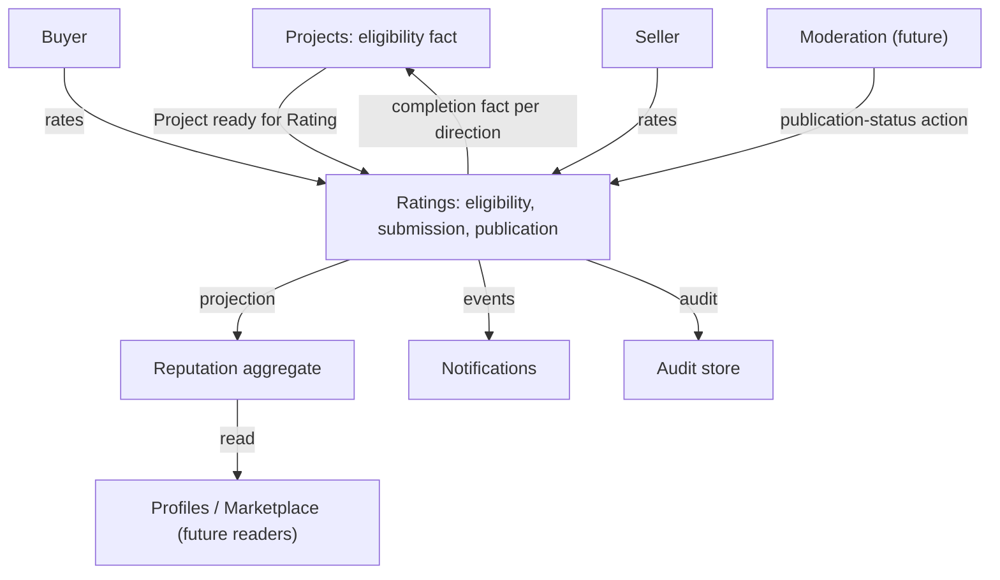
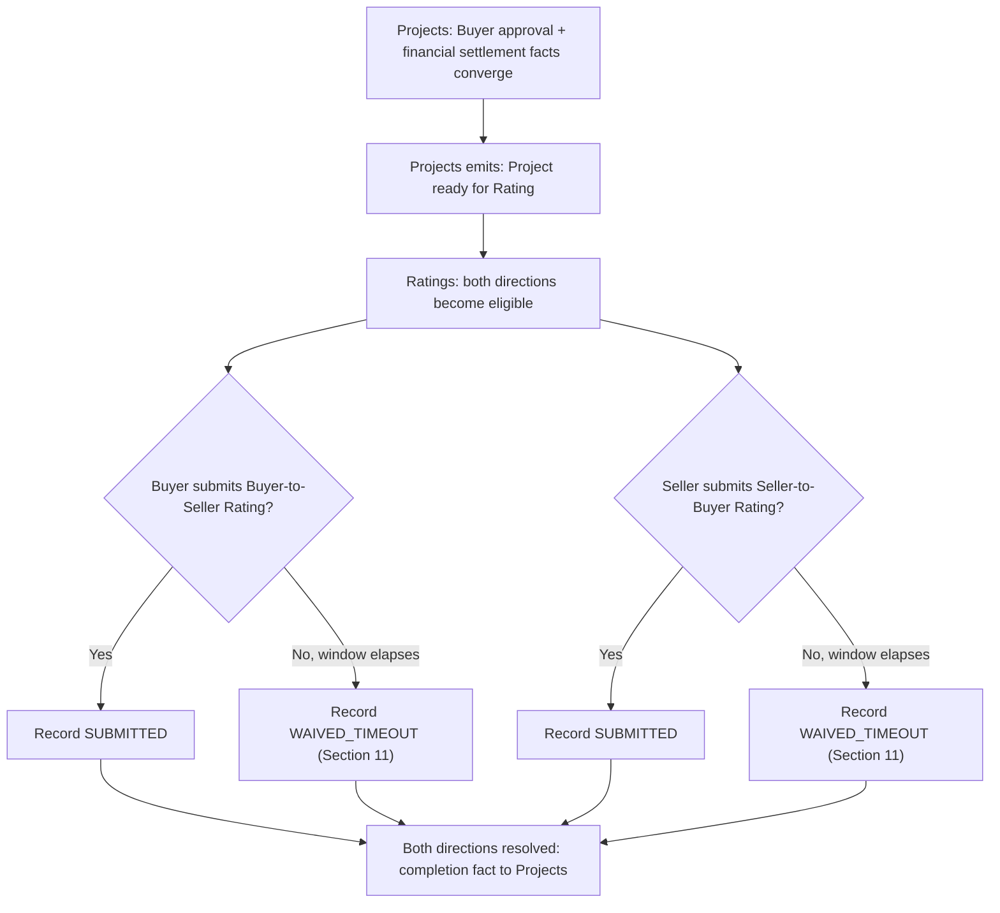
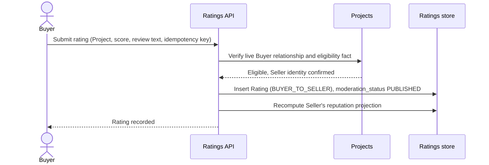
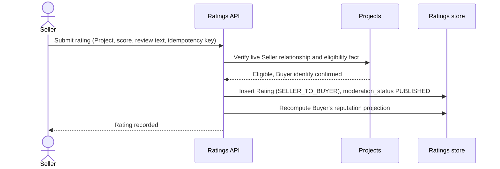
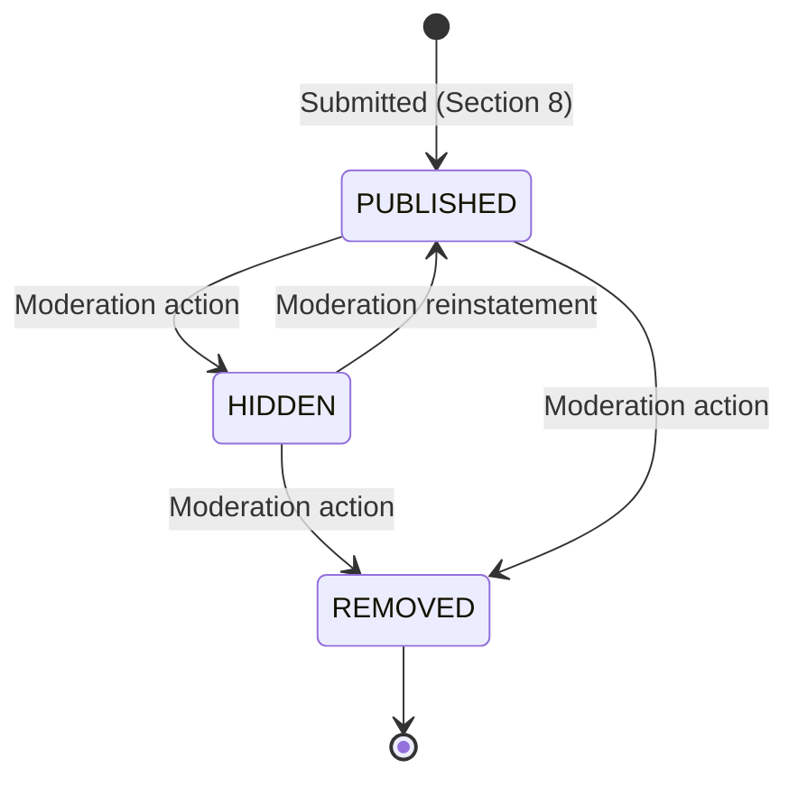
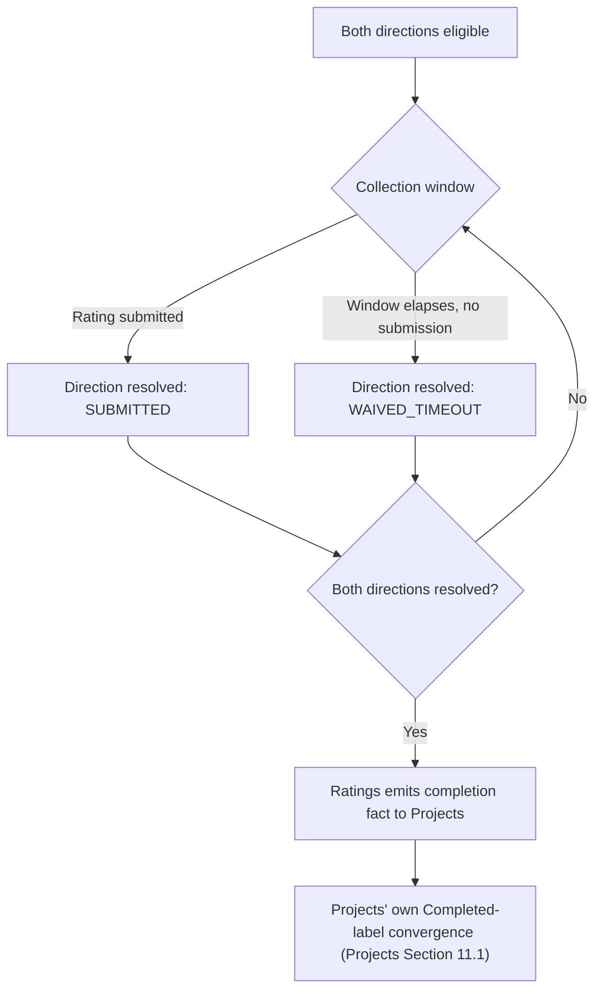
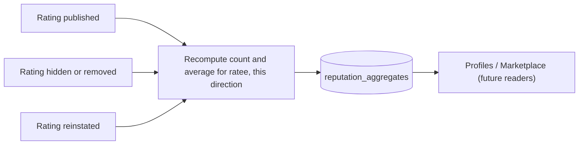
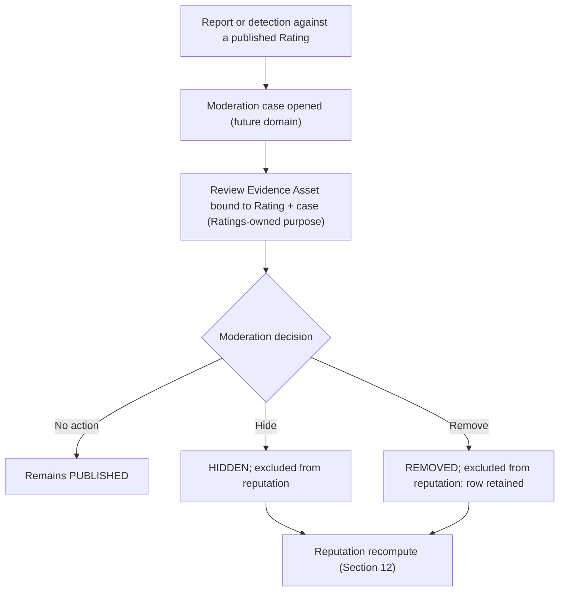
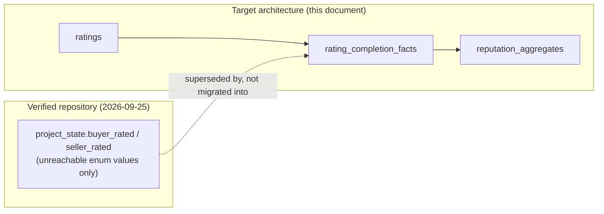
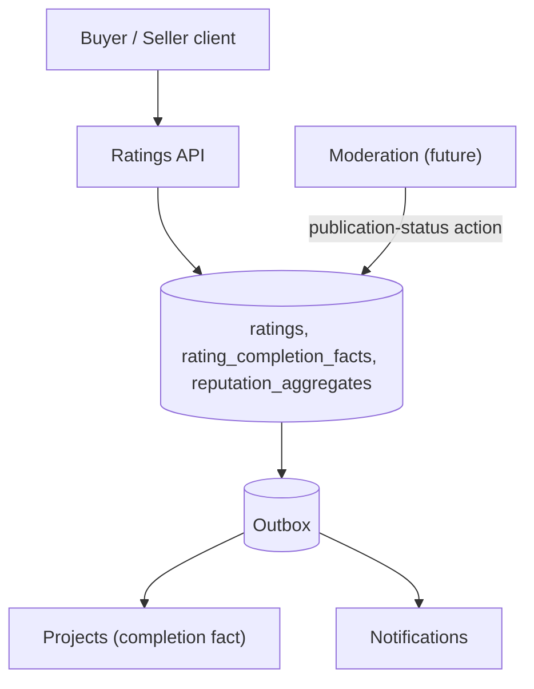

# Ratings and reputation domain specification

| Metadata | Value |
| --- | --- |
| Document ID | `SPEC-RATINGS-000` (provisional; see Section 3) |
| Type | Specification (SPEC) |
| Domain | Ratings and Reputation (governed `RATINGS` token) |
| Status | Proposed |
| Version | 0.1.0 |
| Owner | Product and Architecture |
| Last Reviewed | 2026-09-25 |
| Applies To | Target Ratings and Reputation product architecture and verified current repository comparison |
| Governed token | `RATINGS` |
| Canonical path | `docs/08-ratings-reputation/ratings.md` |
| Product horizon | Target product architecture with verified repository comparison |
| Supersedes / Superseded By | None; takes ownership of `BR-RATINGS-*` and the Ratings-owned content of `REQ-FOUNDATION-007` per [Product Overview Section 20](../01-foundation/product-overview.md#20-open-questions)'s own anticipation, and supplies the "future Ratings policy" [Projects Section 11.1](../05-projects-milestones/projects.md#111-completion-rule) names but does not itself define |

## 1. Executive summary

Ratings and Reputation lets a Project's Buyer and Seller each rate the other once, after a real completed transaction relationship, and projects those ratings into a conservative reputation summary other domains may read. It answers two questions Foundation and Projects both left open: what exactly a Rating is (identity, score, review, publication, moderation), and what "Ratings Pending" means operationally now that Escrow release must never wait on it.

Three decisions drive this specification. First, ownership: Governance already maps `08-ratings-reputation/` to the `RATINGS` token (Governance Section 4, Section 11); this document is the first to occupy it, and it takes over `BR-RATINGS-001`, which Product Overview explicitly flagged as provisionally Foundation-owned pending exactly this document ([Product Overview Section 20](../01-foundation/product-overview.md#20-open-questions)). Second, the aggregate model: one Rating per direction per Project (at most two — Buyer-to-Seller and Seller-to-Buyer), immutable once submitted except for a Moderation-owned publication-status change, which is the smallest model consistent with Foundation's own framing of Ratings as concluding "a specific project" ([System Architecture Section 10.9](../01-foundation/system-architecture.md#109-ratings)). Third, and most consequential: Ratings supplies Projects' own [Section 11.1](../05-projects-milestones/projects.md#111-completion-rule) completion rule with the "approved timeout/waiver outcome" it names but defers — a Ratings completion fact per direction, satisfied either by a real submission or by a configured collection window elapsing into a recorded waiver, so that a Project's own Completed label can eventually resolve without ever holding Milestone release, Escrow settlement, or Seller payout hostage to a missing Rating (already established and not reopened here: [Milestones `REQ-PROJECTS-033`](../05-projects-milestones/milestones.md#19-milestone-completion), [Escrow `BR-ESCROW-015`](../06-payments-escrow/escrow.md#141-release-eligibility)).

The repository contains an enum fragment and nothing else: `project_state` includes `buyer_rated` and `seller_rated` values that no route ever writes. No rating table, score, review text, or reputation aggregate exists anywhere in `backend/` or `frontend/`.

## 2. Purpose and scope

This document is canonical for:

- Rating identity, its relationship to a completed Project, and the immutable record it produces;
- rating eligibility, direction, submission, and anti-abuse rules;
- publication, visibility, and the contract with a future Moderation specification;
- the conservative MVP reputation projection other domains may read;
- the Ratings completion fact that satisfies Projects' own deferred timeout/waiver policy, without gating Escrow release;
- Ratings' authorization, concurrency, idempotency, target logical data, interfaces, events, operations, security findings, and migration guidance.

This document deliberately does not define Project or Milestone identity or completion mechanics ([Projects](../05-projects-milestones/projects.md), [Milestones](../05-projects-milestones/milestones.md)), Escrow or Payment accounting ([escrow.md](../06-payments-escrow/escrow.md), [payments.md](../06-payments-escrow/payments.md)), Dispute adjudication, Messaging content, Notification delivery, or the general Moderation domain (`09-moderation-trust-safety/`). Where it needs a fact from one of them, it cites the section or identifier and adds only the Ratings-level consequence.

## 3. Governance, structure, status, and authority

### 3.1 Ownership analysis

1. **Does Governance define a Ratings domain and directory?** Yes. [Governance Section 4](../00-governance/README.md#4-directory-structure) maps `08-ratings-reputation/` to "Ratings, reviews, reputation scoring," and [Governance Section 11](../00-governance/README.md#11-requirement-identifiers) lists `RATINGS` as a permitted domain token. Both were verified empty before this document was written (`ls docs/08-ratings-reputation/`).
2. **Is one document sufficient, or does the domain need to be split?** One document is sufficient for MVP. The scope — rating identity, eligibility, submission, publication, a conservative reputation projection, and the Moderation contract — is materially smaller than Projects/Milestones/Deliverables' combined scope, and [Governance Section 4](../00-governance/README.md#4-directory-structure) only requires a split "once the directory grows past a few hundred lines" of accumulated concern. A future split (for example, a dedicated Reputation document if scoring grows complex) is recorded as Open Question EQ9 rather than performed speculatively.
3. **Does an identifier already exist under this token?** Yes, one: `BR-RATINGS-001`, cited identically in [Governance Section 28](../00-governance/README.md#28-worked-examples-by-domain), [Product Overview Section 11](../01-foundation/product-overview.md#11-core-business-rules), and [System Architecture Section 10.9](../01-foundation/system-architecture.md#109-ratings). All three describe the same fact: `project_state` includes `buyer_rated`/`seller_rated`, no sequencing between them or with release is enforced, and the rule "MUST NOT be read as specifying a fixed sequence." Product Overview explicitly names this document's directory as the intended future owner ([Product Overview Section 20](../01-foundation/product-overview.md#20-open-questions)). Per the same collision-handling precedent [Milestones Section 3.1](../05-projects-milestones/milestones.md#31-identifier-ranges-and-the-inherited-collision) and [Escrow Section 3.3](../06-payments-escrow/escrow.md#33-identifier-ranges-and-inherited-collision) established, this document cites `BR-RATINGS-001` and does not redefine it; new rules use `BR-RATINGS-002` onward.
4. **Does `REQ-FOUNDATION-007` transfer here?** In substance, yes. [Product Overview Section 12](../01-foundation/product-overview.md#12-requirements) states the platform "MUST require both buyer and seller ratings before a project is considered complete." [Projects Section 11.1](../05-projects-milestones/projects.md#111-completion-rule) already narrowed this: Ratings gates only the Project's own Completed *label*, never Escrow release, and named "a future Ratings policy" to supply the missing timeout/waiver outcome. This document is that policy (Section 11).
5. **Does any repository schema exist?** No, verified directly (Section 20). Only the two unreachable enum values exist.

**Ownership decision:** Ratings and Reputation is created at `docs/08-ratings-reputation/ratings.md` under the governed `RATINGS` token. No Governance or Foundation change was required. The required glossary at `docs/99-appendices/glossary.md` does not exist (the directory itself is empty), so the local definitions in Section 4 are provisional pending that glossary, following the identical precedent [Milestones Section 3](../05-projects-milestones/milestones.md#3-governance-status-and-authority) already discloses.

### 3.2 Identifier ranges and inherited citation

The complete specification tree was searched before assigning identifiers. `BR-RATINGS-001` is the only existing identifier under `RATINGS`; it is cited, not redefined (point 3 above). This document defines:

| Family | Range defined here | Governed |
| --- | --- | --- |
| `REQ-RATINGS-*` | 001–012 | Yes, Governance Section 11 |
| `BR-RATINGS-*` | 002–016 | Yes, Governance Section 11 |
| `SEC-RATINGS-*` | 001–010 | Yes, Governance Section 11.1 |
| `DATA-RATINGS-*` | 001–003 | Yes, Governance Section 11.1 |
| `INT-RATINGS-*` | 001–006 | Yes, Governance Section 11.1 |
| `AUD-RATINGS-*` | 001–003 | Yes, Governance Section 11.1 |
| `EVT-RATINGS-*` | 001–005 | No; provisional |
| `OPS-RATINGS-*` | 001–003 | No; provisional |
| `SPEC-RATINGS-000` | Document ID | No; provisional |

### 3.3 Reconciliation items

| Item | Documents and sections | Finding | Treatment here |
| --- | --- | --- | --- |
| RR1 | Governance Section 28; Product Overview Sections 11, 20; System Architecture Section 10.9 | `BR-RATINGS-001` exists in three places with identical meaning, and Product Overview names this document as its intended future owner | Cited, not redefined (Section 3.1, point 3). Ownership formally transfers here; Product Overview's and System Architecture's text is historical and not edited by this document. |
| RR2 | Projects Section 11.1; Milestones Section 19.1; Escrow Section 14.1 | Projects requires "both required Ratings exist, or a future Ratings policy supplies an approved timeout/waiver outcome" for its own Completed label, while Milestones and Escrow already independently guarantee release never waits on Ratings | Not a contradiction: two different facts. This document supplies the named timeout/waiver policy (Section 11) without touching release eligibility, which it does not have the authority to change and does not attempt to. |
| RR3 | Assets Section 7.2 | The "Review Evidence" Asset purpose lists its owner domain as "**Unresolved — Ratings or Moderation**" | Resolved here: Review Evidence is owned by Ratings, exercised jointly with a future Moderation case exactly as Deliverables resolved the equivalent Dispute/Deliverable question ([Deliverables Section 3.3](../05-projects-milestones/deliverables.md#33-reconciliation-items), item DR1). See Section 13.2. No change to Assets' text is proposed; updating its "Unresolved" wording to "Ratings" is recorded as documentation debt, not a blocker. |
| RR4 | System Architecture Section 10.9 | "Completing a rating produces an event, and Projects — not Ratings — consumes that event... `buyer_rated`/`seller_rated` are therefore Projects' own lifecycle checkpoints, not a state owned or written by the Ratings domain" | Adopted exactly. Ratings never writes Project state; it emits a completion fact per direction that Projects consumes (Section 11). |
| RR5 | Foundation `REQ-FOUNDATION-007`; this document's rating scale | No rating scale (1–5 stars, 1–10, thumbs, or otherwise) is established anywhere in existing specifications or the repository | Not invented. The score field is a bounded integer whose exact range is Open Question EQ1 (Section 25.3). |

The implementation labels in this document mean:

| Label | Meaning |
| --- | --- |
| Implemented | End-to-end behavior exists and was verified in the current repository. |
| Partially Implemented | Some executable path exists but one or more target guarantees are absent. |
| Schema Implemented | Database structure exists without the required executable domain behavior. |
| Planned | A repository artifact or existing specification declares intent but no complete behavior exists. |
| Not Implemented | No verified implementation was found. |

## 4. Terminology and domain boundaries

| Term | Local definition |
| --- | --- |
| Rating | An immutable record of one party's feedback on the other, for exactly one Project, in exactly one direction. |
| Direction | `BUYER_TO_SELLER` or `SELLER_TO_BUYER`; derived from the rater's live Project relationship at eligibility time, never client-supplied. |
| Eligible relationship | A Project whose required financial and delivery facts have converged (Section 6.1), reported to Ratings as a trusted Projects-owned fact. |
| Rating completion fact | A per-direction, per-Project record (`SUBMITTED` or `WAIVED_TIMEOUT`) that Projects consumes to complete its own Completed-label convergence rule ([Projects Section 11.1](../05-projects-milestones/projects.md#111-completion-rule)); never a financial or release fact. |
| Reputation | The read-only, rebuildable per-User, per-direction aggregate projection derived from published Ratings (Section 12). |
| Publication status | Whether a submitted Rating is currently visible (`PUBLISHED`), hidden pending or following a moderation action (`HIDDEN`), or permanently removed (`REMOVED`). |

Ownership boundary, consistent with [System Architecture Section 10.9](../01-foundation/system-architecture.md#109-ratings): Ratings owns Rating and reputation-projection data only. It never owns Project state, Milestone state, Escrow or Payment state, Deliverable history, Asset bytes, or Dispute adjudication, and it is never itself the authority that advances Project state — Projects consumes Ratings' completion fact and performs its own write.

## 5. Canonical principles and architecture

1. A Rating exists only for a real, eligible Project relationship; there is no rating without a transaction, and no transaction requires more than two Ratings (one per direction).
2. A Rating, once submitted, is immutable except for a Moderation-owned publication-status change; a correction is never an edit, only a moderation action with its own audit trail.
3. Ratings never gates Escrow release, Seller payout, or Buyer approval (already established: [Milestones `REQ-PROJECTS-033`](../05-projects-milestones/milestones.md#19-milestone-completion), [Escrow `BR-ESCROW-015`](../06-payments-escrow/escrow.md#141-release-eligibility)); this document does not reopen or reinterpret either.
4. Ratings does not write Project or Milestone state; it emits a completion fact that Projects consumes and acts on (`RR4`, Section 11).
5. Reputation is a conservative, rebuildable projection over published Ratings, never a second source of truth for rating content.
6. Only real, live Project participants may rate, only the counterparty, only once per direction, and never themselves.
7. Moderation may hide or remove a Rating; it never rewrites a Rating's score or text, and removal never erases the audit trail.
8. Authorization is relationship-based and re-evaluated on every read; a Rating is never reachable by identifier guessing alone.
9. Every Rating and moderation mutation is idempotent under a caller-supplied key or a natural uniqueness constraint.

*Figure 1 — Ratings Domain Architecture. Ratings consumes a trusted Projects-owned eligibility fact and returns a completion fact; it never reads Escrow or Milestones directly and never writes Project state itself.*

`REQ-RATINGS-001`: Ratings MUST NOT write Project, Milestone, Escrow, or Payment state, and MUST NOT accept, infer, or emit any signal that could be mistaken for an Escrow release, Buyer approval, or Seller payout fact.

## 6. Eligibility

### 6.1 Eligibility matrix

| Condition | Rule | Repository status |
| --- | --- | --- |
| Trigger | A trusted "Project ready for Rating" fact from Projects, consistent with [Projects Section 21](../05-projects-milestones/projects.md#21-ratings-and-reviews): "After Buyer approval and financial settlement, Projects asks Ratings to establish eligibility." Ratings never reads Milestone or Escrow state directly | Not Implemented |
| Relationship key | Project, rater's live role (Buyer or Seller) at the moment the fact was verified, and the counterparty as ratee | Not Implemented |
| Direction | Exactly two possible directions per Project: `BUYER_TO_SELLER`, `SELLER_TO_BUYER`; each independently eligible, submitted, and completed | Not Implemented |
| One rating per direction | A rater may submit at most one Rating per direction per Project; a repeat with a different idempotency key against an already-submitted direction is rejected, not overwritten | Not Implemented |
| No self-rating | `rater_user_id <> ratee_user_id`, defense-in-depth alongside [Projects `BR-PROJECTS-001`](../05-projects-milestones/projects.md#372-business-rule-traceability)'s existing no-self-dealing rule | Not Implemented |
| No unrelated-user rating | Rater and ratee MUST equal the Project's actual live Buyer and Seller participants at write time, re-verified, never trusted from a client-supplied pair | Not Implemented |
| Ineligible outcomes | A cancelled Project with no accepted Seller relationship, or a Project that never reached the eligibility fact, produces no Rating eligibility for either direction | Not Implemented |
| Cancellation after partial performance | Follows Projects' and Milestones' own cancellation matrices; Ratings becomes eligible only if and when Projects emits the fact, never independently | Not Implemented |
| Dispute interaction | Ratings does not read Dispute state; the fact only arrives after Projects itself is uninterrupted, per [Projects Section 11.1](../05-projects-milestones/projects.md#111-completion-rule) | Not Implemented |

`REQ-RATINGS-002`: Ratings MUST accept a rating attempt only after consuming a verified, Projects-owned eligibility fact naming the Project, the rater's live role, and the counterparty, and MUST re-verify the live participant relationship at write time rather than trusting a client-supplied pair.

### 6.2 Eligibility flow

*Figure 2 — Eligibility and Completion Flow. Both directions resolve independently, by submission or by a recorded waiver, before Ratings reports completion to Projects.*

## 7. Rating field matrix

| Field | Definition | Storage class | Mutability | Repository status |
| --- | --- | --- | --- | --- |
| `id` | Internal UUID primary key | Stored | Immutable | Not Implemented |
| `external_id` | Opaque, unique, externally addressable identifier | Stored | Immutable | Not Implemented |
| `project_id` | Owning Project; part of the eligibility key | Stored | Immutable | Not Implemented |
| `direction` | `BUYER_TO_SELLER` or `SELLER_TO_BUYER` | Stored | Immutable | Not Implemented |
| `rater_user_id` | The submitting party, verified live at write time | Stored | Immutable | Not Implemented |
| `ratee_user_id` | The rated party, verified live at write time | Stored | Immutable | Not Implemented |
| `score` | Bounded integer; exact scale is Open Question EQ1 (Section 25.3) | Stored | Immutable | Not Implemented |
| `review_text` | Optional, bounded, restricted text | Stored | Immutable | Not Implemented |
| `submitted_at` | Server-assigned timestamp; never client-supplied | Stored | Immutable | Not Implemented |
| `idempotency_key` | Caller-supplied key bound to rater, Project, and direction | Stored, unique | Immutable | Not Implemented |
| `moderation_status` | `PUBLISHED`, `HIDDEN`, `REMOVED`; default `PUBLISHED` | Stored | Moderation-action only (Section 13) | Not Implemented |
| `version` | Optimistic concurrency token for `moderation_status` | Stored | Incremented on moderation action | Not Implemented |
| `created_at` / `updated_at` | Timestamps | Stored | `updated_at` changes only on moderation action | Not Implemented |

`REQ-RATINGS-003`: A Rating MUST be created as a single atomic, idempotent transaction, MUST NOT be created outside an eligible direction, and every field except `moderation_status`, `version`, and `updated_at` MUST be immutable after creation.

## 8. Rating submission

### 8.1 Buyer-to-Seller submission sequence

*Figure 3 — Buyer-to-Seller Rating Submission. Ratings re-verifies the live relationship before writing; publication is immediate for MVP, subject to reactive moderation (Section 13).*

### 8.2 Seller-to-Buyer submission sequence

*Figure 4 — Seller-to-Buyer Rating Submission. Symmetric to Figure 3; the two directions are independent and neither blocks the other.*

`REQ-RATINGS-004`: Every Rating submission MUST verify the live Project relationship and the eligibility fact at commit time under lock, MUST reject a submission naming a non-eligible or already-rated direction with a safe conflict, and MUST be idempotent under a caller-supplied key.

## 9. Rating scale

No rating scale is established by any existing specification or by the repository (`RR5`, Section 3.3). This document therefore defines only the architecture: `score` is a bounded, server-validated integer within a configured minimum and maximum, snapshotted at submission time so a later scale change cannot reinterpret historical Ratings. The exact bounds (for example, 1–5) are not chosen here and are Open Question EQ1 (Section 25.3).

`BR-RATINGS-002`: A Rating's `score` MUST be validated against the platform's configured scale at submission time, and a later change to the configured scale MUST NOT reinterpret, rescale, or invalidate a previously submitted `score`.

## 10. Publication, visibility, and moderation status

### 10.1 Publication matrix

| State | Meaning | Visible to | Entered by | Repository status |
| --- | --- | --- | --- | --- |
| `PUBLISHED` | Default on submission; visible in reputation and to authorized readers | Public (subject to Profile/Marketplace visibility policy), the rater, and the ratee | Submission (Section 8) | Not Implemented |
| `HIDDEN` | Temporarily withheld pending or following a moderation review; excluded from reputation | The rater, the ratee, and Moderation only | Moderation action (Section 13) | Not Implemented |
| `REMOVED` | Permanently excluded from reputation and ordinary display; row retained for audit | Moderation and Administration only | Moderation action (Section 13) | Not Implemented |

*Figure 5 — Publication State Machine. Only a Moderation action changes `moderation_status`; the underlying score and text are never edited by any transition.*

`REQ-RATINGS-005`: A publication-status transition MUST be restricted to an explicit governed Moderation or Administrator capability, MUST be idempotent, and MUST NOT alter a Rating's `score` or `review_text`.

## 11. Ratings Pending and Project completion

Ratings Pending is a Projects-owned display and completion-tracking concept, not a financial hold. It means: the Project's own Completed label is waiting on this document's completion fact for one or both directions; it never means Milestone `released`, Escrow settlement, or Seller payout are waiting on anything (already independently guaranteed: [Milestones `REQ-PROJECTS-033`](../05-projects-milestones/milestones.md#19-milestone-completion), [Escrow `BR-ESCROW-015`](../06-payments-escrow/escrow.md#141-release-eligibility)). A Project may be fully settled financially — every required Milestone `released` or `refunded` — while still showing Ratings Pending.

This document supplies the "future Ratings policy" [Projects Section 11.1](../05-projects-milestones/projects.md#111-completion-rule) names but defers: for each eligible direction, Ratings resolves to exactly one outcome — `SUBMITTED` (a real Rating exists) or `WAIVED_TIMEOUT` (a configured Ratings-collection window elapsed without a submission). A waived direction is recorded distinctly from a submitted one and is never fabricated as, or displayed as, an actual score. Once both directions have resolved to either outcome, Ratings emits one completion fact that Projects consumes for its own Completed-label convergence; Ratings does not decide or write the Project's Completed state itself (`RR4`).

The exact Ratings-collection window duration is configurable operational policy, not invented here (Open Question EQ2, Section 25.3), consistent with how [Milestones Section 18.2](../05-projects-milestones/milestones.md#182-buyer-non-response-and-platform-intervention) treats its own review-period duration for the same reason: the product behavior is decided, the number is not.

*Figure 6 — Ratings Pending Resolution. A waiver is a recorded absence, never a fabricated rating, and financial completion never depends on this flow.*

`REQ-RATINGS-006`: Ratings MUST resolve each eligible direction to exactly one of `SUBMITTED` or `WAIVED_TIMEOUT` within a configured window, MUST NOT fabricate a score for a waived direction, and MUST NOT delay, condition, or in any way reference Escrow release, Milestone settlement, or Seller payout when computing or emitting its completion fact.

`BR-RATINGS-003`: A Project's financial settlement and Milestone release MUST proceed to completion independent of whether either Rating direction has resolved, consistent with `BR-ESCROW-015` and `REQ-PROJECTS-033`, which this document cites and does not reopen.

## 12. Reputation projection

### 12.1 Reputation projection matrix

| Field | Definition | Computation | Repository status |
| --- | --- | --- | --- |
| `user_id` | The rated party | Key | Not Implemented |
| `direction` | `AS_SELLER` (ratings received as Seller) or `AS_BUYER` (ratings received as Buyer), kept separate | Key | Not Implemented |
| `rating_count` | Count of `PUBLISHED` Ratings in this direction | Rebuilt from `ratings` on every publication-status change | Not Implemented |
| `average_score` | Arithmetic mean of `PUBLISHED` scores in this direction | Rebuilt the same way; never independently editable | Not Implemented |
| `verified_transaction_indicator` | Always true by construction: every Rating requires a real eligible Project relationship (Section 6) | Implicit; not a separate stored flag | Not Implemented |
| `recency` | MVP shows submission-time ordering only; no decay weighting or recency-adjusted score is computed | Not computed | Not Implemented |
| `last_recomputed_at` | Timestamp of the last rebuild | Stored | Not Implemented |

Advanced ranking, category-based sub-scores, or decay/weighting algorithms are explicitly out of MVP scope and are not invented here (Open Question EQ3, Section 25.3), consistent with the instruction to keep reputation conservative.

*Figure 7 — Reputation Projection Flow. The aggregate is a rebuildable projection over published Ratings only; it is never a second source of truth.*

`REQ-RATINGS-007`: The reputation aggregate MUST be a rebuildable projection recomputed from `PUBLISHED` Ratings only, MUST exclude `HIDDEN` and `REMOVED` Ratings, and MUST NOT be directly writable by any client.

## 13. Rating moderation

### 13.1 Moderation relationship

Ratings defines only its contract with a future Moderation specification (`09-moderation-trust-safety/`); it does not define Moderation's own case, report, or review workflow.

| Concern | Ratings-side contract | Repository status |
| --- | --- | --- |
| Abusive review, harassment, personal information | Reported by a participant or detected by Moderation; results in a `HIDDEN` or `REMOVED` publication-status action (Section 10), never a text edit | Not Implemented |
| Retaliatory rating | A Rating submitted with retaliatory intent is a Moderation determination on existing content; Ratings supplies no automated intent-detection | Not Implemented |
| Fraud or manipulation | Detected by Moderation (for example, coordinated or inorganic scoring patterns); Ratings exposes the underlying data, never decides the finding | Not Implemented |
| Removed/hidden rating | Recorded via `moderation_status` (Section 10); the original row and its history are retained, never deleted | Not Implemented |
| Aggregate recalculation | Every publication-status change triggers a synchronous, transactional reputation recompute (Section 12) | Not Implemented |
| Preserved audit history | Every moderation action against a Rating is audited distinctly from ordinary submission (`AUD-RATINGS-002`) | Not Implemented |

### 13.2 Review Evidence Asset purpose

[Assets Section 7.2](../03-identity-profiles-verification/assets-and-media.md#72-asset-purpose-matrix) lists the "Review Evidence" Asset purpose as owned by "Ratings or Moderation," unresolved. This document resolves it: **Review Evidence is owned by Ratings**, exercised jointly with a Moderation case exactly as Assets already requires ("Authorized case actor or assigned Moderator," Relationship Restricted visibility). Ratings supplies the Rating reference and Project context; Moderation supplies case assignment and access policy, following the identical pattern Deliverables used to resolve its own Assets ownership question (`RR3`, `deliverables.md` Section 3.3 item DR1).

*Figure 8 — Moderation Flow. Moderation decides; Ratings executes the publication-status change and the resulting reputation recompute, never the other way around.*

`REQ-RATINGS-008`: Ratings MUST expose Review Evidence as a Ratings-owned Asset purpose scoped to a Rating and a Moderation case, MUST NOT allow a moderation action to alter `score` or `review_text`, and MUST recompute the affected reputation aggregate synchronously with every publication-status change.

`BR-RATINGS-004`: A Rating row MUST NOT be hard-deleted by an ordinary moderation action; removal MUST be represented as `moderation_status = REMOVED` with the row and its history retained for audit.

## 14. Anti-abuse

### 14.1 Anti-abuse matrix

| Concern | Rule | Repository status |
| --- | --- | --- |
| Self-rating | Rejected: `rater_user_id <> ratee_user_id` | Not Implemented |
| Unrelated-user rating | Rejected: rater/ratee must equal the Project's live Buyer/Seller participants at write time | Not Implemented |
| Duplicate rating | Rejected: unique `(project_id, direction)`; idempotent replay returns the original result | Not Implemented |
| Rating without eligibility | Rejected: no eligibility fact, no Rating (Section 6) | Not Implemented |
| Rating a cancelled/disputed Project prematurely | Rejected: the eligibility fact only arrives from Projects once uninterrupted (Section 6.1) | Not Implemented |
| Coordinated or inorganic scoring | Detected and adjudicated by a future Moderation specification, not invented here | Not Implemented |
| Unbounded review text | Rejected: bounded, restricted length at submission | Not Implemented |
| Rate limiting | Each Project's two directions are inherently rate-limited by eligibility (at most two Ratings ever per Project); a platform-wide submission rate limit still applies defensively | Not Implemented |

`BR-RATINGS-005`: Ratings MUST reject a self-rating, an unrelated-user rating, a duplicate direction, and a rating attempt lacking a verified eligibility fact, each without creating a partial or placeholder row.

## 15. Authorization

### 15.1 Authorization matrix

| Action | Who | Additional condition | Repository status |
| --- | --- | --- | --- |
| Submit Buyer-to-Seller Rating | Live Project Buyer | Eligibility fact present; direction not yet submitted | Not Implemented |
| Submit Seller-to-Buyer Rating | Live Project Seller | Eligibility fact present; direction not yet submitted | Not Implemented |
| View own submitted/received Ratings | The rater, the ratee | Live relationship; includes `HIDDEN` state for the parties involved | Not Implemented |
| View published Ratings (reputation) | Any authenticated actor, subject to Profile/Marketplace visibility policy | `PUBLISHED` only | Not Implemented |
| View `REMOVED` Ratings | Moderation and Administration only | Case-scoped access, audited | Not Implemented |
| Change publication status | Explicit governed Moderation or Administrator capability | Case, reason, audit | Not Implemented |
| Consume eligibility/completion facts | Trusted producer/consumer identity (Projects) | Signed channel, event and version dedupe | Not Implemented |

### 15.2 Resource-loading order

Every Ratings operation resolves in this order, extending the pattern [Deliverables Section 18.2](../05-projects-milestones/deliverables.md#182-resource-loading-order) and [Milestones Section 23.2](../05-projects-milestones/milestones.md#232-resource-loading-order) already establish: authenticate the actor; resolve the Project's opaque identifier scoped to the actor's live relationship; confirm the actor is the Project's Buyer or Seller before resolving any Rating identifier; only then load or act on the Rating. A bare Rating identifier is never resolved before the owning Project relationship is confirmed, preventing IDOR.

`REQ-RATINGS-009`: Every Ratings read or write MUST re-verify live Project participant relationship before resolving any Rating-scoped identifier, and MUST NOT authorize by identifier possession alone.

## 16. Concurrency and idempotency

| Operation | Protection |
| --- | --- |
| Duplicate submission | `Idempotency-Key` bound to rater, Project, and direction; replay returns the original Rating |
| Concurrent submission of both directions | Independent; no shared lock required beyond each direction's own uniqueness constraint |
| Duplicate publication-status change | Idempotent by moderation-action key; a repeat returns the original outcome |
| Reputation recompute race | Recompute runs inside the same transaction as the triggering publication-status change, under a per-`(user_id, direction)` lock |
| Completion-fact emission | Idempotent by `(project_id, direction)`; a duplicate does not re-emit a second fact to Projects |

`REQ-RATINGS-010`: Every Ratings mutation MUST be idempotent under a caller-supplied key or a natural uniqueness constraint, and every reputation recompute MUST occur inside the same transaction as the change that triggered it.

## 17. Audit, events, and notifications

### 17.1 Audit requirements

| Identifier | Requirement |
| --- | --- |
| `AUD-RATINGS-001` | Record every Rating submission and every rejected attempt (ineligible, duplicate, self, or unrelated-user), with actor, Project, direction, and timestamp. |
| `AUD-RATINGS-002` | Record every publication-status change distinctly from ordinary submission, with actor (Moderator or Administrator), reason, case reference, and timestamp. |
| `AUD-RATINGS-003` | Record every Ratings-collection window resolution (`SUBMITTED` or `WAIVED_TIMEOUT`) and every completion fact emitted to Projects. |

### 17.2 Provisional events and operations

Governance defines no `EVT-*` or `OPS-*` family; the following are provisional pending a Governance amendment, following the precedent already disclosed in [Milestones Section 3](../05-projects-milestones/milestones.md#3-governance-status-and-authority) and [Deliverables Section 3.1](../05-projects-milestones/deliverables.md#31-ownership-analysis).

| Provisional ID | Event/operation | Consumers |
| --- | --- | --- |
| `EVT-RATINGS-001` | `RatingSubmitted` | Notifications, reputation recompute |
| `EVT-RATINGS-002` | `RatingPublicationStatusChanged` | Notifications (optional), reputation recompute, audit |
| `EVT-RATINGS-003` | `RatingDirectionWaived` | Projects (completion-fact input), audit |
| `EVT-RATINGS-004` | `RatingsCompletionFactEmitted` (both directions resolved) | Projects |
| `OPS-RATINGS-001` | Scheduled sweep that resolves elapsed Ratings-collection windows into `WAIVED_TIMEOUT` | Operations |
| `OPS-RATINGS-002` | Reputation-aggregate reconciliation job comparing projections against `ratings` on schedule | Operations, Audit |
| `OPS-RATINGS-003` | Stale idempotency-key expiry job | Operations |

### 17.3 Notification behavior

| Notice | Class | Preference behavior |
| --- | --- | --- |
| Rating received | Configurable | May be disabled; the underlying Rating record is unaffected either way ([User Settings Section 11](../03-identity-profiles-verification/user-settings.md#11-notification-preferences)) |
| Rating available/requested (eligibility reached) | Configurable | May be disabled |
| Rating hidden or removed (to the rater/ratee) | Mandatory workflow | Cannot suppress the durable record |

`REQ-RATINGS-011`: Every Ratings mutation MUST produce redacted, immutable audit evidence before the operation is considered complete, and notification delivery failure MUST NOT roll back or block a committed Rating or publication-status change.

## 18. Target data model

### 18.1 Target model matrix

| Identifier and model | Purpose and principal fields | Keys, uniqueness | Repository status |
| --- | --- | --- | --- |
| `DATA-RATINGS-001` `ratings` | Immutable Rating record per Section 7 | PK `id`; unique `external_id`; unique `(project_id, direction)`; unique `idempotency_key`; FK `project_id`, `rater_user_id`, `ratee_user_id` `RESTRICT` | Not Implemented |
| `DATA-RATINGS-002` `rating_completion_facts` | Per-direction resolution feeding Projects' completion rule (Section 11): Project, direction, outcome (`SUBMITTED`/`WAIVED_TIMEOUT`), rating reference (nullable), decided time | PK; unique `(project_id, direction)`; FK `project_id` `RESTRICT`; FK `rating_id` `RESTRICT` nullable | Not Implemented |
| `DATA-RATINGS-003` `reputation_aggregates` | Rebuildable per-User, per-direction projection (Section 12) | PK; unique `(user_id, direction)`; FK `user_id` `RESTRICT` | Not Implemented |

Three tables are sufficient: one immutable historical record, one completion-resolution record consumed by Projects, and one rebuildable projection. No separate moderation-case table is created here; that belongs to the future Moderation specification, which Ratings only references by case ID.

`REQ-RATINGS-012`: The target Ratings schema MUST consist of the smallest normalized set of tables that preserves immutable Rating history, the per-direction completion resolution Projects consumes, and a rebuildable reputation projection, without requiring any Projects-, Milestones-, or Escrow-owned table to be altered.

`BR-RATINGS-006`: `reputation_aggregates` MUST be rebuildable at any time from `ratings` alone and MUST NOT be treated as authoritative if it diverges from a rebuild.

## 19. Domain dependencies and interfaces

### 19.1 Domain dependency matrix

| Domain | Ratings depends on | Ratings provides | Failure behavior |
| --- | --- | --- | --- |
| Projects | Eligibility fact; live Buyer/Seller identity | Per-direction completion fact for Projects' own Completed-label convergence | Never invent an eligibility fact; hold and alert if Projects' fact is malformed |
| Milestones | Nothing directly | Nothing directly | Not applicable |
| Escrow | Nothing directly; Ratings never reads Escrow state | Nothing directly | Not applicable |
| Moderation (future) | Case assignment, publication-status decisions | Review Evidence Asset purpose (Section 13.2), Rating data for review | Deny by default without a valid case |
| Authorization | Relationship/role decisions for every operation | Nothing; Authorization owns the decision framework only | Deny closed |
| Notifications | Nothing directly | Rating-submitted and publication-status events, consumed for delivery only | Delivery failure never blocks or reverses a Rating |
| Assets | Review Evidence binding rules (Section 13.2) | Purpose-scoped binding requests | Fail closed |

### 19.2 Interface identifiers

| Interface | Direction | Description | Repository status |
| --- | --- | --- | --- |
| `INT-RATINGS-001` | Projects → Ratings | Eligibility fact (Project, Buyer, Seller, term version) | Not Implemented |
| `INT-RATINGS-002` | Ratings → Projects | Per-direction completion fact (`SUBMITTED`/`WAIVED_TIMEOUT`) | Not Implemented |
| `INT-RATINGS-003` | Ratings → Authorization | Relationship/role check for every read and write | Not Implemented |
| `INT-RATINGS-004` | Moderation (future) → Ratings | Publication-status change with case reference | Not Implemented |
| `INT-RATINGS-005` | Ratings → Notifications | Rating-submitted, publication-status-changed events | Not Implemented |
| `INT-RATINGS-006` | Ratings → Audit | Every mutation, per Section 17.1 | Not Implemented |

## 20. Verified repository comparison

### 20.1 Review method

`backend/db/*.sql` (all eight migrations), `backend/Index.js` (all twelve routes), `frontend/src/App.tsx`, both `package.json` files, and the repository for any `tests` directory were searched directly, following the same method as [Deliverables Section 22.1](../05-projects-milestones/deliverables.md#221-review-method).

### 20.2 Schema and route findings

`project_state` (`backend/db/005_create_projects.sql`) includes `buyer_rated` and `seller_rated` values. No route, trigger, or application code writes either value; both are unreachable, consistent with [Product Overview Section 10.5](../01-foundation/product-overview.md#105-ratings-and-release-sequence). No `ratings`, `reviews`, or `reputation` table, enum, route, frontend form, or dependency exists anywhere in the repository. No test file or directory exists outside `docs/17-testing` (a documentation directory).

### 20.3 Repository comparison matrix

| Capability | Verified artifact | Gap against target | Status |
| --- | --- | --- | --- |
| Rating table | None | Full schema of Section 18 | Not Implemented |
| Completion-fact table | None | Full schema of Section 18 | Not Implemented |
| Reputation projection | None | Full schema of Section 18 | Not Implemented |
| Project enum values | `buyer_rated`, `seller_rated` exist, unreachable | Replaced for target behavior by the completion fact of Section 11 | Schema Implemented (enum only) |
| API routes | None | Full route set implied by Sections 8, 10, 13 | Not Implemented |
| Frontend | None | Rating submission and reputation display UI | Not Implemented |
| Authorization | None | Section 15 | Not Implemented |
| Tests | None | Full suite of Section 24 | Not Implemented |

*Figure 9 — Repository vs. Target Architecture. The enum fragment is superseded by the completion fact of Section 11; it is never migrated into a fabricated Rating.*

## 21. Security findings

| Finding | Severity | Verified condition or target threat | Impact | Required treatment | Disposition |
| --- | --- | --- | --- | --- | --- |
| `SEC-RATINGS-001` No Ratings authorization surface exists | Critical | No route exists; a bare identifier is the only key design available once built | IDOR across Projects once a route exists | Relationship-based resolution order of Section 15.2 | Open |
| `SEC-RATINGS-002` No eligibility verification exists | Critical | No eligibility-fact consumption logic exists | A Rating could be created for a non-eligible or fabricated Project relationship | Mandatory eligibility-fact check of Section 6 | Open |
| `SEC-RATINGS-003` No self/unrelated-user rejection exists | High | No validation logic exists | A user could rate themselves or an unrelated party absent this control | Anti-abuse matrix of Section 14 | Open |
| `SEC-RATINGS-004` No idempotency mechanism exists | High | No Rating table or key column exists | A retried submission could create a duplicate direction attempt once built without this control | Idempotency key of Section 16 | Open |
| `SEC-RATINGS-005` No publication-status authorization surface exists | Critical | No capability model exists | An unauthorized actor could hide, remove, or reinstate a Rating, or an ordinary action could alter score/text | Explicit governed Moderation capability of Section 10/13 | Open |
| `SEC-RATINGS-006` No reputation-aggregate integrity control exists | Medium | No projection or recompute logic exists | A stale or manually edited aggregate could misrepresent reputation | Synchronous, transactional recompute of Section 12 | Open |
| `SEC-RATINGS-007` No audit trail exists | High | No audit table or event exists | Unauthorized moderation action or fabricated Rating would be undetectable | `AUD-RATINGS-001`–`003` of Section 17.1 | Open |
| `SEC-RATINGS-008` No completion-fact integrity control exists | Medium | No completion-fact table exists | A forged or duplicated completion fact could prematurely or falsely satisfy Projects' convergence rule | Idempotent, uniquely keyed completion fact of Section 11 | Open |
| `SEC-RATINGS-009` No rate limiting on any future Ratings route | Medium | No route exists | Abuse of a submission or moderation endpoint once built | Rate limits on every Ratings route | Open |
| `SEC-RATINGS-010` No automated Ratings test coverage | High | No test file or directory exists | Authorization, eligibility, and idempotency regressions would reach production undetected | Layered test suite of Section 24 | Open |

"Open" is a finding disposition (target-architecture risk given the current empty repository state), not an implementation-status label. Cross-domain findings that also apply: every Projects/Milestones finding governing the eligibility fact this document depends on, and Authentication `SEC-AUTH-002`/`SEC-AUTH-005`.

## 22. Implementation status

| Target area | Status | Evidence | Next contract boundary |
| --- | --- | --- | --- |
| Rating identity and submission | Not Implemented | No table | Sections 6–8 |
| Rating scale | Not Implemented; scale value Open Question | No table | Section 9 |
| Publication and moderation | Not Implemented | No table | Sections 10, 13 |
| Ratings Pending / completion fact | Not Implemented | Enum-only project state | Section 11 |
| Reputation projection | Not Implemented | No table | Section 12 |
| Authorization | Not Implemented | No route | Section 15 |
| Audit/events | Not Implemented | No audit table | Section 17 |
| Frontend | Not Implemented | Static copy only | Full submission/reputation UI |
| Automated tests | Not Implemented | None | Section 24 |

## 23. Future architecture

Ratings' future architecture exchanges facts with Projects through the same outbox/inbox pattern already established for Milestones and Escrow ([Deliverables Section 25](../05-projects-milestones/deliverables.md#25-future-architecture)), deployable inside the same application or as a separate service without changing the eligibility/completion-fact contract of Sections 6 and 11. Future work includes: a possible split into a dedicated Reputation document if scoring or ranking complexity grows (Open Question EQ9); category-based sub-scores (communication, quality, timeliness) once Product defines them (Open Question EQ4); and recency-weighted or decayed reputation, deliberately deferred for MVP (Open Question EQ3).

*Figure 10 — Future Architecture. Ratings remains a satellite of Projects' completion convergence, never a parallel financial or state authority.*

## 24. Staged implementation plan

Documentation only; this stage does not modify application code or migrations.

1. Rating schema (`ratings` table) and configured scale bounds (once Product decides EQ1).
2. Eligibility-fact consumption from Projects.
3. Submission workflow (both directions), idempotency, atomic transaction.
4. Publication-status workflow and its authorization capability.
5. Rating-completion-fact schema and resolution sweep (`OPS-RATINGS-001`), once the collection-window duration is configured (EQ2).
6. Reputation-aggregate schema and synchronous recompute.
7. Review Evidence Asset-purpose binding (Section 13.2), once the Moderation domain exists.
8. Authorization: relationship-based resolution order of Section 15.2.
9. Audit/events (`AUD-RATINGS-001`–`003`, provisional `EVT-RATINGS-001`–`004`).
10. Notifications integration (event consumption only).
11. Automated tests: authorization/IDOR, eligibility, idempotency, anti-abuse, publication-status, and completion-fact suites.

## 25. Risks, assumptions, and open questions

### 25.1 Risks

| Risk | Description |
| --- | --- |
| Fabricated eligibility | A naive implementation could accept a client-declared eligibility rather than verifying Projects' own fact |
| Reputation manipulation | Coordinated or self-dealing scoring without a Moderation domain to detect it |
| Stale aggregate | A naive projection updated asynchronously could display incorrect reputation |
| Completion-fact deadlock | Without a resolved collection-window duration (EQ2), a Project could show Ratings Pending indefinitely, even though this never blocks money |
| Evidence loss | A naive moderation implementation could hard-delete a Rating rather than marking it `REMOVED` |
| Missing tests | No automated coverage exists to catch regressions in any of the above once implementation begins |

### 25.2 Assumptions

- The Project Buyer and Seller roles and their live-relationship verification mechanism are exactly as defined in Projects and Authorization; this document invents no new role.
- Projects will, when implemented, emit the eligibility fact this document consumes (Section 6.1); no other trigger is assumed.
- INR-only currency and monetary handling are not relevant to Ratings, which handles no money; noted only because [memory: MusicApp is locked to INR for launch] does not otherwise interact with this domain.
- A future Moderation specification will define its own case/report workflow; this document assumes only the publication-status contract of Section 13.

### 25.3 Prioritized open questions

| ID | Priority | Question | Why it blocks or risks | Decision owner | Affected contract |
| --- | --- | --- | --- | --- | --- |
| EQ1 | P0 | What is the exact rating scale (for example, 1–5, 1–10, or another bounded range)? | No score can be validated or displayed without it | Product | Sections 7, 9 |
| EQ2 | P1 | What is the exact Ratings-collection window duration before a direction resolves to `WAIVED_TIMEOUT`? | Section 11's product behavior is decided; the number is not | Product, Operations | Section 11 |
| EQ3 | P2 | Should reputation ever use recency weighting or decay? | Premature complexity without a proven product need; deliberately deferred for MVP | Product | Section 12 |
| EQ4 | P2 | Should category-based sub-scores (communication, quality, timeliness) be added? | Affects the field matrix and submission UI | Product | Section 7 |
| EQ5 | P2 | Is a Buyer-editable window (for example, 24 hours) needed for correcting a submitted Rating before it becomes fully immutable? | MVP treats every Rating as immutable on submission; this may be too strict | Product | Section 7 |
| EQ6 | P2 | What is the exact retention period for `REMOVED` Ratings and their audit trail? | Determines the deletion-policy boundary the schema must respect | Legal, Privacy, Data | Section 13 |
| EQ7 | P2 | Should a rater be notified when their Rating is hidden or removed, and with what detail? | Balances transparency against moderation-process confidentiality | Product, Moderation | Section 17.3 |
| EQ8 | P2 | Which governed families should replace the provisional `EVT-RATINGS-*` and `OPS-RATINGS-*` identifiers used here? | Governance defines no such families yet; also open in Milestones (Question Q16) and Deliverables (Question EQ9) | Governance | Section 17.2 |
| EQ9 | P2 | Should Reputation ever split into its own document if scoring/ranking complexity grows? | Premature split increases documentation overhead without a proven need | Product, Architecture | Section 23 |

## 26. Traceability

### 26.1 Requirement traceability

| Requirement | Product outcome | Sections | Test focus |
| --- | --- | --- | --- |
| `REQ-RATINGS-001` | No Project/Milestone/Escrow state ownership | 5 | Boundary tests |
| `REQ-RATINGS-002` | Eligibility-fact-gated rating attempts | 6 | Eligibility and IDOR tests |
| `REQ-RATINGS-003` | Atomic, idempotent, mostly-immutable Rating creation | 7 | Transaction and immutability tests |
| `REQ-RATINGS-004` | Verified submission with safe conflict handling | 8 | Concurrency and conflict tests |
| `REQ-RATINGS-005` | Restricted, idempotent publication-status transitions | 10 | Capability and idempotency tests |
| `REQ-RATINGS-006` | Deterministic per-direction completion resolution | 11 | Timeout/waiver tests |
| `REQ-RATINGS-007` | Rebuildable, client-unwritable reputation aggregate | 12 | Projection tests |
| `REQ-RATINGS-008` | Review Evidence contract and synchronous recompute | 13 | Moderation-flow tests |
| `REQ-RATINGS-009` | Relationship-based authorization order | 15 | IDOR tests |
| `REQ-RATINGS-010` | Idempotent mutation with transactional recompute | 16 | Concurrency tests |
| `REQ-RATINGS-011` | Synchronous audit, non-blocking notification | 17 | Audit tests |
| `REQ-RATINGS-012` | Smallest normalized target schema | 18 | Migration review |

### 26.2 Business rule traceability

| Rule | Statement | Rationale | Status | Sections |
| --- | --- | --- | --- | --- |
| `BR-RATINGS-002` | A Rating's `score` MUST be validated against the configured scale at submission time and never reinterpreted later. | Preserves historical rating meaning across scale changes. | Not Implemented | 9 |
| `BR-RATINGS-003` | Financial settlement and Milestone release MUST proceed independent of Rating resolution. | Preserves the Ratings-never-gates-release principle. | Not Implemented | 11 |
| `BR-RATINGS-004` | A Rating row MUST NOT be hard-deleted by an ordinary moderation action. | Preserves audit evidence. | Not Implemented | 13.2 |
| `BR-RATINGS-005` | Self, unrelated-user, duplicate-direction, and ineligible rating attempts MUST be rejected without a partial row. | Anti-abuse. | Not Implemented | 14 |
| `BR-RATINGS-006` | `reputation_aggregates` MUST be rebuildable from `ratings` alone. | Prevents a second, driftable source of truth. | Not Implemented | 18 |

Inherited `BR-RATINGS-001` is reconciled in Section 3.1 and is not newly defined here.

### 26.3 Family range summary

| Family | Range in this document |
| --- | --- |
| `REQ-RATINGS-*` | 001–012 |
| `BR-RATINGS-*` | 002–006 (headroom to 016 reserved, Section 3.2) |
| `SEC-RATINGS-*` | 001–010 |
| `DATA-RATINGS-*` | 001–003 |
| `INT-RATINGS-*` | 001–006 |
| `AUD-RATINGS-*` | 001–003 |
| `EVT-RATINGS-*` (provisional) | 001–004 |
| `OPS-RATINGS-*` (provisional) | 001–003 |

## 27. Validation record

This document was validated against Governance's structural requirements before commit: exactly one H1; sequential, non-skipping H2/H3 numbering; Status Proposed and Version 0.1.0 stated once in the metadata table and not contradicted elsewhere; no placeholder or "TBD" content; all required tables (field matrix, eligibility matrix, rating-state/publication matrix, authorization matrix, anti-abuse matrix, reputation projection matrix, moderation relationship, repository comparison, implementation status, security findings, open questions) present and substantive; all required Mermaid diagram categories present (domain architecture, eligibility flow, Buyer-to-Seller rating, Seller-to-Buyer rating, publication state machine, Ratings Pending resolution, reputation projection, moderation flow, repository vs. target, future architecture) with balanced fences; relative links resolve to sections that exist in their target documents; identifiers verified unique across the complete specification tree with zero collisions except the disclosed, cited-not-redefined `BR-RATINGS-001`; repository claims are evidence-based per Section 20; target behavior is never mislabeled as implemented; Ratings never gates Escrow release, Buyer approval, or Seller payout anywhere in this document (Sections 5, 11); Rating history is non-destructive throughout (Sections 7, 10, 13); no trailing whitespace or tabs were introduced.

## 28. Version history

| Version | Date | Change | Author |
| --- | --- | --- | --- |
| 0.1.0 | 2026-09-25 | Initial canonical Ratings and Reputation domain specification: ownership resolved to the `RATINGS` token under `docs/08-ratings-reputation/`, taking over `BR-RATINGS-001` and the Ratings-owned content of `REQ-FOUNDATION-007`; one-Rating-per-direction-per-Project model; eligibility, submission, publication, and moderation contracts; the Ratings completion fact resolving Projects' deferred timeout/waiver policy without gating Escrow release; conservative MVP reputation projection; resolved Assets' "Review Evidence" purpose ownership; authorization, concurrency, audit, target data model, security findings, and staged implementation plan. | Product and Architecture |
