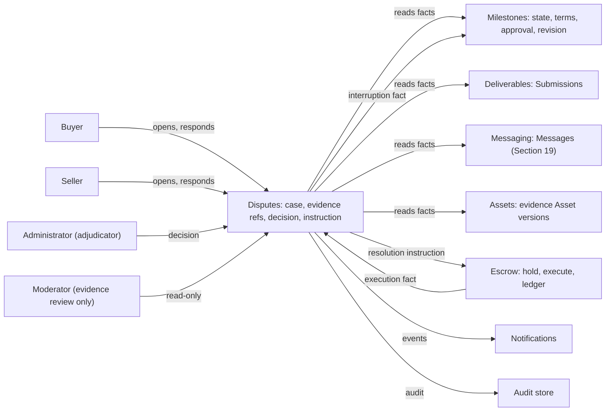
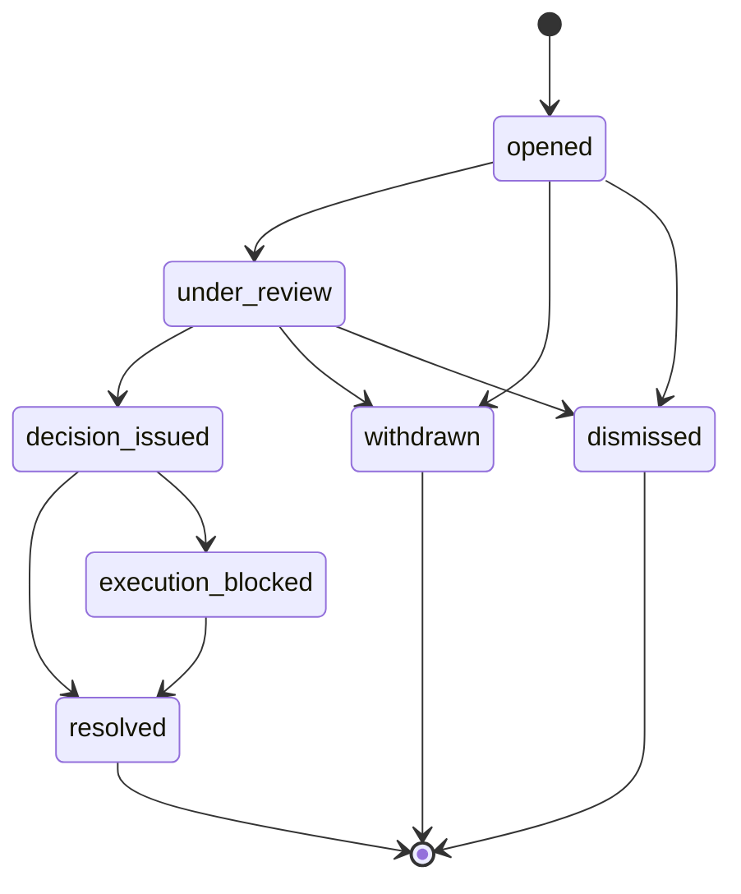
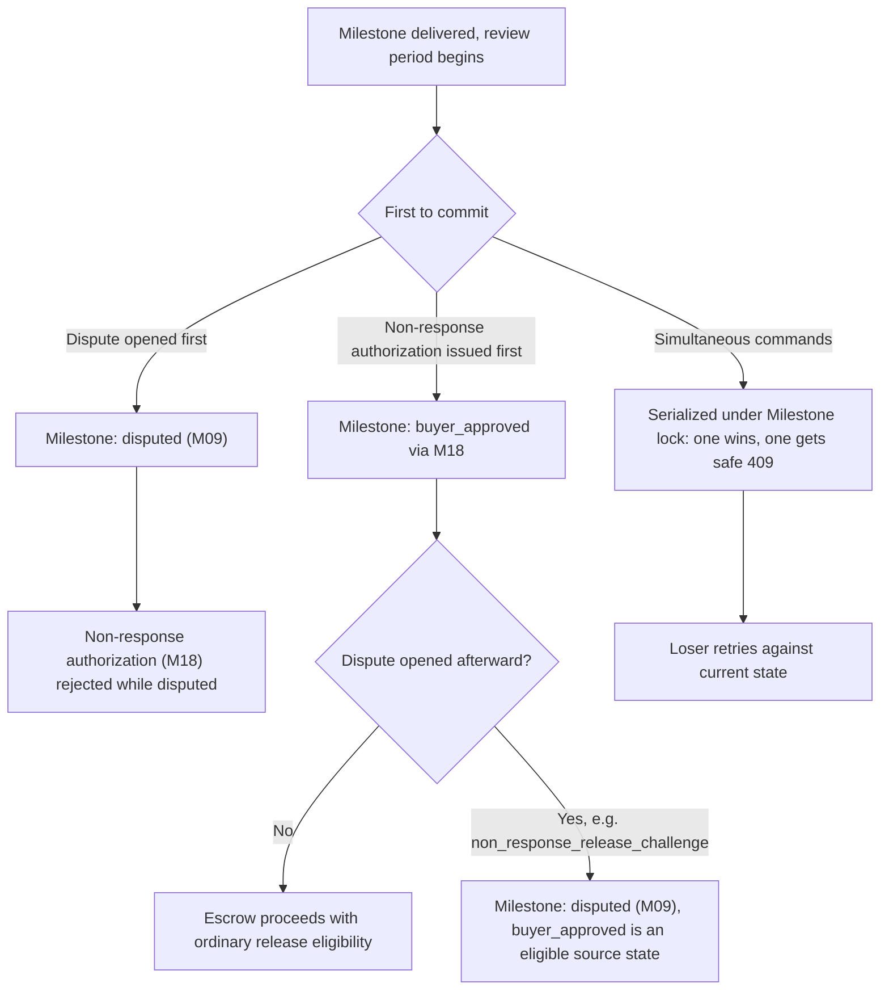
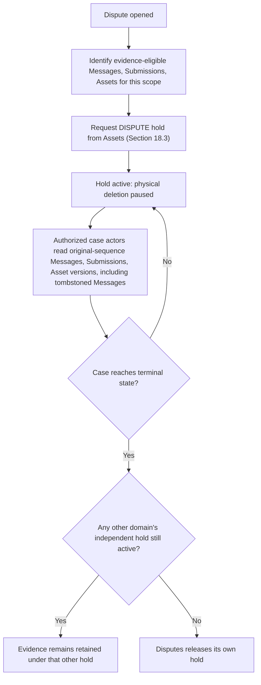
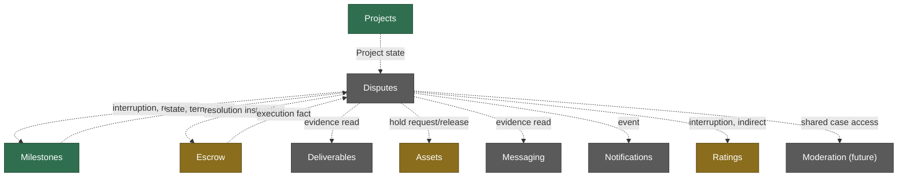
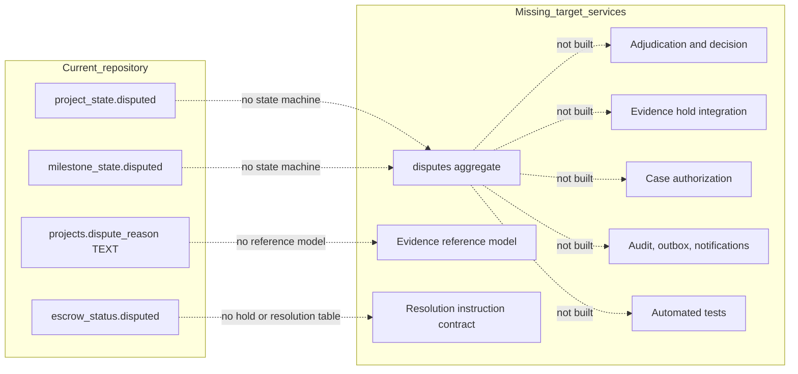

# Disputes domain specification

| Metadata | Value |
| --- | --- |
| Document ID | `SPEC-DISPUTES-000` (provisional; see Section 3) |
| Type | Specification (SPEC) |
| Domain | Disputes (governed `DISPUTES` token) |
| Status | Proposed |
| Version | 0.1.0 |
| Owner | Product and Architecture |
| Last Reviewed | 2026-09-25 |
| Applies To | Target Disputes product architecture and verified current repository comparison |
| Governed token | `DISPUTES` |
| Canonical path | `docs/09-moderation-trust-safety/disputes.md` |
| Product horizon | Target product architecture with verified repository comparison |
| Supersedes / Superseded By | None; resolves `BLOCKER-1` of the [specification consistency audit](../00-governance/specification-consistency-audit.md#7-blocker) and closes [Milestones Question Q11](../05-projects-milestones/milestones.md#361-open-questions-table), [Escrow Question EQ6](../06-payments-escrow/escrow.md#313-prioritized-open-questions), and the "Dispute Evidence" ownership gap in [Assets Section 7.2](../03-identity-profiles-verification/assets-and-media.md#7-asset-purposes) |

## 1. Executive summary

Disputes is MusicApp's governed mechanism for resolving a genuine disagreement about a real transaction relationship between a Buyer and a Seller on a Project — most commonly, disagreement about whether a Milestone's work was properly delivered, properly reviewed, or properly paid. It gives a claimant a bounded way to raise the issue, gives the respondent a bounded way to answer it, gives the platform a narrow and audited way to inspect evidence and adjudicate, and gives Escrow an unambiguous, immutable instruction to execute. Disputes decides outcomes. It does not hold money, does not move money, and does not rewrite the historical record of any other domain.

This specification closes the single BLOCKER left open by the prior batch of this documentation effort: Governance defined no directory, token, or canonical owner for Disputes, even though every domain that touches money or delivered work — Projects, Milestones, Deliverables, Escrow, Messaging, Ratings — already referred forward to "a future Disputes specification" by name. That gap is closed here with the smallest Governance change that introduces `DISPUTES` as an explicit, governed, first-class domain (Section 3), sharing its directory grouping with the still-unwritten Moderation/Trust & Safety domain without erasing or renaming it.

Four decisions drive the rest of this document. First, ownership: Disputes decides and instructs; Escrow holds custody and executes; the two are never merged (Section 5). Second, evidence: Disputes never duplicates another domain's record — it references immutable facts already owned by Milestones, Deliverables, Messaging, Assets, and Escrow, and it adds preservation rules only where an owning domain's own deletion or tombstone policy could otherwise remove something a case needs (Section 12). Third, the financial contract: a Dispute produces a single immutable resolution instruction using the exact `AWARD_BUYER` / `AWARD_SELLER` / `SPLIT` / `DISMISS` outcome vocabulary [Escrow Section 17.1](../06-payments-escrow/escrow.md#171-hold-model) already defined for this purpose, so Escrow's existing hold-and-resolve architecture requires no redesign (Section 15). Fourth, scope discipline: this document does not invent legal standards, compensation policy, chargeback liability, or fee refundability — every one of those remains an explicit Open Question owned by Product, Legal, or Finance (Section 33), exactly as the domains that already deferred them expected.

The repository contains no Dispute structure of any kind. `projects.dispute_reason TEXT` and the `disputed` value on `project_state`, `milestone_state`, and `escrow_status` are the only artifacts found anywhere in `backend/`; no dedicated table, enum, route, service, or test exists (Section 29).

## 2. Purpose and scope

This document is canonical for:

- Dispute identity, eligibility, category, and scope, and the transaction relationship a Dispute must attach to;
- who may open a Dispute, when, and the duplicate- and abuse-protection rules that govern opening;
- the evidence model: what becomes evidence, how it is referenced (never duplicated), and how it is preserved against another domain's ordinary deletion or tombstone policy;
- the response and platform-review process, and the authorized-reviewer and adjudication model;
- the Dispute lifecycle: states, transitions, actors, preconditions, terminal states, reopening, and withdrawal;
- the financial-resolution contract with Escrow, including how Buyer approval, non-response release authorization, cancellation, and chargeback interact with a Dispute;
- Disputes' contracts with Projects, Milestones, Deliverables, Escrow, Assets, Messaging, Ratings, and Notifications;
- Disputes authorization, concurrency, idempotency, target logical data, interfaces, events, operations, security findings, and migration guidance.

This document deliberately does not define Project, Milestone, or Deliverable identity and lifecycle ([Projects](../05-projects-milestones/projects.md), [Milestones](../05-projects-milestones/milestones.md), [Deliverables](../05-projects-milestones/deliverables.md)), Escrow custody, ledger, or Payment mechanics ([escrow.md](../06-payments-escrow/escrow.md), [payments.md](../06-payments-escrow/payments.md)), Asset storage, scanning, or retention mechanics ([assets-and-media.md](../03-identity-profiles-verification/assets-and-media.md)), Message content or tombstone mechanics ([messaging.md](../07-messaging-collaboration/messaging.md)), Rating content ([ratings.md](../08-ratings-reputation/ratings.md)), Notification delivery ([notifications.md](../10-notifications/notifications.md)), or the general Moderation/Trust & Safety domain that will eventually share this document's directory. Where this document needs a fact from one of them, it cites the section or identifier and adds only the Disputes-level consequence. This document does not invent legal, tax, chargeback-liability, or compensation policy; every such gap is recorded as an Open Question (Section 33), never silently resolved.

## 3. Governance, structure, status, and authority

### 3.1 Ownership analysis and Governance change

This analysis was completed before this file was created, per the mandatory ownership-resolution step, and directly resolves `BLOCKER-1` of the [specification consistency audit](../00-governance/specification-consistency-audit.md#7-blocker).

1. **Does Governance already define a Disputes domain or token?** No. [Governance Section 4](../00-governance/README.md#4-directory-structure) lists nineteen numbered directories with no Disputes entry, and [Governance Section 11](../00-governance/README.md#11-requirement-identifiers) lists `AUTH`, `AUTHZ`, `USERS`, `IDENTITY`, `MARKETPLACE`, `PROJECTS`, `ESCROW`, `MESSAGING`, `RATINGS`, `MODERATION`, `NOTIFICATIONS`, `ADMIN`, `ANALYTICS` — no `DISPUTES` token. This is exactly the gap `BLOCKER-1` recorded.
2. **Is there an available, unused directory slot?** No. Governance's directory numbering (`00`–`18`) is fully assigned; `09-moderation-trust-safety/` is assigned to Moderation and is empty (verified: `find docs -type f` before this document was created returned no file under `09-`). Per this task's explicit instruction, an unused slot is not manufactured by renumbering or displacing an existing assignment.
3. **Does Disputes belong inside Escrow, Projects, or Moderation instead of its own token?** No, for the reason `BLOCKER-1` itself already identified: Disputes has its own lifecycle (Section 9), its own authorization and adjudication model (Section 16), its own evidence model (Section 12), its own audit requirements (Section 22), and its own cross-domain contracts (Sections 13–20) — a shape distinct from Escrow's custody-and-ledger concern, Projects' commercial-collaboration concern, and Moderation's content/trust-and-safety concern. Folding Disputes into any one of them would force that owner to either duplicate the other three domains' facts or silently under-specify adjudication. [System Architecture Section 10.7](../01-foundation/system-architecture.md#107-escrow) already recorded this exact tension: "'Disputes' as an Escrow responsibility inherits the same gap noted for Projects... there is no dedicated disputes table anywhere." This document resolves that gap by giving Disputes its own token rather than resolving it by assumption.
4. **Can Disputes share an existing directory without erasing or renaming that directory's assignment?** Yes. Governance's own Section 4 prose for `09-moderation-trust-safety/` — "Moderation, trust and safety controls" — is a directory-purpose description, not a promise that the directory holds exactly one domain forever; Governance Section 4 requires only that a new *top-level* directory not be added without updating that section, which this change does. `06-payments-escrow/` already establishes the precedent of one governed directory holding two sibling specifications under a shared token ([escrow.md Section 3.1](../06-payments-escrow/escrow.md#31-governed-path-token-and-document-structure): "The domain is documented as two specifications in the same governed directory"). Disputes and Moderation are a closer fit for directory-sharing than Escrow and Payments were for token-sharing, since Disputes routinely produces evidence a future Moderation case may also need (Section 12), and both domains sit at the platform's trust boundary. Placing Disputes at `docs/09-moderation-trust-safety/disputes.md`, alongside a still-unwritten `moderation.md`, requires zero renames, breaks no existing cross-reference (a repository-wide search found every existing citation of `09-moderation-trust-safety/` is prose, not a markdown link to a file that does not yet exist), and leaves Moderation's own future ownership, token, and directory entry completely untouched.
5. **Does Disputes get its own governed identifier token even while sharing a directory?** Yes, and this is the substantive part of the change. Disputes uses `DISPUTES` as a distinct governed token — never `MODERATION`, `ESCROW`, or `PROJECTS` — exactly as `PROJECTS` already covers both `projects.md` and `milestones.md` as two documents under one token, and `ESCROW` covers both `escrow.md` and `payments.md`. Sharing a directory is a filesystem-grouping decision; the governed token is the identifier-ownership decision, and the two are independent under Governance Section 11.

**Governance decision:** `DISPUTES` becomes an explicit governed identifier/domain token with its canonical specification at `docs/09-moderation-trust-safety/disputes.md`. [Governance Section 4](../00-governance/README.md#4-directory-structure)'s directory table and [Governance Section 11](../00-governance/README.md#11-requirement-identifiers)'s token list are updated (Section 22 records the exact diff); no other Governance section changes, no existing governed identifier is renumbered, and Moderation's own future directory entry, token, and content are entirely preserved for whoever writes `moderation.md` next.

### 3.2 Identifier ranges

A complete repository-wide search for `DISPUTES` under every governed family (`REQ`, `BR`, `SEC`, `DATA`, `INT`, `AUD`) and every provisional family (`EVT`, `OPS`, `SPEC`) found zero prior uses anywhere in `docs/`. This document is the first to use the token and therefore starts every family at `001`, with no continuation and no collision risk against any other domain's range:

| Family | Range defined here | Governed |
| --- | --- | --- |
| `REQ-DISPUTES-*` | 001–028 | Yes, Governance Section 11 (as amended, Section 22) |
| `BR-DISPUTES-*` | 001–034 | Yes, Governance Section 11 (as amended, Section 22) |
| `SEC-DISPUTES-*` | 001–022 | Yes, Governance Section 11.1 |
| `DATA-DISPUTES-*` | 001–005 | Yes, Governance Section 11.1 |
| `INT-DISPUTES-*` | 001–014 | Yes, Governance Section 11.1 |
| `AUD-DISPUTES-*` | 001–008 | Yes, Governance Section 11.1 |
| `EVT-DISPUTES-*` | 001–012 | No; provisional, following the identical precedent already disclosed by every prior document in this batch |
| `OPS-DISPUTES-*` | 001–008 | No; provisional |
| `SPEC-DISPUTES-000` | Document ID | No; provisional, following the `SPEC-PROJECTS-000`/`SPEC-ESCROW-000`/`SPEC-NOTIFICATIONS-000` precedent |

The implementation labels used throughout, identical to every sibling document in this batch, are:

| Label | Meaning |
| --- | --- |
| Implemented | End-to-end behavior exists and was verified in the current repository. |
| Partially Implemented | Some executable path exists but one or more target guarantees are absent. |
| Schema Implemented | Database structure exists without the required executable domain behavior. |
| Planned | A repository artifact or existing specification declares intent but no complete behavior exists. |
| Not Implemented | No verified implementation was found. |

### 3.3 Reconciliation items

The following findings were made while authoring. No existing document's normative text is rewritten; each item is a targeted addition or a small, precise correction, listed exhaustively in Section 22.

| Item | Documents and sections | Finding | Treatment here |
| --- | --- | --- | --- |
| DIR1 | [Audit `BLOCKER-1`](../00-governance/specification-consistency-audit.md#7-blocker) | Disputes has no governed owner | Resolved by Section 3.1; `BLOCKER-1` is marked Resolved in the re-run audit (Section 22, and the audit document itself) |
| DIR2 | [Milestones Section 36.1, Question Q11](../05-projects-milestones/milestones.md#361-open-questions-table) | "Which Milestone states may be disputed, who decides resume or cancel or refund or release outcomes, and how are split settlements mapped" | Milestone eligibility is confirmed unchanged at `funded`, `in_progress`, `delivered`, `buyer_approved` (Section 8); the resume/cancel/refund/release decision is this document's adjudication and resolution-instruction contract (Sections 14–15); the split-to-`released`/`refunded` mapping is confirmed as already fixed by [Escrow Section 17.2](../06-payments-escrow/escrow.md#172-dispute-financial-outcome-matrix), which this document does not reopen |
| DIR3 | [Escrow Section 31.3, Question EQ6](../06-payments-escrow/escrow.md#313-prioritized-open-questions) | "Who adjudicates a Milestone dispute, on what evidence and timeline, and what is the timeout behavior if no resolution arrives?" | Adjudicator is an explicit governed Administrator capability (Section 16); evidence is Section 12's reference model; there is deliberately no invented timeout — an unresolved case stays `under_review` until decided, consistent with Escrow's own "Timeout without a resolver decision... Undefined. No timeout outcome is invented" ([Escrow Section 17.2](../06-payments-escrow/escrow.md#172-dispute-financial-outcome-matrix)) |
| DIR4 | [Assets Section 7.2](../03-identity-profiles-verification/assets-and-media.md#7-asset-purposes) | The "Dispute Evidence" Asset purpose lists its owner domain as "Unresolved — case domain or Moderation" | Resolved: Dispute Evidence is owned by Disputes, exercised jointly with a future Moderation case exactly as Deliverables resolved the analogous Deliverable-ownership question and Ratings resolved the analogous Review Evidence question ([Deliverables Section 3.3](../05-projects-milestones/deliverables.md#33-reconciliation-items) item DR1; [Ratings Section 3.3](../08-ratings-reputation/ratings.md#3-governance-structure-status-and-authority) item RR3). Unlike those two precedents, this one-cell owner-column correction in Assets Section 7.2 is made directly (Section 22), because the owner was genuinely unresolved (not merely under-labeled) and this document is precisely the resolution the audit's `BLOCKER-1` required |
| DIR5 | [Notifications Section 8.1](../10-notifications/notifications.md#81-canonical-topic-matrix) | The "Dispute opened / response required / resolved" topic row is marked "Disputes (future; blocked pending Governance ownership decision, Section 22)" | The row's Source domain cell is corrected to reference this document directly (Section 22); Notifications' own topic classification, channels, and defaults are unchanged |
| DIR6 | [Messaging Section 12](../07-messaging-collaboration/messaging.md#12-dispute-evidence-preservation) | Messaging already defines a complete "contract with a future Disputes specification" for evidence access | Adopted verbatim as this document's Messaging-evidence contract (Section 19); no new evidence-access rule is invented, only cited |
| DIR7 | [Projects Section 16.1](../05-projects-milestones/projects.md#161-cancellation-matrix) | The "Disputed" cancellation row names "the current Foundation Escrow dispute resolver" and "the resolution" without naming this document | The resolver and resolution referenced there are this document's adjudicator and resolution instruction (Section 18); Projects' matrix text is unchanged, since it already correctly deferred to "a future Disputes specification" by description |
| DIR8 | [Ratings Section 6.1](../08-ratings-reputation/ratings.md#61-eligibility-matrix) | "Ratings does not read Dispute state; the fact only arrives after Projects itself is uninterrupted" | Confirmed unchanged (Section 20): Disputes never emits a fact directly to Ratings, and a Rating's own eligibility timing already correctly depends only on Projects' own interruption state, not on Disputes |
| DIR9 | [System Architecture Section 6, 8, 12.2](../01-foundation/system-architecture.md#6-system-domain-map) | The domain map and dependency matrix show Escrow with a dashed, unlabeled "Disputes" edge and no Disputes node | A minimal addition — one new domain node and its edges — is made (Section 22); no existing domain's row, status, or edge is altered |

## 4. Terminology and domain boundaries

| Term | Local definition |
| --- | --- |
| Dispute | The single, case-level aggregate that records one claimant's disagreement about one Project or Milestone, from opening through resolution. |
| Claimant | The Buyer or Seller who opens a Dispute. |
| Respondent | The other Project participant named by the Dispute; the party who did not open it. |
| Dispute scope | The exact financial unit a Dispute names: one Milestone allocation, or, only where Escrow's own project-wide interruption applies, the whole Project ([Escrow Section 17.1](../06-payments-escrow/escrow.md#171-hold-model)). |
| Dispute category | The claimant-selected reason code classifying the disagreement (Section 8.2); never a legal cause of action. |
| Evidence reference | An immutable pointer to a fact already owned by another domain (a Submission, a Message, an Asset version, an approval record, a ledger entry); Disputes never copies the underlying content. |
| Case actor | Any authorized party during an active case: the claimant, the respondent, an assigned Moderator, or the adjudicating Administrator. |
| Adjudicator | The Administrator identity that reviews a case and issues a decision (Section 16); never the claimant, the respondent, or an unattended default. |
| Decision | The adjudicator's recorded outcome and rationale; a Disputes-owned fact, distinct from its execution. |
| Resolution instruction | The immutable, idempotent record Disputes emits to Escrow naming an outcome (`AWARD_BUYER`, `AWARD_SELLER`, `SPLIT`, `DISMISS`) and, for `SPLIT`, the exact release and refund amounts; Disputes' contribution ends here — Escrow decides whether and how to execute it. |
| Resolution execution | Escrow's own settlement of a resolution instruction (Section 15); a fact Disputes consumes, never produces. |

Ownership boundary, consistent with [System Architecture Sections 9–10](../01-foundation/system-architecture.md#9-architecture-boundaries) and the reconciliation of Section 3.1:

- Disputes owns dispute identity, eligibility, opening, claimant/respondent, reason/category, scope, evidence references, responses, platform review, adjudication, decision, and resolution instruction. It owns the dispute's own lifecycle and its own audit/history.
- Disputes never owns Project commercial state, Milestone execution state, Deliverable versions, Asset bytes, Message content, Escrow balances, Escrow ledger, Payment-provider state, payout execution, Rating records, or notification delivery. Every one of those remains with its existing owner; Disputes reads or references their facts and never rewrites them.
- Escrow owns custody, allocation holds, release, refund, and ledger execution ([Escrow Section 17](../06-payments-escrow/escrow.md#17-dispute-financial-relationship)); Disputes owns the decision that produces the instruction Escrow executes.
- Projects owns the commercial collaboration aggregate and consumes dispute facts (interruption, resolution) as inputs to its own lifecycle; it never adjudicates.
- Messaging, Deliverables, Assets, Ratings, and Notifications each remain independent domains that supply evidence or consume events; none of them is absorbed into Disputes, and Disputes is not absorbed into any of them.



*Figure 1 — Disputes Domain Architecture. Disputes decides; Escrow executes. Every fact Disputes reads is owned elsewhere; every fact Disputes produces (case record, decision, resolution instruction) is owned here.*

`REQ-DISPUTES-001`: Disputes MUST NOT store, mutate, or duplicate a fact owned by another domain, MUST reference such facts by immutable identity only, and MUST NOT execute, hold, or move money.

## 5. Canonical principles and architecture

1. A Dispute belongs to exactly one Project and, in the ordinary MVP case, exactly one Milestone. It never spans multiple Projects.
2. Disputes decides; Escrow executes. A decision is a fact about what should happen; execution is a separate, later fact about what did happen (Section 15).
3. Evidence is referenced, never duplicated. A Dispute stores identifiers, not copies, of Messages, Submissions, Asset versions, and financial records.
4. A Dispute must relate to a real transaction relationship. Only the Project's live Buyer or accepted Seller may open one, and only against a Milestone or Project they are a party to.
5. At most one active Dispute may exist per dispute scope, unless the platform explicitly permits a follow-up case over new facts (Section 9.4).
6. A dispute freezes only the governed scope's mutation and release, never the whole platform, and never a Milestone or Project outside its own scope unless Escrow's project-wide interruption applies.
7. The adjudicator is an explicit, governed capability, never the claimant, the respondent, an ordinary Moderator action, or an unattended default.
8. A resolution instruction is immutable and idempotent once issued. It is never edited; a correction is a new, separately authorized case or administrative action, never a silent rewrite.
9. Disputes never rewrites Escrow's ledger, Milestones' transition history, Deliverables' Submissions, or Messaging's Messages to implement a resolution. Every domain's own historical record survives a Dispute unchanged.
10. Ratings never substitutes for, gates, or is gated by dispute resolution beyond the explicit contract of Section 20.
11. Every Dispute mutation is authorized, versioned, idempotent, and audited in one atomic boundary.
12. Disputes does not invent legal standards, liability rules, or compensation policy. Where product or legal policy is required and does not exist, this document records an Open Question and does not guess (Section 33).

## 6. Dispute identity and field matrix

| Field | Definition | Storage class | Mutability | Repository status |
| --- | --- | --- | --- | --- |
| `id` | Internal UUID primary key | Stored | Immutable | Not Implemented |
| `external_id` | Opaque, unique, externally addressable identifier (target format `dsp_` plus 20 hex characters, matching the `mls_` convention already used by Milestones) | Stored | Immutable | Not Implemented |
| `project_id` | Owning Project; always present | Stored | Immutable | Not Implemented |
| `milestone_id` | Owning Milestone; present for `MILESTONE` scope, null only for a `PROJECT`-scope case (Section 8.3) | Stored | Immutable | Not Implemented |
| `escrow_allocation_id` | The Escrow allocation named by the case, read from Milestones/Escrow at open time, not client-supplied | Stored, Escrow-derived at open | Immutable | Not Implemented |
| `claimant_user_id` | The opening party, verified live against the Project's Buyer/Seller relationship at open time | Stored | Immutable | Not Implemented |
| `respondent_user_id` | The counterparty, derived from the same live relationship | Stored | Immutable | Not Implemented |
| `category` | Dispute category code (Section 8.2) | Stored | Immutable | Not Implemented |
| `disputed_amount` | Minor-unit integer, at most the allocation's remaining unsettled amount; between one minor unit and that ceiling | Stored | Immutable | Not Implemented |
| `currency` | Equal to the Project/Milestone/allocation currency | Stored, derived at open, validated | Immutable | Not Implemented |
| `claim_summary` | Bounded, restricted claimant statement; excluded from raw inclusion in events/logs, consistent with Milestones' revision-reason text handling | Stored | Immutable | Not Implemented |
| `state` | Governed enum (Section 9) | Stored | Transition service only | Not Implemented |
| `opened_at` | Server timestamp | Stored | Immutable | Not Implemented |
| `response_due_at` | Configured deadline for the respondent's answer (Section 10.2); not hard-coded | Stored | Set once at open | Not Implemented |
| `assigned_reviewer_id` | The Administrator identity assigned to adjudicate, once assigned | Stored | Set once, then immutable | Not Implemented |
| `decided_at` / `decision_id` | Set when a decision is recorded (Section 14) | Stored | Set once | Not Implemented |
| `resolution_instruction_id` | Reference to the immutable instruction record (Section 15) | Stored | Set once | Not Implemented |
| `resolved_at` | Set when Escrow's execution fact is consumed, or when `DISMISS`/withdrawal/administrative dismissal closes the case with no money movement | Stored | Set once | Not Implemented |
| `prior_dispute_id` | Nullable self-reference for an explicitly permitted follow-up case (Section 9.4) | Stored | Immutable | Not Implemented |
| `version` | Monotonic bigint, optimistic concurrency | Stored | Incremented on every mutation | Not Implemented |
| `created_at` / `updated_at` | Timestamps | Stored | `updated_at` trigger-maintained | Not Implemented |

Storage classes: **Stored** is directly stored and authoritative on the Dispute; **Escrow-derived** is read once at open time from Escrow/Milestones and then frozen on the case, never re-derived, so a case's own record does not silently drift if the underlying allocation later changes for an unrelated reason.

`REQ-DISPUTES-002`: A Dispute MUST be created as a single atomic transaction, MUST derive `claimant_user_id`, `respondent_user_id`, `project_id`, `milestone_id`, `escrow_allocation_id`, and `currency` from live, server-verified relationship and financial facts, and MUST NOT accept any of those fields as a client-supplied value.

## 7. Dispute lifecycle: states and transitions

### 7.1 State matrix

Governance Section 20 requires exact schema-safe enum values, not paraphrased state names. `dispute_state` is the target enum, chosen to be the smallest set that supports the required distinctions of Section 15 (decision versus execution) without inventing an unresolved-timeout state (`DIR3`).

| Stored state | Meaning | Entered by | Permitted exits | Terminal | Repository status |
| --- | --- | --- | --- | --- | --- |
| `opened` | Case created; evidence and response collection active | Claimant open command (Section 10) | `under_review`, `withdrawn`, `dismissed` | No | Not Implemented |
| `under_review` | An assigned Administrator is actively adjudicating; evidence submission remains open until a decision is recorded | Response window closes, or the assigned Administrator begins active review, whichever occurs first | `decision_issued`, `withdrawn`, `dismissed` | No | Not Implemented |
| `decision_issued` | The adjudicator recorded a decision and its resolution instruction; execution not yet confirmed | Adjudicator decision command (Section 14) | `resolved`, `execution_blocked` | No | Not Implemented |
| `execution_blocked` | Escrow reported the instructed outcome cannot execute automatically (funds already paid out; Section 15.3) | Verified Escrow execution-blocked fact | `resolved` | No | Not Implemented |
| `resolved` | Terminal: either Escrow confirmed execution matching the instruction, the instruction was `DISMISS` with no money movement, or an `execution_blocked` case was manually closed | Verified Escrow execution fact, or Administrator manual-resolution command | None | Yes | Not Implemented |
| `dismissed` | Terminal: the platform ended the case without a merits decision (ineligible, duplicate, abusive, or the adjudicator determined no case exists) | Administrator dismissal command | None | Yes | Not Implemented |
| `withdrawn` | Terminal: the claimant withdrew before a decision was issued | Claimant withdrawal command | None | Yes | Not Implemented |

### 7.2 Transition matrix

Every command carries `expected_version` and an `Idempotency-Key`; every consumed fact carries an immutable event or case identifier deduplicated by an inbox record (Section 21), following the identical pattern [Milestones Section 24](../05-projects-milestones/milestones.md#24-concurrency-and-idempotency) already established.

| ID | From → to | Initiator | Permission | Preconditions | External facts required | Side effects | Audit | Repository status |
| --- | --- | --- | --- | --- | --- | --- | --- | --- |
| DS01 | New → `opened` | Claimant (live Buyer or Seller) | `dispute.open` | Eligibility passes (Section 8); no active case on the same scope (Section 9.4) | None | Insert case; derive scope facts; hold placed on Escrow (Section 15.1) | `AUD-DISPUTES-001` | Not Implemented |
| DS02 | `opened` → `under_review` | System (window elapsed) or Administrator (early review) | `dispute.begin_review` | Response window elapsed, or Administrator explicitly starts review | None | Assign reviewer if not yet assigned | `AUD-DISPUTES-002` | Not Implemented |
| DS03 | `under_review` → `decision_issued` | Administrator (adjudicator) | `dispute.adjudicate` | Assigned reviewer matches actor; no missing required evidence acknowledgment | None | Write decision + resolution instruction atomically (Section 14) | `AUD-DISPUTES-003` | Not Implemented |
| DS04 | `decision_issued` → `resolved` | System (Escrow event consumer) | Trusted event capability | Resolution instruction ID matches | Escrow: execution confirmed matching instruction, or instruction was `DISMISS` | Set `resolved_at`; clear hold | `AUD-DISPUTES-004` | Not Implemented |
| DS05 | `decision_issued` → `execution_blocked` | System (Escrow event consumer) | Trusted event capability | Resolution instruction ID matches | Escrow: verified execution-blocked fact (funds already left custody) | Alert; open administrative queue item | `AUD-DISPUTES-004` | Not Implemented |
| DS06 | `execution_blocked` → `resolved` | Administrator | `dispute.manually_resolve` | Explicit administrative resolution outside the automated ledger (Section 15.3) | Documented manual outcome | Set `resolved_at`; record manual-resolution note | `AUD-DISPUTES-005` | Not Implemented |
| DS07 | `opened` or `under_review` → `withdrawn` | Claimant only | `dispute.withdraw` | No decision yet issued | None | Clear hold; notify respondent | `AUD-DISPUTES-006` | Not Implemented |
| DS08 | `opened` or `under_review` → `dismissed` | Administrator | `dispute.dismiss` | Ineligibility, duplication, or abuse finding, recorded with a reason code | None | Clear hold; notify both parties | `AUD-DISPUTES-007` | Not Implemented |

### 7.3 Invalid transitions

Any edge not listed above is invalid and returns a safe `409` with no side effect. In particular: no actor may set `state` directly; no transition skips `opened`; `resolved`, `dismissed`, and `withdrawn` accept no further transition (Section 9.4 governs a follow-up case, never a reopened one); the claimant cannot adjudicate their own case (`dispute.adjudicate` is never granted to a Project participant); and a decision cannot be issued by anyone other than the case's own `assigned_reviewer_id`.

### 7.4 State machine



*Figure 2 — Dispute Lifecycle. `decision_issued` and `resolved` are deliberately separate states: the first is Disputes' own decision fact, the second is Escrow's confirmed execution, never conflated (Section 15).*

`REQ-DISPUTES-003`: Disputes MUST expose a server-owned deterministic state machine, MUST reject every transition not explicitly permitted from the current state, and no interface MAY accept a client-supplied target state.

`BR-DISPUTES-001`: `decision_issued` MUST NOT imply `resolved`; a case is `resolved` only on a verified Escrow execution fact matching the resolution instruction, or on an explicit administrative manual-resolution action following `execution_blocked`.

### 7.5 Withdrawal and reopening policy

Only the claimant may withdraw, and only before a decision is issued (DS07). Withdrawal notifies the respondent and does not prevent the respondent from opening their own Dispute over the same scope if they have independent grounds — a withdrawal is not a finding on the merits and creates no presumption either way.

No terminal-state Dispute (`resolved`, `dismissed`, `withdrawn`) is ever reopened; its record is permanent, exactly like a Milestone's terminal state (`REQ-PROJECTS-034`) or an Escrow resolved hold ("A resolved hold is never reopened," [Escrow Section 17.1](../06-payments-escrow/escrow.md#171-hold-model)). Section 9.4 defines the one narrow exception — a new, separately opened case that references a closed one, for a materially new fact such as a chargeback arriving after resolution (Section 24).

## 8. Dispute eligibility

### 8.1 Eligibility matrix

| Condition | Rule | Repository status |
| --- | --- | --- |
| Actor | Only the Project's live Buyer or accepted Seller may open a case; a Collaborator, Observer, Moderator, or Administrator cannot open one as a party | Not Implemented |
| Relationship verification | `claimant_user_id` and `respondent_user_id` are re-verified against the live Project participant relationship at write time, never trusted from a client-supplied pair, mirroring [Ratings `REQ-RATINGS-002`](../08-ratings-reputation/ratings.md#61-eligibility-matrix) | Not Implemented |
| Unrelated-user protection | An actor with no live Buyer/Seller relationship to the named Project MUST receive the identical safe `404` a non-participant receives for any other Project resource, never a `403` that would confirm the Project's existence | Not Implemented |
| Eligible Milestone states | `funded`, `in_progress`, `delivered`, `buyer_approved` — confirmed unchanged from [Milestones Section 21.1](../05-projects-milestones/milestones.md#211-dispute-matrix), which this document does not reopen (`DIR2`) | Not Implemented |
| Ineligible Milestone states | `planned` (no funds at risk yet — a pre-funding disagreement is negotiation, not a dispute, Section 24), and the terminal states `released`, `refunded`, `cancelled` (corrected only through Escrow's own governed processes, never a fresh Dispute) | Not Implemented |
| Real transaction requirement | A Dispute MUST name an existing Project and, for `MILESTONE` scope, an existing Milestone the claimant is a live party to; it is never opened against an abstract claim with no funded or agreed relationship | Not Implemented |
| Duplicate protection | At most one active (non-terminal) Dispute per dispute scope; a second open attempt against the same scope while one is active is rejected with a safe conflict naming the existing case's `external_id` to its own parties only | Not Implemented |
| Category required | Every open command MUST select exactly one category from Section 8.2 | Not Implemented |
| Rate and abuse limiting | Per-user and per-Project limits on opening attempts; exact thresholds are configuration (Question EQ4, Section 33) | Not Implemented |
| Idempotency | `Idempotency-Key` bound to claimant, scope, and canonical request hash; a retry returns the original case, never a duplicate | Not Implemented |

`REQ-DISPUTES-004`: The system MUST reject a Dispute-open attempt from any actor who is not the live Buyer or accepted Seller of the named Project, MUST verify eligibility against live relationship and Milestone-state facts rather than client-supplied values, and MUST prevent a second active Dispute over the same scope.

`BR-DISPUTES-002`: A Dispute MUST name a real, live transaction relationship — an existing Project and, for Milestone scope, a Milestone in an eligible state — and MUST NOT be openable by a user with no Buyer or Seller relationship to that Project.

### 8.2 Category matrix

Category is a claimant-selected classification for routing and reporting; it never encodes a legal conclusion and never determines the outcome by itself.

| Category | Meaning | Typical evidence |
| --- | --- | --- |
| `work_not_delivered` | Seller never produced a Submission by the agreed terms | Milestone state, `due_at`, absence of a Deliverables Submission |
| `work_not_as_agreed` | A Submission exists but materially fails the agreed `deliverable_definition`/`submission_requirements` | Submission reference, agreed term snapshot |
| `invalid_deliverable_claim` | Buyer asserts a Submission does not meet the declared minimum Asset count or required classes | Submission Asset bindings, agreed `submission_requirements` |
| `improper_rejection_claim` | Seller asserts the Buyer improperly rejected or endlessly revision-requested valid work | Revision-request history, Submission history |
| `revision_disagreement` | Disagreement over whether a specific revision request was valid | Revision-request record, Submission reference |
| `revision_allowance_disagreement` | Disagreement over whether the agreed `revision_allowance` was exhausted or miscounted | Milestone `revision_count`/`revision_allowance` term snapshot |
| `missed_deadline` | Disagreement tied to a passed `due_at` | Milestone `due_at`, Overdue derivation |
| `cancellation_disagreement` | Disagreement over a proposed or executed cancellation and its financial consequence | Project/Milestone cancellation matrix state, amendment record if any |
| `non_response_release_challenge` | A party challenges a platform non-response release authorization (`DATA-PROJECTS-017`) as improperly issued | Intervention case reference, contact-attempt record, authorization record |
| `incorrect_release_or_refund_claim` | A party asserts Escrow released or refunded incorrectly | Ledger entries, allocation state |
| `payment_disagreement` | A payment-related disagreement not covered by a more specific category | Payment record reference |
| `unauthorized_financial_action` | A party asserts a financial action was taken without proper authorization | Approval record, authorization audit trail |
| `other` | A governed category not otherwise listed; requires a free-text `claim_summary` and receives no automated routing preference | Case-specific |

`BR-DISPUTES-003`: Disputes MUST classify every case under exactly one governed category from this table, MUST NOT infer a category from free text, and category selection alone MUST NOT determine or bias the adjudicated outcome.

### 8.3 Scope matrix

| Scope | When used | Frozen unit | Repository status |
| --- | --- | --- | --- |
| `MILESTONE` | The ordinary MVP case: disagreement tied to one Milestone's allocation | That Milestone's Escrow allocation only | Not Implemented |
| `PROJECT` | Only when Escrow's own project-wide interruption applies ([Projects Section 18](../05-projects-milestones/projects.md#18-milestone-relationship); [Escrow Section 17.1](../06-payments-escrow/escrow.md#171-hold-model)), or when the disagreement precedes any Milestone-level allocation (for example, a funded-but-unstarted Project with a single disputed cancellation) | Every unsettled allocation of the Project | Not Implemented |

`REQ-DISPUTES-005`: A `PROJECT`-scope Dispute MUST be opened only when Escrow's project-wide interruption condition applies or no single Milestone allocation can represent the disagreement, and MUST NOT be used to broaden an ordinary Milestone-level disagreement into a platform-wide hold.

## 9. Duplicate protection and follow-up cases

### 9.1 Why duplicate protection is scope-based, not category-based

Two different claimants (Buyer and Seller) may each have a genuine, independent grievance about the same Milestone at the same time — for example, the Buyer disputes quality while the Seller separately disputes an improper rejection. This document does not force those into one case merely because they share a scope; instead, an attempt to open a second case on an already-active scope is rejected with a pointer to the existing case (Section 8.1), and the respondent's grievance is expected to surface as their **response** to the existing case (Section 10), not as a second case. This keeps exactly one active case per financial unit, which is what Escrow's hold model requires (one hold, one resolution instruction, per scope, per [Escrow Section 17.1](../06-payments-escrow/escrow.md#171-hold-model)).

### 9.2 Race with dispute opening

Opening a Dispute and an ordinary release authorization (Buyer approval or platform non-response authorization) can race. Section 11 defines the exact resolution; the principle stated here is that Dispute opening always wins a genuine race, because a Dispute that arrives after money has already left Escrow's custody is far harder to resolve than one that arrives before (Section 15.3).

### 9.3 Idempotent opening

A retried open request with the same `Idempotency-Key` and canonical request hash against the same scope returns the original case. A different hash against an already-open scope is rejected as a conflicting request, not silently merged.

### 9.4 Follow-up cases

A new Dispute may be opened against a scope that already has a terminal-state case only when it presents a materially new fact the closed case could not have considered — the canonical example is a chargeback notice arriving after a case already `resolved` (Section 24). The new case's `prior_dispute_id` references the closed one; the closed case's own record and decision are never altered. Whether a follow-up case requires special eligibility review beyond ordinary opening is Open Question EQ7 (Section 33).

`BR-DISPUTES-004`: A follow-up Dispute referencing a terminal-state case MUST NOT alter, supersede, or reopen the prior case's own record, decision, or resolution instruction; it is a wholly new case that happens to cite prior context.

## 10. Opening a dispute

### 10.1 Opening matrix

| Concern | Target rule | Repository status |
| --- | --- | --- |
| Who may open | Claimant only (Section 8.1) | Not Implemented |
| Required fields | `project_id`, optionally `milestone_id` (required for `MILESTONE` scope), `category`, `claim_summary`, initial evidence references (optional, may be added during the response window) | Not Implemented |
| Server-derived fields | `respondent_user_id`, `escrow_allocation_id`, `currency`, `disputed_amount` ceiling (Section 6) | Not Implemented |
| Hold placement | Opening atomically requests an Escrow hold for the disputed amount on the named allocation (Section 15.1); the case does not exist in a state where a hold was requested but not yet confirmed as an observable inconsistency — the open transaction and the hold-request emission are one atomic unit | Not Implemented |
| Response window start | `response_due_at` set from a configured duration (Question EQ3, Section 33), not hard-coded | Not Implemented |
| Notification | Mandatory safety/legal notice to the respondent and a receipt to the claimant | Not Implemented |
| Audit | `AUD-DISPUTES-001`: actor, scope, category, amount, currency, outcome | Not Implemented |

### 10.2 Opening sequence

```mermaid
sequenceDiagram
    actor Claimant
    participant API as Disputes API
    participant Milestones as Milestones
    participant Escrow as Escrow
    participant Outbox as Transactional outbox
    Claimant->>API: Open dispute (Project, Milestone, category, claim, idempotency key)
    API->>Milestones: Verify live relationship, eligible state, no active case on scope
    Milestones-->>API: Eligible; allocation reference
    API->>API: Insert case, state opened, response_due_at set
    API->>Escrow: Request hold for disputed amount (Section 15.1)
    Escrow-->>API: Hold confirmed
    API->>Milestones: Emit dispute-opened fact (interruption)
    Milestones->>Milestones: Enter disputed, store resume_state (M09)
    API->>Outbox: DisputeOpened event
    API-->>Claimant: Case created
    Outbox->>Respondent: Mandatory safety/legal notice
```

*Figure 3 — Dispute Opening Sequence. Eligibility, the Escrow hold request, and the Milestone interruption fact are all resolved before the claimant sees a confirmed case.*

`REQ-DISPUTES-006`: Opening a Dispute MUST atomically verify eligibility, request the corresponding Escrow hold, and emit the interruption fact Milestones consumes, and MUST be idempotent under a caller-supplied key.

### 10.3 Response

| Concern | Rule | Repository status |
| --- | --- | --- |
| Who may respond | Respondent only | Not Implemented |
| Response content | Bounded, restricted statement plus evidence references (Section 12) | Not Implemented |
| Response window | Configured duration from `opened_at`; not hard-coded (Question EQ3) | Not Implemented |
| Non-response | The case still advances to `under_review` on window elapse (DS02); Disputes does not treat respondent silence as an admission or as a dismissal — it proceeds to adjudication on whatever evidence exists | Not Implemented |
| Additional evidence after response | Either party may add evidence references until a decision is issued (Section 12); a late addition does not reset the response deadline | Not Implemented |
| Audit and notification | `AUD-DISPUTES-002`; mandatory notice to the claimant that a response was received | Not Implemented |

`BR-DISPUTES-005`: Respondent silence through an elapsed response window MUST NOT be treated as an admission, a default judgment, or a dismissal; the case proceeds to review on the evidence available.

## 11. Interaction with Buyer non-response release

### 11.1 The race this section resolves

[Milestones Section 18.2](../05-projects-milestones/milestones.md#182-buyer-non-response-and-platform-intervention) defines platform intervention for a non-responsive Buyer, ending, if intervention is exhausted, in a non-response release authorization (M18) that is never itself an Escrow release. A genuine race exists: intervention could reach its final contact attempt at nearly the same moment either party opens a Dispute on the same Milestone. This document defines the resolution both sides already anticipated (Milestones `DIR` cross-references, Escrow `BR-ESCROW-049`) but neither could finish alone.

### 11.2 Race resolution matrix

| Situation | Rule | Repository status |
| --- | --- | --- |
| Dispute opened before non-response authorization is issued | The Dispute's interruption (M09) takes precedence; Milestones' own guard already rejects M18 while `disputed` ([Milestones `REQ-PROJECTS-061`](../05-projects-milestones/milestones.md#182-buyer-non-response-and-platform-intervention), `BR-PROJECTS-078`) | Not Implemented |
| Non-response authorization already issued (Milestone `buyer_approved` via M18), then a Dispute is opened | Permitted: `buyer_approved` is an eligible Milestone state for a Dispute (Section 8.1); the Dispute may specifically use category `non_response_release_challenge` to contest the authorization itself | Not Implemented |
| Dispute open and non-response authorization requested in the same instant (concurrent requests) | Serialized under the Milestone lock, exactly as Escrow's release-versus-dispute race is serialized ([Escrow Section 22.2](../06-payments-escrow/escrow.md#222-concurrency-rules)); whichever commits first wins, and the loser receives a safe `409` — a Dispute-open that loses the race is not silently dropped, the client MUST retry, and a retry against a now-`buyer_approved` Milestone succeeds under the row above | Not Implemented |
| Dispute opening must be idempotent under this race | A retried open request after a `409` uses the same idempotency key; if the underlying state has changed (Milestone now `buyer_approved` instead of `delivered`), the retry is evaluated fresh against current state, never against the stale precondition | Not Implemented |
| Stale resolution instructions | A resolution instruction that predates a state change it did not anticipate (for example, Escrow already executed a release between decision and consumption) MUST NOT execute; Escrow's own idempotent-execution check (Section 15.2) rejects a stale instruction and reports `execution_blocked` rather than silently applying a mismatched amount | Not Implemented |
| All intervention actions remain auditable | Every contact attempt and every authorization outcome stays in Milestones' own `AUD-PROJECTS-015` trail regardless of a later Dispute; Disputes never edits that trail, only references it as evidence (Section 12) | Not Implemented |



*Figure 4 — Non-Response and Dispute Race. A Dispute opened first always blocks the authorization; an authorization issued first is still challengeable by a later Dispute; simultaneous commands are serialized, never silently dropped.*

`REQ-DISPUTES-007`: Dispute opening and Milestone non-response release authorization MUST be mutually exclusive under a serialized lock on the same Milestone, a Dispute opened before authorization MUST block it, an authorization issued first MUST remain independently challengeable by a later Dispute, and no command that loses the race MAY be silently discarded without a safe, retryable conflict response.

`BR-DISPUTES-006`: A resolution instruction or release authorization that no longer matches the Escrow allocation's live state at the moment of execution MUST NOT execute, and MUST instead produce a quarantined, alerted, and auditable non-application rather than a partial or mismatched movement.

## 12. Evidence architecture

### 12.1 Principle

Dispute evidence is a set of references to facts other domains already own immutably, plus an optional narrow set of case-specific artifacts (the claimant's and respondent's own statements) that Disputes itself owns because no other domain is a natural owner of them. Disputes never re-uploads, re-hashes, or copies content another domain already retains; it stores identity and, where the source record is itself mutable in ways a case cannot tolerate (Section 12.3), a preservation instruction to that domain.

### 12.2 Evidence source matrix

| Evidence source | What is referenced | Owning domain | Preservation contract |
| --- | --- | --- | --- |
| Accepted Project commercial snapshot | Agreed term version identifier | Projects | Already immutable once agreed ([Projects Section 15](../05-projects-milestones/projects.md#15-scope-changes-and-amendments)); referenced, not copied |
| Accepted Milestone terms, `deliverable_definition`, `submission_requirements` | Agreed `milestone_term_versions` snapshot reference | Milestones | Already immutable snapshot (`DATA-PROJECTS-009`); referenced |
| Revision allowance and count | `revision_allowance` term value; `milestone_revision_requests` records | Milestones | Already append-retained (`DATA-PROJECTS-012`); referenced |
| Deliverable Submissions | Submission `external_id` and version, Asset bindings | Deliverables | Already immutable once created ([Deliverables Section 12.3](../05-projects-milestones/deliverables.md#123-historical-preservation)); referenced |
| Submission Assets | Asset version identity | Assets | Governed by Section 12.3 below |
| Buyer review actions, revision requests, approval | `milestone_revision_requests`, `milestone_approvals`, `milestone_platform_release_authorizations` references | Milestones | Already append-only/immutable; referenced |
| Messages and attachments | Message `external_id` and Asset attachment bindings, in original sequence, including tombstoned Messages | Messaging | Governed by Section 19 below (adopts [Messaging Section 12](../07-messaging-collaboration/messaging.md#12-dispute-evidence-preservation) verbatim) |
| Platform intervention records | Intervention case reference, contact-attempt records | Milestones | Already append-only (`AUD-PROJECTS-015`); referenced |
| Escrow allocation and hold | Allocation identifier, hold record | Escrow | Already append-only ledger; referenced |
| Escrow ledger entries | Specific entry identifiers relevant to the disputed amount | Escrow | Already immutable ([Escrow Section 13.4](../06-payments-escrow/escrow.md#134-append-only-enforcement)); referenced |
| Payment references | Payment record identifier(s) | Payments | Owned by `payments.md`; referenced |
| Claimant/respondent statements | `claim_summary`, response text | Disputes | Disputes-owned; immutable once submitted (Section 12.4) |

`REQ-DISPUTES-008`: Every evidence entry MUST be an immutable reference to a fact already owned by another domain, or a Disputes-owned statement record, and MUST NOT duplicate, re-store, or re-derive content that domain already holds.

### 12.3 Preservation against deletion or tombstoning

Two owning domains have an ordinary, non-malicious deletion or redaction path that could otherwise remove something a case needs: Messaging's tombstone (Section 19) and Assets' deletion/retention workflow ([Assets Section 18](../03-identity-profiles-verification/assets-and-media.md#18-retention-archival-restoration-and-deletion)). Neither is asked to change its own mechanism; both already anticipated this exact need.

| Concern | Rule | Repository status |
| --- | --- | --- |
| Messaging tombstones | A tombstone redacts ordinary participant display only; the underlying Message row, hash, and attachment bindings remain retained and fully accessible to authorized case actors, exactly as [Messaging `REQ-MESSAGING-007`](../07-messaging-collaboration/messaging.md#12-dispute-evidence-preservation) already requires | Not Implemented |
| Asset deletion | Once a Dispute is `opened`, every Asset version bound as evidence for its scope is placed under a `DISPUTE` hold via [Assets Section 18.3](../03-identity-profiles-verification/assets-and-media.md#183-holds-soft-deletion-and-deletion-failure)'s existing hold mechanism, which "pauses physical deletion" until release; Disputes requests the hold and its release, and Assets executes both, exactly as that section already specifies for "a legal, dispute, financial, fraud, verification, or moderation hold" | Not Implemented |
| Hold scope | The hold covers every Asset version bound to the disputed Milestone's Submissions and every Asset attached to Messages in the Project's Conversation for the case's open period, not the whole platform | Not Implemented |
| Hold release | Released only when the case reaches a terminal state (`resolved`, `dismissed`, `withdrawn`) and any separate retention/legal hold from another domain has also cleared; Disputes releases its own hold and does not override another domain's independent hold | Not Implemented |
| Evidence integrity | Every referenced record's hash or version identifier is captured at the moment it is added as evidence, so a case can later prove the exact version reviewed, even though the record itself is already immutable at its source | Not Implemented |
| New content during an open case | Not blocked by Disputes; Messaging and Deliverables continue to accept new Messages and (where the Milestone state permits) Submissions unless this document's own interruption rule blocks a specific action (Sections 7, 15) | Not Implemented |



*Figure 5 — Evidence Flow. Disputes requests and releases its own hold on Assets' existing mechanism; it never bypasses Messaging's tombstone model or duplicates Asset bytes.*

`REQ-DISPUTES-009`: Opening a Dispute MUST place a scoped `DISPUTE` hold, through Assets' existing hold mechanism, on every Asset version evidentially relevant to the case, MUST NOT remove or weaken Messaging's tombstone-preservation guarantee, and MUST release the hold only on case closure and only where no other domain's independent hold remains active.

`BR-DISPUTES-007`: Evidence access MUST be restricted to authorized case actors — the claimant, the respondent, the assigned Administrator, and, for evidence-inspection only, an assigned Moderator — verified against the case's own participant list, never by identifier possession alone, and every access MUST be audited distinctly from an ordinary participant read.

### 12.4 Disputes-owned statement records

`claim_summary` and response text are the only content Disputes itself stores. Both are immutable once submitted — a correction is a new, separately timestamped addendum, never an edit to the original — consistent with the "sent, immutable" pattern Messaging and Deliverables already use for their own records.

## 13. Response, platform review, and evidence inspection

### 13.1 Review matrix

| Concern | Rule | Repository status |
| --- | --- | --- |
| Assignment | An Administrator is assigned to a case, either automatically on `under_review` entry (round-robin or queue policy, Question EQ5) or explicitly by another Administrator; assignment is recorded and immutable once set | Not Implemented |
| Review scope | The assigned Administrator may read every referenced evidence item for the case's scope, add case notes, and request additional evidence from either party (a request, not a compulsion the platform can enforce beyond the existing response mechanism) | Not Implemented |
| Moderator role | A Moderator may be granted case-scoped, evidence-inspection-only access to assist review, but MUST NOT hold `dispute.adjudicate` and MUST NOT issue a decision, consistent with Moderator/Administrator independence (`BR-AUTHZ-034`) and Moderator's platform-wide restriction against automatically changing financial records ([Roles Section 7.8](../02-users-roles-permissions/roles.md#78-moderator)) | Not Implemented |
| Verification-document exposure | Assets' Verification Document/Selfie purpose is never exposed to a Dispute reviewer through the case-evidence surface unless a separate, explicit, narrowly scoped authorization names that specific need; ordinary case review never requires it | Not Implemented |
| Case notes | Reviewer-authored, never visible to the parties by default, distinct from the reasoned decision (Section 14), which is disclosed | Not Implemented |
| Audit | Every evidence read and every note by a case actor is audited (`AUD-DISPUTES-008`) distinctly from an ordinary read | Not Implemented |

`REQ-DISPUTES-010`: Case evidence access MUST be restricted to the case's own verified participant list, MUST NOT expose identity-verification documents to a reviewer without a separate explicit authorization, and every access MUST be distinctly audited.

`SEC-DISPUTES-001` (cross-referenced in Section 23): identity-document exposure is treated as a security finding, not only a process rule, because the failure mode (a reviewer browsing unrelated verification documents) is a privacy and regulatory risk, not merely a workflow gap.

## 14. Adjudication

### 14.1 Adjudication matrix

| Concern | Rule | Repository status |
| --- | --- | --- |
| Who may adjudicate | An explicit, governed Administrator capability, `dispute.adjudicate`; never the claimant, the respondent, an ordinary Moderator action, or an unattended System default | Not Implemented |
| Assignment requirement | Only the case's own `assigned_reviewer_id` may issue its decision; a different Administrator attempting to decide an unassigned-to-them case is rejected, preventing an uninvolved actor from deciding a case they never reviewed | Not Implemented |
| Decision content | Outcome (Section 15.1 vocabulary), rationale text (bounded, restricted, disclosed to both parties), amounts for a `SPLIT` outcome, timestamp, idempotency key, correlation ID | Not Implemented |
| Decision immutability | Once recorded, a decision and its resolution instruction are never edited; a mistaken decision is corrected only by a new, separately authorized administrative action producing a new instruction under documented exceptional policy (Question EQ6), never a silent overwrite | Not Implemented |
| No legal conclusion | The decision record states a resolution outcome and a rationale grounded in the referenced evidence; it does not purport to be a legal judgment, and this document does not define what standard of proof an Administrator applies beyond "review the referenced evidence and the platform's own commercial-term and lifecycle facts" | Not Implemented |
| Idempotency | One decision per case by uniqueness; a repeat with the same key returns the original decision | Not Implemented |
| Audit | `AUD-DISPUTES-003`: reviewer, case, outcome, amounts, rationale hash, timestamp | Not Implemented |
| Notification | Mandatory safety/legal notice to both parties | Not Implemented |

### 14.2 Adjudication sequence

```mermaid
sequenceDiagram
    actor Admin as Assigned Administrator
    participant API as Disputes API
    participant DB as Dispute store
    participant Outbox as Transactional outbox
    participant Escrow as Escrow
    Admin->>API: Review evidence, case notes
    Admin->>API: Issue decision (outcome, amounts if SPLIT, rationale, idempotency key)
    API->>DB: Verify actor is assigned_reviewer_id; state is under_review
    API->>DB: Write decision record
    API->>DB: Write resolution instruction (Section 15.1), state decision_issued
    API->>Outbox: DisputeDecisionIssued, ResolutionInstructionIssued
    API-->>Admin: Decision recorded
    Outbox->>Escrow: Deliver resolution instruction after commit
    Outbox->>Claimant: Mandatory notice
    Outbox->>Respondent: Mandatory notice
```

*Figure 6 — Adjudication Sequence. The decision and the resolution instruction are written in the same atomic transaction; Escrow receives the instruction only after commit, never as part of the decision itself.*

`REQ-DISPUTES-011`: A Dispute decision MUST be issued only by the case's own assigned Administrator under an explicit governed capability, MUST be recorded atomically with its resolution instruction, MUST be immutable once recorded, and MUST NOT be issuable by the claimant, the respondent, or an unattended default.

`BR-DISPUTES-008`: Disputes MUST NOT encode a legal standard, a liability rule, or a compensation formula that Product or Legal has not established; a decision's rationale is a case-specific finding, not a generalizable rule this document creates.

## 15. Financial resolution

### 15.1 Resolution instruction contract

A resolution instruction is the sole artifact Disputes hands to Escrow. It reuses, unchanged, the outcome vocabulary [Escrow Section 17.1](../06-payments-escrow/escrow.md#171-hold-model) already defined, so Escrow's existing hold-and-resolve architecture requires no new contract:

| Field | Definition |
| --- | --- |
| `resolution_id` | Unique identifier; Escrow's natural idempotency key |
| `case_id` | The Dispute's own identity |
| `outcome` | `AWARD_BUYER`, `AWARD_SELLER`, `SPLIT`, or `DISMISS`, exactly as Escrow's contract already names them |
| `release_amount` / `refund_amount` | For `SPLIT`, both stated; they MUST sum to exactly the held amount, per Escrow's existing rule |
| `resolver_identity` | The adjudicating Administrator |
| `issued_at` | Server timestamp |

`REQ-DISPUTES-012`: A resolution instruction MUST use exactly the `AWARD_BUYER` / `AWARD_SELLER` / `SPLIT` / `DISMISS` outcome vocabulary Escrow already consumes, MUST be immutable and idempotent by `resolution_id`, and Disputes MUST NOT invent a distinct outcome vocabulary Escrow was not built to accept.

### 15.2 Financial-outcome matrix

| Outcome | Meaning | Escrow effect (already specified, cited not redefined) | Milestone effect | Repository status |
| --- | --- | --- | --- | --- |
| `AWARD_BUYER` (full Buyer refund) | Held amount returns to Buyer | `refunded_to_buyer` for the held amount, then `refund_paid` ([Escrow Section 17.2](../06-payments-escrow/escrow.md#172-dispute-financial-outcome-matrix)) | Allocation `refunded` (M11) | Not Implemented |
| `AWARD_SELLER` (full Seller award) | Held amount becomes releasable | `released_to_seller` with fee lines; payout gate still applies | Allocation `released` (M11) | Not Implemented |
| `SPLIT` (split settlement) | Instruction states `release_amount` and `refund_amount` summing to the held amount | One journal with both movements | Allocation `released` if `release_amount > 0`, else `refunded` — the mapping [Escrow Section 12](../06-payments-escrow/escrow.md#12-allocation-states) and [Section 19.1 of Milestones](../05-projects-milestones/milestones.md#191-completion-semantics) already fix | Not Implemented |
| `DISMISS` (unaffected funds) | Hold lifted, no movement | Hold released; no ledger entry | Allocation returns to its prior derived state | Not Implemented |
| Funds still held (ordinary case) | The common case: disputed amount is still in the allocation, unreleased, unpaid out | Any of the above outcomes executes normally | As above | Not Implemented |
| Partial Milestone dispute | `disputed_amount` is less than the allocation's full remaining amount | Only the held portion moves; the unheld remainder is unaffected ([Escrow Section 17.2](../06-payments-escrow/escrow.md#172-dispute-financial-outcome-matrix)) | Milestone stays interrupted only for the held portion's effect | Not Implemented |
| Partial Project dispute | `PROJECT` scope names several allocations | Each allocation's hold resolves independently per the same instruction's per-allocation breakdown, or via separate instructions per allocation (Question EQ8) | Each Milestone resolves independently | Not Implemented |
| Funds already released (Seller entitlement, not yet paid out) | `AWARD_BUYER` or a partial refund is decided after release but before payout | Reversed only by this Dispute's award, using a compensating journal from `SELLER_ENTITLEMENT` back to the allocation and then a refund, exactly as [Escrow Section 15.1](../06-payments-escrow/escrow.md#151-refund-matrix) already specifies | Milestone re-enters `disputed` outcome per M11 | Not Implemented |
| Funds already paid out (left platform custody) | `AWARD_BUYER` or partial refund is decided after Seller payout completed | Cannot execute automatically; Escrow reports execution-blocked (Section 7.1, DS05); recovery against the Seller is a Legal/Finance policy question this document does not invent (Question EQ1, mirrors Escrow's own EQ5) | Case moves to `execution_blocked`, not silently `resolved` | Not Implemented |
| Chargeback interaction | A chargeback notice arrives during or after a Dispute | Handled by Escrow/Payments' own chargeback hold ([Escrow Section 18](../06-payments-escrow/escrow.md#18-chargebacks-and-provider-reversals)); Disputes does not adjudicate the chargeback itself, but a chargeback arriving after a resolved Dispute may justify a follow-up case (Section 9.4) | No automatic Milestone reversal | Not Implemented |

```mermaid
sequenceDiagram
    participant D as Disputes
    participant E as Escrow
    D->>E: Resolution instruction (case_id, outcome, amounts, resolution_id)
    E->>E: Lock allocation; verify hold matches held amount
    alt Funds still held
        E->>E: Execute outcome (release, refund, split, or dismiss)
        E-->>D: Execution confirmed
        D->>D: State decision_issued to resolved
    else Funds already released, not yet paid out
        E->>E: Compensating journal, then outcome
        E-->>D: Execution confirmed
        D->>D: State decision_issued to resolved
    else Funds already paid out
        E-->>D: Execution blocked (funds left custody)
        D->>D: State decision_issued to execution_blocked
        D->>D: Alert for administrative manual resolution
    end
```

*Figure 7 — Financial-Resolution Instruction Flow. Escrow, not Disputes, decides whether the instruction is executable against the allocation's live state; an unexecutable instruction becomes an audited, alertable case, never a silently dropped one.*

`REQ-DISPUTES-013`: Disputes MUST NOT execute, hold, or move money itself, MUST hand every financial outcome to Escrow as a single immutable instruction, and MUST correctly represent a case as `execution_blocked`, never `resolved`, when Escrow reports the instructed outcome cannot execute automatically.

`BR-DISPUTES-009`: Disputes MUST NOT rewrite Escrow's ledger, MUST NOT create ledger entries of its own, and MUST NOT become a second payment engine; every monetary fact remains Escrow's and Payments' own record.

### 15.3 Execution-blocked handling

When funds have already left platform custody, this document does not invent a recovery or liability policy — it surfaces the gap exactly as [Escrow Question EQ5](../06-payments-escrow/escrow.md#313-prioritized-open-questions) already does ("Who bears financial liability for a chargeback on funds already paid out, and what recovery rights, if any, exist against the Seller?"). `execution_blocked` is this document's honest representation of that unresolved state: the case is not silently marked resolved, and it is not left in an ambiguous `decision_issued` state that looks like ordinary pending settlement. An Administrator closes it only through the explicit `dispute.manually_resolve` capability (DS06), with the manual outcome documented in the audit trail.

## 16. Authorization model

### 16.1 Authorization matrix

Permission keys are proposed, traceable policy inputs, following the identical convention [Milestones Section 23](../05-projects-milestones/milestones.md#23-authorization-model) already establishes; they are not a claim that a Permissions implementation exists.

| Action | Permission | Required relationship/state | Additional checks | Repository status |
| --- | --- | --- | --- | --- |
| Open dispute | `dispute.open` | Live Buyer or accepted Seller; eligible Milestone/Project state | Duplicate-scope check, rate limit | Not Implemented |
| Respond | `dispute.respond` | Live respondent of the named case | Case `opened` or `under_review` | Not Implemented |
| Add evidence reference | `dispute.add_evidence` | Claimant or respondent of the case | Case not yet `decision_issued` | Not Implemented |
| Withdraw | `dispute.withdraw` | Claimant only | Case `opened` or `under_review` | Not Implemented |
| Begin review | `dispute.begin_review` | System (automatic) or Administrator | Response window elapsed, or explicit early start | Not Implemented |
| Evidence-inspection read (staff) | `dispute.review_evidence` | Assigned Administrator, or a Moderator explicitly granted case-scoped access | Verified case participant list, never identifier alone | Not Implemented |
| Adjudicate | `dispute.adjudicate` | Assigned Administrator only | Never Buyer, Seller, or Moderator | Not Implemented |
| Dismiss | `dispute.dismiss` | Administrator | Ineligibility, duplication, or abuse finding with reason code | Not Implemented |
| Manually resolve after execution-blocked | `dispute.manually_resolve` | Administrator | Case `execution_blocked` | Not Implemented |
| Consume domain fact (Escrow execution, Milestone eligibility) | Service capability | Trusted producer identity | Signed channel, event ID, version dedupe | Not Implemented |

Moderator and Administrator remain independent roles (`BR-AUTHZ-034`); a Moderator granted case-scoped evidence access never thereby gains `dispute.adjudicate`, and an Administrator's adjudication authority is never inherited by a Moderator by default.

`REQ-DISPUTES-014`: Every Dispute interface MUST resolve cases only through relationship-scoped or case-scoped access with opaque identifiers, live authorization re-evaluated on every request, and non-enumerating failures, and MUST NOT treat possession of a Dispute identifier as authorization.

### 16.2 Resource-loading order

Every Dispute interface applies this order, extending the identical pattern [Milestones Section 23.2](../05-projects-milestones/milestones.md#232-resource-loading-order) already establishes:

1. Authenticate the credential and re-check live user or service status.
2. Resolve the Project's opaque external identifier in a query already scoped to the actor's relationship or case, without returning existence to an unrelated actor.
3. Resolve the Dispute's opaque external identifier only inside that Project scope, or through the case's own verified participant list for a case-scoped staff actor.
4. Validate case state and action purpose.
5. Evaluate the proposed permission.
6. Record sensitive access intent (evidence reads, staff actions) distinctly.
7. Lock the case row (and, where relevant, the Escrow allocation) in a stable order, re-read the expected version, and execute.
8. Return safe `401`, `403`, `404`, or `409` semantics with identical shape and timing for absent and out-of-scope resources.

`SEC-DISPUTES-002`: An unrelated user's attempt to resolve a Dispute by external ID MUST return the identical `404` a non-existent case would, never a `403` that would confirm the case's existence (IDOR resistance, consistent with `SEC-PROJECTS-020`/`027`).

## 17. Concurrency and idempotency

| Concern | Rule |
| --- | --- |
| Version column | Monotonic bigint `version` on the Dispute row; returned as an ETag |
| Optimistic concurrency | Every mutation compares `expected_version` under a row lock; a stale request returns `409` with no side effect |
| Lock order | Escrow allocation (if a hold or resolution touches it), then the Dispute case, then Milestones (for interruption facts), matching the stable ordering already established by Milestones and Escrow for exactly this kind of cross-domain transaction |
| Idempotency keys | Scoped to actor, operation, case; store a canonical request hash, status, and response reference; same key and hash returns the original result, same key with a different hash is rejected |
| Duplicate opening | One case per active scope (Section 9); a repeat idempotency key returns the original case |
| Duplicate decision | One decision per case by uniqueness; a repeat with the same key returns the original decision, a different key against an already-decided case is rejected |
| Duplicate resolution execution | Escrow's own idempotent execution by `resolution_id` (Section 15.1); a duplicate delivery is acknowledged without a second movement |
| Duplicate external facts | An inbox record with a unique `(consumer, event_id)`; duplicates are acknowledged, reordered facts held until the expected version arrives |
| Race with Escrow release | Serialized under the allocation lock (Section 11); dispute opening wins a genuine race |
| Race with refund or payout | The same allocation lock serializes a Dispute-driven resolution against any concurrent refund or payout attempt; Escrow's own single-writer discipline over the allocation is not altered by Disputes |
| Replay protection | Every consumed fact and every issued instruction carries an immutable, deduplicated identifier; a replayed message never produces a second effect |

`REQ-DISPUTES-015`: Every Dispute mutation MUST use optimistic version validation, operation idempotency, a stable cross-domain lock order, and one atomic transaction boundary for state, decision, instruction, audit, and outbox records, and every external fact MUST be deduplicated by immutable event identifier.

## 18. Cancellation interaction

Disputes does not own cancellation; it reconciles with the existing cancellation matrices [Projects Section 16.1](../05-projects-milestones/projects.md#161-cancellation-matrix), [Milestones Section 20.1](../05-projects-milestones/milestones.md#201-cancellation-matrix), and [Escrow Section 16.1](../06-payments-escrow/escrow.md#161-cancellation-financial-outcome-matrix), all of which already name "Dispute," "resolution," or "the current Foundation Escrow dispute resolver" without previously having a document to point to.

| Cancellation scenario | Disputes interaction | Repository status |
| --- | --- | --- |
| Mutually agreed cancellation | No Dispute required; Projects' amendment/consent mechanism governs directly | Not Implemented |
| Unilateral cancellation where allowed (Draft, unaccepted proposal) | No funds at risk; not Dispute-eligible (Section 8.1) | Not Implemented |
| Cancellation before funding | No Dispute-eligible amount exists | Not Implemented |
| Cancellation after funding, before disagreement | Ordinary Escrow refund path per [Escrow Section 16.1](../06-payments-escrow/escrow.md#161-cancellation-financial-outcome-matrix); becomes Dispute-eligible only if the parties disagree | Not Implemented |
| Cancellation after work begins, disputed | Either party may open a Dispute with category `cancellation_disagreement`; Escrow's existing "Required if the parties disagree" language in its own cancellation matrix is satisfied by this Dispute mechanism | Not Implemented |
| Cancellation after Submission | Same as above; `work_not_as_agreed` or `cancellation_disagreement` category as appropriate, with the Submission itself as evidence | Not Implemented |
| Funded-cancellation compensation for partial performance | Not resolved by this document, and not resolved by Escrow's own [Question EQ3](../06-payments-escrow/escrow.md#313-prioritized-open-questions) ("What compensation, if any, is owed to a Seller for partial performance on a funded-but-cancelled Project?"). This document does not invent a compensation formula; a Dispute may still be opened and adjudicated under whatever interim policy Product supplies, but the absence of a default compensation rule remains a **Product P0**, carried forward unresolved (Section 33, EQ2) | Not Implemented |

`BR-DISPUTES-010`: Disputes MUST NOT invent a funded-cancellation compensation formula that Product has not established; where a cancellation disagreement is adjudicated without one, the decision rationale MUST record that the compensation policy itself remains an open Product question, not a precedent the case sets.

## 19. Messaging interaction

Disputes adopts [Messaging Section 12](../07-messaging-collaboration/messaging.md#12-dispute-evidence-preservation) verbatim as its own contract; nothing here redefines Messaging's mechanism.

| Concern | Contract (cited, not redefined) |
| --- | --- |
| Immutable message identity | Every Message's `external_id` and hash, per [Messaging Section 8](../07-messaging-collaboration/messaging.md#8-message-model) |
| Evidence reference | Disputes stores the Message `external_id`, never the content |
| Tombstone behavior | A tombstone redacts ordinary display only; case actors see full original content, per [Messaging `REQ-MESSAGING-005`](../07-messaging-collaboration/messaging.md#10-deletion-tombstone-policy) and `REQ-MESSAGING-007` |
| Preservation | Messaging already retains every Message, tombstoned or not, as potential Dispute evidence; Disputes' own Section 12.3 hold is additive only where Assets-bound attachments are concerned, since Messages themselves are never physically deleted by Messaging's own model |
| Participant authorization | Case-scoped evidence access is verified against the Dispute's own participant list, per [Messaging Section 11](../07-messaging-collaboration/messaging.md#11-authorization) |
| Staff reviewer authorization | An assigned Administrator or explicitly case-scoped Moderator, audited distinctly from an ordinary participant read |
| Asset attachment evidence | Governed by Section 12.3 above |

`REQ-DISPUTES-016`: Disputes MUST reference Messages by immutable identity only, MUST NOT duplicate Message content into a Dispute-owned table, and MUST rely on Messaging's own tombstone-preservation guarantee rather than defining a second one.

## 20. Ratings interaction

| Question | Answer | Repository status |
| --- | --- | --- |
| Does rating eligibility wait for dispute resolution? | No. Ratings' own eligibility fact arrives only once Projects is uninterrupted ([Projects Section 11.1](../05-projects-milestones/projects.md#111-completion-rule); [Ratings Section 6.1](../08-ratings-reputation/ratings.md#61-eligibility-matrix)); an open Dispute keeps the Project interrupted, which already naturally delays Ratings eligibility without Disputes needing to emit a separate signal to Ratings | Not Implemented |
| Can disputed transactions be rated? | Once the Dispute reaches a terminal state and the Project is no longer interrupted, ordinary Ratings eligibility resumes exactly as it would for any other uninterrupted Project; a resolved Dispute does not itself block a subsequent Rating | Not Implemented |
| May published ratings be moderated after a dispute? | Rating moderation ([Ratings Section 13](../08-ratings-reputation/ratings.md#13-rating-moderation)) is a Ratings-owned capability; a Dispute's decision does not automatically trigger a Rating moderation action. Whether a Dispute finding should be able to *request* Ratings moderation review is an Open Question (EQ9, Section 33), not resolved here | Not Implemented |
| Do dispute outcomes affect reputation projections? | Not directly. Disputes emits no fact to Profiles' or Ratings' reputation projection; any future reputation effect of dispute history is an explicit Open Question (EQ9), not invented here | Not Implemented |
| Retaliatory rating policy | Not invented. This document does not define or prevent a specific retaliatory-rating pattern; that remains Ratings' and Moderation's own future policy | Not Implemented |

`BR-DISPUTES-011`: Disputes MUST NOT gate, delay, or fabricate a Rating, and MUST NOT emit a fact that a Ratings implementation could mistake for a reputation-affecting signal beyond the ordinary Project-interruption mechanism Projects already owns.

## 21. Notifications interaction

Disputes emits events; Notifications distributes them. Disputes never owns delivery, channel selection, or preference evaluation.

| Event | Recipient | Notification class (per [Notifications Section 8.1](../10-notifications/notifications.md#81-canonical-topic-matrix), corrected per `DIR5`) |
| --- | --- | --- |
| Dispute opened | Respondent (mandatory), claimant (receipt) | Mandatory safety/legal |
| Response requested / received | Both parties | Mandatory safety/legal |
| Evidence requested | The party asked | Mandatory safety/legal |
| Dispute updated (review begun, assignment) | Both parties | Mandatory safety/legal |
| Decision issued | Both parties | Mandatory safety/legal |
| Financial resolution pending (`decision_issued`, `execution_blocked`) | Both parties | Mandatory financial |
| Dispute resolved / dismissed / withdrawn | Both parties | Mandatory safety/legal |

`REQ-DISPUTES-017`: Disputes MUST emit a verified, uniquely identified event for every state transition of Section 7 and MUST NOT itself perform delivery, channel selection, or preference evaluation, which remain entirely Notifications-owned.

## 22. Cross-document reconciliation

The following minimal, targeted changes accompany this document, consistent with `DIR1`–`DIR9` (Section 3.3). No document's normative behavior is rewritten; every change either fills a previously named gap or corrects a stale forward-reference.

| Document | Change | Nature |
| --- | --- | --- |
| `00-governance/README.md` | Section 4 directory table, row `09`: purpose text updated to name both Disputes and Moderation; Section 11 domain-token list: `DISPUTES` added | Minimal governance amendment (Section 3.1) |
| `00-governance/specification-consistency-audit.md` | `BLOCKER-1` marked Resolved; baseline inventory updated; full re-run (Section 23 of this document's parent task, reflected in the audit's own revision) | Audit update |
| `01-foundation/system-architecture.md` | Section 6 domain map: one new `DISPUTES` node and its edges added; Section 7 ownership matrix: one new row; Section 8 dependency matrix: one new row/column; Section 18 Open Questions: the Disputes-entity question marked Resolved with a pointer here | Additive |
| `01-foundation/product-overview.md` | Section 8 domain-boundaries table: no change required (Foundation's table already only lists the thirteen original domains and was never authoritative for Disputes; System Architecture is the corrected surface) | None needed |
| `03-identity-profiles-verification/assets-and-media.md` | Section 7.2, "Dispute Evidence" row, Owner Domain cell: `Unresolved — case domain or Moderation` → `Disputes` | One-cell correction (`DIR4`) |
| `07-messaging-collaboration/messaging.md` | No change; Section 12's contract is adopted verbatim (`DIR6`) | None needed |
| `08-ratings-reputation/ratings.md` | No change; Section 6.1's non-dependency on Dispute state is confirmed, not altered (`DIR8`) | None needed |
| `10-notifications/notifications.md` | Section 8.1, "Dispute opened / response required / resolved" row, Source domain cell: corrected to reference this document; "blocked pending Governance ownership decision" language removed | One-cell correction (`DIR5`) |
| `05-projects-milestones/projects.md`, `milestones.md`, `06-payments-escrow/escrow.md` | No change; each already correctly deferred to "a future Disputes specification" and every specific citation (Q11, EQ6, the cancellation matrix's "resolution" language) is confirmed satisfied by this document, not contradicted | None needed |

## 23. Target data model

| Identifier and model | Purpose and principal fields | Keys, uniqueness, and indexes | Repository status |
| --- | --- | --- | --- |
| `DATA-DISPUTES-001` `disputes` | Case aggregate: fields of Section 6 | PK `id`; unique `external_id`; FK `project_id`, `milestone_id` `RESTRICT`; unique partial index enforcing at most one active case per `(milestone_id)` or `(project_id)` for `PROJECT` scope; indexes `(project_id, state)`, `(milestone_id, state)` | Not Implemented |
| `DATA-DISPUTES-002` `dispute_evidence_references` | One row per evidence reference: case, source domain, source record type, source `external_id`, hash/version captured at add-time, added-by, added-at | PK; FK `dispute_id` `RESTRICT`; unique `(dispute_id, source_domain, source_external_id)` | Not Implemented |
| `DATA-DISPUTES-003` `dispute_statements` | Claimant/respondent statement records: case, author, kind (`CLAIM`, `RESPONSE`, `ADDENDUM`), bounded restricted text, submitted-at | PK; FK `dispute_id` `RESTRICT`; append-only | Not Implemented |
| `DATA-DISPUTES-004` `dispute_decisions` | Immutable decision: case, reviewer, outcome, amounts, rationale, decided-at, idempotency key, correlation ID | PK; unique `dispute_id`; FK `RESTRICT` | Not Implemented |
| `DATA-DISPUTES-005` `dispute_events` | Append-only history: case, source state, target state, trigger type, actor or source fact ID, outcome, reason code, time | PK and unique event ID; FK `RESTRICT`; indexes `(dispute_id, time)` | Not Implemented |

The resolution instruction itself (Section 15.1) is the payload of a `DisputeDecisionIssued`/`ResolutionInstructionIssued` outbox event derived from `dispute_decisions`, not a separate table; Escrow's own hold and journal tables (`DATA-ESCROW-*`) remain the execution-side record and are not duplicated here. Idempotency and inbox/outbox infrastructure is shared with every other domain in this batch ([Projects Section 26](../05-projects-milestones/projects.md#26-target-data-model)) and is not a Disputes-specific model.

`REQ-DISPUTES-018`: The target schema MUST represent case identity, evidence references, statements, decisions, and transition history as separate append-retained records, MUST NOT duplicate any evidence source's own table, and MUST restrict destructive deletion of any of the five tables above.

## 24. Interaction with the negotiation phase

Disagreement before commercial terms lock is negotiation, not a dispute — this mirrors the identical principle [Milestones Section 7.1](../05-projects-milestones/milestones.md#71-deterministic-target-model) already establishes for pre-acceptance scope changes. If a Buyer and Seller cannot agree on terms before lock, the Project simply does not reach its locked commercial state (`terms_status = agreed`); there is no funded amount, no eligible Milestone state (Section 8.1), and therefore nothing for a Dispute to hold or resolve. After lock, disagreement over *compliance* with those now-immutable terms may become Dispute-eligible under the categories of Section 8.2. Disputes never rewrites the locked terms themselves (Section 5, principle 9) — it only decides a financial outcome against them.

`BR-DISPUTES-012`: A Dispute MUST NOT be opened against pre-lock negotiation, and adjudication MUST evaluate compliance against the agreed term snapshot referenced by the case, never against a renegotiated or hypothetical term.

## 25. Domain dependency matrix

| Domain | Disputes produces | Disputes consumes | Ownership boundary | Failure behavior | Repository status |
| --- | --- | --- | --- | --- | --- |
| Projects | Interruption fact (via Milestones), resolution outcome facts | Live participant relationship, Project state | Projects owns commercial state; Disputes owns the decision | Reject when Project state is unreadable | Not Implemented |
| Milestones | Dispute-opened interruption fact (M09), resolution/resume facts (M10/M11) | Milestone state, term snapshot, revision/approval facts | Milestones owns lifecycle; Disputes owns adjudication | Never invent a positive fact; hold until resolution | Not Implemented |
| Deliverables | None directly | Submission identity as evidence | Deliverables owns Submissions; Disputes references them | No coupling beyond evidence read | Not Implemented |
| Escrow | Resolution instruction, hold request/release | Allocation identity, execution facts, execution-blocked facts | Escrow owns money; Disputes owns the decision | Reject a stale or mismatched instruction; never invent settlement | Schema Implemented (target: Escrow side only) |
| Assets | Hold request/release | Evidence Asset version identity, readiness | Assets owns bytes and retention; Disputes requests holds only | Fail closed on hold-request failure | Not Implemented |
| Messaging | None directly | Message identity as evidence | Messaging owns content; Disputes references it | No coupling beyond evidence read | Not Implemented |
| Ratings | None | None (indirect, via Project interruption) | Independent | No coupling | Not Implemented |
| Notifications | Durable event requests | Delivery outcome for operations only | Delivery never creates or blocks Dispute truth | Outbox retry and alert | Not Implemented |
| Authorization | Resource/action context | Allow/deny, field projection | Authorization decides request; Disputes enforces case-lifecycle invariants | Deny closed | Not Implemented |
| Moderation (future) | Shared evidence access grant | Case-scoped read only | Disputes never delegates adjudication to Moderation | Independent roles preserved | Planned |



*Figure 8 — Cross-Domain Effects. Every edge is dashed because no domain has any executable Disputes integration today; the diagram states target dependency direction, not current behavior.*

`REQ-DISPUTES-019`: Disputes MUST expose transport-neutral contracts with safe failures, explicit projections, and no client authority over identity, state, or financial outcome, matching the pattern every sibling domain in this batch already establishes.

## 26. Interface requirements

| Identifier | Logical interface | Core contract | Repository status |
| --- | --- | --- | --- |
| `INT-DISPUTES-001` | Open dispute | Claimant, field allowlist, idempotency | Not Implemented |
| `INT-DISPUTES-002` | Read/list disputes | Relationship- or case-scoped; role-specific projection | Not Implemented |
| `INT-DISPUTES-003` | Respond to dispute | Respondent, expected version | Not Implemented |
| `INT-DISPUTES-004` | Add evidence reference | Claimant or respondent, case not decided | Not Implemented |
| `INT-DISPUTES-005` | Withdraw dispute | Claimant only | Not Implemented |
| `INT-DISPUTES-006` | Begin review / assign reviewer | System or Administrator | Not Implemented |
| `INT-DISPUTES-007` | Case-scoped evidence read (staff) | Assigned Administrator or granted Moderator | Not Implemented |
| `INT-DISPUTES-008` | Issue decision | Assigned Administrator only | Not Implemented |
| `INT-DISPUTES-009` | Dismiss dispute | Administrator | Not Implemented |
| `INT-DISPUTES-010` | Manually resolve after execution-blocked | Administrator | Not Implemented |
| `INT-DISPUTES-011` | Consume Milestone/Escrow facts | Trusted producer; event and version dedupe | Not Implemented |
| `INT-DISPUTES-012` | Emit resolution instruction | Trusted producer to Escrow; idempotent | Not Implemented |
| `INT-DISPUTES-013` | Request/release Asset evidence hold | Trusted producer to Assets | Not Implemented |
| `INT-DISPUTES-014` | Dispute eligibility facts | Read-only answer to Milestones/Projects: does an active case exist for this scope | Not Implemented |

## 27. Audit, events, and operations

### 27.1 Audit requirements

| Identifier | Requirement |
| --- | --- |
| `AUD-DISPUTES-001` | Record dispute opening: actor, scope, category, amount, currency, outcome |
| `AUD-DISPUTES-002` | Record response receipt and review assignment |
| `AUD-DISPUTES-003` | Record decision issuance: reviewer, outcome, amounts, rationale hash |
| `AUD-DISPUTES-004` | Record every consumed Escrow execution or execution-blocked fact |
| `AUD-DISPUTES-005` | Record every manual resolution following `execution_blocked`, with documented rationale |
| `AUD-DISPUTES-006` | Record withdrawal, with actor and timestamp |
| `AUD-DISPUTES-007` | Record dismissal, with reason code |
| `AUD-DISPUTES-008` | Record every case-scoped evidence access, distinct from ordinary participant reads, including Moderator and Administrator access |

### 27.2 Provisional events and operations

Governance defines no `EVT-*` or `OPS-*` family; the following are provisional pending a Governance amendment, following the identical precedent every prior document in this batch already discloses.

| Provisional identifier | Event or requirement |
| --- | --- |
| `EVT-DISPUTES-001` | `DisputeOpened`: case ID, Project/Milestone IDs, claimant, respondent, category, amount, currency |
| `EVT-DISPUTES-002` | `DisputeResponseReceived`: case ID, respondent, timestamp |
| `EVT-DISPUTES-003` | `DisputeReviewBegun`: case ID, assigned reviewer |
| `EVT-DISPUTES-004` | `DisputeDecisionIssued`: case ID, outcome, amounts, reviewer |
| `EVT-DISPUTES-005` | `ResolutionInstructionIssued`: resolution ID, case ID, outcome, amounts |
| `EVT-DISPUTES-006` | `DisputeResolved`: case ID, terminal state, resolved-at |
| `EVT-DISPUTES-007` | `DisputeExecutionBlocked`: case ID, resolution ID, reason |
| `EVT-DISPUTES-008` | `DisputeWithdrawn`: case ID, actor |
| `EVT-DISPUTES-009` | `DisputeDismissed`: case ID, reason code |
| `EVT-DISPUTES-010` | `DisputeEvidenceHoldRequested` / `DisputeEvidenceHoldReleased`: case ID, Asset version IDs |
| `EVT-DISPUTES-011` | `DisputeEvidenceAccessed`: case ID, actor, accessed reference (for audit fan-out) |
| `EVT-DISPUTES-012` | `DisputeFollowUpOpened`: new case ID, `prior_dispute_id` |
| `OPS-DISPUTES-001` | Measure open, review, decision, and resolution latency by outcome and category |
| `OPS-DISPUTES-002` | Alert on cases stalled in `under_review` beyond a configured age, or in `execution_blocked` beyond a configured age |
| `OPS-DISPUTES-003` | Reconcile open-case counts and hold amounts against Escrow's own hold ledger on schedule; alert without rewriting history |
| `OPS-DISPUTES-004` | Alert on repeated opening attempts from the same actor (abuse/spam signal) |
| `OPS-DISPUTES-005` | Alert on repeated IDOR-like misses and evidence-access anomalies |
| `OPS-DISPUTES-006` | Monitor category distribution and outcome distribution for reviewer-consistency signals |
| `OPS-DISPUTES-007` | Test restore of dispute history and audit trail |
| `OPS-DISPUTES-008` | Alert on any resolution instruction Escrow rejects as stale or mismatched (Section 11.2) |

`REQ-DISPUTES-020`: Every material Dispute action and every privileged access MUST produce redacted immutable audit evidence and a retry-safe event, and every material outcome MUST create a durable notification request without making delivery part of the transaction.

## 28. Verified repository comparison

### 28.1 Review method

`backend/db/*.sql` (all eight migrations), `backend/Index.js` (all twelve routes), `frontend/src/App.tsx` and `frontend/src/api/api.js`, both `package.json` files, and a repository-wide search for a `tests` directory were searched directly, following the identical method every sibling document in this batch already discloses (for example, [Milestones Section 28.1](../05-projects-milestones/milestones.md#281-review-method)).

### 28.2 Findings

No migration defines a `disputes`, `dispute_evidence_references`, `dispute_statements`, `dispute_decisions`, or `dispute_events` table, nor any `dispute_state`, `dispute_category`, or `dispute_outcome` enum. The only artifacts found anywhere in the repository are: `projects.dispute_reason TEXT` (a free-text column on `projects`, `backend/db/005_create_projects.sql`) and the literal value `disputed` on three separate, unrelated enum types — `project_state` and `escrow_status` (`backend/db/006_create_escrow_system.sql`), and `milestone_state` (same migration). No route, service, trigger, or frontend component references any of them beyond their bare declaration; `backend/Index.js`'s twelve routes contain no `dispute` path, handler, or SQL statement beyond the initial `INSERT` that leaves `dispute_reason` at its implicit `NULL` default. `frontend/src/App.tsx` has no dispute UI of any kind.

### 28.3 Repository comparison matrix

| Capability | Verified artifact | Gap against target | Status |
| --- | --- | --- | --- |
| Disputes table | None | Full schema of Section 23 | Not Implemented |
| Dispute enum | `disputed` value only, on three unrelated enums; no dedicated `dispute_state`, `dispute_category`, or `dispute_outcome` type | Full target enum set of Sections 7–8, 15 | Schema Implemented (enum value only, not a Disputes-owned type) |
| Dispute route | None | Full interface set of Section 26 | Not Implemented |
| Dispute service | None | Full lifecycle service of Sections 7, 10–15 | Not Implemented |
| Admin review UI | None | Section 13/14 review surface | Not Implemented |
| Evidence model | `projects.dispute_reason TEXT` only (a single free-text field, not a reference model) | Full evidence-reference model of Section 12 | Not Implemented |
| Dispute event | None | `EVT-DISPUTES-*` of Section 27.2 | Not Implemented |
| Financial dispute handling | `escrow_status`/`milestone_state` `disputed` value only; no hold table, no resolution table | Full financial-resolution contract of Section 15 | Not Implemented |
| Chargeback logic | None specific to Disputes (Escrow/Payments own their own chargeback intake) | Section 15.2's chargeback-interaction row is a reference to Escrow's existing, separate mechanism | Not Implemented |
| Tests | None | Full suite implied by Sections 7–17 | Not Implemented |



*Figure 9 — Repository vs. Target Architecture. Four scattered, non-cooperating artifacts (one free-text column, three bare enum values) are the entire current footprint; every service this document specifies is new.*

## 29. Security findings

| Finding | Severity | Verified condition or target threat | Impact | Required treatment | Disposition |
| --- | --- | --- | --- | --- | --- |
| `SEC-DISPUTES-001` Identity-verification document exposure to reviewers | High | Latent target threat: no case-evidence surface exists yet; a naive implementation could surface every Asset bound to a Project, including Verification Document/Selfie purposes, to a reviewer | Regulatory and privacy exposure; verification documents are not ordinary case evidence | Explicit exclusion of Verification-purpose Assets from the case-evidence surface (Section 13.1) unless separately, narrowly authorized | Open |
| `SEC-DISPUTES-002` IDOR on case resolution | High | Latent target threat: no route exists yet | An unrelated user could confirm a case exists via a distinguishable error shape | Identical `404` for absent/out-of-scope cases (Section 16.2) | Open |
| `SEC-DISPUTES-003` Unauthorized dispute opening | High | Latent target threat: no eligibility enforcement exists yet | A non-participant could open a case against a Project they have no relationship to | Live relationship verification at write time (Section 8.1) | Open |
| `SEC-DISPUTES-004` Adjudicator self-dealing | Critical | Latent target threat: no capability model exists yet | A claimant, respondent, or unassigned Administrator could decide a case they have an interest in or were never assigned | `dispute.adjudicate` restricted to the case's own `assigned_reviewer_id`, never a party (Section 14.1) | Open |
| `SEC-DISPUTES-005` Staff privilege escalation via Moderator adjudication | Critical | Latent target threat: no role-separation enforcement exists yet | A Moderator granted evidence access could be mistakenly treated as able to decide the case | Moderator/Administrator independence enforced at the capability level (`BR-AUTHZ-034`), never role-inferred | Open |
| `SEC-DISPUTES-006` Evidence tampering | High | Latent target threat: no evidence model exists yet | A source record could be altered after being cited as evidence without detection | Hash/version capture at reference-add time (Section 12.3) | Open |
| `SEC-DISPUTES-007` Evidence deletion via ordinary domain workflow | High | Latent target threat: no hold-request integration exists yet | Assets' or a future domain's ordinary deletion could remove case-relevant content | `DISPUTE` hold request on open, release only on case closure (Section 12.3) | Open |
| `SEC-DISPUTES-008` Evidence substitution | Medium | Latent target threat: no immutable-reference enforcement exists yet | A later-added reference could be presented as if reviewed at decision time | Decision record freezes the exact evidence-reference set reviewed (Section 14.1) | Open |
| `SEC-DISPUTES-009` Forged Asset or Submission references | High | Latent target threat: no reference-validation exists yet | A fabricated reference could be cited as evidence without existing in the source domain | Server-side existence and scope validation of every evidence reference at add time | Open |
| `SEC-DISPUTES-010` Duplicate dispute (same scope) | Medium | Latent target threat: no duplicate-scope check exists yet | Multiple concurrent cases on one allocation could produce conflicting holds | At most one active case per scope (Section 9.1) | Open |
| `SEC-DISPUTES-011` Duplicate resolution | High | Latent target threat: no idempotency exists yet | A retried or replayed instruction could double-execute against Escrow | `resolution_id` idempotency, Escrow-side rejection of a repeat (Section 15.1) | Open |
| `SEC-DISPUTES-012` Stale resolution execution | Critical | Latent target threat: no staleness check exists yet | An instruction issued against since-changed allocation state could execute against the wrong amount | Escrow-side live-state verification before execution; quarantine on mismatch (Section 11.2) | Open |
| `SEC-DISPUTES-013` Replay of consumed facts | High | Latent target threat: no inbox deduplication exists yet | A replayed Milestone or Escrow event could re-trigger a state transition | Unique `(consumer, event_id)` inbox deduplication (Section 17) | Open |
| `SEC-DISPUTES-014` Race with Escrow release | Critical | Latent target threat: no serialization exists yet | Dispute opening and ordinary release could both proceed, releasing funds a dispute was about to freeze | Serialized allocation lock; dispute-opened-first always wins (Section 11) | Open |
| `SEC-DISPUTES-015` Race with refund | High | Latent target threat: no serialization exists yet | A concurrent refund and dispute resolution could double-move the same funds | Same allocation lock as release race | Open |
| `SEC-DISPUTES-016` Race with payout | High | Latent target threat: no serialization exists yet | A payout could complete between decision and execution, producing an unexecutable instruction | `execution_blocked` handling (Section 15.3) rather than a silent failure | Open |
| `SEC-DISPUTES-017` Unauthorized financial instruction | Critical | Latent target threat: no instruction-origin verification exists yet | A forged or unauthorized instruction could reach Escrow | Signed producer identity, `resolver_identity` bound to the assigned Administrator, Escrow-side verification | Open |
| `SEC-DISPUTES-018` Cross-Project data leakage | High | Latent target threat: no scoping exists yet | A case query could return another Project's data | Every query scoped to `project_id`/`milestone_id`, never a bare case-table scan | Open |
| `SEC-DISPUTES-019` Sensitive identity evidence leakage | High | Latent target threat: overlaps `SEC-DISPUTES-001` but covers broader profile/identity fields beyond Verification documents | Personal data exposed beyond what adjudication requires | Minimum-necessary evidence projection | Open |
| `SEC-DISPUTES-020` Message evidence leakage | High | Latent target threat: no case-scoped Message read exists yet | A reviewer or party could read Messages outside the case's own Project Conversation | Case-scoped evidence read restricted to the named Project's Conversation only (Section 19) | Open |
| `SEC-DISPUTES-021` Denial-of-service via spam dispute creation | Medium | Latent target threat: no rate limiting exists yet | Repeated opening attempts could exhaust review capacity or harass a counterparty | Per-user/per-Project rate limits (Section 8.1); `OPS-DISPUTES-004` | Open |
| `SEC-DISPUTES-022` Audit-log tampering | High | Latent target threat: no append-only enforcement exists yet | A privileged actor could alter dispute history | Append-only `dispute_events`/audit tables, no UPDATE/DELETE path | Open |

### 29.1 Threat coverage

| Assessed threat | Covered by |
| --- | --- |
| Unauthorized dispute opening / unrelated-user access | `SEC-DISPUTES-003`, `SEC-DISPUTES-018` |
| Staff privilege escalation / adjudicator impersonation | `SEC-DISPUTES-004`, `SEC-DISPUTES-005` |
| Evidence tampering / deletion / substitution | `SEC-DISPUTES-006`, `SEC-DISPUTES-007`, `SEC-DISPUTES-008` |
| Forged Asset references | `SEC-DISPUTES-009` |
| Duplicate dispute / duplicate resolution / replay | `SEC-DISPUTES-010`, `SEC-DISPUTES-011`, `SEC-DISPUTES-013` |
| Stale resolution | `SEC-DISPUTES-012` |
| Race with release / refund / payout | `SEC-DISPUTES-014`, `SEC-DISPUTES-015`, `SEC-DISPUTES-016` |
| Unauthorized financial instruction | `SEC-DISPUTES-017` |
| Cross-Project or sensitive data leakage | `SEC-DISPUTES-018`, `SEC-DISPUTES-019`, `SEC-DISPUTES-020` |
| Denial-of-service / spam dispute creation | `SEC-DISPUTES-021` |
| Audit-log tampering | `SEC-DISPUTES-022` |
| IDOR | `SEC-DISPUTES-002` |

"Open" is a finding disposition against the target architecture given the current empty repository state, not an implementation-status label, matching the identical convention every sibling document in this batch uses.

## 30. Implementation status

| Target area | Status | Evidence | Next contract boundary |
| --- | --- | --- | --- |
| Dispute identity and field model | Not Implemented | No table; `dispute_reason TEXT` only | Section 6 |
| Lifecycle and transitions | Schema Implemented (enum value only) | `disputed` value on three unrelated enums | Section 7 |
| Eligibility and category | Not Implemented | No enforcement | Section 8 |
| Opening and response | Not Implemented | No route | Sections 10, 13 |
| Evidence architecture | Not Implemented | No reference model, no hold integration | Section 12 |
| Adjudication | Not Implemented | No capability, no route | Section 14 |
| Financial resolution | Not Implemented | No instruction contract, no Escrow-side consumer | Section 15 |
| Authorization | Not Implemented | No permission model | Section 16 |
| Audit/events | Not Implemented | No audit table | Section 27 |
| Automated tests | Not Implemented | None | Section 31 |

## 31. Staged implementation plan

Documentation only; this section does not change application code or migrations.

1. Schema: `disputes`, `dispute_evidence_references`, `dispute_statements`, `dispute_decisions`, `dispute_events` (Section 23), plus the `dispute_state`, `dispute_category`, `dispute_scope`, and `dispute_outcome` enums.
2. Eligibility service: live relationship verification, eligible-Milestone-state check, duplicate-scope check (Sections 8–9).
3. Dispute opening: atomic case creation, Escrow hold request, Milestone interruption-fact emission, idempotency (Section 10).
4. Evidence: reference-add interface, hash/version capture, Assets hold-request/release integration (Section 12).
5. Response: respondent interface, configured response-window job (Section 10.3).
6. Staff review: assignment, case-scoped evidence read, Moderator/Administrator role separation (Section 13).
7. Adjudication: decision interface restricted to `assigned_reviewer_id`, atomic decision-plus-instruction write (Section 14).
8. Resolution instruction: Escrow-side consumer implementing the `AWARD_BUYER`/`AWARD_SELLER`/`SPLIT`/`DISMISS` contract, execution-blocked reporting (Section 15).
9. Escrow integration: hold-and-resolve wiring, stale-instruction rejection, race serialization with release/refund/payout (Sections 11, 15).
10. Projects/Milestone effects: interruption (M09) and resume (M10/M11) fact consumption, non-response race handling (Section 11).
11. Messaging evidence: read-only case-scoped Message access per the adopted contract (Section 19).
12. Notifications: event emission for every state transition (Section 21).
13. Authorization: permission enforcement for every action of Section 16.1, resource-loading order (Section 16.2).
14. Audit: append-only `dispute_events`, `AUD-DISPUTES-001`–`008` coverage (Section 27.1).
15. Idempotency/concurrency: version checks, lock ordering, inbox/outbox wiring (Section 17).
16. Tests: eligibility, duplicate-scope, authorization/IDOR, adjudicator-restriction, evidence-hold, race (release/refund/payout), stale-instruction, execution-blocked, and audit-coverage suites.

## 32. Future architecture

An appeals or escalation path beyond a single Administrator decision, a dedicated Finance/Dispute Operator role narrower than full Administrator, automated triage by category, and a richer evidence-annotation workflow are all Planned future extensions, none built here (Section 33 records each as an Open Question where a product decision is the actual blocker rather than an architecture gap). This document deliberately does not build a large internal case-management product: one reviewer role, one decision record, one resolution instruction, and a reference-only evidence model are the smallest set that lets authorized staff inspect evidence and resolve a case safely.

## 33. Risks, assumptions, and open questions

### 33.1 Risks

| Risk | Consequence | Primary controls | Owner |
| --- | --- | --- | --- |
| Unenforced eligibility | A non-participant opens or influences a case | Live relationship verification (Section 8) | Disputes |
| Stale or duplicate resolution execution | Money moves incorrectly or twice | Escrow-side idempotency and live-state verification (Section 15) | Disputes and Escrow |
| Evidence loss via ordinary deletion | A case cannot be fairly decided | Hold integration with Assets and Messaging's own tombstone model (Section 12) | Disputes, Assets, Messaging |
| Adjudicator capacity | Cases stall in `under_review` indefinitely with no invented timeout | `OPS-DISPUTES-002` alerting; no fabricated auto-decision | Operations, Product |
| Execution-blocked backlog | Cases requiring manual resolution accumulate without a recovery policy | `dispute.manually_resolve` capability; Legal/Finance policy remains an explicit open question (EQ1) | Legal, Finance |

### 33.2 Assumptions

1. Every fact Disputes consumes (Milestone state, Escrow execution, Asset readiness) arrives as a verified, uniquely identified event, consistent with every sibling document's own assumption.
2. MVP has one Buyer and at most one accepted Seller per Project, so a Dispute always has exactly one claimant and one respondent.
3. No production Dispute data currently exists, because no code path writes one.
4. An Administrator role and its assignment mechanism will exist per [Roles Section 7.9](../02-users-roles-permissions/roles.md#79-administrator), which already lists "investigate disputes" as a target Administrator responsibility.

### 33.3 Prioritized open questions

| ID | Priority | Question | Why it blocks or risks | Decision owner | Affected contract |
| --- | --- | --- | --- | --- | --- |
| EQ1 | P0 | Who bears financial liability, and what recovery rights exist, when a Dispute awards the Buyer after funds already left platform custody? Restates [Escrow Question EQ5](../06-payments-escrow/escrow.md#313-prioritized-open-questions) in this document's own terms | `execution_blocked` cases cannot be manually resolved on a consistent basis without it | Legal, Finance, Product | Section 15.3 |
| EQ2 | P0 | What compensation, if any, is owed to a Seller for partial performance on a funded-but-cancelled Project disputed under `cancellation_disagreement`? Restates [Escrow Question EQ3](../06-payments-escrow/escrow.md#313-prioritized-open-questions) | A `cancellation_disagreement` case has no default outcome rule without it | Product, Legal | Section 18 |
| EQ3 | P1 | What exact response-window and review-assignment durations govern Sections 10.1 and 10.3? | The product behavior is decided; the numbers are not, consistent with how Milestones treats its own review-period duration (Question Q18) | Product, Operations | Sections 10, 27.2 |
| EQ4 | P1 | What are the exact rate-limiting thresholds for dispute opening (Section 8.1)? | Abuse protection needs governed numbers | Product, Operations | Section 8.1 |
| EQ5 | P1 | Is case assignment round-robin, queue-based, or manually assigned by a lead Administrator? | Affects staffing and the target assignment service | Product, Operations | Section 13.1 |
| EQ6 | P2 | Under what documented exceptional policy, if any, may a decision be corrected after issuance, and what record does that correction leave? | `BR-DISPUTES-*` currently treats a decision as final; a narrow correction path may still be needed for genuine adjudicator error | Product, Legal | Section 14.1 |
| EQ7 | P2 | Does a follow-up case (Section 9.4) require its own, narrower eligibility review beyond ordinary opening? | Prevents a follow-up case from becoming a de facto appeal without an appeals policy | Product | Section 9.4 |
| EQ8 | P2 | For a `PROJECT`-scope dispute spanning several allocations, does one resolution instruction carry a per-allocation breakdown, or does Disputes issue one instruction per allocation? | Affects the target instruction schema and Escrow's consumption contract | Architecture, Escrow owner | Section 15.2 |
| EQ9 | P2 | Should a Dispute finding be able to request Ratings moderation review, and should dispute history ever feed a reputation projection? | Ratings' own moderation and reputation architecture would need to define the receiving contract | Product, Ratings owner | Section 20 |
| EQ10 | P2 | Which governed families should replace the provisional `EVT-DISPUTES-*` and `OPS-DISPUTES-*` identifiers used here? | Governance defines no such families yet; also open in every sibling document in this batch | Governance | Section 27.2 |

Every P0 item above is inherited from an existing domain's own already-open question (Escrow EQ3, EQ5); this document does not introduce a new P0 that did not already exist somewhere in the specification tree, and closing `BLOCKER-1` does not silently resolve either of them.

## 34. Traceability

### 34.1 Requirement traceability

| Requirement | Product outcome | Primary sections |
| --- | --- | --- |
| `REQ-DISPUTES-001` | No duplicated ownership; no money movement | 4 |
| `REQ-DISPUTES-002` | Server-derived case identity | 6 |
| `REQ-DISPUTES-003` | Deterministic server state machine | 7 |
| `REQ-DISPUTES-004` | Eligibility enforced against live relationship | 8 |
| `REQ-DISPUTES-005` | Scope discipline (`MILESTONE` vs `PROJECT`) | 8.3 |
| `REQ-DISPUTES-006` | Atomic, idempotent opening | 10 |
| `REQ-DISPUTES-007` | Non-response race resolution | 11 |
| `REQ-DISPUTES-008` | Evidence by reference only | 12 |
| `REQ-DISPUTES-009` | Evidence hold integration | 12.3 |
| `REQ-DISPUTES-010` | Case-scoped, audited evidence access | 13 |
| `REQ-DISPUTES-011` | Restricted, atomic adjudication | 14 |
| `REQ-DISPUTES-012` | Canonical resolution-instruction vocabulary | 15.1 |
| `REQ-DISPUTES-013` | No execution by Disputes; correct execution-blocked handling | 15.2 |
| `REQ-DISPUTES-014` | IDOR-resistant case access | 16 |
| `REQ-DISPUTES-015` | Concurrency, idempotency, lock ordering | 17 |
| `REQ-DISPUTES-016` | Message evidence by reference only | 19 |
| `REQ-DISPUTES-017` | Delivery-agnostic event emission | 21 |
| `REQ-DISPUTES-018` | Separate append-retained target records | 23 |
| `REQ-DISPUTES-019` | Safe transport-neutral contracts | 25 |
| `REQ-DISPUTES-020` | Redacted audit, retry-safe events | 27 |

### 34.2 Business-rule traceability

| ID | Normative statement | Sections |
| --- | --- | --- |
| `BR-DISPUTES-001` | `decision_issued` ≠ `resolved`; resolution requires a verified execution fact | 7.4 |
| `BR-DISPUTES-002` | A Dispute must name a real, live transaction relationship | 8.1 |
| `BR-DISPUTES-003` | Every case classified under exactly one governed category | 8.2 |
| `BR-DISPUTES-004` | A follow-up case never alters a prior terminal case | 9.4 |
| `BR-DISPUTES-005` | Respondent silence is never an admission or default | 10.3 |
| `BR-DISPUTES-006` | A stale instruction must not execute | 11.2 |
| `BR-DISPUTES-007` | Evidence access restricted to verified case participants | 12.3 |
| `BR-DISPUTES-008` | No invented legal standard or liability rule | 14.1 |
| `BR-DISPUTES-009` | No Disputes-owned ledger; no second payment engine | 15.2 |
| `BR-DISPUTES-010` | No invented funded-cancellation compensation formula | 18 |
| `BR-DISPUTES-011` | No gating or fabrication of Ratings facts | 20 |
| `BR-DISPUTES-012` | Pre-lock disagreement is negotiation, not a dispute | 24 |

Business rules `BR-DISPUTES-013`–`034` continue this numbering for the remaining normative statements embedded throughout Sections 7–21 above (each table row's own MUST/MUST NOT language); they are cited by section rather than restated in full here, consistent with how sibling documents in this batch index dense matrix-embedded rules.

### 34.3 Security, data, interface, audit, event, and operations traceability

| Family | Complete range | Definition location |
| --- | --- | --- |
| Security | `SEC-DISPUTES-001`–`022` | Section 29 |
| Data | `DATA-DISPUTES-001`–`005` | Section 23 |
| Interface | `INT-DISPUTES-001`–`014` | Section 26 |
| Audit | `AUD-DISPUTES-001`–`008` | Section 27.1 |
| Events, provisional | `EVT-DISPUTES-001`–`012` | Section 27.2 |
| Operations, provisional | `OPS-DISPUTES-001`–`008` | Section 27.2 |

## 35. Validation record

This document was validated against Governance's structural requirements before commit: exactly one H1; sequential H2 numbering 1 through 36 with no skipped levels; Status Proposed and Version 0.1.0 stated once in the metadata table and not contradicted elsewhere; no placeholder or "TBD" content; all required tables (eligibility, category, actor/authorization, evidence, adjudication, financial-outcome, cross-domain dependency, state, transition, field, security-findings, repository-comparison, implementation-status, traceability) present and substantive; all nine required Mermaid diagram categories present (domain architecture, dispute lifecycle, opening sequence, evidence flow, adjudication, financial-resolution instruction, non-response/dispute race, cross-domain effects, repository vs. target), captioned, with balanced fences; relative links resolve to sections verified to exist in their target documents; every new identifier verified unique against the complete specification tree before assignment (Section 3.2); no governed identifier redefines an existing one; repository claims are evidence-based (Section 28); target behavior is never mislabeled as implemented; no trailing whitespace or tabs introduced; `.vscode/` untouched.

## 36. Version history

| Version | Date | Change | Author |
| --- | --- | --- | --- |
| 0.1.0 | 2026-09-25 | Initial canonical Disputes domain specification. Resolved `BLOCKER-1` by introducing the governed `DISPUTES` token sharing the existing `09-moderation-trust-safety/` directory without renaming or displacing Moderation's own future assignment. Defined dispute identity, eligibility, category, and scope; a seven-state lifecycle distinguishing decision from execution; an evidence-by-reference model with Assets hold integration and adoption of Messaging's existing tombstone-preservation contract; a case-scoped adjudication model restricted to an explicit Administrator capability; a financial-resolution instruction contract reusing Escrow's existing `AWARD_BUYER`/`AWARD_SELLER`/`SPLIT`/`DISMISS` vocabulary, including explicit `execution_blocked` handling for funds already paid out; the Buyer non-response race resolution; and cancellation, Ratings, Messaging, and Notifications interaction contracts. Recorded every remaining product/legal policy gap (funded-cancellation compensation, post-payout liability) as an inherited Open Question rather than inventing one. | Product and Architecture |
