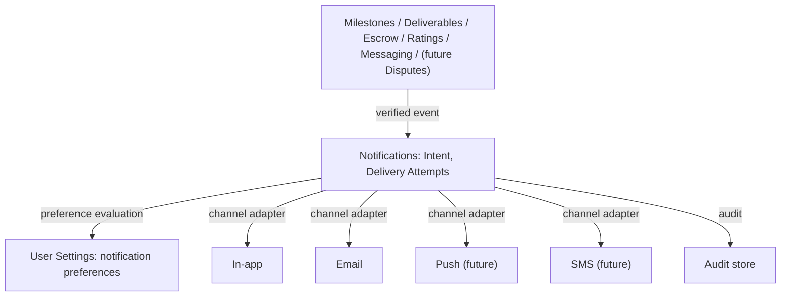
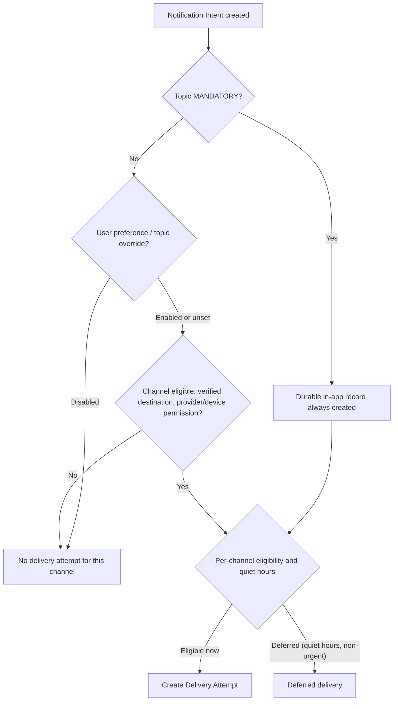
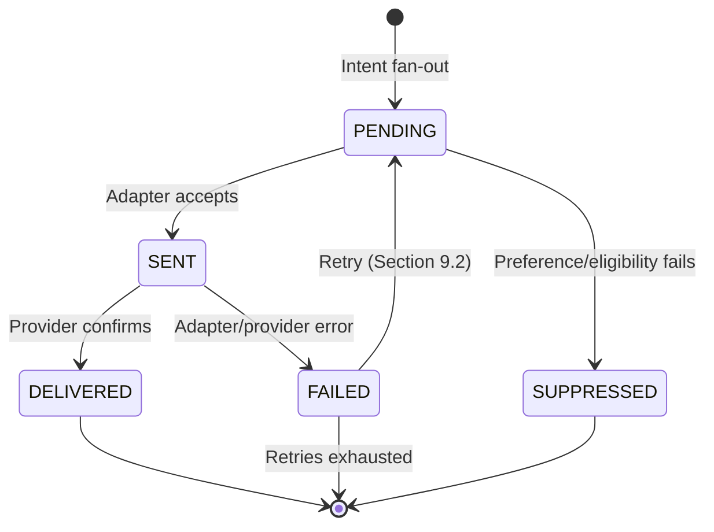
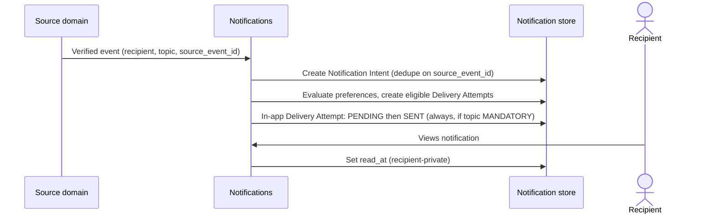
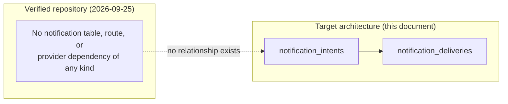
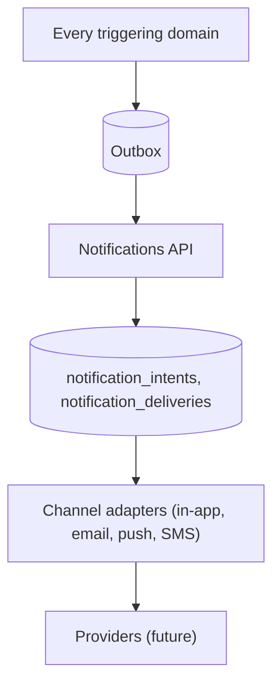

# Notifications domain specification

| Metadata | Value |
| --- | --- |
| Document ID | `SPEC-NOTIFICATIONS-000` (provisional; see Section 3) |
| Type | Specification (SPEC) |
| Domain | Notifications (governed `NOTIFICATIONS` token) |
| Status | Proposed |
| Version | 0.1.0 |
| Owner | Product and Architecture |
| Last Reviewed | 2026-09-25 |
| Applies To | Target Notifications product architecture and verified current repository comparison |
| Governed token | `NOTIFICATIONS` |
| Canonical path | `docs/10-notifications/notifications.md` |
| Product horizon | Target product architecture with verified repository comparison |
| Supersedes / Superseded By | None; formalizes [System Architecture Section 10.10](../01-foundation/system-architecture.md#1010-notifications) and becomes the canonical owner [User Settings Section 11](../03-identity-profiles-verification/user-settings.md#11-notification-preferences) explicitly named as the future source of truth for "final topic identifiers, defaults, mandatory-delivery classification, channel eligibility, and delivery behavior" |

## 1. Executive summary

Notifications distributes events other domains generate to the people who need to know about them, across whatever channels the platform supports, without ever deciding whether something notable happened. It formalizes what Foundation and User Settings both already anticipated but left undefined: the exact delivery model, the provider-neutral channel architecture, and the canonical event-to-notification and preference-evaluation contracts that every other domain document in this batch (Milestones, Deliverables, Escrow, Ratings, Messaging) already assumes exists.

Three decisions drive this specification. First, ownership: Governance already maps `10-notifications/` to the `NOTIFICATIONS` token (Governance Section 4, Section 11); this document is the first to occupy it, with no inherited identifier collision. Second, the delivery model: a Notification Intent (one per recipient per triggering event) fans out into one or more channel-specific Delivery Attempts, mirroring the provider-adapter pattern [Payments Section 8](../06-payments-escrow/payments.md#8-provider-adapter-architecture) already established for a different provider-neutral integration surface, so that adding a channel or a provider never changes the domains that trigger notifications. Third, preference boundaries: this document adopts [User Settings Section 11](../03-identity-profiles-verification/user-settings.md#11-notification-preferences)'s existing mandatory/configurable/marketing classification as canonical rather than re-deriving it, and extends its topic list to cover the events this batch's other specifications introduced (Buyer non-response intervention, Dispute lifecycle placeholders, Rating availability) that User Settings' own table did not yet enumerate.

The repository contains no Notifications structure of any kind: no table, route, email-sending dependency, or in-app notification UI exists anywhere in `backend/` or `frontend/`.

## 2. Purpose and scope

This document is canonical for:

- the Notification Intent and Delivery Attempt model, and the contract every other domain uses to trigger a notification;
- the provider-neutral channel architecture (in-app, email, push, SMS) and its adapter boundary;
- the canonical event-to-notification topic matrix, completing [User Settings Section 11](../03-identity-profiles-verification/user-settings.md#11-notification-preferences)'s deferred topic list;
- preference evaluation, mandatory-versus-configurable classification, and retry/deduplication/idempotency;
- Notifications' authorization, concurrency, target logical data, interfaces, events, operations, security findings, and migration guidance.

This document deliberately does not define Project, Milestone, Deliverable, Escrow, Payment, Rating, Messaging, or Dispute identity or lifecycle; it consumes their trusted events and does not decide whether one occurred. It does not define User Settings' own storage and resolution architecture ([user-settings.md](../03-identity-profiles-verification/user-settings.md)), only the notification-specific contract that document already deferred here. It does not select a payment, email, push, or SMS provider.

## 3. Governance, structure, status, and authority

### 3.1 Ownership analysis

1. **Does Governance define a Notifications domain and directory?** Yes. [Governance Section 4](../00-governance/README.md#4-directory-structure) maps `10-notifications/` to "Notification delivery and preferences," and [Governance Section 11](../00-governance/README.md#11-requirement-identifiers) lists `NOTIFICATIONS` as a permitted domain token. The directory was verified empty before this document was written.
2. **Does an identifier already exist under this token?** No, verified directly: a repository-wide search found zero `NOTIFICATIONS`-token identifiers anywhere in `docs/`. This document starts each family at `001`.
3. **Does Foundation already describe this domain?** Yes, at the architecture level only. [System Architecture Section 10.10](../01-foundation/system-architecture.md#1010-notifications) states Notifications' purpose ("distribute system events... does not create business events"), planned channels (email and in-app now, push and SMS "if adopted"), and non-repository-footprint status, but defines no field, table, or identifier.
4. **Does User Settings already anticipate this domain in detail?** Yes, more than any other adjacent document. [User Settings Section 11](../03-identity-profiles-verification/user-settings.md#11-notification-preferences) is an explicit "Proposed cross-domain integration contract for the future Notifications specification," including a full topic-by-channel matrix and evaluation-precedence rules, and states plainly that "Notifications remains the source of truth for final topic identifiers, defaults, mandatory-delivery classification, channel eligibility, and delivery behavior." This document is that specification and adopts User Settings' matrix as its own starting point (Section 8), extending it only where this batch's new specifications introduced topics User Settings could not have anticipated.

**Ownership decision:** Notifications is created at `docs/10-notifications/notifications.md` under the governed `NOTIFICATIONS` token. No Governance or Foundation change was required. The required glossary at `docs/99-appendices/glossary.md` does not exist (the directory itself is empty), so the local definitions in Section 4 are provisional pending that glossary, following the identical precedent [Milestones Section 3](../05-projects-milestones/milestones.md#3-governance-status-and-authority) already discloses.

### 3.2 Identifier ranges

No prior `NOTIFICATIONS`-token identifier exists anywhere in the specification tree (point 2 above). This document defines:

| Family | Range defined here | Governed |
| --- | --- | --- |
| `REQ-NOTIFICATIONS-*` | 001–010 | Yes, Governance Section 11 |
| `BR-NOTIFICATIONS-*` | 001–008 | Yes, Governance Section 11 |
| `SEC-NOTIFICATIONS-*` | 001–009 | Yes, Governance Section 11.1 |
| `DATA-NOTIFICATIONS-*` | 001–002 | Yes, Governance Section 11.1 |
| `INT-NOTIFICATIONS-*` | 001–005 | Yes, Governance Section 11.1 |
| `AUD-NOTIFICATIONS-*` | 001–002 | Yes, Governance Section 11.1 |
| `EVT-NOTIFICATIONS-*` | 001–003 | No; provisional |
| `OPS-NOTIFICATIONS-*` | 001–003 | No; provisional |
| `SPEC-NOTIFICATIONS-000` | Document ID | No; provisional |

### 3.3 Reconciliation items

| Item | Documents and sections | Finding | Treatment here |
| --- | --- | --- | --- |
| NR1 | System Architecture Section 10.10 | Notifications' ownership and "distribution, not creation" principle are described in prose only | Adopted exactly (Section 5); Notifications never creates a business event. |
| NR2 | User Settings Section 11 | A complete, detailed topic/channel/default/user-control matrix already exists, explicitly deferring final authority to this document | Adopted as this document's canonical starting matrix (Section 8.1), not re-derived from scratch; extended only for topics User Settings could not have anticipated. |
| NR3 | Milestones Section 25.4; Deliverables Section 20.2 | Both already list notification classes ("mandatory workflow," "mandatory financial," and so on) for their own events, assuming a Notifications specification exists | Confirmed consistent with, and folded into, this document's topic matrix (Section 8.1); no contradiction found. |
| NR4 | Milestones Section 18.2 (Buyer non-response and platform intervention) | This new Section (added 2026-09-25) introduces Review Overdue, intervention, and non-response-authorization notices that predate this document | Added as new topic rows (Section 8.1) since User Settings' matrix, written earlier, could not have included them. |
| NR5 | Ratings Section 17.3; Messaging Section 18.3 | Both already state notification classes for their own events, assuming this document exists | Confirmed consistent with, and folded into, this document's topic matrix (Section 8.1). |

The implementation labels in this document mean:

| Label | Meaning |
| --- | --- |
| Implemented | End-to-end behavior exists and was verified in the current repository. |
| Partially Implemented | Some executable path exists but one or more target guarantees are absent. |
| Schema Implemented | Database structure exists without the required executable domain behavior. |
| Planned | A repository artifact or existing specification declares intent but no complete behavior exists. |
| Not Implemented | No verified implementation was found. |

## 4. Terminology and domain boundaries

| Term | Local definition |
| --- | --- |
| Notification Intent | One record per recipient per triggering source event; the unit of "something to tell someone," independent of how many channels ultimately carry it. |
| Delivery Attempt | One channel-specific attempt to carry a Notification Intent to its recipient (in-app, email, push, or SMS), with its own status and retry history. |
| Topic | A named notification category (for example, "Milestone approved") governing mandatory/configurable classification and default channels, per Section 8.1. |
| Mandatory notice | A notice whose durable record and, per topic, minimum delivery a User preference cannot suppress, per [User Settings Section 11.2](../03-identity-profiles-verification/user-settings.md#112-rules). |
| Configurable notice | A notice a User may disable per [User Settings Section 11.1](../03-identity-profiles-verification/user-settings.md#111-notification-matrix)'s "User May Disable?" column. |
| Channel adapter | The provider-neutral interface a specific channel (email, push, SMS) implements, mirroring [Payments Section 8.1](../06-payments-escrow/payments.md#81-provider-neutral-contract)'s existing pattern. |

Ownership boundary, consistent with [System Architecture Section 10.10](../01-foundation/system-architecture.md#1010-notifications): Notifications owns event distribution and delivery mechanics only. It never decides whether a business event occurred, never owns the underlying domain fact, and never becomes authoritative for Project, Milestone, Escrow, Rating, Message, or Dispute state.

## 5. Canonical principles and architecture

1. Notifications consumes events; it never creates them. Every Notification Intent traces to exactly one verified source event from that event's owning domain.
2. Notifications is provider-neutral. Adding or replacing an email, push, or SMS provider never changes the domains that trigger notifications or the topic/preference contract.
3. A mandatory topic's durable record and, per its own classification, minimum delivery cannot be suppressed by a User preference (already established: [User Settings Section 11.2](../03-identity-profiles-verification/user-settings.md#112-rules)); this document does not reopen that rule, only implements it.
4. Delivery failure never rolls back, blocks, or reverses the triggering domain's own transaction; Notifications is always downstream of a committed fact.
5. A duplicate source-event delivery produces no duplicate Notification Intent.
6. Every Delivery Attempt is idempotent under a caller-supplied key or a natural uniqueness constraint.
7. Authorization is relationship-based: a notification is only ever deliverable to the account it concerns, and in-app notification read state is never exposed to another user.

*Figure 1 — Notifications Domain Architecture. Notifications consumes trusted events and fans them out through provider-neutral channel adapters; it never decides whether an event occurred.*

`REQ-NOTIFICATIONS-001`: Notifications MUST NOT create, infer, or fabricate a business event, MUST distribute only from a verified event supplied by that event's owning domain, and MUST NOT allow delivery failure to alter, block, or reverse the triggering domain's own transaction.

## 6. Delivery model

### 6.1 Notification Intent field matrix

| Field | Definition | Storage class | Mutability | Repository status |
| --- | --- | --- | --- | --- |
| `id` | Internal UUID primary key | Stored | Immutable | Not Implemented |
| `external_id` | Opaque, unique, externally addressable identifier | Stored | Immutable | Not Implemented |
| `recipient_user_id` | The account this notification concerns | Stored | Immutable | Not Implemented |
| `topic` | Named topic per Section 8.1 | Stored | Immutable | Not Implemented |
| `mandatory_class` | Snapshot of the topic's classification at creation time (`MANDATORY` or `CONFIGURABLE`), per Section 8.1 | Stored | Immutable | Not Implemented |
| `source_domain` / `source_event_id` | The owning domain and its unique event identifier | Stored | Immutable | Not Implemented |
| `dedupe_key` | Derived from `(recipient_user_id, topic, source_event_id)`; unique | Stored, unique | Immutable | Not Implemented |
| `template_reference` | The content template used to render the notice per channel | Stored | Immutable | Not Implemented |
| `created_at` | Server-assigned timestamp | Stored | Immutable | Not Implemented |

### 6.2 Delivery Attempt field matrix

| Field | Definition | Storage class | Mutability | Repository status |
| --- | --- | --- | --- | --- |
| `id` | Internal UUID primary key | Stored | Immutable | Not Implemented |
| `intent_id` | Owning Notification Intent | Stored | Immutable | Not Implemented |
| `channel` | `IN_APP`, `EMAIL`, `PUSH`, or `SMS` | Stored | Immutable | Not Implemented |
| `status` | `PENDING`, `SENT`, `DELIVERED`, `FAILED`, `SUPPRESSED` (Section 9) | Stored | Transition-guarded | Not Implemented |
| `provider_reference` | The channel provider's own delivery identifier, once sent | Stored | Set once | Not Implemented |
| `attempt_count` | Number of send attempts | Stored | Incremented on retry | Not Implemented |
| `last_attempted_at` / `next_retry_at` | Timestamps governing the retry schedule (Section 10) | Stored | Updated on each attempt | Not Implemented |
| `read_at` | For `IN_APP` only: when the recipient viewed it; always `NULL` for other channels | Stored | Set once, recipient-only | Not Implemented |
| `idempotency_key` | Caller/producer-supplied key bound to `(intent_id, channel)` | Stored, unique | Immutable | Not Implemented |

`REQ-NOTIFICATIONS-002`: A Notification Intent MUST be created at most once per `(recipient_user_id, topic, source_event_id)`, and every Delivery Attempt MUST be idempotent under its own key.

## 7. Channels

### 7.1 Channel matrix

| Channel | MVP support | Provider dependency verified in repository | Repository status |
| --- | --- | --- | --- |
| In-app | Target MVP, per [System Architecture Section 10.10](../01-foundation/system-architecture.md#1010-notifications) | None found; no in-app notification table or UI exists | Not Implemented |
| Email | Target MVP, per the same section | None found; no transactional-email dependency in `backend/package.json` | Not Implemented |
| Push | Future/conditional ("if adopted"), per the same section | None found | Not Implemented |
| SMS | Future/conditional, per [User Settings Section 11.1](../03-identity-profiles-verification/user-settings.md#111-notification-matrix) ("SMS" column exists but every row reads "No" or "Optional with separate consent") | None found | Not Implemented |

This document does not claim push or SMS as MVP-supported; both remain explicitly conditional on a future product and provider decision (Open Question EQ2, Section 21.3), consistent with Foundation's own "if adopted" framing.

### 7.2 Channel adapter contract

Each channel implements a provider-neutral adapter, mirroring [Payments Section 8.1](../06-payments-escrow/payments.md#81-provider-neutral-contract): `send(recipient destination, rendered content, idempotency key) -> provider reference or failure`. Notifications owns the Intent/Delivery model and template rendering; the adapter owns only provider transport. No domain that triggers a notification ever calls a channel adapter directly.

`REQ-NOTIFICATIONS-003`: Every channel MUST be implemented behind a provider-neutral adapter contract, and no domain other than Notifications MUST call a channel provider directly.

## 8. Event-to-notification topic matrix and preferences

### 8.1 Canonical topic matrix

This matrix adopts [User Settings Section 11.1](../03-identity-profiles-verification/user-settings.md#111-notification-matrix) as its base (rows marked "Adopted") and extends it with topics this specification batch introduced (rows marked "Added, 2026-09-25"), per `NR2`/`NR4`/`NR5` (Section 3.3).

| Topic | Source domain | In-App | Email | Push | SMS | User May Disable? | Default | Origin |
| --- | --- | --- | --- | --- | --- | --- | --- | --- |
| Security-critical account event | Authentication | Required | If verified | If enabled | If enabled/verified | Not all channels simultaneously | In-app + verified email | Adopted |
| Authentication informational alert | Authentication | Yes | If verified | If enabled | Optional | Policy constrained | In-app + verified email | Adopted |
| Project invitation/status | Projects | Yes | Optional | Optional | No | Yes, except actionable in-app record | In-app | Adopted |
| Project terms changed / locked / accepted | Projects, Milestones | Yes | Optional | Optional | No | Yes, except actionable in-app record | In-app | Added, 2026-09-25 |
| Milestone deadline/status | Milestones | Yes | Optional | Optional | No | Yes | In-app | Adopted |
| Milestone Review Overdue, platform intervention, non-response authorization | Milestones Section 18.2 | Required | If verified | Optional | Optional | Durable in-app record cannot be removed | In-app + verified email | Added, 2026-09-25 |
| Deliverable submitted / revision requested / resubmitted | Deliverables, Milestones | Yes | Optional | Optional | No | Yes | In-app | Added, 2026-09-25 |
| Escrow/payment transactional (funding required/confirmed, release, payout status, refund) | Escrow, Payments | Required | If verified | Optional | Optional | Delivery may be reduced, durable record cannot be removed | In-app + verified email | Adopted |
| Dispute opened / response required / resolved | Disputes (future; blocked pending Governance ownership decision, Section 22) | Required | If verified | Optional | Optional | Durable in-app record cannot be removed | In-app + verified email | Added, 2026-09-25 |
| New message | Messaging | Yes | Optional | Optional | No | Yes | In-app | Adopted |
| Rating available/requested, rating hidden/removed | Ratings | Optional / Required (removal is mandatory, per [Ratings Section 17.3](../08-ratings-reputation/ratings.md#173-notification-behavior)) | Optional | Optional | No | Yes, except removal notice | In-app | Added, 2026-09-25 |
| Verification decision/action required | Identity Verification | Required | If verified | Optional | Optional | Durable in-app record cannot be removed | In-app + verified email | Adopted |
| Marketplace recommendation | Marketplace | Optional | Optional | Optional | No | Yes | Off | Adopted |
| Product update/marketing | Platform | Optional | Optional | Optional | Optional with separate consent | Yes | Off | Adopted |
| Moderation/safety action | Moderation (future) | Required | If verified | Optional | Optional | Durable in-app record cannot be removed | In-app + verified email | Adopted |

`BR-NOTIFICATIONS-001`: Notifications MUST classify every topic as `MANDATORY` or `CONFIGURABLE` at Intent creation time from this matrix, and a `MANDATORY` topic's durable in-app record MUST NOT be removable by any User preference.

### 8.2 Preference evaluation

Preference evaluation follows the precedence [User Settings Section 11.2](../03-identity-profiles-verification/user-settings.md#112-rules) already establishes, which this document adopts and does not redefine: mandatory topic policy first; the constrained security-alert projection for security topics; a permitted per-topic override; global channel toggles and digest/quiet-hours controls; then this matrix's default. A channel is eligible only when its destination is verified and provider/device permission exists. Quiet hours defer non-urgent delivery in the User's effective time zone and never suppress security, safety, or time-critical transactional events.

*Figure 2 — Preference Evaluation Flow. A mandatory topic's durable in-app record is never suppressed; only channel-level delivery is subject to preference and eligibility.*

`REQ-NOTIFICATIONS-004`: Notifications MUST evaluate preference and channel eligibility per [User Settings Section 11.2](../03-identity-profiles-verification/user-settings.md#112-rules)'s precedence order, and disabling delivery on any channel MUST NOT disable the underlying business event or a mandatory topic's durable in-app record.

## 9. Delivery state and retry

### 9.1 Delivery-state matrix

| State | Meaning | Entered by | Repository status |
| --- | --- | --- | --- |
| `PENDING` | Delivery Attempt created, not yet sent to the channel adapter | Intent fan-out, preference evaluation passed | Not Implemented |
| `SENT` | The channel adapter accepted the attempt for transport | Adapter acknowledgment | Not Implemented |
| `DELIVERED` | The channel provider confirmed receipt (where the channel supports confirmation) | Provider webhook/callback, where available | Not Implemented |
| `FAILED` | The channel adapter or provider reported failure | Adapter/provider error | Not Implemented |
| `SUPPRESSED` | Preference or eligibility evaluation determined no attempt should be made | Preference evaluation (Section 8.2) | Not Implemented |

*Figure 3 — Delivery State Machine. A failed attempt retries within a bounded schedule; retries exhausted is a terminal, alertable state, never a silent drop.*

### 9.2 Retry matrix

| Concern | Rule | Repository status |
| --- | --- | --- |
| Retry trigger | A `FAILED` Delivery Attempt on a transient error class is retried on a bounded backoff schedule | Not Implemented |
| Retry bound | A configured maximum attempt count, not invented here (Open Question EQ3, Section 21.3) | Not Implemented |
| Non-retryable failure | A permanent error class (for example, an invalid destination) is not retried; the attempt is marked `FAILED` terminally and alerted | Not Implemented |
| Deduplication | A retried attempt reuses the original Delivery Attempt's idempotency key; it never creates a second Delivery Attempt for the same `(intent_id, channel)` | Not Implemented |
| Exhausted retries | Alerted through `OPS-NOTIFICATIONS-001`; the mandatory topic's durable in-app record, if any, is unaffected regardless of channel-delivery outcome | Not Implemented |

`REQ-NOTIFICATIONS-005`: A failed Delivery Attempt MUST retry only transient failure classes on a bounded, configured schedule, MUST NOT create a duplicate Delivery Attempt for the same `(intent_id, channel)`, and MUST alert on exhausted retries without altering a mandatory topic's durable in-app record.

## 10. In-app notifications

In-app notifications are the one channel every mandatory topic guarantees (Section 8.1). An in-app Delivery Attempt's `read_at` field is private to the recipient; it is never exposed to another user, mirroring the same read-state privacy principle [Messaging Section 14](../07-messaging-collaboration/messaging.md#14-read-state) already establishes for Message read state.

*Figure 4 — In-App Notification Flow. The in-app record for a mandatory topic is created regardless of other channel preferences; `read_at` remains private to the recipient.*

`BR-NOTIFICATIONS-002`: An in-app Delivery Attempt's `read_at` MUST be readable only by the recipient it belongs to, never by another user, a Moderator, or an Administrator without a separate, explicit product decision.

## 11. Authorization

### 11.1 Authorization matrix

| Action | Who | Additional condition | Repository status |
| --- | --- | --- | --- |
| Trigger a Notification Intent | Trusted producer identity (the owning domain) | Signed channel, verified event, version dedupe | Not Implemented |
| Read own in-app notifications | The recipient only | Live account status | Not Implemented |
| Mark own notification read | The recipient only | Live account status | Not Implemented |
| Read another user's notifications | No one, by default | No exception in MVP; a future support/administrative read is Open Question EQ5 | Not Implemented |
| Configure own notification preferences | The account owner, through User Settings | Delegated to [User Settings Section 11](../03-identity-profiles-verification/user-settings.md#11-notification-preferences); Notifications enforces, does not store, the preference itself | Not Implemented |
| Operate retry/reconciliation jobs | Service/System capability | Least-privilege, workload-authenticated | Not Implemented |

`REQ-NOTIFICATIONS-006`: A notification MUST be deliverable and readable only to the account it concerns, and MUST NOT be creatable by any caller other than a trusted, verified event producer.

## 12. Concurrency and idempotency

| Operation | Protection |
| --- | --- |
| Duplicate source event | `dedupe_key` unique on `(recipient_user_id, topic, source_event_id)`; a duplicate event acknowledges without creating a second Intent |
| Duplicate Delivery Attempt | Unique `(intent_id, channel)`; a retry reuses the same row |
| Concurrent preference change during fan-out | The fan-out transaction re-reads the live preference at evaluation time; a preference changed mid-fan-out affects only Delivery Attempts not yet created |
| Read-state race | `read_at` set is idempotent; a repeat set is a no-op |

`REQ-NOTIFICATIONS-007`: Every Notifications mutation MUST be idempotent under a caller-supplied key or a natural uniqueness constraint, and Intent creation MUST be deduplicated by source event before any Delivery Attempt is created.

## 13. Audit, events, and operations

### 13.1 Audit requirements

| Identifier | Requirement |
| --- | --- |
| `AUD-NOTIFICATIONS-001` | Record every Notification Intent creation and every Delivery Attempt's terminal state (`DELIVERED`, `FAILED` after exhausted retries, `SUPPRESSED`), with recipient, topic, channel, and timestamp. |
| `AUD-NOTIFICATIONS-002` | Record every read-state change distinctly, with recipient and timestamp; never with content exposed to any other party. |

### 13.2 Provisional events and operations

Governance defines no `EVT-*` or `OPS-*` family; the following are provisional pending a Governance amendment, following the precedent already disclosed in [Milestones Section 3](../05-projects-milestones/milestones.md#3-governance-status-and-authority), [Ratings Section 17.2](../08-ratings-reputation/ratings.md#172-provisional-events-and-operations), and [Messaging Section 18.2](../07-messaging-collaboration/messaging.md#182-provisional-events-and-operations).

| Provisional ID | Event/operation | Consumers |
| --- | --- | --- |
| `EVT-NOTIFICATIONS-001` | `NotificationDelivered` | Audit, source domain (optional receipt) |
| `EVT-NOTIFICATIONS-002` | `NotificationDeliveryFailed` (retries exhausted) | Operations, Audit |
| `EVT-NOTIFICATIONS-003` | `NotificationSuppressed` (preference/eligibility) | Audit |
| `OPS-NOTIFICATIONS-001` | Alert on exhausted-retry Delivery Attempts and provider-outage patterns | Operations |
| `OPS-NOTIFICATIONS-002` | Scheduled reconciliation of Delivery Attempt counts against source-domain event counts | Operations, Audit |
| `OPS-NOTIFICATIONS-003` | Stale idempotency-key and dedupe-key expiry job | Operations |

`REQ-NOTIFICATIONS-008`: Every Notifications mutation MUST produce redacted, immutable audit evidence, and a terminal delivery failure MUST be observable to Operations without exposing notification content to an unauthorized party.

## 14. Target data model

### 14.1 Target model matrix

| Identifier and model | Purpose and principal fields | Keys, uniqueness | Repository status |
| --- | --- | --- | --- |
| `DATA-NOTIFICATIONS-001` `notification_intents` | One row per recipient per triggering source event, per Section 6.1 | PK `id`; unique `external_id`; unique `dedupe_key`; FK `recipient_user_id` `RESTRICT` | Not Implemented |
| `DATA-NOTIFICATIONS-002` `notification_deliveries` | One row per channel-specific Delivery Attempt, per Section 6.2 | PK `id`; unique `(intent_id, channel)`; unique `idempotency_key`; FK `intent_id` `RESTRICT` | Not Implemented |

Two tables are sufficient: one per-recipient intent record and one per-channel delivery record. No separate template or preference table is created here; templates are a content-management concern outside this document's schema, and preferences remain owned by User Settings (`NR2`).

`REQ-NOTIFICATIONS-009`: The target Notifications schema MUST consist of the smallest normalized set of tables that separates the recipient-facing Intent from channel-specific Delivery Attempts, and MUST NOT require altering any triggering domain's own table.

`BR-NOTIFICATIONS-003`: Neither `notification_intents` nor `notification_deliveries` MUST be treated as authoritative for the underlying business fact; both are downstream projections of a source domain's own event.

## 15. Domain dependencies and interfaces

### 15.1 Domain dependency matrix

| Domain | Notifications depends on | Notifications provides | Failure behavior |
| --- | --- | --- | --- |
| Every triggering domain (Projects, Milestones, Deliverables, Escrow, Payments, Ratings, Messaging, future Disputes, Moderation, Verification) | Verified, uniquely identified events | Delivery of those events across eligible channels | Never invent an event from a missing source; hold and alert on malformed input |
| User Settings | Live preference read at evaluation time | Nothing directly; Notifications enforces, does not own, the preference | Default to the topic matrix's own default (Section 8.1) if the preference read fails, never to "always deliver everything" |
| Authorization | Relationship/role decisions for read/mark-read operations | Nothing; Authorization owns the decision framework only | Deny closed |

### 15.2 Interface identifiers

| Interface | Direction | Description | Repository status |
| --- | --- | --- | --- |
| `INT-NOTIFICATIONS-001` | Any domain → Notifications | Verified event submission (recipient, topic, source event ID) | Not Implemented |
| `INT-NOTIFICATIONS-002` | Notifications → User Settings | Live preference read at evaluation time | Not Implemented |
| `INT-NOTIFICATIONS-003` | Notifications → Channel adapter | Provider-neutral `send` contract (Section 7.2) | Not Implemented |
| `INT-NOTIFICATIONS-004` | Client → Notifications | Read/list own in-app notifications, mark read | Not Implemented |
| `INT-NOTIFICATIONS-005` | Notifications → Authorization | Relationship/role check for every read operation | Not Implemented |

## 16. Verified repository comparison

### 16.1 Review method

`backend/db/*.sql` (all eight migrations), `backend/Index.js` (all twelve routes), `frontend/src/App.tsx`, both `package.json` files, and the repository for any `tests` directory were searched directly, following the same method as [Deliverables Section 22.1](../05-projects-milestones/deliverables.md#221-review-method).

### 16.2 Findings

No migration defines a `notifications`, `notification_intents`, or `notification_deliveries` table, nor any related enum. `backend/Index.js`'s twelve routes contain no `notification` path, handler, or SQL statement. `backend/package.json` has no transactional-email, push, or SMS provider dependency (verified: only `bcryptjs`, `cors`, `dotenv`, `express`, `jsonwebtoken`, `pg`). `frontend/src/App.tsx` has no notification UI component.

### 16.3 Repository comparison matrix

| Capability | Verified artifact | Gap against target | Status |
| --- | --- | --- | --- |
| Notification Intent table | None | Full schema of Section 14 | Not Implemented |
| Delivery Attempt table | None | Full schema of Section 14 | Not Implemented |
| Channel adapters | None; no provider dependency of any kind | Full adapter contract of Section 7.2 | Not Implemented |
| API routes | None | Full route set implied by Sections 11, 14 | Not Implemented |
| Frontend | None | In-app notification UI | Not Implemented |
| Authorization | None | Section 11 | Not Implemented |
| Tests | None | Full suite of Section 18 | Not Implemented |

*Figure 5 — Repository vs. Target Architecture. The entire target schema and every channel adapter are new; nothing in the current repository is superseded because nothing exists.*

## 17. Security findings

| Finding | Severity | Verified condition or target threat | Impact | Required treatment | Disposition |
| --- | --- | --- | --- | --- | --- |
| `SEC-NOTIFICATIONS-001` No authorization surface exists | Critical | No route exists; a bare identifier is the only key design available once built | A notification could be read by an unrelated account once a route exists | Recipient-only authorization of Section 11 | Open |
| `SEC-NOTIFICATIONS-002` No trusted-producer verification exists | Critical | No event-ingestion logic exists | A forged event could trigger a fabricated notification once built without this control | Signed-channel, verified-event requirement of Section 5/11 | Open |
| `SEC-NOTIFICATIONS-003` No deduplication exists | High | No Intent table or dedupe-key column exists | A retried or reordered event could create duplicate notifications | `dedupe_key` uniqueness of Section 12 | Open |
| `SEC-NOTIFICATIONS-004` No mandatory-topic protection exists | High | No topic classification or enforcement logic exists | A preference bug could suppress a security-, safety-, or transaction-critical notice | Mandatory-classification enforcement of Section 8 | Open |
| `SEC-NOTIFICATIONS-005` No read-state privacy control exists | Medium | No `read_at` field or access check exists | A naive implementation could expose one user's read state to another | Recipient-only `read_at` of Section 10 | Open |
| `SEC-NOTIFICATIONS-006` No retry-bound protection exists | Medium | No retry logic exists | Unbounded retries could exhaust provider quota or create a notification storm | Bounded, configured retry schedule of Section 9.2 | Open |
| `SEC-NOTIFICATIONS-007` No sensitive-content bound on notification templates | Medium | No template model exists | A naive template could leak sensitive financial, verification, or dispute content into an insecure channel (for example, unencrypted SMS/push preview) | Channel-appropriate content minimization at template-design time | Open |
| `SEC-NOTIFICATIONS-008` No audit trail exists | High | No audit table or event exists | Unauthorized read, forged event, or silent suppression would be undetectable | `AUD-NOTIFICATIONS-001`/`002` of Section 13.1 | Open |
| `SEC-NOTIFICATIONS-009` No automated Notifications test coverage | High | No test file or directory exists | Authorization, deduplication, and mandatory-topic regressions would reach production undetected | Layered test suite of Section 18 | Open |

"Open" is a finding disposition (target-architecture risk given the current empty repository state), not an implementation-status label. Cross-domain findings that also apply: Authentication `SEC-AUTH-002`/`SEC-AUTH-005`, and every producing domain's own event-integrity findings (for example, Milestones' `SEC-PROJECTS-039` audit finding, which this document's Intent creation depends on).

## 18. Implementation status

| Target area | Status | Evidence | Next contract boundary |
| --- | --- | --- | --- |
| Notification Intent / Delivery Attempt model | Not Implemented | No table | Section 6 |
| Channel adapters | Not Implemented | No provider dependency | Section 7 |
| Topic matrix and preference evaluation | Not Implemented | No enforcement logic | Section 8 |
| Delivery state and retry | Not Implemented | No table | Section 9 |
| In-app notifications | Not Implemented | No UI | Section 10 |
| Authorization | Not Implemented | No route | Section 11 |
| Audit/events | Not Implemented | No audit table | Section 13 |
| Automated tests | Not Implemented | None | Section 18 (staged plan below) |

**Staged implementation plan** (documentation only; does not modify application code or migrations):

1. Notification Intent and Delivery Attempt schema (Section 14).
2. Trusted event-ingestion contract (`INT-NOTIFICATIONS-001`) with signed-channel verification.
3. Topic matrix enforcement and preference evaluation (Section 8), integrated with User Settings.
4. In-app channel adapter and read/mark-read routes (Section 10).
5. Email channel adapter, once a provider is selected (Open Question EQ1).
6. Retry and deduplication logic (Sections 9, 12).
7. Push and SMS channel adapters, if and when Product adopts them (Open Question EQ2).
8. Authorization: recipient-only read/mark-read enforcement (Section 11).
9. Audit/events (`AUD-NOTIFICATIONS-001`/`002`, provisional `EVT-NOTIFICATIONS-001`–`003`).
10. Operations: retry-exhaustion alerting, reconciliation job (`OPS-NOTIFICATIONS-001`/`002`).
11. Automated tests: authorization/IDOR, deduplication, mandatory-topic-suppression, retry, and read-state-privacy suites.

## 19. Future architecture

Notifications' future architecture consumes events through the same outbox/inbox pattern already established for Milestones, Deliverables, Escrow, and Ratings ([Ratings Section 23](../08-ratings-reputation/ratings.md#23-future-architecture)), deployable inside the same application or as a separate service without changing the event-ingestion or channel-adapter contracts of Sections 6 and 7. Future work includes: digest/batched delivery for high-frequency topics; user-configurable per-topic overrides beyond the global toggle already anticipated by User Settings; and push/SMS provider selection once Product adopts either channel.

*Figure 6 — Future Architecture. Notifications remains a downstream distribution layer, never a second authority for any triggering domain's facts.*

## 20. Risks, assumptions, and open questions

### 20.1 Risks

| Risk | Description |
| --- | --- |
| Notification storm | An unbounded or unretried failure loop, or a producing domain emitting duplicate events, could overwhelm a recipient or a provider |
| Mandatory-topic suppression bug | A preference-evaluation defect could silently suppress a security- or transaction-critical notice |
| Sensitive content leakage | A channel-inappropriate template (for example, financial detail in an SMS preview) could leak sensitive information |
| Provider outage | No fallback channel strategy exists yet if a single provider fails; treated as an implementation-time concern, not invented here |
| Missing tests | No automated coverage exists to catch regressions in any of the above once implementation begins |

### 20.2 Assumptions

- User Settings will, when implemented, expose a live preference read this document's evaluation step can call (Section 8.2); no other preference source is assumed.
- Every producing domain will emit a uniquely identified, verifiable event; this document does not itself verify domain-internal correctness, only event identity and producer trust.
- INR-only currency and monetary handling are not relevant to Notifications, which handles no money; noted only because [memory: MusicApp is locked to INR for launch] does not otherwise interact with this domain, except that a financial notice's rendered content will display INR amounts sourced from the triggering domain.

### 20.3 Prioritized open questions

| ID | Priority | Question | Why it blocks or risks | Decision owner | Affected contract |
| --- | --- | --- | --- | --- | --- |
| EQ1 | P0 | Which email provider will MusicApp integrate first? | The email channel adapter cannot be finalized without it | Product, Engineering | Section 7 |
| EQ2 | P1 | Will push and/or SMS be adopted for MVP, or remain future-only? | Determines whether their channel adapters are built now or deferred | Product | Section 7 |
| EQ3 | P1 | What is the exact retry schedule (attempt count, backoff) for a failed Delivery Attempt? | Section 9's product behavior is decided; the numbers are not | Product, Operations | Section 9.2 |
| EQ4 | P2 | Should digest/batched delivery be supported for high-frequency topics (for example, many Milestone updates in a short window)? | Affects notification volume and perceived noise | Product | Section 19 |
| EQ5 | P2 | Should a Support Operator or Administrator ever read another user's notification history for support purposes? | MVP denies this by default; a support workflow may need a narrow, audited exception | Product, Support | Section 11 |
| EQ6 | P2 | Which governed families should replace the provisional `EVT-NOTIFICATIONS-*` and `OPS-NOTIFICATIONS-*` identifiers used here? | Governance defines no such families yet; also open in Milestones (Question Q16), Deliverables (Question EQ9), Ratings (Question EQ8), and Messaging (Question EQ6) | Governance | Section 13.2 |

## 21. Traceability

### 21.1 Requirement traceability

| Requirement | Product outcome | Sections | Test focus |
| --- | --- | --- | --- |
| `REQ-NOTIFICATIONS-001` | Distribution-only, no fabricated events | 5 | Boundary tests |
| `REQ-NOTIFICATIONS-002` | Deduplicated Intent, idempotent Delivery Attempts | 6 | Uniqueness tests |
| `REQ-NOTIFICATIONS-003` | Provider-neutral channel adapters | 7 | Adapter-contract tests |
| `REQ-NOTIFICATIONS-004` | Correct preference precedence, mandatory-topic protection | 8 | Preference-evaluation tests |
| `REQ-NOTIFICATIONS-005` | Bounded, deduplicated retry | 9 | Retry tests |
| `REQ-NOTIFICATIONS-006` | Recipient-only deliverability and readability | 11 | Authorization tests |
| `REQ-NOTIFICATIONS-007` | Idempotent mutation, deduplicated Intent creation | 12 | Concurrency tests |
| `REQ-NOTIFICATIONS-008` | Synchronous audit, observable failure | 13 | Audit tests |
| `REQ-NOTIFICATIONS-009` | Smallest normalized target schema | 14 | Migration review |

### 21.2 Business rule traceability

| Rule | Statement | Rationale | Status | Sections |
| --- | --- | --- | --- | --- |
| `BR-NOTIFICATIONS-001` | Every topic MUST be classified `MANDATORY`/`CONFIGURABLE`, and a mandatory topic's durable in-app record MUST NOT be removable by preference. | Preserves transaction-critical communication against convenience settings. | Not Implemented | 8.1 |
| `BR-NOTIFICATIONS-002` | In-app `read_at` MUST be recipient-private. | Prevents unintended read-receipt exposure. | Not Implemented | 10 |
| `BR-NOTIFICATIONS-003` | Notification tables MUST NOT be treated as authoritative for the underlying business fact. | Preserves single source of truth per Governance Section 12. | Not Implemented | 14 |

### 21.3 Family range summary

| Family | Range in this document |
| --- | --- |
| `REQ-NOTIFICATIONS-*` | 001–009 |
| `BR-NOTIFICATIONS-*` | 001–003 |
| `SEC-NOTIFICATIONS-*` | 001–009 |
| `DATA-NOTIFICATIONS-*` | 001–002 |
| `INT-NOTIFICATIONS-*` | 001–005 |
| `AUD-NOTIFICATIONS-*` | 001–002 |
| `EVT-NOTIFICATIONS-*` (provisional) | 001–003 |
| `OPS-NOTIFICATIONS-*` (provisional) | 001–003 |

## 22. Validation record

This document was validated against Governance's structural requirements before commit: exactly one H1; sequential, non-skipping H2/H3 numbering; Status Proposed and Version 0.1.0 stated once in the metadata table and not contradicted elsewhere; no placeholder or "TBD" content; all required tables (event-to-notification matrix, field matrices, channel matrix, preference matrix, delivery-state matrix, retry matrix, authorization matrix, domain dependency matrix, repository comparison, implementation status, security findings, open questions) present and substantive; all required Mermaid diagram categories present (domain architecture, event/preference evaluation, delivery sequence, retry state machine, in-app notification, repository vs. target, future architecture) with balanced fences; relative links resolve to sections that exist in their target documents, including forward references into Ratings and Messaging sections verified to exist; identifiers verified unique across the complete specification tree with zero collisions (Section 3.2, no prior `NOTIFICATIONS`-token identifier existed); repository claims are evidence-based per Section 16; target behavior is never mislabeled as implemented; Notifications never becomes authoritative for any triggering domain's state throughout (Sections 5, 14); no trailing whitespace or tabs were introduced.

Note (Governance Section 21): this document links forward into Milestones Section 18.2 (Proposed), Ratings Section 17.3 (Proposed), and Messaging Section 18.3 (Proposed) as already-authoritative sources for their own topics' notification classes; each target document's own Draft/Proposed status is unaffected and is noted inline where cited, per Governance Section 21's requirement not to cite a Draft-status document as if it were authoritative without noting its status — all three are Proposed, not Draft, and are cited accordingly.

## 23. Version history

| Version | Date | Change | Author |
| --- | --- | --- | --- |
| 0.1.0 | 2026-09-25 | Initial canonical Notifications domain specification: ownership resolved to the `NOTIFICATIONS` token under `docs/10-notifications/`, verified empty and identifier-collision-free before authoring; adopted User Settings Section 11's existing topic/preference contract as canonical and extended it with topics this specification batch introduced (Buyer non-response intervention, Dispute placeholders, Rating availability); Notification Intent / Delivery Attempt delivery model; provider-neutral channel adapter architecture covering in-app and email as MVP-target channels with push/SMS explicitly conditional; preference evaluation, retry, deduplication, and in-app read-state privacy; authorization, concurrency, audit, target data model, security findings, and staged implementation plan. | Product and Architecture |
