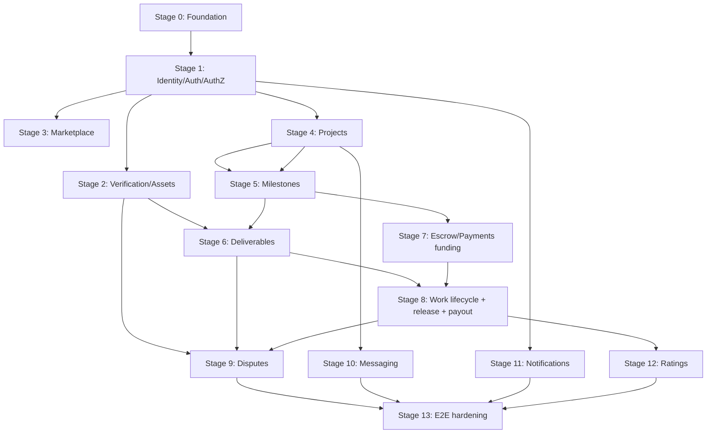

# MusicApp MVP implementation plan

| Metadata | Value |
| --- | --- |
| Document ID | `MVP-PLAN-000` (provisional; planning IDs are a non-governed family, Section 2) |
| Type | Reference (REF) — implementation planning, not a requirement specification |
| Status | Proposed |
| Version | 0.2.2 |
| Owner | Product and Architecture |
| Last Reviewed | 2026-09-26 |
| Applies To | Converting the approved MusicApp domain specifications into an executable, dependency-ordered, issue-decomposable build sequence |
| Canonical path | `docs/19-implementation-planning/mvp-implementation-plan.md` |
| Supersedes / Superseded By | None; this is the first implementation-planning document, created after the [specification consistency audit](../00-governance/specification-consistency-audit.md#15-readiness-gate-determination) determined **PASS** on the MVP implementation-planning readiness gate |

## 1. Purpose

This document converts the approved and Proposed MusicApp domain specifications (`docs/01-foundation/` through `docs/10-notifications/`) into a dependency-ordered build sequence: discrete, independently reviewable work items, a critical path, parallelizable work, and an explicit acceptance target — the first complete MVP transaction. It does not change application code, and it does not invent product behavior; every work item cites the specification section(s) it implements. Where a specification leaves a decision open (an Open Question), this plan says so explicitly and classifies the affected work item accordingly (Section 7) rather than guessing.

This document does not implement anything. It does not create GitHub Issues. It is the plan those issues will be generated from.

## 2. Source of truth and identifier conventions

Per [`AGENTS.md`](../../AGENTS.md), the source-of-truth order for any implementation decision is: (1) Governance, (2) the canonical domain specifications, (3) this implementation plan, (4) an issue's own acceptance criteria, (5) the current repository. Repository code is evidence of current state, never authority over target behavior.

Planning identifiers use the family `MVP-NNN`, sequential across this entire document, deliberately separate from every governed `REQ-*`/`BR-*`/etc. family — per the task's own instruction, this plan does not introduce a new requirement-domain token merely for planning. `MVP-NNN` carries no Governance weight and is not cited by any domain specification.

## 3. The first complete MVP transaction

Reconciled against the exact governed sequence in [Projects](../05-projects-milestones/projects.md), [Milestones](../05-projects-milestones/milestones.md), [Deliverables](../05-projects-milestones/deliverables.md), [Escrow](../06-payments-escrow/escrow.md), and [Disputes](../09-moderation-trust-safety/disputes.md), rather than a generic sketch:

1. A Buyer and a Seller each hold a live, active account (Users, Authentication) and a discoverable Profile (Profiles, Marketplace).
2. The Buyer creates a Draft Project naming the Seller and defines one or more Milestones with working commercial terms ([Projects Section 7](../05-projects-milestones/projects.md#7-project-creation), [Milestones Section 7](../05-projects-milestones/milestones.md#7-milestone-creation)).
3. The Buyer offers the proposal; Projects and Milestones freeze a snapshot ([Projects Section 11.3](../05-projects-milestones/projects.md#113-project-transition-matrix), [Milestones Section 10](../05-projects-milestones/milestones.md#10-milestone-locking)).
4. The Seller accepts; the snapshot becomes the agreed term version — terms are now bilateral and locked except through an accepted amendment.
5. The Buyer funds the Project; Escrow creates allocations per Milestone ([Escrow Section 8](../06-payments-escrow/escrow.md#8-funding-model)).
6. The first Milestone enters `funded`, then `in_progress` on an explicit Seller start command ([Milestones Section 13](../05-projects-milestones/milestones.md#13-milestone-activation-and-order), Section 15).
7. The Seller submits a Deliverable; the Milestone enters `delivered` ([Deliverables Section 7](../05-projects-milestones/deliverables.md#7-submission-model), Milestones M05).
8. The Buyer approves, or requests a revision within the agreed `revision_allowance` ([Milestones Section 17](../05-projects-milestones/milestones.md#17-revision-cycles)–18). If the Buyer does not respond within the configured review period, platform intervention runs and may issue a non-response release authorization, never automatic approval ([Milestones Section 18.2](../05-projects-milestones/milestones.md#182-buyer-non-response-and-platform-intervention)).
9. Either party may open a Dispute at any eligible point instead of, or after, approval ([Disputes Sections 8](../09-moderation-trust-safety/disputes.md#8-dispute-eligibility)–15); a Dispute freezes only its own scope and resolves in an immutable instruction Escrow executes.
10. Escrow releases the Milestone's earned funds against the approval (ordinary or non-response) or the Dispute's resolution instruction ([Escrow Section 14](../06-payments-escrow/escrow.md#14-release), Section 17).
11. Payments executes the Seller payout against its own gate ([payments.md Section 11](../06-payments-escrow/payments.md#11-payouts)); planned as `MVP-052`, distinct from Escrow release (`MVP-028`) and from provider funding.
12. Once every required Milestone reaches a terminal, settled outcome, Projects converges toward Completed, gated additionally by Ratings' own eligibility fact — Buyer rates Seller, Seller rates Buyer, or each direction resolves by a configured waiver timeout, never blocking financial completion ([Ratings Section 11](../08-ratings-reputation/ratings.md#11-ratings-pending-and-project-completion)).
13. The Project reaches Completed.

Messaging (evidence and collaboration) and Notifications (event distribution) run alongside every step above without gating any of them.

## 4. Build order: dependency-driven stages

Stages are ordered by actual specification dependency, not document order, following the task's own suggested skeleton where dependency analysis agrees with it (it does, for every stage below).

| Stage | Name | Depends on | Parallelizable with |
| --- | --- | --- | --- |
| 0 | Repository/engineering foundation | None | — |
| 1 | Identity/Auth/Authorization/Profile foundations | Stage 0 | — |
| 2 | Verification/Assets prerequisites | Stage 1 | Stage 3 |
| 3 | Marketplace/discovery hardening | Stage 1 | Stage 2 |
| 4 | Project negotiation and commercial snapshots | Stage 1 | — |
| 5 | Milestones | Stage 4 | — |
| 6 | Deliverables/revisions/review | Stage 2, Stage 5 | — |
| 7 | Escrow/Payments funding | Stage 4, Stage 5 | Stage 6 (after Stage 5) |
| 8 | Work lifecycle, release, and payout | Stage 6, Stage 7 | — |
| 9 | Disputes | Stage 2, Stage 6, Stage 8 | Stage 10, Stage 11 |
| 10 | Messaging | Stage 4 | Stage 6–9 |
| 11 | Notifications | Stage 1 (minimally); richer after Stage 5, 8 | Stage 6–10 |
| 12 | Ratings/Reputation | Stage 8 | Stage 9–11 |
| 13 | End-to-end transaction hardening | All prior stages | — |

*Figure 1 — Stage Dependency Graph. Stages 2/3, 6–9 (once Stage 5 lands), and 9–11 branch in parallel; Stage 13 is the single convergence point before the vertical-slice checkpoint (Section 9).*

The stage graph summarizes; the item-level `Depends on` column in Section 5 is authoritative. Two items depend on a later stage's item and are sequenced after it rather than with their own stage: `MVP-009` (Stage 1) waits for the email channel adapter `MVP-043` (Stage 11), and `MVP-023` (Stage 6) waits for the in-app notification channel `MVP-041` (Stage 11). Neither creates an item-level cycle. `MVP-052` (Seller payout, Stage 8) was added after the original sequence and keeps its next sequential ID rather than renumbering; it also depends directly on `MVP-003` (Stage 0) and `MVP-012` (Stage 2).

## 5. Work items

Every item states: objective, source specification(s) and the requirement/business-rule identifiers it implements, dependencies (other `MVP-*` IDs), repository areas and the schema/backend/frontend/authorization/audit work it requires, its test focus and acceptance criteria, its autonomous-implementation classification (Section 7), and any blocking product decision. "Repo areas" cites current `backend/`/`frontend/` file names where a legacy artifact already exists, and target module paths otherwise (per System Architecture's own target module-separation intent, Section 5 of that document).

### Stage 0 — Repository and engineering foundation

| ID | Title | Objective | Source | Depends on | Work | Tests / acceptance | Classification | Blocking decision |
| --- | --- | --- | --- | --- | --- | --- | --- | --- |
| MVP-001 | Backend module decomposition scaffold | Split `backend/Index.js` into per-domain route/service/repository modules without changing behavior | [System Architecture Section 5](../01-foundation/system-architecture.md#5-current-code-organization-vs-the-modularity-principle) | None | Backend: create `backend/src/{domain}/{routes,service,repository}.js` per existing domain (auth, users, profiles, projects, milestones); move existing routes with no behavior change | Every existing route's existing behavior unchanged, verified by a request/response snapshot before and after | AUTONOMOUS-READY | None |
| MVP-002 | Automated test harness | Replace the placeholder backend `test` script and add a real runner; add a frontend test runner | [System Architecture Section 14](../01-foundation/system-architecture.md#14-non-functional-and-operational-gaps) | None | Backend: test runner + DB fixture/teardown helper; Frontend: component test runner | CI runs and passes an initial smoke suite covering every currently-Implemented route | AUTONOMOUS-READY | None |
| MVP-003 | Shared idempotency/outbox/inbox infrastructure | Build the shared idempotency-key store, transactional outbox, and inbox-dedupe tables every domain's own spec assumes | [Projects Section 26](../05-projects-milestones/projects.md#26-target-data-model), [Milestones Section 24](../05-projects-milestones/milestones.md#24-concurrency-and-idempotency), [Escrow Section 22](../06-payments-escrow/escrow.md#22-idempotency-and-concurrency) | MVP-001 | Schema: `idempotency_keys`, `outbox_messages`, `inbox_events`; Backend: generic outbox-publish and inbox-consume helpers | Duplicate request with same key returns original result; duplicate inbound event is a no-op; property test for both | AUTONOMOUS-READY | None |
| MVP-004 | CI pipeline | Lint, test, and migration-check gate on every PR | Governance Section 25 (PR review requirements) | MVP-002 | `.github/workflows/ci.yml`: lint, backend test, frontend test, migration dry-run | A failing test blocks merge; a passing PR shows green CI | AUTONOMOUS-READY | None |

### Stage 1 — Identity, Authentication, Authorization, Profile foundations

| ID | Title | Objective | Source | Depends on | Work | Tests / acceptance | Classification | Blocking decision |
| --- | --- | --- | --- | --- | --- | --- | --- | --- |
| MVP-005 | Resolve SEC-001 (legacy direct-creation routes) | Remove, gate, or formally document `POST /users` and `POST /profiles` as internal-only | [Product Overview Section 13.4](../01-foundation/product-overview.md#134-identified-risk-unauthenticated-direct-creation-routes), `SEC-001` | MVP-001 | Backend: remove or `requireAuth`+admin-gate both routes, per the decision | Neither route is reachable by an unauthenticated, non-admin client after the fix | HUMAN-DECISION-REQUIRED | Product/Security must choose remove vs. gate vs. document-as-internal (Foundation's own Open Question, unresolved) |
| MVP-006 | Live account-status re-check middleware | Every protected route re-verifies `user_status = active` at request time, not only at token issuance | `SEC-AUTH-002` (authentication.md) | MVP-001 | Backend: `requireLiveStatus` middleware applied to every authenticated route | A suspended/deleted account's existing valid JWT is rejected on the next request | AUTONOMOUS-READY | None |
| MVP-007 | Centralized Authorization decision function | Replace inline relationship/state checks with one `authorize(actor, action, resource)` function per [Authorization Section 10.1](../02-users-roles-permissions/authorization.md#101-canonical-evaluation-order) | authorization.md | MVP-001, MVP-006 | Backend: `authorize()` module; migrate the five existing inline checks (`SEC-AUTHZ-004`) to call it | Every existing protected route's behavior is unchanged; a new unit test suite covers allow/deny for each existing rule | AUTONOMOUS-READY | None |
| MVP-008 | Roles/permissions schema and role-assignment service | Persist Moderator/Administrator/System roles and their assignment, per [Roles Section 7](../02-users-roles-permissions/roles.md#7-platform-roles) | roles.md | MVP-007 | Schema: `platform_roles`, `role_assignments`; Backend: assignment/revocation service, audited | A granted role is enforced by `authorize()`; a revoked role is denied on the next request | HUMAN-DECISION-REQUIRED (the bootstrap decision is open; the schema and ordinary assignment need no decision and can begin) | The very first Administrator's bootstrap mechanism is an open question ([Roles Section 30](../02-users-roles-permissions/roles.md#30-open-questions)) — every subsequent assignment is not |
| MVP-009 | Password reset and email verification | Implement the two Planned Authentication flows | [Authentication Section 15](../02-users-roles-permissions/authentication.md#15-email-verification) (email verification, `REQ-AUTH-008`) and [Section 16](../02-users-roles-permissions/authentication.md#16-password-reset-and-recovery) (password reset, `REQ-AUTH-006`) | MVP-006, external email provider (MVP-043) | Backend: reset-token flow, verification-token flow; Frontend: corresponding screens | A user can reset a forgotten password and verify an email end-to-end | EXTERNAL-DEPENDENCY | Requires the email provider selected in Notifications' own Open Question EQ1 |

### Stage 2 — Verification and Assets prerequisites

| ID | Title | Objective | Source | Depends on | Work | Tests / acceptance | Classification | Blocking decision |
| --- | --- | --- | --- | --- | --- | --- | --- | --- |
| MVP-010 | Asset ingest and storage core | Build upload session, storage-adapter interface, variant/derivative pipeline | [Assets Sections 11](../03-identity-profiles-verification/assets-and-media.md#11-upload-architecture)–14 | MVP-007 | Schema: `assets`, `asset_versions`; Backend: upload session, storage-adapter interface (provider-neutral) | An uploaded file becomes a `Ready` Asset version after scan/validation, verified in a test using a local/mock storage adapter | EXTERNAL-DEPENDENCY (a real cloud storage provider; the core model and adapter interface need none, and the acceptance test uses a local/mock adapter) | No storage provider is selected anywhere in the specification tree |
| MVP-011 | Asset retention, hold, and deletion engine | Implement the hold mechanism (dispute/financial/legal/moderation), soft-delete, and orphan detection | [Assets Sections 18](../03-identity-profiles-verification/assets-and-media.md#18-retention-archival-restoration-and-deletion)–18.4 | MVP-010 | Backend: hold create/release service, deletion worker, orphan-detection job | A held Asset cannot be physically deleted while any hold is active; releasing all holds allows deletion | AUTONOMOUS-READY | None |
| MVP-012 | Identity Verification routes | Expose `profile_verifications`/`verification_documents` with a review workflow | verification.md | MVP-008, MVP-010 | Backend: submit-verification, review (Administrator), decision routes | A submitted verification reaches `approved`/`rejected` only through an Administrator action, fully audited | AUTONOMOUS-READY | None |

### Stage 3 — Marketplace prerequisites

| ID | Title | Objective | Source | Depends on | Work | Tests / acceptance | Classification | Blocking decision |
| --- | --- | --- | --- | --- | --- | --- | --- | --- |
| MVP-013 | Server-side profile search | Replace the 100-row client-side-only search with a real query | [System Architecture Section 10.4](../01-foundation/system-architecture.md#104-marketplace) | MVP-007 | Backend: query params on `GET /profiles` (name/handle/genre/city/country); Frontend: wire to existing search UI | A search beyond the first 100 profiles returns correct results | AUTONOMOUS-READY | None |

### Stage 4 — Project negotiation and commercial snapshots

| ID | Title | Objective | Source | Depends on | Work | Tests / acceptance | Classification | Blocking decision |
| --- | --- | --- | --- | --- | --- | --- | --- | --- |
| MVP-014 | Project participant and invitation model | Buyer/invited-Seller relationship, invitation lifecycle | [Projects Sections 6](../05-projects-milestones/projects.md#6-project-participants)–8 | MVP-007 | Schema: `project_participants`, `project_invitations`; Backend: invite/accept/decline/withdraw routes | An invitation reaches exactly one of Accepted/Declined/Withdrawn/Expired, each idempotent | AUTONOMOUS-READY | None |
| MVP-015 | Project state machine and term-version snapshots | Draft → Proposed → Accepted → ... per [Projects Section 10](../05-projects-milestones/projects.md#10-project-states)–11 | projects.md | MVP-014 | Schema: `project_term_versions`; Backend: transition service enforcing Section 11.3's matrix exactly | Every listed transition succeeds; every unlisted edge returns a safe `409` | AUTONOMOUS-READY | None |
| MVP-016 | Project amendment mechanism | Post-acceptance bilateral change per [Projects Section 15](../05-projects-milestones/projects.md#15-scope-changes-and-amendments) | projects.md | MVP-015 | Backend: propose/accept/reject/withdraw/expire amendment service | An accepted amendment atomically writes a new term version; a rejected one changes nothing | AUTONOMOUS-READY | None |

### Stage 5 — Milestones

| ID | Title | Objective | Source | Depends on | Work | Tests / acceptance | Classification | Blocking decision |
| --- | --- | --- | --- | --- | --- | --- | --- | --- |
| MVP-017 | Milestone term-version model | Draft/frozen/agreed commercial snapshots per [Milestones Section 9](../05-projects-milestones/milestones.md#9-milestone-commercial-terms)–10 | milestones.md | MVP-015 | Schema: `milestone_term_versions`; migrate `project_milestones` per Section 26.2 | Freeze and agree each capture an immutable snapshot; no frozen/agreed row is ever mutated | AUTONOMOUS-READY | None |
| MVP-018 | Milestone state machine and transitions (M01–M17) | Server-owned deterministic transitions per [Milestones Section 11](../05-projects-milestones/milestones.md#11-milestone-states)–12 | milestones.md | MVP-017 | Schema: `milestone_state_transitions`; Backend: transition service | Every M01–M17 edge succeeds under its stated precondition; every unlisted edge is rejected | AUTONOMOUS-READY | None |
| MVP-019 | Milestone activation and sequencing | Strictly sequential MVP activation per [Milestones Section 13](../05-projects-milestones/milestones.md#13-milestone-activation-and-order) | milestones.md | MVP-018 | Backend: activation-predicate check on the start command | A Milestone cannot start while a predecessor is unresolved or another is active | AUTONOMOUS-READY | None |

### Stage 6 — Deliverables, revisions, review

| ID | Title | Objective | Source | Depends on | Work | Tests / acceptance | Classification | Blocking decision |
| --- | --- | --- | --- | --- | --- | --- | --- | --- |
| MVP-020 | Deliverable and Submission model | 1:1 Deliverable, immutable Submission stream, Asset binding per [Deliverables Sections 6](../05-projects-milestones/deliverables.md#6-deliverable-identity-and-aggregate-model)–8 | deliverables.md | MVP-011, MVP-019 | Schema: `deliverables`, `deliverable_submissions`, `deliverable_submission_assets`; Backend: submit route | A Submission requires exactly the agreed `submission_requirements`; resubmission strictly increments version | AUTONOMOUS-READY | None |
| MVP-021 | Submission-to-Milestone readiness integration | Emit the readiness fact that transitions `in_progress` → `delivered` (M05) | [Deliverables Section 13](../05-projects-milestones/deliverables.md#13-milestone-integration) | MVP-020 | Backend: fact emission + Milestone consumer | A ready Submission reliably transitions the Milestone; a not-ready one does not | AUTONOMOUS-READY | None |
| MVP-022 | Revision requests and Buyer approval | `milestone_revision_requests`/`milestone_approvals` per [Milestones Sections 17](../05-projects-milestones/milestones.md#17-revision-cycles)–18 | milestones.md, deliverables.md | MVP-021 | Schema: `milestone_revision_requests`, `milestone_approvals`; Backend: request-revision (M06), approve (M07) routes | A revision request is rejected once `revision_count = revision_allowance`; approval names the exact latest Submission | AUTONOMOUS-READY | None |
| MVP-023 | Buyer non-response intervention (M18) | Review-overdue sweep, platform contact attempts, non-response release authorization per [Milestones Section 18.2](../05-projects-milestones/milestones.md#182-buyer-non-response-and-platform-intervention) | milestones.md | MVP-022, MVP-041 (in-app notification) | Schema: `milestone_platform_release_authorizations`; Backend: scheduled sweep, `milestone.authorize_non_response_release` capability | A `delivered` Milestone with no Buyer decision becomes Review Overdue after the configured period and, once intervention is exhausted, is authorized for release, distinctly audited from an ordinary approval | AUTONOMOUS-READY | Exact review-period/contact-attempt durations remain configuration (Question Q18) and do not block building the mechanism |

### Stage 7 — Escrow and Payments funding

| ID | Title | Objective | Source | Depends on | Work | Tests / acceptance | Classification | Blocking decision |
| --- | --- | --- | --- | --- | --- | --- | --- | --- |
| MVP-024 | Escrow and allocation schema, funding-intent flow | Create Escrow/allocation on agreement; accept a funding intent per [Escrow Sections 7](../06-payments-escrow/escrow.md#7-currency-and-money-representation)–9 | escrow.md | MVP-017 | Schema: harden `escrows`/`escrow_allocations` per Section 24; Backend: funding-intent route | An agreed Project's Escrow and per-Milestone allocations exist with equal amount/currency to the agreed terms | AUTONOMOUS-READY | None |
| MVP-025 | Payment provider adapter interface | Provider-neutral funding/webhook/payout contract per [Payments Section 8](../06-payments-escrow/payments.md#8-provider-adapter-architecture) | payments.md | MVP-024 | Backend: adapter interface, a mock/test provider implementation | The mock provider can complete a funding confirmation end-to-end in tests | EXTERNAL-DEPENDENCY (a real payment provider; the interface and mock provider need none, and the acceptance test uses the mock) | No payment provider is selected (Escrow Question EQ13) |
| MVP-026 | Ledger posting engine | Append-only balanced journal per [Escrow Section 13](../06-payments-escrow/escrow.md#13-ledger-architecture) | escrow.md | MVP-024 | Schema: harden `escrow_ledger` with an append-only trigger; Backend: journal-posting service | Every posted journal balances; an `UPDATE`/`DELETE` attempt on `escrow_ledger` is rejected at the database level | AUTONOMOUS-READY | None |
| MVP-027 | Fee schedule mechanism | Versioned fee-schedule snapshot architecture per [Escrow Section 19](../06-payments-escrow/escrow.md#19-fees-commission-tax-and-rounding) | escrow.md | MVP-026 | Schema: `fee_schedules`; Backend: snapshot-at-funding logic | A funded Escrow references an immutable fee-schedule snapshot | HUMAN-DECISION-REQUIRED | Fee kinds and rates are not established anywhere (Escrow Question EQ1); building the mechanism without real rates risks shipping a misleading zero-fee default |

### Stage 8 — Work lifecycle, release, and payout

| ID | Title | Objective | Source | Depends on | Work | Tests / acceptance | Classification | Blocking decision |
| --- | --- | --- | --- | --- | --- | --- | --- | --- |
| MVP-028 | Release eligibility and execution | Release on a verified approval-for-release fact per [Escrow Sections 14](../06-payments-escrow/escrow.md#14-release) | escrow.md | MVP-022, MVP-023, MVP-026 | Backend: release-eligibility evaluator, release journal | Approval (ordinary or non-response) reliably produces a release journal once the payout gate passes; a blocked gate produces Release Pending, not a false release | AUTONOMOUS-READY | None |
| MVP-029 | Refund execution | Refund from an authorized instruction per [Escrow Section 15](../06-payments-escrow/escrow.md#15-refunds) | escrow.md | MVP-026 | Backend: refund-instruction consumer, refund journal | Cumulative refunds never exceed captured funding | AUTONOMOUS-READY | None |
| MVP-030 | Cancellation financial outcomes | Implement [Escrow Section 16](../06-payments-escrow/escrow.md#16-cancellation-financial-outcomes)'s matrix | escrow.md, projects.md, milestones.md | MVP-028, MVP-029 | Backend: cancellation-outcome service covering every row of the matrix | Every scenario in the matrix except the partial-performance-compensation row produces the documented outcome end-to-end | HUMAN-DECISION-REQUIRED (the work covers every matrix row, including the undecided compensation row; every other row needs no decision) | Compensation for partial performance on a funded-but-cancelled Project is not established (Escrow Question EQ3); only that specific branch is blocked |
| MVP-052 | Seller payout execution | Execute the Seller payout of released entitlement as a Payments operation distinct from Escrow release and from provider funding, per [Payments Section 11](../06-payments-escrow/payments.md#11-payouts) and [Section 12](../06-payments-escrow/payments.md#12-refund-and-payout-authorization-boundary) | payments.md (Sections 11, 12, 14, 15, 16, 17), escrow.md (Sections 13, 14, 20) | MVP-003, MVP-012, MVP-025, MVP-028 | Schema: `payout_accounts` (`DATA-ESCROW-010`) and the `payout` Payment type where not already present; Backend: Seller payout-account registration and update with re-verification on change (`INT-ESCROW-016`, `BR-ESCROW-048`); execute-payout-instruction (`INT-ESCROW-015`) accepting only a valid, unconsumed Escrow payout instruction (`REQ-ESCROW-029`); live payout-gate re-check immediately before initiation — account status and Identity Verified (`REQ-ESCROW-028`, `BR-ESCROW-038`, `REQ-ESCROW-016`, `BR-IDENTITY-021`); `createPayout` through the `MVP-025` adapter; `payout_initiated` and `payout_paid` ledger entries and the compensating return to `SELLER_ENTITLEMENT` on failure ([Escrow Section 13](../06-payments-escrow/escrow.md#13-ledger-architecture)); provider-confirmation handling with idempotency and event deduplication (`REQ-ESCROW-031`, `REQ-ESCROW-032`); audit evidence (`REQ-ESCROW-033`); the payout-confirmation fact; Escrow-side payout-instruction issuance on the schedule decided under Payments Question PQ3 | A payout Payment is created only from a valid, unconsumed payout instruction for an amount in `SELLER_ENTITLEMENT`; the payout gate is re-evaluated live immediately before initiation, and a Seller who is not Identity Verified, or is Restricted or Suspended, is not paid while the entitlement is retained; a changed payout account is re-verified before its next use; with the mock provider, a confirmed success posts `payout_paid` and emits the payout-confirmation fact, and a failure returns the entitlement by compensating entry; a duplicate instruction execution or duplicate provider event creates no second Payment, provider call, or ledger movement; this item never performs or alters release (`MVP-028`) or funding | HUMAN-DECISION-REQUIRED | The payout schedule and initiation trigger are not decided (Payments Question PQ3: immediate on release, batched daily, or on request); the execution mechanism can be built and tested against a supplied instruction before that decision, but the item is not complete until initiation follows the decided schedule. Real payout rails and the concrete payout-account fields depend on provider selection (Payments Question PQ1, Escrow Question EQ13) and are exercised here only through `MVP-025`'s mock provider. Post-payout reversal and liability (Escrow Question EQ5) are out of scope; withholding (Escrow Question EQ9) remains a hook only |

### Stage 9 — Disputes

| ID | Title | Objective | Source | Depends on | Work | Tests / acceptance | Classification | Blocking decision |
| --- | --- | --- | --- | --- | --- | --- | --- | --- |
| MVP-031 | Disputes schema | `disputes`, `dispute_evidence_references`, `dispute_statements`, `dispute_decisions`, `dispute_events` per [Disputes Section 23](../09-moderation-trust-safety/disputes.md#23-target-data-model) | disputes.md | MVP-011, MVP-022 | Schema: the five tables and `dispute_state`/`dispute_category`/`dispute_scope` enums | Migration applies cleanly; every constraint of Section 23 is present | AUTONOMOUS-READY | None |
| MVP-032 | Dispute eligibility and opening | Live-relationship eligibility, duplicate-scope protection, atomic opening per [Disputes Sections 8](../09-moderation-trust-safety/disputes.md#8-dispute-eligibility), 10 | disputes.md | MVP-031 | Backend: open-dispute route, eligibility service | An eligible Buyer/Seller opens exactly one case per scope; a second attempt on the same scope is rejected with a pointer to the existing case | AUTONOMOUS-READY | None |
| MVP-033 | Evidence reference model and Assets hold integration | Reference-only evidence, `DISPUTE` hold request/release per [Disputes Section 12](../09-moderation-trust-safety/disputes.md#12-evidence-architecture) | disputes.md | MVP-011, MVP-032 | Backend: evidence-add route, hold-request/release calls to Assets | Opening a case places a hold on every evidentially relevant Asset version; case closure releases it if no other hold remains | AUTONOMOUS-READY | None |
| MVP-034 | Response and staff review | Respondent interface, Administrator/Moderator case-scoped evidence read per [Disputes Section 13](../09-moderation-trust-safety/disputes.md#13-response-platform-review-and-evidence-inspection) | disputes.md | MVP-008, MVP-032 | Backend: respond route, case-scoped evidence-read authorization | A Moderator with case access can read evidence but cannot call `dispute.adjudicate` | AUTONOMOUS-READY | None |
| MVP-035 | Adjudication and resolution instruction | Restricted decision, atomic resolution-instruction write per [Disputes Section 14](../09-moderation-trust-safety/disputes.md#14-adjudication)–15 | disputes.md | MVP-034 | Backend: decision route restricted to `assigned_reviewer_id`; resolution-instruction record | Only the assigned Administrator can decide; the decision and instruction are written atomically and are immutable afterward | AUTONOMOUS-READY | None |
| MVP-036 | Escrow-side resolution-instruction consumer | Execute `AWARD_BUYER`/`AWARD_SELLER`/`SPLIT`/`DISMISS`; report `execution_blocked` per [Disputes Section 15.2](../09-moderation-trust-safety/disputes.md#152-financial-outcome-matrix), [Escrow Section 17](../06-payments-escrow/escrow.md#17-dispute-financial-relationship) | disputes.md, escrow.md | MVP-026, MVP-035 | Backend: instruction consumer in Escrow, execution-blocked reporting | Each of the four outcomes executes correctly when funds are still held; an instruction against already-paid-out funds reports `execution_blocked`, never a silent success | AUTONOMOUS-READY | Post-payout liability/recovery policy (Disputes Question EQ1) gates only the manual-resolution UX for `execution_blocked`, not the ordinary execution path |
| MVP-037 | Non-response/dispute race handling | Serialized lock, dispute-opened-first precedence per [Disputes Section 11](../09-moderation-trust-safety/disputes.md#11-interaction-with-buyer-non-response-release) | disputes.md, milestones.md | MVP-023, MVP-032 | Backend: shared Milestone-row lock between the non-response authorization command and dispute-open command | Concurrent attempts always produce exactly one winner and one safe, retryable `409`, never a lost update | AUTONOMOUS-READY | None |

### Stage 10 — Messaging

| ID | Title | Objective | Source | Depends on | Work | Tests / acceptance | Classification | Blocking decision |
| --- | --- | --- | --- | --- | --- | --- | --- | --- |
| MVP-038 | Conversation and Message model, tombstone | 1:1 Conversation, immutable Messages, tombstone-not-delete per [Messaging Sections 6](../07-messaging-collaboration/messaging.md#6-conversation-identity-and-aggregate-model)–10 | messaging.md | MVP-014 | Schema: `conversations`, `messages`; Backend: send/list/tombstone routes | A tombstoned Message is redacted from ordinary display but its row, hash, and bindings persist | AUTONOMOUS-READY | None |
| MVP-039 | Message Asset attachments | Bind Asset versions to Messages per [Messaging Section 9](../07-messaging-collaboration/messaging.md#9-asset-attachments) | messaging.md | MVP-011, MVP-038 | Backend: attachment-binding on send | Only `Ready` Assets can be attached | AUTONOMOUS-READY | None |
| MVP-040 | Dispute-evidence read access | Case-scoped Message read per [Messaging Section 12](../07-messaging-collaboration/messaging.md#12-dispute-evidence-preservation), [Disputes Section 19](../09-moderation-trust-safety/disputes.md#19-messaging-interaction) | messaging.md, disputes.md | MVP-034, MVP-038 | Backend: case-scoped Conversation read, distinctly audited | An assigned Administrator sees full original-sequence content including tombstoned Messages; an ordinary participant does not | AUTONOMOUS-READY | None |

### Stage 11 — Notifications

| ID | Title | Objective | Source | Depends on | Work | Tests / acceptance | Classification | Blocking decision |
| --- | --- | --- | --- | --- | --- | --- | --- | --- |
| MVP-041 | Notification Intent/Delivery schema, in-app channel | Intent/Delivery model, in-app delivery per [Notifications Sections 6](../10-notifications/notifications.md#6-delivery-model), 10 | notifications.md | MVP-007 | Schema: `notification_intents`, `notification_deliveries`; Backend: in-app adapter, read/mark-read routes | A mandatory topic always creates a durable in-app record regardless of preference | AUTONOMOUS-READY | None |
| MVP-042 | Preference evaluation and topic matrix | Mandatory/configurable classification, precedence per [Notifications Section 8](../10-notifications/notifications.md#8-event-to-notification-topic-matrix-and-preferences) | notifications.md | MVP-041 | Backend: preference-evaluation service reading User Settings | A disabled configurable channel suppresses delivery on that channel only; a mandatory topic's in-app record is never suppressed | AUTONOMOUS-READY | None |
| MVP-043 | Email channel adapter | Provider-neutral email adapter and a real provider integration | [Notifications Section 7](../10-notifications/notifications.md#7-channels) | MVP-042 | Backend: adapter interface (autonomous); provider integration (blocked) | The adapter interface accepts a mock provider in tests | EXTERNAL-DEPENDENCY (a real email provider; the adapter interface needs none, and the acceptance test uses a mock) | No email provider is selected (Notifications Question EQ1) |

### Stage 12 — Ratings and Reputation

| ID | Title | Objective | Source | Depends on | Work | Tests / acceptance | Classification | Blocking decision |
| --- | --- | --- | --- | --- | --- | --- | --- | --- |
| MVP-044 | Rating eligibility and submission | Eligibility fact consumption, immutable submission per [Ratings Sections 6](../08-ratings-reputation/ratings.md#6-eligibility)–9 | ratings.md | MVP-028 | Schema: `ratings`; Backend: submit route | A Rating cannot be submitted outside an eligible, un-rated direction | HUMAN-DECISION-REQUIRED | The score scale (for example 1–5) is not established anywhere (Ratings Question EQ1); `score` is immutable once submitted, so shipping an arbitrary scale risks a breaking change later |
| MVP-045 | Ratings Pending and waiver timeout | Per-direction `SUBMITTED`/`WAIVED_TIMEOUT` resolution per [Ratings Section 11](../08-ratings-reputation/ratings.md#11-ratings-pending-and-project-completion) | ratings.md | MVP-044 | Backend: scheduled waiver job, completion-fact emission to Projects | Financial completion is verified independent of Rating submission in a test that settles a Milestone with no Rating present | AUTONOMOUS-READY | None |
| MVP-046 | Publication and moderation status | `PUBLISHED`/`HIDDEN`/`REMOVED` per [Ratings Section 10](../08-ratings-reputation/ratings.md#10-publication-visibility-and-moderation-status), 13 | ratings.md | MVP-008, MVP-044 | Backend: moderation-action routes restricted to an explicit capability | `score`/`review_text` are never altered by a moderation action | AUTONOMOUS-READY | None |
| MVP-047 | Reputation projection | Aggregate reputation signal per [Ratings Section 12](../08-ratings-reputation/ratings.md#12-reputation-projection) | ratings.md | MVP-046 | Backend: projection recomputation on publication change | Projection excludes `HIDDEN`/`REMOVED` Ratings | AUTONOMOUS-READY | None |

### Stage 13 — End-to-end transaction hardening

| ID | Title | Objective | Source | Depends on | Work | Tests / acceptance | Classification | Blocking decision |
| --- | --- | --- | --- | --- | --- | --- | --- | --- |
| MVP-048 | Concurrency/idempotency audit | Verify every domain's own lock order, expected-version check, and idempotency key under load | Every domain's own Concurrency section | MVP-030, MVP-037, MVP-045, MVP-052 | Backend: targeted load/race tests per domain | Every documented race (approval-vs-dispute, release-vs-refund, non-response-vs-dispute) resolves to exactly one winner in a concurrent test | AUTONOMOUS-READY | None |
| MVP-049 | Security-finding closure sweep | Work through every `Open` `SEC-*` finding across every domain spec | Every domain's own Security Findings section | MVP-048 | Backend: fix per finding, referencing its `SEC-*` ID in the commit | Every `Open` finding is re-verified and reclassified `Closed` or explicitly deferred with rationale | AUTONOMOUS-READY | None |
| MVP-050 | Audit-trail completeness verification | Confirm every `AUD-*` requirement across every domain produces evidence | Every domain's own Audit Requirements section | MVP-049 | Backend: audit-coverage test asserting one record per required action | A test walks the full vertical slice (Section 9) and asserts every required audit record exists | AUTONOMOUS-READY | None |
| MVP-051 | Vertical-slice end-to-end suite | Automate the full checkpoint of Section 9 | This document, Section 9 | MVP-050 | Backend/Frontend: one end-to-end test per path (ordinary, non-response, dispute) | All three paths in Section 9 pass automated end-to-end | AUTONOMOUS-READY | None |

## 6. Dependency matrix and critical path

**Critical path** (the longest true dependency chain to a first settled, rated MVP transaction, computed from the Section 5 `Depends on` column; it is unique): MVP-001 → 006 → 007 → 014 → 015 → 017 → 018 → 019 → 020 → 021 → 022 → 023 → 028 → 044 → 045 → 048 → 049 → 050 → 051 (19 items). `MVP-052` (Seller payout) is not on it: its longest chain is 14 items, through `MVP-028`, one shorter than `MVP-045`'s 15.

**Parallelizable work**, once Stage 1 lands: Stage 2 (Verification/Assets) and Stage 3 (Marketplace) run concurrently; Stage 10 (Messaging) and Stage 11 (Notifications, in-app portion) run concurrently with Stage 5 onward; Stage 9 (Disputes) can begin its schema and eligibility work (MVP-031–032) as soon as Stage 6 lands, without waiting for Stage 7's provider integration.

**Blocking external dependencies:** a payment provider (MVP-025, gates real funding and real payout rails for MVP-052 — the mock adapter unblocks every dependent item for planning and testing), an object-storage provider (MVP-010, same pattern), and an email provider (MVP-043, gates only the email channel, never in-app).

**Blocking product decisions:** MVP-005 (SEC-001 resolution), MVP-008 (Administrator bootstrap), MVP-027 (fee rates), MVP-030's compensation branch, MVP-036's post-payout liability branch, MVP-044 (rating scale), MVP-052 (payout schedule, Payments Question PQ3) — every one is inherited from an existing domain specification's own Open Question, listed exhaustively in the [audit's Section 15](../00-governance/specification-consistency-audit.md#15-readiness-gate-determination) readiness-gate classification. Two decisions block other items: `MVP-044`'s (`MVP-045`–`MVP-047` depend on it, and through `MVP-045` so do `MVP-048`–`MVP-051`) and `MVP-052`'s (through `MVP-048`, `MVP-048`–`MVP-051`); both therefore gate the complete vertical-slice checkpoint (Section 9). `MVP-008`'s and `MVP-030`'s decisions gate only a sub-scope outside their stated acceptance criteria, `MVP-036`'s gates only UX outside its work, and `MVP-005` and `MVP-027` have no dependents.

**Recommended first autonomous issue:** `MVP-001` (backend module decomposition). It has no dependency, is the highest-leverage foundation item (every subsequent backend item lands inside its module structure), and its acceptance criterion (no behavior change) is mechanically testable.

**Recommended first 10 issues** (in order): `MVP-001`, `MVP-002`, `MVP-003`, `MVP-004`, `MVP-006`, `MVP-007`, `MVP-013`, `MVP-010`, `MVP-014`, `MVP-015`. This sequence completes Stage 0, the autonomous-ready parts of Stage 1, Stage 3, the core of Stage 2, and opens Stage 4 — deliberately skipping `MVP-005`, `MVP-008`'s bootstrap sub-item, and `MVP-009` until their blocking decisions land, so the first ten issues contain no HUMAN-DECISION-REQUIRED item and exactly one EXTERNAL-DEPENDENCY item, `MVP-010`, whose acceptance criterion is met with a local/mock storage adapter (Section 7).

**Points at which the MVP transaction becomes testable.** The canonical specifications separate Escrow *release* (a ledger movement into Seller entitlement, [Escrow Section 14](../06-payments-escrow/escrow.md#14-release)) from Seller *payout* (a provider transfer of that entitlement, [Payments Section 11.1](../06-payments-escrow/payments.md#111-payout-as-a-separate-operation)), so there are two checkpoints. Neither involves a real provider: no payment or storage provider is selected, so both run against `MVP-025`'s mock payment provider and `MVP-010`'s local/mock storage adapter.

- **A — business transaction through release, without payout:** testable once `MVP-045`, `MVP-025`, and `MVP-012` have all landed. `MVP-045`'s dependency chain covers project, milestone, deliverable, approval, release, and ratings. `MVP-025` supplies the mock provider that confirms funding (Escrow never marks funds captured on an unverified event). `MVP-012` supplies the Identity Verified Seller that release's live payout gate requires (`REQ-ESCROW-009`, `BR-IDENTITY-021`). Neither is in `MVP-045`'s dependency chain. At this checkpoint the Seller holds a released entitlement; the flow MUST NOT claim that the Seller has been paid.
- **B — the complete planned MVP transaction, including Seller payout:** testable once both `MVP-045` and `MVP-052` have landed. `MVP-052`'s chain includes `MVP-012`, `MVP-025`, and `MVP-028`. `MVP-048` is the first single item whose dependency chain contains everything B needs, and `MVP-051` automates B end to end.

Both checkpoints are gated by `MVP-044`'s rating-scale decision. B is also gated by `MVP-052`'s payout-schedule decision (Payments Question PQ3). Disputes (Stage 9), Messaging (Stage 10), and Notifications' email channel (Stage 11) gate neither, since none of them lies on the ordinary-approval path.

## 7. Autonomous implementation safety classification

| Classification | Meaning |
| --- | --- |
| HUMAN-DECISION-REQUIRED | Completing the item's required work needs a named product, legal, finance, or architecture decision that is genuinely unresolved; coding around it would invent behavior no specification authorizes. |
| EXTERNAL-DEPENDENCY | No such decision is needed, but completing the item's required work needs an unselected or unavailable external provider, system, credential, or account (payment, storage, email). |
| AUTONOMOUS-READY | Neither of the above: an implementation agent has enough canonical specification to implement and test the item without inventing product behavior. |

Every work item has exactly **one** primary classification, assigned by precedence: HUMAN-DECISION-REQUIRED, then EXTERNAL-DEPENDENCY, then AUTONOMOUS-READY. An item is never AUTONOMOUS-READY while an unresolved decision or external dependency prevents its required work from being completed correctly. When only part of an item is gated, its Classification cell also names the part that needs no decision or provider, so that part can begin; the item as a whole keeps its primary classification.

| Count | Value |
| --- | --- |
| Total work items | 52 |
| AUTONOMOUS-READY | 42 |
| HUMAN-DECISION-REQUIRED | 6 (`MVP-005`, `MVP-008`, `MVP-027`, `MVP-030`, `MVP-044`, `MVP-052`) |
| EXTERNAL-DEPENDENCY | 4 (`MVP-009`, `MVP-010`, `MVP-025`, `MVP-043`) |

Items that previously carried two classifications now have one primary classification each: `MVP-008` and `MVP-030` are HUMAN-DECISION-REQUIRED, and `MVP-010`, `MVP-025`, and `MVP-043` are EXTERNAL-DEPENDENCY. For each, the Section 5 row states the part that needs no decision or provider and whether the item's acceptance criterion can be met with a mock. `MVP-023` and `MVP-036` stay AUTONOMOUS-READY: their open questions affect only configuration values or UX outside their stated work.

An item is never marked AUTONOMOUS-READY merely because coding is technically possible. Each of the six HUMAN-DECISION-REQUIRED items was checked against its source specification and leaves a real product-significant gap, not a configuration value an engineer can safely default: the route disposition, the Administrator bootstrap, fee policy, compensation policy, the rating scale, and the payout schedule.

## 8. Issue decomposition

Each `MVP-*` row in Section 5 is sized to become exactly one GitHub Issue: independently understandable (objective + source citation), dependency-aware (`Depends on` column), reviewable (a bounded schema/backend/frontend/authorization/audit scope), testable (its own acceptance criteria), and sized for one implementation cycle. The target workflow per issue is defined in [`AGENTS.md`](../../AGENTS.md): Issue → inspect specs → inspect repository → this plan → build → tests → repair → validation → commit → push feature branch → PR → independent review → repair findings → merge under the governed merge policy ([`AGENTS.md`](../../AGENTS.md) Section 5.1: AUTONOMOUS-READY items are merged by the autonomous build orchestrator once every merge gate passes; EXTERNAL-DEPENDENCY items stop wherever the dependency prevents safe completion; HUMAN-DECISION-REQUIRED and EXTERNAL-DEPENDENCY items keep human final merge).

This document does not create the GitHub Issues themselves (out of scope for this task); it is deliberately structured so each row converts to one issue with no further decomposition needed for AUTONOMOUS-READY items, and with its blocking decision stated verbatim in the issue body for the others.

## 9. MVP vertical-slice checkpoint

This is the acceptance target for the MVP implementation plan: proof the system completes one real transaction through every required domain.

**Prerequisite state:** `MVP-001`–`MVP-052` (or at minimum the full dependency chain of `MVP-051`, which includes `MVP-052`, `MVP-025`, and `MVP-012`) deployed to a test environment with a mock payment provider, a local/mock storage adapter, and the in-app notification channel active. The payout step, the completed payout row, and the payout-confirmation event below can be asserted only once `MVP-052` is implemented; before that, only checkpoint A of Section 6 (through release) is testable, and it MUST NOT claim a completed payout.

**Test actors:** Buyer `B` (active, live account, verified email), Seller `S` (active, live account, Identity Verified), Administrator `A` (for the dispute-path and non-response-path variants only).

**Transaction steps (ordinary path):** `B` creates a Draft Project with one Milestone naming `S` → offers the proposal → `S` accepts → `B` funds the Project → the Milestone activates → `S` submits a Deliverable → `B` approves → Escrow releases → Payments pays out `S` → `B` rates `S`, `S` rates `B` → the Project reaches Completed.

**Expected records:** one `projects` row (Completed), one agreed `project_term_versions`/`milestone_term_versions` pair, one `project_milestones` row (`released`), one `deliverable_submissions` row, one `milestone_approvals` row, one funded `escrows`/`escrow_allocations` pair, a balanced `escrow_ledger` journal, one completed `payments` payout row, two `ratings` rows (one per direction).

**Expected events:** at minimum one event per Milestone transition (M01, M02, M04, M05, M07, M08), `AllocationReleased`, `SellerEntitlementCreated`, a payout-confirmation event, and both Rating-submission events.

**Expected financial records:** the funded amount equals the sum of agreed Milestone amounts; the release journal's net-to-Seller plus fee lines equals the allocation; `released + refunded <= allocated` holds throughout.

**Expected authorization checks:** every state-changing action is verified against the live Buyer/Seller relationship; an unrelated third test account attempting any action on this Project receives a safe `404`.

**Expected audit records:** one entry per `AUD-*` requirement each domain's own specification names for the actions exercised above (at minimum `AUD-PROJECTS-007`/`008`/`010`/`011`, `AUD-ESCROW-003`, `AUD-RATINGS-*`).

**Expected ratings outcome:** both directions resolve `SUBMITTED`; the reputation projection for both `B` and `S` updates.

**Failure cases to also cover:** a stale-version conflict on a concurrent approval attempt; a funding amount mismatch rejected before any ledger entry; a duplicate Rating submission rejected, not overwritten.

**Dispute path variant:** repeat the transaction, but after Submission, `B` opens a Dispute (`work_not_as_agreed`) instead of approving. `A` reviews the referenced evidence (the Submission, the agreed term snapshot) and issues a `SPLIT` decision. Assert: the Milestone enters `disputed` then resumes correctly; the resolution instruction executes as one balanced journal with both a release and a refund movement; the case reaches `resolved`; both parties are notified at open and at resolution; Ratings eligibility still resolves once the Project is no longer interrupted.

**Buyer non-response path variant:** repeat the transaction, but `B` neither approves nor requests revision after Submission. Assert: the Milestone becomes Review Overdue after the configured period; platform intervention runs and is audited; a non-response release authorization is issued, distinctly recorded from an ordinary approval; Escrow releases against it exactly as it would against an ordinary approval; a Dispute opened by `B` *before* the authorization is issued correctly blocks it (Section 11 of `disputes.md`).

## 10. Traceability

Every work item in Section 5 cites the specification section(s) it implements; every `HUMAN-DECISION-REQUIRED` and `EXTERNAL-DEPENDENCY` item cites the exact Open Question ID that blocks it. No `MVP-*` identifier references a non-existent specification section — verified directly against the current state of every cited document at authoring time (Section 11).

## 11. Validation

This document was checked before commit: exactly one H1; sequential H2 numbering; every `MVP-*` identifier unique within this document (no governed family collision is possible, since `MVP-*` is not a governed family); every cited specification path and section anchor verified to exist; every dependency-graph edge in Section 4's Mermaid diagram corresponds to a real "Depends on" relationship stated in Section 5 (no accidental cycle: the item-level graph is verified acyclic by topological sort; the only item dependencies on a later stage are the two noted under Figure 1); no placeholder or "TBD" content; no trailing whitespace or tabs.

## 12. Version history

| Version | Date | Change | Author |
| --- | --- | --- | --- |
| 0.1.0 | 2026-09-25 | Initial MVP implementation plan, created after the specification-consistency audit's readiness gate passed. Fourteen dependency-ordered stages, 51 work items, critical path, parallelizable work, autonomous-implementation-safety classification, issue-decomposition guidance, and the MVP vertical-slice checkpoint (ordinary, dispute, and Buyer non-response path variants). | Product and Architecture |
| 0.1.1 | 2026-09-25 | Corrections, no product behavior changed (recorded as `ENG-IMP-009`/`ENG-IMP-010` in the [engineering improvements register](../20-engineering/engineering-improvements.md)): `MVP-009`'s email-provider dependency corrected from `MVP-044` to `MVP-043`; `MVP-023`'s in-app-notification dependency corrected from `MVP-034` to `MVP-041`; Section 4 notes the resulting two cross-stage item dependencies; the Section 6 critical path replaced with the actual longest chain in the Section 5 dependency table (the previous list contained five non-edges); the Section 6 statement that no blocking product decision blocks any other item corrected for `MVP-044`. | Product and Architecture (correction applied by Claude Code under explicit task approval) |
| 0.2.0 | 2026-09-25 | Applied the Product/Architecture decisions recorded as resolutions of `ENG-IMP-011` and `ENG-IMP-012` in the [engineering improvements register](../20-engineering/engineering-improvements.md). Added `MVP-052` (Seller payout execution, Stage 8, HUMAN-DECISION-REQUIRED on Payments Question PQ3), depending on `MVP-003`, `MVP-012`, `MVP-025`, and `MVP-028`, and added `MVP-052` as a dependency of `MVP-048`, so `MVP-049`–`MVP-051` include payout. Every item now has exactly one primary classification by precedence (Section 7): `MVP-008` and `MVP-030` are HUMAN-DECISION-REQUIRED, and `MVP-010`, `MVP-025`, and `MVP-043` are EXTERNAL-DEPENDENCY. Counts are now 52 / 42 / 6 / 4. Section 6 replaces the single MVP-045 testability claim with checkpoint A (through release, without payout) and checkpoint B (including payout). The Section 9 prerequisite includes `MVP-052`. The critical path is unchanged. No product behavior was invented; unresolved questions are carried as written in the canonical specifications. | Product and Architecture (applied by Claude Code) |
| 0.2.1 | 2026-09-26 | Citation correction only, no product behavior, scope, dependency, or classification changed (recorded as `ENG-IMP-014` in the [engineering improvements register](../20-engineering/engineering-improvements.md)): `MVP-009`'s Source cell cited "Authentication Section 10.1 Future Extensibility", which is the login flow, and linked the document without an anchor. It now cites Authentication Section 15 (email verification, `REQ-AUTH-008`) and Section 16 (password reset, `REQ-AUTH-006`), matching that specification's own traceability. | Product and Architecture (correction applied by Claude Code under explicit task approval) |
| 0.2.2 | 2026-09-26 | Workflow wording only, no product behavior, scope, dependency, or classification changed: Section 8's per-issue workflow now ends with a merge under the governed merge policy (`AGENTS.md` Section 5.1) instead of "ready for human merge", following the product owner's authorized governance migration. | Product and Architecture (applied by the MusicApp Autonomous Build Orchestrator under explicit product-owner authorization) |
