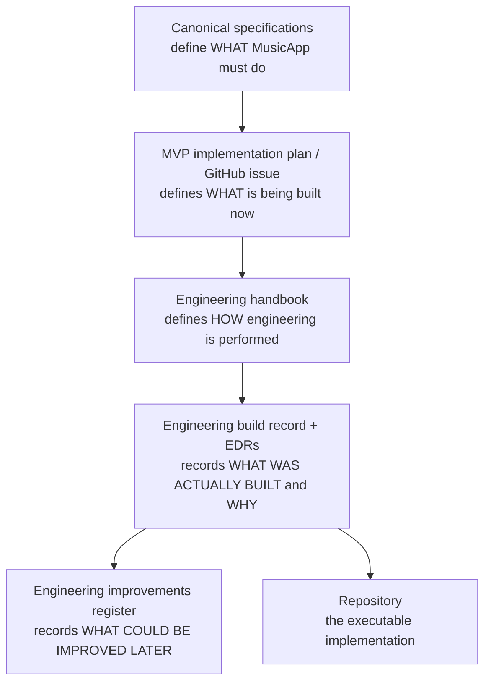

# MusicApp engineering handbook

| Field | Value |
|---|---|
| Document ID | `ENG-HANDBOOK` (provisional; engineering-control documents carry no governed identifier, [Governance §4.1](../00-governance/README.md#41-engineering-control-documents)) |
| Type | Standard (STD) — engineering practice, not product behavior |
| Status | Proposed |
| Owner | Engineering (interim: repository maintainers) |
| Version | 0.1.0 |
| Last Reviewed | 2026-09-25 |
| Applies To | Every human engineer and AI agent (Claude, Cursor, or other) changing code, schema, configuration, or tests in this repository |
| Supersedes / Superseded By | None |

## 1. Purpose and scope

This handbook says **how** MusicApp is engineered. It does not say **what** MusicApp does. Product behavior, business rules, state machines, permissions, and financial outcomes are owned by the canonical specifications under `docs/01-foundation/` through `docs/10-notifications/` and `docs/09-moderation-trust-safety/disputes.md`. When this handbook mentions a product rule, it links to the owning specification and does not restate it as its own.

This handbook is written for the repository as it exists on 2026-09-25: an Express 5 backend in one file ([`backend/Index.js`](../../backend/Index.js)), eight SQL migrations, a React 19 frontend mostly in one file ([`frontend/src/App.tsx`](../../frontend/src/App.tsx)), and no tests, no CI, and no backend lint. Each section keeps **Current** (verified in the repository) separate from **Target** (what new and changed code must do). Target statements are standards for new work. They are not claims that the code already meets them.

Companion documents:

- [Engineering build record](engineering-build-record.md): what has actually been built, how it works, and why.
- [Engineering improvements register](engineering-improvements.md): technical improvements someone recommended that are **not** authorized for implementation.
- [`AGENTS.md`](../../AGENTS.md): the per-issue workflow, stop conditions, and Definition of Done.

## 2. Authority and precedence

Resolve an engineering question in this order and stop at the first source that answers it:

1. **Governance**: [`docs/00-governance/README.md`](../00-governance/README.md).
2. **Canonical domain specifications**: product and architecture authority, including each specification's `SEC-*`, `AUD-*`, and `REQ-*` requirements.
3. **The MVP implementation plan and the approved implementation issue**: [`mvp-implementation-plan.md`](../19-implementation-planning/mvp-implementation-plan.md) and the issue's acceptance criteria. If an issue contradicts the specification it cites, the specification wins ([`AGENTS.md`](../../AGENTS.md) Section 1).
4. **This engineering handbook**: engineering practice.
5. **The engineering build record and its EDRs**: implementation reality and the reasons behind it.
6. **The existing repository**: evidence of current state, never authority over target product behavior.

Rules for applying this order:

- The handbook controls engineering practice. It cannot override a product requirement. If following the handbook would change user-visible behavior, the specification is the authority and the handbook needs an amendment (Section 21).
- The build record states facts about the implementation. An EDR explains an implementation choice. Neither one authorizes a product change.
- Existing code shows what the system does today. It is not proof that this behavior is correct.
- **Surface a conflict. Do not resolve it silently.** If two sources disagree, record the conflict in the PR description or an issue comment and follow the stop conditions in [`AGENTS.md`](../../AGENTS.md) Section 4. Never quietly pick whichever source is easiest to implement.

## 3. Document relationship



*Figure 1: How the documents relate. Each layer is constrained by the layers above it. The improvements register can propose changes but cannot authorize them.*

## 4. Engineering principles

| Principle | What it means in this repository |
|---|---|
| Correctness before cleverness | Choose the implementation that is plainly correct and easy to review. MusicApp holds other people's money, so a clever shortcut costs more than the time it saves. |
| Explicit domain boundaries | Each domain owns its own state ([System Architecture §7](../01-foundation/system-architecture.md#7-domain-ownership-matrix), [§9](../01-foundation/system-architecture.md#9-architecture-boundaries)). One domain never writes another domain's tables directly. Escrow never edits project content, and Projects never moves money. |
| Smallest change that satisfies the approved issue | Implement the issue's acceptance criteria and the specification it cites, and nothing more. |
| No speculative abstraction | Do not build a generic framework, plugin system, or base class until two or more real call sites need it. The target shared infrastructure the specifications name (outbox, inbox, idempotency keys, `authorize()`, provider adapters) is required abstraction, not speculation. |
| No premature optimization | Section 16. Measure first. |
| Preserve working architecture | Extend what exists unless there is evidence for replacing it (Section 20). |
| No unrelated refactoring | A feature PR does not reformat, rename, or restructure code outside its scope. |
| Security by default | New routes deny by default and require authentication unless a specification explicitly marks them public ([Authorization §21](../02-users-roles-permissions/authorization.md#21-public-and-anonymous-access)). |
| Server-side authorization | The server decides every permission from live data. Client state, hidden UI, and token claims are never sufficient on their own. |
| Auditable, idempotent money | Every financial command is idempotent, runs in a transaction, is recorded in the ledger, and is audited (Section 12). |
| Database-enforced critical invariants | Enforce an invariant in the database when losing it would corrupt money, ownership, or agreed terms. The existing pattern, `projects_no_self_dealing` and `protect_locked_milestones`, is the model. |
| Deterministic state transitions | State changes only through an explicit transition that has a stated precondition. Any transition the state machine does not list is rejected. |
| Explicit errors, observable failures | Return an explicit error when an operation fails. Never swallow a failure. Log every unexpected failure with enough context to diagnose it (Section 15). |
| Safe migrations | Prefer additive migrations. Stage destructive changes. Never rewrite history (Section 18). |
| Test behavior | Test the behavior the acceptance criteria describe, not private implementation details (Section 14). |
| Backward compatibility where required | Clients, stored rows, and applied migrations that exist today keep working unless an approved issue retires them. |
| Incremental evolution over rewrites | Move toward the target in reviewable steps. MVP-001's decomposition of `backend/Index.js` without behavior change is an example. |

## 5. Repository structure

### 5.1 Current (verified 2026-09-25)

```text
musicapp_1738_sep/
├── AGENTS.md                 # Agent operating instructions
├── README.md                 # Local setup (Docker Postgres, npm backend, pnpm frontend)
├── docker-compose.yml        # PostgreSQL 16 only; local development credentials
├── backend/                  # Node.js, CommonJS, Express 5, npm (package-lock.json)
│   ├── Index.js              # The whole backend: config, requireAuth, 12 routes, validation, SQL
│   ├── .env.example          # DB_*, JWT_SECRET (blank), JWT_EXPIRES_IN
│   └── db/
│       ├── db.js             # pg Pool; loads dotenv
│       ├── migrate.js        # Applies db/*.sql in filename order; tracks schema_migrations
│       └── 001…008_*.sql     # Migrations, each wrapped in BEGIN/COMMIT
├── frontend/                 # React 19, Vite 7, TypeScript 5.9, pnpm (pnpm-lock.yaml)
│   ├── src/App.tsx           # All screens, types, and state (~1,800 lines)
│   ├── src/api/api.js        # fetch wrapper; API_BASE hardcoded to http://localhost:4000
│   ├── src/main.tsx, *.css
│   ├── eslint.config.js      # Flat config, lints *.ts/*.tsx only
│   └── tsconfig*.json        # strict, verbatimModuleSyntax, erasableSyntaxOnly
└── docs/                     # Governance, specifications, plan, engineering controls
```

Not present: shared code between frontend and backend, a test directory, CI configuration, a Dockerfile for either application, a formatter configuration, or a backend linter. For the full inventory, see [Build record §4](engineering-build-record.md#4-current-system-baseline).

### 5.2 Target

The target is per-domain modules ([System Architecture §5](../01-foundation/system-architecture.md#5-current-code-organization-vs-the-modularity-principle)). MVP-001 creates the first backend layout: `backend/src/{domain}/{routes,service,repository}.js`. Until MVP-001 is merged:

- New backend code goes wherever MVP-001's issue text and the build record say it goes. If MVP-001 has not landed and an issue requires a new route, add it in the style of the surrounding routes in `backend/Index.js`. Do not start a competing directory structure.
- Frontend decomposition out of `App.tsx` has no scheduled plan item. New frontend features SHOULD go in new files under `frontend/src/` organized by feature (for example `frontend/src/projects/`) rather than growing `App.tsx`. Moving existing code out of `App.tsx` is a refactor and needs its own issue (Section 20).

Do not write a target directory into the build record until it exists.

## 6. Language standards

### 6.1 Backend: JavaScript (CommonJS)

**Current:** the backend is plain JavaScript (`"type": "commonjs"`, `require`/`module.exports`). There is no TypeScript, no JSDoc type checking, no linter, and no formatter.

**Standards:**

- Stay on JavaScript and CommonJS. Moving the backend to TypeScript or ESM is a significant engineering decision. It needs an approved issue and an EDR, and it is never done as a side effect of a feature.
- Validate every value that crosses a trust boundary (request body, params, query, headers, provider payloads, environment variables) for type, shape, and range before using it. The current hand-written checks are the baseline pattern: `typeof` checks, `Number.isInteger`, `UUID_PATTERN`, and the pure `validateMilestonesInput` function that returns `{ ok, error | value }`. Adding a schema-validation library is a dependency decision (Section 17).
- Validation functions are pure and run before any database access, as `validateMilestonesInput` does.
- Use `===`, `const` by default, and `let` only when a value is reassigned. Never use `var`.
- Treat `null` and `undefined` deliberately. Normalize optional input to `null` before persisting it, as the milestone `description` and `due_at` handling does.
- Represent a state or enum value as a string that matches the PostgreSQL enum label exactly (for example `'draft'` or `'planned'`). Never invent display names for stored values.

### 6.2 Frontend: TypeScript

**Current:** `tsconfig.app.json` sets `strict`, `noUnusedLocals`, `noUnusedParameters`, `noFallthroughCasesInSwitch`, `verbatimModuleSyntax`, and `erasableSyntaxOnly`. `allowJs` is on and `checkJs` is not, so `src/api/api.js` is not type-checked. `pnpm lint` and `tsc -b` both passed on 2026-09-25.

**Standards:**

- Do not weaken `tsconfig` strictness or ESLint rules to make code compile.
- `erasableSyntaxOnly` forbids TypeScript `enum`, `namespace`, and parameter properties. Model closed sets as string-literal unions that mirror the database enum exactly, as `ProjectState` and `MilestoneState` in `App.tsx` already do.
- `verbatimModuleSyntax` requires `import type` for type-only imports.
- Do not add a new `any`. Type unknown data as `unknown` and narrow it (see `getErrorMessage(err: unknown)`). Casting an API response (`as Session`) is the current, unchecked pattern. New code SHOULD narrow or validate a response before trusting it, especially for money and state fields.
- Name domain types after the specification's terms and the database columns (`Project`, `ProjectMilestone`, `price_amount`). Do not rename fields between API and UI.
- Use the non-null assertion `!` only where the DOM guarantees the value, as in `main.tsx`.

### 6.3 Both tiers

- **Functions:** one responsibility per function. A route handler that parses, authorizes, runs business rules, and runs SQL inline is the current pattern that MVP-001 exists to break up. New code separates those concerns (Section 7).
- **Naming:** follow what already exists. Use `camelCase` for JavaScript and TypeScript identifiers, `snake_case` for database columns and JSON fields, `SCREAMING_SNAKE_CASE` for module constants (`POSTGRES_INT_MAX`, `PROJECT_CURRENCY`), and `kebab-case` for docs and new non-component files.
- **Imports:** there is no shared package between tiers today. Do not import across `frontend/` and `backend/`. Values mirrored across tiers (`POSTGRES_INT_MAX`, `PROJECT_CURRENCY`) carry a comment naming the other copy. Keep those comments accurate.
- **Async:** use `async`/`await`. Never create a promise and let it float (fire-and-forget). Express 5 forwards a rejected handler promise to its error handler. Routes still catch expected errors and map them to explicit responses.
- **Comments:** explain *why*: a constraint, a spec rule, or a security reason. The existing comments on `PROJECT_CURRENCY`, the safe-404 in lock-milestones, and `parseBudgetToMinorUnits` are the model. Do not narrate what the code obviously does.
- **Dead code:** do not leave commented-out code or unused exports behind. Remove code that your issue makes obsolete. Removing code outside your scope needs its own issue.
- **Formatting:** no formatter is configured. Match the file you are editing: `App.tsx` and `Index.js` use double quotes and semicolons, while `main.tsx` and `eslint.config.js` use single quotes and no semicolons. Do not reformat lines you are not otherwise changing. Adopting a formatter is tracked as [ENG-IMP-004](engineering-improvements.md#eng-imp-004-no-backend-lint-and-no-repository-formatter).
- **Linting:** the frontend runs `pnpm lint` and it must stay clean. The backend has no linter yet (also ENG-IMP-004), which makes review more important.

## 7. Backend engineering

### 7.1 Layer responsibilities

| Layer | Responsibility | Must not |
|---|---|---|
| Route / controller | Parse and validate the request shape, resolve the authenticated actor, call one service operation, map the result or error to HTTP | Contain business rules, SQL, or authorization policy logic |
| Service / domain | Business rules, state transitions, orchestration, the transaction boundary, and emitting audit and domain events | Read `req`/`res`, or depend on Express |
| Repository / data access | Parameterized SQL, explicit column projections, row locking | Make policy or business decisions |
| Authorization | `authorize(actor, action, resource)`, as defined in [Authorization §10](../02-users-roles-permissions/authorization.md#10-policy-evaluation) and [§24](../02-users-roles-permissions/authorization.md#24-policy-enforcement-architecture) (MVP-007) | Be bypassed by a route that "already checked" |

**Current:** every layer lives inline in each route handler of `backend/Index.js`. MVP-001 introduces the separation without changing behavior. Until then, keep new logic in pure helper functions (as `validateMilestonesInput` does) so it can be moved later without being rewritten.

### 7.2 Input validation

- Reject malformed input with `400` before touching the database.
- Check UUID path and body parameters against `UUID_PATTERN` before querying. The current code does this to avoid PostgreSQL `22P02` errors.
- Compare against the same normalized value you persist. For example, trim once and use the trimmed value for both the check and the query.
- Accept an amount only as an integer JSON number within the column's range (Section 12).
- Never accept a server-owned field from the client: actor identity (`buyer_user_id` comes from `req.auth.sub`), currency, state, timestamps, fee values, `external_id`, or anything a specification marks as server-derived ([`BR-AUTHZ-009`](../02-users-roles-permissions/authorization.md) is one example).

### 7.3 Authorization

- Authenticate through the shared middleware. **Current:** `requireAuth` checks the signature, issuer, and audience of the JWT. **Target** ([Authentication §12](../02-users-roles-permissions/authentication.md#12-access-tokens), `SEC-AUTH-002`, MVP-006): also re-check the account's live status on every request.
- Decide permissions from live relationship and state data read inside the request, never from token claims alone ([Authentication §7](../02-users-roles-permissions/authentication.md#7-authentication-principles), `BR-AUTHZ-006`).
- Conceal existence where the specification requires it. Return the same `404` for "does not exist" and "exists but you have no relationship to it". `POST /projects/:projectId/lock-milestones` does this today and is the reference pattern ([Authorization §27](../02-users-roles-permissions/authorization.md#27-failure-handling)).
- Every new or changed action needs an authorization test for both allow and deny (Section 14).

### 7.4 Transactions and concurrency

- A command that writes more than one row, or that reads state and then writes based on it, runs in one transaction on one pooled client, following the `BEGIN`/`COMMIT`/`ROLLBACK`/`client.release()` pattern in `POST /auth/signup`, `POST /projects`, and lock-milestones.
- Lock the rows whose state you are about to decide on (`SELECT … FOR UPDATE`) **inside** the transaction, before you check any preconditions. Lock-milestones is the reference pattern. A read done before `BEGIN` does not protect a later write.
- When a command locks several aggregates, lock them in the fixed order the owning specification defines ([Escrow §22](../06-payments-escrow/escrow.md#22-idempotency-and-concurrency), [Milestones §24](../05-projects-milestones/milestones.md#24-concurrency-and-idempotency), [Projects §24](../05-projects-milestones/projects.md#24-concurrency-and-idempotency)).
- Use optimistic expected-version checks where the specification requires them, and return a safe, retryable `409` when the version is stale.
- Always release the client in `finally`. Do not issue `ROLLBACK` in a way that can hide the original error (see [ENG-IMP-006](engineering-improvements.md#eng-imp-006-transaction-boilerplate-is-duplicated-and-rollback-can-mask-the-original-error)).

### 7.5 Idempotency, state transitions, events, and audit

- Commands that a specification marks as idempotent use the shared idempotency-key store from MVP-003 once it exists. Replaying the same key returns the original result and has no second effect.
- State changes go through one transition function per aggregate. It enforces the specification's transition matrix exactly and rejects any unlisted edge with `409` ([Projects §11](../05-projects-milestones/projects.md#11-project-lifecycle-and-transitions), [Milestones §12](../05-projects-milestones/milestones.md#12-milestone-transitions)).
- Write the audit record (`AUD-*`) in the **same transaction** as the state change it records. An audit write that can fail independently is not an audit trail.
- Domain events that other domains consume go through the transactional outbox (MVP-003), written in the same transaction as the state change. A handler never calls another domain's service after commit and assumes the call succeeds.

### 7.6 Errors, logging, retries, external integrations

- **Errors:** return the existing JSON shape `{ "error": "<safe message>" }` with an accurate status (Section 10.4). Map known PostgreSQL error codes to client errors, as the existing handlers do. Never return `err.message`, `err.detail`, SQL text, stack traces, or constraint internals to a client. Existing responses that echo `err.detail` are a known finding ([Authentication §22](../02-users-roles-permissions/authentication.md#22-failure-handling)) and must not be copied into new code.
- **Logging:** Section 15.
- **Retries:** retry only operations that are idempotent, and only on transient failures. Use bounded attempts with backoff. Never retry a non-idempotent financial call without an idempotency key.
- **External integrations** (payment, storage, email): code against the provider-neutral adapter interface the specification defines ([Payments §8](../06-payments-escrow/payments.md#8-provider-adapter-architecture), [Assets §14](../03-identity-profiles-verification/assets-and-media.md#14-storage-architecture), [Notifications §7](../10-notifications/notifications.md#7-channels)). Tests use a mock or local adapter. Do not select a real provider. That is a stop condition ([`AGENTS.md`](../../AGENTS.md) Section 4).

## 8. Frontend engineering

**Current:** one `App` component with `useState`-driven views (`AppState`, `AuthenticatedView`). All screens are functions in `App.tsx`, and all network calls go through `apiGet`/`apiPost` in `src/api/api.js`. The JWT is stored in `localStorage` (`SEC-USERS-005`; target in [Authentication §19.3](../02-users-roles-permissions/authentication.md#193-browser-token-delivery--target-vs-current)). There is no router, server-state library, form library, or component library, and no frontend test runner.

**Standards:**

- **Component responsibility:** a component renders one screen or one reusable piece of it. Data fetching, form state, and presentation can live in one screen component while it stays readable. Split it once a component mixes several unrelated concerns.
- **Feature boundaries:** put new features in feature files and folders (Section 5.2). A feature does not reach into another feature's internal state.
- **API interaction:** every call goes through the shared API client. Do not scatter raw `fetch` calls through components. The client surfaces the server's `{ error }` message, and screens display it.
- **Server state vs. local state:** today, server data is fetched in `useEffect` and held in `useState`, with a reload key used to refetch. Keep that pattern until an approved issue adopts a server-state library (EDR required). Never cache money or state values across screens in a way that can show stale commercial terms.
- **Forms:** validate on the client for usability (the budget and milestone parsers are the model), and always rely on the server for correctness. Client validation mirrors server limits and never replaces them.
- **Loading, error, and empty states:** every screen that fetches data renders all three. The existing screens already do this, and new ones must too.
- **Accessibility:** use a `<label htmlFor>` for every input, `role`/`aria-selected` on tab-like controls, and `aria-hidden` on decorative elements, as the current auth tabs and form fields already do. Everything must work from the keyboard, and dynamic errors must be announced. Colour is never the only signal.
- **Authorization-aware UI:** hide or disable actions the actor cannot take, for usability only. **Frontend authorization never substitutes for backend authorization**, and every hidden action is still enforced on the server.
- **Truthful display:** show state and money exactly as the server returns them. Do not relabel a stored state ([`SEC-PROJECTS-018`](../05-projects-milestones/projects.md#29-security-findings) records a current mislabeling).
- **Reusable components:** extract a shared component once a second real use appears. Do not build a design system ahead of need.
- **Testing:** Section 14. MVP-002 introduces the runner.

## 9. Database engineering

**Current:** PostgreSQL 16 with `pgcrypto` and `citext`. UUID primary keys come from `gen_random_uuid()`, and every business table also has a unique, prefixed `external_id` generated by the application (`usr_`, `prf_`, `prj_`, `mls_` followed by 20 hex characters). Constraints are named, and state columns use enum types. Money columns are 32-bit `INT`, and `currency` is unrestricted `TEXT`. One invariant trigger exists (`protect_locked_milestones`). No trigger maintains `updated_at`.

**Standards:**

- **Change the schema only through migrations.** Never change schema by hand in any shared environment. New migrations take the next number (`009_…sql`), wrap themselves in `BEGIN; … COMMIT;`, and follow the existing idempotent guards (`IF NOT EXISTS`, `DO $$ … pg_type/pg_constraint check $$`).
- **Never edit an applied migration.** Once a migration file is merged to a shared branch, its content is frozen. Fix mistakes with a new migration. The runner tracks migrations by filename only and would not notice an edit ([ENG-IMP-001](engineering-improvements.md#eng-imp-001-migration-runner-cannot-detect-edited-migrations-and-records-applied-state-non-atomically)).
- **Foreign keys:** every reference to another table is a declared foreign key, with an `ON DELETE` behavior the specification supports. Use `RESTRICT` for financial, audit, and evidence records. Do not add `CASCADE` from a parent onto financial or audit history. Existing cascades on escrow tables are known findings ([Escrow §24](../06-payments-escrow/escrow.md#24-target-data-model)). A column reserved for a table that does not exist yet (`profile_photo_asset_id`, `verification_documents.asset_id`) gets its foreign key in the migration that creates that table.
- **Uniqueness:** enforce natural keys and "one current row" rules with unique constraints or partial unique indexes (`verification_documents_one_current_per_slot` is the model). Use `CITEXT` where the specification requires case-insensitive uniqueness.
- **CHECK constraints:** encode business-rule invariants that can be stated per row (`projects_no_self_dealing`, `escrow_allocations_totals_within_allocated`). Name every constraint `<table>_<rule>` so errors and documentation can cite it.
- **Indexes:** index every foreign key used for lookups and every list query's filter and sort (`projects_buyer_created_at_idx` is the pattern). Do not add an index without a query that needs it.
- **Timestamps:** `TIMESTAMPTZ NOT NULL DEFAULT now()` for `created_at`/`updated_at`. `updated_at` must be maintained on every update. The target is a trigger ([Milestones §26](../05-projects-milestones/milestones.md#26-target-data-model)). Until then, set it explicitly in every `UPDATE`.
- **Money and currency:** follow [`REQ-ESCROW-003`](../06-payments-escrow/escrow.md#7-currency-and-money-representation) exactly: signed 64-bit integer minor units with a currency and exponent snapshot, and one currency enforced by constraint across related rows. Do not invent another representation (Section 12).
- **Enums:** add values with a migration (`ALTER TYPE … ADD VALUE`). Never rename or remove a value that stored rows may hold without a staged migration (Section 18). Application code uses the exact enum labels.
- **Immutable and append-only records:** ledger, audit, term-version snapshots, decisions, and submissions are append-only where their specification says so, enforced by a trigger that rejects `UPDATE`/`DELETE` (target for `escrow_ledger`: MVP-026). A comment saying "immutable" is not enforcement.
- **Soft delete and tombstones:** where a specification requires retention (messages, assets under hold, evidence), use its tombstone or state model and never `DELETE`.
- **Concurrency:** Section 7.4. Put the invariant in the database when two concurrent requests could both pass an application check.
- **Transaction boundaries:** a state change and its ledger, audit, and outbox rows commit together or not at all.
- **Migration safety:** Section 18.

## 10. API engineering

**Current:** JSON over HTTP on port 4000, unversioned paths (`/auth/*`, `/users`, `/profiles`, `/projects`), `Authorization: Bearer <JWT>`, `{ error }` failures. List endpoints are either unbounded (`GET /projects`) or fixed at `LIMIT 100` (`GET /profiles`), and none are paginated. `docs/13-api/` has no content yet.

**Standards:**

### 10.1 Requests, authentication, authorization

- Validate every request (Section 7.2).
- Every non-public route requires authentication, and every resource access is re-verified against the live relationship. Holding an identifier is never permission.
- **IDOR protection:** load a resource *scoped by the actor's relationship* (for example `WHERE pr.buyer_user_id = $1 OR pr.seller_user_id = $1`, as `GET /projects` does) or load it and deny with a concealing `404`. Never load a resource by ID alone and return it.

### 10.2 Responses

- Return explicit column projections. Never use `RETURNING *` or `SELECT *` in new code: `SAFE_PROJECT_FIELDS`/`SAFE_MILESTONE_FIELDS` are the model. Existing `RETURNING *` in `POST /profiles` and signup is a known field-exposure finding ([Profiles](../02-users-roles-permissions/profiles.md)), not a pattern to copy.
- Filter sensitive fields per [Authorization §22](../02-users-roles-permissions/authorization.md#22-field-level-authorization). Never return password hashes, token material, verification document internals, or another user's private contact data.
- Keep response shapes stable. The existing success shapes wrap resources in named keys (`{ project, milestones }`, `{ profiles: [...] }`), and new endpoints follow that style.

### 10.3 HTTP semantics

`GET` is safe and has no side effects. `POST` creates something or runs a command. Use `201` for creation, `200` for success, `400` for invalid input, `401` when unauthenticated, `403` when a permission is denied and existence is not secret, `404` for not found or concealed, `409` for a state, version, or uniqueness conflict, and `500` for an unexpected failure. Command routes are named for the command, following the established style (`POST /projects/:projectId/lock-milestones`).

### 10.4 Errors

The `{ "error": string }` shape is the current contract. A new API-wide error contract (machine-readable codes, field errors) is a cross-cutting standard: it needs a `13-api/` specification or ADR ([Governance §14](../00-governance/README.md#14-decision-records-adrs)). An EDR is not enough. Until then, add fields only additively and keep `error` present.

### 10.5 Pagination, filtering, idempotency, versioning

- Every new list endpoint is bounded: a server-enforced page size, stable ordering, and a cursor or offset parameter. Filtering is server-side (MVP-013 replaces client-side-only profile search).
- A command that a specification marks as idempotent accepts an idempotency key (MVP-003 defines the mechanism). It rejects the same key with a different payload and replays the stored result for the same payload.
- **Versioning:** there is no version prefix today. Evolve additively. A breaking change to a consumed contract needs an approved issue that states the migration path for clients. Adopting a versioning scheme is an ADR-level decision.

## 11. Security engineering

Canonical `SEC-*` findings in each domain specification remain authoritative. This section sets the engineering baseline that every change must meet.

| Area | Standard | Current evidence |
|---|---|---|
| Authentication | Only the shared middleware authenticates. Verify tokens for signature, issuer, audience, and algorithm. Target: short-lived access tokens and server-tracked refresh ([Authentication §12–§14](../02-users-roles-permissions/authentication.md#12-access-tokens)). | `requireAuth` checks issuer and audience. There is no algorithm allowlist (`SEC-AUTH-009`) and no revocation. |
| Authorization | Deny by default. Decide on the server with live data, one `authorize()` path (MVP-007), and least privilege for every role and credential. | Inline checks. `POST /users`, `GET /users`, `POST /profiles` are unauthenticated (`SEC-001`, `SEC-AUTHZ-003`). |
| IDOR | Relationship-scoped queries or concealing `404` (Section 10.1). | Lock-milestones and `GET /projects` follow this. |
| Secrets | Secrets come from the environment only. Never commit them, log them, or put them in docs. `.env.example` shows the shape with blank secret values. Fail fast when a required secret is missing. | `JWT_SECRET` fails fast when blank. Weak values are not rejected (`SEC-AUTH-006`). DB settings silently fall back to defaults ([ENG-IMP-005](engineering-improvements.md#eng-imp-005-configuration-is-loaded-implicitly-and-silently-falls-back-to-defaults)). |
| Environment variables | Read and validate all configuration in one place at startup. No silent production fallbacks. | Read in two files, with order-dependent `dotenv` loading (ENG-IMP-005). |
| Input validation | Section 7.2. Parameterized SQL only. Never build SQL from input strings. | All queries use `$n` parameters. Only the constant field lists are interpolated. |
| SQL injection | Never interpolate a value into SQL. Interpolate only module-level constant identifiers such as `SAFE_PROJECT_FIELDS`. | Compliant. |
| Output encoding / XSS | Render through React's escaping. Never use `dangerouslySetInnerHTML` with user content. Treat anything in the page origin as able to read `localStorage`. | No `dangerouslySetInnerHTML`. The token is in `localStorage` (`SEC-USERS-005`). |
| CSRF | Not applicable while authentication uses bearer headers. Required before any cookie-based session ships ([Authentication §19.4](../02-users-roles-permissions/authentication.md#194-cors)). | Bearer only. |
| CORS | Origin allowlist from configuration. | `cors()` with no allowlist (`SEC-AUTH-004`). |
| Rate limiting / replay | Rate-limit authentication and every abuse-prone command, as the specifications state. Reject replayed provider events and replayed idempotency keys with a different payload. | None (`SEC-AUTH-005`). |
| SSRF | Never fetch a URL a user supplies from the server. Provider URLs come from configuration. | No outbound fetches exist. |
| File upload / Assets / verification documents | Section 13. Verification documents are the most sensitive files in the system: access only by the owner and an authorized reviewer, every access audited, never public. | No upload surface exists. |
| Financial operations | Section 12. | No financial routes exist. |
| Audit | Record every `AUD-*` requirement in the same transaction as the action it covers. Audit records are append-only. | No audit tables exist. |
| Logging sensitive data | Never log passwords, tokens, full request bodies on authentication routes, verification-document content, payment credentials, or provider secrets. Redact personal data per specification. | `console.error(err)` logs whole error objects, which can include row data in `err.detail`. |
| Dependency risk | Section 17. Run the package manager's audit on every dependency change. | No automated audit exists. |

A change that would weaken an existing control, or that cannot preserve a `SEC-*`/`BR-*` rule, is a stop condition ([`AGENTS.md`](../../AGENTS.md) Section 4).

## 12. Financial engineering

Escrow and Payments hold and move other people's money. These rules are elevated above ordinary engineering practice, and "it was simpler" is never a reason to relax one. The owning specifications are [Escrow](../06-payments-escrow/escrow.md) and [Payments](../06-payments-escrow/payments.md). Where this section and those specifications differ, the specifications win.

1. **No floating-point money.** Store amounts as integer minor units in the currency ([`REQ-ESCROW-003`](../06-payments-escrow/escrow.md#7-currency-and-money-representation)). Parse user input with string and integer arithmetic, as `parseBudgetToMinorUnits` already does. Floating-point division by the exponent is allowed only for display formatting (`Intl.NumberFormat`) and never in anything that is summed, compared, or stored.
2. **Width.** New money columns are `BIGINT`. The current `INT` columns and the matching `POSTGRES_INT_MAX` guards on both tiers are a known gap that MVP-024 and the Escrow migration plan will close. Until then, keep both tiers' guards in sync.
3. **Currency is server-stamped.** Clients never supply or override currency. MVP currency is `INR` (exponent 2), set by `PROJECT_CURRENCY`. Every related row carries the same currency, enforced by constraint once the Escrow schema is hardened.
4. **Immutable ledger.** `escrow_ledger` is append-only and balanced ([`REQ-ESCROW-008`](../06-payments-escrow/escrow.md#13-ledger-architecture)). Correct an error with a compensating entry, never with `UPDATE`/`DELETE`. A database trigger enforces this (MVP-026).
5. **No silent balance mutation.** Balances and totals are projections that only ledger posting maintains, in the same transaction ([`REQ-ESCROW-005`](../06-payments-escrow/escrow.md#9-escrow-aggregate)). No code path sets a balance column directly.
6. **Idempotent financial commands.** Every command has a natural key and an idempotency key ([`REQ-ESCROW-018`](../06-payments-escrow/escrow.md#22-idempotency-and-concurrency), [`REQ-ESCROW-031`](../06-payments-escrow/payments.md#14-idempotency-and-concurrency)). A replay has no second effect.
7. **Transaction boundaries.** The state change, ledger journal, projection update, audit record, and outbox event commit together. Lock rows in the order the specification defines.
8. **Authenticated provider events.** Verify every webhook's signature against the raw body before parsing ([`REQ-ESCROW-032`](../06-payments-escrow/payments.md#15-secret-handling-and-webhook-security)). Match each event against a known owned object with the same amount and currency. Quarantine and alert on a mismatch. Never apply it.
9. **Replay- and reorder-safe events.** Deduplicate provider events by event ID using the inbox from MVP-003. Handlers tolerate out-of-order delivery by checking current state, not by assuming sequence.
10. **Release authorization is separate from payout.** A release authorization (approval, non-response authorization, dispute instruction) is a different fact from the payout that executes it ([Escrow §14](../06-payments-escrow/escrow.md#14-release), [Payments §12](../06-payments-escrow/payments.md#12-refund-and-payout-authorization-boundary)). The authority to create one never implies authority to create the other.
11. **Refunds link to their origin.** A refund references the original funding transaction and the authorizing instruction, as the specifications require ([Escrow §15](../06-payments-escrow/escrow.md#15-refunds)). Cumulative refunds never exceed captured funds.
12. **Reconciliation.** Ledger, projections, and provider records are reconciled on a schedule ([`REQ-ESCROW-020`](../06-payments-escrow/escrow.md#23-audit-events-and-reconciliation), [Payments §16](../06-payments-escrow/payments.md#16-audit-and-provider-reconciliation)). Drift raises an alert and is never auto-corrected silently.
13. **Partial failure is explicit.** If the provider call succeeds and the local commit fails, or the reverse, the system must land in a state it can recognize and recover from (pending, blocked, or quarantined). It must never report success it cannot prove. For example, an instruction against funds already paid out reports `execution_blocked`.
14. **Required tests.** Every financial command has tests for duplicate submission, duplicate provider events, reordered events, a concurrent competing command (release vs. refund, approval vs. dispute), a currency or amount mismatch, and a partial failure at each external boundary.
15. **Unspecified money movement is a stop condition.** If no specification section authorizes a movement, hold, release, or refund, do not build it ([`AGENTS.md`](../../AGENTS.md) Section 4). Fee rates, compensation for cancellation, and post-payout liability are open product decisions (MVP-027, MVP-030, MVP-036). Do not default them.

## 13. File and Asset engineering

Owning specification: [Assets and media](../03-identity-profiles-verification/assets-and-media.md). **Current:** no `assets` table, upload route, storage adapter, or file handling exists. `profiles.profile_photo_asset_id` and `verification_documents.asset_id` are UUID columns without foreign keys, waiting for that table.

- **Canonical identity:** an Asset (and its versions) is the only identity of a file. Other domains reference an Asset version by ID and never store paths, URLs, or bytes.
- **Storage is separated from domain references.** A storage key or locator is internal to the storage adapter and never returned to clients as a durable identifier. The adapter is provider-neutral (Assets §14), and no provider is selected.
- **Authorization:** every upload and download is authorized against the Asset's purpose, owner, and binding ([Assets §17](../03-identity-profiles-verification/assets-and-media.md#17-asset-access-policy)). Having the Asset ID is not permission.
- **Upload validation** ([Assets §11](../03-identity-profiles-verification/assets-and-media.md#11-upload-architecture), [§13](../03-identity-profiles-verification/assets-and-media.md#13-file-validation-and-content-security)): enforce the size ceiling before the whole body is buffered. Detect type from content on the server and never trust a declared MIME type or extension. Use a per-purpose allowlist; the existing `verification_documents_mime_allowed` constraint is one example. Guard against decompression bombs and oversized decoded dimensions or durations.
- **Security hooks:** an Asset is not `Ready` until its validation and scan hooks pass. The scanning engine is a provider decision.
- **Lifecycle, evidence, deletion:** holds (dispute, financial, legal, moderation) block physical deletion. Deletion is soft first and physical only when no hold remains ([Assets §18](../03-identity-profiles-verification/assets-and-media.md#18-retention-archival-restoration-and-deletion)). Evidence is referenced, never copied.
- **Delivery:** private Assets are delivered only through short-lived signed or proxied access after authorization, with `X-Content-Type-Options: nosniff` and the server-detected type. Public delivery is limited to purposes the specification marks public.

## 14. Testing strategy

**Current:** no tests exist, and `backend/package.json`'s `test` script is a placeholder that exits `1`. MVP-002 adds the runners and MVP-004 adds CI. The choice of test tooling is recorded as an EDR in MVP-002.

### 14.1 Required layers

| Layer | Required for | Notes |
|---|---|---|
| Unit | Pure validation, parsing, calculation, and policy functions | For example `validateMilestonesInput`, `parseBudgetToMinorUnits`, `authorize()` rules |
| Service / domain | Business rules and state transitions | Every listed transition succeeds and every unlisted one is rejected |
| API / integration | Every route, against a real PostgreSQL test database | Real HTTP, real SQL, no mocked database for constraint behavior |
| Database constraint | Every CHECK, unique, foreign-key, and trigger invariant | Assert the database rejects the violation even when application checks are bypassed |
| Authorization | Every new or changed action | Allow for the right actor. Deny (or concealing `404`) for an unrelated user, the wrong role, and an inactive account |
| State transition | Every state machine touched | Full matrix coverage for the transitions in scope |
| Financial idempotency | Every financial command and provider event | Section 12, item 14 |
| Concurrency | Every race a specification names | Parallel requests, exactly one winner, and a safe `409` for the loser |
| Frontend behavior | Every screen or flow changed | Rendering, validation messages, loading, error, and empty states, from the user's point of view |
| End-to-end vertical slice | MVP-051 onward | The three paths in [plan §9](../19-implementation-planning/mvp-implementation-plan.md#9-mvp-vertical-slice-checkpoint) |

### 14.2 Rules

- **Map every acceptance criterion to at least one test.** The PR lists the mapping. A green suite is not evidence when required behavior has no test.
- Every `BR-*` and `SEC-*` the issue touches has a test that would fail if the rule were broken.
- Tests assert observable behavior: HTTP status and body, database rows, and emitted events. They do not assert private function calls.
- Tests are deterministic. Control time, randomness, and ordering. A flaky test is a defect, not something to retry until it passes.
- Never weaken, skip, or delete a test to get a green build ([`AGENTS.md`](../../AGENTS.md) Section 3).
- Test data never contains real personal data or real secrets.

## 15. Observability

**Current:** `console.log` at startup and in the migration runner, and `console.error(err)` in route catch blocks. `GET /` and `GET /db-health` exist. There are no request IDs, no structured logs, no metrics, and no error-reporting service. No observability provider has been selected, and none should be selected as a side effect of a feature.

**Required behavior (provider-neutral):**

- **Structured logs:** a single logger with levels. Each entry is a JSON-serializable object containing a timestamp, level, message, and request context. It replaces direct `console.*` in new code once the logger is introduced (an EDR records the choice).
- **Correlation:** accept a request ID header or generate one, attach it to every log line and outbound call, and return it in the response.
- **Error reporting:** unexpected errors are logged once with stack and context, using the redaction rules in Section 11.
- **Domain events:** every state transition and emitted event is visible in logs by aggregate ID.
- **Financial tracing:** every financial command logs its idempotency key, aggregate IDs, and outcome. Ledger journals can be traced back to the command and provider event that produced them.
- **Audit records** are data, not logs. They live in the database per the `AUD-*` requirements. Logs never replace them.
- **Metrics:** request rate, error rate, latency, and domain counters (for example failed webhook verifications and reconciliation drift) once a metrics sink exists.
- **Health checks:** liveness (`GET /`) and readiness (`GET /db-health`). Health responses must not return internal error messages.

## 16. Performance

- Measure before optimizing. Record the evidence in the PR, and in an EDR if the change affects the design.
- Avoid N+1 queries. Fetch related rows with a join or a single `IN`/`ANY` query. The existing per-milestone `INSERT` loop inside one transaction is acceptable at MVP scale.
- Back every list query with an index that matches its filter and sort.
- Every list endpoint is paginated and bounded (Section 10.5). No query may return an unbounded set.
- Frontend: fetch only what the screen needs, avoid duplicate requests, and do not over-fetch payloads.
- Cache only with a clear invalidation rule. Never cache authorization decisions, money, or state across requests.
- Document any performance-sensitive decision (denormalization, materialized projection, cache) in an EDR.

## 17. Dependencies

The dependency set is small today. The backend has `express`, `pg`, `jsonwebtoken`, `bcryptjs`, `cors`, and `dotenv`. The frontend has `react` and `react-dom` plus Vite, TypeScript, and ESLint tooling. Before adding a dependency, answer these questions in the PR:

- Can the existing code, the platform (Node's `crypto`, `fetch`), or a current dependency already do it?
- Is the package maintained, widely used, and free of known unpatched vulnerabilities?
- What does it cost at runtime and in bundle size?
- Is it actually needed, or is the functionality trivial enough to write?
- Is its license compatible?

Do not add libraries for trivial functionality. Keep the backend on npm (`package-lock.json`) and the frontend on pnpm (`pnpm-lock.yaml`), and commit lockfile changes together with the manifest change. Dependency upgrades are their own issue, never bundled into feature work. Record a significant dependency (framework, validation, logging, testing, ORM or query builder, provider SDK) as an EDR.

## 18. Migrations and compatibility

- **Additive first.** Add columns as nullable or with a default. Add constraints `NOT VALID` and validate them in a later step when existing rows may violate them.
- **Backfills** are explicit. Put them in the migration, or in a documented one-off script referenced from the migration, and make them idempotent.
- **Staged destructive changes.** Expand, then migrate readers and writers, then backfill, and only then contract, in a separate, later migration. Call out every `DROP`, lossy type change, or new cascade in the PR description ([`AGENTS.md`](../../AGENTS.md) Section 5). When the specification's migration section does not clearly call for it, stop.
- **Rollback.** The runner has no down-migrations. Each migration's PR states how to recover: usually a forward-fix migration, and for destructive steps, confirmation that the data is preserved elsewhere first.
- **Existing-data compatibility.** Assume shared databases hold rows written by every earlier version (for example historical non-INR currency rows). A new constraint either tolerates them or migrates them first.
- **Never rewrite migration history** once it is on a shared branch or applied anywhere shared: no editing, renaming, reordering, or deleting of applied files.

## 19. Code review

The reviewer is independent of the author: a different agent or a human. The review checks each of these:

| Check | Question |
|---|---|
| Issue scope | Does the diff do exactly what the issue asks, and nothing unrelated? |
| Specification compliance | Does behavior match the cited sections? Are discrepancies flagged, not silently resolved? |
| Acceptance criteria | Does each criterion have a mapped, meaningful test? |
| Authorization | Is every action re-verified against the live relationship, role, and state? Is there a deny test? |
| Security | Do the relevant `SEC-*` findings still hold? No secrets, no leaked internals, no new unauthenticated surface? |
| Data integrity | Are critical invariants enforced by constraint or trigger and wrapped in transactions? |
| Tests | Do they test behavior, and would they fail if the rule were broken? |
| Migration safety | Is the change additive or staged, are destructive steps called out, and are applied files untouched? |
| Performance | Are queries bounded and indexed, with no N+1? |
| Observability | Are failures logged with context and without sensitive data? |
| Engineering documentation | Are the build record, EDR, and ENG-IMP entries updated where [`AGENTS.md`](../../AGENTS.md) Section 5 requires it? |
| Unrelated changes | No drive-by refactors, formatting churn, or dependency bumps? |

**Defect vs. improvement.** A **defect** means the change violates a requirement, a security rule, correctness, or this handbook, and it blocks merge. An **improvement** means the change works and meets the standards, but the reviewer would have done it differently. An improvement does not block merge or force a rewrite unless the current approach creates a material correctness, security, or maintainability problem, which then makes it a defect. Record non-blocking improvements in the [improvements register](engineering-improvements.md). A reviewer does not redesign a feature because they prefer another architecture.

## 20. Refactoring and replacement

**Do not rewrite or rebuild a working subsystem just because a new engineer or agent would have designed it differently.**

Before changing an existing subsystem, read its section in the [build record](engineering-build-record.md). Extend or modify the existing implementation. Refactoring requires evidence, and valid reasons are:

- a correctness defect;
- a security defect;
- inability to satisfy an approved requirement safely in the current structure;
- a demonstrated maintainability problem, with concrete evidence such as repeated defects or duplicated logic that has already diverged;
- a demonstrated performance problem, measured;
- an approved architecture migration (for example MVP-001);
- removal of an implementation that an approved change made obsolete.

Refactoring beyond the minimum an issue requires becomes its own issue. When replacing a subsystem is justified, the replacing PR records why, cites the evidence and the approved issue, preserves a migration or backward-compatibility plan, and updates the build record, including marking any superseded EDR.

## 21. Changing this handbook

This handbook changes only through an approved change that modifies engineering standards: a reviewed PR whose purpose is the standard, or an EDR or ADR that establishes a new one. It is not edited to make a particular implementation pass review, and it is not updated for noise. Every change follows [Governance §10](../00-governance/README.md#10-versioning-rules) versioning.

## 22. Open questions

- Should the backend move to TypeScript? This is not decided and is not assumed. It needs an approved issue and an EDR (Section 6.1).
- Which structured logger, test runner, and validation library should be used? These are deferred to MVP-002 and the first issue that needs each one, with an EDR for each.
- What API-wide error contract and versioning scheme should apply? These are deferred to a future `13-api/` specification or ADR (Section 10.4).

## 23. Version history

| Version | Date | Change | Author |
|---|---|---|---|
| 0.1.0 | 2026-09-25 | Initial engineering handbook, derived from the verified repository state and the canonical specifications. Proposed pending human review. | Engineering (drafted by Claude Code) |
